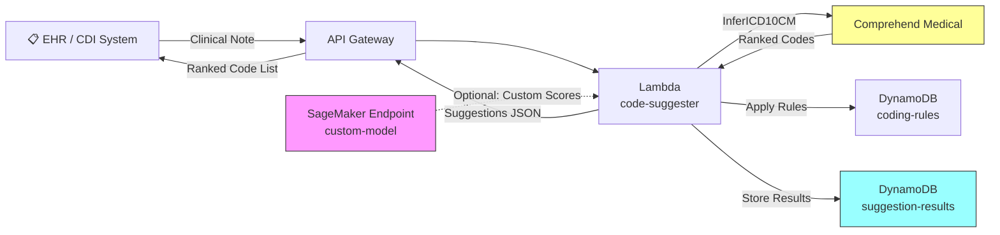

# Recipe 8.3: ICD-10 Code Suggestion

**Complexity:** Simple-Medium · **Phase:** Production Enhancement · **Estimated Cost:** ~$0.01-0.03 per note

---

## The Problem

Here's the scenario that plays out thousands of times per hour across the US healthcare system: a physician finishes seeing a patient, writes up their clinical note, and now needs to assign ICD-10 diagnosis codes. These codes are what justify the visit to the payer. They determine reimbursement. They feed into quality measures. They form the basis of population health analytics. And the physician is staring at a search box, trying to remember whether "Type 2 diabetes with diabetic chronic kidney disease" is E11.22 or E13.22 or something else entirely.

The ICD-10-CM codeset has over 70,000 codes. That's not a typo. Seventy thousand. The specificity is extraordinary. There isn't just "ankle fracture." There's S82.891A (other fracture of right lower leg, initial encounter), S82.891D (subsequent encounter for closed fracture with routine healing), S82.891G (subsequent encounter for closed fracture with delayed healing), and about a dozen more variants for that one anatomical location. A coder or physician is expected to select the most specific applicable code from this enormous taxonomy based on what's documented in the clinical note.

The consequences of getting it wrong are real. Undercoding means leaving revenue on the table, missing the specificity that supports medical necessity, and underrepresenting the complexity of care delivered. Overcoding triggers audits, compliance risk, and potential fraud allegations. Incorrect coding drives flawed analytics: if your population health dashboard says diabetes prevalence is 8% but the real number is 12% because codes were missed, your care management programs are targeting the wrong cohort size.

Professional medical coders exist for exactly this reason. They read clinical notes and select codes. They're trained, certified (CPC, CCS), and essential. But there aren't enough of them. Coder shortages are chronic, backlogs are common, and the volume of documentation keeps growing. Physician self-coding is faster but less accurate. Coders are more accurate but slower and expensive.

What if you could give both of them a smart starting point? Not a replacement. A suggestion engine that reads the clinical note, identifies the likely diagnoses, and presents a ranked list of candidate ICD-10 codes with confidence scores. The human still decides. But instead of searching from zero, they're reviewing and confirming.

That's what we're building.

---

## The Technology: How Machines Suggest Diagnosis Codes

### The Problem Space

At its core, ICD-10 code suggestion is a multi-label text classification problem. You have an input (clinical note text) and you need to predict one or more labels (ICD-10 codes) from a very large label set (70,000+). Each note typically maps to 3-15 codes, and the model needs to identify all of them.

But it's not a clean classification problem. The challenges that make it interesting:

**Massive label space.** Most text classifiers work with tens or hundreds of categories. ICD-10 has 70,000+. Many codes are rarely seen in training data (long-tail distribution). The top 500 codes might cover 80% of encounters, but the remaining 20% is spread across thousands of infrequent codes.

**Hierarchical structure.** ICD-10 is organized hierarchically: chapters, blocks, categories, subcategories. E11 is Type 2 diabetes. E11.2 is Type 2 with kidney complications. E11.22 is Type 2 with diabetic chronic kidney disease. A good system should leverage this hierarchy, not ignore it.

**Implicit information.** Clinical notes don't always state diagnoses explicitly. A note might say "A1C of 9.2%, patient started on metformin, discussed dietary changes" without ever writing the word "diabetes." A human coder infers E11.65 (Type 2 diabetes with hyperglycemia) from the clinical context. The machine needs to make similar inferences.

**Negation and context.** "Patient denies chest pain" does not mean you should suggest codes for chest pain. "History of breast cancer, currently in remission" requires a different code than "active breast cancer." Context and assertion status matter enormously.

**Specificity requirements.** Payers increasingly reject unspecified codes. "Essential hypertension" (I10) might be accepted, but if the note documents "hypertensive heart disease with heart failure" (I11.0), using I10 is undercoding. The system should suggest the most specific code supported by the documentation.

### Technical Approaches

There are several ways to attack this problem, and they've evolved significantly over the past decade:

**Term matching and rule-based systems.** The simplest approach: build a dictionary of clinical terms mapped to ICD-10 codes, scan the note for matches. Fast, interpretable, and terrible at handling synonyms, negation, or implicit documentation. These systems still exist in production (many encoder tools use them as a baseline), but they miss too much.

**Traditional ML classifiers.** Train a model (logistic regression, gradient boosting, or similar) on TF-IDF features or word embeddings. Works reasonably for high-frequency codes but struggles with the long tail and requires substantial feature engineering. You'd typically train separate binary classifiers per code (one-vs-all), which becomes unwieldy at scale.

**Deep learning approaches.** Convolutional neural networks or recurrent neural networks trained on clinical text. Models like CAML (Convolutional Attention for Multi-Label Classification) showed strong results on the MIMIC dataset for automated coding. These handle the large label space better because they learn shared representations across codes.

**Transformer-based models.** The current state of the art. Clinical language models (trained or fine-tuned on medical text) that understand medical context deeply. Models like ClinicalBERT, BiomedBERT, or domain-adapted versions can be fine-tuned for code prediction. They handle negation better, understand context windows, and can be combined with hierarchical label structures.

**Hybrid approaches (most practical).** In production, the best systems combine multiple signals: a medical NLP pipeline extracts entities and their assertion status, a classifier scores candidate codes based on the full note context, and a rule layer applies coding guidelines (specificity requirements, combination rules, sequencing logic). No single model handles all aspects well.

### What "Good" Looks Like

The right mental model for this system is "smart autocomplete for coders," not "automated coding." Here's why the distinction matters:

A production ICD-10 suggestion system typically achieves:
- **Recall at top 10:** 70-85% (the correct codes appear somewhere in the top 10 suggestions)
- **Precision at top 5:** 40-60% (about half the top 5 suggestions are actually correct)
- **Exact match (all codes correct, nothing missing):** 20-35% of encounters

Those precision numbers might look bad until you understand the workflow. The system isn't deciding codes. It's populating a suggestion list that a human reviews. If 3 out of 5 suggestions are right and the human needs to add 2 more and remove 2 wrong ones, that's still dramatically faster than searching from scratch. The coder's job shifts from "find the right codes in a 70,000-item taxonomy" to "review and refine these suggestions." That's a meaningful productivity gain.

### The General Architecture Pattern

```text
[Clinical Note] → [Text Preprocessing] → [Medical NLP] → [Code Prediction] → [Post-processing] → [Ranked Suggestions]
```

**Text Preprocessing.** Clean the note: handle section headers, remove boilerplate (copied forward medication lists, demographics), segment into relevant sections. Not all parts of a note are equally relevant for coding. The Assessment and Plan section carries more weight than the Review of Systems for diagnosis coding.

**Medical NLP.** Extract medical entities (conditions, symptoms, procedures), detect negation and assertion status, identify temporal context (current vs. historical). This reduces the problem from "understand all free text" to "here are the specific medical concepts documented in this note and their clinical context."

**Code Prediction.** The core ML component. Takes extracted entities plus note context and scores candidate ICD-10 codes. May use a combination of entity-to-code mapping (when an entity maps directly to a code), contextual classification (when codes require inference from surrounding text), and hierarchical prediction (predict category first, then refine to specific code).

**Post-processing.** Apply coding rules: check for combination codes (when two conditions documented together require a single combined code), enforce specificity requirements (don't suggest E11.9 if E11.65 is supported), apply excludes and includes logic from ICD-10 guidelines, and rank by confidence.

---

## The AWS Implementation

### Why These Services

**Amazon Comprehend Medical for entity extraction.** Comprehend Medical is AWS's managed medical NLP service. It extracts medical entities (conditions, medications, procedures, anatomy, tests) from clinical text and tags them with attributes including negation, assertion status, and ICD-10 code mappings via the InferICD10CM API. The InferICD10CM API is specifically designed for this use case: it takes clinical text and returns ranked ICD-10-CM code suggestions with confidence scores. It handles negation detection, contextual inference, and multi-code extraction in a single API call. This eliminates the need to build and maintain your own medical NLP pipeline and code mapping infrastructure.

**Amazon S3 for note storage.** Clinical notes arrive from the EHR (via HL7 FHIR, CDA, or flat extract). S3 provides durable, encrypted storage for both incoming notes and processed results. Event-driven triggers enable automatic processing as notes arrive.

**AWS Lambda for orchestration.** The suggestion workflow is stateless and short-lived: receive a note, call Comprehend Medical, apply post-processing rules, return suggestions. Lambda handles this cleanly with automatic scaling. For real-time coding assistance (suggestions appearing as the coder opens a chart), Lambda behind API Gateway provides sub-5-second response times.

**Amazon DynamoDB for suggestion storage and coding rules.** Store suggestion results, coder feedback (accepted/rejected codes), and the configurable coding rules (specificity overrides, facility-specific preferences, payer requirements). DynamoDB's key-value access pattern fits the lookup-heavy access: retrieve suggestions by encounter ID, look up rules by code category.

**Amazon SageMaker for custom model training (optional).** If your organization has labeled coding data (notes paired with final assigned codes), you can train a custom model that learns your specific documentation patterns and coding preferences. Comprehend Medical provides a strong baseline, but organization-specific models trained on your coders' decisions will outperform it for your note styles. SageMaker hosts the model and provides a real-time inference endpoint.

### Architecture Diagram



### Prerequisites

| Requirement | Details |
|-------------|---------|
| **AWS Services** | Amazon Comprehend Medical, Amazon S3, AWS Lambda, Amazon DynamoDB, Amazon API Gateway, (optional) Amazon SageMaker |
| **IAM Permissions** | `comprehend:InferICD10CM`, `s3:GetObject`, `s3:PutObject`, `dynamodb:GetItem`, `dynamodb:PutItem`, `dynamodb:Query` |
| **BAA** | AWS BAA signed (required: clinical notes are PHI) |
| **Encryption** | S3: SSE-KMS; DynamoDB: encryption at rest (default); all API calls over TLS; Lambda environment variables encrypted with KMS for any config secrets |
| **VPC** | Production: Lambda in VPC with VPC endpoints for Comprehend Medical, S3, DynamoDB, and CloudWatch Logs |
| **CloudTrail** | Enabled: log all Comprehend Medical and DynamoDB API calls for HIPAA audit trail |
| **Sample Data** | Synthetic clinical notes. MIMIC-III (PhysioNet) provides de-identified notes for development. Never use real patient notes in dev without proper IRB and BAA coverage. |
| **Cost Estimate** | Comprehend Medical InferICD10CM: ~$0.01 per 100 characters (a typical note is 1,000-3,000 chars, so $0.01-0.03 per note). Lambda and DynamoDB negligible at moderate volume. |

### Ingredients

| AWS Service | Role |
|------------|------|
| **Amazon Comprehend Medical** | Extracts medical entities and suggests ICD-10 codes via InferICD10CM |
| **Amazon API Gateway** | REST endpoint for real-time code suggestion requests |
| **AWS Lambda** | Orchestrates: receives note, calls Comprehend Medical, applies rules, returns suggestions |
| **Amazon DynamoDB** | Stores coding rules, suggestion results, and coder feedback |
| **Amazon S3** | Stores clinical notes (batch processing) and audit records |
| **AWS KMS** | Manages encryption keys for all PHI-containing services |
| **Amazon CloudWatch** | Logs, metrics, alarms for suggestion latency and accuracy tracking |
| **Amazon SageMaker** | (Optional) Hosts custom-trained code prediction model |

### Code

> **Reference implementations:** The following AWS sample repos demonstrate patterns used in this recipe:
>
> - [`amazon-comprehend-medical-fhir-integration`](https://github.com/aws-samples/amazon-comprehend-medical-fhir-integration): Demonstrates integration of Comprehend Medical with FHIR clinical data, including ICD-10 extraction workflows
> - [`amazon-comprehend-examples`](https://github.com/aws-samples/amazon-comprehend-examples): General Comprehend examples including medical NLP patterns

#### Walkthrough

**Step 1: Receive and preprocess the clinical note.** When a coder opens a chart or a note reaches "signed" status in the EHR, the system receives the note text and prepares it for analysis. Clinical notes often contain sections with different relevance for coding: the Assessment and Plan section is the highest-value input, while administrative headers and copied-forward medication lists add noise. This step segments the note and identifies the most relevant sections. If you skip preprocessing and send the entire note (including demographics, allergies list, and boilerplate), you'll get noisier suggestions with more false positives from historical information that shouldn't drive current-encounter codes.

```pseudocode
FUNCTION preprocess_note(raw_note_text):
    // Clinical notes have structure: sections like "Chief Complaint", "History of 
    // Present Illness", "Assessment and Plan", etc. Not all sections are equally
    // relevant for diagnosis coding.
    
    sections = split_into_sections(raw_note_text)
    
    // Prioritize sections that most directly document diagnoses.
    // Assessment/Plan is where physicians state their diagnostic conclusions.
    // HPI describes the current episode. These drive coding.
    priority_sections = ["Assessment and Plan", "HPI", "Hospital Course", 
                         "Discharge Diagnosis", "Impression"]
    
    // Build the text payload: priority sections first (full text),
    // then remaining sections (which provide supporting context).
    coding_text = ""
    FOR each section_name in priority_sections:
        IF section_name exists in sections:
            coding_text = coding_text + sections[section_name]
    
    // Append remaining sections for context (medications, labs confirm diagnoses)
    FOR each section_name, section_text in sections:
        IF section_name NOT in priority_sections:
            coding_text = coding_text + section_text
    
    // Comprehend Medical has a character limit per request (20,000 characters).
    // Truncate if needed, keeping priority content intact.
    IF length(coding_text) > 20000:
        coding_text = truncate_to(coding_text, 20000)
    
    RETURN coding_text
```

**Step 2: Call Comprehend Medical InferICD10CM.** This is the core extraction step. The InferICD10CM API takes clinical text and returns medical condition entities, each mapped to one or more candidate ICD-10-CM codes with confidence scores. It handles negation detection internally (conditions described as absent are typically returned with lower confidence or marked with a NEGATION trait). The API does substantial work in a single call: entity detection, context analysis, code mapping, and confidence scoring. Each returned entity includes traits like NEGATION, DIAGNOSIS, SIGN, or SYMPTOM that help the post-processing layer make decisions.

```pseudocode
FUNCTION get_icd10_suggestions(clinical_text):
    // Call the InferICD10CM API. This returns a list of medical entities,
    // each with one or more ICD-10-CM code suggestions ranked by confidence.
    // The API handles:
    //   - Entity detection (finding condition mentions in text)
    //   - Negation detection ("denies chest pain" won't suggest chest pain codes)
    //   - Contextual scoring (higher confidence when supported by multiple mentions)
    //   - Code specificity (suggests specific codes when text supports them)
    
    response = call ComprehendMedical.InferICD10CM with:
        Text = clinical_text
    
    // Response contains a list of entities, each with:
    //   - Text: the text span that triggered the entity ("Type 2 diabetes")
    //   - Category: MEDICAL_CONDITION
    //   - Traits: [{Name: "NEGATION"}, {Name: "DIAGNOSIS"}] etc.
    //   - ICD10CMConcepts: [{Code: "E11.9", Description: "...", Score: 0.85}, ...]
    
    RETURN response.Entities
```

**Step 3: Filter and score suggestions.** Not every entity Comprehend Medical returns should become a code suggestion. Entities marked with the NEGATION trait should be excluded (the physician documented their absence, not presence). Entities with very low confidence might be noise. Symptoms that are better captured by a more specific diagnosis code should be suppressed if that diagnosis is also present. This step applies clinical coding logic to transform raw entity extraction into a clinically appropriate suggestion list.

```pseudocode
CONFIDENCE_THRESHOLD = 0.30  // Minimum score to include in suggestions.
                              // Low threshold because we want recall; the coder filters.

FUNCTION filter_and_score(entities):
    suggestions = empty list
    negated_concepts = empty list
    
    FOR each entity in entities:
        // Skip entities that are explicitly negated.
        // "Patient denies chest pain" -> NEGATION trait present -> skip.
        IF entity has trait "NEGATION":
            // Track negated concepts so we can suppress related codes too
            append entity.Text to negated_concepts
            CONTINUE to next entity
        
        // Skip entities that are marked as hypothetical or family history
        // unless your coding workflow includes those (some do for Z-codes).
        IF entity has trait "HYPOTHETICAL":
            CONTINUE to next entity
        
        // Process each ICD-10 code suggestion for this entity
        FOR each concept in entity.ICD10CMConcepts:
            IF concept.Score >= CONFIDENCE_THRESHOLD:
                append to suggestions: {
                    code:        concept.Code,
                    description: concept.Description,
                    score:       concept.Score,
                    source_text: entity.Text,       // what in the note triggered this
                    traits:      entity.Traits,     // DIAGNOSIS, SIGN, SYMPTOM, etc.
                    category:    entity.Category
                }
    
    // Deduplicate: same code might be suggested by multiple text spans.
    // Keep the highest confidence instance.
    suggestions = deduplicate_by_code(suggestions, keep="highest_score")
    
    // Sort by confidence, highest first
    sort suggestions by score descending
    
    RETURN suggestions
```

**Step 4: Apply coding rules and specificity logic.** Raw ML suggestions don't know about coding guidelines. ICD-10 has combination codes (one code covers two related conditions), excludes logic (certain codes can't appear together), and specificity requirements (don't use an unspecified code if a more specific one is supported). This step applies configurable rules from the rules table. These rules are maintained by your coding compliance team and reflect both official ICD-10 guidelines and payer-specific requirements.

```pseudocode
FUNCTION apply_coding_rules(suggestions, rules_table):
    // Load coding rules from the configuration store.
    // Rules include:
    //   - Specificity overrides: if E11.65 is suggested, suppress E11.9
    //   - Combination codes: if both "diabetes" and "CKD" appear, suggest E11.22
    //   - Excludes1 pairs: codes that cannot coexist on the same encounter
    //   - Payer preferences: some payers reject certain unspecified codes
    
    rules = load rules from rules_table
    
    // Apply specificity: suppress less-specific codes when more-specific
    // versions of the same code are present
    active_codes = [s.code for s in suggestions]
    
    FOR each suggestion in suggestions:
        // Check if a more specific code in the same family is already suggested.
        // E.g., if E11.65 (score 0.82) is present, suppress E11.9 (score 0.45).
        parent_code = get_parent_category(suggestion.code)  // E11.65 -> E11
        siblings = find codes in active_codes sharing parent_code
        
        IF suggestion.code is less specific AND a more specific sibling exists with higher score:
            mark suggestion as "suppressed_by_specificity"
    
    // Apply combination code rules
    FOR each combo_rule in rules.combination_codes:
        IF combo_rule.component_code_1 in active_codes AND combo_rule.component_code_2 in active_codes:
            // Add the combination code as a suggestion
            append combo_rule.combined_code to suggestions with note "combination code"
            // Optionally suppress the components (depends on guideline)
    
    // Apply excludes logic
    FOR each suggestion in suggestions:
        FOR each other_suggestion in suggestions:
            IF (suggestion.code, other_suggestion.code) is an excludes1 pair in rules:
                // Flag the conflict for human review. Don't auto-remove either.
                mark both as "excludes_conflict: review required"
    
    // Remove suppressed suggestions, keep flagged ones visible
    final_suggestions = [s for s in suggestions if not s.suppressed_by_specificity]
    
    RETURN final_suggestions
```

**Step 5: Store results and return to caller.** The final step persists the suggestion set (for audit, feedback tracking, and model improvement) and returns the ranked list to the requesting system. Each suggestion includes its source text so the coder can see exactly what in the note triggered the suggestion, which is critical for trust and efficient review.

```pseudocode
FUNCTION store_and_respond(encounter_id, suggestions, original_note_length):
    // Build the response payload
    response = {
        encounter_id:     encounter_id,
        timestamp:        current UTC timestamp (ISO 8601),
        note_char_count:  original_note_length,
        suggestion_count: length(suggestions),
        suggestions:      top N suggestions (typically top 15-20),
        // Each suggestion includes:
        //   code, description, score, source_text, any flags
    }
    
    // Persist for audit trail and feedback loop
    write to DynamoDB table "suggestion-results":
        partition_key = encounter_id
        sort_key      = timestamp
        data          = response
        ttl           = 90 days  // retain for feedback collection and audit
    
    RETURN response to caller
```

> **Curious how this looks in Python?** The pseudocode above covers the concepts. If you'd like to see sample Python code that demonstrates these patterns using boto3, check out the [Python Example](chapter08.03-python-example). It walks through each step with inline comments and notes on what you'd need to change for a real deployment.

### Expected Results

**Sample output for an encounter note documenting diabetes with complications:**

```json
{
  "encounter_id": "ENC-2026-0847291",
  "timestamp": "2026-03-15T09:42:18Z",
  "note_char_count": 2847,
  "suggestion_count": 7,
  "suggestions": [
    {
      "code": "E11.65",
      "description": "Type 2 diabetes mellitus with hyperglycemia",
      "score": 0.92,
      "source_text": "A1C 9.2%, adjusted metformin dose",
      "flags": []
    },
    {
      "code": "E11.22",
      "description": "Type 2 diabetes mellitus with diabetic chronic kidney disease",
      "score": 0.87,
      "source_text": "CKD stage 3, likely diabetic nephropathy",
      "flags": ["combination_code"]
    },
    {
      "code": "N18.3",
      "description": "Chronic kidney disease, stage 3 (moderate)",
      "score": 0.85,
      "source_text": "CKD stage 3, eGFR 42",
      "flags": []
    },
    {
      "code": "I10",
      "description": "Essential (primary) hypertension",
      "score": 0.78,
      "source_text": "hypertension well controlled on lisinopril",
      "flags": []
    },
    {
      "code": "Z79.84",
      "description": "Long term (current) use of oral hypoglycemic drugs",
      "score": 0.65,
      "source_text": "metformin 1000mg BID",
      "flags": []
    }
  ]
}
```

**Performance benchmarks:**

| Metric | Typical Value |
|--------|---------------|
| End-to-end latency | 2-5 seconds per note |
| Recall at top 10 | 70-85% (correct codes appear in top 10 suggestions) |
| Precision at top 5 | 40-60% (roughly half the top 5 are correct) |
| Coder productivity gain | 20-40% faster code assignment vs. manual search |
| Cost per note | ~$0.01-0.03 (Comprehend Medical) |
| Throughput | ~100 notes/second (Lambda concurrency) |

**Where it struggles:** Notes with vague documentation ("patient doing well, continue current meds"), notes that document a problem but use non-standard abbreviations the model hasn't seen, rare conditions where the model lacks training signal, and encounters where coding depends heavily on medical decision-making complexity (E&M level coding) rather than diagnosis identification.

---

## The Honest Take

This recipe gives you a suggestion engine, not an automated coder. That distinction matters more than you think. The moment you position this as "automated coding," compliance gets nervous, coders get defensive, and physicians worry about audit risk. Position it as "smart autocomplete" and everyone relaxes.

The accuracy numbers will impress leadership in a demo but frustrate coders in daily use. A 75% recall at top 10 sounds great until you realize that means 1 in 4 encounters will be missing at least one correct code from the suggestions entirely. The coder still needs to search. They still need their expertise. This tool makes them faster; it doesn't replace their judgment.

The specificity problem is where most implementations plateau. Comprehend Medical is good at identifying "this note discusses diabetes." It's less consistent at distinguishing E11.65 (with hyperglycemia) from E11.9 (without complications) from E11.22 (with CKD). That distinction depends on clinical reasoning about which findings are complications of which conditions. This is where custom models trained on your specific coders' decisions can meaningfully outperform the general API.

The feedback loop is what separates a static tool from an improving one. If you track which suggestions coders accept and which they reject, you have labeled training data for a custom model. After a few months of collecting this feedback, you can fine-tune a model on SageMaker that learns your organization's documentation style, provider preferences, and specialty-specific patterns. Without the feedback loop, accuracy stays static.

One thing that surprised me: section segmentation (Step 1) matters more than the choice of ML model. A note's Assessment and Plan section in isolation produces better suggestions than the full note including Review of Systems, past medical history, and medication lists. The extra context adds noise, not signal.

---

## Variations and Extensions

**Real-time CDI (Clinical Documentation Improvement).** Instead of running suggestions after the note is signed, integrate during documentation. As the physician types, periodically analyze the partial note and surface suggestions for conditions that are documented but might need more specificity. "You've documented CKD. If this is related to the patient's diabetes, documenting that relationship supports E11.22 instead of separate codes." This is more complex (requires streaming analysis and careful UX) but directly improves documentation quality at the source.

**Procedure code suggestion (CPT/HCPCS).** The same pattern applies to procedure coding, though the challenge is different. CPT codes are assigned based on what was done and how complex it was, not what condition the patient has. You'd need a separate model trained on procedure documentation, operative notes, and time-based documentation. The architecture is identical; the domain knowledge is completely different.

**Audit and compliance scoring.** After codes are finalized, run the suggestion system in reverse: given the assigned codes, does the documentation support them? This is a DRG validation / HCC audit tool. Flag encounters where assigned codes have low confidence given the note text, indicating possible overcoding risk or documentation that needs strengthening.

---

## Related Recipes

- **Recipe 8.1 (Chief Complaint Classification):** Uses similar NLP entity extraction but with a much smaller label set; good warm-up before tackling ICD-10
- **Recipe 8.4 (Medication Extraction and Normalization):** Shares the clinical NLP pipeline; medication context often supports diagnosis codes
- **Recipe 8.5 (Problem List Extraction):** Closely related; extracts conditions without the coding step, which feeds naturally into code suggestion
- **Recipe 8.8 (Clinical Assertion Classification):** Builds the negation/assertion detection that this recipe relies on from Comprehend Medical
- **Recipe 13.3 (ICD/CPT Hierarchy Navigation):** Models the ICD-10 code hierarchy that the specificity rules in Step 4 leverage

---

## Additional Resources

**AWS Documentation:**
- [Amazon Comprehend Medical InferICD10CM API Reference](https://docs.aws.amazon.com/comprehend-medical/latest/dev/API_medical_InferICD10CM.html)
- [Amazon Comprehend Medical Developer Guide](https://docs.aws.amazon.com/comprehend-medical/latest/dev/comprehendmedical-welcome.html)
- [Amazon Comprehend Medical Pricing](https://aws.amazon.com/comprehend/medical/pricing/)
- [AWS HIPAA Eligible Services](https://aws.amazon.com/compliance/hipaa-eligible-services-reference/)
- [Architecting for HIPAA on AWS (Whitepaper)](https://docs.aws.amazon.com/whitepapers/latest/architecting-hipaa-security-and-compliance-on-aws/welcome.html)

**AWS Sample Repos:**
- [`amazon-comprehend-medical-fhir-integration`](https://github.com/aws-samples/amazon-comprehend-medical-fhir-integration): Demonstrates Comprehend Medical integration with FHIR data, including ICD-10 code extraction from clinical documents
- [`amazon-comprehend-examples`](https://github.com/aws-samples/amazon-comprehend-examples): General Comprehend examples with patterns applicable to medical text analysis

**AWS Solutions and Blogs:**
- [Extracting Medical Information from Clinical Notes using Amazon Comprehend Medical](https://aws.amazon.com/blogs/machine-learning/extracting-medical-information-from-clinical-notes-using-amazon-comprehend-medical/): End-to-end walkthrough of clinical NLP extraction with Comprehend Medical
- [Building a Medical Language Processing Pipeline with Amazon Comprehend Medical](https://aws.amazon.com/blogs/machine-learning/building-a-medical-language-processing-pipeline-using-amazon-comprehend-medical-and-amazon-sagemaker/): Architecture pattern for combining Comprehend Medical with SageMaker for custom medical NLP workflows

**External References:**
- [ICD-10-CM Official Guidelines for Coding and Reporting (CMS)](https://www.cms.gov/medicare/coding-billing/icd-10-codes/icd-10-cm-official-guidelines-coding-and-reporting): The official coding guidelines that inform the rules in Step 4
- [MIMIC-III Clinical Database (PhysioNet)](https://physionet.org/content/mimiciii/): De-identified clinical notes dataset commonly used for medical NLP research and model training

---

## Estimated Implementation Time

| Phase | Timeline |
|-------|----------|
| **Basic** (Comprehend Medical API integration, basic filtering, DynamoDB storage) | 2-3 weeks |
| **Production-ready** (coding rules engine, specificity logic, coder feedback UI, monitoring) | 6-10 weeks |
| **With custom model** (feedback loop collection, SageMaker training pipeline, A/B testing) | 12-16 weeks additional |

---

## Tags

`nlp` · `icd-10` · `medical-coding` · `comprehend-medical` · `text-classification` · `clinical-notes` · `revenue-cycle` · `simple-medium` · `lambda` · `dynamodb` · `hipaa`

---

*← [Recipe 8.2: Patient Sentiment Analysis](chapter08.02-patient-sentiment-analysis) · [Chapter 8 Index](chapter08-index) · [Next: Recipe 8.4: Medication Extraction and Normalization →](chapter08.04-medication-extraction-normalization)*
