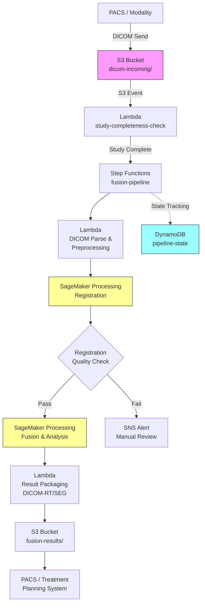

# Recipe 9.10: Multi-Modal Imaging Fusion and Analysis

**Complexity:** Complex · **Phase:** Research/Enterprise · **Estimated Cost:** ~$2.50-8.00 per fusion study

---

## The Problem

A radiation oncologist is planning treatment for a brain tumor. She's got an MRI showing exquisite soft tissue detail: the tumor boundary, its relationship to critical structures like the optic nerve and brainstem. She's also got a PET scan showing metabolic activity: which parts of the tumor are growing aggressively and which are relatively dormant. And there's a CT scan that gives precise geometric measurements for dose calculation.

Three imaging modalities. Three different stories about the same patient. The oncologist needs all three to be telling the story together, in the same coordinate space, at the same time.

Today, in most institutions, that integration happens in the clinician's head. She pulls up the MRI on one monitor, the PET on another, mentally maps structures between them, and makes treatment decisions based on a cognitive fusion that nobody else can see or reproduce. Sometimes there's a commercial workstation that does rigid registration (basically just aligning the two images), but it doesn't actually combine the information in any meaningful computational way.

The problem isn't just radiation oncology. Neurosurgeons planning approaches to deep brain tumors need fMRI (showing which brain regions are actively processing language or motor function) overlaid on structural MRI (showing anatomy). Cardiologists want to fuse CT angiography with perfusion imaging to see both vessel anatomy and tissue blood supply. Orthopedic surgeons want MRI soft tissue detail fused with CT bone detail for complex joint reconstruction planning.

In each case, the clinical question is the same: how do we combine complementary information from different imaging modalities into a single, computationally useful representation that supports better clinical decisions?

The stakes are real. In radiation oncology, a 2-3 millimeter error in tumor delineation means either irradiating healthy brain tissue (causing cognitive damage) or missing tumor margin (leading to recurrence). Multi-modal fusion, done well, reduces that uncertainty.

---

## The Technology: How Images from Different Worlds Get Combined

### The Core Problem: Registration

Before you can fuse anything, you need to solve the registration problem: aligning images taken at different times, on different machines, with different physical properties, so that the same anatomical point appears at the same coordinate in both images.

This is harder than it sounds. Consider what's different between an MRI and a CT of the same patient:

**Spatial resolution.** An MRI might have 1mm x 1mm x 3mm voxels (the 3D equivalent of pixels). A PET scan might have 4mm x 4mm x 4mm voxels. They're representing the same anatomy at different granularities.

**Field of view.** The MRI might cover just the head. The CT might cover head and neck. The PET might cover from skull vertex to mid-thigh. You need to find the overlapping region.

**Patient positioning.** The patient was scanned on different days (usually), in different positions, on different tables. Maybe they were supine for the CT and prone for the MRI. Their neck was tilted slightly differently. Their bladder was full for one scan and empty for the other.

**Tissue deformation.** Between scan dates, things move. Tumors grow. Organs shift. Weight changes. The anatomy is not rigid between acquisitions. A liver that was in one position during CT might be centimeters away during MRI due to respiratory phase differences.

Registration algorithms handle this in two broad categories:

**Rigid registration** assumes the anatomy is a solid object that's been rotated and translated between scans. It finds the optimal rotation (3 angles) and translation (3 shifts) to align the images. This works well for the skull (which is genuinely rigid) and is fast. It's inadequate for anything that deforms: abdomen, chest, breasts, bladder.

**Deformable registration** models the transformation as a continuous displacement field: for every point in image A, how far and in which direction do you need to move to find the corresponding point in image B? This is mathematically much harder, computationally expensive, and can produce physically implausible solutions (folding tissue through itself) if not constrained properly. But it's necessary for any anatomy that moves or grows between acquisitions.

The quality of the registration determines the quality of everything downstream. A 3mm registration error means that when you overlay the PET hotspot on the MRI anatomy, it's pointing at the wrong structure. All the fancy fusion algorithms in the world can't fix a bad alignment.

### Fusion: Combining the Information

Once images are registered (aligned to the same coordinate system), fusion combines their information. There are multiple approaches, and the right choice depends on the clinical question:

**Simple overlay/alpha blending.** Display both images simultaneously with adjustable transparency. This is what most commercial workstations do today. It's useful for visual inspection but doesn't create new computational information.

**Voxel-level fusion.** For each point in space, combine the values from both modalities into a new composite value. This could be a weighted average, a maximum operation, or a learned combination. The output is a new image that contains information from both sources.

**Feature-level fusion.** Extract meaningful features from each modality (edges from CT, metabolic hotspots from PET, tractography from diffusion MRI) and combine at the feature level rather than the raw voxel level. This is more semantically meaningful but requires modality-specific feature extraction.

**Deep learning fusion.** Train a neural network that takes both modalities as input and produces outputs (segmentations, classifications, predictions) that leverage information from both. The network learns which modality to "trust" for which types of decisions. This is the current research frontier and produces the best results where sufficient training data exists.

### What Makes Multi-Modal Fusion Genuinely Hard

**The physics mismatch.** MRI measures proton relaxation times. CT measures X-ray attenuation. PET measures positron emission from radioactive tracers. Ultrasound measures acoustic impedance boundaries. These are fundamentally different physical measurements. There's no simple mathematical relationship between "this voxel has high signal on T2-weighted MRI" and "this voxel has high attenuation on CT." The correspondence is anatomical, not physical.

**Temporal mismatch.** If the PET scan was two weeks before the MRI, the tumor may have grown. If the CT was post-surgery but the MRI was pre-surgery, the anatomy has changed dramatically. Fusion assumes both modalities represent the same anatomical state, and that assumption is violated more often than people admit.

**Ground truth scarcity.** How do you know your fusion is correct? There's no "true" fused image to compare against. Validation typically relies on expert assessment or downstream task performance (did the fused approach lead to better treatment outcomes?). This makes training and evaluating fusion systems particularly challenging.

**Computational scale.** Medical images are big. A single high-resolution MRI volume is 256 x 256 x 180 voxels, often with multiple contrast sequences. Adding a PET volume, a CT volume, and running deformable registration between them requires significant compute. Real-time or near-real-time fusion for intraoperative guidance adds latency constraints on top of the compute demands.

**DICOM complexity.** Medical images live in DICOM format, which encodes not just pixel data but spatial orientation, patient positioning, slice spacing, and dozens of metadata fields that are critical for correct registration. Getting the coordinate transforms right (from image space to patient space to a common world space) requires meticulous attention to DICOM headers that commercial viewers handle transparently but custom pipelines must get right.

### Where the Field Is Today

Rigid registration is a solved problem for brain imaging. Commercial tools handle it routinely with sub-millimeter accuracy for skull-base anatomy.

Deformable registration for abdominal and thoracic imaging is good but not perfect. State-of-the-art deep learning-based registration methods can run in seconds (compared to minutes for classical iterative methods) with comparable accuracy. Libraries like VoxelMorph have made this accessible to researchers.

Fusion for radiation therapy planning (combining PET-CT and MRI for target delineation) is in clinical use at major academic centers. FDA-cleared commercial systems exist from vendors like MIM Software, Velocity (Varian), and Elekta.

Deep learning-based multi-modal fusion for automated segmentation and classification is active research with promising results, particularly in brain tumor segmentation (the BraTS challenge has driven significant progress) and cardiac imaging.

---

## General Architecture Pattern

The pipeline has five conceptual stages:

```text
[Ingest & Parse DICOM] → [Preprocessing & Standardization] → [Registration] → [Fusion] → [Analysis & Delivery]
```

**Stage 1: Ingest and parse.** Receive DICOM images from PACS (Picture Archiving and Communication System) or modality worklists. Extract spatial metadata: voxel dimensions, slice orientation, patient position, acquisition parameters. Validate completeness (all slices present, no gaps). Convert to a volumetric representation suitable for processing (typically NIfTI or raw NumPy arrays with associated affine transforms).

**Stage 2: Preprocessing.** Each modality needs modality-specific preparation. MRI may need bias field correction (removing intensity variations caused by RF coil non-uniformity). CT needs Hounsfield unit windowing. PET needs SUV (Standardized Uptake Value) calculation from raw counts using patient weight and injection dose. All modalities need resampling to a common voxel grid if they differ in resolution.

**Stage 3: Registration.** Align all modalities to a common coordinate frame. Choose a reference modality (typically the one with highest spatial resolution or the one used for treatment planning). Apply rigid registration first (fast, gets you in the ballpark). If anatomy has deformed between acquisitions, apply deformable registration. Validate registration quality before proceeding.

**Stage 4: Fusion.** Combine registered modalities according to the clinical task. For visualization: alpha blending or color-coded overlay. For automated analysis: channel-stacking as input to deep learning models, or voxel-level mathematical combination. For treatment planning: structure propagation from one modality to another using the registration transform.

**Stage 5: Analysis and delivery.** Run task-specific analysis on the fused representation. This might be automated tumor segmentation, organ-at-risk delineation, treatment response assessment, or feature extraction for radiomics. Package results in DICOM-compatible format (DICOM-RT structure sets, DICOM SEG, or DICOM-SR) and push back to PACS for clinical consumption.

Each stage has failure modes that must be detected and handled: missing slices in DICOM series, registration failures where the optimizer converges to a local minimum (producing obviously wrong alignments), fusion artifacts at modality boundaries, and analysis model failures on out-of-distribution inputs.

---

## The AWS Implementation

### Why These Services

**Amazon S3 for DICOM storage and processing pipeline.** Medical imaging generates massive data volumes. A single PET-CT study can be 500+ MB of DICOM files. S3 provides the durable, encrypted, high-throughput storage needed to receive studies from PACS, stage them for processing, and retain results. S3 event notifications trigger the processing pipeline when a complete study arrives. Lifecycle policies handle archival of processed studies to cheaper storage tiers.

**Amazon SageMaker for ML model hosting and batch inference.** The registration and fusion models (deep learning-based deformable registration, multi-modal segmentation networks) need GPU compute. SageMaker provides managed GPU instances for both training and inference. For batch processing (nightly fusion runs on new studies), SageMaker Processing Jobs or Batch Transform handle the compute without persistent infrastructure. For near-real-time clinical use, SageMaker endpoints with GPU-backed instances provide consistent latency.

**AWS Step Functions for pipeline orchestration.** The fusion pipeline is a multi-step workflow with conditional logic: registration might succeed or fail, the fusion approach depends on which modalities are available, and quality checks gate progression. Step Functions models this as a state machine with error handling, retries, and parallel execution branches (e.g., preprocessing multiple modalities simultaneously).

**AWS Lambda for lightweight coordination tasks.** DICOM parsing, metadata extraction, study completeness checks, notification dispatch, and result packaging are short-lived tasks that fit Lambda's execution model. Lambda handles the glue between pipeline stages while SageMaker handles the heavy compute.

**Amazon DynamoDB for study tracking and metadata.** Track pipeline state: which studies are in progress, which completed, which failed. Store registration quality metrics, fusion parameters used, and audit records. Point lookups by study ID support the clinical workflow where a radiologist checks whether fusion results are ready.

<!-- TODO (TechWriter): Verify whether HealthLake Imaging (announced re:Invent 2022) supports the DICOM-RT and multi-modal query patterns needed here, or whether a custom DICOM indexing layer on S3 is the better approach for this use case. -->
**Amazon HealthLake or S3 + custom indexing for DICOM management.** For DICOM study management, evaluate HealthLake Imaging for native DICOM storage and retrieval, or build a custom indexing layer on S3 if your query patterns (DICOM-RT cross-references, multi-modal series linking) exceed what HealthLake supports natively.

### Architecture Diagram



### Prerequisites

| Requirement | Details |
|-------------|---------|
| **AWS Services** | Amazon S3, AWS Lambda, AWS Step Functions, Amazon SageMaker, Amazon DynamoDB, Amazon SNS, Amazon CloudWatch |
| **IAM Permissions** | `s3:GetObject`, `s3:PutObject`, `sagemaker:CreateProcessingJob`, `sagemaker:InvokeEndpoint`, `states:StartExecution`, `dynamodb:PutItem`, `dynamodb:GetItem`, `sns:Publish` |
| **BAA** | AWS BAA signed (required: DICOM images are PHI) |
| **Encryption** | S3: SSE-KMS; DynamoDB: encryption at rest; SageMaker: volume encryption with KMS; all transit over TLS |
| **VPC** | Production: SageMaker and Lambda in VPC with VPC endpoints for S3, DynamoDB, SageMaker Runtime. PACS connectivity via Direct Connect or VPN to VPC. |
| **CloudTrail** | Enabled: log all S3, SageMaker, and Step Functions API calls for HIPAA audit trail |
| **GPU Instances** | SageMaker: ml.g5.xlarge or ml.g5.2xlarge for registration and fusion inference. Training: ml.g5.12xlarge or ml.p4d.24xlarge for multi-modal model training |
| **Sample Data** | BraTS (Brain Tumor Segmentation) challenge data for brain multi-modal MRI. TCIA (The Cancer Imaging Archive) for PET-CT datasets. Never use real patient imaging in dev. |
| **Cost Estimate** | Per study: ~$0.50 storage + $1.00-5.00 SageMaker GPU compute (registration + fusion) + $0.10 Lambda/Step Functions. Varies heavily with image resolution and model complexity. |

### Ingredients

| AWS Service | Role |
|------------|------|
| **Amazon S3** | DICOM storage for incoming studies, intermediate results, and fusion outputs |
| **AWS Lambda** | DICOM parsing, study completeness detection, metadata extraction, result packaging |
| **AWS Step Functions** | Orchestrate multi-step fusion pipeline with branching logic and error handling |
| **Amazon SageMaker** | GPU compute for registration models, fusion inference, and segmentation |
| **Amazon DynamoDB** | Pipeline state tracking, study metadata, quality metrics |
| **Amazon SNS** | Alert on pipeline failures requiring manual intervention |
| **AWS KMS** | Encryption key management for PHI at rest |
| **Amazon CloudWatch** | Monitoring, metrics, and alarms for pipeline health |

### Code

#### Walkthrough

**Step 1: Study completeness detection.** When DICOM files arrive from PACS (typically pushed via DICOM C-STORE), they land in S3 one file at a time. A study might have 800 DICOM files across multiple series (the CT series, the PET series, each with hundreds of slices). The pipeline can't start processing until the entire study is present. This step monitors incoming files, groups them by study and series using DICOM metadata (StudyInstanceUID, SeriesInstanceUID), and triggers the pipeline only when all expected series are complete. Without this gate, you'd start processing an incomplete volume and produce garbage results.

```pseudocode
FUNCTION check_study_completeness(new_file_key):
    // Extract DICOM metadata from the newly arrived file
    dicom_header = parse DICOM header from S3 object at new_file_key
    study_uid    = dicom_header.StudyInstanceUID
    series_uid   = dicom_header.SeriesInstanceUID
    instance_num = dicom_header.InstanceNumber
    total_slices = dicom_header.NumberOfFrames OR infer from DICOM series metadata

    // Update the tracking record for this series
    update DynamoDB "study-tracker" record:
        key          = study_uid + "/" + series_uid
        received     = received + 1
        last_updated = current UTC timestamp

    // Check if ALL series for this study are complete
    all_series = query DynamoDB for all records matching study_uid
    
    FOR each series_record in all_series:
        IF series_record.received < series_record.expected_slices:
            RETURN "still_waiting"  // not all slices arrived yet
    
    // All series complete. Trigger the fusion pipeline.
    start Step Functions execution with:
        study_uid = study_uid
        series_list = [series metadata for each complete series]
        s3_prefix = derive S3 path prefix from study_uid
    
    RETURN "pipeline_triggered"
```

**Step 2: DICOM parsing and preprocessing.** Once a complete study is confirmed, each modality series needs to be converted from raw DICOM slices into a 3D volume suitable for registration algorithms. This means sorting slices by position, assembling them into a volumetric array, extracting the spatial transform (the affine matrix that maps voxel indices to patient coordinates), and applying modality-specific corrections. CT needs no correction beyond reading Hounsfield units. MRI may need bias field correction. PET needs SUV normalization using patient weight and tracer injection dose/time from DICOM headers. Skip the preprocessing and your registration will either fail outright or produce subtly wrong results that look plausible but place structures in the wrong locations.

```pseudocode
FUNCTION preprocess_modality(series_dicom_files, modality_type):
    // Sort DICOM slices by spatial position to assemble the 3D volume correctly
    sorted_slices = sort series_dicom_files by ImagePositionPatient z-coordinate

    // Build the 3D volume: stack 2D slices into a volumetric array
    volume = assemble 3D numpy array from sorted_slices pixel data
    
    // Extract the spatial mapping: voxel coordinates to patient coordinates
    // This affine matrix encodes voxel size, orientation, and position
    affine_matrix = compute from:
        ImagePositionPatient   (origin of the first slice)
        ImageOrientationPatient (row and column direction cosines)
        PixelSpacing           (in-plane voxel size)
        SliceThickness         (between-slice distance)

    // Apply modality-specific preprocessing
    IF modality_type == "CT":
        // CT values are already in Hounsfield units. Clip to relevant range.
        volume = clip volume to [-1024, 3072]  // air to dense bone

    ELSE IF modality_type == "PET":
        // Convert raw counts to Standardized Uptake Values (SUV)
        // SUV normalizes for patient weight and injected dose
        patient_weight = dicom_header.PatientWeight  // kg
        injected_dose  = dicom_header.RadiopharmaceuticalInformationSequence.RadionuclideTotalDose
        decay_time     = compute from injection time to scan time
        decay_corrected_dose = injected_dose * exp(-decay_constant * decay_time)
        volume = volume * patient_weight / decay_corrected_dose  // now in SUV units

    ELSE IF modality_type == "MR":
        // Bias field correction: remove intensity non-uniformity from RF coil
        // N4ITK algorithm estimates and removes the smooth bias field
        bias_field = estimate N4ITK bias field from volume
        volume = volume / bias_field  // corrected intensities

    RETURN {
        volume: volume,           // 3D array of processed voxel values
        affine: affine_matrix,    // spatial transform to patient coordinates
        modality: modality_type,  // for downstream processing decisions
        metadata: relevant DICOM header fields  // for audit and result packaging
    }
```

**Step 3: Registration.** This is the most critical step. Align all modalities to a common reference frame so that the same anatomical point has the same coordinates in every volume. The reference modality is typically the one with highest spatial resolution or the one used for treatment planning (often CT in radiation oncology). Registration proceeds in two phases: rigid alignment first (fast, handles gross positioning differences), then deformable registration if the anatomy has changed between acquisitions. The quality of this step determines everything downstream. A 3mm error here means the PET hotspot you overlay on the MRI is pointing at the wrong brain structure.

```pseudocode
FUNCTION register_to_reference(moving_volume, reference_volume, anatomy_type):
    // Phase 1: Rigid registration
    // Find the optimal rotation (3 angles) and translation (3 shifts)
    // that best aligns the moving image to the reference
    rigid_transform = optimize rigid alignment:
        metric     = mutual information  // works across modalities because it measures
                                         // statistical dependency, not pixel similarity
        optimizer  = gradient descent with multi-resolution pyramid
        moving     = moving_volume
        fixed      = reference_volume
    
    // Apply rigid transform to get initial alignment
    rigidly_aligned = resample moving_volume using rigid_transform
    
    // Phase 2: Deformable registration (if anatomy type requires it)
    IF anatomy_type in ["abdomen", "thorax", "pelvis", "breast"]:
        // Non-rigid anatomy needs deformable registration
        // Compute a displacement field: for every voxel, how far to shift
        deformation_field = compute deformable registration:
            method     = deep learning (VoxelMorph-style) OR classical (B-spline)
            moving     = rigidly_aligned
            fixed      = reference_volume
            regularization = diffusion penalty  // prevents physically impossible folds
        
        registered_volume = warp rigidly_aligned using deformation_field
        total_transform   = compose(rigid_transform, deformation_field)
    
    ELSE:
        // Rigid anatomy (brain in skull, spine segments): rigid is sufficient
        registered_volume = rigidly_aligned
        total_transform   = rigid_transform
    
    // Quality assessment: check that the registration is actually good
    quality_metrics = compute:
        mutual_information(registered_volume, reference_volume)
        dice_coefficient of landmark structures if available
        jacobian_determinant of deformation_field  // negative values mean folding (bad)
    
    RETURN {
        registered_volume: registered_volume,
        transform: total_transform,
        quality_metrics: quality_metrics,
        passed_qc: quality_metrics meet threshold criteria
    }
```

**Step 4: Multi-modal fusion and analysis.** With all modalities registered to the same coordinate frame, combine their information for the target clinical task. The fusion approach depends on what you're trying to accomplish. For automated segmentation (e.g., delineating tumor extent), the state-of-the-art is a deep learning model that takes all modalities as input channels and outputs a voxel-wise segmentation map. For treatment planning support, the fusion might propagate structure contours from one modality to another. For radiomics (quantitative feature extraction), the fusion extracts features from each modality independently but in the same spatial regions. Each approach produces different outputs, but they all depend on accurate registration from Step 3.

```pseudocode
FUNCTION fuse_and_analyze(registered_volumes, clinical_task):
    // Stack all registered modalities as channels of a multi-channel volume
    // Example: 4-channel input for brain tumor segmentation (T1, T1ce, T2, FLAIR)
    multi_channel_volume = stack [vol.registered_volume for vol in registered_volumes]
    
    IF clinical_task == "segmentation":
        // Run multi-modal segmentation model
        // Input: N-channel volume (one channel per modality)
        // Output: voxel-wise label map (background, tumor core, enhancing, edema, etc.)
        segmentation_map = invoke SageMaker endpoint:
            model    = multi-modal-segmentation-model
            input    = multi_channel_volume
            metadata = { modality_order: [list of modality types in channel order] }
        
        // Post-process: connected component analysis, remove small islands
        cleaned_segmentation = remove components smaller than min_volume_threshold
        
        // Compute volumetric measurements from segmentation
        volumes = compute volume in mL for each label class
        
        RETURN {
            segmentation: cleaned_segmentation,
            volumes: volumes,
            confidence_map: model softmax outputs per voxel
        }
    
    ELSE IF clinical_task == "treatment_planning_support":
        // Propagate structures from MRI to CT planning scan using registration transform
        // Clinician contours on MRI (better soft tissue contrast)
        // Treatment planning happens on CT (needed for dose calculation)
        mri_contours = load existing contours from MRI study
        ct_contours  = transform mri_contours using inverse registration transform
        
        // Also compute metabolic tumor volume from PET
        pet_volume = registered_volumes["PET"].registered_volume
        metabolic_active = threshold pet_volume at SUV > 2.5  // common clinical threshold
        
        RETURN {
            propagated_contours: ct_contours,
            metabolic_volume: metabolic_active,
            biological_target_volume: intersection of anatomical and metabolic volumes
        }
    
    ELSE IF clinical_task == "radiomics":
        // Extract quantitative features from each modality within defined ROIs
        roi_mask = load region of interest (from segmentation or manual contour)
        
        features = empty map
        FOR each modality_vol in registered_volumes:
            modality_features = extract radiomic features:
                first_order   = [mean, std, skewness, kurtosis, entropy]
                shape         = [volume, surface_area, sphericity, compactness]
                texture       = [GLCM, GLRLM, GLSZM features]
                from volume   = modality_vol.registered_volume
                within mask   = roi_mask
            features[modality_vol.modality] = modality_features
        
        RETURN { radiomic_features: features }
```

**Step 5: Result packaging and delivery.** The fusion and analysis results need to get back into the clinical workflow, which means packaging them in DICOM-compatible formats and pushing them to PACS or the treatment planning system. Segmentation maps become DICOM-RT Structure Sets (for radiation oncology) or DICOM SEG objects (for general imaging). Quantitative measurements become DICOM-SR (Structured Reports). The registered and fused volumes become new DICOM series linked to the original study. This packaging step is what makes the computational results clinically usable rather than trapped in a research pipeline.

```pseudocode
FUNCTION package_and_deliver(analysis_results, original_study_metadata):
    // Package segmentation as DICOM-RT Structure Set
    IF "segmentation" in analysis_results:
        rt_struct = create DICOM-RT Structure Set:
            referenced_study     = original_study_metadata.StudyInstanceUID
            referenced_series    = reference CT series UID
            structures           = convert each label to a set of contour points per slice
            structure_names      = ["GTV_MRI", "CTV_metabolic", "Edema", ...]
            structure_colors     = [red, green, blue, ...]  // display colors
            manufacturer         = "AI Fusion Pipeline v1.0"
            approval_status      = "UNAPPROVED"  // clinician must verify
    
    // Package measurements as DICOM Structured Report
    IF "volumes" in analysis_results:
        dicom_sr = create DICOM-SR:
            measurement_groups = [
                { concept: "Tumor Volume", value: volumes["tumor_core"], unit: "mL" },
                { concept: "Metabolic Volume", value: volumes["metabolic"], unit: "mL" },
                ...
            ]
            referenced_study = original_study_metadata.StudyInstanceUID
    
    // Store results in S3
    result_prefix = "fusion-results/" + study_uid + "/"
    upload rt_struct, dicom_sr, and registered volumes to S3 at result_prefix
    
    // Push to PACS via DICOM C-STORE or DICOMweb STOW-RS
    send results to PACS endpoint
    
    // Update pipeline tracking
    update DynamoDB "pipeline-state":
        study_uid = study_uid
        status    = "completed"
        result_s3 = result_prefix
        completed_at = current UTC timestamp
        quality_metrics = registration and analysis quality scores
    
    RETURN { status: "delivered", result_location: result_prefix }
```

> **Curious how this looks in Python?** The pseudocode above covers the concepts. If you'd like to see sample Python code that demonstrates these patterns using boto3, check out the [Python Example](chapter09.10-python-example). It walks through each step with inline comments and notes on what you'd need to change for a real deployment.

### Expected Results

**Sample output for a brain tumor PET-MRI-CT fusion study:**

```json
{
  "study_uid": "1.2.840.113619.2.378.3596.2847512.20260301",
  "pipeline_id": "fusion-20260301-00047",
  "modalities_fused": ["MR_T1", "MR_T1CE", "MR_T2", "MR_FLAIR", "PET_FDG", "CT"],
  "registration_quality": {
    "MR_T1_to_CT": { "mutual_information": 1.42, "landmark_error_mm": 0.8, "status": "pass" },
    "PET_to_CT": { "mutual_information": 1.15, "landmark_error_mm": 1.2, "status": "pass" }
  },
  "segmentation": {
    "tumor_core_volume_mL": 14.7,
    "enhancing_tumor_volume_mL": 8.2,
    "edema_volume_mL": 42.3,
    "metabolic_tumor_volume_mL": 11.9,
    "mean_confidence": 0.89
  },
  "outputs": {
    "rt_structure_set": "fusion-results/study-047/RT_STRUCT.dcm",
    "registered_pet": "fusion-results/study-047/PET_registered/",
    "segmentation_nifti": "fusion-results/study-047/segmentation.nii.gz",
    "structured_report": "fusion-results/study-047/SR_measurements.dcm"
  },
  "processing_time_seconds": 187,
  "gpu_instance_type": "ml.g5.2xlarge"
}
```

**Performance benchmarks:**

| Metric | Typical Value |
|--------|---------------|
| End-to-end latency (brain, rigid) | 2-5 minutes |
| End-to-end latency (abdomen, deformable) | 8-15 minutes |
| Registration accuracy (brain) | 0.5-1.5 mm target registration error |
| Registration accuracy (abdomen) | 2-5 mm target registration error |
| Segmentation Dice (brain tumor) | 0.82-0.91 (whole tumor) |
| Cost per study (brain) | ~$2.50 (GPU time dominates) |
| Cost per study (abdomen, deformable) | ~$5.00-8.00 |
| Throughput | ~30-50 studies/day per ml.g5.2xlarge |

**Where it struggles:** Non-rigid abdominal anatomy with large respiratory or bowel motion between scans. Studies with significant time gaps where tumor growth invalidates the registration assumption. Rare modality combinations not well-represented in training data. Edge cases where automated registration converges to a local minimum (producing obviously wrong but algorithmically "stable" alignments).

---

<!-- TODO (TechWriter): RECIPE-GUIDE does not specify a "Why This Isn't Production-Ready" section. Consider merging this content into "The Honest Take" below, or folding regulatory/validation points into a subsection there. The content is strong but the extra H2 breaks the expected section order. -->
## Why This Isn't Production-Ready

**FDA regulatory pathway.** If this system's outputs influence clinical decisions (treatment planning contours, diagnostic segmentation), it likely requires FDA clearance as a Class II medical device. The 510(k) pathway requires demonstrated substantial equivalence to a predicate device, plus clinical validation studies. This recipe covers the technical architecture, not the regulatory journey, which adds 12-24 months and significant cost.

**Clinical validation.** Before any clinician uses AI-generated contours for treatment planning, the institution needs a validation study: compare AI contours against expert-drawn contours across a representative dataset, measure agreement metrics (Dice, Hausdorff distance), and establish that the AI output is within inter-observer variability. A cookbook recipe cannot substitute for this.

**DICOM conformance.** The DICOM standard for RT Structure Sets, SEG objects, and Structured Reports is complex. Subtle conformance errors (wrong referenced frame of reference, incorrect contour encoding) will cause treatment planning systems to reject or misinterpret the data. Production systems need rigorous DICOM conformance testing against target systems.

**Failure detection and graceful degradation.** Registration can silently fail: the algorithm reports convergence but the alignment is wrong. Production systems need automated quality checks (landmark verification, anatomical plausibility tests) and clear escalation paths when quality thresholds aren't met. The Step Functions workflow should never silently produce and deliver bad results.

---

## The Honest Take

Multi-modal fusion is one of those areas where the research papers make everything look solved and the clinical deployment reality is humbling. The BraTS challenge has driven brain tumor segmentation performance to levels that compete with expert radiologists. But BraTS data is curated: images are already skull-stripped, co-registered, and resampled to the same grid. In a real clinical pipeline, you're starting from raw DICOM off the scanner, and the preprocessing and registration steps are where most of the failures live.

The registration quality problem deserves special attention. I've seen fusion pipelines deployed where the registration "passed" automated quality checks but was subtly wrong (3-4mm error in a critical region). The downstream segmentation model happily produced plausible-looking contours that were shifted from the true anatomy. Nobody noticed until a physicist spotted the misalignment during treatment plan review. Build multiple layers of quality assessment, and make human review of registration quality a mandatory step before clinical use.

The temporal mismatch problem is underappreciated in the literature. Research datasets typically have all modalities acquired on the same day. Clinical reality is that the PET was last Tuesday, the MRI was yesterday, and the CT is being done today for planning. In that two-week gap, the tumor grew 2mm along one margin. Your "perfect" registration is now aligning a slightly different anatomy, and there's no good automated way to detect or correct for this.

The cost model is dominated by GPU compute for registration and inference. If you're processing 50 studies per day, a dedicated GPU instance makes more economic sense than on-demand SageMaker endpoints. If it's 5 studies per day, the on-demand model wins. The crossover point depends on your instance type and SageMaker pricing tier.

One last thing that surprised me: DICOM-RT Structure Set generation is harder than it should be. Converting a 3D segmentation mask back into the contour-per-slice format that treatment planning systems expect requires careful handling of slice geometry, multi-part contours (holes, separate components), and coordinate system conventions. Budget more engineering time here than you think you'll need.

---

## Variations and Extensions

**Intraoperative fusion for surgical navigation.** Register preoperative imaging (MRI, CT) to intraoperative views (ultrasound, stereoscopic camera) in near-real-time. The challenge intensifies because the anatomy deforms during surgery (brain shift, organ retraction). Requires sub-second update rates and tolerance for partial views. The architecture shifts from batch processing to streaming inference with SageMaker endpoints behind low-latency networking.

**Longitudinal fusion for treatment response assessment.** Rather than fusing modalities from a single time point, fuse the same modality across time points (baseline vs. post-treatment) to quantify change. Align baseline and follow-up scans, compute voxel-wise change maps, and classify regions as responding, stable, or progressing. Adds temporal registration challenges and needs RECIST/RANO response criteria implementation.

**Federated multi-modal model training.** Training fusion models requires multi-modal datasets that are rare and expensive to curate. Federated learning allows training across institutions without centralizing PHI. Each site trains on its local data and shares model weight updates. The architecture adds a federated aggregation server (potentially using SageMaker's built-in federated training capabilities or custom orchestration) while keeping imaging data at the source institution.

---

## Related Recipes

- **Recipe 9.5 (Chest X-Ray Triage):** Single-modality classification foundation; this recipe extends to multi-input models
- **Recipe 9.7 (Radiology AI Triage, Multi-Modality):** Handles multiple modalities but for triage classification, not spatial fusion
- **Recipe 9.8 (Pathology Slide Analysis):** Shares the challenge of processing gigapixel images with spatial awareness
- **Recipe 12.8 (Disease Progression Trajectory Modeling):** The longitudinal variation of this recipe feeds into progression models
- **Recipe 14.9 (Chemotherapy Scheduling):** Treatment planning outputs from this recipe inform scheduling optimization

---

## Additional Resources

**AWS Documentation:**
- [Amazon SageMaker Processing Jobs](https://docs.aws.amazon.com/sagemaker/latest/dg/processing-job.html)
- [Amazon SageMaker Real-time Inference](https://docs.aws.amazon.com/sagemaker/latest/dg/realtime-endpoints.html)
- [AWS Step Functions Developer Guide](https://docs.aws.amazon.com/step-functions/latest/dg/welcome.html)
- [AWS HIPAA Eligible Services](https://aws.amazon.com/compliance/hipaa-eligible-services-reference/)
- [Architecting for HIPAA on AWS (Whitepaper)](https://docs.aws.amazon.com/whitepapers/latest/architecting-hipaa-security-and-compliance-on-aws/welcome.html)
- [Amazon SageMaker Pricing](https://aws.amazon.com/sagemaker/pricing/)

**External Resources:**
- [The Cancer Imaging Archive (TCIA)](https://www.cancerimagingarchive.net/): Public datasets for multi-modal medical imaging research
- [BraTS Challenge](https://www.synapse.org/brats): Brain tumor segmentation challenge with multi-modal MRI data
- [VoxelMorph](https://voxelmorph.net/): Deep learning framework for deformable medical image registration
- [MONAI (Medical Open Network for AI)](https://monai.io/): PyTorch-based framework for medical image analysis including registration and segmentation
- [DICOM Standard](https://www.dicomstandard.org/): Official DICOM specification for medical imaging interoperability

**AWS Solutions and Blogs:**
- [Medical Image Analysis on AWS](https://aws.amazon.com/solutions/implementations/medical-image-analysis-on-aws/): Reference architecture for medical imaging workloads on AWS
<!-- TODO (TechWriter): Verify this AWS Solutions URL still exists and is relevant to multi-modal fusion -->
- [Build a medical image analysis pipeline on AWS](https://aws.amazon.com/blogs/machine-learning/): Blog posts covering SageMaker-based medical imaging pipelines
<!-- TODO (TechWriter): Search for specific blog posts on medical imaging pipelines with SageMaker and replace with verified URLs -->

---

## Estimated Implementation Time

| Tier | Timeline | What You Get |
|------|----------|--------------|
| **Basic** | 8-12 weeks | Rigid registration + alpha blending overlay for brain imaging. Manual QC. Limited modality support. |
| **Production-ready** | 6-9 months | Deformable registration, automated QC, multi-modality segmentation, DICOM-RT output, PACS integration, clinical validation study. |
| **With variations** | 12-18 months | Intraoperative navigation, longitudinal response tracking, federated training across institutions, FDA submission preparation. |

---

## Tags

`computer-vision` · `medical-imaging` · `multi-modal` · `image-fusion` · `registration` · `segmentation` · `radiation-oncology` · `treatment-planning` · `sagemaker` · `step-functions` · `dicom` · `complex` · `research`

---

*← [Recipe 9.9: Surgical Video Analysis](chapter09.09-surgical-video-analysis) · [Chapter 9 Index](chapter09-index) · [Next: Chapter 10 →](chapter10-preface)*
