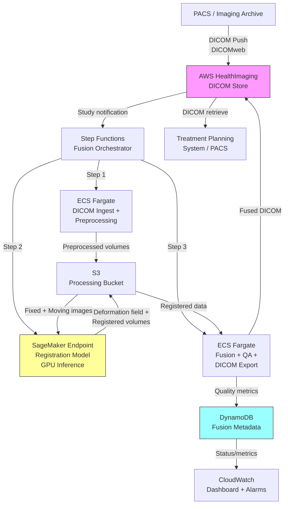

# Recipe 9.10: Multi-Modal Imaging Fusion and Analysis

**Complexity:** Complex · **Phase:** Research/Production · **Estimated Cost:** ~$2.50-8.00 per fusion study

---

## The Problem

A radiation oncologist is planning treatment for a brain tumor patient. On her screen she has an MRI showing exquisite soft tissue detail: the tumor's edges, its relationship to critical structures like the optic chiasm and brainstem. She also has a PET scan showing metabolic activity: which parts of the tumor are aggressively growing and which are necrotic. And she has a CT scan showing bone density and electron density data needed to calculate how radiation beams will attenuate through tissue.

Each image tells part of the story. None tells the whole story.

Right now, she's doing the fusion in her head. Flipping between three different imaging applications, mentally rotating and overlaying structures, trying to reconcile information presented in different coordinate systems, at different spatial resolutions, acquired on different days when the patient's anatomy may have shifted slightly. This is one of the most cognitively demanding tasks in medicine, and the consequences of getting it wrong are severe: miss the tumor margin and cancer recurs; irradiate too much healthy tissue and the patient loses vision or motor function.

Multi-modal imaging fusion is the process of computationally aligning and combining these different imaging datasets into a unified representation. In radiation oncology alone, treatment planning requires fusing CT (for dose calculation), MRI (for tumor delineation), and often PET (for biological targeting). In surgical planning, neurosurgeons fuse MRI with functional imaging (fMRI) and diffusion tensor imaging (DTI) to map eloquent cortex and white matter tracts before cutting. Cardiac surgeons fuse echocardiography with CT angiography. Orthopedic planning fuses MRI with weight-bearing X-rays.

The clinical need is enormous. The technical challenge is equally enormous. And the computational infrastructure required to do this at scale, with the accuracy and latency clinicians demand, is a genuinely hard engineering problem.

---

## The Technology: How Multi-Modal Fusion Works

### What is Image Registration?

At its core, multi-modal fusion is an image registration problem. You have two (or more) images of the same anatomy, acquired with different physics, at different times, possibly in different patient positions. Registration is the process of finding the spatial transformation that maps points in one image to corresponding points in the other.

Think of it like this: if I point to a voxel in the MRI and say "that's the left edge of the tumor," registration tells me which voxel in the CT corresponds to that same physical location in the patient's body.

This sounds straightforward until you realize how many things can differ between acquisitions:

**Different coordinate systems.** Each scanner defines its own coordinate origin. The MRI might place (0,0,0) at the center of the magnet bore. The CT might place it at the table reference. The first job is getting both images into a common coordinate frame, usually the patient's anatomical coordinates.

**Different spatial resolutions.** An MRI might have 1mm isotropic voxels. A PET scan might have 4mm voxels. A CT might have 0.5mm in-plane resolution but 2mm slice thickness. You can't overlay these directly; you need to resample one (or both) to a common grid.

**Different fields of view.** The MRI might cover just the head. The CT might cover head and neck. The PET scan might be whole-body. Your fusion needs to handle partial overlap gracefully.

**Non-rigid deformation.** Here's the hard part. The patient's anatomy is not rigid. Between the MRI on Tuesday and the CT on Thursday, the bladder filled, the bowels moved, the patient lost weight, or swelling changed. In the brain, this is less of a problem (the skull constrains things). In the abdomen or pelvis, it's a showstopper for simple rigid registration. You need deformable registration that can model local tissue compression, expansion, and shearing.

### Registration Methods

Registration algorithms fall on a spectrum from simple to complex:

**Rigid registration** uses 6 parameters: three translations and three rotations. It assumes the anatomy is a solid object that moved between scans. Good for brain imaging (skull constraint) and bone-focused applications. Fast, well-understood, and usually the starting point even when you plan to go further.

**Affine registration** adds scaling and shearing: 12 parameters. Handles cases where the patient was scanned at slightly different magnifications or where there's a global stretching (positioning differences on the table).

**Deformable (non-rigid) registration** models local deformations using a dense displacement field. Every voxel gets its own displacement vector. This is what you need for abdominal fusion, where organ motion between scans is substantial. The algorithms are computationally expensive and the results need careful quality control because they can produce physically implausible deformations (folding tissue through itself) if unconstrained.

**Deep learning registration** is the current frontier. Neural networks (often U-Net variants) are trained on paired images to predict deformation fields directly, without iterative optimization at inference time. This gives you the accuracy of deformable registration with dramatically faster inference (seconds instead of minutes). The tradeoff is that training requires curated datasets of registered image pairs, and generalization to novel anatomy or pathology can be unpredictable.

### Similarity Metrics: The Multi-Modal Problem

Here's what makes multi-modal fusion fundamentally harder than registering two images of the same type: the same tissue looks completely different across modalities.

In CT, bone is bright (high attenuation). In MRI T1-weighted images, bone is dark (low signal). In PET, bone has variable uptake. You cannot simply compare pixel intensities between a CT and an MRI because the intensity relationship is non-linear and tissue-dependent.

Classical solutions include:

**Mutual information (MI).** Rather than assuming intensities match, MI measures the statistical dependence between intensity distributions. If two images are well-aligned, knowing the CT intensity at a location should reduce your uncertainty about the MRI intensity at the corresponding location. MI maximization is the standard approach for multi-modal registration and works remarkably well, but it's noisy with local optima that can trap optimization.

**Normalized cross-correlation (NCC).** Works when there's a local linear relationship between intensities. Faster than MI but makes stronger assumptions.

**Deep learning similarity.** Train a network to score alignment quality. Can learn modality-specific features that neither MI nor NCC captures. Requires training data of known-good registrations.

### Fusion Strategies: What Happens After Alignment

Once images are in the same coordinate space, you need a strategy for combining information:

**Overlay visualization.** The simplest approach: display one modality as a color wash over another. PET-CT fusion typically shows the PET metabolic data as a color overlay on the grayscale CT anatomy. This is a visualization technique, not a computational one, but it's what most clinicians interact with.

**Contour propagation.** Draw structures (tumor, organs at risk) on one modality and project them onto others. Critical for radiation therapy planning where the tumor is contoured on MRI but dose must be calculated on CT.

**Feature fusion.** Extract quantitative features from each modality and combine them into a unified feature vector per voxel or region. Tumor heterogeneity analysis uses this: combining metabolic features from PET, perfusion features from dynamic contrast MRI, and structural features from anatomical MRI into a single characterization.

**Joint segmentation.** Use information from all modalities simultaneously to segment structures. A tumor boundary might be ambiguous on CT but clear on MRI; combining both gives a better segmentation than either alone.

### The Clinical Context: Where This Matters Most

**Radiation therapy planning** is the highest-volume clinical use case. Every radiation treatment plan requires CT for dose calculation, and the majority benefit from MRI or PET fusion for target definition. This is millions of fusion procedures annually worldwide.

**Neurosurgical planning** fuses structural MRI with functional MRI (identifying motor/language cortex) and diffusion tractography (mapping white matter connections). The surgeon needs to know: where is the tumor, where are the critical functions, and what's the safest corridor between them?

**Cardiac imaging** fuses echocardiography (real-time, inexpensive) with CT or MRI (high spatial resolution, expensive) for interventional planning.

**Musculoskeletal surgery** fuses MRI (soft tissue) with CT (bone detail) for joint replacement planning and fracture assessment.

### The General Architecture Pattern

```text
[Ingest DICOM] → [Preprocessing / Standardization] → [Registration Engine] → [Fusion / Overlay] → [Clinical Visualization] → [Treatment Planning Integration]
```

**Ingest DICOM.** Medical images arrive as DICOM (Digital Imaging and Communications in Medicine) files from PACS (Picture Archiving and Communication System). Each study may contain hundreds of files representing individual slices. The ingestion layer normalizes metadata, validates completeness, and converts to volumetric arrays.

**Preprocessing.** Intensity normalization, resampling to a common voxel spacing, skull stripping (for brain), or body segmentation. Each modality has specific preprocessing needs. MRI requires bias field correction (the signal intensity varies with distance from the coil). PET requires SUV (Standardized Uptake Value) normalization.

**Registration engine.** The computational core. Takes a "fixed" image (typically CT for radiation therapy) and a "moving" image (MRI, PET) and computes the transformation that aligns the moving to the fixed. For clinical use, this must produce results in minutes, not hours. Quality metrics (overlap of known structures, residual distance) validate success.

**Fusion and overlay.** Applies the computed transformation to resample the moving image into the fixed image's coordinate space. Generates overlay visualizations, propagates contours, or extracts combined features depending on the clinical application.

**Clinical visualization.** DICOM-compliant output that integrates with existing clinical systems. Radiation therapy systems expect specific DICOM objects (DICOM-RT Structure Sets, Registration Objects). Surgical navigation systems have their own format requirements.

**Treatment planning integration.** For radiation oncology, the fused dataset feeds directly into the treatment planning system for contouring and dose calculation. This step has strict accuracy requirements: the American Association of Physicists in Medicine recommends spatial accuracy within 2mm for treatment planning fusion.

---

## The AWS Implementation

### Why These Services

**Amazon S3 for DICOM storage and staging.** Medical imaging datasets are large (a single CT/MRI/PET study set can be 2-10 GB). S3 provides durable, encrypted, high-throughput object storage for ingesting studies from institutional PACS, staging them for processing, and storing registered outputs. S3's multipart upload handles large DICOM series efficiently, and lifecycle policies manage the transition from hot processing to warm/cold archival.

**Amazon SageMaker for registration model hosting.** Deep learning registration models (VoxelMorph, TransMorph, or custom architectures) need GPU inference. SageMaker endpoints provide managed GPU hosting with automatic scaling, model versioning, and A/B testing. For batch processing (e.g., overnight re-registration of a day's studies), SageMaker Processing or Batch Transform handles the workload without maintaining persistent GPU instances.

**AWS Step Functions for pipeline orchestration.** A fusion workflow has multiple sequential and parallel stages: DICOM validation, preprocessing per modality, registration (possibly multiple pairs), fusion output generation, quality validation, and DICOM export. Step Functions provides visual workflow definition, retry logic, error handling, and audit trails. Each step can invoke different compute backends (Lambda for lightweight tasks, SageMaker for GPU inference, ECS for custom image processing containers).

<!-- TODO (TechWriter): Expert review A2 (MEDIUM). Add per-step error handling guidance: preprocessing failures retry 2x with backoff then fail the job; registration failures retry 1x then route to manual queue; QA failures route to physicist review with intermediate outputs retained in S3; export failures retry 3x then alert operations. Use Step Functions ResultPath to preserve intermediate outputs for debugging. -->

**Amazon ECS (Fargate) for preprocessing containers.** Medical image preprocessing (bias field correction, intensity normalization, resampling, skull stripping) uses specialized libraries (SimpleITK, ANTs, FreeSurfer). These run best in custom containers with specific library versions. Fargate provides serverless container execution without managing the underlying compute.

**AWS HealthImaging for DICOM management.** AWS HealthImaging (formerly Amazon HealthLake Imaging) provides a purpose-built medical imaging store with native DICOM support, sub-second image retrieval, and lossless compression. It integrates with PACS systems for study ingestion and provides API-based access for ML pipelines.

**Amazon DynamoDB for metadata and tracking.** Tracks study pairs, registration status, quality metrics, and audit information. Each fusion job creates a metadata record linking the input studies, registration parameters, quality scores, and output locations.

### Architecture Diagram



<!-- TODO (TechWriter): Expert review N1 (HIGH). Add a paragraph here covering network path options for multi-GB PHI transfers from institutional PACS to AWS: (1) AWS Direct Connect for dedicated bandwidth and private connectivity (preferred for production radiation oncology); (2) Site-to-Site VPN for encrypted tunnel over existing internet; (3) DICOMweb over TLS for lower-volume use cases. Note bandwidth requirements (50-100 Mbps sustained for departments needing fusion results within 30 minutes of scan completion). -->

### Prerequisites

| Requirement | Details |
|-------------|---------|
| **AWS Services** | AWS HealthImaging, Amazon S3, AWS Step Functions, Amazon SageMaker, Amazon ECS (Fargate), Amazon DynamoDB, Amazon CloudWatch |
<!-- TODO (TechWriter): Expert review S1 (HIGH). Replace wildcard medical-imaging:* with per-component scoped roles. ECS preprocessing needs only GetImageSet/GetImageFrame. ECS post-processing needs StartDICOMImportJob. SageMaker needs only s3:GetObject/PutObject on the processing bucket. Never grant all permissions as a single shared role. -->
| **IAM Permissions** | `medical-imaging:*` (HealthImaging), `s3:GetObject/PutObject`, `sagemaker:InvokeEndpoint`, `states:StartExecution`, `ecs:RunTask`, `dynamodb:PutItem/GetItem/Query`, `logs:CreateLogGroup/PutLogEvents`. **Note:** Production deployments must scope each component (ECS tasks, SageMaker execution role, Step Functions role) to only the actions and resources it requires. The list above is the permission union; never apply it as a single shared role. |
| **BAA** | AWS BAA signed (required: medical images are PHI) |
| **Encryption** | S3: SSE-KMS; DynamoDB: encryption at rest; HealthImaging: AWS-managed or CMK encryption; SageMaker endpoint: KMS-encrypted volumes (enable `EnableInterContainerTrafficEncryption` if using multi-instance endpoints); all transit over TLS |
| **VPC** | Production: all compute in VPC with VPC endpoints for S3 (Gateway), DynamoDB (Gateway), SageMaker Runtime (Interface), HealthImaging (Interface), CloudWatch Logs (Interface), and CloudWatch Monitoring (Interface). Private subnets for ECS tasks and SageMaker endpoints. SageMaker endpoint security group: allow inbound TCP 443 from ECS task and Step Functions VPC endpoint security groups only. |
| **CloudTrail** | Enabled: log all HealthImaging, S3, and SageMaker API calls for HIPAA audit trail |
| **GPU Requirements** | SageMaker endpoint: ml.g4dn.xlarge minimum for single-pair registration; ml.g5.2xlarge for production throughput. Batch processing: ml.g4dn.2xlarge instances. |
| **Sample Data** | Public datasets: TCIA (The Cancer Imaging Archive) provides multi-modal oncology datasets. BraTS challenge provides matched MRI sequences. Never use real patient images in dev without proper IRB and de-identification. For institutional test data: coordinate de-identification across all studies in a fusion set using consistent pseudonym mapping. Standard DICOM de-identification must preserve spatial metadata (ImagePositionPatient, ImageOrientationPatient, PixelSpacing) that registration depends on. |
| **Cost Estimate** | Per fusion study: ~$0.50 (HealthImaging ingest/retrieve) + ~$1.00-3.00 (SageMaker GPU inference, 30-120 seconds) + ~$0.30 (ECS preprocessing) + ~$0.10 (Step Functions, S3, DynamoDB). Total: $2.50-8.00 depending on complexity and instance size. Additional costs at scale: S3 intermediate storage (~1GB/study, implement lifecycle policies); HealthImaging storage for retained studies; data transfer from on-premises if not using Direct Connect. |

### Ingredients

| AWS Service | Role |
|------------|------|
| **AWS HealthImaging** | DICOM ingestion, storage, and retrieval with native medical imaging support |
| **Amazon S3** | Staging bucket for volumetric arrays during processing; archival of registered outputs |
| **AWS Step Functions** | Orchestrates the multi-step fusion pipeline with retry logic and error handling |
| **Amazon SageMaker** | Hosts GPU-accelerated registration models (VoxelMorph/TransMorph) for inference |
| **Amazon ECS (Fargate)** | Runs preprocessing and post-processing containers (SimpleITK, ANTs) |
| **Amazon DynamoDB** | Tracks fusion metadata: study pairs, registration parameters, quality metrics |
| **AWS KMS** | Manages encryption keys for all storage and compute layers |
| **Amazon CloudWatch** | Metrics (registration accuracy, latency), alarms (quality failures), dashboards |

### Code

> **Reference implementations:** The following repos demonstrate patterns used in this recipe:
>
> - [`amazon-healthlake-imaging-samples`](https://github.com/aws-samples/amazon-healthlake-imaging-samples): Demonstrates AWS HealthImaging import, retrieval, and integration patterns
> - [`amazon-sagemaker-medical-imaging-with-intel-openvino`](https://github.com/aws-samples/amazon-sagemaker-medical-imaging-with-intel-openvino): Medical image inference on SageMaker with optimized frameworks
> - [`guidance-for-multi-modal-data-analysis-with-aws-health-and-ml-services`](https://github.com/aws-solutions-library-samples/guidance-for-multi-modal-data-analysis-with-aws-health-and-ml-services): Multi-modal health data analysis pipeline on AWS

#### Walkthrough

**Step 1: Ingest and validate DICOM studies.** When imaging studies arrive from PACS (either pushed via DICOMweb or pulled by the system), the pipeline must validate that we have matched study pairs suitable for fusion. A radiation therapy case needs at minimum a planning CT and at least one additional modality (MRI or PET). This step confirms that both studies belong to the same patient (matching patient ID), cover overlapping anatomy, and contain complete slice series without gaps. Missing slices or mismatched patients would produce meaningless registration results downstream. The system rejects incomplete or mismatched studies with clear error messages rather than attempting registration on garbage input.

```pseudocode
FUNCTION ingest_and_validate(study_notifications):
    // Receive notification that new studies are available in HealthImaging.
    // study_notifications contains metadata: patient ID, modality, study date,
    // series UIDs, and the HealthImaging datastore/image-set IDs.

    // Group incoming studies by patient to find fusion-eligible pairs.
    patient_studies = group study_notifications by patient_id

    FOR each patient_id, studies in patient_studies:
        // Check if we have at least two modalities for this patient.
        modalities_present = unique set of modality types in studies  // e.g., {"CT", "MR", "PT"}

        IF count(modalities_present) < 2:
            log "Single modality for patient {patient_id}, skipping fusion"
            CONTINUE  // nothing to fuse

        // Identify the fixed image (CT for radiation therapy planning).
        fixed_study = find study where modality == "CT" in studies
        IF fixed_study is null:
            log "No CT found for patient {patient_id}, cannot proceed with RT fusion"
            CONTINUE

        // Identify moving images (MRI, PET, or other modalities to register to CT).
        moving_studies = all studies where modality != "CT"

        // Validate slice completeness for each study.
        FOR each study in [fixed_study] + moving_studies:
            slice_count   = count of image frames in study
            expected      = compute expected slices from slice thickness and coverage
            IF slice_count < expected * 0.95:  // allow 5% tolerance for edge slices
                REJECT study with error "Incomplete series: {slice_count}/{expected} slices"
                CONTINUE

        // Create a fusion job record for each CT + moving modality pair.
        FOR each moving in moving_studies:
            job_id = generate unique identifier
            write to metadata store:
                job_id          = job_id
                patient_id      = patient_id
                fixed_study_id  = fixed_study.image_set_id
                moving_study_id = moving.image_set_id
                fixed_modality  = "CT"
                moving_modality = moving.modality
                status          = "VALIDATED"
                created_at      = current timestamp

            // Trigger the fusion pipeline for this pair.
            start pipeline execution for job_id

    RETURN list of created job_ids
```

**Step 2: Preprocess each modality.** Before registration, each image volume needs modality-specific preprocessing. CT images need Hounsfield unit windowing and potential body segmentation. MRI needs bias field correction (the B1 inhomogeneity that makes signal brighter near the coil and darker at the center) and intensity normalization. PET needs SUV calculation from raw counts using patient weight and injection activity. All modalities get resampled to a common voxel spacing and converted from DICOM slice stacks to 3D volumetric arrays. Skip bias field correction on MRI and your registration will be biased by the artifact; skip SUV normalization on PET and your quantitative analysis is meaningless.

```pseudocode
FUNCTION preprocess_study(study_id, modality, target_spacing):
    // Retrieve the DICOM frames from HealthImaging.
    // This returns raw pixel data + metadata for each slice.
    dicom_frames = retrieve all frames for study_id from HealthImaging

    // Convert DICOM slice stack to a 3D volumetric array.
    // Sorts slices by position, handles varying slice thickness,
    // and creates a regular 3D grid with correct spatial orientation.
    volume, affine_matrix = assemble_volume_from_dicom(dicom_frames)
    // affine_matrix encodes the mapping from voxel indices to physical coordinates (mm).

    // Apply modality-specific preprocessing.
    IF modality == "CT":
        // CT values are already in Hounsfield units (HU).
        // Clip to a clinically relevant range to remove scanner artifacts.
        volume = clip(volume, min=-1024, max=3071)  // standard HU range
        // Optionally segment body from air/table for registration efficiency.
        body_mask = threshold_body_segmentation(volume, threshold=-300)

    ELSE IF modality == "MR":
        // MRI bias field correction: removes the smooth intensity gradient
        // caused by RF coil proximity effects. Without this, the same tissue
        // type has different intensities at different locations, which confuses
        // registration similarity metrics.
        volume = n4_bias_field_correction(volume)
        // Intensity normalization: scale to [0, 1] range using percentile clipping.
        // Percentiles avoid outlier influence from artifact voxels.
        p1, p99 = percentile(volume, [1, 99])
        volume = clip(volume, p1, p99)
        volume = (volume - p1) / (p99 - p1)

    ELSE IF modality == "PT":  // PET
        // Convert raw counts to Standardized Uptake Values (SUV).
        // SUV = (activity concentration) / (injected dose / patient weight)
        // This makes values comparable across patients and scanners.
        patient_weight   = get from DICOM metadata (kg)
        injected_dose    = get from DICOM metadata (Bq)
        volume = compute_suv(volume, patient_weight, injected_dose)

    // Resample to target isotropic spacing for registration.
    // Registration works best when both images have the same voxel dimensions.
    // Typical target: 1mm isotropic for brain, 2mm for body.
    volume_resampled, new_affine = resample_to_spacing(
        volume, affine_matrix, target_spacing
    )

    // Save preprocessed volume to S3 for the registration step.
    output_path = "s3://processing-bucket/{study_id}/preprocessed.nii.gz"
    save_nifti(volume_resampled, new_affine, output_path)

    RETURN output_path, new_affine
```

**Step 3: Compute registration (align moving to fixed).** This is the computational core. The registration model takes the fixed image (CT) and moving image (MRI or PET) and computes a spatial transformation that aligns them. For rigid registration (brain), this is 6 parameters. For deformable registration (body), this is a dense displacement field with a displacement vector at every voxel. The deep learning approach (VoxelMorph-style networks) computes deformable registration in seconds on a GPU, compared to minutes or hours for traditional iterative optimization. The output is both the deformation field (which can be applied to any additional images or contours in the moving image's space) and the registered moving image resampled into the fixed image's coordinate system.

```pseudocode
FUNCTION register_images(fixed_path, moving_path, registration_type):
    // Load preprocessed volumes from S3.
    fixed_volume  = load_nifti(fixed_path)   // e.g., CT volume
    moving_volume = load_nifti(moving_path)  // e.g., MRI volume

    IF registration_type == "rigid":
        // Rigid registration: 6 degrees of freedom (3 translation, 3 rotation).
        // Appropriate for brain imaging where the skull constrains deformation.
        // Uses mutual information as similarity metric (handles cross-modal intensities).
        transformation = rigid_registration(
            fixed  = fixed_volume,
            moving = moving_volume,
            metric = "mutual_information",
            optimizer = "gradient_descent",
            multi_resolution_levels = 3  // coarse-to-fine for robustness
        )
        // Apply rigid transform to moving image.
        registered_moving = apply_rigid_transform(moving_volume, transformation)
        deformation_field = null  // rigid has no dense deformation field

    ELSE IF registration_type == "deformable":
        // Step A: Start with rigid alignment as initialization.
        // Deformable registration needs a good starting point.
        initial_transform = rigid_registration(fixed_volume, moving_volume,
                                               metric="mutual_information")
        aligned_moving = apply_rigid_transform(moving_volume, initial_transform)

        // Step B: Deep learning deformable registration.
        // Invoke the SageMaker-hosted model (VoxelMorph or TransMorph architecture).
        // The model predicts a dense displacement field in a single forward pass (no iteration).
        model_input = prepare_model_input(fixed_volume, aligned_moving)
        
        inference_result = invoke_sagemaker_endpoint(
            endpoint_name = "registration-model-endpoint",
            payload       = model_input
        )
        
        deformation_field = inference_result.displacement_field
        // deformation_field shape: (H, W, D, 3) giving dx, dy, dz displacement per voxel.

        // Step C: Apply deformation field to get registered moving image.
        registered_moving = warp_volume(aligned_moving, deformation_field)

    // Compute registration quality metrics.
    quality = compute_quality_metrics(fixed_volume, registered_moving)
    // quality includes: mutual_information, dice_overlap (if landmarks available),
    // target_registration_error (if fiducials available), jacobian_determinant_stats
    // (checks for folding/implausible deformations).

    // Save outputs to S3.
    save_nifti(registered_moving, "s3://processing-bucket/{job_id}/registered_moving.nii.gz")
    IF deformation_field is not null:
        save_array(deformation_field, "s3://processing-bucket/{job_id}/deformation_field.npy")

    RETURN registered_moving, deformation_field, quality
```

**Step 4: Validate registration quality.** A registration that looks plausible can still be subtly wrong, and in treatment planning a 3mm error means irradiating the wrong tissue. This step applies automated quality checks before accepting the result. The Jacobian determinant of the deformation field identifies physically implausible regions (negative Jacobian means tissue folded through itself, which is not biologically possible). Overlap metrics on automatically segmented structures (brain, skull base landmarks) quantify alignment accuracy. If quality fails thresholds, the system routes to a medical physicist for manual review rather than silently passing bad registration downstream. The quality gate is not optional; it's the safety mechanism.

```pseudocode
FUNCTION validate_registration_quality(job_id, fixed_volume, registered_moving, deformation_field):
    quality_report = empty map
    passed = true

    // Check 1: Mutual information between fixed and registered moving.
    // Higher MI means better statistical alignment between the two images.
    mi_score = compute_mutual_information(fixed_volume, registered_moving)
    quality_report["mutual_information"] = mi_score
    IF mi_score < MI_THRESHOLD:  // typically 1.0-1.5 for well-registered cross-modal pairs
        passed = false
        quality_report["mi_failure"] = "MI below threshold: possible misregistration"

    // Check 2: Jacobian determinant analysis (deformable only).
    // The Jacobian determinant at each voxel tells you the local volume change.
    // det(J) = 1 means no volume change (pure displacement).
    // det(J) > 1 means local expansion. det(J) < 1 means compression.
    // det(J) <= 0 means the deformation is folding (physically impossible).
    IF deformation_field is not null:
        jacobian = compute_jacobian_determinant(deformation_field)
        folding_fraction = fraction of voxels where jacobian <= 0
        quality_report["folding_fraction"] = folding_fraction
        quality_report["jacobian_min"]     = min(jacobian)
        quality_report["jacobian_max"]     = max(jacobian)

        IF folding_fraction > 0.001:  // more than 0.1% folding voxels
            passed = false
            quality_report["jacobian_failure"] = "Excessive folding detected"

    // Check 3: Landmark-based target registration error (if available).
    // If anatomical landmarks were identified in both images, measure
    // the residual distance between corresponding landmarks after registration.
    landmarks = get_automatic_landmarks(fixed_volume, registered_moving)
    IF landmarks is not null:
        tre = compute_target_registration_error(landmarks)  // in mm
        quality_report["mean_tre_mm"] = mean(tre)
        quality_report["max_tre_mm"]  = max(tre)
        IF mean(tre) > 3.0:  // AAPM recommends < 2mm; 3mm is our alert threshold
            passed = false
            quality_report["tre_failure"] = "Mean TRE exceeds 3mm"

    // Update metadata with quality results.
    update metadata store for job_id:
        quality_metrics = quality_report
        quality_passed  = passed
        status          = "QA_PASSED" if passed else "QA_FAILED_REVIEW_NEEDED"

    IF not passed:
        // Route to medical physicist for manual review.
        send_notification(
            queue  = "physics-review-queue",
            job_id = job_id,
            reason = quality_report
        )

    RETURN passed, quality_report
```

<!-- TODO (TechWriter): Expert review S2 (MEDIUM). Add a paragraph noting that quality thresholds (MI, TRE, folding fraction) are clinical safety parameters, not software configurations. In production, store thresholds in a versioned configuration with change audit trail. Threshold modifications should require medical physics sign-off and documented validation on a test cohort before deployment. -->

<!-- TODO (TechWriter): Expert review A1 (MEDIUM). Add a note on concurrent job handling: with deformable registration taking 30-120 seconds, a single-instance SageMaker endpoint queues concurrent requests. For departments processing >10 fusion studies/hour, configure auto-scaling with a target of InvocationsPerInstance < 2, or use SageMaker Asynchronous Inference for long-running registration jobs. -->

**Step 5: Generate fused output and export to clinical systems.** Once registration passes quality checks, the system generates the clinical deliverables. For radiation therapy, this means creating DICOM Registration Objects (encoding the spatial transformation), resampled image series (the MRI/PET in CT coordinate space), and optionally fused overlay series for visual review. The outputs must be DICOM-compliant to flow back into PACS and treatment planning systems. This step also generates summary visualizations (checkerboard patterns, color overlays) that clinicians use to visually verify alignment before relying on it for treatment decisions.

```pseudocode
FUNCTION generate_fusion_output(job_id, fixed_volume, registered_moving, 
                                 deformation_field, fixed_metadata, moving_metadata):
    // Generate DICOM Spatial Registration object.
    // This encodes the transformation so treatment planning systems can apply it
    // to any additional data (contours, dose distributions) without re-registering.
    registration_dicom = create_dicom_registration_object(
        fixed_frame_of_reference  = fixed_metadata.frame_of_reference_uid,
        moving_frame_of_reference = moving_metadata.frame_of_reference_uid,
        transformation            = deformation_field or rigid_transform,
        registration_method       = "deep_learning_deformable"  // or "rigid"
    )

    // Generate resampled DICOM series (moving modality in fixed coordinate space).
    // This is what clinicians will view overlaid with the CT in treatment planning.
    resampled_series = create_dicom_series(
        pixel_data         = registered_moving,
        reference_metadata = fixed_metadata,  // inherit geometry from fixed (CT)
        modality           = moving_metadata.modality,  // preserve original modality label
        series_description = "Registered {moving_modality} to CT"
    )

    // Generate visual QA outputs for clinical review.
    // Checkerboard: alternating tiles from fixed and registered moving.
    // Reveals misalignment at tile boundaries.
    checkerboard = generate_checkerboard(fixed_volume, registered_moving, tile_size=32)

    // Color overlay: fixed as grayscale base, registered moving as color wash.
    color_overlay = generate_color_overlay(
        base    = fixed_volume,       // grayscale CT
        overlay = registered_moving,  // colored MRI or PET
        alpha   = 0.4                 // transparency level
    )

    // Store DICOM outputs back to HealthImaging for PACS retrieval.
    store_to_healthimaging(registration_dicom)
    store_to_healthimaging(resampled_series)

    // Save QA visualizations to S3 (PNG/NIFTI for review dashboards).
    save_visualization(checkerboard, "s3://processing-bucket/{job_id}/qa_checkerboard.png")
    save_visualization(color_overlay, "s3://processing-bucket/{job_id}/qa_overlay.png")

    // Final metadata update.
    update metadata store for job_id:
        status                   = "COMPLETED"
        output_registration_uid  = registration_dicom.sop_instance_uid
        output_series_uid        = resampled_series.series_instance_uid
        completed_at             = current timestamp

    RETURN {
        registration_object: registration_dicom.sop_instance_uid,
        resampled_series:    resampled_series.series_instance_uid,
        qa_visualizations:   [checkerboard_path, overlay_path]
    }
```

> **Curious how this looks in Python?** The pseudocode above covers the concepts. If you'd like to see sample Python code that demonstrates these patterns using boto3, check out the [Python Example](chapter09.10-python-example). It walks through each step with inline comments and notes on what you'd need to change for a real deployment.

### Expected Results

**Sample output for a brain PET-CT fusion:**

```json
{
  "job_id": "fusion-2026-0604-brain-00127",
  "patient_id": "PAT-928471",
  "fixed_modality": "CT",
  "moving_modality": "PT",
  "registration_type": "rigid",
  "quality_metrics": {
    "mutual_information": 1.47,
    "mean_tre_mm": 1.2,
    "max_tre_mm": 2.1,
    "folding_fraction": null
  },
  "quality_passed": true,
  "output": {
    "registration_object_uid": "1.2.840.113619.2.55.3.12345.20260604.1",
    "resampled_series_uid": "1.2.840.113619.2.55.3.12345.20260604.2",
    "qa_visualizations": [
      "s3://processing-bucket/fusion-2026-0604-brain-00127/qa_checkerboard.png",
      "s3://processing-bucket/fusion-2026-0604-brain-00127/qa_overlay.png"
    ]
  },
  "processing_time_seconds": 47,
  "completed_at": "2026-06-04T14:22:08Z"
}
```

**Performance benchmarks:**

| Metric | Rigid (Brain) | Deformable (Body) |
|--------|---------------|-------------------|
| Registration time | 5-15 seconds | 30-120 seconds |
| Total pipeline time | 30-60 seconds | 2-5 minutes |
| Mean TRE (accuracy) | 1.0-2.0 mm | 2.0-4.0 mm |
| Jacobian folding | N/A | <0.1% voxels |
| GPU memory | 4 GB | 8-16 GB |
| Cost per study | ~$2.50 | ~$5.00-8.00 |
| Throughput (single endpoint) | ~60 studies/hour | ~15-30 studies/hour |

Pipeline times assume a warm SageMaker endpoint. Cold-start (first request after scale-up) adds 3-5 minutes for model loading. For predictable latency in clinical use, configure minimum instance count of 1 to avoid scale-to-zero.

**Where it struggles:**

- Large body deformations (weight loss between scans, full bladder vs. empty bladder): even deformable registration has limits on how much it can model.
- Metal artifacts in CT (hip replacements, dental work): create bright streaks that confuse similarity metrics.
- Low-resolution PET data: 4mm PET voxels registered to 1mm CT provides a false sense of precision in the fused output.
- Temporal mismatch: anatomy changes over days/weeks between acquisitions. Registration can align what's there, but it can't account for tumor growth or treatment response between scans.
- Novel pathology: deep learning models trained on typical anatomy may fail on unusual presentations (large mass effect, post-surgical cavities, extensive edema).

---

## The Honest Take

Multi-modal fusion is one of those problems where the 80% solution is straightforward (rigid brain registration works great) and the last 20% will consume your entire career. The hard cases are always the ones where registration matters most: the patient with a tumor abutting critical structures, where 2mm of registration error is the difference between a safe and a dangerous treatment plan.

The deep learning registration models are genuinely impressive. VoxelMorph and its descendants compute in seconds what traditional methods took 10-30 minutes to produce, and the accuracy is comparable in most cases. But "most cases" is the problem. The failure modes are subtle and unpredictable. A model trained on brain data will produce confidently wrong results on a post-surgical brain with a resection cavity. It doesn't know what it doesn't know.

The quality gate (Step 4) is where you spend most of your engineering effort in production. Not on making registration faster or more accurate, but on reliably detecting when it's failed. Automatic landmarks help, but the gold standard is still a medical physicist visually reviewing a checkerboard overlay and saying "that looks right." Building a system that minimizes the physicist's review burden while never letting a bad registration through undetected: that's the actual engineering challenge.

The DICOM compliance piece surprised me with its difficulty. Medical imaging has decades of standards baggage, and "write a DICOM Registration Object that Varian Eclipse and Elekta Monaco both parse correctly" is harder than it sounds. Test against your actual downstream systems early, not just against a DICOM validator.

One more thing: the preprocessing matters more than the registration algorithm. A beautifully trained registration model will fail on MRI with uncorrected bias field because the intensity gradient creates a false signal that the similarity metric chases. Get preprocessing right first; then worry about fancy registration architectures.

---

## Variations and Extensions

**Adaptive radiation therapy.** Rather than fusing planning images once, re-register daily imaging (cone-beam CT acquired on the treatment machine) to the planning CT to track anatomical changes during a multi-week treatment course. This enables plan adaptation as the tumor shrinks or anatomy shifts. Requires much faster pipeline execution (results needed within minutes during a treatment session) and robust handling of low-quality cone-beam CT.

**Atlas-based segmentation via registration.** Use registration to propagate expert-drawn contours from a labeled atlas to a new patient's images. Register an atlas brain (with labeled structures) to the patient's MRI; the same deformation that aligns the images also maps structure labels. Multiple atlases with label voting improves robustness. This turns the registration pipeline into an automatic contouring tool.

**Longitudinal tumor tracking.** Register serial imaging studies from the same patient over time to quantify tumor response to treatment. Compute volume changes, metabolic changes (PET SUV), and perfusion changes (dynamic MRI) in registered coordinate space. Critical for RECIST response assessment and adaptive treatment decisions.

---

## Related Recipes

- **Recipe 9.5 (Chest X-Ray Triage):** Single-modality analysis; contrast with the multi-modality complexity here
- **Recipe 9.7 (Radiology AI Triage, Multi-Modality):** Handles multiple modalities for detection but without spatial registration
- **Recipe 9.6 (Diabetic Retinopathy Screening):** Example of single-modality quantitative imaging analysis
- **Recipe 12.8 (Disease Progression Trajectory Modeling):** Temporal analysis that benefits from longitudinal registration as an input
- **Recipe 14.9 (Chemotherapy Scheduling):** Treatment planning context where imaging fusion results inform clinical decisions

---

## Additional Resources

**AWS Documentation:**
- [AWS HealthImaging Developer Guide](https://docs.aws.amazon.com/healthimaging/latest/devguide/what-is.html)
- [AWS HealthImaging DICOM Import](https://docs.aws.amazon.com/healthimaging/latest/devguide/import-job.html)
- [Amazon SageMaker Real-Time Inference](https://docs.aws.amazon.com/sagemaker/latest/dg/realtime-endpoints.html)
- [AWS Step Functions Developer Guide](https://docs.aws.amazon.com/step-functions/latest/dg/welcome.html)
- [AWS HIPAA Eligible Services](https://aws.amazon.com/compliance/hipaa-eligible-services-reference/)
- [Architecting for HIPAA on AWS (Whitepaper)](https://docs.aws.amazon.com/whitepapers/latest/architecting-hipaa-security-and-compliance-on-aws/welcome.html)

**AWS Sample Repos:**
- [`amazon-healthlake-imaging-samples`](https://github.com/aws-samples/amazon-healthlake-imaging-samples): HealthImaging import, retrieval, and integration patterns
- [`amazon-sagemaker-medical-imaging-with-intel-openvino`](https://github.com/aws-samples/amazon-sagemaker-medical-imaging-with-intel-openvino): Medical image model inference on SageMaker

**AWS Solutions and Blogs:**
- [Guidance for Multi-Modal Data Analysis with AWS Health and ML Services](https://aws.amazon.com/solutions/guidance/multi-modal-data-analysis-with-aws-health-and-ml-services/): Reference architecture for multi-modal health data pipelines
- [Building Medical Imaging AI Solutions with AWS HealthImaging](https://aws.amazon.com/blogs/machine-learning/): <!-- TODO (TechWriter): Expert review V1 (LOW). Verify specific blog post URL exists and replace with confirmed link. --> AWS ML Blog posts on medical imaging pipelines

**External Resources:**
- [VoxelMorph: A Learning Framework for Deformable Medical Image Registration](https://arxiv.org/abs/1809.05231): Foundational paper for deep learning registration
- [The Cancer Imaging Archive (TCIA)](https://www.cancerimagingarchive.net/): Public multi-modal medical imaging datasets for development
- [AAPM TG-132: Use of Image Registration and Fusion in Radiation Therapy](https://www.aapm.org/pubs/reports/detail.asp?docid=135): Clinical quality standards for treatment planning fusion

---

## Estimated Implementation Time

| Tier | Timeline | What You Get |
|------|----------|--------------|
| **Basic** | 4-6 weeks | Rigid brain registration (CT-MRI), basic quality metrics, DICOM export to single TPS vendor |
| **Production-ready** | 12-16 weeks | Rigid + deformable, multi-modality support, automated QA pipeline, PACS integration, physicist review dashboard |
| **With variations** | 20-28 weeks | Adaptive re-registration, atlas-based auto-contouring, longitudinal tracking, multi-vendor TPS export |

---

## Tags

`computer-vision` · `medical-imaging` · `image-registration` · `multi-modal` · `fusion` · `dicom` · `radiation-therapy` · `surgical-planning` · `sagemaker` · `healthimaging` · `step-functions` · `complex` · `gpu` · `hipaa`

---

*← [Recipe 9.9: Surgical Video Analysis](chapter09.09-surgical-video-analysis) · [Chapter 9 Index](chapter09-index) · [Next: Chapter 10 →](chapter10-preface)*
