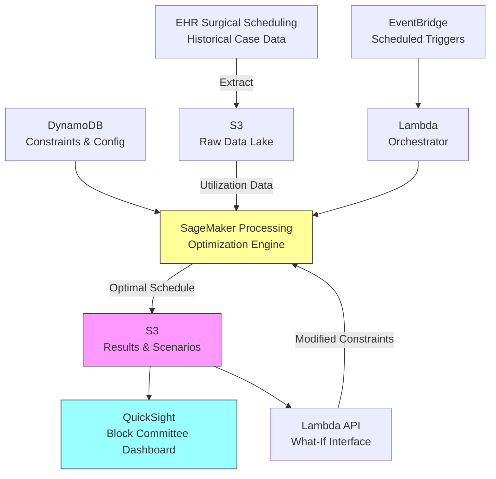

# Recipe 14.5: Operating Room Block Scheduling

**Complexity:** Medium · **Phase:** Optimization · **Estimated Cost:** ~$200-800/month (solver + compute)

---

## The Problem

Operating rooms are the single most expensive resource in a hospital. A single OR suite costs between $30 and $100 per minute to operate when you factor in staffing, equipment, utilities, and the opportunity cost of an empty room. A mid-sized hospital with 15 ORs that each run 10 hours a day is spending $2.7 million per month on surgical suite operations. If utilization sits at 65% instead of 80%, that's roughly $400K per month in wasted capacity.

And yet, walk into most surgical scheduling offices and you'll find the block schedule (who gets which rooms, which days, which hours) being managed in a spreadsheet. Maybe it was optimized once, five years ago, by a consultant with a clipboard. Since then, the orthopedics department grew by two surgeons, the cardiac program launched a new structural heart service, and general surgery's volumes dropped 15% because two surgeons retired. The block schedule hasn't kept up.

Here's the political reality that makes this problem uniquely painful: OR block time is currency. Surgeons view their allocated blocks the way executives view corner offices. "I've had Tuesday mornings for 12 years" is a real argument you'll hear in a block committee meeting. Meanwhile, the cardiac surgeon who joined six months ago can't get cases on the schedule because every block is allocated to someone who might only use 55% of it. Patients wait longer for surgery. Downstream revenue suffers. The OR director is mediating turf wars instead of optimizing throughput.

The math problem underneath all this drama is actually well-defined: given a set of surgical services with varying demand profiles, a fixed number of rooms with specific capabilities (not every OR can handle robotics or cardiac bypass), surgeon availability patterns, and a target utilization rate, how do you allocate time blocks to maximize throughput while maintaining fairness across services?

This is a resource allocation problem. Operations research has been solving these since the 1950s. The challenge isn't the math. The challenge is making the math play nicely with the humans.

---

## The Technology: Optimization for Block Scheduling

### What Is Block Scheduling?

Most hospitals use a "block scheduling" model for OR allocation. The idea is simple: rather than letting every surgeon compete for time on a first-come-first-served basis (chaos), you pre-allocate chunks of time ("blocks") to surgical services or individual surgeons. A block might be "OR 3, Tuesday 7:00 AM to 3:00 PM, allocated to Orthopedics." That service owns that time and can fill it with their cases.

The alternative is open scheduling (anyone books any room), which works for small surgical centers but becomes a coordination nightmare at scale. Block scheduling provides predictability: surgeons know when they operate, staff can be scheduled in advance, and the hospital can plan downstream resources (recovery beds, ICU capacity, equipment sterilization).

The block schedule is typically set quarterly or semi-annually by a "block committee" (surgeon representatives, nursing leadership, OR director, sometimes a hospital administrator). The committee reviews utilization data, considers requests for more time, and adjusts allocations. In practice, these meetings are politically charged and often result in incremental tweaks rather than genuine optimization.

### The Optimization Formulation

At its core, OR block scheduling is a variant of the **assignment problem** with side constraints. You're assigning time-room pairs (blocks) to services, subject to:

**Decision variables:** Which service gets which block (room + day + time slot)?

**Objective function:** Maximize expected utilization across all blocks, possibly with secondary objectives like minimizing schedule disruption from the current allocation, maximizing surgeon satisfaction, or ensuring equitable access for smaller services.

**Hard constraints (must satisfy):**
- Room capability: cardiac cases can only go in ORs with bypass infrastructure
- Surgeon availability: Dr. X only operates Mon/Wed/Fri
- Minimum block size: a 2-hour block isn't useful if average case duration is 3.5 hours
- Maximum daily capacity: staff and equipment limits per room
- Regulatory requirements: certain procedures require specific staffing ratios

**Soft constraints (penalized in objective, not absolute):**
- Target utilization range (75-85% is typical sweet spot)
- Continuity preference: services prefer keeping their historical blocks
- Adjacency preference: same-service blocks in adjacent rooms simplify staffing
- Fairness: no service should be systematically disadvantaged

This formulation maps naturally to **mixed-integer programming (MIP)**. The decision variables are binary (service X gets block Y or doesn't), the constraints are linear inequalities, and the objective is a weighted sum of utilization, fairness, and disruption penalties.

### Solver Options

Once you've formulated the problem as a MIP, you need a solver to find the optimal (or near-optimal) allocation. The solver landscape breaks into tiers:

**Commercial solvers (Gurobi, CPLEX, Xpress):** These are the gold standard for MIP problems. Gurobi and CPLEX can handle problems with thousands of binary variables and find provably optimal solutions in seconds to minutes. They're expensive ($10K-50K/year for an enterprise license), but for a problem where the solution drives millions in OR revenue, the ROI is immediate. Most large health systems already have a license for one of these somewhere in their analytics department.

**Open-source solvers (HiGHS, CBC, GLPK, SCIP):** HiGHS is the leading open-source solver as of 2025 and handles MIP problems competently for medium-scale instances. CBC (COIN-OR Branch and Cut) is mature and widely used. For a 15-OR hospital with weekly blocks, these solvers will find good solutions, though they may take longer to prove optimality on larger instances.

**Metaheuristics (genetic algorithms, simulated annealing):** Useful when the constraint structure is too complex or non-linear for MIP formulation, or when you need to handle preferences that are hard to linearize. The tradeoff: no optimality guarantee, and tuning the algorithm parameters is an art. Generally not necessary for block scheduling, where MIP formulations work well.

**Constraint programming (CP-SAT, OR-Tools):** Google's OR-Tools CP-SAT solver is excellent for scheduling problems with complex constraint patterns. It can handle disjunctive constraints (this surgeon can operate in OR 3 OR OR 7, but not both simultaneously) more naturally than MIP in some cases. Free, fast, and well-documented.

For most hospital block scheduling problems (10-30 ORs, 5-20 services, weekly or bi-weekly block resolution), a MIP formulation solved by Gurobi, HiGHS, or CP-SAT will produce an optimal or near-optimal solution in under a minute. The problem size is modest by modern optimization standards.

### Batch vs. Real-Time Optimization

Block scheduling is fundamentally a **batch optimization** problem. You solve it once per quarter (or whenever the block committee decides to re-evaluate), and the solution stays fixed until the next planning cycle. This is not a real-time system.

However, there's a secondary layer that benefits from more frequent optimization: **block release and reallocation.** Most hospitals have a "release policy" where unused blocks are released back to an open pool some number of days before the surgical date (typically 7-14 days out). Optimizing which blocks to release, when to release them, and how to reallocate released time to waitlisted cases is a shorter-cycle optimization that might run daily or weekly.

The architecture needs to support both:
1. Quarterly strategic optimization (full block schedule redesign)
2. Weekly/daily tactical optimization (release and reallocation)

### What Makes This Hard in Practice

**Data quality.** Utilization calculations require accurate historical data: actual case start/end times, turnover times, cancellation rates, add-on rates. Many hospitals' surgical scheduling systems don't capture this cleanly. "Wheels in" vs. "patient in room" vs. "incision time" are different timestamps, and which one your system records determines your utilization calculation.

**Demand forecasting.** Optimal block allocation depends on expected future demand, not just historical volumes. A new surgeon joining next quarter, a service launching robotic cases, or a seasonal pattern (joint replacements spike in winter) all affect the right allocation. The optimizer needs demand estimates, not just history.

**Multi-objective tradeoffs.** Pure utilization maximization would give all blocks to the highest-volume services and starve smaller programs. Real-world block scheduling balances utilization against access (every service needs reasonable surgical access), fairness (growth opportunities for emerging programs), and strategic priorities (the hospital wants to grow its cardiac program even if current volumes don't justify the block time).

**Human acceptance.** The best optimization in the world is worthless if the block committee rejects it. Solutions that dramatically disrupt the current schedule face enormous political resistance. Building "continuity preference" into the objective function (penalizing large changes from the current allocation) helps, but there's an irreducible human element. Present the solution as a recommendation with transparent tradeoffs, not a mandate.

---

## General Architecture Pattern

```text
[Historical Data] --> [Demand Forecasting] --> [Optimization Model] --> [Solution Analysis] --> [Committee Review]
       |                                              |                         |
   Utilization                                  Constraints             What-if scenarios
   Case durations                               Objectives             Sensitivity analysis
   Surgeon schedules                            Solver                 Visualization
   Room capabilities
```

**Stage 1: Data aggregation.** Pull surgical case logs, block utilization metrics, surgeon availability calendars, room capability matrices, and any pending service-line changes (new surgeons, retiring surgeons, program expansions). Clean and validate. Time range: typically 6-12 months of historical data for stable demand estimation.

**Stage 2: Demand estimation.** For each service, estimate expected weekly case volume (by case type/duration), case mix distribution, and any known future changes. This can be simple (trailing 6-month average) or sophisticated (time series forecast accounting for growth trends and seasonality).

**Stage 3: Model formulation.** Translate the data into an optimization model: define decision variables (block-to-service assignments), encode constraints (room capabilities, surgeon availability, minimum block sizes), and set the objective function (weighted utilization + fairness + continuity).

**Stage 4: Solve.** Run the solver. For most hospital-scale problems, this takes seconds to a few minutes. Retrieve the optimal allocation and the objective value.

**Stage 5: Solution analysis.** Don't just present the raw allocation. Compute expected utilization per service under the new schedule, compare against current allocation, identify which services gain and lose time, and quantify the expected improvement. Generate "what-if" scenarios: what if we add a room? What if this surgeon reduces to 3 days?

**Stage 6: Human review.** Present to the block committee with visualizations and tradeoff explanations. Allow iterative refinement (lock certain blocks, re-optimize around them). The tool should support "what does the schedule look like if we give Cardiology an extra Tuesday block?" questions interactively.

---

## The AWS Implementation

### Why These Services

**Amazon SageMaker Processing for model execution.** The optimization model runs as a batch job: load data, formulate the MIP, solve it, write results. SageMaker Processing Jobs give you on-demand compute (up to powerful instances with lots of RAM for large models), pay-per-use pricing, and the ability to bring your own container (which matters because you'll want your solver of choice installed). For a quarterly run that takes 5-10 minutes of compute, this is far cheaper than maintaining a dedicated server.

**Amazon S3 for data staging and results.** Utilization data, constraint files, solver outputs, and scenario analyses all live in S3. It serves as the durable layer between the source systems (EHR surgical scheduling module), the optimization engine, and the visualization/reporting layer.

**AWS Lambda for orchestration and API.** Lambda coordinates the pipeline: triggered by a schedule or on-demand request, it kicks off the SageMaker Processing Job, monitors completion, and notifies downstream consumers. For the interactive "what-if" layer (where a committee member asks "what if we lock OR 5 for Neuro?"), a Lambda-backed API endpoint accepts constraint modifications and launches re-optimization runs.

**Amazon DynamoDB for constraint and configuration management.** Room capability matrices, surgeon availability patterns, service-line metadata, and optimization parameters (weights, thresholds, release policies) change more frequently than the block schedule itself. DynamoDB provides low-latency reads for the solver to pull current constraints and fast writes for administrators updating configurations.

**Amazon QuickSight for visualization.** Block schedules, utilization heatmaps, service-level comparisons, and scenario analysis dashboards. The block committee needs to see the tradeoffs visually, not as a spreadsheet of numbers. QuickSight connects directly to S3 results and provides interactive filtering.

**Amazon EventBridge for scheduling.** Triggers the tactical (daily/weekly release optimization) and strategic (quarterly full re-optimization) runs on configurable schedules. Also enables event-driven re-optimization when significant schedule changes occur (surgeon goes on leave, new OR comes online).

### Architecture Diagram



### Prerequisites

| Requirement | Details |
|-------------|---------|
| **AWS Services** | Amazon SageMaker, Amazon S3, AWS Lambda, Amazon DynamoDB, Amazon QuickSight, Amazon EventBridge |
| **IAM Permissions** | `sagemaker:CreateProcessingJob`, `s3:GetObject`, `s3:PutObject`, `dynamodb:GetItem`, `dynamodb:Query`, `events:PutRule`, `quicksight:*` (scoped to dashboards) |
| **BAA** | AWS BAA signed (surgeon schedules and room assignments may be linked to patient procedures, which constitutes PHI) |
| **Encryption** | S3: SSE-KMS; DynamoDB: encryption at rest (default); SageMaker Processing: volume encryption enabled; all API calls over TLS |
| **VPC** | Production: SageMaker Processing in VPC with VPC endpoints for S3 and DynamoDB. Lambda in VPC if accessing internal EHR data feeds. |
| **CloudTrail** | Enabled: audit all SageMaker and S3 API calls |
| **Sample Data** | Synthetic surgical case logs with case durations, service assignments, and room identifiers. Never use real surgical schedules in dev (they contain surgeon names linked to patient procedures). |
| **Cost Estimate** | SageMaker Processing: ~$0.50 per optimization run (ml.m5.xlarge for 5 min). S3/DynamoDB/Lambda: negligible. QuickSight: $24/user/month. Total: $200-800/month depending on users and run frequency. |

### Ingredients

| AWS Service | Role |
|------------|------|
| **Amazon SageMaker Processing** | Runs optimization solver in a containerized environment with the solver and model code |
| **Amazon S3** | Stores historical utilization data, constraint files, optimization results, and scenario outputs |
| **AWS Lambda** | Orchestrates pipeline execution, provides API for what-if requests |
| **Amazon DynamoDB** | Manages room capabilities, surgeon availability, optimization parameters |
| **Amazon QuickSight** | Visualizes block schedules, utilization metrics, and scenario comparisons |
| **Amazon EventBridge** | Schedules regular optimization runs (daily tactical, quarterly strategic) |
| **AWS KMS** | Manages encryption keys for all data stores |

### Code

#### Walkthrough

**Step 1: Data extraction and preparation.** The system pulls historical surgical case data from the data lake: every completed case for the past 6-12 months with its service line, room, actual start time, actual end time, and turnover time to the next case. It also pulls the current block schedule (who owns which blocks today) and the room capability matrix (which rooms support which case types). This data forms the input to both demand estimation and the optimization model. Without accurate historical data, the optimizer is guessing. Garbage in, garbage out applies with particular force here because surgeons will immediately challenge an allocation based on data they know is wrong.

```pseudocode
FUNCTION extract_optimization_inputs(lookback_months):
    // Pull completed surgical cases from the past N months.
    // Each record includes: service_line, room_id, case_date, actual_start, actual_end,
    // turnover_minutes, case_type, primary_surgeon.
    case_history = query data lake for completed cases in last lookback_months

    // Pull the current block schedule: which service owns which room-day-time block.
    current_blocks = query scheduling system for active block allocations

    // Pull room capabilities: which rooms can handle which case types.
    // Example: OR 7 has robotic infrastructure, OR 12 has cardiac bypass.
    room_capabilities = read from configuration store (DynamoDB)

    // Pull surgeon availability: which days each surgeon is available to operate.
    surgeon_availability = read from configuration store (DynamoDB)

    // Calculate utilization metrics per block: how much of each allocated block
    // was actually used (case time + turnover) vs. how much sat empty.
    block_utilization = calculate for each block:
        used_minutes = sum of (case_duration + turnover) for cases in this block
        allocated_minutes = total minutes in the block
        utilization_rate = used_minutes / allocated_minutes

    RETURN case_history, current_blocks, room_capabilities,
           surgeon_availability, block_utilization
```

**Step 2: Demand estimation.** For each surgical service, estimate the expected weekly demand in terms of OR hours needed. This accounts for historical volumes, known growth trends (new surgeon starting, program expansion), and seasonal patterns. The output is a demand profile per service: "Orthopedics needs approximately 45 OR-hours per week across 3 rooms." Underestimating demand means a service runs out of time and cases get delayed. Overestimating means blocks sit empty. Both are expensive.

```pseudocode
FUNCTION estimate_demand(case_history, known_changes):
    demand_profiles = empty map

    FOR each service in unique services from case_history:
        // Calculate trailing average weekly OR-hours used by this service.
        weekly_hours = aggregate case_history by week for this service
        baseline_demand = mean of weekly_hours (excluding outlier weeks)

        // Apply known adjustments: new surgeons add volume, retirements subtract.
        adjusted_demand = baseline_demand
        FOR each change in known_changes affecting this service:
            IF change.type == "new_surgeon":
                adjusted_demand += change.expected_weekly_hours
            IF change.type == "surgeon_departure":
                adjusted_demand -= change.historical_weekly_hours

        // Calculate case mix: distribution of case durations for this service.
        // This helps set minimum useful block size (no point giving a 2-hour block
        // to a service whose average case is 4 hours).
        case_duration_distribution = percentiles(25th, 50th, 75th, 95th)
            from case_history for this service

        demand_profiles[service] = {
            weekly_hours_needed: adjusted_demand,
            case_duration_p50: case_duration_distribution.p50,
            case_duration_p95: case_duration_distribution.p95,
            preferred_block_size: max(4 hours, case_duration_distribution.p75 * 2)
        }

    RETURN demand_profiles
```

**Step 3: Model formulation.** This is the core of the optimization. Define the decision variables (which service gets which block), encode all constraints, and build the objective function. The objective balances three competing goals: maximize overall utilization, minimize disruption from the current schedule (to improve acceptance), and maintain fairness across services. The constraint set includes room capabilities, surgeon availability, minimum block sizes, and maximum weekly hours for any single service. Getting the constraint encoding right is critical: a constraint that's too tight makes the problem infeasible; one that's too loose produces solutions that violate real-world requirements.

```pseudocode
FUNCTION formulate_model(blocks, services, demand_profiles, room_capabilities,
                         surgeon_availability, current_allocation, weights):
    // Create the optimization model.
    model = new MixedIntegerProgram()

    // DECISION VARIABLES
    // x[s][b] = 1 if service s is assigned block b, 0 otherwise
    FOR each service s, each block b:
        x[s][b] = model.add_binary_variable(name="assign_{s}_{b}")

    // HARD CONSTRAINTS

    // Each block assigned to exactly one service (or left unallocated).
    FOR each block b:
        model.add_constraint(
            sum(x[s][b] for all services s) <= 1
        )

    // Room capability: service can only be assigned to capable rooms.
    FOR each service s, each block b:
        IF b.room NOT in room_capabilities[s].compatible_rooms:
            model.add_constraint(x[s][b] == 0)

    // Surgeon availability: blocks must align with surgeon operating days.
    FOR each service s, each block b:
        IF b.day_of_week NOT in surgeon_availability[s].operating_days:
            model.add_constraint(x[s][b] == 0)

    // Minimum block size: don't give a service a block shorter than their
    // typical case duration (it would be unusable).
    FOR each service s, each block b:
        IF b.duration_hours < demand_profiles[s].preferred_block_size * 0.5:
            model.add_constraint(x[s][b] == 0)

    // SOFT OBJECTIVES (combined into weighted sum)

    // Objective 1: Maximize expected utilization.
    // Approximate: allocated hours should match demand (overallocation wastes time).
    utilization_score = 0
    FOR each service s:
        allocated_hours = sum(b.duration_hours * x[s][b] for all blocks b)
        // Penalize both over-allocation and under-allocation
        utilization_score += -abs(allocated_hours - demand_profiles[s].weekly_hours_needed)

    // Objective 2: Minimize schedule disruption (continuity with current allocation).
    disruption_penalty = 0
    FOR each service s, each block b:
        IF current_allocation[b] == s:
            // Keeping a block with its current owner has zero disruption.
            disruption_penalty += 0
        ELSE:
            // Reassigning a block incurs a disruption cost.
            disruption_penalty += x[s][b] * 1.0

    // Objective 3: Fairness (each service gets at least a minimum share).
    // Implement as constraint rather than objective for simplicity.
    FOR each service s:
        min_hours = demand_profiles[s].weekly_hours_needed * 0.7  // at least 70% of need
        model.add_constraint(
            sum(b.duration_hours * x[s][b] for all blocks b) >= min_hours
        )

    // Combined objective:
    model.maximize(
        weights.utilization * utilization_score
        - weights.disruption * disruption_penalty
    )

    RETURN model
```

**Step 4: Solve and extract solution.** Pass the formulated model to the solver and extract the optimal block allocation. The solver may find the global optimum (for commercial solvers on medium problems, this is typical) or a provably near-optimal solution within a configurable gap tolerance (e.g., within 1% of optimal). If the model is infeasible (no allocation satisfies all hard constraints), the system identifies which constraints are conflicting so administrators can relax requirements. Skipping the feasibility check means you'll get cryptic "infeasible" errors with no indication of what to fix.

```pseudocode
FUNCTION solve_and_extract(model, solver_config):
    // Configure solver parameters.
    solver = initialize_solver(type=solver_config.solver_type)  // e.g., "HiGHS", "Gurobi", "CP-SAT"
    solver.set_time_limit(solver_config.max_seconds)            // e.g., 300 seconds
    solver.set_optimality_gap(solver_config.gap_tolerance)      // e.g., 0.01 (1%)

    // Solve the model.
    result = solver.solve(model)

    IF result.status == "INFEASIBLE":
        // No valid allocation exists under current constraints.
        // Identify conflicting constraints for administrator review.
        conflicts = solver.compute_irreducible_infeasible_set(model)
        RETURN { status: "infeasible", conflicts: conflicts }

    IF result.status == "OPTIMAL" OR result.status == "FEASIBLE":
        // Extract the block assignments from the solution.
        schedule = empty map
        FOR each service s, each block b:
            IF value_of(x[s][b]) == 1:
                schedule[b] = s

        RETURN {
            status: result.status,
            schedule: schedule,
            objective_value: result.objective_value,
            optimality_gap: result.gap,
            solve_time_seconds: result.solve_time
        }
```

**Step 5: Solution analysis and scenario generation.** The raw optimal schedule is not the final output. The system computes per-service metrics under the proposed schedule (expected utilization, hours gained/lost vs. current, cases per week), generates comparison visualizations, and supports scenario analysis. The block committee will ask "what if we give Cardiac an extra morning?" The system should answer that in seconds by modifying constraints and re-solving.

```pseudocode
FUNCTION analyze_solution(schedule, demand_profiles, current_allocation):
    analysis = empty map

    FOR each service s:
        new_hours = sum of block durations assigned to s in schedule
        current_hours = sum of block durations assigned to s in current_allocation
        expected_utilization = demand_profiles[s].weekly_hours_needed / new_hours

        analysis[s] = {
            allocated_hours: new_hours,
            previous_hours: current_hours,
            change_hours: new_hours - current_hours,
            expected_utilization: expected_utilization,
            blocks_gained: list of blocks newly assigned to s,
            blocks_lost: list of blocks removed from s
        }

    // Summary metrics
    total_utilization = weighted_mean(analysis[s].expected_utilization for all s)
    disruption_score = count of blocks that changed service assignment
    fairness_score = min(analysis[s].allocated_hours / demand_profiles[s].weekly_hours_needed
                        for all s)

    RETURN {
        per_service: analysis,
        total_expected_utilization: total_utilization,
        blocks_changed: disruption_score,
        fairness_min_ratio: fairness_score
    }
```

**Step 6: Store results and notify.** Write the optimization results, scenario analyses, and supporting metrics to durable storage. Trigger notifications to the OR director and block committee members that a new schedule recommendation is ready for review. Include a link to the dashboard where they can explore scenarios interactively.

```pseudocode
FUNCTION store_and_notify(results, analysis, run_metadata):
    // Write complete results to S3 for archival and dashboard consumption.
    write to S3:
        path = "optimization-results/{run_id}/schedule.json"
        content = results.schedule

    write to S3:
        path = "optimization-results/{run_id}/analysis.json"
        content = analysis

    write to S3:
        path = "optimization-results/{run_id}/metadata.json"
        content = {
            run_id: run_metadata.run_id,
            run_timestamp: current UTC timestamp,
            solver: run_metadata.solver_type,
            solve_time: results.solve_time_seconds,
            status: results.status,
            objective_value: results.objective_value
        }

    // Notify stakeholders.
    publish notification:
        channel = "or-block-optimization"
        message = "New block schedule recommendation ready. "
                  + "Expected utilization improvement: {delta}%. "
                  + "Review at: {dashboard_url}"
```

> **Curious how this looks in Python?** The pseudocode above covers the concepts. If you'd like to see sample Python code that demonstrates these patterns using boto3 and an open-source solver, check out the [Python Example](chapter14.05-python-example). It walks through each step with inline comments and notes on what you'd need to change for a real deployment.

### Expected Results

**Sample output for a 12-OR hospital with 8 surgical services:**

```json
{
  "run_id": "opt-2026-Q3-001",
  "status": "OPTIMAL",
  "solve_time_seconds": 12.4,
  "optimality_gap": 0.0,
  "summary": {
    "total_expected_utilization": 0.81,
    "previous_utilization": 0.68,
    "blocks_changed": 14,
    "total_blocks": 60,
    "fairness_min_ratio": 0.78
  },
  "per_service": {
    "Orthopedics": {
      "allocated_hours": 48,
      "previous_hours": 52,
      "change_hours": -4,
      "expected_utilization": 0.85
    },
    "Cardiac Surgery": {
      "allocated_hours": 32,
      "previous_hours": 24,
      "change_hours": 8,
      "expected_utilization": 0.82
    },
    "General Surgery": {
      "allocated_hours": 28,
      "previous_hours": 36,
      "change_hours": -8,
      "expected_utilization": 0.79
    }
  }
}
```

**Performance benchmarks:**

| Metric | Typical Value |
|--------|---------------|
| Solve time (12 ORs, 8 services) | 5-30 seconds |
| Solve time (30 ORs, 20 services) | 1-5 minutes |
| Utilization improvement (typical) | 8-15 percentage points |
| Schedule disruption | 15-30% of blocks change |
| Model formulation time | < 2 seconds |
| Scenario re-solve (one constraint change) | 3-10 seconds |

**Where it struggles:** Instances where demand far exceeds capacity (mathematically infeasible without priority rules). Hospitals with very rigid surgeon preferences that conflict with optimal allocation. Situations where the data is wrong (e.g., case durations include excessive padding that hides true utilization). And the eternal challenge: surgeons who insist their blocks are non-negotiable regardless of what the model says.

---

## The Honest Take

The optimization part of this recipe is the easy part. I mean that sincerely. Formulating a MIP for block scheduling is a well-studied problem. Any operations research graduate student could do it in a weekend. The solver handles the hard math.

The actual hard parts, in order of difficulty:

1. **Getting clean data.** Hospital surgical scheduling systems are notorious for data quality issues. Case start/end times are entered inconsistently. Turnover times aren't always captured. Cancellations might not be recorded with the right reason code. You'll spend more time on data cleaning than on optimization.

2. **Getting the weights right.** The objective function has weights for utilization vs. disruption vs. fairness. Those weights encode value judgments: "How much utilization improvement is worth displacing a surgeon from their traditional block?" There's no mathematically correct answer. It's a policy decision, and different hospitals will answer it differently.

3. **Getting humans to accept the result.** I've seen technically optimal schedules rejected because they moved a powerful surgeon's Thursday afternoon block. I've seen sub-optimal schedules adopted because they preserved enough of the status quo that no one fought them. Build your tool to support incremental change, not revolution. Present scenarios, not mandates. Let the committee "choose" the optimization by locking their non-negotiables and letting the model optimize around them.

4. **The release and reallocation problem.** The quarterly block schedule is table stakes. The real daily value comes from intelligent block release: identifying blocks that will likely go unused (based on booking patterns) and proactively offering that time to services with waitlisted cases. This is a separate, shorter-cycle optimization that most hospitals never implement because they spent all their effort on the quarterly problem.

One thing that surprised me: the biggest utilization gains often don't come from reshuffling blocks at all. They come from identifying blocks that should be split (a full-day block for a service that only has half-day demand, leaving the afternoon consistently empty) or merged (two adjacent half-day blocks for high-volume services whose cases consistently overrun into the gap between them).

---

## Variations and Extensions

**Dynamic block release optimization.** Instead of a static release policy (release unused blocks 7 days out), build a predictive model that estimates block fill probability based on current bookings vs. historical fill patterns. Release blocks earlier when fill probability is low; hold them longer when a late-booking pattern is likely. This can recover 5-10% additional utilization from released time.

**Multi-site optimization.** For health systems with multiple surgical facilities, extend the model to allocate cases across sites. A patient's joint replacement might be schedulable at three locations with different wait times. The system optimizer considers room availability, surgeon privileges, and patient geography to recommend the earliest available option across the system.

**Stochastic optimization for case duration uncertainty.** Replace deterministic demand estimates with probability distributions. Use stochastic programming or robust optimization to find block allocations that perform well across a range of demand scenarios, not just the expected case. This prevents the "optimal schedule that falls apart when one case runs long" failure mode.

---

## Related Recipes

- **Recipe 14.4 (Nurse Staffing Optimization):** Shares the constrained scheduling formulation pattern; nurse schedules must align with OR block assignments
- **Recipe 14.7 (OR Case Sequencing):** Optimizes the daily case order within a block; this recipe determines which blocks exist, that recipe fills them
- **Recipe 12.5 (Hospital Census Forecasting):** Downstream bed demand depends on OR volume; block schedule changes affect census predictions
- **Recipe 14.1 (Appointment Slot Optimization):** Similar optimization formulation for a simpler resource (clinic time slots vs. OR blocks)

---

## Additional Resources

**AWS Documentation:**
- [Amazon SageMaker Processing Jobs](https://docs.aws.amazon.com/sagemaker/latest/dg/processing-job.html)
- [Amazon SageMaker Bring Your Own Container](https://docs.aws.amazon.com/sagemaker/latest/dg/docker-containers.html)
- [Amazon EventBridge Scheduled Rules](https://docs.aws.amazon.com/eventbridge/latest/userguide/eb-create-rule-schedule.html)
- [Amazon QuickSight Embedding](https://docs.aws.amazon.com/quicksight/latest/user/embedded-analytics.html)
- [AWS HIPAA Eligible Services](https://aws.amazon.com/compliance/hipaa-eligible-services-reference/)

**Optimization Solver Resources:**
- [HiGHS Optimization Solver](https://highs.dev/) (open-source, high-performance LP/MIP solver)
- [Google OR-Tools](https://developers.google.com/optimization) (open-source constraint programming and optimization)
- [PuLP Python Library](https://coin-or.github.io/pulp/) (Python interface to multiple MIP solvers)

**Healthcare OR Scheduling Literature:**
- TODO: Verify and add specific journal references for OR block scheduling optimization models
- TODO: Verify link to INFORMS Healthcare application papers on surgical scheduling

---

## Estimated Implementation Time

| Tier | Timeline | What You Get |
|------|----------|--------------|
| **Basic** | 3-4 weeks | Batch optimizer for quarterly block reallocation with static constraints and basic reporting |
| **Production-ready** | 8-12 weeks | Full pipeline with demand forecasting, what-if scenarios, dashboard, and integration with scheduling system |
| **With variations** | 16-20 weeks | Add dynamic release optimization, multi-site support, and stochastic demand handling |

---

## Tags

`optimization` · `operations-research` · `scheduling` · `mixed-integer-programming` · `operating-room` · `surgical-scheduling` · `resource-allocation` · `sagemaker` · `batch-optimization` · `medium`

---

*← [Recipe 14.4: Nurse Staffing Optimization](chapter14.04-nurse-staffing-optimization) · [Chapter 14 Index](chapter14-index) · [Next: Recipe 14.6: Patient Flow / Bed Assignment →](chapter14.06-patient-flow-bed-assignment)*
