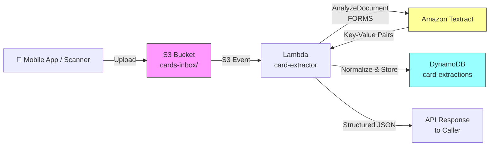

# Recipe 1.1 Architecture and Implementation: Insurance Card Scanning

*Companion to [Recipe 1.1: Insurance Card Scanning](chapter01.01-insurance-card-scanning). This page covers the AWS architecture, services, prerequisites, and pseudocode. For the problem framing and the conceptual approach, start with the main recipe.*

---

## The AWS Implementation

Let's get specific. Here's how I'd build this on AWS, and why each service is the right tool for each job.

### Why These Services

**Amazon Textract for OCR and KVP extraction.** Textract is AWS's managed document extraction service, and it's the obvious choice here because of one feature: the `AnalyzeDocument` API with `FORMS` feature type. Rather than just returning raw text (like basic OCR would), the FORMS feature analyzes the spatial layout of the document and returns explicit key-value pairs. It already understands the relationship between a label and its nearby value. You get back structured data, not a wall of characters you have to parse yourself. For single-page semi-structured documents like insurance cards, it's exactly the right abstraction.

**Amazon S3 for image storage.** You need a durable, encrypted place to receive card images before processing and to retain them afterward (for audit, reprocessing, and human review workflows). S3 with SSE-KMS encryption is the standard choice. The S3 event notification system also gives you a clean trigger for the processing pipeline: image lands in the bucket, Lambda fires automatically.

**AWS Lambda for orchestration.** The card extraction workflow is a short-lived, stateless sequence of API calls: get the image from S3, call Textract, parse the response, normalize the fields, write to DynamoDB. That's a textbook Lambda workload. No persistent servers to manage, automatic scaling with your request volume, and you pay only for execution time. For synchronous point-of-care use, you can put API Gateway in front of Lambda and get a direct REST endpoint.

**Amazon DynamoDB for result storage.** Extraction results are write-once (you scan a card, you store the result) with frequent point lookups by member ID or scan ID. DynamoDB's key-value access model fits perfectly. It's fully managed, scales transparently, and supports encryption at rest by default. For healthcare workloads, it's also on AWS's HIPAA eligible services list.

### Architecture Diagram



### Prerequisites

| Requirement | Details |
|-------------|---------|
| **AWS Services** | Amazon Textract, Amazon S3, AWS Lambda, Amazon DynamoDB |
| **IAM Permissions** | `textract:AnalyzeDocument`, `s3:GetObject`, `s3:PutObject`, `dynamodb:PutItem` |
| **BAA** | AWS BAA signed (required: insurance cards contain PHI) |
| **Encryption** | S3: SSE-KMS; DynamoDB: encryption at rest enabled (default); Lambda CloudWatch log groups: configure KMS encryption (Lambda does not do this automatically; logs can contain extracted field values); all API calls over TLS |
| **DynamoDB PITR** | Enable DynamoDB Point-in-Time Recovery (PITR) for PHI tables; it provides continuous backup and supports disaster recovery and incident response. |
| **VPC** | Production: Lambda in VPC with VPC endpoints for S3, Textract, DynamoDB, and CloudWatch Logs. The Logs endpoint is easy to forget: a Lambda in a private subnet without it silently drops all log output. Enable VPC Flow Logs for network-level audit trail (CloudTrail covers API calls; Flow Logs cover network traffic, completing the HIPAA audit picture). |
| **CloudTrail** | Enabled: log all Textract and S3 API calls for HIPAA audit trail |
| **Sample Data** | Synthetic insurance card images. CMS provides [sample Medicare cards](https://www.cms.gov/medicare/new-medicare-card) for layout reference. Never use real member cards in dev. |
| **Cost Estimate** | Textract AnalyzeDocument (FORMS): $0.05 per page. At one page per card, that's $0.05/card. Lambda and DynamoDB costs are negligible at this scale. |

### Ingredients

| AWS Service | Role |
|------------|------|
| **Amazon Textract** | Extracts key-value pairs (FORMS) from card image |
| **Amazon S3** | Stores incoming card images; encrypted at rest with KMS |
| **AWS Lambda** | Orchestrates the extraction: triggers on S3, calls Textract, normalizes output |
| **Amazon DynamoDB** | Stores structured extraction results for downstream lookup |
| **AWS KMS** | Manages encryption keys for S3 and DynamoDB |
| **Amazon CloudWatch** | Logs, metrics, alarms for extraction failures and latency |

### Code

> **Reference implementations:** The following AWS sample repos demonstrate the patterns used in this recipe:
>
> - [`amazon-textract-code-samples`](https://github.com/aws-samples/amazon-textract-code-samples): General Textract code samples including FORMS extraction for key-value pair documents
> - [`amazon-textract-and-amazon-comprehend-medical-claims-example`](https://github.com/aws-samples/amazon-textract-and-amazon-comprehend-medical-claims-example): Healthcare-specific: extracting and validating medical claims data with Textract and Comprehend Medical
> - [`guidance-for-low-code-intelligent-document-processing-on-aws`](https://github.com/aws-solutions-library-samples/guidance-for-low-code-intelligent-document-processing-on-aws): Full IDP pipeline guidance covering ingestion, extraction, enrichment, and storage

#### Walkthrough

**Step 1: Textract call.** When a card image lands in the storage bucket, the system wakes up automatically and passes it to Amazon Textract for analysis. The key choice is requesting FORMS extraction rather than basic text recognition. FORMS mode is specifically designed for documents where labels and values are paired together ("Member ID: XGP928471003"). Basic text recognition would return a jumble of characters with no structure; FORMS mode returns an organized list of matched label-value pairs. Because insurance cards are single-page, results come back immediately (under 3 seconds in practice). Multi-page documents would require a different, background-processing approach. Skip this step or use basic OCR, and everything downstream breaks: you'd be trying to reconstruct structure from unstructured text, and accuracy would drop significantly.

```pseudocode
FUNCTION extract_card(bucket, key):
    // Send the card image to Textract for intelligent analysis.
    // "bucket" is the name of the storage container; "key" is the filename/path of the image.
    // Together they tell Textract exactly which image to process.
    response = call Textract.AnalyzeDocument with:
        document  = S3 object at bucket/key   // locate the image in cloud storage
        features  = ["FORMS"]                 // use FORMS mode: extract label-value pairs,
                                              // not just raw text (this is the critical choice)
    RETURN response  // pass the full Textract response back to the next step
```

**Step 2: Parse key-value pairs.** Textract doesn't return a tidy spreadsheet. It returns a list of text building blocks, each one representing a detected region of the image, connected by links that indicate which label belongs with which value. This step walks through that structure and assembles the matched pairs. Think of it as sorting through a pile of index cards where some say "Member ID" and others say "XGP928471003", following the arrows that connect each label to its corresponding answer. The output is a clean map of label text to value text, each accompanied by a confidence score reflecting how clearly Textract was able to read it. Skip this step and you're left with raw building blocks that no downstream system can use.

```pseudocode
FUNCTION parse_key_value_pairs(textract_response):
    // Pull out the full list of detected text regions ("blocks") from Textract's response.
    // Each block represents one piece of detected content: a word, a label, or a value.
    blocks    = textract_response.Blocks

    // Build a fast lookup index: block ID -> block data.
    // Textract connects blocks by referencing their IDs, so we need this index
    // to follow those links without scanning the entire list every time.
    block_map = build map of block.Id -> block for all blocks

    // This will hold our results: label text -> { value text, confidence score }.
    key_values = empty map

    FOR each block in blocks:
        // Only process blocks that are part of a key-value pair.
        // Textract labels each block as either a KEY (the label, e.g., "Member ID")
        // or a VALUE (the answer, e.g., "XGP928471003"). We start with the KEY side.
        IF block.BlockType == "KEY_VALUE_SET" AND block is a KEY entity:

            // Assemble the full label text by combining this block's child text pieces.
            // Example output: "Member ID" or "Group #"
            key_text    = get concatenated text from block's CHILD blocks in block_map

            // Follow the link from this KEY block to its paired VALUE block.
            // Textract stores this connection as a "VALUE" relationship on the KEY block.
            value_block = follow block's VALUE relationship to find the linked value block

            // Assemble the full value text from the value block's child text pieces.
            // Example output: "XGP928471003" or "84023"
            value_text  = get concatenated text from value_block's CHILD blocks in block_map

            // Record the lower of the two confidence scores (key vs. value).
            // If either side was hard to read, we want to know about it.
            // This score will drive the quality gate in Step 4.
            confidence  = minimum of (block.Confidence, value_block.Confidence)

            // Store the matched pair: label -> { value, confidence }
            key_values[key_text] = { value: value_text, confidence: confidence }

    // Return the complete set of matched pairs ready for normalization.
    RETURN key_values
```

**Step 3: Normalize field names.** Here's the operational reality of insurance cards: every payer uses different label text for the same fields. "Member ID," "Mem ID," "Subscriber #," and "ID Number" all mean the same thing. Without this normalization step, the system would treat each variant as a different field, and downstream systems expecting a standardized `member_id` field would come up empty. This step translates whatever labels Textract found on a given card into a consistent, predictable set of field names, regardless of which payer issued the card. The mapping table (FIELD_MAP) is built from real-world payer layouts and requires ongoing maintenance as new layouts are encountered. Treat it as a living configuration, not a one-time build. Skip this step and you'll have accurate text extraction with no reliable way to put that data to use.

```json
{
  "member_id":        ["member id", "mem id", "member #", "subscriber id", "id number", "member number"],
  "group_number":     ["group #", "group number", "group", "grp #", "grp"],
  "payer_name":       ["insurance company", "plan name", "payer", "carrier"],
  "plan_type":        ["plan type", "plan", "product"],
  "copay_pcp":        ["pcp copay", "office visit", "copay", "pcp"],
  "copay_specialist": ["specialist copay", "specialist"],
  "copay_er":         ["er copay", "emergency room", "er"],
  "rx_bin":           ["rx bin", "bin"],
  "rx_pcn":           ["rx pcn", "pcn"],
  "rx_group":         ["rx group", "rx grp"]
}
```

```pseudocode
FUNCTION normalize_fields(raw_kv):
    // Start with an empty result set. We'll populate it with standardized field names.
    normalized = empty map

    // Walk through each canonical (standard) field name and its list of known label variants.
    // "canonical" means the consistent name we always use, regardless of what's on the card.
    FOR each canonical_name, variants in FIELD_MAP:

        // For each standard field, check every label Textract found on this card.
        FOR each raw_key, raw_val in raw_kv:

            // Normalize to lowercase with no extra whitespace before comparing.
            // This handles capitalization differences ("MEMBER ID" vs. "Member ID").
            IF lowercase(trim(raw_key)) is in variants:

                // Match found. Store this field under its standard name.
                // trim() removes any stray whitespace Textract may have included.
                normalized[canonical_name] = {
                    value:      trim(raw_val.value),  // the extracted text value, cleaned up
                    confidence: raw_val.confidence    // how confident Textract was (0-100)
                }
                BREAK   // found a match for this field; no need to keep checking variants

    // Return the normalized map: consistent field names ready for the quality gate.
    RETURN normalized
```

**Step 4: Confidence gating.** Not every field Textract reads is equally reliable. Glare across the member ID, a worn digit, a card photographed at a steep angle: all of these reduce confidence in the extracted value. This step applies a quality gate: any field below 90% confidence is held back from automatic processing and routed to a human for verification. This matters both for accuracy and for compliance. A wrong member ID on a claim triggers denied reimbursement, billing investigations, and patient frustration. The cost of a human taking five seconds to confirm a borderline value is far lower than the cost of a wrong value silently becoming a fact in your systems of record. The full human review queue that these flagged fields feed into is built in Recipe 1.6.

```pseudocode
CONFIDENCE_THRESHOLD = 90.0  // fields below 90% confidence go to human review, not directly to the database

FUNCTION flag_low_confidence(fields):
    // Two buckets: fields we're confident about, and fields that need a human eye.
    clean   = empty map   // high-confidence fields, safe to use immediately
    flagged = empty list  // low-confidence fields, held for review

    FOR each field, data in fields:
        IF data.confidence >= CONFIDENCE_THRESHOLD:
            // Confidence is high enough. Accept this value for downstream use.
            clean[field] = data.value

        ELSE:
            // Confidence is too low to trust automatically.
            // Don't discard the value: record it for a reviewer to confirm or correct.
            // Never let a low-confidence extraction silently become a fact in your database.
            append to flagged: {
                field:           field,            // which field is uncertain (e.g., "member_id")
                extracted_value: data.value,       // what Textract thinks it read (e.g., "XGP92847l003")
                confidence:      data.confidence   // how confident it was (e.g., 78.4%)
            }

    // Return both sets so the caller knows what's ready to use and what needs review.
    RETURN clean, flagged
```

> **Human Review Infrastructure**
>
> This recipe flags low-confidence fields for human review but does not implement the review workflow itself. The full human review infrastructure, including Amazon A2I integration with a private HIPAA-trained workforce, reviewer interface configuration, correction audit trails, and feedback loops, is built in Recipe 1.6. For production deployments, apply Recipe 1.6's A2I pattern to the flagged fields from this recipe. Key requirements: reviewers must be HIPAA-trained staff operating under a BAA, corrections must be traceable in the audit record, and the review queue message format should be consistent across recipes to enable a unified review interface.

**Step 5: Store results.** The final step writes everything to the database: the high-confidence fields ready for immediate use, the flagged fields awaiting human verification, and a timestamp for the audit trail. Every record includes a `needs_review` flag so downstream systems and review queues can instantly identify cards that require attention. In healthcare, every system touching PHI needs an auditable record: what was processed, when, and what came out. This step creates that record. It also enables reprocessing: if Textract releases a new model version with improved accuracy, you can identify historical scans with low-confidence fields and run them through again.

```pseudocode
FUNCTION store_result(image_key, fields, flagged):
    // Write a complete, permanent record of this extraction to the database.
    // This record is the authoritative output of the pipeline for this card scan.
    write record to database table "card-extractions":
        image_key            = image_key                          // which image was processed
                                                                  // (links back to the original file in S3)
        extraction_timestamp = current UTC timestamp (ISO 8601)   // when this happened, for audit and compliance reporting
        fields               = fields                             // all high-confidence field values, ready to use
        flagged_fields       = flagged                            // fields held for human review, with their extracted values
        needs_review         = (length of flagged > 0)           // true if ANY field needs review;
                                                                  // downstream systems check this flag to route cards appropriately
```

> **Curious how this looks in Python?** The pseudocode above covers the concepts. If you'd like to see sample Python code that demonstrates these patterns using boto3, check out the [Python Example](chapter01.01-python-example). It walks through each step with inline comments and notes on what you'd need to change for a real deployment.

### Expected Results

**Sample output for a typical BCBS card:**

```json
{
  "image_key": "cards-inbox/2026/03/01/scan-00482.jpg",
  "extraction_timestamp": "2026-03-01T14:22:08Z",
  "fields": {
    "member_id": "XGP928471003",
    "group_number": "84023",
    "payer_name": "Blue Cross Blue Shield of Kentucky",
    "plan_type": "PPO",
    "copay_pcp": "$25",
    "copay_specialist": "$50",
    "copay_er": "$150"
  },
  "flagged_fields": [],
  "needs_review": false
}
```

**Performance benchmarks:**

| Metric | Typical Value |
|--------|---------------|
| End-to-end latency | 1.5-3 seconds |
| Field extraction accuracy | 95-99% for printed cards |
| Confidence score (clean cards) | 95-99.5% per field |
| Cost per card | ~$0.002 (Textract + Lambda + DynamoDB) |
| Throughput | ~50 cards/second (Lambda concurrency limited) |

**Where it struggles:** Cards photographed at steep angles, poor lighting, or heavy glare. Cracked or worn cards with damaged print. Cards from smaller regional payers with non-standard layouts (your FIELD_MAP will need expansion). And handwritten fields, especially copays added after the card was printed.

---

## Why This Isn't Production-Ready

The pseudocode and architecture above demonstrate the pattern. Deploying this to a clinic requires addressing several gaps that are intentionally outside the scope of a cookbook recipe. These are the ones that will bite you:

**Dead Letter Queue.** Lambda invocations from S3 events are asynchronous. If the function fails (Textract outage, DynamoDB unavailable, uncaught exception), the event retries up to three times and then silently disappears. In a healthcare intake pipeline, a silently lost document means a patient record gap with no visible signal. Configure an SQS dead letter queue on each Lambda and set a CloudWatch alarm on the queue depth.

**IAM resource scoping.** The prerequisites list the right API actions, but most readers will scope them to `*` (all resources). Don't. Restrict `s3:GetObject` to `arn:aws:s3:::cards-inbox/*`, `dynamodb:PutItem` to your specific table ARN, and `kms:Decrypt` to your specific key ARN. Least privilege means least privilege, not "least actions."

**Idempotency.** S3 delivers event notifications at least once, not exactly once. Your Lambda can be invoked twice for the same card image. Without a conditional DynamoDB write (check whether a record with the same `image_key` already exists before writing), you'll create duplicate extraction records or silently overwrite existing ones.

---

## Variations and Extensions

**Real-time mobile integration.** Instead of S3 trigger to Lambda, expose the extraction via API Gateway for synchronous point-of-care use. Add an image quality check (blur detection, rotation correction) before calling Textract to improve accuracy on mobile camera captures. The quality check is worth the extra latency.

**Front and back extraction.** Accept two images, extract both, and merge into a single unified record. The Rx BIN/PCN/Group fields are almost always on the back. A simple merge strategy: canonical fields from the front win on conflict; pharmacy fields are populated from the back.

**Auto-eligibility verification.** Pipe the extracted member ID and group number directly into a 270/271 eligibility transaction (see Recipe 8.1: Insurance Eligibility Matching). Close the loop from card scan to verified coverage in a single workflow.

---

## Additional Resources

**AWS Documentation:**
- [Amazon Textract AnalyzeDocument API Reference](https://docs.aws.amazon.com/textract/latest/dg/API_AnalyzeDocument.html)
- [Amazon Textract FORMS Feature Type](https://docs.aws.amazon.com/textract/latest/dg/how-it-works-kvp.html)
- [Amazon Textract Pricing](https://aws.amazon.com/textract/pricing/)
- [AWS HIPAA Eligible Services](https://aws.amazon.com/compliance/hipaa-eligible-services-reference/)
- [Architecting for HIPAA on AWS (Whitepaper)](https://docs.aws.amazon.com/whitepapers/latest/architecting-hipaa-security-and-compliance-on-aws/welcome.html)

**AWS Sample Repos:**
- [`amazon-textract-code-samples`](https://github.com/aws-samples/amazon-textract-code-samples): General Textract examples including FORMS extraction for key-value pair documents
- [`amazon-textract-textractor`](https://github.com/aws-samples/amazon-textract-textractor): Python SDK wrapper for Textract that simplifies calling, parsing, and visualizing results (installable via pip)
- [`amazon-textract-and-amazon-comprehend-medical-claims-example`](https://github.com/aws-samples/amazon-textract-and-amazon-comprehend-medical-claims-example): Healthcare-specific: extracting and validating medical claims data with Textract and Comprehend Medical

**AWS Solutions and Blogs:**
- [Enhanced Document Understanding on AWS](https://aws.amazon.com/solutions/implementations/enhanced-document-understanding-on-aws): Deployable solution for document classification, extraction, and search
- [Automating Paper-to-Electronic Healthcare Claims Processing with AWS](https://aws.amazon.com/blogs/storage/automating-paper-to-electronic-healthcare-claims-processing-with-aws): End-to-end architecture for digitizing paper healthcare claims

--- 

---

*← [Main Recipe 1.1](chapter01.01-insurance-card-scanning) · [Python Example](chapter01.01-python-example) · [Chapter Preface](chapter01-preface)*
