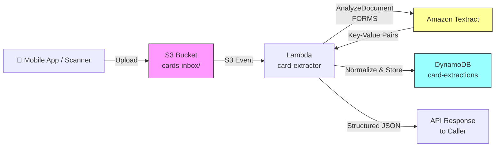

# Recipe 1.1 — Insurance Card Scanning ⭐

**Complexity:** Simple · **Phase:** MVP · **Estimated Cost:** ~$0.002 per card

---

## Problem Statement

A member calls in, walks into a clinic, or opens a mobile app and needs to verify their insurance coverage. The front desk (or the app) needs to capture the member ID, group number, payer name, plan type, and copay details from a physical insurance card — quickly, accurately, and without manual data entry.

Manual transcription is slow and error-prone. A single transposed digit in a member ID means a failed eligibility check, a denied claim, and a frustrated member calling back. Multiply that across millions of interactions and the operational cost is staggering.

What we need: point a camera at a card, get structured JSON back in under 3 seconds.

## Solution Overview

This is the simplest document extraction pattern in the chapter — a single image in, structured data out. We use Amazon Textract's `AnalyzeDocument` API with the FORMS feature type to extract key-value pairs directly from the card image.

Insurance cards are semi-structured: they have consistent field labels ("Member ID," "Group #," "Copay") but inconsistent layouts across payers. Textract's FORMS feature handles this naturally — it identifies key-value relationships regardless of spatial layout.

The pipeline:

1. Image lands in S3 (from mobile upload, scanner, or fax server)
2. Lambda triggers on S3 PUT event
3. Lambda calls Textract `AnalyzeDocument` (synchronous — cards are single-page)
4. Parse the key-value pairs from Textract's response
5. Apply field normalization (standardize "Mem ID" / "Member #" / "Subscriber ID" → `member_id`)
6. Write structured output to DynamoDB
7. Return JSON to the calling application

## Architecture Diagram



## Prerequisites

| Requirement | Details |
|-------------|---------|
| **AWS Services** | Amazon Textract, Amazon S3, AWS Lambda, Amazon DynamoDB |
| **IAM Permissions** | `textract:AnalyzeDocument`, `s3:GetObject`, `s3:PutObject`, `dynamodb:PutItem` |
| **BAA** | AWS BAA signed (required — insurance cards contain PHI) |
| **Encryption** | S3: SSE-KMS; DynamoDB: encryption at rest enabled (default); all API calls over TLS |
| **VPC** | Production: Lambda in VPC with VPC endpoints for S3, Textract, DynamoDB |
| **CloudTrail** | Enabled — log all Textract and S3 API calls for HIPAA audit trail |
| **Sample Data** | Synthetic insurance card images. CMS provides [sample Medicare cards](https://www.cms.gov/medicare/new-medicare-card) for layout reference. Never use real member cards in dev. |
| **Cost Estimate** | Textract AnalyzeDocument (FORMS): ~$1.50 per 1,000 pages. At one page per card, that's $0.0015/card. Lambda and DynamoDB costs are negligible at this scale. |

## Ingredients

| AWS Service | Role |
|------------|------|
| **Amazon Textract** | Extracts key-value pairs (FORMS) from card image |
| **Amazon S3** | Stores incoming card images; encrypted at rest with KMS |
| **AWS Lambda** | Orchestrates the extraction: triggers on S3, calls Textract, normalizes output |
| **Amazon DynamoDB** | Stores structured extraction results for downstream lookup |
| **AWS KMS** | Manages encryption keys for S3 and DynamoDB |
| **Amazon CloudWatch** | Logs, metrics, alarms for extraction failures and latency |

## Code

> **Full source:** `github.com/aws-samples/healthcare-ai-cookbook/ch01/recipe-1.1/`

### Walkthrough

**Step 1 — Textract call.** The Lambda handler receives the S3 event and calls Textract synchronously. We use `AnalyzeDocument` (not `DetectDocumentText`) because we need key-value pair extraction, not just raw text.

```python
import boto3

textract = boto3.client('textract')

def extract_card(bucket: str, key: str) -> dict:
    response = textract.analyze_document(
        Document={'S3Object': {'Bucket': bucket, 'Name': key}},
        FeatureTypes=['FORMS']
    )
    return response
```

**Step 2 — Parse key-value pairs.** Textract returns blocks with relationships. We need to walk the block graph to associate KEY blocks with their VALUE blocks.

```python
def parse_key_value_pairs(textract_response: dict) -> dict[str, dict]:
    blocks = textract_response['Blocks']
    block_map = {b['Id']: b for b in blocks}
    key_values = {}

    for block in blocks:
        if block['BlockType'] == 'KEY_VALUE_SET' and 'KEY' in block.get('EntityTypes', []):
            key_text = get_text_from_children(block, block_map)
            value_block = get_value_block(block, block_map)
            value_text = get_text_from_children(value_block, block_map)
            confidence = min(
                block.get('Confidence', 0),
                value_block.get('Confidence', 0)
            )
            key_values[key_text] = {
                'value': value_text,
                'confidence': confidence
            }
    return key_values
```

**Step 3 — Normalize field names.** Insurance cards use wildly inconsistent labels. We map common variants to canonical field names.

```python
FIELD_MAP = {
    'member_id': ['member id', 'mem id', 'member #', 'subscriber id', 'id number', 'member number'],
    'group_number': ['group #', 'group number', 'group', 'grp #', 'grp'],
    'payer_name': ['insurance company', 'plan name', 'payer', 'carrier'],
    'plan_type': ['plan type', 'plan', 'product'],
    'copay_pcp': ['pcp copay', 'office visit', 'copay', 'pcp'],
    'copay_specialist': ['specialist copay', 'specialist'],
    'copay_er': ['er copay', 'emergency room', 'er'],
    'rx_bin': ['rx bin', 'bin'],
    'rx_pcn': ['rx pcn', 'pcn'],
    'rx_group': ['rx group', 'rx grp'],
}

def normalize_fields(raw_kv: dict[str, dict]) -> dict:
    normalized = {}
    for canonical, variants in FIELD_MAP.items():
        for raw_key, raw_val in raw_kv.items():
            if raw_key.strip().lower() in variants:
                normalized[canonical] = {
                    'value': raw_val['value'].strip(),
                    'confidence': raw_val['confidence']
                }
                break
    return normalized
```

**Step 4 — Confidence gating.** Any field below 90% confidence gets flagged for manual review. In production, this feeds a simple review queue (we'll build a full A2I pipeline in Recipe 1.6).

```python
CONFIDENCE_THRESHOLD = 90.0

def flag_low_confidence(fields: dict) -> tuple[dict, list]:
    clean = {}
    flagged = []
    for field, data in fields.items():
        if data['confidence'] >= CONFIDENCE_THRESHOLD:
            clean[field] = data['value']
        else:
            flagged.append({
                'field': field,
                'extracted_value': data['value'],
                'confidence': data['confidence']
            })
    return clean, flagged
```

**Step 5 — Store results.**

```python
dynamodb = boto3.resource('dynamodb')
table = dynamodb.Table('card-extractions')

def store_result(image_key: str, fields: dict, flagged: list):
    table.put_item(Item={
        'image_key': image_key,
        'extraction_timestamp': datetime.utcnow().isoformat(),
        'fields': fields,
        'flagged_fields': flagged,
        'needs_review': len(flagged) > 0
    })
```

## Expected Results

**Sample output for a typical BCBS card:**

```json
{
  "image_key": "cards-inbox/2026/03/01/scan-00482.jpg",
  "extraction_timestamp": "2026-03-01T14:22:08Z",
  "fields": {
    "member_id": "XGP928471003",
    "group_number": "84023",
    "payer_name": "Blue Cross Blue Shield of Kentucky",
    "plan_type": "PPO",
    "copay_pcp": "$25",
    "copay_specialist": "$50",
    "copay_er": "$150"
  },
  "flagged_fields": [],
  "needs_review": false
}
```

**Performance benchmarks:**

| Metric | Typical Value |
|--------|---------------|
| End-to-end latency | 1.5–3 seconds |
| Field extraction accuracy | 95–99% for printed cards |
| Confidence score (clean cards) | 95–99.5% per field |
| Cost per card | ~$0.002 (Textract + Lambda + DynamoDB) |
| Throughput | ~50 cards/second (Lambda concurrency limited) |

**Where it struggles:** Cards photographed at steep angles, poor lighting, or heavy glare. Cracked/worn cards with damaged print. Cards from smaller regional payers with non-standard layouts — your FIELD_MAP may need expansion.

## Variations & Extensions

1. **Real-time mobile integration.** Instead of S3 trigger → Lambda, expose the extraction via API Gateway for synchronous point-of-care use. Add an image quality check (blur detection, rotation correction) before calling Textract to improve accuracy on mobile camera captures.

2. **Front + back extraction.** Insurance cards have different data on each side (front: member info; back: pharmacy benefits, claims address). Accept two images, extract both, and merge into a single unified record. The Rx BIN/PCN/Group fields are almost always on the back.

3. **Auto-eligibility verification.** Pipe the extracted member ID and group number directly into a 270/271 eligibility transaction (→ Recipe 8.1: Insurance Eligibility Matching). Close the loop from card scan to verified coverage in a single workflow.

## Related Recipes

- **→ Recipe 1.2 (Patient Intake Form Digitization):** Extends this single-image pattern to multi-section forms with tables and checkboxes
- **→ Recipe 1.4 (Prior Auth Document Processing):** Uses the same Textract FORMS foundation but on multi-page documents
- **→ Recipe 8.1 (Insurance Eligibility Matching):** Consumes the structured output from this recipe to verify coverage in real time

## Additional Resources

- [Amazon Textract AnalyzeDocument API Reference](https://docs.aws.amazon.com/textract/latest/dg/API_AnalyzeDocument.html)
- [Amazon Textract FORMS Feature Type](https://docs.aws.amazon.com/textract/latest/dg/how-it-works-kvp.html)
- [Amazon Textract Pricing](https://aws.amazon.com/textract/pricing/)
- [AWS HIPAA Eligible Services](https://aws.amazon.com/compliance/hipaa-eligible-services-reference/)
- [Architecting for HIPAA on AWS (Whitepaper)](https://docs.aws.amazon.com/whitepapers/latest/architecting-hipaa-security-and-compliance-on-aws/welcome.html)

## Estimated Implementation Time

| Scope | Time |
|-------|------|
| **Basic** (Textract + Lambda + hardcoded field map) | 2–4 hours |
| **Production-ready** (VPC, KMS, CloudTrail, error handling, monitoring) | 1–2 days |
| **With variations** (mobile API, front+back, eligibility integration) | 3–5 days |

## Tags

`document-intelligence` · `ocr` · `textract` · `forms` · `insurance-card` · `point-of-care` · `simple` · `mvp` · `lambda` · `s3` · `dynamodb` · `hipaa`

---

*← [Chapter 1 Index](chapter01-index) · [Next: Recipe 1.2 — Patient Intake Form Digitization →](chapter01.02-patient-intake-digitization)*
