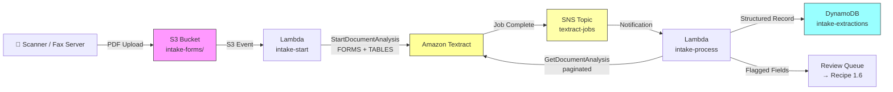

# Recipe 1.2: Patient Intake Form Digitization ⭐

**Complexity:** Simple · **Phase:** MVP · **Estimated Cost:** ~$0.009 per 3-page form

---

## The Problem

You've just done something kind of remarkable in Recipe 1.1: a staff member photographs an insurance card, and seconds later your EHR has a clean, structured JSON record. One image, one page, a handful of fields, result in under three seconds. It almost feels like cheating.

Now the patient says "I filled out my paperwork" and slides a sheaf of five pages across the counter.

This is the intake form. It is a completely different animal. Depending on the practice, you're looking at two to five pages covering: patient demographics, emergency contacts, current medications (often a handwritten list in a printed table), allergy history, past surgical history, review of systems with a grid of checkboxes, insurance information, and consent signatures. The forms vary by specialty. A cardiology practice uses a different template than a pediatrics practice. Patients fill in some fields with neat printed letters and others with a scrawl that would challenge a handwriting analyst. Some fields are answered with an X in a box. Some are answered with "see attached."

Someone has to get all of that into the EHR. In most practices, that someone is a medical assistant or front desk staff who types it in manually. The industry average is 8 to 12 minutes per patient. At 30 patients a day, that's somewhere between four and six hours of data entry. Per clinic. Per day. Multiplied across hundreds of thousands of physician offices in the United States.

The downstream effects are worse than the labor cost. A transposed digit in a date of birth breaks eligibility. A skipped allergy field means the prescribing system doesn't flag the drug interaction. A misread "No" as a "Yes" on the diabetes checkbox shows up in the problem list and follows the patient for years. Paper forms with their ambiguous handwriting, inconsistent layouts, and physical fragility are one of the largest sources of data quality problems in healthcare. Not the most dramatic source, but one of the most pervasive.

We already have the core building block from Recipe 1.1. The question is how far that pattern stretches when the document gets longer, messier, and structurally richer.

Farther than you'd expect, actually. But not without a few important adaptations.

---

## The Technology: Multi-Page Document Extraction

### Why Single-Page Extraction Breaks Down

The synchronous approach from Recipe 1.1 works beautifully for a single card image. You send an image, you get a response. The whole round trip is a few seconds. For a five-page PDF scan of a patient intake form, that model doesn't hold.

The first problem is format. A JPEG photograph of an insurance card is a simple image. Intake forms typically arrive as multi-page PDFs (from document scanners) or multi-page TIFFs (from fax servers). A PDF or TIFF is not a single image. It's a container that holds multiple pages, each of which needs to be extracted independently and then reassembled into a coherent document.

The second problem is time. Processing a multi-page document takes longer than processing a single image, sometimes significantly longer. A five-page form might take ten to fifteen seconds. That's acceptable for a background process, but it breaks the synchronous request-response model: you can't hold an HTTP connection open for fifteen seconds waiting for a result. (Well, technically you can. You shouldn't. Your clients will time out, your error rates will spike, and the oncall team will be unhappy.)

The standard solution to both problems is asynchronous job-based processing. Instead of "send document, receive results," the pattern becomes "submit a job, get a job ID, receive a completion notification, then retrieve the results." This is a more complex flow to implement, but it's the right mental model for any processing task that takes more than a few seconds and any input that spans multiple pages.

This isn't an AWS-specific concept. Every managed document processing service worth using has an async mode. The shape of the pattern is consistent: submit, get ID, wait for signal, fetch.

### Tables: The Grid Problem

Simple key-value extraction works on a mental model of "there's a label somewhere near its value." That's sufficient for fields like "First Name: Maria" or "Date of Birth: 04/15/1978."

Tables are different. In a medication table, the structure is:

```
| Medication Name | Dosage  | Frequency    | Prescribing Physician |
|-----------------|---------|--------------|----------------------|
| Metformin       | 500mg   | Twice daily  | Dr. Chen             |
| Lisinopril      | 10mg    | Once daily   | Dr. Chen             |
| Albuterol       | 90mcg   | As needed    | Dr. Patel            |
```

A naive OCR pass gives you a pile of words: "Metformin 500mg Twice daily Dr. Chen Lisinopril 10mg Once daily Dr. Chen..." You've lost the row structure. You've lost the column headers. You can't reconstruct which dosage belongs to which medication without the grid.

Table detection is a separate problem from text extraction. It works by identifying the visual grid structure (the lines that form rows and columns, or the whitespace patterns that imply grid structure when there are no visible lines) and then mapping each detected cell to a row index and column index. The result is a two-dimensional structure you can actually work with, not a linearized string.

The challenge is that tables in scanned documents aren't always clean. Borderless tables (common in intake forms because they print more cleanly on paper) rely on spatial alignment rather than drawn lines. A slightly skewed scan can shift cell alignment enough that the extraction maps cells to the wrong rows. Tables that span page breaks are particularly tricky: the extraction engine has to understand that the table continues on the next page and that the column structure carries over.

In practice, table extraction from well-formatted printed forms is quite reliable, in the 90 to 96% accuracy range for cleanly scanned documents. It degrades with poor scan quality, borderless tables, very small fonts, and anything handwritten.

### Checkboxes and Selection Elements

Medical history grids are almost universally checkbox-based. "Do you have a history of: Diabetes [ ] Hypertension [ ] Heart Disease [ ] Cancer [ ] Asthma [ ]" is a ubiquitous format. Detecting whether each box is checked or unchecked is a distinct problem from reading text.

Selection element detection works by identifying regions of the document that look like checkbox shapes (squares or circles), then classifying each one as selected or unselected based on the visual content inside the bounding box. A checked box has marks inside it. An unchecked box doesn't. Sounds simple, but the challenge is that "checked" comes in many forms: a filled-in X, a checkmark, a filled solid square, a circle with a dot, or sometimes a patient who circled the entire field instead of putting a mark in the box. Modern selection element detectors are trained on this variety and handle it well for standard printed checkboxes. The accuracy drops significantly when boxes are small, when the scan is degraded, or when a patient used a marking style that doesn't fit the training distribution.

The output of checkbox detection is a map of label-to-boolean: "Diabetes" is true, "Heart Disease" is false. This is the representation your EHR systems actually want.

### The Mixed Layout Problem

Intake forms are simultaneously structured and unstructured. The first half of a typical form is highly structured: fields with clear labels, checkboxes with clear labels, tables with headers. The second half often includes free-text sections: "Please describe any symptoms" or "List any additional concerns." And scattered throughout the structured sections are the handwritten entries: a patient who writes their current medications in the printed table by hand, or who fills in the "other" line of a checkbox group with something the form designer didn't anticipate.

You can't treat an intake form as purely a forms document (just extract key-value pairs) or purely a free-text document (just extract raw text). You need both, applied to the right sections. The general pattern is to run the full extraction (FORMS + TABLES + raw text) and then sort the output into the right buckets: structured fields from key-value extraction, structured rows from table extraction, and flagged free-text blocks for downstream processing.

Handwriting in mixed documents is a real problem, and I want to be direct about it. When a patient prints their name in block letters in a printed form, OCR handles it well. When they write in cursive, accuracy drops meaningfully. When they write in a hurry, which is most of the time, accuracy drops further. Recipe 1.6 addresses handwriting as its own dedicated problem with a tiered confidence pipeline and human review infrastructure. For this recipe, handwritten fields are extracted at best effort, confidence-gated conservatively, and flagged for human verification. That's the honest scope.

### The General Architecture Pattern

At a conceptual level, the multi-page intake form pipeline looks like this:

```
[Ingest] → [Submit Job] → [Wait for Completion] → [Retrieve Pages] → [Parse & Classify] → [Normalize] → [Store]
```

**Ingest:** The scanned form arrives. This might be from a document scanner in the waiting room, a fax-to-PDF conversion, a patient portal upload, or a staff scan. The format is typically PDF or TIFF.

**Submit Job:** The document is handed to an extraction service with a job request. The service acknowledges receipt and returns a job identifier. This is the async contract: you know the job was accepted, you know where to check on it, and you can go do other work while it runs.

**Wait for Completion:** Rather than polling in a loop (wasteful and janky), well-designed systems use a push notification: the extraction service signals completion via a message queue or topic. Your system listens for that signal and wakes up when the job is done.

**Retrieve Pages:** Job results are paginated. A five-page form might produce hundreds of blocks of extracted content across multiple response pages. You retrieve all of them before processing begins.

**Parse and Classify:** Now the actual intellectual work starts. The raw blocks from extraction are not yet useful. You need to walk through them and classify each one: is this a key-value pair? A table cell? A checkbox result? Raw text? The parser builds the appropriate structure for each type.

**Normalize:** The same normalization work from Recipe 1.1 applies here, and then some. Field names need standardizing across payer layouts for the insurance section. Table headers need interpretation (what does "Rx" mean in context?). Checkbox labels need canonical mapping to medical concepts.

**Store:** Write the assembled, structured record. Flag fields that fell below the confidence threshold for human review. The flagged fields go into a review queue (see Recipe 1.6). The high-confidence fields go directly into downstream systems.

That's the pattern. The async job-based shape is the key conceptual shift from Recipe 1.1. Everything else is incremental complexity.

---

## The AWS Implementation

### Why These Services

**Amazon Textract for async multi-page extraction.** Textract's `StartDocumentAnalysis` / `GetDocumentAnalysis` API pair is designed exactly for this use case: multi-page PDF and TIFF documents that need both FORMS (key-value pairs) and TABLES feature extraction in a single job. You submit the job, Textract processes all pages in parallel, and you retrieve results when it signals completion. The unified response includes everything: key-value pairs with spatial data, table cells with row and column indices, selection element states for checkboxes, and raw text blocks. You don't have to choose between feature types upfront; you request all of them at once.

**Amazon SNS for job completion signaling.** Textract's async API integrates directly with SNS for completion notifications. When a job finishes, Textract publishes a message to your SNS topic containing the job ID and completion status. This is the push notification model that eliminates polling. You configure a second Lambda function as a subscriber to that SNS topic, and it fires automatically when Textract is done. This is the cleanest possible implementation of the async pattern: no polling loops, no sleep-and-retry logic, no wasted API calls checking on jobs that aren't done yet.

**Two Lambda functions for orchestration.** The split into two Lambdas is a direct consequence of the async job model. The first Lambda is triggered by the S3 upload event, submits the Textract job, and exits (its work is done in milliseconds). The second Lambda is triggered by the SNS notification, retrieves the results, does the parsing and normalization work, and writes to DynamoDB. This separation keeps each function small, focused, and easy to reason about. Each one does one thing.

**Amazon S3 for document storage.** Same pattern as Recipe 1.1, with one addition: intake forms contain substantially more PHI than an insurance card. Demographics, Social Security Numbers (last four, at minimum), medical history, medications, allergies, insurance details. The encryption and access control posture needs to be correspondingly tighter. S3 with SSE-KMS, strict bucket policies, and VPC endpoint access only is the right default for documents of this sensitivity.

**Amazon DynamoDB for results.** The structured output of a patient intake form is a richer object than an insurance card record, but the access patterns are similar: write once at extraction time, look up later by patient or document key. DynamoDB's flexible schema handles the variable structure well, since not every form has every section filled, and the presence or absence of tables varies by specialty.

### Architecture Diagram



### Prerequisites

| Requirement | Details |
|-------------|---------|
| **AWS Services** | Amazon Textract, Amazon S3, AWS Lambda (×2), Amazon SNS, Amazon DynamoDB |
| **IAM Permissions** | `textract:StartDocumentAnalysis`, `textract:GetDocumentAnalysis`, `s3:GetObject`, `s3:PutObject`, `sns:Publish`, `sns:Subscribe`, `dynamodb:PutItem`, `iam:PassRole` (to allow Lambda to pass the Textract service role) |
| **Textract Service Role** | A dedicated IAM role that Textract can assume to publish job completion notifications to your SNS topic. Textract requires this; it cannot use the Lambda execution role. |
| **BAA** | AWS BAA signed. Intake forms contain extensive PHI: demographics, SSNs, medical history, medications, insurance details. This is not optional. |
| **Encryption** | S3: SSE-KMS with a customer-managed key. DynamoDB: encryption at rest enabled (default). All API calls over TLS. |
| **VPC** | Production: both Lambdas in a VPC with VPC endpoints for S3, Textract, DynamoDB, and SNS. No traffic to these services should cross the public internet. |
| **CloudTrail** | Enabled for all Textract, S3, and DynamoDB API calls. Intake forms are HIPAA-covered documents; the audit trail is a compliance requirement. |
| **Sample Data** | Blank form templates from EHR vendors, filled with synthetic patient data. CMS publishes the [CMS-1500](https://www.cms.gov/medicare/cms-forms/cms-forms/downloads/cms1500.pdf) form for layout reference. Never use real PHI in development. |
| **Cost Estimate** | Textract async analysis (FORMS + TABLES): ~$3.00 per 1,000 pages. A 3-page intake form costs about $0.009. Lambda and DynamoDB costs are negligible at this scale. |

### Ingredients

| AWS Service | Role |
|------------|------|
| **Amazon Textract** | Async multi-page document analysis: extracts key-value pairs (FORMS), tables (TABLES), and selection elements (checkboxes) |
| **Amazon S3** | Stores incoming scanned forms; encrypted at rest with KMS |
| **AWS Lambda (intake-start)** | Triggered by S3 upload; submits the Textract async job and exits |
| **AWS Lambda (intake-process)** | Triggered by SNS notification; retrieves results, parses, normalizes, and stores |
| **Amazon SNS** | Receives Textract job completion signals; delivers them to the processing Lambda |
| **Amazon DynamoDB** | Stores structured extraction output; PHI encrypted at rest |
| **AWS KMS** | Customer-managed keys for S3 and DynamoDB encryption |
| **Amazon CloudWatch** | Logs, metrics, and alarms for job failures, latency, and confidence distribution |

### Code

> **Reference implementations:** The following AWS sample repos demonstrate the patterns used in this recipe:
>
> - [`amazon-textract-code-samples`](https://github.com/aws-samples/amazon-textract-code-samples): General Textract samples including async document analysis patterns and table extraction
> - [`amazon-textract-response-parser`](https://github.com/aws-samples/amazon-textract-response-parser): Python library for navigating the Textract block response structure — useful for understanding the block graph this recipe parses manually
> - [`guidance-for-low-code-intelligent-document-processing-on-aws`](https://github.com/aws-solutions-library-samples/guidance-for-low-code-intelligent-document-processing-on-aws): Full IDP pipeline guidance covering async ingestion, multi-feature extraction, and result storage

#### Walkthrough

**Step 1: Start the async Textract job.** This is the entry point: an intake form lands in S3, and the first Lambda wakes up to submit the extraction job. The critical difference from Recipe 1.1 is that we are not calling `AnalyzeDocument` (which is synchronous and single-page). We are calling `StartDocumentAnalysis`, which accepts a PDF or TIFF in S3, processes all pages, and returns a job ID immediately without waiting for the work to finish. We request both FORMS and TABLES feature types in a single job call. FORMS gives us key-value pairs for all the labeled fields and checkboxes. TABLES gives us row-and-column structure for medication lists and history grids. We also provide the SNS topic and Textract service role so that Textract can signal us when the job completes. The job ID gets stored in DynamoDB so the second Lambda can look up the context it needs when the notification arrives. If you skip the SNS setup and fall back to polling, you'll end up with a Lambda that runs for minutes burning money on `GetDocumentAnalysis` calls to a job that isn't done yet.

```
FUNCTION submit_extraction_job(bucket, key, sns_topic_arn, textract_role_arn):
    // Submit the multi-page intake form to Textract for async analysis.
    // Unlike Recipe 1.1's single-image synchronous call, this returns immediately
    // with a job ID — the results aren't ready yet, they'll arrive via SNS.

    response = call Textract.StartDocumentAnalysis with:
        document_location = S3 object at bucket/key   // the PDF or TIFF intake form
        feature_types     = ["FORMS", "TABLES"]       // FORMS: key-value pairs and checkboxes
                                                      // TABLES: row/column structured grids
        notification_channel = {
            sns_topic_arn: sns_topic_arn,             // where to publish when done
            role_arn: textract_role_arn               // role Textract assumes to publish to SNS
        }                                             // (Textract needs its own role; it can't use yours)

    job_id = response.JobId

    // Save job context to the tracking table so intake-process Lambda
    // can look up the original document when the SNS notification arrives.
    write to database table "textract-jobs":
        job_id      = job_id
        bucket      = bucket
        key         = key                 // path to the original form PDF in S3
        submitted   = current UTC timestamp
        status      = "PENDING"

    RETURN job_id
```

**Step 2: Receive the completion signal and retrieve all result pages.** When Textract finishes, it publishes a message to your SNS topic. That message triggers the second Lambda with the job ID embedded in the notification payload. The Lambda's first job is to retrieve all the extracted blocks from Textract. This is where pagination matters. A five-page intake form generates hundreds of blocks: every detected word, every key-value pair, every table cell, every checkbox. Textract paginates the results, returning up to 1,000 blocks per API call with a `NextToken` when there are more. You have to loop through all pages before processing begins. If you stop at the first page, you'll have a partial document and you won't know it. The loop below is unglamorous but required.

```
FUNCTION retrieve_all_blocks(job_id):
    // Pull all extracted blocks from Textract, following pagination until complete.
    // Textract may return results across multiple response pages; we must collect them all.
    all_blocks = empty list
    next_token = null        // null means "start from the beginning"

    LOOP:
        // Build the API call parameters. Include NextToken only if we have one.
        params = { job_id: job_id }
        IF next_token is not null:
            params.next_token = next_token

        response = call Textract.GetDocumentAnalysis with params

        // Append this page's blocks to our running collection.
        append all response.Blocks to all_blocks

        // Check whether there's another page of results.
        next_token = response.NextToken   // null if this was the last page
        IF next_token is null:
            BREAK    // we have everything; stop looping

    // Build a lookup index: block ID -> block data.
    // Nearly every parsing operation below needs to follow links between blocks by ID,
    // so an O(1) lookup is much better than scanning the list each time.
    block_map = build map of block.Id -> block for all blocks in all_blocks

    RETURN all_blocks, block_map
```

**Step 3: Parse key-value pairs.** This step is nearly identical to Recipe 1.1's key-value parsing. Textract uses the same KEY_VALUE_SET block structure for multi-page documents as it does for single-page images. The parser walks the block list, finds blocks marked as KEY entities, follows the VALUE relationship link to the paired value block, and assembles the text from the child word blocks. The one new element here is that some value blocks will contain a SELECTION_ELEMENT child rather than text: that's a checkbox. We detect those here and hand them off to a separate structure rather than trying to stringify them. The output is two maps: one of text key-value pairs with confidence scores, and one of checkbox key-to-selection-status pairs. If this looks familiar from Recipe 1.1, it should. The field normalization step downstream is the same too.

```
FUNCTION parse_forms(all_blocks, block_map):
    text_key_values = empty map      // label -> { value text, confidence }
    checkbox_fields = empty map      // label -> true/false (selected/not selected)

    FOR each block in all_blocks:

        // Only process KEY blocks — the label side of each field pair.
        IF block.BlockType is not "KEY_VALUE_SET":
            CONTINUE
        IF "KEY" is not in block.EntityTypes:
            CONTINUE

        // Assemble the label text from this key block's child word blocks.
        key_text = concatenate text from CHILD relationships of block using block_map

        // Follow the VALUE relationship to find the paired value block.
        value_block = follow block's VALUE relationship using block_map
        IF value_block is null:
            CONTINUE   // orphan key with no paired value — skip it

        // Check whether the value contains a SELECTION_ELEMENT (checkbox or radio button).
        selection_child = find child of value_block with BlockType "SELECTION_ELEMENT"

        IF selection_child exists:
            // This is a checkbox field. Record its checked/unchecked state.
            // SelectionStatus will be "SELECTED" or "NOT_SELECTED".
            checkbox_fields[key_text] = (selection_child.SelectionStatus == "SELECTED")

        ELSE:
            // This is a text field. Assemble the value text.
            value_text = concatenate text from CHILD relationships of value_block using block_map
            confidence = minimum of (block.Confidence, value_block.Confidence)
            text_key_values[key_text] = { value: value_text, confidence: confidence }

    RETURN text_key_values, checkbox_fields
```

**Step 4: Parse tables.** This is the step that doesn't exist in Recipe 1.1. Tables require a fundamentally different parsing approach because the structure is two-dimensional: you need row index and column index, not just label and value. Textract represents a table as a hierarchy: a TABLE block contains CELL blocks. Each CELL has `RowIndex` and `ColumnIndex` attributes that tell you exactly where in the grid it lives. Inside each CELL are WORD blocks for the cell text. The parser builds a nested map (row -> column -> text) and then converts it to a list of lists. The first row of most tables contains column headers (think: "Medication", "Dosage", "Frequency"). Preserving those headers is important for interpreting the data rows that follow. A medication row without knowing what column means "Dosage" is useless.

```
FUNCTION parse_tables(all_blocks, block_map):
    tables = empty list    // list of tables; each table is a list of rows

    FOR each block in all_blocks:
        IF block.BlockType is not "TABLE":
            CONTINUE

        // Build a nested map: row_index -> column_index -> cell_text
        // We'll convert this to a list of lists once we know the dimensions.
        grid = empty map

        // Walk the TABLE block's CHILD relationships to find all CELL blocks.
        FOR each cell_id in block's CHILD relationship IDs:
            cell = block_map[cell_id]
            IF cell.BlockType is not "CELL":
                CONTINUE

            row = cell.RowIndex      // 1-indexed row position in the table
            col = cell.ColumnIndex   // 1-indexed column position in the table

            // Assemble cell text from the CELL's WORD children.
            // Some cells are empty (the patient left a row blank); empty string is correct.
            cell_text = concatenate text from WORD children of cell using block_map
            grid[row][col] = cell_text

        // Convert the nested map to a list of lists for clean output.
        // A 3-row, 4-column medication table becomes:
        //   [["Medication", "Dosage", "Frequency", "Prescribing Physician"],
        //    ["Metformin", "500mg", "Twice daily", "Dr. Chen"],
        //    ["Lisinopril", "10mg", "Once daily", "Dr. Chen"]]
        IF grid is not empty:
            max_row = maximum row index in grid
            max_col = maximum column index across all rows in grid
            table_rows = []
            FOR r from 1 to max_row:
                row_data = []
                FOR c from 1 to max_col:
                    // Use empty string for cells that were left blank.
                    append grid[r][c] (or empty string if absent) to row_data
                append row_data to table_rows
            append table_rows to tables

    RETURN tables
```

**Step 5: Normalize fields and apply confidence gating.** The same normalization logic from Recipe 1.1 applies here. Raw key labels ("First Name:", "FIRST NAME", "Patient First Name") all need to collapse to a canonical `first_name`. The field map for intake forms is larger than for insurance cards, covering demographics, insurance, and the medical history section. The confidence gating is the same: anything below 90% gets flagged for human review rather than written directly to the record. Handwritten fields will disproportionately populate the flagged set, which is expected. The confidence threshold for an intake form needs to be calibrated a bit more conservatively than for an insurance card, because the cost of a wrong medication name or a wrong allergy is higher than the cost of a wrong group number.

```json
{
  "first_name":    ["first name", "patient first name", "fname", "given name"],
  "last_name":     ["last name", "patient last name", "lname", "family name", "surname"],
  "date_of_birth": ["date of birth", "dob", "birth date", "birthdate"],
  "ssn":           ["social security number", "ssn", "social security #"],
  "phone":         ["phone", "phone number", "home phone", "cell phone", "telephone"],
  "address":       ["address", "home address", "street address", "mailing address"],
  "member_id":     ["member id", "mem id", "member #", "subscriber id", "id number"],
  "group_number":  ["group #", "group number", "group", "grp #"],
  "payer_name":    ["insurance company", "plan name", "payer", "carrier", "insurance"]
}
```

```
CONFIDENCE_THRESHOLD = 90.0   // below this, route to human review rather than auto-accept

FUNCTION normalize_and_gate(raw_kv, checkbox_fields, tables):
    // Normalize text field names to canonical labels (same logic as Recipe 1.1).
    normalized = normalize_fields(raw_kv)      // see Recipe 1.1 for the full implementation

    // Split normalized text fields into clean (high-confidence) and flagged (needs review).
    clean_fields = empty map
    flagged      = empty list

    FOR each canonical_name, data in normalized:
        IF data.confidence >= CONFIDENCE_THRESHOLD:
            clean_fields[canonical_name] = data.value
        ELSE:
            append to flagged: {
                field:           canonical_name,
                extracted_value: data.value,
                confidence:      data.confidence
            }

    // Checkboxes don't carry confidence scores the same way text fields do.
    // Selection element detection is high-accuracy for clearly printed checkboxes.
    // Flag any checkbox that Textract's own confidence falls below threshold.
    clean_checkboxes = empty map
    FOR each label, selection_data in checkbox_fields:
        IF selection_data.confidence >= CONFIDENCE_THRESHOLD:
            clean_checkboxes[label] = selection_data.selected
        ELSE:
            append to flagged: {
                field:           label,
                extracted_value: selection_data.selected,
                confidence:      selection_data.confidence
            }

    RETURN clean_fields, clean_checkboxes, tables, flagged
```

**Step 6: Assemble the record and store it.** The final step combines clean fields, checkbox results, and table data into a unified structured record, then writes it to DynamoDB. The `needs_review` flag is set any time the flagged list is non-empty, making it trivial for downstream systems to identify records awaiting human attention. The SSN is stored only as last-four digits even if the form captured the full number: storing a full SSN in an operational database when last-four is sufficient for patient matching is an unnecessary liability. The `page_count` field is worth tracking explicitly; it's useful for quality monitoring (a three-page form that produced only two pages of blocks probably had a scan failure).

```
FUNCTION assemble_and_store(document_key, page_count, clean_fields, clean_checkboxes, tables, flagged):
    // Construct the full structured intake record.
    record = {
        document_key:   document_key,                              // S3 path of the source PDF
        extracted_at:   current UTC timestamp (ISO 8601),          // audit trail timestamp
        page_count:     page_count,                                // pages Textract processed
        needs_review:   (length of flagged > 0),                   // true if any field is uncertain

        demographics: {
            first_name:     clean_fields.get("first_name"),
            last_name:      clean_fields.get("last_name"),
            date_of_birth:  clean_fields.get("date_of_birth"),
            ssn_last4:      last 4 characters of clean_fields.get("ssn", ""),  // last 4 only; never store full SSN
            address:        clean_fields.get("address"),
            phone:          clean_fields.get("phone"),
        },

        insurance: {
            member_id:     clean_fields.get("member_id"),
            group_number:  clean_fields.get("group_number"),
            payer_name:    clean_fields.get("payer_name"),
        },

        medical_history: {
            // Checkboxes become booleans: "Diabetes" -> true, "Heart Disease" -> false, etc.
            conditions: clean_checkboxes,
        },

        // Tables come back as lists of rows. First table is usually the medication list;
        // second is usually allergies. The exact order depends on form layout.
        medications: tables[0] if tables has at least 1 element else [],
        allergies:   tables[1] if tables has at least 2 elements else [],

        // Low-confidence fields go here for the review queue.
        // These will NOT be in the fields above — they're held pending human confirmation.
        flagged_fields: flagged,
    }

    // Write the record to the database.
    write record to database table "intake-extractions"

    RETURN record
```

> **Curious how this looks in Python?** The pseudocode above covers the concepts. If you'd like to see sample Python code that demonstrates these patterns using boto3, check out the [Python Example](chapter01.02-python-example). It walks through each step with inline comments, including the async coordination pattern, and notes on what you'd need to change for a real deployment.

### Expected Results

**Sample output for a 3-page intake form:**

```json
{
  "document_key": "intake-forms/2026/03/01/patient-00291.pdf",
  "extracted_at": "2026-03-01T14:38:22Z",
  "page_count": 3,
  "needs_review": true,
  "demographics": {
    "first_name": "Maria",
    "last_name": "Rodriguez",
    "date_of_birth": "04/15/1978",
    "ssn_last4": "4829",
    "address": "1234 Elm Street, Louisville, KY 40202",
    "phone": "(502) 555-0147"
  },
  "insurance": {
    "member_id": "HUM8294710",
    "group_number": "72015",
    "payer_name": "Humana"
  },
  "medical_history": {
    "conditions": {
      "Diabetes": true,
      "Hypertension": true,
      "Heart Disease": false,
      "Cancer": false,
      "Asthma": true
    }
  },
  "medications": [
    ["Metformin", "500mg", "Twice daily", "Dr. Chen"],
    ["Lisinopril", "10mg", "Once daily", "Dr. Chen"],
    ["Albuterol", "90mcg", "As needed", "Dr. Patel"]
  ],
  "allergies": [
    ["Penicillin", "Rash, hives"],
    ["Sulfa drugs", "Anaphylaxis"]
  ],
  "flagged_fields": [
    {
      "field": "phone",
      "extracted_value": "(502) 555-O147",
      "confidence": 78.2,
      "note": "possible O/0 confusion in final digit"
    }
  ]
}
```

**Performance benchmarks:**

| Metric | Typical Value |
|--------|---------------|
| End-to-end latency (3-page form) | 8–15 seconds (async) |
| Key-value extraction accuracy (printed) | 93–98% |
| Table extraction accuracy | 90–96% (depends on table formatting) |
| Checkbox detection accuracy | 97–99% for cleanly printed checkboxes |
| Handwriting accuracy | 70–85% (highly variable; see Recipe 1.6) |
| Cost per 3-page form | ~$0.009 (Textract) + negligible Lambda/DynamoDB |

**Where it struggles:** Handwritten entries in printed tables, which is exactly what patients do when listing their medications in a hurry. Borderless tables where Textract infers grid structure from spatial alignment: a slightly skewed scan can shift cell assignments by one row. Forms with very dense small-font tables are also challenging: Textract may merge adjacent cells or misalign rows. And any free-text field longer than a sentence ("please describe your symptoms") produces raw text that needs additional processing before it's structured enough to use downstream.

---

## The Honest Take

The async pattern is architecturally more complex than the synchronous call from Recipe 1.1, but don't let that scare you. The SNS trigger model is actually quite clean once you've built it: two Lambdas with one-thing-each responsibility, connected by a notification. It's easier to debug than you might expect because each Lambda has a narrow scope.

The thing that will surprise you is the Textract service role. Textract needs its own IAM role to publish to your SNS topic; it can't use your Lambda's execution role. This is easy to miss because it's not how most AWS services work. You'll know you got it wrong when your jobs submit successfully but completion notifications never arrive. Check the IAM PassRole permission on your Lambda and make sure the Textract service role has `sns:Publish` on your topic.

Table parsing is more reliable than I expected for printed forms. The failure mode isn't random errors in cells; it's structural: entire rows occasionally get merged together, especially when table lines are faint in the scan. The solution is scan quality, not code changes. A decent document scanner at 300 DPI produces much better results than a phone photograph of a paper form.

Checkbox detection is the pleasant surprise. I expected it to be the weakest part of this recipe and it ended up being the most reliable. Textract correctly classifies selected vs. unselected at 97-99% accuracy for standard printed checkboxes. The failure cases are mostly unusual marking styles (patients who put a number rather than an X, or who circled the entire question instead of the box). You'll see these in your flagged fields, which is the right outcome.

The honest scope boundary: this recipe handles printed text well and checkboxes well. It handles tables reasonably well. It handles handwriting with a shrug and an honest confidence score. If your patient population trends toward handwritten completion (older patients in some demographics tend to fill forms in cursive), your flagged field rate will be higher than the benchmarks above. That's not a failure; that's the confidence gating doing its job. Build the review queue from Recipe 1.6 before you go to production.

---

## Variations and Extensions

**Multi-language intake forms.** Practices serving diverse populations often provide intake forms in Spanish, Vietnamese, Mandarin, and other languages. Textract supports printed text extraction across [a broad set of languages](https://docs.aws.amazon.com/textract/latest/dg/how-it-works-languages.html). After extraction, add an Amazon Translate call to normalize all output to English before normalization and storage. The translation step adds latency (roughly 1-2 seconds for a typical form) and a small cost, but it means your downstream systems see a consistent language regardless of which form variant the patient used.

**Consent and signature tracking.** Intake forms include signature blocks for consent to treatment, financial responsibility, and HIPAA acknowledgment. Textract's SIGNATURE block type detects whether a signature is present in a given region. Wrap a simple check around the signature fields and log consent status (signed/unsigned/not present) with a timestamp for each document. This gives compliance teams an auditable consent record without manual review.

**EHR integration via FHIR.** The structured output from this recipe maps naturally to FHIR R4 resources: the demographics section to Patient, the insurance section to Coverage, the medical history checkboxes to Condition, and the medication table to MedicationStatement. Build a transform layer that converts the DynamoDB record to FHIR bundles and POST them to your FHIR server (Amazon HealthLake or a third-party implementation). This closes the loop from paper form to fully standards-compliant digital record without any manual EHR data entry.

---

## Related Recipes

- **Recipe 1.1 (Insurance Card Scanning):** The synchronous single-page foundation this recipe builds on. Start there if you haven't yet: the field normalization and confidence gating patterns carry forward directly.
- **Recipe 1.3 (Lab Requisition Form Extraction):** The next step up in complexity. Adds Amazon Comprehend Medical on top of the Textract foundation established here: extracting ICD-10 codes and clinical entities from the free-text sections that this recipe intentionally leaves unparsed.
- **Recipe 1.6 (Handwritten Clinical Note Digitization):** Addresses the handwriting problem this recipe sidesteps. Builds the full tiered confidence pipeline and Amazon A2I human review queue that the flagged fields from this recipe feed into.
- **Recipe 8.1 (Insurance Eligibility Matching):** Consumes the member ID and group number from the insurance section of this recipe to verify coverage in real time.

---

## Additional Resources

**AWS Documentation:**
- [Amazon Textract Async Operations](https://docs.aws.amazon.com/textract/latest/dg/async.html)
- [Amazon Textract AnalyzeDocument vs StartDocumentAnalysis](https://docs.aws.amazon.com/textract/latest/dg/sync-versus-async.html)
- [Amazon Textract Tables Feature](https://docs.aws.amazon.com/textract/latest/dg/how-it-works-tables.html)
- [Amazon Textract Selection Elements (Checkboxes)](https://docs.aws.amazon.com/textract/latest/dg/how-it-works-selectables.html)
- [Amazon Textract Pricing](https://aws.amazon.com/textract/pricing/)
- [AWS HIPAA Eligible Services](https://aws.amazon.com/compliance/hipaa-eligible-services-reference/)
- [FHIR R4 Patient Resource](https://www.hl7.org/fhir/patient.html)
- [Amazon HealthLake](https://aws.amazon.com/healthlake/)

**AWS Sample Repos:**
- [`amazon-textract-and-comprehend-medical-document-processing`](https://github.com/aws-samples/amazon-textract-and-comprehend-medical-document-processing): Workshop for building a medical document processing pipeline with Textract and Comprehend Medical, including PDF extraction and clinical entity recognition
- [`aws-ai-intelligent-document-processing`](https://github.com/aws-samples/aws-ai-intelligent-document-processing): Comprehensive IDP solutions including document classification, multi-page extraction, and A2I human review integration
- [`amazon-textract-textractor`](https://github.com/aws-samples/amazon-textract-textractor): Python SDK wrapper for Textract that simplifies table extraction, form parsing, and response visualization (installable via pip)
- [`amazon-textract-idp-cdk-constructs`](https://github.com/aws-samples/amazon-textract-idp-cdk-constructs): CDK constructs for building Textract IDP pipelines, including async processing and Step Functions orchestration

**AWS Solutions and Blogs:**
- [Guidance for Intelligent Document Processing on AWS](https://aws.amazon.com/solutions/guidance/intelligent-document-processing-on-aws): Reference architecture for classifying, extracting, and enriching documents at scale
- [Enhanced Document Understanding on AWS](https://aws.amazon.com/solutions/implementations/enhanced-document-understanding-on-aws): Deployable solution for document classification, extraction, and search
- [Intelligent Healthcare Forms Analysis with Amazon Bedrock](https://aws.amazon.com/blogs/machine-learning/intelligent-healthcare-forms-analysis-with-amazon-bedrock): Healthcare-specific forms processing using foundation models
- [Processing PDF Documents with a Human Loop Using Amazon Textract and Amazon A2I](https://aws.amazon.com/blogs/machine-learning/processing-pdf-documents-with-a-human-loop-using-amazon-textract-and-amazon-augmented-ai): Multi-page PDF processing with human review for low-confidence extractions

---

## Estimated Implementation Time

| Scope | Time |
|-------|------|
| **Basic** (async Textract, forms + tables parsing, hardcoded field map) | 4–6 hours |
| **Production-ready** (field normalization, confidence gating, SNS/Lambda wiring, VPC, KMS, CloudTrail, error handling) | 2–3 days |
| **With variations** (multi-language, signature detection, FHIR integration) | 1–2 weeks |

---

## Tags

`document-intelligence` · `ocr` · `textract` · `forms` · `tables` · `checkboxes` · `intake-forms` · `patient-demographics` · `async` · `multi-page` · `simple` · `mvp` · `lambda` · `s3` · `dynamodb` · `sns` · `hipaa`

---

*← [Chapter 1 Index](chapter01-index) · [← Recipe 1.1: Insurance Card Scanning](chapter01.01-insurance-card-scanning) · [Next: Recipe 1.3 - Lab Requisition Form Extraction →](chapter01.03-lab-requisition-extraction)*
