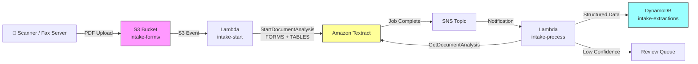

# Recipe 1.2 — Patient Intake Form Digitization ⭐

**Complexity:** Simple · **Phase:** MVP · **Estimated Cost:** ~$0.003 per page

---

## Problem Statement

Every patient visit starts with paperwork. Intake forms capture demographics, insurance info, medical history, current medications, allergies, and consent signatures — typically across 2-5 printed pages. Most payers and provider offices still use paper forms, and the data entry bottleneck is real: a staff member manually transcribes each form into the EHR, averaging 8-12 minutes per patient. Errors propagate downstream into claims, eligibility checks, and care coordination.

Unlike the single-image insurance card from Recipe 1.1, intake forms introduce new complexity: multi-page documents, tables (medication lists), checkboxes (yes/no medical history questions), mixed layouts (structured fields alongside free-text blocks), and occasionally handwritten entries in otherwise printed forms.

We need a pipeline that handles all of these — and produces EHR-ready structured data, not just raw text.

## Solution Overview

We extend the Recipe 1.1 pattern in two ways: multi-page handling and richer feature extraction.

Instead of a single `AnalyzeDocument` call (synchronous, single-page), we use Textract's `StartDocumentAnalysis` / `GetDocumentAnalysis` asynchronous APIs, which handle multi-page PDFs and TIFFs natively. We request both FORMS and TABLES feature types to capture key-value pairs *and* tabular data (medication lists, procedure history).

The pipeline:

1. Scanned intake form (PDF) lands in S3
2. Lambda triggers and starts async Textract job with FORMS + TABLES
3. Textract publishes completion notification to SNS
4. Second Lambda picks up the notification, retrieves results
5. Parse key-value pairs (demographics, insurance) and tables (medications, history)
6. Map checkbox detections to boolean fields
7. Write structured output to DynamoDB
8. Flag any low-confidence fields for review

## Architecture Diagram



## Prerequisites

| Requirement | Details |
|-------------|---------|
| **AWS Services** | Amazon Textract, S3, Lambda, DynamoDB, SNS, IAM |
| **IAM Permissions** | All from Recipe 1.1, plus: `textract:StartDocumentAnalysis`, `textract:GetDocumentAnalysis`, `sns:Publish`, `sns:Subscribe` |
| **SNS Topic** | For Textract async job completion notifications |
| **Textract IAM Role** | A service role that Textract can assume to publish to your SNS topic |
| **HIPAA Controls** | Same as Recipe 1.1: BAA, SSE-KMS, VPC endpoints, CloudTrail. Intake forms contain extensive PHI (demographics, SSN, medical history). |
| **Sample Data** | CMS-1500 form templates, synthetic patient intake forms. Many EHR vendors publish blank form PDFs you can fill with synthetic data. |
| **Cost Estimate** | Textract AnalyzeDocument (FORMS + TABLES): ~$3.00 per 1,000 pages. A 3-page intake form costs ~$0.009. |

## Ingredients

| AWS Service | Role |
|------------|------|
| **Amazon Textract** | Async document analysis — extracts forms (key-value pairs) and tables |
| **Amazon S3** | Stores incoming scanned forms and extraction results |
| **AWS Lambda (×2)** | (1) Initiates Textract job; (2) Processes results on completion |
| **Amazon SNS** | Receives Textract job completion notification, triggers processing Lambda |
| **Amazon DynamoDB** | Stores structured extraction output |
| **Amazon CloudWatch** | Monitors extraction latency, error rates, confidence distributions |

## Code

> **Full source:** `github.com/aws-samples/healthcare-ai-cookbook/ch01/recipe-1.2/`

### Walkthrough

**Step 1 — Start async Textract job.** Unlike Recipe 1.1's synchronous call, multi-page documents require the async API. We request both FORMS and TABLES feature types.

```python
import boto3

textract = boto3.client('textract')

def start_intake_extraction(bucket: str, key: str, sns_topic_arn: str, role_arn: str) -> str:
    response = textract.start_document_analysis(
        DocumentLocation={'S3Object': {'Bucket': bucket, 'Name': key}},
        FeatureTypes=['FORMS', 'TABLES'],
        NotificationChannel={
            'SNSTopicArn': sns_topic_arn,
            'RoleArn': role_arn  # Textract assumes this role to publish to SNS
        }
    )
    return response['JobId']
```

**Step 2 — Retrieve results (paginated).** Textract results can span multiple response pages. We loop through all of them.

```python
def get_all_blocks(job_id: str) -> list[dict]:
    blocks = []
    next_token = None

    while True:
        kwargs = {'JobId': job_id}
        if next_token:
            kwargs['NextToken'] = next_token

        response = textract.get_document_analysis(**kwargs)
        blocks.extend(response['Blocks'])

        next_token = response.get('NextToken')
        if not next_token:
            break

    return blocks
```

**Step 3 — Parse tables.** Intake forms commonly have tabular data: medication lists, surgical history, family history. We extract tables preserving row/column structure.

```python
def parse_tables(blocks: list[dict]) -> list[list[list[str]]]:
    block_map = {b['Id']: b for b in blocks}
    tables = []

    for block in blocks:
        if block['BlockType'] == 'TABLE':
            table = {}
            for rel in block.get('Relationships', []):
                if rel['Type'] == 'CHILD':
                    for cell_id in rel['Ids']:
                        cell = block_map[cell_id]
                        row = cell.get('RowIndex', 0)
                        col = cell.get('ColumnIndex', 0)
                        text = get_text_from_children(cell, block_map)
                        table.setdefault(row, {})[col] = text

            # Convert to list of lists
            max_row = max(table.keys()) if table else 0
            max_col = max(c for r in table.values() for c in r.keys()) if table else 0
            rows = []
            for r in range(1, max_row + 1):
                row_data = [table.get(r, {}).get(c, '') for c in range(1, max_col + 1)]
                rows.append(row_data)
            tables.append(rows)

    return tables
```

**Step 4 — Detect checkboxes.** Textract identifies SELECTION_ELEMENT blocks for checkboxes and radio buttons. We map these to boolean fields.

```python
def parse_checkboxes(blocks: list[dict]) -> dict[str, bool]:
    block_map = {b['Id']: b for b in blocks}
    checkboxes = {}

    for block in blocks:
        if block['BlockType'] == 'KEY_VALUE_SET' and 'KEY' in block.get('EntityTypes', []):
            key_text = get_text_from_children(block, block_map)
            value_block = get_value_block(block, block_map)

            # Check if the value contains a SELECTION_ELEMENT
            for rel in value_block.get('Relationships', []):
                if rel['Type'] == 'CHILD':
                    for child_id in rel['Ids']:
                        child = block_map[child_id]
                        if child['BlockType'] == 'SELECTION_ELEMENT':
                            checkboxes[key_text] = child['SelectionStatus'] == 'SELECTED'

    return checkboxes
```

**Step 5 — Assemble structured output.** Combine key-value pairs (reusing the normalization logic from Recipe 1.1), tables, and checkbox data into a unified patient record.

```python
def assemble_intake_record(key_values: dict, tables: list, checkboxes: dict) -> dict:
    return {
        'demographics': {
            'first_name': key_values.get('first_name', {}).get('value'),
            'last_name': key_values.get('last_name', {}).get('value'),
            'date_of_birth': key_values.get('dob', {}).get('value'),
            'ssn_last4': key_values.get('ssn', {}).get('value', '')[-4:],  # store only last 4
            'address': key_values.get('address', {}).get('value'),
            'phone': key_values.get('phone', {}).get('value'),
        },
        'insurance': {
            'member_id': key_values.get('member_id', {}).get('value'),
            'group_number': key_values.get('group_number', {}).get('value'),
            'payer_name': key_values.get('payer_name', {}).get('value'),
        },
        'medical_history': {
            'conditions': {k: v for k, v in checkboxes.items()},  # diabetes: True, etc.
        },
        'medications': tables[0] if tables else [],  # first table is usually med list
        'allergies': tables[1] if len(tables) > 1 else [],
    }
```

## Expected Results

**Sample output for a 3-page intake form:**

```json
{
  "document_key": "intake-forms/2026/03/01/patient-00291.pdf",
  "page_count": 3,
  "demographics": {
    "first_name": "Maria",
    "last_name": "Rodriguez",
    "date_of_birth": "04/15/1978",
    "ssn_last4": "4829",
    "address": "1234 Elm Street, Louisville, KY 40202",
    "phone": "(502) 555-0147"
  },
  "insurance": {
    "member_id": "HUM8294710",
    "group_number": "72015",
    "payer_name": "Humana"
  },
  "medical_history": {
    "Diabetes": true,
    "Hypertension": true,
    "Heart Disease": false,
    "Cancer": false,
    "Asthma": true
  },
  "medications": [
    ["Metformin", "500mg", "Twice daily", "Dr. Chen"],
    ["Lisinopril", "10mg", "Once daily", "Dr. Chen"],
    ["Albuterol", "90mcg", "As needed", "Dr. Patel"]
  ],
  "flagged_fields": [
    {"field": "phone", "value": "(502) 555-O147", "confidence": 78.2, "note": "possible O/0 confusion"}
  ]
}
```

**Performance benchmarks:**

| Metric | Typical Value |
|--------|---------------|
| End-to-end latency (3-page form) | 8–15 seconds (async) |
| Key-value extraction accuracy | 93–98% for printed forms |
| Table extraction accuracy | 90–96% (depends on table formatting) |
| Checkbox detection accuracy | 97–99% for cleanly printed checkboxes |
| Cost per 3-page form | ~$0.009 (Textract) + negligible Lambda/DynamoDB |

**Where it struggles:** Handwritten entries in otherwise printed forms (we tackle this properly in Recipe 1.6). Poorly aligned scans where table grid lines are broken. Forms with very dense, small-font tables — Textract may merge cells or misalign rows.

## Variations & Extensions

1. **Multi-language intake forms.** Payers serving diverse populations often provide intake forms in Spanish, Vietnamese, Chinese, and other languages. Textract supports [many languages](https://docs.aws.amazon.com/textract/latest/dg/supported-languages.html) for printed text. Add Amazon Translate post-extraction to normalize all output to English for downstream systems.

2. **Signature detection and consent tracking.** Intake forms include signature blocks for consent. Use Textract's SIGNATURE feature type to detect whether signatures are present, and log consent status (signed/unsigned) with timestamps for compliance tracking.

3. **EHR integration via FHIR.** Map the structured output to FHIR R4 Patient, Coverage, and Condition resources. Push to your FHIR server (Amazon HealthLake or third-party) via FHIR API. This transforms a paper-first process into a standards-based digital workflow.

## Related Recipes

- **← Recipe 1.1 (Insurance Card Scanning):** Foundation for the FORMS extraction pattern used here — this recipe extends it with async processing and tables
- **→ Recipe 1.3 (Lab Requisition Form Extraction):** Adds medical NLP (Comprehend Medical) on top of the extraction pattern established here
- **→ Recipe 1.6 (Handwritten Clinical Note Digitization):** Addresses the handwritten text problem we intentionally sidestep here
- **→ Recipe 8.1 (Insurance Eligibility Matching):** Consumes the insurance fields extracted here for real-time eligibility verification

## Additional Resources

- [Amazon Textract Async Operations](https://docs.aws.amazon.com/textract/latest/dg/async.html)
- [Amazon Textract Tables Feature](https://docs.aws.amazon.com/textract/latest/dg/how-it-works-tables.html)
- [Amazon Textract Selection Elements (Checkboxes)](https://docs.aws.amazon.com/textract/latest/dg/how-it-works-selectables.html)
- [FHIR R4 Patient Resource](https://www.hl7.org/fhir/patient.html)
- [Amazon HealthLake](https://aws.amazon.com/healthlake/)

## Estimated Implementation Time

| Scope | Time |
|-------|------|
| **Basic** (async Textract + forms + tables parsing) | 4–6 hours |
| **Production-ready** (field normalization, confidence gating, monitoring, error handling) | 2–3 days |
| **With variations** (multi-language, signature detection, FHIR integration) | 1–2 weeks |

## Tags

`document-intelligence` · `ocr` · `textract` · `forms` · `tables` · `checkboxes` · `intake-forms` · `patient-demographics` · `async` · `simple` · `mvp` · `hipaa`

---

*← [Recipe 1.1 — Insurance Card Scanning](chapter01.01-insurance-card-scanning) · [Next: Recipe 1.3 — Lab Requisition Form Extraction →](chapter01.03-lab-requisition-extraction)*
