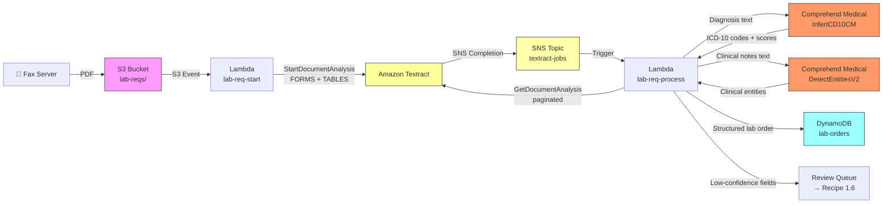

# Recipe 1.3 Architecture and Implementation: Lab Requisition Form Extraction 🔶

*Companion to [Recipe 1.3: Lab Requisition Form Extraction 🔶](chapter01.03-lab-requisition-extraction). This page covers the AWS architecture, services, prerequisites, and pseudocode. For the problem framing and the conceptual approach, start with the main recipe.*

---

## The AWS Implementation

### Why These Services

**Amazon Textract for document structure.** Same rationale as Recipes 1.1 and 1.2. Lab requisitions are multi-page PDFs (fax servers generate PDFs from the incoming fax stream). They have structured fields (patient demographics, ordering provider, priority), checkbox grids (the ordered tests), and free-text areas (the diagnosis section, any additional clinical notes). The async `StartDocumentAnalysis` API with FORMS and TABLES feature types is the right tool, and the async flow from Recipe 1.2 carries over without modification. We won't repeat all of that code here; see Recipe 1.2 for the full async implementation.

**Amazon Comprehend Medical for clinical NLP.** This is the new service in the stack. Comprehend Medical is AWS's managed clinical NLP service, trained on clinical text corpora. It provides two APIs relevant to this recipe:

- `DetectEntitiesV2`: Extracts clinical entities from free text, including medications, diagnoses, procedures, anatomy, and provider names. Each entity gets a category, type, confidence score, and semantic traits (negated, historical, hypothetical, pertaining to a family member).
- `InferICD10CM`: Takes free text containing diagnostic information and returns a ranked list of ICD-10-CM codes with confidence scores for each. This is the specialized inference model for the coding problem.

The reason to use a managed service here rather than an open-source clinical NLP library (spaCy with the `en_core_sci_sm` model, cTAKES, MetaMap) is operational: Comprehend Medical is an API call with no infrastructure to manage, scales automatically, is on the HIPAA eligible services list, and is actively maintained. The tradeoff is cost (you pay per character processed) and the opacity of the model (you can't fine-tune it on your own clinical data without going to custom model territory). For most healthcare document processing use cases, the managed API is the right default.

**Two Lambda functions for orchestration.** Same pattern as Recipe 1.2. The first Lambda starts the Textract job and exits. The second Lambda is triggered by the SNS completion notification, retrieves the Textract results, makes the Comprehend Medical calls, and assembles the final record. The Comprehend Medical calls are synchronous and fast (under 1 second for a typical diagnosis text snippet), so they run inline in the processing Lambda.

**Amazon S3, DynamoDB, SNS, and KMS.** Same services, same rationale as Recipe 1.2. Lab requisitions contain PHI and clinical information. Encrypt at rest with KMS, audit with CloudTrail, keep PHI in VPC-restricted resources.

### Architecture Diagram



### Prerequisites

| Requirement | Details |
|-------------|---------|
| **AWS Services** | Everything from Recipe 1.2 (Textract, S3, Lambda ×2, SNS, DynamoDB, KMS), plus Amazon Comprehend Medical |
| **IAM Permissions** | All permissions from Recipe 1.2, plus: `comprehend:DetectEntitiesV2`, `comprehend:InferICD10CM` |
| **BAA** | AWS BAA signed. Comprehend Medical is a HIPAA-eligible service under the same account-level BAA as Textract. No additional BAA action required beyond the account-level agreement already in place. |
| **Encryption** | S3: SSE-KMS with customer-managed key. DynamoDB: encryption at rest enabled (default). Lambda CloudWatch log groups: configure KMS encryption (Lambda does not do this automatically; logs may contain clinical text fragments). All API calls over TLS. Clinical text sent to Comprehend Medical is not retained by AWS. |
| **VPC** | Production: both Lambdas in a VPC with VPC endpoints for S3 (gateway endpoint, free), Textract, DynamoDB, SNS, Comprehend Medical, CloudWatch Logs, and KMS. The KMS endpoint is required because S3 objects encrypted with SSE-KMS need a KMS call to decrypt; without it, Lambda in a private subnet fails with an opaque AccessDeniedException on the first document read. Enable VPC Flow Logs for network-level audit trail. CloudTrail covers API calls; Flow Logs cover network traffic, completing the HIPAA audit picture. |
| **CloudTrail** | Enabled for all Textract, Comprehend Medical, S3, and DynamoDB API calls. Lab requisitions are PHI-containing clinical documents; the full audit trail is a compliance requirement. |
| **Sample Data** | Quest Diagnostics and LabCorp publish sample requisition forms on their provider portals. Create synthetic versions with realistic patient names, DOBs, and ICD-10 codes. CMS provides ICD-10-CM code lookup tools at [ICD10Data.com](https://www.icd10data.com/) for reference. Never use real PHI in development. |
| **Cost Estimate** | Textract async (FORMS + TABLES): $0.065 per page ($0.05 forms + $0.015 tables), roughly $0.065 for a one-page lab req. Comprehend Medical InferICD10CM: $0.01 per 100 characters, so a 200-character diagnosis field costs ~$0.02. DetectEntitiesV2: $0.01 per 100 characters, similar range. Total per form: approximately $0.10-0.15 depending on text length. |

### Ingredients

| AWS Service | Role |
|------------|------|
| **Amazon Textract** | Async multi-page document analysis: extracts key-value pairs (patient/provider fields), tables, and checkbox selections (ordered tests) |
| **Amazon Comprehend Medical (InferICD10CM)** | Takes diagnosis free text and returns ranked ICD-10-CM code candidates with confidence scores. Comprehend Medical is available in a subset of AWS regions. Verify your target region supports it before committing to this architecture. See the Comprehend Medical endpoints documentation for current availability. |
| **Amazon Comprehend Medical (DetectEntitiesV2)** | Extracts clinical entities (medications, diagnoses, procedures, providers) from any free-text field on the form |
| **Amazon S3** | Stores incoming faxed lab requisitions (PDF); encrypted at rest with KMS. Lab requisition records may be subject to HIPAA 6-year documentation retention and payer-specific claims substantiation requirements. For production deployments, configure S3 Object Lock (governance mode for development, compliance mode for production) on the requisitions bucket with an appropriate retention period. See Recipe 1.5 for the full Object Lock implementation pattern. |
| **AWS Lambda (lab-req-start)** | Triggered by S3 upload; submits the Textract async job and exits |
| **AWS Lambda (lab-req-process)** | Triggered by SNS notification; retrieves Textract results, calls Comprehend Medical, assembles structured record |
| **Amazon SNS** | Receives Textract job completion signals; triggers the processing Lambda |
| **Amazon DynamoDB** | Stores structured lab order records; PHI encrypted at rest. Enable DynamoDB Point-in-Time Recovery (PITR) for tables storing PHI. PITR provides continuous backup and supports disaster recovery and incident response requirements under HIPAA. |
| **AWS KMS** | Customer-managed encryption keys for S3 and DynamoDB |
| **Amazon CloudWatch** | Logs, metrics, and alarms for job failures, Comprehend Medical errors, and confidence distributions |

### Code

> **Reference implementations:** The following AWS sample repos demonstrate the patterns used in this recipe:
>
> - [`amazon-textract-and-amazon-comprehend-medical-claims-example`](https://github.com/aws-samples/amazon-textract-and-amazon-comprehend-medical-claims-example): Healthcare-specific: extracting and validating medical claims data with Textract and Comprehend Medical, including architecture and CloudFormation templates
> - [`amazon-textract-and-comprehend-medical-document-processing`](https://github.com/aws-samples/amazon-textract-and-comprehend-medical-document-processing): Workshop for building a medical document processing pipeline; covers PDF extraction, clinical entity recognition, and multi-stage orchestration with both services
> - [`aws-ai-intelligent-document-processing`](https://github.com/aws-samples/aws-ai-intelligent-document-processing): Comprehensive IDP solutions with multi-stage extraction pipelines, A2I human review integration, and guidance implementations

#### Walkthrough

**Steps 1 and 2: Async Textract extraction.** This is identical to Recipe 1.2. The first Lambda submits a `StartDocumentAnalysis` job with FORMS and TABLES feature types, stores the job context, and exits. The second Lambda triggers on the SNS completion notification, retrieves all result pages via paginated `GetDocumentAnalysis` calls, and builds the block lookup index. See Recipe 1.2 for the complete pseudocode on both of these steps. We won't repeat them here.

**Step 3: Parse the structured fields and ordered tests.** Lab requisitions combine two types of structured content: key-value pairs for patient demographics and provider identification, and checkbox grids for the ordered tests. This step handles both. The key-value parsing is the same as Recipe 1.1 and Recipe 1.2. The checkbox parsing captures which tests were ordered. For each checked test, we attempt an immediate lookup against the CPT code table. Tests that don't match are preserved with a flag: not matching the table is different from not being ordered.

```pseudocode
// CPT lookup table: normalized test name -> CPT code
// This covers the most common panels and individual tests.
// It requires ongoing maintenance as the lab's test catalog evolves.
TEST_CPT_MAP = {
    "cbc":                         "85025",    // complete blood count with differential
    "cbc with diff":               "85025",
    "cbc w/diff":                  "85025",
    "complete blood count":        "85025",
    "bmp":                         "80048",    // basic metabolic panel
    "basic metabolic panel":       "80048",
    "cmp":                         "80053",    // comprehensive metabolic panel
    "comprehensive metabolic":     "80053",
    "comprehensive metabolic panel": "80053",
    "lipid panel":                 "80061",
    "lipid profile":               "80061",
    "cholesterol panel":           "80061",
    "tsh":                         "84443",    // thyroid stimulating hormone
    "thyroid stimulating hormone": "84443",
    "hba1c":                       "83036",    // hemoglobin a1c
    "hemoglobin a1c":              "83036",
    "glycated hemoglobin":         "83036",
    "ua":                          "81003",    // urinalysis
    "urinalysis":                  "81003",
    "psa":                         "84153",    // prostate specific antigen
    "prostate specific antigen":   "84153",
    "vitamin d":                   "82306",    // 25-hydroxyvitamin D
    "25-oh vitamin d":             "82306",
    "ferritin":                    "82728",
    "b12":                         "82607",    // vitamin b12
    "vitamin b12":                 "82607",
    "folate":                      "82746",
    "uric acid":                   "84550",
    "crp":                         "86140",    // c-reactive protein
    "c-reactive protein":          "86140",
    "esr":                         "85651",    // erythrocyte sedimentation rate
    "a1c":                         "83036",    // common abbreviation
}

FUNCTION parse_forms_and_checkboxes(all_blocks, block_map):
    // Reuse the key-value parsing from Recipe 1.2.
    // We're looking for the standard patient/provider fields.
    text_key_values, checkbox_fields = parse_forms(all_blocks, block_map)
    // See Recipe 1.2 for the full parse_forms implementation.

    // For each checked test, look up the CPT code.
    ordered_tests = empty list

    FOR each test_name, is_selected in checkbox_fields:
        IF is_selected == True:
            // Normalize: lowercase, strip whitespace, collapse multiple spaces.
            normalized = lowercase(trim(test_name))

            // Attempt CPT lookup on the normalized name.
            cpt_code = TEST_CPT_MAP.get(normalized, null)

            ordered_tests.append({
                test_name:    trim(test_name),   // original label as it appears on the form
                cpt_code:     cpt_code,           // null if not in our lookup table
                cpt_mapped:   (cpt_code is not null)  // flag unmapped tests for manual review
            })

    RETURN text_key_values, ordered_tests
```

**Step 4: Extract the diagnosis text.** The diagnosis field is the bridge between the structured extraction and the clinical NLP step. Lab requisitions have a dedicated area for diagnosis information, but it's filled with free text: sometimes formal diagnosis names, sometimes ICD-10 codes written directly, sometimes abbreviations, and sometimes a mix of all three. This step locates the diagnosis field(s) in the key-value output and extracts the raw text for NLP processing. The FIELD_MAP approach from Recipe 1.1 handles the common label variants. We also extract any clinical notes or "additional information" fields, which sometimes contain context that Comprehend Medical can use.

```pseudocode
// Canonical field names for diagnosis-related content on lab requisitions.
// Different requisition templates use different label text.
DIAGNOSIS_LABELS = [
    "diagnosis", "dx", "icd-10", "icd10", "icd codes",
    "clinical diagnosis", "diagnosis code", "clinical indication",
    "indication", "reason for test", "medical necessity"
]

NOTES_LABELS = [
    "notes", "clinical notes", "additional information",
    "comments", "special instructions", "clinical history"
]

FUNCTION extract_clinical_text(text_key_values):
    // Locate the diagnosis field among the extracted key-value pairs.
    diagnosis_text = null
    notes_text     = null

    FOR each raw_label, data in text_key_values:
        normalized_label = lowercase(trim(raw_label))

        IF any variant in DIAGNOSIS_LABELS matches normalized_label:
            diagnosis_text = trim(data.value)
            // Keep going; there might be multiple diagnosis fields (primary/secondary).

        IF any variant in NOTES_LABELS matches normalized_label:
            notes_text = trim(data.value)

    // Combine for Comprehend Medical if notes contain clinical information.
    // Limit total text to stay within Comprehend Medical's per-request character limit.
    // InferICD10CM accepts up to 10,000 characters per request.
    combined = join non-null of [diagnosis_text, notes_text] with ". "
    IF length of combined > 9800:
        combined = first 9800 characters of combined  // leave some margin

    RETURN diagnosis_text, notes_text, combined
```

**Step 5: Infer ICD-10 codes with Comprehend Medical.** This is the step that transforms raw diagnosis text into actionable clinical codes. We pass the extracted diagnosis text to Comprehend Medical's `InferICD10CM` API, which returns a list of ICD-10-CM code candidates ranked by confidence score. Each candidate includes the original text span that triggered it (the "evidence text"), the inferred code, the code description, and a confidence score from 0 to 1.

We apply a confidence threshold before accepting any code. The threshold here (0.70) is deliberately set lower than the OCR threshold in earlier recipes. Clinical NLP confidence and OCR confidence are not on the same scale: a 70% Comprehend Medical score on a common diagnosis is typically reliable enough to use, whereas a 70% OCR confidence on a character is borderline. Calibrate this based on your downstream use case. If these codes are going directly to a billing system, raise the threshold. If they're populating a draft for coder review, 0.70 is reasonable.

We take the highest-confidence code per entity (the first concept in the sorted list). In practice, a well-specified diagnosis phrase maps to one primary code. If the same entity maps to multiple codes above the threshold, that usually indicates ambiguity in the original text that needs human review.

```pseudocode
// Minimum confidence score to accept a Comprehend Medical ICD-10 inference.
// Lower than OCR thresholds because CM confidence and OCR confidence are different scales.
// Adjust based on downstream use: billing systems need higher thresholds than draft queues.
ICD10_CONFIDENCE_THRESHOLD = 0.70

FUNCTION infer_icd10_codes(diagnosis_text):
    IF diagnosis_text is null or empty:
        RETURN empty list, empty list    // nothing to infer; normal for some forms

    // Call Comprehend Medical's ICD-10-CM inference API.
    // This API is specifically trained to map clinical language to ICD-10-CM codes.
    response = call ComprehendMedical.InferICD10CM with:
        text = diagnosis_text

    accepted = empty list    // codes we trust enough to use
    flagged  = empty list    // codes below threshold, held for review

    FOR each entity in response.Entities:
        // entity.Text is the span of text that triggered this entity (e.g., "Type 2 diabetes")
        // entity.ICD10CMConcepts is a ranked list of candidate codes, highest confidence first
        IF entity.ICD10CMConcepts is empty:
            CONTINUE    // no code candidates; skip

        // Take the top-ranked (highest confidence) concept.
        top_concept = entity.ICD10CMConcepts[0]

        IF top_concept.Score >= ICD10_CONFIDENCE_THRESHOLD:
            accepted.append({
                evidence_text: entity.Text,            // what text triggered this entity
                icd10_code:    top_concept.Code,       // the inferred ICD-10-CM code
                description:   top_concept.Description, // human-readable description
                confidence:    round(top_concept.Score, 3)
            })
        ELSE:
            // Low-confidence inference: preserve for review but don't use automatically.
            flagged.append({
                evidence_text: entity.Text,
                top_candidate: {
                    icd10_code:  top_concept.Code,
                    description: top_concept.Description,
                    confidence:  round(top_concept.Score, 3)
                }
            })

    RETURN accepted, flagged
```

**Step 6: Extract additional clinical entities.** The diagnosis text often contains more than just diagnosis names. It might mention the ordering physician, a relevant medication, or a procedure that contextualizes the order. `DetectEntitiesV2` gives us a broader view of the clinical content in any free-text field on the form. We're particularly interested in catching entities that might improve downstream processing: a medication name that contextualizes an HbA1c order, or a provider name that doesn't appear in the structured provider fields.

This step also helps catch clinical context that affects how the form should be processed. An entity tagged with a "NEGATION" trait means the patient does NOT have that condition. An entity tagged "PERTAINS_TO_FAMILY" means a family member has it, not the patient. These traits can change the meaning of a diagnosis entirely.

```pseudocode
FUNCTION detect_clinical_entities(text):
    IF text is null or empty:
        RETURN {}

    // Call Comprehend Medical's general entity extraction API.
    // Returns entities across six categories: MEDICATION, MEDICAL_CONDITION,
    // ANATOMY, TEST_TREATMENT_PROCEDURE, PROTECTED_HEALTH_INFORMATION, TIME_EXPRESSION.
    response = call ComprehendMedical.DetectEntitiesV2 with:
        text = text

    // Organize entities by category for easier downstream consumption.
    entities_by_category = empty map

    FOR each entity in response.Entities:
        category = entity.Category   // e.g., "MEDICAL_CONDITION", "MEDICATION"

        entity_record = {
            text:       entity.Text,                     // the original text span
            type:       entity.Type,                     // more specific than category
            confidence: round(entity.Score, 3),          // how sure Comprehend Medical is
            // Traits: NEGATION, HYPOTHETICAL, PAST_HISTORY, PERTAINS_TO_FAMILY, SIGN, SYMPTOM.
            // These modify how the entity should be interpreted.
            traits:     [t.Name for t in entity.Traits if t.Score >= 0.75]
        }

        IF category not in entities_by_category:
            entities_by_category[category] = empty list

        entities_by_category[category].append(entity_record)

    RETURN entities_by_category
```

**Step 7: Medical necessity check.** With ordered tests (CPT codes) and inferred diagnoses (ICD-10 codes) both in hand, we can run a basic medical necessity cross-reference before the order goes anywhere. This is a simplified check against a static mapping table. It is not a replacement for the utilization management system. But catching an obvious gap at extraction time, before the order leaves the queue, is measurably cheaper than catching it after the claim is denied.

The mapping table encodes a simplified version of CMS LCD policies: for each diagnosis code prefix, which CPT codes are commonly supported. The prefix approach (first three characters of the ICD-10 code) avoids building an exhaustive code-level table while still capturing the relevant diagnostic categories.

```pseudocode
// Simplified medical necessity mapping: ICD-10 prefix -> list of supported CPT codes.
// This is a starting point, not a comprehensive policy engine.
// Real medical necessity validation requires a full LCD/NCD policy integration.
MEDICAL_NECESSITY_MAP = {
    "E11": ["83036", "80053", "80048", "82306"],  // Type 2 diabetes: HbA1c, CMP, BMP, Vit D
    "E10": ["83036", "80053", "80048"],            // Type 1 diabetes
    "E78": ["80061", "80053"],                     // Hyperlipidemia: lipid panel, CMP
    "I10": ["80053", "80048"],                     // Hypertension: CMP, BMP
    "I25": ["80061", "85025"],                     // Chronic ischemic heart disease
    "N18": ["80053", "80048", "84520"],            // CKD: CMP, BMP, BUN
    "K76": ["80076", "80053"],                     // Liver disease: hepatic function panel
    "D50": ["85025", "82728", "82607"],            // Iron deficiency anemia: CBC, ferritin, B12
    "Z00": ["85025", "80053", "81003", "80061"],   // Routine exam: CBC, CMP, UA, lipid panel
}

FUNCTION check_medical_necessity(icd10_codes, ordered_tests):
    // Build a set of all CPT codes that any of our ICD-10 codes supports.
    supported_cpts = empty set

    FOR each diagnosis in icd10_codes:
        // Match on the first three characters of the ICD-10 code (the category prefix).
        code_prefix = first 3 characters of diagnosis.icd10_code
        cpts_for_code = MEDICAL_NECESSITY_MAP.get(code_prefix, empty list)
        add all cpts_for_code to supported_cpts

    // Check each ordered test against the supported set.
    flags = empty list

    FOR each test in ordered_tests:
        IF test.cpt_code is null:
            CONTINUE   // can't check necessity for tests we couldn't map to a CPT code

        IF test.cpt_code not in supported_cpts:
            // This test doesn't match any of our diagnosis codes.
            // Flag it for review. It may still be medically necessary;
            // our mapping table is incomplete. Worth a human look.
            flags.append({
                test_name: test.test_name,
                cpt_code:  test.cpt_code,
                note:      "No supporting diagnosis found in extracted codes. Review for medical necessity."
            })

    RETURN flags
```

> **Human Review Infrastructure**
>
> This recipe flags low-confidence fields for human review but does not implement the review workflow itself. The full human review infrastructure, including Amazon A2I integration with a private HIPAA-trained workforce, reviewer interface configuration, correction audit trails, and feedback loops, is built in Recipe 1.6. For production deployments, apply Recipe 1.6's A2I pattern to the flagged fields from this recipe. Key requirements: reviewers must be HIPAA-trained staff operating under a BAA, corrections must be traceable in the audit record, and the review queue message format should be consistent across recipes to enable a unified review interface.

**Step 8: Assemble the final record and store it.** The last step combines the output of all previous steps into a single structured record and writes it to DynamoDB. Every composite confidence score from both Textract and Comprehend Medical travels with the record. The `needs_review` flag is set if any field was flagged by either system. The `icd10_flagged` list captures low-confidence code inferences separately from low-confidence text extractions, because the two types of uncertainty have different implications for downstream reviewers.

```pseudocode
FUNCTION assemble_and_store(document_key, patient_fields, provider_fields,
                             ordered_tests, icd10_accepted, icd10_flagged,
                             clinical_entities, necessity_flags, text_flagged):

    // Build the structured lab order record.
    record = {
        document_key:        document_key,                          // S3 path of the source PDF
        extracted_at:        current UTC timestamp (ISO 8601),      // audit trail
        needs_review:        (
            length of text_flagged > 0     // low-confidence OCR fields
            OR length of icd10_flagged > 0  // low-confidence ICD-10 inferences
            OR length of necessity_flags > 0  // medical necessity gaps
        ),

        patient: {
            // Standard demographic fields from the key-value extraction.
            name:          patient_fields.get("patient_name"),
            date_of_birth: patient_fields.get("date_of_birth"),
            member_id:     patient_fields.get("member_id"),
            account_number: patient_fields.get("account_number"),
        },

        ordering_provider: {
            name: provider_fields.get("provider_name"),   // may also be populated from clinical entities
            npi:  provider_fields.get("npi"),
            practice: provider_fields.get("practice_name"),
        },

        ordered_tests: ordered_tests,    // list of { test_name, cpt_code, cpt_mapped }

        diagnoses: {
            // High-confidence ICD-10 inferences: safe to use downstream.
            accepted: icd10_accepted,    // list of { evidence_text, icd10_code, description, confidence }
            // Low-confidence inferences: preserved for reviewer to confirm or replace.
            flagged:  icd10_flagged,     // list of { evidence_text, top_candidate }
        },

        clinical_entities: clinical_entities,   // entity map from DetectEntitiesV2

        medical_necessity_flags: necessity_flags,  // tests without supporting diagnosis codes

        // Low-confidence OCR fields (below Textract confidence threshold).
        // These are distinct from ICD-10 inference flags.
        flagged_fields: text_flagged,
    }

    // Write the record to the database.
    write record to database table "lab-orders"

    RETURN record
```

> **Curious how this looks in Python?** The pseudocode above covers the concepts. If you'd like to see sample Python code that demonstrates these patterns using boto3, check out the [Python Example](chapter01.03-python-example). It walks through each step with inline comments and notes on what you'd need to change for a real deployment.

### Expected Results

**Sample output for a faxed lab requisition:**

```json
{
  "document_key": "lab-reqs/2026/03/01/fax-00184.pdf",
  "extracted_at": "2026-03-01T14:52:33Z",
  "needs_review": true,
  "patient": {
    "name": "James Wilson",
    "date_of_birth": "11/22/1965",
    "member_id": "AET7291048",
    "account_number": "LAB-00291"
  },
  "ordering_provider": {
    "name": "Dr. Sarah Chen",
    "npi": "1234567890",
    "practice": "Riverside Internal Medicine"
  },
  "ordered_tests": [
    { "test_name": "HbA1c", "cpt_code": "83036", "cpt_mapped": true },
    { "test_name": "CMP", "cpt_code": "80053", "cpt_mapped": true },
    { "test_name": "Lipid Panel", "cpt_code": "80061", "cpt_mapped": true }
  ],
  "diagnoses": {
    "accepted": [
      {
        "evidence_text": "Type 2 diabetes mellitus",
        "icd10_code": "E11.9",
        "description": "Type 2 diabetes mellitus without complications",
        "confidence": 0.946
      },
      {
        "evidence_text": "hypertension",
        "icd10_code": "I10",
        "description": "Essential (primary) hypertension",
        "confidence": 0.982
      }
    ],
    "flagged": []
  },
  "clinical_entities": {
    "MEDICAL_CONDITION": [
      { "text": "Type 2 diabetes mellitus", "type": "DX_NAME", "confidence": 0.976, "traits": [] },
      { "text": "hypertension", "type": "DX_NAME", "confidence": 0.991, "traits": [] }
    ],
    "TEST_TREATMENT_PROCEDURE": [
      { "text": "HbA1c", "type": "TEST_NAME", "confidence": 0.887, "traits": [] }
    ]
  },
  "medical_necessity_flags": [
    {
      "test_name": "Lipid Panel",
      "cpt_code": "80061",
      "note": "No supporting diagnosis found in extracted codes. Review for medical necessity."
    }
  ],
  "flagged_fields": []
}
```

**Performance benchmarks:**

| Metric | Typical Value |
|--------|---------------|
| End-to-end latency | 10-20 seconds (dominated by async Textract job) |
| ICD-10 inference accuracy | 85-95% for common diagnoses in clear text |
| ICD-10 inference accuracy (from OCR of handwritten text) | 65-80% (OCR errors compound NLP errors) |
| Checkbox test detection accuracy | 97-99% for cleanly printed checkboxes |
| CPT mapping coverage | 80-90% for common panels; long tail requires table expansion |
| Cost per lab requisition | ~$0.04-0.06 (Textract + two Comprehend Medical calls, varies with text length) |
| Throughput | Textract is the bottleneck; scales via concurrency limits |

**Where it struggles:** Handwritten ICD-10 codes (especially the I/1/l confusion described earlier) are the most common failure mode. OCR reads "I10" as "l10"; Comprehend Medical receives bad input; the inference misses. Low-specificity diagnosis text ("chronic conditions" or "routine labs") produces low-confidence or absent ICD-10 inferences. Lab requisitions from non-standard templates may have the diagnosis section in an unexpected location that the FIELD_MAP doesn't recognize. And CPT mapping for specialty tests (genetic panels, pathology, specialized assays) requires substantial table expansion.

---

## Why This Isn't Production-Ready

The pseudocode and architecture above demonstrate the two-stage extraction pattern. Deploying this to a real lab order workflow requires addressing several gaps. These are the ones that will catch you:

**Comprehend Medical character limits per request.** `InferICD10CM` accepts up to 10,000 UTF-8 characters per request; `DetectEntitiesV2` accepts up to 20,000. Diagnosis text on a typical lab requisition is well under either limit, but forms with extended clinical notes, attached medication lists, or multi-page clinical summaries can exceed the 10,000-character InferICD10CM limit. The pseudocode clips at 9,800 characters, which is conservative for InferICD10CM. A production implementation splits text at sentence boundaries, processes each chunk independently, and deduplicates the resulting entities. Silently truncating medical content is worse than processing it in chunks.

**Composite confidence scoring.** The pseudocode evaluates OCR confidence and ICD-10 inference confidence in separate steps with separate thresholds. In production, you need a composite score: the ICD-10 code confidence should account for the underlying OCR confidence of the text that produced it. A code inferred from text with 98% OCR confidence and 80% NLP confidence is more reliable than the same NLP score applied to text with 72% OCR confidence. Track the provenance of each field from Textract through Comprehend Medical.

**ICD-10 code specificity gap.** Comprehend Medical's `InferICD10CM` often returns the least-specific valid code: E11.9 ("without complications") when the text contains enough information to support E11.65 ("with hyperglycemia"). This isn't a bug; it's a conservative default. But payer medical policies sometimes require the specific code to support a lab order. A production system captures the full ranked candidate list, not just the top result, and routes low-specificity codes to coder review when the downstream policy requires higher specificity.

**The medical necessity table is a rough approximation.** The MEDICAL_NECESSITY_MAP covers common cases in a simplified way. Real LCD and NCD policies from CMS run to pages of ICD-10 codes per test. Commercial payer policies differ from Medicare. Testing a production system against just this table will produce both false positives (flagging tests that are actually supported by the diagnosis) and false negatives (missing tests that should be flagged). Integrate with a medical policy rules engine or use the simplified check only as a pre-screening layer before full utilization management.

**Dead Letter Queue.** Both Lambdas receive asynchronous invocations. Configure SQS dead letter queues on both, with CloudWatch alarms on queue depth. A silently lost lab order is a patient care gap, not just a processing error.

**Textract job failure handling.** The SNS notification includes a `Status` field. Check it before calling `GetDocumentAnalysis`. A corrupted fax PDF, a page count that exceeds Textract's limit, or an internal Textract error results in `FAILED` status. Handle it explicitly: move the document to a `failed-documents/` prefix, update the job record, and fire an alarm. Don't let failures disappear silently.

**CPT code table stale data.** The AMA updates CPT codes annually. Tests added or renumbered after your last table update will produce `cpt_mapped: false` silently. Build a process to review `cpt_mapped: false` entries in production and use them to drive table updates. Track the unmapped test names; they're your roadmap for expanding coverage.

---

## Variations and Extensions

**Automated order routing by priority.** Lab requisitions often include a priority field: "Routine," "ASAP," "STAT." Add a routing layer that sends STAT orders directly to the lab's urgent queue via HL7v2 ORM message (bypassing the human review queue), while routing routine orders with medical necessity flags to the review queue. Include priority classification in the structured output and build the downstream routing on top of it.

**NPI validation and network check.** Comprehend Medical's `DetectEntitiesV2` extracts provider names from clinical text. Cross-reference the extracted or structured NPI against the NPPES NPI Registry (a publicly available federal database) to validate that the provider is a real, active clinician. Layer on a network status check against your payer's network file to flag out-of-network referrals at order entry. This turns a document extraction step into a lightweight prior authorization pre-screening step.

**Historical frequency validation.** An HbA1c ordered for a patient who had one three weeks ago may not meet payer medical policy for test frequency. Before passing the structured order downstream, query the member's claims history for the same CPT codes in the trailing 90 to 365 days (the lookback period varies by test and payer). Route potential duplicates to utilization management for review rather than letting them surface as denials after the fact. This closes the loop between document extraction (this recipe) and claims trend analysis (Recipe 11.2).

---

## Additional Resources

**AWS Documentation:**
- [Amazon Comprehend Medical Developer Guide](https://docs.aws.amazon.com/comprehend-medical/latest/dev/comprehendmedical-welcome.html)
- [Amazon Comprehend Medical: InferICD10CM API Reference](https://docs.aws.amazon.com/comprehend-medical/latest/dev/API_InferICD10CM.html)
- [Amazon Comprehend Medical: DetectEntitiesV2 API Reference](https://docs.aws.amazon.com/comprehend-medical/latest/dev/API_DetectEntitiesV2.html)
- [Amazon Comprehend Medical Pricing](https://aws.amazon.com/comprehend/medical/pricing/)
- [Amazon Textract Async Operations](https://docs.aws.amazon.com/textract/latest/dg/async.html)
- [Amazon Textract Pricing](https://aws.amazon.com/textract/pricing/)
- [AWS HIPAA Eligible Services Reference](https://aws.amazon.com/compliance/hipaa-eligible-services-reference/)
- [CMS ICD-10-CM Official Guidelines for Coding and Reporting](https://www.cms.gov/medicare/coding-billing/icd-10-codes)
- [CMS Local Coverage Determinations (LCDs)](https://www.cms.gov/medicare/coverage/coverage-determination-process/local-coverage-determinations-lcds)
- [NPPES NPI Registry](https://npiregistry.cms.hhs.gov/)

**AWS Sample Repos:**
- [`amazon-textract-and-amazon-comprehend-medical-claims-example`](https://github.com/aws-samples/amazon-textract-and-amazon-comprehend-medical-claims-example): Healthcare-specific sample application for extracting and validating medical claims using both Textract and Comprehend Medical, with CloudFormation deployment templates
- [`amazon-textract-and-comprehend-medical-document-processing`](https://github.com/aws-samples/amazon-textract-and-comprehend-medical-document-processing): Workshop for building a full medical document processing pipeline; covers PDF extraction, clinical entity recognition, and multi-stage Lambda orchestration
- [`aws-ai-intelligent-document-processing`](https://github.com/aws-samples/aws-ai-intelligent-document-processing): Comprehensive IDP solution samples with multi-stage extraction pipelines, A2I human review integration, and guidance implementations for common document workflows

**AWS Solutions and Blogs:**
- [Guidance for Intelligent Document Processing on AWS](https://aws.amazon.com/solutions/guidance/intelligent-document-processing-on-aws): Reference architecture for classifying, extracting, and enriching documents at scale
- [Extracting Medical Information from Clinical Notes with Amazon Comprehend Medical](https://aws.amazon.com/blogs/machine-learning/extracting-medical-information-from-clinical-notes-with-amazon-comprehend-medical): Deep dive on entity extraction and ICD-10 inference from clinical free text
- [Intelligent Healthcare Forms Analysis with Amazon Bedrock](https://aws.amazon.com/blogs/machine-learning/intelligent-healthcare-forms-analysis-with-amazon-bedrock): Healthcare-specific forms processing with generative AI for complex or ambiguous fields
- [Building a Medical Claims Processing Solution with Textract and Comprehend Medical](https://aws.amazon.com/blogs/industries/build-a-medical-claims-processing-solution-using-amazon-textract-and-amazon-comprehend-medical/): End-to-end industry blog post on combining both services for claims automation

--- 

---

*← [Main Recipe 1.3](chapter01.03-lab-requisition-extraction) · [Python Example](chapter01.03-python-example) · [Chapter Preface](chapter01-preface)*
