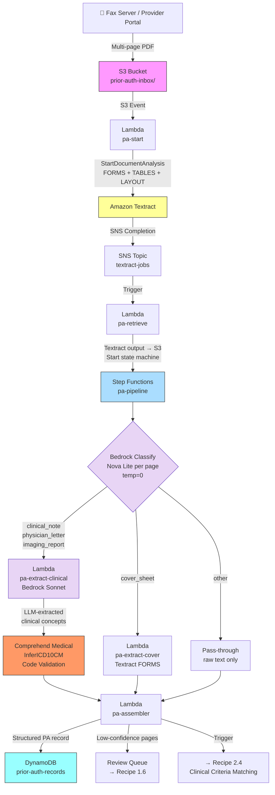

# Recipe 1.4 Architecture and Implementation: Prior Authorization Document Processing 🔶

*Companion to [Recipe 1.4: Prior Authorization Document Processing 🔶](chapter01.04-prior-auth-document-processing). This page covers the AWS architecture, services, prerequisites, and pseudocode. For the problem framing and the conceptual approach, start with the main recipe.*

---

## The AWS Implementation

### Why These Services

**Amazon Textract with LAYOUT feature type.** Textract's role doesn't change. It remains the right tool for OCR and structural extraction. LAYOUT blocks provide the high-level organization of each page, which supplements the LLM's text-based classification with spatial context. FORMS + TABLES + LAYOUT covers structured forms (cover sheets), tabular data (lab results), and general document structure (everything else). The async API from Recipe 1.2 carries forward without modification.

**Amazon Bedrock with the Converse API for page classification.** The Converse API provides a unified interface for text-to-text calls across all Bedrock models. You send the page text with a classification prompt; the model returns a structured classification response. Using Amazon Nova Lite (`us.amazon.nova-lite-v1:0`) for classification: it's the cheapest multimodal model in the Nova family, more than capable for a well-defined classification task, and at $0.06 per million input tokens the cost is negligible at any submission volume. Temperature=0 for near-deterministic output.

**Amazon Bedrock with the Converse API for clinical reasoning.** The same Converse API, different model. Claude Sonnet 4.6 (`us.anthropic.claude-sonnet-4-6-v1:0`) for clinical notes, physician letters, and imaging reports. Sonnet handles the contextual understanding these pages require: reading a physician letter and extracting not just the diagnosis but the documented evidence of medical necessity, failed prior treatments, and clinical rationale. A single Bedrock call per page replaces what was previously a separate Comprehend Medical DetectEntitiesV2 call plus manual section-targeting logic.

**Amazon Comprehend Medical for ICD-10 code validation.** `InferICD10CM` stays, but its role narrows. Instead of processing raw page text and extracting codes from scratch, it now validates the clinical concepts that the LLM extracted. The LLM extracts "severe osteoarthritis of the right knee with complete joint space loss." Comprehend Medical maps that phrase to ICD-10 codes with confidence scores. This hybrid uses each service where it's strongest: LLM for contextual extraction, purpose-built service for high-confidence code mapping.

**AWS Step Functions for pipeline orchestration.** The fan-out structure is simpler now (two paths instead of four to six), but Step Functions still earns its place. Parallel branches for cover sheets and narrative pages, per-branch error handling, and a visual execution graph for debugging production failures. Standard Workflows over Express Workflows for the same reason as before: production support teams need execution history when a 15-page submission fails on page 9.

**Amazon S3, DynamoDB, SNS, and KMS.** Unchanged from the earlier recipes. PHI in transit and at rest, audit logging, VPC endpoints. The BAA that covers Textract and Comprehend Medical also covers Bedrock.

### Architecture Diagram



### Prerequisites

| Requirement | Details |
|-------------|---------|
| **AWS Services** | Everything from Recipes 1.2 and 1.3 (Textract, S3, Lambda, SNS, DynamoDB, KMS, Comprehend Medical), plus Step Functions and Amazon Bedrock |
| **IAM Permissions** | All permissions from Recipes 1.2 and 1.3, plus: `states:StartExecution`, `states:DescribeExecution` (Step Functions); `bedrock:InvokeModel` on the specific model ARNs for Nova Lite and Claude Sonnet 4.6. Lambda execution roles for the extraction functions need `bedrock:InvokeModel` scoped to the specific model ARNs used. |
| **Bedrock Model Access** | Nova Lite and Claude Sonnet 4.6 must be enabled in your Bedrock console before first use. Cross-region inference profiles (`us.amazon.nova-lite-v1:0`, `us.anthropic.claude-sonnet-4-6-v1:0`) route to the best available region automatically. Enable both in Bedrock Model Access before deploying. **Cross-region inference profiles and VPC endpoints:** when your Lambda calls the `bedrock-runtime` VPC interface endpoint in your region, AWS routes the request to the appropriate backend region (us-east-1, us-east-2, or us-west-2) internally. PHI does not traverse the public internet; the VPC endpoint keeps API traffic on the AWS private network regardless of which backend region processes the request. For organizations that must document data flows for HIPAA compliance, note that inference may occur in any of those three US regions. If your organization has state-level geographic data restrictions beyond HIPAA, evaluate whether direct single-region model IDs (without the `us.` prefix) are required. |
| **Textract Features** | FORMS + TABLES + LAYOUT in the `FeatureTypes` list. LAYOUT adds approximately $5.00 per 1,000 pages ($0.005/page) on top of the base async pricing. |
| **BAA** | AWS BAA signed. Bedrock is a HIPAA-eligible service. PHI can be sent to Bedrock models under the BAA. Models do not retain or train on customer data sent via Bedrock APIs. Same BAA covers Textract, Comprehend Medical, and Bedrock. |
| **Encryption** | S3: SSE-KMS with customer-managed key. DynamoDB: encryption at rest enabled. All API calls over TLS. Text sent to Bedrock and Comprehend Medical is not retained by AWS. Step Functions execution history encrypted at rest via SSE. |
| **VPC** | Production: all Lambdas in a VPC with VPC endpoints for S3 (gateway), Textract, DynamoDB, SNS, Comprehend Medical, Step Functions, CloudWatch Logs, KMS, and Bedrock. Bedrock requires **two separate interface endpoints**: `com.amazonaws.REGION.bedrock` (model management API) and `com.amazonaws.REGION.bedrock-runtime` (Converse API, used by all Lambda functions in this recipe). A VPC with only `com.amazonaws.REGION.bedrock` will silently drop all Converse API calls in a no-egress HIPAA environment. Most deployments need only `bedrock-runtime`; include `bedrock` if you also manage model access programmatically. |
| **Lambda Timeouts** | Lambda's default 3-second timeout will fail on the first Bedrock Sonnet call (typical latency: 2–5 seconds under normal load, 10–15 seconds under high load). Configure minimum timeouts: `pa-classify` 3–5 minutes (classification averages 1–3 seconds per page; sequential processing of a 12-page submission needs margin), `pa-extract-clinical` 5–10 minutes (Sonnet calls can reach 15 seconds at peak; a 4-page sequential extraction with retries needs the full window), `pa-assembler` 2 minutes. Use provisioned concurrency to eliminate Lambda cold-start latency for time-sensitive expedited PA submissions. |
| **CloudTrail** | Enabled for all API calls including Bedrock. Bedrock model invocations are logged with model ID, token counts, and latency. Prior auth submissions are clinical decision records; the complete audit trail is a regulatory requirement. |
| **Sample Data** | CMS publishes the [CMS-1500 form](https://www.cms.gov/medicare/cms-forms/cms-forms/downloads/cms1500.pdf) for cover sheet layout reference. Create synthetic multi-page PDFs combining a cover sheet, 1–2 clinical notes, a lab results page, and a physician letter. HL7 FHIR examples (see the [HL7 FHIR R4 examples directory](https://hl7.org/fhir/R4/examples.html)) provide realistic clinical document content for test cases. Never use real PHI in development. |
| **Cost Estimate** | Textract async (FORMS+TABLES+LAYOUT): ~$0.07/page, or $0.70 for a 10-page submission. Bedrock Nova Lite classification: ~$0.0002/page, negligible. Bedrock Sonnet 4.6 clinical reasoning (4 clinical pages): ~$0.05–0.06. Comprehend Medical InferICD10CM on extracted concepts (shorter inputs): ~$0.02–0.05. Step Functions Standard Workflows: ~$0.002/submission. Per-submission total: ~$0.80–1.00. At 500,000 submissions/year, the end-to-end pipeline cost (Textract, Bedrock, Comprehend Medical, Step Functions, Lambda, DynamoDB) is approximately $375,000–$450,000 annually. See the Technology section for a per-component breakdown. Prompt caching on the classification system prompt can reduce Bedrock input costs by up to 90%, bringing the LLM line item to under $10,000/year at that volume. |

### Ingredients

| AWS Service | Role |
|------------|------|
| **Amazon Textract** | Full multi-page document analysis: FORMS, TABLES, and LAYOUT blocks for all pages; OCR foundation for the entire pipeline |
| **Amazon Bedrock (Nova Lite)** | Page classification via Converse API; cheap, fast, near-deterministic at temperature=0 |
| **Amazon Bedrock (Claude Sonnet 4.6)** | Clinical reasoning and extraction from narrative pages: clinical notes, physician letters, imaging reports |
| **Amazon Comprehend Medical (InferICD10CM)** | ICD-10 code validation on LLM-extracted clinical concepts; high-confidence code mapping. Comprehend Medical is available in a subset of AWS regions. Verify your target region supports it before selecting your deployment region. |
| **AWS Step Functions (Standard Workflows)** | Orchestrates the classify → fan-out → assemble pipeline with parallel branches and error handling |
| **Amazon S3** | Stores incoming prior auth PDFs and Textract output artifacts; encrypted at rest with KMS |
| **AWS Lambda** | Extraction functions: pa-start, pa-retrieve, pa-classify, pa-extract-cover, pa-extract-clinical, pa-assembler |
| **Amazon SNS** | Receives Textract async job completion notification; triggers pa-retrieve Lambda |
| **Amazon DynamoDB** | Stores structured prior auth records; PHI encrypted at rest |
| **AWS KMS** | Customer-managed encryption keys for S3, DynamoDB, and Step Functions execution history |
| **Amazon CloudWatch** | Logs, metrics, alarms for pipeline failures, Bedrock token usage, and confidence distributions |

### Code

> **Reference implementations:** The following AWS sample repos demonstrate the patterns used in this recipe:
>
> - [`aws-ai-intelligent-document-processing`](https://github.com/aws-samples/aws-ai-intelligent-document-processing): Comprehensive IDP solutions with multi-stage extraction pipelines, document classification, A2I human review integration, and generative AI enrichment
> - [`amazon-textract-and-comprehend-medical-document-processing`](https://github.com/aws-samples/amazon-textract-and-comprehend-medical-document-processing): Workshop-style repo for multi-stage medical document processing pipelines covering PDF extraction, entity recognition, and Lambda orchestration
> - [`amazon-textract-and-amazon-comprehend-medical-claims-example`](https://github.com/aws-samples/amazon-textract-and-amazon-comprehend-medical-claims-example): Healthcare-specific extraction and validation with both services, with CloudFormation deployment templates
> - [`document-processing-pipeline-for-regulated-industries`](https://github.com/aws-samples/document-processing-pipeline-for-regulated-industries): Regulated-industry document pipeline with lineage tracking and pipeline metadata services
> - [`guidance-for-low-code-intelligent-document-processing-on-aws`](https://github.com/aws-solutions-library-samples/guidance-for-low-code-intelligent-document-processing-on-aws): Scalable IDP architecture guidance covering ingestion, extraction, enrichment, and storage patterns

#### Walkthrough

**Steps 1 and 2: Async Textract extraction and result retrieval.** These steps are identical to Recipe 1.2, with one addition: include LAYOUT in the `FeatureTypes` list. The `pa-start` Lambda submits the job and exits. The `pa-retrieve` Lambda fires on the SNS completion notification, retrieves all result pages via paginated `GetDocumentAnalysis`, and builds a full block list.

The one structural change from Recipe 1.2: `pa-retrieve` writes the raw Textract output to S3 (as JSON, keyed to the job ID), then starts the Step Functions state machine with the S3 reference. This keeps the payload small and bypasses Step Functions' 256 KB input limit. Every subsequent step reads from S3 rather than receiving raw blocks in its input.

```
FUNCTION retrieve_and_handoff(textract_job_id, document_key, state_machine_arn):
    // Retrieve all Textract result pages (same paginated call as Recipe 1.2)
    all_blocks = retrieve_all_textract_blocks(textract_job_id)

    // Write the raw block list to S3 for downstream steps to consume.
    // Use the job ID as part of the key so results don't collide across submissions.
    textract_output_key = "textract-outputs/" + textract_job_id + "/blocks.json"
    write all_blocks to S3 at textract_output_key

    // Start the Step Functions state machine.
    // Pass S3 references, not raw blocks.
    // Step Functions input payloads have a 256 KB limit; large documents easily exceed it.
    start Step Functions execution at state_machine_arn with input:
        document_key         = document_key           // original PA submission PDF
        textract_output_key  = textract_output_key    // where the Textract blocks live
        textract_job_id      = textract_job_id        // for audit trail
```

**Step 3: Group Textract blocks by page.** Read the S3 Textract output, group blocks by page number, extract full page text from LINE blocks, and flag which structural features each page has (form fields, tables, layout elements). These structural signals feed into the LLM classification prompt as metadata.

```
FUNCTION group_blocks_by_page(all_blocks):
    pages = empty map  // page_number -> { blocks, text, has_tables, has_forms, layout_blocks }

    FOR each block in all_blocks:
        page_num = block.Page  // Textract page numbers are 1-indexed

        IF page_num not in pages:
            pages[page_num] = {
                blocks:        empty list,
                text:          empty string,
                has_tables:    false,
                has_forms:     false,
                layout_blocks: empty list
            }

        pages[page_num].blocks.append(block)

        IF block.BlockType == "LINE":
            pages[page_num].text += block.Text + "\n"

        IF block.BlockType == "TABLE":
            pages[page_num].has_tables = true

        IF block.BlockType == "KEY_VALUE_SET":
            pages[page_num].has_forms = true

        IF block.BlockType starts with "LAYOUT_":
            pages[page_num].layout_blocks.append(block)

    RETURN pages
```

**Step 4: Classify each page with a foundation model.** This is where the pipeline changes substantially. Instead of scoring keyword matches, we send the page text and its structural metadata to a foundation model via the Converse API.

A few design decisions embedded here deserve explanation.

Why Nova Lite for classification? Because classification is a well-defined task with clear inputs and outputs. You don't need deep reasoning; you need a model that reliably categorizes document types. Nova Lite handles this well and costs nearly nothing at healthcare document volumes. Sending this task to Sonnet would be like driving a nail with a sledgehammer.

Why temperature=0? Because classification should be as consistent as possible. Temperature=0 pushes the model toward its highest-probability output, which is generally the correct one for well-defined classification tasks. It won't give you byte-identical responses every single time (language models are probabilistic at their core), but it gets you close enough to "deterministic" that the variation is in the noise.

Why include structural metadata in the prompt rather than just the page text? Because "this page has form fields and no tables" is useful signal. A page of text that looks ambiguous without structural context often resolves cleanly with it.

```
// System prompt for page classification.
// The instruction to return JSON with a specific schema is critical:
// temperature=0 plus an explicit schema gives you consistent structured output.

CLASSIFICATION_SYSTEM_PROMPT = """
You are a healthcare document classifier. Your job is to identify what type of document
page you are reading from a prior authorization submission.

Return ONLY a valid JSON object with these fields:
{
  "page_type": "<one of: cover_sheet, clinical_note, physician_letter, lab_results,
                imaging_report, other>",
  "confidence": <0.0 to 1.0>,
  "reasoning": "<one sentence explaining your classification>"
}

Document types:
- cover_sheet: administrative form with fields like member ID, provider NPI,
  CPT code, date of service. Usually has checkboxes and form fields.
- clinical_note: physician office note with sections like History of Present
  Illness, Assessment, Plan. Written by a treating clinician.
- physician_letter: letter written by a physician explaining medical necessity,
  treatment history, or requesting authorization for a specific procedure.
- lab_results: laboratory test results page with test names, numeric values,
  units, and reference ranges. Usually presented as a table.
- imaging_report: radiology or other imaging report with sections like Findings,
  Impression, and Technique. Written by a radiologist.
- other: anything that does not clearly fit the above categories.

Be conservative with confidence. Only return 0.9 or higher if the classification
is unambiguous. Return 0.7-0.89 for likely classifications. Below 0.7 for uncertain cases.
"""

FUNCTION classify_page_with_llm(page_text, has_tables, has_forms, model_id):
    // Sanitize OCR text before passing to LLM. External documents (provider submissions)
    // are untrusted input. Strip control characters, null bytes, and anomalous Unicode
    // sequences that could be used for prompt injection.
    sanitized_text = strip_control_characters(page_text)
    sanitized_text = remove_null_bytes(sanitized_text)

    // Build the user message: page text plus structural metadata.
    // The structural context helps the model on ambiguous pages where
    // text alone doesn't clearly signal the document type.
    structural_context = ""
    IF has_forms:
        structural_context += "This page contains form fields (key-value pairs). "
    IF has_tables:
        structural_context += "This page contains one or more tables. "
    IF not has_forms and not has_tables:
        structural_context += "This page is primarily flowing text with no form fields or tables. "

    user_message = structural_context + "\n\nPage text:\n" + sanitized_text

    // Call the Bedrock Converse API.
    // maxTokens=256 is more than sufficient for a JSON classification response.
    response = call Bedrock Converse API with:
        modelId         = model_id  // e.g., "us.amazon.nova-lite-v1:0"
        system          = [{ text: CLASSIFICATION_SYSTEM_PROMPT }]
        messages        = [{ role: "user", content: [{ text: user_message }] }]
        inferenceConfig = { maxTokens: 256, temperature: 0 }

    // Parse the JSON response from the model's text output.
    response_text = response.output.message.content[0].text
    result        = parse JSON from response_text

    RETURN {
        page_type:  result.page_type,
        confidence: result.confidence,
        reasoning:  result.reasoning
    }


FUNCTION classify_all_pages(pages, classification_model_id):
    classifications = empty map

    FOR each page_num, page_data in pages:
        result = classify_page_with_llm(
            page_data.text,
            page_data.has_tables,
            page_data.has_forms,
            classification_model_id
        )
        classifications[page_num] = result
        // Log both the classification and the model's reasoning for the audit trail.
        // When reviewers question a routing decision, this log is what they look at.
        log: "Page " + page_num + " → " + result.page_type +
             " (confidence " + result.confidence + "): " + result.reasoning

    RETURN classifications
```

**Step 5: Fan out to two extraction paths.** Based on the classification from Step 4, each page routes to one of two extraction functions. Cover sheets go to the Textract forms extractor. Everything else with narrative content goes to the Bedrock clinical extractor. Pages classified as "other" or below a confidence threshold go to a pass-through that preserves their raw text and flags them for human review.

```
EXTRACTION_ROUTER = {
    "cover_sheet":      extract_cover_sheet,    // Textract FORMS-based extraction
    "clinical_note":    extract_clinical_page,  // Bedrock Sonnet reasoning
    "physician_letter": extract_clinical_page,  // same Bedrock extractor
    "imaging_report":   extract_clinical_page,  // same Bedrock extractor
    "lab_results":      extract_lab_page,       // table parsing from Textract TABLES blocks
    "other":            extract_other_page      // raw text only; flag for review
}

FUNCTION route_and_extract(page_num, classification, page_data, block_map,
                           clinical_model_id):
    // Low-confidence classifications go straight to review rather than extraction.
    // The threshold here (0.6) is intentionally permissive because
    // even a rough classification is better than none for routing.
    // Pages below this are genuinely ambiguous and humans should decide.
    IF classification.confidence < 0.6:
        RETURN {
            page_num:   page_num,
            page_type:  "uncertain",
            confidence: classification.confidence * 100,
            data:       { raw_text: page_data.text },
            flagged:    ["low_classification_confidence"]
        }

    page_type = classification.page_type
    extractor = EXTRACTION_ROUTER[page_type]
    result    = extractor(page_data, block_map, clinical_model_id)

    RETURN {
        page_num:   page_num,
        page_type:  page_type,
        confidence: result.confidence,
        data:       result.data,
        flagged:    result.flagged
    }
```

The **cover sheet extractor** is unchanged from the original recipe. It uses Textract key-value pairs and a FIELD_MAP to normalize label variants to canonical field names. See Recipe 1.1 for the full implementation. The point stands: Textract is the right tool for structured form extraction, and changing tools here would add cost and complexity for zero improvement.

```
// Cover sheet field map: canonical name → list of known label variants.
// Notice that "service requested code" and "dx indication" are in here now.
// The LLM handles template variability in classification; the field map still
// handles variability in cover sheet field labels for known variants.
PA_COVER_FIELD_MAP = {
    "member_name":         ["member name", "patient name", "subscriber name", "insured name"],
    "member_id":           ["member id", "subscriber id", "member #", "id number"],
    "member_dob":          ["date of birth", "dob", "member dob", "patient dob"],
    "requesting_provider": ["requesting provider", "ordering physician", "rendering provider",
                            "treating physician", "provider name"],
    "provider_npi":        ["npi", "provider npi", "npi number", "national provider"],
    "requesting_facility": ["facility", "practice name", "clinic name", "hospital"],
    "requested_cpt":       ["cpt code", "procedure code", "procedure", "service code",
                            "requested procedure", "service requested code"],
    "diagnosis_code":      ["diagnosis code", "icd-10", "icd code", "dx", "icd-10-cm",
                            "dx indication", "diagnosis indication"],
    "date_of_service":     ["date of service", "dos", "requested date", "service date"],
    "urgency":             ["urgency", "urgent", "priority", "expedited", "stat"]
}

FUNCTION extract_cover_sheet(page_data, block_map, _model_id):
    // Parse key-value pairs using Textract blocks (same as Recipe 1.1 Step 2)
    raw_kv     = parse_key_value_pairs(page_data.blocks, block_map)
    normalized = normalize_fields(raw_kv, PA_COVER_FIELD_MAP)
    clean_fields, flagged_fields = flag_low_confidence(normalized, threshold=85.0)
    avg_confidence = average of confidence scores for all fields in normalized

    RETURN {
        confidence: avg_confidence,
        data:       clean_fields,
        flagged:    flagged_fields
    }
    // Full implementations of parse_key_value_pairs, normalize_fields,
    // and flag_low_confidence are in Recipe 1.1.
```

The **clinical page extractor** is where the architecture changes most significantly. Instead of routing page text through Comprehend Medical's entity extraction APIs, a single Bedrock Converse call extracts all clinically relevant information in one shot. The model reads the page as a clinician would: understanding context, recognizing the significance of failed prior treatments, extracting the physician's reasoning, identifying the relevant diagnosis with its clinical basis.

After LLM extraction, we run `InferICD10CM` on the extracted diagnosis text. This is the validation step: the LLM gives us the clinical concepts in natural language, and Comprehend Medical maps them to high-confidence ICD-10 codes.

```
// System prompt for clinical evidence extraction.
// A capable model (Sonnet or equivalent) is required here.
// The schema in the prompt is how we get structured JSON output reliably.

CLINICAL_EXTRACTION_SYSTEM_PROMPT = """
You are a clinical documentation analyst reviewing pages from prior authorization submissions.
Your job is to extract all clinically relevant information needed to evaluate a prior
authorization request.

Return ONLY a valid JSON object with this structure:
{
  "diagnosis_text": "<the primary diagnosis or diagnoses as written in this document>",
  "conditions": ["<list of medical conditions, diseases, diagnoses mentioned>"],
  "medications": ["<list of medications with dosages if present>"],
  "procedures": ["<list of procedures, treatments, or tests mentioned>"],
  "medical_necessity_evidence": "<free text: evidence supporting medical necessity,
    including clinical findings, severity indicators, and impact on function>",
  "failed_treatments": ["<list of prior treatments that were tried and failed or
    were insufficient, with duration if mentioned>"],
  "supporting_findings": "<relevant clinical findings, test results, or
    imaging findings mentioned in this document>",
  "confidence": <0.0 to 1.0, your confidence in the extraction completeness>
}

Extract only what is explicitly stated in the document. Do not infer or add information
not present in the text. If a field has no relevant content, use an empty list or
empty string. The medical_necessity_evidence and failed_treatments fields are the
most important for prior authorization decisions. Be thorough on those.
"""
``` 

```
FUNCTION extract_clinical_page(page_data, block_map, clinical_model_id):
    page_text = page_data.text

    // Call Bedrock Converse with the clinical extraction prompt.
    // maxTokens=1024 because clinical notes can be dense; classification needed 256.
    // Temperature=0 for consistency; extraction should be as deterministic as possible.
    response = call Bedrock Converse API with:
        modelId         = clinical_model_id  // e.g., "us.anthropic.claude-sonnet-4-6-v1:0"
        system          = [{ text: CLINICAL_EXTRACTION_SYSTEM_PROMPT }]
        messages        = [{
            role:    "user",
            content: [{ text: "Extract clinical information from this document page:\n\n" + page_text }]
        }]
        inferenceConfig = { maxTokens: 1024, temperature: 0 }

    response_text  = response.output.message.content[0].text
    llm_extraction = parse JSON from response_text

    // Use Comprehend Medical InferICD10CM to validate and map the LLM-extracted
    // diagnosis text to high-confidence ICD-10 codes with confidence scores.
    // This is the code validation step: LLM extracts the concept, Comprehend maps the code.
    // We do this because LLMs can produce inconsistent code strings across runs;
    // Comprehend Medical is purpose-built for reliable, high-confidence code lookup.
    icd10_accepted = empty list
    icd10_flagged  = empty list

    IF llm_extraction.diagnosis_text is not empty:
        icd10_accepted, icd10_flagged = infer_icd10_codes(llm_extraction.diagnosis_text)
        // See Recipe 1.3 for the full implementation of infer_icd10_codes.
        // It calls Comprehend Medical InferICD10CM and filters by confidence threshold.

    // Page confidence: use the LLM's self-reported extraction confidence,
    // but cap it by the underlying Textract OCR quality.
    // Bad OCR input leads to incomplete LLM extraction even if the model is confident.
    textract_avg_confidence = average LINE block confidence for this page / 100.0
    effective_confidence    = minimum(llm_extraction.confidence, textract_avg_confidence) * 100

    RETURN {
        confidence: effective_confidence,
        data: {
            diagnosis_text:             llm_extraction.diagnosis_text,
            conditions:                 llm_extraction.conditions,
            medications:                llm_extraction.medications,
            procedures:                 llm_extraction.procedures,
            medical_necessity_evidence: llm_extraction.medical_necessity_evidence,
            failed_treatments:          llm_extraction.failed_treatments,
            supporting_findings:        llm_extraction.supporting_findings,
            icd10_codes:                icd10_accepted
        },
        flagged: {
            icd10_uncertain: icd10_flagged  // low-confidence code inferences for review
        }
    }
```

The **lab results extractor** is unchanged. Lab results pages are structured tables, and Textract is exactly the right tool for them. The Bedrock LLM adds nothing here that Textract doesn't already provide better and cheaper. This is the "right tool for the job" principle in practice: just because you can send a lab results table to an LLM doesn't mean you should.

```
LAB_COLUMN_MAP = {
    "test_name":       ["test", "test name", "analyte", "component", "description"],
    "result":          ["result", "value", "result value", "your result"],
    "units":           ["units", "unit"],
    "reference_range": ["reference range", "normal range", "reference interval",
                        "normal values", "expected range"],
    "flag":            ["flag", "abnormal flag", "indicator", "h/l"]
}

FUNCTION extract_lab_page(page_data, block_map, _model_id):
    tables     = parse_tables_from_blocks(page_data.blocks, block_map)
    lab_values = empty list

    FOR each table in tables:
        IF table has fewer than 2 rows:
            CONTINUE  // Header-only or empty table; skip it

        headers     = table[0]
        col_mapping = normalize_lab_columns(headers, LAB_COLUMN_MAP)

        FOR each row in table[1:]:
            lab_entry = empty map
            FOR each col_index, canonical_name in col_mapping:
                IF col_index < length of row:
                    lab_entry[canonical_name] = trim(row[col_index])

            IF "test_name" in lab_entry AND "result" in lab_entry:
                lab_values.append(lab_entry)

    RETURN {
        confidence: average Textract confidence for TABLE cells on this page,
        data:       { lab_values: lab_values },
        flagged:    []
    }
```

**Step 6: Assemble the structured prior auth record.** The assembler receives extraction results from all pages and merges them into a single coherent record. The structure is similar to the original recipe, with one meaningful addition: `medical_necessity_evidence` and `failed_treatments` are now first-class fields. These are the fields that matter most for the clinical criteria matching step downstream.

```
FUNCTION assemble_prior_auth_record(document_key, page_count, page_extractions):
    record = {
        document_key:         document_key,
        extracted_at:         current UTC timestamp (ISO 8601),
        page_count:           page_count,
        needs_review:         false,
        page_classifications: empty map,

        // Administrative data (from the cover sheet via Textract forms extraction)
        demographics: {
            member_name:  null,
            member_id:    null,
            member_dob:   null
        },
        requested_service: {
            cpt_code:         null,
            procedure:        null,
            date_of_service:  null,
            urgency:          "routine"
        },
        requesting_provider: {
            name:      null,
            npi:       null,
            facility:  null
        },

        // Clinical evidence (from LLM extraction of narrative pages)
        // These fields drive the downstream clinical criteria matching in Recipe 2.4.
        clinical_evidence: {
            icd10_codes:                empty list,   // deduplicated; highest confidence per code
            conditions:                 empty list,
            medications:                empty list,
            procedures:                 empty list,
            medical_necessity_evidence: empty string, // LLM-extracted narrative evidence
            failed_treatments:          empty list,   // documented prior treatment failures
            supporting_findings:        empty string, // LLM-extracted clinical findings
            lab_values:                 empty list
        },

        page_confidence: empty map,
        flagged_pages:   empty list,
        flagged_fields:  empty map
    }

    seen_icd10_codes = empty map   // code → entry (keep highest confidence)
    seen_conditions  = empty set
    seen_medications = empty set
    seen_procedures  = empty set

    FOR each page_num, extraction in page_extractions:
        page_type  = extraction.page_type
        confidence = extraction.confidence

        record.page_classifications[page_num] = page_type
        record.page_confidence[page_num]      = round(confidence, 1)

        IF confidence < 75.0:
            record.flagged_pages.append(page_num)
            record.needs_review = true

        IF extraction.flagged is not empty:
            record.flagged_fields[page_num] = extraction.flagged
            record.needs_review = true

        IF page_type == "cover_sheet":
            data = extraction.data
            IF record.demographics.member_name is null:
                record.demographics.member_name = data.get("member_name")
                record.demographics.member_id   = data.get("member_id")
                record.demographics.member_dob  = data.get("member_dob")
            IF record.requested_service.cpt_code is null:
                record.requested_service.cpt_code        = data.get("requested_cpt")
                record.requested_service.date_of_service  = data.get("date_of_service")
                IF data.get("urgency") contains "urgent" or "stat":
                    record.requested_service.urgency = "urgent"
            IF record.requesting_provider.npi is null:
                record.requesting_provider.name     = data.get("requesting_provider")
                record.requesting_provider.npi      = data.get("provider_npi")
                record.requesting_provider.facility = data.get("requesting_facility")

        ELSE IF page_type in ("clinical_note", "physician_letter", "imaging_report"):
            data = extraction.data

            // Deduplicate ICD-10 codes: keep highest confidence per code
            FOR each code_entry in data.icd10_codes:
                code = code_entry.icd10_code
                IF code not in seen_icd10_codes OR
                   code_entry.confidence > seen_icd10_codes[code].confidence:
                    seen_icd10_codes[code] = code_entry

            // Deduplicate clinical entities by normalized text
            FOR each item in data.conditions:
                normalized = lowercase(trim(item))
                IF normalized not in seen_conditions:
                    seen_conditions.add(normalized)
                    record.clinical_evidence.conditions.append(item)

            FOR each item in data.medications:
                normalized = lowercase(trim(item))
                IF normalized not in seen_medications:
                    seen_medications.add(normalized)
                    record.clinical_evidence.medications.append(item)

            FOR each item in data.procedures:
                normalized = lowercase(trim(item))
                IF normalized not in seen_procedures:
                    seen_procedures.add(normalized)
                    record.clinical_evidence.procedures.append(item)

            // Accumulate failed treatments; different pages may document different episodes
            FOR each treatment in data.failed_treatments:
                IF treatment not in record.clinical_evidence.failed_treatments:
                    record.clinical_evidence.failed_treatments.append(treatment)

            // Medical necessity evidence: concatenate across pages.
            // Each clinical page may add a different angle on why this procedure is necessary.
            IF data.medical_necessity_evidence is not empty:
                IF record.clinical_evidence.medical_necessity_evidence is empty:
                    record.clinical_evidence.medical_necessity_evidence =
                        data.medical_necessity_evidence
                ELSE:
                    record.clinical_evidence.medical_necessity_evidence +=
                        "\n\n" + data.medical_necessity_evidence

            IF data.supporting_findings is not empty:
                IF record.clinical_evidence.supporting_findings is empty:
                    record.clinical_evidence.supporting_findings = data.supporting_findings
                ELSE:
                    record.clinical_evidence.supporting_findings +=
                        "\n\n" + data.supporting_findings

        ELSE IF page_type == "lab_results":
            record.clinical_evidence.lab_values.extend(extraction.data.lab_values)

    record.clinical_evidence.icd10_codes = list of values in seen_icd10_codes,
                                           sorted by confidence descending

    IF record.demographics.member_id is null OR record.requested_service.cpt_code is null:
        record.needs_review = true

    RETURN record


FUNCTION store_prior_auth_record(record):
    write record to DynamoDB table "prior-auth-records" with:
        primary key = record.document_key

    IF NOT record.needs_review:
        publish to event bus:
            event_type   = "prior_auth_extracted"
            document_key = record.document_key
```

> **Curious how this looks in Python?** The pseudocode above covers the concepts. If you'd like to see sample Python code that demonstrates these patterns using boto3, check out the [Python Example](chapter01.04-python-example). It walks through each step with inline comments and notes on what you'd need to change for a real deployment.

### Expected Results

**Sample output for a 12-page knee replacement prior auth submission:**

```json
{
  "document_key": "prior-auth-inbox/2026/03/01/fax-00847.pdf",
  "extracted_at": "2026-03-01T15:22:08Z",
  "page_count": 12,
  "needs_review": false,
  "page_classifications": {
    "1": "cover_sheet",
    "2": "cover_sheet",
    "3": "clinical_note",
    "4": "clinical_note",
    "5": "clinical_note",
    "6": "lab_results",
    "7": "lab_results",
    "8": "imaging_report",
    "9": "imaging_report",
    "10": "physician_letter",
    "11": "other",
    "12": "other"
  },
  "demographics": {
    "member_name": "Robert Thompson",
    "member_id": "UHC4829100",
    "member_dob": "03/14/1962"
  },
  "requested_service": {
    "cpt_code": "27447",
    "procedure": "Total Knee Arthroplasty",
    "date_of_service": "04/15/2026",
    "urgency": "routine"
  },
  "requesting_provider": {
    "name": "Dr. Amanda Liu",
    "npi": "1982374650",
    "facility": "Riverside Orthopedic Surgery Center"
  },
  "clinical_evidence": {
    "icd10_codes": [
      {
        "text": "severe osteoarthritis right knee with bone-on-bone contact",
        "icd10_code": "M17.11",
        "description": "Primary osteoarthritis, right knee",
        "confidence": 0.961
      },
      {
        "text": "chronic knee pain",
        "icd10_code": "G89.29",
        "description": "Other chronic pain",
        "confidence": 0.874
      }
    ],
    "conditions": [
      "severe osteoarthritis, right knee",
      "chronic knee pain",
      "functional limitation with ambulation"
    ],
    "medications": [
      "naproxen 500mg twice daily",
      "cortisone injection (right knee, x3 over 18 months)"
    ],
    "procedures": [
      "physical therapy (12 weeks)",
      "MRI right knee",
      "weight loss program"
    ],
    "medical_necessity_evidence": "Patient presents with severe tricompartmental osteoarthritis of the right knee with bone-on-bone contact confirmed on MRI. Functional assessment demonstrates inability to ambulate more than one block without significant pain (VAS 8/10). Patient has failed 6 months of conservative management including NSAIDs, physical therapy, and intra-articular corticosteroid injections. Clinical findings and imaging support surgical intervention as medically necessary.",
    "failed_treatments": [
      "NSAIDs (naproxen 500mg BID for 8 months): inadequate pain relief",
      "Physical therapy (12 weeks): temporary improvement, no sustained benefit",
      "Cortisone injections x3 over 18 months: diminishing response, last injection provided less than 4 weeks of relief"
    ],
    "supporting_findings": "MRI right knee (2026-01-15): Severe tricompartmental osteoarthritis with near-complete loss of joint space. Bone-on-bone contact medial compartment. Subchondral cyst formation. X-ray (standing AP): Kellgren-Lawrence grade IV changes.",
    "lab_values": [
      { "test_name": "ESR", "result": "28", "units": "mm/hr", "reference_range": "0-20", "flag": "H" },
      { "test_name": "CRP", "result": "1.8", "units": "mg/dL", "reference_range": "0-0.5", "flag": "H" }
    ]
  },
  "page_confidence": {
    "1": 96.2, "2": 94.8, "3": 91.4, "4": 88.7, "5": 90.1,
    "6": 97.3, "7": 96.9, "8": 93.2, "9": 92.7, "10": 87.4,
    "11": 78.1, "12": 75.6
  },
  "flagged_pages": [],
  "flagged_fields": {}
}
```

Notice what the LLM extraction produces that the previous keyword classifier plus Comprehend Medical approach couldn't: a `medical_necessity_evidence` field that reads like a clinical summary, and a `failed_treatments` list that captures not just what was tried but for how long and why it wasn't sufficient. An entity extraction system gives you "physical therapy" and "naproxen" as isolated entities. The LLM gives you the clinical narrative that connects them. That distinction matters a lot for Recipe 2.4's criteria matching logic.

**Performance benchmarks:**

| Metric | Typical Value |
|--------|---------------|
| End-to-end latency (10-page submission) | 30–60 seconds (Textract async dominates; Bedrock adds 3–8 seconds) |
| End-to-end latency (20-page submission) | 55–100 seconds |
| Page classification accuracy (LLM, temperature=0) | 92–97% |
| Cover sheet field extraction accuracy | 92–97% (Textract, unchanged) |
| Clinical evidence extraction completeness | 88–95% (depends on OCR quality of source document) |
| ICD-10 code accuracy (Comprehend Medical validation on typed notes) | 87–94% |
| ICD-10 code accuracy (handwritten pages) | 62–80% (OCR errors compound downstream) |
| Lab results table extraction accuracy | 94–99% (typed, printed lab reports) |
| Cost per 10-page submission | ~$0.80–1.00 |

**Where it still struggles:** Multi-generation faxes where OCR quality is poor enough to confuse even the LLM. Pages where the clinical content is terse and abbreviated in ways that lose context after OCR ("Hx: OA bilat LE, failed PT, NSAID, CSI x3"). Cover sheets from very small specialty payers with completely non-standard layouts. And the ICD-10 validation step still hits the "code written as a code" problem: `InferICD10CM` expects natural language, not "M17.11" written as the diagnosis field.

---

## Why This Isn't Production-Ready

> **⚠️ Regulatory Caution: Clinical Review Requirements**
>
> This pipeline produces structured data that *supports* clinical review decisions; it does not replace the clinical review requirement. The CMS Interoperability and Prior Authorization Final Rule (CMS-0057-F) requires that prior authorization decisions be based on appropriate clinical review. A pipeline where LLM-extracted `medical_necessity_evidence` feeds an automated criteria-matching engine does not by itself satisfy this requirement.
>
> Before deploying automated prior auth workflows based on this pipeline's output:
> - Confirm with legal counsel whether your automated approval path requires a licensed clinical reviewer to validate LLM-extracted evidence before a determination issues
> - Review against your state's prior authorization reform requirements (many states have enacted legislation beyond CMS-0057-F)
> - For Medicare Advantage and fully-insured lines of business, verify that the automated path meets applicable clinical review standards
>
> High-confidence LLM extraction reduces clinical reviewer workload by pre-structuring the evidence. It does not eliminate the reviewer from the decision loop.

**Service Unavailability and Regulatory Deadlines.** Prior authorization has regulatory response windows: 72 hours for standard requests, 24 hours for expedited. A multi-hour Textract or Bedrock outage during peak hours is not a "retry and it'll be fine" scenario. Production deployments need: (1) an SNS subscription dead letter queue with alarms for missed Textract job completions, (2) a CloudWatch Events rule that scans DynamoDB for submissions older than N hours in `status: "processing"` and re-queues them, and (3) a fallback path that routes to the human review queue if the pipeline has not completed within 8 hours (configurable), regardless of extraction status. The regulatory deadline does not pause for AWS service incidents.

**Prompt injection risks.** A prior auth submission is an untrusted document. A provider could include text designed to manipulate the classification or extraction model. This isn't a theoretical concern in a system where document content directly influences downstream decisions. Apply Bedrock Guardrails to detect and block injection attempts. Sanitize extracted page text before passing it to the model by removing control characters and unusual Unicode. Consider a second-pass validation for any Bedrock output that looks structurally inconsistent with the expected schema.

**Model versioning and behavior drift.** Model versions change. `us.anthropic.claude-sonnet-4-6-v1:0` will eventually be superseded. When a model is updated or deprecated, its behavior on your specific prompts may shift in subtle ways. Pin to specific model version ARNs in production rather than using aliases like "latest." Establish a regression test suite on a representative set of labeled prior auth pages. Run it against any model version change before deploying. If classification accuracy drops on your test set, don't deploy.

**LLM output validation.** The pseudocode above parses JSON from the model's text response. Language models don't guarantee valid JSON, especially on edge cases. Wrap every JSON parse in exception handling. If the model returns malformed output, retry once with an explicit "you must return only valid JSON" suffix added to the prompt. If it fails again, route the page to human review rather than crashing the pipeline.

**Cost at scale without tiering.** The cost estimates above assume Nova Lite for classification and Sonnet only for clinical pages. If someone misconfigures the pipeline and routes all pages through Sonnet, costs roughly quadruple. Add model ID validation at pipeline start: log and alert if an unexpected model is configured, and enforce tiering through configuration rather than code convention.

**Latency variability.** Bedrock model latency varies by model and load. Sonnet calls typically return in 2 to 5 seconds per page under normal conditions. Under high load, that can stretch to 10 to 15 seconds. For urgent submissions (24-hour regulatory response window), the combined latency of Textract async plus parallel Bedrock calls per page needs to stay within the operational budget. Add latency SLO monitoring with CloudWatch alarms.

**Step Functions payload size limits.** Step Functions has a 256 KB limit on state input/output. Pass S3 references rather than raw data. All steps read from S3. Clean up intermediate S3 objects after successful pipeline completion to avoid storage accumulation.

**Concurrent job limits.** Textract async has account-level concurrency limits (adjustable via service quota increase). Bedrock has per-account TPM limits that also apply. At submission burst volume, implement backpressure: check queue depth before submitting new jobs, and use SQS as a buffer between the fax server and the pipeline trigger.

**Idempotency everywhere.** At-least-once delivery on S3 events and SNS means the pipeline may be triggered multiple times for the same submission. Conditional DynamoDB writes prevent duplicate records. Step Functions execution deduplication (using the document key as the execution name) prevents duplicate state machine runs.

---

## Variations and Extensions

**Step Functions parallel page processing.** The pseudocode above runs classification and extraction per page sequentially within the state machine. A Step Functions Map state runs those steps in parallel across all pages simultaneously. For a 12-page submission with multiple page types, the total pipeline time collapses from the sum of all individual page processing times to approximately the time of the slowest single page. For submissions where time-to-review matters operationally, this is a meaningful improvement.

**Bedrock Data Automation as a managed alternative.** Amazon Bedrock Data Automation (BDA), generally available since March 2025, is a managed IDP service that handles OCR, extraction, classification, and structured output in a single API call. You define a "blueprint" for each document type, and BDA handles the rest. No Textract, no separate classification step, no custom assembly logic. It's available in us-east-1 and us-west-2.

BDA makes sense if you want to minimize the pipeline you manage. This recipe takes the longer route (Textract first, then Bedrock) because it gives you more control, teaches the underlying architecture, and works with any cloud-compatible Bedrock deployment. Think of BDA as the "batteries included" option versus the "build it yourself" option in this recipe. If you're building net-new and operational simplicity is a priority, BDA is worth evaluating before you commit to the full pipeline.

**Provider portal pre-screening API.** Surface the extraction results back to the requesting provider before the submission reaches the UM queue. The API response tells the provider what the system found: "We received your request for CPT 27447 for member UHC4829100. We found documentation of M17.11. We did not find documentation of conservative treatment duration meeting our criteria. Please upload PT records covering the past 6 months." This shifts gap identification from a denial-and-appeal cycle to a same-day correction loop. The `medical_necessity_evidence` and `failed_treatments` fields this recipe now produces are the data that makes this response specific and actionable rather than generic.

---

## Additional Resources

**AWS Documentation:**
- [Amazon Bedrock Converse API](https://docs.aws.amazon.com/bedrock/latest/userguide/conversation-inference.html)
- [Amazon Bedrock Model IDs and Availability](https://docs.aws.amazon.com/bedrock/latest/userguide/model-ids.html)
- [Amazon Bedrock Pricing](https://aws.amazon.com/bedrock/pricing/)
- [Amazon Bedrock HIPAA Eligibility](https://aws.amazon.com/compliance/hipaa-eligible-services-reference/)
- [Amazon Bedrock Guardrails](https://docs.aws.amazon.com/bedrock/latest/userguide/guardrails.html)
- [Amazon Bedrock Data Automation (BDA)](https://docs.aws.amazon.com/bedrock/latest/userguide/bda.html)
- [Amazon Bedrock Prompt Caching](https://docs.aws.amazon.com/bedrock/latest/userguide/prompt-caching.html)
- [Amazon Textract Layout Feature](https://docs.aws.amazon.com/textract/latest/dg/layoutresponse.html)
- [Amazon Textract Async Operations](https://docs.aws.amazon.com/textract/latest/dg/async.html)
- [Amazon Textract Pricing](https://aws.amazon.com/textract/pricing/)
- [Amazon Comprehend Medical: InferICD10CM API](https://docs.aws.amazon.com/comprehend-medical/latest/dev/API_InferICD10CM.html)
- [AWS Step Functions Standard vs Express Workflows](https://docs.aws.amazon.com/step-functions/latest/dg/concepts-standard-vs-express.html)
- [AWS Step Functions: Map State for Parallel Iteration](https://docs.aws.amazon.com/step-functions/latest/dg/amazon-states-language-map-state.html)
- [Architecting for HIPAA on AWS (Whitepaper)](https://docs.aws.amazon.com/whitepapers/latest/architecting-hipaa-security-and-compliance-on-aws/welcome.html)

**Regulatory Context:**
- [CMS Interoperability and Prior Authorization Final Rule (CMS-0057-F)](https://www.cms.gov/newsroom/fact-sheets/cms-interoperability-and-prior-authorization-final-rule-cms-0057-f)
- [AMA 2024 Prior Authorization Physician Survey](https://www.ama-assn.org/practice-management/prior-authorization/2024-ama-prior-authorization-survey)

**AWS Sample Repos:**
- [`aws-ai-intelligent-document-processing`](https://github.com/aws-samples/aws-ai-intelligent-document-processing): Comprehensive IDP solutions with multi-stage pipelines, document classification, A2I human review integration, and generative AI enrichment
- [`amazon-textract-and-comprehend-medical-document-processing`](https://github.com/aws-samples/amazon-textract-and-comprehend-medical-document-processing): Workshop repo for multi-stage medical document processing with Lambda orchestration and Comprehend Medical
- [`amazon-textract-and-amazon-comprehend-medical-claims-example`](https://github.com/aws-samples/amazon-textract-and-amazon-comprehend-medical-claims-example): Healthcare-specific extraction and validation with both services, CloudFormation deployment included
- [`document-processing-pipeline-for-regulated-industries`](https://github.com/aws-samples/document-processing-pipeline-for-regulated-industries): Regulated-industry document pipeline with lineage tracking and metadata services
- [`guidance-for-low-code-intelligent-document-processing-on-aws`](https://github.com/aws-solutions-library-samples/guidance-for-low-code-intelligent-document-processing-on-aws): Scalable IDP guidance covering ingestion, extraction, enrichment, and storage patterns

**AWS Solutions and Blogs:**
- [Guidance for Intelligent Document Processing on AWS](https://aws.amazon.com/solutions/guidance/intelligent-document-processing-on-aws): Reference architecture for classifying, extracting, and enriching documents at scale
- [Enhanced Document Understanding on AWS](https://aws.amazon.com/solutions/implementations/enhanced-document-understanding-on-aws): Deployable solution for document classification, extraction, and search
- [Intelligent Healthcare Forms Analysis with Amazon Bedrock](https://aws.amazon.com/blogs/machine-learning/intelligent-healthcare-forms-analysis-with-amazon-bedrock): Healthcare-specific forms processing with generative AI for complex or ambiguous fields
- [Extracting Medical Information from Clinical Notes with Amazon Comprehend Medical](https://aws.amazon.com/blogs/machine-learning/extracting-medical-information-from-clinical-notes-with-amazon-comprehend-medical): Entity extraction and ICD-10 inference from clinical free text

--- 


---

*← [Main Recipe 1.4](chapter01.04-prior-auth-document-processing) · [Python Example](chapter01.04-python-example) · [Chapter Preface](chapter01-preface)*
