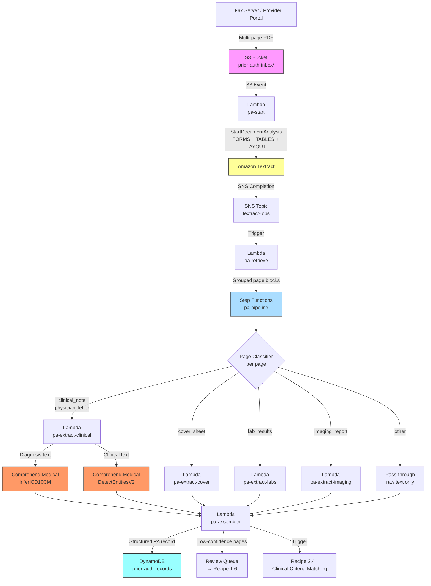

# Recipe 1.4: Prior Authorization Document Processing 🔶

**Complexity:** Moderate · **Phase:** MVP · **Estimated Cost:** ~$0.20–0.60 per submission

---

## The Problem

Here's the thing about prior authorization that makes it uniquely frustrating: everyone involved is working hard, and the outcome is still terrible.

A surgeon's office decides a patient needs a knee replacement. The clinical case is straightforward: the patient has severe osteoarthritis, six months of documented conservative treatment, and an MRI showing bone-on-bone contact. The surgeon knows it. The referring physician knows it. The patient's physical therapist knows it. The payer's own clinical guidelines probably say this case should sail through.

But first, someone in that surgeon's office has to assemble the prior auth submission. They pull the office notes from the last three appointments, the MRI report, the PT records, the lab results showing the inflammatory markers, and the physician's letter explaining why this specific patient needs this specific intervention. They stack it all together, feed it into a fax machine, and send 15 pages to a payer UM department.

On the other end, a clinical reviewer receives that fax. They sort through the pages, hunting for the diagnosis codes on the cover sheet, finding the relevant clinical documentation, checking whether the submitted evidence matches the payer's coverage criteria for total knee arthroplasty. If they find everything, they approve it. If something's missing, they send a denial or a request for additional information. The provider calls the payer. Someone tracks down the missing piece. Another fax goes out. The cycle repeats.

This takes 15 to 45 minutes of a trained clinical reviewer's time for a single case. Payers process millions of these annually. The American Medical Association's prior authorization physician survey consistently finds that more than 90% of physicians report that prior auth causes delays in care, and roughly one in four physicians report that prior auth has led to a serious adverse event for a patient. The delays aren't because anyone is being malicious. They're because the document processing pipeline is manual and slow.

The CMS Interoperability and Prior Authorization Final Rule (CMS-0057-F) is pushing payers hard toward faster, more automated decisions: 72-hour turnaround for standard requests, 24 hours for expedited. State-level prior auth reform is adding more pressure on top of that. The regulatory calendar is not waiting for the technology.

Here's the document processing challenge at the core of all of this. A prior auth submission is not one document type. It's five to seven different document types, faxed together, in no particular order, at whatever quality the originating fax machine produces. Page 1 might be a structured cover sheet you can extract like an insurance card. Page 3 is a clinical office note with free text diagnosis and treatment history. Page 7 is a printed lab results table. Page 11 is a typed letter from the ordering physician describing why alternative treatments were tried and failed.

Each of these requires a completely different extraction approach. Trying to process them all the same way gets you bad data from most of them. The insight that makes this problem tractable: classify each page first, then route it to the right extractor.

That's what this recipe is about.

---

## The Technology

### What Document Classification Actually Is

Document classification, at its most useful, is the problem of answering one question: "what kind of page is this?" The answer determines what you do with the page next.

There are several ways to approach it. The spectrum runs from simple keyword matching on one end to trained ML classifiers on the other, with a useful middle ground that combines structural signals from the document with a modest set of heuristics.

**Keyword heuristics.** The simplest approach: look for words that tend to appear on specific page types. A page containing "HISTORY OF PRESENT ILLNESS" and "ASSESSMENT AND PLAN" is almost certainly a clinical note. A page containing "FINDINGS" and "IMPRESSION" and "TECHNIQUE" is probably an imaging report. A page with "MEMBER ID," "REQUESTING PROVIDER," and "CPT CODE" in close proximity is likely a cover sheet.

This sounds unsophisticated. It works well. Prior auth submissions are not written to confuse classifiers. They follow recognizable templates. A keyword-based classifier built on 20 to 30 carefully chosen signatures can achieve 85 to 90% accuracy on real-world prior auth submissions without training a single model.

The failure modes are predictable: pages with minimal text (a single diagram, a mostly blank page), pages that blend types (a clinical note with an embedded lab results table), and atypical document formats from unusual payer or provider templates. These represent a small fraction of volume, but they exist.

**Layout-aware classification.** Modern document analysis systems don't just return text. They return structural metadata: where text blocks are positioned, whether the page contains form fields and key-value pairs, whether there are tables, whether the text is organized in multi-column layout, and so on. This structural information is genuinely useful for classification.

A cover sheet has form fields (key-value pairs) with demographic and administrative data. A clinical note is primarily flowing prose with few or no form fields. A lab results page has tables with numeric values and reference ranges. An imaging report is prose with section headers. These structural signatures can be combined with keyword signals to improve classification accuracy and reduce ambiguity when keywords are sparse.

**Trained ML classifiers.** For high-volume deployments where accuracy really matters, training a text classification model on labeled prior auth pages consistently pushes accuracy above 95%. The training data requirement is realistic: a few thousand labeled pages from your own document corpus, correctly annotated with page types. The maintenance burden is also modest: re-train periodically as new payer templates appear.

The tradeoff compared to keyword heuristics: a trained classifier requires training infrastructure and labeled data, adds a dependency on a hosted model endpoint, and needs periodic retraining as document patterns drift. For most production deployments, starting with keyword heuristics plus layout signals is the right move. The model upgrade is a natural evolution once you've accumulated enough labeled data from human reviewer corrections.

### The Fan-Out Extraction Pattern

Once you know what each page is, the extraction logic is a routing problem. Each page type gets sent to the extractor designed for it.

This is called fan-out because the orchestration layer takes a list of classified pages and fans them out to parallel extraction processes. A cover sheet goes to the forms extractor. Clinical notes go to the clinical NLP extractor. Lab results go to the table parser. Imaging reports go to the entity extractor.

The fan-out pattern has three meaningful advantages. First, each extractor can be optimized for its specific page type without compromising the others. The clinical NLP extractor can be aggressive about extracting diagnosis entities and ICD-10 codes; the table parser doesn't need to care about clinical entities at all. Second, the extractors can run in parallel, which matters for latency. A 12-page submission with pages spread across four types can fan out to four parallel processes and complete in roughly the time of the slowest individual extractor. Third, each extractor produces confidence scores and flagged fields independently, and those signals aggregate cleanly into a per-page confidence summary.

The fan-out pattern requires an assembler on the other end: a function that receives results from all the extractors and merges them into a single structured prior auth record. The assembler has to handle several interesting problems.

**Deduplication.** The same diagnosis might appear on the cover sheet (as an ICD-10 code), in the clinical note (as a diagnosis entity from Comprehend Medical), and in the physician letter (as a plain text mention). A naive assembler produces three entries for the same condition. A good assembler deduplicates by code value, keeping the highest-confidence instance.

**Confidence aggregation.** The cover sheet might extract with 97% average confidence (it's a clean printed form). The third clinical note might extract with 79% average confidence (it was handwritten and the OCR quality is poor). The overall submission confidence is not the average of all pages. It's weighted by the importance of each page type to the downstream decision. Cover sheet fields drive the administrative decision; low confidence on those is more consequential than low confidence on a supplementary clinical note.

**Partial extraction handling.** Not every submission has every page type. Some don't include imaging reports. Some are just a cover sheet and a physician letter. The assembler needs to handle absent page types gracefully: optional sections remain empty rather than causing failures.

### The Three-Stage Pipeline

The architecture that emerges from all of this has three distinct stages.

**Stage 1: Full-document extraction.** The entire multi-page submission goes through an OCR and document analysis pass. You get back raw text for every page, structural metadata (form fields, tables, layout blocks), and bounding box coordinates. No semantic interpretation yet. Just structure and text.

**Stage 2: Page classification and fan-out extraction.** Pages are grouped by number. Each page gets classified. Classified pages fan out to their respective extractors. Clinical text goes to medical NLP. Form fields go to a forms normalizer. Tables go to a table parser. Each extractor runs independently and returns its results with confidence scores.

**Stage 3: Assembly and storage.** An assembler collects the extractor outputs, deduplicates entities, aggregates confidence, flags low-confidence pages for human review, and writes a single structured prior auth record to the database. That record is what downstream systems consume: the clinical criteria matching engine, the decision orchestration workflow, the reviewer workstation.

The stage boundaries are important. They create natural checkpoints: you can inspect the raw extraction results before classification, the page classifications before extraction, and the per-page extraction results before assembly. When something goes wrong in a complex 15-page submission, you know exactly which stage to look at.

### The Prior Auth Record Schema

The output isn't arbitrary. The downstream systems consuming this record have specific data needs, and the schema should reflect them.

At minimum, a structured prior auth record needs:

- **Administrative data** (from the cover sheet): member identity, requesting provider with NPI, requested service with CPT code, intended date of service, urgency flag
- **Clinical evidence** (from clinical notes, physician letters, imaging reports): the diagnosis list with ICD-10 codes, the relevant clinical findings, the evidence of medical necessity (documented failed conservative treatments, functional limitations, disease severity), any relevant lab values
- **Structured lab results** (from lab results pages): numeric values with units and reference ranges, flagged abnormals
- **Metadata** (from the pipeline itself): page count, per-page classification, per-page extraction confidence, overall needs-review flag

The clinical criteria matching system (Recipe 2.4) compares the clinical evidence against the payer's medical policy for the requested CPT code. The decision orchestration workflow (Recipe 3.1) uses the full record to determine whether to route to auto-approval, reviewer queue, or additional information request. Both of those systems depend on the quality of the extraction here. Garbage in, wrong decisions out.

### Why This Is Harder Than the Earlier Recipes

Recipes 1.1 through 1.3 all process a single document type with a known structure. An insurance card is always one or two pages. A lab requisition is a predictable form. The extraction logic handles variation within a single type.

Prior auth submissions introduce variation across types. Not every submission has every page type. The cover sheet might be on page 1, or pages 1 and 2, or buried after a bunch of clinical notes from a provider who organized their fax differently. The lab results table might use "Result" as the column header or "Value" or just be a printed lab report PDF with a specific reference lab's template.

The page count also matters operationally. A 15-page document through Textract's async API takes 20 to 45 seconds to process. That's fine for batch workflows. For urgent submissions (where the payer has a 24-hour regulatory response window), your extraction pipeline needs to complete quickly enough that a reviewer isn't waiting for the system before they can start work.

And because this is a payer UM workflow, every piece of extracted data feeds a decision that affects patient care. A missed ICD-10 code means the clinical criteria match fails on a case that should have passed. A misclassified clinical note page means the NLP never runs and the supporting evidence doesn't make it into the record. Confidence scoring and human review routing are not optional add-ons. They're core to the correctness of the output.

### The General Architecture Pattern

```
[Submission Arrives] → [Full Document Extraction (OCR + Structure)]
                                        ↓
                              [Group Pages by Number]
                                        ↓
                    ┌─────── [Classify Each Page] ───────┐
                    ↓               ↓             ↓       ↓
             [Forms           [Clinical        [Table  [Entity
            Extractor]        NLP]             Parser] Extractor]
                    ↓               ↓             ↓       ↓
                    └──────── [Assembler] ────────┘
                                        ↓
                       [Structured Prior Auth Record]
                                        ↓
                    ┌─────────────────────────────────────┐
                    ↓                                     ↓
             [Downstream:                       [Low-Confidence Pages:
           Clinical Criteria                      Human Review Queue]
              Matching]
```

The fan-out to extractors is the key differentiator from a simpler pipeline. Everything before it (full-document extraction, page grouping, classification) happens once. Everything after it (extraction, assembly) happens per page type. The architecture scales naturally: adding a new page type (discharge summaries, operative reports) means adding a new extractor branch without changing anything else.

---

## The AWS Implementation

### Why These Services

**Amazon Textract with LAYOUT feature type.** Textract's LAYOUT feature type is the addition that makes page classification practical. In addition to the FORMS and TABLES blocks from earlier recipes, LAYOUT blocks capture the high-level structural organization of each page: whether it's a header, a section title, a figure caption, or a body text paragraph, all with spatial position data. That structural metadata is exactly what the page classifier uses alongside keyword signals to distinguish a clinical note (flowing prose with section headers) from a cover sheet (fields and key-value pairs). The async API from Recipe 1.2 carries over without modification, with LAYOUT added to the FeatureTypes list.

**AWS Step Functions for pipeline orchestration.** The fan-out extraction pattern involves parallel branches running different Lambda functions for different page types, followed by an assembler that merges the results. A single Lambda function can implement all of this, but it gets unwieldy fast. Step Functions is designed exactly for this kind of workflow: parallel branches, error handling per branch, retry logic on transient failures, and a visual execution graph in the console that makes debugging a failed 15-page submission tractable. The Express Workflows mode is appropriate here (duration under 5 minutes, high throughput, lower cost than Standard Workflows).

**Amazon Comprehend Medical for clinical pages.** Same rationale as Recipe 1.3: `DetectEntitiesV2` for clinical entity extraction from free text, `InferICD10CM` for ICD-10 code inference. Clinical notes and physician letters both contain the narrative evidence that drives the medical necessity determination. These are the pages where clinical NLP adds the most value. We apply Comprehend Medical to the clinical pages only, not to the entire document, which keeps costs proportional to the number of clinical pages rather than the total page count.

**Amazon S3, DynamoDB, SNS, and KMS.** Same as Recipes 1.2 and 1.3. Prior auth submissions contain dense PHI: diagnoses, treatment history, procedure requests, member demographics. The same encryption, audit logging, and VPC configuration requirements apply here, amplified by the fact that clinical decision data is involved.

### Architecture Diagram



### Prerequisites

| Requirement | Details |
|-------------|---------|
| **AWS Services** | Everything from Recipes 1.2 and 1.3 (Textract, S3, Lambda, SNS, DynamoDB, KMS, Comprehend Medical), plus AWS Step Functions |
| **IAM Permissions** | All permissions from Recipes 1.2 and 1.3, plus: `states:StartExecution`, `states:DescribeExecution` (for Step Functions). The Lambda execution role for `pa-start` needs `states:StartExecution` on the specific state machine ARN only. |
| **Textract Features** | FORMS + TABLES + LAYOUT in the `FeatureTypes` list. LAYOUT adds approximately $1.50 per 1,000 pages on top of the base async pricing. |
| **BAA** | AWS BAA signed. Prior auth submissions contain dense PHI including clinical narratives, treatment history, and procedure requests. The same BAA that covers Textract and Comprehend Medical under earlier recipes covers this workflow. |
| **Encryption** | S3: SSE-KMS with customer-managed key. DynamoDB: encryption at rest enabled. All API calls over TLS. Text sent to Comprehend Medical is not retained by AWS. Step Functions execution history is encrypted at rest using SSE. |
| **VPC** | Production: all Lambdas in a VPC with VPC endpoints for S3 (gateway), Textract, DynamoDB, SNS, Comprehend Medical, Step Functions, CloudWatch Logs, and KMS. |
| **CloudTrail** | Enabled for all Textract, Comprehend Medical, S3, Step Functions, and DynamoDB API calls. Prior auth submissions are clinical decision records; the complete audit trail is a regulatory requirement. |
| **Sample Data** | CMS publishes the [CMS-1500 form](https://www.cms.gov/medicare/cms-forms/cms-forms/downloads/cms1500.pdf) for cover sheet layout reference. Create synthetic multi-page PDFs combining a cover sheet, 1-2 clinical notes, a lab results page, and a physician letter. HL7 FHIR Examples (see the [HL7 FHIR R4 examples directory](https://hl7.org/fhir/R4/examples.html)) provide realistic clinical document content for building test cases. Never use real PHI in development. |
| **Cost Estimate** | Textract async (FORMS + TABLES + LAYOUT): approximately $4.50 per 1,000 pages, or $0.045 for a 10-page submission. Comprehend Medical (InferICD10CM + DetectEntitiesV2) on extracted clinical text: approximately $0.05-0.15 per clinical page, depending on text length. A 10-page submission with 4 clinical pages runs approximately $0.25-0.65 total. Step Functions Express Workflows: $1.00 per 1,000,000 state transitions, negligible at this scale. At 500,000 submissions per year with an average of 8 pages and 3 clinical pages each: roughly $200K-400K per year in service costs. That math looks different when you consider that replacing even one clinical reviewer FTE (fully loaded: $150K-200K/year) pays for the infrastructure at a fraction of the volume. |

### Ingredients

| AWS Service | Role |
|------------|------|
| **Amazon Textract** | Full multi-page document analysis: FORMS, TABLES, and LAYOUT blocks for all pages |
| **Amazon Comprehend Medical (InferICD10CM)** | ICD-10 code inference from extracted clinical and physician letter text |
| **Amazon Comprehend Medical (DetectEntitiesV2)** | Clinical entity extraction from narrative pages: conditions, medications, procedures |
| **AWS Step Functions (Express Workflows)** | Orchestrates the classify → fan-out → assemble pipeline with parallel branches and error handling |
| **Amazon S3** | Stores incoming prior auth PDFs and extraction artifacts; encrypted at rest with KMS |
| **AWS Lambda** | Individual extraction functions: pa-start, pa-retrieve, pa-extract-cover, pa-extract-clinical, pa-extract-labs, pa-extract-imaging, pa-assembler |
| **Amazon SNS** | Receives Textract async job completion notification; triggers pa-retrieve Lambda |
| **Amazon DynamoDB** | Stores structured prior auth records; PHI encrypted at rest |
| **AWS KMS** | Customer-managed encryption keys for S3, DynamoDB, and Step Functions execution history |
| **Amazon CloudWatch** | Logs, metrics, alarms for pipeline failures, page classification accuracy, and confidence distributions |

### Code

> **Reference implementations:** The following AWS sample repos demonstrate the patterns used in this recipe:
>
> - [`aws-ai-intelligent-document-processing`](https://github.com/aws-samples/aws-ai-intelligent-document-processing): Comprehensive IDP solutions with multi-stage extraction pipelines, document classification, A2I human review integration, and generative AI for complex fields
> - [`amazon-textract-and-comprehend-medical-document-processing`](https://github.com/aws-samples/amazon-textract-and-comprehend-medical-document-processing): Workshop-style repo for multi-stage medical document processing pipelines; covers PDF extraction, entity recognition, and Lambda orchestration
> - [`amazon-textract-and-amazon-comprehend-medical-claims-example`](https://github.com/aws-samples/amazon-textract-and-amazon-comprehend-medical-claims-example): Healthcare-specific: extracting and validating medical claims data with both services, with CloudFormation deployment templates
> - [`document-processing-pipeline-for-regulated-industries`](https://github.com/aws-samples/document-processing-pipeline-for-regulated-industries): Boilerplate solution for processing image and PDF documents in regulated industries, including lineage and pipeline metadata services
> - [`guidance-for-low-code-intelligent-document-processing-on-aws`](https://github.com/aws-solutions-library-samples/guidance-for-low-code-intelligent-document-processing-on-aws): Guidance implementation for scalable IDP architecture covering ingestion, extraction, enrichment, and storage

#### Walkthrough

**Steps 1 and 2: Async Textract extraction and result retrieval.** These steps are identical to Recipe 1.2, with one addition: include LAYOUT in the `FeatureTypes` list. The `pa-start` Lambda submits the job and exits. The `pa-retrieve` Lambda fires on the SNS completion notification, retrieves all result pages via paginated `GetDocumentAnalysis`, and builds a full block list and a block index (block ID to block). See Recipe 1.2 for the complete pseudocode. We won't repeat it here.

The one difference from Recipe 1.2: the `pa-retrieve` Lambda does not do the extraction itself. It writes the raw Textract response to S3 (as a JSON file keyed to the job ID), then starts the Step Functions state machine, passing the S3 location of the Textract output. This keeps the `pa-retrieve` Lambda simple and lets Step Functions handle all the conditional logic.

```
FUNCTION retrieve_and_handoff(textract_job_id, document_key, state_machine_arn):
    // Retrieve all Textract result pages (same paginated call as Recipe 1.2)
    all_blocks = retrieve_all_textract_blocks(textract_job_id)

    // Write the raw block list to S3 for the pipeline steps to consume
    textract_output_key = "textract-outputs/" + textract_job_id + "/blocks.json"
    write all_blocks to S3 at textract_output_key

    // Start the Step Functions state machine.
    // Pass the S3 key for the Textract output, not the raw blocks themselves.
    // Step Functions input payloads have a size limit; S3 references bypass it.
    start Step Functions execution at state_machine_arn with input:
        document_key         = document_key           // the original PA submission PDF
        textract_output_key  = textract_output_key    // where the blocks live
        textract_job_id      = textract_job_id        // for audit trail
```

**Step 3: Group Textract blocks by page.** The Textract result is a flat list of blocks for the entire document. Each block has a `Page` attribute indicating which page it belongs to. This step groups those blocks so that each page can be classified and extracted independently.

This step also pre-computes the full text for each page (by concatenating the LINE blocks in page order) and notes which structural features are present: whether the page has form fields (KEY_VALUE_SET blocks), tables (TABLE blocks), and layout elements (LAYOUT blocks). These structural signals feed the classifier in the next step.

```
FUNCTION group_blocks_by_page(all_blocks):
    // Initialize a structure to hold data for each page.
    pages = empty map  // page_number -> { blocks, text, has_tables, has_forms, layout_blocks }

    FOR each block in all_blocks:
        page_num = block.Page  // Textract page numbers are 1-indexed

        // Initialize this page entry on first encounter
        IF page_num not in pages:
            pages[page_num] = {
                blocks:        empty list,   // all blocks for this page
                text:          empty string, // full text (assembled from LINE blocks)
                has_tables:    false,        // true if any TABLE block is on this page
                has_forms:     false,        // true if any KEY_VALUE_SET block is on this page
                layout_blocks: empty list    // LAYOUT blocks for structural classification
            }

        // Add this block to the page
        pages[page_num].blocks.append(block)

        // Assemble page text from LINE blocks (these are the detected text lines)
        IF block.BlockType == "LINE":
            pages[page_num].text += block.Text + "\n"

        // Note structural features (used by the classifier)
        IF block.BlockType == "TABLE":
            pages[page_num].has_tables = true

        IF block.BlockType == "KEY_VALUE_SET":
            pages[page_num].has_forms = true

        IF block.BlockType starts with "LAYOUT_":
            // LAYOUT blocks include: LAYOUT_TITLE, LAYOUT_HEADER, LAYOUT_TEXT,
            // LAYOUT_TABLE, LAYOUT_FIGURE, LAYOUT_KEY_VALUE, LAYOUT_PAGE_NUMBER
            pages[page_num].layout_blocks.append(block)

    RETURN pages
```

**Step 4: Classify each page.** This is the step that makes the whole pipeline work. For each page, we combine keyword signals (words and phrases that strongly indicate a specific page type) with structural signals (presence of forms, tables, LAYOUT blocks) to determine the page type. Higher scores on both dimensions increase confidence in the classification.

The keyword signatures below were developed from real prior auth submissions across multiple payer and provider templates. The `min_matches` threshold is deliberately low (2 to 3 keywords) because faxed pages often have sparse text due to scanning quality. The structural bonus points reward matches where the document structure also aligns with the expected type.

```
// Keyword and structure signatures for each expected page type.
// Each entry specifies the keywords to look for, minimum keyword matches needed,
// and structural bonuses when the page has matching Textract features.
PAGE_SIGNATURES = {
    "cover_sheet": {
        keywords:     ["prior authorization", "authorization request", "member name",
                       "member id", "subscriber", "requesting provider", "npi",
                       "requested service", "date of service", "procedure code", "cpt"],
        min_matches:  3,
        form_bonus:   3    // cover sheets are form documents: bonus for having KEY_VALUE_SET blocks
    },
    "clinical_note": {
        keywords:     ["history of present illness", "assessment", "plan", "chief complaint",
                       "physical examination", "review of systems", "subjective", "objective",
                       "impression", "hpi", "social history", "family history", "medications"],
        min_matches:  2,
        form_bonus:   0    // clinical notes are prose, not forms
    },
    "lab_results": {
        keywords:     ["reference range", "result", "specimen", "collected", "reported",
                       "abnormal", "critical", "units", "flag", "reference interval",
                       "out of range"],
        min_matches:  3,
        table_bonus:  3    // lab results are almost always presented as tables
    },
    "imaging_report": {
        keywords:     ["findings", "impression", "technique", "comparison", "indication",
                       "radiology", "mri", "ct", "x-ray", "ultrasound", "nuclear",
                       "no acute", "unremarkable"],
        min_matches:  2,
        form_bonus:   0
    },
    "physician_letter": {
        keywords:     ["dear", "to whom it may concern", "medical necessity", "i am writing",
                       "requesting approval", "patient has", "sincerely", "respectfully",
                       "on behalf of", "this letter"],
        min_matches:  2,
        form_bonus:   0
    }
}

FUNCTION classify_page(page_text, has_tables, has_forms):
    text_lower = lowercase(page_text)
    scores     = empty map

    FOR each page_type, signature in PAGE_SIGNATURES:
        // Count keyword matches for this page type
        keyword_hits = count of keywords in signature that appear in text_lower

        // Only proceed if we hit the minimum match threshold
        IF keyword_hits >= signature.min_matches:
            score = keyword_hits

            // Apply structural bonuses
            IF has_tables AND signature has table_bonus:
                score += signature.table_bonus

            IF has_forms AND signature has form_bonus:
                score += signature.form_bonus

            scores[page_type] = score

    // Return the highest-scoring type, or "other" if nothing matched
    IF scores is not empty:
        RETURN page_type with highest score in scores
    RETURN "other"

// Classify all pages and return a map of page number -> page type
FUNCTION classify_all_pages(pages):
    classifications = empty map

    FOR each page_num, page_data in pages:
        page_type = classify_page(
            page_data.text,
            page_data.has_tables,
            page_data.has_forms
        )
        classifications[page_num] = page_type
        // Log the classification and score for audit and model improvement
        log: "Page " + page_num + " classified as " + page_type

    RETURN classifications
```

**Step 5: Fan out to specialized extractors.** Each classified page type goes to a different extraction function. The key insight here: we don't process all pages with all extractors. We route each page to the one extractor suited for it. This is what Step Functions parallel branches implement at the workflow level.

Three of the four main page types build directly on patterns from earlier recipes. We'll summarize each and point back to the relevant recipe for the full implementation. The routing logic below is what Step Functions uses to decide which Lambda to invoke for each page.

```
// The routing table: page type -> which extraction function to call
EXTRACTION_ROUTER = {
    "cover_sheet":     extract_cover_sheet,    // forms extraction (builds on Recipe 1.1 FIELD_MAP pattern)
    "clinical_note":   extract_clinical_page,  // Comprehend Medical (builds on Recipe 1.3 NLP pipeline)
    "physician_letter": extract_clinical_page, // same extraction logic as clinical notes
    "lab_results":     extract_lab_page,       // table parsing (builds on Recipe 1.2 table extractor)
    "imaging_report":  extract_imaging_page,   // entity extraction from prose
    "other":           extract_other_page      // raw text only; no semantic extraction attempted
}

FUNCTION route_and_extract(page_num, page_type, page_data, block_map):
    extractor = EXTRACTION_ROUTER[page_type]
    result    = extractor(page_data, block_map)

    // Every extraction result carries: page number, type, confidence, and extracted data
    RETURN {
        page_num:   page_num,
        page_type:  page_type,
        confidence: result.confidence,    // average Textract confidence for this page's fields
        data:       result.data,          // the extracted structured data
        flagged:    result.flagged        // any fields below confidence threshold
    }
```

The **cover sheet extractor** uses the key-value pair parsing and field normalization pattern from Recipe 1.1. The FIELD_MAP maps the payer-specific label variants to canonical field names.

```
// Cover sheet field map: canonical name -> list of known label variants.
// This is the same pattern as Recipe 1.1, extended for prior auth cover sheets.
PA_COVER_FIELD_MAP = {
    "member_name":          ["member name", "patient name", "subscriber name", "insured name"],
    "member_id":            ["member id", "subscriber id", "member #", "id number"],
    "member_dob":           ["date of birth", "dob", "member dob", "patient dob"],
    "requesting_provider":  ["requesting provider", "ordering physician", "rendering provider",
                             "treating physician", "provider name"],
    "provider_npi":         ["npi", "provider npi", "npi number", "national provider"],
    "requesting_facility":  ["facility", "practice name", "clinic name", "hospital"],
    "requested_cpt":        ["cpt code", "procedure code", "procedure", "service code",
                             "requested procedure"],
    "diagnosis_code":       ["diagnosis code", "icd-10", "icd code", "dx", "icd-10-cm"],
    "date_of_service":      ["date of service", "dos", "requested date", "service date"],
    "urgency":              ["urgency", "urgent", "priority", "expedited", "stat"]
}

FUNCTION extract_cover_sheet(page_data, block_map):
    // Parse key-value pairs from the cover sheet (same as Recipe 1.1 Step 2)
    raw_kv = parse_key_value_pairs(page_data.blocks, block_map)

    // Normalize field names using the PA cover sheet field map (same as Recipe 1.1 Step 3)
    normalized = normalize_fields(raw_kv, PA_COVER_FIELD_MAP)

    // Apply confidence gate (same as Recipe 1.1 Step 4)
    clean_fields, flagged_fields = flag_low_confidence(normalized, threshold=85.0)

    // Calculate average confidence for this page
    avg_confidence = average of confidence scores for all fields in normalized

    RETURN {
        confidence: avg_confidence,
        data:       clean_fields,
        flagged:    flagged_fields
    }
    // See Recipe 1.1 for the full implementations of parse_key_value_pairs,
    // normalize_fields, and flag_low_confidence.
```

The **clinical page extractor** runs both Comprehend Medical APIs on the page text. It first identifies the portions of the page most relevant to diagnosis and clinical context (the assessment section, the plan, the impression), then calls `InferICD10CM` on the diagnosis-heavy text and `DetectEntitiesV2` on the broader clinical text. Running Comprehend Medical on targeted extracts rather than the full page text keeps costs down and keeps the API calls within character limits.

```
// Section header keywords that signal diagnosis-rich text
DIAGNOSIS_SECTION_HEADERS = [
    "assessment", "assessment and plan", "diagnosis", "impression",
    "diagnoses", "dx", "problems", "active problems"
]

FUNCTION extract_clinical_page(page_data, block_map):
    page_text      = page_data.text
    diagnosis_text = extract_section_text(page_text, DIAGNOSIS_SECTION_HEADERS)

    // If no specific diagnosis section was found, fall back to the full page text
    // (truncated to stay within Comprehend Medical's per-request limits)
    IF diagnosis_text is empty or too short:
        diagnosis_text = first 5000 characters of page_text

    // Infer ICD-10 codes from the diagnosis-rich text (same as Recipe 1.3 Step 5)
    icd10_accepted, icd10_flagged = infer_icd10_codes(diagnosis_text)
    // See Recipe 1.3 for the full implementation of infer_icd10_codes.

    // Extract clinical entities from the full clinical text (same as Recipe 1.3 Step 6)
    // Limit to 10,000 characters per request; split and merge for longer pages.
    clinical_text  = first 10000 characters of page_text
    clinical_entities = detect_clinical_entities(clinical_text)
    // See Recipe 1.3 for the full implementation of detect_clinical_entities.

    // Confidence for this page: minimum of Textract OCR confidence and
    // average Comprehend Medical entity confidence
    // (OCR quality directly affects NLP accuracy: bad OCR → bad NLP input)
    textract_confidence = average LINE block confidence for this page
    nlp_confidence      = average confidence of icd10_accepted entities (or 1.0 if none)
    page_confidence     = minimum of (textract_confidence, nlp_confidence * 100)

    RETURN {
        confidence: page_confidence,
        data: {
            icd10_accepted:    icd10_accepted,    // codes above confidence threshold
            clinical_entities: clinical_entities  // entity map from DetectEntitiesV2
        },
        flagged: {
            icd10_flagged:     icd10_flagged      // low-confidence code inferences
        }
    }


FUNCTION extract_section_text(page_text, section_headers):
    // Find the first matching section header and extract the text that follows it,
    // up to the next section header or end of the page.
    lines = split page_text by newline
    in_target_section = false
    section_text      = empty string

    FOR each line in lines:
        line_lower = lowercase(trim(line))

        // Check if this line is a target section header
        IF any header in section_headers is contained in or matches line_lower:
            in_target_section = true
            CONTINUE   // skip the header line itself; we want the content after it

        // Stop at a new section header (common section starters)
        IF in_target_section AND line_lower starts a new section:
            BREAK      // a production implementation checks against a full section header list

        // Accumulate text in the target section
        IF in_target_section:
            section_text += line + "\n"

    RETURN trim(section_text)
```

The **lab results extractor** parses Textract TABLE blocks from the page into rows and attempts to identify standard lab result columns. This builds on the table parsing pattern from Recipe 1.2.

```
// Standard lab result column names and their aliases.
// Real lab report templates vary widely; this covers the most common column labels.
LAB_COLUMN_MAP = {
    "test_name":       ["test", "test name", "analyte", "component", "description"],
    "result":          ["result", "value", "result value", "your result"],
    "units":           ["units", "unit"],
    "reference_range": ["reference range", "normal range", "reference interval",
                        "normal values", "expected range"],
    "flag":            ["flag", "abnormal flag", "indicator", "h/l"]
}

FUNCTION extract_lab_page(page_data, block_map):
    // Parse TABLE blocks from this page into row-by-row data.
    // The table parsing logic is the same as Recipe 1.2.
    tables = parse_tables_from_blocks(page_data.blocks, block_map)

    lab_values = empty list

    FOR each table in tables:
        IF table has fewer than 2 rows:
            CONTINUE  // a table with just a header and no data rows isn't a lab results table

        // Normalize the header row against known column name variants
        headers     = table[0]   // first row is assumed to be the column headers
        col_mapping = normalize_lab_columns(headers, LAB_COLUMN_MAP)

        // Process each data row
        FOR each row in table[1:]:   // skip the header row
            lab_entry = empty map

            FOR each col_index, canonical_name in col_mapping:
                IF col_index < length of row:
                    lab_entry[canonical_name] = trim(row[col_index])

            // Only keep rows that have at least a test name and a result
            IF "test_name" in lab_entry AND "result" in lab_entry:
                lab_values.append(lab_entry)

    RETURN {
        confidence: average Textract confidence for TABLE cells on this page,
        data:       { lab_values: lab_values },
        flagged:    []  // lab tables either parse or they don't; no confidence gating here
    }
```

The **imaging report extractor** runs `DetectEntitiesV2` on the full page text to pull out the clinical findings and impressions. Imaging reports are narrative prose, not structured forms, so entity extraction is the right approach. We also look for specific sections by name.

```
// Section headers to extract from imaging reports
IMAGING_SECTIONS = {
    "findings":   ["findings", "report findings"],
    "impression": ["impression", "conclusions", "summary"],
    "indication": ["indication", "clinical history", "reason for exam"]
}

FUNCTION extract_imaging_page(page_data, block_map):
    page_text = page_data.text

    // Extract specific sections from the imaging report
    sections = empty map
    FOR each section_name, headers in IMAGING_SECTIONS:
        sections[section_name] = extract_section_text(page_text, headers)

    // Run entity extraction on the findings and impression sections.
    // These are where the clinically actionable findings live.
    relevant_text = join non-empty sections with "\n\n"
    IF relevant_text is empty:
        relevant_text = first 5000 characters of page_text

    clinical_entities = detect_clinical_entities(relevant_text)
    // Same function as used in the clinical page extractor.
    // See Recipe 1.3 for implementation details.

    textract_confidence = average LINE block confidence for this page

    RETURN {
        confidence: textract_confidence,
        data: {
            sections:          sections,
            clinical_entities: clinical_entities
        },
        flagged: []
    }
```

**Step 6: Assemble the structured prior auth record.** The assembler receives the extraction results from all pages and merges them into a single coherent record. This is where deduplication, confidence aggregation, and the overall review flag are determined.

The deduplication step deserves attention. The same ICD-10 code might be extracted from three different pages: inferred from a clinical note, inferred from a physician letter, and read directly from the cover sheet. We want one canonical entry for each code in the final record, keyed by code value, keeping the highest-confidence instance. The same applies to clinical entities.

```
FUNCTION assemble_prior_auth_record(document_key, page_count, page_extractions):
    // Initialize the record structure
    record = {
        document_key:         document_key,
        extracted_at:         current UTC timestamp (ISO 8601),
        page_count:           page_count,
        needs_review:         false,  // set to true below if any page has flags or low confidence
        page_classifications: empty map,   // page_num -> page_type

        // Administrative data from the cover sheet
        demographics: {
            member_name:         null,
            member_id:           null,
            member_dob:          null,
        },
        requested_service: {
            cpt_code:            null,
            procedure:           null,
            date_of_service:     null,
            urgency:             "routine"   // default to routine if not specified
        },
        requesting_provider: {
            name:                null,
            npi:                 null,
            facility:            null
        },

        // Clinical evidence (aggregated across all clinical pages)
        clinical_evidence: {
            icd10_codes:         empty list,  // deduplicated; highest confidence per code
            conditions:          empty list,
            medications:         empty list,
            procedures:          empty list,
            lab_values:          empty list,
            imaging_sections:    empty map    // section name -> text from imaging reports
        },

        // Confidence and review metadata
        page_confidence:      empty map,  // page_num -> confidence score
        flagged_pages:        empty list, // pages below confidence threshold
        flagged_fields:       empty map,  // page_num -> list of flagged fields
    }

    // Deduplication trackers
    seen_icd10_codes  = empty map   // code -> confidence (keep highest)
    seen_conditions   = empty set   // entity text (normalized)
    seen_medications  = empty set
    seen_procedures   = empty set

    // Process each page's extraction result
    FOR each page_num, extraction in page_extractions:
        page_type  = extraction.page_type
        confidence = extraction.confidence

        // Track classification and confidence
        record.page_classifications[page_num] = page_type
        record.page_confidence[page_num]      = round(confidence, 1)

        // Flag low-confidence pages for human review
        // Using a lower threshold (75%) than field-level gating because some page types
        // (like handwritten physician letters) legitimately produce lower confidence
        IF confidence < 75.0:
            record.flagged_pages.append(page_num)
            record.needs_review = true

        // Track flagged fields within the page
        IF extraction.flagged is not empty:
            record.flagged_fields[page_num] = extraction.flagged
            record.needs_review = true

        // Merge data by page type
        IF page_type == "cover_sheet":
            // Cover sheet fields populate the administrative sections of the record.
            // First cover sheet wins if multiple pages classified as cover sheets.
            data = extraction.data
            IF record.demographics.member_name is null:
                record.demographics.member_name = data.get("member_name")
                record.demographics.member_id   = data.get("member_id")
                record.demographics.member_dob  = data.get("member_dob")
            IF record.requested_service.cpt_code is null:
                record.requested_service.cpt_code  = data.get("requested_cpt")
                record.requested_service.procedure = data.get("requested_cpt")  // may also be in text
                record.requested_service.date_of_service = data.get("date_of_service")
                IF data.get("urgency") contains "urgent" or "stat":
                    record.requested_service.urgency = "urgent"
            IF record.requesting_provider.npi is null:
                record.requesting_provider.name     = data.get("requesting_provider")
                record.requesting_provider.npi      = data.get("provider_npi")
                record.requesting_provider.facility = data.get("requesting_facility")

        ELSE IF page_type in ("clinical_note", "physician_letter", "imaging_report"):
            // Clinical pages contribute to the clinical evidence section.
            // Deduplicate ICD-10 codes and entities across pages.
            data = extraction.data

            // Merge ICD-10 codes: keep highest confidence per code
            FOR each code_entry in data.icd10_accepted:
                code = code_entry.icd10_code
                IF code not in seen_icd10_codes OR
                   code_entry.confidence > seen_icd10_codes[code].confidence:
                    seen_icd10_codes[code] = code_entry

            // Merge clinical entities: deduplicate by normalized text
            ce = data.clinical_entities
            FOR each entity in ce.get("MEDICAL_CONDITION", []):
                normalized = lowercase(trim(entity.text))
                IF normalized not in seen_conditions:
                    seen_conditions.add(normalized)
                    record.clinical_evidence.conditions.append(entity)

            FOR each entity in ce.get("MEDICATION", []):
                normalized = lowercase(trim(entity.text))
                IF normalized not in seen_medications:
                    seen_medications.add(normalized)
                    record.clinical_evidence.medications.append(entity)

            FOR each entity in ce.get("TEST_TREATMENT_PROCEDURE", []):
                normalized = lowercase(trim(entity.text))
                IF normalized not in seen_procedures:
                    seen_procedures.add(normalized)
                    record.clinical_evidence.procedures.append(entity)

            // Imaging reports also contribute section text
            IF page_type == "imaging_report" AND data.sections is not empty:
                FOR each section_name, section_text in data.sections:
                    IF section_name not in record.clinical_evidence.imaging_sections:
                        record.clinical_evidence.imaging_sections[section_name] = section_text

        ELSE IF page_type == "lab_results":
            // Lab values extend the list; no deduplication (different labs may be run on different dates)
            record.clinical_evidence.lab_values.extend(extraction.data.lab_values)

    // Finalize the ICD-10 code list from the deduplicated map
    record.clinical_evidence.icd10_codes = list of values in seen_icd10_codes,
                                           sorted by confidence descending

    // Flag if essential data is missing: no member ID or no CPT code means the record
    // cannot drive a downstream decision without human intervention
    IF record.demographics.member_id is null OR record.requested_service.cpt_code is null:
        record.needs_review = true

    RETURN record


FUNCTION store_prior_auth_record(record):
    write record to database table "prior-auth-records" with:
        primary key = record.document_key    // document path is unique per submission
        record      = record

    // If this record doesn't need human review, trigger the clinical criteria matching step.
    // Recipe 2.4 consumes this record structure directly.
    IF NOT record.needs_review:
        publish to event bus:
            event_type    = "prior_auth_extracted"
            document_key  = record.document_key
```

> **Curious how this looks in Python?** The pseudocode above covers the concepts. If you'd like to see sample Python code that demonstrates these patterns using boto3, check out the [Python Example](chapter01.04-python-example). It walks through each step with inline comments and notes on what you'd need to change for a real deployment.

### Expected Results

**Sample output for a 12-page knee replacement prior auth submission:**

```json
{
  "document_key": "prior-auth-inbox/2026/03/01/fax-00847.pdf",
  "extracted_at": "2026-03-01T15:22:08Z",
  "page_count": 12,
  "needs_review": false,
  "page_classifications": {
    "1": "cover_sheet",
    "2": "cover_sheet",
    "3": "clinical_note",
    "4": "clinical_note",
    "5": "clinical_note",
    "6": "lab_results",
    "7": "lab_results",
    "8": "imaging_report",
    "9": "imaging_report",
    "10": "physician_letter",
    "11": "other",
    "12": "other"
  },
  "demographics": {
    "member_name": "Robert Thompson",
    "member_id": "UHC4829100",
    "member_dob": "03/14/1962"
  },
  "requested_service": {
    "cpt_code": "27447",
    "procedure": "Total Knee Arthroplasty",
    "date_of_service": "04/15/2026",
    "urgency": "routine"
  },
  "requesting_provider": {
    "name": "Dr. Amanda Liu",
    "npi": "1982374650",
    "facility": "Riverside Orthopedic Surgery Center"
  },
  "clinical_evidence": {
    "icd10_codes": [
      { "text": "severe osteoarthritis", "icd10_code": "M17.11", "description": "Primary osteoarthritis, right knee", "confidence": 0.943 },
      { "text": "chronic pain", "icd10_code": "G89.29", "description": "Other chronic pain", "confidence": 0.872 }
    ],
    "conditions": [
      { "text": "severe osteoarthritis", "type": "DX_NAME", "confidence": 0.971, "traits": [] },
      { "text": "chronic knee pain", "type": "DX_NAME", "confidence": 0.954, "traits": [] },
      { "text": "failed conservative treatment", "type": "DX_NAME", "confidence": 0.883, "traits": [] }
    ],
    "medications": [
      { "text": "naproxen 500mg", "type": "GENERIC_NAME", "confidence": 0.961, "traits": [] },
      { "text": "cortisone injection", "type": "TREATMENT_NAME", "confidence": 0.921, "traits": [] }
    ],
    "procedures": [
      { "text": "physical therapy", "type": "PROCEDURE_NAME", "confidence": 0.944, "traits": [] },
      { "text": "MRI right knee", "type": "TEST_NAME", "confidence": 0.972, "traits": [] }
    ],
    "lab_values": [
      { "test_name": "ESR", "result": "28", "units": "mm/hr", "reference_range": "0-20", "flag": "H" },
      { "test_name": "CRP", "result": "1.8", "units": "mg/dL", "reference_range": "0-0.5", "flag": "H" }
    ],
    "imaging_sections": {
      "findings": "Severe tricompartmental osteoarthritis with near-complete loss of joint space. Bone-on-bone contact medial compartment.",
      "impression": "Severe osteoarthritis right knee consistent with clinical indication for total knee arthroplasty."
    }
  },
  "page_confidence": {
    "1": 96.2, "2": 94.8, "3": 91.4, "4": 88.7, "5": 90.1,
    "6": 97.3, "7": 96.9, "8": 93.2, "9": 92.7, "10": 87.4,
    "11": 76.8, "12": 74.2
  },
  "flagged_pages": [],
  "flagged_fields": {}
}
```

**Performance benchmarks:**

| Metric | Typical Value |
|--------|---------------|
| End-to-end latency (10-page submission) | 25–50 seconds (dominated by async Textract job) |
| End-to-end latency (20-page submission) | 45–90 seconds |
| Page classification accuracy (keyword heuristics) | 85–92% |
| Page classification accuracy (trained ML classifier) | 93–97% |
| Cover sheet field extraction accuracy | 92–97% |
| Clinical entity extraction accuracy | 85–93% (depends on OCR quality of clinical pages) |
| ICD-10 inference accuracy (typed clinical notes) | 85–93% |
| ICD-10 inference accuracy (handwritten pages) | 60–78% (OCR errors compound NLP errors) |
| Lab results table extraction accuracy | 94–99% (typed; printed lab reports) |
| Cost per 10-page submission | ~$0.25–0.45 |

**Where it struggles:** Pages that blend types (a clinical note with a lab results table embedded in it gets classified as one or the other, not both). Multi-generation faxes where each forward cycle degrades quality. Cover sheets from smaller specialty payers with non-standard layouts (the FIELD_MAP needs expansion). Clinical notes written in dense abbreviations that OCR reads with lower confidence, which then degrades the Comprehend Medical input. And pages where the diagnosis is written entirely in ICD-10 code format ("M17.11, G89.29") rather than text: `InferICD10CM` expects natural language, not code strings.

---

## Why This Isn't Production-Ready

The pseudocode and architecture above demonstrate the three-stage prior auth extraction pipeline. Deploying this in a real payer UM environment requires addressing gaps that are intentionally outside the scope of a cookbook recipe. These are the ones that will catch you.

**Step Functions payload size limits.** Step Functions has a 256 KB limit on state input and output payloads. Textract blocks for a 20-page document can easily exceed this. The pseudocode above routes around this by writing the Textract output to S3 and passing the S3 key instead of the raw blocks through Step Functions. All subsequent steps read from S3 rather than receiving data in the Step Functions input. This is the standard pattern for large-document pipelines, but it adds an S3 read to every step and requires you to clean up intermediate objects after the pipeline completes.

**Concurrent Textract job limits.** Textract async jobs run against account-level concurrency limits (default: 2 concurrent async jobs per account in most regions, adjustable via service quota increase). At submission volume, a burst of incoming faxes will queue behind each other if you hit the concurrency limit. The incoming submission Lambda should check the queue depth via a DynamoDB counter before submitting a new Textract job, implementing backpressure rather than letting the submission fail silently.

**Page classification is a heuristic, not a guarantee.** The keyword classifier produces a "most likely" page type, not a certain one. It will misclassify pages. Build a mechanism to record the page classification alongside each extraction result, and use the human review corrections to track classification accuracy over time. When a reviewer corrects a misclassified page, that correction should feed back into your labeled dataset. The path from keyword heuristics to a trained classifier runs through this feedback loop.

**Cover sheets that span two pages.** Many payer cover sheet templates are two pages. The assembler's "first cover sheet wins" logic leaves the second page's data on the floor. A production implementation checks whether a second cover_sheet-classified page contains fields that were null after the first page and merges the non-null values.

**ICD-10 codes written as codes, not text.** Comprehend Medical's `InferICD10CM` infers codes from natural language. When the clinical note has "Dx: M17.11" rather than "Dx: osteoarthritis, right knee," the inference step returns nothing useful. A production implementation detects the code-on-page case by matching against an ICD-10 code format regex (one letter + 2 digits + optional decimal + 2-4 more characters), extracts those directly, and skips the NLP inference step for those entries.

**Dead Letter Queues on all Lambda functions.** Every Lambda in this pipeline receives asynchronous invocations. Configure an SQS DLQ on each, with CloudWatch alarms on queue depth. A prior auth submission that disappears into a failed Lambda invocation is a patient care delay waiting to happen.

**Step Functions error handling per branch.** Express Workflows catch failures at the state machine level by default. Configure per-state error handling so that a failure in the lab results extractor doesn't abort the clinical note extractor. The assembler should handle partial extraction results gracefully: a submission where the lab results extraction failed still produces a usable record that can proceed to human review with the missing section flagged.

**Idempotency on the assembler.** S3 event notifications are at-least-once. The SNS from Textract is also at-least-once. The `pa-retrieve` Lambda can be invoked multiple times for the same submission. Use a conditional DynamoDB write on the `document_key` partition key to prevent duplicate records. If a record already exists, log and exit rather than overwriting.

---

## The Honest Take

Prior auth document processing is the recipe in this chapter that's closest to the real operational pain healthcare faces. It's also the one where the distance between "working demo" and "production deployment" is the largest.

The page classifier is the part that surprises people. You'd expect a multi-label ML problem to require thousands of training examples and careful model selection. In practice, a well-tuned keyword classifier with 20 to 30 signatures per page type beats naive ML classifiers trained on small datasets. The reason: prior auth submissions are not arbitrary documents. They have recognizable structures and predictable vocabulary. Healthcare has been faxing the same document types for 30 years. The keywords are stable.

That said, the 8 to 15% misclassification rate from keyword heuristics is real, and it compresses in a production system with 50,000 submissions per month. At 8% misclassification, 4,000 pages per month get routed to the wrong extractor. Most of those fail gracefully: a clinical note page routed to the lab results extractor finds no tables and returns an empty result. But some produce spurious data. The assembler's confidence thresholds and the human review queue catch most of them. What they don't catch is a subtle misclassification that produces confident-but-wrong output.

The ICD-10 inference step is where I'd invest the most calibration effort before going to production. The `InferICD10CM` API returns a top-ranked code, and that code is often the least specific valid one for the input text. E11.9 ("without complications") when the note clearly documents E11.65 ("with hyperglycemia") happens regularly. Whether that matters depends entirely on your payer's medical policies. Check yours before deciding whether to accept top-ranked codes or route everything through coder review.

The multi-page confidence aggregation is genuinely hard to get right. Average confidence across 12 pages hides a lot of variance. A submission where the cover sheet extracted at 97% and three clinical pages extracted at 72% should probably trigger review, even if the average is above threshold. A weighted confidence scheme that penalizes low scores on high-importance pages is more reliable than a flat average. The recipe shows the simple version; the production version needs those weights.

The thing that's not in the recipe at all: what happens to the output. This pipeline produces a structured prior auth record. The value of that record is entirely determined by what the downstream systems do with it. A clinical criteria matching engine that can auto-approve straightforward cases (Recipe 2.4) is where the ROI materializes. Without that downstream step, the pipeline is impressive data plumbing with no payoff.

---

## Variations and Extensions

**Step Functions orchestration with parallel page processing.** The pseudocode above processes pages sequentially in a loop. A Step Functions Map state runs the classify-and-extract step in parallel across all pages. For a 12-page submission with four page types, the extraction time collapses to approximately the slowest single extractor (the clinical NLP step, typically 3 to 5 seconds) rather than the sum of all extractors. For submissions where time-to-review matters, this is a meaningful improvement.

**Trained page classifier with feedback loop.** Replace the keyword heuristics in Step 4 with a text classification model trained on labeled prior auth pages from your own document corpus. The training data comes from human reviewer corrections: when a reviewer corrects a misclassified page, that correction adds a labeled example to the training set. A fine-tuned BERT-based classifier trained on a few thousand labeled pages consistently achieves 93 to 97% accuracy on in-distribution documents. The keyword classifier stays as a fallback when the model endpoint is unavailable.

**Provider portal pre-screening API.** Surface the extraction results back to the requesting provider before the submission reaches the UM queue. The API response tells the provider what the system found: "We received your request for CPT 27447 for member UHC4829100. We identified diagnoses M17.11 and G89.29. We're missing documentation of conservative treatment duration. Please upload PT records covering the past 6 months." This shifts gap identification from a denial + appeal cycle to a same-day correction loop. The provider portal pattern is common in new payer FHIR-based prior auth implementations under the CMS rule; this recipe's output is the data layer that powers it.

---

## Related Recipes

- **Recipe 1.1 (Insurance Card Scanning):** The OCR and key-value extraction foundation. Read this first if Textract FORMS is new to you.
- **Recipe 1.2 (Patient Intake Form Digitization):** The async multi-page Textract pattern and table extraction logic this recipe reuses directly.
- **Recipe 1.3 (Lab Requisition Form Extraction):** The Comprehend Medical clinical NLP layer (InferICD10CM, DetectEntitiesV2) this recipe applies to clinical pages.
- **Recipe 1.5 (Claims Attachment Processing):** Extends the page classification and fan-out pattern to the even more heterogeneous attachments that accompany medical claims.
- **Recipe 1.6 (Handwritten Clinical Note Digitization):** The human review queue that this recipe's low-confidence pages and flagged fields feed into.
- **Recipe 2.4 (Clinical Criteria Matching):** Consumes this recipe's structured clinical evidence record to evaluate whether the submitted documentation meets the payer's medical policy criteria for the requested procedure.
- **Recipe 3.1 (Prior Auth Decision Orchestration):** The end-to-end workflow that uses this recipe's output as the first stage in an automated prior auth decision pipeline.

---

## Additional Resources

**AWS Documentation:**
- [Amazon Textract Layout Feature](https://docs.aws.amazon.com/textract/latest/dg/layoutresponse.html)
- [Amazon Textract Async Operations](https://docs.aws.amazon.com/textract/latest/dg/async.html)
- [Amazon Textract Pricing](https://aws.amazon.com/textract/pricing/)
- [Amazon Comprehend Medical: InferICD10CM API](https://docs.aws.amazon.com/comprehend-medical/latest/dev/API_InferICD10CM.html)
- [Amazon Comprehend Medical: DetectEntitiesV2 API](https://docs.aws.amazon.com/comprehend-medical/latest/dev/API_DetectEntitiesV2.html)
- [Amazon Comprehend Medical Pricing](https://aws.amazon.com/comprehend/medical/pricing/)
- [AWS Step Functions Express Workflows](https://docs.aws.amazon.com/step-functions/latest/dg/concepts-express-synchronous.html)
- [AWS Step Functions: Map State for Parallel Iteration](https://docs.aws.amazon.com/step-functions/latest/dg/amazon-states-language-map-state.html)
- [AWS HIPAA Eligible Services Reference](https://aws.amazon.com/compliance/hipaa-eligible-services-reference/)
- [Architecting for HIPAA on AWS (Whitepaper)](https://docs.aws.amazon.com/whitepapers/latest/architecting-hipaa-security-and-compliance-on-aws/welcome.html)

**Regulatory Context:**
- [CMS Interoperability and Prior Authorization Final Rule (CMS-0057-F)](https://www.cms.gov/newsroom/fact-sheets/cms-interoperability-and-prior-authorization-final-rule-cms-0057-f)
- [CMS Prior Authorization API Requirements](https://www.cms.gov/priorities/key-initiatives/burden-reduction/advancing-interoperability/prior-authorization)
- [AMA 2024 Prior Authorization Physician Survey](https://www.ama-assn.org/practice-management/prior-authorization/2024-ama-prior-authorization-survey)

**AWS Sample Repos:**
- [`aws-ai-intelligent-document-processing`](https://github.com/aws-samples/aws-ai-intelligent-document-processing): Comprehensive IDP solutions with multi-stage pipelines, document classification, A2I human review integration, and generative AI enrichment
- [`amazon-textract-and-comprehend-medical-document-processing`](https://github.com/aws-samples/amazon-textract-and-comprehend-medical-document-processing): Workshop repo for multi-stage medical document processing pipelines with Lambda orchestration and Comprehend Medical
- [`amazon-textract-and-amazon-comprehend-medical-claims-example`](https://github.com/aws-samples/amazon-textract-and-amazon-comprehend-medical-claims-example): Healthcare-specific extraction and validation with both services and CloudFormation deployment templates
- [`document-processing-pipeline-for-regulated-industries`](https://github.com/aws-samples/document-processing-pipeline-for-regulated-industries): Regulated-industry document pipeline with lineage tracking and pipeline metadata services
- [`guidance-for-low-code-intelligent-document-processing-on-aws`](https://github.com/aws-solutions-library-samples/guidance-for-low-code-intelligent-document-processing-on-aws): Scalable IDP architecture guidance covering ingestion, extraction, enrichment, and storage patterns

**AWS Solutions and Blogs:**
- [Guidance for Intelligent Document Processing on AWS](https://aws.amazon.com/solutions/guidance/intelligent-document-processing-on-aws): Reference architecture for classifying, extracting, and enriching documents at scale
- [Enhanced Document Understanding on AWS](https://aws.amazon.com/solutions/implementations/enhanced-document-understanding-on-aws): Deployable solution for document classification, extraction, and search
- [Extracting Medical Information from Clinical Notes with Amazon Comprehend Medical](https://aws.amazon.com/blogs/machine-learning/extracting-medical-information-from-clinical-notes-with-amazon-comprehend-medical): Entity extraction and ICD-10 inference from clinical free text
- [Intelligent Healthcare Forms Analysis with Amazon Bedrock](https://aws.amazon.com/blogs/machine-learning/intelligent-healthcare-forms-analysis-with-amazon-bedrock): Healthcare-specific forms processing with generative AI for complex or ambiguous fields
- [Building a Medical Claims Processing Solution with Textract and Comprehend Medical](https://aws.amazon.com/blogs/industries/build-a-medical-claims-processing-solution-using-amazon-textract-and-amazon-comprehend-medical/): End-to-end claims automation architecture

---

## Estimated Implementation Time

| Scope | Time |
|-------|------|
| **Basic** (Textract + keyword classifier + Comprehend Medical, single Lambda) | 2–4 days |
| **Production-ready** (Step Functions, error handling, confidence gating, DLQ, VPC, KMS, CloudTrail, idempotency, monitoring) | 2–3 weeks |
| **With variations** (trained classifier, provider portal API, criteria pre-matching, Step Functions parallel Map state) | 4–8 weeks |

---

## Tags

`document-intelligence` · `ocr` · `nlp` · `textract` · `comprehend-medical` · `prior-authorization` · `multi-page` · `page-classification` · `fan-out` · `step-functions` · `icd-10` · `moderate` · `mvp` · `hipaa` · `payer` · `utilization-management`

---

*← [Chapter 1 Index](chapter01-index) · [← Recipe 1.3: Lab Requisition Form Extraction](chapter01.03-lab-requisition-extraction) · [Next: Recipe 1.5 - Claims Attachment Processing →](chapter01.05-claims-attachment-processing)*
