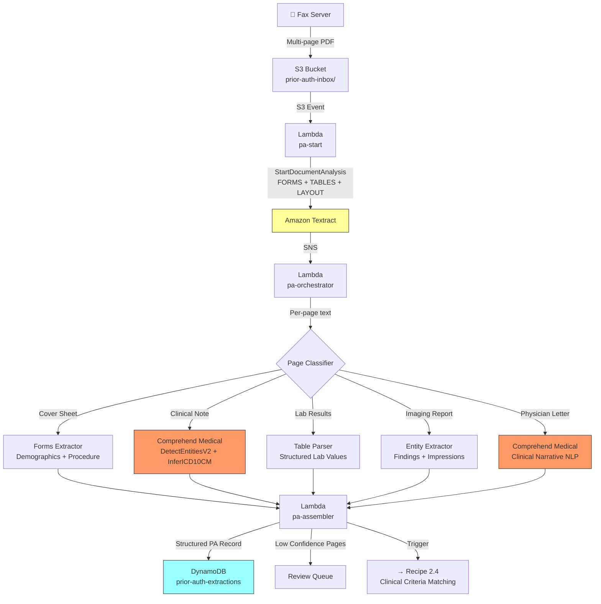

# Recipe 1.4 — Prior Authorization Document Processing ⭐

**Complexity:** Moderate · **Phase:** MVP · **Estimated Cost:** ~$0.04–0.08 per submission

---

## Problem Statement

Prior authorization is the single biggest pain point in healthcare payer operations. A provider faxes a 5–20 page submission requesting approval for a procedure, medication, or referral. That submission is a grab bag: a cover sheet with patient demographics and the requested service, clinical notes justifying medical necessity, lab results, imaging reports, and sometimes a letter from the physician explaining why this specific treatment is needed.

Today, a clinical reviewer manually reads every page, hunts for the diagnosis codes, identifies the requested procedure, locates the relevant clinical evidence, and determines whether it meets the payer's medical policy criteria. This takes 15–45 minutes per case. Payers process millions of prior auth requests annually. The labor cost is enormous, turnaround times frustrate providers and members, and regulatory pressure (CMS Interoperability rules, state-level prior auth reform) is pushing payers toward faster, more automated decisions.

The document extraction challenge here goes well beyond what we've tackled so far. Unlike the single-page forms in Recipes 1.1–1.3, a prior auth submission is multi-page, multi-format, and semantically complex. Page 1 might be a structured cover sheet (forms extraction). Page 3 might be a typed clinical note (entity extraction). Page 7 might be a lab results table. Page 12 might be a handwritten physician letter. We need to handle all of it, extract the right data from each page type, and assemble a structured prior auth record that downstream systems — including the clinical criteria matching engine (→ Recipe 2.4) and the decision orchestration workflow (→ Recipe 3.1) — can consume.

## Solution Overview

This recipe combines everything from Recipes 1.1–1.3 and adds multi-page document orchestration. The core insight: don't try to process all pages the same way. Instead, classify each page first, then route it to the appropriate extraction strategy.

**Three-stage pipeline:**

1. **Extract** — Async Textract on the full document (FORMS + TABLES), same pattern as Recipe 1.2
2. **Classify** — For each page, determine its type: cover sheet, clinical note, lab results, imaging report, physician letter, other
3. **Enrich** — Route classified pages to specialized extractors: Comprehend Medical for clinical notes (as in Recipe 1.3), table parsing for lab results, forms extraction for cover sheets

The page classification step is what makes this recipe different. We use a combination of keyword heuristics and Textract's layout features to classify pages, then fan out to the right extraction logic.


## Architecture Diagram



## Prerequisites

| Requirement | Details |
|-------------|---------|
| **AWS Services** | Amazon Textract, Amazon Comprehend Medical, S3, Lambda, DynamoDB, SNS, Step Functions (recommended for orchestration) |
| **IAM Permissions** | All from Recipes 1.2–1.3, plus: `states:StartExecution` if using Step Functions |
| **Textract Features** | FORMS + TABLES + LAYOUT (Layout helps with page classification) |
| **HIPAA Controls** | Same foundation as Recipe 1.1. Prior auth submissions contain dense PHI including clinical narratives, diagnosis history, and treatment plans. Ensure S3 Object Lock for retention compliance if subject to state record-keeping requirements. |
| **Sample Data** | CMS publishes sample prior auth forms. Create synthetic multi-page PDFs combining a cover sheet, clinical note, and lab results. Real prior auth submissions average 8–12 pages. |
| **Cost Estimate** | Textract (FORMS + TABLES): ~$3/1,000 pages. Comprehend Medical: ~$0.01/unit for clinical pages. A 10-page submission with 4 clinical pages: ~$0.03 Textract + ~$0.02 Comprehend Medical ≈ $0.05 total. At scale (1M submissions/year): ~$50K/year — a fraction of the manual review labor cost. |

## Ingredients

| AWS Service | Role |
|------------|------|
| **Amazon Textract** | Full document extraction — forms, tables, and layout analysis across all pages |
| **Amazon Comprehend Medical** | Clinical entity extraction and ICD-10 inference from narrative pages |
| **AWS Step Functions** | Orchestrates the classify → extract → assemble pipeline (recommended over Lambda-only for complex branching) |
| **Amazon S3** | Stores incoming submissions and extraction artifacts |
| **AWS Lambda** | Individual extraction functions (page classifier, forms extractor, NLP extractor, assembler) |
| **Amazon DynamoDB** | Stores structured prior auth records |
| **Amazon SNS** | Textract job completion notification |
| **Amazon CloudWatch** | Monitors extraction latency, page classification accuracy, confidence distributions |


## Code

> **Full source:** `github.com/aws-samples/healthcare-ai-cookbook/ch01/recipe-1.4/`

### Walkthrough

**Steps 1–2: Textract extraction and result retrieval.** Same async pattern as Recipe 1.2 — `StartDocumentAnalysis` with FORMS + TABLES, paginated `GetDocumentAnalysis` on SNS notification. We add the LAYOUT feature type for better page structure understanding.

```python
def start_prior_auth_extraction(bucket: str, key: str, sns_topic_arn: str, role_arn: str) -> str:
    response = textract.start_document_analysis(
        DocumentLocation={'S3Object': {'Bucket': bucket, 'Name': key}},
        FeatureTypes=['FORMS', 'TABLES', 'LAYOUT'],
        NotificationChannel={
            'SNSTopicArn': sns_topic_arn,
            'RoleArn': role_arn
        }
    )
    return response['JobId']
```

**Step 3 — Group blocks by page.** Textract returns blocks for the entire document. We need to process each page independently for classification.

```python
def group_blocks_by_page(blocks: list[dict]) -> dict[int, list[dict]]:
    pages = {}
    for block in blocks:
        page_num = block.get('Page', 1)
        pages.setdefault(page_num, []).append(block)
    return pages

def get_page_text(page_blocks: list[dict]) -> str:
    lines = [b['Text'] for b in page_blocks if b['BlockType'] == 'LINE']
    return '\n'.join(lines)
```

**Step 4 — Classify each page.** This is the key differentiator from earlier recipes. We use keyword patterns plus structural signals (presence of tables, forms, layout blocks) to determine page type. A production system might use a trained classifier, but keyword heuristics work surprisingly well for the standard page types in prior auth submissions.

```python
PAGE_SIGNATURES = {
    'cover_sheet': {
        'keywords': ['prior authorization', 'authorization request', 'member name',
                     'subscriber', 'requesting provider', 'requested service',
                     'date of service', 'procedure code', 'cpt'],
        'min_matches': 3,
        'has_forms': True
    },
    'clinical_note': {
        'keywords': ['history of present illness', 'assessment', 'plan',
                     'chief complaint', 'physical exam', 'review of systems',
                     'impression', 'hpi', 'subjective', 'objective'],
        'min_matches': 2,
        'has_forms': False
    },
    'lab_results': {
        'keywords': ['reference range', 'result', 'specimen', 'collected',
                     'abnormal', 'critical', 'units', 'flag'],
        'min_matches': 3,
        'has_tables': True
    },
    'imaging_report': {
        'keywords': ['findings', 'impression', 'technique', 'comparison',
                     'indication', 'radiology', 'mri', 'ct scan', 'x-ray'],
        'min_matches': 2,
        'has_forms': False
    },
    'physician_letter': {
        'keywords': ['dear', 'to whom it may concern', 'medical necessity',
                     'i am writing', 'requesting approval', 'patient has been'],
        'min_matches': 2,
        'has_forms': False
    }
}

def classify_page(page_text: str, page_blocks: list[dict]) -> str:
    text_lower = page_text.lower()
    has_tables = any(b['BlockType'] == 'TABLE' for b in page_blocks)
    has_forms = any(b['BlockType'] == 'KEY_VALUE_SET' for b in page_blocks)

    scores = {}
    for page_type, sig in PAGE_SIGNATURES.items():
        keyword_hits = sum(1 for kw in sig['keywords'] if kw in text_lower)
        if keyword_hits >= sig['min_matches']:
            score = keyword_hits
            if sig.get('has_tables') and has_tables:
                score += 2
            if sig.get('has_forms') and has_forms:
                score += 2
            scores[page_type] = score

    if scores:
        return max(scores, key=scores.get)
    return 'other'
```

**Step 5 — Route to specialized extractors.** Each page type gets processed differently. Cover sheets use the forms extraction from Recipe 1.1. Clinical notes use Comprehend Medical from Recipe 1.3. Lab results use table parsing from Recipe 1.2.

```python
def extract_cover_sheet(page_blocks: list[dict]) -> dict:
    """Forms extraction — same pattern as Recipe 1.1"""
    block_map = {b['Id']: b for b in page_blocks}
    raw_kv = parse_key_value_pairs_from_blocks(page_blocks, block_map)
    
    PA_FIELD_MAP = {
        'member_name': ['member name', 'patient name', 'subscriber name'],
        'member_id': ['member id', 'subscriber id', 'member #'],
        'requesting_provider': ['requesting provider', 'ordering physician', 'provider name'],
        'provider_npi': ['npi', 'provider npi', 'npi #'],
        'requested_procedure': ['procedure', 'requested service', 'service requested'],
        'cpt_code': ['cpt', 'cpt code', 'procedure code'],
        'icd10_code': ['diagnosis code', 'icd-10', 'icd code', 'dx code'],
        'date_of_service': ['date of service', 'dos', 'service date'],
        'urgency': ['urgent', 'urgency', 'priority'],
    }
    return normalize_fields_with_map(raw_kv, PA_FIELD_MAP)

def extract_clinical_entities(page_text: str) -> dict:
    """Comprehend Medical extraction — same pattern as Recipe 1.3"""
    entities = comprehend_medical.detect_entities_v2(Text=page_text)
    icd10 = comprehend_medical.infer_icd10_cm(Text=page_text)
    
    return {
        'conditions': [e for e in entities['Entities'] if e['Category'] == 'MEDICAL_CONDITION'],
        'medications': [e for e in entities['Entities'] if e['Category'] == 'MEDICATION'],
        'procedures': [e for e in entities['Entities'] if e['Category'] == 'TEST_TREATMENT_PROCEDURE'],
        'icd10_codes': [
            {'text': e['Text'], 'code': c['Code'], 'confidence': c['Score']}
            for e in icd10['Entities']
            for c in e.get('ICD10CMConcepts', [])
            if c['Score'] >= 0.70
        ]
    }

def extract_lab_values(page_blocks: list[dict]) -> list[dict]:
    """Table extraction — builds on Recipe 1.2 table parsing"""
    tables = parse_tables(page_blocks)
    lab_values = []
    for table in tables:
        if len(table) < 2:
            continue
        headers = [h.lower().strip() for h in table[0]]
        for row in table[1:]:
            value = {}
            for i, cell in enumerate(row):
                if i < len(headers):
                    value[headers[i]] = cell
            lab_values.append(value)
    return lab_values
```


**Step 6 — Assemble the structured prior auth record.** Merge extractions from all pages into a single record that downstream systems can consume.

```python
def assemble_prior_auth_record(
    document_key: str,
    page_extractions: dict[int, dict]
) -> dict:
    record = {
        'document_key': document_key,
        'page_count': len(page_extractions),
        'demographics': {},
        'requested_service': {},
        'clinical_evidence': {
            'conditions': [],
            'medications': [],
            'procedures': [],
            'icd10_codes': [],
            'lab_values': [],
        },
        'page_classifications': {},
        'confidence_summary': {},
    }

    for page_num, extraction in page_extractions.items():
        page_type = extraction['type']
        record['page_classifications'][page_num] = page_type

        if page_type == 'cover_sheet':
            record['demographics'] = extraction.get('fields', {})
            record['requested_service'] = {
                'cpt_code': extraction.get('fields', {}).get('cpt_code'),
                'procedure': extraction.get('fields', {}).get('requested_procedure'),
                'date_of_service': extraction.get('fields', {}).get('date_of_service'),
            }
        elif page_type in ('clinical_note', 'physician_letter'):
            ce = extraction.get('clinical_entities', {})
            record['clinical_evidence']['conditions'].extend(ce.get('conditions', []))
            record['clinical_evidence']['medications'].extend(ce.get('medications', []))
            record['clinical_evidence']['procedures'].extend(ce.get('procedures', []))
            record['clinical_evidence']['icd10_codes'].extend(ce.get('icd10_codes', []))
        elif page_type == 'lab_results':
            record['clinical_evidence']['lab_values'].extend(extraction.get('lab_values', []))

    # Deduplicate ICD-10 codes (same condition may appear on multiple pages)
    seen_codes = set()
    unique_codes = []
    for code in record['clinical_evidence']['icd10_codes']:
        if code['code'] not in seen_codes:
            seen_codes.add(code['code'])
            unique_codes.append(code)
    record['clinical_evidence']['icd10_codes'] = unique_codes

    return record
```

## Expected Results

**Sample output for a 12-page prior auth submission (knee replacement):**

```json
{
  "document_key": "prior-auth-inbox/2026/03/01/fax-00847.pdf",
  "page_count": 12,
  "demographics": {
    "member_name": "Robert Thompson",
    "member_id": "UHC4829100",
    "requesting_provider": "Dr. Amanda Liu",
    "provider_npi": "1982374650"
  },
  "requested_service": {
    "cpt_code": "27447",
    "procedure": "Total Knee Arthroplasty",
    "date_of_service": "04/15/2026"
  },
  "clinical_evidence": {
    "conditions": [
      {"text": "severe osteoarthritis", "category": "MEDICAL_CONDITION", "confidence": 0.97},
      {"text": "chronic knee pain", "category": "MEDICAL_CONDITION", "confidence": 0.95},
      {"text": "failed conservative treatment", "category": "MEDICAL_CONDITION", "confidence": 0.88}
    ],
    "medications": [
      {"text": "naproxen 500mg", "category": "MEDICATION", "confidence": 0.96},
      {"text": "cortisone injection", "category": "MEDICATION", "confidence": 0.92}
    ],
    "procedures": [
      {"text": "physical therapy", "category": "TEST_TREATMENT_PROCEDURE", "confidence": 0.94},
      {"text": "MRI right knee", "category": "TEST_TREATMENT_PROCEDURE", "confidence": 0.97}
    ],
    "icd10_codes": [
      {"text": "osteoarthritis", "code": "M17.11", "confidence": 0.94},
      {"text": "chronic pain", "code": "G89.29", "confidence": 0.87}
    ],
    "lab_values": [
      {"test": "ESR", "result": "28", "units": "mm/hr", "reference_range": "0-20", "flag": "H"},
      {"test": "CRP", "result": "1.8", "units": "mg/dL", "reference_range": "0-0.5", "flag": "H"}
    ]
  },
  "page_classifications": {
    "1": "cover_sheet",
    "2": "cover_sheet",
    "3": "clinical_note",
    "4": "clinical_note",
    "5": "clinical_note",
    "6": "lab_results",
    "7": "lab_results",
    "8": "imaging_report",
    "9": "imaging_report",
    "10": "physician_letter",
    "11": "other",
    "12": "other"
  }
}
```

**Performance benchmarks:**

| Metric | Typical Value |
|--------|---------------|
| End-to-end latency (12-page doc) | 20–45 seconds |
| Page classification accuracy | 85–92% (keyword heuristics; ML classifier pushes to 95%+) |
| Cover sheet field extraction | 93–98% |
| Clinical entity extraction | 88–95% (depends on narrative quality) |
| ICD-10 inference accuracy | 85–93% |
| Cost per 10-page submission | ~$0.05 |
| Cost at 1M submissions/year | ~$50K (vs. $15M+ manual review labor) |

**Where it struggles:** Pages that blend types (a clinical note with embedded lab values in a table). Faxes with heavy noise, skew, or cut-off margins — common with multi-generation fax forwarding. Cover sheets from smaller payers with non-standard layouts. And the elephant in the room: handwritten pages, which we address properly in Recipe 1.6.

## Variations & Extensions

1. **Step Functions orchestration.** Replace the monolithic Lambda with an AWS Step Functions state machine. Each step (classify, extract, enrich, assemble) becomes its own Lambda. This gives you retry logic, error handling per page, parallel extraction of independent pages, and visual debugging via the Step Functions console. For production prior auth processing, this is the recommended pattern.

2. **Clinical criteria pre-matching.** Before the submission reaches a human reviewer, automatically compare the extracted clinical evidence against the payer's medical policy criteria using the pattern from → Recipe 2.4 (Clinical Criteria Matching). Flag submissions that clearly meet criteria (auto-approve candidates) vs. those with gaps (need reviewer attention). This doesn't replace clinical judgment but dramatically reduces reviewer workload.

3. **Provider portal integration.** Surface extraction results back to the requesting provider via API: "We received your submission. We identified CPT 27447, ICD-10 M17.11. Is this correct? We're missing documentation of conservative treatment duration — please upload additional records." This closes the information loop faster than phone-tag between provider offices and payer UM nurses.

## Related Recipes

- **← Recipe 1.2 (Patient Intake Form Digitization):** Foundation for async Textract and table extraction patterns reused here
- **← Recipe 1.3 (Lab Requisition Form Extraction):** Foundation for the Comprehend Medical NLP layer
- **→ Recipe 1.5 (Claims Attachment Processing):** Extends the multi-document classification pattern to an even more heterogeneous document set
- **→ Recipe 2.4 (Clinical Criteria Matching via NLP):** Consumes the structured clinical evidence to evaluate against medical policy criteria
- **→ Recipe 3.1 (Prior Auth Decision Orchestration):** End-to-end workflow that uses this recipe's output as the first stage in an automated prior auth decision pipeline
- **→ Recipe 8.1 (Insurance Eligibility Matching):** Validates member eligibility before processing the prior auth

## Additional Resources

- [Amazon Textract Layout Feature](https://docs.aws.amazon.com/textract/latest/dg/how-it-works-layout.html)
- [AWS Step Functions Developer Guide](https://docs.aws.amazon.com/step-functions/latest/dg/welcome.html)
- [CMS Prior Authorization Interoperability Rule (CMS-0057-F)](https://www.cms.gov/newsroom/fact-sheets/cms-interoperability-and-prior-authorization-final-rule-cms-0057-f)
- [NCQA Prior Authorization Standards](https://www.ncqa.org/)
- [Amazon Comprehend Medical Best Practices](https://docs.aws.amazon.com/comprehend-medical/latest/dev/best-practices.html)

## Estimated Implementation Time

| Scope | Time |
|-------|------|
| **Basic** (Textract + page classification + Comprehend Medical, single Lambda) | 2–3 days |
| **Production-ready** (Step Functions, error handling, confidence gating, monitoring, review queue) | 1–2 weeks |
| **With variations** (criteria pre-matching, provider portal integration, auto-approve flow) | 3–4 weeks |

## Tags

`document-intelligence` · `ocr` · `nlp` · `textract` · `comprehend-medical` · `prior-authorization` · `multi-page` · `page-classification` · `step-functions` · `icd-10` · `moderate` · `mvp` · `flagship` · `hipaa`

---

*← [Recipe 1.3 — Lab Requisition Form Extraction](chapter01.03-lab-requisition-extraction) · [Next: Recipe 1.5 — Claims Attachment Processing →](chapter01.05-claims-attachment-processing)*
