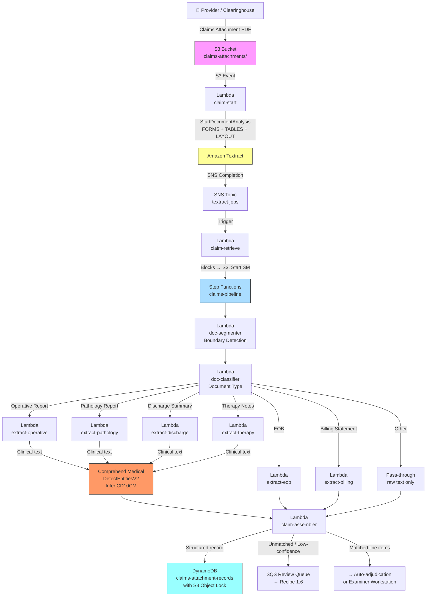

# Recipe 1.5: Claims Attachment Processing 🔴

**Complexity:** Complex · **Phase:** Phase 2 · **Estimated Cost:** ~$0.75–1.75 per claims package

---

## The Problem

Imagine you're a claims examiner. A 38-page PDF lands in your queue. It's a claims attachment package from a provider supporting a surgical claim. You open it.

Page 1 is the last page of an operative report. Page 2 is the beginning of a pathology result, except it doesn't say "PATHOLOGY REPORT" at the top; it just starts with a gross description of the specimen. Pages 3 through 6 are a discharge summary, but pages 4 and 5 are printed sideways. Page 7 is a consent form that has nothing to do with the claim. Pages 8 through 12 are an Explanation of Benefits from the patient's secondary payer, printed from a payer web portal with their specific layout. Pages 13 and 14 are therapy notes from three different visits, all crammed into a continuous print job with no clear breaks. Page 15 is a billing statement, but it's from a different facility than the claim you're looking at.

Nobody assembled this thoughtfully. The provider's billing staff went into their EHR, selected everything that seemed relevant to the claim, hit print, and sent the whole stack through a fax machine. The output is a single PDF that contains somewhere between four and eight distinct logical documents, in no particular order, with no table of contents, and no cover sheet telling you what's in there.

Now the claims examiner has to do the following. Find the operative report. Confirm the CPT code documented in the operative note matches line item 1 on the claim (total knee arthroplasty, 27447). Find the pathology result and confirm there's a specimen consistent with the procedure. Find the EOB and check what the secondary payer paid, to determine coordination of benefits. Look at the therapy notes and verify the dates of service match the claim lines. Cross-reference the billing statement's itemized charges against what the provider billed on the 837 transaction.

This takes 30 to 60 minutes. For a complex surgical claim. And payers process hundreds of thousands of claims attachments annually.

Prior auth (Recipe 1.4) introduced the page classification and fan-out pattern for multi-page documents. That pattern works well when you're dealing with a submission that has a recognizable structure: cover sheet first, then clinical notes, maybe some labs. Prior auth submissions are still constrained. There's usually a cover sheet that anchors the document. The page types are limited. The total page count rarely exceeds 15.

Claims attachments are a different animal. They're larger (15 to 50 pages is typical). The document types are more varied. There's no cover sheet. And most critically: the package contains multiple independent documents that have been physically concatenated into one PDF. The documents have nothing to do with each other structurally. The page numbers in the PDF don't align with the page numbers in the individual documents. The formatting changes abruptly between documents because each was printed from a different source system.

The key capability this recipe builds on top of Recipe 1.4 is **document boundary detection**: figuring out where one logical document ends and the next begins before doing any extraction. Get that wrong, and everything downstream breaks. Misidentify a page boundary and you extract a hybrid document that's half operative report and half pathology result; neither extractor knows what to do with it.

This is the claims attachment problem. It's harder than prior auth. Here's how to approach it.

---

## The Technology

### The Multi-Document Concatenation Problem

When you look at a claims attachment PDF, you're seeing the result of a process that the sending system didn't design for machine readability. The provider's EHR or billing platform prints each document independently, then combines the pages into a single fax job. The resulting PDF has no logical structure that corresponds to the document boundaries. It's a flat page stream.

The technical challenge is that a flat page stream looks identical whether it contains one long document or six short documents back-to-back. The only signals available are what's printed on the pages themselves: headers, title lines, page numbering patterns, date stamps, facility names, and formatting discontinuities.

Document boundary detection is the process of analyzing those signals to infer where boundaries fall. It's probabilistic. It can be wrong. The design goal is not to be right 100% of the time; it's to be right often enough that the downstream classification and extraction pipeline handles the common cases automatically, and the failure modes are identifiable so they can route to human review.

### Signals for Document Boundary Detection

The most reliable signals, roughly ordered from strongest to weakest:

**Document title lines.** Many document types have characteristic title lines that appear at or near the top of the first page: "OPERATIVE REPORT," "PATHOLOGY REPORT," "DISCHARGE SUMMARY," "EXPLANATION OF BENEFITS." When a page has a strong document title in the first few lines, it's almost certainly the start of a new logical document. This is the most reliable single signal, when it's present. It's not always present.

**Header/footer discontinuity.** Each document typically has its own header: facility name, department, date range, patient name formatted according to that system's template. When the header on page N is materially different from the header on page N-1, a boundary likely exists between them. This requires extracting the header region (roughly the top 15% of each page) and comparing them. The comparison isn't exact string matching: the same facility might print its name with different abbreviations. Fuzzy matching or entity extraction on the header region works better.

**Page number restart.** Many documents include explicit page numbering: "Page 1 of 6," "Page 2 of 6," etc. When a "Page 1" appears after a page that is not the end of a prior sequence, that's a reliable boundary signal. The complication: some documents don't number pages, some number them inconsistently, and some fax servers insert their own page count that overrides the document's.

**Date discontinuity.** Clinical documents are anchored to specific service dates. An operative report from March 15 followed by a discharge summary dated February 20 almost certainly represents a boundary, even if there's no other visual signal. Date discontinuities of more than a few days are worth flagging. This requires date extraction from the page text, which has its own noise: date formats vary, and some pages contain multiple dates (admit date, discharge date, report date).

**Format discontinuity.** This is the weakest signal but sometimes the only one available. An abrupt change in font density, column layout, or the presence/absence of table structure can indicate a boundary. A page of dense paragraph text followed by a page of structured tables might represent a transition from a clinical note to an EOB. These signals alone are not reliable enough to use; they're most useful as tie-breakers when other signals are ambiguous.

### Why Document-Level Classification Beats Page-Level Classification

Recipe 1.4 classifies each page individually, then routes pages to extractors. That works for prior auth submissions because each page in a prior auth is effectively its own document type. An imaging report is usually one or two pages. A clinical note is one page. The page-level is close enough to the document-level.

Claims attachments break this assumption. An operative report is four to eight pages of continuous narrative. A pathology report is two to four pages. A discharge summary is three to six pages. If you classify these page-by-page, you'll correctly classify the first page of each (it has the title line and strong keyword signals) but misclassify the middle and ending pages (they're dense clinical prose without the header signals that make the first page identifiable).

The right unit of classification for claims attachments is the logical document, not the page. Once you've run boundary detection and know that pages 3 through 7 form a single logical document, you can look at all five pages together when classifying. The classifier has the full operative report vocabulary available, not just whatever happened to appear on page 5 in isolation.

Document-level classification also reduces noise from ambiguous pages. Page 4 of an operative report might contain text that looks superficially like a clinical note page. When you classify it in context (knowing it's pages 3-7 of an operative report based on the boundary signals that triggered around page 3), the classification is stable. When you classify it in isolation, it's a coin flip.

### The Document Type Taxonomy

Claims attachments can contain more document types than prior auth submissions. The taxonomy for this recipe covers the most common ones:

**Operative reports.** Structured clinical narrative of a surgical procedure. Sections include preoperative diagnosis, postoperative diagnosis, procedure performed, anesthesia, findings, operative technique, estimated blood loss, specimens sent, and surgeon attestation. The procedure performed section is what links the document to claim line items: the CPT code on the claim should be consistent with the procedure described here.

**Pathology and histology reports.** Results of specimen analysis after surgical resection or biopsy. Structured with specimen description, gross findings, microscopic findings, diagnosis, and pathologist sign-off. These documents link to surgical claim lines indirectly: they confirm that specimens described in the operative report were actually sent for analysis and what was found.

**Discharge summaries.** Multi-page clinical narrative covering the full hospital episode: admitting diagnosis, hospital course, consultations, procedures performed, discharge diagnosis, discharge medications, and follow-up instructions. These span the entire admission and are relevant to DRG-based facility claims and post-acute claims.

**Explanation of Benefits from other payers.** When a patient has coordination of benefits across two payers, the primary payer's EOB becomes a claims attachment for the secondary payer. These documents have table-heavy layouts specific to each payer: service lines, billed amounts, allowed amounts, plan paid amounts, patient responsibility, and denial codes. EOBs are structurally more similar to billing statements than to clinical documents; the extraction approach is entirely different.

**Therapy notes and progress notes.** Visit-level clinical documentation from physical therapy, occupational therapy, speech therapy, or outpatient mental health. These tend to be shorter (one to two pages per visit), and a claims attachment package may contain multiple visit notes from different dates stapled together with no separator. The claim lines they support are visit-level CPT codes, so the date of service match is critical.

**Billing statements and itemized charges.** Provider-generated financial documents showing the breakdown of charges for the episode. Line items typically include service date, procedure code, revenue code, charge amount, and facility cost center. These documents support the claim by providing an alternative view of the charges with a level of detail not present in the 837 transaction itself.

**Other.** Consent forms, referral letters, prior auth approvals, face sheets, and other administrative documents that end up in attachment packages by accident. These don't map to claim lines and should be noted but not extracted in detail.

### Claim Line Item Matching

Here's the thing that distinguishes claims attachment processing from prior auth processing in terms of what the downstream system actually needs: with prior auth, the goal is to produce a single clinical evidence record that supports or doesn't support one requested service. There's one CPT code being evaluated.

Claims have multiple line items. A surgical claim might have six lines: the primary procedure, anesthesia, one or more modifiers for assistant surgeon or bilateral, a pathology code, and a post-operative visit. Each line item needs to be supported by documentation. The question the claims examiner is answering is not "is this claim supported?" but "which specific line items are supported, and which are missing documentation?"

Claim line item matching is the process of linking the extracted data from each document back to the relevant claim lines. The linkage is done through matching logic across three dimensions: CPT code (does the operative report describe a procedure consistent with the claimed CPT?), date of service (does the service date on the document match the date on the claim line?), and provider identity (is the treating provider mentioned in the document consistent with the billing NPI on the claim?).

This sounds straightforward, but it has meaningful failure modes. CPT codes in clinical documents are sometimes implicit rather than explicit: an operative report describes "total knee arthroplasty, right knee" without ever writing "27447." The date match is complicated when documents cover a range of dates (a discharge summary covers an entire admission, not a single date). Provider matching is complicated by name abbreviations, credential variations, and group practice billing.

The practical approach for a Phase 2 implementation: do exact matches where you can (when a document explicitly contains a CPT code and a date that match a claim line), flagged near-matches for human review (when the procedure description is consistent but no explicit code is present), and "no match" for documents that can't be linked to any claim line. The examiner sees exactly which claim lines have supporting documentation and which need more work.

### The General Architecture Pattern

The pipeline has four stages, building directly on Recipe 1.4's three-stage pattern.

**Stage 1: Full-document extraction.** Same as Recipe 1.4. Async OCR and document analysis on the entire PDF produces text, form fields, tables, and layout structure for every page.

**Stage 2: Document boundary detection.** New. The page stream is analyzed for boundary signals (title lines, header changes, page number restarts, date discontinuities). The output is a list of logical document segments: "pages 1-4 are document A, pages 5-8 are document B," etc.

**Stage 3: Document-level classification and fan-out extraction.** Each logical document is classified as a unit using keyword signals across all its pages. Classified documents fan out to type-specific extractors. Operative reports go to the clinical NLP extractor. EOBs go to the table extractor. This is the same fan-out pattern as Recipe 1.4, but operating at the document level rather than the page level.

**Stage 4: Claim line item matching and assembly.** New. The extractor outputs are assembled into a unified claims attachment record, and the extracted data is matched against the claim's line items. The final record identifies which lines have documentation support and which don't.

```
[Claims Attachment Arrives] → [Full Document Extraction (OCR + Structure)]
                                              ↓
                                  [Group Blocks by Page]
                                              ↓
                            [Document Boundary Detection]
                            (Title lines, headers, page restart,
                             date discontinuity, format shift)
                                              ↓
                              [Logical Document Segments]
                              (pages 1-4, pages 5-6, pages 7-12...)
                                              ↓
                         [Document-Level Classification]
                         (classify each segment as a whole)
                                              ↓
         ┌──────────┬──────────┬──────────┬──────────┬──────────┐
         ↓          ↓          ↓          ↓          ↓          ↓
    [Operative  [Pathology [EOB        [Discharge [Therapy  [Billing
     Report     Report     Extractor]  Summary    Notes]    Statement]
     Extractor] Extractor]             Extractor]
         ↓          ↓          ↓          ↓          ↓          ↓
         └──────────┴──────────┴──────────┴──────────┴──────────┘
                                              ↓
                         [Claim Line Item Matching]
                     (link documents to 837 claim lines by
                      CPT, date of service, provider NPI)
                                              ↓
                         [Unified Claims Attachment Record]
                                              ↓
              ┌────────────────────────────────────────────┐
              ↓                                            ↓
     [Downstream: Auto-adjudication              [Unmatched / Low-Confidence:
      or examiner workstation]                    Human Review Queue]
```

The stage boundaries are explicit checkpoints. If the boundary detection step produces strange segments (a 1-page document that's really the middle of a larger one), that's diagnosable before extraction starts. If a document classifies as "unclassified," the extractor doesn't run and the document goes to the review queue rather than producing garbage output. Failures are isolated and auditable.

---

## The AWS Implementation

### Why These Services

**Amazon Textract with LAYOUT feature type.** Same as Recipe 1.4. The LAYOUT feature type gives structural metadata (section headers, title blocks, body paragraphs, table positions) that is essential for the boundary detection logic. A LAYOUT_TITLE block at the top of a page is a much stronger boundary signal than a keyword match alone. LAYOUT blocks also help distinguish the header region (facility name, date, patient info) from body text without having to do coordinate math on the bounding boxes.

**AWS Step Functions (Standard Workflows).** The pipeline has more branches than Recipe 1.4. There are more document types, the boundary detection step introduces conditional logic that's hard to manage in a single Lambda, and the claim line matching step needs to receive results from all the type-specific extractors before it can run. Step Functions Standard Workflows handle this cleanly: parallel states for the type-specific extractors, a merge state that waits for all branches, and error handling per branch so a failed EOB extractor doesn't abort the discharge summary extractor. Standard Workflows are the right choice here (not Express) because the execution history in the console is how you debug a misclassified 38-page package. The audit trail is also a claims processing compliance requirement.

**Amazon Comprehend Medical for clinical documents.** The clinical document types in claims attachments (operative reports, pathology reports, discharge summaries, therapy notes) all benefit from `DetectEntitiesV2` for entity extraction and `InferICD10CM` for diagnosis code inference. The same patterns as Recipe 1.4 apply, but applied to a wider set of document types. We continue to target Comprehend Medical only at pages that contain clinical narrative, not at EOBs or billing statements, where clinical NLP adds no value and costs money for no benefit.

**Amazon S3 for intermediate state.** Step Functions has a 256 KB payload limit. A 40-page document's Textract output can easily exceed that. Following the same pattern established in Recipe 1.4: write Textract output and intermediate extraction results to S3, pass S3 object keys through the Step Functions state machine rather than raw data. Every Lambda in the pipeline reads its inputs from S3 and writes its outputs to S3.

**Amazon DynamoDB for the attachment record.** Claims attachment records contain claim IDs, line item data, document-level extraction results, and per-document confidence scores. DynamoDB's document model handles this naturally. The partition key is the claim ID, making lookups by claim trivial. If a claim has multiple attachment packages (initial submission plus a supplemental), both records exist under the same claim ID with different sort keys.

**Amazon S3 Object Lock for retention compliance.** Claims records have retention requirements. CMS mandates that Medicare claims records be retained for at least 10 years. Many states have their own requirements ranging from 7 to 10 years. S3 Object Lock with compliance mode (not governance mode) prevents deletion during the retention period, even by account administrators. This is not optional for a production claims processing system.

### Architecture Diagram



### Prerequisites

| Requirement | Details |
|-------------|---------|
| **AWS Services** | Everything from Recipes 1.2, 1.3, and 1.4 (Textract, S3, Lambda, SNS, DynamoDB, KMS, Comprehend Medical, Step Functions), plus S3 Object Lock for retention compliance |
| **IAM Permissions** | All permissions from Recipe 1.4, plus: `s3:PutObjectLegalHold` and `s3:PutObjectRetention` for S3 Object Lock on the claims records bucket. The assembler Lambda needs these to lock records after writing them. |
| **Step Functions** | Standard Workflows (not Express). Execution history retention is a claims processing compliance requirement. Visual execution graph is essential for debugging boundary detection failures in complex packages. |
| **BAA** | AWS BAA signed. Claims attachments contain some of the most sensitive PHI categories: surgical operative notes, pathology results with cancer diagnoses, full-episode discharge summaries, financial responsibility data. |
| **Encryption** | S3: SSE-KMS with customer-managed key. S3 Object Lock in compliance mode on the claims-attachment-records bucket. DynamoDB: encryption at rest. All API calls over TLS. Step Functions execution history: SSE. Text sent to Comprehend Medical is not retained by AWS. |
| **VPC** | Production: all Lambdas in a VPC with VPC endpoints for S3 (gateway), Textract, DynamoDB, SNS, SQS, Comprehend Medical, Step Functions, CloudWatch Logs, and KMS. Claims data should not traverse the public internet. |
| **CloudTrail** | Enabled for all services. Claims processing is subject to CMS audit requirements. Every extraction, every Comprehend Medical call, and every DynamoDB write needs to be in the audit trail. |
| **Sample Data** | CMS publishes [sample 837 transactions](https://www.cms.gov/medicare/coding-billing/electronic-billing-edi/transaction-code-sets) for claim line item reference. Build synthetic multi-document PDFs by concatenating an operative report template, a pathology report, a discharge summary, a payer EOB printout, and therapy notes. X12 835/837 samples provide claim line item structures to match against. Never use real PHI in development. |
| **Cost Estimate** | Textract async (FORMS + TABLES + LAYOUT): approximately $4.50 per 1,000 pages, or $0.135 for a 30-page package. Comprehend Medical (DetectEntitiesV2 + InferICD10CM) on clinical pages: approximately $0.05–0.15 per clinical page. A 30-page package with 12 clinical pages (operative report, pathology, discharge summary, therapy notes) runs approximately $0.60–1.80 in Comprehend Medical. Step Functions Standard Workflows: $0.025 per 1,000 transitions. A 30-page package with 8 document segments and roughly 80 state transitions runs approximately $0.002. Total: roughly $0.75–1.95 per package. At 300,000 claims packages per year: $225K–585K. At 500,000: $375K–975K. Compare that to the cost of manual attachment review at 30–60 minutes per case at $35–55/hour loaded cost: at 500,000 packages, manual review runs $8.75M–27.5M per year. The math is not close. |

### Ingredients

| AWS Service | Role |
|------------|------|
| **Amazon Textract** | Full document extraction on the entire PDF: FORMS, TABLES, and LAYOUT blocks across all pages |
| **Amazon Comprehend Medical (DetectEntitiesV2)** | Clinical entity extraction from operative reports, pathology reports, discharge summaries, and therapy notes |
| **Amazon Comprehend Medical (InferICD10CM)** | ICD-10 code inference from clinical narrative in operative reports and discharge summaries |
| **AWS Step Functions (Standard Workflows)** | Orchestrates the segment → classify → fan-out extract → assemble → match pipeline |
| **Amazon S3** | Stores incoming attachment PDFs, intermediate Textract output, per-document extraction results, and final attachment records |
| **S3 Object Lock** | Compliance-mode retention lock on final claims records to meet CMS and state retention mandates |
| **AWS Lambda** | claim-start, claim-retrieve, doc-segmenter, doc-classifier, 6+ type-specific extractors, claim-assembler |
| **Amazon SNS** | Receives Textract async job completion notification; triggers the claim-retrieve Lambda |
| **Amazon SQS** | Dead letter queues on all Lambdas; review queue for unclassified documents and low-confidence segments |
| **Amazon DynamoDB** | Stores structured claims attachment records indexed by claim ID; PHI encrypted at rest |
| **AWS KMS** | Customer-managed encryption keys for S3, DynamoDB, and Step Functions execution history |
| **Amazon CloudWatch** | Logs, metrics, alarms for pipeline failures, boundary detection accuracy, classification accuracy, and cost per package |

### Code

> **Reference implementations:** These AWS sample repos demonstrate the patterns used in this recipe:
>
> - [`aws-ai-intelligent-document-processing`](https://github.com/aws-samples/aws-ai-intelligent-document-processing): Comprehensive IDP solutions with multi-stage extraction pipelines, document classification, A2I human review integration, and generative AI enrichment
> - [`amazon-textract-and-amazon-comprehend-medical-claims-example`](https://github.com/aws-samples/amazon-textract-and-amazon-comprehend-medical-claims-example): Healthcare-specific: extracting and validating medical claims data with Textract and Comprehend Medical, with CloudFormation deployment templates
> - [`document-processing-pipeline-for-regulated-industries`](https://github.com/aws-samples/document-processing-pipeline-for-regulated-industries): Document processing for regulated industries with lineage and pipeline metadata services
> - [`amazon-textract-and-comprehend-medical-document-processing`](https://github.com/aws-samples/amazon-textract-and-comprehend-medical-document-processing): Workshop-style repo for multi-stage medical document processing pipelines with Lambda orchestration

#### Walkthrough

**Steps 1 and 2: Async Textract extraction and result retrieval.** These steps are identical to Recipe 1.4. Include LAYOUT in the `FeatureTypes` list. The `claim-start` Lambda submits the async job and exits. The `claim-retrieve` Lambda fires on the SNS completion notification, retrieves all Textract result pages, writes the raw block list to S3, and starts the Step Functions state machine with the S3 key. Review Recipe 1.4 for the full pseudocode.

The one difference from Recipe 1.4: the Step Functions input should include the claim ID from the triggering metadata. The claim ID connects the attachment to the claim line items for the matching step.

```
FUNCTION retrieve_and_handoff(textract_job_id, attachment_key, claim_id, state_machine_arn):
    // Retrieve all Textract blocks, same paginated call as Recipe 1.4
    all_blocks = retrieve_all_textract_blocks(textract_job_id)

    // Write raw blocks to S3 (Step Functions payload limit is 256 KB; large documents exceed it)
    textract_output_key = "textract-outputs/" + textract_job_id + "/blocks.json"
    write all_blocks to S3 at textract_output_key

    // Start the pipeline state machine.
    // Pass references only, not raw data, through Step Functions.
    start Step Functions execution at state_machine_arn with input:
        attachment_key       = attachment_key          // the incoming claims attachment PDF
        textract_output_key  = textract_output_key     // where the Textract blocks live
        textract_job_id      = textract_job_id         // for audit trail
        claim_id             = claim_id                // links this attachment to its claim
```

**Step 3: Group Textract blocks by page.** Same as Recipe 1.4. Read the blocks from S3, iterate through them, group by `Page` attribute, assemble page text from LINE blocks, and note structural features per page (has_tables, has_forms, layout_blocks). See Recipe 1.4 for the full pseudocode.

The one addition here: also extract the **header region** for each page. The header is the top portion of the page (roughly the first 15% by vertical position) where facility name, document title, patient identifier, and date typically live. The boundary detection step needs this region separately from the full page text.

```
FUNCTION extract_header_region(page_blocks):
    // Get the bounding box height of the overall page from LAYOUT_PAGE blocks.
    // Textract bounding boxes are normalized: Top=0.0 is the top of the page, Top=1.0 is the bottom.
    // "Header region" is defined as Top < 0.15 (the top 15% of the page).
    header_text = empty string

    FOR each block in page_blocks:
        IF block.BlockType == "LINE":
            // block.Geometry.BoundingBox.Top is the normalized vertical position
            IF block.Geometry.BoundingBox.Top < 0.15:
                header_text += block.Text + "\n"

    RETURN trim(header_text)

// Add this to the group_blocks_by_page function from Recipe 1.4:
// pages[page_num].header_text = extract_header_region(page's blocks)
```

**Step 4: Document boundary detection.** This is the novel step in this recipe. We analyze the page stream looking for signals that indicate a new logical document has started. The output is a list of document segments, each defined by a start page, end page, and the signal that triggered the boundary.

The boundary detector runs as a pass over the pages in order. It maintains a small amount of state: the most recent non-trivial header text, the most recent date found in the document, and the current document's page count. When a strong boundary signal fires, it closes the current segment and starts a new one.

```
// Patterns that strongly indicate a new document is starting.
// These are tested against the first 5 lines of the page text (the top of the page).
DOCUMENT_TITLE_PATTERNS = [
    "operative report",    "operative note",      "op note",         "surgical report",
    "pathology report",    "cytology report",     "histology report","pathologic diagnosis",
    "explanation of benefits",                     "eob",
    "discharge summary",   "discharge instructions","hospital summary",
    "progress note",       "office visit note",   "outpatient visit",
    "physical therapy note","occupational therapy","speech therapy",
    "itemized statement",  "itemized billing",    "billing statement","patient statement",
    "radiology report",    "imaging report",
    "laboratory report",   "lab report"
]

FUNCTION detect_document_boundaries(pages):
    // Result: list of { start_page, end_page, boundary_signal, primary_date }
    segments      = empty list
    seg_start     = 1                   // the first segment always starts at page 1
    prev_header   = null               // header text from the previous page
    prev_date     = null               // primary date from the previous page
    pages_in_seg  = 0                  // pages accumulated in the current segment

    FOR each page_num in sorted page numbers:
        page   = pages[page_num]
        header = page.header_text
        text   = page.text

        is_boundary     = false
        boundary_signal = null

        // ---- Signal 1: Document title line ----
        // Look for a recognized document type title in the first 5 lines of the page.
        // This is the strongest single signal. When present, we almost certainly have a boundary.
        first_lines = join first 5 lines of text, lowercased
        IF any pattern in DOCUMENT_TITLE_PATTERNS is found in first_lines:
            is_boundary     = true
            boundary_signal = "document_title"

        // ---- Signal 2: Header region discontinuity ----
        // If the header has changed meaningfully from the previous page, we may have crossed
        // a document boundary. We skip this check for the first page (no previous header)
        // and when Signal 1 already fired (no need to double-count).
        IF NOT is_boundary AND prev_header is not null AND header is not empty:
            similarity = compute_text_similarity(header, prev_header)
            // Similarity is a score from 0.0 (completely different) to 1.0 (identical).
            // A threshold of 0.40 catches most facility-name changes while tolerating
            // minor differences (date changes, patient name in the header).
            IF similarity < 0.40:
                is_boundary     = true
                boundary_signal = "header_discontinuity"

        // ---- Signal 3: Page number restart ----
        // Look for "Page 1 of N" or "1 of N" patterns in the header or first few lines.
        // A "Page 1" appearing after the first page of the PDF is a boundary signal.
        IF NOT is_boundary AND page_num > 1:
            page_restart_match = find pattern like "page 1 of \d+" or "^1 of \d+" in first_lines
            IF page_restart_match is found:
                is_boundary     = true
                boundary_signal = "page_restart"

        // ---- Signal 4: Date discontinuity ----
        // Extract the primary date on this page (the most prominent date, usually near the top).
        // If it's more than 30 days different from the previous page's date, flag it as a boundary.
        // (We use 30 days rather than exact match to handle documents that span multiple days
        //  like discharge summaries, without triggering false boundaries within a multi-day stay.)
        page_date = extract_primary_date_from_text(first_lines + "\n" + header)
        IF NOT is_boundary AND page_date is not null AND prev_date is not null:
            date_delta_days = absolute_value(days_between(page_date, prev_date))
            IF date_delta_days > 30:
                is_boundary     = true
                boundary_signal = "date_discontinuity"

        // ---- Close the current segment and start a new one ----
        // Only close a segment if we've accumulated at least 1 page.
        // (Prevents zero-page segments from back-to-back boundary signals.)
        IF is_boundary AND page_num > seg_start:
            segments.append({
                start_page:       seg_start,
                end_page:         page_num - 1,
                boundary_signal:  boundary_signal,   // what closed this segment
                primary_date:     prev_date
            })
            seg_start    = page_num
            pages_in_seg = 0

        // Update running state for the next iteration
        IF header is not empty:
            prev_header = header
        IF page_date is not null:
            prev_date = page_date
        pages_in_seg += 1

    // Close the final segment (always needed: the last segment doesn't have a closing boundary)
    segments.append({
        start_page:      seg_start,
        end_page:        max page number in pages,
        boundary_signal: "end_of_document",
        primary_date:    prev_date
    })

    // Log the detected segments for audit and debugging
    FOR each segment in segments:
        log: "Segment pages " + segment.start_page + "-" + segment.end_page
             + " (signal: " + segment.boundary_signal + ")"

    RETURN segments
```

A note on `compute_text_similarity`: for production implementations, a simple approach is to extract the distinct words from each header and compute Jaccard similarity (size of intersection divided by size of union). A header of "Memorial Hospital Operative Report 03/15/2026" and a header of "Valley Pathology Laboratory 03/15/2026" share some words but not enough to look the same. A header of "Memorial Hospital Operative Report 03/15/2026" and "Memorial Hospital Operative Report 03/16/2026" are clearly the same document type from the same facility. Jaccard similarity handles this well with less complexity than a full fuzzy matching library.

**Step 5: Document-level classification.** We now have a list of segments, each covering a range of pages. We classify each segment as a unit by aggregating the text across all its pages and running keyword matching against the document type signatures.

Document-level classification is more accurate than page-level because the keyword evidence from all pages is pooled. An operative report's "PROCEDURE PERFORMED" section might not appear until page 2; classifying page 2 alone would miss it, but classifying pages 1-4 together has both the title line from page 1 and the procedure section from page 2.

```
// Keyword signatures for document-level classification.
// These build on Recipe 1.4's per-page signatures but are tuned for whole-document matching.
DOCUMENT_TYPE_SIGNATURES = {
    "operative_report": {
        keywords: ["preoperative diagnosis", "postoperative diagnosis", "procedure performed",
                   "anesthesia", "estimated blood loss", "specimen", "operative technique",
                   "findings", "surgeon", "attending physician", "intraoperative"],
        min_matches: 3
    },
    "pathology_report": {
        keywords: ["specimen", "gross description", "microscopic description",
                   "diagnosis", "pathologist", "accession number", "histologic",
                   "margins", "lymph node", "tumor"],
        min_matches: 3
    },
    "eob": {
        keywords: ["explanation of benefits", "allowed amount", "patient responsibility",
                   "deductible", "coinsurance", "claim number", "paid amount",
                   "billed amount", "plan paid", "coordination of benefits"],
        min_matches: 3,
        table_bonus: 2   // EOBs are always table-heavy; tables reinforce this classification
    },
    "discharge_summary": {
        keywords: ["discharge diagnosis", "admitting diagnosis", "hospital course",
                   "discharge medications", "follow-up", "discharge condition",
                   "length of stay", "discharge instructions", "attending physician"],
        min_matches: 3
    },
    "therapy_notes": {
        keywords: ["physical therapy", "occupational therapy", "speech therapy",
                   "treatment session", "exercises", "range of motion", "functional status",
                   "goals", "plan of care", "progress toward goals", "visit number"],
        min_matches: 2
    },
    "billing_statement": {
        keywords: ["charges", "total charges", "balance due", "account number",
                   "payment", "invoice", "amount due", "itemized", "revenue code",
                   "date of service", "procedure", "description of service"],
        min_matches: 3,
        table_bonus: 2
    }
}

FUNCTION classify_segment(segment_pages, all_pages):
    // Aggregate text from all pages in this segment
    segment_text = empty string
    has_tables   = false

    FOR each page_num from segment_pages.start_page to segment_pages.end_page:
        segment_text += all_pages[page_num].text + "\n"
        IF all_pages[page_num].has_tables:
            has_tables = true

    segment_text_lower = lowercase(segment_text)
    scores = empty map

    FOR each doc_type, signature in DOCUMENT_TYPE_SIGNATURES:
        hits = count of keywords in signature that appear in segment_text_lower

        IF hits >= signature.min_matches:
            score = hits
            IF has_tables AND signature has table_bonus:
                score += signature.table_bonus
            scores[doc_type] = score

    IF scores is not empty:
        best_type = doc_type with highest score in scores
        RETURN best_type, max score in scores

    RETURN "unclassified", 0

// Classify all segments
FUNCTION classify_all_segments(segments, all_pages):
    classified = empty list

    FOR each segment in segments:
        doc_type, score = classify_segment(segment, all_pages)
        classified.append({
            start_page:    segment.start_page,
            end_page:      segment.end_page,
            doc_type:      doc_type,
            class_score:   score,
            primary_date:  segment.primary_date,
            boundary_signal: segment.boundary_signal
        })
        log: "Segment " + segment.start_page + "-" + segment.end_page
             + " classified as " + doc_type + " (score: " + score + ")"

    RETURN classified
```

**Step 6: Fan out to type-specific extractors.** Each classified document segment routes to the extractor designed for it. The routing logic is the same fan-out pattern from Recipe 1.4, but at the document level.

Three important things to note about the extractors here. First, the operative report, pathology report, discharge summary, and therapy notes extractors all use Comprehend Medical. The EOB and billing statement extractors do not: those are financial/administrative documents and Comprehend Medical adds no value there. Second, all extractors receive the full segment text (aggregated from all pages in the segment), not individual pages. Third, each extractor records the segment's start and end page numbers, which flow through to the claim line matching step.

The **operative report extractor** is the most important one for claim support purposes. The procedure performed section is what links the operative report to a specific CPT code. We extract that section explicitly, then run Comprehend Medical on the clinical content.

```
// Section headers to look for in operative reports
OPERATIVE_SECTIONS = {
    "preop_diagnosis":    ["preoperative diagnosis", "pre-op diagnosis", "preop dx"],
    "postop_diagnosis":   ["postoperative diagnosis", "post-op diagnosis", "postop dx", "final diagnosis"],
    "procedure":          ["procedure performed", "operation performed", "procedures", "operative procedure"],
    "findings":           ["findings", "intraoperative findings", "operative findings"],
    "technique":          ["operative technique", "description of procedure", "procedure details"],
    "complications":      ["complications", "intraoperative complications"],
    "specimens":          ["specimens", "specimen submitted", "specimens sent to pathology"],
    "estimated_blood_loss": ["estimated blood loss", "ebl"]
}

FUNCTION extract_operative_report(segment_text, start_page, end_page):
    // Extract named sections from the operative report
    sections = empty map
    FOR each section_name, headers in OPERATIVE_SECTIONS:
        sections[section_name] = extract_section_text(segment_text, headers)
        // extract_section_text is defined in Recipe 1.4; it extracts the text that follows
        // a matching header up to the next recognized section header.

    // Run Comprehend Medical on the clinical content.
    // We target the procedure and findings sections for ICD-10 inference
    // (they have the most diagnosis-relevant language), and the full segment text
    // for entity extraction (we want conditions, medications, procedures, and anatomy).
    diagnosis_text   = sections.get("postop_diagnosis") or sections.get("preop_diagnosis") or ""
    procedure_text   = sections.get("procedure") or ""
    findings_text    = sections.get("findings") or ""

    // ICD-10 inference from the diagnosis sections
    // (same as Recipe 1.4 extract_clinical_page; see Recipe 1.3 for the base implementation)
    icd10_accepted, icd10_flagged = infer_icd10_codes(
        first 5000 characters of (diagnosis_text + "\n" + findings_text)
    )

    // Clinical entity extraction from the full segment text
    clinical_entities = detect_clinical_entities(first 10000 characters of segment_text)

    // Look for explicit CPT codes mentioned in the procedure section.
    // Some operative reports include the CPT code; many don't. Capture it when present.
    // CPT codes are 5-digit numeric codes; look for them in the procedure section.
    explicit_cpt_codes = find_all_matches(
        pattern: "\b\d{5}\b",           // 5-digit number, word-bounded
        text:    procedure_text + "\n" + sections.get("technique", "")
    )
    // Filter to plausible surgical CPT ranges (10000-69999) to reduce false positives
    explicit_cpt_codes = filter explicit_cpt_codes where
        integer value is between 10000 and 69999

    RETURN {
        doc_type:           "operative_report",
        start_page:         start_page,
        end_page:           end_page,
        sections:           sections,
        icd10_codes:        icd10_accepted,
        icd10_flagged:      icd10_flagged,
        clinical_entities:  clinical_entities,
        explicit_cpt_codes: explicit_cpt_codes,
        primary_date:       extract_primary_date_from_text(segment_text)
    }
```

The **EOB extractor** is all table parsing. EOBs are financial documents, not clinical ones. The value in extracting EOBs is in pulling out the claim service lines (what was billed, what was allowed, what was paid, patient responsibility) and the payer-specific claim number, which may differ from the provider's claim number.

```
// Canonical EOB field names and their label variants across payer templates.
// Each payer has its own layout; this covers common column headers for service lines.
EOB_SERVICE_LINE_COLUMNS = {
    "service_date":          ["date of service", "dos", "service date", "date"],
    "procedure_code":        ["procedure", "cpt", "procedure code", "service code", "hcpcs"],
    "billed_amount":         ["billed", "billed amount", "charge", "submitted amount"],
    "allowed_amount":        ["allowed", "allowed amount", "contracted rate", "negotiated rate"],
    "plan_paid":             ["plan paid", "paid", "insurance paid", "plan payment"],
    "patient_responsibility": ["patient responsibility", "patient owes", "your responsibility",
                               "deductible + coinsurance", "amount you owe"]
}

EOB_HEADER_FIELDS = {
    "claim_number":     ["claim number", "claim #", "claim id", "edi claim number"],
    "payer_name":       ["plan name", "insurance company", "payer", "carrier"],
    "check_date":       ["check date", "payment date", "eob date", "processed date"],
    "member_id":        ["member id", "subscriber id", "member number"]
}

FUNCTION extract_eob(segment_blocks_by_page, start_page, end_page):
    // Aggregate all blocks from all pages in this segment
    all_blocks = flatten segment_blocks_by_page into a single list

    // Extract key-value pairs from the header region (payer name, claim number, dates)
    // Same key-value parsing approach as Recipe 1.1
    raw_kv       = parse_key_value_pairs(all_blocks, block_map)
    header_fields = normalize_fields(raw_kv, EOB_HEADER_FIELDS)

    // Parse service line tables
    // Same table parsing approach as Recipe 1.2
    tables      = parse_tables_from_blocks(all_blocks, block_map)
    service_lines = empty list

    FOR each table in tables:
        IF table has fewer than 2 rows:
            CONTINUE

        // Normalize the header row to canonical column names
        headers     = table[0]
        col_mapping = normalize_fields_from_list(headers, EOB_SERVICE_LINE_COLUMNS)

        FOR each row in table[1:]:
            line_item = empty map
            FOR each col_index, canonical_name in col_mapping:
                IF col_index < length of row:
                    line_item[canonical_name] = trim(row[col_index])

            // Keep rows that have at least a service date and a billed amount
            IF "service_date" in line_item AND "billed_amount" in line_item:
                service_lines.append(line_item)

    RETURN {
        doc_type:        "eob",
        start_page:      start_page,
        end_page:        end_page,
        claim_number:    header_fields.get("claim_number"),
        payer_name:      header_fields.get("payer_name"),
        check_date:      header_fields.get("check_date"),
        member_id:       header_fields.get("member_id"),
        service_lines:   service_lines
    }
```

The **discharge summary extractor** and **therapy notes extractor** follow the same pattern as the operative report extractor: section extraction, then Comprehend Medical on the relevant portions. The discharge summary additionally records the admission and discharge dates, which are critical for DRG-based claim support. The therapy notes extractor records each visit's date of service separately, because a therapy claim has one line item per visit.

For brevity, here is the routing table for all extractors. The implementations for discharge summary, pathology, therapy notes, and billing statement follow the same patterns established above. Billing statement extraction mirrors the EOB extractor's table-parsing approach. Pathology follows the operative report pattern (section extraction + clinical NLP). Discharge summary and therapy notes follow the operative report pattern with different section header lists.

```
// The routing table: document type -> which extraction function to call
EXTRACTION_ROUTER = {
    "operative_report":   extract_operative_report,
    "pathology_report":   extract_pathology_report,    // same pattern as operative_report
    "eob":                extract_eob,
    "discharge_summary":  extract_discharge_summary,   // same pattern as operative_report
    "therapy_notes":      extract_therapy_notes,       // same pattern; extracts per-visit dates
    "billing_statement":  extract_billing_statement,   // same pattern as eob (table-focused)
    "unclassified":       extract_unclassified          // raw text preview only; routes to review
}

FUNCTION route_and_extract(classified_segment, all_pages, block_map):
    doc_type   = classified_segment.doc_type
    start_page = classified_segment.start_page
    end_page   = classified_segment.end_page

    // Assemble the text and blocks for this segment
    segment_text            = aggregate page text from start_page to end_page in all_pages
    segment_blocks_by_page  = map of page_num -> blocks for pages start_page to end_page

    extractor = EXTRACTION_ROUTER[doc_type]
    result    = extractor(segment_text, segment_blocks_by_page, start_page, end_page, block_map)
    // Note: each extractor signature varies slightly depending on whether it needs
    // text only (clinical NLP) or blocks (forms/table extraction). Adapt accordingly.

    RETURN result
```

**Step 7: Claim line item matching.** This step receives the extraction results from all document segments and attempts to match them against the claim's line items. The claim line items come from the 837 transaction or from the claims database, identified by the claim_id passed through the state machine.

The matching logic works across three dimensions. CPT code matching is the most direct: if a document explicitly contains a CPT code that matches a claim line, that's a strong match. Procedure description matching handles the common case where the operative note describes the procedure in plain text without an explicit code: we check whether the procedure description in the document is semantically consistent with the CPT code on the claim line. Date of service matching ensures the document is relevant to the specific claim line's service date.

```
// A claim line item as it arrives from the claims system (from the 837 transaction).
// Example structure:
//   {
//     line_number:    1,
//     cpt_code:       "27447",
//     procedure_desc: "Total Knee Arthroplasty",
//     date_of_service: "2026-03-15",
//     billing_npi:    "1982374650",
//     billed_amount:  45000.00
//   }

// Procedure descriptions that commonly appear in operative notes for specific CPT codes.
// This is a partial lookup table; a production system would maintain a larger version of this.
CPT_PROCEDURE_DESCRIPTIONS = {
    "27447": ["total knee arthroplasty", "total knee replacement", "tka", "knee replacement"],
    "27130": ["total hip arthroplasty", "total hip replacement", "tha", "hip replacement"],
    "29881": ["knee arthroscopy", "arthroscopic knee", "meniscectomy"],
    "47562": ["laparoscopic cholecystectomy", "lap chole", "cholecystectomy"],
    // ... extend as needed per procedure volume in your claims portfolio
}

FUNCTION match_to_claim_lines(claim_id, extraction_results):
    // Retrieve the claim's line items from the claims database
    claim_lines = get_claim_lines_from_database(claim_id)
    // Returns a list of claim line items as described above.

    // For each claim line, attempt to find supporting documentation in the extractions
    line_support = empty map   // line_number -> { status, supporting_docs, match_type }

    FOR each claim_line in claim_lines:
        supporting_docs = empty list

        FOR each extraction in extraction_results:
            match_type = null

            // ---- CPT code match ----
            // Direct match: the document explicitly contains the claim line's CPT code.
            IF extraction has explicit_cpt_codes:
                IF claim_line.cpt_code in extraction.explicit_cpt_codes:
                    match_type = "exact_cpt_match"

            // ---- Procedure description match ----
            // Fuzzy match: the document describes a procedure consistent with the CPT code.
            IF match_type is null AND extraction has sections:
                procedure_text = extraction.sections.get("procedure", "")
                known_descriptions = CPT_PROCEDURE_DESCRIPTIONS.get(claim_line.cpt_code, [])
                text_lower = lowercase(procedure_text)
                IF any known_description in text_lower:
                    match_type = "procedure_description_match"

            // ---- Date of service match ----
            // The document's primary date is within 1 day of the claim line's date of service.
            // We use 1 day (not exact match) to tolerate timezone and documentation timing issues.
            IF extraction.primary_date is not null AND claim_line.date_of_service is not null:
                date_delta = absolute_value(days_between(
                    extraction.primary_date, claim_line.date_of_service
                ))
                date_match = (date_delta <= 1)
            ELSE:
                date_match = false  // can't confirm date match; leave to reviewer

            // ---- Record the match ----
            // We require either a CPT or procedure match AND a date match for a "supported" status.
            // A CPT or procedure match without a date match is flagged for review.
            IF match_type is not null AND date_match:
                supporting_docs.append({
                    doc_type:    extraction.doc_type,
                    pages:       extraction.start_page + "-" + extraction.end_page,
                    match_type:  match_type,
                    confidence:  "high" if match_type == "exact_cpt_match" else "medium"
                })
            ELSE IF match_type is not null AND NOT date_match:
                supporting_docs.append({
                    doc_type:    extraction.doc_type,
                    pages:       extraction.start_page + "-" + extraction.end_page,
                    match_type:  match_type + "_date_unconfirmed",
                    confidence:  "low"
                })

        // Determine support status for this claim line
        IF any doc in supporting_docs has confidence "high" or "medium":
            status = "supported"
        ELSE IF any doc in supporting_docs has confidence "low":
            status = "needs_review"
        ELSE:
            status = "no_documentation"

        line_support[claim_line.line_number] = {
            status:          status,
            supporting_docs: supporting_docs
        }

    RETURN line_support
```

**Step 8: Assemble the unified claims attachment record.** The assembler collects all extraction results and the claim line matching output, deduplicates clinical entities across documents (the same diagnosis might appear in the operative report and the discharge summary), and writes the final record.

```
FUNCTION assemble_claims_attachment_record(
    attachment_key, claim_id, page_count,
    classified_segments, extraction_results, line_support
):
    record = {
        attachment_key:    attachment_key,
        claim_id:          claim_id,
        extracted_at:      current UTC timestamp (ISO 8601),
        page_count:        page_count,
        needs_review:      false,

        // Document inventory
        documents_found:   count of classified_segments,
        document_inventory: empty list,   // one entry per segment

        // Aggregated clinical data (deduplicated across all clinical documents)
        all_icd10_codes:   empty list,    // keyed by code; highest confidence per code
        all_conditions:    empty list,
        all_procedures:    empty list,

        // EOB and financial data
        eob_data:          empty list,

        // Claim support
        claim_line_support: line_support,   // from the matching step

        // Review routing
        unclassified_segments: empty list,
        low_confidence_segments: empty list
    }

    // Deduplication trackers
    seen_icd10_codes = empty map   // code -> extraction entry with highest confidence
    seen_conditions  = empty set
    seen_procedures  = empty set

    FOR each classified_segment, extraction in zip(classified_segments, extraction_results):
        // Add to document inventory
        record.document_inventory.append({
            doc_type:   classified_segment.doc_type,
            pages:      classified_segment.start_page + "-" + classified_segment.end_page,
            class_score: classified_segment.class_score,
            primary_date: classified_segment.primary_date
        })

        // Aggregate clinical data
        IF extraction has icd10_codes:
            FOR each code_entry in extraction.icd10_codes:
                code = code_entry.icd10_code
                IF code not in seen_icd10_codes OR
                   code_entry.confidence > seen_icd10_codes[code].confidence:
                    seen_icd10_codes[code] = code_entry

        IF extraction has clinical_entities:
            FOR each entity in extraction.clinical_entities.get("MEDICAL_CONDITION", []):
                normalized = lowercase(trim(entity.text))
                IF normalized not in seen_conditions:
                    seen_conditions.add(normalized)
                    record.all_conditions.append(entity)

            FOR each entity in extraction.clinical_entities.get("TEST_TREATMENT_PROCEDURE", []):
                normalized = lowercase(trim(entity.text))
                IF normalized not in seen_procedures:
                    seen_procedures.add(normalized)
                    record.all_procedures.append(entity)

        // Collect EOB data
        IF extraction.doc_type == "eob":
            record.eob_data.append(extraction)

        // Flag unclassified and low-confidence segments for review
        IF classified_segment.doc_type == "unclassified":
            record.unclassified_segments.append({
                pages:   classified_segment.start_page + "-" + classified_segment.end_page,
                preview: first 200 characters of segment text
            })
            record.needs_review = true

        IF classified_segment.class_score < 3:
            // Low score means few keyword matches; classification is uncertain
            record.low_confidence_segments.append({
                pages:      classified_segment.start_page + "-" + classified_segment.end_page,
                doc_type:   classified_segment.doc_type,
                class_score: classified_segment.class_score
            })
            record.needs_review = true

    // Also flag if any claim lines have no documentation
    no_doc_lines = list of line_numbers where line_support[line_number].status == "no_documentation"
    IF no_doc_lines is not empty:
        record.needs_review = true
        // Note: needs_review for missing documentation is different from needs_review for
        // extraction quality issues. A production system would distinguish these.

    // Finalize the deduplicated ICD-10 code list
    record.all_icd10_codes = list of values in seen_icd10_codes,
                             sorted by confidence descending

    RETURN record


FUNCTION store_attachment_record(record):
    // Write to DynamoDB.
    // Partition key: claim_id. Sort key: attachment_key.
    // This allows a claim with multiple attachment packages to have one record per package.
    write record to DynamoDB table "claims-attachment-records":
        partition_key = record.claim_id
        sort_key      = record.attachment_key
        item          = record

    // Lock the S3 object (the original PDF) for retention compliance.
    // CMS requires 10-year retention for Medicare claims records.
    set_s3_object_retention(
        bucket      = "claims-attachments",
        key         = record.attachment_key,
        mode        = "COMPLIANCE",
        retain_until = current date + 10 years
    )
    // Note: once set in COMPLIANCE mode, this lock cannot be overridden even by the account root.
    // Use GOVERNANCE mode during development so you can remove objects while testing.

    // Send to review queue if flagged; otherwise route to auto-adjudication
    IF record.needs_review:
        send message to SQS review queue:
            claim_id       = record.claim_id
            attachment_key = record.attachment_key
            reason         = summarize needs_review flags
    ELSE:
        publish to event bus:
            event_type     = "attachment_processed"
            claim_id       = record.claim_id
            attachment_key = record.attachment_key
```

> **Curious how this looks in Python?** The pseudocode above covers the concepts. If you'd like to see sample Python code that demonstrates these patterns using boto3, check out the [Python Example](chapter01.05-python-example). It walks through each step with inline comments and notes on what you'd need to change for a real deployment.

### Expected Results

**Sample output for a 34-page claims attachment supporting an outpatient knee surgery claim:**

```json
{
  "attachment_key": "claims-attachments/2026/03/15/CLM-2026-0847291-attach-001.pdf",
  "claim_id": "CLM-2026-0847291",
  "extracted_at": "2026-03-15T14:33:21Z",
  "page_count": 34,
  "needs_review": false,
  "documents_found": 5,
  "document_inventory": [
    { "doc_type": "operative_report",   "pages": "1-6",   "primary_date": "2026-03-15", "class_score": 8 },
    { "doc_type": "pathology_report",   "pages": "7-9",   "primary_date": "2026-03-15", "class_score": 6 },
    { "doc_type": "discharge_summary",  "pages": "10-17", "primary_date": "2026-03-16", "class_score": 7 },
    { "doc_type": "eob",                "pages": "18-23", "primary_date": "2026-03-28", "class_score": 9 },
    { "doc_type": "billing_statement",  "pages": "24-34", "primary_date": "2026-03-20", "class_score": 5 }
  ],
  "all_icd10_codes": [
    { "icd10_code": "M17.11", "description": "Primary osteoarthritis, right knee", "confidence": 0.956 },
    { "icd10_code": "Z96.651", "description": "Presence of right artificial knee joint", "confidence": 0.918 },
    { "icd10_code": "Z79.1",  "description": "Long-term use of non-steroidal anti-inflammatories", "confidence": 0.871 }
  ],
  "all_conditions": [
    { "text": "severe osteoarthritis right knee", "type": "DX_NAME", "confidence": 0.964 },
    { "text": "total knee arthroplasty", "type": "PROCEDURE_NAME", "confidence": 0.981 }
  ],
  "eob_data": [
    {
      "doc_type": "eob",
      "claim_number": "EOB-7294810",
      "payer_name": "Anthem BCBS",
      "check_date": "03/28/2026",
      "member_id": "W84920471",
      "service_lines": [
        {
          "service_date": "03/15/2026",
          "procedure_code": "27447",
          "billed_amount": "$45,000.00",
          "allowed_amount": "$28,500.00",
          "plan_paid": "$26,050.00",
          "patient_responsibility": "$2,450.00"
        }
      ]
    }
  ],
  "claim_line_support": {
    "1": {
      "status": "supported",
      "supporting_docs": [
        { "doc_type": "operative_report", "pages": "1-6", "match_type": "procedure_description_match", "confidence": "medium" },
        { "doc_type": "eob",              "pages": "18-23", "match_type": "exact_cpt_match",            "confidence": "high" }
      ]
    },
    "2": {
      "status": "supported",
      "supporting_docs": [
        { "doc_type": "pathology_report", "pages": "7-9", "match_type": "procedure_description_match", "confidence": "medium" }
      ]
    }
  },
  "unclassified_segments": [],
  "low_confidence_segments": []
}
```

**Performance benchmarks:**

| Metric | Typical Value |
|--------|---------------|
| End-to-end latency (30-page package) | 60–120 seconds (Textract async dominates) |
| End-to-end latency (50-page package) | 90–180 seconds |
| Document boundary detection accuracy | 78–88% (varies significantly by payer and document quality) |
| Document classification accuracy (keyword heuristics) | 83–91% (over correctly segmented documents) |
| Overall pipeline accuracy (boundary + classification correct) | 68–80% (errors compound) |
| Clinical entity extraction accuracy (typed documents) | 86–93% |
| ICD-10 inference accuracy (typed clinical narrative) | 83–90% |
| Claim line CPT match rate (explicit codes in documents) | 40–60% of surgical claims |
| Claim line procedure description match rate | 75–85% (when explicit CPT not present) |
| Cost per 30-page package | ~$0.75–1.50 |
| Cost per 50-page package | ~$1.25–2.50 |

**Where it struggles:** Continuous EHR dump documents where a provider prints their entire problem list, medication list, and all visit notes as one long PDF with no section breaks between logical documents. Boundary detection finds no signals and treats the entire thing as one document. Classification accuracy drops dramatically for these because the aggregated text contains vocabulary from multiple document types. Also: therapy notes without visit dates in the header mean the date matching step can't link them to claim lines. EOB printouts from payer web portals that use dense JavaScript-rendered layouts produce fax scans that Textract may capture poorly. And claims with atypical CPT codes (unlisted procedure codes, compound modifier strings) don't match the procedure description lookup table.

---

## Why This Isn't Production-Ready

The architecture and pseudocode above get you to a working claims attachment pipeline. Getting to production requires addressing gaps that are intentionally outside the scope of a cookbook recipe. These are the ones that will find you.

**Boundary detection accuracy compounds with classification accuracy.** If boundary detection is 85% accurate and classification is 90% accurate on correctly segmented documents, the overall pipeline accuracy is roughly 76%. In a batch of 500,000 packages, that's 120,000 packages with at least one error. Some of those errors are benign: a misclassified billing statement that routes to the generic extractor loses some structured data but doesn't affect claim line support. Some errors are not benign: a missed boundary that merges an operative report and a discharge summary into one segment causes both classification and extraction to fail for that segment. Build measurement infrastructure first. You cannot improve what you cannot measure.

**Build the boundary detection feedback loop from day one.** When a claims examiner corrects a segmentation error (splits a merged document or merges a false-split), that correction should be recorded. You want to know: which boundary signal type is causing the most errors? Is it missed title lines (a new document type you haven't added to the pattern list)? Is it false positives from header discontinuity (a document with variable headers within the same document)? The signal types are tunable. The keyword lists are extensible. The feedback loop is what turns an 80% pipeline into a 92% pipeline over six months.

**The CPT lookup table is a maintenance burden.** The `CPT_PROCEDURE_DESCRIPTIONS` table in Step 7 needs to cover the procedures your payers actually receive claims for. A general surgical practice has a very different distribution than a specialty orthopedic group or a behavioral health practice. Build this table from your own claims data: pull the top 100 CPT codes by claim volume, find the procedure descriptions that appear in your existing operative notes for each code, and populate accordingly. Plan to maintain it as procedure volumes shift and coding guidance changes.

**S3 Object Lock in COMPLIANCE mode is irrevocable.** In the pseudocode above, `set_s3_object_retention` uses COMPLIANCE mode, which prevents deletion even by account administrators until the retention date expires. During development and testing, use GOVERNANCE mode instead: it can be overridden by users with `s3:BypassGovernanceRetention`. Switch to COMPLIANCE mode only in production, only on the correct bucket, and only after confirming your retention period is right. A 10-year COMPLIANCE lock set on a test object with a typo in the date cannot be undone.

**Comprehend Medical character limits apply per API call.** `DetectEntitiesV2` and `InferICD10CM` both have a 20,000 character limit per request. A 6-page operative report might exceed this when aggregated. The pseudocode above uses `first 10000 characters` as a safe ceiling. A production implementation splits long documents into overlapping chunks, runs each chunk separately, and merges the results, deduplicating entities that appear near chunk boundaries. Overlapping by 500 characters per chunk prevents boundary entities from being missed.

**Claims with coordination of benefits require additional matching logic.** When an EOB from a primary payer is present in the attachment, the claim line matching logic needs to cross-reference it against the secondary claim being adjudicated. The primary payer's claim number, allowed amounts, and patient responsibility from the EOB are inputs to the secondary adjudication decision. The pseudocode above captures EOB data but doesn't implement the COB calculation logic. That's a downstream responsibility, but the data needs to flow correctly from the extractor to wherever the COB logic lives.

**Dead letter queues on every Lambda.** Every Lambda in this pipeline receives asynchronous invocations. Configure SQS DLQs on each with CloudWatch alarms on queue depth. A claims attachment that disappears silently into a failed Lambda invocation delays the adjudication of a real claim. The DLQ alarm is your safety net.

**Idempotency.** S3 events and SNS notifications are at-least-once. The `claim-retrieve` Lambda can be invoked multiple times for the same document. Use a conditional DynamoDB write in the assembler (put-item with a condition that the item doesn't already exist) to prevent duplicate records from being created. If a record already exists, log and exit.

---

## The Honest Take

Claims attachment processing is the hardest recipe in Chapter 1. Not because the individual components are complicated; they're extensions of patterns you've already built in Recipes 1.1 through 1.4. The difficulty is the compound error rate. Every stage has its own accuracy ceiling, and those ceilings multiply.

The boundary detection step is where I'd spend the most time before declaring the system production-ready. The patterns I've given you work well on well-formatted documents from major EHR vendors. They fall apart on continuous print jobs and unusual provider workflows. The honest number from pilots I've seen is that around 15 to 25% of packages have at least one boundary error, and those errors typically cluster at the hard cases: providers who don't use standardized document templates, specialty practices with unusual documentation formats, and anything that's been faxed more than twice.

The claim line matching step surprised me the first time I thought carefully about it. I assumed that surgical claims would have operative reports with explicit CPT codes in them. Sometimes they do. More often, the procedure section says "Total knee arthroplasty was performed on the right knee" and leaves the coding to the billing department. The procedure description lookup table approach works for high-volume CPT codes, but you're building a mini-codebook and it needs ongoing maintenance. A future version of this recipe will cover using a language model to do semantic CPT matching from procedure descriptions, which handles the long tail much better.

The 68–80% overall pipeline accuracy I cited in the benchmarks table is not a typo. It's the compound of reasonable individual-step accuracies. And here's the thing: that's still useful. If 78% of packages process automatically with high confidence, and the remaining 22% route to human review with clear indicators of what failed, you've still cut the manual review burden by 78%. The examiner who was spending 45 minutes per package is now spending 45 minutes on 22% of the packages they used to touch. That's meaningful throughput improvement even before the accuracy improves.

The EOB extraction deserves its own honest note. EOBs from different payers have almost nothing in common structurally. Some are clean printed tables. Some are dense HTML printouts. Some are generated from web portals that fax as pixel images without recognizable text blocks. The table parsing approach works well for the well-behaved ones. Recipe 1.8 (EOB Processing) covers EOB-specific extraction patterns in much more depth and is worth reading as a complement to this recipe.

The path from this recipe to a production system runs through measurement, feedback loops, and progressive expansion of the keyword and procedure description tables from your own data. Start with the 10 most common CPT codes in your claims portfolio and build from there.

---

## Variations and Extensions

**ML-based boundary detection and classification.** Replace the keyword heuristic approach in Steps 4 and 5 with a trained model. Amazon Comprehend Custom Classification can be trained on labeled claims attachment pages to identify document type directly. Training data comes from your human review corrections: when an examiner corrects a boundary or classification error, that correction creates a labeled example. A few hundred labeled packages (1,000 to 2,000 labeled pages) is enough to train a classifier that consistently outperforms keyword heuristics on in-distribution documents. The heuristic approach in this recipe is designed as a working starting point; the ML upgrade is where you go after 6 to 12 months of corrections data.

**Duplicate document detection.** Claims attachment packages regularly include the same document twice: the same operative report faxed on different dates, an EOB already on file from a previous submission, therapy notes that overlap with a prior attachment. Compute a hash of the text content (not the full PDF, which changes with each fax transmission) for each extracted document segment and compare against previously processed documents for the same claim. Skipping duplicate documents reduces Comprehend Medical costs and prevents duplicate ICD-10 codes from inflating the clinical evidence record. Store the content hashes in DynamoDB alongside the claim record.

**Structured claims workstation integration.** Surface the attachment record directly in the claims examiner's workstation, with each claim line showing its documentation support status. When the examiner opens a claim, they see: "Line 1 (CPT 27447): Supported by operative report pages 1-6 and EOB pages 18-23. Line 2 (CPT 88305): Supported by pathology report pages 7-9." The examiner's job becomes verification rather than discovery. For claim lines with "needs_review" or "no_documentation" status, surface the specific gap: "Line 3 (CPT 97010): No therapy notes found for date 03/14/2026." This pattern reduces the examiner's cognitive load significantly and focuses their time on the actual gaps rather than the general document review.

---

## Related Recipes

- **Recipe 1.1 (Insurance Card Scanning):** The key-value extraction foundation used in the EOB header field extraction.
- **Recipe 1.2 (Patient Intake Form Digitization):** The async multi-page Textract pattern and table parsing logic reused in the EOB and billing statement extractors.
- **Recipe 1.3 (Lab Requisition Form Extraction):** The Comprehend Medical clinical NLP layer applied in the operative report, pathology, and discharge summary extractors.
- **Recipe 1.4 (Prior Authorization Document Processing):** The fan-out extraction pattern and page classification approach this recipe extends. Read 1.4 before this one.
- **Recipe 1.6 (Handwritten Clinical Note Digitization):** Handles handwritten therapy notes and physician addenda that appear within claims attachment packages. Low-confidence segments from this recipe's pipeline route to the Recipe 1.6 review workflow.
- **Recipe 1.8 (EOB Processing):** Covers EOB-specific extraction patterns in depth. When your claims portfolio has high EOB volume, Recipe 1.8's specialized table normalization logic is more robust than the general-purpose EOB extractor in this recipe.
- **Recipe 2.4 (Clinical Criteria Matching via NLP):** Consumes the aggregated ICD-10 codes and clinical entities from this recipe's output for criteria evaluation on complex surgical claims.

---

## Additional Resources

**AWS Documentation:**
- [Amazon Textract LAYOUT Feature Type](https://docs.aws.amazon.com/textract/latest/dg/layoutresponse.html)
- [Amazon Textract Async Document Analysis](https://docs.aws.amazon.com/textract/latest/dg/async.html)
- [Amazon Textract Pricing](https://aws.amazon.com/textract/pricing/)
- [Amazon Comprehend Medical: DetectEntitiesV2 API](https://docs.aws.amazon.com/comprehend-medical/latest/dev/API_DetectEntitiesV2.html)
- [Amazon Comprehend Medical: InferICD10CM API](https://docs.aws.amazon.com/comprehend-medical/latest/dev/API_InferICD10CM.html)
- [Amazon Comprehend Medical Pricing](https://aws.amazon.com/comprehend/medical/pricing/)
- [AWS Step Functions: Parallel State](https://docs.aws.amazon.com/step-functions/latest/dg/amazon-states-language-parallel-state.html)
- [AWS Step Functions: Map State for Parallel Iteration](https://docs.aws.amazon.com/step-functions/latest/dg/amazon-states-language-map-state.html)
- [AWS Step Functions Standard vs Express Workflows](https://docs.aws.amazon.com/step-functions/latest/dg/concepts-standard-vs-express.html)
- [Amazon S3 Object Lock](https://docs.aws.amazon.com/AmazonS3/latest/userguide/object-lock.html)
- [Amazon S3 Object Lock: Compliance Mode vs Governance Mode](https://docs.aws.amazon.com/AmazonS3/latest/userguide/object-lock-overview.html#object-lock-retention-modes)
- [Amazon Comprehend Custom Classification](https://docs.aws.amazon.com/comprehend/latest/dg/how-document-classification.html)
- [AWS HIPAA Eligible Services Reference](https://aws.amazon.com/compliance/hipaa-eligible-services-reference/)
- [Architecting for HIPAA on AWS (Whitepaper)](https://docs.aws.amazon.com/whitepapers/latest/architecting-hipaa-security-and-compliance-on-aws/welcome.html)

**Regulatory and Standards References:**
- [CMS Claims Processing Manual](https://www.cms.gov/regulations-and-guidance/guidance/manuals/internet-only-manuals-ioms-items/cms018912): CMS guidance on claims attachment requirements and documentation standards
- [X12 837 Claim Transaction Overview](https://x12.org/products/transaction-sets): The EDI transaction format that claims line items come from; relevant for understanding the claim_id and line_number structure
- [X12 278 Prior Authorization Transaction](https://x12.org/products/transaction-sets): Context for how claims attachments relate to the prior auth workflow
- [HIPAA Minimum Necessary Standard](https://www.hhs.gov/hipaa/for-professionals/privacy/guidance/minimum-necessary-requirement/index.html): Guidance on extracting only the data needed for the claims adjudication purpose

**AWS Sample Repos:**
- [`aws-ai-intelligent-document-processing`](https://github.com/aws-samples/aws-ai-intelligent-document-processing): Multi-stage IDP pipelines with document classification, A2I human review integration, and generative AI enrichment; demonstrates the fan-out extraction pattern at scale
- [`amazon-textract-and-amazon-comprehend-medical-claims-example`](https://github.com/aws-samples/amazon-textract-and-amazon-comprehend-medical-claims-example): Healthcare claims processing with Textract and Comprehend Medical, with CloudFormation deployment templates
- [`document-processing-pipeline-for-regulated-industries`](https://github.com/aws-samples/document-processing-pipeline-for-regulated-industries): Document processing infrastructure for regulated industries including pipeline lineage tracking
- [`amazon-textract-and-comprehend-medical-document-processing`](https://github.com/aws-samples/amazon-textract-and-comprehend-medical-document-processing): Multi-stage medical document processing workshop with Lambda orchestration
- [`guidance-for-low-code-intelligent-document-processing-on-aws`](https://github.com/aws-solutions-library-samples/guidance-for-low-code-intelligent-document-processing-on-aws): Scalable IDP architecture covering ingestion, extraction, enrichment, and storage

**AWS Solutions and Blogs:**
- [Guidance for Intelligent Document Processing on AWS](https://aws.amazon.com/solutions/guidance/intelligent-document-processing-on-aws): Reference architecture for document classification, extraction, and enrichment at scale
- [Enhanced Document Understanding on AWS](https://aws.amazon.com/solutions/implementations/enhanced-document-understanding-on-aws): Deployable solution for document classification, extraction, and search in regulated industries
- [Building a Medical Claims Processing Solution with Textract and Comprehend Medical](https://aws.amazon.com/blogs/industries/build-a-medical-claims-processing-solution-using-amazon-textract-and-amazon-comprehend-medical/): End-to-end claims automation architecture with AWS services
- [Extracting Medical Information from Clinical Notes with Amazon Comprehend Medical](https://aws.amazon.com/blogs/machine-learning/extracting-medical-information-from-clinical-notes-with-amazon-comprehend-medical): Deep dive on entity extraction and ICD-10 inference from clinical narrative
- [Intelligent Healthcare Forms Analysis with Amazon Bedrock](https://aws.amazon.com/blogs/machine-learning/intelligent-healthcare-forms-analysis-with-amazon-bedrock): Generative AI approaches for complex or ambiguous healthcare document extraction

---

## Estimated Implementation Time

| Scope | Time |
|-------|------|
| **Basic** (Textract + boundary detection + keyword classification + 3 extractors, single Lambda) | 1–2 weeks |
| **Production-ready** (Step Functions, all 6 extractors, claim line matching, S3 Object Lock, DLQs, idempotency, VPC, KMS, CloudTrail, monitoring, feedback loop) | 4–6 weeks |
| **With variations** (ML classifier, duplicate detection, claims workstation integration, COB matching logic) | 8–12 weeks |

---

## Tags

`document-intelligence` · `ocr` · `nlp` · `textract` · `comprehend-medical` · `claims-attachment` · `document-segmentation` · `document-classification` · `boundary-detection` · `claim-line-matching` · `step-functions` · `multi-document` · `eob` · `operative-report` · `icd-10` · `complex` · `phase-2` · `hipaa` · `payer` · `claims-processing`

---

*← [Chapter 1 Index](chapter01-index) · [← Recipe 1.4: Prior Authorization Document Processing](chapter01.04-prior-auth-document-processing) · [Next: Recipe 1.6 - Handwritten Clinical Note Digitization →](chapter01.06-handwritten-clinical-note-digitization)*
