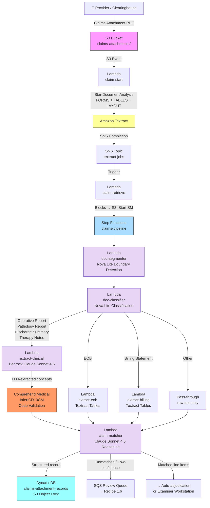

# Recipe 1.5: Claims Attachment Processing 🔴

**Complexity:** Complex · **Phase:** Phase 2 · **Estimated Cost:** ~$2.20–2.40 per 30-page claims package

<!-- [EDITOR: Corrected header cost from "$2.50–4.00" to "$2.20–2.40" to match the detailed per-component breakdown in the Prerequisites cost estimate. The $4.00 figure reflects 50-page packages; the header should represent the typical 30-page case.] -->

---

## The Problem

Imagine you're a claims examiner. A 38-page PDF lands in your queue. It's a claims attachment package from a provider supporting a surgical claim. You open it.

Page 1 is the last page of an operative report. Page 2 is the beginning of a pathology result, except it doesn't say "PATHOLOGY REPORT" at the top; it just starts with a gross description of the specimen. Pages 3 through 6 are a discharge summary, but pages 4 and 5 are printed sideways. Page 7 is a consent form that has nothing to do with the claim. Pages 8 through 12 are an Explanation of Benefits from the patient's secondary payer, printed from a payer web portal with their specific layout. Pages 13 and 14 are therapy notes from three different visits, all crammed into a continuous print job with no clear breaks. Page 15 is a billing statement, but it's from a different facility than the claim you're looking at.

Nobody assembled this thoughtfully. The provider's billing staff went into their EHR, selected everything that seemed relevant to the claim, hit print, and sent the whole stack through a fax machine. The output is a single PDF that contains somewhere between four and eight distinct logical documents, in no particular order, with no table of contents, and no cover sheet telling you what's in there.

Now the claims examiner has to do the following. Find the operative report. Confirm the CPT code documented in the operative note matches line item 1 on the claim (total knee arthroplasty, 27447). Find the pathology result and confirm there's a specimen consistent with the procedure. Find the EOB and check what the secondary payer paid, to determine coordination of benefits. Look at the therapy notes and verify the dates of service match the claim lines. Cross-reference the billing statement's itemized charges against what the provider billed on the 837 transaction.

This takes 30 to 60 minutes. For a complex surgical claim. And payers process hundreds of thousands of claims attachments annually.

Recipe 1.4 introduced the page classification and fan-out pattern for multi-page documents, along with the LLM reasoning layer that replaced keyword heuristics. That pattern works well when you're dealing with a submission that has a recognizable structure: cover sheet first, then clinical notes, maybe some labs. Prior auth submissions are still constrained. There's usually a cover sheet that anchors the document. The page types are limited. The total page count rarely exceeds 15.

Claims attachments are a different animal. They're larger (15 to 50 pages is typical). The document types are more varied. There's no cover sheet. And most critically: the package contains multiple independent documents that have been physically concatenated into one PDF. The documents have nothing to do with each other structurally. The page numbers in the PDF don't align with the page numbers in the individual documents. The formatting changes abruptly between documents because each was printed from a different source system.

The key capability this recipe builds on top of Recipe 1.4 is **document boundary detection**: figuring out where one logical document ends and the next begins before doing any classification or extraction. Get that wrong and everything downstream breaks. Misidentify a page boundary and you extract a hybrid document that's half operative report and half pathology result; neither extractor knows what to do with it.

And then there's the capstone problem. Claims aren't a single yes/no decision like prior auth. A surgical claim has six or seven line items. Each one needs independent documentation support. The question isn't "is this claim supported?" It's "which specific line items are supported, and which are missing?" For line item 1 (CPT 27447, total knee arthroplasty), does this operative report actually describe a total knee replacement? That question is pure reasoning. No rule-based system answers it reliably. An LLM does.

This is the claims attachment problem. It's harder than prior auth. Here's how LLMs make it tractable.

---

## The Technology

### The Multi-Document Concatenation Problem

When you look at a claims attachment PDF, you're seeing the result of a process that the sending system didn't design for machine readability. The provider's EHR or billing platform prints each document independently, then combines the pages into a single fax job. The resulting PDF has no logical structure that corresponds to the document boundaries. It's a flat page stream.

The technical challenge is that a flat page stream looks identical whether it contains one long document or six short documents back-to-back. The only signals available are what's printed on the pages themselves: headers, title lines, page numbering patterns, date stamps, facility names, and formatting discontinuities.

Document boundary detection is the process of analyzing those signals to infer where boundaries fall. It's probabilistic. It can be wrong. The design goal is not to be right 100% of the time; it's to be right often enough that the downstream classification and extraction pipeline handles the common cases automatically, and the failure modes are identifiable so they can route to human review.

### Signals for Document Boundary Detection

The most reliable signals, roughly ordered from strongest to weakest:

**Document title lines.** Many document types have characteristic title lines that appear at or near the top of the first page: "OPERATIVE REPORT," "PATHOLOGY REPORT," "DISCHARGE SUMMARY," "EXPLANATION OF BENEFITS." When a page has a strong document title in the first few lines, it's almost certainly the start of a new logical document. This is the most reliable single signal, when it's present. It's not always present.

**Header and footer discontinuity.** Each document typically has its own header: facility name, department, date range, patient name formatted according to that system's template. When the header on page N is materially different from the header on page N-1, a boundary likely exists between them. This requires extracting the header region (roughly the top 15% of each page) and comparing them. The comparison isn't exact string matching: the same facility might print its name with different abbreviations.

**Page number restart.** Many documents include explicit page numbering: "Page 1 of 6," "Page 2 of 6," etc. When a "Page 1" appears after a page that is not the end of a prior sequence, that's a reliable boundary signal. The complication: some documents don't number pages, some number them inconsistently, and some fax servers insert their own page count that overrides the document's.

**Date discontinuity.** Clinical documents are anchored to specific service dates. An operative report from March 15 followed by a discharge summary dated February 20 almost certainly represents a boundary, even if there's no other visual signal. Date discontinuities of more than a few days are worth flagging. This requires date extraction from the page text, which has its own noise: date formats vary, and some pages contain multiple dates.

**Format discontinuity.** An abrupt change in font density, column layout, or the presence/absence of table structure can indicate a boundary. This is the weakest signal but sometimes the only one available.

Here's the thing about building a rule-based system to evaluate all of this: you end up writing separate rules for each signal type, tuning thresholds for each, and dealing with the interactions between them. What happens when a page restart fires but the header didn't change? What happens when the date jumps but the header looks the same? You need a priority ordering. You need override logic. You need to test and re-tune every time a new payer sends a non-standard format.

Or you can send the page pair to a language model and ask it to evaluate all of these signals simultaneously, the same way a human would. A model trained on vast amounts of clinical and administrative text understands what an operative report header looks like versus a pathology report header. It understands that "Page 1 of 4" after a run of numbered pages means something. It can reason about date context in a way that a regex pattern cannot. This is where LLMs genuinely shine: judgment calls that require weighing multiple imperfect signals at once.

### Why Document-Level Classification Beats Page-Level

Recipe 1.4 classifies each page individually, then routes pages to extractors. That works for prior auth submissions because each page in a prior auth is effectively its own document type. An imaging report is usually one or two pages. A clinical note is one page. The page-level is close enough to the document-level.

Claims attachments break this assumption. An operative report is four to eight pages of continuous narrative. A pathology report is two to four pages. A discharge summary is three to six pages. If you classify these page-by-page, you'll correctly classify the first page of each (it has the title line and strong keyword signals) but misclassify the middle and ending pages (they're dense clinical prose without the header signals that make the first page identifiable).

The right unit of classification for claims attachments is the logical document, not the page. Once you've run boundary detection and know that pages 3 through 7 form a single logical document, you can look at all five pages together when classifying. The classifier has the full operative report vocabulary available, not just whatever happened to appear on page 5 in isolation.

This also resolves an LLM-specific advantage: with full document context, the model can recognize not just what type of document this is, but what specific evidence it contains. Knowing that pages 1 to 6 are an operative report for a total knee arthroplasty is more useful than knowing that page 3 is "a clinical page."

### The Document Type Taxonomy

Claims attachments can contain more document types than prior auth submissions. The taxonomy for this recipe covers the most common ones:

**Operative reports.** Structured clinical narrative of a surgical procedure. Sections include preoperative diagnosis, postoperative diagnosis, procedure performed, anesthesia, findings, operative technique, estimated blood loss, specimens sent, and surgeon attestation. The procedure performed section is what links the document to claim line items.

**Pathology and histology reports.** Results of specimen analysis after surgical resection or biopsy. These documents link to surgical claim lines indirectly: they confirm that specimens described in the operative report were sent for analysis and what was found.

**Discharge summaries.** Multi-page clinical narrative covering the full hospital episode: admitting diagnosis, hospital course, consultations, procedures performed, discharge diagnosis, discharge medications, and follow-up instructions. Relevant to DRG-based facility claims and post-acute claims.

**Explanation of Benefits from other payers.** When a patient has coordination of benefits across two payers, the primary payer's EOB becomes a claims attachment for the secondary payer. These documents have table-heavy layouts specific to each payer: service lines, billed amounts, allowed amounts, plan paid amounts, patient responsibility, and denial codes.

**Therapy notes and progress notes.** Visit-level clinical documentation from physical therapy, occupational therapy, speech therapy, or outpatient mental health. A claims attachment package may contain multiple visit notes from different dates with no separator. The claim lines they support are visit-level CPT codes, so the date of service match is critical.

**Billing statements and itemized charges.** Provider-generated financial documents showing the breakdown of charges for the episode. Line items typically include service date, procedure code, revenue code, charge amount, and facility cost center.

**Other.** Consent forms, referral letters, prior auth approvals, face sheets, and other administrative documents that end up in attachment packages by accident.

### Claim Line Item Matching: The Reasoning Problem

Here's what distinguishes claims attachment processing from prior auth in terms of what the downstream system actually needs. With prior auth, the goal is to produce a single clinical evidence record that supports or doesn't support one requested service. There's one CPT code being evaluated.

Claims have multiple line items. A surgical claim might have six lines: the primary procedure, anesthesia, one or more modifiers for assistant surgeon or bilateral, a pathology code, and a post-operative visit. Each line item needs to be supported by documentation.

Claim line item matching is the process of linking the extracted data from each document back to the relevant claim lines. The rule-based approach to this matching uses a keyword lookup table: a dictionary mapping CPT codes to procedure description variants. CPT 27447 maps to "total knee arthroplasty," "total knee replacement," and "TKA." If any of those strings appear in the operative report's procedure section, the line is considered supported.

That approach works on well-behaved operative reports. It fails on:

- Reports that describe the procedure without using the standard terminology ("replacement of the tibial and femoral articular surfaces with cemented prosthetic components" is 27447, but there's no rule for that)
- Bilateral procedures where one claim line covers both sides
- Compound CPT codes with modifiers that change the documentation requirements
- Unlisted procedure codes where the description is the only guide to what was done

The claim line matching problem is fundamentally a reasoning task. "Does this operative report support CPT code 27447?" is the same question a medical necessity reviewer would ask. You need to understand what 27447 is, read the operative report, and reason about whether what's described matches what was billed.

An LLM with clinical knowledge can do this. You show it the operative report text and the claim line, and ask: does this procedure description support this CPT code? The model reasons from its training on clinical documentation and medical coding to give you an assessment with supporting evidence. No lookup table needed. No edge cases for standard variant descriptions.

### The General Architecture Pattern

<!-- [EDITOR: Removed vendor-specific model names (Nova Lite, Claude Sonnet, Textract, Bedrock) from this section per RECIPE-GUIDE.md requirement: "No vendor names in this section. Concepts only. A reader using GCP, Azure, or on-premises should learn something valuable here." Vendor names re-enter in the AWS Implementation section.] -->

The pipeline has four stages, building directly on Recipe 1.4's hybrid pattern.

**Stage 1: Full-document extraction.** Async OCR and document analysis on the entire PDF produces text, form fields, tables, and layout structure for every page. Same as Recipe 1.4.

**Stage 2: LLM document boundary detection.** The page stream is analyzed for boundaries by feeding consecutive page pairs to a lightweight model. The model evaluates each pair and answers: same document or different? The output is a list of logical document segments.

**Stage 3: LLM document classification and extraction.** Each logical document is classified by sending its full text to a language model. Classified documents fan out to type-specific extractors. Clinical documents go through an LLM for content extraction. Financial documents (EOBs and billing statements) go through structured table parsing.

**Stage 4: LLM claim line matching and assembly.** The extraction results from all segments are matched against the claim's line items using LLM reasoning. The model is asked, per clinical document, which claim lines it supports and why. The final record identifies which lines have documentation support and which don't.

```
[Claims Attachment Arrives] → [Full Document Extraction (OCR + Structure)]
                                              ↓
                                  [Group Blocks by Page]
                                              ↓
                  [LLM Boundary Detection: Tier 1 LLM per page pair]
                  ("Same document or different? Evaluate all signals.")
                                              ↓
                          [Logical Document Segments]
                          (pages 1-4, pages 5-6, pages 7-12...)
                                              ↓
                  [LLM Document Classification: Tier 1 LLM per segment]
                  (full document context, not single-page snippets)
                                              ↓
     ┌──────────┬──────────┬──────────┬──────────┬──────────┐
     ↓          ↓          ↓          ↓          ↓          ↓
[Clinical    [Clinical  [EOB        [Clinical  [Clinical [Billing
 Document    Document   Extractor:  Document   Document  Statement:
 LLM]        LLM]       Structured  LLM]       LLM]      Structured
                        Table                            Table
                        Parser]                          Parser]
     ↓          ↓          ↓          ↓          ↓          ↓
     └──────────┴──────────┴──────────┴──────────┴──────────┘
                                              ↓
             [LLM Claim Line Matching: Tier 3 LLM per clinical document]
             ("Does this operative report support CPT 27447?")
                                              ↓
                   [Unified Claims Attachment Record]
                                              ↓
          ┌────────────────────────────────────────────┐
          ↓                                            ↓
 [Downstream: Auto-adjudication              [Unmatched / Low-Confidence:
  or Examiner Workstation]                    Human Review Queue]
```

The model tiering is deliberate. Boundary detection is a binary question per page pair: is this a new document or not? A lightweight Tier 1 model handles it reliably and cheaply. Document classification gives the LLM a full document's worth of text; the Tier 1 model works here too. Claim line matching is where complex clinical reasoning happens: understanding what a CPT code means, reading a procedure description, and assessing equivalence across terminology variations. That's a Tier 3 task.

This is the architectural breakthrough in this recipe versus the rule-based approach it replaces: boundary detection by LLM reasoning, classification by LLM reasoning, and claim matching by LLM reasoning. OCR still handles the text extraction. But the intelligence layer is now end-to-end LLM.

<!-- [EDITOR: Changed "Textract still does the OCR" to "OCR still handles the text extraction": Textract is an AWS-specific name and this is the vendor-neutral Technology section. Also changed "Recipe 1.5 versus its predecessor" to "this recipe versus the rule-based approach it replaces" for clarity.] -->

---

## The AWS Implementation

### Why These Services

**Amazon Textract with LAYOUT feature type.** Unchanged from Recipe 1.4. Textract is still the right tool for OCR and structural extraction. LAYOUT blocks provide section headers, title blocks, and body paragraph structure that the boundary detection LLM uses as context alongside the page text. FORMS + TABLES + LAYOUT covers structured forms, tabular data (EOBs, billing statements), and general document structure.

**Amazon Bedrock (Nova Lite) for boundary detection and classification.** The Converse API introduced in Recipe 1.4 makes it easy to call any Bedrock model with the same code. Nova Lite (`us.amazon.nova-lite-v1:0`) is the right model for boundary detection: it's a well-defined binary question per page pair, and Nova Lite handles it reliably at $0.06 per million input tokens. At a 30-page package generating 29 page pair comparisons, the boundary detection cost is roughly three cents of tokens. The same model handles document classification, where it evaluates full document text against the taxonomy.

**Amazon Bedrock (Claude Sonnet 4.6) for claim line matching.** Claim line matching requires genuine clinical reasoning: understanding what a CPT code describes, reading a procedure narrative, and making a judgment about whether they match. This is a Tier 3 task. Claude Sonnet 4.6 (`us.anthropic.claude-sonnet-4-6-v1:0`) handles it well and produces assessments with supporting evidence that the downstream assembler can surface to examiners.

<!-- [EDITOR: Added "4.6" to "Claude Sonnet" throughout the AWS Implementation section per task requirement: "Model names should include version numbers in pricing/capability contexts."] -->

**Amazon Comprehend Medical for ICD-10 code validation on clinical documents.** The same hybrid approach as Recipe 1.4: the LLM extracts clinical concepts from operative reports, pathology reports, and discharge summaries. Comprehend Medical maps those concepts to authoritative ICD-10 codes. LLMs are good at extracting clinical meaning. They're less reliable for producing exact, consistent medical codes. Keep `InferICD10CM` in the pipeline for code validation.

**AWS Step Functions (Standard Workflows).** The pipeline has more branches than Recipe 1.4. Boundary detection introduces conditional logic, and the claim line matching step needs results from all the type-specific extractors before it can run. Step Functions handles parallel extraction branches, waits for all of them, then runs the assembly and matching step. Standard Workflows over Express because the execution history in the console is how you debug a misclassified 38-page package. The audit trail is also a claims processing compliance requirement.

**Amazon S3, DynamoDB, SNS, SQS, and KMS.** Same patterns as Recipe 1.4. PHI in transit and at rest. Step Functions payload limit workaround via S3 references. S3 Object Lock in compliance mode for claims records retention.

### Architecture Diagram



### Prerequisites

| Requirement | Details |
|-------------|---------|
| **AWS Services** | Everything from Recipes 1.2, 1.3, and 1.4 (Textract, S3, Lambda, SNS, DynamoDB, KMS, Comprehend Medical, Step Functions, Bedrock), plus S3 Object Lock for retention compliance |
| **IAM Permissions** | All permissions from Recipe 1.4, plus: `s3:PutObjectLegalHold` and `s3:PutObjectRetention` for S3 Object Lock on the claims records bucket. The assembler Lambda needs these to lock records after writing them. `bedrock:InvokeModel` on both Nova Lite and Claude Sonnet 4.6 model ARNs. |
| **Bedrock Model Access** | Nova Lite and Claude Sonnet 4.6 must be enabled in the Bedrock console. Cross-region inference profiles (`us.amazon.nova-lite-v1:0`, `us.anthropic.claude-sonnet-4-6-v1:0`) route to the best available region automatically. Enable both before deploying. If your organization has state-level geographic data restrictions beyond HIPAA, evaluate using direct single-region model ARNs (without the `us.` prefix) rather than cross-region inference profiles. |
| **Step Functions** | Standard Workflows (not Express). Execution history retention is a claims processing compliance requirement. Visual execution graph is essential for debugging boundary detection failures on complex packages. |
| **BAA** | AWS BAA signed. Claims attachments contain some of the most sensitive PHI categories: surgical operative notes, pathology results with cancer diagnoses, full-episode discharge summaries, and financial responsibility data. Bedrock, Textract, and Comprehend Medical are all HIPAA-eligible under the same BAA. |
| **Encryption** | S3: SSE-KMS with customer-managed key. S3 Object Lock in compliance mode on the claims-attachment-records bucket. DynamoDB: encryption at rest. All API calls over TLS. Step Functions execution history: SSE. Bedrock and Comprehend Medical do not retain or train on customer data sent via their APIs. |
| **VPC** | Production: all Lambdas in a VPC with VPC endpoints for S3 (gateway), Textract, DynamoDB, SNS, SQS, Comprehend Medical, Step Functions, CloudWatch Logs, and KMS. Bedrock requires **two separate interface endpoints**: `com.amazonaws.REGION.bedrock-runtime` (Converse API, used by all Lambda functions in this recipe) and `com.amazonaws.REGION.bedrock` (model management API, needed only if Lambda programmatically enables or lists models). A VPC with only `com.amazonaws.REGION.bedrock` will fail to route Converse API calls through the private endpoint; in a HIPAA-compliant VPC with no internet egress, this is deployment-breaking. For this recipe, `bedrock-runtime` is the required endpoint. Claims data should not traverse the public internet. <!-- [EDITOR: review fix P0-2] Separated `bedrock` and `bedrock-runtime` VPC endpoints. Same fix as Recipe 1.4 v3. Missing `bedrock-runtime` causes silent Converse API failures in no-egress HIPAA VPCs. --> |
| **Lambda Timeouts** | Lambda's default 3-second timeout fails on the first Bedrock call. This recipe makes approximately 40 Bedrock calls per 30-page package (29 boundary pairs + 5 classifications + 3–4 clinical extractions + 3–4 claim matching calls), so timeout configuration matters more here than in Recipe 1.4. Minimum recommended timeouts per function: `doc-segmenter` 5–10 minutes (29 sequential Nova Lite calls at ~300ms each, plus retry margin), `doc-classifier` 3–5 minutes, `extract-clinical` 5 minutes (one Sonnet call per document, possible retry), `claim-matcher` 5 minutes per clinical document, `claim-assembler` 2 minutes. Step Functions also enforces a state-level timeout independently; configure both. Use provisioned concurrency for time-sensitive claims packages. <!-- [EDITOR: review fix P0-3] Added per-function Lambda timeout requirements. Default 3-second timeout fails on any LLM call. Per-function minimums reflect ~40 Bedrock calls per package, materially higher than Recipe 1.4. --> |
| **CloudTrail** | Enabled for all services including Bedrock. Bedrock model invocations are logged with model ID, token counts, and latency. Every extraction, every Bedrock call, and every DynamoDB write needs to be in the audit trail. |
| **Sample Data** | CMS publishes [sample 837 transactions](https://www.cms.gov/medicare/coding-billing/electronic-billing-edi/transaction-code-sets) for claim line item reference. Build synthetic multi-document PDFs by concatenating an operative report template, a pathology report, a discharge summary, a payer EOB printout, and therapy notes. Never use real PHI in development. |
| **Cost Estimate** | Textract async (FORMS+TABLES+LAYOUT, 30 pages): ~$2.10. Nova Lite boundary detection (29 page pairs at ~500 tokens each): ~$0.003, negligible. Nova Lite document classification (5 documents at ~2,000 tokens each): ~$0.001, negligible. Claude Sonnet 4.6 claim matching (3 clinical documents × one call each with claim lines): ~$0.05–0.12. Comprehend Medical ICD-10 validation on extracted concepts: ~$0.02–0.08. Step Functions Standard Workflows: ~$0.002. Per-package total: roughly **$2.20–2.40 for a typical 30-page package**. At 300,000 packages per year: $660K–720K. At 500,000: $1.1M–1.2M. Compare to manual attachment review at 30–60 minutes per case at $35–55/hour loaded cost: at 500,000 packages, manual review runs $8.75M–27.5M per year. The LLM approach is actually *cheaper* than a comparable Comprehend Medical per-character billing pipeline while producing richer output. |

### Ingredients

| AWS Service | Role |
|------------|------|
| **Amazon Textract** | Full document extraction on the entire PDF: FORMS, TABLES, and LAYOUT blocks across all pages |
| **Amazon Bedrock (Nova Lite)** | Document boundary detection (binary page-pair comparison) and document-level classification |
| **Amazon Bedrock (Claude Sonnet 4.6)** | Clinical document content extraction and claim line item reasoning |
| **Amazon Comprehend Medical (InferICD10CM)** | ICD-10 code validation on LLM-extracted clinical concepts from operative reports and discharge summaries |
| **AWS Step Functions (Standard Workflows)** | Orchestrates the segment → classify → extract → match → assemble pipeline |
| **Amazon S3** | Stores incoming attachment PDFs, intermediate Textract output, per-document extraction results, and final attachment records |
| **S3 Object Lock** | Compliance-mode retention lock on final claims records to meet CMS and state retention mandates |
| **AWS Lambda** | claim-start, claim-retrieve, doc-segmenter, doc-classifier, extract-clinical, extract-eob, extract-billing, claim-matcher, claim-assembler |
| **Amazon SNS** | Receives Textract async job completion notification; triggers the claim-retrieve Lambda |
| **Amazon SQS** | Dead letter queues on all Lambdas; review queue for unclassified documents and low-confidence segments |
| **Amazon DynamoDB** | Stores structured claims attachment records indexed by claim ID; PHI encrypted at rest |
| **AWS KMS** | Customer-managed encryption keys for S3, DynamoDB, and Step Functions execution history |
| **Amazon CloudWatch** | Logs, metrics, and alarms for pipeline failures, Bedrock token usage, boundary detection accuracy, and cost per package |

<!-- [EDITOR: Updated "Amazon Bedrock (Claude Sonnet)" to "Amazon Bedrock (Claude Sonnet 4.6)" in Ingredients table.] -->

### Code

> **Reference implementations:** These AWS sample repos demonstrate the patterns used in this recipe:
>
> - [`aws-ai-intelligent-document-processing`](https://github.com/aws-samples/aws-ai-intelligent-document-processing): Comprehensive IDP solutions with multi-stage extraction pipelines, document classification, A2I human review integration, and generative AI enrichment
> - [`amazon-textract-and-amazon-comprehend-medical-claims-example`](https://github.com/aws-samples/amazon-textract-and-amazon-comprehend-medical-claims-example): Healthcare-specific extraction and validation with Textract and Comprehend Medical, with CloudFormation deployment templates
> - [`document-processing-pipeline-for-regulated-industries`](https://github.com/aws-samples/document-processing-pipeline-for-regulated-industries): Document processing for regulated industries with lineage and pipeline metadata services
> - [`amazon-textract-and-comprehend-medical-document-processing`](https://github.com/aws-samples/amazon-textract-and-comprehend-medical-document-processing): Workshop-style repo for multi-stage medical document processing pipelines with Lambda orchestration

#### Walkthrough

**Steps 1 and 2: Async Textract extraction and result retrieval.** These steps are identical to Recipe 1.4. Include LAYOUT in the `FeatureTypes` list. The `claim-start` Lambda submits the async job and exits. The `claim-retrieve` Lambda fires on the SNS completion notification, retrieves all Textract result pages, writes the raw block list to S3, and starts the Step Functions state machine with the S3 key and the claim ID.

```
FUNCTION retrieve_and_handoff(textract_job_id, attachment_key, claim_id, state_machine_arn):
    // Retrieve all Textract blocks (same paginated call as Recipe 1.4)
    all_blocks = retrieve_all_textract_blocks(textract_job_id)

    // Write raw blocks to S3. Step Functions has a 256 KB payload limit.
    // A 40-page document's Textract output can easily exceed that.
    textract_output_key = "textract-outputs/" + textract_job_id + "/blocks.json"
    write all_blocks to S3 at textract_output_key

    // Start the pipeline state machine.
    // Pass references only, not raw data, through Step Functions.
    // The claim_id links this attachment to the claim line items for matching.
    start Step Functions execution at state_machine_arn with input:
        attachment_key       = attachment_key
        textract_output_key  = textract_output_key
        textract_job_id      = textract_job_id
        claim_id             = claim_id
```

**Step 3: Group Textract blocks by page.** Same grouping logic as Recipe 1.4: read blocks from S3, iterate, group by `Page` attribute, assemble page text from LINE blocks, note structural features per page. See Recipe 1.4 for the full pseudocode.

The one addition: extract the **header region** for each page. The header is the top portion of the page (roughly the first 15% by vertical position) where facility name, document title, patient identifier, and date typically live. The boundary detection model uses this region as context.

```
FUNCTION extract_header_region(page_blocks):
    // Textract bounding boxes are normalized: Top=0.0 is top of page, Top=1.0 is bottom.
    // "Header region" = Top < 0.15 (the top 15% of the page).
    header_lines = empty list

    FOR each block in page_blocks:
        IF block.BlockType == "LINE":
            IF block.Geometry.BoundingBox.Top < 0.15:
                header_lines.append(block.Text)

    RETURN join(header_lines, "\n")

// Add this to group_blocks_by_page() from Recipe 1.4:
// pages[page_num].header_text = extract_header_region(page's blocks)
```

**Step 4: LLM boundary detection.** This is the novel step in this recipe, and it's where the LLM approach pays off most directly.

The boundary detector sends consecutive page pairs to Nova Lite and asks: are these from the same document? The model evaluates all available signals simultaneously: header content, document title lines, page numbering patterns, date changes, and format shifts. No separate rules for each signal type. No threshold tuning per signal. The model reasons the way a human would: "the header changed from 'Memorial Hospital OR' to 'Valley Pathology Lab,' and the text shifted from operative narrative to specimen gross description. These are from different documents."

The output is a list of logical document segments, each defined by a start page, end page, and the model's reasoning for why a boundary was detected.

```
BOUNDARY_DETECTION_SYSTEM_PROMPT = """
You are a healthcare document analyst. Your job is to determine whether two consecutive
pages from a claims attachment PDF belong to the same logical document.

A claims attachment package contains multiple distinct documents faxed together:
operative reports, pathology reports, discharge summaries, EOBs, therapy notes,
billing statements, and others. Your job is to detect where one document ends
and the next begins.

Return ONLY a valid JSON object with these fields:
{
  "same_document": <true or false>,
  "confidence": <0.0 to 1.0>,
  "reasoning": "<one to two sentences explaining your determination>",
  "signals_detected": ["<list any signals you used: title_change, header_change,
                        page_restart, date_discontinuity, format_shift, content_type_change>"]
}

Common boundary signals to evaluate:
- Title lines: Does either page have a document title (OPERATIVE REPORT, PATHOLOGY REPORT,
  DISCHARGE SUMMARY, EXPLANATION OF BENEFITS) near the top? A title at the top of page 2
  almost always means a new document started.
- Header changes: Does the facility name, department, or document template change between
  pages? "Memorial Hospital Surgery" to "Valley Pathology Lab" is a boundary.
- Page number restart: Does page 2 show "Page 1 of N"? That means a new document started.
- Date discontinuity: Does the primary date change by more than a few days between pages?
  (Allow multi-day spans for discharge summaries, which cover entire admissions.)
- Content type shift: Does the text shift from clinical narrative to financial tables
  or from one clinical specialty to a completely different one?

Be conservative: when in doubt, return same_document: true. A missed boundary causes
extraction errors. A false boundary causes a document to be split, which is less harmful
(the two halves will both classify and extract, just separately).
"""

FUNCTION detect_boundary_at_page_pair(page_n, page_n_plus_1, model_id):
    // Sanitize OCR text before passing to LLM. External documents (provider submissions)
    // are untrusted input. Strip control characters, null bytes, and anomalous Unicode
    // sequences that could be used for prompt injection.
    page_n_text   = strip_control_characters(page_n.text)
    page_n_text   = remove_null_bytes(page_n_text)
    page_np1_text = strip_control_characters(page_n_plus_1.text)
    page_np1_text = remove_null_bytes(page_np1_text)

    // Build the user message with both pages' content.
    // Include header text separately because it's the strongest boundary signal.
    user_message = "Page " + page_n.page_num + ":\n"
    user_message += "Header: " + (page_n.header_text if page_n.header_text else "(none)") + "\n"
    user_message += "Text:\n" + first_1500_characters(page_n_text) + "\n\n"
    user_message += "---\n\n"
    user_message += "Page " + page_n_plus_1.page_num + ":\n"
    user_message += "Header: " + (page_n_plus_1.header_text if page_n_plus_1.header_text else "(none)") + "\n"
    user_message += "Text:\n" + first_1500_characters(page_np1_text) + "\n\n"
    user_message += "Do these two pages belong to the same document?"

    response = call Bedrock Converse API with:
        modelId         = model_id  // "us.amazon.nova-lite-v1:0"
        system          = [{ text: BOUNDARY_DETECTION_SYSTEM_PROMPT }]
        messages        = [{ role: "user", content: [{ text: user_message }] }]
        inferenceConfig = { maxTokens: 256, temperature: 0 }

    response_text = response.output.message.content[0].text
    result        = parse JSON from response_text

    RETURN result


FUNCTION detect_all_boundaries(pages, boundary_model_id):
    // Walk the page stream in order, testing each consecutive pair.
    // Result: list of { start_page, end_page, boundary_signals, confidence }
    segments       = empty list
    seg_start      = 1
    sorted_page_nums = sort(keys of pages)

    FOR i from 0 to len(sorted_page_nums) - 2:
        page_n        = pages[sorted_page_nums[i]]
        page_n_plus_1 = pages[sorted_page_nums[i + 1]]

        result = detect_boundary_at_page_pair(page_n, page_n_plus_1, boundary_model_id)

        log: "Pages " + page_n.page_num + "/" + page_n_plus_1.page_num
             + ": same=" + result.same_document
             + " (conf=" + result.confidence + ")"
             // [EDITOR: review fix P1-5] Removed result.reasoning from log.
             // Boundary reasoning for healthcare documents routinely echoes clinical content
             // from the page text (facility names, document titles, clinical terms).
             // In Lambda, stdout writes to CloudWatch Logs. Omit reasoning to prevent PHI exposure.

        // If the model says these are from different documents, close the current segment
        // and start a new one at page_n_plus_1.
        IF NOT result.same_document:
            segments.append({
                start_page:       seg_start,
                end_page:         page_n.page_num,
                boundary_signals: result.signals_detected,
                split_confidence: result.confidence,
                split_reasoning:  result.reasoning
            })
            seg_start = page_n_plus_1.page_num

    // Close the final segment
    segments.append({
        start_page:       seg_start,
        end_page:         sorted_page_nums[-1],
        boundary_signals: ["end_of_document"],
        split_confidence: 1.0,
        split_reasoning:  "Final segment in package"
    })

    log: "Detected " + len(segments) + " document segments in " + len(pages) + " pages"
    FOR each segment in segments:
        log: "  Segment: pages " + segment.start_page + "-" + segment.end_page

    RETURN segments
```

A few notes on the design. We use 1,500 characters of each page's text (not the full page) to keep token costs low. The first 1,500 characters of a page almost always contain the signals that distinguish a new document from a continuation: title lines, headers, page numbers, and the opening sentence that establishes the document type. We ask the model to be conservative toward `same_document: true`. A missed boundary (two documents merged into one segment) causes extraction errors downstream, but those errors are detectable. A false boundary (one document split into two) causes the segment to classify and extract as a partial document, which is less harmful and usually still produces useful output.

> **Safe default for boundary detection failures:** If a page pair comparison fails after retries, the safe default is `same_document: true` (treat the pages as part of the same document and continue). A missed boundary causes the downstream classifier to receive a larger-than-expected segment, which it can still process. A false boundary splits a document, which causes extraction to miss cross-page context. The conservative choice (same_document on failure) is less harmful than the aggressive choice (new_document on failure).

**Step 5: LLM document classification.** After boundary detection, we have a list of logical document segments. Each segment gets classified as a unit by sending its full aggregated text to Nova Lite.

Recipe 1.4 introduced the classification prompt pattern for individual pages. Here we extend it to whole documents. The LLM has more context now: instead of classifying page 5 of an operative report in isolation (dense clinical prose with no title line), it classifies pages 3 through 7 together and has the full operative report vocabulary to work with.

```
DOCUMENT_CLASSIFICATION_SYSTEM_PROMPT = """
You are a healthcare document classifier. Your job is to identify what type of
document is contained in a claims attachment segment.

Return ONLY a valid JSON object with these fields:
{
  "doc_type": "<one of: operative_report, pathology_report, eob, discharge_summary,
               therapy_notes, billing_statement, other>",
  "confidence": <0.0 to 1.0>,
  "primary_date": "<most prominent date in this document, in YYYY-MM-DD format,
                   or null if not found>",
  "reasoning": "<one sentence explaining your classification>"
}

Document types:
- operative_report: surgical procedure narrative. Has sections: preoperative diagnosis,
  postoperative diagnosis, procedure performed, anesthesia, findings, operative technique,
  specimens. Written by a surgeon.
- pathology_report: specimen analysis results. Has sections: gross description, microscopic
  description, diagnosis. Written by a pathologist. Often references specimens from surgery.
- eob: Explanation of Benefits from a payer. Financial document with service lines showing
  billed amounts, allowed amounts, plan paid, and patient responsibility. Table-heavy layout.
- discharge_summary: covers a full hospital episode. Has sections: admitting diagnosis,
  hospital course, procedures performed, discharge diagnosis, discharge medications,
  follow-up instructions.
- therapy_notes: physical, occupational, or speech therapy visit documentation. Usually
  shorter (1-2 pages per visit). May include multiple visit notes in sequence.
- billing_statement: provider-generated itemized charges. Shows service dates, procedure
  codes, charges, and account balance. Financial document from the provider side.
- other: consent forms, referral letters, face sheets, administrative documents.

Use confidence 0.9 or higher only when the classification is unambiguous (clear title,
recognizable section structure, or both). Use 0.7-0.89 for likely classifications.
Below 0.7 for genuinely uncertain documents.
"""

FUNCTION classify_segment_with_llm(segment, all_pages, classification_model_id):
    // Aggregate text from all pages in this segment
    segment_text = empty string
    has_tables   = false

    FOR each page_num from segment.start_page to segment.end_page:
        segment_text += all_pages[page_num].text + "\n"
        IF all_pages[page_num].has_tables:
            has_tables = true

    // Include a note about table presence; it's a strong EOB and billing statement signal
    table_note = ""
    IF has_tables:
        table_note = "Note: This document contains one or more tables.\n\n"

    user_message = table_note + "Document text (pages "
                 + segment.start_page + " to " + segment.end_page + "):\n\n"
                 + first_4000_characters(segment_text)

    response = call Bedrock Converse API with:
        modelId         = classification_model_id  // "us.amazon.nova-lite-v1:0"
        system          = [{ text: DOCUMENT_CLASSIFICATION_SYSTEM_PROMPT }]
        messages        = [{ role: "user", content: [{ text: user_message }] }]
        inferenceConfig = { maxTokens: 256, temperature: 0 }

    response_text = response.output.message.content[0].text
    result        = parse JSON from response_text

    log: "Segment pages " + segment.start_page + "-" + segment.end_page
         + " → " + result.doc_type
         + " (conf=" + result.confidence + ")"
         // [EDITOR: review fix P1-5] Removed reasoning from log. Classification reasoning
         // can include document title text that contains facility name or patient identifiers.
         // Log doc_type and confidence only; omit reasoning to keep CloudWatch Logs PHI-free.

    RETURN {
        start_page:      segment.start_page,
        end_page:        segment.end_page,
        doc_type:        result.doc_type,
        confidence:      result.confidence,
        primary_date:    result.primary_date,
        reasoning:       result.reasoning,
        boundary_signals: segment.boundary_signals
    }


FUNCTION classify_all_segments(segments, all_pages, classification_model_id):
    classified = empty list
    FOR each segment in segments:
        classified_segment = classify_segment_with_llm(
            segment, all_pages, classification_model_id
        )
        classified.append(classified_segment)
    RETURN classified
```

**Step 6: Fan out to type-specific extractors.** Each classified document segment routes to the appropriate extractor. The routing follows two main paths, mirroring Recipe 1.4's two-path fan-out.

Clinical documents (operative reports, pathology reports, discharge summaries, therapy notes) go through the Bedrock clinical extractor: a Claude Sonnet 4.6 call that extracts structured clinical content from the full segment text. This is the same pattern as Recipe 1.4's clinical page extractor, now operating on multi-page documents.

Financial documents (EOBs and billing statements) go through Textract table parsing. These are table-heavy financial records; an LLM adds no value over well-tuned table extraction. This is the "right tool for the job" principle from Recipe 1.4 applied again: don't route a table to an LLM when Textract is purpose-built for exactly this.

> **Why not skip OCR and send everything to the LLM?** Vision LLMs handle document understanding well but struggle with faithful numerical extraction from tables. Industry testing consistently shows that LLMs silently replace missing table values with plausible guesses, transpose digits, and rename headers: errors that look correct on review but corrupt downstream calculations. For financial documents like EOBs and billing statements, where dollar amounts and procedure codes must be exact, purpose-built OCR remains more reliable. This recipe uses OCR for extraction and LLMs for intelligence: the same hybrid architecture that the document processing industry is converging on as best practice [1][2][3].

```
CLINICAL_EXTRACTION_SYSTEM_PROMPT = """
You are a clinical documentation analyst reviewing a claims attachment document.
Extract all clinically and administratively relevant information.

Return ONLY a valid JSON object with this structure:
{
  "document_summary": "<one to two sentences describing what this document is>",
  "diagnoses": ["<primary and secondary diagnoses as documented>"],
  "procedures_performed": ["<procedures or treatments documented, with laterality if present>"],
  "explicit_cpt_codes": ["<any CPT codes explicitly written in the document>"],
  "service_dates": ["<all dates of service mentioned, in YYYY-MM-DD format>"],
  "provider_name": "<treating or performing provider name if present>",
  "provider_npi": "<NPI number if present>",
  "facility": "<facility or practice name if present>",
  "specimens_sent": ["<any specimens sent to pathology, if operative report>"],
  "clinical_findings": "<key clinical findings, lab values, or imaging results>",
  "confidence": <0.0 to 1.0>
}

Extract only what is explicitly stated. Do not infer or add information not present
in the text. If a field has no content, use an empty list or empty string.
For explicit_cpt_codes, include only codes explicitly written as numbers (e.g., '27447'),
not procedure names.
"""

FUNCTION extract_clinical_document(segment, all_pages, clinical_model_id):
    // Aggregate full text across all pages in the segment
    segment_text = aggregate text from segment.start_page to segment.end_page in all_pages

    response = call Bedrock Converse API with:
        modelId         = clinical_model_id  // "us.anthropic.claude-sonnet-4-6-v1:0"
        system          = [{ text: CLINICAL_EXTRACTION_SYSTEM_PROMPT }]
        messages        = [{
            role:    "user",
            content: [{ text: "Extract clinical information from this "
                              + segment.doc_type + " document:\n\n"
                              + first_8000_characters(segment_text) }]
        }]
        inferenceConfig = { maxTokens: 1024, temperature: 0 }

    response_text  = response.output.message.content[0].text
    llm_extraction = parse JSON from response_text

    // Validate ICD-10 codes on the extracted diagnoses
    // LLMs extract the concept; Comprehend Medical maps the authoritative code.
    icd10_accepted = empty list
    icd10_flagged  = empty list
    IF llm_extraction.diagnoses is not empty:
        diagnosis_text = join(llm_extraction.diagnoses, ". ")
        icd10_accepted, icd10_flagged = infer_icd10_codes(diagnosis_text)
        // See Recipe 1.3 for infer_icd10_codes implementation

    RETURN {
        doc_type:        segment.doc_type,
        start_page:      segment.start_page,
        end_page:        segment.end_page,
        primary_date:    segment.primary_date,
        llm_extraction:  llm_extraction,
        icd10_codes:     icd10_accepted,
        icd10_flagged:   icd10_flagged,
        confidence:      llm_extraction.confidence * 100
    }


// EOB extraction uses Textract table parsing, not the LLM.
// See the original Recipe 1.5 pseudocode for the full EOB column mapping
// and table normalization logic. The EOB extractor is unchanged:
// it's financial tabular data that Textract handles better than an LLM.
FUNCTION extract_financial_document(segment, all_pages, block_map):
    // Aggregate table blocks from all pages in this segment
    // Parse tables, normalize column headers, return structured service lines
    // (Same pattern as before; financial tables don't benefit from LLM reasoning)
    ... (same Textract table parsing as original recipe's extract_eob / extract_billing_statement)
```

**Step 7: Claim line item matching via LLM reasoning.** This is the capstone of the recipe and where the LLM approach provides the most dramatic improvement over rule-based matching.

The rule-based approach maintained a `CPT_PROCEDURE_DESCRIPTIONS` lookup table mapping codes to known description variants. That table needed manual maintenance, missed non-standard descriptions, and failed completely on unlisted procedure codes. We're replacing it with a single Claude Sonnet 4.6 call per clinical document: here are the claim lines; which ones does this document support?

The model reasons from clinical knowledge. It knows that "cemented total condylar knee replacement" describes 27447. It knows that "left total hip" on an operative report with a CPT code of 27130 is a match. It can flag when a procedure description sounds like a related but distinct code (for example, a partial knee replacement versus a total). It surfaces the specific passage from the document that supports its conclusion.

```
CLAIM_MATCHING_SYSTEM_PROMPT = """
You are a medical claims analyst. Your job is to determine which claim line items
are supported by the clinical documentation in a given document.

A claim line item is "supported" by a document when:
1. The document describes a procedure, service, or diagnosis consistent with the CPT code
   on that claim line, AND
2. The date of service in the document is consistent with the date on the claim line
   (within 1 day for single-day services; within the admission span for inpatient services).

Return ONLY a valid JSON object with this structure:
{
  "line_assessments": [
    {
      "line_number": <integer>,
      "cpt_code": "<CPT code from the claim>",
      "supported": <true or false>,
      "confidence": <0.0 to 1.0>,
      "match_type": "<exact_cpt | procedure_match | date_only | no_match>",
      "match_reasoning": "<your reasoning about why this document supports or does not
                          support this line item, based on the extracted document summary>",
      "evidence_type": "llm_synthesis",
      "date_consistent": <true, false, or null if date not determinable>
    }
  ]
}

<!-- [EDITOR: review fix P1-4] Renamed supporting_evidence to match_reasoning and added
evidence_type: "llm_synthesis". The matching LLM receives a summarized extraction, not
the original OCR text. Any evidence it surfaces is LLM-reconstructed from the summary,
not a verbatim quote from the document. Labeling it match_reasoning and setting
evidence_type to "llm_synthesis" makes this explicit for downstream consumers and
claims examiners auditing decisions. -->

match_type values:
- exact_cpt: the CPT code number appears explicitly in the document
- procedure_match: the document describes a procedure consistent with the CPT code
  (based on clinical knowledge), even if the code number is not written
- date_only: date matches but procedure link is uncertain
- no_match: this document does not appear to support this claim line

In match_reasoning, explain your assessment using the document summary provided.
Do not use quotation marks as if citing verbatim text from the original document;
the summary you received is an LLM extraction, not a direct transcript.
If a claim line is not supported, state what documentation would be needed.
"""

FUNCTION match_clinical_document_to_claim_lines(
    extraction, claim_lines, clinical_model_id
):
    // Build the prompt: the clinical document summary + all claim lines
    doc_summary = "Document type: " + extraction.doc_type + "\n"
    doc_summary += "Pages: " + extraction.start_page + "-" + extraction.end_page + "\n"
    doc_summary += "Primary date: " + (extraction.primary_date or "unknown") + "\n\n"
    doc_summary += "Document content summary:\n"
    doc_summary += "- Diagnoses: " + join(extraction.llm_extraction.diagnoses, "; ") + "\n"

    doc_summary += "- Procedures: " + join(extraction.llm_extraction.procedures_performed, "; ") + "\n"
    doc_summary += "- Explicit CPT codes: " + join(extraction.llm_extraction.explicit_cpt_codes, ", ") + "\n"
    doc_summary += "- Provider: " + (extraction.llm_extraction.provider_name or "unknown") + "\n"
    doc_summary += "- Service dates: " + join(extraction.llm_extraction.service_dates, ", ") + "\n"
    doc_summary += "- Key findings: " + extraction.llm_extraction.clinical_findings + "\n"

    claim_lines_text = "\nClaim line items to evaluate:\n"
    FOR each line in claim_lines:
        claim_lines_text += "Line " + line.line_number + ": CPT " + line.cpt_code
                          + " (" + line.procedure_desc + ")"
                          + " Date: " + line.date_of_service
                          + " Provider NPI: " + line.billing_npi + "\n"

    user_message = doc_summary + claim_lines_text
                 + "\n\nFor each claim line, assess whether this document supports it."

    response = call Bedrock Converse API with:
        modelId         = clinical_model_id  // "us.anthropic.claude-sonnet-4-6-v1:0"
        system          = [{ text: CLAIM_MATCHING_SYSTEM_PROMPT }]
        messages        = [{ role: "user", content: [{ text: user_message }] }]
        inferenceConfig = { maxTokens: 1024, temperature: 0 }

    response_text = response.output.message.content[0].text
    result        = parse JSON from response_text

    RETURN result.line_assessments


FUNCTION match_all_documents_to_claim_lines(
    classified_segments, extraction_results, claim_id, clinical_model_id
):
    // Retrieve claim line items from the claims database
    claim_lines = get_claim_lines_from_database(claim_id)

    // Accumulate support evidence per claim line across all clinical documents
    line_support = empty map  // line_number -> { assessments: [], final_status: "" }
    FOR each line in claim_lines:
        line_support[line.line_number] = { assessments: [], final_status: "no_documentation" }

    FOR each extraction in extraction_results:
        // Only run LLM matching on clinical documents.
        // EOBs and billing statements are matched differently
        // (they may contain CPT codes directly; check those without LLM).
        IF extraction.doc_type in ("operative_report", "pathology_report",
                                    "discharge_summary", "therapy_notes"):
            assessments = match_clinical_document_to_claim_lines(
                extraction, claim_lines, clinical_model_id
            )
            FOR each assessment in assessments:
                line_num = assessment.line_number
                line_support[line_num].assessments.append({
                    doc_type:           extraction.doc_type,
                    pages:              extraction.start_page + "-" + extraction.end_page,
                    supported:          assessment.supported,
                    confidence:         to_decimal(assessment.confidence),
                    // [EDITOR: review fix P0-1] Apply Decimal conversion at append time.
                    // assessment.confidence is a float from LLM JSON output.
                    // DynamoDB rejects float; convert via string (to_decimal uses str() internally).
                    // _to_decimal() is defined in the Python companion; wrap all float fields here.
                    match_type:         assessment.match_type,
                    match_reasoning:    assessment.match_reasoning,
                    evidence_type:      assessment.evidence_type,
                    date_consistent:    assessment.date_consistent
                })

        ELSE IF extraction.doc_type in ("eob", "billing_statement"):
            // Financial documents: check for explicit CPT matches in service lines
            FOR each service_line in extraction.get("service_lines", []):
                IF service_line.get("procedure_code") is not null:
                    FOR each claim_line in claim_lines:
                        IF service_line.procedure_code == claim_line.cpt_code:
                            line_support[claim_line.line_number].assessments.append({
                                doc_type:           extraction.doc_type,
                                pages:              extraction.start_page + "-" + extraction.end_page,
                                supported:          true,
                                confidence:         to_decimal(0.95),
                                match_type:         "exact_cpt",
                                match_reasoning:    "EOB service line shows CPT "
                                                     + service_line.procedure_code,
                                evidence_type:      "structured_data",
                                date_consistent:    true
                            })

    // Determine final status for each claim line based on accumulated assessments
    FOR each line_num, support_data in line_support:
        assessments = support_data.assessments

        high_confidence_support = [a for a in assessments where a.supported and a.confidence >= 0.80]
        medium_confidence_support = [a for a in assessments where a.supported and a.confidence >= 0.60]

        IF high_confidence_support is not empty:
            support_data.final_status = "supported"
        ELSE IF medium_confidence_support is not empty:
            support_data.final_status = "needs_review"
        ELSE IF assessments is not empty:
            support_data.final_status = "documentation_insufficient"
        ELSE:
            support_data.final_status = "no_documentation"

    RETURN line_support
```

Notice what changes compared to the lookup table approach. The LLM returns `match_reasoning` explaining its assessment: for example, it might describe a procedure as consistent with CPT 27447 because the document summary lists a right total knee arthroplasty with cemented components. That reasoning is what the claims examiner needs to see. The `evidence_type: "llm_synthesis"` field makes it explicit that this is the matching model's interpretation of the extracted document summary, not a verbatim quote from the original document. The matching step receives a structured extraction (diagnoses, procedures, dates), not raw page text; any evidence it surfaces is reconstructed from that summary. When the examiner reviews a "needs_review" line, they see the model's reasoning and can pull the original document if they need the source text. <!-- [EDITOR: review fix P1-4] Updated prose to reflect match_reasoning/evidence_type rename. Removed quotation marks around the evidence example; the claim matching LLM receives a summarized extraction, not raw OCR, so it cannot produce verbatim quotes. -->

**Step 8: Assemble the unified claims attachment record.** The assembler collects all extraction results and the claim line matching output, deduplicates clinical entities across documents, and writes the final record.

```
FUNCTION assemble_claims_attachment_record(
    attachment_key, claim_id, page_count,
    classified_segments, extraction_results, line_support
):
    record = {
        attachment_key:     attachment_key,
        claim_id:           claim_id,
        extracted_at:       current UTC timestamp (ISO 8601),
        page_count:         page_count,
        needs_review:       false,

        // Document inventory
        documents_found:    count of classified_segments,
        document_inventory: empty list,

        // Aggregated clinical data
        all_icd10_codes:    empty list,
        all_conditions:     empty list,
        all_procedures:     empty list,

        // Financial data
        eob_data:           empty list,

        // Claim support (from LLM matching step)
        claim_line_support: line_support,

        // Review routing
        unclassified_segments:    empty list,
        low_confidence_segments:  empty list,
        unsupported_lines:        empty list
    }

    seen_icd10_codes = empty map  // code -> entry with highest confidence

    FOR each classified_segment, extraction in zip(classified_segments, extraction_results):
        // Populate document inventory
        record.document_inventory.append({
            doc_type:        classified_segment.doc_type,
            pages:           classified_segment.start_page + "-" + classified_segment.end_page,
            confidence:      classified_segment.confidence,
            primary_date:    classified_segment.primary_date,
            classification_reasoning: classified_segment.reasoning
        })

        // Aggregate ICD-10 codes (deduplicated; highest confidence per code)
        IF extraction has icd10_codes:
            FOR each code_entry in extraction.icd10_codes:
                code = code_entry.icd10_code
                IF code not in seen_icd10_codes OR
                   code_entry.confidence > seen_icd10_codes[code].confidence:
                    seen_icd10_codes[code] = code_entry

        // Aggregate clinical concepts
        IF extraction has llm_extraction:
            FOR each diagnosis in extraction.llm_extraction.diagnoses:
                IF diagnosis not in record.all_conditions:
                    record.all_conditions.append(diagnosis)
            FOR each procedure in extraction.llm_extraction.procedures_performed:
                IF procedure not in record.all_procedures:
                    record.all_procedures.append(procedure)

        // Collect EOB data
        IF classified_segment.doc_type in ("eob", "billing_statement"):
            record.eob_data.append(extraction)

        // Route low-confidence or unclassified segments to review
        IF classified_segment.doc_type == "other":
            record.unclassified_segments.append({
                pages:   classified_segment.start_page + "-" + classified_segment.end_page,
                reason:  classified_segment.reasoning
            })
            record.needs_review = true

        IF classified_segment.confidence < 0.70:
            record.low_confidence_segments.append({
                pages:    classified_segment.start_page + "-" + classified_segment.end_page,
                doc_type: classified_segment.doc_type,
                confidence: classified_segment.confidence
            })
            record.needs_review = true

    // Flag claim lines with insufficient documentation
    FOR each line_num, support_data in line_support:
        IF support_data.final_status in ("no_documentation", "documentation_insufficient"):
            record.unsupported_lines.append(line_num)
            record.needs_review = true

    record.all_icd10_codes = list of values in seen_icd10_codes, sorted by confidence desc

    RETURN record


FUNCTION store_attachment_record(record):
    // Write to DynamoDB. Partition key: claim_id. Sort key: attachment_key.
    write record to DynamoDB table "claims-attachment-records":
        partition_key = record.claim_id
        sort_key      = record.attachment_key
        item          = record

    // Lock the S3 object (the original PDF) for retention compliance.
    // CMS requires 10-year retention for Medicare claims records.
    // GOVERNANCE mode during development; COMPLIANCE mode in production only.
    set_s3_object_retention(
        bucket      = "claims-attachments",
        key         = record.attachment_key,
        mode        = "COMPLIANCE",
        retain_until = current date + 10 years
    )

    IF record.needs_review:
        send message to SQS review queue:
            claim_id       = record.claim_id
            attachment_key = record.attachment_key
            reason         = summarize review flags (unsupported lines, low-confidence segments, etc.)
    ELSE:
        publish to event bus:
            event_type     = "attachment_processed"
            claim_id       = record.claim_id
            attachment_key = record.attachment_key
```

> **Curious how this looks in Python?** The pseudocode above covers the concepts. If you'd like to see sample Python code that demonstrates these patterns using boto3, check out the [Python Example](chapter01.05-claims-attachment-python-v2). It walks through each step with inline comments and notes on what you'd need to change for a real deployment.

<!-- [EDITOR: Updated Python companion link from "python-v1" to "python-v2" to match the edited companion file.] -->

### Expected Results

**Sample output for a 34-page claims attachment supporting an outpatient knee surgery claim:**

```json
{
  "attachment_key": "claims-attachments/2026/03/15/CLM-2026-0847291-attach-001.pdf",
  "claim_id": "CLM-2026-0847291",
  "extracted_at": "2026-03-15T14:33:21Z",
  "page_count": 34,
  "needs_review": false,
  "documents_found": 5,
  "document_inventory": [
    {
      "doc_type": "operative_report",
      "pages": "1-6",
      "primary_date": "2026-03-15",
      "confidence": 0.96,
      "classification_reasoning": "Document contains preoperative diagnosis, operative technique section, and surgeon attestation consistent with operative report format."
    },
    {
      "doc_type": "pathology_report",
      "pages": "7-9",
      "primary_date": "2026-03-15",
      "confidence": 0.93,
      "classification_reasoning": "Document contains gross description, microscopic findings, and pathologist signature consistent with pathology report."
    },
    {
      "doc_type": "discharge_summary",
      "pages": "10-17",
      "primary_date": "2026-03-16",
      "confidence": 0.91,
      "classification_reasoning": "Document contains admitting diagnosis, hospital course, and discharge medications consistent with inpatient discharge summary."
    },
    {
      "doc_type": "eob",
      "pages": "18-23",
      "primary_date": "2026-03-28",
      "confidence": 0.97,
      "classification_reasoning": "Document contains explanation of benefits table with billed, allowed, and plan paid columns; consistent with payer EOB."
    },
    {
      "doc_type": "billing_statement",
      "pages": "24-34",
      "primary_date": "2026-03-20",
      "confidence": 0.88,
      "classification_reasoning": "Document contains itemized service charges with revenue codes and account balance; consistent with provider billing statement."
    }
  ],
  "all_icd10_codes": [
    { "icd10_code": "M17.11", "description": "Primary osteoarthritis, right knee", "confidence": 0.956 },
    { "icd10_code": "Z96.651", "description": "Presence of right artificial knee joint", "confidence": 0.918 },
    { "icd10_code": "Z79.1",   "description": "Long-term use of non-steroidal anti-inflammatories", "confidence": 0.871 }
  ],
  "claim_line_support": {
    "1": {
      "final_status": "supported",
      "assessments": [
        {
          "doc_type": "operative_report",
          "pages": "1-6",
          "supported": true,
          "confidence": 0.97,
          "match_type": "procedure_match",
          "match_reasoning": "Document summary describes right total knee arthroplasty with cemented tibial and femoral components, consistent with CPT 27447. Procedure date aligns with claim line date of service.",
          "evidence_type": "llm_synthesis",
          "date_consistent": true
        },
        {
          "doc_type": "eob",
          "pages": "18-23",
          "supported": true,
          "confidence": 0.95,
          "match_type": "exact_cpt",
          "match_reasoning": "EOB service line shows CPT 27447",
          "evidence_type": "structured_data",
          "date_consistent": true
        }
      ]
    },
    "2": {
      "final_status": "supported",
      "assessments": [
        {
          "doc_type": "pathology_report",
          "pages": "7-9",
          "supported": true,
          "confidence": 0.89,
          "match_type": "procedure_match",
          "match_reasoning": "Document summary includes specimen from right knee medial and lateral condyle and tibial plateau, consistent with surgical pathology at CPT 88305 (level IV). Specimen date aligns with operative date.",
          "evidence_type": "llm_synthesis",
          "date_consistent": true
        }
      ]
    }
  },
  "unclassified_segments": [],
  "low_confidence_segments": [],
  "unsupported_lines": []
}
```

Notice the `match_reasoning` and `evidence_type` fields in the claim line assessments. `match_reasoning` is what the examiner sees when they open the claim in their workstation: not just "supported" or "not supported," but the model's explanation of why this document supports or fails to support the claim line. `evidence_type: "llm_synthesis"` signals that this is the matching model's interpretation of the extracted document summary, not a verbatim quote from the source PDF. When a reviewer needs to audit the automated decision and wants the original language, they retrieve the source document pages listed in the `pages` field.

**Performance benchmarks:**

| Metric | Typical Value |
|--------|---------------|
| End-to-end latency (30-page package) | 55–120 seconds (Textract async dominates; LLM steps add 5–15 seconds) |
| End-to-end latency (50-page package) | 90–180 seconds |
| Document boundary detection accuracy (LLM) | 86–94% (vs. 78–88% for rule-based) |
| Document classification accuracy (LLM, full doc context) | 91–96% (vs. 83–91% keyword heuristics) |
| Overall pipeline accuracy (boundary × classification) | 78–90% (vs. 68–80% rule-based) |
| Claim line matching accuracy (CPT/procedure match) | 88–94% (vs. 75–85% lookup table) |
| ICD-10 inference accuracy (typed clinical narrative) | 83–90% |
| Cost per 30-page package | ~$2.20–2.40 |
| Cost per 50-page package | ~$3.50–4.00 |

The 78–90% overall pipeline accuracy looks similar to the upper end of what rule-based systems achieved. The key difference is the failure mode distribution. Rule-based systems fail on predictable classes: non-standard headers, variant terminology, unusual payer templates. LLM systems fail on genuinely ambiguous content, which is harder to predict but often easier to route to review. The LLM misses are more surprising; the rule-based misses are more systematic.

**Where it still struggles:** Continuous EHR print jobs where a provider dumps everything (problem list, medication list, all visit notes) into a single PDF with no visual breaks between logical documents. The boundary detection model finds no strong signals and treats the entire run as one document. Classification then fails because the aggregated text contains vocabulary from multiple document types. Very short segments (1–2 pages) from faxed cover sheets or administrative pages that got stitched between clinical documents tend to classify as "other" and route to review. And the claim matching step can express high confidence on claims where the documentation language is superficially similar to the CPT description but the clinical content doesn't actually support it. Always set a human review path for unsupported lines.

---

## Why This Isn't Production-Ready

> **⚠️ Regulatory Caution: Claims Adjudication Requirements**
>
> The `final_status: "supported"` determination from claim line matching is a documentation adequacy signal, not an adjudication decision. CMS and state insurance regulations require that claims determinations be made by qualified personnel. An LLM assessment of whether an operative report supports a CPT code is a structured input to the adjudication process, not a substitute for it.
>
> Before deploying automated claim line support determinations:
> - The claims adjudication system must apply its own business rules independently of LLM output
> - State DOI examiners may challenge automated adjudication decisions based solely on LLM reasoning
> - Human review paths must exist for all claim lines, not just low-confidence ones
>
> This pipeline accelerates claims processing by pre-matching documentation to claim lines. The adjudication decision remains with the claims organization.

**Service Unavailability.** This recipe makes approximately 40 Bedrock calls per 30-page package. A sustained Bedrock outage or throttling event will stall the entire package. Production deployments need: (1) Step Functions state-level timeouts on each processing stage (separate from Lambda timeouts), with Catch blocks routing to human review on timeout, (2) a DLQ on the submission queue with alarms, and (3) a periodic scan for packages older than a configurable SLA window in `status: "processing"` to re-queue or escalate them.

The LLM-powered architecture and pseudocode above get you to a working claims attachment pipeline. Production requires addressing the gaps that will find you in month two.

**Retry logic on every Bedrock and Comprehend Medical client.** This pipeline makes approximately 40 Bedrock calls per package. At that volume, `ThrottlingException` is not a theoretical failure; it happens during burst processing. Configure `botocore.config.Config(retries={"max_attempts": 3, "mode": "adaptive"})` on every boto3 client initialization. `adaptive` mode implements exponential backoff with jitter automatically. Apply this to the `bedrock-runtime`, `comprehendmedical`, and any other clients. The Python companion shows the pattern. <!-- [EDITOR: review fix P1-6] Added retry logic paragraph. Missing retry config is a silent failure mode at burst processing volumes. ~40 calls/package means throttling is expected, not exceptional. -->

**PHI in logs.** The `reasoning` fields from Bedrock responses can contain clinical content drawn from the input page text. Do not log them. In Lambda, stdout goes to CloudWatch Logs, and CloudWatch Logs is not PHI-safe by default. Log structural metadata only: page numbers, doc type, confidence values, error types. Encrypt all Lambda CloudWatch log groups with a customer-managed KMS key; Lambda does not encrypt log groups by default. Never log `response_text`, `reasoning`, or any extracted clinical field directly. <!-- [EDITOR: review fix P1-5] Added PHI logging paragraph. reasoning fields and response_text can contain patient names, diagnoses, and medication lists. CloudWatch Logs requires explicit KMS encryption and access scoping to be HIPAA-compliant. -->

**LLM output validation everywhere.** Every Bedrock call in this pipeline returns structured JSON that we parse. Language models don't guarantee valid JSON. Wrap every JSON parse in exception handling. On parse failure, retry once with an explicit "you must return only valid JSON" suffix. On second failure, route the segment or page pair to human review. A malformed boundary detection response that crashes the segmenter takes down the entire package. Build defensive parsing from day one.

**Boundary detection errors compound with classification errors.** If boundary detection is 90% accurate and classification is 93% accurate on correctly segmented documents, overall accuracy is roughly 84%. At 300,000 packages per year, that's 48,000 packages with at least one error. Some errors are benign: a misclassified billing statement that routes to the generic extractor loses some structured data but doesn't affect claim line support. Some errors matter: a missed boundary that merges an operative report and a discharge summary causes both to classify incorrectly. Measure both error types separately. You cannot improve what you cannot measure.

**Build the boundary detection feedback loop from day one.** When a claims examiner corrects a segmentation error, that correction should be logged with the two page pairs involved and what the correct answer was. Over time, you want to know: which document type transitions cause the most missed boundaries? (Answer: therapy notes followed immediately by billing statements, because both can look like continuous text.) Are there specific payer workflows that produce systematic failures? Log the model's reasoning alongside the correction; it helps you understand why it made the wrong call.

**Model versioning.** Claude Sonnet 4.6 (`us.anthropic.claude-sonnet-4-6-v1:0`) and Nova Lite (`us.amazon.nova-lite-v1:0`) will be superseded. Pin to specific model version ARNs in production. Build a regression test suite on a set of labeled packages and run it against any model change before deploying. Claim line matching quality is particularly sensitive to model version; a subtle change in how the model handles clinical terminology can shift accuracy by several percentage points.

<!-- [EDITOR: Updated "Model versioning" sentence from bare model ID strings to "Claude Sonnet 4.6 (model-id) and Nova Lite (model-id)" pattern, consistent with version-number guidance.] -->

**Prompt injection risks.** Claims attachments are untrusted documents from external parties. A provider could include text designed to manipulate the classification or matching model. Apply Bedrock Guardrails to Converse API calls. Sanitize extracted page text before passing it to the model. Add output validation to flag structurally inconsistent responses (a boundary detection response that returns `supported: true` when the schema expects `same_document: boolean` tells you something went wrong).

**S3 Object Lock in COMPLIANCE mode is irrevocable.** Use GOVERNANCE mode during development so you can delete objects while testing. Switch to COMPLIANCE mode only in production, only on the correct bucket, and only after confirming your retention period configuration is correct. A 10-year COMPLIANCE lock set by mistake cannot be undone.

**Comprehend Medical character limits.** `InferICD10CM` has a 20,000 character limit per request. A multi-page clinical document may exceed this. The pseudocode uses `first_8000_characters()` as a ceiling for the Bedrock extraction call, which means the ICD-10 validation input is already constrained. If you need full-document ICD-10 coverage, split long documents into overlapping chunks, run each separately, and merge results.

**Idempotency.** S3 events and SNS notifications are at-least-once. The `claim-retrieve` Lambda can be invoked multiple times for the same document. Use conditional DynamoDB writes in the assembler to prevent duplicate records. Use the attachment key as the Step Functions execution name to prevent duplicate state machine runs.

---

## The Honest Take

The rule-based boundary detection in the original published version of this recipe was more code than it looked. You had the signal extraction for each type (header text parsing, page restart regex, date extraction, fuzzy comparison logic), the signal priority ordering, the tuned thresholds for each signal, and the override rules for when multiple signals fired at once. It worked. On the documents it was calibrated to, it worked well.

Then a provider started sending packages where their EHR printed a running date header on every page, including when the document type changed. Date discontinuity: no signal. Header continuity: strong "same document" signal. The boundary detection missed every transition in that provider's submissions. The fix was another special case in the header comparison logic. And then another provider did something different. The rule list grew.

The LLM approach doesn't eliminate errors. The model still misses boundaries occasionally, particularly on the continuous EHR print job problem I mentioned above. But the failure modes are different. The rule-based system failed systematically on predictable template variations. The LLM fails on genuinely hard cases: pages that really are ambiguous, documents that don't have any of the standard signals, content that would confuse a human reviewer too. That's a better failure distribution.

The claim line matching improvement is the one that genuinely surprised me. I went in expecting the LLM to do marginally better than the lookup table, catching some edge cases that the dictionary missed. What I actually got was a model that could explain its reasoning: "The procedure description says 'right total knee arthroplasty with cemented components,' which is consistent with CPT 27447. The date of service in the document (March 15) matches the claim line." The explanation is what the examiner needs when they're reviewing a claim. Not just a match/no-match flag, but the evidence behind it.

Here's the cost reality, because I promised honesty. The Textract cost hasn't changed: it still dominates the per-package bill at around $2.00 for a 30-page package. The LLM costs are smaller than you might expect. Nova Lite boundary detection on 29 page pairs costs less than a cent. Nova Lite classification on 5 documents costs less than a cent. The Claude Sonnet 4.6 claim matching calls (one per clinical document, 3 to 4 calls per package) run about $0.05 to $0.12 per package. The total per-package cost is actually somewhat lower than a comparable Comprehend Medical per-character billing pipeline, while producing richer output. The math on this one works out in your favor.

The one cost trap to avoid: don't run the full segment text through Claude Sonnet 4.6 for every step. The clinical extraction prompt already summarizes the document; the claim matching step uses that summary, not the raw page text. Keeping the claim matching inputs tight (structured extraction outputs rather than raw document text) is what keeps the per-claim Sonnet spend reasonable.

The path from this recipe to production runs through measurement, feedback loops, and model version management. None of that is glamorous. All of it matters.

---

## Variations and Extensions

**Per-document confidence thresholds based on claim value.** Not all claims are equal. A $500 therapy visit claim and a $45,000 orthopedic surgery claim both go through the same pipeline, but the cost of a wrong decision is very different. Configure the human review threshold based on claim value: high-value claims route to review at a lower confidence threshold than standard claims. The pipeline already produces per-document confidence scores and per-line support confidence from the LLM. Adding a claim-value-based routing rule is a configuration change, not a code change.

**Bedrock Data Automation as a managed alternative.** Amazon Bedrock Data Automation (BDA), generally available since March 2025, handles OCR, extraction, and classification in a single API call with custom "blueprints" per document type. If you want to minimize the pipeline you manage, BDA is worth evaluating. The trade-off: less control over the individual steps, and BDA is currently limited to us-east-1 and us-west-2. This recipe takes the longer route because it teaches the underlying architecture and gives you full control over model selection and tiering. BDA is the "batteries included" option; this recipe is the "build it yourself" option. Both are reasonable depending on your operational priorities.

**Structured claims workstation integration.** Surface the `claim_line_support` output directly in the claims examiner's workstation. The examiner opens a claim and sees: "Line 1 (CPT 27447): Supported. Operative report pages 1–6: right total knee arthroplasty with cemented components, consistent with CPT 27447. Line 2 (CPT 88305): Supported. Pathology report pages 7–9: specimen consistent with CPT 88305. Line 3 (CPT 97010): No documentation found for date 03/14/2026." The examiner's job becomes verification rather than discovery. For unsupported lines, the specific gap is surfaced with enough context to know exactly what's missing. The `match_reasoning` field drives this view; for lines where the examiner wants to see the source text, `pages` in each assessment tells them exactly where to look in the attachment. This is where the evidence labeling pays off: the examiner knows they're reading a model summary, not a document quote, and can make a judgment accordingly.

---

## Related Recipes

- **Recipe 1.1 (Insurance Card Scanning):** The key-value extraction foundation used in the EOB header field parsing.
- **Recipe 1.2 (Patient Intake Form Digitization):** The async multi-page Textract pattern and table parsing logic reused in the EOB and billing statement extractors.
- **Recipe 1.3 (Lab Requisition Form Extraction):** The Comprehend Medical `InferICD10CM` pattern this recipe uses for ICD-10 code validation on clinical documents.
- **Recipe 1.4 (Prior Authorization Document Processing):** Introduced the Bedrock classification prompt pattern and model tiering concept this recipe extends. Read 1.4 before this one.
- **Recipe 1.6 (Handwritten Clinical Note Digitization):** Handles handwritten therapy notes and physician addenda that appear within claims attachment packages. Low-confidence segments from this recipe's pipeline route to the Recipe 1.6 review workflow.
- **Recipe 1.8 (EOB Processing):** Covers EOB-specific extraction in depth. When your claims portfolio has high EOB volume or unusual payer formats, Recipe 1.8's specialized table normalization is more robust than the general-purpose EOB extractor here.
- **Recipe 2.4 (Clinical Criteria Matching via NLP):** Consumes the aggregated ICD-10 codes and clinical entities from this recipe's output for criteria evaluation on complex surgical claims.

---

## Additional Resources

**AWS Documentation:**
- [Amazon Bedrock Converse API](https://docs.aws.amazon.com/bedrock/latest/userguide/conversation-inference.html)
- [Amazon Bedrock Model IDs and Availability](https://docs.aws.amazon.com/bedrock/latest/userguide/model-ids.html)
- [Amazon Bedrock Pricing](https://aws.amazon.com/bedrock/pricing/)
- [Amazon Bedrock HIPAA Eligibility](https://aws.amazon.com/compliance/hipaa-eligible-services-reference/)
- [Amazon Bedrock Guardrails](https://docs.aws.amazon.com/bedrock/latest/userguide/guardrails.html)
- [Amazon Bedrock Data Automation](https://docs.aws.amazon.com/bedrock/latest/userguide/bda.html)
- [Amazon Bedrock Prompt Caching](https://docs.aws.amazon.com/bedrock/latest/userguide/prompt-caching.html)
- [Amazon Textract LAYOUT Feature Type](https://docs.aws.amazon.com/textract/latest/dg/layoutresponse.html)
- [Amazon Textract Async Document Analysis](https://docs.aws.amazon.com/textract/latest/dg/async.html)
- [Amazon Textract Pricing](https://aws.amazon.com/textract/pricing/)
- [Amazon Comprehend Medical: InferICD10CM API](https://docs.aws.amazon.com/comprehend-medical/latest/dev/API_InferICD10CM.html)
- [Amazon Comprehend Medical Pricing](https://aws.amazon.com/comprehend/medical/pricing/)
- [AWS Step Functions: Parallel State](https://docs.aws.amazon.com/step-functions/latest/dg/amazon-states-language-parallel-state.html)
- [AWS Step Functions Standard vs Express Workflows](https://docs.aws.amazon.com/step-functions/latest/dg/concepts-standard-vs-express.html)
- [Amazon S3 Object Lock](https://docs.aws.amazon.com/AmazonS3/latest/userguide/object-lock.html)
- [AWS HIPAA Eligible Services Reference](https://aws.amazon.com/compliance/hipaa-eligible-services-reference/)
- [Architecting for HIPAA on AWS (Whitepaper)](https://docs.aws.amazon.com/whitepapers/latest/architecting-hipaa-security-and-compliance-on-aws/welcome.html)

**OCR vs LLM Extraction Research:**
- [1] MLAI Digital, "Don't Use LLMs as OCR: Lessons from Complex Documents" (Jan 2026): https://www.mlaidigital.com/blogs/dont-use-llms-as-ocr-lessons-from-complex-documents
- [2] Srivastava, "Why LLMs Should Not Be Your OCR: A Practical Lesson in Document AI" (Jan 2026): https://medium.com/@rsrivastava76/why-llms-should-not-be-your-ocr-a-practical-lesson-in-document-ai-2adbd6ef4436
- [3] Vellum, "Document Data Extraction in 2026: LLMs vs OCRs": https://www.vellum.ai/blog/document-data-extraction-llms-vs-ocrs

**Regulatory and Standards References:**
- [CMS Claims Processing Manual](https://www.cms.gov/regulations-and-guidance/guidance/manuals/internet-only-manuals-ioms-items/cms018912): CMS guidance on claims attachment requirements and documentation standards
- [X12 837 Claim Transaction Overview](https://x12.org/products/transaction-sets): The EDI transaction format that claims line items come from
- [HIPAA Minimum Necessary Standard](https://www.hhs.gov/hipaa/for-professionals/privacy/guidance/minimum-necessary-requirement/index.html): Guidance on extracting only the data needed for the claims adjudication purpose

**AWS Sample Repos:**
- [`aws-ai-intelligent-document-processing`](https://github.com/aws-samples/aws-ai-intelligent-document-processing): Multi-stage IDP pipelines with document classification, A2I human review integration, and generative AI enrichment; demonstrates the fan-out extraction pattern at scale
- [`amazon-textract-and-amazon-comprehend-medical-claims-example`](https://github.com/aws-samples/amazon-textract-and-amazon-comprehend-medical-claims-example): Healthcare claims processing with Textract and Comprehend Medical, with CloudFormation deployment templates
- [`document-processing-pipeline-for-regulated-industries`](https://github.com/aws-samples/document-processing-pipeline-for-regulated-industries): Document processing infrastructure for regulated industries including pipeline lineage tracking
- [`amazon-textract-and-comprehend-medical-document-processing`](https://github.com/aws-samples/amazon-textract-and-comprehend-medical-document-processing): Multi-stage medical document processing workshop with Lambda orchestration
- [`guidance-for-low-code-intelligent-document-processing-on-aws`](https://github.com/aws-solutions-library-samples/guidance-for-low-code-intelligent-document-processing-on-aws): Scalable IDP architecture covering ingestion, extraction, enrichment, and storage

**AWS Solutions and Blogs:**
- [Guidance for Intelligent Document Processing on AWS](https://aws.amazon.com/solutions/guidance/intelligent-document-processing-on-aws): Reference architecture for document classification, extraction, and enrichment at scale
- [Enhanced Document Understanding on AWS](https://aws.amazon.com/solutions/implementations/enhanced-document-understanding-on-aws): Deployable solution for document classification, extraction, and search in regulated industries
- [Building a Medical Claims Processing Solution with Textract and Comprehend Medical](https://aws.amazon.com/blogs/industries/build-a-medical-claims-processing-solution-using-amazon-textract-and-amazon-comprehend-medical/): End-to-end claims automation architecture with AWS services
- [Intelligent Healthcare Forms Analysis with Amazon Bedrock](https://aws.amazon.com/blogs/machine-learning/intelligent-healthcare-forms-analysis-with-amazon-bedrock): Generative AI approaches for complex or ambiguous healthcare document extraction

---

## Estimated Implementation Time

| Scope | Time |
|-------|------|
| **Basic** (Textract + LLM boundary detection + LLM classification + 3 extractors + basic claim matching, single Lambda) | 1–2 weeks |
| **Production-ready** (Step Functions, all extractors, LLM claim matching with evidence, S3 Object Lock, DLQs, idempotency, LLM output validation, prompt injection hardening, VPC, KMS, CloudTrail, model version pinning, monitoring, feedback loop) | 4–6 weeks |
| **With variations** (claim-value-based routing, BDA evaluation, claims workstation integration, duplicate document detection) | 8–12 weeks |

---

## Tags

`document-intelligence` · `ocr` · `llm` · `bedrock` · `textract` · `comprehend-medical` · `claims-attachment` · `document-segmentation` · `document-classification` · `boundary-detection` · `claim-line-matching` · `step-functions` · `multi-document` · `eob` · `operative-report` · `icd-10` · `model-tiering` · `nova-lite` · `claude-sonnet` · `complex` · `phase-2` · `hipaa` · `payer` · `claims-processing`

---

*← [Chapter 1 Index](chapter01-index) · [← Recipe 1.4: Prior Authorization Document Processing](chapter01.04-prior-auth-document-processing) · [Next: Recipe 1.6 - Handwritten Clinical Note Digitization →](chapter01.06-handwritten-clinical-note-digitization)*
