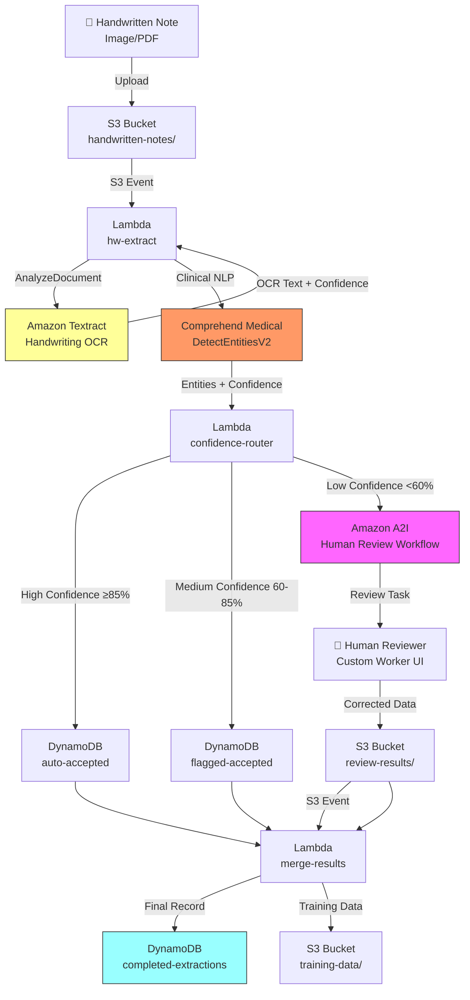

# Recipe 1.6 — Handwritten Clinical Note Digitization 🔷

**Complexity:** Complex · **Phase:** Phase 3 · **Estimated Cost:** ~$0.15–0.50 per page (including human review)

---

## Problem Statement

We've been skirting around this one since Recipe 1.1. Every recipe in this chapter has included a caveat: "struggles with handwritten text." Now we face it head-on.

Physician handwriting is legendarily bad — and that's not just a joke. Handwritten clinical notes remain common in healthcare: progress notes scrawled during patient visits, addenda written in chart margins, consultation notes from specialists who haven't adopted EHR systems, and historical records from before EHR adoption. Payers encounter handwritten documents in prior auth submissions (Recipe 1.4), claims attachments (Recipe 1.5), and medical records requests.

The core problem: handwriting OCR is inherently uncertain. Even the best models produce confidence scores well below what we'd accept for printed text. A confidence threshold of 90% (which worked well in Recipe 1.1) would flag *most* handwritten text for review, defeating the purpose of automation. But lowering the threshold means accepting more errors — and in healthcare, errors in medication names, dosages, and diagnosis codes can have patient safety implications.

The solution isn't better OCR. It's a **confidence-tiered pipeline** that routes text to different processing paths based on extraction certainty, with Amazon A2I (Augmented AI) providing a structured human-in-the-loop review for the inevitable low-confidence extractions.

## Solution Overview

This recipe introduces three concepts we haven't needed until now:

1. **Confidence tiering** — Instead of a single pass/fail threshold, we define three tiers: high confidence (auto-accept), medium confidence (auto-accept with flag), and low confidence (human review required)
2. **Amazon A2I** — A managed human review workflow that presents low-confidence extractions to human reviewers with the original document image alongside the OCR output
3. **Iterative refinement** — Reviewed results feed back into the system, both to complete the current extraction and to build training data for future model improvement

**Pipeline:**

1. Handwritten note image/PDF lands in S3
2. Textract `AnalyzeDocument` with handwriting-optimized settings
3. Comprehend Medical extracts clinical entities from OCR text
4. Confidence tiering: classify each extraction as high/medium/low confidence
5. High-confidence results → auto-accept, write to DynamoDB
6. Low-confidence results → Amazon A2I human review workflow
7. A2I reviewer corrects/confirms extractions in a custom review UI
8. Reviewed results merge with auto-accepted results → final structured record

## Architecture Diagram



## Prerequisites

| Requirement | Details |
|-------------|---------|
| **AWS Services** | Everything from Recipe 1.3, plus Amazon A2I (Augmented AI), Amazon Cognito (for reviewer auth) |
| **IAM Permissions** | All from Recipe 1.3, plus: `sagemaker:CreateFlowDefinition`, `sagemaker:CreateHumanTaskUi`, `sagemaker:StartHumanLoop`, `sagemaker:DescribeHumanLoop` |
| **A2I Workforce** | A private workforce configured in Amazon A2I. For HIPAA workloads, use a private workforce (your own employees) — never use Amazon Mechanical Turk or vendor workforces for PHI review. |
| **A2I Worker Task Template** | Custom HTML template for the review UI (we provide one below) |
| **HIPAA Controls** | Everything from Recipe 1.1, plus: A2I workforce must operate under BAA coverage; reviewers must have HIPAA training; review UI must enforce session timeouts and logging. The A2I private workforce approach keeps PHI within your org boundary. |
| **Sample Data** | Synthetic handwritten clinical notes. Tools like handwriting fonts or image generation can create realistic samples. For accuracy benchmarking, you need ground-truth transcriptions — manually transcribe 100+ real (de-identified) notes. |
| **Cost Estimate** | Textract: ~$1.50/1,000 pages. Comprehend Medical: ~$0.01/100 chars. A2I: $0.00 for the service itself, but human reviewer time is the real cost. At ~$25/hr and 2 minutes per review, low-confidence pages cost ~$0.83 each. If 30% of pages need review, effective cost is ~$0.15–0.50 per page depending on handwriting quality. |

## Ingredients

| AWS Service | Role |
|------------|------|
| **Amazon Textract** | Handwriting OCR — extracts text with per-word confidence scores |
| **Amazon Comprehend Medical** | Clinical entity extraction from OCR text |
| **Amazon A2I** | Manages human review workflow for low-confidence extractions |
| **Amazon Cognito** | Authenticates the private reviewer workforce |
| **Amazon S3** | Stores input images, review tasks, completed reviews, training data |
| **AWS Lambda** | Extraction, confidence routing, result merging |
| **Amazon DynamoDB** | Stores extraction records at each stage (auto-accepted, reviewed, final) |
| **Amazon CloudWatch** | Monitors confidence distributions, review queue depth, reviewer throughput |


## Code

> **Full source:** `github.com/aws-samples/healthcare-ai-cookbook/ch01/recipe-1.6/`

### Walkthrough

**Step 1 — Textract with handwriting.** Textract handles handwriting natively with `AnalyzeDocument` — no special flags needed. The difference is in the confidence scores: printed text typically comes back at 95–99% confidence; handwriting is 40–90% depending on legibility.

```python
import boto3

textract = boto3.client('textract')

def extract_handwritten_note(bucket: str, key: str) -> dict:
    response = textract.analyze_document(
        Document={'S3Object': {'Bucket': bucket, 'Name': key}},
        FeatureTypes=['FORMS']
    )
    
    # Extract words with individual confidence scores
    words = []
    for block in response['Blocks']:
        if block['BlockType'] == 'WORD':
            words.append({
                'text': block['Text'],
                'confidence': block['Confidence'],
                'geometry': block['Geometry']['BoundingBox'],
                'text_type': block.get('TextType', 'PRINTED')  # PRINTED or HANDWRITING
            })
    
    # Separate handwritten vs printed words
    handwritten = [w for w in words if w['text_type'] == 'HANDWRITING']
    printed = [w for w in words if w['text_type'] == 'PRINTED']
    
    # Full text reconstruction from LINE blocks
    lines = [b['Text'] for b in response['Blocks'] if b['BlockType'] == 'LINE']
    full_text = '\n'.join(lines)
    
    return {
        'full_text': full_text,
        'words': words,
        'handwritten_words': handwritten,
        'printed_words': printed,
        'avg_confidence': sum(w['confidence'] for w in words) / len(words) if words else 0,
        'avg_handwriting_confidence': (
            sum(w['confidence'] for w in handwritten) / len(handwritten) 
            if handwritten else 0
        ),
    }
```

**Step 2 — Clinical entity extraction.** Same Comprehend Medical pattern as Recipe 1.3, but we enrich each entity with the underlying word-level confidence from Textract. This gives us a composite confidence score.

```python
comprehend_medical = boto3.client('comprehendmedical')

def extract_clinical_entities_with_confidence(
    full_text: str, 
    words: list[dict]
) -> list[dict]:
    response = comprehend_medical.detect_entities_v2(Text=full_text)
    
    enriched_entities = []
    for entity in response['Entities']:
        # Find the Textract words that correspond to this entity's span
        entity_start = entity['BeginOffset']
        entity_end = entity['EndOffset']
        entity_text = entity['Text']
        
        # Look up word-level OCR confidence for this entity span
        matching_words = find_words_in_span(words, entity_text)
        ocr_confidence = (
            min(w['confidence'] for w in matching_words)
            if matching_words else 50.0  # default if no match
        )
        
        # Composite confidence = min(OCR confidence, NLP confidence)
        # We use min because the chain is only as strong as its weakest link
        composite_confidence = min(ocr_confidence, entity['Score'] * 100)
        
        enriched_entities.append({
            'text': entity['Text'],
            'category': entity['Category'],
            'type': entity['Type'],
            'nlp_confidence': entity['Score'] * 100,
            'ocr_confidence': ocr_confidence,
            'composite_confidence': composite_confidence,
            'traits': [t['Name'] for t in entity.get('Traits', [])],
            'is_handwritten': any(w.get('text_type') == 'HANDWRITING' for w in matching_words),
        })
    
    return enriched_entities
```

**Step 3 — Confidence tiering.** Route entities to the appropriate path based on composite confidence.

```python
HIGH_CONFIDENCE = 85.0    # Auto-accept — reliable enough for automated processing
MEDIUM_CONFIDENCE = 60.0  # Accept with flag — usable but should be verified downstream
# Below 60% → human review required

def tier_entities(entities: list[dict]) -> dict:
    tiered = {'high': [], 'medium': [], 'low': []}
    
    for entity in entities:
        score = entity['composite_confidence']
        if score >= HIGH_CONFIDENCE:
            tiered['high'].append(entity)
        elif score >= MEDIUM_CONFIDENCE:
            tiered['medium'].append(entity)
        else:
            tiered['low'].append(entity)
    
    return tiered
```

**Step 4 — Amazon A2I human review loop.** For low-confidence entities, we create a human review task. The reviewer sees the original document image with bounding boxes around the uncertain regions, alongside the OCR's best guess.

```python
a2i = boto3.client('sagemaker-a2i-runtime')

def start_human_review(
    document_key: str,
    low_confidence_entities: list[dict],
    flow_definition_arn: str
) -> str:
    # Prepare the input for the reviewer
    review_input = {
        'document_s3_uri': f's3://handwritten-notes/{document_key}',
        'entities_to_review': [
            {
                'text': e['text'],
                'category': e['category'],
                'ocr_confidence': round(e['ocr_confidence'], 1),
                'bounding_box': e.get('geometry', {}),
            }
            for e in low_confidence_entities
        ]
    }
    
    response = a2i.start_human_loop(
        HumanLoopName=f"hw-review-{document_key.replace('/', '-')[:60]}",
        FlowDefinitionArn=flow_definition_arn,
        HumanLoopInput={'InputContent': json.dumps(review_input)}
    )
    
    return response['HumanLoopArn']
```

**Step 5 — A2I Worker Task Template.** The custom review UI shows the document image with highlighted regions and lets the reviewer correct or confirm each extraction.

```python
WORKER_TEMPLATE = """
<script src="https://assets.crowd.aws/crowd-html-elements.js"></script>

<crowd-form>
  <h2>Handwritten Clinical Note Review</h2>
  <p>Review the highlighted regions and correct any OCR errors.</p>
  
  
  
  
  <div style="margin: 10px 0; padding: 10px; border: 1px solid #e0e0e0; border-radius: 4px;">
    <p><strong>Category:</strong> {{ entity.category }}</p>
    <p><strong>OCR Read:</strong> <em>{{ entity.text }}</em> 
       ({{ entity.ocr_confidence }}% confidence)</p>
    <crowd-input name="corrected_{{ loop.index }}" 
                 label="Corrected text (leave blank if OCR is correct)"
                 value="{{ entity.text }}"></crowd-input>
    <crowd-checkbox name="confirmed_{{ loop.index }}"
                    label="OCR is correct as-is"></crowd-checkbox>
  </div>
  
  
  <crowd-text-area name="reviewer_notes" 
                   label="Additional notes (optional)"
                   rows="3"></crowd-text-area>
</crowd-form>
"""

def create_worker_template(sagemaker_client) -> str:
    response = sagemaker_client.create_human_task_ui(
        HumanTaskUiName='handwritten-note-review-template',
        UiTemplate={'Content': WORKER_TEMPLATE}
    )
    return response['HumanTaskUiArn']
```

**Step 6 — Merge reviewed results.** When the reviewer completes their task, A2I writes the output to S3. We merge it with the auto-accepted extractions.

```python
def merge_review_results(
    auto_accepted: dict,
    review_output: dict
) -> dict:
    final = {
        'entities': [],
        'review_summary': {
            'total_entities': 0,
            'auto_accepted': 0,
            'human_reviewed': 0,
            'corrections_made': 0,
        }
    }
    
    # Add high and medium confidence entities
    for entity in auto_accepted.get('high', []) + auto_accepted.get('medium', []):
        entity['review_status'] = 'auto_accepted'
        final['entities'].append(entity)
        final['review_summary']['auto_accepted'] += 1
    
    # Add reviewed entities with corrections
    for reviewed in review_output.get('reviewed_entities', []):
        corrected = reviewed.get('corrected_text')
        original = reviewed.get('original_text')
        
        entity = {
            'text': corrected if corrected and corrected != original else original,
            'category': reviewed['category'],
            'review_status': 'human_reviewed',
            'was_corrected': corrected and corrected != original,
            'original_ocr': original,
            'reviewer_confidence': 'high',  # Human reviewed = high confidence
        }
        final['entities'].append(entity)
        final['review_summary']['human_reviewed'] += 1
        if entity['was_corrected']:
            final['review_summary']['corrections_made'] += 1
    
    final['review_summary']['total_entities'] = len(final['entities'])
    return final
```

**Step 7 — Training data capture.** Every human review is a labeled training example. Save corrections to build a dataset for future model fine-tuning.

```python
def save_training_data(
    document_key: str,
    original_ocr: str,
    corrected_text: str,
    entity_category: str
):
    s3 = boto3.client('s3')
    training_record = {
        'document_key': document_key,
        'timestamp': datetime.utcnow().isoformat(),
        'original_ocr': original_ocr,
        'corrected_text': corrected_text,
        'category': entity_category,
        'was_correction': original_ocr != corrected_text,
    }
    
    key = f"training-data/corrections/{datetime.utcnow().strftime('%Y/%m/%d')}/{uuid4()}.json"
    s3.put_object(
        Bucket='handwritten-notes',
        Key=key,
        Body=json.dumps(training_record),
        ServerSideEncryption='aws:kms'
    )
```


## Expected Results

**Sample output for a handwritten physician progress note (1 page):**

```json
{
  "document_key": "handwritten-notes/2026/03/01/note-00291.jpg",
  "processing_summary": {
    "avg_ocr_confidence": 71.4,
    "avg_handwriting_confidence": 68.2,
    "total_entities": 14,
    "auto_accepted": 8,
    "sent_to_human_review": 6,
    "review_status": "completed",
    "corrections_made": 3,
    "processing_time_seconds": 47.2
  },
  "entities": [
    {
      "text": "Type 2 diabetes mellitus",
      "category": "MEDICAL_CONDITION",
      "review_status": "auto_accepted",
      "composite_confidence": 88.4
    },
    {
      "text": "Metformin 500mg",
      "category": "MEDICATION",
      "review_status": "human_reviewed",
      "was_corrected": true,
      "original_ocr": "Metfornin 500mg",
      "composite_confidence": 54.1
    },
    {
      "text": "lisinopril 10mg",
      "category": "MEDICATION",
      "review_status": "human_reviewed",
      "was_corrected": false,
      "composite_confidence": 61.8
    }
  ],
  "icd10_codes": [
    {"code": "E11.9", "description": "Type 2 diabetes mellitus without complications", "confidence": 0.94}
  ]
}
```

**Performance benchmarks:**

| Metric | Typical Value |
|--------|---------------|
| Textract handwriting OCR accuracy | 70–90% (heavily dependent on legibility) |
| Entities auto-accepted (≥85% confidence) | 40–60% of entities |
| Entities sent to human review (<60%) | 20–40% of entities |
| A2I review time per page | 2–5 minutes |
| End-to-end latency (with human review) | 30 min – 4 hours (depends on reviewer queue depth) |
| Error rate after human review | <1% |
| Cost per page (clean handwriting, low review rate) | ~$0.15 |
| Cost per page (poor handwriting, high review rate) | ~$0.50 |

**An honest calibration:** This recipe won't eliminate human review — it reduces and structures it. A purely automated approach to handwritten clinical notes would produce unacceptable error rates for clinical data. The value here is that instead of a staff member manually transcribing an entire note, they're now reviewing and correcting specific flagged extractions in a structured UI — a much faster task. You're looking at a 60–80% reduction in human effort, not 100%.

## Variations & Extensions

1. **Confidence trend monitoring and adaptive thresholds.** Track correction rates per document type, facility, and provider over time. If notes from a specific provider consistently have 80% of their extractions corrected, lower the confidence thresholds for that provider's documents to send more to review. CloudWatch metrics and dashboards make this straightforward — log `composite_confidence` and `was_corrected` per entity and build a correction rate metric per source.

2. **Pre-processing for legibility improvement.** Before calling Textract, apply image pre-processing: contrast enhancement, deskewing, and noise reduction using AWS Lambda with OpenCV or Pillow. Even modest improvements in image quality meaningfully boost OCR confidence. For bulk historical chart migration, run a pre-processing step first and re-run Textract on enhanced images for previously low-confidence documents.

3. **Custom Textract model via Amazon Textract custom adapter.** If you process a high volume of notes from specific providers or facilities, consider training a Textract custom adapter on labeled samples from that source. Custom adapters fine-tune Textract's extraction on your specific document types. As the training data captured in Step 7 accumulates (hundreds of reviewed documents), you'll have the labeled examples needed to train an adapter that can significantly improve accuracy for your specific population of handwritten notes.

## Related Recipes

- **← Recipe 1.5 (Claims Attachment Processing):** Handwritten pages are a common challenge within claims attachment packages — this recipe provides the pattern for handling them within that larger pipeline
- **← Recipe 1.1 (Insurance Card Scanning):** The confidence gating logic here generalizes the simple threshold from Recipe 1.1 into a full tiered routing system
- **→ Recipe 2.1 (Clinical Entity Extraction):** Deep dive on clinical NLP beyond what Comprehend Medical provides out of the box — relevant when handwritten notes contain complex clinical narratives
- **→ Recipe 2.3 (SDOH Extraction):** Social determinants of health are often documented only in handwritten notes — this recipe's pipeline feeds that one directly

## Additional Resources

- [Amazon Textract Handwriting Support](https://docs.aws.amazon.com/textract/latest/dg/how-it-works-handwriting.html)
- [Amazon A2I Developer Guide](https://docs.aws.amazon.com/sagemaker/latest/dg/a2i-getting-started.html)
- [Amazon A2I Private Workforce Setup](https://docs.aws.amazon.com/sagemaker/latest/dg/sms-workforce-private.html)
- [Amazon A2I Worker Task Template Examples](https://docs.aws.amazon.com/sagemaker/latest/dg/a2i-instructions-overview.html)
- [Amazon Textract Custom Adapters](https://docs.aws.amazon.com/textract/latest/dg/custom-adapter.html)
- [HIPAA Guidance on Workforce Training](https://www.hhs.gov/hipaa/for-professionals/security/guidance/workforce-training/index.html) — required for A2I reviewers handling PHI

## Estimated Implementation Time

| Scope | Time |
|-------|------|
| **Basic** (Textract + Comprehend Medical + confidence tiers, no human review) | 1–2 days |
| **Production-ready** (A2I workflow, private workforce, custom review template, result merging) | 2–3 weeks |
| **With variations** (adaptive thresholds, image pre-processing, custom Textract adapter training) | 6–10 weeks |

## Tags

`document-intelligence` · `ocr` · `handwriting` · `textract` · `comprehend-medical` · `a2i` · `human-in-the-loop` · `confidence-scoring` · `clinical-notes` · `complex` · `phase-3` · `hipaa` · `active-learning`

---

*← [Recipe 1.5 — Claims Attachment Processing](chapter01.05-claims-attachment-processing) · [↑ Chapter 1 Index](chapter01-index)*
