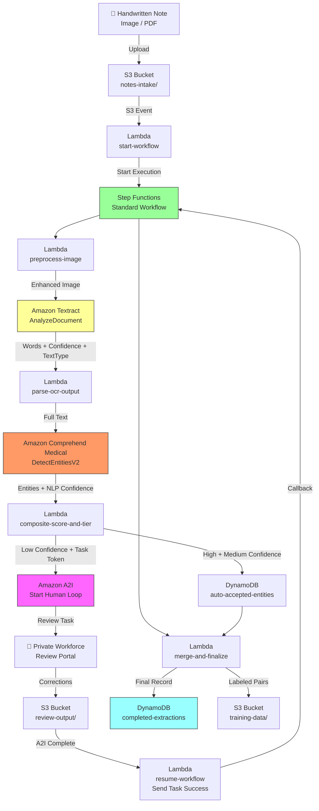

# Recipe 1.6: Handwritten Clinical Note Digitization 🔷

**Complexity:** Complex · **Phase:** Phase 3 · **Estimated Cost:** ~$0.15–0.50 per page (including human review)

---

## The Problem

Every recipe in this chapter has included a footnote, a caveat, a parenthetical hedge: "this approach struggles with handwritten text." Recipe 1.1 said it. Recipe 1.2 said it. Recipe 1.4, where we processed prior authorization documents, said it at least twice. We've been circling this problem since page one.

Here it is. Let's deal with it.

Physician handwriting occupies a unique place in healthcare lore. It's the subject of jokes, malpractice cases, and more than a few pharmacy near-misses. Metformin misread as Methotrexate. "QD" (once daily) misread as "QID" (four times daily). The ISMP's list of dangerous abbreviations reads like a catalog of things a tired handwriting recognition system might confuse. This is not abstract. People have been harmed.

And yet, handwritten clinical notes remain stubbornly common. Progress notes scrawled during patient rounds. Addenda written in chart margins when an EHR is unavailable. Consultation letters from specialists whose practices predate (or reject) electronic records. Handwritten annotations layered onto typed forms because a checkbox couldn't capture the nuance. Historical charts from before EHR adoption that still matter for longitudinal care. Every payer that processes prior authorizations, claims attachments, and medical records requests encounters handwritten content regularly. It's not going away.

The records management team at a mid-sized health plan has a person, sometimes two, whose job is essentially to decipher handwriting. They squint at faxed pages. They call provider offices to clarify illegible medication names. They're doing this for dozens of documents a day, sometimes hundreds. It's slow, expensive, and the people doing it are constantly worried about misreading something clinically significant.

Here's the thing: some of those documents are perfectly readable. A physician with clean handwriting on good-quality paper, scanned properly, comes through at high quality. An automated system can handle those without any human in the loop. But some pages are nearly illegible. Hurried shorthand. Carbon-copy fading. Ballpoint on slick paper photographed with a phone. No automated system will get those right consistently, and the stakes are too high to pretend otherwise.

The problem isn't "can a machine read handwriting?" The answer to that question is increasingly "yes, reasonably well, under decent conditions." The real problem is: **how do you build a system that knows when it can trust its own output?**

That's what this recipe is about. Not a magic handwriting reader. A pipeline that processes what it can confidently, routes the rest to human reviewers efficiently, and gets better over time as those reviews accumulate. A system that's honest about its own uncertainty and structured to handle that uncertainty without grinding to a halt.

---

## The Technology

### Why Handwriting OCR Is Genuinely Hard

Printed text is, from a machine learning perspective, almost a solved problem. The characters are consistent. The spacing is predictable. The font is finite. Modern OCR on clean printed documents achieves accuracy in the high 90s.

Handwriting is different in almost every way. Each person's letterforms are unique. The same person's handwriting varies with writing speed, fatigue, pen type, paper texture, and angle. Letters run together, lift off the page, bleed into adjacent characters, or simply don't look like any canonical letterform at all. The letter 'a' looks like a '9' when written quickly by some people. The letter 'l' is indistinguishable from '1' or 'I' in many hands. Medication names get abbreviated in non-standard ways. Clinical jargon gets rendered in shorthand that only makes sense with clinical context.

Modern handwriting recognition uses deep learning models, specifically recurrent neural networks and transformer architectures, trained on enormous labeled datasets. The models have gotten significantly better over the past five years. But "better" is a relative term. Where printed text OCR accuracy sits in the 97-99% range for well-scanned documents, handwriting OCR on clinical notes typically lands in the 70-90% range under decent conditions, and considerably lower for difficult handwriting or poor image quality.

That accuracy gap matters enormously in healthcare. A 5% error rate on insurance card field extraction (Recipe 1.1) means some cards go to human review. A 15% error rate on medication names in a clinical note is a patient safety issue.

### Confidence Scores: The Signal That Makes This Tractable

Every character or word a handwriting recognition model produces comes with a confidence score: a probability between 0 and 100 reflecting how certain the model is about that recognition. This signal is the foundation of everything that follows.

The critical insight is that confidence scores are calibrated differently for handwriting than for print. A printed word with 85% confidence is probably wrong. A handwritten word with 85% confidence is probably right. The thresholds have to move.

Here's the mental model: think of confidence scores as buckets, not as a pass/fail gate. In a three-tier system:

**High confidence** (say, 85% and above for handwriting): The model is essentially certain. The word or character matches known patterns strongly. In practice, these extractions are correct the vast majority of the time. Automated acceptance is appropriate.

**Medium confidence** (say, 60-85%): The model has a best guess but with meaningful uncertainty. These extractions are right more often than not, but often enough wrong that you'd want them flagged for downstream review, even if you don't block the workflow for them.

**Low confidence** (below 60%): The model isn't confident. The extracted value could be right, could be close, or could be completely wrong. Human review is required before this value is used for anything clinical or financial.

The threshold numbers aren't universal truths. They're calibration parameters you tune against your specific population of documents. A system processing notes from one provider with consistent, legible handwriting will have different optimal thresholds than one processing mixed notes from a hundred providers across a health system.

### Composite Confidence: Layering OCR and NLP

Clinical note processing doesn't stop at raw text extraction. You want structured clinical data: medications, diagnoses, dosages, lab values. To get those, you run natural language processing on top of the OCR output to extract named entities and map them to standardized vocabularies.

This creates two independent sources of uncertainty. The OCR confidence tells you how reliably the handwriting was read. The NLP confidence tells you how reliably the recognized text was classified into a clinical entity.

The safe approach is to take the minimum of the two. If the OCR read "Metfornin" with 55% confidence and the NLP identified "Metfornin" as a medication with 90% confidence, the composite confidence is 55%. The chain is only as strong as its weakest link, and in this case the weak link is the OCR. Routing that entity to human review is the right call.

### Human-in-the-Loop: The Architecture, Not the Workaround

Human review in this context isn't an admission of failure. It's a design choice.

For clinical data, the cost of an automated error is high. The cost of a human reviewing a flagged extraction is low: a reviewer glancing at a highlighted word and confirming or correcting it takes seconds, not minutes. Structured human review is fundamentally different from unstructured manual transcription. In unstructured transcription, the human is doing everything: reading the document, identifying what to extract, and typing the result. In structured review, the machine has done most of the work, the human is auditing a specific, flagged decision, and the interface is purpose-built for that task.

The workflow looks like this: the automated pipeline processes a document and produces a set of extractions, each with a confidence score. High-confidence extractions proceed automatically. Low-confidence extractions are bundled into a review task that shows the reviewer the original document image with the uncertain region highlighted, alongside the system's best guess. The reviewer confirms or corrects. That reviewed value becomes the authoritative output.

This workflow has a secondary benefit: every reviewed document is a labeled training example. The original OCR output plus the human correction is exactly the data needed to fine-tune a model. If you're processing enough volume, the reviews you're collecting today are the training data that improves your accuracy tomorrow.

### Private Workforce: A Non-Negotiable for PHI

One decision in this architecture has no optionality for healthcare: the reviewers must be a private workforce.

Some human-review platforms offer crowdsourced workforces, where tasks are distributed to anonymous contractors. That's appropriate for reviewing photos of wildlife or classifying product images. It is not appropriate for clinical notes containing protected health information. HIPAA requires that PHI be shared only with entities that have signed a Business Associate Agreement. Anonymous crowd workers cannot sign a BAA. Any architecture that routes PHI to a public or vendor workforce creates a HIPAA violation.

A private workforce means reviewers who are your employees or contractors, authenticated through an identity provider you control, governed by your organization's HIPAA policies, and covered under your existing BAAs. You control who has access. You can require HIPAA training as a prerequisite. You can audit every action. The review interface needs to enforce session timeouts and log all interactions.

This isn't a technical complexity. It's an access control and policy question. The technical implementation is straightforward. The organizational work (identifying reviewers, completing training, establishing policies) is where the real setup effort lives.

### The Feedback Loop: Getting Better Over Time

Static systems in dynamic environments degrade. New providers join the network with different handwriting styles. Forms change. Shorthand conventions evolve. A handwriting digitization system that runs with fixed thresholds and a fixed model will slowly accumulate errors as the document population drifts from what the model was trained on.

The antidote is a feedback loop. Every human correction creates a labeled pair: what the OCR said versus what a trained reviewer determined it should say. Accumulated over time, this becomes a fine-tuning dataset. The system's errors teach it where it's weakest. The corrections it receives today reduce the corrections needed tomorrow.

This is the architectural pattern called active learning. You're not just processing documents. You're continuously generating the data needed to improve the model that processes future documents. The human review queue isn't just a quality gate; it's a data labeling pipeline.

### The General Architecture Pattern

At a conceptual level, a confidence-tiered handwriting digitization pipeline has these stages:

```
[Ingest] → [Pre-process] → [OCR] → [Clinical NLP] → [Confidence Tier] → [Route]
                                                                             |
                                                              ┌──────────────┼──────────────┐
                                                              ▼              ▼              ▼
                                                         [Auto-Accept] [Auto-Accept   [Human
                                                                        with Flag]     Review]
                                                              └──────────────┼──────────────┘
                                                                             ▼
                                                                     [Merge Results]
                                                                             ▼
                                                                   [Final Record + Training Data]
```

**Ingest:** A handwritten document arrives. This might be a scanned page, a PDF from a fax, or a photo taken on a phone. The arrival mechanism affects quality in ways that matter downstream.

**Pre-process:** Before OCR, improve the image. Deskew it (handwritten notes are often scanned slightly rotated). Enhance contrast. Reduce noise from aging paper or fax artifacts. These preprocessing steps are not glamorous. They're also the difference between 72% OCR confidence and 84% OCR confidence on a marginal document.

**OCR:** Pass the image to a handwriting recognition model. The output is a set of recognized text regions (words, lines, blocks) each with a confidence score and spatial coordinates. The spatial coordinates matter: they let you show the reviewer exactly where on the original image a flagged word appears.

**Clinical NLP:** Run natural language processing on the recognized text to extract clinical entities: medications, diagnoses, dosages, lab values. Each extracted entity gets a confidence score from the NLP model.

**Confidence Tier:** For each extracted entity, compute the composite confidence (minimum of OCR confidence and NLP confidence). Assign to a tier: high, medium, or low.

**Route:** High-confidence entities proceed to automated storage immediately. Medium-confidence entities are stored but flagged for downstream review. Low-confidence entities go to a structured human review queue.

**Human Review:** Reviewers work through a purpose-built interface that shows them the original document image alongside the system's extraction. They confirm or correct each flagged item. Completed reviews are written back to the system.

**Merge Results:** Auto-accepted extractions and reviewed extractions are combined into a single final record.

**Training Data Capture:** Every reviewed extraction, whether confirmed or corrected, is saved as a labeled example for future model improvement.

---

## The AWS Implementation

Now let's make this concrete.

### Why These Services

**Amazon Textract for handwriting OCR.** Textract handles handwriting natively through the standard `AnalyzeDocument` API. There are no special mode flags needed to enable handwriting recognition. The important thing Textract returns is the `TextType` field on each recognized WORD block: a label of either `PRINTED` or `HANDWRITING`. This lets you separately track the confidence distribution of handwritten versus printed text on the same page, which is important because a page might be a printed form with handwritten fill-ins. The two populations have fundamentally different confidence baselines and should be tiered against different thresholds.

**Amazon Comprehend Medical for clinical entity extraction.** Comprehend Medical's `DetectEntitiesV2` API recognizes clinical entities (medications, diagnoses, dosages, frequencies, lab values) from free text. It provides entity-level confidence scores. Running Comprehend Medical on Textract output adds the clinical understanding layer that turns recognized text into structured, semantically meaningful data. The composite confidence approach (described above) gives each entity a confidence score that reflects both the quality of the OCR and the quality of the NLP.

**AWS Step Functions (Standard Workflow) for pipeline orchestration.** This pipeline has a characteristic that simple Lambda chains don't handle well: a long-running async gap. A2I human reviews can take minutes, hours, or longer depending on queue depth and reviewer availability. Step Functions Standard Workflows support a wait-for-callback pattern where the workflow suspends at the A2I step, receives a callback when the review is complete, and resumes. This is exactly the right abstraction for a pipeline with a human-paced step in the middle. Standard Workflows (not Express) are the right choice here because they maintain execution state durably for the full duration, support executions that run longer than 5 minutes, and produce a complete execution history for audit purposes.

**Amazon A2I (Augmented AI) for structured human review.** A2I is the managed service for building human review workflows into ML pipelines. You define a flow definition that specifies what the review task looks like (the worker task template), which workforce should receive tasks, and how outputs are stored. The service handles task routing, reviewer UI serving, and output capture. It integrates with the wait-for-callback pattern in Step Functions via a task token: when the A2I review completes, A2I writes the output to S3 and triggers a Lambda that resumes the Step Functions execution.

**Private Workforce via Amazon A2I.** A2I supports three workforce types: public (Mechanical Turk), vendor (third-party annotation companies), and private (your own employees). For PHI, private is the only option. A private workforce is configured in A2I and authenticated through Amazon Cognito. Reviewers log into the A2I worker portal with their organizational credentials. Access is controlled through Cognito user pool groups. Every login, task assignment, and review action is logged.

**Amazon S3 for storage across the pipeline.** Documents arrive in an intake bucket. Intermediate results (Textract output, Comprehend Medical output, confidence-scored entities) live in S3 before the Step Functions workflow merges them. A2I writes review outputs to S3. Training data lives in S3. The whole pipeline is S3-connected: every stage reads from and writes to S3, which makes debugging and reprocessing straightforward.

**AWS Lambda for the stateless processing steps.** Image pre-processing, Textract response parsing, Comprehend Medical call and response parsing, confidence tiering, A2I input preparation, review result processing, result merging, and training data capture are all short-lived stateless operations. Lambda is the right fit. Each Lambda function does one thing and hands off to Step Functions for orchestration.

**Amazon DynamoDB for result storage.** Extraction records at each stage (auto-accepted, pending review, reviewed, final) live in DynamoDB with the document key as the partition key. The Step Functions execution ID connects records across stages. DynamoDB's conditional writes let the result-merge Lambda safely assemble the final record from parts that arrive at different times.

### Architecture Diagram



### Prerequisites

| Requirement | Details |
|-------------|---------|
| **AWS Services** | Amazon Textract, Amazon Comprehend Medical, Amazon A2I (Augmented AI), Amazon Cognito, AWS Step Functions, AWS Lambda, Amazon S3, Amazon DynamoDB |
| **IAM Permissions** | `textract:AnalyzeDocument`, `comprehendmedical:DetectEntitiesV2`, `sagemaker:CreateHumanLoop`, `sagemaker:DescribeHumanLoop`, `s3:GetObject`, `s3:PutObject`, `dynamodb:PutItem`, `dynamodb:GetItem`, `states:StartExecution`, `states:SendTaskSuccess`, `states:SendTaskFailure` |
| **BAA** | AWS BAA required. Handwritten clinical notes contain PHI. A2I private workforce must operate under your organization's BAA coverage. |
| **A2I Workforce** | Private workforce configured in Amazon A2I and authenticated via Amazon Cognito. Reviewers must complete HIPAA training before access is granted. Public (Mechanical Turk) and vendor workforces are not permitted for PHI. |
| **A2I Worker Task Template** | Custom HTML template defining the reviewer interface. The template must include the document image (with S3 pre-signed URL), the OCR extraction with confidence score, and input fields for corrections. Example template structure is included in the Code section below. |
| **Encryption** | S3: SSE-KMS on all buckets; DynamoDB: encryption at rest (default); all API calls over TLS; A2I task outputs encrypted at rest in the review-output bucket |
| **VPC** | Production: Lambda functions in a VPC with VPC endpoints for S3, Textract, Comprehend Medical, DynamoDB, and CloudWatch Logs. Step Functions VPC endpoint optional but recommended. |
| **CloudTrail** | Enabled for all API calls. A2I task assignments and completions must be logged. DynamoDB writes to completed-extractions table require an audit trail for PHI access. |
| **Sample Data** | Synthetic handwritten notes for development and testing. The IAB (International Association of Better Business Bureaus) handwriting datasets and similar publicly available handwriting corpora can provide realistic samples. For accuracy benchmarking, prepare 50-100 synthetic notes with known ground-truth transcriptions. Never use real patient notes in development. |
| **Cost Estimate** | Textract FORMS: $0.05/page. Comprehend Medical: $0.01 per 100 characters (typical 1-page note is ~1,000 characters = ~$0.10). A2I: no per-task fee from AWS, but reviewer time is the cost; at ~$25/hr and 3 minutes per review, each human-reviewed page runs ~$1.25. If 30% of pages need human review, blended cost is ~$0.15–$0.50/page depending on handwriting quality. |

### Ingredients

| AWS Service | Role in This Recipe |
|------------|---------------------|
| **Amazon Textract** | Handwriting OCR via `AnalyzeDocument` API; returns per-word confidence scores and `TextType` (PRINTED or HANDWRITING) |
| **Amazon Comprehend Medical** | Clinical entity extraction from OCR text via `DetectEntitiesV2`; identifies medications, diagnoses, dosages, lab values |
| **Amazon A2I** | Manages human review workflow: task creation, reviewer assignment, UI serving, output capture |
| **Amazon Cognito** | Authenticates the private reviewer workforce for the A2I worker portal |
| **AWS Step Functions** | Standard Workflow orchestrating the multi-step pipeline, including the wait-for-callback pattern for A2I review |
| **AWS Lambda** | Stateless processing at each pipeline stage: pre-processing, parsing, scoring, routing, result merging |
| **Amazon S3** | Stores intake documents, intermediate results, A2I review outputs, and training data; SSE-KMS encryption |
| **Amazon DynamoDB** | Stores extraction records at each stage and the final completed record |
| **AWS KMS** | Manages encryption keys for S3 and DynamoDB |
| **Amazon CloudWatch** | Logs, metrics, and alarms for OCR confidence distributions, review queue depth, and reviewer throughput |

### Code

> **Reference implementations:** The following AWS sample repos demonstrate the patterns used in this recipe:
>
> - [`amazon-textract-code-samples`](https://github.com/aws-samples/amazon-textract-code-samples): General Textract examples including AnalyzeDocument for handwriting-mixed documents
> - [`amazon-a2i-sample-task-uis`](https://github.com/aws-samples/amazon-a2i-sample-task-uis): Over 60 example worker task UI templates for Amazon A2I, including document review patterns
> - [`amazon-textract-idp-cdk-constructs`](https://github.com/aws-samples/amazon-textract-idp-cdk-constructs): CDK constructs for building Step Functions-orchestrated IDP pipelines with Textract
> - [`amazon-textract-and-amazon-comprehend-medical-claims-example`](https://github.com/aws-samples/amazon-textract-and-amazon-comprehend-medical-claims-example): Healthcare-specific: extracting and validating medical data with Textract and Comprehend Medical

#### Pseudocode Walkthrough

**Step 1: Image pre-processing.** Before sending anything to OCR, improve the image. This step won't feel glamorous. It will absolutely affect your results. Handwritten clinical notes arrive at all levels of quality: straight from a scanner, photographed with a phone, faxed twice, printed on thermal paper and then scanned. Each of those introduces different artifacts. Deskewing corrects rotated images (a page scanned at a 3-degree angle is harder to read than a straight one). Contrast enhancement makes light pencil marks or faded ink more visible. Noise reduction removes compression artifacts and paper grain that can confuse the OCR model. If you skip this step, your OCR confidence scores will be lower than they need to be, and some documents that could have been auto-accepted will end up in the human review queue. For images arriving with consistent quality (controlled scanning environments), the impact is modest. For mixed-provenance documents from a fax gateway, it's significant.

```
FUNCTION preprocess_image(input_image):
    // Load the image from storage into memory for processing.
    image = load_image(input_image)

    // Detect and correct rotation. Many scanners and phone cameras introduce
    // slight rotations. Even a few degrees degrades OCR confidence measurably.
    // This step estimates the skew angle from line orientations and rotates to correct.
    image = deskew(image, detect_angle=True)

    // Enhance contrast and normalize brightness.
    // Pencil handwriting, faded ink, and aged paper all present low contrast.
    // Adaptive histogram equalization adjusts contrast locally, which handles
    // uneven lighting (e.g., a shadow across part of the page) better than
    // global adjustments.
    image = enhance_contrast(image, method="adaptive_histogram_equalization")

    // Reduce noise from compression, paper grain, and fax artifacts.
    // The filter should remove high-frequency noise while preserving the
    // fine edges of handwritten strokes.
    image = reduce_noise(image, method="bilateral_filter")

    // Save the enhanced image to the intermediate bucket.
    // We keep the enhanced version because A2I reviewers will see this image
    // in their review interface, and enhanced images are easier to read.
    enhanced_key = save_to_storage(image, bucket="notes-enhanced")

    RETURN enhanced_key
```

**Step 2: Textract handwriting OCR.** The OCR call itself is straightforward. The important post-processing is separating the HANDWRITING and PRINTED word populations, because they need different confidence thresholds downstream. A form with printed field labels and handwritten fill-in values is common in clinical documentation. Treating all words against a single threshold loses the nuance that the printed labels are reliable (they're essentially ignored in entity extraction anyway) while the handwritten values are the information you actually care about.

```
// Adaptive thresholds tuned for handwriting vs. printed text.
// These are starting points. Calibrate against your actual document population.
HIGH_CONFIDENCE_HANDWRITING   = 85.0   // threshold for handwritten words
HIGH_CONFIDENCE_PRINTED       = 92.0   // threshold for printed words (higher baseline)
MEDIUM_CONFIDENCE_HANDWRITING = 60.0   // below this, human review required
MEDIUM_CONFIDENCE_PRINTED     = 75.0   // below this, human review required

FUNCTION extract_text_with_confidence(enhanced_image_key):
    // Call Textract AnalyzeDocument on the enhanced image.
    // Handwriting recognition is native; no special feature flag needed.
    // The FORMS feature type is included to extract structured key-value pairs
    // from any form fields on the page; raw text lines are also returned.
    response = call Textract.AnalyzeDocument with:
        document = S3 object at enhanced_image_key
        features = ["FORMS"]             // include form KVP extraction alongside free text

    // Separate word blocks by text type. Each WORD block includes:
    //   - Text:       the recognized string
    //   - Confidence: 0–100 score
    //   - TextType:   "PRINTED" or "HANDWRITING"
    //   - Geometry:   bounding box (used to show reviewers exactly where the word is)
    handwritten_words = []
    printed_words     = []

    FOR each block in response.Blocks:
        IF block.BlockType == "WORD":
            word = {
                text:       block.Text,
                confidence: block.Confidence,
                text_type:  block.TextType,       // PRINTED or HANDWRITING
                bounding_box: block.Geometry.BoundingBox
            }
            IF block.TextType == "HANDWRITING":
                append word to handwritten_words
            ELSE:
                append word to printed_words

    // Reconstruct full text from LINE blocks for NLP processing.
    // LINE blocks contain the complete, concatenated text of each line in reading order.
    // This is better than joining WORD blocks manually because Textract's LINE assembly
    // handles multi-word units (e.g., "q.i.d.") more reliably.
    lines     = [block.Text for block in response.Blocks if block.BlockType == "LINE"]
    full_text = join(lines, separator="\n")

    // Compute summary confidence metrics for logging and monitoring.
    avg_handwriting_confidence = average(word.confidence for word in handwritten_words)
    avg_printed_confidence     = average(word.confidence for word in printed_words)

    RETURN {
        full_text:                  full_text,
        handwritten_words:          handwritten_words,
        printed_words:              printed_words,
        avg_handwriting_confidence: avg_handwriting_confidence,
        avg_printed_confidence:     avg_printed_confidence
    }
```

**Step 3: Clinical entity extraction.** With OCR text in hand, we run clinical NLP to extract structured entities. The key design choice here is the composite confidence model: each extracted entity gets a composite confidence score that reflects both how reliably the underlying words were read and how reliably the NLP identified the entity. Use the minimum of the two. A clearly recognized word that the NLP is uncertain about, and a word the NLP is confident about but Textract struggled to read, both deserve the same treatment: flag for review. Skipping this step and relying solely on OCR confidence misses cases where the OCR read a word clearly but got it wrong in a way that makes clinical sense. "Lisnopril" and "Lisinopril" look similar enough that OCR might be confident, but the composite score catches it.

```
FUNCTION extract_clinical_entities(full_text, handwritten_words):
    // Call Comprehend Medical to identify clinical entities in the full text.
    // DetectEntitiesV2 recognizes medications, conditions, dosages, frequencies,
    // lab values, and more. Each entity includes a Score (0.0–1.0 confidence).
    response = call ComprehendMedical.DetectEntitiesV2 with:
        text = full_text

    enriched_entities = []

    FOR each entity in response.Entities:
        entity_text     = entity.Text
        nlp_confidence  = entity.Score * 100    // convert to 0–100 scale to match Textract

        // Find the Textract words that correspond to this entity's text span.
        // Some entities span multiple words (e.g., "Type 2 diabetes mellitus").
        // Find the handwritten words whose bounding boxes overlap the entity span.
        matching_words = find_words_matching_text(handwritten_words, entity_text)

        // If we found corresponding handwritten words, use the minimum confidence
        // among them as the OCR confidence for this entity.
        // Minimum because: if any word in a medication name was read poorly,
        // the whole name is suspect.
        IF matching_words is not empty:
            ocr_confidence = minimum(word.confidence for word in matching_words)
        ELSE:
            // No handwritten word match: this entity came from printed text.
            // Printed text has a higher confidence baseline; use a conservative default.
            ocr_confidence = 90.0

        // Composite confidence: the chain is only as strong as its weakest link.
        composite_confidence = minimum(ocr_confidence, nlp_confidence)

        append to enriched_entities: {
            text:                entity_text,
            category:            entity.Category,       // MEDICATION, MEDICAL_CONDITION, etc.
            entity_type:         entity.Type,           // e.g., GENERIC_NAME, DX_NAME
            traits:              entity.Traits,         // e.g., NEGATION, HYPOTHETICAL
            nlp_confidence:      nlp_confidence,
            ocr_confidence:      ocr_confidence,
            composite_confidence: composite_confidence,
            is_handwritten:      (matching_words is not empty)
        }

    RETURN enriched_entities
```

**Step 4: Confidence tiering and routing.** This step is the traffic controller for the entire pipeline. Every entity gets assigned to exactly one of three buckets based on its composite confidence score. The thresholds here use the adaptive values defined in Step 2: handwritten entities go against the handwriting thresholds, printed entities against the printed thresholds. This is a subtle but important distinction. A medication name extracted from a handwritten section of the note needs to clear 85% to auto-accept; the same medication name in a printed section of the same page needs 92%. Applying a single threshold uniformly would either over-flag reliable printed text or under-flag risky handwritten text.

```
FUNCTION tier_entities(enriched_entities):
    high_confidence   = []   // auto-accept: reliable enough for immediate use
    medium_confidence = []   // accept with flag: usable but should be verified downstream
    low_confidence    = []   // human review required before use

    FOR each entity in enriched_entities:
        score = entity.composite_confidence

        // Select the appropriate thresholds based on whether this entity
        // came from handwritten or printed text.
        IF entity.is_handwritten:
            high_threshold   = HIGH_CONFIDENCE_HANDWRITING    // 85.0
            medium_threshold = MEDIUM_CONFIDENCE_HANDWRITING  // 60.0
        ELSE:
            high_threshold   = HIGH_CONFIDENCE_PRINTED        // 92.0
            medium_threshold = MEDIUM_CONFIDENCE_PRINTED      // 75.0

        IF score >= high_threshold:
            append entity to high_confidence
        ELSE IF score >= medium_threshold:
            append entity to medium_confidence
        ELSE:
            append entity to low_confidence

    RETURN {
        high:   high_confidence,
        medium: medium_confidence,
        low:    low_confidence
    }
```

**Step 5: Store auto-accepted entities and start human review.** High and medium confidence entities are written to DynamoDB immediately. They're available for downstream processing now. Low confidence entities are bundled into an A2I human review task. The Step Functions workflow uses a task token here: a unique identifier passed to A2I that A2I will return when the review completes. This is how the workflow knows to resume. The token is the handshake between the automated pipeline and the human reviewer's action. If this step is skipped and low-confidence entities are stored without review, errors in medication names, dosages, and diagnoses will silently enter your records. That is the scenario this entire recipe exists to prevent.

```
FUNCTION route_entities(document_key, tiered_entities, task_token):
    // Write high and medium confidence entities to DynamoDB as auto-accepted.
    // Medium entities include a flag indicating downstream review is advisable,
    // but they don't block the workflow or require immediate human action.
    FOR each entity in tiered_entities.high + tiered_entities.medium:
        write to DynamoDB table "clinical-note-entities":
            pk:            document_key
            sk:            generate_entity_id()
            entity_text:   entity.text
            category:      entity.category
            entity_type:   entity.entity_type
            confidence:    entity.composite_confidence
            review_status: "auto_accepted" if entity in high, else "accepted_flagged"
            is_handwritten: entity.is_handwritten

    // If there are no low-confidence entities, there's nothing to review.
    // Send the task token back immediately so Step Functions can continue.
    IF tiered_entities.low is empty:
        send task success to Step Functions with task_token
        RETURN

    // Bundle the low-confidence entities into an A2I review task.
    // The task input includes:
    //   - The enhanced image URI (reviewers see the actual document)
    //   - The list of entities to review (OCR text, confidence, bounding box)
    //   - The task token (A2I will return this when the review completes)
    review_task_input = {
        document_image_uri: get_presigned_url(document_key, expiry=4_hours),
        task_token:         task_token,   // Step Functions callback token
        entities_to_review: [
            {
                id:              entity_id,
                text:            entity.text,
                category:        entity.category,
                ocr_confidence:  round(entity.ocr_confidence, 1),
                nlp_confidence:  round(entity.nlp_confidence, 1),
                bounding_box:    entity.bounding_box
            }
            FOR each entity in tiered_entities.low
        ]
    }

    // Create the A2I human loop. The flow_definition_arn identifies the
    // pre-configured workflow: which workforce to route to, how many reviewers
    // per task, and which task template to show them.
    call A2I.StartHumanLoop with:
        HumanLoopName:     "note-review-" + hash(document_key)
        FlowDefinitionArn: FLOW_DEFINITION_ARN   // from your A2I configuration
        HumanLoopInput:    { InputContent: json_encode(review_task_input) }

    // The Step Functions execution is now suspended at this state.
    // It will resume when the Lambda triggered by A2I completion
    // calls StepFunctions.SendTaskSuccess with the task_token.
```

**Step 6: The reviewer interface.** The worker task template is HTML with Liquid-style template variables. It renders in the A2I worker portal. The template must show the document image, clearly display the OCR text that needs review, and provide simple inputs for corrections. Reviewers are not engineers. The interface should require minimal explanation. The document image is the ground truth; the reviewer's job is to compare the OCR output against it and correct errors. Every design choice in this template should reduce cognitive load and minimize the chance of reviewer error.

```html
<!-- A2I Worker Task Template for Handwritten Clinical Note Review -->
<!-- This HTML renders in the A2I worker portal. Variables in {{ }} are -->
<!-- replaced by A2I from the HumanLoopInput passed in Step 5.         -->

<script src="https://assets.crowd.aws/crowd-html-elements.js"></script>

<crowd-form>

  <h2>Handwritten Clinical Note Review</h2>

  <p>
    The system identified the following extractions as uncertain.
    Compare each one against the document image and correct any errors.
    Leave the text field unchanged if the OCR is correct.
  </p>

  <!-- Document image: displayed at full width for legibility. -->
  <!-- grant_read_access converts the S3 URI to a pre-signed URL. -->
  <div style="border: 1px solid #ccc; padding: 8px; margin-bottom: 20px;">
    
  </div>

  <!-- One review block per low-confidence entity. -->
  
  <div style="border: 1px solid #ddd; border-radius: 4px;
              padding: 12px; margin-bottom: 12px; background: #fafafa;">

    <p><strong>Category:</strong> {{ entity.category }}</p>
    <p>
      <strong>OCR extracted:</strong>
      <code>{{ entity.text }}</code>
      &nbsp;&nbsp;
      <span style="color: #888; font-size: 0.9em;">
        (OCR confidence: {{ entity.ocr_confidence }}%,
         NLP confidence: {{ entity.nlp_confidence }}%)
      </span>
    </p>

    <!-- Text field pre-filled with the OCR text. Reviewer corrects if wrong. -->
    <crowd-input
      name="corrected_text_{{ entity.id }}"
      label="Correct text (edit if OCR is wrong)"
      value="{{ entity.text }}"
      required>
    </crowd-input>

  </div>
  

  <!-- Optional: reviewer notes for quality tracking and edge cases. -->
  <crowd-text-area
    name="reviewer_notes"
    label="Notes for QA team (optional)"
    rows="2"
    placeholder="Any observations about document quality, unusual formatting, etc.">
  </crowd-text-area>

</crowd-form>
```

**Step 7: Process review results and resume workflow.** When a reviewer submits their review, A2I writes the output to S3 and triggers a configured Lambda. That Lambda reads the review output, sends the task success to Step Functions (which resumes the workflow), and stores the reviewed entities in DynamoDB. The key action in this step is the task token: calling `SendTaskSuccess` with the original token is what wakes up the Step Functions execution. If this Lambda fails or is misconfigured, the Step Functions execution stays suspended indefinitely. Monitor this Lambda's error rate carefully and set a heartbeat timeout on the Step Functions wait state so stuck executions surface visibly rather than silently.

```
// This function is triggered by an S3 event when A2I writes review output.
FUNCTION process_review_completion(review_output_s3_key):
    // Load the A2I review output from S3.
    // A2I writes a JSON file per completed review containing all reviewer responses.
    review_data = load_json_from_storage(review_output_s3_key)

    // Extract the task token and document key from the review output.
    // These were passed in via HumanLoopInput in Step 5.
    task_token   = review_data.inputContent.task_token
    document_key = review_data.inputContent.document_key

    reviewed_entities = []
    corrections_made  = 0

    FOR each entity_input in review_data.inputContent.entities_to_review:
        entity_id     = entity_input.id
        original_text = entity_input.text

        // Find the reviewer's input for this entity.
        // The reviewer may have corrected, confirmed, or left the text unchanged.
        corrected_text = review_data.humanAnswers[0].answerContent["corrected_text_" + entity_id]
        was_corrected  = (corrected_text != original_text)

        IF was_corrected:
            corrections_made = corrections_made + 1

        // Write the reviewed entity to DynamoDB.
        write to DynamoDB table "clinical-note-entities":
            pk:            document_key
            sk:            entity_id
            entity_text:   corrected_text       // use the reviewer's version
            original_ocr:  original_text        // preserve the original for training data
            review_status: "human_reviewed"
            was_corrected: was_corrected
            reviewer_id:   review_data.humanAnswers[0].workerId   // anonymized
            reviewed_at:   review_data.completionTime

    // Resume the Step Functions execution.
    // This wakes up the workflow from the wait state it entered in Step 5.
    call StepFunctions.SendTaskSuccess with:
        taskToken: task_token
        output:    json_encode({
            document_key:     document_key,
            reviewed_count:   length(reviewed_entities),
            corrections_made: corrections_made
        })
```

**Step 8: Assemble the final record and capture training data.** With all entities now in DynamoDB (auto-accepted and human-reviewed), the final Lambda assembles the complete extraction record and writes it to the completed-extractions table. Every reviewed extraction is also written to the training data bucket as a labeled example: original OCR versus human-verified text. Over time, this accumulates into a labeled dataset that can be used to fine-tune a custom Textract adapter for your specific document population. Skip the training data capture now and the effort to reconstruct it later is significant. The reviewed records are already in DynamoDB; capturing them as training examples at this moment costs essentially nothing.

```
FUNCTION assemble_final_record(document_key, step_functions_execution_id):
    // Retrieve all entity records for this document from DynamoDB.
    // This includes auto-accepted (from Step 5) and human-reviewed (from Step 7).
    all_entity_records = query DynamoDB table "clinical-note-entities"
                         where pk == document_key

    final_entities  = []
    training_pairs  = []
    corrections     = 0
    auto_accepted   = 0
    human_reviewed  = 0

    FOR each record in all_entity_records:
        // Build the final entity entry.
        entity = {
            text:         record.entity_text,
            category:     record.category,
            entity_type:  record.entity_type,
            review_status: record.review_status
        }
        append entity to final_entities

        // Count by review path.
        IF record.review_status IN ["auto_accepted", "accepted_flagged"]:
            auto_accepted = auto_accepted + 1
        ELSE IF record.review_status == "human_reviewed":
            human_reviewed = human_reviewed + 1
            IF record.was_corrected:
                corrections = corrections + 1

            // Capture this reviewed pair as training data.
            // Every correction teaches the model what it got wrong.
            // Every confirmation teaches the model what it got right.
            append to training_pairs: {
                original_ocr:    record.original_ocr,
                corrected_text:  record.entity_text,
                category:        record.category,
                was_correction:  record.was_corrected,
                document_key:    document_key,
                timestamp:       current_utc_timestamp()
            }

    // Write the final, authoritative extraction record.
    write to DynamoDB table "completed-extractions":
        document_key:       document_key
        execution_id:       step_functions_execution_id
        completed_at:       current_utc_timestamp()
        entities:           final_entities
        processing_summary: {
            total_entities: length(all_entity_records),
            auto_accepted:  auto_accepted,
            human_reviewed: human_reviewed,
            corrections:    corrections
        }

    // Write training pairs to S3 for future model fine-tuning.
    // Partition by date for efficient batch access.
    IF length(training_pairs) > 0:
        s3_key = "training-data/" + date_partition() + "/" + uuid() + ".json"
        write json_encode(training_pairs) to S3 bucket "training-data"
            with SSE-KMS encryption
```

> **Curious how this looks in Python?** The pseudocode above covers the concepts. If you'd like to see sample Python code that demonstrates these patterns using boto3, check out the [Python Example](chapter01.06-python-example). It walks through each step with inline comments and notes on what you'd need to change for a real deployment.

---

### Expected Results

**Sample output for a one-page handwritten physician progress note:**

```json
{
  "document_key": "notes-intake/2026/03/01/note-00291.jpg",
  "execution_id": "arn:aws:states:us-east-1:123456789012:execution:hw-notes-pipeline:note-00291",
  "completed_at": "2026-03-01T16:04:22Z",
  "processing_summary": {
    "avg_handwriting_confidence": 71.4,
    "avg_printed_confidence": 96.8,
    "total_entities": 14,
    "auto_accepted": 9,
    "accepted_flagged": 2,
    "human_reviewed": 3,
    "corrections_made": 1,
    "processing_time_seconds": 2284
  },
  "entities": [
    {
      "text": "Type 2 diabetes mellitus",
      "category": "MEDICAL_CONDITION",
      "entity_type": "DX_NAME",
      "review_status": "auto_accepted",
      "composite_confidence": 89.1
    },
    {
      "text": "Metformin 500mg",
      "category": "MEDICATION",
      "entity_type": "GENERIC_NAME",
      "review_status": "human_reviewed",
      "was_corrected": true,
      "original_ocr": "Metfornin 500mg",
      "composite_confidence": 54.1
    },
    {
      "text": "lisinopril 10mg daily",
      "category": "MEDICATION",
      "entity_type": "GENERIC_NAME",
      "review_status": "human_reviewed",
      "was_corrected": false,
      "original_ocr": "lisinopril 10mg daily",
      "composite_confidence": 61.8
    },
    {
      "text": "HbA1c 7.2%",
      "category": "LAB_VALUE",
      "entity_type": "TEST_VALUE",
      "review_status": "accepted_flagged",
      "composite_confidence": 74.3
    }
  ]
}
```

**Performance benchmarks:**

| Metric | Typical Value |
|--------|---------------|
| Textract handwriting OCR accuracy | 70-90% (highly dependent on legibility) |
| Entities auto-accepted (high confidence) | 40-60% of entities |
| Entities accepted with flag (medium confidence) | 15-25% of entities |
| Entities routed to human review (low confidence) | 20-35% of entities |
| A2I review time per page | 2-5 minutes |
| End-to-end pipeline latency (human review path) | 30 minutes to 4 hours |
| Error rate post-human-review | Less than 1% |
| Cost per page (clean handwriting, low review volume) | ~$0.15 |
| Cost per page (difficult handwriting, high review volume) | ~$0.50 |
| Correction rate at launch (typical) | 25-40% of reviewed entities |
| Correction rate after 6 months (with fine-tuning) | 10-20% (model improves on your population) |

**Where it struggles:** Very poor image quality where preprocessing cannot recover legibility. Highly personalized shorthand that no general-purpose model was trained on. Documents with mixed languages or scripts. Multi-page notes where context from page one would help interpret an abbreviation on page three (Comprehend Medical processes each page independently). Medications recently approved or renamed that aren't in Comprehend Medical's training data.

---

## The Honest Take

Let me be direct about what this system is and isn't.

It will not eliminate human review. If someone tells you they've built a handwriting digitization system for clinical notes with no human in the loop and high accuracy, ask them what their correction rate looks like at 6 months and whether they've audited for systematic errors on specific categories. The answer is almost always clarifying. The value of this architecture is that it makes human review targeted, structured, and fast. A reviewer auditing three flagged extractions from a 14-entity note is doing a completely different job than a reviewer transcribing the whole note from scratch.

The confidence thresholds are a calibration problem, not a configuration problem. The starting values in this recipe (85% and 60% for handwriting) will not be right for your population on day one. You need 200-300 processed notes to have enough data to tune them meaningfully. Build dashboards that show your correction rate by confidence bucket. If you have a high correction rate among entities that cleared the 85% threshold, you've set that threshold too low. If your human review queue is swamped with entities that reviewers are confirming without correction 90% of the time, you've set the medium/low threshold too aggressively.

The A2I private workforce setup is where most organizations underestimate the work. The technical configuration (Cognito user pool, flow definition, task template) takes a day or two. The organizational work takes longer: identifying which staff will be reviewers, establishing the review workflow in their daily routines, HIPAA training documentation, and getting IT security comfortable with browser-based access to a new system. Plan for 2-4 weeks of organizational lead time before your first production review.

The Step Functions wait state for A2I is deceptively simple to configure and genuinely tricky to operate. The task token mechanism works well, but you need to handle the case where the Lambda that sends `SendTaskSuccess` itself fails. Set a heartbeat timeout on the wait state (I'd start with 8 hours) so that executions don't silently wait forever if the resume Lambda has an error. The Step Functions console makes it easy to spot stuck executions, but you want a CloudWatch alarm on it so you find out before a reviewer does.

Training data capture is the thing that separates a system you're maintaining from a system that's improving. If you skip Step 8's training data write because it seems optional, you'll wish you hadn't in six months. The labeled data accumulates automatically as part of normal operation. When you have enough volume to train a Textract custom adapter (roughly 2,000-5,000 reviewed documents for a specific document type), that data is already there. If you didn't capture it, you have to go back and reconstruct it from DynamoDB records. That's possible but tedious. Capture it now.

The thing that has surprised me every time I've worked on handwriting problems in healthcare: how much the correction rate varies by provider. Some physicians write clearly and consistently; their notes come through at 88% average confidence with 15% of entities needing review. Other physicians produce notes where 60% of entities need review. After a few weeks of production traffic, you'll know exactly which providers are your challenge cases. The adaptive threshold variation (described below) lets you tune for this, but the first step is just knowing which providers have which confidence profile.

---

## Variations and Extensions

**Adaptive thresholds per document source.** Once you have a few months of production data, you'll see clear patterns in which providers and which document types produce consistently lower confidence scores. Instead of global thresholds, maintain per-source threshold tables in DynamoDB. A provider whose notes historically come through at 68% average confidence should have lower thresholds (more permissive auto-acceptance) than the global setting would give them. A new document type with no history should start with conservative (strict) thresholds until patterns emerge. Log `composite_confidence` and `was_corrected` per entity per source, compute a rolling correction rate per source weekly, and adjust thresholds automatically based on observed accuracy. This turns the confidence tier system from a static filter into an adaptive one that learns the specific characteristics of your document population.

**Image quality scoring before OCR.** Add a quality gate before the Textract call. Measure blur (Laplacian variance), contrast (standard deviation of pixel intensities), and rotation angle. If an image falls below quality thresholds, return an early `quality_failed` status to the upstream workflow and request a rescan before processing. This is particularly valuable for phone-photographed documents, where a slight change in capture guidance ("hold the document flat, in even light") dramatically improves downstream accuracy. Rejecting unprocessable images early is cleaner than processing them, getting low-confidence extractions across the board, and sending the entire note to human review. A quality score is also useful metadata for your monitoring dashboards: tracking image quality trends by intake channel tells you where to focus capture guidance improvements.

**Custom Textract adapter for your document population.** The training data capture in Step 8 is building toward this. Once you have 2,000 or more reviewed documents from a consistent document type (say, one health system's progress notes), you have enough labeled data to train a Textract custom adapter via the Textract Custom Adapters feature. A custom adapter fine-tunes Textract's extraction specifically on your documents. Organizations that have trained adapters on their specific document populations typically report meaningfully lower low-confidence rates on those document types, which translates directly to reduced human review volume. The adapter training process requires labeled data (which you're already capturing), an S3 bucket of training images, and a SageMaker training job. The resulting adapter is referenced in your `AnalyzeDocument` API call and replaces the general-purpose model for that document type.

---

## Related Recipes

- **Recipe 1.1 (Insurance Card Scanning):** The confidence gating pattern in Recipe 1.1 is the simplified version of this recipe's tiered system. That recipe flags any field below 90% for review; this recipe introduces three tiers and type-specific thresholds because handwriting requires more nuance than a single threshold provides.
- **Recipe 1.4 (Prior Authorization Document Processing):** Prior auth packages regularly contain handwritten addenda, cover notes, and medication lists. The pipeline built here can be called as a sub-workflow from the Recipe 1.4 pipeline when Textract's `TextType` indicates handwriting is present in a prior auth document.
- **Recipe 1.5 (Claims Attachment Processing):** Same integration point: claims attachments can include handwritten pages. Recipe 1.5's document classification step can route handwriting-heavy pages to this recipe's pipeline.
- **Recipe 1.9 (Medical Records Request Extraction):** Medical records requests frequently include handwritten authorization forms and cover letters. The A2I private workforce configured here can serve the review queue for Recipe 1.9 as well; no need to stand up a second workforce.

---

## Additional Resources

### AWS Documentation
- [Amazon Textract Handwriting Support](https://docs.aws.amazon.com/textract/latest/dg/how-it-works-handwriting.html): Technical overview of how Textract handles handwriting, including the `TextType` field and confidence score behavior for handwritten versus printed text
- [Amazon Textract Custom Adapters](https://docs.aws.amazon.com/textract/latest/dg/custom-adapter.html): Guide to training Textract on your specific document population using labeled examples
- [Amazon Textract Pricing](https://aws.amazon.com/textract/pricing/): FORMS feature: $0.05/page; TABLES: $0.015/page; LAYOUT: included at no additional cost
- [Amazon A2I Developer Guide](https://docs.aws.amazon.com/sagemaker/latest/dg/a2i-getting-started.html): End-to-end guide for creating flow definitions, worker task templates, and human loops
- [Amazon A2I Private Workforce Setup](https://docs.aws.amazon.com/sagemaker/latest/dg/sms-workforce-private.html): How to configure a private workforce with Cognito authentication
- [Amazon A2I Worker Task Template Reference](https://docs.aws.amazon.com/sagemaker/latest/dg/a2i-instructions-overview.html): Liquid template variables and Crowd HTML elements available in A2I task templates
- [AWS Step Functions Wait for a Callback with a Task Token](https://docs.aws.amazon.com/step-functions/latest/dg/connect-to-resource.html#connect-wait-token): The exact pattern used in Step 5 to suspend execution until A2I review completes
- [Amazon Comprehend Medical DetectEntitiesV2 API Reference](https://docs.aws.amazon.com/comprehend/latest/APIReference/API_medical_DetectEntitiesV2.html): Entity categories, types, traits, and confidence score definitions
- [AWS HIPAA Eligible Services Reference](https://aws.amazon.com/compliance/hipaa-eligible-services-reference/): Confirm Textract, Comprehend Medical, A2I, and Step Functions are all on this list (they are as of early 2026)
- [HIPAA Workforce Training Guidance (HHS)](https://www.hhs.gov/hipaa/for-professionals/security/guidance/workforce-training/index.html): Required reading for establishing HIPAA training requirements for A2I reviewers

### AWS Sample Repos
- [`amazon-textract-code-samples`](https://github.com/aws-samples/amazon-textract-code-samples): General Textract code samples including AnalyzeDocument for mixed printed/handwritten documents
- [`amazon-a2i-sample-task-uis`](https://github.com/aws-samples/amazon-a2i-sample-task-uis): Over 60 example A2I worker task UI templates; the document review templates are directly applicable to this recipe's review interface
- [`amazon-textract-idp-cdk-constructs`](https://github.com/aws-samples/amazon-textract-idp-cdk-constructs): CDK constructs for Step Functions-orchestrated Textract IDP pipelines; the async Textract task construct demonstrates the wait-for-callback pattern
- [`amazon-textract-and-amazon-comprehend-medical-claims-example`](https://github.com/aws-samples/amazon-textract-and-amazon-comprehend-medical-claims-example): Healthcare-specific end-to-end example of Textract plus Comprehend Medical for clinical document extraction

### AWS Solutions and Blogs
- [Enhanced Document Understanding on AWS](https://aws.amazon.com/solutions/implementations/enhanced-document-understanding-on-aws/): Deployable solution for document classification, extraction, and search; includes a human review integration that parallels this recipe's A2I pattern
- [Using Amazon Textract and Amazon Comprehend for Intelligent Document Processing in Healthcare](https://aws.amazon.com/blogs/machine-learning/): The AWS ML Blog regularly covers IDP patterns for healthcare; search for Textract + Comprehend Medical for current deep-dive posts
- [Building Confidence Score-Based Human Review Pipelines with Amazon A2I](https://aws.amazon.com/blogs/machine-learning/): A2I-specific blog posts covering flow definition setup, task template design, and integration with ML pipelines

---

## Estimated Implementation Time

| Scope | Time |
|-------|------|
| **Basic** (Textract + Comprehend Medical + confidence tiers in Lambda, no A2I) | 2-3 days |
| **Production-ready** (A2I private workforce, Step Functions orchestration, custom task template, result merging, training data capture) | 3-4 weeks |
| **With variations** (adaptive thresholds per source, image quality scoring, custom Textract adapter training) | 8-12 weeks |

---

## Tags

`document-intelligence` · `ocr` · `handwriting` · `textract` · `comprehend-medical` · `a2i` · `human-in-the-loop` · `confidence-scoring` · `confidence-tiering` · `clinical-notes` · `step-functions` · `private-workforce` · `hipaa` · `active-learning` · `complex` · `phase-3`

---

*← [Recipe 1.5 - Claims Attachment Processing](chapter01.05-claims-attachment-processing) · [↑ Chapter 1 Index](chapter01-index) · [Recipe 1.7 - Prescription Label OCR →](chapter01.07-prescription-label-ocr)*
