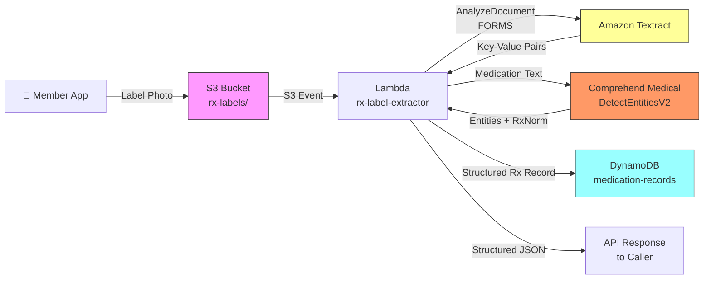

# Recipe 1.7: Prescription Label OCR 🔶

**Complexity:** Simple · **Phase:** Phase 2 · **Estimated Cost:** ~$0.08 per label

---

After the vision-model, dual-path, A2I architecture of Recipe 1.6, this recipe is deliberately focused. Prescription labels are highly structured, printed, single-page documents where the OCR-plus-NLP pipeline is the optimal choice. The goal here is to introduce medication ontology mapping (RxNorm, NDC) before the complexity returns for EOB processing in Recipe 1.8.

## The Problem

Someone just got out of the hospital. They're home, they're managing a new medication, and their care coordinator needs to know exactly what they're taking. The member opens their health plan's app and sees a prompt: "Upload a photo of your prescription label." They point their phone at the pill bottle, take a picture, and tap submit.

Now it's your problem.

The pill bottle is a cylinder. The label wraps around it. The photo has a slight curve. The lighting in their kitchen is uneven. They've already taken three pills from the bottle, so one corner of the label is a little worn. And the label itself reads something like: "Take 1 tab PO BID x 14d. Refills: 3. NDC: 0071-0155-23."

You need to turn that into this:

```json
{
  "drug_name": "Amoxicillin",
  "dosage": "500mg",
  "directions_decoded": "Take 1 tablet by mouth twice daily for 14 days",
  "rxnorm_id": "723",
  "ndc": "0071-0155-23",
  "refills_remaining": 3
}
```

Medication reconciliation sits at the heart of care transitions. When a patient moves from hospital to home, from primary care to specialist, from one plan year to the next, the handoff between care settings creates risk. A 2019 study published in JAMA found that adverse drug events were among the most common preventable patient safety incidents after hospital discharge. A significant portion of those trace back to incomplete or inaccurate medication information: the wrong dosage transcribed, the discontinued medication that stayed on the active list, the new prescription that nobody captured.

Health plans need accurate medication data to support medication management programs, identify adherence gaps, flag drug-drug interactions, and coordinate care across providers. But members don't think in NDC codes. They have a bottle in their hand. The gap between "bottle in hand" and "structured medication record" is where this recipe lives.

Prescription labels are, on the surface, simpler than many documents you'll encounter in healthcare. They're standardized by state pharmacy regulations. They're printed, not handwritten. They come from a constrained set of pharmacy chains (which helps with layout prediction). And they carry a finite set of fields.

But they are deceptively tricky to extract, for a handful of reasons that will cost you time if you don't plan for them. Let's get into why, before we talk about how to solve it.

---

## The Technology

### OCR on Curved Surfaces

If you've read Recipe 1.1 (Insurance Card Scanning), you already understand how modern OCR works at a conceptual level. Convolutional neural networks trained on millions of document images, character-region detection, bounding box coordinates that encode spatial relationships. All of that applies here.

What's different about prescription labels is the geometry.

An insurance card is flat. A prescription bottle is a cylinder. When you photograph a flat card, the text lies in a single plane relative to the camera. When you photograph a bottle, the text follows the curve of the cylinder. Characters near the edges of the label are at an angle relative to the camera lens, and this introduces geometric distortion that can make the edges of the label harder to read.

(For tightly printed labels, this matters a lot. For labels with generous font sizes, it matters less. The reality is that consumer medication bottle labels tend to use 8-10 point type to pack a lot of content into a small surface, so the curved-edge problem shows up more than you'd expect.)

There are a few ways to handle this in practice. The first is to accept the distortion and rely on modern OCR's robustness. State-of-the-art OCR models have seen enough real-world document photos that they handle moderate curvature reasonably well. The second is image preprocessing: undistortion algorithms can attempt to dewarp a cylindrical surface projection back to a flat plane before OCR runs. The third, most practical for a mobile app, is UX guidance: tell the member to lay the bottle on its side on a flat surface so the label faces the camera flat-on, and capture the front-facing portion of the label only. For most use cases, UX guidance is the highest-leverage improvement, and it costs you nothing in the OCR pipeline.

### Semi-Structured Documents with Constrained Vocabulary

Prescription labels are semi-structured. Every label has a drug name, a dosage, directions, a prescriber, a pharmacy, an Rx number, a fill date, and a refills count. The fields are consistent across labels. The layout varies by pharmacy chain, and the label text varies by how each pharmacy software system formats the same data.

CVS Pharmacy might print "Directions: Take 1 tablet by mouth twice daily." Walgreens might print "SIG: 1 TAB PO BID." A regional independent might print "Instructions: Take 1 cap 2x/day." All three say the same thing. Your extraction system needs to handle all three and normalize them to the same canonical representation.

This is the key-value problem from Recipe 1.1, applied to a pharmacy domain. The challenge here is narrower than insurance cards (there are fewer unique pharmacy chains than payers), but the directions field introduces a wrinkle: pharmacy abbreviations.

### Pharmacy Abbreviations and SIG Codes

The "SIG" field on a prescription label is the patient instruction line. SIG comes from the Latin "signa," meaning "label." Pharmacists have been using Latin abbreviation systems for drug instructions since before modern medicine. The system never really went away.

Here is what you will encounter:

| Abbreviation | Latin Origin | Meaning |
|---|---|---|
| QD or QDay* | quaque die | once daily |
| BID | bis in die | twice daily |
| TID | ter in die | three times daily |
| QID | quater in die | four times daily |
| PRN | pro re nata | as needed |
| PO | per os | by mouth |
| SL | sub lingua | under the tongue |
| AC | ante cibum | before meals |
| PC | post cibum | after meals |
| QHS | quaque hora somni | at bedtime |
| Q4H, Q6H, Q8H | quaque 4/6/8 hora | every 4/6/8 hours |
| TAB | tabella | tablet |
| CAP | capsula | capsule |
| GTT | gutta | drop |
| UD | ut dictum | as directed |

> *ISMP recommends against using "QD" in clinical documentation because it is frequently misread as "QID" (four times daily), a potentially dangerous dosing error. Included here because it still appears on older labels and in legacy pharmacy systems. When building patient-facing output, use "daily" instead of "QD."

A line like "Take 1 TAB PO BID x 14d PRN pain" is perfectly clear to a pharmacist and completely opaque to any downstream system that doesn't know the codebook. Parsing these abbreviations into human-readable, machine-processable text is a necessary step.

The good news: the SIG codebook is finite and well-established. There are about 150 common abbreviations that cover the vast majority of real-world prescriptions. Building a lookup table is straightforward. The tricky part is handling the abbreviations that have overlapping meanings in context: "QD" means "once daily" as a frequency, but some pharmacies use it inconsistently, and the similar-looking "QID" means "four times daily." Case-insensitive parsing with word-boundary matching handles most of the edge cases.

### Medical Ontologies: What RxNorm and NDC Actually Are

Here is where this recipe goes beyond what Recipe 1.1 covered, because prescription labels connect to two critical healthcare standards that are worth understanding before you try to map to them.

**NDC codes** are the National Drug Code, a unique identifier assigned by the FDA to every drug product sold in the United States. The FDA originally defined NDC codes in a 10-digit format with several possible segment structures (5-3-2, 5-4-1, or 4-4-2). HIPAA-mandated electronic transactions standardized the format to 11 digits using a zero-padded 5-4-2 structure: a 5-digit labeler code (the manufacturer), a 4-digit product code (the specific drug and strength), and a 2-digit package code (the package size and type). Labels typically use the FDA format (often 10 digits); downstream interoperability systems generally expect the 11-digit HIPAA-standardized form. The conversion is padding, not transformation. The NDC for "Amoxicillin 500mg capsules, 100 count from a specific manufacturer" is different from the NDC for "Amoxicillin 500mg capsules, 500 count from the same manufacturer," which is different from the NDC for the same drug from a different manufacturer. NDC codes are on every prescription label by law (in most states) and in most pharmacy dispensing systems. They are the most precise drug identifier available.

The problem with NDC codes for interoperability is that they identify the specific physical package dispensed. If you want to ask "is this the same drug as the one on the patient's existing medication list," you need to handle the fact that a fill at a different pharmacy, or a different package size, or a generic substitution, will have a different NDC. This is where RxNorm comes in.

**RxNorm** is a standardized drug nomenclature maintained by the National Library of Medicine. Where NDC identifies a specific packaged product, RxNorm identifies the clinical drug at an abstract level. The RxNorm concept ID for "Lisinopril 10mg oral tablet" is the same regardless of which manufacturer made it, which pharmacy dispensed it, or how it was packaged. Every NDC can be mapped to one or more RxNorm concept IDs via the NLM's RxNorm database.

For medication reconciliation, interoperability, and clinical decision support, RxNorm is the right identifier to work with. The pipeline in this recipe extracts the NDC directly from the label (it's printed there), then uses medical NLP to map the drug name and dosage to the corresponding RxNorm concept, giving downstream systems both the specific-product identifier and the clinical-equivalence identifier.

### Medical NLP for Entity and Concept Extraction

OCR turns an image into text. Medical NLP turns that text into structured clinical knowledge. The two are different problems, and you need both.

Once you have the raw text from a prescription label, you have things like "Lisinopril 10mg" and "Take 1 tablet by mouth once daily." Medical NLP systems are trained on clinical text to identify the named entities in those strings: the medication name, the dosage, the route of administration, the frequency. Beyond entity recognition, specialized systems can then link those entities to standard clinical ontologies: this detected medication entity maps to RxNorm concept 314076 ("lisinopril 10 MG Oral Tablet").

This entity extraction and ontology linking is what makes the pipeline interoperable. A downstream FHIR MedicationStatement resource, a pharmacy benefit system, a clinical decision support tool: all of them speak RxNorm. Giving them a raw string like "Lisinopril 10mg" forces them to do their own normalization, inconsistently. Giving them a RxNorm concept ID means everyone is speaking the same language.

### The General Architecture Pattern

The pipeline for prescription label OCR looks like this:

```
[Capture] → [OCR / KVP Extraction] → [Field Normalization + SIG Parsing]
         → [Medical NLP (Medication Entities + RxNorm)] → [Store] → [Expose via API]
```

**Capture:** A mobile photo of the pill bottle, a portal upload, or a scanned label from a point-of-care device. Quality guidance at capture time (lay the bottle flat, ensure good lighting) is the highest-leverage quality improvement and has no computational cost.

**OCR / KVP Extraction:** Pass the image to a document intelligence service that returns key-value pairs, not just raw text. For single-page structured labels, synchronous processing is appropriate. Results come back in under 3 seconds.

**Field Normalization and SIG Parsing:** Map the extracted labels to canonical field names across pharmacy chains. Decode SIG abbreviations from the directions field into human-readable text.

**Medical NLP:** Pass the extracted medication name and dosage through a clinical entity extraction model that identifies MEDICATION entities and links them to RxNorm concept IDs. This step bridges the raw OCR output to the clinical ontology layer.

**Store:** Write the structured medication record to a queryable store with appropriate PHI controls. The record should carry both the raw extracted values and the normalized/linked values for auditability.

**Expose via API:** Downstream systems consume the structured medication record. In a member-facing app, this can be synchronous (return the structured record immediately). In bulk processing, async is fine.

---

## The AWS Implementation

### Why These Services

**Amazon Textract for OCR and key-value extraction.** The same justification as Recipe 1.1 applies here: the `AnalyzeDocument` API with the `FORMS` feature type understands the 2D spatial structure of the label and returns matched key-value pairs rather than a flat string of characters. For a label that prints "SIG: Take 1 tab PO BID," FORMS mode will pair the key "SIG" with the value "Take 1 tab PO BID" as a matched unit. That spatial relationship detection is exactly what makes the downstream normalization tractable. Basic OCR gives you characters; FORMS gives you structure.

**Amazon Comprehend Medical for medication entity extraction and RxNorm linking.** Comprehend Medical's `DetectEntitiesV2` API is trained specifically on clinical and pharmaceutical text. When you pass it a string like "Lisinopril 10mg oral tablet," it identifies the MEDICATION entity, pulls out its attributes (dosage: "10mg", route: "oral"), and returns the RxNorm concept IDs that correspond to the detected entity. This is the linkage between raw OCR text and the clinical ontology layer that interoperability requires. A general-purpose NLP model would not reliably handle medication entity extraction or RxNorm mapping; Comprehend Medical is the purpose-built tool for this.

**Amazon S3 for image storage.** Prescription label images contain PHI: patient name, date of birth (sometimes), medication, prescriber, pharmacy. They need encrypted at-rest storage with an audit trail. S3 with SSE-KMS and CloudTrail logging is the standard answer. S3 event notifications provide a clean trigger to kick off extraction without polling.

**AWS Lambda for orchestration.** The extraction pipeline is a short-lived sequence of API calls: fetch the image from S3, call Textract, parse the response, normalize fields, decode SIG, call Comprehend Medical, assemble the structured record, write to DynamoDB. Lambda fits this workload exactly: stateless, event-driven, scales with request volume, and you pay only for execution time. For member-facing synchronous use (upload image, get structured record back immediately), put API Gateway in front.

> **API Security.** The API Gateway endpoint accepting label uploads must require authentication (Cognito User Pools or IAM SigV4). Add a usage plan with rate limits and configure WAF rules to block oversized requests and malformed content types. A public API accepting prescription label images without authentication is a PHI ingest endpoint that could be abused for data exfiltration or denial-of-service attacks.

**Amazon DynamoDB for medication record storage.** The access patterns for medication records are point lookups: find all records for this member, find this specific Rx number, find all records with a given NDC. DynamoDB's key-value model handles these well. It's fully managed, encrypts at rest by default, and is on the AWS HIPAA eligible services list.

### Architecture Diagram



### Prerequisites

| Requirement | Details |
|---|---|
| **AWS Services** | Amazon Textract, Amazon Comprehend Medical, Amazon S3, AWS Lambda, Amazon DynamoDB |
| **IAM Permissions** | `textract:AnalyzeDocument`, `comprehendmedical:DetectEntitiesV2`, `s3:GetObject`, `s3:PutObject`, `dynamodb:PutItem`, `dynamodb:GetItem` |
| **BAA** | AWS BAA signed (required: prescription labels contain PHI including patient name, medication, and prescriber) |
| **Encryption** | S3: SSE-KMS; DynamoDB: encryption at rest enabled (default); all API calls over TLS |
| **VPC** | Production: Lambda in VPC with VPC endpoints for S3, Textract, Comprehend Medical, and DynamoDB. Add the CloudWatch Logs endpoint or Lambda cannot write audit logs from a private subnet. |
| **CloudTrail** | Enabled: log all Textract, Comprehend Medical, and S3 API calls for HIPAA audit trail |
| **Sample Data** | Synthetic prescription labels. Create samples across major pharmacy chains (CVS, Walgreens, Rite Aid, independent) with varied fonts and layouts. Never use real member labels in development. The [FDA NDC Database](https://www.accessdata.fda.gov/scripts/cder/ndc/) provides real NDC codes for use in synthetic test data. |
| **Cost Estimate** | Textract AnalyzeDocument (FORMS): $0.05/page. Comprehend Medical DetectEntitiesV2: $0.01 per 100 characters (a typical label runs 300-500 characters: ~$0.03-$0.05). Total: ~$0.08-$0.10 per label. Lambda and DynamoDB costs are negligible at this scale. |

### Ingredients

| AWS Service | Role |
|---|---|
| **Amazon Textract** | Extracts key-value pairs from the label image using FORMS mode |
| **Amazon Comprehend Medical** | Identifies MEDICATION entities and returns RxNorm concept IDs via DetectEntitiesV2. Comprehend Medical is available in a subset of AWS regions. Verify your target region supports it before selecting your deployment region. |
| **Amazon S3** | Stores incoming label images; encrypted at rest with KMS |
| **AWS Lambda** | Orchestrates the full pipeline: Textract extraction, field normalization, SIG parsing, RxNorm mapping |
| **Amazon DynamoDB** | Stores structured medication records for downstream lookup |
| **AWS KMS** | Manages encryption keys for S3 and DynamoDB |
| **Amazon CloudWatch** | Logs, metrics, and alarms for extraction failures and latency |

### Code

> **Reference implementations:** The following AWS sample repos demonstrate the patterns used in this recipe:
>
> - [`amazon-textract-code-samples`](https://github.com/aws-samples/amazon-textract-code-samples): General Textract code samples including FORMS extraction and key-value pair parsing
> - [`amazon-textract-textractor`](https://github.com/aws-samples/amazon-textract-textractor): Python SDK wrapper that simplifies calling and parsing Textract responses (installable via pip as `amazon-textract-textractor`)
> - [`amazon-textract-and-amazon-comprehend-medical-claims-example`](https://github.com/aws-samples/amazon-textract-and-amazon-comprehend-medical-claims-example): Healthcare-specific example combining Textract and Comprehend Medical for structured data extraction from medical documents

#### Walkthrough

**Step 1: Textract extraction.** When a label image arrives in the S3 bucket, the pipeline wakes up automatically and sends it to Amazon Textract for analysis. As in Recipe 1.1, the critical choice is requesting FORMS extraction rather than basic OCR. FORMS mode understands spatial relationships: it recognizes that "SIG" and "Take 1 tab PO BID" appear adjacent to each other on the label, and it returns them as a matched key-value pair rather than two disconnected strings. Prescription labels are single-page and synchronous processing is appropriate: results come back in under 3 seconds. Skip FORMS and request plain text detection, and everything downstream falls apart: you're trying to reconstruct structure from a flat string, and accuracy drops significantly.

```
FUNCTION extract_label(bucket, key):
    // Send the label image to Textract for intelligent analysis.
    // "bucket" is the name of the S3 storage container; "key" is the filename/path.
    response = call Textract.AnalyzeDocument with:
        document  = S3 object at bucket/key   // locate the image in cloud storage
        features  = ["FORMS"]                 // FORMS mode: return matched label-value pairs,
                                              // not just a flat string of characters
    RETURN response
```

**Step 2: Parse key-value pairs.** Textract returns a collection of text blocks connected by relationship links. This step walks that structure and assembles the matched key-value pairs, along with confidence scores indicating how clearly each piece of text was read. The output is a map from raw label text (whatever the pharmacy printed, e.g., "SIG", "Rx #", "Dispense Date") to extracted value text, with a confidence score for each pair. Think of it as sorting through labeled index cards and connecting each label to its matching answer. Skip this step and you're left with raw building blocks; no downstream logic can use them.

```
FUNCTION parse_key_value_pairs(textract_response):
    // Pull out all detected text regions from Textract's response.
    blocks    = textract_response.Blocks

    // Build a lookup index: block ID -> block data.
    // Textract connects labels to values by referencing block IDs.
    block_map = build map of block.Id -> block for all blocks

    // This holds our results: label text -> { value text, confidence score }.
    key_values = empty map

    FOR each block in blocks:
        // Only process KEY_VALUE_SET blocks that are the KEY side of a pair.
        // Textract marks each pair half as KEY (the label) or VALUE (the answer).
        IF block.BlockType == "KEY_VALUE_SET" AND block is a KEY entity:

            // Assemble the label text (e.g., "SIG", "Rx Number", "Dispense Date")
            key_text    = get concatenated text from block's CHILD blocks in block_map

            // Follow the link to the paired VALUE block
            value_block = follow block's VALUE relationship to find the linked value block

            // Assemble the value text (e.g., "Take 1 tab PO BID", "7284910", "02/28/2026")
            value_text  = get concatenated text from value_block's CHILD blocks in block_map

            // Record the lower of the two confidence scores.
            // If either the key or the value was hard to read, flag both.
            confidence  = minimum of (block.Confidence, value_block.Confidence)

            key_values[key_text] = { value: value_text, confidence: confidence }

    RETURN key_values
```

**Step 3: Normalize pharmacy fields.** Every pharmacy chain prints prescription labels differently. "Drug Name," "Medication," and "Rx" all mean the same field. "SIG" and "Directions" and "Instructions" all point to the patient instruction line. "Refills" and "Refills Remaining" and "Refills Left" all contain the same count. This step maps whatever labels Textract found on a given label to a consistent set of canonical field names. The mapping table (RX_FIELD_MAP) is the operational knowledge base of this recipe: it encodes real-world pharmacy label layouts and requires maintenance as new layouts are encountered. The NDC field is especially important to capture correctly: it is printed on most labels in 10-digit format and is the most reliable structured identifier for the specific drug dispensed. Skip this step and you have accurate text with no reliable way to use it across chains.

```
RX_FIELD_MAP = {
    "drug_name":    ["drug name", "medication", "medication name", "drug", "rx", "product"],
    "dosage":       ["strength", "dosage", "dose", "potency"],
    "quantity":     ["qty", "quantity", "qty dispensed", "disp qty", "#"],
    "directions":   ["sig", "directions", "instructions", "take", "use", "dir"],
    "prescriber":   ["prescriber", "doctor", "physician", "prescribed by", "dr.", "provider"],
    "pharmacy":     ["pharmacy", "store", "dispensed by", "location"],
    "rx_number":    ["rx #", "rx number", "prescription #", "rx no", "prescription number"],
    "refills":      ["refills", "refills remaining", "refills left", "rfl", "ref"],
    "days_supply":  ["days supply", "day supply", "days", "supply"],
    "date_filled":  ["date filled", "fill date", "dispensed", "disp date", "date"],
    "ndc":          ["ndc", "ndc #", "national drug code", "ndc code"],
    "lot_number":   ["lot", "lot #", "lot number"]
}

FUNCTION normalize_rx_fields(raw_kv):
    normalized = empty map

    FOR each canonical_name, variants in RX_FIELD_MAP:
        FOR each raw_key, raw_val in raw_kv:
            // Compare case-insensitively and strip whitespace
            IF lowercase(trim(raw_key)) is in variants:
                normalized[canonical_name] = {
                    value:      trim(raw_val.value),
                    confidence: raw_val.confidence
                }
                BREAK   // found a match for this canonical field

    RETURN normalized
```

**Step 4: Decode SIG abbreviations.** The directions field from a prescription label reads like "Take 1 TAB PO BID x 14d PRN pain." A human pharmacist reads this instantly. A downstream care management system or FHIR document cannot. This step decodes the pharmacy abbreviation shorthand in the directions field into plain language. It works as a word-level lookup: split the directions string on spaces, check each word against the SIG codebook, substitute the decoded meaning if found, and reassemble the string. The output is human-readable and machine-processable text that downstream systems can display to members and parse for structured frequency and route information. Skip this step and your medication records carry an abbreviation string that every consumer of the data has to decode independently, inconsistently.

```
SIG_CODES = {
    // Frequency codes
    "qd":   "once daily",
    "qdaily": "once daily",
    "bid":  "twice daily",
    "tid":  "three times daily",
    "qid":  "four times daily",
    "qhs":  "at bedtime",
    "prn":  "as needed",
    "stat": "immediately",
    "q4h":  "every 4 hours",
    "q6h":  "every 6 hours",
    "q8h":  "every 8 hours",
    "q12h": "every 12 hours",
    "ud":   "as directed",

    // Route codes
    "po":   "by mouth",
    "sl":   "under the tongue",
    "pr":   "rectally",
    "top":  "topically",
    "inh":  "inhaled",
    "inj":  "by injection",

    // Timing codes
    "ac":   "before meals",
    "pc":   "after meals",
    "hs":   "at bedtime",

    // Dose form codes
    "tab":  "tablet",
    "tabs": "tablets",
    "cap":  "capsule",
    "caps": "capsules",
    "ml":   "milliliter",
    "gtt":  "drop",
    "gtts": "drops",
    "supp": "suppository",
    "soln": "solution",
    "susp": "suspension"
}

FUNCTION decode_sig(raw_sig):
    // Split the directions string on whitespace
    words   = split raw_sig on whitespace

    // For each word, check the codebook (case-insensitive)
    decoded = []
    FOR each word in words:
        lookup = lowercase(trim(word))
        IF lookup is in SIG_CODES:
            append SIG_CODES[lookup] to decoded
        ELSE:
            // Pass through any word that isn't a recognized abbreviation
            // (numbers, drug names, durations like "14d", custom text)
            append word to decoded

    RETURN join decoded with single space
```

**Step 5: Map to RxNorm via Comprehend Medical.** This step takes the raw medication text (drug name and dosage extracted from the label) and passes it through Comprehend Medical's `DetectEntitiesV2` API. DetectEntitiesV2 is trained on clinical text to identify MEDICATION entities and their attributes (dosage, route, frequency), and it returns RxNorm concept IDs that correspond to each detected medication. The RxNorm concept ID is the clinical-equivalence identifier: it's the same for Lisinopril 10mg oral tablet regardless of manufacturer, package size, or dispensing pharmacy. This is what downstream systems need for medication reconciliation, drug interaction checking, and formulary matching. A confidence threshold filters out low-confidence mappings. Only include RxNorm concepts where the model is at least 70% confident in the linkage.

```
RXNORM_CONFIDENCE_THRESHOLD = 0.70  // discard low-confidence RxNorm mappings

FUNCTION map_to_rxnorm(drug_name, dosage):
    // Combine drug name and dosage into a single text string for the API.
    // More context generally improves entity detection accuracy.
    medication_text = drug_name + " " + dosage
    // e.g., "Lisinopril 10mg"

    // Call Comprehend Medical to detect medication entities and RxNorm concepts.
    // DetectEntitiesV2 handles clinical vocabulary and understands medication entity structure.
    response = call ComprehendMedical.DetectEntitiesV2 with:
        text = medication_text

    rxnorm_mappings = []

    FOR each entity in response.Entities:
        // Only process MEDICATION category entities.
        // DetectEntitiesV2 also detects MEDICAL_CONDITION, TEST_TREATMENT_PROCEDURE, etc.
        // We want only the medication entities for this step.
        IF entity.Category == "MEDICATION":

            // Each entity can carry one or more RxNorm concept candidates, ranked by confidence.
            FOR each concept in entity.RxNormConcepts:
                IF concept.Score >= RXNORM_CONFIDENCE_THRESHOLD:
                    // Record the mapping: text as detected, RxNorm ID, human-readable description
                    append to rxnorm_mappings:
                        {
                            detected_text:   entity.Text,       // what Comprehend Medical read
                            rxnorm_id:       concept.Code,      // standard RxNorm concept ID
                            description:     concept.Description, // e.g., "lisinopril 10 MG Oral Tablet"
                            confidence:      round(concept.Score, 3)
                        }

    // Return the list of matched concepts, sorted by confidence descending.
    // The first entry is the highest-confidence RxNorm match.
    RETURN sort rxnorm_mappings by confidence descending
```

**Step 6: Validate NDC and compute refill metrics.** Before writing the final record, two quick validation steps add significant downstream value. First, validate the extracted NDC code: NDC codes have a well-defined format (either 10-digit or 11-digit with hyphens) and can be verified against a known pattern. A malformed NDC indicates either an extraction error or a label format you haven't seen before. Flag it rather than silently passing a bad identifier downstream. Second, compute refill metrics from the raw label fields. "Refills: 3" tells you the remaining count. The days supply field tells you how long one fill lasts. Together, they give you the days of medication coverage remaining, which is directly useful for medication adherence programs and care gap identification. These calculations are simple arithmetic, but doing them here centralizes the logic so every consumer of the medication record gets the same computed values.

```
FUNCTION validate_ndc(ndc_raw):
    // Remove hyphens and whitespace for validation
    ndc_clean = remove all hyphens and spaces from ndc_raw

    // Standard NDC is 10 digits. Some systems use an 11-digit representation.
    // Validate by checking that the cleaned value is 10 or 11 numeric digits.
    IF ndc_clean matches pattern "^[0-9]{10,11}$":
        RETURN { valid: true, ndc_normalized: ndc_clean }
    ELSE:
        RETURN { valid: false, ndc_raw: ndc_raw, error: "NDC format not recognized" }

FUNCTION compute_refill_metrics(refills_remaining_str, days_supply_str):
    // Parse the raw string values from the label (e.g., "3", "30")
    refills_remaining = parse integer from refills_remaining_str
    days_supply       = parse integer from days_supply_str

    // Total days of medication coverage if all refills are filled:
    // current fill + remaining refills, each covering days_supply
    total_days_remaining = (1 + refills_remaining) * days_supply

    RETURN {
        refills_remaining:    refills_remaining,
        days_supply:          days_supply,
        total_days_remaining: total_days_remaining
        // total_days_remaining drives downstream adherence gap detection
    }
```

**Step 7: Assemble and store the medication record.** The final step assembles all pipeline outputs into a single record and writes it to the database. Every field carries both the raw extracted value (what the label actually said) and the normalized or decoded value (what it means). This dual representation is important for auditability: when a care coordinator or pharmacist reviews a record, they can see both what the label printed and how the system interpreted it. Any field that fell below the confidence threshold, any NDC that failed validation, and any failed RxNorm mappings are recorded in a flags array so downstream systems and review queues know exactly what needs a human eye.

```
CONFIDENCE_THRESHOLD = 90.0  // same threshold as Recipe 1.1; fields below this go to human review

FUNCTION store_medication_record(image_key, normalized_fields, rxnorm_mappings, ndc_validation, refill_metrics):
    // Separate high-confidence fields from those needing review
    clean_fields   = { field: data.value for field, data in normalized_fields
                       where data.confidence >= CONFIDENCE_THRESHOLD }
    flagged_fields = [ { field: field, extracted_value: data.value, confidence: data.confidence }
                       for field, data in normalized_fields
                       where data.confidence < CONFIDENCE_THRESHOLD ]

    // Add NDC validation flags if needed
    IF ndc_validation.valid == false:
        append to flagged_fields: { field: "ndc", issue: ndc_validation.error }

    write record to database table "medication-records":
        image_key            = image_key
        extraction_timestamp = current UTC timestamp (ISO 8601)
        fields               = clean_fields
        directions_decoded   = decoded SIG text from Step 4
        ndc_validated        = ndc_validation
        rxnorm_mappings      = rxnorm_mappings           // list of matched RxNorm concepts
        refill_metrics       = refill_metrics            // days coverage, refills remaining
        flagged_fields       = flagged_fields
        needs_review         = (length of flagged_fields > 0)
```

> **Curious how this looks in Python?** The pseudocode above covers the concepts. If you'd like to see sample Python code that demonstrates these patterns using boto3, check out the [Python Example](chapter01.07-python-example). It walks through each step with inline comments and notes on what you'd need to change for a real deployment.

---

### Expected Results

**Sample output for a typical printed label:**

```json
{
  "image_key": "rx-labels/2026/03/01/label-00182.jpg",
  "extraction_timestamp": "2026-03-01T14:22:08Z",
  "fields": {
    "drug_name": "Amoxicillin",
    "dosage": "500mg",
    "quantity": "21",
    "rx_number": "7284910",
    "prescriber": "Dr. Sarah Chen",
    "pharmacy": "CVS Pharmacy #4821",
    "date_filled": "02/28/2026",
    "ndc": "00093-4155-21"
  },
  "directions_raw": "Take 1 CAP PO TID x 7d",
  "directions_decoded": "Take 1 capsule by mouth three times daily for 7 days",
  "ndc_validated": {
    "valid": true,
    "ndc_normalized": "00093415521"
  },
  "rxnorm_mappings": [
    {
      "detected_text": "Amoxicillin 500mg",
      "rxnorm_id": "723",
      "description": "Amoxicillin 500 MG Oral Capsule",
      "confidence": 0.964
    }
  ],
  "refill_metrics": {
    "refills_remaining": 0,
    "days_supply": 7,
    "total_days_remaining": 7
  },
  "flagged_fields": [],
  "needs_review": false
}
```

**Performance benchmarks:**

| Metric | Typical Value |
|---|---|
| End-to-end latency | 2-4 seconds |
| Field extraction accuracy (flat, well-lit labels) | 93-98% |
| Field extraction accuracy (curved/worn labels) | 75-90% |
| SIG decoding accuracy | 95-99% (known abbreviations) |
| RxNorm mapping accuracy | 88-96% |
| NDC extraction accuracy | 95-99% (when present and printed clearly) |
| Cost per label | ~$0.08-$0.10 |
| Throughput | ~30 labels/second (Lambda concurrency limited) |

**Where it struggles:** Curved label photos where text near the bottle edges is distorted. Partially peeled or worn labels where key fields (often the NDC or Rx number) are damaged. Compounding pharmacy labels, which have non-standard formats and often hand-typed dosage instructions. Labels that mix brand name and generic name in different font sizes, which can confuse the drug name extraction. Medication names that are very similar (Hydroxyzine vs. Hydroxyurea: easy to confuse when OCR has low confidence on one or two characters). And labels photographed at steep angles despite your best UX guidance in the app.

---

## Why This Isn't Production-Ready

The pseudocode and architecture above demonstrate the pattern. A real deployment needs additional work in a few specific areas.

**EXIF metadata on mobile photos.** Members take photos of their pill bottles with smartphones. Those photos contain EXIF metadata including GPS coordinates, which is effectively the member's home address. Strip EXIF data before storing the image in S3. A one-line Pillow call (`image.getexif().clear()`) or an S3 Lambda@Edge function handles this, but skipping it means you're storing location data alongside PHI with no business justification.

**Log sanitization.** The Lambda functions extract medication names, dosages, and prescriber information. Without explicit log sanitization, those values appear in CloudWatch Logs at INFO level. Log the field names ("extracted: drug_name, dosage, refills_remaining") but not the values. Encrypt CloudWatch Log Groups with a CMK and restrict access to authorized personnel.

**SIG parsing coverage.** The abbreviations in the walkthrough are the common ones, but a real codebook needs ~150+ entries including routes (IM, IV, SubQ), ophthalmic (OD/OS/OU), and compound frequencies (q4-6h). The parser also needs to handle punctuation attached to tokens ("BID.", "PRN/pain"). Build logging around unrecognized tokens: capture them, review regularly, and expand the codebook. This is ongoing maintenance, not one-time setup.

**RxNorm concept selection.** DetectEntitiesV2 returns multiple RxNorm candidate concepts, ranked by confidence. The walkthrough returns all concepts above the threshold. In practice, you often want the highest-confidence single concept for downstream use. Decide whether you want the most specific concept (matching strength and dose form) or the ingredient-level concept (generalizes across packages). That choice depends on your use case: formulary matching needs specificity; interaction checking works at ingredient level. Also consider returning the concept type (TTY: IN vs. SCD vs. SBD) so downstream systems can route appropriately.

**Dead Letter Queue.** Same gap as Recipe 1.1: Lambda on S3 events is asynchronous, and failed events retry and disappear. In a medication management pipeline, a silently dropped label means a gap in the member's medication record with no visible signal. Configure an SQS dead letter queue and set a CloudWatch alarm on queue depth.

**Idempotency.** S3 delivers event notifications at least once. Without a conditional write in DynamoDB (check for existing record with the same `image_key` before writing), the same label photo can create duplicate records. Use a conditional expression on the DynamoDB write.

**NDC validation goes further than format checking.** A 10-digit string in the right format is a well-formed NDC. Whether it corresponds to a real drug product requires a lookup against the FDA NDC database. For medication reconciliation programs, consider validating extracted NDCs against a regularly-refreshed copy of the FDA NDC dataset.

---

## The Honest Take

This one is in the "sounds easy, has real edge cases" category. The first 80% of labels you test will process beautifully. Then you'll hit a compounding pharmacy label, or a bottle photographed by a member who tilted their phone 30 degrees, or a label where the NDC field was reprinted over the original and the text overlaps.

The curved label problem is the one that catches most teams off-guard. It's not catastrophic: modern OCR handles moderate curvature surprisingly well. But "surprisingly well" is not the same as "correctly." The characters at the far edges of a wrapped label can have 10-15% higher error rates than the center of the label, and the fields most likely to live at the edges are the ones with the most characters: the drug name and the directions. Budget for it.

The SIG codebook is the part that requires the most ongoing maintenance. Latin pharmacy abbreviations are standardized in principle and inconsistent in practice. Individual pharmacies and pharmacy software systems add their own shorthand. "Inject 0.5 mL SubQ QW" and "Inject 0.5 mL SC every week" are the same instruction from different systems. Build the unrecognized-token logging on day one: you'll need it.

The RxNorm confidence cutoff is a tradeoff to calibrate for your use case. The 70% threshold in the walkthrough is a starting point, not a gospel number. For medication reconciliation in a clinical program, you might want 85%+: a wrong RxNorm mapping in a drug interaction checker produces a false safety signal that a clinician has to investigate. For a member-facing informational display, 70% might be fine. Know your downstream use case before you pick the threshold.

The thing I didn't anticipate building the first version of this: days supply is sometimes absent from the label. State regulations on what must appear on a prescription label vary, and some states don't require days supply to be printed. Your refill metrics logic needs to handle missing fields gracefully rather than throwing an exception when the field isn't found.

---

## Variations and Extensions

**Drug interaction checking.** After mapping to RxNorm, cross-reference the detected medication against the member's full active medication list and flag potential drug-drug interactions. The National Library of Medicine's RxNorm API includes drug interaction data via the Drug Interaction API endpoint (no separate subscription required). This turns the label scan into a real-time safety check: member scans a new prescription, system checks it against their medication history before they take their first dose.

**Formulary matching and cost transparency.** Take the extracted NDC and RxNorm concept and look them up against the member's plan formulary tier table. Return the copay, the tier, and (if applicable) a lower-cost therapeutically equivalent alternative. This is the use case that generates the most immediate member value: "here's what this medication will cost you, and here's a $4 alternative." Recipe 3.3 (Medication Reconciliation) builds this out as a full pipeline.

**Multi-label medication list building.** Accept a batch of label photos in sequence, run each through the pipeline, deduplicate (same RxNorm concept from different fill dates is one medication, not two), and produce a reconciled medication list in FHIR MedicationStatement format. This is the care transition use case: a patient with six medications holds up each bottle in turn, and the app builds a complete reconciled medication list that can be sent to the receiving care team. Recipe 3.3 covers this integration.

---

## Related Recipes

- **Recipe 1.1 (Insurance Card Scanning):** The structural twin: same synchronous Textract FORMS pattern, same confidence gating, same DynamoDB storage model. If you've built 1.1, the Textract layer of this recipe will feel familiar.
- **Recipe 1.3 (Lab Requisition Form Extraction):** Uses the same Comprehend Medical NLP layer for entity extraction, but maps to ICD-10 and SNOMED rather than RxNorm. Good context for how DetectEntitiesV2 handles different clinical entity categories.
- **Recipe 3.3 (Medication Reconciliation):** Consumes the structured medication records this recipe produces and builds a full reconciliation pipeline: deduplication, FHIR MedicationStatement generation, and care gap identification.

---

## Additional Resources

**AWS Documentation:**
- [Amazon Textract AnalyzeDocument API Reference](https://docs.aws.amazon.com/textract/latest/dg/API_AnalyzeDocument.html)
- [Amazon Textract FORMS Feature Type](https://docs.aws.amazon.com/textract/latest/dg/how-it-works-kvp.html)
- [Amazon Textract Pricing](https://aws.amazon.com/textract/pricing/)
- [Amazon Comprehend Medical DetectEntitiesV2 API Reference](https://docs.aws.amazon.com/comprehend-medical/latest/dev/API_DetectEntitiesV2.html)
- [Amazon Comprehend Medical RxNorm Ontology Linking](https://docs.aws.amazon.com/comprehend-medical/latest/dev/ontology-rxnorm.html)
- [Amazon Comprehend Medical Pricing](https://aws.amazon.com/comprehend/medical/pricing/)
- [AWS HIPAA Eligible Services Reference](https://aws.amazon.com/compliance/hipaa-eligible-services-reference/)
- [Architecting for HIPAA Security and Compliance on AWS](https://docs.aws.amazon.com/whitepapers/latest/architecting-hipaa-security-and-compliance-on-aws/welcome.html)

**AWS Sample Repos:**
- [`amazon-textract-code-samples`](https://github.com/aws-samples/amazon-textract-code-samples): General Textract code samples including FORMS extraction patterns
- [`amazon-textract-textractor`](https://github.com/aws-samples/amazon-textract-textractor): Python SDK wrapper for Textract that simplifies calling and parsing responses; installable via pip
- [`amazon-textract-and-amazon-comprehend-medical-claims-example`](https://github.com/aws-samples/amazon-textract-and-amazon-comprehend-medical-claims-example): Healthcare-specific pipeline combining Textract extraction with Comprehend Medical NLP for structured data extraction from medical documents

**External References:**
- [NLM RxNorm Technical Documentation](https://www.nlm.nih.gov/research/umls/rxnorm/docs/techdoc.html): Official NLM documentation for RxNorm concept structure, relationships, and the NDC-to-RxNorm mapping database
- [NLM RxNav Drug Interaction API](https://rxnav.nlm.nih.gov/InteractionAPIs.html): Free API for drug-drug interaction checking using RxNorm concept IDs; relevant for the drug interaction variation
- [FDA NDC Database](https://www.accessdata.fda.gov/scripts/cder/ndc/): Official FDA source for NDC code validation; downloadable in bulk for offline lookup
- [NCPDP SCRIPT Standard](https://www.ncpdp.org/Standards-Development/Standards-Information/SCRIPT-standard): The industry standard for electronic prescribing, useful context for understanding what structured prescription data looks like downstream
- [Pharmacy Abbreviations Reference (USP)](https://www.usp.org): United States Pharmacopeia maintains authoritative references on pharmaceutical abbreviations and nomenclature

---

## Estimated Implementation Time

| Scope | Time |
|---|---|
| **Basic** (Textract FORMS + field normalization + SIG decoding) | 3-5 hours |
| **Production-ready** (RxNorm mapping, NDC validation, refill metrics, confidence gating, VPC, KMS, CloudTrail, DLQ) | 2-3 days |
| **With variations** (drug interaction checking, formulary matching, multi-label reconciliation) | 1-2 weeks |

---

## Tags

`document-intelligence` · `ocr` · `textract` · `comprehend-medical` · `rxnorm` · `ndc` · `prescription` · `medication` · `pharmacy` · `sig-codes` · `simple` · `phase-2` · `lambda` · `s3` · `dynamodb` · `hipaa`

---

*← [Chapter 1 Index](chapter01-index) · ← [Recipe 1.6: Handwritten Clinical Note Digitization](chapter01.06-handwritten-clinical-note-digitization) · [Recipe 1.8: EOB Processing →](chapter01.08-eob-processing)*
