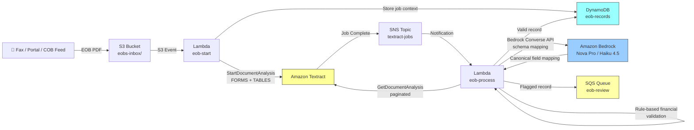

# Recipe 1.8 Architecture and Implementation: Explanation of Benefits Processing 🔶

*Companion to [Recipe 1.8: Explanation of Benefits Processing 🔶](chapter01.08-eob-processing). This page covers the AWS architecture, services, prerequisites, and pseudocode. For the problem framing and the conceptual approach, start with the main recipe.*

---

## The AWS Implementation

### Why These Services

**Amazon Textract for async table and forms extraction.** Textract's `StartDocumentAnalysis` API is the right tool for EOBs for the same reasons it was right for intake forms in Recipe 1.2: multi-page PDF support, combined FORMS plus TABLES extraction in a single job, and SNS-based async completion notification. The TABLES feature returns cells with `RowIndex` and `ColumnIndex` attributes, letting you reconstruct grids without depending on visual line detection. This handles borderless tables and densely-packed EOB layouts well. Run FORMS and TABLES in one job: Textract bills per page, not per feature type, so there's no cost reason to separate them.

**Amazon Bedrock for LLM schema mapping.** The Bedrock Converse API is the extraction intelligence layer: it receives the raw column headers from Textract and maps them to canonical EOB field names. The model doesn't do OCR (Textract did that), doesn't validate financials (rule-based code does that), and doesn't need clinical NLP capability. It needs to understand healthcare financial terminology and return structured JSON. That's a structured extraction task, not complex reasoning. It fits squarely in the mid-tier model range.

**Amazon Nova Pro or Claude Haiku 4.5 for the schema mapping call.** Both are the right tier for this task. Nova Pro runs at $0.80 per million input tokens, Haiku 4.5 at $1.00 per million. An EOB table header extraction call sends maybe 200-500 tokens (the column headers, a few sample rows, the schema description) and receives back a small JSON mapping. Cost per call: less than $0.001. That's the right price point for a call you're making on every non-profiled EOB. Claude Sonnet or Opus would work, but you're not buying anything with the extra capability for this task. Match the model to the complexity of the job.

**Two Lambda functions for the async pattern.** Same architecture as Recipe 1.2: one Lambda submits the Textract job on the S3 upload event, a second Lambda fires on the SNS completion notification and runs the schema mapping, financial validation, and DynamoDB write. The schema mapping Bedrock call happens inside the processing Lambda. For known high-volume payers, the processing Lambda skips the Bedrock call entirely and applies the static profile.

**Amazon DynamoDB for EOB records.** Write-once at extraction time, then lookup by claim number, member ID, or document key. The flexible schema handles variable structure well: not every EOB has the same number of line items, and the set of canonical fields populated varies by payer. Both the schema mapping result (including which path was used: static profile vs. Bedrock) and the financial validation output get stored alongside the record.

**Amazon SQS for the review queue.** Same as the original recipe. Decouples the routing decision from the review workflow. Flagged EOBs go to SQS with enough context (document key, claim number, specific validation errors or schema mapping failures) that reviewers know what to look for.

### Architecture Diagram



### Prerequisites

| Requirement | Details |
|-------------|---------|
| **AWS Services** | Amazon Textract, Amazon Bedrock, Amazon S3, AWS Lambda (x2), Amazon SNS, Amazon DynamoDB, Amazon SQS |
| **IAM Permissions** | `textract:StartDocumentAnalysis`, `textract:GetDocumentAnalysis`, `s3:GetObject`, `s3:PutObject`, `sns:Publish`, `dynamodb:PutItem`, `dynamodb:GetItem`, `sqs:SendMessage`, `iam:PassRole` (Lambda passing role to Textract for SNS publish), `bedrock:InvokeModel` scoped to the specific model ARNs used (Nova Pro and/or Haiku 4.5) |
| **Bedrock Model Access** | Enable Amazon Nova Pro (`amazon.nova-pro-v1:0`) or Claude Haiku 4.5 (`anthropic.claude-haiku-4-5-20251001-v1:0`) in Bedrock Model Access. This recipe uses cross-region inference profiles (`us.amazon.nova-pro-v1:0`, `us.anthropic.claude-haiku-4-5-v1`) for capacity routing; these route across us-east-1, us-east-2, and us-west-2. For strict version pinning in production, use full model ARNs rather than inference profile IDs. If your organization has state-level geographic data restrictions beyond HIPAA, evaluate using direct single-region model ARNs (without the `us.` prefix) rather than cross-region inference profiles. |
| **Textract Service Role** | A separate IAM role that Textract assumes to publish completion notifications to SNS. This is not the Lambda execution role. Create it explicitly with a trust policy for `textract.amazonaws.com` and `sns:Publish` on your specific topic ARN. Pass it in the `StartDocumentAnalysis` call. The Lambda execution role needs `iam:PassRole` to pass this role to Textract. Missing this is a common first-time setup failure: jobs complete silently and the processing Lambda never fires. |
| **BAA** | AWS BAA signed. EOBs contain member names, member IDs, service dates, provider names, and payment amounts. All constitute PHI under HIPAA. Amazon Bedrock is HIPAA-eligible under a BAA; models do not retain or train on data sent via Bedrock APIs. |
| **Encryption** | S3: SSE-KMS with customer-managed key. DynamoDB: encryption at rest enabled. SQS: server-side encryption with KMS. Lambda CloudWatch log groups: configure KMS encryption on each log group; Lambda does not do this automatically, and logs may contain fragments of extracted document content. All API calls over TLS. |
| **VPC** | Production: both Lambdas in a VPC with VPC interface endpoints for Textract, SNS, SQS, KMS, and CloudWatch Logs. S3 uses a gateway endpoint (free). DynamoDB can use either gateway or interface endpoint. For Bedrock: the runtime API your Lambda calls is `bedrock-runtime`, not `bedrock`; create `com.amazonaws.REGION.bedrock-runtime` as the interface endpoint. A VPC with only `com.amazonaws.REGION.bedrock` will not route Lambda's Converse API calls through the private endpoint. Most deployments only need `bedrock-runtime`; add `bedrock` separately only if managing model access programmatically. When using cross-region inference profiles, your Lambda's API call goes to the `bedrock-runtime` VPC endpoint in your deployment region; AWS routes the request internally to the appropriate backend region for capacity. PHI does not traverse the public internet regardless of which backend region processes the request. For organizations documenting data flows for HIPAA, note that model inference may occur in a region other than your deployment region. |
| **Lambda Timeouts** | The default 3-second Lambda timeout is too low for this pipeline. eob-start (submits Textract job): 30 seconds. eob-process (retrieves paginated results, optionally calls Bedrock, runs financial validation, writes to DynamoDB): at minimum 60 seconds; set to 3 minutes and tune based on observed p99 for complex multi-page EOBs. |
| **CloudTrail** | Enabled for all Textract, Bedrock, and S3 API calls. EOBs are PHI-bearing financial documents; the audit trail is a compliance requirement. |
| **Sample Data** | Major payers publish sample EOB PDFs on their member portals and provider resource sites. CMS publishes the Medicare Summary Notice format at [medicare.gov](https://www.medicare.gov/basics/get-started-with-medicare/medicare-basics/reading-medicare-summary-notice). Fill in synthetic but realistic dollar amounts and claim numbers. Never use real PHI in development. |
| **Cost Estimate** | Textract async analysis (FORMS + TABLES): $0.065/page ($0.05 forms + $0.015 tables). Bedrock schema mapping call (Nova Pro): under $0.001/EOB for the column header mapping call. For a 2-page EOB using the Bedrock path: ~$0.13 Textract + ~$0.001 Bedrock = ~$0.131 total. For known high-volume payers using the static profile path: ~$0.13, same as before. Lambda and DynamoDB overhead: negligible. |

### Ingredients

| AWS Service | Role |
|-------------|------|
| **Amazon Textract** | Async multi-page extraction: FORMS for claim header fields, TABLES for line item grids. The default Textract `StartDocumentAnalysis` concurrent job quota is 25 in most regions. File an AWS Support quota increase request before go-live for high-volume deployments. |
| **Amazon Bedrock** | LLM schema mapping: receives raw extracted column headers from Textract, returns canonical EOB field mapping |
| **Amazon Nova Pro / Claude Haiku 4.5** | The models backing the Bedrock schema mapping call; mid-tier capability is sufficient for this structured mapping task |
| **Amazon S3** | Stores incoming EOB PDFs; encrypted at rest with KMS; prefix-organized by date (and optionally by payer for the high-volume shortcut) |
| **AWS Lambda (eob-start)** | Triggered by S3 upload; submits the Textract job; stores job context in DynamoDB |
| **AWS Lambda (eob-process)** | Triggered by SNS notification; retrieves results; checks payer for high-volume shortcut; runs Bedrock schema mapping or applies static profile; runs financial validation; writes to DynamoDB or SQS |
| **Amazon SNS** | Receives Textract completion signal; delivers to eob-process Lambda |
| **Amazon DynamoDB** | Stores structured EOB records (valid and flagged) with an index on claim number and member ID; stores schema mapping metadata (which path was used) alongside each record |
| **Amazon SQS** | Review queue for flagged EOBs; consumed by adjuster workflow or human review tooling |
| **AWS KMS** | Customer-managed keys for S3, DynamoDB, SQS, and Lambda CloudWatch log group encryption |
| **Amazon CloudWatch** | Logs, metrics, and alarms for job failures, validation error rates, schema mapping failures, and Bedrock throttling |

### Code Walkthrough

**Step 1: Submit the async Textract job.** The EOB PDF lands in S3 and triggers the eob-start Lambda. We call `StartDocumentAnalysis` with both FORMS and TABLES feature types. This is identical to Recipe 1.2 and Recipe 1.5. If your S3 intake pipeline organizes EOBs into per-payer prefixes (`eobs-inbox/unitedhealthcare/`, `eobs-inbox/medicare/`), record that prefix in the job context: it gives the processing Lambda a free payer hint before running any extraction.

```
FUNCTION submit_eob_extraction(bucket, key, sns_topic_arn, textract_role_arn):
    // Submit the EOB PDF to Textract for async analysis.
    // FORMS extracts claim header fields (claim number, member name, etc.)
    // TABLES extracts the line item grid (one row per service, with dollar amounts)
    // Both in one job: Textract bills per page, not per feature type.

    response = call Textract.StartDocumentAnalysis with:
        document_location = S3 object at bucket/key
        feature_types     = ["FORMS", "TABLES"]
        notification_channel = {
            sns_topic_arn: sns_topic_arn,
            role_arn: textract_role_arn    // Textract needs its own role to publish to SNS
        }

    job_id = response.JobId

    // Parse the S3 prefix to extract a payer hint, if available.
    // e.g., "eobs-inbox/unitedhealthcare/2026/03/..." → payer_hint = "unitedhealthcare"
    // This is optional: if your intake pipeline doesn't use per-payer prefixes,
    // payer_hint will be None and all documents will route through Bedrock.
    // See "Adaptive Mapping" above for header keyword detection as an alternative.
    payer_hint = extract_payer_from_prefix(key)   // null if prefix has no payer segment

    write to DynamoDB table "textract-jobs":
        job_id    = job_id
        bucket    = bucket
        key       = key
        submitted = current UTC timestamp
        status    = "PENDING"
        payer_hint = payer_hint    // null is fine here

    RETURN job_id
```

**Step 2: Retrieve all result pages.** When Textract finishes, the SNS notification triggers eob-process Lambda. Paginate through all result pages via `GetDocumentAnalysis`. This is identical to Recipe 1.2: a multi-page EOB can produce hundreds of blocks, and Textract returns at most 1,000 per API call. Stop early and you have an incomplete document.

```
FUNCTION retrieve_all_blocks(job_id):
    all_blocks = empty list
    next_token = null

    LOOP:
        params = { job_id: job_id }
        IF next_token is not null:
            params.next_token = next_token

        response = call Textract.GetDocumentAnalysis with params

        IF response.JobStatus is "FAILED":
            log the failure reason from response.StatusMessage
            // Do NOT log block content here; blocks may contain PHI
            RAISE an exception indicating Textract failure
            // Move the document to failed-documents/ prefix for ops investigation

        append response.Blocks to all_blocks
        next_token = response.NextToken
        IF next_token is null:
            BREAK

    block_map = { block.Id: block for block in all_blocks }
    RETURN all_blocks, block_map
```

**Step 3: Extract raw header fields and raw table data.** Before schema mapping, we need the raw extracted data: key-value pairs from the document header, and the table grid (row index, column index, cell text) from the line item section. Both come out of the same Textract response.

```
FUNCTION extract_raw_content(all_blocks, block_map):
    // --- Header: KEY_VALUE_SET blocks from FORMS extraction ---
    raw_header = {}    // label text -> { value: text, confidence: float }

    FOR each block in all_blocks:
        IF block.BlockType != "KEY_VALUE_SET" OR "KEY" not in block.EntityTypes:
            CONTINUE
        key_text = concatenate text from CHILD relationships of block using block_map
        value_block = follow VALUE relationship from block using block_map
        IF value_block is null: CONTINUE
        value_text = concatenate text from CHILD relationships of value_block using block_map
        confidence = min(block.Confidence, value_block.Confidence)
        raw_header[key_text.strip()] = { value: value_text.strip(), confidence: confidence }

    // --- Tables: TABLE and CELL blocks from TABLES extraction ---
    raw_tables = []    // list of { headers: [str], rows: [[str]], avg_confidence: float }

    FOR each block in all_blocks:
        IF block.BlockType != "TABLE": CONTINUE

        // Reconstruct the grid from CELL blocks.
        // Check for merged cells (ColumnSpan > 1) before mapping headers to columns.
        grid = {}        // row_index -> col_index -> { text: str, confidence: float }
        all_confidences = []

        FOR each cell_id in CHILD relationships of block:
            cell = block_map[cell_id]
            IF cell.BlockType != "CELL": CONTINUE
            r = cell.RowIndex
            c = cell.ColumnIndex
            // If a cell spans multiple columns, expand it before indexing.
            // Merged headers shift all subsequent column alignments if not handled.
            IF cell.ColumnSpan > 1:
                cell_text = concatenate CHILD word text from cell using block_map
                FOR col_offset from 0 to cell.ColumnSpan - 1:
                    grid[r][c + col_offset] = { text: cell_text, confidence: cell.Confidence }
            ELSE:
                cell_text = concatenate CHILD word text from cell using block_map
                grid[r][c] = { text: cell_text, confidence: cell.Confidence }
                all_confidences.append(cell.Confidence)

        IF grid is empty OR max_row(grid) < 2: CONTINUE

        // Row 1 is the header row. Collect header labels.
        num_cols = max column index in grid[1]
        headers = [ grid[1][c].text.strip() for c in 1 to num_cols ]

        // Rows 2 through max_row are data rows.
        rows = []
        FOR r from 2 to max_row(grid):
            row = [ grid[r].get(c, {text: ""}).text.strip() for c in 1 to num_cols ]
            rows.append(row)

        avg_confidence = average of all_confidences if all_confidences else 0.0
        raw_tables.append({ headers: headers, rows: rows, avg_confidence: avg_confidence })

    RETURN raw_header, raw_tables
```

**Step 4: Map the extracted data to the canonical EOB schema.** This is the step that replaced the static profile library for all but the highest-volume payers. We check whether the payer falls into our short-list of explicitly-profiled payers. If it does, we apply the static profile dictionary directly: it's cheaper, faster, and completely deterministic. If it doesn't, we send the raw extracted column headers to Bedrock and ask the LLM to map them. 

```
// High-volume payer profiles: maintain these for your top 10-20 payers by volume.
// For these payers, the LLM is not called at all.
// These are the same profiles as the original Recipe 1.8, but a much shorter list.
// The LLM handles everything else.
HIGH_VOLUME_PROFILES = {
    "unitedhealthcare": {
        table_headers: {
            "date of service":           "date_of_service",
            "procedure code":            "procedure_code",
            "what your provider billed": "billed_amount",
            "network discount":          "adjustment",
            "what your plan paid":       "plan_paid",
            // [EDITOR: review fix: P1 #3 UHC allowed_amount: added "plan allowed" mapping.
            // Three of four financial validation rules silently skipped for UHC without
            // allowed_amount. UHC EOBs commonly include a "Plan Allowed" or "Allowed Amount"
            // column. Add the matching label for your specific UHC template here.
            // If your UHC documents do not include an explicit allowed column, derive it:
            // allowed = billed - adjustment (see validate_eob_financials notes below).]
            "plan allowed":              "allowed_amount",
            "allowed amount":            "allowed_amount",
            "what you owe":              "member_responsibility",
            "deductible":                "deductible_applied",
            "copayment":                 "copay",
            "coinsurance":               "coinsurance",
            "service":                   "service_description",
        },
        kv_fields: {
            "claim #":        "claim_number",
            "claim number":   "claim_number",
            "member":         "member_name",
            "member id":      "member_id",
            "group number":   "group_number",
            "provider":       "provider_name",
        }
    },
    "medicare": {
        table_headers: {
            "service date":           "date_of_service",
            "services provided":      "service_description",
            "amount charged":         "billed_amount",
            "medicare approved":      "allowed_amount",
            "medicare paid provider": "plan_paid",
            "you may be billed":      "member_responsibility",
            "non-covered amount":     "non_covered",
        },
        kv_fields: {
            "claim number":                  "claim_number",
            "patient name":                  "member_name",
            "health insurance claim number": "member_id",
            "hicn":                          "member_id",
            "medicare id":                   "member_id",
        }
    }
    // Add other high-volume payers here as needed.
    // Everything else routes through Bedrock automatically.
}

// Canonical EOB schema: the fields we want in the output.
// Send this to the LLM so it understands what it's mapping to.
CANONICAL_SCHEMA = {
    table_fields: {
        "date_of_service":      "The date the medical service was provided",
        "procedure_code":       "CPT or HCPCS billing code for the service",
        "service_description":  "Description of the service or procedure",
        "billed_amount":        "Dollar amount submitted by the provider (before any adjustments)",
        "allowed_amount":       "Contractual allowed amount (after network discount)",
        "adjustment":           "Dollar amount of network discount or contractual adjustment",
        "plan_paid":            "Dollar amount paid by the insurance plan",
        "member_responsibility":"Dollar amount the member owes (deductible + copay + coinsurance)",
        "deductible_applied":   "Portion of member responsibility applied to deductible",
        "copay":                "Fixed copayment amount",
        "coinsurance":          "Percentage-based member cost share",
        "non_covered":          "Amount for non-covered services",
    },
    header_fields: {
        "claim_number":    "Unique claim identifier",
        "member_name":     "Name of the insured member",
        "member_id":       "Member's insurance ID number",
        "group_number":    "Group or plan number",
        "provider_name":   "Name of the treating provider",
        "service_period":  "Date or date range of the service period",
    }
}


FUNCTION map_to_canonical_schema(raw_header, raw_tables, document_key, payer_hint):
    // [EDITOR: review fix: P1 #5 idempotency check: check DynamoDB before any expensive
    // LLM call. SNS delivers at least once; a Lambda retry would otherwise re-invoke
    // Bedrock needlessly and potentially double-write the record.
    // This aligns the pseudocode with the guidance in "Why This Isn't Production-Ready."]
    existing = get_item from DynamoDB "eob-records" where partition_key = document_key
    IF existing item found AND existing.financial_validation.status == "valid":
        RAISE AlreadyProcessedError so caller can return the existing record
        // Caller should return existing record without reprocessing

    // Step 1: Check if this is a high-volume payer with a static profile.
    // payer_hint comes from the S3 prefix if your pipeline uses per-payer prefixes.
    // See "Adaptive Mapping" for header keyword detection if S3 prefixes aren't available.
    IF payer_hint is not null:
        payer_id = normalize_payer_id(payer_hint)    // lowercase, strip whitespace
        IF payer_id is in HIGH_VOLUME_PROFILES:
            profile = HIGH_VOLUME_PROFILES[payer_id]
            // Apply the static profile mapping and return immediately.
            // This skips the Bedrock call entirely for these payers.
            RETURN apply_static_profile(raw_header, raw_tables, profile), "static_profile"

    // Step 2: No static profile. Send to Bedrock for schema mapping.
    // The LLM receives the raw column headers, a sample of cell values to infer
    // semantics, and the canonical schema with field descriptions.
    RETURN map_with_llm(raw_header, raw_tables), "bedrock_mapping"


FUNCTION map_with_llm(raw_header, raw_tables):
    // Build the prompt payload.
    // We send column headers and a sample of values (first 2 data rows) so the LLM
    // can infer semantics from both the label and the content.
    // Note: sample rows contain PHI (dates, dollar amounts, procedure codes).
    // Transmission to Bedrock is covered by the BAA; AWS does not retain this data.
    // Header labels (not values) are sent for the key-value section because label
    // semantics are sufficient for header field mapping; header values are PHI
    // and do not add inference value.
    table_samples = []
    FOR each table in raw_tables:
        sample = {
            headers: sanitize(table.headers),
            sample_rows: sanitize(table.rows[:2])    // first two rows for inference context
        }
        table_samples.append(sample)

    // Build the prompt. Keep it structured and unambiguous.
    // Do not include full document text; only the structural data needed for mapping.
    // This minimizes both token cost and the chance of sensitive content in the prompt.
    user_prompt = format as JSON:
        {
            task: "Map the extracted EOB table column headers and form field labels
                   to the canonical field names in the provided schema.
                   Return a JSON object with two keys:
                   'table_mapping': maps each extracted column header to a canonical
                   field name (or null if no match).
                   'header_mapping': maps each extracted form field label to a canonical
                   field name (or null if no match).
                   Use only the canonical field names from the schema.
                   Return only valid JSON. No explanation, no markdown.",
            extracted_tables:  table_samples,
            extracted_header:  list of keys from raw_header,
            canonical_schema:  CANONICAL_SCHEMA
        }

    // Call Bedrock. Use temperature=0 for deterministic output.
    // Nova Pro or Haiku 4.5: sufficient capability for this structured task.
    response = call Bedrock.Converse with:
        model_id     = "us.amazon.nova-pro-v1:0"    // or us.anthropic.claude-haiku-4-5-v1
        system       = [{ text: "You are a healthcare data normalization assistant.
                                 Return only valid JSON. Never include PHI in your response." }]
        messages     = [{ role: "user", content: [{ text: user_prompt }] }]
        inference_config = { max_tokens: 1024, temperature: 0 }

    // Parse the response. If the JSON is malformed, retry once with an explicit reminder.
    response_text = extract text from response.output.message.content
    TRY:
        mapping = parse JSON from response_text
    CATCH JSON parse error:
        // Retry once with an explicit JSON-only reminder appended to the prompt.
        response = call Bedrock.Converse with same parameters
                   but user_prompt appended with:
                   "\n\nYou MUST return only valid JSON. No markdown, no explanation."
        response_text = extract text from response.output.message.content
        mapping = parse JSON from response_text
        // If this still fails, raise an exception and route the document to review.

    // Validate structure: required keys must be present.
    IF "table_mapping" not in mapping OR "header_mapping" not in mapping:
        RAISE ValueError("Bedrock mapping response missing required keys")

    // [EDITOR: review fix: P1 #6 canonical field name validation: filter Bedrock output
    // values against the known canonical set before returning. An off-canonical value
    // (e.g., "billed_amount_override" or "total_paid" instead of "plan_paid") would
    // otherwise write an unknown field name into the DynamoDB record and silently bypass
    // financial validation. Treating non-canonical values as None (unmapped) enforces
    // the schema boundary between the LLM step and all downstream steps.
    // This also limits the blast radius of prompt injection via crafted column headers.]
    VALID_TABLE_FIELDS  = set of keys from CANONICAL_SCHEMA.table_fields
    VALID_HEADER_FIELDS = set of keys from CANONICAL_SCHEMA.header_fields

    mapping.table_mapping = {
        k: (v if v in VALID_TABLE_FIELDS else null)
        for k, v in mapping.table_mapping
    }
    mapping.header_mapping = {
        k: (v if v in VALID_HEADER_FIELDS else null)
        for k, v in mapping.header_mapping
    }

    RETURN mapping


// [EDITOR: review fix: P0 #2 _apply_static_profile processes all tables: changed the
// inner loop from raw_tables[0].headers to iterate all elements of raw_tables.
// A 2-page EOB with a summary table on page 1 and line items on page 2 silently lost
// all line item data on the static profile path. This is the "reliable" path for your
// highest-volume payers: it must process every table Textract returns, not just the first.]
FUNCTION apply_static_profile(raw_header, raw_tables, profile):
    // Map table column headers across ALL extracted tables.
    // EOBs commonly produce multiple Textract TABLE blocks: a summary section on page 1
    // and a line item grid on page 2. Both must be mapped for financial validation to work.
    table_mapping = {}
    FOR each table in raw_tables:    // iterate all tables, not just raw_tables[0]
        FOR each header in table.headers:
            canonical = profile.table_headers.get(header.strip().lowercase())
            table_mapping[header] = canonical    // null if not in profile

    // Map key-value header labels.
    header_mapping = {}
    FOR each label in raw_header.keys():
        canonical = profile.kv_fields.get(label.strip().lowercase())
        header_mapping[label] = canonical

    RETURN { table_mapping: table_mapping, header_mapping: header_mapping }
```

**Step 5: Assemble the canonical line items.** Apply the schema mapping (from whichever path produced it) to the raw extracted data. This step is purely structural: walk the rows, rename the columns, strip whitespace.

```
FUNCTION assemble_line_items(raw_header, raw_tables, mapping):
    // Apply header mapping to the form fields.
    header_fields = {}
    FOR each raw_label, data in raw_header:
        canonical = mapping.header_mapping.get(raw_label)
        IF canonical is not null:
            header_fields[canonical] = data.value

    // Apply table mapping to the line items.
    line_items = []
    FOR each table in raw_tables:
        num_cols = length of table.headers
        canonical_headers = [mapping.table_mapping.get(h) for h in table.headers]
        // Keep unmapped columns under their original label; don't silently discard.
        canonical_headers = [ c if c is not null else table.headers[i]
                               for i, c in enumerate(canonical_headers) ]

        FOR each row in table.rows:
            item = {}
            FOR col_index, canonical_name in enumerate(canonical_headers):
                item[canonical_name] = row[col_index] if col_index < len(row) else ""
            line_items.append(item)

    RETURN header_fields, line_items
``` 

**Step 5a: Minimum coverage check.** Before financial validation runs, verify that the mapping produced at least the core financial fields. This is the enforcement point for the LLM-to-validation trust boundary.

```
FUNCTION check_mapping_coverage(line_items, mapping_path):
    // If there are no line items at all, the document is incomplete.
    IF len(line_items) == 0:
        RETURN false, "no_line_items"

    // Require at least billed_amount and plan_paid to be present
    // in at least one line item. These are the minimum fields needed
    // for meaningful financial validation.
    has_billed   = any(item.get("billed_amount") for item in line_items)
    has_plan_paid = any(item.get("plan_paid") for item in line_items)

    IF not has_billed OR not has_plan_paid:
        RETURN false, "required_fields_missing"

    RETURN true, null


// In the main pipeline, between assemble_line_items and validate_eob_financials:
coverage_ok, coverage_reason = check_mapping_coverage(line_items, mapping_path)
IF not coverage_ok:
    // Route to manual review. Do not run financial validation.
    // A record with no financial fields cannot be validated; "valid" would be a lie.
    record = assemble_and_route(
        document_key,
        payer_hint,
        header_fields,
        line_items,
        validation_errors = [],
        mapping_path = "mapping_incomplete",
        coverage_reason = coverage_reason
    )
    RETURN record

// Only reach validate_eob_financials if minimum coverage is confirmed.
validation_errors = validate_eob_financials(header_fields, line_items)
```

**Step 6: Financial validation.** This step is unchanged from the original recipe. Extract the numeric values from the canonical line items and apply the arithmetic rules that every well-formed EOB must satisfy. This is rule-based code: deterministic, auditable, and not subject to LLM variance. The validation checks whether extracted numbers are internally consistent. If the math is wrong, something went wrong in extraction or mapping, regardless of what the OCR confidence scores say.

```
FUNCTION parse_currency(text):
    IF text is null or text.strip() is empty: RETURN null
    cleaned = remove "$", "," from text.strip()
    IF cleaned matches a number pattern: RETURN float(cleaned)
    RETURN null


FUNCTION validate_eob_financials(header_fields, line_items):
    errors = []

    FOR each index, item in enumerate(line_items):
        row_num = index + 1    // 1-indexed for human-readable error messages

        billed  = parse_currency(item.get("billed_amount"))
        allowed = parse_currency(item.get("allowed_amount"))
        paid    = parse_currency(item.get("plan_paid"))
        member  = parse_currency(item.get("member_responsibility"))

        // Rule 1: Billed must be >= allowed.
        IF billed is not null AND allowed is not null:
            IF billed < allowed - 0.01:
                errors.append({
                    row:    row_num,
                    rule:   "allowed_exceeds_billed",
                    detail: f"Allowed > Billed on line {row_num}"
                    // Note: do not include extracted dollar values in error detail
                    // if this record will be logged outside PHI-protected storage.
                })

        // Rule 2: Allowed must be >= plan paid.
        IF allowed is not null AND paid is not null:
            IF paid > allowed + 0.01:
                errors.append({
                    row: row_num, rule: "paid_exceeds_allowed",
                    detail: f"Paid > Allowed on line {row_num}"
                })

        // Rule 3: Member responsibility approximates allowed minus plan paid.
        // $0.05 tolerance for rounding. Tighten this if COB math requires exactness.
        IF allowed is not null AND paid is not null AND member is not null:
            expected = round(allowed - paid, 2)
            IF abs(member - expected) > 0.05:
                errors.append({
                    row: row_num, rule: "member_resp_mismatch",
                    detail: f"Member responsibility does not reconcile on line {row_num}"
                })

    // Rule 4: Line item payments should sum to header total, if present.
    header_total = parse_currency(header_fields.get("plan_paid"))
    IF header_total is not null:
        line_total = sum of parse_currency(item.get("plan_paid", "0") or "0")
                     for each item
        IF abs(line_total - header_total) > 0.10:
            errors.append({
                row: "header", rule: "line_total_mismatch",
                detail: "Line items do not sum to header total"
            })

    RETURN errors
```

**Step 7: Assemble and route.** Combine everything into a canonical EOB record. Store both the mapping metadata (which path was used: static profile or Bedrock) and the validation output alongside the record. Valid records go directly to DynamoDB. Flagged records go to both DynamoDB and SQS.

```
FUNCTION assemble_and_route(
        document_key, payer_hint, header_fields, line_items,
        validation_errors, mapping_path, coverage_reason=null):

    record = {
        document_key:   document_key,
        extracted_at:   current UTC timestamp (ISO 8601),
        payer_hint:     payer_hint,      // from S3 prefix
        mapping_path:   mapping_path,    // "static_profile", "bedrock_mapping",
                                         // or "mapping_incomplete"

        header: {
            claim_number:  header_fields.get("claim_number"),
            member_name:   header_fields.get("member_name"),
            member_id:     header_fields.get("member_id"),
            group_number:  header_fields.get("group_number"),
            provider_name: header_fields.get("provider_name"),
            service_period: header_fields.get("service_period"),
        },

        line_items: line_items,

        financial_validation: {
            errors:       validation_errors,
            // [EDITOR: review fix: P0 #1 status for incomplete mapping:
            // mapping_incomplete routes to review without running validation.
            // mapping_failed routes to review when Bedrock call itself failed.
            // Both are distinct from "flagged" (validation ran and found errors).]
            status:       "mapping_incomplete" if mapping_path == "mapping_incomplete"
                          else "valid" if len(validation_errors) == 0
                          else "flagged",
            validated_at: current UTC timestamp
        }
    }

    // Write every record to DynamoDB: valid, flagged, and mapping_incomplete.
    // Note: idempotency check was already performed before the Bedrock call
    // in map_to_canonical_schema. At this point we know this is a new record.
    write record to DynamoDB "eob-records"

    // Send flagged records to the review queue.
    // mapping_incomplete: Bedrock or static profile did not produce required fields.
    // mapping_failed: Bedrock call itself failed.
    // Both require manual review before financial data can be trusted.
    needs_review = (len(validation_errors) > 0
                    OR mapping_path == "mapping_failed"
                    OR mapping_path == "mapping_incomplete")
    IF needs_review:
        reason = "financial_validation_failed" if validation_errors else "schema_mapping_failed"
        send to SQS "eob-review":
            document_key:      document_key,
            payer_hint:        payer_hint,
            claim_number:      record.header.claim_number,
            validation_errors: validation_errors,
            mapping_path:      mapping_path,
            reason:            reason

    RETURN record
```

> **Curious how this looks in Python?** The pseudocode above covers the concepts. If you'd like to see sample Python code that demonstrates these patterns using boto3, check out the [Python Example](chapter01.08-python-example.md). It walks through each step with inline comments and notes on what you'd change for a real deployment, including retry configuration for Bedrock throttling, the DynamoDB Decimal gotcha, and how to wire up the high-volume profile shortcut. 

---

## Why This Isn't Production-Ready

A few gaps in the pseudocode above that will cause real problems.

**The Bedrock retry gap.** The pseudocode retries once on JSON parse failure, but doesn't retry on Bedrock throttling or service errors (`ThrottlingException`, `ServiceUnavailableException`). At volume, these happen. Add exponential backoff with jitter to the Bedrock client configuration. In Python, `botocore.config.Config(retries={"max_attempts": 3, "mode": "adaptive"})` wires this up automatically. The Python companion shows this.

**PHI in error logs.** The pseudocode notes not to include extracted dollar values in error details "if this record will be logged outside PHI-protected storage." In production, all log outputs need to be treated as potentially PHI-bearing. Don't log raw extracted cell values, raw header fields, or Bedrock response content in Lambda CloudWatch logs. Log structural metadata: document key, job ID, error rule names, validation counts. Log PHI-containing fields only to DynamoDB (which is encrypted and access-controlled). CloudWatch log groups for your Lambda functions need KMS encryption enabled; Lambda does not configure this automatically.

**The VPC endpoint gap.** The eob-process Lambda calls `bedrock-runtime`. The required interface endpoint is `com.amazonaws.REGION.bedrock-runtime`. If you create a `bedrock` endpoint only, your Lambda's Converse API calls will not route through it. In a private subnet with no NAT, you'll get a timeout with no useful error message. Missing VPC endpoints are a common source of mysterious Lambda failures in HIPAA-compliant architectures. Check this list: Textract, `bedrock-runtime`, SNS, SQS, DynamoDB (or use gateway endpoint), S3 (gateway endpoint), KMS, CloudWatch Logs. All of these need to be reachable from your Lambda's VPC.

**Lambda timeout.** eob-process does a lot: paginated Textract retrieval, merged cell handling, optional Bedrock call, financial validation, DynamoDB write, optional SQS send. For a complex multi-page EOB, this can run 15 to 45 seconds. The Lambda default timeout is 3 seconds. Set eob-process to at least 3 minutes and tune based on observed p99. Set eob-start to 30 seconds (it just submits a job and exits).

**Financial validation tolerances for COB.** The $0.05 tolerance in the pseudocode is for standard EOBs. Coordination of benefits introduces additional complexity: the secondary payer's member responsibility is calculated against the primary's allowed amount, not the secondary's own billed amount. If you're processing secondary claims in a COB workflow, the basic reconciliation formula doesn't hold. Add COB-specific validation logic that takes the primary EOB record as input and validates the secondary payment against your coordination methodology.

**Bedrock schema mapping for COB summary sections.** EOBs that include COB payment summaries (showing what multiple plans paid) often have non-standard table structures for those sections: merged cells, multi-row headers, columns that represent different payers rather than different field types. Bedrock handles these better than a static profile system, but it still sometimes misidentifies COB summary columns. The minimum coverage check (Step 5a) will catch cases where the COB section confuses the mapping badly enough to lose `billed_amount` or `plan_paid`. For more subtle misidentification, add a post-mapping sanity check: if multiple columns map to the same canonical field, flag for review.

**Service Unavailability.** EOB processing has payer-specific response deadlines. A sustained Textract or Bedrock outage stalls the pipeline. Production deployments need: (1) a DLQ on the submission queue with CloudWatch alarms, (2) a periodic scan for EOBs older than a configurable SLA window in processing state, and (3) a fallback that routes unprocessed EOBs to manual processing queues before deadline expiry.

**Dead letter queues on both Lambdas.** Both Lambdas receive asynchronous invocations: eob-start from S3 events, eob-process from SNS. Default Lambda retry behavior on failure: up to three retries, then silent discard. A lost EOB in a COB workflow means a pending secondary claim that never gets adjudicated. Attach an SQS dead letter queue to each Lambda and set a CloudWatch alarm on the queue depth.

**Idempotency.** The pseudocode checks for an existing DynamoDB record before the Bedrock call to avoid redundant LLM invocations on Lambda retry. SNS delivers at least once. Use a DynamoDB conditional write in `assemble_and_route` as the final guard against duplicate records, but the pre-Bedrock check is the primary cost control.

**Decimal for DynamoDB.** If you write float values to DynamoDB in Python, boto3 raises a `TypeError` because DynamoDB uses `Decimal`, not `float`. The parsed currency values are floats. Convert them before writing. The Python companion handles this.

**Prompt injection.** The LLM prompt includes extracted document content: column headers and sample cell values from the EOB. A pathologically crafted EOB could include cell values designed to manipulate the LLM's mapping output. The risk is lower here than in Recipe 1.4 (where page text goes to a classifier), because we're sending structured column headers rather than free narrative text. Still, strip null bytes, control characters, and content that looks like instruction injection before including cell values in the Bedrock prompt. The canonical field name validation added in Step 4 provides a second defense: even if injection succeeds in producing a plausible-sounding field name, it won't match the canonical set and will be treated as unmapped. Bedrock Guardrails with content filters adds a third defense layer.

**Bedrock TPM limits at EOB scale.** The schema mapping call consumes approximately 400–900 tokens per document. At default Nova Pro TPM limits (~800K TPM), you can sustain roughly 900–2,000 Bedrock-path EOBs per minute before throttling. The adaptive retry config handles transient throttling, but for sustained workloads above 500 Bedrock-path EOBs per minute, file a quota increase request before go-live. Batch claim windows (Monday morning, end-of-month) are the relevant planning scenario.

**Static profiles need unit tests.** The static profiles for high-volume payers are core business logic. A wrong mapping in the UHC profile means every UHC EOB produces incorrect canonical output, silently. Write unit tests that supply sample column headers and assert the canonical output is correct for each payer profile. Test the Bedrock path too: save a library of raw table extractions from various payers and assert that the LLM mapping produces the correct canonical fields. When a payer updates their template, these tests will catch the drift.

---

## Variations and Extensions

**Header keyword detection for payer routing.** If your intake pipeline doesn't use per-payer S3 prefixes, you can add keyword detection to `map_to_canonical_schema`. After the S3 prefix check returns null, scan the raw header label keys for known payer name strings before calling Bedrock:

```
IF payer_hint is null:
    header_text = join(raw_header.keys()).lowercase()
    IF "unitedhealthcare" in header_text OR "united health" in header_text:
        payer_hint = "unitedhealthcare"
    ELSE IF "medicare" in header_text OR "medicare summary" in header_text:
        payer_hint = "medicare"
    // Add other known payers as needed.
```

This is a simple string scan on the header label keys (not values). It runs before the Bedrock call and costs nothing. Extend the keyword list as you add profiles.

**Graduated confidence routing for Bedrock mappings.** The minimum coverage check (Step 5a) is the floor. A more nuanced approach scores mapping completeness: how many of the expected financial fields were actually mapped? A UHC document that mapped 8 of 9 expected fields gets high confidence; one that mapped 2 of 9 gets routed to review even if `billed_amount` and `plan_paid` are present. This catches systematic LLM misunderstandings as opposed to Textract extraction errors, and reduces false validation passes for partially-mapped documents.

**Promoting Bedrock mappings to static profiles.** When the LLM consistently produces the same correct mapping for a particular payer, that mapping is a validated profile. Automate the promotion: after N successful Bedrock-mapped EOBs for the same payer (detected by payer name in the header) pass financial validation, write that mapping to the high-volume profile configuration. The system learns new payers over time and stops paying the Bedrock cost for them. Over six months, your static profile library grows to cover most of your actual volume, and Bedrock handles only genuinely new or infrequent payers.

**Coordination of benefits automation.** When your system receives a secondary claim, it needs the primary payer's EOB to calculate secondary liability. With structured EOB records in DynamoDB indexed by claim number, you can automate that lookup: when a secondary claim arrives, query by claim number, retrieve the primary EOB record, apply your COB methodology (standard, carve-out, or maintenance of benefits) to calculate the secondary allowed and paid amounts. This is the highest-value automation this recipe enables. COB claim volume is significant for most payers, and manual primary-EOB lookup is one of the most labor-intensive steps in secondary claims processing.

---

## Additional Resources

**AWS Documentation:**
- [Amazon Textract Async Operations](https://docs.aws.amazon.com/textract/latest/dg/async.html): Reference for `StartDocumentAnalysis` and `GetDocumentAnalysis`, the async pattern used in this recipe
- [Amazon Textract Tables Feature](https://docs.aws.amazon.com/textract/latest/dg/how-it-works-tables.html): How Textract detects and returns table structure, including merged cell handling
- [Amazon Bedrock Converse API](https://docs.aws.amazon.com/bedrock/latest/userguide/conversation-inference.html): Unified API for sending messages to all Bedrock models; used for the schema mapping call in this recipe
- [Amazon Bedrock Model IDs](https://docs.aws.amazon.com/bedrock/latest/userguide/model-ids.html): Reference for model IDs and inference profile IDs for Nova and Claude models
- [Amazon Nova Models on Bedrock](https://docs.aws.amazon.com/bedrock/latest/userguide/what-is-amazon-nova.html): Overview of Nova Lite, Nova Pro, and Nova Premier capabilities and appropriate use cases
- [Amazon Textract Pricing](https://aws.amazon.com/textract/pricing/): Per-page pricing for Forms and Tables features
- [Amazon Bedrock Pricing](https://aws.amazon.com/bedrock/pricing/): Per-token pricing for Nova and Claude models
- [AWS HIPAA Eligible Services](https://aws.amazon.com/compliance/hipaa-eligible-services-reference/): Confirms Textract and Bedrock are HIPAA-eligible services

**External Standards:**
- [CMS Medicare Summary Notice Format](https://www.medicare.gov/basics/get-started-with-medicare/medicare-basics/reading-medicare-summary-notice): CMS's published description of the Medicare Summary Notice layout
- [CAQH CORE Operating Rules for EOB](https://www.caqh.org/core/operating-rules): Industry operating rules for electronic EOB standardization
- [X12 835 Electronic Remittance Advice](https://x12.org/products/transaction-sets): The HIPAA-standard electronic format for EOB data; relevant if your counterparties send structured 835 files rather than PDFs

**AWS Sample Repos:**
- [`amazon-textract-code-samples`](https://github.com/aws-samples/amazon-textract-code-samples): General Textract samples including async document analysis and table extraction
- [`amazon-textract-textractor`](https://github.com/aws-samples/amazon-textract-textractor): Python SDK wrapper for Textract that simplifies table extraction and response parsing
- [`aws-ai-intelligent-document-processing`](https://github.com/aws-samples/aws-ai-intelligent-document-processing): Comprehensive IDP solutions using AWS AI services and generative AI
- [`amazon-textract-idp-cdk-constructs`](https://github.com/aws-samples/amazon-textract-idp-cdk-constructs): CDK constructs for building Textract IDP pipelines with async processing

**AWS Solutions and Blogs:**
- [Building an End-to-End Intelligent Document Processing Solution Using AWS](https://aws.amazon.com/blogs/machine-learning/building-an-end-to-end-intelligent-document-processing-solution-using-aws/): Comprehensive walkthrough of multi-stage IDP pipelines with Textract and generative AI

--- 


---

*← [Main Recipe 1.8](chapter01.08-eob-processing) · [Python Example](chapter01.08-python-example) · [Chapter Preface](chapter01-preface)*
