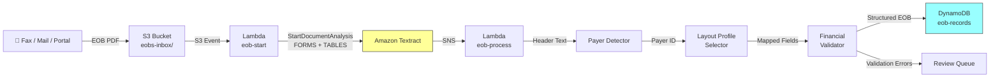

# Recipe 1.8 — EOB Processing 🔶

**Complexity:** Moderate · **Phase:** Phase 2 · **Estimated Cost:** ~$0.01–0.03 per EOB

---

## Problem Statement

An Explanation of Benefits is the financial record of a claim — what was billed, what was allowed, what the plan paid, and what the member owes. Payers generate EOBs, but they also *receive* them: coordination of benefits (COB) requires ingesting EOBs from other payers to determine primary vs. secondary liability. Members submit EOBs when disputing balances or requesting reprocessing. Provider offices fax EOBs as part of claims attachments (we touched on this in Recipe 1.5).

EOBs are table-heavy documents with a consistent logical structure but wildly inconsistent physical layouts across payers. A UnitedHealthcare EOB looks nothing like an Anthem EOB which looks nothing like a Medicare Summary Notice. The data we need is always the same — claim number, service dates, CPT codes, billed/allowed/paid/member-responsibility amounts per line item — but the tables, headers, and field labels vary enormously.

This recipe extends the table extraction pattern from Recipe 1.2 with payer-specific layout profiles and financial field validation to handle the variety.

## Solution Overview

The approach:

1. **Textract** extracts tables and key-value pairs (same async pattern as Recipe 1.2)
2. **Payer detection** — identify which payer issued the EOB from header text or logo region
3. **Layout profile selection** — apply a payer-specific field mapping to normalize the extracted table headers and key-value fields into a canonical schema
4. **Financial validation** — cross-check that line item amounts sum correctly (billed ≥ allowed ≥ paid; member responsibility = allowed − paid − adjustments)
5. **Output** a structured EOB record ready for COB processing or claims adjudication

No Comprehend Medical needed here — EOBs are financial documents, not clinical ones.

## Architecture Diagram



## Prerequisites

| Requirement | Details |
|-------------|---------|
| **AWS Services** | Amazon Textract, S3, Lambda, DynamoDB, SNS |
| **IAM Permissions** | Same as Recipe 1.2 |
| **HIPAA Controls** | Same as Recipe 1.1. EOBs contain member names, claim details, and financial data — all PHI under HIPAA. |
| **Sample Data** | Collect EOB templates from major payers (most publish sample EOBs on their member portals). CMS publishes the Medicare Summary Notice format. Create synthetic versions with realistic line items. |
| **Cost Estimate** | Textract (FORMS + TABLES): ~$3/1,000 pages. A typical 2-3 page EOB: ~$0.009. With Lambda/DynamoDB overhead: ~$0.01-0.03 per EOB. |

## Ingredients

| AWS Service | Role |
|------------|------|
| **Amazon Textract** | Extracts tables (line items) and key-value pairs (header fields) |
| **Amazon S3** | Stores incoming EOBs and extraction results |
| **AWS Lambda** | Payer detection, layout profile application, financial validation |
| **Amazon DynamoDB** | Stores structured EOB records |
| **Amazon SNS** | Textract async completion notification |

## Code

> **Full source:** `github.com/aws-samples/healthcare-ai-cookbook/ch01/recipe-1.8/`

### Walkthrough

**Steps 1-2: Textract extraction.** Same async pattern as Recipe 1.2 — `StartDocumentAnalysis` with FORMS + TABLES, retrieve results on SNS notification.

**Step 3 — Payer detection.** Identify the issuing payer from the EOB header. This drives which layout profile we apply.

```python
PAYER_SIGNATURES = {
    'medicare': ['centers for medicare', 'medicare summary notice', 'cms', 'department of health'],
    'unitedhealthcare': ['unitedhealthcare', 'uhc', 'optum', 'united health'],
    'anthem': ['anthem', 'blue cross blue shield', 'bcbs', 'anthem bcbs'],
    'aetna': ['aetna', 'cvs health', 'aetna life insurance'],
    'cigna': ['cigna', 'cigna healthcare', 'evernorth'],
    'humana': ['humana', 'humana insurance'],
    'kaiser': ['kaiser', 'kaiser permanente'],
}

def detect_payer(header_text: str) -> str:
    text_lower = header_text.lower()
    for payer_id, keywords in PAYER_SIGNATURES.items():
        if any(kw in text_lower for kw in keywords):
            return payer_id
    return 'unknown'
```

**Step 4 — Layout profiles.** Each payer uses different column headers in their EOB tables. A layout profile maps payer-specific headers to canonical field names.

```python
LAYOUT_PROFILES = {
    'medicare': {
        'table_headers': {
            'service date': 'date_of_service',
            'services provided': 'description',
            'amount charged': 'billed_amount',
            'medicare approved': 'allowed_amount',
            'medicare paid provider': 'plan_paid',
            'you may be billed': 'member_responsibility',
        },
        'kv_fields': {
            'claim number': 'claim_number',
            'patient name': 'member_name',
        }
    },
    'unitedhealthcare': {
        'table_headers': {
            'date of service': 'date_of_service',
            'service': 'description',
            'what your provider billed': 'billed_amount',
            'network discount': 'adjustment',
            'what your plan paid': 'plan_paid',
            'what you owe': 'member_responsibility',
        },
        'kv_fields': {
            'claim #': 'claim_number',
            'member': 'member_name',
            'member id': 'member_id',
        }
    },
    'unknown': {
        'table_headers': {
            'date': 'date_of_service', 'service date': 'date_of_service',
            'billed': 'billed_amount', 'charges': 'billed_amount', 'amount charged': 'billed_amount',
            'allowed': 'allowed_amount', 'approved': 'allowed_amount',
            'paid': 'plan_paid', 'plan paid': 'plan_paid',
            'you owe': 'member_responsibility', 'patient resp': 'member_responsibility',
            'member responsibility': 'member_responsibility',
        },
        'kv_fields': {
            'claim': 'claim_number', 'claim number': 'claim_number', 'claim #': 'claim_number',
        }
    }
}

def apply_layout_profile(tables: list, kv_pairs: dict, payer_id: str) -> dict:
    profile = LAYOUT_PROFILES.get(payer_id, LAYOUT_PROFILES['unknown'])
    
    # Map table headers
    line_items = []
    for table in tables:
        if len(table) < 2:
            continue
        raw_headers = [h.strip().lower() for h in table[0]]
        mapped_headers = [profile['table_headers'].get(h, h) for h in raw_headers]
        
        for row in table[1:]:
            item = {}
            for i, cell in enumerate(row):
                if i < len(mapped_headers):
                    item[mapped_headers[i]] = cell.strip()
            line_items.append(item)
    
    # Map KV fields
    header_fields = {}
    for raw_key, raw_val in kv_pairs.items():
        canonical = profile['kv_fields'].get(raw_key.strip().lower())
        if canonical:
            header_fields[canonical] = raw_val.get('value', '').strip()
    
    return {'header': header_fields, 'line_items': line_items, 'payer_id': payer_id}
```

**Step 5 — Financial validation.** Sanity-check the numbers. EOB math should add up; when it doesn't, that's either an extraction error or a legitimate dispute.

```python
import re

def parse_currency(text: str) -> float | None:
    match = re.search(r'[\$]?([\d,]+\.?\d*)', text or '')
    return float(match.group(1).replace(',', '')) if match else None

def validate_eob_financials(eob: dict) -> list[dict]:
    errors = []
    
    for i, item in enumerate(eob['line_items']):
        billed = parse_currency(item.get('billed_amount'))
        allowed = parse_currency(item.get('allowed_amount'))
        paid = parse_currency(item.get('plan_paid'))
        member = parse_currency(item.get('member_responsibility'))
        
        if billed and allowed and billed < allowed:
            errors.append({
                'line': i + 1, 'type': 'allowed_exceeds_billed',
                'detail': f'Allowed ${allowed} > Billed ${billed}'
            })
        
        if allowed and paid and member:
            expected_member = round(allowed - paid, 2)
            if abs(member - expected_member) > 0.01:
                errors.append({
                    'line': i + 1, 'type': 'member_resp_mismatch',
                    'detail': f'Member ${member} != Allowed ${allowed} - Paid ${paid} = ${expected_member}'
                })
    
    return errors
```

## Expected Results

**Sample output for a 3-page UnitedHealthcare EOB:**

```json
{
  "document_key": "eobs-inbox/2026/03/01/eob-00423.pdf",
  "payer_id": "unitedhealthcare",
  "header": {
    "claim_number": "EOB-9284710",
    "member_name": "Patricia Martinez",
    "member_id": "UHC8291047"
  },
  "line_items": [
    {
      "date_of_service": "02/10/2026",
      "description": "Office Visit - Level 3",
      "cpt": "99213",
      "billed_amount": "$185.00",
      "adjustment": "$67.00",
      "plan_paid": "$94.40",
      "member_responsibility": "$23.60"
    },
    {
      "date_of_service": "02/10/2026",
      "description": "Blood Draw",
      "cpt": "36415",
      "billed_amount": "$35.00",
      "adjustment": "$12.00",
      "plan_paid": "$23.00",
      "member_responsibility": "$0.00"
    }
  ],
  "financial_validation": {
    "errors": [],
    "status": "valid"
  }
}
```

**Performance benchmarks:**

| Metric | Typical Value |
|--------|---------------|
| End-to-end latency (3-page EOB) | 8–15 seconds |
| Table extraction accuracy | 90–96% (table layout dependent) |
| Payer detection accuracy | 95%+ for major payers |
| Financial validation catch rate | Catches 80–90% of extraction errors via math checks |
| Cost per EOB | ~$0.01–0.03 |

**Where it struggles:** EOBs with merged table cells, multi-line descriptions within a single row, or table headers that span multiple rows. Some payers embed line item data in paragraph text instead of tables — these need a different extraction strategy entirely.

## Variations & Extensions

1. **Coordination of Benefits automation.** When processing a secondary EOB, automatically extract the primary payer's payment and apply COB rules to calculate secondary liability. This requires linking the EOB to the original claim and applying the payer's COB methodology (standard vs. carve-out vs. maintenance of benefits).

2. **Member dispute triage.** When a member submits an EOB with a dispute, compare the extracted line items against the payer's internal claim record. Automatically categorize the dispute: pricing error, benefit misapplication, duplicate claim, or COB issue. Route to the appropriate resolution team with supporting data already assembled.

3. **Multi-payer layout learning.** Instead of maintaining static layout profiles per payer, build an adaptive system that learns new payer layouts. When an unknown payer is detected, use LLM-based extraction (→ Recipe 2.2) to bootstrap a new layout profile, then validate it against financial cross-checks.

## Related Recipes

- **← Recipe 1.2 (Patient Intake Form Digitization):** Same async Textract + table extraction pattern
- **← Recipe 1.5 (Claims Attachment Processing):** EOBs are one of the document types classified and extracted within claims attachment packages
- **→ Recipe 11.2 (Claims Trend Detection):** Consumes structured EOB data for trend analysis
- **→ Recipe 7.1 (Anomaly Detection: Billing Outliers):** Uses EOB financial data to detect unusual billing patterns

## Additional Resources

- [CMS Medicare Summary Notice Format](https://www.medicare.gov/basics/get-started-with-medicare/medicare-basics/reading-medicare-summary-notice)
- [CAQH CORE Operating Rules for EOB](https://www.caqh.org/core/operating-rules)
- [X12 835 Electronic Remittance Advice](https://x12.org/products/transaction-sets)

## Estimated Implementation Time

| Scope | Time |
|-------|------|
| **Basic** (Textract + generic layout profile + basic validation) | 4–6 hours |
| **Production-ready** (5+ payer profiles, financial validation, error handling) | 3–5 days |
| **With variations** (COB automation, dispute triage, adaptive layouts) | 2–3 weeks |

## Tags

`document-intelligence` · `ocr` · `textract` · `tables` · `eob` · `financial` · `coordination-of-benefits` · `claims` · `moderate` · `phase-2` · `hipaa`

---

*← [Recipe 1.7 — Prescription Label OCR](chapter01.07-prescription-label-ocr) · [Next: Recipe 1.9 — Medical Records Request Extraction →](chapter01.09-medical-records-request-extraction)*
