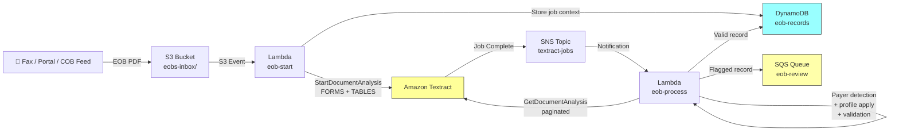

# Recipe 1.8: Explanation of Benefits Processing 🔶

**Complexity:** Moderate · **Phase:** Phase 2 · **Estimated Cost:** ~$0.01–0.03 per EOB

---

## The Problem

Every time a health insurance claim settles, the payer sends an Explanation of Benefits to the member. "We received your claim. Your provider billed $185. We allowed $118 under your network agreement. We paid the provider $94.40. You owe $23.60." Simple enough in concept.

In practice, these documents are everywhere. Members stuff them in drawers and later pull them out to dispute a balance. Provider billing offices receive them as proof of payment and need to reconcile them against their accounts receivable. When a patient has two insurance plans, the secondary payer has to ingest the primary payer's EOB to figure out what's already been paid before it processes its portion of the claim. This last scenario has a name: coordination of benefits, or COB. And it is, without exaggeration, one of the messiest data problems in healthcare finance.

Here is the core problem. The information on every EOB is essentially identical. Claim number. Service dates. Procedure codes. What was billed. What was allowed. What the plan paid. What the member owes. Every payer tracks these same fields. But every payer lays them out differently. A UnitedHealthcare EOB calls the plan payment "What Your Plan Paid." An Anthem EOB calls it "Plan Paid Amount." A Medicare Summary Notice calls it "Medicare Paid Provider." CMS uses a three-column layout with its own iconography. Cigna uses a tabbed format where line items appear on a different page from the summary. Some payers put claim-level summary data in a header section and line items in a table below. Others mix summary and line item data in a single table.

Your claims adjusters know how to read all of these. They've been staring at EOBs for years. But they're doing it one document at a time, manually keying data into your adjudication system. For a secondary payer processing coordination of benefits, that means a human reads the primary's EOB, finds the "plan paid" field (wherever it lives on that payer's format), enters the number, and the secondary claim can proceed. At scale, that is a lot of humans doing a lot of repetitive data entry.

The downstream effects are predictable. Transcription errors in dollar amounts cause incorrect COB calculations, which cause incorrect secondary payments, which cause provider disputes, which cause denials and reprocessing. A $10 entry error on a secondary payment doesn't sound catastrophic, but at volume, incorrect COB calculations are a meaningful source of payment inaccuracy. More importantly, manual COB processing creates latency: the secondary claim can't be adjudicated until someone reads the primary EOB and enters the data. That delay affects provider cash flow and member satisfaction.

The recipe that follows extracts structured financial data from EOBs automatically. It handles the layout variability problem with payer-specific profiles. It validates the extracted numbers against the math constraints that every well-formed EOB must satisfy. And it produces a canonical record that your adjudication and COB systems can consume directly, with no manual data entry required.

---

## The Technology: Financial Document Extraction and Validation

### This Is a Financial Document, Not a Clinical One

This is worth saying explicitly, because it affects almost every technical decision in this recipe. An EOB is a financial record. The fields it contains are claim identifiers, service dates, CPT codes used as billing references, and dollar amounts. When you see "99213" on an EOB, it means "the provider billed for this procedure code and here's what we paid." It doesn't mean you need to understand what 99213 means clinically. You need to extract the code as a string and associate it with the dollar amounts on the same line.

This distinction matters because healthcare document processing recipes often reach for clinical NLP tooling as a reflex. In Recipe 1.3 and Recipe 1.4, Amazon Comprehend Medical earns its place by identifying clinical entities from free-text sections of lab requisitions and prior authorizations. But EOBs have no clinical free text worth extracting. The service descriptions are billing language, not clinical language. The procedure and diagnosis codes are already machine-readable identifiers. What you need from an EOB is pure extraction: find the fields, get the values, check the math. Clinical NLP adds no value and meaningful cost.

### The Table Extraction Problem (and Why EOBs Make It Harder)

If you worked through Recipe 1.2, you know the basics of table extraction. A document scanner or fax server produces an image. An extraction service identifies the grid structure, maps each cell to a row and column index, and returns the contents as a two-dimensional array. The result, for a well-formatted printed table, is quite reliable.

EOBs push this in two directions that intake forms don't.

First, EOB tables are dense. A typical intake form medication table has maybe four or five columns and a handful of rows. An EOB from a busy month might have fifteen or twenty line items, each with six to eight columns covering procedure code, service date, provider, billed amount, contractual adjustment, plan payment, member deductible applied, and member coinsurance. The columns are narrow. The fonts are small. Payers optimize their EOB layouts for printing on a single sheet of paper, not for legibility. This creates challenges for table extraction: cell boundaries become ambiguous when content is densely packed, and small fonts degrade accuracy on low-resolution scans.

Second, EOB tables sometimes span multiple pages. A simple claim settles on a single page. A complex claim with many service dates, or an EOB from a capitated plan covering a full month of encounters, can push the line items across two or three pages. The extraction service needs to recognize that the table continues from page to page, and the column structure carries forward. This isn't guaranteed: some extraction engines treat each page independently and produce two separate tables instead of one continuous one. The parsing layer needs to handle both cases.

### The Layout Variability Problem

This is the hard part. Every payer has their own EOB template, and their own vocabulary for the same concepts. The challenge isn't OCR accuracy. Given a reasonably good scan, extraction gets the text right. The challenge is knowing what the text means, because "Amount Charged," "Provider Billed," "What Your Provider Billed," and "Billed Amount" are four different strings that all mean the same thing: what the provider submitted for payment.

The standard solution is a layout profile: a mapping from payer-specific field labels to canonical field names. When you're processing a UnitedHealthcare EOB, you know that "What Your Plan Paid" maps to `plan_paid`. When you're processing a Medicare Summary Notice, you know that "Medicare Paid Provider" maps to `plan_paid`. The downstream system always sees `plan_paid`, regardless of which payer issued the document.

This requires two pieces: a payer detector (figure out which payer issued this EOB) and a profile library (a collection of label-to-canonical mappings, one per payer). The payer detector reads the document header, where the payer's name, logo text, or document title almost always appears. Once you know the payer, you select the right profile. If you don't recognize the payer, you fall back to a fuzzy matching strategy that covers common variations of each label without a payer-specific mapping.

Building and maintaining these profiles is real ongoing work. New payers, layout refreshes, regional variations, and Medicare plan types all require profile updates. An adaptive system that can learn new layouts (bootstrapped by LLM-based extraction, as in Variation 3 below) reduces that maintenance burden over time, but you still start with a curated set of profiles for your highest-volume payers.

### Payer Detection from Document Text

The header of an EOB is usually the first 15 to 20 percent of the first page. It contains the payer's name prominently, often their logo (which produces text in the extraction output if it includes the company name), and typically the document title ("Explanation of Benefits" or "Medicare Summary Notice" or "Member Explanation of Benefits"). Running payer detection against this header region rather than the full document is both faster and more reliable: you avoid false matches on provider names or employer names that appear in the body.

The detection is straightforward: normalize the header text to lowercase, then check for keyword patterns associated with each known payer. This is not ML; it's string matching. The reason you don't need ML here is that EOB headers are highly formulaic. A UnitedHealthcare document almost always contains the string "unitedhealthcare" or "uhc" in the header. The exception cases (when a payer rebrands, or when a regional plan uses a different name) are handled by expanding the keyword set and flagging low-confidence detections for human review.

The output of payer detection is a payer identifier that indexes into your profile library.

### Financial Validation as a Quality Signal

Here is a trick that has no equivalent in clinical document processing. Every well-formed EOB satisfies a set of mathematical relationships. The billed amount must be greater than or equal to the allowed amount. The allowed amount must be greater than or equal to the plan payment. The member responsibility must equal the allowed amount minus the plan payment (modulo copays and deductibles, which are handled differently, but the gross math still holds). The total claim payment in the header must equal the sum of line item payments.

These constraints give you a validation oracle that operates on the extracted numbers themselves, independent of any ML confidence score. If you extract a billed amount of $150 and an allowed amount of $200, something went wrong. The number might have been OCR'd incorrectly, or the layout profile mapped the wrong column to the wrong field. Either way, you know to flag it.

This is valuable for two reasons. First, financial errors are more consequential than, say, a misread middle initial. A transposed digit in a payment amount affects actual money. Second, mathematical validation catches errors that confidence scores miss: the OCR might read "200" with 98% confidence when the correct value was "100" and the "1" just happened to look like a "2" on a faxed document. The confidence score says it's fine. The math says it's not.

Financial validation doesn't replace confidence scoring. It complements it. A record that passes both validation layers is much more likely to be correct than one that passes only one.

### The General Architecture Pattern

At a conceptual level, EOB processing follows a pipeline similar to Recipe 1.2, with two additional stages:

```
[Ingest] → [Extract] → [Detect Payer] → [Apply Profile] → [Parse Line Items] → [Validate] → [Store or Flag]
```

**Ingest:** The EOB arrives. Sources vary: faxed PDFs from provider offices (as part of claims attachments, per Recipe 1.5), portal uploads from members disputing a balance, or electronic feeds from other payers as part of a COB workflow. The format is almost always PDF, occasionally TIFF from older fax servers.

**Extract:** Submit the document to an async extraction service requesting both FORMS (for the header key-value data: claim number, member ID, dates) and TABLES (for the line item grid). Wait for the async completion signal. Retrieve all result pages via pagination.

**Detect Payer:** Read the extracted text from the document header. Match against known payer keyword signatures. Return a payer identifier or "unknown."

**Apply Profile:** Select the payer-specific layout profile. Map the extracted table column headers to canonical field names. Map the extracted key-value field labels to canonical header field names.

**Parse Line Items:** Walk the mapped table rows and assemble each line item with canonical field names and parsed currency values.

**Validate:** Apply financial math constraints to the parsed line items. Check line item totals against header summary totals. Produce a list of validation errors, or an empty list if the math checks out.

**Store or Flag:** Records with no validation errors and high extraction confidence go directly to the output table. Records with validation errors or low-confidence fields go to a review queue for human inspection.

Any cloud provider, any extraction engine, any document processing stack fits this pattern. The profile library and the validation logic are pure business rules that live outside any vendor's API.

---

## The AWS Implementation

### Why These Services

**Amazon Textract for async table and forms extraction.** Textract's `StartDocumentAnalysis` API is the right tool for EOBs for the same reasons it was the right tool for intake forms in Recipe 1.2: multi-page PDF support, combined FORMS + TABLES extraction in a single job, and SNS-based async completion notification. The TABLES feature specifically handles the line item grids that are the core data payload of an EOB. The FORMS feature captures the header fields: claim number, member name, service period, total payment. Running both in one Textract job means one cost, one latency, one set of results to parse. Don't run two separate jobs.

The key technical fact to know about Textract's table extraction and EOBs: Textract returns cells with `RowIndex` and `ColumnIndex` attributes, which lets you reconstruct the grid without depending on visual line detection. This is helpful for EOBs because some payers use borderless tables that rely on spatial alignment rather than printed grid lines. Textract handles these reasonably well, though accuracy degrades with very narrow columns and small fonts.

**Two Lambda functions for the async pattern.** Same architecture as Recipe 1.2. The first Lambda submits the Textract job on the S3 upload event and exits. The second Lambda fires on the SNS completion notification, runs the payer detection, profile application, financial validation, and DynamoDB write. The payer detection and layout profile logic is pure business logic with no external API calls, so it runs quickly inside the processing Lambda.

**AWS Lambda also hosts the layout profiles.** There is no managed service for "payer-specific field mapping." This logic lives in your code, as a dictionary or a JSON configuration file that the processing Lambda reads at startup. Keep the profiles in a separate configuration file rather than hardcoded in the Lambda function so you can update them without redeploying the function. An S3 bucket for configuration files, with the Lambda loading profiles at cold start, works well and avoids hardcoding.

**Amazon DynamoDB for EOB records.** The access patterns are write-once at extraction time and then lookup by claim number, member ID, or document key. DynamoDB's flexible schema handles the variable structure well: not every EOB has the same number of line items, and the set of canonical fields that are populated varies by payer. The financial validation errors get stored alongside the record so the review queue has context about why a document was flagged.

**Amazon SQS for the review queue.** Flagged EOBs need to reach human reviewers. The architecture below uses an SQS queue rather than a Lambda-to-DynamoDB write for the flagged path. This decouples the routing from the review workflow: whatever system your adjusters use to work review queues can read from SQS at whatever pace makes sense for your operations. The review records in SQS include the document key (so the reviewer can open the PDF), the extracted values, and the specific validation errors that triggered the flag.

### Architecture Diagram



### Prerequisites

| Requirement | Details |
|-------------|---------|
| **AWS Services** | Amazon Textract, Amazon S3, AWS Lambda (x2), Amazon SNS, Amazon DynamoDB, Amazon SQS |
| **IAM Permissions** | `textract:StartDocumentAnalysis`, `textract:GetDocumentAnalysis`, `s3:GetObject`, `s3:PutObject`, `sns:Publish`, `dynamodb:PutItem`, `dynamodb:GetItem`, `sqs:SendMessage`, `iam:PassRole` (Lambda passing role to Textract for SNS publish) |
| **Textract Service Role** | A separate IAM role that Textract assumes to publish completion notifications to SNS. This is not your Lambda execution role. You must create it explicitly and pass it in the `StartDocumentAnalysis` call. Easy to miss; see The Honest Take for what happens when you forget it. |
| **BAA** | AWS BAA signed. EOBs contain member names, member IDs, service dates, provider names, and payment amounts, all of which constitute PHI under HIPAA. |
| **Encryption** | S3: SSE-KMS with a customer-managed key. DynamoDB: encryption at rest enabled. SQS: server-side encryption with KMS. All API calls over TLS. |
| **VPC** | Production: both Lambdas in a VPC with VPC endpoints for S3, Textract, DynamoDB, SNS, and SQS. CloudWatch Logs endpoint required if you want log output from private subnet Lambdas (easy to forget; see The Honest Take). |
| **CloudTrail** | Enabled for all Textract and S3 API calls. EOBs are PHI-bearing financial documents; the audit trail is a compliance requirement. |
| **Sample Data** | Major payers publish sample EOB PDFs on their member portals and provider resource sites. CMS publishes the Medicare Summary Notice format at [medicare.gov](https://www.medicare.gov/basics/get-started-with-medicare/medicare-basics/reading-medicare-summary-notice). Fill in synthetic but realistic dollar amounts and claim numbers. Never use real PHI in development. |
| **Cost Estimate** | Textract async analysis (FORMS + TABLES): $0.065/page ($0.05 forms + $0.015 tables). A 2-page EOB: $0.13. A 3-page EOB: $0.195. Lambda and DynamoDB overhead: negligible. Total per EOB: roughly $0.13–$0.20 depending on page count. |

### Ingredients

| AWS Service | Role |
|-------------|------|
| **Amazon Textract** | Async multi-page extraction: FORMS for claim header fields, TABLES for line item grids |
| **Amazon S3** | Stores incoming EOB PDFs; encrypted at rest with KMS; prefix-organized by payer and date |
| **AWS Lambda (eob-start)** | Triggered by S3 upload; submits the Textract job; stores job context in DynamoDB |
| **AWS Lambda (eob-process)** | Triggered by SNS notification; retrieves results; runs payer detection, profile mapping, financial validation; writes to DynamoDB or SQS |
| **Amazon SNS** | Receives Textract completion signal; delivers to eob-process Lambda |
| **Amazon DynamoDB** | Stores structured EOB records (both valid and flagged) with an index on claim number and member ID |
| **Amazon SQS** | Review queue for flagged EOBs; consumed by adjuster workflow or human review tooling |
| **AWS KMS** | Customer-managed keys for S3, DynamoDB, and SQS encryption |
| **Amazon CloudWatch** | Logs, metrics, and alarms for job failures, validation error rates, and payer detection failures |

### Code Walkthrough

**Step 1: Submit the async Textract job.** Same pattern as Recipe 1.2. The EOB PDF lands in S3 and triggers the eob-start Lambda. We call `StartDocumentAnalysis` with both FORMS and TABLES feature types and provide the SNS topic and Textract service role for completion notification. The job context goes to DynamoDB so the second Lambda can reconstruct it when the notification arrives. The one difference from Recipe 1.2 is that we also record the S3 prefix to help with payer detection: if your intake pipeline organizes EOBs into per-payer prefixes (`eobs-inbox/unitedhealthcare/`, `eobs-inbox/medicare/`), you already know the payer before running a single string match. That's a useful shortcut if your ingestion pipeline provides it.

```
FUNCTION submit_eob_extraction(bucket, key, sns_topic_arn, textract_role_arn):
    // Submit the EOB PDF to Textract for async analysis.
    // FORMS extracts the claim header fields (claim number, member name, etc.)
    // TABLES extracts the line item grid (one row per service, with dollar amounts)
    // Both in one job because Textract bills per page, not per feature type.

    response = call Textract.StartDocumentAnalysis with:
        document_location = S3 object at bucket/key
        feature_types     = ["FORMS", "TABLES"]
        notification_channel = {
            sns_topic_arn: sns_topic_arn,
            role_arn: textract_role_arn     // Textract needs its own role to publish to SNS
        }

    job_id = response.JobId

    // Store job context. The eob-process Lambda will need this when it wakes up.
    write to DynamoDB table "textract-jobs":
        job_id    = job_id
        bucket    = bucket
        key       = key           // original S3 path of the EOB PDF
        submitted = current UTC timestamp
        status    = "PENDING"

    RETURN job_id
```

**Step 2: Retrieve all result pages.** When Textract finishes, the SNS notification triggers eob-process Lambda. The first order of business is fetching all the extracted blocks via paginated `GetDocumentAnalysis` calls. This is identical to Recipe 1.2 and equally important: a multi-page EOB can produce hundreds of blocks, and Textract returns at most 1,000 per API call. Stop early and you have an incomplete document.

```
FUNCTION retrieve_all_blocks(job_id):
    // Paginate through all result pages until NextToken is null.
    // See Recipe 1.2 Step 2 for the full explanation of why this matters.

    all_blocks = empty list
    next_token = null

    LOOP:
        params = { job_id: job_id }
        IF next_token is not null:
            params.next_token = next_token

        response = call Textract.GetDocumentAnalysis with params

        // Before we do anything else: check whether the job actually succeeded.
        // Status will be SUCCEEDED or FAILED. Do not attempt to parse results if FAILED.
        IF response.JobStatus is "FAILED":
            log the failure reason from response.StatusMessage
            RAISE an exception with the failure details
            // The calling code should move the document to a failed-documents/ prefix
            // and alert ops. See The Honest Take for the full failure handling story.

        append response.Blocks to all_blocks
        next_token = response.NextToken
        IF next_token is null:
            BREAK

    // Build an O(1) lookup map: block ID -> block data.
    // Almost every parsing operation below needs to follow block relationships by ID.
    block_map = { block.Id: block for block in all_blocks }

    RETURN all_blocks, block_map
```

**Step 3: Extract the EOB header fields.** The claim header contains the fields that identify the document: claim number, member name, member ID, date of service range, and sometimes the total billed and paid amounts. These come from Textract's KEY_VALUE_SET blocks (the FORMS feature output). The parsing logic is the same as Recipe 1.1 and Recipe 1.2: find KEY blocks, follow the VALUE relationship, assemble the text. The output is a raw dictionary of extracted label-to-value pairs, which we'll normalize in the next step.

```
FUNCTION extract_header_fields(all_blocks, block_map):
    // Same KEY_VALUE_SET parsing as Recipes 1.1 and 1.2.
    // Returns raw label-to-value pairs with confidence scores.
    raw_header = empty map

    FOR each block in all_blocks:
        IF block.BlockType is not "KEY_VALUE_SET":
            CONTINUE
        IF "KEY" is not in block.EntityTypes:
            CONTINUE

        // Assemble the label text from this key block's word children.
        key_text = concatenate text from CHILD relationships of block using block_map

        // Follow the VALUE relationship to the paired value block.
        value_block = follow VALUE relationship from block using block_map
        IF value_block is null:
            CONTINUE

        // Assemble the value text (EOB header values are always text, never checkboxes).
        value_text = concatenate text from CHILD relationships of value_block using block_map
        confidence = minimum of (block.Confidence, value_block.Confidence)

        raw_header[key_text] = { value: value_text.strip(), confidence: confidence }

    RETURN raw_header
```

**Step 4: Detect the payer from the header text.** Now we figure out who issued this EOB. We concatenate the raw text from the first page's blocks and run it through a keyword matcher. The payer signatures below cover the major national plans; a real implementation would expand this list with regional plans, Medicare Advantage variants, and any payers prominent in your specific market.

```
// Keyword signatures for payer detection.
// Order matters: more specific patterns before more general ones.
// "anthem bcbs" before "anthem" so a document with both strings doesn't hit the wrong branch.
PAYER_SIGNATURES = {
    "medicare": [
        "centers for medicare", "medicare summary notice", "cms",
        "department of health and human services", "medicare.gov"
    ],
    "unitedhealthcare": [
        "unitedhealthcare", "united health", "uhc", "optum"
    ],
    "anthem": [
        "anthem blue cross", "anthem bcbs", "anthem",
        "elevance health", "wellpoint"
    ],
    "aetna": [
        "aetna", "cvs health", "aetna life insurance"
    ],
    "cigna": [
        "cigna", "evernorth", "cigna healthcare"
    ],
    "humana": [
        "humana", "humana insurance", "humana health"
    ],
    "bcbs": [
        "blue cross blue shield", "blue cross", "bluecross",
        "blue shield", "blueshield"
    ],
    "kaiser": [
        "kaiser permanente", "kaiser foundation"
    ]
}

FUNCTION detect_payer(all_blocks):
    // Collect text from the first page only — the header is where payer identity lives.
    // We use page blocks only; filter for Page 1 blocks.
    first_page_text = concatenate text from blocks where block.Page equals 1
    text_lower = first_page_text.lowercase()

    FOR each payer_id, keywords in PAYER_SIGNATURES:
        FOR each keyword in keywords:
            IF keyword is found in text_lower:
                RETURN payer_id

    // No match. Return unknown; the fallback profile handles this with fuzzy matching.
    RETURN "unknown"
```

**Step 5: Apply the payer layout profile.** This is the heart of what makes EOB processing different from generic table extraction. The layout profile maps the payer's specific column headers to canonical field names. A "What Your Plan Paid" column in a UHC EOB becomes `plan_paid`. A "Medicare Paid Provider" column in a Medicare Summary Notice becomes the same `plan_paid`. Downstream systems see only the canonical names.

The profile also covers key-value header fields: "Claim #" vs. "Claim Number" vs. "Claim ID" all map to the canonical `claim_number`.

```
// Layout profiles for major payers.
// Each profile has two sections:
//   table_headers: maps payer-specific column labels to canonical field names
//   kv_fields:     maps payer-specific key-value labels to canonical header field names
//
// Canonical field names used consistently across all payer outputs:
//   claim_number, member_name, member_id, date_of_service, provider_name
//   procedure_code, service_description
//   billed_amount, allowed_amount, adjustment, plan_paid, member_responsibility
//   deductible_applied, copay, coinsurance

LAYOUT_PROFILES = {

    "medicare": {
        table_headers: {
            "service date":                 "date_of_service",
            "services provided":            "service_description",
            "amount charged":               "billed_amount",
            "medicare approved":            "allowed_amount",
            "medicare paid provider":       "plan_paid",
            "you may be billed":            "member_responsibility",
            "non-covered amount":           "non_covered",
        },
        kv_fields: {
            "claim number":                 "claim_number",
            "patient name":                 "member_name",
            "health insurance claim number": "member_id",
            "hicn":                         "member_id",
            "medicare id":                  "member_id",
            "date received":                "received_date",
        }
    },

    "unitedhealthcare": {
        table_headers: {
            "date of service":              "date_of_service",
            "service":                      "service_description",
            "procedure code":               "procedure_code",
            "what your provider billed":    "billed_amount",
            "network discount":             "adjustment",
            "what your plan paid":          "plan_paid",
            "what you owe":                 "member_responsibility",
            "deductible":                   "deductible_applied",
            "copayment":                    "copay",
            "coinsurance":                  "coinsurance",
        },
        kv_fields: {
            "claim #":                      "claim_number",
            "claim number":                 "claim_number",
            "member":                       "member_name",
            "member id":                    "member_id",
            "group number":                 "group_number",
            "date of service":              "service_period",
            "provider":                     "provider_name",
        }
    },

    "anthem": {
        table_headers: {
            "date(s) of service":           "date_of_service",
            "description":                  "service_description",
            "procedure":                    "procedure_code",
            "amount billed":                "billed_amount",
            "plan discount":                "adjustment",
            "plan paid amount":             "plan_paid",
            "your responsibility":          "member_responsibility",
            "applied to deductible":        "deductible_applied",
        },
        kv_fields: {
            "claim number":                 "claim_number",
            "member name":                  "member_name",
            "member id":                    "member_id",
            "group number":                 "group_number",
            "provider name":                "provider_name",
        }
    },

    // The "unknown" profile uses a broader set of synonyms for each canonical field.
    // It catches payers not in the library and handles layout variants within known payers.
    // Less precise than a dedicated profile; financial validation catches most errors.
    "unknown": {
        table_headers: {
            "date":                         "date_of_service",
            "service date":                 "date_of_service",
            "date of service":              "date_of_service",
            "billed":                       "billed_amount",
            "charges":                      "billed_amount",
            "amount billed":                "billed_amount",
            "amount charged":               "billed_amount",
            "what your provider billed":    "billed_amount",
            "allowed":                      "allowed_amount",
            "approved":                     "allowed_amount",
            "allowed amount":               "allowed_amount",
            "medicare approved":            "allowed_amount",
            "paid":                         "plan_paid",
            "plan paid":                    "plan_paid",
            "plan paid amount":             "plan_paid",
            "what your plan paid":          "plan_paid",
            "medicare paid provider":       "plan_paid",
            "you owe":                      "member_responsibility",
            "your responsibility":          "member_responsibility",
            "what you owe":                 "member_responsibility",
            "you may be billed":            "member_responsibility",
            "member responsibility":        "member_responsibility",
            "patient responsibility":       "member_responsibility",
            "adjustment":                   "adjustment",
            "discount":                     "adjustment",
            "network discount":             "adjustment",
            "plan discount":                "adjustment",
            "procedure":                    "procedure_code",
            "procedure code":               "procedure_code",
            "cpt":                          "procedure_code",
            "service":                      "service_description",
            "description":                  "service_description",
            "services provided":            "service_description",
        },
        kv_fields: {
            "claim":                        "claim_number",
            "claim #":                      "claim_number",
            "claim number":                 "claim_number",
            "claim id":                     "claim_number",
            "member":                       "member_name",
            "member name":                  "member_name",
            "patient name":                 "member_name",
            "member id":                    "member_id",
            "subscriber id":                "member_id",
            "id number":                    "member_id",
            "health insurance claim number": "member_id",
            "provider":                     "provider_name",
            "provider name":                "provider_name",
        }
    }
}


FUNCTION apply_layout_profile(all_blocks, block_map, raw_header, payer_id):
    profile = LAYOUT_PROFILES.get(payer_id, LAYOUT_PROFILES["unknown"])

    // --- Apply profile to key-value header fields ---
    header_fields = {}
    FOR each raw_label, data in raw_header:
        canonical = profile.kv_fields.get(raw_label.strip().lowercase())
        IF canonical is not null:
            header_fields[canonical] = data

    // --- Apply profile to table column headers ---
    // Each TABLE block contains CELL blocks. Row 1 cells are the column headers.
    // We map those headers to canonical names, then apply the mapping to all data rows.
    line_items = []

    FOR each block in all_blocks:
        IF block.BlockType is not "TABLE":
            CONTINUE

        // Build the grid: row_index -> col_index -> cell_text (same as Recipe 1.2 Step 4)
        grid = build_grid_from_table_block(block, block_map)

        IF grid is empty or max_row(grid) < 2:
            CONTINUE    // Need at least a header row and one data row

        // Map the header row (row 1) through the layout profile.
        raw_headers = [grid[1][col].strip().lowercase() for col in sorted columns of grid[1]]
        canonical_headers = [profile.table_headers.get(h, h) for h in raw_headers]
        // Unrecognized headers keep their raw label — don't silently discard columns.

        // Build line items from data rows (rows 2 through max_row).
        FOR r from 2 to max_row(grid):
            item = {}
            FOR col_index, canonical_name in enumerate(canonical_headers):
                cell_value = grid[r][col_index + 1] (or empty string if absent)
                item[canonical_name] = cell_value.strip()
            line_items.append(item)

    RETURN header_fields, line_items
```

**Step 6: Parse currency values and validate the financials.** The extracted dollar amounts are strings: "$185.00", "185", "$1,234.56". We need numeric values for the math checks. Then we apply the financial constraints that every well-formed EOB must satisfy. Validation errors don't mean we discard the record; they mean we route it to human review with the specific errors attached.

```
FUNCTION parse_currency(text):
    // Remove dollar signs, commas, and whitespace. Handle empty values gracefully.
    IF text is null or text.strip() is empty:
        RETURN null

    // Match patterns like: $185.00  185.00  1,234.56  $1,234
    cleaned = remove "$", "," from text.strip()
    IF cleaned matches a number pattern:
        RETURN float(cleaned)
    RETURN null


FUNCTION validate_eob_financials(header_fields, line_items):
    errors = []

    FOR each index, item in enumerate(line_items):
        row_num = index + 1    // 1-indexed for human-readable error messages

        billed  = parse_currency(item.get("billed_amount"))
        allowed = parse_currency(item.get("allowed_amount"))
        paid    = parse_currency(item.get("plan_paid"))
        member  = parse_currency(item.get("member_responsibility"))

        // Rule 1: Billed must be >= allowed.
        // The allowed amount is the contractual rate, which can't exceed what was billed.
        IF billed is not null AND allowed is not null:
            IF billed < allowed - 0.01:    // small tolerance for rounding in OCR
                errors.append({
                    row:    row_num,
                    rule:   "allowed_exceeds_billed",
                    detail: f"Allowed {allowed} > Billed {billed} on line {row_num}"
                })

        // Rule 2: Allowed must be >= plan paid.
        // The plan can't pay more than the allowed amount.
        IF allowed is not null AND paid is not null:
            IF paid > allowed + 0.01:
                errors.append({
                    row:    row_num,
                    rule:   "paid_exceeds_allowed",
                    detail: f"Paid {paid} > Allowed {allowed} on line {row_num}"
                })

        // Rule 3: Member responsibility should approximate allowed minus plan paid.
        // We use a $1.00 tolerance because deductibles, copays, and COB adjustments
        // create small differences that aren't errors.
        IF allowed is not null AND paid is not null AND member is not null:
            expected_member = round(allowed - paid, 2)
            IF abs(member - expected_member) > 1.00:
                errors.append({
                    row:    row_num,
                    rule:   "member_resp_mismatch",
                    detail: f"Member resp {member} != Allowed {allowed} - Paid {paid} = {expected_member}"
                })

    // Rule 4: Line item plan payments should sum to the header total, if present.
    header_total_paid = parse_currency(header_fields.get("plan_paid"))
    IF header_total_paid is not null:
        line_total_paid = sum of parse_currency(item.get("plan_paid", "0"))
                          for items where plan_paid is parseable
        IF abs(line_total_paid - header_total_paid) > 0.10:
            errors.append({
                row:    "header",
                rule:   "line_total_mismatch",
                detail: f"Line items sum to {line_total_paid}, header shows {header_total_paid}"
            })

    RETURN errors
```

**Step 7: Assemble the record and route it.** Combine the header fields, line items, payer detection result, and validation output into a canonical EOB record. Valid records go directly to DynamoDB. Flagged records go to both DynamoDB (for the record) and SQS (for the review queue, so an adjuster can work the flagged items).

```
FUNCTION assemble_and_route(document_key, payer_id, header_fields, line_items, validation_errors):

    record = {
        document_key:    document_key,                          // S3 path of the source PDF
        extracted_at:    current UTC timestamp (ISO 8601),
        payer_id:        payer_id,
        payer_confidence: "detected" if payer_id != "unknown" else "fallback_profile",

        header: {
            claim_number:   header_fields.get("claim_number"),
            member_name:    header_fields.get("member_name"),
            member_id:      header_fields.get("member_id"),
            group_number:   header_fields.get("group_number"),
            provider_name:  header_fields.get("provider_name"),
            service_period: header_fields.get("service_period"),
        },

        line_items: line_items,     // list of dicts with canonical field names

        financial_validation: {
            errors: validation_errors,
            status: "valid" if length of validation_errors == 0 else "flagged",
            validated_at: current UTC timestamp
        }
    }

    // Write every record to DynamoDB — valid and flagged both.
    // Use the document key as the partition key.
    write record to DynamoDB table "eob-records"

    // Send flagged records to the review queue.
    // Include enough context that the reviewer knows what to look for without opening the PDF.
    IF length of validation_errors > 0 OR payer_id == "unknown":
        send to SQS queue "eob-review":
            document_key:        document_key,
            payer_id:            payer_id,
            claim_number:        record.header.claim_number,
            validation_errors:   validation_errors,
            reason:              "financial_validation_failed" if errors
                                 else "unknown_payer_layout"

    RETURN record
```

> **Curious how this looks in Python?** The pseudocode above covers the concepts. If you'd like to see sample Python code that demonstrates these patterns using boto3, check out the [Python Example](chapter01.08-python-example). It walks through each step with inline comments and notes on what you'd change for a real deployment, including the Decimal gotcha for DynamoDB and the SQS message serialization details.

---

## Expected Results

**Sample output for a 2-page UnitedHealthcare EOB:**

```json
{
  "document_key": "eobs-inbox/unitedhealthcare/2026/03/01/eob-00423.pdf",
  "extracted_at": "2026-03-01T14:22:08Z",
  "payer_id": "unitedhealthcare",
  "payer_confidence": "detected",
  "header": {
    "claim_number": "EOB-9284710",
    "member_name": "Patricia Martinez",
    "member_id": "UHC8291047",
    "group_number": "72-90145",
    "provider_name": "Lakeside Internal Medicine",
    "service_period": "02/10/2026"
  },
  "line_items": [
    {
      "date_of_service": "02/10/2026",
      "service_description": "Office Visit - Level 3",
      "procedure_code": "99213",
      "billed_amount": "$185.00",
      "adjustment": "$67.00",
      "plan_paid": "$94.40",
      "member_responsibility": "$23.60",
      "deductible_applied": "$0.00",
      "copay": "$20.00",
      "coinsurance": "$3.60"
    },
    {
      "date_of_service": "02/10/2026",
      "service_description": "Venipuncture",
      "procedure_code": "36415",
      "billed_amount": "$35.00",
      "adjustment": "$12.00",
      "plan_paid": "$23.00",
      "member_responsibility": "$0.00",
      "deductible_applied": "$0.00",
      "copay": "$0.00",
      "coinsurance": "$0.00"
    }
  ],
  "financial_validation": {
    "errors": [],
    "status": "valid",
    "validated_at": "2026-03-01T14:22:08Z"
  }
}
```

**Sample flagged record (unknown payer, one validation error):**

```json
{
  "document_key": "eobs-inbox/unknown/2026/03/01/eob-00447.pdf",
  "payer_id": "unknown",
  "payer_confidence": "fallback_profile",
  "financial_validation": {
    "errors": [
      {
        "row": 2,
        "rule": "allowed_exceeds_billed",
        "detail": "Allowed 210.00 > Billed 185.00 on line 2"
      }
    ],
    "status": "flagged"
  }
}
```

**Performance benchmarks:**

| Metric | Typical Value |
|--------|---------------|
| End-to-end latency (2-page EOB, async) | 8–14 seconds |
| End-to-end latency (3-page EOB, async) | 12–20 seconds |
| Table extraction accuracy (clean scan) | 90–96% per cell |
| Payer detection accuracy (major payers) | 95%+ |
| Payer detection accuracy (regional/unknown) | Fallback profile applies |
| Financial validation catch rate | Catches 80–90% of extraction errors via math checks |
| Cost per 2-page EOB | ~$0.13 (Textract) + negligible Lambda/DynamoDB/SQS |

**Where it struggles:** EOBs with merged table cells (common in COB summary sections, where a multi-payer payment breakdown appears in a non-standard layout). EOBs where line item data is presented in paragraph form rather than a table (a small number of payers do this, particularly for single-service claims). Multi-page tables where page breaks split a row across pages. And any EOB that has been photocopied more than once: the scan quality degradation compounds with each generation, and by the third copy you're fighting image noise as much as document structure.

---

## Why This Isn't Production-Ready

There are a few gaps in the pseudocode above that will cause real problems in a production deployment. These are the ones that have bitten people.

**The Textract service role gotcha.** The `eob-start` Lambda needs to pass a role to Textract so Textract can publish to your SNS topic when the job completes. This role is not the Lambda execution role: Textract can't assume that role, and it wouldn't be appropriate if it could. You need a separate IAM role with a trust policy allowing `textract.amazonaws.com` and an `sns:Publish` permission on your specific topic ARN. If you miss the `iam:PassRole` permission on the Lambda execution role, job submissions succeed but completion notifications never arrive. The job just disappears. This is a common first-time setup failure; see the Textract async documentation for the exact IAM configuration.

**Dead letter queues on both Lambdas.** Both Lambdas receive asynchronous invocations: one from S3 events, one from SNS. Each has default retry behavior: up to three retries on failure, then silent discard. A lost EOB in a COB workflow means a pending secondary claim that never gets adjudicated. Attach an SQS dead letter queue to each Lambda and set a CloudWatch alarm on the queue depth. Check it.

**Decimal for DynamoDB.** If you write float values to DynamoDB in Python, boto3 raises a `TypeError` because DynamoDB's numeric type is `Decimal`, not Python `float`. The parsed currency values in the line items and validation calculations are floats. Convert them to `Decimal` before writing. This is a known gotcha; fix it in the code rather than discovering it in production.

**The layout profile is code; test it like code.** The layout profiles are the core business logic of this recipe. A wrong mapping in the UHC profile means every UHC EOB produces incorrect canonical output, quietly, with no errors. Treat the profile library as first-class testable code: write unit tests that supply sample EOB table headers and assert that the canonical output is correct. Test each payer profile independently. When a payer changes their EOB format (and they do, usually with no advance notice), your unit tests will catch the mapping drift.

**COB-specific validation.** The financial validation in Step 6 handles the basic math for standard EOBs. Coordination of benefits introduces additional complexity: the secondary payer's member responsibility is calculated against the primary's allowed amount, not against the secondary's own billed amount. If you're processing primary EOBs only, the validation above is sufficient. If you're processing secondary claims in a COB workflow, you need to add COB-specific validation logic that cross-references the primary EOB record and validates the secondary payment against coordination rules (standard, maintenance of benefits, or carve-out, depending on your contracts).

**Lambda timeout.** The eob-process Lambda does a lot: pagination loop, header extraction, payer detection, profile application, financial validation, DynamoDB write, optional SQS send. For a complex multi-page EOB with many line items, this can take 15 to 30 seconds. The Lambda default timeout is 3 seconds. Set it to at least 60 seconds and tune based on observed p99.

**Idempotency.** SNS delivers at least once. The eob-process Lambda can be invoked twice for the same document. Use a DynamoDB conditional write (check whether an item with the same `document_key` already exists) to avoid creating duplicate records or partial overwrites.

---

## The Honest Take

The payer detection and layout profile approach works well for high-volume payers where you have sample documents to build profiles from. The problems are at the edges: regional Blue Cross Blue Shield plans that use layouts distinct from the national template, Medicare Advantage plans with payer-specific EOB formats, and smaller payers that you see infrequently. Your "unknown" fallback profile will catch some of these via fuzzy label matching. The rest will produce validation errors that route to human review, which is the right outcome: unknown layout means unvalidated extraction, and unvalidated financial data in an adjudication system is a liability.

The thing that surprised me most about EOB processing is how often the math validation catches extraction errors that OCR confidence scores miss. A cell read with 96% confidence can still contain a transposed digit. "185" looks very similar to "185" until you notice the payer actually printed "135" in small font on a fax-degraded document, and the math fails because 135 allowed > 130 paid in a way that doesn't make sense. Confidence scores tell you how certain the OCR engine was about what it saw. The financial constraints tell you whether what it saw makes sense. You want both.

I want to be direct about one limitation: this recipe does not handle the X12 835 electronic remittance advice, which is the HIPAA standard electronic equivalent of an EOB. If your payer counterparties send X12 835 files, those are structured data that need an EDI parser, not an OCR pipeline. The recipe above is specifically for PDF and TIFF documents: paper EOBs, scanned EOBs, faxed EOBs. If you have a mix of electronic 835s and paper EOBs arriving through different channels, you need both pipelines and a classification step up front to route each document to the right one.

The coordination of benefits use case is the highest-value application of this recipe, and also the most demanding. A COB workflow needs not just the extracted data but confidence that the extraction is correct, because an incorrect primary payment amount produces an incorrect secondary liability calculation. The financial validation layer helps, but it's not a substitute for payer-specific profiles for your highest-volume COB counterparties. Build those profiles first; they're the highest ROI investment in this implementation.

---

## Variations and Extensions

**Coordination of Benefits automation.** When your system receives a secondary claim, it needs the primary payer's EOB to calculate secondary liability. With this recipe, you can automate that: index the structured EOB records by claim number, and when a secondary claim arrives, look up the primary EOB automatically. Apply your COB methodology (standard, carve-out, or maintenance of benefits) to calculate the secondary allowed and paid amounts without manual intervention. This is the highest-value automation in this recipe. COB claim volume is significant for most payers, and manual primary-EOB lookup is one of the most labor-intensive steps in secondary claims processing.

**Member dispute triage.** When a member submits an EOB with a dispute, they're usually disagreeing with the member responsibility amount. With structured EOB data, you can automate the first level of triage: compare the member's submitted EOB to your internal claim record (same claim number, same service dates, same procedure codes). If the amounts match exactly, the member may have a billing dispute rather than a claims dispute, and you can route accordingly. If the amounts differ, that's a genuine claim discrepancy that needs adjuster review, but the comparison is already done. The adjuster opens a ticket with both EOBs side by side rather than having to pull both records manually.

**Adaptive layout learning for unknown payers.** The static profile library requires manual updates when you encounter new payer formats. An adaptive variant uses an LLM (see Chapter 2 for the Bedrock patterns) to bootstrap a new layout profile when payer detection returns "unknown." The LLM receives the extracted table headers and a sample of cell values, and returns a best-guess mapping to canonical field names. The bootstrap mapping gets validated against the financial math constraints: if the inferred layout produces valid financials on a sample of documents from that payer, the profile gets promoted to the library. This reduces the manual profile maintenance burden significantly over time. The bootstrap step adds latency and cost on first-encounter documents; subsequent documents from the same payer use the validated static profile.

---

## Related Recipes

- **Recipe 1.2 (Patient Intake Form Digitization):** The async Textract + table extraction foundation that this recipe builds directly on. Read that one first if you haven't: the block parsing, pagination, and SNS wiring patterns are the same.
- **Recipe 1.5 (Claims Attachment Processing):** EOBs arrive as part of claims attachment packages in addition to their standalone channels. Recipe 1.5 classifies document types within an attachment package and routes each to the appropriate extractor; this recipe is the extractor for the EOB document type.
- **Recipe 8.1 (Insurance Eligibility Matching):** The member ID and group number extracted from an EOB header feed directly into eligibility verification workflows. If a COB workflow needs to verify the member's primary coverage status, Recipe 8.1 is the next step.

---

## Additional Resources

**AWS Documentation:**
- [Amazon Textract Async Operations](https://docs.aws.amazon.com/textract/latest/dg/async.html): Complete reference for the `StartDocumentAnalysis` / `GetDocumentAnalysis` async pattern used in this recipe
- [Amazon Textract Tables Feature](https://docs.aws.amazon.com/textract/latest/dg/how-it-works-tables.html): How Textract detects and returns table structure, including cell indices and merged cell handling
- [Amazon Textract Pricing](https://aws.amazon.com/textract/pricing/): Per-page pricing for Forms and Tables feature types
- [AWS HIPAA Eligible Services](https://aws.amazon.com/compliance/hipaa-eligible-services-reference/): Confirms all services in this recipe are HIPAA-eligible

**External Standards:**
- [CMS Medicare Summary Notice Format](https://www.medicare.gov/basics/get-started-with-medicare/medicare-basics/reading-medicare-summary-notice): CMS's published description of the Medicare Summary Notice layout, the single most common government payer EOB format
- [CAQH CORE Operating Rules for EOB](https://www.caqh.org/core/operating-rules): Industry operating rules for electronic EOB standardization across payers
- [X12 835 Electronic Remittance Advice](https://x12.org/products/transaction-sets): The HIPAA-standard electronic format for EOB data; relevant if your counterparties send structured 835 files rather than PDFs

**AWS Sample Repos:**
- [`amazon-textract-code-samples`](https://github.com/aws-samples/amazon-textract-code-samples): General Textract samples including async document analysis patterns and table extraction walkthroughs
- [`amazon-textract-textractor`](https://github.com/aws-samples/amazon-textract-textractor): Python SDK wrapper for Textract that simplifies table extraction and response parsing; useful for prototyping the grid-reconstruction logic in Step 5
- [`aws-ai-intelligent-document-processing`](https://github.com/aws-samples/aws-ai-intelligent-document-processing): Comprehensive IDP solutions using AWS AI services and generative AI, including document classification and multi-page extraction patterns
- [`amazon-textract-idp-cdk-constructs`](https://github.com/aws-samples/amazon-textract-idp-cdk-constructs): CDK constructs for building Textract IDP pipelines with async processing and Step Functions orchestration
- [`guidance-for-low-code-intelligent-document-processing-on-aws`](https://github.com/aws-solutions-library-samples/guidance-for-low-code-intelligent-document-processing-on-aws): Reference implementation for building scalable IDP architectures on AWS

**AWS Solutions and Blogs:**
- [Building an End-to-End Intelligent Document Processing Solution Using AWS](https://aws.amazon.com/blogs/machine-learning/building-an-end-to-end-intelligent-document-processing-solution-using-aws/): Comprehensive walkthrough of multi-stage IDP pipelines with Textract, Comprehend, and A2I; demonstrates the async job pattern and result assembly used in this recipe

---

## Estimated Implementation Time

| Scope | Time |
|-------|------|
| **Basic** (async Textract, generic layout profile, basic financial validation) | 4–6 hours |
| **Production-ready** (5+ payer profiles, full validation, review queue, VPC, KMS, error handling, idempotency) | 3–5 days |
| **With variations** (COB automation, dispute triage, adaptive layout learning) | 2–3 weeks |

---

## Tags

`document-intelligence` · `ocr` · `textract` · `tables` · `eob` · `financial` · `coordination-of-benefits` · `claims` · `payer-profiles` · `layout-normalization` · `financial-validation` · `moderate` · `phase-2` · `hipaa` · `lambda` · `dynamodb` · `sqs`

---

*← [Chapter 1 Index](chapter01-index) · [← Recipe 1.7: Prescription Label OCR](chapter01.07-prescription-label-ocr) · [Next: Recipe 1.9 — Medical Records Request Extraction →](chapter01.09-medical-records-request-extraction)*
