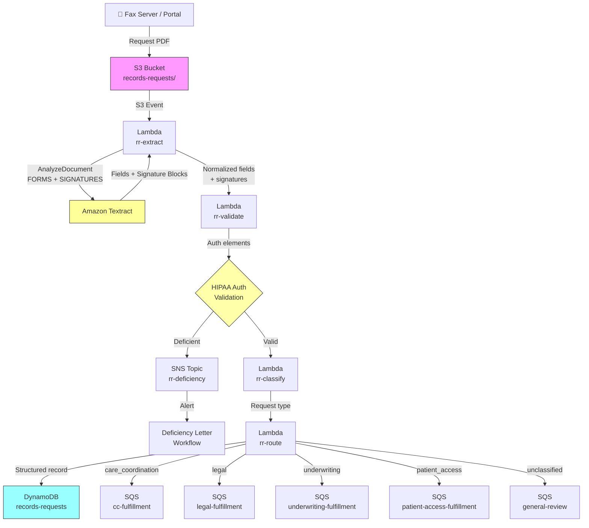

# Recipe 1.9: Medical Records Request Extraction 🔶

**Complexity:** Moderate · **Phase:** Phase 2 · **Estimated Cost:** ~$0.10–0.15 per request form

---

## The Problem

Here's a scenario that plays out in health plan operations every single day. A physician's office faxes over a medical records request for a patient they're about to see for the first time. They want the cardiac workup from 2023, the last two years of PCP notes, and the surgical history. The fax lands in a shared queue. Someone needs to read it, figure out who's asking for what records, check that there's a valid HIPAA authorization attached, and route it to the right fulfillment team.

Sounds manageable. Now imagine that happening 200 times before noon. Then add the legal requests from plaintiff attorneys wanting records for an injury claim. The life insurance underwriters wanting six years of medical history. The utilization management consultants reviewing a long-term disability case. And the patients themselves exercising their right of access under HIPAA. Each of these request types has different handling requirements, different turnaround windows, different fulfillment teams, and different legal exposure if something goes wrong.

The HIPAA Privacy Rule governs almost all of this. Under 45 CFR § 164.508, releasing protected health information requires either a valid patient authorization or one of the specified permissible purposes (treatment, payment, healthcare operations). A valid authorization isn't just a signature on a page. It has required elements: a description of the information to be disclosed, who is authorized to receive it, the purpose, and a date or event that causes it to expire. Processing a records request without checking those elements is not a paperwork oversight. It is a potential HIPAA violation, the kind that can generate breach notifications and OCR investigations.

The current state at most payers is fully manual triage. A records fulfillment coordinator reads each incoming request, eyeballs the authorization form, checks the elements as best they can, and enters the request into a tracking system by hand. When the authorization is incomplete or expired, they draft a deficiency letter, mail or fax it back to the requestor, and the whole cycle restarts. At payers processing tens of thousands of records requests per year, this manual triage is a meaningful operational cost, and the HIPAA compliance posture depends entirely on the consistency of each individual coordinator's review.

The document processing challenge here is moderate. A medical records request form is semi-structured: it has identifiable fields for patient demographics, requesting party information, and a description of the records being sought. But it also has a legal authorization component where you need to detect not just extracted text, but the presence of a physical signature. That's a meaningfully different capability from key-value extraction, and it's the piece that makes this recipe interesting.

---

## The Technology

### Semi-Structured Forms and the Limits of Pure Key-Value Extraction

The prior authorization cover sheet in Recipe 1.4 is a reasonably well-behaved form. Most payer PA cover sheets follow CMS-1500 conventions. The fields are in predictable places. The labels are stable enough that a FIELD_MAP with 10 to 15 variants per canonical field name handles the real-world variation.

A medical records request form is messier. There's no industry-standard template. Every hospital, every health system, every payer release-of-information department has their own version. Some look like clean typed forms. Others are clearly a Word document someone made in 2009 and has been faxing ever since. Some have a dedicated authorization section with checkboxes. Others just have a signature line at the bottom of the main request form. Some combine the request and the authorization into one document; others require separate documents.

What they almost all share is this: they're single-to-two-page documents with a mix of labeled fields (patient name, date of birth, medical record number, date range) and semi-free-text areas (description of records requested, purpose, any special instructions). The key-value extraction approach from Recipe 1.1 handles the structured field portion well. The semi-free-text areas require looking at the content of the response rather than mapping it to a specific field name.

The authorization section is the piece that requires real attention. The requestor may have filled in a standalone authorization form or a combined request-authorization form. Either way, you're looking for the same elements. The tricky part: how do you know if the patient actually signed it? OCR extracts text. A signature is not text. It's a pen stroke on paper that, after being faxed and scanned, appears as a pixelated blur that bears varying resemblance to the person's printed name.

### Signature Detection: A Different Kind of Recognition

Detecting whether a document contains a signature requires a fundamentally different technique from recognizing printed characters. OCR systems are trained to identify letterforms: the shapes that correspond to specific Unicode code points. Signatures are specifically designed to be difficult to replicate and don't map cleanly to letterforms. A good OCR model actually performs worse on signature areas than on blank areas because it tries to interpret the ink patterns as characters.

The field of signature detection uses binary image classification at the region level: given a bounding box on a document, does this region contain something that looks like a handwritten signature? The training data for these classifiers consists of thousands of document images with labeled regions: signature, blank, handwritten text, printed text, stamps, initials, and so on. What distinguishes a signature from handwritten text in this context is mostly statistical. Signatures tend to have certain ink density characteristics, stroke continuity patterns, and spatial distributions that differ from prose handwriting. They also tend to appear in spatially consistent locations on forms (signature lines are a real thing).

Modern document AI platforms include signature detection as a standard capability, typically returning a confidence score and bounding box for each detected signature region. The confidence score reflects the classifier's certainty that the region contains a signature versus something else. It does not reflect any judgment about the signature's legal validity, the signer's identity, or whether the signature matches a reference. For HIPAA authorization validation purposes, the question is much simpler: "Is there something here that looks like a handwritten signature?" That binary question is one that a reasonably well-trained classifier can answer with 85 to 95% accuracy on real-world fax-quality authorization forms.

The failure modes are predictable. Faint signatures that degrade below the classifier's detection threshold after multi-hop faxing. Rubber stamp signatures (some authorized representatives use these; they may or may not look like handwriting to the classifier). Electronic signatures embedded in PDFs, which may render as rendered text rather than ink marks. And the blank-but-nearby-text case where a signature line has a printed name adjacent to it and the OCR wants to call it a signature but the classifier correctly says it's typed text.

### What Makes a HIPAA Authorization Valid

The HIPAA Privacy Rule under 45 CFR § 164.508 specifies the required elements for a valid authorization. These aren't suggestions. An authorization missing any core element is legally deficient, meaning the covered entity cannot rely on it to authorize the disclosure.

The required elements are:

**Description of the information to be used or disclosed.** This must be specific enough to reasonably identify what information is being disclosed. "All medical records" is technically sufficient, but "cardiology records from January 2022 to present" is more specific and preferred. The word "all" should not be in the authorization because federal regulations require specificity; "any and all" is actually a red flag in some legal jurisdictions.

**Name or other specific identification of the person(s) authorized to make the requested use or disclosure.** For a standard records request, this is the covered entity holding the records.

**Name or other specific identification of the person(s) to whom the covered entity may make the requested use or disclosure.** This is the receiving party: the requesting physician, the attorney, the insurance company.

**Description of each purpose of the requested use or disclosure.** This must state why the information is being disclosed. "Treatment," "legal proceedings," "insurance underwriting" are all valid purposes.

**Expiration date or expiration event.** The authorization cannot be open-ended. Either a specific date (after which the authorization expires) or an event ("upon resolution of the legal proceedings," "one year from signature date") must be specified.

**Signature of the individual and date.** The patient or their authorized representative must sign and date the authorization.

This is what the authorization validation step in this recipe checks. It confirms that each of these elements is present in the extracted data. It does not evaluate the legal sufficiency of the content: whether "all records" is specific enough, whether the purpose description is adequate for the request type, whether the authorized representative actually has legal authority. That judgment is left to human reviewers and legal counsel. The pipeline catches missing elements and obvious expiration; everything else is a risk-calibrated call.

### Request Type Routing: Why It Matters

A records request from a treating physician is governed by different rules than a request from a plaintiff attorney. Treatment-purpose disclosures may not require a patient authorization at all under certain circumstances (treatment, payment, and healthcare operations exceptions). Legal requests may require a subpoena, court order, or qualified protective order rather than just a patient authorization. Underwriting requests have their own constraints on what information can be disclosed. Patient access requests under HIPAA's Right of Access (45 CFR § 164.524) have mandatory response timelines: 30 days to provide access, with a possible 30-day extension.

Routing the request to the right team before any human reviews it means the right people are looking at it from the start. The fulfillment specialist who handles care coordination requests doesn't need to be an expert in litigation holds. The paralegal processing legal requests doesn't need to know the care coordination disclosure timelines. Classification drives routing drives competency alignment.

The classification problem is relatively tractable. Medical records requests contain language that strongly signals their purpose: "continuity of care" appears in care coordination requests; "attorney," "litigation," or "subpoena" appear in legal requests; "underwriting" or "disability claim" appear in insurance requests. A simple keyword-based classifier achieves reasonable accuracy on real-world requests because the vocabulary is stable and domain-specific. The hard cases are general requests that don't clearly signal purpose, where you fall back to routing them to a general queue for human classification.

### The General Architecture Pattern

```
[Request Arrives as Fax or PDF]
             |
             v
[Document Extraction (Forms + Signature Detection)]
             |
             v
[Field Extraction and Normalization]
             |
             v
[Signature Detection: Present? Confidence?]
             |
             v
[HIPAA Authorization Validation]
    /                   \
   /                     \
[Valid Auth]          [Deficient Auth]
   |                      |
   v                      v
[Request Type         [Deficiency Letter
 Classification]        Queue]
   |
   v
[Route to Fulfillment Team]
(Care Coordination | Legal | Underwriting |
 Utilization Review | Patient Access)
```

Two paths diverge at authorization validation. If the authorization is deficient, the request goes to a deficiency letter workflow before any fulfillment begins. If the authorization is valid, the request type classifier determines where it goes next. The architecture is fundamentally a triage pipeline: extract, validate, classify, route.

---

## The AWS Implementation

### Why These Services

**Amazon Textract with FORMS and SIGNATURES feature types.** Most of what this recipe does is key-value extraction, which we've used since Recipe 1.1. The new addition is SIGNATURES in the `FeatureTypes` list. When you add SIGNATURES to an `AnalyzeDocument` call, Textract adds a second-pass detection step specifically for handwritten signature regions. The API returns `SIGNATURE` blocks in the response alongside the usual `KEY_VALUE_SET`, `LINE`, and `WORD` blocks. Each `SIGNATURE` block includes a confidence score and a bounding box showing where on the page the signature was detected. This is exactly what we need for the authorization validation step: not OCR of the signature, but a binary "there's a signature here" with associated confidence.

Medical records request forms are single-to-two-page documents, so we use the synchronous `AnalyzeDocument` API rather than the async pattern from Recipe 1.2. Synchronous analysis has a 1,000-page limit per call and a 10 MB document size limit. For a 2-page faxed form, those limits are never a concern, and synchronous processing gives us a much simpler implementation: one API call, one response, no SNS callbacks or polling loops.

**AWS Lambda.** Three Lambda functions handle the pipeline: one for extraction and validation, one for request classification, and one for assembly and routing. Keeping these separate makes testing and debugging easier. When authorization validation logic changes (and HIPAA compliance requirements do evolve), you update one function without touching the extraction or routing logic.

**Amazon DynamoDB.** The structured request record and authorization validation result go to DynamoDB. The record is the source of truth for the request's lifecycle: received, validated, routed, acknowledged, fulfilled. DynamoDB's single-digit-millisecond latency makes it suitable for the downstream routing systems that need to query or update request status as fulfillment progresses.

**Amazon SQS queues for routing.** Rather than Lambda directly calling downstream fulfillment systems, the assembler Lambda writes to type-specific SQS queues: one for care coordination, one for legal, one for underwriting, one for patient access, one for deficiency letters. This decoupling lets each fulfillment team consume requests at their own pace, provides natural backpressure, and gives you dead-letter queues for requests that fail downstream processing.

**Amazon SNS for deficiency notification.** When a request fails authorization validation, the pipeline needs to notify the deficiency letter team quickly. An SNS topic with subscriptions for the fulfillment ticketing system (and optionally email for urgent deficiencies) handles this without the pipeline needing to know anything about downstream notification systems.

**Amazon KMS and S3 for document storage.** The incoming request forms are PHI. They go to an S3 bucket with SSE-KMS encryption using a customer-managed key. The bucket policy enforces TLS-only access. The Lambda execution role has `s3:GetObject` permission on the specific prefix, nothing broader.

### Architecture Diagram



### Prerequisites

| Requirement | Details |
|-------------|---------|
| **AWS Services** | Amazon Textract, S3, Lambda, DynamoDB, SQS, SNS, KMS, CloudWatch |
| **IAM Permissions** | `textract:AnalyzeDocument`, `s3:GetObject` on the requests bucket, `dynamodb:PutItem` and `dynamodb:UpdateItem` on the records-requests table, `sqs:SendMessage` on each routing queue, `sns:Publish` on the deficiency topic, `kms:Decrypt` and `kms:GenerateDataKey` for the CMK |
| **Textract Features** | FORMS + SIGNATURES in the `FeatureTypes` list |
| **BAA** | AWS BAA required. Medical records request forms contain PHI including patient name, date of birth, and medical history descriptions. |
| **Encryption** | S3: SSE-KMS with customer-managed key. DynamoDB: encryption at rest enabled. SQS queues: SSE-KMS. All API calls over TLS. |
| **VPC** | Production: all Lambda functions in a VPC with VPC endpoints for S3 (gateway), Textract, DynamoDB, SQS, SNS, CloudWatch Logs, and KMS. |
| **CloudTrail** | Enabled for all API calls touching PHI. Every authorization validation decision must be logged with document key, elements checked, and outcome. Deficiency determinations require an audit trail for HIPAA compliance purposes. |
| **Sample Data** | HHS publishes a model HIPAA authorization form at https://www.hhs.gov/hipaa/for-professionals/privacy/guidance/model-notices-of-privacy-practices/index.html. Create synthetic versions. Test with: (1) complete valid authorization, (2) missing signature, (3) missing expiration, (4) expired authorization, (5) missing purpose. These five test cases cover the main validation paths. Never use real PHI in development. |
| **Cost Estimate** | Textract FORMS + SIGNATURES: $0.05/page (SIGNATURES detection is bundled into the FORMS tier, not separately billed). For a 2-page request form, Textract cost is approximately $0.10 per form. DynamoDB, SQS, and SNS costs at this document scale are negligible (under $0.001 per request). At 50,000 requests per year, Textract costs run approximately $5,000 annually. A single FTE processing 200 requests per day has a loaded cost that dwarfs that number. |

### Ingredients

| AWS Service | Role |
|------------|------|
| **Amazon Textract (AnalyzeDocument)** | Synchronous form field extraction (FORMS) and signature detection (SIGNATURES) for the 1-2 page request document |
| **Amazon S3** | Stores incoming request PDFs encrypted at rest with KMS; source for Lambda trigger |
| **AWS Lambda (rr-extract)** | Calls Textract, parses KEY_VALUE_SET blocks, extracts SIGNATURE blocks, returns normalized fields and signature data |
| **AWS Lambda (rr-validate)** | Validates HIPAA authorization elements against the required set from 45 CFR § 164.508; checks expiration date |
| **AWS Lambda (rr-classify)** | Classifies request type (care coordination, legal, underwriting, patient access, general) using keyword scoring |
| **AWS Lambda (rr-route)** | Assembles the final structured record, writes to DynamoDB, routes to the appropriate SQS queue |
| **Amazon DynamoDB** | Stores structured request records with authorization status and routing metadata |
| **Amazon SQS** | Type-specific queues for fulfillment routing; deficiency queue for incomplete authorizations |
| **Amazon SNS** | Deficiency notification to downstream letter-generation workflow |
| **AWS KMS** | Customer-managed encryption key for S3 documents, DynamoDB records, and SQS queue messages |
| **Amazon CloudWatch** | Logs, metrics, alarms for pipeline failures, deficiency rates, and authorization validation outcomes |

### Code

#### Walkthrough

**Step 1: Synchronous Textract extraction with FORMS and SIGNATURES.** This is similar to Recipe 1.1's `AnalyzeDocument` call, with one addition: `SIGNATURES` in the feature types list. The synchronous API handles 1-2 page forms without any job management overhead.

The `SIGNATURES` feature type instructs Textract to run an additional detection pass specifically looking for handwritten signature regions. The result appears as `SIGNATURE` blocks in the response, alongside the usual `KEY_VALUE_SET`, `WORD`, and `LINE` blocks. Each `SIGNATURE` block has a `Confidence` score (Textract's certainty that this region is a signature) and a `Geometry.BoundingBox` showing the signature's position on the page.

```
FUNCTION extract_records_request(bucket, document_key):
    // AnalyzeDocument is synchronous: one call, one response.
    // FORMS extracts key-value pairs (labeled fields).
    // SIGNATURES detects handwritten signature regions.
    response = textract.AnalyzeDocument(
        Document = { Bucket: bucket, Name: document_key },
        FeatureTypes = ["FORMS", "SIGNATURES"]
    )

    all_blocks = response.Blocks   // list of all blocks for all pages

    // Separate block types for downstream processing.
    // We handle three categories here:
    //   KEY_VALUE_SET blocks → field extraction (same as Recipe 1.1)
    //   SIGNATURE blocks → signature detection
    //   LINE blocks → full page text (for request classification)

    kv_blocks  = [block for block in all_blocks if block.BlockType == "KEY_VALUE_SET"]
    sig_blocks = [block for block in all_blocks if block.BlockType == "SIGNATURE"]
    line_blocks = [block for block in all_blocks if block.BlockType == "LINE"]

    // Build a block index (id -> block) for following child relationships in KEY_VALUE_SET blocks.
    // This is the same block map pattern from Recipe 1.1.
    block_map = { block.Id: block for block in all_blocks }

    RETURN {
        kv_blocks:   kv_blocks,
        sig_blocks:  sig_blocks,
        line_blocks: line_blocks,
        block_map:   block_map
    }
```

**Step 2: Parse and normalize request fields.** This is the FIELD_MAP normalization pattern from Recipe 1.1 applied to the medical records request form's field vocabulary. The FIELD_MAP covers the most common label variants for each canonical field across the different form templates you'll encounter in the wild.

Two fields deserve special attention: `records_requested` (a description of what's being asked for) and `expiration_date` (when the authorization expires). Both are critical for HIPAA authorization validation. If either is absent, the authorization is deficient.

```
// Field map: canonical name -> list of known label variants seen on real request forms.
// Records request forms vary widely; these variants cover the most common templates.
REQUEST_FIELD_MAP = {
    "patient_name": [
        "patient name", "member name", "name of individual", "name of patient",
        "patient", "name"
    ],
    "patient_dob": [
        "date of birth", "dob", "birth date", "patient dob", "member dob"
    ],
    "patient_id": [
        "medical record number", "medical record #", "mrn", "member id",
        "patient id", "patient number", "id"
    ],
    "requestor_name": [
        "requesting party", "requestor", "requested by", "authorized by",
        "name of requestor", "name of authorized representative"
    ],
    "requestor_org": [
        "organization", "facility name", "practice name", "firm name",
        "organization name", "employer"
    ],
    "requestor_fax": [
        "fax", "fax number", "fax #", "fax no"
    ],
    "records_requested": [
        "records requested", "information requested", "type of records",
        "specific information to be disclosed", "records needed",
        "description of information", "what records"
    ],
    "date_range": [
        "date range", "dates of treatment", "dates of service", "from",
        "period of treatment", "treatment dates", "from date"
    ],
    "purpose": [
        "purpose", "purpose of disclosure", "reason for request",
        "reason", "intended use", "purpose of use"
    ],
    "authorization_date": [
        "date signed", "authorization date", "signature date", "date of signature",
        "date", "signed on"
    ],
    "expiration_date": [
        "expiration date", "expiration", "this authorization expires",
        "authorization expires on", "expires", "valid through"
    ],
    "requestor_npi": [
        "npi", "national provider identifier", "provider npi"
    ]
}

FUNCTION parse_and_normalize_fields(kv_blocks, block_map):
    // Step 1: Extract raw key-value pairs from Textract KEY_VALUE_SET blocks.
    // This follows the same pattern as Recipe 1.1; we won't repeat the
    // full key-value traversal logic here; see Recipe 1.1 for implementation details.
    raw_kv = parse_key_value_pairs(kv_blocks, block_map)
    // raw_kv is a map: raw label text -> { value: extracted_value, confidence: score }

    // Step 2: Normalize using the field map.
    normalized = empty map
    FOR each canonical_name, label_variants in REQUEST_FIELD_MAP:
        FOR each label in label_variants:
            // Fuzzy match: lowercase both sides, check if label appears in the raw key
            matching_keys = [k for k in raw_kv if label appears in lowercase(k)]
            IF matching_keys is not empty:
                // Take the first match; in case of multiple, take highest confidence
                best_match = matching_keys entry with highest confidence
                normalized[canonical_name] = raw_kv[best_match]
                BREAK   // found this canonical field; move to next

    RETURN normalized
    // Result: map of canonical field name -> { value: string, confidence: float }
```

**Step 3: Extract signature data.** Textract's SIGNATURE blocks tell us where signatures are on the page and with what confidence. We extract all of them. Downstream, the authorization validator decides how to interpret the results.

One subtlety: a two-page authorization form might have two signature lines: one on the authorization page (required) and one on the request form itself (optional). We capture all detected signatures and let the validator reason about them. We also capture the page number for each signature, because the position matters: a signature on page 2 of a two-page document is more likely to be the authorization signature than a signature on page 1.

```
FUNCTION extract_signatures(sig_blocks):
    signatures = empty list

    FOR each block in sig_blocks:
        // Each SIGNATURE block has:
        //   Confidence: float (0-100), how certain Textract is this is a signature
        //   Geometry.BoundingBox: { Top, Left, Width, Height } as fractions of page dimensions
        //   Page: int, which page the signature was found on (1-indexed)

        sig = {
            confidence:  block.Confidence,
            page:        block.Page,
            bounding_box: {
                top:    block.Geometry.BoundingBox.Top,
                left:   block.Geometry.BoundingBox.Left,
                width:  block.Geometry.BoundingBox.Width,
                height: block.Geometry.BoundingBox.Height
            }
        }

        signatures.append(sig)

    // Sort by page, then by vertical position (Top) within page.
    // This puts them in document reading order, which makes downstream logic cleaner.
    SORT signatures by (page, bounding_box.top)

    RETURN signatures
```

**Step 4: Validate HIPAA authorization elements.** This is the core compliance step. We check each of the six required elements from 45 CFR § 164.508(c)(1). The validation returns which elements are present, which are missing, and a single `valid` boolean that the routing logic uses.

The expiration check deserves attention. An authorization can be expired in two ways: a specific past date, or an event that has already occurred. We can only check date-based expiration automatically. Event-based expiration ("upon resolution of litigation") requires human judgment. The pipeline flags event-based expirations for manual review rather than auto-approving them.

```
// Required HIPAA authorization elements.
// Map: element key -> human-readable description (for deficiency letters).
REQUIRED_AUTH_ELEMENTS = {
    "patient_or_rep_signature": "Signature of patient or authorized representative (45 CFR § 164.508(c)(1)(vi))",
    "authorization_date":       "Date the authorization was signed (45 CFR § 164.508(c)(1)(vi))",
    "records_requested":        "Description of information to be used or disclosed (45 CFR § 164.508(c)(1)(i))",
    "purpose":                  "Purpose of the requested disclosure (45 CFR § 164.508(c)(1)(iv))",
    "expiration_date":          "Expiration date or event (45 CFR § 164.508(c)(1)(v))"
}

// Confidence threshold for accepting a detected signature as valid.
// Textract Signatures confidence is calibrated; 70 is a reasonable threshold
// for fax-quality documents. Raise to 80 for digital PDFs.
SIGNATURE_CONFIDENCE_THRESHOLD = 70.0

FUNCTION validate_hipaa_authorization(normalized_fields, signatures):
    validation = {
        valid:          true,        // flip to false if any required element is missing or expired
        elements:       empty map,   // element key -> boolean (present/absent)
        missing:        empty list,  // descriptions of missing elements (for deficiency letter)
        expired:        false,       // true if authorization date has passed
        needs_review:   false,       // true for edge cases requiring human judgment
        review_reasons: empty list
    }

    // --- Check 1: Patient or authorized representative signature ---
    // Accept a signature if Textract detected at least one with confidence >= threshold.
    high_confidence_sigs = [s for s in signatures if s.confidence >= SIGNATURE_CONFIDENCE_THRESHOLD]
    has_signature = length of high_confidence_sigs > 0

    validation.elements["patient_or_rep_signature"] = has_signature
    IF NOT has_signature:
        validation.valid = false
        IF signatures is empty:
            // No signature region detected at all.
            validation.missing.append(REQUIRED_AUTH_ELEMENTS["patient_or_rep_signature"])
        ELSE:
            // Something was detected but below the confidence threshold.
            // Could be a faint fax signature. Flag for human review.
            validation.needs_review = true
            validation.review_reasons.append(
                "Possible signature detected with low confidence (" +
                max(s.confidence for s in signatures) + "%). " +
                "Manual review required to confirm."
            )

    // --- Check 2: Date signed ---
    auth_date_entry = normalized_fields.get("authorization_date")
    has_auth_date   = auth_date_entry is not null AND auth_date_entry.value.strip() is not empty

    validation.elements["authorization_date"] = has_auth_date
    IF NOT has_auth_date:
        validation.valid = false
        validation.missing.append(REQUIRED_AUTH_ELEMENTS["authorization_date"])

    // --- Check 3: Description of records requested ---
    records_entry = normalized_fields.get("records_requested")
    has_records   = records_entry is not null AND records_entry.value.strip() is not empty

    validation.elements["records_requested"] = has_records
    IF NOT has_records:
        validation.valid = false
        validation.missing.append(REQUIRED_AUTH_ELEMENTS["records_requested"])

    // --- Check 4: Purpose of disclosure ---
    purpose_entry = normalized_fields.get("purpose")
    has_purpose   = purpose_entry is not null AND purpose_entry.value.strip() is not empty

    validation.elements["purpose"] = has_purpose
    IF NOT has_purpose:
        validation.valid = false
        validation.missing.append(REQUIRED_AUTH_ELEMENTS["purpose"])

    // --- Check 5: Expiration date or event ---
    exp_entry = normalized_fields.get("expiration_date")
    has_expiration = exp_entry is not null AND exp_entry.value.strip() is not empty

    validation.elements["expiration_date"] = has_expiration
    IF NOT has_expiration:
        validation.valid = false
        validation.missing.append(REQUIRED_AUTH_ELEMENTS["expiration_date"])
    ELSE:
        // Check if the expiration is a date (can be validated automatically)
        // or an event description (requires human review).
        exp_value = exp_entry.value.strip()
        exp_date  = attempt_date_parse(exp_value)  // try common date formats

        IF exp_date is not null:
            // It's a parseable date. Check if it's in the past.
            IF exp_date < current date:
                validation.valid    = false
                validation.expired  = true
                validation.missing.append(
                    "Authorization expired on " + exp_date.to_string("YYYY-MM-DD") +
                    ". A renewed authorization is required."
                )
        ELSE:
            // Non-date expiration string: "upon resolution of litigation", "one year from signing", etc.
            // These require human judgment to evaluate.
            validation.needs_review = true
            validation.review_reasons.append(
                "Expiration is event-based, not date-based: \"" + exp_value + "\"." +
                " Manual review required to determine if authorization is still valid."
            )

    // Final validity: valid if no missing elements and not expired.
    // needs_review can be true even when valid is true (edge cases still pass to human review).
    RETURN validation
```

**Step 5: Classify request type.** The keyword-based classifier determines which fulfillment team should receive this request. The scoring uses simple keyword hit counts across the purpose field and full document text.

The logic here is deliberately straightforward. A more sophisticated approach would use a trained text classifier, but request type vocabulary is stable and domain-specific enough that keyword matching gets you to 85 to 90% accuracy. The hard cases go to a general review queue rather than being misrouted to a specialized team.

```
// Request type definitions: type -> keywords that signal this type.
// Organized by likely presence in purpose field and requestor information.
REQUEST_TYPE_SIGNATURES = {
    "care_coordination": {
        keywords: [
            "continuity of care", "transfer of care", "new treating", "treating physician",
            "referral", "care coordination", "new provider", "specialist referral",
            "transferred care"
        ],
        min_matches: 1   // very distinctive vocabulary; one match is sufficient
    },
    "legal": {
        keywords: [
            "attorney", "attorney at law", "law firm", "subpoena", "court order",
            "legal proceedings", "litigation", "deposition", "plaintiff", "defendant",
            "personal injury", "workers compensation", "workers comp"
        ],
        min_matches: 1
    },
    "underwriting": {
        keywords: [
            "underwriting", "life insurance", "disability", "disability insurance",
            "insurance application", "insurance underwriting", "long term disability",
            "ltd", "short term disability"
        ],
        min_matches: 1
    },
    "utilization_review": {
        keywords: [
            "utilization review", "utilization management", "case management",
            "disease management", "health management", "managed care review",
            "independent medical exam", "ime"
        ],
        min_matches: 1
    },
    "patient_access": {
        keywords: [
            "patient request", "personal copy", "right of access", "my records",
            "self", "personal use", "own records", "patient copy"
        ],
        min_matches: 1
    }
}

FUNCTION classify_request_type(normalized_fields, line_blocks):
    // Build the text corpus to search: purpose field + full document text.
    // The purpose field gets double weight by including it twice.
    purpose_text = normalized_fields.get("purpose", {}).value or ""
    full_text = join all line_blocks text values with " "
    search_text = lowercase(purpose_text + " " + purpose_text + " " + full_text)

    scores = empty map

    FOR each req_type, signature in REQUEST_TYPE_SIGNATURES:
        hits = count of keywords in signature.keywords that appear in search_text
        IF hits >= signature.min_matches:
            scores[req_type] = hits

    IF scores is empty:
        // No recognizable request type signals found. Route to general review.
        RETURN "general"

    // Return the highest-scoring type.
    // In case of tie, prefer in order: care_coordination, legal, underwriting, utilization_review, patient_access.
    RETURN type with highest score in scores (with tie-breaking as above)
```

**Step 6: Assemble the record and route.** The final step combines all the extracted and validated data into a structured record, writes it to DynamoDB, and sends the request to the appropriate SQS queue for fulfillment.

The routing map connects request types to queue ARNs. Deficient requests go to a notification path instead of the fulfillment queues. Invalid authorizations are never routed to fulfillment. The record is stored for audit purposes, and the deficiency notification triggers the letter-generation workflow.

```
// Routing table: request type -> SQS queue ARN.
// These ARNs are loaded from environment variables in the Lambda; not hardcoded.
FULFILLMENT_QUEUES = {
    "care_coordination":  env.CARE_COORDINATION_QUEUE_URL,
    "legal":              env.LEGAL_QUEUE_URL,
    "underwriting":       env.UNDERWRITING_QUEUE_URL,
    "utilization_review": env.UR_QUEUE_URL,
    "patient_access":     env.PATIENT_ACCESS_QUEUE_URL,
    "general":            env.GENERAL_REVIEW_QUEUE_URL
}

FUNCTION assemble_and_route(document_key, normalized_fields, signatures, validation, request_type):
    // Build the structured request record.
    record = {
        document_key:      document_key,
        processed_at:      current UTC timestamp (ISO 8601),

        // Patient demographics
        patient: {
            name:       normalized_fields.get("patient_name", {}).value,
            dob:        normalized_fields.get("patient_dob", {}).value,
            member_id:  normalized_fields.get("patient_id", {}).value
        },

        // Requesting party
        requestor: {
            name:         normalized_fields.get("requestor_name", {}).value,
            organization: normalized_fields.get("requestor_org", {}).value,
            fax:          normalized_fields.get("requestor_fax", {}).value,
            npi:          normalized_fields.get("requestor_npi", {}).value
        },

        // Request specifics
        request_details: {
            records_requested: normalized_fields.get("records_requested", {}).value,
            date_range:        normalized_fields.get("date_range", {}).value,
            purpose:           normalized_fields.get("purpose", {}).value
        },

        // Routing
        request_type: request_type,

        // Authorization status
        authorization: {
            valid:            validation.valid,
            elements:         validation.elements,
            missing:          validation.missing,
            expired:          validation.expired,
            needs_review:     validation.needs_review,
            review_reasons:   validation.review_reasons,
            auth_date:        normalized_fields.get("authorization_date", {}).value,
            expiration_date:  normalized_fields.get("expiration_date", {}).value,
            signatures_detected: length of signatures,
            signature_max_confidence: max(s.confidence for s in signatures) or 0.0
        },

        // Pipeline metadata
        status: "deficient" if NOT validation.valid else
                "pending_review" if validation.needs_review else
                "routed"
    }

    // Write to DynamoDB. Use document_key as the partition key.
    // Conditional write: fail if record already exists (idempotency).
    write record to DynamoDB table "records-requests" with:
        condition: attribute_not_exists(document_key)

    // Route based on authorization validity.
    IF NOT validation.valid:
        // Deficient authorization: notify deficiency workflow, do not route to fulfillment.
        publish to SNS deficiency topic:
            document_key: document_key,
            patient_name: record.patient.name,
            requestor:    record.requestor.name or record.requestor.organization,
            missing:      validation.missing,
            expired:      validation.expired

        // Log validation failure for audit trail.
        log: "Authorization deficient for " + document_key +
             ". Missing elements: " + join(validation.missing, "; ")

        RETURN record

    // Valid authorization: send to type-specific fulfillment queue.
    queue_arn = FULFILLMENT_QUEUES.get(request_type, FULFILLMENT_QUEUES["general"])

    send message to SQS queue at queue_arn:
        document_key:     document_key,
        request_type:     request_type,
        patient_name:     record.patient.name,
        requestor:        record.requestor.name or record.requestor.organization,
        records_requested: record.request_details.records_requested,
        needs_review:     validation.needs_review

    // Log routing decision for audit.
    log: "Request " + document_key + " routed to " + request_type +
         " queue. Authorization valid: " + validation.valid

    RETURN record
```

> **Curious how this looks in Python?** The pseudocode above covers the concepts. If you'd like to see sample Python code that demonstrates these patterns using boto3, check out the [Python Example](chapter01.09-python-example). It walks through each step with inline comments and notes on what you'd need to change for a real deployment.

---

### Expected Results

**Sample output for a care coordination request with complete authorization:**

```json
{
  "document_key": "records-requests/2026/03/01/fax-00519.pdf",
  "processed_at": "2026-03-01T15:44:12Z",
  "patient": {
    "name": "David Park",
    "dob": "07/23/1982",
    "member_id": "AET6182940"
  },
  "requestor": {
    "name": "Dr. Michael Torres",
    "organization": "Louisville Cardiology Associates",
    "fax": "(502) 555-0291",
    "npi": "1740293847"
  },
  "request_details": {
    "records_requested": "All cardiology records including stress tests, echocardiograms, cardiac catheterization reports, and office visit notes",
    "date_range": "01/01/2023 - present",
    "purpose": "Continuity of care - patient transferring to new treating cardiologist"
  },
  "request_type": "care_coordination",
  "authorization": {
    "valid": true,
    "elements": {
      "patient_or_rep_signature": true,
      "authorization_date": true,
      "records_requested": true,
      "purpose": true,
      "expiration_date": true
    },
    "missing": [],
    "expired": false,
    "needs_review": false,
    "review_reasons": [],
    "auth_date": "02/28/2026",
    "expiration_date": "02/28/2027",
    "signatures_detected": 1,
    "signature_max_confidence": 91.4
  },
  "status": "routed"
}
```

**Sample output for a request with deficient authorization (missing expiration, low-confidence signature):**

```json
{
  "document_key": "records-requests/2026/03/01/fax-00521.pdf",
  "processed_at": "2026-03-01T15:49:07Z",
  "patient": {
    "name": "Maria Sandoval",
    "dob": "11/04/1975",
    "member_id": "HUM7291034"
  },
  "requestor": {
    "name": "Allied Insurance Group",
    "organization": "Allied Insurance Group",
    "fax": "(800) 555-0148",
    "npi": null
  },
  "request_details": {
    "records_requested": "Complete medical records for all dates of service",
    "date_range": "01/01/2020 - present",
    "purpose": "Life insurance underwriting"
  },
  "request_type": "underwriting",
  "authorization": {
    "valid": false,
    "elements": {
      "patient_or_rep_signature": false,
      "authorization_date": true,
      "records_requested": true,
      "purpose": true,
      "expiration_date": false
    },
    "missing": [
      "Signature of patient or authorized representative (45 CFR § 164.508(c)(1)(vi))",
      "Expiration date or event (45 CFR § 164.508(c)(1)(v))"
    ],
    "expired": false,
    "needs_review": true,
    "review_reasons": [
      "Possible signature detected with low confidence (58.3%). Manual review required to confirm."
    ],
    "auth_date": "02/26/2026",
    "expiration_date": null,
    "signatures_detected": 1,
    "signature_max_confidence": 58.3
  },
  "status": "deficient"
}
```

**Performance benchmarks:**

| Metric | Typical Value |
|--------|---------------|
| End-to-end latency (1-2 page form, synchronous) | 2–5 seconds |
| Forms field extraction accuracy | 91–96% |
| Signature detection accuracy (clean digital PDF) | 92–97% |
| Signature detection accuracy (fax-quality scan) | 83–91% |
| Signature false negative rate (faint fax signatures) | 8–15% |
| Request type classification accuracy (keyword heuristics) | 85–91% |
| Authorization validation accuracy (field presence checks) | 95%+ |
| Cost per 2-page request form | ~$0.10–0.15 |

**Where it struggles:** Fax-degraded signatures below the confidence threshold that the classifier reports as "no signature" when one exists. Typed signatures (typed name in a signature box) that Textract correctly does not classify as a SIGNATURE block but which may be legally valid in some electronic-signature contexts. Combined request-and-authorization forms where the authorization elements are interleaved with the request fields rather than in a distinct section, making field extraction ambiguous. Multi-page authorizations where the signature is on page 2 but the expiration is on page 1 and the FIELD_MAP matches the wrong field value. And authorizations in languages other than English, which this recipe does not handle (the FIELD_MAP requires localized variants for each language).

---

## Why This Isn't Production-Ready

The pseudocode above demonstrates the core pipeline. A production deployment in a real release-of-information operation requires several additions that are intentionally outside this recipe's scope.

**HIPAA authorization validation is incomplete.** The pseudocode checks 5 of the 6 elements required by 45 CFR 164.508(c)(1): patient identity, purpose, scope, expiration, and signature. Missing: the disclosing entity identity (who is authorized to disclose) and the recipient identity (who receives the records). Both are required. Additionally, 164.508(c)(2) requires three statements be present on the form (right to revoke, whether conditioning applies, re-disclosure risk). The pseudocode does not validate (c)(2) at all. A production implementation must check all of these. Your compliance team should review the full authorization validation logic before deployment.

**Classifier tie-breaking is risk-inverted.** The pseudocode breaks classification ties by priority order, with `care_coordination` first. A request that scores equally as `legal` and `care_coordination` routes to care coordination. That's backwards from a risk perspective: legal requests have stricter handling requirements, shorter deadlines, and higher liability if misrouted. Reverse the priority order so the highest-risk classification wins ties, or route all ties to manual review.

**Authorized representative signatures.** 164.508(c)(1)(vi) allows personal representatives to sign on behalf of a patient, but requires documentation of the representative's authority (power of attorney, legal guardian designation). The pseudocode validates signature presence but has no mechanism to detect or flag representative signatures versus patient signatures. This is a compliance gap that needs human review workflow integration.

**The signature confidence threshold is a policy decision, not a technical one.** Seventy percent is a reasonable starting point for fax-quality documents, but the right threshold depends on your risk tolerance. Too high, and you generate deficiency letters for valid authorizations where the fax degraded the signature. Too low, and you accept typed text or blank-adjacent patterns as valid signatures. Your compliance and legal teams need to set this threshold. It should be configurable per environment, not hardcoded.

**Expiration validation for event-based authorizations requires more than the pipeline.** An authorization that says "valid until resolution of the workers' compensation claim" is legally valid if the claim is still open and expired if the claim is closed. The pipeline flags these for review, but handling them properly requires integration with your claims management system or a manual review workflow that can look up claim status. The pipeline creates the flag; your operations team needs to close the loop.

**Authorization elements are checked for presence, not adequacy.** The HIPAA Privacy Rule requires a "description of the information to be used or disclosed" specific enough to reasonably identify it. A value of "all records" in the records_requested field passes the presence check but may not meet the specificity requirement, depending on your legal counsel's interpretation. The pipeline is not a lawyer. It checks that something is there. Whether that something is legally sufficient is a question for your privacy officer.

**Duplicate request detection.** The same request often arrives multiple times via fax because the sender didn't get confirmation. The pipeline uses a conditional DynamoDB write to prevent duplicate records on the exact same document key, but "same document, different fax" creates two different S3 keys and two different records. A near-duplicate detection step that compares patient ID, requestor fax number, and records description before writing would catch most re-submissions. This is straightforward to add but is outside the scope of this recipe.

**No PHI in Lambda environment variables or CloudWatch logs.** The routing functions log document key and request type. They do not log patient name, member ID, or authorization details. Check your CloudWatch logs before going to production; it's easy to accidentally include PHI in a debug log statement. Enable CloudWatch log data protection to automatically detect and mask PHI in log groups.

---

## The Honest Take

Medical records requests feel like a solved problem until you're actually building the compliance layer. The forms extraction part is basically Recipe 1.1 with a wider FIELD_MAP. Signature detection is a one-line addition to the FeatureTypes list. The tricky part is what comes after: what does "validated authorization" actually mean for your organization?

The honest answer is that this pipeline does not validate authorizations. It checks that the required elements are present and that the expiration date hasn't passed. Whether those elements meet the legal standard for a valid HIPAA authorization is a question that lawyers and compliance officers need to answer. The pipeline surfaces the information; the humans make the call. That framing is important when you're presenting this to your legal team, because the first question they'll ask is "does the system check that the authorization is valid?" and the correct answer is "it checks for required elements and expiration, but not legal sufficiency."

The signature detection piece generates the most operational noise. Low-confidence detections: that middle zone between "clearly a signature" and "clearly blank." These come up frequently on fax-quality documents. In practice, most of them fall into two categories: genuinely faint signatures that need human review, and scanning artifacts that look like marks but aren't. The review queue exists exactly for this, and the confidence score gives reviewers useful signal about which requests need the closest look.

The request type classification is worth getting right. Misrouting a legal request to the care coordination team is an operational problem; misrouting a care coordination request to the legal team is an unnecessary delay in patient care. Spend time on the keyword lists. Run them against three to six months of historical requests before going live. You'll find vocabulary patterns specific to your member population and your requestor mix that the generic keyword list misses. A well-tuned classifier is significantly more valuable than a technically sophisticated one that's tuned on someone else's data.

One thing this recipe doesn't address at all: what happens after the request is routed. This pipeline gets the right request to the right team. Whether those teams then fulfill the request correctly, within the required timeframes, with appropriate minimum-necessary scoping: that's a whole separate set of problems. The pipeline is the front door. What happens once the door opens is still mostly a people problem.

---

## Variations and Extensions

**Automated deficiency letter generation.** When the authorization validation fails, the pipeline has all the information needed for a deficiency letter: the requestor's contact information, the patient name, the specific missing elements. Connecting the deficiency SNS topic to a Lambda that calls an LLM with the missing elements list to generate a professional, empathetic deficiency letter saves meaningful manual effort. The letter still goes through a human approval step before sending, but draft generation from structured data is a well-bounded task for generative AI.

**Authorization expiration monitoring for standing requests.** Some care coordination relationships involve standing authorizations that authorize ongoing records sharing over a period of time. When those authorizations have a date-based expiration, you can extract the expiration date at processing time, write it to a DynamoDB TTL attribute, and configure a Lambda trigger for items approaching expiration. A 30-day advance notification to the care coordinator allows proactive renewal before the authorization lapses and creates a gap in the records sharing workflow.

**HIPAA minimum necessary scoping via request type.** The Privacy Rule's minimum necessary principle means you should disclose only the records that are actually relevant to the stated purpose. A legal request for records related to a specific injury should not automatically produce the patient's complete medical history. After request classification, applying request-type-specific record scoping rules against your records catalog before fulfillment limits disclosure to what the requestor actually needs. This is architecturally straightforward once the request is classified and the records catalog is queryable; it is organizationally complex because it requires policy owners to agree on what "minimum necessary" means for each request type.

---

## Related Recipes

- **Recipe 1.4 (Prior Authorization Document Processing):** The structural reference for this recipe. The FIELD_MAP pattern, confidence gating, and cover sheet extraction all carry directly into records request processing.
- **Recipe 1.6 (Handwritten Clinical Note Digitization):** The human review queue for low-confidence signatures and ambiguous authorization elements uses the Amazon A2I pattern detailed here.
- **Recipe 1.10 (Historical Chart Migration):** Once you've validated and processed records requests, you may need to pull records from legacy chart systems. Recipe 1.10 covers the extraction side of that problem.

---

## Additional Resources

**AWS Documentation:**
- [Amazon Textract AnalyzeDocument API Reference](https://docs.aws.amazon.com/textract/latest/dg/API_AnalyzeDocument.html)
- [Amazon Textract: Detecting Signatures](https://docs.aws.amazon.com/textract/latest/dg/how-it-works-signatures.html)
- [Amazon Textract: Analyzing Document Pages with Forms](https://docs.aws.amazon.com/textract/latest/dg/analyzing-document-page-api.html)
- [Amazon Textract Pricing](https://aws.amazon.com/textract/pricing/)
- [AWS HIPAA Eligible Services Reference](https://aws.amazon.com/compliance/hipaa-eligible-services-reference/)
- [Architecting for HIPAA on AWS (Whitepaper)](https://docs.aws.amazon.com/whitepapers/latest/architecting-hipaa-security-and-compliance-on-aws/welcome.html)
- [Amazon DynamoDB: Using Time to Live](https://docs.aws.amazon.com/amazondynamodb/latest/developerguide/TTL.html)
- [Amazon CloudWatch Log Data Protection](https://docs.aws.amazon.com/AmazonCloudWatch/latest/logs/mask-sensitive-log-data.html)

**Regulatory References:**
- [HIPAA Privacy Rule: Authorizations (45 CFR § 164.508)](https://www.hhs.gov/hipaa/for-professionals/privacy/guidance/authorizations/index.html)
- [HIPAA Right of Access (45 CFR § 164.524)](https://www.hhs.gov/hipaa/for-professionals/privacy/guidance/access/index.html)
- [HHS Model HIPAA Authorization Form](https://www.hhs.gov/hipaa/for-professionals/privacy/guidance/model-notices-of-privacy-practices/index.html)
- [HIPAA Minimum Necessary Standard Guidance](https://www.hhs.gov/hipaa/for-professionals/privacy/guidance/minimum-necessary-requirement/index.html)
- [OCR Guidance on Electronic Signatures in HIPAA Context](https://www.hhs.gov/hipaa/for-professionals/faq/2006/is-an-electronic-signature-an-acceptable-form-of-a-signature-for-a-valid-hipaa-authorization/index.html)

**AWS Sample Repos:**
- [`aws-ai-intelligent-document-processing`](https://github.com/aws-samples/aws-ai-intelligent-document-processing): Comprehensive IDP reference including multi-stage extraction, document classification, A2I human review, and generative AI enrichment patterns; the review workflow pattern is directly applicable to signature review queues
- [`amazon-textract-code-samples`](https://github.com/aws-samples/amazon-textract-code-samples): Official Textract code samples including forms extraction, AnalyzeDocument API usage, and response parsing utilities; the key-value extraction patterns here are the foundation of Steps 1 and 2
- [`amazon-textract-and-amazon-comprehend-medical-claims-example`](https://github.com/aws-samples/amazon-textract-and-amazon-comprehend-medical-claims-example): Healthcare-specific forms extraction and validation with CloudFormation deployment templates; demonstrates the field normalization and confidence gating patterns
- [`guidance-for-low-code-intelligent-document-processing-on-aws`](https://github.com/aws-solutions-library-samples/guidance-for-low-code-intelligent-document-processing-on-aws): Scalable IDP architecture guidance covering ingestion, extraction, enrichment, and storage; useful reference for production-grade pipeline design

**AWS Solutions and Blogs:**
- [Guidance for Intelligent Document Processing on AWS](https://aws.amazon.com/solutions/guidance/intelligent-document-processing-on-aws): Reference architecture for classifying, extracting, and enriching documents at scale; covers the routing and storage patterns used here
- [Intelligent Healthcare Forms Analysis with Amazon Bedrock](https://aws.amazon.com/blogs/machine-learning/intelligent-healthcare-forms-analysis-with-amazon-bedrock): Extends forms extraction with generative AI for complex or ambiguous healthcare fields; the hybrid Textract-plus-LLM pattern is a useful extension for handling non-standard authorization forms
- [Building a Medical Claims Processing Solution with Textract and Comprehend Medical](https://aws.amazon.com/blogs/industries/build-a-medical-claims-processing-solution-using-amazon-textract-and-amazon-comprehend-medical/): End-to-end healthcare document processing with routing and compliance patterns

---

## Estimated Implementation Time

| Scope | Time |
|-------|------|
| **Basic** (Textract FORMS + SIGNATURES, field extraction, signature detection, single Lambda) | 4–6 hours |
| **Production-ready** (authorization validation, request routing, DynamoDB, SQS queues, deficiency notification, audit logging, VPC, KMS, idempotency) | 3–5 days |
| **With variations** (deficiency letter generation, expiration monitoring, minimum necessary scoping) | 2–3 weeks |

---

## Tags

`document-intelligence` · `ocr` · `textract` · `forms` · `signatures` · `medical-records` · `hipaa-authorization` · `privacy` · `release-of-information` · `routing` · `expiration-validation` · `moderate` · `phase-2` · `hipaa` · `payer`

---

*← [Chapter 1 Index](chapter01-index) · [← Recipe 1.8: EOB Processing](chapter01.08-eob-processing) · [Next: Recipe 1.10: Historical Chart Migration →](chapter01.10-historical-chart-migration)*
