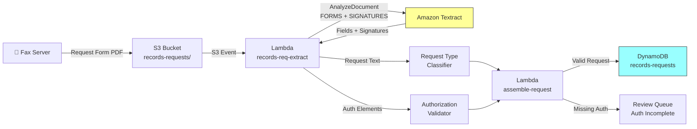

# Recipe 1.9 — Medical Records Request Extraction 🔶

**Complexity:** Moderate · **Phase:** Phase 2 · **Estimated Cost:** ~$0.005 per request form

---

## Problem Statement

Medical records requests are the logistics layer of healthcare data exchange. A provider faxes a request asking for a member's records — for care coordination, legal proceedings, insurance underwriting, or utilization review. The payer (or their delegated entity) needs to parse the request, verify authorization, identify exactly which records are being requested, and route it to the right fulfillment team.

Today this is manual triage: someone reads the fax, figures out who's asking for what, checks that the request includes a valid authorization (HIPAA requires it for most disclosures), and enters it into a tracking system. At payers processing thousands of records requests monthly, this creates a bottleneck that delays care coordination and risks HIPAA violations if requests are fulfilled without proper authorization.

The extraction challenge is moderate: records request forms are semi-structured (similar to the cover sheet extraction in Recipe 1.4), but with an important addition — we need to detect and validate authorization elements (patient signature, date, scope of disclosure) to ensure HIPAA compliance before any records are released.

## Solution Overview

This recipe combines the forms extraction from Recipe 1.1 with signature detection and authorization validation:

1. **Textract** extracts key-value pairs and detects signatures (using the SIGNATURES feature type)
2. **Authorization validation** checks that required HIPAA authorization elements are present: patient/authorized representative signature, date, description of information to be disclosed, purpose, and expiration
3. **Request classification** determines the type of request (continuity of care, legal, insurance, patient access) to route to the appropriate fulfillment workflow
4. **Output** a structured request record with authorization status

## Architecture Diagram



## Prerequisites

| Requirement | Details |
|-------------|---------|
| **AWS Services** | Amazon Textract, S3, Lambda, DynamoDB |
| **IAM Permissions** | Same as Recipe 1.1. Textract SIGNATURES feature requires no additional permissions. |
| **Textract Features** | FORMS + SIGNATURES |
| **HIPAA Controls** | Critical here: medical records requests are governed by the HIPAA Privacy Rule (45 CFR § 164.508). Invalid authorizations must be rejected. Log all authorization validations for audit. Never fulfill a request without validated authorization (except for treatment, payment, and healthcare operations, which don't require patient authorization). |
| **Sample Data** | Standard HIPAA authorization forms — many healthcare attorneys publish templates. Create synthetic versions. Include both complete and incomplete authorizations for testing. |
| **Cost Estimate** | Textract (FORMS + SIGNATURES): ~$1.50/1,000 pages. Most request forms are 1-2 pages: ~$0.003-0.005/form. |

## Ingredients

| AWS Service | Role |
|------------|------|
| **Amazon Textract** | Extracts form fields and detects signatures |
| **Amazon S3** | Stores incoming request forms |
| **AWS Lambda** | Field extraction, authorization validation, request classification |
| **Amazon DynamoDB** | Stores structured request records with authorization status |

## Code

> **Full source:** `github.com/aws-samples/healthcare-ai-cookbook/ch01/recipe-1.9/`

### Walkthrough

**Step 1 — Textract with SIGNATURES.** We add the SIGNATURES feature type to detect whether authorization signatures are present.

```python
def extract_records_request(bucket: str, key: str) -> dict:
    response = textract.analyze_document(
        Document={'S3Object': {'Bucket': bucket, 'Name': key}},
        FeatureTypes=['FORMS', 'SIGNATURES']
    )
    return response
```

**Step 2 — Parse request fields.** Same key-value extraction as Recipe 1.1, with fields specific to records requests.

```python
REQUEST_FIELD_MAP = {
    'patient_name': ['patient name', 'member name', 'name of individual'],
    'patient_dob': ['date of birth', 'dob', 'birth date'],
    'patient_id': ['medical record #', 'mrn', 'member id', 'patient id'],
    'requestor_name': ['requestor', 'requesting party', 'authorized by', 'requested by'],
    'requestor_org': ['organization', 'facility', 'practice name'],
    'requestor_fax': ['fax', 'fax number', 'fax #'],
    'records_requested': ['records requested', 'information requested', 'type of records',
                          'specific information', 'records needed'],
    'date_range': ['date range', 'dates of treatment', 'from date', 'period'],
    'purpose': ['purpose', 'reason', 'purpose of disclosure', 'reason for request'],
    'authorization_date': ['date signed', 'authorization date', 'signature date'],
    'expiration_date': ['expiration', 'expiration date', 'this authorization expires'],
}

def normalize_request_fields(raw_kv: dict) -> dict:
    return normalize_fields_with_map(raw_kv, REQUEST_FIELD_MAP)
```

**Step 3 — Signature detection.** Check whether the Textract response contains SIGNATURE blocks, which indicate signed authorization.

```python
def detect_signatures(blocks: list[dict]) -> list[dict]:
    signatures = []
    for block in blocks:
        if block['BlockType'] == 'SIGNATURE':
            signatures.append({
                'confidence': block['Confidence'],
                'geometry': block['Geometry']['BoundingBox'],
                'page': block.get('Page', 1),
            })
    return signatures
```

**Step 4 — HIPAA authorization validation.** A valid HIPAA authorization under 45 CFR § 164.508 must contain specific elements. We check for each.

```python
REQUIRED_AUTH_ELEMENTS = {
    'patient_or_rep_signature': 'Signature of patient or authorized representative',
    'authorization_date': 'Date the authorization was signed',
    'records_requested': 'Description of information to be disclosed',
    'purpose': 'Purpose of the disclosure',
    'expiration_date': 'Expiration date or event',
}

def validate_authorization(fields: dict, signatures: list[dict]) -> dict:
    validation = {'valid': True, 'elements': {}, 'missing': []}
    
    # Check signature
    has_signature = len(signatures) > 0 and any(s['confidence'] >= 70 for s in signatures)
    validation['elements']['patient_or_rep_signature'] = has_signature
    if not has_signature:
        validation['missing'].append(REQUIRED_AUTH_ELEMENTS['patient_or_rep_signature'])
        validation['valid'] = False
    
    # Check required fields
    for field_key in ['authorization_date', 'records_requested', 'purpose', 'expiration_date']:
        field_val = fields.get(field_key)
        has_field = bool(field_val and field_val.get('value', '').strip())
        validation['elements'][field_key] = has_field
        if not has_field:
            validation['missing'].append(REQUIRED_AUTH_ELEMENTS[field_key])
            validation['valid'] = False
    
    # Check expiration (authorization cannot be expired)
    exp_date_str = fields.get('expiration_date', {}).get('value', '')
    if exp_date_str:
        exp_date = parse_date_flexible(exp_date_str)
        if exp_date and exp_date < datetime.now():
            validation['valid'] = False
            validation['missing'].append('Authorization is expired')
    
    return validation
```

**Step 5 — Request type classification.** Route to the right fulfillment workflow.

```python
REQUEST_TYPES = {
    'continuity_of_care': ['continuity of care', 'transfer of care', 'referral',
                           'treating physician', 'new provider'],
    'legal': ['attorney', 'legal', 'subpoena', 'court order', 'litigation',
              'deposition', 'law firm'],
    'insurance': ['underwriting', 'insurance application', 'life insurance',
                  'disability claim', 'workers comp'],
    'patient_access': ['patient request', 'right of access', 'my records',
                       'personal copy'],
    'audit': ['audit', 'quality review', 'compliance', 'accreditation'],
}

def classify_request_type(fields: dict, full_text: str) -> str:
    text_lower = full_text.lower()
    purpose = fields.get('purpose', {}).get('value', '').lower()
    combined = f"{purpose} {text_lower}"
    
    scores = {}
    for req_type, keywords in REQUEST_TYPES.items():
        hits = sum(1 for kw in keywords if kw in combined)
        if hits > 0:
            scores[req_type] = hits
    
    return max(scores, key=scores.get) if scores else 'general'
```

## Expected Results

**Sample output:**

```json
{
  "document_key": "records-requests/2026/03/01/fax-00519.pdf",
  "patient": {
    "name": "David Park",
    "dob": "07/23/1982",
    "member_id": "AET6182940"
  },
  "requestor": {
    "name": "Dr. Michael Torres",
    "organization": "Louisville Cardiology Associates",
    "fax": "(502) 555-0291"
  },
  "request_details": {
    "records_requested": "All cardiology records including stress tests, echocardiograms, and office visit notes",
    "date_range": "01/01/2024 - present",
    "purpose": "Continuity of care - new treating cardiologist"
  },
  "request_type": "continuity_of_care",
  "authorization": {
    "valid": true,
    "elements": {
      "patient_or_rep_signature": true,
      "authorization_date": true,
      "records_requested": true,
      "purpose": true,
      "expiration_date": true
    },
    "missing": []
  }
}
```

**Performance benchmarks:**

| Metric | Typical Value |
|--------|---------------|
| End-to-end latency | 2–5 seconds (synchronous, 1-2 pages) |
| Field extraction accuracy | 92–97% |
| Signature detection accuracy | 90–95% (false negatives on faint/partial signatures) |
| Authorization validation accuracy | 95%+ (field presence check; does not validate legal sufficiency) |
| Cost per request form | ~$0.005 |

**Where it struggles:** Authorization forms where the signature area is blank but a stamp or typed name is used instead (some jurisdictions and use cases allow this). Forms with multiple authorization sections (e.g., general authorization + psychotherapy notes authorization). Faxes where the signature is too faint to detect after transmission.

## Variations & Extensions

1. **Automated records assembly.** After validating the authorization and classifying the request, automatically query the payer's data warehouse for matching records within the requested date range. Assemble a response package (PDF compilation of relevant documents) and route to a reviewer for final approval before release.

2. **Authorization expiration monitoring.** For standing requests (e.g., ongoing care coordination), track authorization expiration dates. Set CloudWatch alarms to alert fulfillment staff 30 days before expiration so they can request renewed authorization proactively.

3. **HIPAA minimum necessary enforcement.** The HIPAA Privacy Rule requires disclosing only the minimum necessary information. Based on the request type and purpose, apply scope filters to limit which records are included in the response — e.g., a request for "cardiology records" shouldn't include unrelated behavioral health notes.

## Related Recipes

- **← Recipe 1.1 (Insurance Card Scanning):** Same single-document forms extraction pattern
- **← Recipe 1.4 (Prior Auth Document Processing):** Similar cover sheet extraction for demographics and request details
- **→ Recipe 12.1 (Knowledge Graph: Clinical Ontology Mapping):** Useful for understanding which record types map to the requested information categories

## Additional Resources

- [HIPAA Privacy Rule — Uses and Disclosures (45 CFR § 164.508)](https://www.hhs.gov/hipaa/for-professionals/privacy/guidance/personal-representatives/index.html)
- [Amazon Textract Signatures Feature](https://docs.aws.amazon.com/textract/latest/dg/how-it-works-signatures.html)
- [Sample HIPAA Authorization Form (HHS)](https://www.hhs.gov/hipaa/for-professionals/privacy/guidance/model-notices-of-privacy-practices/index.html)
- [ONC Health IT Certification — Patient Access](https://www.healthit.gov/topic/certification-ehrs/certification-health-it)

## Estimated Implementation Time

| Scope | Time |
|-------|------|
| **Basic** (Textract + field extraction + signature detection) | 3–5 hours |
| **Production-ready** (authorization validation, request classification, routing, audit logging) | 2–3 days |
| **With variations** (automated assembly, expiration monitoring, minimum necessary) | 1–2 weeks |

## Tags

`document-intelligence` · `ocr` · `textract` · `forms` · `signatures` · `medical-records` · `hipaa-authorization` · `privacy` · `moderate` · `phase-2` · `hipaa`

---

*← [Recipe 1.8 — EOB Processing](chapter01.08-eob-processing) · [Next: Recipe 1.10 — Historical Chart Migration →](chapter01.10-historical-chart-migration)*
