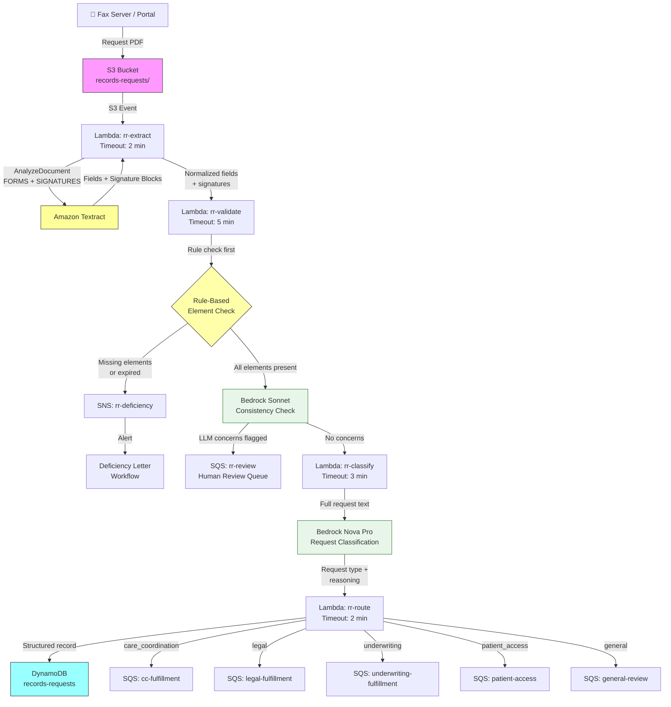

# Recipe 1.9: Medical Records Request Extraction 🔶 

**Complexity:** Moderate · **Phase:** Phase 2 · **Estimated Cost:** ~$0.12–0.18 per request form

---

## The Problem

Here's a scenario that plays out in health plan operations every single day. A physician's office faxes over a medical records request for a patient they're about to see for the first time. They want the cardiac workup from 2023, the last two years of PCP notes, and the surgical history. The fax lands in a shared queue. Someone needs to read it, figure out who's asking for what records, check that there's a valid HIPAA authorization attached, and route it to the right fulfillment team.

Sounds manageable. Now imagine that happening 200 times before noon. Then add the legal requests from plaintiff attorneys wanting records for an injury claim. The life insurance underwriters wanting six years of medical history. The utilization management consultants reviewing a long-term disability case. And the patients themselves exercising their right of access under HIPAA. Each of these request types has different handling requirements, different turnaround windows, different fulfillment teams, and different legal exposure if something goes wrong.

The HIPAA Privacy Rule governs almost all of this. Under 45 CFR § 164.508, releasing protected health information requires either a valid patient authorization or one of the specified permissible purposes. A valid authorization is not just a signature on a page. It has required elements: a description of the information to be disclosed, who is authorized to receive it, the purpose, and a date or event that causes it to expire. Processing a records request without checking those elements is not a paperwork oversight. It is a potential HIPAA violation, the kind that can generate breach notifications and OCR investigations.

The current state at most payers is fully manual triage. A records fulfillment coordinator reads each incoming request, eyeballs the authorization form, checks the elements as best they can, and enters the request into a tracking system by hand. When the authorization is incomplete or expired, they draft a deficiency letter and the cycle restarts. At payers processing tens of thousands of records requests per year, this manual triage is a meaningful operational cost, and the HIPAA compliance posture depends entirely on the consistency of each individual coordinator's review.

The document processing challenge here has two distinct pieces. The first is familiar: form field extraction for the structured portions of the request and authorization. The second is more interesting: once you've extracted those fields and confirmed a signature exists, someone still needs to reason about whether the authorization actually makes sense. Do the dates add up? Is the scope of disclosure coherent with the stated purpose? Does the expiration date come after the signing date? A rule-based checker can confirm that required fields are present. It cannot tell you whether the information in those fields is consistent with a valid authorization.

That reasoning gap is where this recipe gets interesting.

---

## The Technology

### Semi-Structured Forms and Signature Detection

A medical records request form is messier than the prior authorization cover sheet in Recipe 1.4. There is no industry-standard template. Every hospital, every health system, every payer release-of-information department has their own version. Some look like clean typed forms. Others are clearly a Word document someone made in 2009 and has been faxing ever since.

What they almost all share: they're single-to-two-page documents with a mix of labeled fields (patient name, date of birth, medical record number, date range) and semi-free-text areas (description of records requested, purpose, any special instructions). The key-value extraction approach from Recipe 1.1 handles the structured field portion well. The semi-free-text areas are where you need to look at content rather than labels.

The authorization section requires a different kind of attention. You're looking for the same elements across varied form layouts. And crucially: you need to know whether the patient actually signed the form. OCR extracts text. A signature is not text. It's a pen stroke on paper that, after being faxed and scanned, appears as a pixelated blur.

Signature detection uses binary image classification at the region level: given a bounding box on a document, does this region contain something that looks like a handwritten signature? The training data for these classifiers consists of thousands of document images with labeled regions. What distinguishes a signature from handwritten text is mostly statistical: signatures tend to have certain ink density characteristics, stroke continuity patterns, and spatial distributions that differ from prose handwriting. Modern document AI platforms return a confidence score and bounding box for each detected signature region.

The confidence score reflects the classifier's certainty that the region contains a signature versus something else. It does not reflect any judgment about the legal validity of the signature or whether it matches a reference. For HIPAA authorization purposes, the question is much simpler: is there something here that looks like a handwritten signature? That binary question is one that a well-trained classifier can answer with 85 to 95% accuracy on real-world fax-quality authorization forms.

The failure modes are predictable. Faint signatures that degrade below the detection threshold after multi-hop faxing. Rubber stamp signatures used by some authorized representatives. Electronic signatures embedded in PDFs, which may render as text rather than ink marks. Keep these in mind when you're setting the confidence threshold and designing the human review queue.

### HIPAA Authorization Validation: The Rule-Based vs. LLM Tension

This is the most interesting problem in this recipe, and it deserves honest treatment.

The HIPAA Privacy Rule under 45 CFR § 164.508(c)(1) specifies the required elements for a valid authorization:

1. A description of the information to be used or disclosed
2. The person(s) authorized to make the disclosure
3. The person(s) who may receive the disclosed information
4. The purpose of the disclosure
5. An expiration date or event
6. The signature of the individual and the date

These are not suggestions. An authorization missing any core element is legally deficient. Processing a records release against a deficient authorization is a potential Privacy Rule violation.

The traditional approach: write a rule-based checker. For each required element, check whether the corresponding field was extracted and contains a non-empty value. Check whether the expiration date is in the future. If all checks pass, the authorization is valid. Flag and route to the deficiency queue if anything fails. This approach is deterministic, auditable, and fast. Every time you run the same authorization through it, you get the same answer, and you can point to the exact rule that triggered a failure.

So why not stop there?

Because rule-based presence checks have a visibility problem. They can confirm that required fields are populated. They cannot reason about whether the information in those fields is internally consistent or coherent as a legal authorization.

Here are the edge cases that rule-based validation misses:

**Conflicting dates.** A signing date of February 28, 2026, and an expiration date of February 15, 2026. Both fields are populated. Both pass the presence check. The authorization expired before it was signed, which is logically impossible and legally void. A rule-based checker confirms that an expiration date exists and that it's a parseable date. It does not compare the signing date to the expiration date. A human reviewer would catch this immediately.

**Ambiguous scope language.** "All records related to the incident" passes the presence check for description of information. But which incident? If the purpose field says "life insurance underwriting" and the description says "records related to the accident," there's an unresolved ambiguity that a compliance-conscious reviewer would flag for clarification. The presence check sees two populated fields and moves on.

**Missing elements not in form fields.** Some authorization forms interleave required elements in paragraph form rather than labeled fields. The description of information might appear in a sentence: "I authorize Dr. Smith to release records pertaining to my cardiac care provided between January 2023 and December 2024 to the requesting physician for the purpose of continuity of care." All the required elements are in that sentence. If the form doesn't have a labeled field for "description of information," the field extraction step returns nothing for that canonical field, and the rule-based checker incorrectly flags the authorization as deficient.

**Implicit expiration events.** "This authorization is valid for one year from the date of signing" is a valid expiration event under HIPAA. It's also a sentence, not a date field. A rule-based date parser that tries to parse this value will fail, and depending on how the validator handles parse failures, may incorrectly flag the authorization.

These are not exotic cases. They're typical of real-world authorization forms faxed from a varied population of healthcare providers, law offices, and insurance carriers. A coordinator who reviews records requests every day catches these issues because they read the authorization as a coherent document. Rule-based logic reads fields.

**Where the LLM adds value.** A language model can read the full authorization text the way a coordinator would. It can reason about whether the dates are logically consistent. It can identify scope language that's present but ambiguous relative to the stated purpose. It can find required elements embedded in paragraphs that didn't map to form fields. It understands what a HIPAA authorization is supposed to say, and it can notice when something seems off.

**Where the LLM creates risk.** HIPAA compliance validation is exactly the kind of decision where you want determinism and auditable output. If the LLM says an authorization is valid and you release the records, and a subsequent audit finds the authorization was actually deficient, probabilistic reasoning is not a legal defense. You need to know precisely why a validation decision was made, in a form you can point to during an OCR investigation. You also need consistency: the same authorization should produce the same validation outcome each time you process it. At temperature=0, LLMs are close to deterministic but not perfectly so, and model updates can shift behavior.

**The resolution: layered architecture, not a choice between approaches.** This recipe implements both, in sequence, with a clear chain of authority.

The rule-based checker runs first and remains the authoritative validation gate. If any required element is missing or any date check fails, the authorization is deficient. Full stop. The rule fires, the specific failure is recorded with the applicable regulatory citation, and the request goes to the deficiency queue. The LLM has no say in this outcome.

The LLM runs as a secondary screening layer on authorizations that pass the rule-based check. It reads the full authorization text and the extracted fields together, looking for the coherence issues the rules can't catch: conflicting dates, ambiguous scope, logical inconsistencies. If it flags a concern, the authorization enters a human review queue rather than proceeding directly to fulfillment. It does not make the authorization deficient. It flags it for a trained coordinator to look at.

This division of responsibility means:

- The audit trail for deficiency determinations is always rule-based and explicit. You can produce a log showing that a specific regulatory requirement was not met.
- The LLM adds a safety net above that layer, catching edge cases that are technically valid by the presence check but concerning in context.
- Authorizations that pass both layers proceed with high confidence. Authorizations that pass rules but concern the LLM go to human review. Authorizations that fail rules go to the deficiency queue, period.

One thing to be clear about: the LLM's observations in this recipe are the model's reasoning about the extracted content. They are not quotes from the document, and they are not statements of fact about the authorization. When you surface LLM concerns to a human reviewer, label them as such. "The LLM flagged a potential date inconsistency between the signing date and expiration date" is accurate and appropriately hedged. "The authorization contains a date inconsistency" presented as a factual finding is not, because the LLM may be wrong. The reviewer is the final decision-maker for anything the LLM flags. 

### Request Classification: A Clearer LLM Win

The HIPAA validation discussion above involves genuine tension worth working through carefully. Request classification is a more straightforward case for LLMs, and it's worth explaining why.

Medical records requests come from a variety of requestors with a variety of purposes: treating physicians requesting records for continuity of care, attorneys requesting records for litigation, insurers requesting records for underwriting, utilization review organizations, and patients exercising their right of access under HIPAA. Each category has different handling requirements, turnaround obligations, and fulfillment workflows.

The original approach: keyword scoring. Build a vocabulary for each request type. "Attorney," "litigation," and "subpoena" signal legal. "Continuity of care" and "new treating physician" signal care coordination. "Underwriting" and "disability" signal insurance. Score each document against the keyword lists and route to the highest scorer.

This works well for requests that use standard vocabulary. It fails in two ways that matter in practice.

First, free-text request descriptions are common. A patient writing their own records request might say "My mother passed away last month and I need her records to understand what happened during her final hospitalization." There are no standard category keywords in that sentence. A keyword classifier routes this to the general review queue even though the intent is clear: this is a patient access request with personal-representative authorization. A language model that understands the request contextually classifies it correctly.

Second, some requests span categories or use vocabulary that signals the wrong type. A utilization review organization might describe their purpose as "continued care management" (sounds like care coordination) while the requestor information clearly indicates an insurance company conducting a claims review. Keyword matching on the purpose field alone misses the context. An LLM that reads the full request, including the requestor information, gets to the right answer.

The model choice for classification is different from HIPAA validation. Classification is a simpler reasoning task: read the request, pick the right bucket. You don't need the deep contextual reasoning required to evaluate legal language against regulatory requirements. A smaller, faster, cheaper model handles this well. Nova Pro or Claude Haiku 4.5 are the right choices here: capable enough for the task, cost-appropriate for a relatively high-volume operation.

One practical note about classification results: present them with the model's reasoning to downstream fulfillment systems, not just the label. A routing record that says "classified as legal request: request mentions 'plaintiff's counsel' and 'civil litigation proceedings'" gives the receiving fulfillment specialist useful context. A routing record that just says "legal" gives them nothing. The reasoning is particularly valuable for ambiguous cases, where the fulfillment specialist may need to re-classify based on additional information. And always label the reasoning as LLM-generated inference in whatever interface surfaces it. The model got there by reading the request, not by verifying facts. 

### The General Architecture Pattern

```
[Request Arrives as Fax or PDF]
             |
             v
[Document Extraction: Forms + Signature Detection]
             |
             v
[Field Normalization]
             |
             v
[Rule-Based HIPAA Element Check]
  (Authoritative: presence of required elements,
   expiration date validity)
        /               \
       /                 \
[Rules Fail]         [Rules Pass]
    |                     |
    v                     v
[Deficiency Queue]   [LLM Authorization
                      Consistency Check]
                      (Screening layer only.
                       Cannot override rules.)
                          |
               /--------------------\
              /                      \
    [LLM Flags Concern]       [LLM No Concerns]
             |                        |
             v                        v
      [Human Review Queue]    [LLM Request Classification]
                                       |
                                       v
                              [Routing and Storage]
                     (Care Coordination | Legal | Underwriting |
                      Utilization Review | Patient Access | General)
```

The key architectural point: the rule-based check and the LLM check have different authorities. The rule-based check can create deficiencies. The LLM cannot. The LLM can only flag concerns that require human review before fulfillment proceeds. A human coordinator closes the loop on those flagged cases.

---

## The AWS Implementation

### Why These Services

**Amazon Textract with FORMS and SIGNATURES feature types.** Textract handles the structured portion of the recipe: extracting key-value pairs from form fields and detecting signature regions. It remains the right tool for these tasks. The SIGNATURES feature type runs an additional detection pass specifically for handwritten signature regions, returning SIGNATURE blocks with confidence scores and bounding boxes. This is exactly the capability you need for authorization signature validation: not OCR of the signature, but a binary "there's a signature here" with confidence. Textract is purpose-built for this. An LLM with vision capability would work, but Textract is faster, cheaper, and returns structured confidence scores without requiring you to engineer them from model output.

Medical records request forms are one to two pages, so the synchronous `AnalyzeDocument` API works without the job-tracking complexity of the async pattern. One API call, one response.

**Amazon Bedrock with Claude Sonnet for HIPAA authorization consistency checking.** The LLM consistency check needs to reason about legal language and evaluate whether extracted dates and scope language are coherent. This is the kind of contextual reasoning where model capability matters. Sonnet (the current version is `us.anthropic.claude-sonnet-4-6-v1`) handles regulatory language well. Temperature set to zero for near-deterministic output. Cost per authorization validation: roughly $0.010 to $0.015 (approximately 1,000 to 1,500 input tokens, 300 to 500 output tokens).

**Amazon Bedrock with Amazon Nova Pro or Claude Haiku for request classification.** Classification is a simpler task than regulatory consistency checking. Nova Pro (`us.amazon.nova-pro-v1:0`) offers strong document understanding at lower cost. Claude Haiku 4.5 (`us.anthropic.claude-haiku-4-5-v1:0`) is slightly more expensive but returns richer reasoning explanations that are useful for routing records. Cost per classification call: roughly $0.001 to $0.002. Either model works; the choice depends on whether you value reasoning detail over cost.

**AWS Lambda with four functions.** The pipeline splits across four Lambda functions: extraction (rr-extract), validation (rr-validate), classification (rr-classify), and assembly and routing (rr-route). Keeping them separate makes it easier to update validation logic independently of extraction logic, which matters because HIPAA requirements do evolve. The validation Lambda requires a longer timeout than the extraction Lambda because it makes a Bedrock API call for the LLM consistency check (in addition to running the rule-based Python logic), and Bedrock calls can take 2 to 15 seconds depending on load and whether retry backoff kicks in. 

**Amazon DynamoDB.** The structured request record lives in DynamoDB. The record captures the full lifecycle: extracted fields, rule-based validation result, LLM consistency findings, request type classification, routing decision, and status. DynamoDB's millisecond latency is appropriate for downstream fulfillment systems that query request status.

**Amazon SQS for routing queues.** Request type-specific queues decouple the pipeline from downstream fulfillment systems. Each queue feeds a different fulfillment team. A deficiency queue handles requests routed by the rule-based check. A review queue handles requests flagged by the LLM consistency check. Dead-letter queues on each SQS queue capture messages that fail downstream processing for later inspection.

**Amazon SNS for deficiency notification.** When the rule-based check fails an authorization, the pipeline publishes to an SNS topic. Subscriptions on that topic can feed a deficiency letter workflow, a ticketing system, or email notifications for urgent cases.

**AWS KMS for customer-managed encryption.** Medical records request forms are PHI. Every storage layer is encrypted with a customer-managed key: S3 documents, DynamoDB records, SQS queue messages. The key policy restricts access to the Lambda execution roles and authorized administrators.

### Architecture Diagram



### Prerequisites

| Requirement | Details |
|-------------|---------|
| **AWS Services** | Amazon Textract, S3, Lambda, DynamoDB, SQS, SNS, Bedrock, KMS, CloudWatch |
| **IAM Permissions** | `textract:AnalyzeDocument`, `s3:GetObject` on the requests bucket, `dynamodb:PutItem` and `dynamodb:UpdateItem` on the records-requests table, `sqs:SendMessage` on each routing queue, `sns:Publish` on the deficiency and review topics, `kms:Decrypt` and `kms:GenerateDataKey` for the CMK, `bedrock:InvokeModel` scoped to the specific model ARNs used (not `*`) |
| **Textract Features** | FORMS + SIGNATURES in the `FeatureTypes` list |
| **Bedrock Model Access** | Enable `us.anthropic.claude-sonnet-4-6-v1` (HIPAA validation) and `us.amazon.nova-pro-v1:0` (request classification) in Bedrock Model Access. Cross-region inference profiles route across us-east-1, us-east-2, and us-west-2. Your Lambda's Converse API call goes to the `bedrock-runtime` VPC endpoint in your deployment region; AWS routes to backend regions transparently. PHI does not traverse the public internet. For organizations with geographic data restrictions beyond federal HIPAA, verify that all three regions are acceptable or use direct single-region model IDs without the `us.` prefix. |
| **BAA** | AWS BAA required. Medical records request forms contain PHI including patient name, date of birth, and medical history descriptions. Amazon Bedrock is a HIPAA-eligible service. Models do not retain or train on customer data sent via Bedrock APIs. |
| **Encryption** | S3: SSE-KMS with customer-managed key. DynamoDB: encryption at rest enabled. SQS queues: SSE-KMS. Lambda CloudWatch log groups: configure KMS encryption on each log group (Lambda does not do this automatically). All API calls over TLS. |
| **VPC** | Production: all Lambda functions in a VPC. Required VPC endpoints: S3 (gateway endpoint), DynamoDB (gateway endpoint), `com.amazonaws.REGION.bedrock-runtime` (interface endpoint, used by Lambda for all Converse API calls), `com.amazonaws.REGION.bedrock` (interface endpoint, for model access management), `com.amazonaws.REGION.textract` (interface endpoint), `com.amazonaws.REGION.sqs` (interface endpoint), `com.amazonaws.REGION.sns` (interface endpoint), `com.amazonaws.REGION.kms` (interface endpoint), `com.amazonaws.REGION.logs` (interface endpoint, for CloudWatch Logs). Note: `bedrock-runtime` and `bedrock` are two separate endpoints. A VPC with only `bedrock` will fail to route Converse API calls through the private network. |
| **Lambda Timeouts** | Lambda's default 3-second timeout fails on the first Bedrock API call. Configure: `rr-extract`: 2 minutes (Textract synchronous is fast, but allow for occasional slow responses). `rr-validate`: 5 minutes (Sonnet call can take 2 to 5 seconds under normal load, up to 15 seconds under high load; allow time for retry backoff). `rr-classify`: 3 minutes (Nova Pro is faster than Sonnet). `rr-route`: 2 minutes (DynamoDB and SQS calls only). |
| **CloudTrail** | Enabled for all API calls touching PHI. Every authorization validation decision must be logged with document key, elements checked, and outcome. Deficiency determinations require an audit trail for HIPAA compliance purposes. |
| **Sample Data** | HHS publishes a model HIPAA authorization form at https://www.hhs.gov/hipaa/for-professionals/privacy/guidance/model-notices-of-privacy-practices/index.html. Create synthetic versions with varied layouts. Test cases: (1) complete valid authorization; (2) missing signature; (3) missing expiration; (4) expired authorization; (5) expiration date before signing date (LLM edge case); (6) ambiguous scope language; (7) free-text request that doesn't match standard categories. Never use real PHI in development. |
| **Cost Estimate** | Textract FORMS + SIGNATURES: $0.05/page. For a 2-page request form, Textract cost is $0.10. Bedrock Sonnet for authorization consistency check: approximately $0.010 to $0.015 per request. Bedrock Nova Pro for classification: approximately $0.001 per request. Total LLM overhead: $0.011 to $0.016 per request. Combined with Textract: approximately $0.11 to $0.18 per request form. DynamoDB, SQS, SNS costs at this document scale are negligible (under $0.001 per request). At 50,000 requests per year, total pipeline cost is approximately $5,500 to $9,000 annually. The LLM layer adds roughly $550 to $800 per year over the Textract-only baseline. |

### Ingredients

| AWS Service | Role |
|------------|------|
| **Amazon Textract (AnalyzeDocument)** | Synchronous form field extraction (FORMS) and signature detection (SIGNATURES) |
| **Amazon S3** | Stores incoming request PDFs encrypted at rest with KMS; source for Lambda trigger. Medical records authorization documents are subject to HIPAA 6-year retention requirements (longer under some state laws). Configure S3 Object Lock on the authorizations bucket with an appropriate retention period. See Recipe 1.5 for the full Object Lock implementation pattern. |
| **Amazon Bedrock (Claude Sonnet)** | HIPAA authorization consistency checking: reads full authorization text, flags date conflicts, ambiguous scope, and missing elements not captured in structured fields |
| **Amazon Bedrock (Nova Pro)** | Request type classification: reads request narrative, determines routing category, handles free-text requests that keyword matching fails on |
| **AWS Lambda (rr-extract)** | Calls Textract, parses KEY_VALUE_SET blocks, extracts SIGNATURE blocks, returns normalized fields and signature data |
| **AWS Lambda (rr-validate)** | Runs rule-based element check first, then calls Bedrock Sonnet for consistency screening; routes deficient authorizations to SNS, flagged authorizations to review queue |
| **AWS Lambda (rr-classify)** | Calls Bedrock Nova Pro with request narrative and fields; returns request type, confidence, and reasoning for use by downstream fulfillment systems |
| **AWS Lambda (rr-route)** | Assembles structured record, writes to DynamoDB, routes to type-specific SQS queue |
| **Amazon DynamoDB** | Stores structured request records with validation status, LLM observations, classification reasoning, and routing metadata |
| **Amazon SQS** | Type-specific queues for fulfillment routing; deficiency queue; human review queue; all with dead-letter queues |
| **Amazon SNS** | Deficiency notification to letter-generation workflow; review-queue notification for LLM-flagged cases |
| **AWS KMS** | Customer-managed encryption key for S3, DynamoDB, SQS, and Lambda CloudWatch log groups |
| **Amazon CloudWatch** | Logs, metrics, alarms for pipeline failures, deficiency rates, LLM flag rates, and authorization validation outcomes |

### Code

#### Walkthrough

**Step 1: Synchronous Textract extraction with FORMS and SIGNATURES.** Same pattern as Recipe 1.1, with the addition of SIGNATURES in the feature types list. Textract's synchronous API handles one-to-two-page forms with one call and one response. No job polling, no SNS callbacks.

The SIGNATURES feature instructs Textract to run an additional detection pass for handwritten signature regions. The result appears as SIGNATURE blocks alongside KEY_VALUE_SET, WORD, and LINE blocks. Each SIGNATURE block includes a Confidence score and a bounding box. The full page text from LINE blocks feeds the LLM steps later.

```
FUNCTION extract_records_request(bucket, document_key):
    // Synchronous AnalyzeDocument: one call, one response.
    // FORMS: key-value pair extraction (labeled fields).
    // SIGNATURES: handwritten signature region detection.
    response = textract.AnalyzeDocument(
        Document = { Bucket: bucket, Name: document_key },
        FeatureTypes = ["FORMS", "SIGNATURES"]
    )

    all_blocks = response.Blocks

    kv_blocks   = [b for b in all_blocks if b.BlockType == "KEY_VALUE_SET"]
    sig_blocks  = [b for b in all_blocks if b.BlockType == "SIGNATURE"]
    line_blocks = [b for b in all_blocks if b.BlockType == "LINE"]
    block_map   = { b.Id: b for b in all_blocks }

    RETURN {
        kv_blocks:   kv_blocks,
        sig_blocks:  sig_blocks,
        line_blocks: line_blocks,
        block_map:   block_map
    }
```

**Step 2: Parse and normalize request fields.** The FIELD_MAP normalization pattern from Recipe 1.1, applied to the medical records request vocabulary. Because there is no standard template, the map covers label variants across the most common form designs in the wild.

```
REQUEST_FIELD_MAP = {
    "patient_name":     ["patient name", "member name", "name of individual", "patient"],
    "patient_dob":      ["date of birth", "dob", "birth date", "patient dob"],
    "patient_id":       ["medical record number", "mrn", "member id", "patient id"],
    "requestor_name":   ["requesting party", "requestor", "requested by", "authorized by"],
    "requestor_org":    ["organization", "facility name", "practice name", "firm name"],
    "requestor_fax":    ["fax", "fax number", "fax #"],
    "records_requested":["records requested", "information requested", "type of records",
                         "specific information to be disclosed", "records needed"],
    "date_range":       ["date range", "dates of service", "treatment dates", "from"],
    "purpose":          ["purpose", "purpose of disclosure", "reason for request", "intended use"],
    "authorization_date":["date signed", "authorization date", "signature date", "date"],
    "expiration_date":  ["expiration date", "expiration", "this authorization expires",
                         "valid through", "expires"],
    "requestor_npi":    ["npi", "national provider identifier", "provider npi"]
}

FUNCTION parse_and_normalize_fields(kv_blocks, block_map):
    // Extract raw key-value pairs using the KEY_VALUE_SET traversal pattern
    // from Recipe 1.1. See that recipe for the full block traversal logic.
    raw_kv = parse_key_value_pairs(kv_blocks, block_map)

    normalized = empty map
    FOR each canonical_name, variants in REQUEST_FIELD_MAP:
        FOR each label in variants:
            matching_keys = [k for k in raw_kv if label appears in lowercase(k)]
            IF matching_keys is not empty:
                best_match = matching_keys entry with highest confidence
                normalized[canonical_name] = raw_kv[best_match]
                BREAK

    RETURN normalized
```

**Step 3: Extract signature data.** Pull all SIGNATURE blocks and sort them into document reading order by page and vertical position. The page number matters downstream: the authorization signature is most likely on page 2 of a two-page form, not page 1.

```
FUNCTION extract_signatures(sig_blocks):
    signatures = empty list

    FOR each block in sig_blocks:
        sig = {
            confidence:  block.Confidence,
            page:        block.Page,
            bounding_box: {
                top:    block.Geometry.BoundingBox.Top,
                left:   block.Geometry.BoundingBox.Left,
                width:  block.Geometry.BoundingBox.Width,
                height: block.Geometry.BoundingBox.Height
            }
        }
        signatures.append(sig)

    // Sort into document reading order.
    SORT signatures by (page, bounding_box.top)

    RETURN signatures
```

**Step 4: Rule-based HIPAA element validation.** This runs first and is authoritative. It checks the six required elements from 45 CFR § 164.508(c)(1): signature, signing date, description of records requested, purpose of disclosure, and expiration. It also checks that the expiration date, if it is a parseable date, has not already passed.

If this step fails, the request is deficient. The LLM step does not run. The deficiency record captures the specific regulatory citations that triggered the failure, which is the audit trail you need.

```
REQUIRED_ELEMENTS = {
    "patient_or_rep_signature": "Signature of patient or authorized representative (45 CFR § 164.508(c)(1)(vi))",
    "authorization_date":       "Date the authorization was signed (45 CFR § 164.508(c)(1)(vi))",
    "records_requested":        "Description of information to be disclosed (45 CFR § 164.508(c)(1)(i))",
    "purpose":                  "Purpose of the requested disclosure (45 CFR § 164.508(c)(1)(iv))",
    "expiration_date":          "Expiration date or event (45 CFR § 164.508(c)(1)(v))"
}

SIGNATURE_CONFIDENCE_THRESHOLD = 70.0

FUNCTION validate_elements_rule_based(normalized_fields, signatures):
    result = {
        passed:          true,   // set to false if any element is missing or expired
        elements:        empty map,
        missing:         empty list,
        expired:         false,
        event_expiration: false  // true when expiration is a non-date event string
    }

    // --- Signature check ---
    high_conf_sigs = [s for s in signatures if s.confidence >= SIGNATURE_CONFIDENCE_THRESHOLD]
    has_signature  = length(high_conf_sigs) > 0
    result.elements["patient_or_rep_signature"] = has_signature

    IF NOT has_signature:
        result.passed = false
        IF signatures is empty:
            result.missing.append(REQUIRED_ELEMENTS["patient_or_rep_signature"])
        ELSE:
            // A signature was detected but below the confidence threshold.
            // Low-confidence detection is handled separately from total absence.
            result.missing.append(
                REQUIRED_ELEMENTS["patient_or_rep_signature"] +
                " (possible signature detected at " + max_confidence(signatures) + "% confidence; below threshold)"
            )

    // --- Signing date ---
    auth_date = normalized_fields.get("authorization_date")
    has_auth_date = auth_date is not null AND auth_date.value.strip() is not empty
    result.elements["authorization_date"] = has_auth_date
    IF NOT has_auth_date:
        result.passed = false
        result.missing.append(REQUIRED_ELEMENTS["authorization_date"])

    // --- Records description ---
    records = normalized_fields.get("records_requested")
    has_records = records is not null AND records.value.strip() is not empty
    result.elements["records_requested"] = has_records
    IF NOT has_records:
        result.passed = false
        result.missing.append(REQUIRED_ELEMENTS["records_requested"])

    // --- Purpose ---
    purpose = normalized_fields.get("purpose")
    has_purpose = purpose is not null AND purpose.value.strip() is not empty
    result.elements["purpose"] = has_purpose
    IF NOT has_purpose:
        result.passed = false
        result.missing.append(REQUIRED_ELEMENTS["purpose"])

    // --- Expiration ---
    exp = normalized_fields.get("expiration_date")
    has_expiration = exp is not null AND exp.value.strip() is not empty
    result.elements["expiration_date"] = has_expiration
    IF NOT has_expiration:
        result.passed = false
        result.missing.append(REQUIRED_ELEMENTS["expiration_date"])
    ELSE:
        exp_value = exp.value.strip()
        exp_date  = attempt_date_parse(exp_value)
        IF exp_date is not null:
            IF exp_date < today:
                result.passed   = false
                result.expired  = true
                result.missing.append(
                    "Authorization expired " + exp_date.to_string("YYYY-MM-DD") +
                    ". A current authorization is required."
                )
        ELSE:
            // Non-date expiration event string. Flag for LLM and human review;
            // it is not a rule-based failure because event-based expirations
            // are valid under HIPAA.
            result.event_expiration = true

    RETURN result
```

**Step 5: LLM authorization consistency check.** This step runs only when the rule-based check passes. It uses Bedrock Converse with Claude Sonnet to read the full authorization text alongside the extracted fields. The LLM looks for coherence issues that rules cannot detect: dates that conflict with each other, scope language that is ambiguous or inconsistent with the stated purpose, and required elements that are present in the document text but were not captured in structured fields.

A critical framing note for the prompt: the LLM is asked to surface observations, not make compliance determinations. The system prompt establishes this explicitly. The response schema is designed to capture LLM observations separately from the rule-based determinations, so they never appear in the audit trail as if they were regulatory findings.

```
LLM_VALIDATION_SYSTEM_PROMPT = """
You are a healthcare compliance specialist reviewing HIPAA authorization forms.
Your role is to identify logical inconsistencies and potential coherence issues
in authorization documents. You are NOT making a legal determination of validity.
You are flagging concerns for human review.

Return a JSON object with this schema:
{
  "concerns": [
    {
      "type": "date_conflict" | "scope_ambiguity" | "missing_element" | "other",
      "severity": "high" | "medium" | "low",
      "description": "Brief description of the concern (do not quote PHI)"
    }
  ],
  "overall_coherence": "no_concerns" | "minor_concerns" | "significant_concerns",
  "review_recommended": true | false
}

Return only valid JSON. No markdown fences, no explanatory text outside the JSON object.
"""

FUNCTION check_authorization_consistency_llm(normalized_fields, signatures, line_blocks, event_expiration):
    // Build the document context for the LLM.
    // Sanitize the full text before including in the prompt.
    // Authorization forms are untrusted free-text authored by patients, attorneys,
    // and providers. Strip control characters and injection patterns first.
    // [EDITOR: review fix: sanitization step added; was only in Gap to Production in v2.]
    full_text = join all line_blocks text values with newline
    sanitized_text = sanitize_for_prompt(full_text)

    // The coherence check requires the full authorization text.
    // The LLM must see all field values (including dates, scope descriptions, and
    // purpose statements) to detect cross-field inconsistencies and elements present
    // in prose but absent from extracted fields.
    // Full-text transmission is necessary for this use case; selective PHI suppression
    // would defeat the coherence analysis. All transmission to Bedrock is covered by
    // the BAA; AWS does not retain this data. The prompt instructs the model not to
    // echo PHI in its response descriptions.
    // [EDITOR: review fix: replaced "pass structural information rather than raw PHI
    // where possible" which contradicted the code and the design intent.]

    user_message = """
Review this HIPAA authorization for logical consistency.

Extracted fields:
- Signing date: {authorization_date}
- Expiration date/event: {expiration_date}
- Records requested: {records_requested}
- Purpose of disclosure: {purpose}
- Signature detected: {signature_detected} (confidence: {max_sig_confidence}%)
- Event-based expiration: {event_expiration}

Full document text:
---
{sanitized_text}
---

Check for:
1. Date inconsistencies (signing date vs. expiration date; dates in the past when they should be current)
2. Scope ambiguity (description of records is vague or conflicts with stated purpose)
3. Required elements present in document text but absent from extracted fields
4. Any other coherence issues that would concern a compliance reviewer

Important: Do not include patient names, member IDs, or other PHI in your descriptions.
Describe structural and logical issues only.
"""

    // Populate template with sanitized text and extracted values.
    // Use normalized field values; fall back to "(not extracted)" if field is missing.
    user_message = populate_template(user_message, normalized_fields, signatures, event_expiration, sanitized_text)

    response = bedrock.converse(
        modelId = "us.anthropic.claude-sonnet-4-6-v1",
        system  = [{ text: LLM_VALIDATION_SYSTEM_PROMPT }],
        messages = [{ role: "user", content: [{ text: user_message }] }],
        inferenceConfig = { maxTokens: 512, temperature: 0 }
    )

    response_text = response.output.message.content[0].text
    llm_result    = parse_json(response_text)
    // On JSONDecodeError: retry once with an explicit JSON-only suffix appended
    // to the user message. If the second attempt also fails, fall back to a safe
    // default result and log the parse failure (metadata only, no response content).
    // This closes the failure mode where the model includes markdown fences or
    // preamble text despite being instructed not to.

    // Do NOT log response_text. It may contain information derived from PHI.
    // Log only the result metadata: concern count and overall_coherence value.
    log: "LLM consistency check: " + llm_result.overall_coherence +
         ", concerns: " + length(llm_result.concerns) +
         ", review_recommended: " + llm_result.review_recommended

    RETURN {
        overall_coherence:  llm_result.get("overall_coherence", "no_concerns"),
        concerns:           llm_result.get("concerns", []),
        review_recommended: llm_result.get("review_recommended", false)
    }
``` 

**Step 6: LLM request classification.** The classification step reads the full request text and the extracted fields together. It uses a smaller, faster model than the validation step because classification is a simpler reasoning task.

The response includes reasoning, not just a label. That reasoning goes into the DynamoDB record and the SQS message so fulfillment specialists have context, especially for ambiguous cases. Label the reasoning clearly as LLM-generated inference, not as a fact about the document.

```
CLASSIFICATION_CATEGORIES = {
    "care_coordination":  "Treating physician or provider requesting records for continuity of care",
    "legal":              "Attorney, law firm, or litigation-related request",
    "underwriting":       "Insurance or financial underwriting purpose",
    "utilization_review": "Utilization management, case management, or independent medical examination",
    "patient_access":     "Patient or personal representative exercising right of access",
    "general":            "Unclear purpose or category; route to general review queue"
}

CLASSIFICATION_SYSTEM_PROMPT = """
You are a medical records routing specialist. Classify the medical records request
into exactly one of these categories:
- care_coordination: treating physician, continuity of care, new provider
- legal: attorney, law firm, litigation, subpoena
- underwriting: life insurance, disability insurance, financial underwriting
- utilization_review: utilization management, case management, IME, disability review
- patient_access: patient or personal representative requesting own records
- general: unclear, ambiguous, or does not fit other categories

Return JSON:
{
  "request_type": "<category>",
  "confidence": <float 0.0-1.0>,
  "reasoning": "Brief explanation of classification basis (no PHI)"
}

Return only valid JSON. No markdown, no text outside the JSON object.
"""

FUNCTION classify_request_type(normalized_fields, line_blocks):
    full_text    = join all line_blocks text values with newline
    purpose_text = normalized_fields.get("purpose", {}).value or "(not provided)"
    requestor    = normalized_fields.get("requestor_org", {}).value or
                   normalized_fields.get("requestor_name", {}).value or
                   "(not extracted)"

    user_message = """
Classify this medical records request.

Requestor: {requestor}
Purpose field: {purpose_text}

Full request text:
---
{full_text}
---
"""
    user_message = populate_template(user_message, requestor, purpose_text, full_text)

    response = bedrock.converse(
        modelId = "us.amazon.nova-pro-v1:0",
        system  = [{ text: CLASSIFICATION_SYSTEM_PROMPT }],
        messages = [{ role: "user", content: [{ text: user_message }] }],
        inferenceConfig = { maxTokens: 256, temperature: 0 }
    )

    response_text = response.output.message.content[0].text
    result        = parse_json(response_text)
    // On JSONDecodeError: retry once with JSON-only suffix, same as Step 5.

    // Log classification metadata only. No document content in logs.
    log: "Request classified as " + result.get("request_type", "unknown") +
         " (confidence: " + result.get("confidence", 0.0) + ")"

    RETURN {
        request_type: result.get("request_type", "general"),
        confidence:   clamp(result.get("confidence", 0.5), 0.0, 1.0),
        reasoning:    result.get("reasoning", "(classification reasoning unavailable)")
    }
```

**Step 7: Assemble the record and route.** The final step combines all extracted and validated data into a structured record, writes it to DynamoDB, and sends to the appropriate queue. The routing logic reflects three possible outcomes: rule-deficient (SNS notification only, no fulfillment), LLM-flagged (human review queue), and clean (type-specific fulfillment queue).

The LLM observations in the DynamoDB record are stored under `llm_consistency_findings` with an explicit flag that these are model observations, not regulatory findings. This distinction matters if the record ever surfaces in a compliance audit.

```
FULFILLMENT_QUEUES = {
    "care_coordination":  env.CARE_COORDINATION_QUEUE_URL,
    "legal":              env.LEGAL_QUEUE_URL,
    "underwriting":       env.UNDERWRITING_QUEUE_URL,
    "utilization_review": env.UR_QUEUE_URL,
    "patient_access":     env.PATIENT_ACCESS_QUEUE_URL,
    "general":            env.GENERAL_REVIEW_QUEUE_URL
}

// Dedicated queue for LLM-flagged authorization reviews.
// Distinct from FULFILLMENT_QUEUES["general"]: LLM coherence concerns and
// unclear request categories are different work items with different SLAs.
// Matches the rr-review queue in the architecture diagram. [EDITOR: review fix]
REVIEW_QUEUE_URL = env.REVIEW_QUEUE_URL

FUNCTION assemble_and_route(document_key, normalized_fields, signatures,
                             rule_validation, llm_consistency, classification):
    record = {
        document_key:   document_key,
        processed_at:   current UTC timestamp (ISO 8601),

        patient: {
            name:      normalized_fields.get("patient_name", {}).value,
            dob:       normalized_fields.get("patient_dob", {}).value,
            member_id: normalized_fields.get("patient_id", {}).value
        },

        requestor: {
            name:         normalized_fields.get("requestor_name", {}).value,
            organization: normalized_fields.get("requestor_org", {}).value,
            fax:          normalized_fields.get("requestor_fax", {}).value,
            npi:          normalized_fields.get("requestor_npi", {}).value
        },

        request_details: {
            records_requested: normalized_fields.get("records_requested", {}).value,
            date_range:        normalized_fields.get("date_range", {}).value,
            purpose:           normalized_fields.get("purpose", {}).value
        },

        // Authoritative: rule-based validation only.
        // This section is the audit trail for HIPAA compliance decisions.
        authorization_rule_check: {
            passed:             rule_validation.passed,
            elements_present:   rule_validation.elements,
            deficiency_reasons: rule_validation.missing,    // maps to regulatory citations
            expired:            rule_validation.expired,
            event_expiration:   rule_validation.event_expiration,
            signature_detected: length(signatures),
            signature_max_confidence: max_confidence(signatures) or 0.0,
            signing_date:       normalized_fields.get("authorization_date", {}).value,
            expiration_date:    normalized_fields.get("expiration_date", {}).value
        },

        // Non-authoritative: LLM screening layer.
        // These are model observations, NOT regulatory findings.
        // Label as such in any UI or report that surfaces this data.
        llm_consistency_findings: {
            note:               "LLM model observations. Not a regulatory determination.",
            overall_coherence:  llm_consistency.overall_coherence,
            review_recommended: llm_consistency.review_recommended,
            concerns:           llm_consistency.concerns
        },

        classification: {
            request_type:  classification.request_type,
            confidence:    classification.confidence,
            // LLM-generated inference. Not a statement of fact about the document.
            llm_reasoning: classification.reasoning
        },

        status: determine_status(rule_validation, llm_consistency)
        // "deficient"          - rule_validation.passed == false
        // "pending_llm_review" - rules passed, llm_consistency.review_recommended == true
        // "routed"             - rules passed, no LLM concerns
    }

    // Write to DynamoDB with idempotency guard.
    // All confidence floats must be stored as Decimal, not float.
    dynamo_record = convert_floats_to_decimal(record)
    write dynamo_record to DynamoDB table "records-requests" with:
        condition: attribute_not_exists(document_key)

    // Route based on validation outcome.
    IF NOT rule_validation.passed:
        publish to SNS deficiency topic:
            document_key:    document_key,
            missing_elements: rule_validation.missing,
            expired:          rule_validation.expired
        log: "HIPAA auth deficient for " + document_key +
             ". Rule failures: " + join(rule_validation.missing, "; ")
        RETURN record

    IF llm_consistency.review_recommended:
        publish to SNS review topic with llm_consistency.concerns
        // Route to the dedicated review queue, not the general fulfillment queue.
        // LLM-flagged authorizations and unclear-category requests are different
        // work items with different SLAs and different coordinator workflows.
        // [EDITOR: review fix: was FULFILLMENT_QUEUES["general"] in v2.]
        send to SQS at REVIEW_QUEUE_URL:
            document_key:  document_key,
            concerns:      llm_consistency.concerns,
            overall_coherence: llm_consistency.overall_coherence
        log: "Auth passed rules; LLM flagged " + length(llm_consistency.concerns) +
             " concern(s) for " + document_key + ". Routing to review queue."
        RETURN record


    // Both checks passed. Route to fulfillment.
    queue_url = FULFILLMENT_QUEUES.get(classification.request_type, FULFILLMENT_QUEUES["general"])
    send to SQS queue at queue_url:
        document_key:      document_key,
        request_type:      classification.request_type,
        records_requested: record.request_details.records_requested
    log: "Request " + document_key + " routed to " + classification.request_type +
         " queue."
    RETURN record
```

> **Curious how this looks in Python?** The pseudocode above covers the concepts. If you'd like to see sample Python code that demonstrates these patterns using boto3, check out the [Python Example](chapter01.09-medical-records-python-v3). It walks through each step with inline comments and notes on what you'd need to change for a real deployment.

---

### Expected Results

**Sample output for a care coordination request with complete authorization and no LLM concerns:**

```json
{
  "document_key": "records-requests/2026/03/01/fax-00519.pdf",
  "processed_at": "2026-03-01T15:44:12Z",
  "patient": {
    "name": "David Park",
    "dob": "07/23/1982",
    "member_id": "AET6182940"
  },
  "requestor": {
    "name": "Dr. Michael Torres",
    "organization": "Louisville Cardiology Associates",
    "fax": "(502) 555-0291",
    "npi": "1740293847"
  },
  "request_details": {
    "records_requested": "All cardiology records including stress tests, echocardiograms, catheterization reports, and office visit notes",
    "date_range": "01/01/2023 - present",
    "purpose": "Continuity of care - patient transferring to new treating cardiologist"
  },
  "authorization_rule_check": {
    "passed": true,
    "elements_present": {
      "patient_or_rep_signature": true,
      "authorization_date": true,
      "records_requested": true,
      "purpose": true,
      "expiration_date": true
    },
    "deficiency_reasons": [],
    "expired": false,
    "event_expiration": false,
    "signature_detected": 1,
    "signature_max_confidence": 91.4,
    "signing_date": "02/28/2026",
    "expiration_date": "02/28/2027"
  },
  "llm_consistency_findings": {
    "note": "LLM model observations. Not a regulatory determination.",
    "overall_coherence": "no_concerns",
    "review_recommended": false,
    "concerns": []
  },
  "classification": {
    "request_type": "care_coordination",
    "confidence": 0.97,
    "llm_reasoning": "Request is from a treating cardiologist for cardiac records. Purpose explicitly states continuity of care for patient transferring to new provider."
  },
  "status": "routed"
}
```

**Sample output for a request where rules pass but LLM flags a date inconsistency:**

```json
{
  "document_key": "records-requests/2026/03/01/fax-00523.pdf",
  "processed_at": "2026-03-01T16:02:19Z",
  "authorization_rule_check": {
    "passed": true,
    "elements_present": {
      "patient_or_rep_signature": true,
      "authorization_date": true,
      "records_requested": true,
      "purpose": true,
      "expiration_date": true
    },
    "deficiency_reasons": [],
    "expired": false,
    "signing_date": "03/01/2026",
    "expiration_date": "02/15/2026"
  },
  "llm_consistency_findings": {
    "note": "LLM model observations. Not a regulatory determination.",
    "overall_coherence": "significant_concerns",
    "review_recommended": true,
    "concerns": [
      {
        "type": "date_conflict",
        "severity": "high",
        "description": "Signing date appears to be after expiration date. Authorization signed March 1, 2026 but expires February 15, 2026. This may indicate a data entry error or an already-expired authorization being reused."
      }
    ]
  },
  "classification": {
    "request_type": "underwriting",
    "confidence": 0.89,
    "llm_reasoning": "Requestor is an insurance company and stated purpose indicates disability underwriting review."
  },
  "status": "pending_llm_review"
}
```

**Performance benchmarks:**

| Metric | Typical Value |
|--------|---------------|
| End-to-end latency (1-2 page form, warm Lambda) | 4–10 seconds |
| Textract (FORMS + SIGNATURES, synchronous) | 1–3 seconds |
| Bedrock Sonnet (HIPAA consistency check) | 2–5 seconds |
| Bedrock Nova Pro (classification) | 1–2 seconds |
| Forms field extraction accuracy | 91–96% |
| Signature detection accuracy (clean digital PDF) | 92–97% |
| Signature detection accuracy (fax-quality scan) | 83–91% |
| Rule-based authorization validation accuracy (presence checks) | 95%+ |
| LLM date conflict detection rate (synthetic test set) | Catches most obvious conflicts; edge cases vary |
| Request type classification accuracy (LLM) | 91–96% |
| Cost per 2-page request form | ~$0.12–0.18 |

**Where it still struggles:** Fax-degraded signatures below the confidence threshold. Typed names in signature boxes that the LLM might reasonably treat as a missing signature. Multi-page authorizations where required elements span pages in ways that confuse field extraction. Authorizations written entirely in paragraphs with no labeled fields, where the rule-based check may incorrectly fail for element absence. The LLM consistency check can often catch when the rule-based check false-positives, but the recommended recovery is human review rather than automatic overrides.

---

## Why This Isn't Production-Ready

The pseudocode above demonstrates the core pipeline. A production deployment in a real release-of-information operation requires several additions.

**The HIPAA validation layer is still incomplete.** The rule-based check covers 5 of the 6 elements from 45 CFR § 164.508(c)(1). Missing: the disclosing entity identity (who is authorized to disclose) and the recipient identity (who receives the records). Also missing: the three required statements from 164.508(c)(2) that must appear on the form (right to revoke, whether conditioning applies, re-disclosure risk). The LLM consistency check may catch some of these incidentally, but it is not configured to check them systematically. Your compliance team should review the full validation logic against 164.508 before deployment.

**Rule-based checks for element presence have limits.** The presence check confirms a field is populated. It does not evaluate the adequacy of the content. "All records" for the records description field passes the presence check. Whether "all records" meets the Privacy Rule's specificity requirement is a legal question. Whether "continued care" is an adequate purpose description depends on the context. The pipeline is not a lawyer. Adequacy review stays with your privacy officers.

**The LLM is a screening layer, not a compliance gate.** The LLM consistency check surfaces observations for human review. It does not override rule-based deficiency determinations, and it cannot make a deficient authorization valid. Frame this accurately when presenting the system to your legal and compliance teams. The right description: "The LLM identifies potential coherence issues for human review. It does not perform legal compliance determinations." Framing it as "the system validates HIPAA compliance" overstates what it does and creates liability exposure.

**LLM behavior is not perfectly deterministic.** At temperature=0, Bedrock models are close to deterministic, but not perfectly so, and model updates can shift behavior. An authorization processed in March 2026 may get a slightly different LLM consistency assessment if reprocessed after a model update. This is not a problem for the rule-based layer, which is fully deterministic. It is a consideration for the LLM layer: if you need the ability to reproduce exact outputs for audit purposes, store the model ID and version used for each LLM call alongside the findings in the DynamoDB record. The Python companion shows where to add this. 

**LLM output retry on JSON parse failure.** The consistency check and classification steps both call Bedrock and parse the response as JSON. When the model returns markdown fences or preamble text despite instructions, the parse fails. The recommended pattern: on first `JSONDecodeError`, append `"\n\nYou MUST return only valid JSON. No markdown, no explanation."` to the user message and retry the Bedrock call once. If the second attempt also fails, fall back to a safe default and log the failure (metadata only, no response content). This is about 15 lines of code and closes the most common model output failure mode. The Python companion implements this pattern. 

**The signature confidence threshold is a policy decision.** 70% is a reasonable starting point for fax-quality documents, but the right threshold depends on your organization's risk tolerance. Too high and you generate deficiency letters for valid authorizations where fax degradation hurt the signature. Too low and you accept artifacts as valid signatures. Your compliance and legal teams should set this threshold. It should be configurable per environment, not hardcoded.

**No PHI in Lambda CloudWatch logs.** The code explicitly avoids logging raw Bedrock response content and LLM reasoning strings. Verify before go-live that no Lambda in the pipeline logs patient name, member ID, authorization text, or any other PHI. CloudWatch log groups for all Lambda functions should be configured with KMS encryption, which Lambda does not configure automatically. Enable CloudWatch log data protection to automatically detect and mask common PHI patterns as an additional safety layer.

**LLM concern description validation.** The system prompt instructs the model not to include PHI in concern descriptions. LLM instruction compliance is not perfectly reliable. The Python companion includes a `_validate_no_phi_in_concerns()` stub that checks description values against known PHI patterns (date formats, member ID patterns) before writing concerns to DynamoDB, where they may surface in coordinator review UIs. Wire Bedrock Guardrails PII detection on the Converse API output for production-grade coverage: the `guardrailConfig` stub in `_call_bedrock_with_retry()` is the wiring point. The `model_versions` field in the DynamoDB record enables post-hoc audit of which model version produced a PHI-containing description if one is discovered. [EDITOR: review fix]

**Authorized representative signatures need special handling.** 45 CFR § 164.508(c)(1)(vi) allows personal representatives to sign, but requires documentation of the representative's authority. The pipeline validates signature presence but has no mechanism to detect or flag representative signatures versus patient signatures. A robust implementation includes a workflow for verifying representative authority when an authorization is signed by someone other than the patient.

**Coordinator resolution and audit trail closure.** When a coordinator resolves an LLM-flagged authorization in the review queue, the resolution needs to update the DynamoDB record and complete the routing. At minimum: a Lambda triggered by the coordinator's review UI updates the record's `status` from `pending_llm_review` to `approved` or `returned_deficient`, writes a `human_review` attribute capturing the reviewer identity (from their IAM or Cognito session), their determination, the timestamp, and a brief note. An approved request then routes to the appropriate fulfillment queue based on the stored classification. A returned-deficient case publishes to the deficiency SNS topic. This resolution step is outside this recipe's scope but is required for a complete HIPAA audit trail: a record stuck at `pending_llm_review` with no subsequent action is a compliance gap, and a record that moves to `routed` without documenting the coordinator's review decision is only marginally better. The Recipe 1.6 A2I wait-for-callback pattern is directly applicable for triggering the resolution step from a review UI. The Python companion includes a `resolve_review()` stub showing the DynamoDB update and SQS routing. [EDITOR: review fix]

**Duplicate requests.** The same request often arrives via multiple fax transmissions. The conditional DynamoDB write prevents duplicate records for the same document key, but "same document, different fax" creates two different S3 keys. Near-duplicate detection comparing patient ID, requestor fax, and records description before writing would catch most re-submissions. This is a straightforward addition but is outside this recipe's scope.

**Service Unavailability.** Medical records requests have regulatory response windows (typically 30 days under HIPAA, shorter under some state laws). While more forgiving than prior auth deadlines, a sustained Bedrock outage during a high-volume period can create a backlog that cascades into compliance violations. Production deployments need: (1) a DLQ with CloudWatch alarms for failed submissions, (2) a periodic scan for requests older than a configurable SLA window in processing state, and (3) monitoring that tracks requests approaching their regulatory response deadline so they can be escalated to manual processing before expiry.

---

## The Honest Take

The HIPAA authorization tension is the most intellectually interesting thing about this recipe, and I want to give it one more round of honest treatment before closing.

The case for LLMs in authorization validation is genuinely strong. Human reviewers catch conflicting dates and ambiguous scope because they read documents as coherent artifacts. Rule-based systems read fields. That gap between field presence and document coherence is real, and it's where errors slip through. If your coordinator processes 200 requests before noon, "I noticed the expiration date is before the signing date" requires sustained attention that fatigues. An LLM doesn't get tired. It applies the same reading to the 200th authorization as the first.

At the same time: HIPAA compliance validation is not a context where "probably right" is the right standard. The Privacy Rule creates civil and criminal liability. If your system says an authorization is valid and you release records, and a subsequent audit determines the authorization was deficient, your compliance documentation needs to show why the system reached that conclusion. "The LLM thought it looked fine" is not that documentation. The rule-based layer provides the documentation; the LLM provides the safety net above it.

The layered architecture in this recipe reflects that honestly. The rule-based checker is the compliance gate. The LLM is the additional screening pass that catches edge cases the rules miss. Human reviewers close the loop on anything the LLM flags. Nobody in this architecture is abdicating the compliance decision to a probabilistic model.

The request classification case is cleaner. There is no regulatory requirement for classification decisions to be rule-based. A misclassification sends a request to the wrong fulfillment team, which creates operational delay but not a Privacy Rule violation. LLM classification is genuinely better at handling free-text requests and unusual vocabulary than keyword matching, the cost is negligible, and the failure modes are recoverable. This is a straightforward LLM improvement.

One operational lesson worth sharing: build the review queue carefully before you build the LLM. The value of the LLM screening layer depends entirely on what happens to the things it flags. If the review queue becomes a dumping ground that no one processes, the LLM concerns never close. The review queue needs a defined SLA, a defined escalation path, and a feedback mechanism so the operations team can tell you whether the LLM flags are accurate or noisy. That feedback is also how you tune the consistency check prompt over time.

---

## Variations and Extensions

**Automated deficiency letter generation.** When the authorization fails the rule-based check, the pipeline has everything it needs for a deficiency letter: requestor contact information, patient name, specific missing elements with regulatory citations, and the authorization date. Connecting the deficiency SNS topic to a Lambda that calls an LLM with the missing elements list generates a professional deficiency letter draft. The draft still goes through a human approval step before sending, but drafting from structured data is a well-bounded generative task. The deficiency rate in most operations is 20 to 35% of incoming requests; that's a lot of letters to draft manually.

**Authorization expiration monitoring for standing authorizations.** Some care coordination relationships involve standing authorizations that authorize ongoing records sharing. Write the expiration date to a DynamoDB TTL attribute at processing time and configure a Lambda trigger for items approaching expiration. A 30-day advance notification to the care coordinator allows proactive renewal before the authorization lapses and interrupts the records sharing workflow.

**Prompt caching for high-volume deployments.** The LLM validation and classification steps use the same system prompts for every request. Bedrock prompt caching stores those prompts with a 5-minute or 1-hour TTL at a write cost of 1.25x to 2x the base input price, but subsequent reads cost only 0.1x. At 50,000 requests per year with consistent daily volume, prompt caching cuts the input token cost for the system prompts by approximately 90%. For the validation step's longer system prompt, this is a meaningful budget line.

---

## Related Recipes

- **Recipe 1.4 (Prior Authorization Document Processing):** The structural reference for this recipe. The FIELD_MAP normalization, Bedrock Converse API pattern, and model tiering concept all carry directly. If this is the first LLM recipe you're reading, start there.
- **Recipe 1.6 (Handwritten Clinical Note Digitization):** The human review queue for low-confidence signatures and LLM-flagged authorizations uses the Amazon A2I pattern detailed in that recipe. Worth reading if your review volume is high enough to need workflow management.
- **Recipe 1.8 (EOB Processing):** A parallel example of the "LLM replaces brittle rule-based configuration" pattern. Shows how the same Bedrock Converse API pattern applies to a different document type and a different category of configuration complexity.
- **Recipe 1.10 (Historical Chart Migration):** Once requests are validated and routed, fulfillment requires pulling records from legacy chart systems. Recipe 1.10 covers extraction at batch scale from heterogeneous historical documents.

---

## Additional Resources

**AWS Documentation:**
- [Amazon Textract AnalyzeDocument API Reference](https://docs.aws.amazon.com/textract/latest/dg/API_AnalyzeDocument.html)
- [Amazon Textract: Detecting Signatures](https://docs.aws.amazon.com/textract/latest/dg/how-it-works-signatures.html)
- [Amazon Bedrock Converse API Reference](https://docs.aws.amazon.com/bedrock/latest/userguide/conversation-inference.html)
- [Amazon Bedrock Model IDs and Inference Profile ARNs](https://docs.aws.amazon.com/bedrock/latest/userguide/model-ids.html)
- [Amazon Bedrock VPC Interface Endpoints](https://docs.aws.amazon.com/bedrock/latest/userguide/vpc-interface-endpoints.html)
- [Amazon Bedrock Guardrails](https://docs.aws.amazon.com/bedrock/latest/userguide/guardrails.html)
- [Amazon Bedrock Pricing](https://aws.amazon.com/bedrock/pricing/)
- [AWS HIPAA Eligible Services Reference](https://aws.amazon.com/compliance/hipaa-eligible-services-reference/)
- [Amazon CloudWatch Log Data Protection](https://docs.aws.amazon.com/AmazonCloudWatch/latest/logs/mask-sensitive-log-data.html)
- [Amazon DynamoDB: Using Time to Live](https://docs.aws.amazon.com/amazondynamodb/latest/developerguide/TTL.html)

**Regulatory References:**
- [HIPAA Privacy Rule: Authorizations (45 CFR § 164.508)](https://www.hhs.gov/hipaa/for-professionals/privacy/guidance/authorizations/index.html)
- [HIPAA Right of Access (45 CFR § 164.524)](https://www.hhs.gov/hipaa/for-professionals/privacy/guidance/access/index.html)
- [HHS Model HIPAA Authorization Form](https://www.hhs.gov/hipaa/for-professionals/privacy/guidance/model-notices-of-privacy-practices/index.html)
- [HIPAA Minimum Necessary Standard Guidance](https://www.hhs.gov/hipaa/for-professionals/privacy/guidance/minimum-necessary-requirement/index.html)

**AWS Sample Repos:**
- [`aws-ai-intelligent-document-processing`](https://github.com/aws-samples/aws-ai-intelligent-document-processing): Comprehensive IDP reference including multi-stage extraction, document classification, A2I human review, and generative AI enrichment patterns. The human review queue integration is directly applicable to this recipe's review queue for LLM-flagged authorizations.
- [`amazon-textract-code-samples`](https://github.com/aws-samples/amazon-textract-code-samples): Official Textract samples including forms extraction and AnalyzeDocument usage. The key-value extraction and SIGNATURE block handling patterns are the foundation of Steps 1 through 3.
- [`amazon-textract-and-amazon-comprehend-medical-claims-example`](https://github.com/aws-samples/amazon-textract-and-amazon-comprehend-medical-claims-example): Healthcare-specific forms extraction with CloudFormation deployment templates. Demonstrates field normalization and confidence gating patterns applicable here.
- [`guidance-for-low-code-intelligent-document-processing-on-aws`](https://github.com/aws-solutions-library-samples/guidance-for-low-code-intelligent-document-processing-on-aws): Scalable IDP architecture covering ingestion, extraction, enrichment, and storage. Reference for production-grade pipeline design.

**AWS Solutions and Blogs:**
- [Guidance for Intelligent Document Processing on AWS](https://aws.amazon.com/solutions/guidance/intelligent-document-processing-on-aws): Reference architecture for classifying, extracting, and enriching documents at scale. Covers routing and storage patterns used in this recipe.
- [Intelligent Healthcare Forms Analysis with Amazon Bedrock](https://aws.amazon.com/blogs/machine-learning/intelligent-healthcare-forms-analysis-with-amazon-bedrock): Extends forms extraction with generative AI for complex healthcare fields. The hybrid Textract-plus-LLM pattern here mirrors this recipe's approach.
- [Building a Medical Claims Processing Solution with Textract and Comprehend Medical](https://aws.amazon.com/blogs/industries/build-a-medical-claims-processing-solution-using-amazon-textract-and-amazon-comprehend-medical/): End-to-end healthcare document processing with routing and compliance patterns.

--- 

## Tags

`document-intelligence` · `ocr` · `textract` · `forms` · `signatures` · `medical-records` · `hipaa-authorization` · `privacy` · `release-of-information` · `routing` · `bedrock` · `claude-sonnet` · `nova-pro` · `llm-screening` · `compliance-tension` · `moderate` · `phase-2` · `hipaa` · `payer`

---

*← [Chapter 1 Index](chapter01-index) · [← Recipe 1.8: EOB Processing](chapter01.08-eob-processing) · [Next: Recipe 1.10: Historical Chart Migration →](chapter01.10-historical-chart-migration)*
