# Recipe 1.10: Historical Chart Migration 🔷

**Complexity:** Complex · **Phase:** Phase 3 · **Estimated Cost:** ~$0.80–8.00 per chart (varies by page count, handwriting density, and model tier distribution)

---

## The Problem

Somewhere in your organization's past, there is a room. Maybe several. It might be a warehouse three states away full of filing cabinets. It might be a vendor's scanning facility in the middle of processing 40,000 charts from a physician group you acquired last year. It might be a PACS server running Windows Server 2008 that nobody touches because the 1.2 terabytes of scanned documents on it are in a format the new EHR team has been avoiding for four years.

Those records are not just legacy data. They are clinical history. A member diagnosed with hypertension in 1998 who managed it quietly through two decades' worth of primary care before landing in your network: that paper chart is the difference between a care manager who knows which medications she tried and one who's starting from scratch. For risk adjustment programs, a diagnosis documented in ink on paper that never made it into an EHR is simply invisible. Invisible revenue. Invisible clinical context.

The regulatory pressure keeps mounting. CMS Interoperability and Patient Access rules require payers to make member data available via FHIR APIs, and "member data" includes longitudinal history. HEDIS and Stars programs reward complete longitudinal records. The HIPAA Right of Access means members can request their complete records, including the ones still sitting in archive boxes. The argument for deferring this work is getting harder to make every year.

And then there is the actual problem. These documents are not clean. A chart from a busy primary care practice spanning 1990 to 2010 might be 300 pages of: handwritten progress notes from three physicians with three different handwriting styles; printed lab results from two different lab information systems with different layouts; thermal fax paper that has degraded to near-illegibility; sticky notes attached to pages with additional observations; forms from a dozen specialists, each designed by a different practice; photocopied records from other facilities with additional generation loss; pages rotated or out of order from the scanning process; sections someone photocopied three times before realizing the original was in another folder.

Every chart is different. Every provider documented differently. Every scanning vendor has slightly different equipment and QC standards. There is no clean version of this problem.

A mid-size payer with ten million historical member-years of records might be looking at 20 million charts, averaging 150 pages each, for a total of three billion pages. At that scale, the choice of tools is not an engineering preference. It is a business viability question.

Here is where cost math becomes the defining constraint. Textract async analysis plus Amazon Comprehend Medical (the traditional approach) runs roughly $0.12 to $0.32 per page once you account for FORMS, TABLES, and clinical entity extraction. For three billion pages, that is $360 million to $960 million. That range is not a typo. The upper bound is real when handwriting density is high and human review rates climb. Nobody approves a chart migration program with a $360 million floor.

The LLM-tiered pipeline in this recipe changes those numbers dramatically. With Amazon Bedrock batch inference (50% off on-demand pricing) and a tiered model strategy (cheap models for classification, capable models only for the hard cases), the OCR and LLM extraction cost across the full three billion pages runs approximately $9 to $10 million. Adding FHIR mapping, code validation, HealthLake ingestion, compute, and storage brings full-program cost to approximately $20 to $25 million -- a figure the pilot data in this recipe validates directly ($1.11 per chart scaled to 20 million charts equals roughly $22 million). Either figure is a 20 to 25 times reduction from the $495 million floor. The difference is not a marginal optimization. It is what makes the project feasible at all. <!-- [EDITOR: review fix - P0 cost math. Separated extraction cost (~$9.6M) from full-program cost (~$22M). The "$8-15M" headline only covered Textract + LLM extraction tiers. Full-program cost includes FHIR mapping, Comprehend Medical, HealthLake ingestion, compute, and storage. Pilot data ($1.11/chart x 20M charts) yields ~$22M. Both figures represent a 20-25x reduction from the $495M legacy approach.] -->

This is the capstone recipe of Chapter 1 for a reason. Everything this chapter has taught comes together here: the vision model approach from Recipe 1.6, the document segmentation logic from Recipe 1.5, the model tiering concept introduced in Recipe 1.4, the async extraction patterns from Recipe 1.2. We are going to add two new concepts that only matter at scale: Bedrock batch inference, and prompt caching. We are going to show how LLMs transform the FHIR mapping problem from a rule-based maintenance nightmare into a language understanding task. And we are going to be honest about what this architecture actually costs in practice, and why the model tier routing is not optional.

Let's get into it.

---

## The Technology

### Why Three Decades of Clinical Documentation Is a Different Problem

Every other recipe in this chapter made an implicit assumption: the documents you are processing have a predictable structure. An insurance card always has a member ID field. A prior auth submission follows roughly the same template across payers. A lab requisition has the same fields in predictable locations.

Historical charts discard all of that. In a single 200-page chart, you might encounter:

**Dot-matrix and daisy-wheel printouts from the 1980s and early 1990s.** Characters are formed from dots rather than continuous strokes. Degraded printer ribbons produce faint, gray text. Modern OCR systems treat these as low-confidence and often misread them. The content is structured (SOAP format, lab tables) but the rendering quality is inconsistent in ways that character-level OCR handles poorly.

**Handwritten progress notes from different providers over different decades.** One physician writes tight, precise block capitals. Another scrawls near-illegible cursive. A third dictates and signs with a stylized signature that an OCR engine confidently reads as something unrelated. Recipe 1.6 covered the vision model approach for handwriting in detail. At chart migration scale, that approach needs to run on billions of pages.

**Multi-generation fax artifacts.** A document faxed once is degraded. A document that was received by fax, filed, re-scanned by a different vendor, and re-faxed to the scanning facility has been degraded three or four times. Each transmission adds noise. Lines become broken dashes. Thin characters lose their serifs. Table borders become discontinuous. OCR sees blobs and smears and assigns low confidence scores that correctly signal "something is wrong here" but don't tell you what the original said.

**Forms from dozens of sources.** The same concept (patient name) appears in different positions, different font sizes, different label text across three decades of form design. There is no universal schema. A keyword-based classifier trained on the forms you have seen will fail on the forms from the physician group you acquired six months ago.

**Mixed page orientations.** Landscape pages that should be rotated. Upside-down pages from documents grabbed from the scanner output tray in the wrong orientation. Partially visible pages from documents that slid under another sheet. These are not edge cases. In any bulk scanning operation, they are routine.

The technical term for all of this is content heterogeneity. And heterogeneity is precisely what rule-based systems handle worst and what language models handle best.

### Large Language Models for Document Understanding

The recipes earlier in this chapter showed LLMs handling document classification and clinical reasoning tasks on extracted text. Recipe 1.6 showed vision models reading handwritten images directly. Recipe 1.10 stacks both of those capabilities and adds a new one: using LLMs for FHIR resource generation from unstructured clinical content.

The core insight is that LLMs are good at the things that have been hard for rule-based systems, and rule-based systems remain good at the things where determinism matters. That division drives the architecture.

**Where LLMs win:**
- Classifying a page as a "progress note" even when it uses non-standard header formatting or no header at all
- Extracting clinical concepts from free-text narrative where the concepts are implicit rather than labeled
- Handling document boundaries when the boundary signals are weak or inconsistent
- Reading degraded or handwritten images using visual context that character-level OCR cannot access
- Generating structured FHIR resources from a mix of explicit and inferred clinical information

**Where rule-based systems stay right:**
- Exact medical code lookup (ICD-10, RxNorm, CVX). LLMs can hallucinate codes. Code validation against authoritative reference data is not optional.
- Financial arithmetic. Numeric processing should be deterministic.
- HIPAA authorization checks where the rule criteria are precisely defined

The chart migration pipeline in this recipe delegates the first list to Bedrock models and keeps the second list in deterministic code.

### Model Tiering: The Economics of Billion-Page Processing

This is the architectural concept that makes or breaks a chart migration program at scale. The principle is simple: not every page requires the same level of intelligence, and the price difference between model tiers is enormous.

Concrete numbers from Amazon Bedrock (March 2026, on-demand pricing):

| Model | Input ($/MTok) | Output ($/MTok) | Best For |
|-------|---------------|----------------|---------|
| Amazon Nova Lite | $0.06 | $0.24 | Classification, triage, simple routing |
| Amazon Nova Pro | $0.80 | $3.20 | Standard extraction, structured docs |
| Claude Haiku 4.5 | $1.00 | $5.00 | Fast extraction, moderate complexity |
| Claude Sonnet 4.6 | $3.00 | $15.00 | Complex reasoning, FHIR mapping, clinical narrative |
| Claude Opus 4.6 | $5.00 | $25.00 | Hardest cases, severely degraded docs |

Nova Lite versus Claude Opus for the same task: 83 times cheaper per input token. For a task like "classify this page as one of twelve document types," Nova Lite handles it fine. For a task like "read this severely degraded fax image of a handwritten 1987 discharge summary and extract all diagnoses," you may need Opus.

A typical chart page is roughly 500 to 1,000 input tokens. Here is what each tier costs per page (input plus output combined, approximate):

| Tier | Model | Cost per Page (on-demand) | Cost per Page (batch, 50% off) |
|------|-------|--------------------------|-------------------------------|
| Classification | Nova Lite | ~$0.0001 | ~$0.00005 |
| Standard extraction | Nova Pro | ~$0.0015 | ~$0.00075 |
| Complex extraction | Sonnet | ~$0.006 | ~$0.003 |
| Hardest cases | Opus | ~$0.015 | ~$0.0075 |

Now apply those tiers to three billion pages, assuming: 100% of pages go through Nova Lite classification, 70% through Nova Pro standard extraction, 25% through Sonnet complex extraction, and 5% through Opus for the hardest cases:

| Stage | Pages | Model | Batch Cost/Page | Subtotal |
|-------|-------|-------|-----------------|---------|
| Textract text detection (base OCR) | 3B (100%) | Textract DetectDocumentText | $0.0015 | $4.5M |
| Nova Lite classification | 3B (100%) | Nova Lite | $0.00005 | $150K |
| Nova Pro standard extraction | 2.1B (70%) | Nova Pro | $0.00075 | $1.6M |
| Sonnet complex extraction + FHIR | 750M (25%) | Sonnet | $0.003 | $2.25M |
| Opus hardest cases | 150M (5%) | Opus | $0.0075 | $1.1M |
| **Extraction subtotal** | 3B | Mixed | **~$0.003 blended** | **~$9.6M** |

<!-- [EDITOR: review fix - P0 cost math. Renamed "Total" to "Extraction subtotal". This table covers Textract DetectDocumentText and the four LLM extraction tiers only. Full-program cost note added below.] -->

> **Extraction cost vs. full-program cost:** The table above covers the core transformation work: OCR and LLM extraction. Full-program cost adds FHIR mapping (Sonnet batch, ~$2.9M at scale), Comprehend Medical code validation (~$1.8M), HealthLake ingestion (~$362K), AWS Batch compute (~$1.1M), and S3 storage and transfer (~$640K). At 20 million charts, those additions bring the total to approximately $16 to $22 million. The pilot data in this recipe provides the most authoritative anchor: $1.11 per chart × 20 million charts equals approximately $22 million for the full program. Use the $9.6M extraction figure when comparing like-for-like against the legacy approach's extraction components. Use the $20 to $22 million figure in executive briefings. Both numbers represent the same 20 to 25 times improvement over the $495 million legacy floor.

Compare to the conventional Textract FORMS+TABLES plus Comprehend Medical approach:
- Textract FORMS+TABLES: $0.065/page × 3B = $195M
- Comprehend Medical (clinical entity extraction, ICD-10): ~$0.10/page average × 3B = $300M
- Old total: ~$495M, floor. Higher with human review.

The tiered LLM extraction pipeline is roughly 50 times cheaper for the same extraction coverage. Full-program cost at approximately $20 to $22 million is still 22 times cheaper than the $495 million legacy floor. That is not a precision claim: it is an order-of-magnitude illustration. Your actual numbers will depend on handwriting density, document quality, and how aggressively you tune the tier routing thresholds. But the direction is not ambiguous.

The conclusion: model tiering is not an optimization. It is the architecture that makes chart migration at scale a viable program.

### Batch Inference: How You Actually Process Billions of Pages

The Bedrock Converse API is a synchronous request-response interface. You send a message, you wait up to 30 seconds, you get an answer. For millions of daily API calls with a real-time SLA, that model works. For a chart migration running over six to twelve months with no real-time requirements, it is the expensive and slow path.

Bedrock Batch Inference is the right tool for this workload. It works like this:

1. Assemble a JSONL file in S3. Each line is a self-contained inference request: model ID, messages, system prompt, parameters.
2. Submit a batch inference job pointing to your input prefix. Bedrock processes the requests asynchronously across available capacity.
3. Bedrock writes result JSONL to your output S3 prefix, typically within 24 hours.
4. Your pipeline reads the results and continues processing.

The economics: batch inference runs at 50% of on-demand pricing. For the cost model above, this is already factored in. Every LLM call in this recipe runs through batch inference, not synchronous API calls. This is the single most important cost decision in the architecture.

The operational model: chart migration is not a real-time workload. Nobody is waiting at a desk for a 1988 progress note. You submit a batch job at the end of the day, and you have results the next morning. Across a six-month migration program running six to twelve hours of batch jobs per day, you process the full inventory on schedule.

The other advantage of batch inference: it is dramatically simpler to handle at quota limits. Synchronous calls have per-minute token limits. Batch jobs bypass real-time TPM limits entirely. At three billion pages, the throughput advantage is as important as the cost advantage.

### Prompt Caching: The Other Cost Lever

Every page that goes through Nova Lite classification uses the same system prompt. The same prompt that defines what "progress note," "lab result," and "operative report" mean. The same formatting instructions. The same JSON schema for the response. For three billion pages, you are sending that same system prompt three billion times.

Prompt caching stores the processed representation of your system prompt on Bedrock's servers, keyed to the content hash. Subsequent calls with the same system prompt pay a cache-hit rate (10% of the standard input price) instead of the full input price. Cache writes are priced at 125% to 200% of the standard rate (depending on TTL), but the reads make it up quickly. At scale, you are paying roughly 10% of the baseline cost for the system prompt on 90%+ of calls.

For a three billion page classification job with a 500-token system prompt:

- Without caching: 3B calls × 500 tokens × $0.06/MTok × 50% batch = $45K
- With caching (90% hit rate, 5-min TTL write cost): (10% × 1.25 + 90% × 0.1) × $45K ≈ $9.7K

A roughly $35,000 savings from a 90-second configuration change. <!-- [EDITOR: Corrected the cache savings math. The original formula is correct, but the arithmetic output was listed as "$8K" (which would require a 0.18× multiplier). The actual result of (0.10×1.25 + 0.90×0.1) = 0.215× applied to $45K gives approximately $9.7K, saving ~$35K, not $37K. Changed "$8K" to "$9.7K" and "$37,000 savings" to "roughly $35,000 savings" accordingly. The direction and magnitude are unchanged; only the arithmetic is corrected.] --> At the scale of a full chart migration, prompt caching on the classification stage alone saves six figures. Enable it on every repeated prompt in the pipeline.

Prompt caching in the Bedrock Converse API is opt-in: you mark the content you want cached using a `cachePoint` parameter in your message structure. The cache TTL is five minutes by default, or one hour for explicit long-TTL caching. For batch inference jobs that run for hours against the same system prompt, the one-hour TTL is the right choice.

### Vision Models for Degraded Documents

Recipes 1.4 and 1.5 sent extracted text to LLMs. Recipe 1.6 introduced sending page images to vision models and showed why the image-first approach outperforms the text-first approach for handwriting. Those same advantages apply at chart migration scale, with one addition: degraded document types that are specific to historical charts.

Fax artifacts at third or fourth generation. Dot-matrix printouts from the late 1980s. Photocopied documents with increased grain and reduced contrast. These pages produce low Textract confidence scores, and those scores are an accurate signal: the text extraction is unreliable. Sending the low-confidence extracted text to a language model for FHIR mapping would propagate the error. Sending the page image to a vision model gives the model access to the visual context that OCR cannot recover: the overall page structure, the relative spacing of characters, the letterforms in the context of surrounding words.

The practical threshold: pages where Textract's average word confidence falls below 0.65 route to the vision path. Above 0.65, the extracted text is reliable enough to use as input. At the boundary, you use Textract's word-level confidence to identify the specific regions with low-quality OCR, and you send only those regions to the vision model for targeted re-extraction.

Vision model calls are significantly more expensive than text calls (images consume more tokens: roughly 1,000 to 2,000 tokens per page image). Reserve vision for the pages that actually need it. For a typical archive, 15 to 25% of pages have quality issues that justify the vision path. For archives with heavy fax content or significant historical degradation, that fraction climbs.

### FHIR Mapping: Where LLMs Transform the Problem

The goal of chart migration is not a pile of extracted text. It is structured clinical records that downstream systems can consume. FHIR R4 (Fast Healthcare Interoperability Resources, Release 4) is the target format: the current standard for healthcare data exchange, required by CMS Interoperability rules, supported by every major EHR, and the native format of Amazon HealthLake.

The mapping problem is where rule-based approaches genuinely fail. Raw OCR text might say "hypertension, essential" in a 1998 progress note. A FHIR `Condition` resource requires: a patient reference, a verification status, a code (ICD-10-CM or SNOMED CT), an onset or recorded date. Getting from the OCR string to the FHIR resource requires:

1. Understanding that "hypertension, essential" describes a chronic condition
2. Mapping it to ICD-10-CM I10 (Essential hypertension)
3. Inferring the recorded date from the document's header date, since no explicit date appears in the clinical text
4. Setting verification status to `unconfirmed` because this is an OCR-derived record, not a clinician-confirmed entry in the EHR

Step 1, 3, and 4 are contextual reasoning tasks. LLMs do them well. Step 2 (exact code lookup) is a task where LLMs hallucinate. The hybrid approach: Claude Sonnet for clinical understanding and resource structure, Comprehend Medical's InferICD10CM for ICD-10 code validation, and a CVX lookup table for immunization vaccine codes.

Every FHIR resource generated by this pipeline gets a provenance extension: which chart, which pages, which OCR confidence level, which model generated the extraction. This provenance is both a data quality signal for downstream consumers and a compliance record for audits.

One note on verification status that will save you a debugging session with HealthLake: the FHIR `condition-clinical` ValueSet has no `unknown` code. HealthLake validates this. Use `unconfirmed` for all migrated Condition resources. FHIR R4 does not require `clinicalStatus` at all; omit it rather than guess. This note is in the "Why This Isn't Production-Ready" section too, because teams will hit this and wonder why their FHIR imports are failing.

### The General Architecture Pattern

Chart migration has a two-tier structure.

The outer tier handles scale: ingesting millions of charts, distributing work across a processing fleet, tracking progress, managing the batch inference pipeline. This is a batch compute problem with a work queue at its center. Any batch compute framework handles this tier. What matters at this level is manifest management, worker concurrency, batch job submission, and state tracking.

The inner tier handles per-chart logic: pre-processing, OCR, classification, routing, extraction, FHIR mapping. The inner tier has been taught throughout Chapter 1. Each chart gets its own pipeline execution.

The critical addition at this scale: the inner tier no longer calls Bedrock APIs synchronously. It generates LLM requests, writes them to JSONL files, accumulates those files for batch inference jobs, and processes results asynchronously. The pipeline is now event-driven: Textract completion triggers classification request generation, batch job completion triggers extraction, extraction completion triggers FHIR mapping.

The four LLM model tiers of the pipeline (plus the Textract base layer that feeds them):

<!-- [EDITOR: Clarified "four tiers" to "four LLM model tiers" and labeled Textract as the base layer, not Tier 0. This resolves the confusion of seeing five numbered items (Tier 0–4) after a "four tiers" header. Textract is the OCR foundation that all four model tiers build on; it is not itself an LLM tier.] -->

```
[All pages]
     |
     v
[Base Layer: Textract]
OCR + word-level confidence scores + layout
     |
     v
[Tier 1: Nova Lite]
Page classification + quality triage
(prompt caching on system prompt)
(batch inference, ~$0.00005/page)
     |
     v
[Route by quality + content type]
     |          |              |
     v          v              v
[Tier 2:      [Vision        [Skip:
Nova Pro/     Path:           blank/
Haiku]        Sonnet/         cover
Standard      Opus            pages]
extraction]   vision]
(batch)       (degraded/
              handwritten)
     |          |
     v          v
[Tier 3: Sonnet]
FHIR resource mapping
(batch inference)
     |
     v
[Tier 4: Opus]
Hardest cases only
(degraded + complex clinical content)
(batch inference)
```

Nothing in this pattern is vendor-specific. The batch compute framework might be AWS Batch, GCP Cloud Batch, or a Kubernetes job queue. The OCR might be any cloud document extraction service. The LLM tiers might be any model with equivalent capability. The FHIR output might target any FHIR-compliant server. Teams on any cloud follow this same architectural pattern.

---

## The AWS Implementation

### Why These Services

**Amazon Textract (DetectDocumentText + AnalyzeDocument, async)** handles the base OCR pass. Two modes apply at this scale. `DetectDocumentText` ($0.0015/page) extracts raw text and word-level confidence scores on every page. This is the quality signal: Textract confidence tells you which pages need the vision path, which are high-confidence typed text, and which are blank. For pages classified by Nova Lite as structured forms or lab results, a second `AnalyzeDocument` call with FORMS and TABLES features ($0.065/page) extracts the structured fields and table data. Structured extraction runs on a fraction of pages, not all of them, which substantially reduces cost. The async API (`StartDocumentAnalysis` / `StartDocumentTextDetection`) is mandatory at this scale: you submit jobs and poll for completion rather than waiting synchronously.

**Amazon Bedrock with batch inference** is the intelligence layer across all four model tiers. The Bedrock batch inference API (`CreateModelInvocationJob`) accepts JSONL input from S3, processes asynchronously, and writes result JSONL back to S3. Each job submission covers thousands to hundreds of thousands of inference requests in a single API call. Pricing is 50% of on-demand rates. The Bedrock Converse API handles all model communication, including prompt caching for repeated classification prompts.

**Amazon Nova Lite (`us.amazon.nova-lite-v1:0`)** handles Tier 1 classification across all pages. At $0.06/MTok input (on-demand, half that for batch), it is the cheapest multimodal model in Bedrock. For binary and multi-class classification tasks, it performs at a level that easily exceeds keyword heuristics. With prompt caching on the classification system prompt, effective cost per page approaches rounding error.

**Amazon Nova Pro (`us.amazon.nova-pro-v1:0`)** handles Tier 2 standard extraction. Mid-tier cost ($0.80/MTok input), mid-tier capability. Appropriate for typed clinical notes, printed lab results, structured forms where Textract provided clean text input. This is the workhorse tier: 65 to 75% of pages land here.

**Claude Haiku 4.5 (`us.anthropic.claude-haiku-4-5-20251022-v1:0`)** is an alternative Tier 2 model: slightly more expensive than Nova Pro but faster response times for latency-sensitive sub-pipelines. For chart migration batch processing, Nova Pro and Haiku are roughly interchangeable. The recipe shows both; your choice depends on latency requirements within the batch job.

**Claude Sonnet 4.6 (`us.anthropic.claude-sonnet-4-6-v1`)** handles Tier 3 complex extraction and the FHIR mapping stage. This is where clinical reasoning happens: interpreting ambiguous clinical text, handling complex multi-section documents, generating structured FHIR resources from messy clinical narratives. Sonnet also handles vision extraction for most handwritten and degraded pages: it is capable enough for the middle tier of image quality. At $3.00/MTok input (on-demand), its cost is justified only where lower tiers fail. Budget that 20 to 30% of clinical pages reach this tier.

**Claude Opus 4.6 (`us.anthropic.claude-opus-4-6-v1`)** is the Tier 4 last resort. Severely degraded documents, illegible third-generation fax images of dense clinical handwriting, highly ambiguous content where Sonnet's confidence scores fall below threshold. Opus is the most capable model in the pipeline and the most expensive ($5.00/MTok input). In a well-tuned pipeline, 3 to 7% of pages reach Tier 4. Anything above 10% is a signal that your Tier 3 thresholds are too low.

**Amazon Comprehend Medical (`InferICD10CM`, `InferRxNorm`)** validates medical codes from LLM-extracted clinical concepts. LLMs understand clinical language but should not be trusted for exact code lookup: ICD-10, RxNorm, and CVX codes need deterministic validation against authoritative reference data. Comprehend Medical's inference APIs map extracted clinical text to standardized codes. They run after LLM extraction, as a validation step, not as the primary extraction path. Note: Comprehend Medical is not available in all AWS regions. Verify availability at the Comprehend Medical regional endpoints documentation before selecting your deployment region.

**AWS Batch** manages the outer processing loop. Millions of charts distributed across a fleet of workers, each pulling chart IDs from a manifest. Batch handles instance scaling, job retries, and progress tracking. For charts where total processing time (Textract async wait + batch inference results wait) exceeds Lambda's 15-minute maximum, Batch containers are the right execution environment.

**AWS Step Functions (Standard Workflows)** handles per-chart pipeline orchestration within each Batch worker. The execution history is how you debug a 300-page chart that produced garbage output six days into the migration run. Standard Workflows cost more than Express, but the debugging value over a multi-month migration program easily justifies it.

**Amazon HealthLake** is the FHIR R4 data store receiving the migrated records. It provides bulk FHIR import from S3 NDJSON files, a FHIR-compliant API, and native integration with Lake Formation for analytics queries. For organizations already running FHIR servers (Azure API for FHIR, GCP Healthcare API, on-premises FHIR servers), HealthLake's import format is standard FHIR NDJSON and the loading step adapts directly.

**Amazon S3 with Glacier tiering** handles multi-stage chart storage. Source PDFs land in S3 Standard for active processing, transition to S3 Glacier Instant Retrieval (millisecond retrieval, archival pricing) after migration completes, and expire after 10 years per CMS retention requirements. Batch inference JSONL files are ephemeral: they stage in S3, batch jobs consume them, results land in S3, and both expire after 30 days.

**Amazon DynamoDB** tracks migration state for every chart: status, page count, quality scores, FHIR resource counts, Textract job IDs, batch inference job IDs. The DynamoDB table is both the migration dashboard source and the idempotency guard: before starting a chart, you check for an existing `completed` record and skip it if found.

**Amazon CloudWatch** provides the operations dashboard: throughput (charts per day), error rates by failure type, batch inference job queues, model tier distribution (what fraction of pages landed in each tier, which tells you whether your routing thresholds are calibrated correctly), and FHIR load success rates.

### Architecture Diagram

```mermaid
flowchart TB
    A[🏭 Bulk Scanning<br/>Facility] -->|PDF Upload| B[S3 Standard<br/>charts-raw/]

    B -->|Manifest Job| C[Lambda: manifest-gen<br/>CSV per chart batch]
    C -->|Submit Array Jobs| D[AWS Batch<br/>Outer Loop Fleet]

    D -->|Per-Chart Container| E[Step Functions<br/>Per-Chart Pipeline]

    E --> F[Lambda: preprocess<br/>Blank detection + rotation]
    F -->|Processed pages| G[Amazon Textract<br/>DetectDocumentText async]
    G -->|SNS Completion| H[Lambda: ocr-complete<br/>Retrieve blocks + confidence]

    H -->|Generate JSONL| I1[S3: batch-input/<br/>nova-lite-classify.jsonl]
    I1 -->|CreateModelInvocationJob| J1[Bedrock Batch<br/>TIER 1: Nova Lite<br/>Classification + Triage<br/>📦 Prompt Caching]
    J1 -->|Results JSONL| K[Lambda: route-pages<br/>Quality threshold routing]

    K -->|Low confidence pages| L[Lambda: gen-vision-requests<br/>Page image + prompt]
    K -->|High confidence typed| M[Lambda: gen-extract-requests<br/>Text + extraction prompt]

    L -->|Generate JSONL| I2[S3: batch-input/<br/>sonnet-vision.jsonl]
    I2 -->|CreateModelInvocationJob| J2[Bedrock Batch<br/>TIER 3-4: Sonnet / Opus Vision<br/>Degraded + Handwritten Pages]

    M -->|Generate JSONL| I3[S3: batch-input/<br/>nova-pro-extract.jsonl]
    I3 -->|CreateModelInvocationJob| J3[Bedrock Batch<br/>TIER 2: Nova Pro / Haiku<br/>Standard Clinical Extraction]

    J2 --> N[Lambda: merge-extractions<br/>Combine tier results]
    J3 --> N

    N -->|Generate JSONL| I4[S3: batch-input/<br/>sonnet-fhir.jsonl]
    I4 -->|CreateModelInvocationJob| J4[Bedrock Batch<br/>TIER 3: Sonnet<br/>FHIR Resource Mapping]

    J4 --> O[Lambda: code-validate<br/>Comprehend Medical<br/>ICD-10 + RxNorm validation]
    O --> P[Lambda: bundle-assemble<br/>FHIR NDJSON bundle]

    P -->|FHIR NDJSON| Q[S3: fhir-bundles/]
    Q -->|StartFHIRImportJob| R[Amazon HealthLake<br/>FHIR R4 Data Store]

    E -->|Progress Updates| S[DynamoDB<br/>migration-tracking]
    R -->|Import Complete| S
    B -->|Lifecycle: post-migration| T[S3 Glacier IR<br/>charts-archive/]
    S -->|Metrics| U[CloudWatch<br/>Migration Dashboard]

    style J1 fill:#dfd,stroke:#333
    style J2 fill:#ffd,stroke:#333
    style J3 fill:#dfd,stroke:#333
    style J4 fill:#fbd,stroke:#333
    style R fill:#9ff,stroke:#333
    style D fill:#adf,stroke:#333
```



### Prerequisites

| Requirement | Details |
|-------------|---------|
| **AWS Services** | Amazon Textract, Bedrock (Nova Lite, Nova Pro, Claude Haiku, Sonnet, Opus), Comprehend Medical, S3, S3 Lifecycle Policies, AWS Batch, Step Functions (Standard), Lambda, DynamoDB, Amazon HealthLake, CloudWatch, SNS, SQS, KMS |
| **Bedrock Model Access** | Enable access to `amazon.nova-lite-v1:0`, `amazon.nova-pro-v1:0`, `anthropic.claude-haiku-4-5-20251022-v1`, `anthropic.claude-sonnet-4-6-v1`, `anthropic.claude-opus-4-6-v1` in the Bedrock console before starting. Cross-region inference profiles (with `us.` prefix) provide capacity routing across us-east-1, us-east-2, and us-west-2. PHI remains within the AWS private network regardless of which backend region processes the request; VPC endpoint routing applies at the API tier, not the backend inference tier. If your organization has state-level data residency requirements beyond HIPAA, evaluate using direct single-region model ARNs (without the `us.` prefix) rather than cross-region profiles. |
| **Bedrock Batch Inference** | Batch inference uses `CreateModelInvocationJob` with S3 JSONL input and output. Jobs run asynchronously; results are available within 24 hours. There is no additional setup beyond model access; batch mode is available for all models you have on-demand access to. |
| **Prompt Caching** | Enable by adding a `cachePoint` to the `system` parameter in Converse API calls. Mark the static portion of the system prompt (the classification schema, extraction instructions) as cacheable. Use the one-hour TTL (`type: "ephemeral"`) for batch jobs running against the same prompt for extended periods. Cache write pricing depends on TTL: 5-minute TTL writes cost 125% of the base input rate; 1-hour TTL writes cost 200%. Cache reads (hits) cost 10% regardless of TTL. For batch jobs running over many hours, the 1-hour TTL is the right choice: the higher write cost is recovered quickly at a 90%+ hit rate. At scale, the combined write-plus-read cost is roughly 85% below the uncached input cost for the system prompt. <!-- [EDITOR: Clarified TTL-dependent write pricing. Previously stated "200%" flat without noting the 5-min (125%) vs. 1-hour (200%) distinction. The difference matters for teams choosing their TTL strategy. Research file confirms: "Cache write: 1.25x base input price (5-min TTL) or 2x (1-hour TTL)".] --> |
| **Bedrock Guardrails** | For production deployments, configure a Bedrock Guardrail with PII detection and content filtering. Claims and chart documents are untrusted external input. Prompt injection (adversarial content in a scanned document designed to manipulate LLM behavior) is a real risk for bulk external document processing. Guardrails pricing: $0.75 per 1,000 text units for content filtering. Add `guardrailConfig` to Converse API calls; the pattern is shown in the pseudocode. |
| **IAM Permissions** | All permissions from Recipes 1.2, 1.5, and 1.6, plus: `bedrock:InvokeModel`, `bedrock:CreateModelInvocationJob`, `bedrock:GetModelInvocationJob`, `bedrock:ListModelInvocationJobs`, `batch:SubmitJob`, `batch:DescribeJobs`, `healthlake:StartFHIRImportJob`, `healthlake:DescribeFHIRImportJob`, `healthlake:CreateResource`, `s3:PutLifecycleConfiguration`, `comprehendmedical:InferICD10CM`, `comprehendmedical:InferRxNorm`. Scope `bedrock:InvokeModel` to the specific model ARNs used in this recipe rather than `*`. |
| **Textract Quota Increases** | The default `StartDocumentTextDetection` concurrent jobs quota is 25 in most regions. For bulk migration, you need 100 to 500 or more concurrent jobs. File an AWS Support quota increase request at least two to four weeks before your migration start date. Include expected peak concurrency and total job volume. Missing this quota blocks the program on launch day. This is not an edge case; it is the most common launch failure for chart migration programs. |
| **HealthLake Data Store** | Create a HealthLake FHIR R4 data store before migration starts. HealthLake data stores are regional resources. The `DatastoreId` is required for all FHIR import jobs. Verify the store is in the same region as your Textract and S3 deployments. |
| **AWS Batch Compute Environment** | Configure a managed compute environment with Spot instances (restart-safe jobs at significantly reduced cost) or Fargate for simpler configuration. Set minimum vCPU to 0 (scales to zero when queue is empty, no idle cost) and maximum vCPU based on throughput targets. For a migration processing 1,000 charts per day averaging 150 pages each, a compute environment with 500 to 2,000 maximum vCPUs is a reasonable starting range. |
| **Lambda Configuration** | Lambda's default timeout is 3 seconds. Functions calling Bedrock (or waiting for Textract completion) need significantly higher timeouts. Recommended values: `ocr-complete` and `route-pages`: 15 minutes; `bundle-assemble`: 10 minutes; `code-validate`: 5 minutes. Configure memory to at least 512MB for functions loading Textract block output; large charts with many TABLE and CELL blocks can generate significant in-memory data. Default 128MB will cause silent memory errors on complex charts. |
| **BAA** | AWS Business Associate Addendum signed. Chart migration involves complete longitudinal clinical records: some of the most sensitive PHI your organization will ever process. Every service in this pipeline is HIPAA-eligible. Verify your BAA explicitly covers HealthLake (added to the eligible services list in 2021) and Amazon Bedrock. Bedrock models do not retain or train on customer data sent via API under the BAA. |
| **VPC Configuration** | All Lambda functions and Batch containers in a VPC with no public internet egress. Required VPC endpoints: S3 (gateway), DynamoDB (gateway), Textract (interface), Comprehend Medical (interface), **`bedrock-runtime`** (interface, this is the endpoint your Converse API calls use), Bedrock model management `bedrock` (interface, separate from `bedrock-runtime`), HealthLake (interface), Step Functions (interface), KMS (interface), CloudWatch Logs (interface), SNS (interface), SQS (interface). Note: `bedrock-runtime` and `bedrock` are two separate VPC interface endpoints. Deploying only `bedrock` will cause Lambda Converse API calls to fail in a no-egress VPC. **Bedrock batch inference and S3 bucket policies:** Bedrock batch inference reads input JSONL and writes output JSONL using the `BEDROCK_BATCH_ROLE_ARN` service role via AWS's internal network, not through your VPC S3 gateway endpoint. If your `batch-inference` bucket policy includes an `aws:SourceVpc` or `aws:SourceVpcEndpoint` condition restricting all access to VPC traffic, batch inference S3 access will be silently denied and batch jobs will fail with S3 access errors. Fix: add an explicit bucket policy statement allowing the `BEDROCK_BATCH_ROLE_ARN` principal without a VPC condition, or use IAM role conditions rather than bucket policy VPC conditions for access control on the `batch-inference` bucket. Your Lambda's JSONL uploads continue through the VPC S3 gateway endpoint as normal; only the Bedrock service's reads and writes need the exemption. <!-- [EDITOR: review fix - P1 VPC/S3. Bedrock batch service accesses S3 on AWS's internal network, not through VPC endpoint. HIPAA environments with restrictive bucket policies hit this silently on first batch job run.] --> |
| **Encryption** | S3: SSE-KMS with customer-managed key on all buckets (source charts, Textract output, batch inference JSONL, FHIR bundles). DynamoDB: at-rest encryption with KMS. Step Functions: execution history encrypted with KMS. HealthLake: KMS-managed encryption (included). Lambda CloudWatch log groups: configure KMS encryption explicitly on each log group. Lambda does not do this automatically, and Lambda function logs may contain fragments of clinical reasoning strings. All API calls over TLS. Bedrock input and output are not retained beyond the transaction under the BAA. **PHI lifecycle for batch-inference bucket:** The `batch-inference` S3 bucket stores PHI-containing JSONL files (classification requests contain OCR text; vision extraction requests contain page images). Configure an S3 lifecycle policy on this bucket to expire `batch-input/` and `batch-output/` objects after 30 days. These files are ephemeral by design: batch jobs consume them and results are preserved in DynamoDB and the FHIR output bucket. Without a lifecycle policy, PHI accumulates indefinitely in S3 Standard. The Python companion shows the lifecycle configuration. <!-- [EDITOR: review fix - P1 S3 lifecycle. The recipe promised 30-day JSONL expiry as a data governance control. Added the prerequisite note; lifecycle configuration is in the Python companion's setup section.] --> |
| **Scanning Standards** | 300 DPI minimum for all pages (200 DPI absolute minimum for printed text, 300 DPI required for handwriting). Color scanning recommended over grayscale. PDF/A format for long-term archival. Agree on QC sampling with the scanning vendor before full-scale scanning starts. Budget $0.08 to $0.25 per page for scanning; this often exceeds total LLM processing cost at scale. |
| **Sample Data** | Use de-identified or synthetic charts during development. The Synthea open-source tool generates realistic synthetic patient records and can export clinical notes. CMS provides sample clinical document templates. Never use real PHI in development or testing environments. |
| **Cost Estimate** | See the Technology section model tier table for per-page estimates. Per chart (blended across tiers, 150-page average): Textract text detection ~$0.23, Nova Lite classification ~$0.01, Nova Pro/Haiku extraction ~$0.17, Sonnet extraction + FHIR mapping ~$0.45, Opus hard cases ~$0.11, Comprehend Medical ICD-10 validation ~$0.08, AWS Batch compute ~$0.02 = roughly $1.07 per chart at batch inference pricing. The sample pilot output later in this recipe shows $1.11 per chart; the difference reflects a slightly higher Tier 3 page fraction in the pilot data (22% versus the 20% assumed here). Both numbers are in the same range. At high handwriting density (over 40% handwritten pages) with significant Opus escalation, per-chart cost may reach $3.00 to $5.00. With prompt caching on classification prompts (which this recipe uses), real-world costs are typically 15 to 20% below these estimates. Compare to the prior-generation approach: $15 to $50 per chart once A2I human review was factored in. <!-- [EDITOR: Added a sentence reconciling the $1.07 cost estimate here with the $1.11 shown in the sample pilot output further down. The discrepancy was undocumented and could confuse readers building business cases.] --> |

### Ingredients

| AWS Service | Role |
|-------------|------|
| **Amazon Textract (async)** | Base OCR on every page: `StartDocumentTextDetection` for word-level confidence + text, `StartDocumentAnalysis` FORMS+TABLES for structured pages flagged by Nova Lite classification |
| **Amazon Bedrock / Nova Lite** | Tier 1 classification of every page into document type and quality signal. Batch inference + prompt caching. |
| **Amazon Bedrock / Nova Pro** | Tier 2 standard clinical extraction on high-confidence typed pages. Batch inference. |
| **Amazon Bedrock / Claude Haiku 4.5** | Alternative Tier 2 model. Higher quality than Nova Pro for complex typed documents, faster than Sonnet. |
| **Amazon Bedrock / Claude Sonnet 4.6** | Tier 3 complex extraction, vision path for moderate degradation and handwriting, FHIR resource mapping. Batch inference. |
| **Amazon Bedrock / Claude Opus 4.6** | Tier 4 hardest cases: severely degraded images, illegible handwriting, complex multi-document segments. Batch inference. |
| **Amazon Comprehend Medical (InferICD10CM, InferRxNorm)** | Code validation for LLM-extracted clinical concepts. ICD-10 and RxNorm codes require deterministic validation against authoritative reference data, not LLM generation. |
| **AWS Batch** | Outer-loop fleet management: distributes millions of chart jobs across a compute environment, manages Spot instance scaling, retries failed jobs, tracks completion. |
| **AWS Step Functions (Standard Workflows)** | Per-chart pipeline orchestration: execution history for debugging, visual state machine, clean error handling across the async Textract and batch inference wait stages. |
| **Amazon S3** | Multi-stage storage: raw charts, preprocessed images, Textract output blocks, batch inference JSONL input/output, FHIR bundles. |
| **S3 Glacier Instant Retrieval** | Long-term archival of source charts after migration. Millisecond retrieval, archival pricing. |
| **Amazon HealthLake** | FHIR R4 data store receiving migrated records via bulk FHIR NDJSON import. |
| **Amazon DynamoDB** | Migration state tracking, idempotency guard, quality scores, batch inference job IDs per chart. |
| **Amazon SNS** | Textract async job completion notification. |
| **Amazon SQS** | Dead-letter queues for all Lambda functions. Buffers for A2I review results if applicable. |
| **Amazon CloudWatch** | Operations dashboard: throughput, tier distribution, batch job status, error rates, FHIR import success. |
| **AWS KMS** | Customer-managed encryption keys for all services storing PHI, including Lambda CloudWatch log groups. |

### Code

#### Walkthrough

---

**Step 1: Manifest generation and batch job submission.**

Before processing starts, you need a manifest: one row per chart with the S3 location, chart ID, and member ID. The manifest is what AWS Batch uses to distribute work across its fleet. This step also initializes the DynamoDB tracking record for each chart, which serves as the idempotency guard for the entire pipeline.

```
// Manifest structure: one CSV row per chart
// Format: bucket, key, chart_id, member_id, scan_date, estimated_page_count

FUNCTION generate_migration_manifest(s3_prefix: string, output_key: string):
    chart_objects = list_all_s3_objects(bucket="charts-raw", prefix=s3_prefix)

    manifest_rows    = empty list
    dynamodb_records = empty list

    FOR each object in chart_objects:
        chart_id = extract_chart_id_from_key(object.key)
        // Your scanning vendor encodes the chart ID in the filename.
        // Agree on the naming convention before scanning starts.

        // Idempotency check: skip charts already completed
        existing = get_dynamodb_item(table="migration-tracking", key=chart_id)
        IF existing is not null AND existing.status IN ["completed", "import_submitted"]:
            log: "Skipping already-processed chart: " + chart_id
            CONTINUE

        manifest_rows.append({
            bucket:   "charts-raw",
            key:      object.key,
            chart_id: chart_id
        })

        dynamodb_records.append({
            chart_id:   chart_id,
            s3_key:     object.key,
            status:     "pending",
            created_at: current UTC timestamp,
            page_count: null,    // populated after Textract completes
            // Initialize tier counters for the operations dashboard
            tier1_pages: 0,
            tier2_pages: 0,
            tier3_pages: 0,
            tier4_pages: 0
        })

    write_manifest_csv_to_s3(manifest_rows, bucket="manifests", key=output_key)
    write_dynamodb_records_in_batches(dynamodb_records, batch_size=25)

    RETURN count(manifest_rows), "manifests/" + output_key


FUNCTION submit_batch_migration_job(manifest_key: string, job_count: int) -> string:
    // AWS Batch array jobs: N copies of the same job definition, each with a
    // unique array index used to select a row from the manifest.
    // Array jobs are capped at 10,000 child jobs. For programs processing millions
    // of charts, submit manifests in chunks of 10,000 and queue multiple array jobs,
    // or use an SQS-based work queue where workers pull chart IDs independently.
    response = batch_client.submit_job(
        jobName:       "chart-migration-" + today_date() + "-" + batch_index,
        jobQueue:      "chart-migration-queue",
        jobDefinition: "chart-migration-job-def",
        arrayProperties: { size: min(job_count, 10000) },
        parameters: { manifest_key: manifest_key }
    )

    log: "Submitted array job " + response.jobId + " with " + job_count + " charts"
    RETURN response.jobId
```

---

**Step 2: Image quality pre-processing.**

Fixing quality issues before OCR is dramatically cheaper than paying for Textract on garbage input, discovering the output is garbage, and re-processing. This step runs per chart, inside each Batch worker, before any API calls.

```
FUNCTION preprocess_chart(chart_pdf_key: string) -> tuple[string, dict]:
    pdf_bytes = download_s3_object(bucket="charts-raw", key=chart_pdf_key)
    pages     = split_pdf_into_pages(pdf_bytes)

    quality_report = {
        total_pages:         length(pages),
        blank_pages_skipped: 0,
        rotations_corrected: 0,
        deskews_applied:     0,
        low_dpi_warnings:    0
    }

    processed_pages = empty list

    FOR page_num, image_bytes in pages:
        img = load_image(image_bytes)

        // Skip blank pages (saves both Textract and LLM costs)
        IF is_blank_page(img, white_threshold=0.98):
            quality_report.blank_pages_skipped += 1
            CONTINUE

        // Correct orientation (fax scans often have incorrect EXIF metadata)
        orientation = detect_page_orientation(img)
        IF orientation != 0:
            img = rotate_image(img, degrees=orientation)
            quality_report.rotations_corrected += 1

        // Deskew pages (scanner skew up to 5 degrees is common)
        skew_angle = detect_skew_angle(img)
        IF absolute_value(skew_angle) > 0.5:
            img = deskew_image(img, angle=skew_angle)
            quality_report.deskews_applied += 1

        // Check DPI and flag (cannot upsample effectively, but flag for reporting)
        dpi = get_image_dpi(img)
        IF dpi < 200:
            quality_report.low_dpi_warnings += 1
            // Do NOT log the page text or content here.
            // Log only structural metadata to CloudWatch.
            log_metric("low_dpi_page", { chart_id: chart_id, page: page_num, dpi: dpi })

        processed_pages.append({ page_num: page_num, image: img, orig_dpi: dpi })

    processed_pdf_bytes = assemble_pdf_from_images(processed_pages)
    processed_key = "charts-processed/" + chart_id + "/" + chart_pdf_key
    upload_s3_object(bucket="charts-processed", key=processed_key, data=processed_pdf_bytes)

    // Also store individual page images (needed for vision path in Step 5)
    FOR page_num, img in processed_pages:
        page_image_key = "page-images/" + chart_id + "/page-" + page_num + ".png"
        upload_s3_object(bucket="charts-processed", key=page_image_key, data=encode_png(img))

    RETURN processed_key, quality_report


FUNCTION is_blank_page(img, white_threshold: float) -> bool:
    grayscale = convert_to_grayscale(img)
    white_pixels = count of pixels with brightness > 240
    total_pixels = img.width * img.height
    RETURN (white_pixels / total_pixels) > white_threshold
```

---

**Step 3: Textract base OCR.**

Textract runs on every page as the quality signal generator. Word-level confidence scores determine which pages route to the vision path (low confidence = image quality issues) versus the text extraction path (high confidence = reliable OCR output). We use `DetectDocumentText` (not `AnalyzeDocument`) for this first pass: it is 44 times cheaper per page ($0.0015 vs $0.065) and gives us everything we need for quality triage.

```
FUNCTION start_textract_ocr(processed_chart_key: string, chart_id: string) -> string:
    response = textract_client.start_document_text_detection(
        DocumentLocation={
            "S3Object": { "Bucket": "charts-processed", "Name": processed_chart_key }
        },
        NotificationChannel={
            "SNSTopicArn": "arn:aws:sns:us-east-1:ACCOUNT:textract-chart-jobs",
            "RoleArn":     "arn:aws:iam::ACCOUNT:role/textract-sns-role"
        },
        JobTag=chart_id
    )

    job_id = response.JobId

    update_dynamodb_item(
        table="migration-tracking",
        key=chart_id,
        updates={
            textract_job_id: job_id,
            status:          "ocr_in_progress"
        }
    )

    RETURN job_id


FUNCTION retrieve_ocr_results(job_id: string, chart_id: string) -> string:
    all_blocks = retrieve_all_textract_blocks_paginated(job_id)

    // Compute per-page quality signals from word blocks
    page_quality = empty map
    pages = group_blocks_by_page(all_blocks)

    FOR page_num, page_blocks in pages:
        words = filter page_blocks where BlockType == "WORD"
        IF length(words) == 0:
            page_quality[page_num] = {
                avg_confidence:   null,
                handwriting_pct:  0.0,
                word_count:       0,
                is_blank:         true
            }
            CONTINUE

        avg_conf = average(word.Confidence / 100.0 for word in words)
        handwritten = count(words where word.TextType == "HANDWRITING")
        hw_pct = handwritten / length(words)

        page_quality[page_num] = {
            avg_confidence:   round(avg_conf, 3),
            handwriting_pct:  round(hw_pct, 3),
            word_count:       length(words),
            page_text:        join(word.Text for word in sorted_reading_order(words),
                                   separator=" ")
        }

    // Write blocks and quality signals to S3
    ocr_output_key = "textract-output/" + chart_id + "/blocks.json"
    quality_key    = "textract-output/" + chart_id + "/page-quality.json"
    write_json_to_s3(bucket="textract-output", key=ocr_output_key, data=all_blocks)
    write_json_to_s3(bucket="textract-output", key=quality_key, data=page_quality)

    page_count = max(page_quality.keys())
    update_dynamodb_item(
        table="migration-tracking",
        key=chart_id,
        updates={ page_count: page_count, status: "classifying" }
    )

    RETURN quality_key
```

---

**Step 4: Nova Lite page classification with prompt caching.**

Every page gets classified. Nova Lite handles this at Tier 1 cost: roughly $0.00005 per page at batch inference pricing. The system prompt is the same for every page in the program. Prompt caching ensures that after the first call in each five-minute window, you are paying 10% of the base input cost for the system prompt.

At chart migration scale, this step runs as a batch inference job: you assemble a JSONL file with one request per page, submit it to Bedrock, and process results the next morning. The function below shows both the JSONL generation (for batch) and the synchronous format (for testing).

```
// Classification prompt. The system portion gets cached.
// This same prompt runs for every page in the migration program.
CLASSIFICATION_SYSTEM_PROMPT = """
You are a healthcare document classifier. You are reading text extracted from
scanned historical medical charts spanning 1970-2010. Your task is to classify
each page as one of the following document types and assess its quality.

Document types:
- progress_note: Clinical progress note or office visit note (SOAP format or similar)
- history_and_physical: History and physical examination
- discharge_summary: Hospital discharge summary
- operative_report: Surgical or operative report
- consultation_report: Specialist consultation letter or report
- lab_result: Laboratory results or pathology report
- radiology_report: Imaging report (X-ray, MRI, CT, ultrasound)
- medication_list: Medication list or prescription record
- immunization_record: Immunization or vaccination record
- problem_list: Problem list or diagnosis summary
- other_clinical: Other clinical document type
- administrative: Administrative forms, authorizations, demographic pages
- blank_or_artifact: Blank page, fax cover sheet, scanner separator

Return a JSON object with:
{
  "doc_type": "<one of the types above>",
  "confidence": <0.0-1.0>,
  "handwriting_heavy": <true if >50% of content appears handwritten>,
  "structured_content": <true if the page contains tables or form fields worth extracting>,
  "extraction_tier": <1, 2, 3, or 4> // 1=skip, 2=nova-pro, 3=sonnet, 4=opus
}

Extraction tier guidance:
- Tier 1 (skip): blank_or_artifact, administrative with no clinical content
- Tier 2 (nova-pro): clean typed clinical text, printed lab results, typed forms
- Tier 3 (sonnet): handwritten pages (avg OCR confidence >0.65), complex narrative
- Tier 4 (opus): severely degraded images (avg OCR confidence <0.45), illegible handwriting

Return ONLY valid JSON. No explanation. No markdown.
"""


FUNCTION generate_classification_batch_jsonl(chart_id: string,
                                              page_quality: dict) -> string:
    requests = empty list

    FOR page_num, quality in page_quality:
        IF quality.is_blank:
            CONTINUE  // Already filtered in preprocess step

        request = {
            // recordId ties results back to this chart + page
            "recordId": chart_id + "-page-" + page_num,
            "modelInput": {
                "system": [
                    {
                        "text": CLASSIFICATION_SYSTEM_PROMPT,
                        "cachePoint": { "type": "default" }
                        // This caches the system prompt for 1 hour.
                        // After the first call, Bedrock charges 10% of the
                        // base input token rate for the cached portion.
                        // On a 10,000-page batch job, this saves ~85% on
                        // the system prompt input cost.
                    }
                ],
                "messages": [
                    {
                        "role": "user",
                        "content": [
                            {
                                "text": "Chart: " + chart_id + "\n"
                                        + "Page: " + page_num + "\n"
                                        + "OCR confidence: " + quality.avg_confidence + "\n"
                                        + "Handwriting detected: " + quality.handwriting_pct + "\n\n"
                                        + "Page text:\n"
                                        + sanitize_page_text(quality.page_text)
                                        // sanitize_page_text strips control characters,
                                        // Unicode PUA code points, and injection patterns.
                                        // See the Python companion for implementation.
                            }
                        ]
                    }
                ],
                "inferenceConfig": { "maxTokens": 256, "temperature": 0 }
            }
        }
        requests.append(json_serialize(request))

    jsonl_key = "batch-input/" + chart_id + "/classify.jsonl"
    write_lines_to_s3(bucket="batch-inference", key=jsonl_key, lines=requests)
    RETURN jsonl_key


FUNCTION submit_classification_batch_job(jsonl_keys: list) -> string:
    // Submit one batch inference job covering all charts in the current wave.
    // Aggregating many charts into one job is more efficient than one job per chart.
    // Typical wave size: 1,000 to 10,000 charts.

    response = bedrock_client.create_model_invocation_job(
        jobName:           "classify-" + current_timestamp(),
        modelId:           "us.amazon.nova-lite-v1:0",
        // Note: the us. prefix routes through cross-region inference profiles.
        // For strict version pinning in production, use the full model ARN.
        // Example: arn:aws:bedrock:us-east-1::foundation-model/amazon.nova-lite-v1:0
        inputDataConfig:   { "s3InputDataConfig": { "s3Uri": "s3://batch-inference/batch-input/" } },
        outputDataConfig:  {
            "s3OutputDataConfig": {
                "s3Uri":    "s3://batch-inference/batch-output/",
                "kmsKeyId": KMS_KEY_ARN
            }
        },
        roleArn: BEDROCK_BATCH_ROLE_ARN
    )

    update_dynamodb_item(
        table="migration-tracking",
        key="batch-job-" + response.jobArn,
        updates={ status: "classification_submitted", job_arn: response.jobArn }
    )

    RETURN response.jobArn
```

---

**Step 5: Route by tier and trigger extraction batch jobs.**

After classification results arrive, the routing Lambda reads the results JSONL and assigns each page to its extraction tier. Pages routed to Tier 4 (Opus) need their images pre-staged in S3 for the vision call. Pages routed to Tier 1 (skip) are noted and excluded from extraction.

```
CONFIDENCE_TO_VISION_PATH = 0.65   // below this, route to vision regardless of classification tier
CONFIDENCE_TO_OPUS       = 0.45    // below this, escalate to Tier 4 Opus


FUNCTION process_classification_results(results_s3_prefix: string) -> dict:
    // Load and parse results JSONL
    result_lines = read_jsonl_from_s3(bucket="batch-inference",
                                       prefix=results_s3_prefix)

    tier_routing = {
        "tier1_skip":    empty list,
        "tier2_nova":    empty list,
        "tier3_sonnet":  empty list,
        "tier4_opus":    empty list
    }

    FOR each result_line in result_lines:
        record_id = result_line.recordId
        chart_id, page_num = parse_record_id(record_id)
        // record_id format: "{chart_id}-page-{page_num}"

        // Parse LLM output
        output_text = result_line.modelOutput.output.message.content[0].text
        classification = parse_json_safely(output_text)

        IF classification is null:
            // Malformed JSON from LLM. Route to Tier 3 for retry with stronger model.
            log_metric("classification_parse_error", { chart: chart_id, page: page_num })
            tier_routing["tier3_sonnet"].append({ chart_id, page_num, reason: "parse_error" })
            CONTINUE

        // Override tier based on Textract quality signal if needed.
        // The LLM suggests a tier; Textract confidence can escalate it.
        page_quality = load_page_quality(chart_id, page_num)
        assigned_tier = classification.extraction_tier

        IF page_quality.avg_confidence < CONFIDENCE_TO_OPUS:
            assigned_tier = 4
        ELSE IF page_quality.avg_confidence < CONFIDENCE_TO_VISION_PATH:
            assigned_tier = max(assigned_tier, 3)

        // Record the routing decision for the CloudWatch tier distribution metric
        entry = {
            chart_id:          chart_id,
            page_num:          page_num,
            doc_type:          classification.doc_type,
            classification_conf: classification.confidence,
            ocr_confidence:    page_quality.avg_confidence,
            structured:        classification.structured_content,
            assigned_tier:     assigned_tier
        }
        tier_routing["tier" + assigned_tier + "_..."].append(entry)

    // Emit tier distribution metrics to CloudWatch
    // (Do NOT include doc_type or clinical content in these metrics)
    emit_cloudwatch_metric("tier1_skip_pages",   count(tier_routing.tier1_skip))
    emit_cloudwatch_metric("tier2_nova_pages",   count(tier_routing.tier2_nova))
    emit_cloudwatch_metric("tier3_sonnet_pages", count(tier_routing.tier3_sonnet))
    emit_cloudwatch_metric("tier4_opus_pages",   count(tier_routing.tier4_opus))

    RETURN tier_routing
```

---

**Step 6: Bedrock batch inference for multi-tier extraction.**

The extraction batch jobs run in parallel: one job for Tier 2 (Nova Pro), one for Tier 3 (Sonnet text and vision), one for Tier 4 (Opus vision). The JSONL structure is the same across all tiers. The vision tiers include the page image bytes in the request.

This is the longest-running phase: depending on job size, Bedrock batch inference jobs complete in two to eight hours. The Step Functions per-chart execution waits on a polling loop that checks job status every 30 minutes.

```
// Tier 2: Nova Pro extraction prompt
EXTRACTION_TIER2_SYSTEM = """
You are extracting structured clinical information from a scanned medical record page.
The text was extracted by OCR from a historical paper chart. OCR quality is high for this page.

Extract:
1. All clinical entities: diagnoses (with any associated dates), medications (with dose and frequency if present), procedures, lab values, allergies, vital signs
2. The primary date of this document (visit date, report date, or admission date)
3. Document type confirmation

Return a JSON object:
{
  "document_date": "<YYYY-MM-DD or null>",
  "doc_type_confirmed": "<document type>",
  "diagnoses": [{"description": "...", "icd_concept": "...", "date": "..."}],
  "medications": [{"name": "...", "dose": "...", "frequency": "..."}],
  "procedures": [{"description": "...", "date": "..."}],
  "lab_values": [{"test": "...", "value": "...", "unit": "...", "ref_range": "..."}],
  "allergies": ["..."],
  "vital_signs": [{"type": "...", "value": "...", "unit": "...", "date": "..."}],
  "extraction_notes": "<any notable issues, ambiguities, or limitations>"
}

Return ONLY valid JSON.
"""


FUNCTION generate_extraction_tier2_jsonl(tier2_pages: list) -> string:
    requests = empty list

    FOR page_info in tier2_pages:
        chart_id = page_info.chart_id
        page_num = page_info.page_num

        page_text = load_page_text_from_ocr(chart_id, page_num)

        request = {
            "recordId": chart_id + "-ext2-page-" + page_num,
            "modelInput": {
                "system": [
                    {
                        "text": EXTRACTION_TIER2_SYSTEM,
                        "cachePoint": { "type": "default" }
                        // Cache the extraction system prompt too.
                        // Same prompt for every page in this tier.
                    }
                ],
                "messages": [{
                    "role": "user",
                    "content": [{
                        "text": "Chart: " + chart_id + " | Page: " + page_num
                                + " | Type: " + page_info.doc_type + "\n\n"
                                + sanitize_page_text(page_text)
                    }]
                }],
                "inferenceConfig": { "maxTokens": 1024, "temperature": 0 }
            }
        }
        requests.append(json_serialize(request))

    jsonl_key = "batch-input/extract-tier2-" + batch_id + ".jsonl"
    write_lines_to_s3(bucket="batch-inference", key=jsonl_key, lines=requests)
    RETURN jsonl_key


FUNCTION generate_extraction_vision_jsonl(vision_pages: list, model_tier: int) -> string:
    // For Tier 3 (Sonnet) and Tier 4 (Opus) pages requiring vision.
    // The page image is sent directly to the model instead of OCR text.
    // Vision is used when OCR confidence is low (fax artifacts, handwriting).

    requests = empty list

    VISION_EXTRACTION_PROMPT = """
Read this handwritten or degraded medical record page. Extract all clinical information visible.

The page is from a historical paper medical chart. Focus on:
- Diagnoses, conditions, or problems mentioned
- Medications and doses
- Dates (visit date, document date, any dates mentioned in context)
- Lab values, vital signs, or test results
- Procedures mentioned

Return JSON in this format:
{
  "document_date": "<YYYY-MM-DD or null>",
  "doc_type_confirmed": "<document type>",
  "diagnoses": [{"description": "...", "icd_concept": "...", "date": "..."}],
  "medications": [{"name": "...", "dose": "...", "frequency": "..."}],
  "procedures": [{"description": "...", "date": "..."}],
  "lab_values": [{"test": "...", "value": "...", "unit": "...", "ref_range": "..."}],
  "allergies": ["..."],
  "vital_signs": [{"type": "...", "value": "...", "unit": "...", "date": "..."}],
  "legibility": <0.0-1.0, your confidence in the accuracy of this extraction>,
  "extraction_notes": "<anything that was unclear, partially legible, or uncertain>"
}

Return ONLY valid JSON.
"""

    model_id = "us.anthropic.claude-sonnet-4-6-v1"
    IF model_tier == 4:
        model_id = "us.anthropic.claude-opus-4-6-v1"

    FOR page_info in vision_pages:
        chart_id    = page_info.chart_id
        page_num    = page_info.page_num
        image_key   = "page-images/" + chart_id + "/page-" + page_num + ".png"
        image_bytes = load_s3_object(bucket="charts-processed", key=image_key)

        // IMPORTANT: batch JSONL requires base64-encoded strings for image bytes.
        // The synchronous Converse API lets boto3 handle encoding transparently.
        // In batch JSONL you build the raw JSON yourself, so you must encode manually.
        // Using list(image_bytes) produces a JSON integer array the Bedrock service
        // cannot deserialize -- every vision batch request silently fails.
        // [EDITOR: review fix - P0 image encoding. Fixed base64 encoding for batch JSONL.
        //  base64.b64encode(image_bytes).decode("utf-8") produces the string Bedrock
        //  requires. list(image_bytes) (the prior pattern) caused silent batch failures.]
        image_bytes_b64 = base64.b64encode(image_bytes).decode("utf-8")

        request = {
            "recordId": chart_id + "-ext" + model_tier + "-page-" + page_num,
            "modelInput": {
                "system": [{
                    "text": VISION_EXTRACTION_PROMPT,
                    "cachePoint": { "type": "default" }
                }],
                "messages": [{
                    "role": "user",
                    "content": [
                        {
                            "image": {
                                "format": "png",
                                "source": { "bytes": image_bytes_b64 }
                                // base64-encoded string as required for batch JSONL.
                            }
                        },
                        {
                            "text": "Chart: " + chart_id + " | Page: " + page_num
                        }
                    ]
                }],
                "inferenceConfig": { "maxTokens": 1024, "temperature": 0 }
            }
        }
        requests.append(json_serialize(request))

    // Vision JSONL file size note: embedded base64 images create very large files.
    // A 300 DPI PNG page runs 1-3MB raw; base64-encoded, that is 1.3-4MB per request line.
    // For a wave of 10,000 vision-path pages, the input JSONL can reach 13-40GB.
    // Required actions before submitting:
    //   (1) Split vision batches into smaller JSONL files (2,000-3,000 pages per file).
    //   (2) Use S3 multipart upload for files larger than 5GB (boto3 TransferConfig).
    //   (3) Verify each individual request line stays within Bedrock's per-request
    //       payload limit for your region (check current batch inference docs).
    //   (4) Consider downsampling 600 DPI source images to 300 DPI before embedding;
    //       300 DPI is sufficient for vision model performance per Recipe 1.6.
    // [EDITOR: review fix - P1 vision JSONL file sizes. Added size and splitting guidance.]
    jsonl_key = "batch-input/extract-tier" + model_tier + "-vision-" + batch_id + ".jsonl"
    write_lines_to_s3(bucket="batch-inference", key=jsonl_key, lines=requests)
    RETURN jsonl_key
```

---

**Step 7: Code validation with Comprehend Medical.**

After extraction results arrive from all tiers, the clinical concepts (diagnoses, medications) need code validation. LLMs understand clinical language; they do not reliably produce correct ICD-10-CM codes or RxNorm CUIs on their own. Comprehend Medical's inference APIs map extracted text descriptions to validated codes.

```
FUNCTION validate_codes_with_comprehend_medical(extractions: dict) -> dict:
    // extractions: map of page_num -> extraction_result from all tiers

    FOR page_num, extraction in extractions:
        IF extraction.diagnoses is empty AND extraction.medications is empty:
            CONTINUE  // Nothing to validate

        validated = {
            diagnoses_coded:   empty list,
            medications_coded: empty list
        }

        // ICD-10 inference for diagnoses
        // Comprehend Medical accepts up to 20,000 characters per call.
        // Chunk diagnosis descriptions if needed.
        diagnosis_text = join(d.description for d in extraction.diagnoses, separator="\n")
        IF length(diagnosis_text) > 0:
            // Retry configuration: use adaptive mode (exponential backoff + jitter)
            // Comprehend Medical throttles at high call rates. This is expected.
            icd10_response = comprehend_medical_client_with_retry.infer_icd10_cm(
                Text=diagnosis_text[:20000]  // truncate to API limit
            )
            FOR each icd10_entity in icd10_response.Entities:
                IF icd10_entity.ICD10CMConcepts AND
                   icd10_entity.ICD10CMConcepts[0].Score >= 0.80:
                    validated.diagnoses_coded.append({
                        description: icd10_entity.Text,
                        icd10_code:  icd10_entity.ICD10CMConcepts[0].Code,
                        icd10_display: icd10_entity.ICD10CMConcepts[0].Description,
                        score:       icd10_entity.ICD10CMConcepts[0].Score
                    })

        // RxNorm inference for medications
        medication_text = join(m.name + " " + (m.dose or "") for m in extraction.medications,
                                separator="\n")
        IF length(medication_text) > 0:
            rxnorm_response = comprehend_medical_client_with_retry.infer_rxnorm(
                Text=medication_text[:20000]
            )
            FOR each rx_entity in rxnorm_response.Entities:
                IF rx_entity.RxNormConcepts AND
                   rx_entity.RxNormConcepts[0].Score >= 0.80:
                    validated.medications_coded.append({
                        name:         rx_entity.Text,
                        rxnorm_cui:   rx_entity.RxNormConcepts[0].Code,
                        rxnorm_name:  rx_entity.RxNormConcepts[0].Description,
                        score:        rx_entity.RxNormConcepts[0].Score
                    })

        extractions[page_num]["validated_codes"] = validated

    RETURN extractions
```

---

**Step 8: FHIR resource mapping with Sonnet.**

The FHIR mapping step takes validated extraction results and generates structured FHIR R4 resources. This is where LLMs genuinely shine compared to rule-based mappers: the model understands clinical context well enough to make appropriate choices about resource type, status, and completeness. The FHIR generation runs as another batch inference job (Tier 3: Sonnet).

```
FHIR_MAPPING_SYSTEM = """
You are generating FHIR R4 resources from extracted historical medical record data.
The data was extracted from paper charts via OCR and LLM analysis.

IMPORTANT RULES:
1. All migrated records use verificationStatus = "unconfirmed" for Condition resources.
   Do NOT use "confirmed". These are OCR-derived records, not clinician-verified.
2. Do NOT include clinicalStatus on Condition resources.
   The condition-clinical ValueSet has no "unknown" code and HealthLake will reject it.
3. For dates inferred from document context (not explicitly stated), include them
   but note the inference in the resource's note field.
4. Every resource MUST include a note field with: source chart ID, page range,
   OCR confidence level, and extraction tier. This is the provenance trail.
5. Status for MedicationStatement is always "unknown" for historical records.
6. Only generate resources for data with reasonable confidence. If the extraction
   notes indicate the content was unclear or illegible, omit those specific fields.

Generate a JSON array of FHIR R4 resources. Include:
- One DocumentReference per page range (always generated, even if no other resources)
- Condition resources for validated diagnoses (ICD-10 code required)
- MedicationStatement resources for validated medications (RxNorm CUI preferred)
- Observation resources for lab values
- Immunization resources if immunization records are present

Return ONLY a valid JSON array of FHIR resources.
"""


FUNCTION generate_fhir_mapping_jsonl(chart_id: string,
                                      member_id: string,
                                      validated_extractions: dict) -> string:
    // Group pages into logical document segments (boundaries from Step 3 OCR output)
    segments = group_pages_into_segments(validated_extractions, chart_id)

    requests = empty list

    FOR segment in segments:
        // Assemble segment data: pages, extractions, validated codes
        segment_data = {
            chart_id:    chart_id,
            member_id:   member_id,
            start_page:  segment.start_page,
            end_page:    segment.end_page,
            doc_type:    segment.doc_type,
            pages:       [validated_extractions[p] for p in segment.page_range]
        }

        request = {
            "recordId": chart_id + "-fhir-seg-" + segment.start_page,
            "modelInput": {
                "system": [{
                    "text": FHIR_MAPPING_SYSTEM,
                    "cachePoint": { "type": "default" }
                }],
                "messages": [{
                    "role": "user",
                    "content": [{
                        "text": json_serialize(segment_data)
                    }]
                }],
                "inferenceConfig": { "maxTokens": 4096, "temperature": 0 }
            }
        }
        requests.append(json_serialize(request))

    jsonl_key = "batch-input/" + chart_id + "/fhir-map.jsonl"
    write_lines_to_s3(bucket="batch-inference", key=jsonl_key, lines=requests)
    RETURN jsonl_key


// generate_fallback_document_reference: called in assemble_fhir_bundle when FHIR
// output is malformed or unparseable. Produces a minimal valid DocumentReference so
// the chart always contributes at least one FHIR resource rather than being dropped.
// Without this definition, the fallback call raises a NameError and the intended
// graceful degradation becomes an unhandled exception.
// [EDITOR: review fix - P1 undefined function. Added definition for
//  generate_fallback_document_reference, which was called but never defined in v2.
//  A NameError here turns graceful fallback into an unhandled exception.]
FUNCTION generate_fallback_document_reference(chart_id: string,
                                               member_id: string,
                                               result: dict) -> dict:
    // result is the raw batch inference result record (including recordId).
    segment_id = result.get("recordId", "unknown-segment")
    RETURN {
        "resourceType": "DocumentReference",
        "status":       "current",
        "subject":      { "reference": "Patient/" + member_id },
        "type": {
            "coding": [{
                "system":  "http://loinc.org",
                "code":    "34133-9",
                "display": "Summary of episode note"
            }]
        },
        "note": [{
            "text": (
                "FHIR mapping failed for chart " + chart_id + ", segment " + segment_id + ". "
                + "DocumentReference generated as fallback. Manual review recommended. "
                + "Original chart content preserved in S3 source bucket."
            )
        }]
    }
    // After generating this fallback, emit a CloudWatch metric so the fallback rate
    // is visible in the operations dashboard:
    //   emit_cloudwatch_metric("fhir_mapping_fallback", 1)
    // A fallback rate above 1-2% on a wave warrants investigation.


FUNCTION assemble_fhir_bundle(chart_id: string,
                               member_id: string,
                               fhir_mapping_results: list) -> dict:
    all_resources = empty list

    FOR result in fhir_mapping_results:
        output_text = result.modelOutput.output.message.content[0].text
        resources   = parse_json_safely(output_text)

        IF resources is null OR not is_list(resources):
            // Malformed FHIR output. Generate a bare DocumentReference as fallback.
            log_metric("fhir_mapping_parse_error", { chart: chart_id, segment: result.recordId })
            resources = [generate_fallback_document_reference(chart_id, member_id, result)]

        all_resources.extend(resources)

    // De-duplicate: same ICD-10 code from multiple pages produces one Condition
    all_resources = deduplicate_conditions(all_resources,
                                           key=["subject.reference", "code.coding[0].code"])
    all_resources = deduplicate_medication_statements(all_resources,
                                                       key=["subject.reference",
                                                            "medicationCodeableConcept.coding[0].code"])

    resource_counts = {
        "DocumentReference":  count(r where r.resourceType == "DocumentReference"),
        "Condition":          count(r where r.resourceType == "Condition"),
        "MedicationStatement": count(r where r.resourceType == "MedicationStatement"),
        "Observation":        count(r where r.resourceType == "Observation"),
        "Immunization":       count(r where r.resourceType == "Immunization")
    }

    RETURN {
        resources:       all_resources,
        resource_counts: resource_counts,
        total:           length(all_resources)
    }
```

---

**Step 9: Write FHIR NDJSON and load to HealthLake.**

HealthLake's bulk import reads NDJSON from S3: one FHIR resource per line. To avoid one import job per chart (expensive setup overhead at scale), accumulate completed charts and batch-submit import jobs covering 1,000 to 5,000 charts at a time.

```
FUNCTION write_fhir_bundle_to_s3(chart_id: string,
                                   bundle: dict) -> string:
    ndjson_lines = join(json_serialize(r) for r in bundle.resources, separator="\n")
    bundle_key   = "fhir-bundles/" + chart_id + "/bundle.ndjson"
    write_string_to_s3(bucket="fhir-output", key=bundle_key, data=ndjson_lines)

    // DynamoDB update uses Decimal for all numeric values (boto3 requires this)
    update_dynamodb_item(
        table="migration-tracking",
        key=chart_id,
        updates={
            status:             "fhir_ready",
            fhir_bundle_key:    bundle_key,
            fhir_resource_total: Decimal(str(bundle.total)),
            conditions_count:   Decimal(str(bundle.resource_counts.Condition)),
            obs_count:          Decimal(str(bundle.resource_counts.Observation)),
            med_count:          Decimal(str(bundle.resource_counts.MedicationStatement)),
            docref_count:       Decimal(str(bundle.resource_counts.DocumentReference))
        }
    )

    RETURN bundle_key


FUNCTION submit_healthlake_import_batch(datastore_id: string, batch_size: int = 2000):
    ready_charts = query_dynamodb(
        table="migration-tracking",
        filter="status = 'fhir_ready'",
        limit=batch_size
    )

    IF length(ready_charts) == 0:
        RETURN

    // All FHIR NDJSON files for this batch live under fhir-bundles/.
    // HealthLake StartFHIRImportJob takes an S3 URI prefix, not a manifest of manifests.
    // Write all bundles for this batch to a timestamped import prefix.
    import_prefix = "fhir-imports/" + current_timestamp() + "/"
    FOR chart in ready_charts:
        copy_s3_object(
            src_bucket="fhir-output",
            src_key=chart.fhir_bundle_key,
            dst_bucket="fhir-import-staging",
            dst_key=import_prefix + chart.chart_id + ".ndjson"
        )

    response = healthlake_client.start_fhir_import_job(
        InputDataConfig={
            "S3Uri": "s3://fhir-import-staging/" + import_prefix
        },
        JobOutputDataConfig={
            "S3Configuration": {
                "S3Uri":    "s3://fhir-output/import-results/" + current_timestamp() + "/",
                "KmsKeyId": KMS_KEY_ARN
            }
        },
        DatastoreId:       datastore_id,
        DataAccessRoleArn: HEALTHLAKE_IMPORT_ROLE_ARN
    )

    import_job_id = response.JobId

    FOR chart in ready_charts:
        update_dynamodb_item(
            table="migration-tracking",
            key=chart.chart_id,
            updates={
                status:             "import_submitted",
                healthlake_job_id:  import_job_id
            }
        )

    RETURN import_job_id
```

---

**Step 10: Source chart archival.**

After HealthLake confirms import success, the source PDF moves to Glacier. This is handled by an S3 Lifecycle rule (set once at bucket creation) rather than per-chart API calls.

```
// S3 Lifecycle policy for the charts-raw bucket.
// Applied once; no per-chart API calls needed.
LIFECYCLE_POLICY = {
    Rules: [{
        ID:     "archive-completed-charts",
        Status: "Enabled",
        Filter: {
            // Tag filter: charts tagged "migration-status=completed"
            // become eligible for transition.
            // We set this tag on the S3 object after HealthLake import succeeds.
            Tag: { Key: "migration-status", Value: "completed" }
        },
        Transitions: [{
            Days:         30,
            StorageClass: "GLACIER_IR"
            // Glacier Instant Retrieval: millisecond access for legal discovery
            // or member record requests. More expensive than Deep Archive but
            // appropriate when retrieval latency matters.
        }],
        // CMS requires 10-year retention for Medicare records.
        // Set per your member population.
        Expiration: { Days: 3653 }   // 10 years
    }]
}


FUNCTION mark_chart_archived(chart_id: string, s3_key: string):
    // Tag the S3 object to trigger the lifecycle rule
    set_s3_object_tag(
        bucket="charts-raw",
        key=s3_key,
        tag_key="migration-status",
        tag_value="completed"
    )

    update_dynamodb_item(
        table="migration-tracking",
        key=chart_id,
        updates={
            status:       "completed",
            completed_at: current UTC timestamp
        }
    )
```

> **Curious how this looks in Python?** The pseudocode above covers the concepts. If you'd like to see sample Python code demonstrating these patterns using boto3, check out the [Python Example](chapter01.10-chart-migration-python-v1). It walks through the Bedrock batch inference API, prompt caching configuration, vision calls, FHIR bundle assembly, and all the production gotchas (DynamoDB Decimals, Lambda timeouts, PHI-safe logging) with inline comments.

---

### Expected Results

**Migration dashboard output for a 10,000-chart pilot (150-page average):**

```json
{
  "migration_summary": {
    "charts_total": 10000,
    "charts_completed": 9891,
    "charts_in_progress": 0,
    "charts_failed": 67,
    "charts_flagged_for_manual_review": 218,
    "total_pages_processed": 1503000,
    "avg_pages_per_chart": 150,
    "elapsed_days": 8,
    "throughput_charts_per_day": 1238
  },
  "model_tier_distribution": {
    "tier1_skip": { "pages": 94000, "pct": 0.063 },
    "tier2_nova_pro": { "pages": 1028000, "pct": 0.684 },
    "tier3_sonnet": { "pages": 331000, "pct": 0.220 },
    "tier4_opus": { "pages": 50000, "pct": 0.033 }
  },
  "batch_inference_jobs": {
    "classification_jobs": 14,
    "extraction_jobs": 38,
    "fhir_mapping_jobs": 12,
    "avg_job_completion_hours": 4.2
  },
  "fhir_output": {
    "document_references": 82400,
    "conditions": 318200,
    "observations": 489000,
    "medication_statements": 212100,
    "immunizations": 28400,
    "total_fhir_resources": 1131100
  },
  "cost_summary": {
    "textract_text_detection": "$2,254.50",
    "bedrock_tier1_nova_lite": "$187.00",
    "bedrock_tier2_nova_pro": "$1,131.00",
    "bedrock_tier3_sonnet": "$2,978.00",
    "bedrock_tier4_opus": "$1,125.00",
    "bedrock_fhir_mapping_sonnet": "$1,442.00",
    "comprehend_medical_codes": "$901.00",
    "healthlake_import": "$181.00",
    "aws_batch_compute": "$540.00",
    "s3_storage_transfer": "$320.00",
    "total": "$11,059.50",
    "cost_per_chart": "$1.11"
  }
}
```

**Per-chart sample output:**

```json
{
  "chart_id": "CHT-2026-009143",
  "member_id": "MED4182091",
  "status": "completed",
  "pages": 184,
  "model_tier_distribution": {
    "tier1_skip": 11,
    "tier2_nova_pro": 128,
    "tier3_sonnet": 40,
    "tier4_opus": 5
  },
  "fhir_resources": {
    "document_references": 19,
    "conditions": 34,
    "observations": 87,
    "medication_statements": 22,
    "immunizations": 6,
    "total": 168
  },
  "completed_at": "2026-03-05T09:44:18Z"
}
```

**Performance benchmarks:**

| Metric | Typical Value |
|--------|---------------|
| Processing time per chart (end-to-end, batch mode) | 4 to 12 hours (Textract async + batch inference job queue) |
| Sustained throughput | 1,000 to 3,000 charts per day (scales with Batch fleet size) |
| Nova Lite classification accuracy | 88 to 94% |
| Nova Pro extraction completeness (typed clinical) | 82 to 91% |
| Sonnet vision extraction accuracy (handwritten) | 74 to 88% (varies with handwriting quality) |
| FHIR resource completeness rate | 87 to 93% of pages with clinical content produce at least one FHIR resource beyond DocumentReference |
| ICD-10 code mapping accuracy (Comprehend Medical validation) | 85 to 92% on clearly stated diagnoses |
| Cost per chart (batch pricing, 150-page average) | $0.80 to $2.50 depending on tier distribution |
| Cost per chart (high handwriting density, 40%+ Tier 3/4) | $2.50 to $5.00 |

**Where it struggles:** Dot-matrix printouts from the 1980s with severely degraded ribbon strike. Opus handles these better than Sonnet, but even Opus occasionally hallucinates content on pages where the actual printed characters are physically indistinguishable from background noise. The correct response for these pages is to generate only a DocumentReference (the "we have this document" record) with a provenance note indicating extraction failed due to image quality, rather than prompting the model harder and getting increasingly speculative output.

Charts from providers who documented exclusively in rapid cursive with no line breaks, section labels, or structural markers: document boundary detection fails on these. The entire chart gets treated as one large document segment, which makes FHIR mapping coarser but at least produces a DocumentReference bundle that can serve as a starting point for a human reviewer.

---

## Why This Isn't Production-Ready

The pseudocode captures the core logic. A production chart migration program requires these additions that this example omits.

**Boto3 client retry configuration.** Every client that calls Bedrock or Comprehend Medical needs `botocore.config.Config(retries={"max_attempts": 3, "mode": "adaptive"})`. Adaptive mode implements exponential backoff with jitter, which is the right behavior for Bedrock throttling under load. The Python companion shows this pattern. The pseudocode above skips it for readability. In production, missing retry configuration is the most common cause of pipeline failures on launch day.

**Lambda timeouts.** Lambda's default timeout is 3 seconds. A single Sonnet vision call at normal load takes 5 to 15 seconds. The functions in this recipe need timeouts in the 5 to 15 minute range depending on what they do. The Prerequisites table has the specifics.

**PHI-safe logging.** Never log raw extracted text, LLM response content, or reasoning strings to CloudWatch. Reason: Lambda CloudWatch log groups are not encrypted by default, and any clinical content in those logs is uncontrolled PHI. Log only structural metadata: chart IDs, page counts, tier routing decisions, error types. If you need the model's reasoning for debugging, write it to S3 alongside the Textract output, where it is covered by the existing SSE-KMS controls. The Python companion shows safe logging patterns throughout.

**Prompt injection sanitization.** Scanned documents are untrusted external input. A document in the chart could contain text specifically crafted to manipulate the LLM. Before including any OCR-extracted text in a Bedrock API call, strip null bytes, C0/C1 control characters (except newline, tab, carriage return), Unicode Private Use Area code points, and patterns that look like instruction overrides. Add Bedrock Guardrails with PII detection and content filtering (`guardrailConfig` in the Converse call) as a second line of defense. The Python companion shows the sanitization function.

**FHIR `clinicalStatus` and HealthLake validation.** The FHIR mapping system prompt instructs the model to omit `clinicalStatus`. Document this in your FHIR data model documentation. If you include it, HealthLake will reject the import with a validation error. The FHIR `condition-clinical` ValueSet genuinely has no `unknown` code. Use `verificationStatus = unconfirmed` for all OCR-derived records and omit `clinicalStatus` entirely.

**Bedrock batch inference input format.** The `CreateModelInvocationJob` API requires the JSONL input to use the model-specific inference request format, not the Converse API format. Nova and Claude models have different JSONL schemas. The Python companion includes both formats and notes which input schema each model expects.

**AWS Batch array job limit.** Array jobs cap at 10,000 child jobs. For millions of charts, submit wave manifests in chunks of 10,000 or switch to an SQS-based model where Batch workers pull chart IDs from a queue independently.

**Comprehend Medical regional availability.** Comprehend Medical is available in approximately eight AWS regions. Before finalizing your deployment region, verify availability at the Comprehend Medical regional endpoints documentation. If your target region is unsupported, cross-region calls or a Bedrock-based code validation fallback are the options. LLMs are less reliable than Comprehend Medical for exact code lookup, so the fallback has accuracy implications.

**Model version pinning.** The cross-region inference profile IDs used in this recipe (`us.amazon.nova-lite-v1:0`, `us.anthropic.claude-sonnet-4-6-v1`) are AWS-managed mappings that can be updated to new underlying model versions. For a migration program where consistent extraction behavior matters across six to twelve months of processing, pin to explicit model version ARNs (e.g., `arn:aws:bedrock:us-east-1::foundation-model/anthropic.claude-sonnet-4-6-20240229-v1:0`). Test your extraction quality after any model update before continuing bulk processing.

**Vision JSONL file sizes.** Embedding base64-encoded page images in batch JSONL creates very large files: a 300 DPI PNG page runs 1 to 3 MB raw, which becomes 1.3 to 4 MB per request line after base64 encoding. A wave of 10,000 vision-path pages produces an input JSONL of 13 to 40 GB. Split vision batches into smaller JSONL files before submission (2,000 to 3,000 pages per file is a manageable chunk). Use S3 multipart upload for files larger than 5 GB (boto3's `TransferConfig` handles this automatically when configured). Validate that each individual request line stays within Bedrock's current per-request payload limit for your region. Consider downsampling very high-resolution source images from 600 DPI to 300 DPI before embedding -- 300 DPI is sufficient for vision model performance per Recipe 1.6's benchmarks and cuts file sizes by approximately 75%. <!-- [EDITOR: review fix - P1 vision JSONL file sizes. Added production guidance on size, splitting, and multipart upload requirements.] -->

---

## The Honest Take

Chart migration is the longest recipe in this chapter because it is genuinely the hardest. Not in any single component: every piece has been covered somewhere earlier. It is hard because it is a systems integration problem at a scale that surfaces every assumption you made when you built the smaller pieces.

The model tier thresholds I gave you (Textract confidence of 0.45 for Opus, 0.65 for Sonnet) are reasonable starting points. They are not your thresholds. Your archive has a specific distribution of image quality, handwriting density, and document type. Run 1,000 charts through the pipeline before setting thresholds for the full program. Look at the cost breakdown and the quality scores. If 18% of pages are reaching Tier 4 (Opus) and your budget assumed 5%, your thresholds need adjustment. The tier distribution CloudWatch metric is your early warning system. Check it daily for the first two weeks.

The FHIR mapping step has a philosophical problem worth naming explicitly. You are converting information of uncertain provenance and uncertain accuracy into structured clinical records. A FHIR Condition resource with `verificationStatus = confirmed` in a clinical system means a physician confirmed this diagnosis. A FHIR Condition generated by a vision model reading a smeared third-generation fax of a 1989 handwritten progress note with a legibility score of 0.61 means something very different. That difference must be encoded: in the `verificationStatus` field (`unconfirmed` for everything), in the `note` field (provenance trail with chart ID, page range, OCR confidence, model tier), and in every downstream system that consumes this data. Do not silently promote migrated records to confirmed status. They are clinical context, not authoritative truth.

Batch inference throughput is excellent for most of the pipeline, but there are two places it breaks down in ways you need to plan for. First: batch jobs have a 24-hour SLA but occasionally take 30 to 36 hours during AWS capacity crunches. Build this slack into your operational calendar. Do not schedule milestone dates that assume 24-hour turnaround is guaranteed. Second: batch inference result JSONL files for large jobs (100,000+ requests) can be multi-gigabyte. The result-processing Lambda needs enough memory and a high enough timeout to handle these. If it runs out of memory or times out mid-processing, you have a partial result with no clean way to resume. Process results in streams rather than loading the entire file into memory. The Python companion shows this pattern.

The Textract quota increase is not optional, and the lead time is real. If you are reading this two weeks before your program launches without having filed a support case, file one today. If you file it today, you may still be waiting when you launch.

One last thing about cost. The blended cost estimate of $1.11 per chart in the sample output above is achievable with a well-tuned tier routing configuration and batch inference on everything. It assumes 68% of pages land in Tier 2 (Nova Pro). If your archive has dense handwriting, expect a higher Tier 3 and Tier 4 fraction, and higher per-chart costs. For charts with extremely high handwriting density (40%+ Tier 3/4), costs in the $3 to $5 range are realistic. That is still dramatically better than the $15 to $50 per chart that the A2I-heavy prior-generation approach produced. But validate your distribution on a pilot before committing to a program-level budget.

---

## Variations and Extensions

**Intelligent tier escalation with confidence feedback loops.** The routing thresholds in Step 5 are static across the entire migration. A smarter approach routes some mid-confidence pages to both Nova Pro and Sonnet, compares the extraction results (checking for agreement on key fields like diagnoses and medications), and uses disagreement as a signal to escalate to Opus or flag for human review. This adds cost (some pages get processed twice) but improves accuracy for the pages that matter most: the ones where the models disagree are exactly the ones most likely to have extraction errors. Implement this as a post-extraction comparison step and trigger escalation when the extracted diagnoses or medication lists differ between tiers.

**ML-based document boundary detection.** The document segmentation in this recipe uses Nova Lite's classification output to infer boundaries between logical document types. This works reasonably well but misses boundaries between pages of the same document type (e.g., two separate progress notes by different physicians in the same session, with no clear visual break). After six months of migration, you have labeled segmentation examples from quality review and correction feedback. Train an Amazon Comprehend Custom Classification model on these examples. The model learns the specific boundary signals that appear in your chart population (specific header formats from your scanning vendor, specific provider templates, specific date patterns) in a way that a general-purpose classification prompt cannot.

**Priority-based migration sequencing.** For large programs, migrating all charts before any charts are useful is a bad strategy. Score charts by member status before migration: active members with recent care events get processed first (highest clinical relevance), followed by members in high-risk cohorts (highest risk adjustment value), followed by recently acquired charts (most likely to have gaps in the current system), followed by inactive members. Encode this priority score in the DynamoDB tracking record and use it to order the manifest generation waves. You can have high-priority charts loaded in HealthLake within weeks of program start, even if the full migration takes twelve months. For care management and risk adjustment programs, earlier availability of high-value charts often justifies the implementation complexity.

---

## Related Recipes

- **Recipe 1.2 (Patient Intake Form Digitization):** The async Textract pattern and SNS notification model used in Step 3. The base OCR architecture comes directly from Recipe 1.2.
- **Recipe 1.4 (Prior Authorization Document Processing):** Introduces Bedrock as the classification and reasoning layer, and the model tiering concept that this recipe extends to four tiers. Read Recipe 1.4 before implementing Steps 4 and 5.
- **Recipe 1.5 (Claims Attachment Processing):** Document boundary detection algorithm used in the segmentation stage, and LLM-based document classification patterns extended here to the full chart taxonomy. Recipe 1.5 is the primary reference for the boundary detection logic.
- **Recipe 1.6 (Handwritten Clinical Note Digitization):** The vision model approach (sending page images directly to multimodal LLMs) used in the Tier 3 and Tier 4 vision paths. Recipe 1.6 covers the confidence tiering and dual-path architecture in detail. This recipe applies the same approach at much larger scale.
- **Recipe 8.3 (Entity Resolution: Member Matching):** Post-migration, links chart records from multiple source systems to current member identities. Essential when charts span multiple acquired organizations or legacy systems with different member ID schemes.
- **Recipe 9.1 (Population Health Analytics):** Consumes the migrated longitudinal FHIR data for cohort analysis, HEDIS gap identification, and risk stratification. The FHIR resource completeness from this recipe directly affects downstream analytics quality.
- **Recipe 12.x (FHIR Integration Patterns):** Deep coverage of HealthLake data modeling, FHIR bulk import, and downstream FHIR API consumption for CMS Interoperability compliance.

---

## Additional Resources

**AWS Documentation:**
- [Amazon Bedrock Batch Inference](https://docs.aws.amazon.com/bedrock/latest/userguide/batch-inference.html): Complete guide to `CreateModelInvocationJob`, JSONL input format, S3 output configuration, and job monitoring
- [Amazon Bedrock Prompt Caching](https://docs.aws.amazon.com/bedrock/latest/userguide/prompt-caching.html): How to configure `cachePoint` in system prompts, TTL options, pricing model for cache reads vs. writes
- [Amazon Bedrock Converse API](https://docs.aws.amazon.com/bedrock/latest/userguide/conversation-inference.html): Unified inference API for text and vision inputs, system prompts, and structured output
- [Amazon Bedrock Guardrails](https://docs.aws.amazon.com/bedrock/latest/userguide/guardrails.html): Content filtering and PII detection configuration, `guardrailConfig` parameter for Converse API calls
- [Amazon Bedrock: HIPAA-Eligible Services](https://aws.amazon.com/compliance/hipaa-eligible-services-reference/): Confirm Bedrock is covered under your BAA before sending PHI to any model
- [Amazon Nova Lite Model Documentation](https://docs.aws.amazon.com/bedrock/latest/userguide/models-supported.html): Capabilities, context window, vision support, and model ID reference
- [Amazon HealthLake Developer Guide](https://docs.aws.amazon.com/healthlake/latest/devguide/what-is-amazon-health-lake.html): FHIR data store creation, bulk import, FHIR API reference
- [Amazon HealthLake: StartFHIRImportJob](https://docs.aws.amazon.com/healthlake/latest/devguide/start-fhir-import-job.html): Input data format, S3 URI configuration, IAM role requirements
- [Amazon Textract: Async Text Detection](https://docs.aws.amazon.com/textract/latest/dg/async.html): `StartDocumentTextDetection` API, SNS notification pattern, paginated result retrieval
- [Amazon Textract: Service Quotas](https://docs.aws.amazon.com/textract/latest/dg/limits.html): Default concurrent job limits and quota increase process
- [Amazon Comprehend Medical: Regional Availability](https://docs.aws.amazon.com/general/latest/gr/comprehend-medical.html): Region support matrix for InferICD10CM and InferRxNorm
- [AWS Batch: Array Jobs](https://docs.aws.amazon.com/batch/latest/userguide/array_jobs.html): Array job structure, 10,000 job limit, array index usage
- [Amazon S3 Lifecycle Policies](https://docs.aws.amazon.com/AmazonS3/latest/userguide/object-lifecycle-mgmt.html): Tag-based lifecycle rules, storage class transitions
- [Amazon S3 Glacier Instant Retrieval](https://aws.amazon.com/s3/storage-classes/glacier/): Pricing, retrieval latency characteristics, compliance retention use cases
- [AWS Step Functions: Standard vs. Express Workflows](https://docs.aws.amazon.com/step-functions/latest/dg/concepts-standard-vs-express.html): Execution history availability and cost differences relevant to the debugging trade-off
- [AWS HIPAA Eligible Services Reference](https://aws.amazon.com/compliance/hipaa-eligible-services-reference/): Complete list of services covered under the AWS BAA

**FHIR and Standards References:**
- [HL7 FHIR R4 Specification](https://www.hl7.org/fhir/R4/): Resource definitions for DocumentReference, Condition, DiagnosticReport, Observation, MedicationStatement, Immunization, Procedure
- [FHIR Condition: verificationStatus](https://www.hl7.org/fhir/R4/condition.html): Why `unconfirmed` is the correct status for OCR-derived historical records; why `clinicalStatus` is optional and should be omitted when unknown
- [CMS Interoperability and Patient Access Final Rule](https://www.cms.gov/regulations-and-guidance/guidance/interoperability/index): FHIR API requirements for historical member data, the regulatory driver for chart migration programs
- [ICD-10-CM Official Guidelines](https://www.cms.gov/files/document/fy-2026-icd-10-cm-coding-guidelines-updated-01/10/2025.pdf): Official coding guidance relevant to validating LLM-extracted diagnoses

**AWS Sample Repos:**
- [`aws-samples/aws-healthlake-samples`](https://github.com/aws-samples/aws-healthlake-samples): HealthLake FHIR operations, bulk import patterns, and FHIR bundle construction; demonstrates the NDJSON format and import job patterns used in Step 9
- [`aws-samples/aws-ai-intelligent-document-processing`](https://github.com/aws-samples/aws-ai-intelligent-document-processing): Multi-stage IDP pipeline with document classification, extraction, and A2I integration; demonstrates the fan-out extraction patterns used in Steps 5 and 6
- [`aws-samples/amazon-textract-code-samples`](https://github.com/aws-samples/amazon-textract-code-samples): Textract async job submission, paginated result retrieval, and block processing; reference for Step 3
- [`aws-solutions-library-samples/guidance-for-low-code-intelligent-document-processing-on-aws`](https://github.com/aws-solutions-library-samples/guidance-for-low-code-intelligent-document-processing-on-aws): End-to-end IDP reference architecture with CDK deployment templates

**AWS Solutions and Blogs:**
- [Guidance for Intelligent Document Processing on AWS](https://aws.amazon.com/solutions/guidance/intelligent-document-processing-on-aws): Reference architecture for classification, extraction, and enrichment at scale; the general-purpose architecture that this recipe adapts for healthcare chart migration
- [Building a Medical Chart Review Solution with Amazon Textract and Amazon Comprehend Medical](https://aws.amazon.com/blogs/machine-learning/building-a-medical-chart-review-solution-using-amazon-textract-and-amazon-comprehend-medical/): End-to-end chart extraction example showing the Textract plus clinical NLP combination; the predecessor to the LLM-augmented approach in this recipe
- [Accelerating Healthcare Data Interoperability with Amazon HealthLake](https://aws.amazon.com/blogs/industries/accelerating-healthcare-data-interoperability-with-amazon-healthlake/): HealthLake architecture, FHIR import mechanics, and downstream analytics patterns relevant to the output stage of this recipe
- [Amazon Bedrock Batch Inference for Large-Scale Document Processing](https://aws.amazon.com/blogs/machine-learning/): Search the ML blog for recent batch inference deep dives covering JSONL format, cost optimization, and throughput benchmarks

---

## Estimated Implementation Time

| Scope | Time |
|-------|------|
| **Basic** (Textract OCR + Nova Lite classification + Nova Pro extraction + DocumentReference output only, single-chart Step Functions, no batch inference, no HealthLake) | 3 to 5 weeks |
| **Production-ready** (AWS Batch outer loop, full four-tier model pipeline, batch inference jobs, prompt caching, FHIR R4 mapping, HealthLake import, Comprehend Medical code validation, Glacier archival, CloudWatch dashboard, idempotency, VPC, KMS, Lambda timeouts, retry configuration, PHI-safe logging) | 3 to 5 months |
| **With variations** (confidence feedback loops, ML-based boundary detection, priority sequencing, entity resolution integration) | 6 to 10 months |

---

## Tags

`document-intelligence` · `ocr` · `textract` · `bedrock` · `nova-lite` · `nova-pro` · `claude-haiku` · `claude-sonnet` · `claude-opus` · `vision-models` · `batch-inference` · `prompt-caching` · `comprehend-medical` · `healthlake` · `fhir` · `fhir-r4` · `chart-migration` · `batch-processing` · `aws-batch` · `step-functions` · `model-tiering` · `cost-optimization` · `document-segmentation` · `document-classification` · `s3-glacier` · `complex` · `phase-3` · `hipaa` · `interoperability` · `cms-interoperability-rule`

---

*← [Recipe 1.9: Medical Records Request Extraction](chapter01.09-medical-records-request-extraction) · [↑ Chapter 1 Index](chapter01-index) · [→ Chapter 2 Preface](chapter02-preface)*

<!-- [EDITOR: Added Chapter 2 Preface link. This is the final recipe in Chapter 1; the previous footer had no forward navigation. Recipe guide requires navigation links to previous, chapter index, and next.] -->
