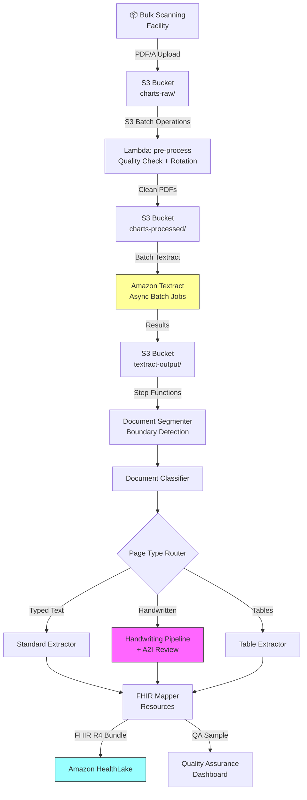

# Recipe 1.10 — Historical Chart Migration 🔷

**Complexity:** Complex · **Phase:** Phase 3 · **Estimated Cost:** ~$0.50–2.00 per chart (varies widely by chart size)

---

## Problem Statement

Somewhere in every payer's ecosystem — in a warehouse, a basement, or a legacy microfilm archive — there are boxes of paper medical charts. Historical patient records that predate EHR adoption, acquired plan members from M&A activity, or legacy paper archives from provider groups that a payer has absorbed. These records contain decades of clinical history: diagnoses, procedures, medication records, lab results, and progress notes.

Digitizing these isn't a nice-to-have — it's increasingly a regulatory requirement. CMS Interoperability rules require payers to make member data available via FHIR APIs, including historical data. Risk adjustment and quality measurement programs (HEDIS, Stars) benefit from complete longitudinal records. And members have a right to their complete records under HIPAA's Right of Access.

This isn't a single-document extraction problem. A chart might be 50–500 pages spanning years of care, with wildly mixed content: typed clinical notes, handwritten progress notes, printed lab results, thermal fax paper (degraded), sticky notes, photographs, and forms from dozens of different providers. The scale is enormous — a mid-size payer might have millions of charts to migrate.

This recipe brings together nearly every pattern from this chapter — async multi-page extraction (Recipe 1.2), page classification (Recipe 1.4), document segmentation (Recipe 1.5), handwriting handling (Recipe 1.6) — and adds batch orchestration and FHIR output mapping for industrial-scale migration.

## Solution Overview

Chart migration is fundamentally a batch processing problem. We're not optimizing for latency; we're optimizing for throughput, accuracy, and cost at scale. The pipeline:

1. **Ingest** — Charts scanned at bulk scanning facility (300 DPI, PDF/A format), uploaded to S3
2. **Pre-process** — Image quality assessment, rotation correction, page splitting for stuck/double-fed pages
3. **Segment** — Document boundary detection across the entire chart (Recipe 1.5 pattern)
4. **Classify** — Each logical document typed: progress note, lab result, imaging report, prescription, referral, etc.
5. **Extract** — Type-specific extraction with handwriting handling (Recipe 1.6 confidence tiering for handwritten pages)
6. **Map to FHIR** — Convert structured extractions to FHIR R4 resources (Condition, Procedure, MedicationStatement, Observation, DocumentReference)
7. **Load** — Write FHIR resources to Amazon HealthLake or target FHIR server
8. **QA** — Sampling-based quality assurance on extracted records

The critical difference from earlier recipes: we use Textract's **asynchronous batch APIs** and **Amazon S3 Batch Operations** for throughput, not Lambda-triggered per-document processing.

## Architecture Diagram



## Prerequisites

| Requirement | Details |
|-------------|---------|
| **AWS Services** | Amazon Textract, Comprehend Medical, A2I, S3, S3 Batch Operations, Lambda, Step Functions, DynamoDB, Amazon HealthLake (or target FHIR server), CloudWatch |
| **IAM Permissions** | All from Recipes 1.2-1.6, plus: `s3:CreateJob` (S3 Batch), `healthlake:CreateResource`, `healthlake:UpdateResource` |
| **Textract Quotas** | Request quota increases for `StartDocumentAnalysis` — default is 25 concurrent jobs. For bulk migration, you'll need 100-500+ concurrent jobs. File an AWS Support case early. |
| **HIPAA Controls** | Everything from Recipe 1.1. Bulk migration adds data governance requirements: chain of custody documentation from physical chart to digital record, audit trail proving every page was processed, retention policies for source PDFs. Consider S3 Object Lock (compliance mode) for source charts. |
| **Scanning Standards** | 300 DPI minimum, PDF/A format, color (not grayscale — it matters for handwriting OCR). Work with the scanning vendor to ensure consistent quality. Budget $0.10-0.30/page for scanning. |
| **Cost Estimate** | Textract: ~$3/1,000 pages (FORMS + TABLES). Comprehend Medical: ~$0.01/unit on clinical pages. A2I human review: ~$0.83/reviewed page. For a 200-page chart with 30% handwritten pages needing review: ~$0.60 Textract + ~$0.30 Comprehend Medical + ~$50 A2I review ≈ $51 per chart with heavy review. At scale with tuned confidence thresholds and only 10% review: ~$2-5 per chart. Volume discounts on Textract kick in at scale. |

## Ingredients

| AWS Service | Role |
|------------|------|
| **Amazon Textract** | Bulk document extraction across thousands of charts |
| **Amazon Comprehend Medical** | Clinical NLP on extracted text |
| **Amazon A2I** | Human review for low-confidence handwritten pages (Recipe 1.6 pattern) |
| **Amazon S3 + S3 Batch Operations** | Stores charts and orchestrates bulk processing |
| **AWS Step Functions** | Per-chart processing pipeline |
| **AWS Lambda** | Pre-processing, extraction, FHIR mapping |
| **Amazon HealthLake** | FHIR-native data store for migrated records |
| **Amazon DynamoDB** | Tracks migration progress, QA metrics per chart |
| **Amazon CloudWatch** | Dashboards for migration throughput, error rates, cost tracking |

## Code

> **Full source:** `github.com/aws-samples/healthcare-ai-cookbook/ch01/recipe-1.10/`

### Walkthrough

**Step 1 — Batch ingestion with S3 Batch Operations.** Instead of processing charts one-at-a-time via S3 event triggers, we use S3 Batch Operations to invoke a Lambda for each chart in a manifest.

```python
s3control = boto3.client('s3control')

def start_batch_migration(manifest_key: str, account_id: str) -> str:
    response = s3control.create_job(
        AccountId=account_id,
        Operation={
            'LambdaInvoke': {
                'FunctionArn': 'arn:aws:lambda:us-east-1:ACCOUNT:function:chart-migration-start'
            }
        },
        Manifest={
            'Spec': {'Format': 'S3BatchOperations_CSV_20180820', 'Fields': ['Bucket', 'Key']},
            'Location': {
                'ObjectArn': f'arn:aws:s3:::charts-raw/{manifest_key}',
                'ETag': get_object_etag('charts-raw', manifest_key)
            }
        },
        Report={
            'Bucket': 'arn:aws:s3:::migration-reports',
            'Format': 'Report_CSV_20180820',
            'Enabled': True,
            'ReportScope': 'AllTasks'
        },
        Priority=10,
        RoleArn='arn:aws:iam::ACCOUNT:role/s3-batch-migration-role',
        ConfirmationRequired=False
    )
    return response['JobId']
```

**Step 2 — Image quality pre-processing.** Before extraction, assess each page's quality and fix common issues. This step materially improves Textract accuracy on bulk-scanned documents.

```python
from PIL import Image
import io

def preprocess_page(image_bytes: bytes) -> tuple[bytes, dict]:
    img = Image.open(io.BytesIO(image_bytes))
    quality_report = {}
    
    # Check and fix rotation (Textract handles some rotation, but 180° flips cause failures)
    orientation = detect_orientation(img)  # uses EXIF or text-direction heuristic
    if orientation != 0:
        img = img.rotate(-orientation, expand=True)
        quality_report['rotation_corrected'] = orientation
    
    # Check DPI
    dpi = img.info.get('dpi', (200, 200))
    quality_report['dpi'] = dpi[0]
    if dpi[0] < 200:
        quality_report['low_dpi_warning'] = True
    
    # Check for blank pages (save Textract cost by skipping)
    if is_blank_page(img):
        quality_report['blank'] = True
        return None, quality_report
    
    # Deskew if needed
    skew_angle = detect_skew(img)
    if abs(skew_angle) > 0.5:
        img = img.rotate(-skew_angle, expand=True, fillcolor='white')
        quality_report['deskewed'] = skew_angle
    
    buf = io.BytesIO()
    img.save(buf, format='PNG')
    return buf.getvalue(), quality_report

def is_blank_page(img: Image.Image, threshold: float = 0.99) -> bool:
    """A page is blank if >99% of pixels are near-white."""
    grayscale = img.convert('L')
    white_pixels = sum(1 for p in grayscale.getdata() if p > 240)
    return white_pixels / (img.width * img.height) > threshold
```

**Step 3 — Segmentation and classification.** Reuse the document boundary detection from Recipe 1.5 and page classification from Recipe 1.4. For chart migration, we extend the document type taxonomy to cover the full range of chart content.

```python
CHART_DOC_TYPES = {
    # Inherit all types from Recipe 1.5
    **DOC_TYPE_SIGNATURES,
    # Add chart-specific types
    'progress_note': {
        'keywords': ['progress note', 'office visit', 'follow-up', 'return visit',
                     'subjective', 'objective', 'assessment', 'plan', 'soap'],
        'min_matches': 2
    },
    'referral': {
        'keywords': ['referral', 'refer to', 'consultation request', 'referred by',
                     'reason for referral'],
        'min_matches': 2
    },
    'prescription': {
        'keywords': ['rx', 'prescription', 'dispense', 'refills', 'sig:', 'dea #'],
        'min_matches': 2
    },
    'immunization_record': {
        'keywords': ['immunization', 'vaccine', 'vaccination', 'administered',
                     'lot number', 'injection site'],
        'min_matches': 2
    },
    'consent_form': {
        'keywords': ['consent', 'informed consent', 'i understand', 'i authorize',
                     'risks and benefits', 'signature'],
        'min_matches': 2
    },
}
```

**Step 4 — Handwriting routing.** Charts from the pre-EHR era are heavily handwritten. We apply the confidence tiering from Recipe 1.6 to route pages appropriately.

```python
def process_chart_page(page_blocks: list[dict], page_text: str) -> dict:
    # Determine if page is primarily handwritten
    words = [b for b in page_blocks if b['BlockType'] == 'WORD']
    handwritten_count = sum(1 for w in words if w.get('TextType') == 'HANDWRITING')
    handwriting_ratio = handwritten_count / len(words) if words else 0
    
    if handwriting_ratio > 0.5:
        # Heavy handwriting — use Recipe 1.6 confidence-tiered pipeline
        return process_handwritten_page(page_blocks, page_text)
    else:
        # Primarily printed — standard extraction
        return process_printed_page(page_blocks, page_text)
```

**Step 5 — FHIR R4 resource mapping.** The critical output step: convert extracted data into FHIR resources that HealthLake can store.

```python
def map_to_fhir_resources(chart_id: str, documents: list[dict]) -> list[dict]:
    resources = []
    
    for doc in documents:
        doc_type = doc['type']
        
        if doc_type == 'progress_note':
            # Map to Encounter + Condition resources
            if doc.get('clinical_entities', {}).get('conditions'):
                for condition in doc['clinical_entities']['conditions']:
                    resources.append({
                        'resourceType': 'Condition',
                        'subject': {'reference': f'Patient/{chart_id}'},
                        'code': {
                            'coding': [{
                                'system': 'http://hl7.org/fhir/sid/icd-10-cm',
                                'code': condition.get('icd10_code', ''),
                                'display': condition.get('text', '')
                            }]
                        },
                        'recordedDate': doc.get('document_date'),
                        'note': [{'text': f'Migrated from paper chart. Source: pages {doc["start_page"]}-{doc["end_page"]}'}]
                    })
        
        elif doc_type in ('lab_results', 'pathology_report'):
            # Map to Observation resources
            for lab in doc.get('lab_values', []):
                resources.append({
                    'resourceType': 'Observation',
                    'status': 'final',
                    'subject': {'reference': f'Patient/{chart_id}'},
                    'code': {'text': lab.get('test', '')},
                    'valueQuantity': {
                        'value': parse_numeric(lab.get('result', '')),
                        'unit': lab.get('units', ''),
                    },
                    'effectiveDateTime': doc.get('document_date'),
                })
        
        elif doc_type == 'prescription':
            # Map to MedicationStatement
            for med in doc.get('medications', []):
                resources.append({
                    'resourceType': 'MedicationStatement',
                    'status': 'completed',
                    'subject': {'reference': f'Patient/{chart_id}'},
                    'medicationCodeableConcept': {
                        'coding': [{
                            'system': 'http://www.nlm.nih.gov/research/umls/rxnorm',
                            'code': med.get('rxnorm_id', ''),
                            'display': med.get('drug_name', '')
                        }],
                        'text': med.get('drug_name', '')
                    },
                    'effectiveDateTime': doc.get('document_date'),
                })
        
        # Always create a DocumentReference for the source document
        resources.append({
            'resourceType': 'DocumentReference',
            'status': 'current',
            'subject': {'reference': f'Patient/{chart_id}'},
            'type': {'text': doc_type},
            'date': doc.get('document_date'),
            'content': [{
                'attachment': {
                    'contentType': 'application/pdf',
                    'url': f's3://charts-processed/{chart_id}/pages-{doc["start_page"]}-{doc["end_page"]}.pdf'
                }
            }],
            'context': {
                'sourcePatientInfo': {'reference': f'Patient/{chart_id}'}
            }
        })
    
    return resources
```

**Step 6 — Load to HealthLake.** Write FHIR resources in batches.

```python
healthlake = boto3.client('healthlake')

def load_to_healthlake(datastore_id: str, resources: list[dict]):
    # Bundle resources into a FHIR transaction bundle
    bundle = {
        'resourceType': 'Bundle',
        'type': 'transaction',
        'entry': [
            {
                'resource': resource,
                'request': {
                    'method': 'POST',
                    'url': resource['resourceType']
                }
            }
            for resource in resources
        ]
    }
    
    # HealthLake supports FHIR transaction bundles
    response = healthlake.start_fhir_import_job(
        DatastoreId=datastore_id,
        InputDataConfig={
            'S3Uri': upload_bundle_to_s3(bundle)  # serialize and upload
        },
        JobOutputDataConfig={
            'S3Configuration': {'S3Uri': f's3://migration-output/{datastore_id}/'}
        },
        DataAccessRoleArn='arn:aws:iam::ACCOUNT:role/healthlake-import-role'
    )
    return response['JobId']
```


## Expected Results

**Migration dashboard metrics for a 10,000-chart pilot:**

```json
{
  "migration_summary": {
    "charts_total": 10000,
    "charts_completed": 9847,
    "charts_failed": 53,
    "charts_in_review": 100,
    "total_pages_processed": 1482000,
    "avg_pages_per_chart": 148
  },
  "extraction_metrics": {
    "documents_segmented": 89420,
    "classification_accuracy_sampled": 0.91,
    "handwritten_pages": 412000,
    "handwritten_pct": 0.278,
    "pages_sent_to_a2i_review": 82400,
    "a2i_review_rate": 0.056
  },
  "fhir_output": {
    "conditions_created": 284100,
    "observations_created": 521800,
    "medication_statements_created": 198400,
    "document_references_created": 89420,
    "total_fhir_resources": 1093720
  },
  "cost_summary": {
    "textract": "$4,446.00",
    "comprehend_medical": "$1,820.00",
    "a2i_human_review": "$68,392.00",
    "healthlake_import": "$280.00",
    "lambda_step_functions": "$420.00",
    "s3_storage": "$340.00",
    "total": "$75,698.00",
    "cost_per_chart": "$7.58"
  },
  "timeline": {
    "elapsed_days": 14,
    "throughput_charts_per_day": 703
  }
}
```

**Per-chart sample output:**

```json
{
  "chart_id": "CHT-2026-004821",
  "patient": {"name": "Eleanor Vance", "dob": "03/12/1945", "member_id": "MED8291047"},
  "pages": 187,
  "documents_found": 23,
  "document_breakdown": {
    "progress_note": 12,
    "lab_results": 4,
    "prescription": 3,
    "referral": 2,
    "imaging_report": 1,
    "consent_form": 1
  },
  "fhir_resources_created": 142,
  "handwritten_pages": 48,
  "pages_human_reviewed": 8,
  "qa_status": "passed"
}
```

**Performance benchmarks:**

| Metric | Typical Value |
|--------|---------------|
| Processing time per chart (avg) | 5–30 minutes (depending on page count and review queue) |
| Throughput (sustained) | 500–1,000 charts/day (scales with Textract concurrency quota) |
| Document segmentation accuracy | 80–90% |
| FHIR mapping completeness | 85–92% of clinical data captured as structured resources |
| Cost per chart (light handwriting) | $2–5 |
| Cost per chart (heavy handwriting) | $5–15 |
| Cost per chart (with A2I review) | $5–50 (dominated by human review time) |

**The honest truth about cost:** Human review is the cost driver, not AWS services. A 200-page chart with 30% handwritten pages and 20% A2I review rate means ~12 pages need human review. At 3 minutes per page and $25/hr, that's $15 in labor per chart. The Textract/Comprehend costs are under $1. If you can reduce the review rate through confidence tuning and image pre-processing, costs drop dramatically.

## Variations & Extensions

1. **Incremental migration with priority scoring.** Instead of migrating all charts at once, score charts by business value: members currently active, charts needed for risk adjustment, charts with upcoming care events. Migrate high-value charts first, spreading cost and review capacity over time. Use DynamoDB to track migration priority and status per chart.

2. **OCR quality feedback loop.** As A2I reviewers correct handwriting errors (Recipe 1.6, Step 7), accumulate training data. After collecting enough corrections (~1,000+ per document type), train a custom Textract adapter specific to your historical chart styles. Re-process previously low-confidence pages with the improved model — your accuracy improves as you migrate, reducing review needs for later batches.

3. **Cross-chart entity resolution.** After migration, run entity resolution across charts to link the same patient seen at different providers, identify duplicate records, and build a unified longitudinal view. This feeds into member matching (→ Recipe 8.3) and population health analytics (→ Recipe 9.1).

## Related Recipes

- **← Recipe 1.5 (Claims Attachment Processing):** Document segmentation and classification pattern reused here at scale
- **← Recipe 1.6 (Handwritten Clinical Note Digitization):** Confidence tiering and A2I review pipeline applied to handwritten chart pages
- **→ Recipe 2.1 (Clinical Entity Extraction):** Deep clinical NLP on migrated clinical notes
- **→ Recipe 8.3 (Entity Resolution: Member Matching):** Links migrated records to current member identities
- **→ Recipe 9.1 (Population Health Analytics):** Consumes the migrated longitudinal data for cohort analysis

## Additional Resources

- [Amazon HealthLake Developer Guide](https://docs.aws.amazon.com/healthlake/latest/devguide/what-is-amazon-health-lake.html)
- [Amazon S3 Batch Operations](https://docs.aws.amazon.com/AmazonS3/latest/userguide/batch-ops.html)
- [FHIR R4 DocumentReference Resource](https://www.hl7.org/fhir/documentreference.html)
- [CMS Interoperability and Patient Access Final Rule](https://www.cms.gov/regulations-and-guidance/guidance/interoperability/index)
- [AHIMA Guidelines for Chart Migration](https://www.ahima.org/)
- [Amazon Textract Quotas and Limits](https://docs.aws.amazon.com/textract/latest/dg/limits.html)

## Estimated Implementation Time

| Scope | Time |
|-------|------|
| **Basic** (batch Textract + segmentation + generic extraction, no FHIR) | 2–3 weeks |
| **Production-ready** (FHIR mapping, HealthLake, A2I review, QA dashboard, monitoring) | 2–3 months |
| **With variations** (priority scoring, feedback loop, entity resolution) | 4–6 months |

## Tags

`document-intelligence` · `ocr` · `textract` · `comprehend-medical` · `a2i` · `healthlake` · `fhir` · `chart-migration` · `batch-processing` · `s3-batch` · `step-functions` · `handwriting` · `complex` · `phase-3` · `hipaa` · `interoperability`

---

*← [Recipe 1.9 — Medical Records Request Extraction](chapter01.09-medical-records-request-extraction) · [↑ Chapter 1 Index](chapter01-index)*
