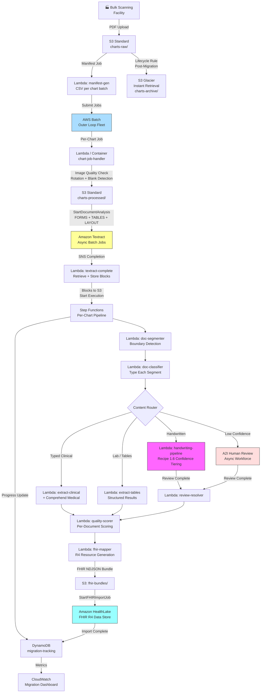

# Recipe 1.10: Historical Chart Migration 🔷

**Complexity:** Complex · **Phase:** Phase 3 · **Estimated Cost:** ~$2–15 per chart (varies by page count, handwriting density, and review rate)

---

## The Problem

Somewhere in your organization's past, there is a gap. It might be the decade before your EHR went live. It might be the charts from a physician group you acquired last year. It might be a physical warehouse three states away full of filing cabinets that represent thirty years of patient care. Or it might be a PACS server from a hospital system you merged with, full of scanned documents in formats nobody remembers how to read.

Those records aren't just legacy data. They're clinical history. For a member who was diagnosed with hypertension in 1998 and managed it quietly for a decade before landing in your network, that paper chart is the difference between a care manager who knows what medications she's tried and one who's starting blind. For a risk adjustment program, a diagnosis that was documented on paper but never entered into an EHR is revenue that's simply invisible.

This is the chart migration problem, and it's bigger than most organizations want to admit.

The regulatory pressure is intensifying. CMS Interoperability and Patient Access rules require payers to make member data available via FHIR APIs, and "member data" means historical data too. HEDIS and Stars programs reward complete longitudinal records. HIPAA Right of Access means members can request their complete records, including the ones sitting in boxes in a scanning vendor's warehouse. The argument for kicking this down the road keeps getting harder to make.

And then there's the actual problem. These aren't clean, uniform documents. A chart from a busy primary care office spanning 1990 to 2010 might be 300 pages of:

- Handwritten progress notes from three different physicians, each with their own handwriting quirks
- Printed lab results from two different lab systems with different layouts
- Thermal fax paper that has degraded to near-illegibility
- Sticky notes attached to pages with additional clinical observations
- Forms from a dozen different specialists, each designed by a different practice
- Photocopied records from other facilities with additional generation loss
- Pages rotated, double-fed, or out of order from the scanning process
- A section that someone photocopied three times before realizing the original was in a different folder

Every chart is different. Every provider documented differently. Every scanning vendor has slightly different equipment and quality control. There is no clean version of this problem.

A mid-size payer with ten million historical member-years of records might be looking at twenty million charts, averaging 150 pages each, for a total of three billion pages. That is not a workload you can throw at a Lambda function and a DynamoDB table and call it done.

This is the capstone recipe of Chapter 1 for a reason. We're going to bring together everything: async extraction from Recipe 1.2, page classification from Recipe 1.4, document boundary detection from Recipe 1.5, handwriting confidence tiering from Recipe 1.6. We're going to add industrial-scale orchestration for throughput in the millions of charts. We're going to add FHIR R4 output mapping so the extracted data is useful to downstream systems. And we're going to build quality scoring so you know, for every chart, how much you can trust what came out the other side.

Let's get into it.

---

## The Technology

### Batch Processing vs. Real-Time Processing: Why It Matters

Every recipe in this chapter so far has been optimized for latency. An insurance card needs to be processed in seconds because a patient is standing at a registration desk. A prior auth needs a response in minutes because a provider is waiting before scheduling a procedure.

Chart migration is the inverse of all that. Nobody is waiting at a desk for a 1985 progress note. There is no latency SLA. What there is instead: a migration window, a budget, a cost-per-chart target, and a total page volume that you need to get through without melting your Textract quotas or your AWS bill.

This changes the architecture in fundamental ways. Real-time pipelines minimize latency by processing one item as fast as possible. Batch pipelines maximize throughput by processing many items in parallel at the lowest possible per-item cost. The design decisions that optimize for one objective actively hurt the other.

The critical concept here is **work queue decomposition**. You don't hand three million charts to a single process and wait. You decompose the work into units (one chart per unit), distribute those units across a pool of workers, let the workers process in parallel, and aggregate the results. The number of workers determines your throughput; the cost per unit determines your budget; the queue management determines your reliability.

This is exactly what batch compute frameworks do. The framework manages the queue, tracks which units have been completed and which have failed, retries failures up to a limit, and scales the worker pool based on queue depth. Your job is to write the work unit logic; the framework handles everything else.

### The Heterogeneous Content Problem

What makes chart migration genuinely hard is not the scale. Scale is an engineering problem with well-understood solutions. What's hard is the **content heterogeneity**.

Every other recipe in this chapter makes an implicit assumption: the documents you're processing have a predictable structure. An insurance card always has a member ID field. A prior auth submission always has a primary diagnosis. An intake form always has a chief complaint section. That predictability is what lets you build field-level extractors and confidence thresholds that mean something.

Historical charts throw all of that out. In a single 200-page chart, you might encounter:

**Typed clinical notes** from the 1990s printed on dot-matrix printers, with degraded ribbon strike patterns that look like light gray text to an OCR engine. The content is structured (SOAP format) but the rendering quality is inconsistent.

**Handwritten progress notes** from different providers over different decades. One physician writes in tight, precise block letters. Another scrawls nearly-illegible cursive. A third dictates everything and signs with a stylized signature that OCR confidently reads as something unrelated.

**Fax artifacts** from documents that were received by fax, stored as fax images, and then re-scanned by the scanning vendor. Each fax transmission adds noise; a second-generation fax scanned at a medium-quality scanner has significantly degraded character quality compared to the original. Lines become broken dashes. Thin characters lose their serifs. Table borders become discontinuous.

**Forms from dozens of sources** designed by different practices, hospitals, and vendors over three decades. The same concept (patient name) appears at different positions, in different font sizes, with different label text ("Patient Name:", "Name:", "Pt.:", "Last, First:", "Patient:"). There is no universal form schema.

**Mixed page orientations** from careless scanning: landscape pages that should be rotated, upside-down pages from documents that were grabbed from the output tray in the wrong orientation, partially visible pages from documents that slid under another sheet on the scanning glass.

**Blank pages, cover sheets, and artifacts** from fax headers, sticky note scans, and page separators that the scanning vendor inserted. These should be identified and skipped.

The technical response to heterogeneity is a **tiered classification and routing pipeline**: assess what you have before deciding how to process it. A page classified as a printed lab result with high OCR confidence goes one path. A page with 60% handwritten content and below-threshold word confidence goes a different path. A blank page gets skipped entirely. This is exactly the fan-out pattern from Recipes 1.4 and 1.5, applied at industrial scale.

### Document Segmentation at Chart Scale

Recipe 1.5 covered document boundary detection for a 30-page claims attachment. The same algorithm applies to a 300-page chart, but the scale changes the error dynamics.

For a 30-page package, a missed boundary produces one wrong segment out of maybe five. That's a 20% error on a small number of decisions. For a 300-page chart with 35 logical documents, a missed boundary produces one wrong segment out of 35. But the wrong segment is also larger (more pages) and harder for the classifier to handle because it contains vocabulary from two different document types. The cascading effect is worse at scale.

This motivates a quality scoring framework that operates at the document level, not just the page level. Each extracted document gets a quality score based on: confidence of the boundary signals that defined it, classification confidence, extraction completeness, and handwriting review outcomes. Charts with many low-quality documents get flagged for priority human review. Charts where everything scored high confidence are promoted to FHIR loading without review sampling.

### FHIR as the Output Target

The reason we're doing this extraction is ultimately to make the data useful. A pile of OCR text is not useful. A set of FHIR R4 resources that a care management system, a risk adjustment engine, and a FHIR API can all consume is useful.

FHIR R4 (Fast Healthcare Interoperability Resources, Release 4) is the current standard for healthcare data exchange. Every major EHR supports it. Every modern payer technology platform either supports it or is building toward it. CMS requires FHIR-based APIs for member data access. The HL7 FHIR specification defines resource types for every category of clinical data we're extracting.

The mapping problem is non-trivial. Raw OCR text says "hypertension, essential" with a Comprehend Medical confidence of 0.91. A FHIR `Condition` resource has required fields: patient reference, clinical status, verification status, code (ICD-10 or SNOMED CT), and optionally onset date, recorded date, and note. Turning the OCR output into a valid FHIR resource requires mapping the extracted entity to a coded concept, determining status, estimating dates, and populating the resource structure.

This mapping will never be perfect. A diagnosis documented in a 1992 progress note with no explicit date maps to a FHIR Condition with `recordedDate` inferred from the document's header date, not from explicit date text. The verification status becomes `unconfirmed` rather than `confirmed` because we can't distinguish an active diagnosis from a historical mention. The note field on every migrated resource should document its provenance: it came from a paper chart, from a specific page range, with a specific OCR confidence level. That provenance is both a data quality signal and a compliance record.

The FHIR resource types most relevant to chart migration:

- **`DocumentReference`**: A pointer to the source document (the PDF pages for this logical document). Every extracted document should produce at least one DocumentReference, regardless of how much structured data was extracted. It's the "we digitized this" record.
- **`Condition`**: A diagnosed condition or problem. Maps from clinical notes, discharge summaries, problem lists.
- **`DiagnosticReport`**: A lab or imaging report, including results. Maps from lab results, radiology reports, pathology reports.
- **`Observation`**: An individual lab result value within a DiagnosticReport. A complete blood count produces one DiagnosticReport and multiple Observations (WBC, RBC, hemoglobin, etc.).
- **`MedicationStatement`**: A medication the patient was taking, documented in the chart. Maps from progress notes, medication lists, prescriptions.
- **`Procedure`**: A procedure performed. Maps from operative reports, procedure notes, surgical history sections.
- **`Encounter`**: A healthcare visit or encounter. Maps from office visit notes, hospital admissions.
- **`Immunization`**: A documented vaccine administration. Maps from immunization records.
- **`AllergyIntolerance`**: Documented allergies or adverse reactions. Often appears in the chart header or problem list.

### Quality Scoring Framework

At industrial scale, you cannot manually review every chart. You need a systematic way to know which extractions to trust and which to flag. Quality scoring provides that signal.

A document-level quality score combines several dimensions:

**OCR confidence** is the average word-level confidence score from Textract across all words on the page. A page of clean 12-point Times New Roman scores 0.97. A degraded thermal fax scores 0.61. The distribution within a chart tells you which pages need attention.

**Handwriting ratio** is the fraction of WORD blocks on a page classified by Textract as `HANDWRITING` rather than `PRINT`. This affects downstream accuracy expectations: printed text extracts at 95%+ accuracy; handwritten text at 70-85% depending on legibility.

**Segment confidence** is the classification score from the document boundary and type detection pipeline (the keyword match count from Recipe 1.5's approach). A segment that fired a strong title-line boundary signal and matched 8 keywords for "lab_result" classification is higher confidence than a segment that fired a weak date-discontinuity boundary and matched 3 keywords for "progress_note."

**FHIR completeness** is the fraction of extracted documents that produced at least one FHIR resource beyond a DocumentReference. A chart where every document produced only DocumentReferences (no Conditions, Observations, or MedicationStatements) might be a patient with truly sparse clinical history, or it might indicate extraction failure. Charts below a threshold get flagged.

**Human review resolution** is applied after A2I review: if a handwritten page was reviewed and the reviewer confirmed the extraction, the quality score for that document is upgraded. If the reviewer found significant errors, the document is marked for re-extraction with reviewed text.

### The General Architecture Pattern

Chart migration has a two-tier orchestration structure.

The outer tier handles scale: ingesting millions of charts, distributing work across a large fleet of workers, tracking progress, and managing costs. This is a batch compute problem. Any batch compute framework (on any cloud, in any language) implements this tier. What matters at this level is queue management, worker concurrency, failure handling, and job tracking.

The inner tier handles per-chart logic: extracting text, segmenting documents, classifying pages, routing to extractors, scoring quality, mapping to FHIR. This is the pipeline we've built across Chapter 1. Each chart gets its own pipeline execution.

The data flow:

```
[Scanned Charts in S3]
        |
        v
[Batch Manifest Generation]
(one row per chart in a CSV manifest)
        |
        v
[Batch Job Submission]
(fleet of workers, each pulling charts from the manifest)
        |
        v
[Per-Chart Pipeline - runs inside each worker]
        |
    +---+---+
    |       |
    v       v
[Pre-process]   [Quality check: skip blank, fix rotation]
    |
    v
[Async OCR]
(full document extraction per chart)
    |
    v
[Document Segmentation]
(boundary detection across all pages)
    |
    v
[Document Classification]
(type each logical document)
    |
    v
[Content Routing]
    +------+------+------+------+
    |      |      |      |      |
[Typed  [Hand-  [Lab   [Forms]  ...
 Text]  written] Results]
    |      |      |      |      |
    +------+------+------+------+
           |
           v
[Quality Scoring per Document]
           |
           v
[FHIR R4 Resource Mapping]
           |
           v
[FHIR Import / Load]
           |
           v
[Source Archive to Cold Storage]
           |
           v
[Progress Tracking Update]
```

Nothing in this pattern is vendor-specific. The batch compute framework might be AWS Batch, Google Cloud Batch, or a Kubernetes job queue. The OCR might be any cloud document extraction service. The FHIR load target might be a cloud-managed FHIR service or any FHIR-compliant API. The document segmentation and classification logic is pure application code. A team on GCP or Azure follows exactly the same architectural pattern.

---

## The AWS Implementation

### Why These Services

**Amazon Textract (async batch API)** handles the core OCR. Every chart goes through `StartDocumentAnalysis` with FORMS, TABLES, and LAYOUT feature types. The async API is essential at this scale: you submit a job and poll for completion rather than waiting synchronously. Textract returns block-level results including word-level confidence scores, bounding boxes, detected text type (PRINT vs HANDWRITING), and structural layout elements. The LAYOUT feature type provides title blocks, section headers, and paragraph markers that drive the document segmentation logic.

**AWS Batch** is the outer-loop orchestration for industrial scale. If you're processing hundreds of thousands or millions of charts, Step Functions is the wrong tool for the outer loop. Step Functions is excellent for per-chart pipeline orchestration because you get execution history, visual debugging, and clean error handling. But running two million Step Functions executions concurrently hits service quotas and gets expensive. AWS Batch handles the fleet management: you define a compute environment (EC2 Spot instances or Fargate), a job queue, and a job definition. Batch pulls charts from the manifest, manages instance scaling, retries failed jobs, and tracks completion. At the outer loop, Batch manages the fleet. At the inner loop, Step Functions manages each chart's pipeline.

**AWS Step Functions (Standard Workflows)** handles per-chart pipeline orchestration. Each chart gets its own execution: pre-process, extract, segment, classify, route, score, map, load. The execution history in the console is how you debug a 300-page chart that produced garbage output. The visual execution graph shows exactly which step failed and what state the pipeline was in. At the chart scale you're running, you want that debuggability. Standard Workflows cost more than Express Workflows, but for a Phase 3 program running over months, the debugging value more than justifies it.

**Amazon Comprehend Medical** handles clinical NLP on extracted text. After Textract extracts the words from a progress note or discharge summary, Comprehend Medical's `DetectEntitiesV2` identifies conditions, medications, procedures, and anatomy. `InferICD10CM` maps detected conditions to ICD-10 codes. `InferRxNorm` maps medication mentions to RxNorm concept IDs. These outputs are what get mapped to FHIR Condition, MedicationStatement, and Procedure resources.

**Amazon A2I (Augmented AI)** handles human review for low-confidence handwritten pages. The same confidence tiering from Recipe 1.6 applies here: pages above the high-confidence threshold route directly to FHIR mapping; pages below the low-confidence threshold are sent for human review; pages in between get marked as unconfirmed but proceed without blocking the chart. A2I manages the reviewer workforce and returns reviewed results asynchronously.

**Amazon HealthLake** is the FHIR-native data store that receives the migrated records. HealthLake provides a fully managed FHIR R4 data store with FHIR import (bulk load from S3), FHIR API access, and AWS Lake Formation integration for analytics queries. For a payer building toward CMS Interoperability compliance, HealthLake is the natural landing zone. Alternatives: if your organization already has a FHIR server (Microsoft Azure API for FHIR, Google Cloud Healthcare API FHIR store, or an on-premises FHIR server), HealthLake's import format is standard FHIR NDJSON and the loading step is easily adapted.

**Amazon S3 with Glacier tiering** handles chart storage across its lifecycle. Source charts (raw PDFs from the scanning vendor) land in S3 Standard for active processing. After a chart completes migration, the source PDF transitions to S3 Glacier Instant Retrieval (retrieval in milliseconds, storage at a fraction of Standard cost) for the required retention period. Textract output and intermediate extraction artifacts live in S3 Standard for 30 days (you need them if a chart needs re-processing), then expire. Final FHIR bundles are retained separately in the HealthLake data store.

**Amazon DynamoDB** tracks migration state for every chart. Partition key: `chart_id`. Each chart record holds status (pending, processing, completed, failed, review-required), page count, document count, quality score, FHIR resource counts, and processing timestamps. The DynamoDB table is your migration dashboard source of truth. It's also the idempotency guard: before starting a chart, you check whether it already has a `completed` record. If it does, you skip it, because S3 events and Batch retries are at-least-once.

**Amazon CloudWatch** provides the migration operations dashboard: throughput (charts per hour), error rates by failure type, Textract cost tracking, A2I review queue depth, and FHIR load success rates. At the scale of a multi-month migration program, CloudWatch dashboards are how your operations team knows whether the program is on track.

### Architecture Diagram



### Prerequisites

| Requirement | Details |
|-------------|---------|
| **AWS Services** | Amazon Textract, Comprehend Medical, A2I, S3, S3 Lifecycle Policies, AWS Batch, Step Functions (Standard), Lambda, DynamoDB, Amazon HealthLake, CloudWatch, SNS, SQS |
| **IAM Permissions** | All permissions from Recipes 1.2, 1.4, 1.5, and 1.6, plus: `batch:SubmitJob`, `batch:DescribeJobs`, `healthlake:StartFHIRImportJob`, `healthlake:DescribeFHIRImportJob`, `healthlake:CreateResource`, `s3:PutLifecycleConfiguration`, `s3:RestoreObject` |
| **Textract Quota Increases** | The default `StartDocumentAnalysis` quota is 25 concurrent jobs in most regions. For bulk migration, you need 100 to 500+ concurrent jobs. File an AWS Support quota increase request at least two to four weeks before your migration start date. Include your expected peak concurrency and total job volume. This is not optional. Do this first. |
| **HealthLake Data Store** | Create a HealthLake FHIR R4 data store before migration starts. HealthLake data stores are regional resources; choose the same region as your Textract and S3 deployments. FHIR import jobs write to a specific data store by its `DatastoreId`. |
| **AWS Batch Compute Environment** | Configure a managed compute environment with your desired instance family (Spot instances reduce cost significantly for batch workloads where restartability is handled). Set the minimum and maximum vCPU counts based on throughput targets. A compute environment with 0 minimum vCPUs scales down to zero when the queue is empty (no idle compute cost). |
| **BAA** | AWS Business Associate Addendum signed. Chart migration involves some of the most sensitive PHI you will ever process: complete longitudinal clinical records going back decades. Every service in this pipeline is HIPAA-eligible. Verify your BAA covers HealthLake specifically; it was added to the BAA eligible services list in 2021. |
| **Chain of Custody Documentation** | For compliance purposes, document the physical chain of custody from paper chart to digital record: scanning vendor name, scanning date, quality control attestation, and the S3 object key for the resulting PDF. This documentation supports HIPAA compliance audits and legal discovery. Store it alongside the migration tracking record in DynamoDB. |
| **Scanning Standards** | 300 DPI minimum (200 DPI absolute minimum for printed text; 300 DPI required for handwriting). Color scanning recommended over grayscale: color provides additional signals for handwriting detection and form field detection. PDF/A format for long-term archival compatibility. Work with the scanning vendor on quality control sampling before full-scale migration. Budget $0.08 to $0.25 per page for scanning. |
| **Encryption** | S3: SSE-KMS with customer-managed key on all buckets. DynamoDB: encryption at rest with KMS. Step Functions: execution history encrypted with KMS. HealthLake: encryption at rest (included, KMS-managed). All API calls over TLS. Text sent to Comprehend Medical and A2I is not retained by AWS beyond the immediate transaction. |
| **VPC** | Production: all Lambdas and Batch jobs in a VPC with VPC endpoints for S3 (gateway), Textract, Comprehend Medical, DynamoDB, SNS, SQS, Step Functions, HealthLake, CloudWatch Logs, and KMS. Chart data should not traverse the public internet. |
| **Sample Data** | Use de-identified or synthetic charts during development. CMS provides sample clinical document templates. The `synthea` open-source tool generates realistic synthetic patient records and can export clinical notes for testing. Never use real PHI in development environments. |
| **Cost Estimate** | Textract FORMS + TABLES: $0.065/page ($0.05 forms + $0.015 tables). Textract LAYOUT: no additional per-page cost. Comprehend Medical DetectEntitiesV2 on clinical pages: ~$0.01/unit (one unit per 100 characters, minimum 3 units). A2I human review at $0.83/reviewed page (using AWS-managed workforce pricing). HealthLake import: $0.16 per 1,000 resources. For a 200-page chart with 30% handwritten content, 80% clinical pages needing Comprehend Medical, and 10% A2I review rate: Textract ~$13.00, Comprehend Medical ~$2.00, A2I ~$5.00, HealthLake ~$0.50, compute ~$0.50 = roughly $21 per chart with A2I. At 5% A2I review rate (good confidence tuning): ~$13–16. A2I dominates cost when review rates are high. |

### Ingredients

| AWS Service | Role |
|-------------|------|
| **Amazon Textract** | Async FORMS + TABLES + LAYOUT extraction across all pages of every chart |
| **Amazon Comprehend Medical (DetectEntitiesV2)** | Clinical entity extraction from typed clinical notes, discharge summaries, progress notes |
| **Amazon Comprehend Medical (InferICD10CM)** | ICD-10 code inference from clinical narrative |
| **Amazon Comprehend Medical (InferRxNorm)** | Medication-to-RxNorm mapping from progress notes and medication lists |
| **Amazon A2I** | Human review for low-confidence handwritten pages (Recipe 1.6 confidence tiering) |
| **AWS Batch** | Outer-loop fleet management: distributes millions of chart jobs across a Spot instance pool |
| **AWS Step Functions (Standard Workflows)** | Per-chart pipeline orchestration with execution history and visual debugging |
| **Amazon S3** | Multi-stage storage: raw charts, processed charts, Textract output, FHIR bundles |
| **S3 Glacier Instant Retrieval** | Long-term archival of source charts after migration completes |
| **AWS Lambda** | All processing functions within the per-chart Step Functions pipeline |
| **Amazon HealthLake** | FHIR R4 data store receiving migrated records via bulk FHIR import |
| **Amazon DynamoDB** | Migration state tracking, idempotency guard, quality score storage per chart |
| **Amazon SNS** | Textract async job completion notification triggering result retrieval |
| **Amazon SQS** | Dead letter queues on all Lambdas; A2I review results buffer |
| **Amazon CloudWatch** | Throughput dashboards, cost tracking, error rate alarms, review queue depth |
| **AWS KMS** | Customer-managed encryption keys for all services storing PHI |

### Code

#### Walkthrough

---

**Step 1: Manifest generation and batch job submission.**

Before processing starts, we need a manifest: a list of every chart to process, one per row, with the S3 bucket and key for each. The manifest is a CSV file that AWS Batch (or S3 Batch Operations) can consume directly.

This step also initializes the DynamoDB tracking record for each chart. That record becomes the idempotency guard: if a chart already has `status = completed` in DynamoDB, we skip it. This matters because Batch can retry failed jobs, and manifest runs can overlap if you're processing in waves.

```
// Manifest structure: one CSV row per chart
// Format: bucket, key, chart_id, member_id, scan_date, page_count_estimate

FUNCTION generate_migration_manifest(s3_prefix: string, output_key: string):
    // List all chart PDFs under the given prefix
    chart_objects = list_all_s3_objects(bucket="charts-raw", prefix=s3_prefix)

    manifest_rows = empty list
    dynamodb_records = empty list

    FOR each object in chart_objects:
        // Derive chart_id from the S3 key (your scanning vendor should encode this
        // in the filename; agree on a naming convention before scanning starts)
        chart_id = extract_chart_id_from_key(object.key)

        // Skip charts already processed (idempotency)
        existing = get_dynamodb_item(table="migration-tracking", key=chart_id)
        IF existing is not null AND existing.status == "completed":
            log: "Skipping already-completed chart: " + chart_id
            CONTINUE

        manifest_rows.append({
            bucket:   "charts-raw",
            key:      object.key,
            chart_id: chart_id
        })

        // Initialize tracking record (status: pending)
        dynamodb_records.append({
            chart_id:      chart_id,
            s3_key:        object.key,
            status:        "pending",
            created_at:    current UTC timestamp,
            page_count:    null,        // populated after Textract completes
            doc_count:     null,
            quality_score: null
        })

    // Write manifest to S3 (AWS Batch reads this directly)
    write manifest_rows as CSV to S3 at "manifests/" + output_key

    // Batch-write DynamoDB records (25 items per call; use batch_write_item)
    write_dynamodb_records_in_batches(dynamodb_records, batch_size=25)

    RETURN count of manifest_rows, "manifests/" + output_key


FUNCTION submit_batch_migration_job(manifest_key: string, job_count: int):
    // Submit an AWS Batch array job.
    // An array job runs N copies of the same job definition, each with a unique array index.
    // The job handler uses the array index to select its row from the manifest.
    response = batch_client.submit_job(
        jobName:      "chart-migration-" + today_date(),
        jobQueue:     "chart-migration-queue",
        jobDefinition: "chart-migration-job-def",
        arrayProperties: {
            size: job_count    // one job per chart in the manifest
        },
        parameters: {
            manifest_key: manifest_key
        }
    )

    log: "Submitted Batch array job: " + response.jobId
         + " with " + job_count + " child jobs"

    RETURN response.jobId
```

One design note on AWS Batch vs. S3 Batch Operations here: S3 Batch Operations is a great choice when your outer-loop work unit is "invoke a Lambda per S3 object." It's simpler to set up and handles the manifest natively. AWS Batch is better when your work unit needs more than 15 minutes of execution time (Lambda's maximum), requires complex container environments with specific Python libraries, or needs fine-grained CPU and memory allocation. For charts under 100 pages, Lambda plus S3 Batch Operations is usually sufficient. For large charts (200+ pages) or complex pre-processing pipelines, AWS Batch is the right choice.

---

**Step 2: Image quality pre-processing.**

Each page needs quality assessment before sending to Textract. Fixing problems now is much cheaper than paying for Textract on garbage input, discovering the output is garbage, and re-processing.

```
FUNCTION preprocess_chart(chart_pdf_key: string) -> tuple[string, dict]:
    // Download the chart PDF and split into individual page images
    pdf_bytes = download_s3_object(bucket="charts-raw", key=chart_pdf_key)
    pages = split_pdf_into_pages(pdf_bytes)   // returns list of (page_num, image_bytes)

    quality_report = {
        total_pages:         length of pages,
        blank_pages_skipped: 0,
        rotations_corrected: 0,
        deskews_applied:     0,
        low_dpi_warnings:    0
    }

    processed_pages = empty list

    FOR each page_num, image_bytes in pages:
        img = load_image(image_bytes)

        // Check for blank pages and skip them (saves Textract cost)
        IF is_blank_page(img, white_threshold=0.98):
            quality_report.blank_pages_skipped += 1
            CONTINUE

        // Detect and correct rotation
        // Textract handles 0/90/180/270 degree rotation, but only if the image metadata
        // is correct. Fax scans often have incorrect EXIF orientation.
        orientation = detect_page_orientation(img)
        IF orientation != 0:
            img = rotate_image(img, degrees=orientation)
            quality_report.rotations_corrected += 1

        // Deskew pages (scanner skew of up to 5 degrees is common)
        skew_angle = detect_skew_angle(img)
        IF absolute_value(skew_angle) > 0.5 degrees:
            img = deskew_image(img, angle=skew_angle)
            quality_report.deskews_applied += 1

        // Check DPI and flag (we can't upsample effectively, but we log it)
        dpi = get_image_dpi(img)
        IF dpi < 200:
            quality_report.low_dpi_warnings += 1
            log_warning: "Page " + page_num + " has DPI=" + dpi
                         + " (may affect OCR accuracy)"

        // Re-assemble processed page into output image list
        processed_pages.append({
            page_num:  page_num,
            image:     img,
            orig_dpi:  dpi
        })

    // Rebuild PDF from processed pages (Textract accepts multi-page PDF or individual images)
    processed_pdf_bytes = assemble_pdf_from_images(processed_pages)
    processed_key = "charts-processed/" + chart_pdf_key
    upload_s3_object(bucket="charts-processed", key=processed_key, data=processed_pdf_bytes)

    RETURN processed_key, quality_report


// Blank page detection: a page is blank if > threshold fraction of pixels are near-white.
// Works for both grayscale and color images. Threshold of 0.98 catches blank pages while
// allowing for scanner noise and page edges.
FUNCTION is_blank_page(img, white_threshold: float) -> bool:
    grayscale = convert_to_grayscale(img)
    white_pixel_count = count of pixels with brightness > 240   // 0-255 scale
    total_pixels = img.width * img.height
    RETURN (white_pixel_count / total_pixels) > white_threshold
```

---

**Step 3: Async Textract extraction.**

Same async pattern as Recipe 1.2, with two additions: we include LAYOUT in the feature types (needed for document segmentation), and we record the Textract job ID in DynamoDB so we can debug any chart-to-job mapping issues later.

```
FUNCTION start_chart_extraction(processed_chart_key: string, chart_id: string) -> string:
    response = textract_client.start_document_analysis(
        DocumentLocation={
            "S3Object": {
                "Bucket": "charts-processed",
                "Name":   processed_chart_key
            }
        },
        FeatureTypes=["FORMS", "TABLES", "LAYOUT"],
        NotificationChannel={
            "SNSTopicArn": "arn:aws:sns:us-east-1:ACCOUNT:textract-chart-jobs",
            "RoleArn":     "arn:aws:iam::ACCOUNT:role/textract-sns-role"
        },
        JobTag=chart_id    // tag the job with chart_id for traceability
    )

    job_id = response["JobId"]

    // Record the Textract job ID in DynamoDB for debugging
    update_dynamodb_item(
        table="migration-tracking",
        key=chart_id,
        updates={
            textract_job_id: job_id,
            status:          "extracting"
        }
    )

    RETURN job_id


FUNCTION retrieve_textract_results(job_id: string, chart_id: string) -> string:
    // Retrieve all Textract result pages (paginated, same as Recipes 1.2 and 1.5)
    all_blocks = retrieve_all_textract_blocks_paginated(job_id)

    // Write raw blocks to S3 (large charts can have 50,000+ blocks)
    blocks_key = "textract-output/" + chart_id + "/blocks.json"
    write_json_to_s3(bucket="textract-output", key=blocks_key, data=all_blocks)

    // Record page count (now we know it exactly)
    page_count = max(block.Page for block in all_blocks if block has a Page attribute)
    update_dynamodb_item(
        table="migration-tracking",
        key=chart_id,
        updates={
            page_count: page_count,
            blocks_key: blocks_key,
            status:     "segmenting"
        }
    )

    // Start the Step Functions per-chart pipeline
    start_step_functions_execution(
        state_machine_arn="arn:aws:states:us-east-1:ACCOUNT:stateMachine:chart-pipeline",
        input={
            chart_id:          chart_id,
            blocks_key:        blocks_key,
            processed_chart_key: processed_chart_key
        }
    )

    RETURN blocks_key
```

---

**Step 4: Document segmentation.**

Same boundary detection algorithm as Recipe 1.5, with an extended document type pattern list for the full range of chart content. Review Recipe 1.5 for the full pseudocode of `detect_document_boundaries`. Here we focus on the additions for chart-specific document types.

```
// Extended document title patterns for historical charts.
// Builds on the pattern list in Recipe 1.5.
CHART_DOCUMENT_TITLE_PATTERNS = [
    // Inherit all patterns from Recipe 1.5 ...
    "operative report",     "operative note",      "op report",
    "pathology report",     "histology report",
    "discharge summary",    "discharge instructions",
    "explanation of benefits",

    // Chart-specific additions:
    "progress note",        "office visit",        "follow-up visit",
    "return visit",         "new patient visit",   "annual exam",
    "history and physical", "h&p",
    "referral letter",      "consultation report", "consultant report",
    "physical therapy",     "occupational therapy","speech therapy",
    "immunization record",  "vaccination record",  "vaccine history",
    "problem list",         "medication list",     "active medications",
    "allergy list",         "drug allergies",
    "radiology report",     "x-ray report",        "mri report",
    "ct report",            "ultrasound report",
    "ecg report",           "ekg report",          "echocardiogram",
    "emergency department", "er visit",            "urgent care",
    "hospital admission",   "inpatient note"
]


FUNCTION segment_chart(blocks_key: string, chart_id: string) -> list:
    // Load blocks from S3
    all_blocks = load_json_from_s3(bucket="textract-output", key=blocks_key)

    // Group blocks by page (same function as Recipe 1.5)
    pages = group_blocks_by_page(all_blocks)

    // Detect document boundaries using the algorithm from Recipe 1.5
    // (title patterns, header discontinuity, page restart, date discontinuity)
    segments = detect_document_boundaries(pages, title_patterns=CHART_DOCUMENT_TITLE_PATTERNS)

    log: "Chart " + chart_id + ": " + length(pages) + " pages segmented into "
         + length(segments) + " logical documents"

    // Write segments to S3 for the classifier step
    segments_key = "textract-output/" + chart_id + "/segments.json"
    write_json_to_s3(bucket="textract-output", key=segments_key, data=segments)

    RETURN segments_key
```

---

**Step 5: Document classification and content routing.**

Each logical document segment is classified as a unit. The document type taxonomy for chart migration is broader than for claims attachments; it needs to cover everything that appears in a multi-decade paper chart.

```
// Full chart document type taxonomy.
// Each entry: keywords list + minimum match count + optional table_bonus for table-heavy types.
CHART_DOC_TYPE_SIGNATURES = {
    "progress_note": {
        keywords: ["progress note", "office visit", "follow-up", "soap",
                   "subjective", "objective", "assessment", "plan",
                   "chief complaint", "history of present illness",
                   "review of systems", "physical examination",
                   "impression", "return in"],
        min_matches: 3
    },
    "history_and_physical": {
        keywords: ["history and physical", "h&p", "chief complaint",
                   "past medical history", "surgical history", "family history",
                   "social history", "medications", "allergies",
                   "review of systems", "physical exam", "assessment and plan"],
        min_matches: 4
    },
    "lab_result": {
        keywords: ["laboratory", "lab results", "specimen", "collected",
                   "reference range", "result", "units", "flag",
                   "complete blood count", "metabolic panel", "urinalysis",
                   "culture", "sensitivity", "normal range"],
        min_matches: 3,
        table_bonus: 2
    },
    "radiology_report": {
        keywords: ["radiology", "radiologist", "imaging", "impression",
                   "findings", "technique", "clinical history",
                   "x-ray", "mri", "ct scan", "ultrasound",
                   "views", "procedure", "comparison"],
        min_matches: 3
    },
    "discharge_summary": {
        keywords: ["discharge summary", "admitting diagnosis",
                   "discharge diagnosis", "hospital course",
                   "discharge medications", "follow-up instructions",
                   "length of stay", "attending physician",
                   "discharge condition"],
        min_matches: 4
    },
    "operative_report": {
        keywords: ["operative report", "preoperative diagnosis",
                   "postoperative diagnosis", "procedure performed",
                   "anesthesia", "estimated blood loss",
                   "operative technique", "findings", "specimen"],
        min_matches: 3
    },
    "consultation_report": {
        keywords: ["consultation", "consultant", "referred by",
                   "reason for consultation", "clinical summary",
                   "recommendations", "thank you for referring",
                   "your patient"],
        min_matches: 3
    },
    "immunization_record": {
        keywords: ["immunization", "vaccine", "vaccination",
                   "administered", "lot number", "manufacturer",
                   "injection site", "influenza", "tetanus", "mmr"],
        min_matches: 2
    },
    "problem_list": {
        keywords: ["problem list", "active problems", "medical problems",
                   "chronic conditions", "diagnosis list",
                   "onset date", "resolved", "active"],
        min_matches: 2
    },
    "medication_list": {
        keywords: ["medication list", "current medications", "active medications",
                   "prescription", "dose", "frequency", "refills",
                   "sig:", "dispense", "pharmacy"],
        min_matches: 3
    }
}


FUNCTION classify_and_route_segments(segments_key: string, chart_id: string) -> list:
    segments = load_json_from_s3(bucket="textract-output", key=segments_key)
    all_blocks_by_page = load_and_group_blocks(chart_id)

    classified_docs = empty list

    FOR each segment in segments:
        // Aggregate text from all pages in this segment
        segment_text = aggregate_page_text(segment.start_page, segment.end_page, all_blocks_by_page)

        // Classify the segment as a whole (document-level, not page-level)
        doc_type, class_score = classify_segment_text(segment_text, CHART_DOC_TYPE_SIGNATURES)

        // Determine handwriting ratio across all pages in the segment
        total_words      = count of WORD blocks in segment pages
        handwritten_words = count of WORD blocks with TextType == "HANDWRITING" in segment pages
        handwriting_ratio = handwritten_words / total_words if total_words > 0 else 0.0

        // Determine the primary extraction path based on doc type and handwriting ratio
        IF handwriting_ratio > 0.50:
            extraction_path = "handwriting_pipeline"   // Recipe 1.6 confidence tiering
        ELSE IF doc_type in ["lab_result"] OR segment has significant table blocks:
            extraction_path = "table_extractor"
        ELSE IF doc_type in ["progress_note", "history_and_physical", "discharge_summary",
                              "operative_report", "consultation_report", "radiology_report"]:
            extraction_path = "clinical_nlp"
        ELSE IF doc_type == "unclassified":
            extraction_path = "unclassified_review"
        ELSE:
            extraction_path = "generic_text"

        classified_docs.append({
            segment:          segment,
            doc_type:         doc_type,
            class_score:      class_score,
            handwriting_ratio: handwriting_ratio,
            extraction_path:  extraction_path,
            segment_text:     segment_text   // will be used by downstream extractors
        })

        log: "Segment pages " + segment.start_page + "-" + segment.end_page
             + " -> " + doc_type
             + " (score: " + class_score + ", handwriting: " + handwriting_ratio + ")"

    RETURN classified_docs
```

---

**Step 6: Type-specific extraction with handwriting tiering.**

Clinical document extraction follows the same pattern as Recipe 1.5: Comprehend Medical for entity recognition and ICD-10 inference. The handwriting path follows Recipe 1.6: compute a per-page confidence score, route above-threshold pages directly, and send below-threshold pages to A2I review.

```
// Confidence thresholds for handwriting routing (from Recipe 1.6).
// Tune these based on your review budget and accuracy requirements.
HIGH_CONFIDENCE_THRESHOLD = 0.85   // extract directly, no review
LOW_CONFIDENCE_THRESHOLD  = 0.60   // send to A2I review before extracting
// Pages between 0.60 and 0.85: extract but mark as unconfirmed


FUNCTION process_clinical_document(classified_doc: dict) -> dict:
    // For typed clinical documents: run Comprehend Medical on the segment text
    segment_text = classified_doc.segment_text
    doc_type     = classified_doc.doc_type

    // Comprehend Medical has a 20,000 character limit per call.
    // Large documents (long discharge summaries, multi-page H&Ps) may exceed this.
    // Chunk the text with 500-character overlap to avoid losing entities at chunk boundaries.
    text_chunks = split_text_with_overlap(segment_text, max_chars=18000, overlap=500)

    all_entities = empty list
    all_icd10    = empty list

    FOR each chunk in text_chunks:
        // Clinical entity extraction
        entity_response = comprehend_medical.detect_entities_v2(Text=chunk)
        all_entities.extend(entity_response.Entities)

        // ICD-10 inference (only on clinical notes, not medication lists or immunization records)
        IF doc_type in ["progress_note", "history_and_physical", "discharge_summary",
                        "operative_report", "consultation_report"]:
            icd10_response = comprehend_medical.infer_icd10_cm(Text=chunk)
            all_icd10.extend(icd10_response.Entities)

        // RxNorm inference (for medication-heavy documents)
        IF doc_type in ["medication_list", "progress_note", "history_and_physical"]:
            rxnorm_response = comprehend_medical.infer_rxnorm(Text=chunk)
            FOR each med_entity in rxnorm_response.Entities:
                IF med_entity has RxNormConcepts AND length > 0:
                    all_entities.append({
                        type:   "MEDICATION",
                        text:   med_entity.Text,
                        rxnorm: med_entity.RxNormConcepts[0].Code,
                        score:  med_entity.RxNormConcepts[0].Score
                    })

    // Separate accepted vs. flagged ICD-10 codes by confidence
    icd10_accepted = filter all_icd10 where Score >= 0.80
    icd10_flagged  = filter all_icd10 where Score < 0.80

    // Extract document date from the segment text (used for FHIR resource dates)
    document_date = extract_primary_date_from_text(segment_text)

    RETURN {
        doc_type:      doc_type,
        start_page:    classified_doc.segment.start_page,
        end_page:      classified_doc.segment.end_page,
        document_date: document_date,
        entities:      deduplicate_entities(all_entities),
        icd10_accepted: icd10_accepted,
        icd10_flagged:  icd10_flagged,
        raw_text:      segment_text,
        confidence_path: "clinical_nlp"
    }


FUNCTION process_handwritten_document(classified_doc: dict, chart_id: string) -> dict:
    // For documents with >50% handwriting, apply Recipe 1.6's confidence tiering.
    // Compute per-page confidence scores and route accordingly.

    all_blocks_by_page = load_and_group_blocks(chart_id)
    segment            = classified_doc.segment

    high_confidence_pages = empty list
    review_queue_pages    = empty list
    unconfirmed_pages     = empty list

    FOR page_num from segment.start_page to segment.end_page:
        page_blocks = all_blocks_by_page[page_num]
        words       = filter page_blocks where BlockType == "WORD"

        IF length(words) == 0:
            CONTINUE   // blank or near-blank page, already filtered

        // Average word confidence score for this page
        avg_confidence = average(word.Confidence / 100.0 for word in words)

        page_text = join(word.Text for word in words sorted by reading order, separator=" ")

        IF avg_confidence >= HIGH_CONFIDENCE_THRESHOLD:
            high_confidence_pages.append({
                page_num:   page_num,
                text:       page_text,
                confidence: avg_confidence
            })
        ELSE IF avg_confidence < LOW_CONFIDENCE_THRESHOLD:
            review_queue_pages.append({
                page_num:   page_num,
                text:       page_text,
                confidence: avg_confidence,
                image_key:  "charts-processed/" + chart_id + "/page-" + page_num + ".png"
            })
        ELSE:
            // Mid-confidence: extract but mark as unconfirmed
            unconfirmed_pages.append({
                page_num:   page_num,
                text:       page_text,
                confidence: avg_confidence
            })

    // Send low-confidence pages to A2I (async; we don't block the pipeline waiting for review)
    review_task_ids = empty list
    FOR each page in review_queue_pages:
        task_id = submit_a2i_review_task(
            human_loop_name: chart_id + "-page-" + page.page_num,
            flow_definition_arn: A2I_FLOW_ARN,
            input: {
                image_s3_key: page.image_key,
                ocr_text:     page.text,
                chart_id:     chart_id,
                page_num:     page.page_num
            }
        )
        review_task_ids.append(task_id)

    // Assemble the extracted text from direct-path pages
    direct_text = join page_text for all high_confidence_pages and unconfirmed_pages,
                  sorted by page_num, separator="\n"

    RETURN {
        doc_type:        classified_doc.doc_type,
        start_page:      segment.start_page,
        end_page:        segment.end_page,
        direct_text:     direct_text,
        pending_review:  length(review_task_ids) > 0,
        review_task_ids: review_task_ids,
        unconfirmed_pages: length(unconfirmed_pages),
        confidence_path: "handwriting_pipeline"
    }
```

---

**Step 7: Quality scoring per extracted document.**

After extraction (and after A2I review resolves any pending pages), each logical document gets a quality score. This score flows into the chart-level quality summary and determines whether the chart is auto-promoted to FHIR loading or flagged for review sampling.

```
// Quality score dimensions. Each is normalized to 0.0-1.0.
// The composite score is a weighted average.
QUALITY_WEIGHTS = {
    ocr_confidence:     0.30,   // average word confidence across all pages
    class_confidence:   0.25,   // document classification keyword match score (normalized)
    extraction_completeness: 0.25,  // did we get expected content from this doc type?
    handwriting_review_rate: 0.20   // fraction of handwritten pages that needed human review (inverted)
}

// Minimum expected extraction content per document type.
// Used for extraction_completeness scoring.
EXPECTED_CONTENT = {
    "progress_note":      ["entities", "document_date"],
    "lab_result":         ["entities", "document_date"],
    "radiology_report":   ["entities", "document_date"],
    "discharge_summary":  ["icd10_accepted", "document_date"],
    "operative_report":   ["icd10_accepted", "document_date"],
    "medication_list":    ["entities"],
    "immunization_record": ["entities", "document_date"]
}


FUNCTION score_extracted_document(extraction: dict, classified_doc: dict) -> dict:
    scores = empty map

    // OCR confidence: average word confidence across all pages in the segment
    word_confidences = collect all word confidence values from segment pages
    ocr_score = average(word_confidences) if word_confidences else 0.5
    scores["ocr_confidence"] = ocr_score

    // Classification confidence: normalize the keyword match score (max reasonable is ~10)
    class_score_raw = classified_doc.class_score
    class_score_normalized = min(class_score_raw / 8.0, 1.0)
    scores["class_confidence"] = class_score_normalized

    // Extraction completeness: what fraction of expected content fields are populated?
    doc_type = extraction.doc_type
    expected_fields = EXPECTED_CONTENT.get(doc_type, ["entities"])
    populated_fields = count of expected_fields where the field exists and is non-empty in extraction
    completeness_score = populated_fields / length(expected_fields)
    scores["extraction_completeness"] = completeness_score

    // Handwriting review rate (inverted: lower review rate = higher quality)
    IF classified_doc.extraction_path == "handwriting_pipeline":
        total_hw_pages  = count of handwritten pages in segment
        reviewed_pages  = length(extraction.review_task_ids)
        review_rate     = reviewed_pages / total_hw_pages if total_hw_pages > 0 else 0.0
        review_score    = 1.0 - review_rate   // 0% review = 1.0, 100% review = 0.0
    ELSE:
        review_score = 1.0   // no handwriting, no penalty
    scores["handwriting_review_rate"] = review_score

    // Composite weighted score
    composite = sum(QUALITY_WEIGHTS[dim] * scores[dim] for dim in QUALITY_WEIGHTS)

    // Quality tier: High (>=0.80), Medium (0.60-0.79), Low (<0.60)
    IF composite >= 0.80:
        quality_tier = "high"
    ELSE IF composite >= 0.60:
        quality_tier = "medium"
    ELSE:
        quality_tier = "low"

    RETURN {
        composite:    round(composite, 3),
        tier:         quality_tier,
        breakdown:    scores,
        flagged:      (quality_tier == "low")
    }


FUNCTION compute_chart_quality_summary(document_scores: list) -> dict:
    // Compute chart-level quality summary from all document scores
    IF length(document_scores) == 0:
        RETURN { composite: 0.0, tier: "low", all_high: false }

    composites = list of score.composite for score in document_scores
    chart_composite = average(composites)

    low_count    = count of scores where tier == "low"
    medium_count = count of scores where tier == "medium"
    high_count   = count of scores where tier == "high"

    // A chart with any low-quality documents should be flagged for review sampling
    needs_review = (low_count > 0) OR (chart_composite < 0.70)

    RETURN {
        chart_composite:  round(chart_composite, 3),
        document_count:   length(document_scores),
        high_count:       high_count,
        medium_count:     medium_count,
        low_count:        low_count,
        needs_review:     needs_review
    }
```

---

**Step 8: FHIR R4 resource mapping.**

This is where extracted data becomes useful. Each extracted logical document maps to one or more FHIR R4 resources. Every document produces at least a `DocumentReference` (the "we have this document" record), and clinical documents produce additional resources based on their extracted entities.

The FHIR resources generated here follow the HL7 FHIR R4 specification. HealthLake accepts standard FHIR R4 JSON resources.

```
FUNCTION map_document_to_fhir_resources(
    chart_id: string,
    member_id: string,
    extraction: dict,
    quality_score: dict
) -> list:

    resources = empty list
    doc_type   = extraction.doc_type
    source_uri = "s3://charts-archive/" + chart_id
                 + "/pages-" + extraction.start_page + "-" + extraction.end_page + ".pdf"

    // ---- DocumentReference (always created, for every document) ----
    // This is the provenance record: "this document exists in the source chart."
    // Even if structured extraction failed entirely, the DocumentReference persists.
    doc_ref = {
        resourceType: "DocumentReference",
        status:       "current",
        subject:      { reference: "Patient/" + member_id },
        type:         {
            coding: [{ system: "http://loinc.org", code: loinc_code_for(doc_type), display: doc_type }],
            text: doc_type
        },
        date:    extraction.document_date or null,
        content: [{
            attachment: {
                contentType: "application/pdf",
                url:         source_uri
            }
        }],
        context: {
            sourcePatientInfo: { reference: "Patient/" + member_id }
        },
        extension: [{
            url:   "https://example.com/fhir/ext/chart-migration-quality",
            valueDecimal: quality_score.composite
        }],
        note: [{
            text: "Migrated from paper chart. "
                  + "Pages " + extraction.start_page + "-" + extraction.end_page + ". "
                  + "OCR confidence: " + quality_score.breakdown.ocr_confidence + ". "
                  + "Quality tier: " + quality_score.tier + "."
        }]
    }
    resources.append(doc_ref)

    // ---- Condition resources (from clinical notes, discharge summaries) ----
    IF doc_type in ["progress_note", "history_and_physical", "discharge_summary",
                    "operative_report", "consultation_report"]:

        FOR each icd10_entity in extraction.icd10_accepted:
            condition = {
                resourceType:    "Condition",
                clinicalStatus:  {
                    coding: [{ system: "http://terminology.hl7.org/CodeSystem/condition-clinical",
                               code: "unknown" }]
                    // We can't reliably determine active vs. resolved from historical notes.
                    // Use "unknown" rather than making a clinical claim we can't support.
                },
                verificationStatus: {
                    coding: [{ system: "http://terminology.hl7.org/CodeSystem/condition-ver-status",
                               code: "unconfirmed" }]
                    // Migrated from paper chart with OCR; not clinician-verified in system.
                },
                subject:      { reference: "Patient/" + member_id },
                code: {
                    coding: [{
                        system:  "http://hl7.org/fhir/sid/icd-10-cm",
                        code:    icd10_entity.ICD10CMConcepts[0].Code,
                        display: icd10_entity.ICD10CMConcepts[0].Description
                    }],
                    text: icd10_entity.Text
                },
                recordedDate: extraction.document_date or null,
                note: [{ text: "Migrated from paper chart. Quality score: " + quality_score.composite }]
            }
            resources.append(condition)

    // ---- Observation resources (from lab results) ----
    IF doc_type == "lab_result":
        // Extract lab value entities from the clinical entities list
        lab_entities = filter extraction.entities where type == "TEST_TREATMENT_PROCEDURE"
                       or type contains quantitative result signals

        // Group by panel if possible (CBC, CMP, etc.) or treat individually
        FOR each lab_value in extract_lab_values(extraction.raw_text):
            observation = {
                resourceType:     "Observation",
                status:           "final",
                subject:          { reference: "Patient/" + member_id },
                code:             { text: lab_value.test_name },
                effectiveDateTime: extraction.document_date or null,
                issued:           extraction.document_date or null
            }
            // Add numeric value if parseable
            IF lab_value.result is numeric:
                observation["valueQuantity"] = {
                    value:  parse_numeric(lab_value.result),
                    unit:   lab_value.unit or "",
                    system: "http://unitsofmeasure.org"
                }
            ELSE:
                observation["valueString"] = lab_value.result

            // Reference range if present
            IF lab_value.reference_range is not null:
                observation["referenceRange"] = [{ text: lab_value.reference_range }]

            resources.append(observation)

    // ---- MedicationStatement resources (from medication lists, progress notes) ----
    IF doc_type in ["medication_list", "progress_note", "history_and_physical"]:
        FOR each entity in extraction.entities:
            IF entity.type == "MEDICATION" AND entity has rxnorm:
                med_statement = {
                    resourceType: "MedicationStatement",
                    status:       "unknown",   // historical; can't determine current status
                    subject:      { reference: "Patient/" + member_id },
                    medicationCodeableConcept: {
                        coding: [{
                            system:  "http://www.nlm.nih.gov/research/umls/rxnorm",
                            code:    entity.rxnorm,
                            display: entity.text
                        }],
                        text: entity.text
                    },
                    effectiveDateTime: extraction.document_date or null,
                    note: [{ text: "Migrated from paper chart." }]
                }
                resources.append(med_statement)

    // ---- Immunization resources ----
    IF doc_type == "immunization_record":
        FOR each vaccine_entity in extract_vaccine_administrations(extraction.raw_text):
            immunization = {
                resourceType: "Immunization",
                status:       "completed",
                patient:      { reference: "Patient/" + member_id },
                vaccineCode:  { text: vaccine_entity.vaccine_name },
                occurrenceDateTime: vaccine_entity.admin_date or extraction.document_date or null,
                note: [{ text: "Migrated from paper chart." }]
            }
            // Add CVX code if we can identify it (common vaccines have well-known CVX codes)
            cvx_code = lookup_cvx_code(vaccine_entity.vaccine_name)
            IF cvx_code is not null:
                immunization.vaccineCode.coding = [{
                    system: "http://hl7.org/fhir/sid/cvx",
                    code:   cvx_code
                }]
            resources.append(immunization)

    RETURN resources
```

---

**Step 9: FHIR bundle assembly and HealthLake import.**

HealthLake's bulk FHIR import reads NDJSON files from S3: each line is one FHIR resource. For large charts with many extracted documents, we assemble the full FHIR bundle for the chart, write it to S3 as NDJSON, and submit an import job.

For large migration programs, batch the HealthLake import: accumulate FHIR output from multiple charts into a single import job rather than one import job per chart. HealthLake import jobs have setup overhead; running one job per chart at scale becomes inefficient. A reasonable batching strategy is one import job per 1,000 charts (or per 500,000 FHIR resources, whichever comes first).

```
FUNCTION assemble_and_load_fhir(
    chart_id: string,
    member_id: string,
    all_document_resources: list,
    quality_summary: dict
) -> dict:

    // Flatten all per-document resources into a single chart-level list
    all_resources = flatten(all_document_resources)

    // De-duplicate Condition resources: same ICD-10 code appearing in multiple
    // documents within the same chart should produce one Condition, not many.
    // Key on (member_id, icd10_code). Keep the one with the most recent recordedDate.
    all_resources = deduplicate_conditions(all_resources, key_fields=["subject", "code"])
    all_resources = deduplicate_medication_statements(all_resources, key_fields=["subject", "medicationCodeableConcept"])

    // Write FHIR NDJSON to S3 (one resource per line, no commas between objects)
    ndjson_lines = join(json_serialize(resource) + "\n" for resource in all_resources)
    bundle_key   = "fhir-bundles/" + chart_id + "/bundle.ndjson"
    write_string_to_s3(bucket="fhir-output", key=bundle_key, data=ndjson_lines)

    // Update DynamoDB tracking with resource counts and quality summary
    update_dynamodb_item(
        table="migration-tracking",
        key=chart_id,
        updates={
            status:                "fhir_ready",
            fhir_bundle_key:       bundle_key,
            fhir_resource_count:   length(all_resources),
            quality_score:         quality_summary.chart_composite,
            quality_tier:          quality_summary_tier(quality_summary),
            conditions_count:      count of resources where resourceType == "Condition",
            observations_count:    count of resources where resourceType == "Observation",
            med_statements_count:  count of resources where resourceType == "MedicationStatement",
            doc_references_count:  count of resources where resourceType == "DocumentReference"
        }
    )

    RETURN {
        bundle_key:     bundle_key,
        resource_count: length(all_resources),
        chart_id:       chart_id
    }


// Called separately, on a scheduled basis, to batch-submit HealthLake import jobs.
// Accumulates completed charts and imports them in groups.
FUNCTION submit_healthlake_import_batch(datastore_id: string, batch_size: int = 1000):
    // Find charts with status = "fhir_ready" (not yet imported)
    ready_charts = query_dynamodb(
        table="migration-tracking",
        filter="status = 'fhir_ready'",
        limit=batch_size
    )

    IF length(ready_charts) == 0:
        RETURN

    // Create a manifest file pointing to all FHIR NDJSON files for this batch
    ndjson_keys = list of chart.fhir_bundle_key for chart in ready_charts
    manifest_ndjson = join(
        json_serialize({"url": "s3://fhir-output/" + key}) + "\n"
        for key in ndjson_keys
    )
    import_manifest_key = "healthlake-imports/manifest-" + current_timestamp() + ".ndjson"
    write_string_to_s3(bucket="fhir-output", key=import_manifest_key, data=manifest_ndjson)

    // Submit HealthLake import job
    response = healthlake_client.start_fhir_import_job(
        InputDataConfig={
            "S3Uri": "s3://fhir-output/" + import_manifest_key
        },
        JobOutputDataConfig={
            "S3Configuration": {
                "S3Uri":    "s3://fhir-output/import-results/",
                "KmsKeyId": KMS_KEY_ARN
            }
        },
        DatastoreId:       datastore_id,
        DataAccessRoleArn: HEALTHLAKE_IMPORT_ROLE_ARN
    )

    import_job_id = response.JobId

    // Mark the charts as "import_submitted"
    FOR each chart in ready_charts:
        update_dynamodb_item(
            table="migration-tracking",
            key=chart.chart_id,
            updates={ status: "import_submitted", healthlake_job_id: import_job_id }
        )

    RETURN import_job_id
```

---

**Step 10: Source chart archival.**

Once a chart is successfully imported into HealthLake (confirmed by the import job status), the source PDF transitions to Glacier for long-term retention. This is automated via an S3 Lifecycle policy rather than explicit API calls.

```
// S3 Lifecycle policy for charts-raw bucket.
// Applied once at bucket creation; no per-chart API calls needed.
// This policy YAML is applied to the bucket via the S3 console or CLI.

LIFECYCLE_POLICY = {
    Rules: [
        {
            ID:     "archive-completed-charts",
            Status: "Enabled",
            Filter: {
                // Tag filter: charts tagged "migration-status=completed"
                // are eligible for transition.
                // We set this tag on the source S3 object after HealthLake import succeeds.
                Tag: { Key: "migration-status", Value: "completed" }
            },
            Transitions: [
                {
                    Days:         30,
                    StorageClass: "GLACIER_IR"   // Glacier Instant Retrieval
                    // Keep in Instant Retrieval rather than Deep Archive:
                    // you may need to retrieve a chart for legal discovery or member request.
                    // Instant Retrieval costs more than Deep Archive but retrieves in milliseconds.
                }
            ],
            // CMS requires 10-year retention for Medicare claims records.
            // Set accordingly for your member population.
            Expiration: {
                Days: 3653   // 10 years (365 * 10 + 3 for leap years)
            }
        }
    ]
}

// Called after HealthLake import job confirms success for a chart.
FUNCTION mark_chart_archived(chart_id: string, s3_key: string):
    // Set the tag on the S3 object to trigger the lifecycle rule
    set_s3_object_tag(
        bucket="charts-raw",
        key=s3_key,
        tag_key="migration-status",
        tag_value="completed"
    )

    // Update DynamoDB to final status
    update_dynamodb_item(
        table="migration-tracking",
        key=chart_id,
        updates={
            status:        "completed",
            completed_at:  current UTC timestamp
        }
    )

    log: "Chart " + chart_id + " archived and migration complete."
```

> **Curious how this looks in Python?** The pseudocode above covers the concepts. If you'd like to see sample Python code demonstrating these patterns using boto3, check out the [Python Example](chapter01.10-python-example). It walks through each step with inline comments and notes on what you'd need to change for a real deployment.

---

### Expected Results

**Migration dashboard output for a 10,000-chart pilot:**

```json
{
  "migration_summary": {
    "charts_total": 10000,
    "charts_completed": 9847,
    "charts_in_progress": 0,
    "charts_failed": 53,
    "charts_flagged_for_review": 412,
    "total_pages_processed": 1482000,
    "avg_pages_per_chart": 148,
    "elapsed_days": 12,
    "throughput_charts_per_day": 820
  },
  "extraction_metrics": {
    "documents_segmented": 89420,
    "avg_docs_per_chart": 8.9,
    "classification_breakdown": {
      "progress_note": 28140,
      "lab_result": 19420,
      "radiology_report": 8210,
      "discharge_summary": 5180,
      "medication_list": 7340,
      "immunization_record": 4190,
      "consultation_report": 6820,
      "operative_report": 2140,
      "unclassified": 7980
    },
    "handwritten_pages": 412000,
    "handwritten_pct": 0.278,
    "pages_sent_to_a2i_review": 82400,
    "a2i_review_pct": 0.200
  },
  "quality_summary": {
    "charts_high_quality": 6821,
    "charts_medium_quality": 2614,
    "charts_low_quality": 412,
    "avg_chart_quality_score": 0.74
  },
  "fhir_output": {
    "document_references": 89420,
    "conditions": 284100,
    "observations": 521800,
    "medication_statements": 198400,
    "immunizations": 31240,
    "procedures": 44180,
    "total_fhir_resources": 1169140
  },
  "cost_summary": {
    "textract_forms_tables": "$9,633.00",
    "comprehend_medical": "$3,240.00",
    "a2i_human_review": "$68,392.00",
    "healthlake_import": "$187.00",
    "aws_batch_compute": "$820.00",
    "step_functions": "$210.00",
    "s3_storage_and_transfer": "$680.00",
    "total": "$83,162.00",
    "cost_per_chart": "$8.44"
  }
}
```

**Per-chart sample output:**

```json
{
  "chart_id": "CHT-2026-004821",
  "member_id": "MED8291047",
  "status": "completed",
  "pages": 187,
  "documents_found": 21,
  "quality_summary": {
    "chart_composite": 0.78,
    "tier": "medium",
    "high_quality_docs": 14,
    "medium_quality_docs": 5,
    "low_quality_docs": 2,
    "needs_review": false
  },
  "fhir_resources_created": {
    "document_references": 21,
    "conditions": 38,
    "observations": 92,
    "medication_statements": 24,
    "immunizations": 7,
    "total": 182
  },
  "handwritten_pages": 48,
  "pages_a2i_reviewed": 9,
  "completed_at": "2026-03-05T14:22:07Z"
}
```

**Performance benchmarks:**

| Metric | Typical Value |
|--------|---------------|
| Processing time per chart (end-to-end) | 8 to 45 minutes (Textract async and A2I review dominate) |
| Sustained throughput | 500 to 1,500 charts per day (scales with Textract concurrency quota) |
| Document segmentation accuracy | 78 to 88% (varies significantly by chart quality and provider formatting) |
| Document classification accuracy (on correctly segmented docs) | 84 to 92% |
| ICD-10 extraction accuracy (typed clinical notes) | 82 to 90% |
| FHIR resource completeness | 85 to 92% of extracted clinical data mapped to structured resources |
| Cost per chart, low handwriting (under 20% handwritten) | $3 to $8 |
| Cost per chart, high handwriting (over 40% handwritten) | $8 to $20 |
| Cost per chart, heavy A2I review (20%+ pages reviewed) | $15 to $50 |

**Where it struggles:** Scanned documents from the 1980s and early 1990s that were originally printed on dot-matrix or daisy-wheel printers. Character shapes are formed from dots rather than continuous strokes; degraded ribbons produce light, faint text that OCR often misses or misreads. Textract does not distinguish printed text from handwriting reliably on these pages; they sometimes get classified as handwriting and route to A2I review even though a human reviewer can read them fine. Also: charts from practices that documented exclusively in cursive, free-flowing handwriting with no structure have very low segmentation accuracy. The boundary signals (title lines, header discontinuities) aren't there because the provider never used them. The segmentation algorithm produces either a single massive segment (if no boundary fires) or many false-boundary micro-segments.

---

## The Honest Take

Chart migration is the longest recipe in this chapter because it's genuinely the hardest. Not in any single component: every individual piece has been covered elsewhere. It's hard because it's a systems integration problem at a scale that exposes every assumption you made in the smaller recipes.

The segmentation accuracy numbers I gave you (78 to 88%) are real, and compounding makes them worse. If segmentation is 83% accurate and classification is 88% accurate on correctly-segmented documents, your overall pipeline is around 73% accurate end-to-end. For ten million charts, that's 2.7 million charts with at least one extraction error somewhere. Some of those errors are benign (a consultation report that classifies as a progress note loses some structure but retains most of its content in the DocumentReference). Some are not (a missed boundary that merges a medication list with a lab result confuses the FHIR mapper and produces one garbage document reference instead of two useful ones).

The thing that actually determines whether this program succeeds or fails is not the extraction quality on day one. It's whether you built the feedback loops to improve quality over the life of the program. Every A2I correction is a labeled training example. Every chart where the quality score was "low" and a human reviewer found the actual problem is a labeled example of what failure looks like. Accumulate these. After three to six months of corrections, you have enough data to train Amazon Comprehend Custom Classification on your specific chart population: the specific document types your providers used, the specific header formats your scanning vendor produces, the specific handwriting characteristics of your historical chart collection. That trained model will outperform the keyword heuristics in this recipe on your data by a meaningful margin.

The FHIR mapping step has a philosophical problem I want to be direct about: you are converting information of uncertain provenance and uncertain accuracy into structured clinical records. A Condition resource with `verificationStatus = confirmed` in a FHIR system means "a clinician has confirmed this diagnosis." A Condition resource generated from OCR of a thirty-year-old handwritten progress note with 0.71 word confidence means something very different. That difference needs to be encoded explicitly: in the `verificationStatus` field, in the `note` field, and in any downstream system that consumes this data. I've used `unconfirmed` and `unknown` statuses throughout the FHIR mapping pseudocode for this reason. Do not promote migrated records to `confirmed` status. They are historical, OCR-derived, potentially incomplete records. They should be treated as clinical context, not as authoritative truth.

A2I review is where the money goes. In a 10,000-chart pilot, the human review cost is ten times the Textract cost. If your review rate is 20% of handwritten pages, you have a budget problem at scale. Spend time before you start on confidence threshold tuning: run a small sample (500 to 1,000 charts) through the pipeline, look at the confidence distribution for handwritten pages in your specific collection, and set thresholds that put review where it actually matters. If your collection is mostly mid-confidence handwriting that A2I reviewers can't improve anyway (because the original is simply illegible), a higher threshold that routes fewer pages to review may produce acceptable accuracy at much lower cost.

The quota increase for Textract is not optional, and the lead time is real. File the AWS Support case before you do anything else.

---

## Variations and Extensions

**ML-based document classification.** The keyword heuristic classifier in Step 5 works well on documents that match expected patterns. It underperforms on unusual document types, non-standard formatting, and documents from provider workflows that don't follow SOAP or standard report templates. After accumulating corrections from A2I review and from any quality review sampling, train an Amazon Comprehend Custom Classification model on your labeled chart segments. A few thousand labeled examples (collected passively during migration) produces a classifier that generalizes to your specific chart population in a way that keyword patterns cannot. This upgrade typically runs in the second half of a migration program, after three to six months of labeled data collection.

**Incremental priority migration.** For large organizations, migrating all charts before any charts are useful is a bad strategy. Score charts by business value before migration: active members get processed first (they're most likely to have near-term care events where historical context matters), followed by members in high-risk cohorts (they have the highest per-chart value for care management and risk adjustment programs), followed by inactive members. Build priority scoring into the manifest generation step in Step 1 using membership data from your member system. This lets you have high-value charts loaded in HealthLake within the first few weeks of the program, even if the full migration takes months.

**Post-migration entity resolution.** After migrating charts from multiple sources (provider groups, acquired plans, legacy systems), you'll have FHIR resources for the same patient under different identifiers from different sources. A member who was seen at Clinic A in 2001 (chart_id: CHT-001-28374) and at Clinic B in 2005 (chart_id: CHT-002-91847) needs their records linked to create a unified longitudinal view. Post-migration entity resolution uses deterministic and probabilistic matching across name, date of birth, and demographics to identify duplicate member records and link them to a single FHIR Patient resource. This feeds into member matching programs (see Recipe 8.3) and significantly improves the value of the migrated data for population health and risk adjustment use cases.

---

## Related Recipes

- **Recipe 1.2 (Patient Intake Form Digitization):** The async Textract pattern this recipe uses for per-chart extraction. Read Recipe 1.2 before implementing the Step 3 extraction logic.
- **Recipe 1.4 (Prior Authorization Document Processing):** Page classification and fan-out extraction patterns extended here to the full chart document type taxonomy.
- **Recipe 1.5 (Claims Attachment Processing):** Document boundary detection algorithm and document-level classification approach reused directly in Steps 4 and 5. Recipe 1.5 is the primary reference for those steps.
- **Recipe 1.6 (Handwritten Clinical Note Digitization):** Confidence tiering and A2I review pipeline applied in Step 6 to handwritten chart pages. The threshold values and review workflow come directly from Recipe 1.6.
- **Recipe 8.3 (Entity Resolution: Member Matching):** Links migrated chart records to current member identities when charts span multiple source systems or acquired member populations.
- **Recipe 9.1 (Population Health Analytics):** Consumes the migrated longitudinal FHIR data for cohort analysis, HEDIS gap identification, and risk stratification.
- **Recipe 12.x (FHIR Integration Patterns):** Deep coverage of HealthLake data modeling, FHIR API patterns, and downstream FHIR consumption for the CMS Interoperability use case.

---

## Additional Resources

**AWS Documentation:**
- [Amazon HealthLake Developer Guide](https://docs.aws.amazon.com/healthlake/latest/devguide/what-is-amazon-health-lake.html): Complete reference for HealthLake data stores, FHIR import, and FHIR API operations
- [Amazon HealthLake: StartFHIRImportJob API](https://docs.aws.amazon.com/healthlake/latest/devguide/start-fhir-import-job.html): Bulk FHIR import from S3 NDJSON files
- [AWS Batch User Guide](https://docs.aws.amazon.com/batch/latest/userguide/what-is-batch.html): AWS Batch concepts, compute environments, job queues, and array jobs for batch workloads
- [AWS Batch: Array Jobs](https://docs.aws.amazon.com/batch/latest/userguide/array_jobs.html): Running large numbers of similar jobs in parallel with array job indexing
- [Amazon S3 Batch Operations](https://docs.aws.amazon.com/AmazonS3/latest/userguide/batch-ops.html): S3-native batch processing for per-object Lambda invocations (alternative outer-loop approach for smaller charts)
- [Amazon S3 Lifecycle Policies](https://docs.aws.amazon.com/AmazonS3/latest/userguide/object-lifecycle-mgmt.html): Automated storage class transitions for source chart archival
- [S3 Glacier Instant Retrieval](https://aws.amazon.com/s3/storage-classes/glacier/): Long-term archival storage with millisecond retrieval for compliance retention
- [Amazon Textract: Async Document Analysis](https://docs.aws.amazon.com/textract/latest/dg/async.html): Asynchronous extraction API for multi-page documents
- [Amazon Textract: Service Quotas](https://docs.aws.amazon.com/textract/latest/dg/limits.html): Default quota limits and instructions for requesting increases
- [Amazon Textract Pricing](https://aws.amazon.com/textract/pricing/): Per-page pricing for FORMS, TABLES, and LAYOUT feature types
- [Amazon Comprehend Medical: InferRxNorm API](https://docs.aws.amazon.com/comprehend-medical/latest/dev/API_InferRxNorm.html): Medication-to-RxNorm concept mapping from clinical text
- [Amazon A2I: Human Review Workflows](https://docs.aws.amazon.com/sagemaker/latest/dg/a2i-getting-started.html): Setting up A2I workforces and flow definitions for custom review tasks
- [AWS Step Functions Standard Workflows](https://docs.aws.amazon.com/step-functions/latest/dg/concepts-standard-vs-express.html): Execution history, visual debugging, and audit trail for per-chart pipeline orchestration
- [AWS HIPAA Eligible Services Reference](https://aws.amazon.com/compliance/hipaa-eligible-services-reference/): Confirm all services in this recipe are covered under your BAA

**FHIR and Standards References:**
- [HL7 FHIR R4 Specification](https://www.hl7.org/fhir/R4/): Complete FHIR R4 resource definitions. Key resources for chart migration: DocumentReference, Condition, DiagnosticReport, Observation, MedicationStatement, Immunization, Procedure.
- [FHIR DocumentReference Resource](https://www.hl7.org/fhir/R4/documentreference.html): The primary provenance record for migrated chart documents
- [FHIR Condition: verificationStatus](https://www.hl7.org/fhir/R4/condition.html): Guidance on appropriate verification status for OCR-derived vs. clinician-confirmed diagnoses
- [CMS Interoperability and Patient Access Final Rule](https://www.cms.gov/regulations-and-guidance/guidance/interoperability/index): The regulatory driver for FHIR-based member data access including historical records

**AWS Sample Repos:**
- [`aws-samples/aws-healthlake-samples`](https://github.com/aws-samples/aws-healthlake-samples): Sample code for HealthLake FHIR operations, bulk import patterns, and FHIR API interactions; demonstrates the FHIR bundle structure and import job patterns used in Step 9
- [`aws-samples/aws-ai-intelligent-document-processing`](https://github.com/aws-samples/aws-ai-intelligent-document-processing): Comprehensive IDP pipeline architecture with multi-stage extraction, document classification, and A2I human review integration; demonstrates the fan-out extraction patterns used across Steps 5 and 6
- [`aws-samples/amazon-textract-code-samples`](https://github.com/aws-samples/amazon-textract-code-samples): Textract API examples including async job submission, result retrieval, and block-level processing; reference for Steps 3 and 4
- [`aws-solutions-library-samples/guidance-for-low-code-intelligent-document-processing-on-aws`](https://github.com/aws-solutions-library-samples/guidance-for-low-code-intelligent-document-processing-on-aws): Scalable IDP architecture covering ingestion, extraction, enrichment, and storage with CDK deployment templates

**AWS Solutions and Blogs:**
- [Guidance for Intelligent Document Processing on AWS](https://aws.amazon.com/solutions/guidance/intelligent-document-processing-on-aws): Reference architecture for classification, extraction, and enrichment at scale with Step Functions and A2I; the general-purpose version of the pipeline in this recipe
- [Building a Medical Chart Review Solution with Amazon Textract and Amazon Comprehend Medical](https://aws.amazon.com/blogs/machine-learning/building-a-medical-chart-review-solution-using-amazon-textract-and-amazon-comprehend-medical/): End-to-end example of chart-level clinical entity extraction with these services
- [Accelerating Healthcare Data Interoperability with Amazon HealthLake](https://aws.amazon.com/blogs/industries/accelerating-healthcare-data-interoperability-with-amazon-healthlake/): Overview of HealthLake architecture, FHIR import, and downstream analytics use cases relevant to this recipe's output stage

---

## Estimated Implementation Time

| Scope | Time |
|-------|------|
| **Basic** (async Textract + segmentation + keyword classification + DocumentReference output, no FHIR mapping, single-chart Step Functions) | 3 to 4 weeks |
| **Production-ready** (AWS Batch outer loop, full FHIR R4 mapping, HealthLake import, A2I review, quality scoring, Glacier archival, CloudWatch dashboard, idempotency, VPC, KMS, quota increases) | 2 to 4 months |
| **With variations** (ML classifier, priority scoring, post-migration entity resolution, feedback loop) | 5 to 8 months |

---

## Tags

`document-intelligence` · `ocr` · `textract` · `comprehend-medical` · `a2i` · `healthlake` · `fhir` · `fhir-r4` · `chart-migration` · `batch-processing` · `aws-batch` · `step-functions` · `handwriting` · `document-segmentation` · `document-classification` · `quality-scoring` · `s3-glacier` · `complex` · `phase-3` · `hipaa` · `interoperability` · `cms-interoperability-rule`

---

*← [Recipe 1.9: Medical Records Request Extraction](chapter01.09-medical-records-request-extraction) · [↑ Chapter 1 Index](chapter01-index)*
