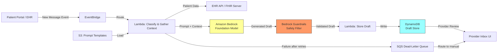

# Recipe 2.1 Architecture and Implementation: Patient Message Response Drafting

*Companion to [Recipe 2.1: Patient Message Response Drafting](chapter02.01-patient-message-response-drafting). This page covers the AWS architecture, services, prerequisites, and pseudocode. For the problem framing and the conceptual approach, start with the main recipe.*

---

## Why These Services

**Amazon Bedrock for LLM access.** Bedrock provides managed access to foundation models (Claude, Llama, Titan, and others) without managing infrastructure. For healthcare, the key advantages are: models run within your AWS account boundary, data is not used for model training, and Bedrock is on the HIPAA eligible services list with a signed BAA. You get API access to multiple model families and can switch between them without changing your application code.

Every prompt sent to Bedrock in this pipeline contains PHI (patient names, medications, clinical data). Bedrock processes this data under your BAA and does not retain it after inference. However, if you enable model invocation logging (recommended for audit), the logged prompts and responses are PHI. The S3 bucket receiving those logs must be encrypted with KMS, access-controlled, and subject to your PHI retention policy. Do not enable prompt caching for PHI-containing prompts unless the caching layer is also covered by your BAA.

**Amazon Bedrock Guardrails for safety filtering.** Rather than building custom safety checks from scratch, Bedrock Guardrails lets you define content policies, denied topics, and word filters that are applied automatically to model inputs and outputs. You can configure guardrails to block responses that contain clinical recommendations, medication suggestions, or other content that should only come from a provider. This is the safety check layer.

**AWS Lambda for orchestration.** The message processing pipeline is a short-lived, stateless workflow: receive a message event, classify intent, gather context, call Bedrock, validate the response, store the draft. Lambda handles this cleanly with automatic scaling as message volume fluctuates throughout the day.

**Amazon DynamoDB for draft storage and message metadata.** Drafts need to be stored with their associated metadata (original message, patient context used, model parameters, generation timestamp) for the provider review interface and for audit purposes. DynamoDB's key-value model fits the access pattern: lookup by message ID or by provider ID for their review queue.

**Amazon S3 for prompt template storage.** System prompts, few-shot examples, and provider-specific tone configurations are stored as versioned objects in S3. This lets you update prompts without redeploying code, A/B test different prompt versions, and maintain an audit trail of prompt changes.

**Amazon EventBridge for message routing.** When a new patient message arrives (from your EHR integration or patient portal), EventBridge routes it to the processing pipeline. This decouples the message source from the processing logic and lets you add additional consumers (analytics, routing rules) without modifying the core pipeline.

## Architecture Diagram



## Prerequisites

| Requirement | Details |
|-------------|---------|
| **AWS Services** | Amazon Bedrock, AWS Lambda, Amazon DynamoDB, Amazon S3, Amazon EventBridge |
| **Bedrock Model Access** | Request access to your chosen model (e.g., Anthropic Claude) in the Bedrock console |
| **IAM Permissions** | `bedrock:InvokeModel`, `bedrock:ApplyGuardrail`, `s3:GetObject`, `dynamodb:PutItem`, `dynamodb:Query`, `events:PutEvents`. Scope each permission to specific resource ARNs (prompt bucket, draft table, model ARN, guardrail ARN). If DLQ consumers read via code, add `sqs:ReceiveMessage` and `kms:Decrypt` scoped to the DLQ key. |
| **BAA** | AWS BAA signed (required: patient messages contain PHI) |
| **Bedrock Guardrails** | Configure a guardrail with denied topics (clinical recommendations, prescribing, diagnosis) and content filters. Enable both input filters (prompt-attack detection, denied-topic checks on input) and output filters for defense in depth. |
| **Lambda Runtime** | Set Lambda timeout to 30 seconds minimum (60 seconds recommended) to accommodate EHR context gathering (up to 3 seconds under load) and Bedrock inference (1.5-4 seconds for Claude Haiku with 300 max tokens). The default 3-second timeout will fail every invocation. Size memory at 512 MB floor; the extra CPU proportionally reduces JSON marshalling overhead on larger context objects. |
| **Encryption** | S3: SSE-KMS; DynamoDB: encryption at rest with customer-managed KMS key, plus TTL aligned with your PHI retention policy; SQS DLQ: SSE-KMS with customer-managed key (DLQ messages contain PHI and need parity with other PHI stores); all API calls over TLS; CloudWatch Logs: KMS encryption configured |
| **VPC** | Production: Lambda in VPC with VPC interface endpoints (PrivateLink) for Bedrock (`com.amazonaws.{region}.bedrock-runtime`, which covers both `InvokeModel` and `ApplyGuardrail`; there is no separate `bedrock-guardrails` endpoint), KMS, CloudWatch Logs, and SQS (required for code-initiated DLQ writes or any DLQ consumer running in the VPC). Gateway endpoints for S3 and DynamoDB. Interface endpoints require security groups allowing HTTPS (443) inbound from the Lambda subnet. If your EHR/FHIR server is external, Lambda needs a NAT Gateway or the EHR's PrivateLink endpoint for egress; mTLS is recommended for external EHR APIs carrying PHI. |
| **CloudTrail** | Enabled: log all Bedrock invocations for audit trail (who generated what, when) |
| **Model Invocation Logging** | Enable Bedrock model invocation logging to S3 for full prompt/response audit |
| **Sample Data** | Synthetic patient messages and mock EHR context. Never use real patient messages in dev. |
| **Cost Estimate** | Bedrock (Claude Haiku): ~$0.01-0.03 per message depending on context length. Lambda and DynamoDB negligible at typical message volumes. |

## Ingredients

| AWS Service | Role |
|------------|------|
| **Amazon Bedrock** | Foundation model inference for draft generation |
| **Bedrock Guardrails** | Content safety filtering on generated responses |
| **AWS Lambda** | Orchestrates classification, context assembly, generation, and storage |
| **Amazon DynamoDB** | Stores generated drafts, message metadata, and provider review status |
| **Amazon S3** | Stores prompt templates, few-shot examples, and provider tone configs |
| **Amazon EventBridge** | Routes incoming message events to the processing pipeline. EventBridge invokes Lambda via the Lambda service; the Lambda's VPC does not need an EventBridge endpoint for this flow. An endpoint is only required if the Lambda puts events back to EventBridge, which this pipeline does not. |
| **Amazon SQS** | Dead-letter queue for messages that fail processing after retries |
| **AWS KMS** | Manages encryption keys for all data stores |
| **Amazon CloudWatch** | Metrics on generation latency, guardrail interventions, and approval rates |

## Pseudocode Walkthrough

**Step 1: Classify message intent.** When a new patient message arrives, the first thing we do is figure out what they're asking about. This classification determines what context we need to gather and which prompt template to use. A refill request needs the patient's current medication list. An appointment question needs their upcoming schedule. A symptom question needs recent visit history. Getting this wrong means the draft will be grounded in irrelevant context, which means the provider will have to rewrite it from scratch. For routine messages, simple keyword and pattern matching works well. You don't need an LLM for this step.

Handle ambiguity explicitly. Messages that match multiple intents ("I'm running out of my lisinopril and also I've been having headaches") or match no intents are the cases that cause the most draft rework. Track which intents matched and their keyword-match counts during classification. When multiple intents match with similar counts, either pick a primary and record a warning, or route the message to manual triage. When nothing matches, still generate a draft but attach a `context_confidence: low` flag on the stored record so the provider review UI can surface "generated from minimal context, review carefully."

```text
INTENT_PATTERNS = {
    "refill": ["refill", "medication", "prescription", "renew", "ran out", "running low"],
    "appointment": ["appointment", "schedule", "reschedule", "cancel", "when is my"],
    "test_result": ["results", "lab", "blood work", "test", "came back"],
    "symptom": ["pain", "rash", "fever", "feeling", "symptoms", "hurts"],
    "billing": ["bill", "charge", "insurance", "copay", "payment"],
    "general": []  // fallback category
}

FUNCTION classify_message(message_text):
    // Normalize the message text for matching
    lower_text = lowercase(message_text)
    
    // Check each intent category's keywords against the message
    FOR each intent, keywords in INTENT_PATTERNS:
        FOR each keyword in keywords:
            IF keyword is found in lower_text:
                RETURN intent
    
    // If no keywords matched, classify as general inquiry
    RETURN "general"
```

**Step 2: Gather relevant patient context.** Based on the classified intent, pull the specific patient data that the model needs to generate a grounded response. This is targeted retrieval, not a chart dump. Including irrelevant context wastes tokens, increases cost, and can confuse the model into referencing information that isn't relevant to the patient's question. The context assembly is what separates a useful draft from a generic one. Skip this step and the model generates plausible-sounding responses that aren't grounded in the patient's actual situation.

A note on latency: EHR API response times vary enormously. A well-optimized FHIR server might respond in 200ms, but some endpoints under load take 1-3 seconds per call. If your FHIR server is slow, parallelize the queries or maintain a pre-fetched patient context cache (refreshed on clinical events) to keep end-to-end latency under 5 seconds. Any cache you add is a PHI store: encrypt at rest with KMS, enforce TLS in transit, deploy in the VPC, and set a TTL consistent with your PHI retention and staleness policies.

```text
FUNCTION gather_context(patient_id, intent):
    context = {}
    
    // Always include basic patient info for personalization
    context["patient_name"] = lookup patient first name from EHR
    context["provider_name"] = lookup assigned provider name
    
    // Pull intent-specific data from the EHR/FHIR server
    IF intent == "refill":
        context["current_medications"] = query active medication list for patient_id
        context["last_refill_dates"]   = query last fill date per medication
        context["pharmacy_on_file"]    = query preferred pharmacy
        
    ELSE IF intent == "appointment":
        context["upcoming_appointments"] = query next 3 scheduled appointments
        context["provider_availability"] = query next available slots (next 2 weeks)
        
    ELSE IF intent == "test_result":
        context["recent_results"] = query lab results from last 30 days
        context["pending_orders"] = query outstanding lab orders
        
    ELSE IF intent == "symptom":
        context["recent_visits"]       = query visits from last 90 days
        context["active_conditions"]   = query active problem list
        context["current_medications"] = query active medication list
        
    ELSE:
        // General inquiry: minimal context, let the model work from the message itself
        context["recent_visits"] = query visits from last 30 days
    
    RETURN context
```

**Step 3: Assemble the prompt.** This is where the magic happens (and where most implementations get it wrong). The prompt has three parts: a system prompt that defines behavior constraints, the patient context assembled in Step 2, and the actual patient message. The system prompt is the most important piece. It tells the model what it can and cannot do. Without explicit constraints, the model will try to be maximally helpful, which in a medical context means offering diagnoses, suggesting treatments, and generally doing things that only a licensed provider should do. The system prompt is your primary safety mechanism (Guardrails is your secondary one).

```text
FUNCTION build_prompt(message_text, intent, context, provider_preferences):
    // Load the base system prompt template from S3
    // This template defines the model's role, constraints, and tone
    system_prompt = load_from_s3("prompts/system-prompt-v2.txt")
    
    // The system prompt should contain instructions like:
    // - You are drafting a response for a healthcare provider to review
    // - Never diagnose conditions or suggest new treatments
    // - Never recommend medications not already in the patient's active list
    // - Never promise specific timelines unless confirmed in the context
    // - Keep responses warm, professional, and concise (under 150 words)
    // - Address the specific question asked; do not volunteer additional information
    // - If the question requires clinical judgment, say the provider will follow up
    
    // Load provider-specific tone preferences if available
    IF provider_preferences exists:
        system_prompt = system_prompt + "\n\nTone guidance: " + provider_preferences
        // Example: "Dr. Martinez prefers a warm, slightly informal tone. Uses first names.
        //           Signs off with 'Take care' rather than 'Sincerely.'"
    
    // Assemble the user message with context
    user_prompt = FORMAT:
        """
        Patient message intent: {intent}
        
        Relevant patient context:
        {format context as readable key-value pairs}
        
        Patient message:
        "{message_text}"
        
        Draft a response for the provider to review and send.
        """
    
    RETURN system_prompt, user_prompt
```

**Step 4: Generate the draft response.** Call the foundation model with the assembled prompt. Key parameters: use a low temperature (0.3-0.5) for consistency and predictability. Higher temperatures produce more creative and varied output, which is the opposite of what you want for healthcare communications. You want the same type of question to produce a similar style of response every time. Set a maximum token limit to prevent runaway generation. For routine messages, 200-300 tokens is plenty.

```text
FUNCTION generate_draft(system_prompt, user_prompt):
    // Call the foundation model via the managed LLM service
    response = call LLM service with:
        model_id     = "anthropic.claude-3-haiku"  // fast, cost-effective for routine messages
        system       = system_prompt
        messages     = [{ role: "user", content: user_prompt }]
        max_tokens   = 300          // cap response length; routine messages don't need novels
        temperature  = 0.3          // low temperature = more deterministic, consistent output
        top_p        = 0.9          // nucleus sampling; slightly constrained
        guardrail_id = "healthcare-message-guardrail"  // apply safety filtering
    
    // Check if the guardrail intervened
    IF response.guardrail_action == "BLOCKED":
        // The safety filter caught something problematic in the generated text.
        // This message needs manual drafting by the provider.
        RETURN { status: "blocked", reason: response.guardrail_reason }
    
    RETURN { status: "success", draft_text: response.content }
```

**Step 5: Store the draft for provider review.** Write the generated draft to the review queue along with all the metadata a provider needs to make a quick decision: the original message, the context that was used, and the model's output. Include the generation metadata (model version, prompt version, temperature) for quality monitoring and debugging. Never send the draft directly to the patient. The provider review step is non-negotiable.

Use a conditional write (e.g., only write if the message_id doesn't already exist) to make storage idempotent. If your event source delivers the same message twice (at-least-once delivery), you don't want duplicate drafts cluttering the provider's queue.

Two things that aren't in the pseudocode below but matter in production. First, the drafts table holds PHI on every field (original message, patient context, draft text, provider identity), so it needs a lifecycle policy. Configure DynamoDB TTL aligned with your organization's PHI retention policy. A common pattern is to keep drafts hot for 30-90 days (the window where quality review of approved and edited drafts is still useful), then archive to S3 Glacier with KMS encryption for your longer audit retention period. Drafts that fell through to manual drafting may warrant a different retention from approved drafts.

Second, the approval-rate metric you'll come to rely on in The Honest Take depends on capturing what the provider does next with each draft. Either extend this record with provider-action fields (`reviewed_ts`, `provider_action` one of `approved`/`edited`/`rejected`, `final_sent_text` for edited drafts, and a lightweight edit diff summary for prompt-drift tracking) or model the review events as an append-only log in a companion table keyed by `message_id`. The append-only log is friendlier to audit requirements because updates to the primary record tend to overwrite history. Without this capture layer, your north-star metric can't actually be computed. Also log guardrail interventions as safety events: a `DraftBlocked` CloudWatch metric dimensioned by guardrail policy, paralleling the `DraftGenerated` metric in the pseudocode below. The guardrail reason string may itself contain PHI (it often echoes the patient message), so treat it with the same handling as other PHI log fields.

```text
FUNCTION store_draft(message_id, patient_id, provider_id, original_message, 
                     intent, context_used, draft_result):
    // Write the complete draft record to the database
    write record to database table "message-drafts":
        message_id       = message_id                        // links to the original patient message
        patient_id       = patient_id                        // for access control and audit
        provider_id      = provider_id                       // routes to the right provider's queue
        original_message = original_message                  // what the patient wrote
        classified_intent = intent                           // how we categorized the message
        context_used     = context_used                      // what patient data informed the draft
        draft_text       = draft_result.draft_text           // the generated response
        draft_status     = "pending_review"                  // awaiting provider action
        generation_ts    = current UTC timestamp (ISO 8601)  // when the draft was created
        model_id         = "anthropic.claude-3-haiku"        // which model generated it
        prompt_version   = "v2"                              // which prompt template was used
        guardrail_id     = "healthcare-message-guardrail"    // which safety config was applied
    
    // Emit a metric for monitoring
    emit metric "DraftGenerated" with dimensions: intent, provider_id
    
    RETURN { draft_id: message_id, status: "pending_review" }
```

> **Curious how this looks in Python?** The pseudocode above covers the concepts. If you'd like to see sample Python code that demonstrates these patterns using boto3, check out the [Python Example](chapter02.01-python-example). It walks through each step with inline comments and notes on what you'd need to change for a real deployment.

## Expected Results

**Sample output for a medication refill request:**

```json
{
  "message_id": "msg-2026-05-01-00482",
  "patient_id": "pat-928471",
  "provider_id": "dr-martinez-001",
  "original_message": "Hi, I'm running low on my lisinopril 10mg. Can I get a refill sent to CVS?",
  "classified_intent": "refill",
  "context_used": {
    "current_medications": ["Lisinopril 10mg daily", "Metformin 500mg BID"],
    "last_refill_dates": {"Lisinopril 10mg": "2026-03-15"},
    "pharmacy_on_file": "CVS #4821, 123 Main St"
  },
  "draft_text": "Hi Sarah, I've sent a refill for your lisinopril 10mg to CVS on Main St. It should be ready for pickup within 24-48 hours. If you have any issues picking it up, just let us know. Take care, Dr. Martinez",
  "draft_status": "pending_review",
  "generation_ts": "2026-05-01T14:22:08Z",
  "model_id": "anthropic.claude-3-haiku",
  "prompt_version": "v2"
}
```

**Performance benchmarks:**

| Metric | Typical Value |
|--------|---------------|
| End-to-end latency (message to draft ready) | 2-4 seconds |
| Draft approval rate (sent without edits) | 60-75% for routine messages |
| Draft edit rate (minor modifications) | 15-25% |
| Draft rejection rate (rewritten from scratch) | 5-15% |
| Guardrail intervention rate | 3-8% of generations |
| Cost per message | $0.01-0.03 (model dependent) |
| Provider time saved per message | 1-3 minutes |

**Where it struggles:** Messages with multiple questions interleaved. Emotionally charged messages where tone calibration is critical. Messages referencing conversations that happened outside the portal (phone calls, in-person). Messages requiring clinical judgment ("should I go to the ER?"). Messages from patients with complex multi-provider care where context assembly is incomplete.

---

<!-- TODO (TechWriter): RECIPE-GUIDE requires a "Why This Isn't Production-Ready" section between Expected Results and Variations. Add content listing the gaps a production deployment must close. -->

## Variations and Extensions

**Multi-language support.** Many patient populations communicate in languages other than English. Add a language detection step before generation and include language-specific instructions in the system prompt. Most foundation models handle Spanish, Mandarin, Vietnamese, and other common languages well. Validate tone and medical terminology accuracy with native-speaking clinical staff before deploying.

**Smart routing for complex messages.** Instead of generating a draft for every message, add a complexity classifier that routes genuinely complex clinical questions directly to the provider's manual queue without attempting a draft. This keeps the approval rate high for drafted messages and avoids wasting compute on messages that will be rejected anyway. Indicators of complexity: multiple questions, emotional distress signals, references to new symptoms, mentions of other providers.

**Provider feedback loop.** Track which drafts get approved, edited, or rejected. Use the edit patterns to refine your prompts over time. If providers consistently add the same type of information (e.g., always adding "please call if symptoms worsen"), incorporate that pattern into the prompt template. This is a manual process initially but can be semi-automated with periodic prompt review.

**Model fallback for resilience.** If your primary model is unavailable (regional outage, quota exhausted, model deprecated), the entire pipeline stops. Configure a fallback model (e.g., Amazon Titan or a different Claude variant) and retry failed generations against it. Bedrock's multi-model access makes this straightforward. Test that your system prompt produces acceptable output on both models before relying on the fallback in production.

**Conversation grouping for same-patient message bursts.** Patients often send related messages in quick succession: "quick question about my refill" followed 30 seconds later by "forgot to mention, also I need a new prescription for my inhaler." The default pipeline treats these as two independent messages and generates two separate drafts in the provider's queue. Batch messages from the same patient within a short window (5 minutes works well) into a single draft generation. This improves draft quality (the model sees the full question) and reduces provider review burden (one thread instead of two unrelated drafts).

**Automated prompt rollback on approval-rate regression.** Prompt changes are deployments, and deployments regress sometimes. Build a rollback path alongside your A/B testing: if a new prompt version's approval rate drops below a threshold (e.g., 10 percentage points below the incumbent) over a meaningful sample, automatically route new messages back to the prior version. The draft records already store `prompt_version`, so the correlation is trivial once the provider-action data is flowing. For a safety-sensitive system, prompt promotion should look more like feature flags than deployments, and the rollback path matters more than the A/B mechanics.

---

## Additional Resources

**AWS Documentation:**
- [Amazon Bedrock User Guide](https://docs.aws.amazon.com/bedrock/latest/userguide/what-is-bedrock.html)
- [Amazon Bedrock Guardrails](https://docs.aws.amazon.com/bedrock/latest/userguide/guardrails.html)
- [Amazon Bedrock Model Invocation Logging](https://docs.aws.amazon.com/bedrock/latest/userguide/model-invocation-logging.html)
- [Amazon Bedrock Pricing](https://aws.amazon.com/bedrock/pricing/)
- [AWS HIPAA Eligible Services](https://aws.amazon.com/compliance/hipaa-eligible-services-reference/)
- [Architecting for HIPAA on AWS (Whitepaper)](https://docs.aws.amazon.com/whitepapers/latest/architecting-hipaa-security-and-compliance-on-aws/welcome.html)

**AWS Sample Repos:**
- [`amazon-bedrock-samples`](https://github.com/aws-samples/amazon-bedrock-samples): General Bedrock examples including guardrails configuration and RAG patterns
- [`amazon-bedrock-workshop`](https://github.com/aws-samples/amazon-bedrock-workshop): Hands-on workshop covering text generation, summarization, and agent patterns with Bedrock

**AWS Solutions and Blogs:**
- [Generative AI on AWS](https://aws.amazon.com/generative-ai/): Overview of AWS generative AI services and healthcare use cases

<!-- closed: V2: No verified Bedrock Guardrails blog URL found. The existing AWS documentation links (Bedrock Guardrails User Guide) adequately cover the topic. Removed rather than shipping a fabricated or mismatched URL. -->

---

## Estimated Implementation Time

| Tier | Timeline | What You Get |
|------|----------|--------------|
| **Basic** | 2-3 weeks | Single intent (refill requests), hardcoded prompt, basic DynamoDB storage, manual review via console |
| **Production-ready** | 6-8 weeks | Multi-intent classification, EHR integration, provider-specific tone, Guardrails configured, monitoring dashboard, provider review UI |
| **With variations** | 10-12 weeks | Multi-language, smart routing, feedback loop, A/B testing on prompts, analytics on approval rates |

---


---

*← [Main Recipe 2.1](chapter02.01-patient-message-response-drafting) · [Python Example](chapter02.01-python-example) · [Chapter Preface](chapter02-preface)*
