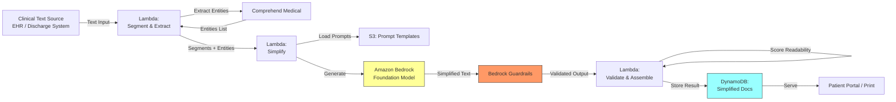

# Recipe 2.2 Architecture and Implementation: Medical Terminology Simplification

*Companion to [Recipe 2.2: Medical Terminology Simplification](chapter02.02-medical-terminology-simplification). This page covers the AWS architecture, services, prerequisites, and pseudocode. For the problem framing and the conceptual approach, start with the main recipe.*

---

## The AWS Implementation

### Why These Services

**Amazon Bedrock for LLM inference.** Bedrock provides managed access to foundation models that handle the text simplification task. The key advantage for healthcare: data stays within your AWS account boundary, is not used for model training, and Bedrock is HIPAA eligible with a signed BAA. For simplification, you want a model that follows instructions precisely (target reading level, preserve specific terms). Claude models excel at instruction-following for constrained transformation tasks.

**Amazon Bedrock Guardrails for output safety.** Configure guardrails to ensure the simplified output doesn't introduce clinical recommendations, doesn't remove medication safety information, and doesn't add disclaimers or caveats that weren't in the source. The guardrail acts as a structural check on the transformation.

**AWS Lambda for orchestration.** The simplification pipeline is stateless and short-lived: receive clinical text, segment it, call Bedrock for each segment, validate outputs, assemble the final document. Lambda handles this cleanly with per-invocation billing and automatic scaling.

**Amazon DynamoDB for result storage and caching.** Store simplified outputs keyed by a hash of the source text. If the same discharge instruction template gets simplified repeatedly (common for standard procedures), serve the cached version instead of calling Bedrock again. This reduces cost and latency for high-volume scenarios.

**Amazon S3 for prompt templates and terminology configs.** System prompts, reading level targets, and "preserve verbatim" term lists are stored as versioned S3 objects. Update simplification behavior without redeploying code.

**Amazon Comprehend Medical for entity extraction.** Before simplification, extract medical entities (medications, dosages, conditions, procedures) from the source text. After simplification, verify these entities still appear in the output. This is your automated preservation check.

### Architecture Diagram



### Prerequisites

| Requirement | Details |
|-------------|---------|
| **AWS Services** | Amazon Bedrock, Amazon Comprehend Medical, AWS Lambda, Amazon DynamoDB, Amazon S3 |
| **Bedrock Model Access** | Request access to your chosen model (e.g., Anthropic Claude) in the Bedrock console |
| **IAM Permissions** | `bedrock:InvokeModel`, `bedrock:ApplyGuardrail`, `comprehendmedical:DetectEntitiesV2`, `s3:GetObject`, `dynamodb:PutItem`, `dynamodb:GetItem`. Scope each to specific resource ARNs. |
| **BAA** | AWS BAA signed (required: clinical text contains PHI) |
| **Bedrock Guardrails** | Configure guardrail to block added clinical recommendations and ensure medication details are preserved |
| **Encryption** | S3: SSE-KMS; DynamoDB: encryption at rest with customer-managed KMS key; all API calls over TLS; CloudWatch Logs: KMS encryption. If Bedrock model-invocation-logging is enabled for quality monitoring, the logged prompts contain PHI (the system prompt embeds the `must_preserve` entity list). The invocation-log destination (S3 or CloudWatch Logs) must be KMS-encrypted and subject to the same retention controls as other PHI stores. |
| **VPC** | Production: Lambda in VPC with VPC endpoints for Bedrock (`com.amazonaws.{region}.bedrock-runtime`, which serves both `InvokeModel` and `ApplyGuardrail`; there is no separate guardrails endpoint), Comprehend Medical, S3, DynamoDB, KMS, and CloudWatch Logs. S3 and DynamoDB use free gateway endpoints (route-table based). Bedrock, Comprehend Medical, KMS, and CloudWatch Logs use interface endpoints (PrivateLink, billed per AZ per hour plus data processing, with a security group that allows HTTPS from the Lambda subnet). The KMS endpoint is non-optional: every S3 SSE-KMS read, DynamoDB CMK write, and CloudWatch Logs write makes a KMS API call, and a Lambda in a private subnet without the KMS endpoint will time out on the first S3 `GetObject`. |
| **Lambda Runtime** | Timeout 60 seconds minimum. The recipe's own end-to-end latency is 3-6 seconds per document under normal conditions, and multi-segment runs with guardrail evaluation can spike higher under Bedrock throttling. The default 3-second timeout will fail every invocation. Memory: 512 MB floor (SDK payloads and segment reassembly run poorly at 128 MB). |
| **CloudTrail** | Enabled: log all Bedrock and Comprehend Medical API calls for audit |
| **Sample Data** | Synthetic clinical text (discharge summaries, lab reports). Never use real patient documents in dev. |
| **Cost Estimate** | Comprehend Medical dominates total cost. At $0.01 per 100-character unit (first tier for `DetectEntitiesV2`), a 1-page discharge summary (~1,700 characters) is ~$0.17 per call. Bedrock Claude Haiku adds ~$0.002-0.01 for the simplification calls depending on length and segment count. Lambda, DynamoDB, and S3 are negligible. Uncached total for a 1-page document: ~$0.18-0.20. Cost scales roughly linearly with character count for multi-page documents. If caching is implemented (see Variations) and hits at the 30-50% rate shown in Expected Results, the amortized cost drops proportionally. |

### Ingredients

| AWS Service | Role |
|------------|------|
| **Amazon Bedrock** | Foundation model inference for text simplification |
| **Bedrock Guardrails** | Output safety filtering; prevents added clinical advice |
| **Amazon Comprehend Medical** | Extracts medical entities for preservation verification |
| **AWS Lambda** | Orchestrates segmentation, simplification, and validation |
| **Amazon DynamoDB** | Stores and caches simplified document outputs |
| **Amazon S3** | Stores prompt templates, term lists, and reading level configs |
| **AWS KMS** | Manages encryption keys for all data stores |
| **Amazon CloudWatch** | Metrics on simplification latency, readability scores, and preservation rates |

### Code

#### Walkthrough

**Step 0: Check the cache.** Before calling any inference APIs, compute a cache key from the source text and target reading level. If this exact document has been simplified before at this exact grade target, serve the cached result and skip all downstream steps. Standard discharge instruction templates (knee replacement, cataract surgery, colonoscopy) reuse boilerplate language that varies only in patient-specific details. Without this step, you pay full Comprehend Medical and Bedrock costs every time the same template shows up. The Expected Results section benchmarks this at 30-50% cache hit rate after warm-up, which translates directly to cost and latency savings at that same rate.

```pseudocode
FUNCTION check_cache(original_text, target_grade):
    // Compute a stable key from the source text and reading level target.
    // SHA-256 is deterministic and collision-resistant enough for a cache key.
    cache_key = SHA256(original_text + "|" + target_grade)

    // Look up in the results table. DynamoDB GetItem is single-digit
    // millisecond latency vs. 3-6 seconds for the full pipeline.
    cached = GET from "simplified-documents" WHERE cache_key = cache_key

    IF cached exists AND cached.simplified_text is not empty:
        RETURN { hit: true, result: cached }
    ELSE:
        RETURN { hit: false, cache_key: cache_key }
```

**Step 1: Extract medical entities from source text.** Before simplifying anything, identify the critical clinical content that must survive the transformation. Medication names, dosages, conditions, procedures, dates, and provider names are non-negotiable. If any of these get lost or altered during simplification, the output is unsafe. Amazon Comprehend Medical parses clinical text and returns structured entities with their categories and positions. We use this as our "preservation checklist" that gets verified after simplification. Skip this step and you have no way to automatically detect when simplification accidentally drops a medication or changes a dosage.

```pseudocode
FUNCTION extract_critical_entities(clinical_text):
    // Call Comprehend Medical to identify medical entities in the source text
    response = call ComprehendMedical.DetectEntitiesV2 with:
        Text = clinical_text
    
    // Build a preservation checklist: entities that MUST appear in the simplified output
    must_preserve = []
    
    FOR each entity in response.Entities:
        // Medications and dosages are always critical
        IF entity.Category == "MEDICATION":
            append to must_preserve: {
                text: entity.Text,           // e.g., "ticagrelor 90mg"
                category: "MEDICATION",
                preserve_verbatim: true      // don't simplify drug names or doses
            }
        
        // Specific medical conditions should be mentioned (can be explained)
        ELSE IF entity.Category == "MEDICAL_CONDITION":
            append to must_preserve: {
                text: entity.Text,           // e.g., "myocardial infarction"
                category: "CONDITION",
                preserve_verbatim: false     // can be translated but must be referenced
            }
        
        // Procedures should be mentioned
        ELSE IF entity.Category == "TEST_TREATMENT_PROCEDURE":
            append to must_preserve: {
                text: entity.Text,           // e.g., "percutaneous coronary intervention"
                category: "PROCEDURE",
                preserve_verbatim: false     // can be explained in plain language
            }
        
        // Dosage and frequency info is always verbatim
        ELSE IF entity.Category == "DOSAGE" OR entity.Category == "FREQUENCY":
            append to must_preserve: {
                text: entity.Text,           // e.g., "90mg" or "twice daily"
                category: "DOSAGE_FREQ",
                preserve_verbatim: true
            }
    
    RETURN must_preserve
```

**Step 2: Segment the clinical text.** Different parts of a clinical document need different simplification approaches. A medication list needs dosages preserved verbatim with plain-language explanations added alongside. A diagnosis narrative needs conceptual translation. Follow-up instructions need to become clear action items. Segmenting first lets you apply the right prompt and constraints to each section. Without segmentation, you're asking the model to handle everything uniformly, which leads to either over-simplified medication sections or under-simplified narrative sections.

The classifier shown below is deliberately simple: keyword-based, first-match-wins. That's fine for a teaching example but worth knowing about. A section like "Please take this medication and follow up in 2 weeks" hits both `medications` and `instructions` keywords, and whichever iterates first wins. Misclassification matters because it changes which preservation rules the prompt carries. A medication list classified as `narrative` loses the verbatim-dosage constraint. For production, track how many keywords matched and for which types, apply the stricter prompt when ties occur (prefer `medications` over `instructions`), or replace the keyword classifier with a small learned model (TF-IDF + logistic regression, or a distilled transformer fine-tuned on labeled segments). See Variations.

```pseudocode
SEGMENT_TYPES = {
    "medications":   ["medication", "prescription", "drug", "dose", "mg", "tablet"],
    "diagnosis":     ["diagnosis", "assessment", "impression", "condition"],
    "instructions":  ["follow up", "follow-up", "return", "call if", "go to", "schedule"],
    "results":       ["result", "lab", "level", "value", "range", "normal"]
}

FUNCTION segment_document(clinical_text):
    // Split the document into logical sections
    // Most clinical documents use headers or blank lines as separators
    raw_sections = split clinical_text by paragraph breaks or section headers
    
    segments = []
    
    FOR each section in raw_sections:
        // Classify this section by its content type
        section_lower = lowercase(section)
        matched_type = "narrative"  // default: general clinical narrative
        
        FOR each seg_type, keywords in SEGMENT_TYPES:
            FOR each keyword in keywords:
                IF keyword is found in section_lower:
                    matched_type = seg_type
                    BREAK
        
        append to segments: {
            text: section,
            type: matched_type,
            index: position in document  // preserve ordering for reassembly
        }
    
    RETURN segments
```

**Step 3: Simplify each segment with type-specific constraints.** This is the core transformation step. Each segment gets a tailored system prompt that tells the model exactly how to handle that content type. Medication segments get instructions to preserve drug names and dosages verbatim while adding plain-language explanations. Diagnosis segments get instructions to translate medical terms into everyday language. Instruction segments get rewritten as clear action items. The reading level target (default: 6th grade Flesch-Kincaid) is enforced across all segment types. The "must_preserve" list from Step 1 is included in the prompt so the model knows which terms are untouchable.

Two things worth noting about the guardrail call. First, when the source text comes from untrusted channels (OCR of handwritten notes, patient-supplied free text, addenda copy-pasted from a portal), configure the Bedrock Guardrail with input-side prompt-attack filters in addition to the output filters shown here. Input filtering catches injection attempts before the model sees the manipulated text, which is a cheap defense-in-depth layer for PHI-carrying pipelines. Second, treat guardrail blocks as safety events: emit a distinct CloudWatch metric (e.g., `SegmentBlockedByGuardrail`) with dimensions for segment type and triggered policy so you can monitor which content triggers which policies and at what rate. Do not log the raw `guardrail_reason` string unredacted, because it may echo PHI from the blocked segment.

```pseudocode
TARGET_READING_LEVEL = "6th grade (Flesch-Kincaid)"

SIMPLIFICATION_PROMPTS = {
    "medications": """
        Rewrite this medication information for a patient reading at a {level} level.
        RULES:
        - Keep all medication names exactly as written (do not rename drugs)
        - Keep all dosages exactly as written (do not change numbers or units)
        - Keep all frequency instructions exactly as written
        - Add a brief plain-language explanation of what each medication does
        - Use short sentences
        - Do not add warnings or side effects not mentioned in the source
    """,
    "diagnosis": """
        Rewrite this diagnosis information for a patient reading at a {level} level.
        RULES:
        - Translate medical terms into everyday language
        - After using a plain term, include the medical term in parentheses once
        - Explain what the condition means for the patient in practical terms
        - Do not add prognosis information not stated in the source
        - Do not minimize or dramatize the condition
        - Use short sentences
    """,
    "instructions": """
        Rewrite these follow-up instructions for a patient reading at a {level} level.
        RULES:
        - Convert to clear action items (what to do, when to do it, who to contact)
        - Keep all dates, times, and provider names exactly as written
        - Keep all phone numbers exactly as written
        - Use numbered steps where appropriate
        - Highlight urgency cues ("call immediately if...") clearly
        - Use short sentences
    """,
    "results": """
        Rewrite these test results for a patient reading at a {level} level.
        RULES:
        - Keep all numbers and units exactly as written
        - Explain what each test measures in plain language
        - Explain whether results are normal, high, or low if that info is in the source
        - Do not interpret results beyond what the source states
        - Use short sentences
    """,
    "narrative": """
        Rewrite this clinical text for a patient reading at a {level} level.
        RULES:
        - Translate medical terms into everyday language
        - Keep all names, dates, and numbers exactly as written
        - Use short sentences
        - Do not add information not in the source
    """
}

FUNCTION simplify_segment(segment, must_preserve, reading_level):
    // Select the appropriate prompt template for this segment type
    prompt_template = SIMPLIFICATION_PROMPTS[segment.type]
    
    // Build the system prompt with reading level and preservation rules
    system_prompt = FORMAT prompt_template with level = reading_level
    
    // Add the preservation list to the prompt
    system_prompt = system_prompt + "\n\nThe following terms MUST appear in your output unchanged: "
    FOR each entity in must_preserve WHERE entity.preserve_verbatim == true:
        system_prompt = system_prompt + entity.text + ", "
    
    // Call the foundation model
    response = call LLM service with:
        model_id     = "anthropic.claude-3-haiku"   // fast and cost-effective for transformation
        system       = system_prompt
        messages     = [{ role: "user", content: segment.text }]
        max_tokens   = length(segment.text) * 2     // allow expansion for explanations
        temperature  = 0.2                          // low temp for consistent transformations
        guardrail_id = "terminology-simplification-guardrail"
    
    IF response.guardrail_action == "BLOCKED":
        // Guardrail caught something problematic; return source unchanged with a flag
        RETURN { text: segment.text, simplified: false, reason: response.guardrail_reason }
    
    RETURN { text: response.content, simplified: true, segment_type: segment.type }
```

**Step 4: Validate readability and preservation.** This is the automated quality gate. Two checks run on every simplified segment. First: does the output actually meet the target reading level? Readability formulas (Flesch-Kincaid, SMOG) calculate a grade level from sentence length and word complexity. If the simplified text still reads at a 12th-grade level, it failed. Second: do all critical entities from Step 1 still appear in the output? If the source mentioned "ticagrelor 90mg BID" and the simplified version doesn't contain "ticagrelor" or "90mg," something got lost. Both checks are deterministic and fast. No LLM needed. Segments that fail either check get flagged for human review or re-simplification with a more aggressive prompt.

```pseudocode
FUNCTION validate_output(simplified_segment, must_preserve, target_grade):
    issues = []
    
    // Check 1: Readability score
    // Flesch-Kincaid Grade Level formula:
    // 0.39 * (total words / total sentences) + 11.8 * (total syllables / total words) - 15.59
    grade_level = calculate_flesch_kincaid_grade(simplified_segment.text)
    
    IF grade_level > target_grade + 2:  // allow 2 grades of tolerance
        append to issues: {
            type: "readability",
            detail: "Output reads at grade " + grade_level + ", target is " + target_grade,
            severity: "warning"
        }
    
    IF grade_level > target_grade + 4:  // hard fail if way over target
        append to issues: {
            type: "readability",
            detail: "Output reads at grade " + grade_level + ", far above target " + target_grade,
            severity: "error"
        }
    
    // Check 2: Entity preservation
    // Verify that critical terms from the source appear in the output
    simplified_lower = lowercase(simplified_segment.text)
    
    FOR each entity in must_preserve:
        IF entity.preserve_verbatim == true:
            // Exact match required for medications, dosages, dates
            IF lowercase(entity.text) NOT found in simplified_lower:
                append to issues: {
                    type: "preservation",
                    detail: "Missing verbatim entity: " + entity.text,
                    severity: "error"  // missing medication/dosage is always an error
                }
        ELSE:
            // For conditions and procedures, check if either the original term
            // or a reasonable plain-language equivalent appears
            // (This is a heuristic; perfect verification would need NLI models)
            IF lowercase(entity.text) NOT found in simplified_lower:
                // The medical term isn't there verbatim, which is fine
                // (it may have been translated to plain language)
                // Flag as warning for spot-check, not error
                append to issues: {
                    type: "preservation",
                    detail: "Medical term not found verbatim (may be translated): " + entity.text,
                    severity: "info"
                }
    
    // Determine overall validation result
    has_errors = any issue in issues WHERE severity == "error"
    
    RETURN {
        valid: NOT has_errors,
        grade_level: grade_level,
        issues: issues
    }
```

**Step 5: Assemble and store the simplified document.** Reassemble the individually simplified segments into a complete document, maintaining the original ordering. Store the result with metadata for audit: what source text was simplified, what reading level was achieved, which entities were preserved, and whether any segments required fallback to the original. The cache key (a hash of the source text plus target reading level) enables serving cached results for repeated simplification of the same content, which is common for standard discharge instruction templates.

The stored records are PHI from end to end: original text, simplified text, medication lists, and condition names all live in the table. Define a retention policy explicitly rather than letting the table grow forever. A common pattern is DynamoDB TTL for hot retention matching the patient portal access window (typically 6-12 months), archival of older records to S3 Glacier under a customer-managed KMS key for longer-term audit, and a deletion path that can act on patient-initiated data-subject requests under state privacy laws. Under HIPAA's minimum-necessary principle, "we kept it because the cache was warm" is not a retention rationale.

```pseudocode
FUNCTION assemble_and_store(original_text, simplified_segments, validation_results, 
                            must_preserve, target_grade):
    // Reassemble segments in original document order
    final_document = ""
    segments_needing_review = []
    
    FOR each segment in simplified_segments (ordered by segment.index):
        validation = validation_results[segment.index]
        
        IF validation.valid:
            final_document = final_document + segment.text + "\n\n"
        ELSE:
            // Segment failed validation; include original with a flag
            final_document = final_document + segment.text + "\n\n"
            append to segments_needing_review: {
                index: segment.index,
                issues: validation.issues
            }
    
    // Calculate overall document readability
    overall_grade = calculate_flesch_kincaid_grade(final_document)
    
    // Generate cache key for future lookups
    cache_key = hash(original_text + "|" + target_grade)
    
    // Store the result
    write record to database table "simplified-documents":
        cache_key          = cache_key
        original_text      = original_text
        simplified_text    = final_document
        target_grade       = target_grade
        achieved_grade     = overall_grade
        entities_preserved = must_preserve
        segments_reviewed  = segments_needing_review
        needs_review       = (length of segments_needing_review > 0)
        created_at         = current UTC timestamp (ISO 8601)
        model_id           = "anthropic.claude-3-haiku"
        prompt_version     = "v1"
    
    // Emit metrics
    emit metric "SimplificationCompleted" with dimensions: target_grade, achieved_grade
    IF length(segments_needing_review) > 0:
        emit metric "SimplificationNeedsReview" with count: length(segments_needing_review)
    
    RETURN {
        simplified_text: final_document,
        achieved_grade: overall_grade,
        needs_review: (length of segments_needing_review > 0),
        cache_key: cache_key
    }
```

> **Curious how this looks in Python?** The pseudocode above covers the concepts. If you'd like to see sample Python code that demonstrates these patterns using boto3, check out the [Python Example](chapter02.02-python-example). It walks through each step with inline comments and notes on what you'd need to change for a real deployment.

### Expected Results

**Sample output for a cardiac discharge summary:**

Source text:
> Patient presented with acute ST-elevation myocardial infarction of the LAD territory. Percutaneous coronary intervention performed with drug-eluting stent placement. Initiated dual antiplatelet therapy with aspirin 81mg and ticagrelor 90mg BID.

Simplified output (6th grade target):
> You had a heart attack (myocardial infarction). This means a blood vessel in your heart got blocked, which damaged part of your heart muscle. Your doctor opened the blocked vessel and placed a small tube called a stent to keep it open. You are now taking two medicines to prevent blood clots: aspirin 81mg once a day, and ticagrelor 90mg twice a day. It is very important to take both medicines exactly as directed.

```json
{
  "cache_key": "a8f3c2e1...",
  "target_grade": 6,
  "achieved_grade": 5.8,
  "entities_preserved": [
    {"text": "aspirin 81mg", "found": true},
    {"text": "ticagrelor 90mg", "found": true},
    {"text": "BID", "found_as": "twice a day"},
    {"text": "myocardial infarction", "found": true},
    {"text": "percutaneous coronary intervention", "found_as": "opened the blocked vessel"}
  ],
  "needs_review": false,
  "segments_simplified": 3,
  "segments_failed_validation": 0
}
```

**Performance benchmarks:**

| Metric | Typical Value |
|--------|---------------|
| End-to-end latency | 3-6 seconds per document |
| Readability target hit rate | 85-92% of segments on first pass |
| Entity preservation rate | 95-99% for verbatim entities |
| Cost per document (1-page discharge summary, uncached) | ~$0.18-0.20 (Comprehend Medical ~$0.17 + Bedrock ~$0.002-0.01) |
| Cache hit rate (standard templates) | 30-50% after warm-up |
| Throughput | ~20 documents/second (Lambda concurrency limited) |

**Where it struggles:** Very long documents (>3 pages) where context window limits force aggressive chunking. Highly specialized subspecialty text (genetics reports, pathology findings) where even the "simplified" version requires domain knowledge. Documents mixing multiple languages. Handwritten addenda that were OCR'd with errors in the source text (garbage in, garbage out).

---

## Why This Isn't Production-Ready

**No retry loop on validation failure.** When a segment fails the readability check, this pipeline flags it and moves on. A production system re-prompts with more aggressive instructions (shorter sentences, more substitution) up to a retry limit before escalating to human review. Expect 50-70% of flagged segments to pass on retry with a stricter prompt, which means your current "needs_review" rate is artificially high.

**Naive entity matching.** The preservation check uses case-insensitive substring matching. This produces false negatives when punctuation differs ("aspirin 81 mg" vs. "aspirin 81mg") and can't verify that a translated term ("heart attack") actually corresponds to the original concept ("myocardial infarction"). Production needs tokenized matching with a small edit-distance threshold and a maintained synonym allowlist.

**No dead-letter queue.** Every external call (Bedrock, Comprehend Medical, DynamoDB) can fail transiently. This pipeline surfaces those failures as Lambda errors. Production routes failed documents to an SQS dead-letter queue for retry and alerting, rather than losing the simplification request entirely.

**Single-pass segmentation.** The keyword classifier is first-match-wins. Ambiguous sections (medication instructions that mention follow-up timing) get classified by whichever keyword list iterates first. A production classifier should score all matches and apply the stricter prompt on ties, or use a small trained model.

**No prompt versioning or A/B testing.** Prompts are baked into the pseudocode. Production stores them in versioned S3 objects, routes a percentage of traffic to new versions, and tracks readability scores per version to detect regressions before promoting.

**No human review workflow.** Flagged segments get stored in DynamoDB but nothing consumes them. Production feeds flagged documents to an SQS queue backing a review UI where health literacy specialists edit, approve, or reject. Track reviewer edit distance over time to identify prompt weaknesses.

**No long-document chunking.** Comprehend Medical's 20,000-character limit and Bedrock's context window both require chunking for multi-page documents. This pipeline assumes everything fits in a single call. Hospital course narratives regularly exceed these limits.

---

## Variations and Extensions

**Multi-language simplification.** After simplifying to plain English, translate the output to the patient's preferred language. This is a two-step pipeline: simplify first (because simplifying complex medical text in a non-English language is harder than simplifying in English then translating the simple version). Validate readability in the target language using language-appropriate readability formulas.

**Interactive reading level adjustment.** Build a patient-facing interface where the reader can request "explain this more simply" for specific paragraphs. Each click re-simplifies that paragraph at a lower reading level, progressively revealing more explanation. This handles the reality that different patients need different levels of detail for different sections.

**EHR-integrated simplification.** Trigger simplification automatically when a provider signs a discharge summary or when lab results are released to the patient portal. The simplified version appears alongside the original in the patient's chart, with a toggle between "clinical view" and "patient view." This removes the manual step of someone deciding to simplify a document.

---

## Additional Resources

**AWS Documentation:**
- [Amazon Bedrock User Guide](https://docs.aws.amazon.com/bedrock/latest/userguide/what-is-bedrock.html)
- [Amazon Bedrock Guardrails](https://docs.aws.amazon.com/bedrock/latest/userguide/guardrails.html)
- [Amazon Comprehend Medical Documentation](https://docs.aws.amazon.com/comprehend-medical/latest/dev/comprehendmedical-welcome.html)
- [Amazon Comprehend Medical DetectEntitiesV2 API](https://docs.aws.amazon.com/comprehend-medical/latest/api/API_DetectEntitiesV2.html)
- [Amazon Bedrock Pricing](https://aws.amazon.com/bedrock/pricing/)
- [Amazon Comprehend Medical Pricing](https://aws.amazon.com/comprehend-medical/pricing/)
- [AWS HIPAA Eligible Services](https://aws.amazon.com/compliance/hipaa-eligible-services-reference/)

**AWS Sample Repos:**
- [`amazon-bedrock-samples`](https://github.com/aws-samples/amazon-bedrock-samples): General Bedrock examples including text transformation and guardrails configuration
- [`amazon-comprehend-medical-fhir-integration`](https://github.com/aws-samples/amazon-comprehend-medical-fhir-integration): Comprehend Medical integration patterns for healthcare data extraction
- [`amazon-bedrock-workshop`](https://github.com/aws-samples/amazon-bedrock-workshop): Hands-on workshop covering text generation and transformation patterns

**AWS Solutions and Blogs:**
- [AWS for Healthcare & Life Sciences](https://aws.amazon.com/health/): Overview of AWS services and generative AI solutions for healthcare and life sciences
- [Using Amazon Comprehend Medical and LLMs for healthcare and life sciences (AWS Prescriptive Guidance)](https://docs.aws.amazon.com/prescriptive-guidance/latest/generative-ai-nlp-healthcare/introduction.html): Reference patterns for combining Comprehend Medical with foundation models on clinical text, including summarization and extraction workflows that parallel this recipe's pipeline

---

## Estimated Implementation Time

| Tier | Timeline | What You Get |
|------|----------|--------------|
| **Basic** | 1-2 weeks | Single document type, fixed reading level, no caching, manual validation review |
| **Production-ready** | 4-6 weeks | Multi-segment pipeline, Comprehend Medical preservation checks, readability validation, DynamoDB caching, monitoring dashboard |
| **With variations** | 8-10 weeks | Multi-language support, configurable reading levels per document type, EHR integration triggers, interactive patient-facing UI |

---

---

*← [Main Recipe 2.2](chapter02.02-medical-terminology-simplification) · [Python Example](chapter02.02-python-example) · [Chapter Preface](chapter02-preface)*
