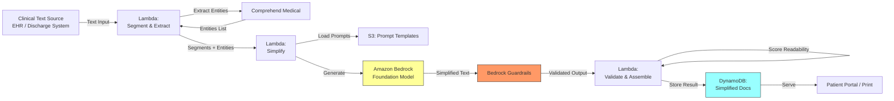

<!--
Editorial pass (TechEditor, 2026-05-11):
- Corrected the per-document cost estimate: Comprehend Medical dominates and was omitted from the top-line number (expert review A2).
- Added KMS VPC endpoint and interface-vs-gateway distinction to Prerequisites (S1/N1/N2).
- Added Bedrock endpoint name (bedrock-runtime) and noted it serves both InvokeModel and ApplyGuardrail (N3).
- Added Lambda timeout and memory row to Prerequisites (A1).
- Added note on Bedrock model-invocation-logging PHI to Encryption row (S4).
- Revised The Honest Take's retry-loop claim to match the current single-pass behavior (A4).
- Removed the Architecture Diagram's second Comprehend Medical arrow, which disagreed with Step 4's string-matching logic (A3).
- Added a parenthetical on segment-classifier ambiguity in Step 2 (A6).
- Added input-side Guardrails note for untrusted sources in Step 3 (S2).
- Added PHI retention / TTL guidance to Step 5 (S3).
- Added guardrail-event metric note to Step 3 (S5).
- Replaced two broken URLs in Additional Resources; removed the V2 inline TODO (V2).
- Preserved the V3 TODO on Recipe 8.1 cross-reference for the book-wide sweep.
- Flagged remaining structural items (cache lookup step, classifier upgrade, retry loop) as TODOs for TechWriter (A4, A5, A6).
-->

# Recipe 2.2: Medical Terminology Simplification

**Complexity:** Simple · **Phase:** MVP · **Estimated Cost:** ~$0.15–0.30 per document (Comprehend Medical dominates; see Prerequisites for breakdown)

---

## The Problem

A patient gets discharged from the hospital after a cardiac event. They're handed a sheet of paper that says: "Patient presented with acute ST-elevation myocardial infarction of the LAD territory. Percutaneous coronary intervention performed with drug-eluting stent placement. Initiated dual antiplatelet therapy with aspirin 81mg and ticagrelor 90mg BID. Echocardiogram demonstrated EF of 45% with apical hypokinesis. Follow up with cardiology in 2 weeks for reassessment of ventricular function."

The patient nods, walks to their car, and has absolutely no idea what just happened to them.

This is not a rare scenario. It is the default state of patient communication in healthcare. Clinical documentation is written by clinicians for clinicians. The vocabulary is precise, efficient, and completely opaque to the average person reading at an 8th grade level (which is the median adult reading level in the United States, per the National Assessment of Adult Literacy).

The consequences are measurable. Patients who don't understand their discharge instructions are 30% more likely to be readmitted within 30 days. Patients who can't parse their medication instructions make dosing errors. Patients who don't understand their diagnosis delay follow-up care because they don't realize it's urgent.

Health literacy is not about intelligence. A PhD in literature still won't know what "apical hypokinesis" means. The problem is domain-specific jargon, and the solution is translation: taking clinically precise language and rewriting it in plain terms without losing the meaning that matters.

This is a perfect LLM use case. The source text provides strong guardrails (you're transforming, not generating from nothing). The output is educational, not clinical decision-making. Validation is straightforward (readability scores, clinical accuracy review). And the impact on patient outcomes is well-documented.

---

## The Technology: Text Simplification with Large Language Models

### What Text Simplification Actually Is

Text simplification is a subfield of natural language processing focused on rewriting text to make it easier to understand while preserving its core meaning. It's been studied since the 1990s, long before LLMs existed. Early approaches used rule-based systems: replace long words with short synonyms, split complex sentences into simple ones, remove parenthetical clauses.

Those rule-based systems worked poorly for medical text because medical terminology isn't just "long words." It's a precise vocabulary where each term encodes specific clinical meaning. "Myocardial infarction" isn't just a fancy way to say "heart attack." It specifies that heart muscle tissue died due to blocked blood supply. A naive synonym replacement loses that specificity. A good simplification preserves it: "You had a heart attack. This means part of your heart muscle was damaged because a blood vessel got blocked."

Modern LLMs handle this task remarkably well because they've absorbed both the clinical vocabulary and the plain-language explanations during training. They can perform the translation while maintaining semantic fidelity in a way that rule-based systems never could.

### Why LLMs Excel at This

Three properties make LLMs particularly good at medical text simplification:

**Contextual understanding.** The model understands that "EF of 45%" in the context of a cardiac discharge means "your heart is pumping less efficiently than normal" rather than just translating the abbreviation. It can infer what matters to the patient from the clinical context.

**Graduated simplification.** You can instruct the model to target a specific reading level. A 5th-grade version looks different from an 8th-grade version, which looks different from a "college-educated non-medical professional" version. The same source text can produce multiple outputs calibrated to different audiences.

**Preservation of structure.** LLMs can maintain the logical flow of the original document (diagnosis first, then treatment, then follow-up) while simplifying the language at each step. They don't just swap words; they restructure sentences for clarity while keeping the information architecture intact.

### The Failure Modes

**Over-simplification.** The model strips out clinically important details in pursuit of readability. "Take ticagrelor 90mg twice daily" becomes "take your heart medicine" which is useless if the patient has four heart medicines.

**Hallucinated explanations.** The model adds explanatory context that isn't in the source text and might be wrong. "Your EF is 45%" becomes "Your heart is pumping at 45% efficiency, which is slightly below the normal range of 55-70%. This is likely due to the damage from your heart attack and should improve over the next 3-6 months." That last sentence might be true, might not be. It wasn't in the source.

**Inconsistent terminology.** The model uses different plain-language terms for the same clinical concept in different parts of the document. "Heart attack" in paragraph one becomes "cardiac event" in paragraph three. Patients notice this and get confused about whether these are the same thing.

**Cultural assumptions.** Plain language isn't universal. Idioms, metaphors, and analogies that work for one cultural context may confuse another. "Your heart is like a pump that's not working at full capacity" assumes familiarity with mechanical pumps.

**Loss of actionable specifics.** Medication names, dosages, and timing are the most important details for patient safety. An overly aggressive simplification might convert "aspirin 81mg daily" to "a small daily aspirin" which loses the dosage information the patient actually needs.

### Where the Field Is Now (2026)

The tooling for controlled text transformation has matured significantly:

- System prompts reliably constrain simplification behavior (what to preserve, what to simplify, target reading level)
- Readability scoring algorithms (Flesch-Kincaid, SMOG, Coleman-Liau) provide automated validation of output reading level
- Medical terminology databases (UMLS, SNOMED CT) enable verification that clinical concepts are preserved in the output
- Guardrails can enforce that specific content types (medication names, dosages, dates, provider names) pass through unchanged

The gap between "impressive demo" and "reliable production system" is smaller here than for most LLM applications because the task is so well-constrained. You have source text. You have measurable output criteria. You have straightforward validation. This is about as safe as LLM applications get.

---

## General Architecture Pattern

The pipeline at a conceptual level:

```
[Clinical Text] → [Segment by Type] → [Simplify with Constraints] → [Validate Readability] → [Verify Preservation] → [Output]
```

**Segment by Type.** Not all parts of a clinical document should be simplified the same way. Medication lists need dosages preserved verbatim. Diagnosis explanations need conceptual translation. Follow-up instructions need action items made crystal clear. Segmenting the document first lets you apply different simplification strategies to different content types.

**Simplify with Constraints.** Pass each segment to the LLM with specific instructions: target reading level, terms that must be preserved verbatim (medication names, dosages, dates, provider names), maximum output length, and whether to add brief explanations of medical terms or just replace them.

**Validate Readability.** Run the output through readability scoring algorithms. If the simplified text still scores above your target grade level, flag it for re-simplification or manual review. This is your automated quality gate.

**Verify Preservation.** Check that critical content from the source appears in the output. Medication names, dosages, appointment dates, and provider names should survive simplification unchanged. If any are missing or altered, flag for review.

**Output.** The simplified document is ready for delivery to the patient through whatever channel your organization uses: patient portal, printed handout, or integration with the EHR's patient education system.

The key design principle: simplification is a transformation with verifiable properties. You can measure whether the output is simpler (readability scores). You can verify whether critical content survived (entity matching). This makes it far easier to validate than open-ended generation tasks.


---

## The AWS Implementation

### Why These Services

**Amazon Bedrock for LLM inference.** Bedrock provides managed access to foundation models that handle the text simplification task. The key advantage for healthcare: data stays within your AWS account boundary, is not used for model training, and Bedrock is HIPAA eligible with a signed BAA. For simplification, you want a model that follows instructions precisely (target reading level, preserve specific terms). Claude models excel at instruction-following for constrained transformation tasks.

**Amazon Bedrock Guardrails for output safety.** Configure guardrails to ensure the simplified output doesn't introduce clinical recommendations, doesn't remove medication safety information, and doesn't add disclaimers or caveats that weren't in the source. The guardrail acts as a structural check on the transformation.

**AWS Lambda for orchestration.** The simplification pipeline is stateless and short-lived: receive clinical text, segment it, call Bedrock for each segment, validate outputs, assemble the final document. Lambda handles this cleanly with per-invocation billing and automatic scaling.

**Amazon DynamoDB for result storage and caching.** Store simplified outputs keyed by a hash of the source text. If the same discharge instruction template gets simplified repeatedly (common for standard procedures), serve the cached version instead of calling Bedrock again. This reduces cost and latency for high-volume scenarios.

**Amazon S3 for prompt templates and terminology configs.** System prompts, reading level targets, and "preserve verbatim" term lists are stored as versioned S3 objects. Update simplification behavior without redeploying code.

**Amazon Comprehend Medical for entity extraction.** Before simplification, extract medical entities (medications, dosages, conditions, procedures) from the source text. After simplification, verify these entities still appear in the output. This is your automated preservation check.

### Architecture Diagram



### Prerequisites

| Requirement | Details |
|-------------|---------|
| **AWS Services** | Amazon Bedrock, Amazon Comprehend Medical, AWS Lambda, Amazon DynamoDB, Amazon S3 |
| **Bedrock Model Access** | Request access to your chosen model (e.g., Anthropic Claude) in the Bedrock console |
| **IAM Permissions** | `bedrock:InvokeModel`, `bedrock:ApplyGuardrail`, `comprehendmedical:DetectEntitiesV2`, `s3:GetObject`, `dynamodb:PutItem`, `dynamodb:GetItem`. Scope each to specific resource ARNs. |
| **BAA** | AWS BAA signed (required: clinical text contains PHI) |
| **Bedrock Guardrails** | Configure guardrail to block added clinical recommendations and ensure medication details are preserved |
| **Encryption** | S3: SSE-KMS; DynamoDB: encryption at rest with customer-managed KMS key; all API calls over TLS; CloudWatch Logs: KMS encryption. If Bedrock model-invocation-logging is enabled for quality monitoring, the logged prompts contain PHI (the system prompt embeds the `must_preserve` entity list). The invocation-log destination (S3 or CloudWatch Logs) must be KMS-encrypted and subject to the same retention controls as other PHI stores. |
| **VPC** | Production: Lambda in VPC with VPC endpoints for Bedrock (`com.amazonaws.{region}.bedrock-runtime`, which serves both `InvokeModel` and `ApplyGuardrail`; there is no separate guardrails endpoint), Comprehend Medical, S3, DynamoDB, KMS, and CloudWatch Logs. S3 and DynamoDB use free gateway endpoints (route-table based). Bedrock, Comprehend Medical, KMS, and CloudWatch Logs use interface endpoints (PrivateLink, billed per AZ per hour plus data processing, with a security group that allows HTTPS from the Lambda subnet). The KMS endpoint is non-optional: every S3 SSE-KMS read, DynamoDB CMK write, and CloudWatch Logs write makes a KMS API call, and a Lambda in a private subnet without the KMS endpoint will time out on the first S3 `GetObject`. |
| **Lambda config** | Timeout 60 seconds minimum. The recipe's own end-to-end latency is 3-6 seconds per document under normal conditions, and multi-segment runs with guardrail evaluation can spike higher under Bedrock throttling. The default 3-second timeout will fail every invocation. Memory: 512 MB floor (SDK payloads and segment reassembly run poorly at 128 MB). |
| **CloudTrail** | Enabled: log all Bedrock and Comprehend Medical API calls for audit |
| **Sample Data** | Synthetic clinical text (discharge summaries, lab reports). Never use real patient documents in dev. |
| **Cost Estimate** | Comprehend Medical dominates total cost. At $0.01 per 100-character unit (first tier for `DetectEntitiesV2`), a 1-page discharge summary (~1,700 characters) is ~$0.17 per call. Bedrock Claude Haiku adds ~$0.002-0.01 for the simplification calls depending on length and segment count. Lambda, DynamoDB, and S3 are negligible. Uncached total for a 1-page document: ~$0.18-0.20. Cost scales roughly linearly with character count for multi-page documents. If caching is implemented (see Variations) and hits at the 30-50% rate shown in Expected Results, the amortized cost drops proportionally. |

### Ingredients

| AWS Service | Role |
|------------|------|
| **Amazon Bedrock** | Foundation model inference for text simplification |
| **Bedrock Guardrails** | Output safety filtering; prevents added clinical advice |
| **Amazon Comprehend Medical** | Extracts medical entities for preservation verification |
| **AWS Lambda** | Orchestrates segmentation, simplification, and validation |
| **Amazon DynamoDB** | Stores and caches simplified document outputs |
| **Amazon S3** | Stores prompt templates, term lists, and reading level configs |
| **AWS KMS** | Manages encryption keys for all data stores |
| **Amazon CloudWatch** | Metrics on simplification latency, readability scores, and preservation rates |

### Code

#### Walkthrough

**Step 1: Extract medical entities from source text.** Before simplifying anything, identify the critical clinical content that must survive the transformation. Medication names, dosages, conditions, procedures, dates, and provider names are non-negotiable. If any of these get lost or altered during simplification, the output is unsafe. Amazon Comprehend Medical parses clinical text and returns structured entities with their categories and positions. We use this as our "preservation checklist" that gets verified after simplification. Skip this step and you have no way to automatically detect when simplification accidentally drops a medication or changes a dosage.

<!-- TODO (TechWriter): Add an explicit cache-lookup step (Step 0) before Step 1 that computes `cache_key = hash(original_text + "|" + target_grade)` and short-circuits to a cached result if present. The cost discussion, Expected Results cache-hit-rate benchmark, and "Why These Services" narrative all assume this step exists, but the pseudocode currently starts at Step 1 and never consults the cache. A reader implementing the walkthrough as written will get zero cache hits. -->


```
FUNCTION extract_critical_entities(clinical_text):
    // Call Comprehend Medical to identify medical entities in the source text
    response = call ComprehendMedical.DetectEntitiesV2 with:
        Text = clinical_text
    
    // Build a preservation checklist: entities that MUST appear in the simplified output
    must_preserve = []
    
    FOR each entity in response.Entities:
        // Medications and dosages are always critical
        IF entity.Category == "MEDICATION":
            append to must_preserve: {
                text: entity.Text,           // e.g., "ticagrelor 90mg"
                category: "MEDICATION",
                preserve_verbatim: true      // don't simplify drug names or doses
            }
        
        // Specific medical conditions should be mentioned (can be explained)
        ELSE IF entity.Category == "MEDICAL_CONDITION":
            append to must_preserve: {
                text: entity.Text,           // e.g., "myocardial infarction"
                category: "CONDITION",
                preserve_verbatim: false     // can be translated but must be referenced
            }
        
        // Procedures should be mentioned
        ELSE IF entity.Category == "TEST_TREATMENT_PROCEDURE":
            append to must_preserve: {
                text: entity.Text,           // e.g., "percutaneous coronary intervention"
                category: "PROCEDURE",
                preserve_verbatim: false     // can be explained in plain language
            }
        
        // Dosage and frequency info is always verbatim
        ELSE IF entity.Category == "DOSAGE" OR entity.Category == "FREQUENCY":
            append to must_preserve: {
                text: entity.Text,           // e.g., "90mg" or "twice daily"
                category: "DOSAGE_FREQ",
                preserve_verbatim: true
            }
    
    RETURN must_preserve
```

**Step 2: Segment the clinical text.** Different parts of a clinical document need different simplification approaches. A medication list needs dosages preserved verbatim with plain-language explanations added alongside. A diagnosis narrative needs conceptual translation. Follow-up instructions need to become clear action items. Segmenting first lets you apply the right prompt and constraints to each section. Without segmentation, you're asking the model to handle everything uniformly, which leads to either over-simplified medication sections or under-simplified narrative sections.

The classifier shown below is deliberately simple: keyword-based, first-match-wins. That's fine for a teaching example but worth knowing about. A section like "Please take this medication and follow up in 2 weeks" hits both `medications` and `instructions` keywords, and whichever iterates first wins. Misclassification matters because it changes which preservation rules the prompt carries. A medication list classified as `narrative` loses the verbatim-dosage constraint. For production, track how many keywords matched and for which types, apply the stricter prompt when ties occur (prefer `medications` over `instructions`), or replace the keyword classifier with a small learned model (TF-IDF + logistic regression, or a distilled transformer fine-tuned on labeled segments). See Variations.

```
SEGMENT_TYPES = {
    "medications":   ["medication", "prescription", "drug", "dose", "mg", "tablet"],
    "diagnosis":     ["diagnosis", "assessment", "impression", "condition"],
    "instructions":  ["follow up", "follow-up", "return", "call if", "go to", "schedule"],
    "results":       ["result", "lab", "level", "value", "range", "normal"]
}

FUNCTION segment_document(clinical_text):
    // Split the document into logical sections
    // Most clinical documents use headers or blank lines as separators
    raw_sections = split clinical_text by paragraph breaks or section headers
    
    segments = []
    
    FOR each section in raw_sections:
        // Classify this section by its content type
        section_lower = lowercase(section)
        matched_type = "narrative"  // default: general clinical narrative
        
        FOR each seg_type, keywords in SEGMENT_TYPES:
            FOR each keyword in keywords:
                IF keyword is found in section_lower:
                    matched_type = seg_type
                    BREAK
        
        append to segments: {
            text: section,
            type: matched_type,
            index: position in document  // preserve ordering for reassembly
        }
    
    RETURN segments
```

**Step 3: Simplify each segment with type-specific constraints.** This is the core transformation step. Each segment gets a tailored system prompt that tells the model exactly how to handle that content type. Medication segments get instructions to preserve drug names and dosages verbatim while adding plain-language explanations. Diagnosis segments get instructions to translate medical terms into everyday language. Instruction segments get rewritten as clear action items. The reading level target (default: 6th grade Flesch-Kincaid) is enforced across all segment types. The "must_preserve" list from Step 1 is included in the prompt so the model knows which terms are untouchable.

Two things worth noting about the guardrail call. First, when the source text comes from untrusted channels (OCR of handwritten notes, patient-supplied free text, addenda copy-pasted from a portal), configure the Bedrock Guardrail with input-side prompt-attack filters in addition to the output filters shown here. Input filtering catches injection attempts before the model sees the manipulated text, which is a cheap defense-in-depth layer for PHI-carrying pipelines. Second, treat guardrail blocks as safety events: emit a distinct CloudWatch metric (e.g., `SegmentBlockedByGuardrail`) with dimensions for segment type and triggered policy so you can monitor which content triggers which policies and at what rate. Do not log the raw `guardrail_reason` string unredacted, because it may echo PHI from the blocked segment.

```
TARGET_READING_LEVEL = "6th grade (Flesch-Kincaid)"

SIMPLIFICATION_PROMPTS = {
    "medications": """
        Rewrite this medication information for a patient reading at a {level} level.
        RULES:
        - Keep all medication names exactly as written (do not rename drugs)
        - Keep all dosages exactly as written (do not change numbers or units)
        - Keep all frequency instructions exactly as written
        - Add a brief plain-language explanation of what each medication does
        - Use short sentences
        - Do not add warnings or side effects not mentioned in the source
    """,
    "diagnosis": """
        Rewrite this diagnosis information for a patient reading at a {level} level.
        RULES:
        - Translate medical terms into everyday language
        - After using a plain term, include the medical term in parentheses once
        - Explain what the condition means for the patient in practical terms
        - Do not add prognosis information not stated in the source
        - Do not minimize or dramatize the condition
        - Use short sentences
    """,
    "instructions": """
        Rewrite these follow-up instructions for a patient reading at a {level} level.
        RULES:
        - Convert to clear action items (what to do, when to do it, who to contact)
        - Keep all dates, times, and provider names exactly as written
        - Keep all phone numbers exactly as written
        - Use numbered steps where appropriate
        - Highlight urgency cues ("call immediately if...") clearly
        - Use short sentences
    """,
    "results": """
        Rewrite these test results for a patient reading at a {level} level.
        RULES:
        - Keep all numbers and units exactly as written
        - Explain what each test measures in plain language
        - Explain whether results are normal, high, or low if that info is in the source
        - Do not interpret results beyond what the source states
        - Use short sentences
    """,
    "narrative": """
        Rewrite this clinical text for a patient reading at a {level} level.
        RULES:
        - Translate medical terms into everyday language
        - Keep all names, dates, and numbers exactly as written
        - Use short sentences
        - Do not add information not in the source
    """
}

FUNCTION simplify_segment(segment, must_preserve, reading_level):
    // Select the appropriate prompt template for this segment type
    prompt_template = SIMPLIFICATION_PROMPTS[segment.type]
    
    // Build the system prompt with reading level and preservation rules
    system_prompt = FORMAT prompt_template with level = reading_level
    
    // Add the preservation list to the prompt
    system_prompt = system_prompt + "\n\nThe following terms MUST appear in your output unchanged: "
    FOR each entity in must_preserve WHERE entity.preserve_verbatim == true:
        system_prompt = system_prompt + entity.text + ", "
    
    // Call the foundation model
    response = call LLM service with:
        model_id     = "anthropic.claude-3-haiku"   // fast and cost-effective for transformation
        system       = system_prompt
        messages     = [{ role: "user", content: segment.text }]
        max_tokens   = length(segment.text) * 2     // allow expansion for explanations
        temperature  = 0.2                          // low temp for consistent transformations
        guardrail_id = "terminology-simplification-guardrail"
    
    IF response.guardrail_action == "BLOCKED":
        // Guardrail caught something problematic; return source unchanged with a flag
        RETURN { text: segment.text, simplified: false, reason: response.guardrail_reason }
    
    RETURN { text: response.content, simplified: true, segment_type: segment.type }
```

**Step 4: Validate readability and preservation.** This is the automated quality gate. Two checks run on every simplified segment. First: does the output actually meet the target reading level? Readability formulas (Flesch-Kincaid, SMOG) calculate a grade level from sentence length and word complexity. If the simplified text still reads at a 12th-grade level, it failed. Second: do all critical entities from Step 1 still appear in the output? If the source mentioned "ticagrelor 90mg BID" and the simplified version doesn't contain "ticagrelor" or "90mg," something got lost. Both checks are deterministic and fast. No LLM needed. Segments that fail either check get flagged for human review or re-simplification with a more aggressive prompt.

```
FUNCTION validate_output(simplified_segment, original_segment, must_preserve, target_grade):
    issues = []
    
    // Check 1: Readability score
    // Flesch-Kincaid Grade Level formula:
    // 0.39 * (total words / total sentences) + 11.8 * (total syllables / total words) - 15.59
    grade_level = calculate_flesch_kincaid_grade(simplified_segment.text)
    
    IF grade_level > target_grade + 2:  // allow 2 grades of tolerance
        append to issues: {
            type: "readability",
            detail: "Output reads at grade " + grade_level + ", target is " + target_grade,
            severity: "warning"
        }
    
    IF grade_level > target_grade + 4:  // hard fail if way over target
        append to issues: {
            type: "readability",
            detail: "Output reads at grade " + grade_level + ", far above target " + target_grade,
            severity: "error"
        }
    
    // Check 2: Entity preservation
    // Verify that critical terms from the source appear in the output
    simplified_lower = lowercase(simplified_segment.text)
    
    FOR each entity in must_preserve:
        IF entity.preserve_verbatim == true:
            // Exact match required for medications, dosages, dates
            IF lowercase(entity.text) NOT found in simplified_lower:
                append to issues: {
                    type: "preservation",
                    detail: "Missing verbatim entity: " + entity.text,
                    severity: "error"  // missing medication/dosage is always an error
                }
        ELSE:
            // For conditions and procedures, check if either the original term
            // or a reasonable plain-language equivalent appears
            // (This is a heuristic; perfect verification would need NLI models)
            IF lowercase(entity.text) NOT found in simplified_lower:
                // The medical term isn't there verbatim, which is fine
                // (it may have been translated to plain language)
                // Flag as warning for spot-check, not error
                append to issues: {
                    type: "preservation",
                    detail: "Medical term not found verbatim (may be translated): " + entity.text,
                    severity: "info"
                }
    
    // Determine overall validation result
    has_errors = any issue in issues WHERE severity == "error"
    
    RETURN {
        valid: NOT has_errors,
        grade_level: grade_level,
        issues: issues
    }
```

**Step 5: Assemble and store the simplified document.** Reassemble the individually simplified segments into a complete document, maintaining the original ordering. Store the result with metadata for audit: what source text was simplified, what reading level was achieved, which entities were preserved, and whether any segments required fallback to the original. The cache key (a hash of the source text plus target reading level) enables serving cached results for repeated simplification of the same content, which is common for standard discharge instruction templates.

The stored records are PHI from end to end: original text, simplified text, medication lists, and condition names all live in the table. Define a retention policy explicitly rather than letting the table grow forever. A common pattern is DynamoDB TTL for hot retention matching the patient portal access window (typically 6-12 months), archival of older records to S3 Glacier under a customer-managed KMS key for longer-term audit, and a deletion path that can act on patient-initiated data-subject requests under state privacy laws. Under HIPAA's minimum-necessary principle, "we kept it because the cache was warm" is not a retention rationale.

```
FUNCTION assemble_and_store(original_text, simplified_segments, validation_results, 
                            must_preserve, target_grade):
    // Reassemble segments in original document order
    final_document = ""
    segments_needing_review = []
    
    FOR each segment in simplified_segments (ordered by segment.index):
        validation = validation_results[segment.index]
        
        IF validation.valid:
            final_document = final_document + segment.text + "\n\n"
        ELSE:
            // Segment failed validation; include original with a flag
            final_document = final_document + segment.text + "\n\n"
            append to segments_needing_review: {
                index: segment.index,
                issues: validation.issues
            }
    
    // Calculate overall document readability
    overall_grade = calculate_flesch_kincaid_grade(final_document)
    
    // Generate cache key for future lookups
    cache_key = hash(original_text + "|" + target_grade)
    
    // Store the result
    write record to database table "simplified-documents":
        cache_key          = cache_key
        original_text      = original_text
        simplified_text    = final_document
        target_grade       = target_grade
        achieved_grade     = overall_grade
        entities_preserved = must_preserve
        segments_reviewed  = segments_needing_review
        needs_review       = (length of segments_needing_review > 0)
        created_at         = current UTC timestamp (ISO 8601)
        model_id           = "anthropic.claude-3-haiku"
        prompt_version     = "v1"
    
    // Emit metrics
    emit metric "SimplificationCompleted" with dimensions: target_grade, achieved_grade
    IF length(segments_needing_review) > 0:
        emit metric "SimplificationNeedsReview" with count: length(segments_needing_review)
    
    RETURN {
        simplified_text: final_document,
        achieved_grade: overall_grade,
        needs_review: (length of segments_needing_review > 0),
        cache_key: cache_key
    }
```

> **Curious how this looks in Python?** The pseudocode above covers the concepts. If you'd like to see sample Python code that demonstrates these patterns using boto3, check out the [Python Example](chapter02.02-python-example). It walks through each step with inline comments and notes on what you'd need to change for a real deployment.

### Expected Results

**Sample output for a cardiac discharge summary:**

Source text:
> Patient presented with acute ST-elevation myocardial infarction of the LAD territory. Percutaneous coronary intervention performed with drug-eluting stent placement. Initiated dual antiplatelet therapy with aspirin 81mg and ticagrelor 90mg BID.

Simplified output (6th grade target):
> You had a heart attack (myocardial infarction). This means a blood vessel in your heart got blocked, which damaged part of your heart muscle. Your doctor opened the blocked vessel and placed a small tube called a stent to keep it open. You are now taking two medicines to prevent blood clots: aspirin 81mg once a day, and ticagrelor 90mg twice a day. It is very important to take both medicines exactly as directed.

```json
{
  "cache_key": "a8f3c2e1...",
  "target_grade": 6,
  "achieved_grade": 5.8,
  "entities_preserved": [
    {"text": "aspirin 81mg", "found": true},
    {"text": "ticagrelor 90mg", "found": true},
    {"text": "BID", "found_as": "twice a day"},
    {"text": "myocardial infarction", "found": true},
    {"text": "percutaneous coronary intervention", "found_as": "opened the blocked vessel"}
  ],
  "needs_review": false,
  "segments_simplified": 3,
  "segments_failed_validation": 0
}
```

**Performance benchmarks:**

| Metric | Typical Value |
|--------|---------------|
| End-to-end latency | 3-6 seconds per document |
| Readability target hit rate | 85-92% of segments on first pass |
| Entity preservation rate | 95-99% for verbatim entities |
| Cost per document (1-page discharge summary, uncached) | ~$0.18-0.20 (Comprehend Medical ~$0.17 + Bedrock ~$0.002-0.01) |
| Cache hit rate (standard templates) | 30-50% after warm-up |
| Throughput | ~20 documents/second (Lambda concurrency limited) |

**Where it struggles:** Very long documents (>3 pages) where context window limits force aggressive chunking. Highly specialized subspecialty text (genetics reports, pathology findings) where even the "simplified" version requires domain knowledge. Documents mixing multiple languages. Handwritten addenda that were OCR'd with errors in the source text (garbage in, garbage out).

---

## The Honest Take

This is one of the most satisfying LLM applications to build because the results are immediately, visibly useful. You take an incomprehensible wall of medical jargon and turn it into something a patient can actually read. The before/after is dramatic.

The part that surprised me: the segmentation step matters more than the model choice. A single prompt that says "simplify this entire discharge summary" produces mediocre results because the model tries to apply one strategy uniformly. Medication sections get over-explained. Instruction sections get under-simplified. Segmenting first and applying type-specific prompts produces dramatically better output.

The readability validation is your safety net, and it catches more issues than you'd expect. Models are good at simplification but they're not perfect at hitting a specific grade level. They tend to drift toward 8th-9th grade even when you ask for 6th grade. The pseudocode here flags segments that miss the target grade for human review rather than re-simplifying them automatically. In practice, a retry loop with a stricter prompt (lower target grade, explicit short-sentence instruction) can reclaim 50-70% of flagged segments and is a reasonable first enhancement once you see which segments miss most often. <!-- TODO (TechWriter): If a retry loop is added to the pseudocode, update the cost and latency estimates to account for the extra Bedrock calls on the failing segments. -->

The entity preservation check is where you'll find your scariest bugs. Early in development, I watched the model simplify "ticagrelor 90mg BID" into "your blood thinner twice a day." Technically simpler. Also completely useless if the patient needs to verify their prescription at the pharmacy. The preservation checklist catches this, but you need to be thoughtful about what goes on the list.

One operational reality: you'll want different reading level targets for different patient populations and different document types. A 6th-grade target works well for general discharge instructions. It's too aggressive for a genetics counseling summary where some technical terms genuinely need to remain. Make the target configurable per document type, not a global constant.

The caching layer pays for itself quickly. Standard procedure discharge instructions (knee replacement, cataract surgery, colonoscopy) use templated language that varies only in patient-specific details (names, dates, dosages). If you can identify and cache the template portions while only re-simplifying the variable portions, you cut cost and latency significantly for high-volume procedures.

---

## Variations and Extensions

**Multi-language simplification.** After simplifying to plain English, translate the output to the patient's preferred language. This is a two-step pipeline: simplify first (because simplifying complex medical text in a non-English language is harder than simplifying in English then translating the simple version). Validate readability in the target language using language-appropriate readability formulas.

**Interactive reading level adjustment.** Build a patient-facing interface where the reader can request "explain this more simply" for specific paragraphs. Each click re-simplifies that paragraph at a lower reading level, progressively revealing more explanation. This handles the reality that different patients need different levels of detail for different sections.

**EHR-integrated simplification.** Trigger simplification automatically when a provider signs a discharge summary or when lab results are released to the patient portal. The simplified version appears alongside the original in the patient's chart, with a toggle between "clinical view" and "patient view." This removes the manual step of someone deciding to simplify a document.

---

## Related Recipes

- **Recipe 2.1 (Patient Message Response Drafting):** Uses similar LLM patterns with Bedrock and Guardrails for patient-facing text generation
- **Recipe 2.5 (After-Visit Summary Generation):** Generates patient-facing summaries from clinical encounters; could use this recipe's simplification as a post-processing step
- **Recipe 8.1 (Medical Entity Extraction):** Uses Comprehend Medical for entity extraction, the same technique used here for preservation verification <!-- TODO: Verify recipe number against final chapter 8 index -->
- **Recipe 1.6 (Handwritten Clinical Note Digitization):** Upstream OCR that might produce the clinical text this recipe simplifies

---

## Additional Resources

**AWS Documentation:**
- [Amazon Bedrock User Guide](https://docs.aws.amazon.com/bedrock/latest/userguide/what-is-bedrock.html)
- [Amazon Bedrock Guardrails](https://docs.aws.amazon.com/bedrock/latest/userguide/guardrails.html)
- [Amazon Comprehend Medical Documentation](https://docs.aws.amazon.com/comprehend-medical/latest/dev/comprehendmedical-welcome.html)
- [Amazon Comprehend Medical DetectEntitiesV2 API](https://docs.aws.amazon.com/comprehend-medical/latest/api/API_DetectEntitiesV2.html)
- [Amazon Bedrock Pricing](https://aws.amazon.com/bedrock/pricing/)
- [Amazon Comprehend Medical Pricing](https://aws.amazon.com/comprehend-medical/pricing/)
- [AWS HIPAA Eligible Services](https://aws.amazon.com/compliance/hipaa-eligible-services-reference/)

**AWS Sample Repos:**
- [`amazon-bedrock-samples`](https://github.com/aws-samples/amazon-bedrock-samples): General Bedrock examples including text transformation and guardrails configuration
- [`amazon-comprehend-medical-fhir-integration`](https://github.com/aws-samples/amazon-comprehend-medical-fhir-integration): Comprehend Medical integration patterns for healthcare data extraction
- [`amazon-bedrock-workshop`](https://github.com/aws-samples/amazon-bedrock-workshop): Hands-on workshop covering text generation and transformation patterns

**AWS Solutions and Blogs:**
- [AWS for Healthcare & Life Sciences](https://aws.amazon.com/health/): Overview of AWS services and generative AI solutions for healthcare and life sciences
- [Using Amazon Comprehend Medical and LLMs for healthcare and life sciences (AWS Prescriptive Guidance)](https://docs.aws.amazon.com/prescriptive-guidance/latest/generative-ai-nlp-healthcare/introduction.html): Reference patterns for combining Comprehend Medical with foundation models on clinical text, including summarization and extraction workflows that parallel this recipe's pipeline

---

## Estimated Implementation Time

| Tier | Timeline | What You Get |
|------|----------|--------------|
| **Basic** | 1-2 weeks | Single document type, fixed reading level, no caching, manual validation review |
| **Production-ready** | 4-6 weeks | Multi-segment pipeline, Comprehend Medical preservation checks, readability validation, DynamoDB caching, monitoring dashboard |
| **With variations** | 8-10 weeks | Multi-language support, configurable reading levels per document type, EHR integration triggers, interactive patient-facing UI |

---

## Tags

`llm` · `generative-ai` · `bedrock` · `comprehend-medical` · `text-simplification` · `patient-education` · `health-literacy` · `guardrails` · `simple` · `mvp` · `lambda` · `dynamodb` · `hipaa`

---

*← [Recipe 2.1: Patient Message Response Drafting](chapter02.01-patient-message-response-drafting) · [Chapter 2 Index](chapter02-index) · [Next: Recipe 2.3 - Clinical Documentation Improvement →](chapter02.03-clinical-documentation-improvement)*