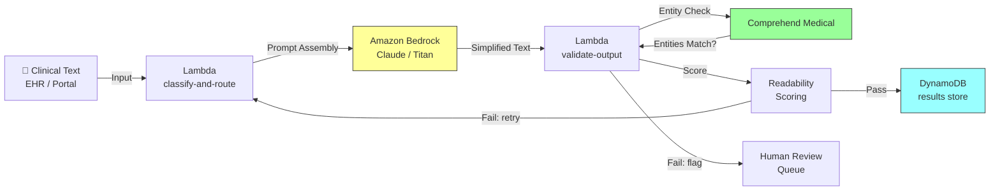

# Recipe 2.2: Medical Terminology Simplification

**Complexity:** Simple · **Phase:** MVP · **Estimated Cost:** ~$0.01-0.04 per document

---

## The Problem

A patient gets discharged from the hospital after a cardiac event. They're handed a sheet of paper that says: "You experienced an acute ST-elevation myocardial infarction with subsequent percutaneous coronary intervention via drug-eluting stent placement in the left anterior descending artery. Continue dual antiplatelet therapy with aspirin 81mg and clopidogrel 75mg daily. Avoid NSAIDs. Follow up with cardiology in 2 weeks for post-PCI assessment."

The patient nods, walks to their car, and has no idea what just happened to them.

This is not a rare scenario. It is the default state of patient communication in healthcare. Clinical documentation is written by clinicians for clinicians. The vocabulary is precise, efficient, and completely opaque to the average person. "Bilateral lower extremity edema" means your legs are swollen. "Dyspnea on exertion" means you get short of breath when you move around. "Idiopathic thrombocytopenic purpura" means your blood doesn't clot well and we're not sure why.

The literacy gap is staggering. The average American reads at a 7th-8th grade level. Most clinical documentation is written at a college or graduate level. The National Institutes of Health recommends patient materials be written at a 6th grade reading level. The gap between what clinicians produce and what patients can understand is not a minor inconvenience. It directly impacts health outcomes.

Patients who don't understand their discharge instructions are more likely to miss medications, skip follow-up appointments, and end up back in the emergency department. A 2019 systematic review in the Journal of General Internal Medicine found that low health literacy is associated with a 50% increase in hospital readmissions. That's not a documentation problem. That's a patient safety problem.

The traditional solution is to have someone manually rewrite clinical text into plain language. Health literacy specialists, patient educators, or nurses who take the time to translate. This works beautifully when it happens. It almost never happens at scale. A health system generating thousands of discharge summaries, lab result explanations, and procedure descriptions per day cannot manually rewrite each one. The bottleneck is human time, and there isn't enough of it.

What if you could take any piece of clinical text and automatically produce a patient-friendly version, at the right reading level, preserving the medical accuracy, in seconds? That's what this recipe builds.

---

## The Technology: LLM-Based Text Simplification

### What Text Simplification Actually Is

Text simplification is the task of rewriting text to make it easier to understand while preserving its meaning. In computational linguistics, this is a well-studied problem that predates LLMs by decades. Early approaches used rule-based systems: replace long words with short ones, split complex sentences into simple ones, remove subordinate clauses. These worked, sort of. They produced text that was technically simpler but often awkward, choppy, or missing important nuance.

Modern text simplification with LLMs is fundamentally different. Rather than applying mechanical rules, the model understands the meaning of the source text and regenerates it in simpler language. It can restructure explanations, add helpful context, use analogies, and adjust tone. The output reads like something a human would write when explaining a concept to a non-expert.

This is a transformation task, not a generation task. That distinction matters for safety. The model isn't inventing information. It's taking existing clinical text and expressing the same content differently. The source text provides guardrails: the simplified version should contain the same facts, just expressed more accessibly. This makes it meaningfully safer than open-ended generation tasks where the model might hallucinate.

### Why LLMs Are Good at This

LLMs excel at text simplification for several reasons:

**They understand medical terminology.** Modern LLMs have been trained on medical literature, textbooks, patient education materials, and clinical documentation. They know that "myocardial infarction" means "heart attack" and that "bilateral lower extremity edema" means "swelling in both legs." This isn't a lookup table. The model understands the concepts well enough to explain them in multiple ways at different complexity levels.

**They can target reading levels.** You can instruct an LLM to write at a specific grade level and it will adjust vocabulary, sentence length, and conceptual complexity accordingly. A 6th grade version of a discharge summary looks different from an 8th grade version, and both look different from the original. The model handles this naturally.

**They preserve structure.** Clinical documents have logical structure: diagnosis, treatment, medications, follow-up. A good simplification preserves this structure while simplifying the language within each section. LLMs handle structural preservation well because they understand document organization, not just individual sentences.

**They add helpful context.** A rule-based system might replace "hypertension" with "high blood pressure." An LLM can do that and also add "this means the force of blood against your artery walls is too high, which can damage your heart over time" when the context warrants explanation. It knows when a term needs definition versus when a simple synonym suffices.

### The Failure Modes

**Meaning drift.** The most dangerous failure mode. The simplified version subtly changes the meaning of the original. "Take this medication with food" becomes "take this medication at mealtimes" (close, but not the same if the patient snacks). "Avoid strenuous activity for 2 weeks" becomes "take it easy for a couple weeks" (vague where the original was specific). Meaning drift is insidious because the simplified text sounds reasonable. You need automated checks to catch it.

**Over-simplification.** Some clinical concepts cannot be simplified without losing critical information. "Dual antiplatelet therapy" can be explained as "two blood-thinning medications taken together," but if you simplify it to just "blood thinners," you've lost the "dual" and "antiplatelet" specificity that matters for the patient's understanding of why they're taking two pills instead of one.

**Under-simplification.** The model leaves technical terms in place without explanation. This happens more with rare or highly specialized terminology that appeared less frequently in training data. A model might simplify "myocardial infarction" (common in training data) but leave "thrombotic thrombocytopenic purpura" untouched (rare enough that the model isn't confident in a lay explanation).

**Cultural and linguistic assumptions.** "Plain language" is not universal. A 6th grade reading level in English assumes a native English speaker. For patients with limited English proficiency, even simplified English may be insufficient. The model also makes cultural assumptions about what analogies and explanations will resonate. "Think of your arteries like pipes" works for some audiences and not others.

**Confidence without accuracy.** The model will always produce output. It won't say "I'm not sure how to simplify this accurately." If it encounters a term it doesn't fully understand, it will still generate a simplification, and that simplification might be wrong. You need validation layers that don't rely on the model's self-assessment.

### Readability Scoring

You need a way to measure whether the simplified output actually hit the target reading level. Several established formulas exist:

**Flesch-Kincaid Grade Level.** The most widely used in healthcare. It calculates a U.S. grade level based on average sentence length and average syllables per word. A score of 6.0 means a typical 6th grader could understand it. Most clinical text scores 12-16 (college level). Your target is 5-8 depending on the audience.

**Flesch Reading Ease.** Related formula, scored 0-100. Higher is easier. 60-70 is "standard" (8th-9th grade). 80-90 is "easy" (6th grade). Clinical text typically scores 20-40.

**SMOG Index.** Specifically designed for healthcare materials. Counts polysyllabic words (3+ syllables) in a sample. More conservative than Flesch-Kincaid; tends to rate text as harder to read.

None of these are perfect. They measure surface-level complexity (word length, sentence length) but not conceptual complexity. A sentence using only short words can still be confusing if the concept is abstract. Use readability scores as a necessary-but-not-sufficient quality check. They catch obvious failures (output still at grade 14) but won't catch subtle meaning drift or conceptual confusion.

### The General Architecture Pattern

```
[Clinical Text] → [Classify Content Type] → [Select Simplification Strategy] → [Generate Simplified Version] → [Validate Accuracy] → [Score Readability] → [Output or Retry]
```

**Classify Content Type.** Different clinical documents need different simplification approaches. Discharge instructions need action-oriented plain language. Lab results need numerical context ("your cholesterol is 240, the normal range is under 200"). Procedure descriptions need anatomical explanations. Classifying the input type lets you select the right prompt template and validation rules.

**Select Simplification Strategy.** Based on content type and target audience, choose the appropriate reading level target, explanation depth, and structural approach. A post-surgical discharge summary for an elderly patient gets different treatment than a lab result explanation for a health-literate 30-year-old.

**Generate Simplified Version.** Pass the clinical text, content type, target reading level, and constraints to the LLM. The system prompt defines what simplification means in this context: preserve all medical facts, explain technical terms, use short sentences, maintain logical structure, include action items clearly.

**Validate Accuracy.** Compare the simplified version against the original to verify that no medical facts were lost, changed, or added. This can be a second LLM call with a different prompt ("Does this simplified version accurately represent all facts in the original?"), a rule-based check for key terms and numbers, or both.

**Score Readability.** Run the output through readability formulas. If it doesn't meet the target grade level, retry with a more aggressive simplification prompt. Set a maximum retry count to avoid infinite loops on text that genuinely can't be simplified further without losing meaning.

---

## The AWS Implementation

Now let's get specific. Here's how to build this on AWS, and why each service earns its place.

### Why These Services

**Amazon Bedrock for LLM access.** Bedrock gives you managed access to foundation models (Claude, Llama, Titan) without provisioning infrastructure. For text simplification, you need a model that understands medical terminology and can follow detailed instructions about reading level and accuracy constraints. Claude (via Bedrock) handles this well. Bedrock also keeps your data within your AWS account boundary, which matters for PHI. The text you send for simplification (clinical notes, discharge instructions) is PHI. It cannot leave your compliance perimeter.

**Amazon Bedrock Guardrails for safety filtering.** Guardrails let you define content policies that are enforced on both input and output. For medical simplification, you configure guardrails to block outputs that contain clinical recommendations not present in the source, flag potential meaning drift, and ensure the model stays in "simplification mode" rather than drifting into medical advice. This is your automated safety net before human review.

**Amazon Comprehend Medical for entity extraction.** Before and after simplification, you need to verify that key medical entities (medications, dosages, conditions, procedures) are preserved. Comprehend Medical extracts these entities from clinical text with high accuracy. By comparing entities in the source versus the simplified output, you get an automated accuracy check: if the source mentions "clopidogrel 75mg daily" and the simplified version doesn't mention that medication or changes the dose, something went wrong.

**Amazon S3 for document storage.** Source documents and simplified outputs need durable, encrypted storage. S3 with SSE-KMS handles this. You also store prompt templates, field mappings, and configuration here.

**AWS Lambda for orchestration.** The simplification pipeline is a sequence of API calls: classify the document, assemble the prompt, call Bedrock, validate the output, score readability, store results. Lambda handles this cleanly. Each simplification request is independent and stateless.

**Amazon DynamoDB for results and audit.** Store the original text, simplified version, readability scores, validation results, and processing metadata. DynamoDB's flexible schema accommodates different document types without schema migrations. The audit trail (what was simplified, when, what model version, what scores) is critical for compliance.

### Architecture Diagram



### Prerequisites

| Requirement | Details |
|-------------|---------|
| **AWS Services** | Amazon Bedrock, Amazon Comprehend Medical, Amazon S3, AWS Lambda, Amazon DynamoDB, Amazon SQS |
| **IAM Permissions** | `bedrock:InvokeModel`, `comprehend:DetectEntities` (Comprehend Medical), `s3:GetObject`, `s3:PutObject`, `dynamodb:PutItem`, `dynamodb:GetItem`, `sqs:SendMessage` |
| **BAA** | AWS BAA signed (required: clinical text is PHI) |
| **Bedrock Model Access** | Request access to Claude or Titan models in Bedrock console |
| **Encryption** | S3: SSE-KMS; DynamoDB: encryption at rest (default); Lambda environment variables: KMS encrypted; all API calls over TLS |
| **VPC** | Production: Lambda in VPC with VPC endpoints for Bedrock, Comprehend Medical, S3, DynamoDB, SQS, and CloudWatch Logs |
| **CloudTrail** | Enabled: log all Bedrock invocations and Comprehend Medical calls for audit |
| **Sample Data** | Synthetic clinical text. Use publicly available sample discharge summaries or generate synthetic examples. Never use real patient documents in dev. |
| **Cost Estimate** | Bedrock (Claude Haiku): ~$0.01-0.03 per simplification. Comprehend Medical: ~$0.01 per 100 characters. Total: ~$0.02-0.04 per document. |

### Ingredients

| AWS Service | Role |
|------------|------|
| **Amazon Bedrock** | LLM inference for text simplification (Claude or Titan) |
| **Amazon Bedrock Guardrails** | Content filtering and safety constraints on model output |
| **Amazon Comprehend Medical** | Medical entity extraction for accuracy validation |
| **Amazon S3** | Stores prompt templates, source documents, and simplified outputs |
| **AWS Lambda** | Orchestrates the pipeline: classify, generate, validate, score |
| **Amazon DynamoDB** | Stores results, readability scores, and audit trail |
| **Amazon SQS** | Dead letter queue for failed simplifications; human review queue |
| **AWS KMS** | Encryption key management for all data at rest |
| **Amazon CloudWatch** | Metrics, logs, and alarms for pipeline health |

### Code

#### Walkthrough

**Step 1: Classify the clinical document type.** Before simplifying anything, you need to know what kind of clinical text you're dealing with. A discharge summary needs different simplification treatment than a lab result or a procedure consent form. Discharge instructions are action-oriented: the patient needs to know what to do. Lab results are numerical: the patient needs context for their numbers. Procedure descriptions are explanatory: the patient needs to understand what happened to their body. This classification drives prompt selection in the next step. A simple keyword and structure-based classifier handles this well; you don't need the full LLM for categorization. Skip this step and you'll get generic simplifications that miss the specific communication needs of each document type.

```
DOCUMENT_TYPES = {
    "discharge_instructions": {
        "indicators": ["discharge", "follow-up", "return to", "activity restrictions"],
        "target_grade": 6,
        "style": "action-oriented, numbered steps, clear timelines"
    },
    "lab_results": {
        "indicators": ["result", "reference range", "normal", "abnormal", "specimen"],
        "target_grade": 7,
        "style": "numerical context, what-it-means explanations, when to worry"
    },
    "procedure_description": {
        "indicators": ["procedure", "performed", "anesthesia", "incision", "catheter"],
        "target_grade": 7,
        "style": "what-happened narrative, anatomical explanations, recovery expectations"
    },
    "medication_instructions": {
        "indicators": ["medication", "dosage", "take", "prescribe", "refill"],
        "target_grade": 5,
        "style": "simple directives, timing, what to avoid, side effects to watch for"
    }
}

FUNCTION classify_document(clinical_text):
    // Count how many indicator words from each type appear in the text.
    // The type with the most matches wins. Simple but effective for structured clinical docs.
    scores = empty map

    FOR each doc_type, config in DOCUMENT_TYPES:
        score = 0
        FOR each indicator in config.indicators:
            IF indicator appears in lowercase(clinical_text):
                score = score + 1
        scores[doc_type] = score

    // Return the type with the highest indicator match count.
    // Default to "general" if nothing matches well (rare for real clinical text).
    best_type = key with maximum value in scores
    IF scores[best_type] == 0:
        RETURN "general"
    RETURN best_type
```

**Step 2: Assemble the simplification prompt.** This is where the magic happens. The prompt tells the LLM exactly what kind of simplification you want: target reading level, structural requirements, what to preserve, what to explain, and what to avoid. A well-crafted prompt is the difference between output that's genuinely useful to patients and output that's just slightly shorter clinical text. The prompt includes the document type context from Step 1, the target grade level, explicit instructions about preserving medical accuracy, and the source text to simplify. Skip this step (or use a generic "simplify this" prompt) and you'll get inconsistent, unreliable output that sometimes oversimplifies and sometimes barely changes anything.

```
FUNCTION build_simplification_prompt(clinical_text, doc_type):
    // Look up the configuration for this document type.
    config = DOCUMENT_TYPES[doc_type]
    target_grade = config.target_grade
    style = config.style

    // Build the system prompt that constrains the model's behavior.
    // This is the most important piece: it defines what "simplification" means.
    system_prompt = """
    You are a health literacy specialist. Your job is to rewrite clinical text
    into plain language that a patient can understand.

    Rules:
    - Target reading level: grade {target_grade} (Flesch-Kincaid)
    - Preserve ALL medical facts: medications, dosages, timelines, restrictions
    - Explain medical terms in parentheses on first use, then use the plain version
    - Use short sentences (under 20 words when possible)
    - Use active voice ("Take your medication" not "Medication should be taken")
    - Include all numbers, dates, and specific instructions exactly as stated
    - Do NOT add medical advice not present in the original
    - Do NOT remove any instructions or warnings from the original
    - Do NOT use the phrase "consult your doctor" unless the original says it
    - Style: {style}

    Format the output with clear headings and bullet points where appropriate.
    If the original has numbered steps, keep them numbered.
    """

    // The user prompt contains the actual clinical text to simplify.
    user_prompt = """
    Simplify the following clinical text for a patient:

    ---
    {clinical_text}
    ---

    Rewrite this at a grade {target_grade} reading level while preserving
    all medical facts, medication names, dosages, and specific instructions.
    """

    RETURN system_prompt, user_prompt
```

**Step 3: Generate the simplified version.** Call the LLM with the assembled prompt. Use a low temperature setting (0.2-0.3) to keep output deterministic and consistent. Higher temperatures introduce creativity, which is the opposite of what you want when accuracy matters. The model processes the clinical text, identifies technical terminology, and regenerates the content in plain language at the target reading level. This step is where the actual simplification happens. The output should read like something a patient educator would write: clear, warm, specific, and complete.

```
FUNCTION generate_simplification(system_prompt, user_prompt, model_id):
    // Call Amazon Bedrock with the assembled prompts.
    // Low temperature (0.2) keeps output consistent and factual.
    // Max tokens set high enough for verbose explanations but capped to prevent runaway generation.
    response = call Bedrock.InvokeModel with:
        model_id    = model_id           // e.g., "anthropic.claude-3-haiku-20240307-v1:0"
        messages    = [
            { role: "user", content: user_prompt }
        ]
        system      = system_prompt
        temperature = 0.2                // low creativity, high consistency
        max_tokens  = 2048               // enough for a full simplified document
        top_p       = 0.9                // slight diversity in word choice, not in facts

    simplified_text = response.content[0].text
    RETURN simplified_text
```

**Step 4: Validate medical accuracy with entity comparison.** This is the safety-critical step. You extract medical entities (medications, conditions, dosages, procedures) from both the original clinical text and the simplified version, then compare them. If the original mentions "clopidogrel 75mg daily" and the simplified version says "a blood thinner" without specifying the name or dose, that's a meaning loss that needs to be caught. Comprehend Medical handles the entity extraction. The comparison logic checks that every medication, dosage, and condition from the source appears in the output. Skip this step and you're trusting the LLM to never drop or alter a medical fact. It will. Not often, but often enough to matter.

```
FUNCTION validate_accuracy(original_text, simplified_text):
    // Extract medical entities from the original clinical text.
    // Comprehend Medical identifies medications, conditions, dosages, procedures, etc.
    original_entities = call ComprehendMedical.DetectEntities with:
        text = original_text

    // Extract medical entities from the simplified version.
    simplified_entities = call ComprehendMedical.DetectEntities with:
        text = simplified_text

    // Compare: every critical entity in the original should appear in the simplified version.
    // "Critical" means medications (with dosages), conditions, and procedures.
    // We allow the simplified version to use different words (that's the point)
    // but the underlying medical facts must be present.
    missing_entities = empty list
    altered_entities = empty list

    FOR each entity in original_entities:
        IF entity.Category in ["MEDICATION", "MEDICAL_CONDITION", "TEST_TREATMENT_PROCEDURE"]:
            // Check if this entity (or a reasonable equivalent) exists in simplified output.
            match = find_matching_entity(entity, simplified_entities)
            IF match is None:
                append entity to missing_entities
            ELSE IF entity.Category == "MEDICATION":
                // For medications, also verify dosage is preserved.
                original_dosage = find_associated_dosage(entity, original_entities)
                simplified_dosage = find_associated_dosage(match, simplified_entities)
                IF original_dosage != simplified_dosage AND original_dosage is not None:
                    append {entity, original_dosage, simplified_dosage} to altered_entities

    // Determine validation result.
    validation_passed = (length of missing_entities == 0) AND (length of altered_entities == 0)

    RETURN {
        passed: validation_passed,
        missing: missing_entities,
        altered: altered_entities,
        original_entity_count: length of original_entities,
        simplified_entity_count: length of simplified_entities
    }
```

**Step 5: Score readability.** Run the simplified text through readability formulas to verify it actually hit the target grade level. Flesch-Kincaid Grade Level is the primary metric. If the output scores above the target (too complex), you can retry with a more aggressive prompt. If it scores well below (too simple), that might indicate over-simplification or loss of content. The sweet spot is within 1-2 grade levels of the target. This is a computational check, not an LLM call: count syllables, count words, count sentences, apply the formula. Fast and deterministic.

```
FUNCTION score_readability(text):
    // Count the components needed for Flesch-Kincaid.
    sentences = count_sentences(text)       // split on . ! ?
    words     = count_words(text)           // split on whitespace
    syllables = count_syllables(text)       // algorithmic syllable counting

    // Flesch-Kincaid Grade Level formula.
    // Result is a U.S. grade level (6.0 = 6th grade reading level).
    fk_grade = 0.39 * (words / sentences) + 11.8 * (syllables / words) - 15.59

    // Flesch Reading Ease (0-100, higher = easier).
    fk_ease = 206.835 - 1.015 * (words / sentences) - 84.6 * (syllables / words)

    // SMOG Index (specifically designed for health materials).
    polysyllabic_words = count words with 3+ syllables
    smog = 1.0430 * sqrt(polysyllabic_words * (30 / sentences)) + 3.1291

    RETURN {
        flesch_kincaid_grade: round(fk_grade, 1),
        flesch_reading_ease: round(fk_ease, 1),
        smog_index: round(smog, 1),
        word_count: words,
        avg_sentence_length: round(words / sentences, 1)
    }
```

**Step 6: Quality gate and retry logic.** Combine the validation result and readability score to make a pass/fail decision. If validation failed (missing entities), route to human review immediately. Do not retry: the model made a factual error and retrying might produce the same error. If readability failed (grade level too high) but validation passed, retry with a more aggressive simplification prompt (up to 2 retries). If both pass, store the result. This step prevents bad output from reaching patients while giving the system a chance to self-correct on readability issues.

```
MAX_RETRIES = 2

FUNCTION quality_gate(original_text, simplified_text, doc_type, attempt_number):
    // Run both checks.
    validation = validate_accuracy(original_text, simplified_text)
    readability = score_readability(simplified_text)

    target_grade = DOCUMENT_TYPES[doc_type].target_grade

    // Decision logic.
    IF NOT validation.passed:
        // Medical accuracy failure. Do not retry. Route to human.
        RETURN {
            status: "FAILED_ACCURACY",
            route_to: "human_review",
            reason: "Missing or altered medical entities",
            details: validation
        }

    IF readability.flesch_kincaid_grade > (target_grade + 2):
        // Too complex. Retry if we haven't exceeded max attempts.
        IF attempt_number < MAX_RETRIES:
            RETURN {
                status: "RETRY",
                reason: "Reading level too high",
                current_grade: readability.flesch_kincaid_grade,
                target_grade: target_grade
            }
        ELSE:
            // Max retries exceeded. Accept with a flag.
            RETURN {
                status: "ACCEPTED_WITH_FLAG",
                flag: "readability_above_target",
                readability: readability
            }

    // Both checks passed.
    RETURN {
        status: "PASSED",
        readability: readability,
        validation: validation
    }
```

**Step 7: Store results.** Write the complete record to DynamoDB: original text, simplified version, all scores, validation details, and processing metadata. This audit trail is essential for compliance (you need to show what was generated and what checks were applied) and for continuous improvement (analyzing failure patterns over time). The record also enables A/B testing: you can compare different model versions or prompt strategies by looking at readability scores and validation pass rates across batches.

```
FUNCTION store_result(document_id, original_text, simplified_text, doc_type, quality_result, readability):
    write record to database table "simplified-documents":
        document_id          = document_id
        timestamp            = current UTC timestamp (ISO 8601)
        doc_type             = doc_type
        original_text        = original_text
        simplified_text      = simplified_text
        readability_scores   = readability
        validation_result    = quality_result
        status               = quality_result.status    // "PASSED", "ACCEPTED_WITH_FLAG", etc.
        model_id             = model identifier used
        prompt_version       = version of the prompt template used
        needs_review         = (quality_result.status != "PASSED")
```

> **Curious how this looks in Python?** The pseudocode above covers the concepts. If you'd like to see sample Python code that demonstrates these patterns using boto3, check out the [Python Example](chapter02.02-python-example). It walks through each step with inline comments and notes on what you'd need to change for a real deployment.

### Expected Results

**Sample output for a cardiac discharge summary:**

Original (grade 14):
> "Patient experienced acute ST-elevation myocardial infarction with subsequent percutaneous coronary intervention via drug-eluting stent placement in the LAD. Continue dual antiplatelet therapy: aspirin 81mg and clopidogrel 75mg daily for 12 months. Avoid NSAIDs. Follow up with cardiology in 2 weeks."

Simplified (grade 6):
> "**What happened:** You had a heart attack. Your doctor placed a small tube called a stent in one of the blood vessels that feeds your heart. This stent will help keep that blood vessel open.
>
> **Your medications:**
> - Take aspirin 81mg every day
> - Take clopidogrel (Plavix) 75mg every day
> - Take both of these for 12 months. Do not stop without talking to your heart doctor.
> - Do NOT take ibuprofen (Advil, Motrin), naproxen (Aleve), or similar pain relievers. These can interfere with your medications.
>
> **Next steps:** See your heart doctor (cardiologist) in 2 weeks."

**Performance benchmarks:**

| Metric | Typical Value |
|--------|---------------|
| End-to-end latency | 2-5 seconds per document |
| Readability improvement | 6-8 grade levels reduction |
| Entity preservation rate | 95-98% (medications, conditions) |
| Readability target hit rate | 85-90% on first attempt |
| Cost per simplification | ~$0.02-0.04 (Bedrock + Comprehend Medical) |
| Retry rate | 10-15% (readability failures) |
| Human review rate | 2-5% (accuracy failures) |

**Where it struggles:** Highly specialized terminology from rare diseases or cutting-edge procedures (less training data means less reliable simplification). Documents with complex conditional logic ("If symptom A occurs, do X; if symptom B occurs, do Y; if both, do Z"). Numerical-heavy lab reports where the context needed for each value is domain-specific. And any text where the clinical meaning depends on subtle word choices that don't have simple equivalents.

---

## The Honest Take

This recipe works surprisingly well for the common case. Discharge instructions, medication explanations, procedure summaries: the 80% of clinical text that uses standard terminology and follows predictable structures. The LLM handles these beautifully, and the readability scores confirm it.

Where it gets tricky is the validation step. Comprehend Medical is good at extracting entities, but "entity preservation" is a proxy for "meaning preservation," not the same thing. You can preserve every medication name and dosage while still losing the nuance of when to take them or why they matter. The entity comparison catches gross errors (dropped medications, changed doses) but misses subtle meaning drift. For production, you'll want periodic human audits of a random sample, not just automated checks.

The readability scoring is also imperfect. Flesch-Kincaid measures surface complexity (word length, sentence length), not conceptual complexity. A sentence can use only short words and still be confusing if the concept is abstract. "Your blood does not clot well" is grade 4 by the formula but might still confuse a patient who doesn't know what clotting means. Use readability scores as a floor, not a ceiling.

The retry logic helps more than you'd expect. About 10-15% of first attempts come back at a higher grade level than target, usually because the model preserved a technical term it should have explained. The retry with "simplify further" almost always fixes it. But cap your retries. Infinite loops on genuinely complex text waste money and don't converge.

One thing that surprised me: patients don't just want simpler words. They want structure. Bullet points, numbered steps, bold headings, clear "what to do" versus "what happened" separation. The prompt engineering for structure matters as much as the vocabulary simplification. A wall of simple text is still hard to use. A structured, scannable document at grade 8 is more useful than an unstructured one at grade 5.

---

## Variations and Extensions

**Multi-language simplification.** After generating the English simplified version, use a translation service (or the same LLM with a translation prompt) to produce versions in Spanish, Mandarin, Vietnamese, or other languages common in your patient population. Simplify first, then translate. Translating complex clinical English directly produces worse results than translating already-simplified English.

**Adaptive reading level.** Store patient literacy preferences in their profile (assessed during intake or inferred from portal interaction patterns). Automatically select the target grade level per patient rather than using a one-size-fits-all target. A health-literate patient might prefer grade 8-10 (more detail, less over-explanation). A patient with limited literacy needs grade 4-5.

**Interactive explanation mode.** Instead of a static simplified document, build an interactive version where patients can tap or click on any term they don't understand to get a further explanation. The LLM generates both the simplified text and a glossary of terms with layered explanations (brief definition, detailed explanation, analogy). This works well in patient portal interfaces.

---

## Related Recipes

- **Recipe 2.1 (Patient Message Response Drafting):** Uses similar LLM prompting patterns but for generating responses rather than simplifying existing text
- **Recipe 2.5 (After-Visit Summary Generation):** Generates patient-facing summaries that benefit from the same readability scoring and validation patterns
- **Recipe 8.3 (Clinical Text Readability Assessment):** Dedicated NLP recipe for measuring and scoring health literacy levels in existing materials
- **Recipe 11.2 (Patient Education Chatbot):** Conversational interface that can explain simplified content further when patients have questions

---

## Additional Resources

**AWS Documentation:**
- [Amazon Bedrock User Guide](https://docs.aws.amazon.com/bedrock/latest/userguide/what-is-bedrock.html)
- [Amazon Bedrock Guardrails](https://docs.aws.amazon.com/bedrock/latest/userguide/guardrails.html)
- [Amazon Comprehend Medical Documentation](https://docs.aws.amazon.com/comprehend-medical/latest/dev/comprehendmedical-welcome.html)
- [Amazon Comprehend Medical DetectEntitiesV2 API](https://docs.aws.amazon.com/comprehend-medical/latest/api/API_DetectEntitiesV2.html)
- [Amazon Bedrock Pricing](https://aws.amazon.com/bedrock/pricing/)
- [AWS HIPAA Eligible Services](https://aws.amazon.com/compliance/hipaa-eligible-services-reference/)

**AWS Sample Repos:**
- [`amazon-bedrock-samples`](https://github.com/aws-samples/amazon-bedrock-samples): General Bedrock examples including text generation, summarization, and prompt engineering patterns
- [`amazon-comprehend-medical-fhir-integration`](https://github.com/aws-samples/amazon-comprehend-medical-fhir-integration): Healthcare-specific: extracting medical entities and mapping to FHIR resources
- [`generative-ai-cdk-constructs`](https://github.com/aws-samples/generative-ai-cdk-constructs): CDK constructs for deploying generative AI workloads on AWS

<!-- TODO: Verify all GitHub repo URLs exist and are current -->

**AWS Solutions and Blogs:**
- [Generative AI on AWS](https://aws.amazon.com/generative-ai/): Overview of AWS generative AI services and use cases
- [Build a Robust Text-to-SQL Solution with Amazon Bedrock](https://aws.amazon.com/blogs/machine-learning/): Example of constrained LLM generation patterns applicable to medical text transformation

<!-- TODO: Find specific blog post about healthcare text simplification or patient communication with Bedrock -->

---

## Estimated Implementation Time

| Tier | Timeline | What You Get |
|------|----------|--------------|
| **Basic** | 1-2 weeks | Single document type, basic prompt, readability scoring, no validation loop |
| **Production-ready** | 4-6 weeks | Multiple document types, entity validation, retry logic, human review queue, audit trail |
| **With variations** | 8-10 weeks | Multi-language support, adaptive reading levels, interactive explanations, A/B testing framework |

---

## Tags

`llm` · `generative-ai` · `bedrock` · `text-simplification` · `health-literacy` · `patient-communication` · `comprehend-medical` · `readability` · `simple` · `mvp` · `hipaa`

---

*← [Recipe 2.1: Patient Message Response Drafting](chapter02.01-patient-message-response-drafting) · [Chapter 2 Index](chapter02-index) · [Next: Recipe 2.3: Clinical Documentation Improvement →](chapter02.03-clinical-documentation-improvement)*
