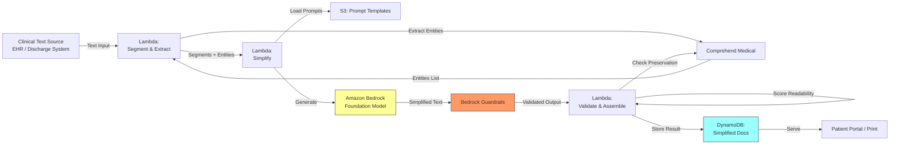

# Recipe 2.2: Medical Terminology Simplification

**Complexity:** Simple · **Phase:** MVP · **Estimated Cost:** ~$0.005–0.02 per document

---

## The Problem

A patient gets discharged from the hospital after a cardiac event. They're handed a sheet of paper that says: "Patient presented with acute ST-elevation myocardial infarction of the LAD territory. Percutaneous coronary intervention performed with drug-eluting stent placement. Initiated dual antiplatelet therapy with aspirin 81mg and ticagrelor 90mg BID. Echocardiogram demonstrated EF of 45% with apical hypokinesis. Follow up with cardiology in 2 weeks for reassessment of ventricular function."

The patient nods, walks to their car, and has absolutely no idea what just happened to them.

This is not a rare scenario. It is the default state of patient communication in healthcare. Clinical documentation is written by clinicians for clinicians. The vocabulary is precise, efficient, and completely opaque to the average person reading at an 8th grade level (which is the median adult reading level in the United States, per the National Assessment of Adult Literacy).

The consequences are measurable. Patients who don't understand their discharge instructions are 30% more likely to be readmitted within 30 days. Patients who can't parse their medication instructions make dosing errors. Patients who don't understand their diagnosis delay follow-up care because they don't realize it's urgent.

Health literacy is not about intelligence. A PhD in literature still won't know what "apical hypokinesis" means. The problem is domain-specific jargon, and the solution is translation: taking clinically precise language and rewriting it in plain terms without losing the meaning that matters.

This is a perfect LLM use case. The source text provides strong guardrails (you're transforming, not generating from nothing). The output is educational, not clinical decision-making. Validation is straightforward (readability scores, clinical accuracy review). And the impact on patient outcomes is well-documented.

---

## The Technology: Text Simplification with Large Language Models

### What Text Simplification Actually Is

Text simplification is a subfield of natural language processing focused on rewriting text to make it easier to understand while preserving its core meaning. It's been studied since the 1990s, long before LLMs existed. Early approaches used rule-based systems: replace long words with short synonyms, split complex sentences into simple ones, remove parenthetical clauses.

Those rule-based systems worked poorly for medical text because medical terminology isn't just "long words." It's a precise vocabulary where each term encodes specific clinical meaning. "Myocardial infarction" isn't just a fancy way to say "heart attack." It specifies that heart muscle tissue died due to blocked blood supply. A naive synonym replacement loses that specificity. A good simplification preserves it: "You had a heart attack. This means part of your heart muscle was damaged because a blood vessel got blocked."

Modern LLMs handle this task remarkably well because they've absorbed both the clinical vocabulary and the plain-language explanations during training. They can perform the translation while maintaining semantic fidelity in a way that rule-based systems never could.

### Why LLMs Excel at This

Three properties make LLMs particularly good at medical text simplification:

**Contextual understanding.** The model understands that "EF of 45%" in the context of a cardiac discharge means "your heart is pumping less efficiently than normal" rather than just translating the abbreviation. It can infer what matters to the patient from the clinical context.

**Graduated simplification.** You can instruct the model to target a specific reading level. A 5th-grade version looks different from an 8th-grade version, which looks different from a "college-educated non-medical professional" version. The same source text can produce multiple outputs calibrated to different audiences.

**Preservation of structure.** LLMs can maintain the logical flow of the original document (diagnosis first, then treatment, then follow-up) while simplifying the language at each step. They don't just swap words; they restructure sentences for clarity while keeping the information architecture intact.

### The Failure Modes

**Over-simplification.** The model strips out clinically important details in pursuit of readability. "Take ticagrelor 90mg twice daily" becomes "take your heart medicine" which is useless if the patient has four heart medicines.

**Hallucinated explanations.** The model adds explanatory context that isn't in the source text and might be wrong. "Your EF is 45%" becomes "Your heart is pumping at 45% efficiency, which is slightly below the normal range of 55-70%. This is likely due to the damage from your heart attack and should improve over the next 3-6 months." That last sentence might be true, might not be. It wasn't in the source.

**Inconsistent terminology.** The model uses different plain-language terms for the same clinical concept in different parts of the document. "Heart attack" in paragraph one becomes "cardiac event" in paragraph three. Patients notice this and get confused about whether these are the same thing.

**Cultural assumptions.** Plain language isn't universal. Idioms, metaphors, and analogies that work for one cultural context may confuse another. "Your heart is like a pump that's not working at full capacity" assumes familiarity with mechanical pumps.

**Loss of actionable specifics.** Medication names, dosages, and timing are the most important details for patient safety. An overly aggressive simplification might convert "aspirin 81mg daily" to "a small daily aspirin" which loses the dosage information the patient actually needs.

### Where the Field Is Now (2026)

The tooling for controlled text transformation has matured significantly:

- System prompts reliably constrain simplification behavior (what to preserve, what to simplify, target reading level)
- Readability scoring algorithms (Flesch-Kincaid, SMOG, Coleman-Liau) provide automated validation of output reading level
- Medical terminology databases (UMLS, SNOMED CT) enable verification that clinical concepts are preserved in the output
- Guardrails can enforce that specific content types (medication names, dosages, dates, provider names) pass through unchanged

The gap between "impressive demo" and "reliable production system" is smaller here than for most LLM applications because the task is so well-constrained. You have source text. You have measurable output criteria. You have straightforward validation. This is about as safe as LLM applications get.

---

## General Architecture Pattern

The pipeline at a conceptual level:

```
[Clinical Text] → [Segment by Type] → [Simplify with Constraints] → [Validate Readability] → [Verify Preservation] → [Output]
```

**Segment by Type.** Not all parts of a clinical document should be simplified the same way. Medication lists need dosages preserved verbatim. Diagnosis explanations need conceptual translation. Follow-up instructions need action items made crystal clear. Segmenting the document first lets you apply different simplification strategies to different content types.

**Simplify with Constraints.** Pass each segment to the LLM with specific instructions: target reading level, terms that must be preserved verbatim (medication names, dosages, dates, provider names), maximum output length, and whether to add brief explanations of medical terms or just replace them.

**Validate Readability.** Run the output through readability scoring algorithms. If the simplified text still scores above your target grade level, flag it for re-simplification or manual review. This is your automated quality gate.

**Verify Preservation.** Check that critical content from the source appears in the output. Medication names, dosages, appointment dates, and provider names should survive simplification unchanged. If any are missing or altered, flag for review.

**Output.** The simplified document is ready for delivery to the patient through whatever channel your organization uses: patient portal, printed handout, or integration with the EHR's patient education system.

The key design principle: simplification is a transformation with verifiable properties. You can measure whether the output is simpler (readability scores). You can verify whether critical content survived (entity matching). This makes it far easier to validate than open-ended generation tasks.


---

## The AWS Implementation

### Why These Services

**Amazon Bedrock for LLM inference.** Bedrock provides managed access to foundation models that handle the text simplification task. The key advantage for healthcare: data stays within your AWS account boundary, is not used for model training, and Bedrock is HIPAA eligible with a signed BAA. For simplification, you want a model that follows instructions precisely (target reading level, preserve specific terms). Claude models excel at instruction-following for constrained transformation tasks.

**Amazon Bedrock Guardrails for output safety.** Configure guardrails to ensure the simplified output doesn't introduce clinical recommendations, doesn't remove medication safety information, and doesn't add disclaimers or caveats that weren't in the source. The guardrail acts as a structural check on the transformation.

**AWS Lambda for orchestration.** The simplification pipeline is stateless and short-lived: receive clinical text, segment it, call Bedrock for each segment, validate outputs, assemble the final document. Lambda handles this cleanly with per-invocation billing and automatic scaling.

**Amazon DynamoDB for result storage and caching.** Store simplified outputs keyed by a hash of the source text. If the same discharge instruction template gets simplified repeatedly (common for standard procedures), serve the cached version instead of calling Bedrock again. This reduces cost and latency for high-volume scenarios.

**Amazon S3 for prompt templates and terminology configs.** System prompts, reading level targets, and "preserve verbatim" term lists are stored as versioned S3 objects. Update simplification behavior without redeploying code.

**Amazon Comprehend Medical for entity extraction.** Before simplification, extract medical entities (medications, dosages, conditions, procedures) from the source text. After simplification, verify these entities still appear in the output. This is your automated preservation check.

### Architecture Diagram



### Prerequisites

| Requirement | Details |
|-------------|---------||
| **AWS Services** | Amazon Bedrock, Amazon Comprehend Medical, AWS Lambda, Amazon DynamoDB, Amazon S3 |
| **Bedrock Model Access** | Request access to your chosen model (e.g., Anthropic Claude) in the Bedrock console |
| **IAM Permissions** | `bedrock:InvokeModel`, `bedrock:ApplyGuardrail`, `comprehendmedical:DetectEntitiesV2`, `s3:GetObject`, `dynamodb:PutItem`, `dynamodb:GetItem`. Scope each to specific resource ARNs. |
| **BAA** | AWS BAA signed (required: clinical text contains PHI) |
| **Bedrock Guardrails** | Configure guardrail to block added clinical recommendations and ensure medication details are preserved |
| **Encryption** | S3: SSE-KMS; DynamoDB: encryption at rest with customer-managed KMS key; all API calls over TLS; CloudWatch Logs: KMS encryption |
| **VPC** | Production: Lambda in VPC with VPC endpoints for Bedrock, Comprehend Medical, S3, DynamoDB, and CloudWatch Logs |
| **CloudTrail** | Enabled: log all Bedrock and Comprehend Medical API calls for audit |
| **Sample Data** | Synthetic clinical text (discharge summaries, lab reports). Never use real patient documents in dev. |
| **Cost Estimate** | Bedrock (Claude Haiku): ~$0.005-0.02 per document depending on length. Comprehend Medical: $0.01 per 100 characters. Lambda and DynamoDB negligible. |

### Ingredients

| AWS Service | Role |
|------------|------|
| **Amazon Bedrock** | Foundation model inference for text simplification |
| **Bedrock Guardrails** | Output safety filtering; prevents added clinical advice |
| **Amazon Comprehend Medical** | Extracts medical entities for preservation verification |
| **AWS Lambda** | Orchestrates segmentation, simplification, and validation |
| **Amazon DynamoDB** | Stores and caches simplified document outputs |
| **Amazon S3** | Stores prompt templates, term lists, and reading level configs |
| **AWS KMS** | Manages encryption keys for all data stores |
| **Amazon CloudWatch** | Metrics on simplification latency, readability scores, and preservation rates |

### Code

#### Walkthrough

**Step 1: Extract medical entities from source text.** Before simplifying anything, identify the critical clinical content that must survive the transformation. Medication names, dosages, conditions, procedures, dates, and provider names are non-negotiable. If any of these get lost or altered during simplification, the output is unsafe. Amazon Comprehend Medical parses clinical text and returns structured entities with their categories and positions. We use this as our "preservation checklist" that gets verified after simplification. Skip this step and you have no way to automatically detect when simplification accidentally drops a medication or changes a dosage.

```
FUNCTION extract_critical_entities(clinical_text):
    // Call Comprehend Medical to identify medical entities in the source text
    response = call ComprehendMedical.DetectEntitiesV2 with:
        Text = clinical_text
    
    // Build a preservation checklist: entities that MUST appear in the simplified output
    must_preserve = []
    
    FOR each entity in response.Entities:
        // Medications and dosages are always critical
        IF entity.Category == "MEDICATION":
            append to must_preserve: {
                text: entity.Text,           // e.g., "ticagrelor 90mg"
                category: "MEDICATION",
                preserve_verbatim: true      // don't simplify drug names or doses
            }
        
        // Specific medical conditions should be mentioned (can be explained)
        ELSE IF entity.Category == "MEDICAL_CONDITION":
            append to must_preserve: {
                text: entity.Text,           // e.g., "myocardial infarction"
                category: "CONDITION",
                preserve_verbatim: false     // can be translated but must be referenced
            }
        
        // Procedures should be mentioned
        ELSE IF entity.Category == "TEST_TREATMENT_PROCEDURE":
            append to must_preserve: {
                text: entity.Text,           // e.g., "percutaneous coronary intervention"
                category: "PROCEDURE",
                preserve_verbatim: false     // can be explained in plain language
            }
        
        // Dosage and frequency info is always verbatim
        ELSE IF entity.Category == "DOSAGE" OR entity.Category == "FREQUENCY":
            append to must_preserve: {
                text: entity.Text,           // e.g., "90mg" or "twice daily"
                category: "DOSAGE_FREQ",
                preserve_verbatim: true
            }
    
    RETURN must_preserve
```

**Step 2: Segment the clinical text.** Different parts of a clinical document need different simplification approaches. A medication list needs dosages preserved verbatim with plain-language explanations added alongside. A diagnosis narrative needs conceptual translation. Follow-up instructions need to become clear action items. Segmenting first lets you apply the right prompt and constraints to each section. Without segmentation, you're asking the model to handle everything uniformly, which leads to either over-simplified medication sections or under-simplified narrative sections.

```
SEGMENT_TYPES = {
    "medications":   ["medication", "prescription", "drug", "dose", "mg", "tablet"],
    "diagnosis":     ["diagnosis", "assessment", "impression", "condition"],
    "instructions":  ["follow up", "follow-up", "return", "call if", "go to", "schedule"],
    "results":       ["result", "lab", "level", "value", "range", "normal"]
}

FUNCTION segment_document(clinical_text):
    // Split the document into logical sections
    // Most clinical documents use headers or blank lines as separators
    raw_sections = split clinical_text by paragraph breaks or section headers
    
    segments = []
    
    FOR each section in raw_sections:
        // Classify this section by its content type
        section_lower = lowercase(section)
        matched_type = "narrative"  // default: general clinical narrative
        
        FOR each seg_type, keywords in SEGMENT_TYPES:
            FOR each keyword in keywords:
                IF keyword is found in section_lower:
                    matched_type = seg_type
                    BREAK
        
        append to segments: {
            text: section,
            type: matched_type,
            index: position in document  // preserve ordering for reassembly
        }
    
    RETURN segments
```

**Step 3: Simplify each segment with type-specific constraints.** This is the core transformation step. Each segment gets a tailored system prompt that tells the model exactly how to handle that content type. Medication segments get instructions to preserve drug names and dosages verbatim while adding plain-language explanations. Diagnosis segments get instructions to translate medical terms into everyday language. Instruction segments get rewritten as clear action items. The reading level target (default: 6th grade Flesch-Kincaid) is enforced across all segment types. The "must_preserve" list from Step 1 is included in the prompt so the model knows which terms are untouchable.

```
TARGET_READING_LEVEL = "6th grade (Flesch-Kincaid)"

SIMPLIFICATION_PROMPTS = {
    "medications": """
        Rewrite this medication information for a patient reading at a {level} level.
        RULES:
        - Keep all medication names exactly as written (do not rename drugs)
        - Keep all dosages exactly as written (do not change numbers or units)
        - Keep all frequency instructions exactly as written
        - Add a brief plain-language explanation of what each medication does
        - Use short sentences
        - Do not add warnings or side effects not mentioned in the source
    """,
    "diagnosis": """
        Rewrite this diagnosis information for a patient reading at a {level} level.
        RULES:
        - Translate medical terms into everyday language
        - After using a plain term, include the medical term in parentheses once
        - Explain what the condition means for the patient in practical terms
        - Do not add prognosis information not stated in the source
        - Do not minimize or dramatize the condition
        - Use short sentences
    """,
    "instructions": """
        Rewrite these follow-up instructions for a patient reading at a {level} level.
        RULES:
        - Convert to clear action items (what to do, when to do it, who to contact)
        - Keep all dates, times, and provider names exactly as written
        - Keep all phone numbers exactly as written
        - Use numbered steps where appropriate
        - Highlight urgency cues ("call immediately if...") clearly
        - Use short sentences
    """,
    "results": """
        Rewrite these test results for a patient reading at a {level} level.
        RULES:
        - Keep all numbers and units exactly as written
        - Explain what each test measures in plain language
        - Explain whether results are normal, high, or low if that info is in the source
        - Do not interpret results beyond what the source states
        - Use short sentences
    """,
    "narrative": """
        Rewrite this clinical text for a patient reading at a {level} level.
        RULES:
        - Translate medical terms into everyday language
        - Keep all names, dates, and numbers exactly as written
        - Use short sentences
        - Do not add information not in the source
    """
}

FUNCTION simplify_segment(segment, must_preserve, reading_level):
    // Select the appropriate prompt template for this segment type
    prompt_template = SIMPLIFICATION_PROMPTS[segment.type]
    
    // Build the system prompt with reading level and preservation rules
    system_prompt = FORMAT prompt_template with level = reading_level
    
    // Add the preservation list to the prompt
    system_prompt = system_prompt + "\n\nThe following terms MUST appear in your output unchanged: "
    FOR each entity in must_preserve WHERE entity.preserve_verbatim == true:
        system_prompt = system_prompt + entity.text + ", "
    
    // Call the foundation model
    response = call LLM service with:
        model_id     = "anthropic.claude-3-haiku"   // fast and cost-effective for transformation
        system       = system_prompt
        messages     = [{ role: "user", content: segment.text }]
        max_tokens   = length(segment.text) * 2     // allow expansion for explanations
        temperature  = 0.2                          // low temp for consistent transformations
        guardrail_id = "terminology-simplification-guardrail"
    
    IF response.guardrail_action == "BLOCKED":
        // Guardrail caught something problematic; return source unchanged with a flag
        RETURN { text: segment.text, simplified: false, reason: response.guardrail_reason }
    
    RETURN { text: response.content, simplified: true, segment_type: segment.type }
```