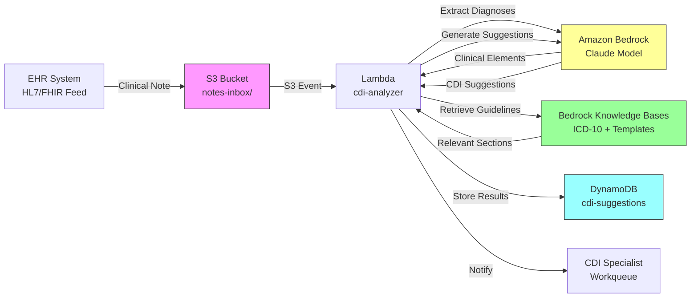

# Recipe 2.3 Architecture and Implementation: Clinical Documentation Improvement (CDI) Suggestions

*Companion to [Recipe 2.3: Clinical Documentation Improvement (CDI) Suggestions](chapter02.03-clinical-documentation-improvement). This page covers the AWS architecture, services, prerequisites, and pseudocode. For the problem framing and the conceptual approach, start with the main recipe.*

---

## The AWS Implementation

### Why These Services

**Amazon Bedrock for LLM inference.** Bedrock gives you access to foundation models (Claude, Titan, and others) through a managed API with no infrastructure to maintain. For CDI, you need a model that understands clinical text, can reason about specificity, and can generate natural-language suggestions. Claude models on Bedrock handle this well. Bedrock is HIPAA-eligible and supports BAA coverage, which is non-negotiable when processing clinical notes containing PHI.

**Amazon Bedrock Knowledge Bases for RAG.** Your coding guidelines, query templates, and payer-specific rules need to live in a searchable knowledge base. Bedrock Knowledge Bases handles the vector embedding, storage, and retrieval pipeline. You upload your ICD-10-CM guidelines and organizational templates, and the service chunks, embeds, and indexes them. At query time, you retrieve relevant sections based on the diagnoses found in the note.

**Amazon S3 for document storage.** Clinical notes arrive from your EHR integration (HL7 FHIR, ADT feeds, or direct API). S3 stores the raw notes and the generated suggestions for audit purposes. Every suggestion the system generates needs to be traceable back to the source note and the guidelines that informed it.

**AWS Lambda for orchestration.** The CDI pipeline is a sequence of API calls: receive note, extract clinical elements, retrieve guidelines, call the LLM, filter results, store output. Lambda handles this orchestration without persistent infrastructure. For real-time CDI (suggestions while the physician is still documenting), you'd put API Gateway in front for synchronous invocation.

**Amazon DynamoDB for suggestion tracking.** Each suggestion needs a lifecycle: generated, presented, accepted, rejected, or expired. DynamoDB tracks this state and enables reporting on suggestion acceptance rates, common gap types, and financial impact.

**Amazon CloudWatch for monitoring.** Track suggestion volume, acceptance rates, latency, model confidence distributions, and error rates. Alert on anomalies (sudden spike in suggestions could indicate a model drift or guideline change).

### Architecture Diagram



### Prerequisites

| Requirement | Details |
|-------------|---------|
| **AWS Services** | Amazon Bedrock, Amazon S3, AWS Lambda, Amazon DynamoDB, Amazon OpenSearch Serverless (for Knowledge Bases), Amazon CloudWatch |
| **IAM Permissions** | `bedrock:InvokeModel`, `bedrock:Retrieve`, `s3:GetObject`, `s3:PutObject`, `dynamodb:PutItem`, `dynamodb:UpdateItem`, `dynamodb:Query`. Scope each action to specific resource ARNs (your notes bucket, your suggestions table, the specific model ARN such as `arn:aws:bedrock:{region}::foundation-model/anthropic.claude-3-sonnet*`, and your knowledge base ARN) rather than `*`. If you use a customer-managed KMS key for DynamoDB or S3, also grant `kms:Decrypt` and `kms:GenerateDataKey` scoped to that key ARN. |
| **BAA** | AWS BAA signed (required: clinical notes contain PHI) |
| **Bedrock Model Access** | Request access to Claude models (or your preferred model) in the Bedrock console |
| **Encryption** | S3: SSE-KMS with a customer-managed key; DynamoDB: encryption at rest with a customer-managed KMS key (the AWS-owned default key does not appear in CloudTrail and cannot be revoked, which fails most HIPAA auditability requirements); Bedrock: data encrypted in transit and at rest; CloudWatch Logs: KMS encryption configured |
| **VPC** | Production: Lambda in VPC with VPC endpoints for S3 and DynamoDB (free gateway endpoints) and interface endpoints for `com.amazonaws.{region}.bedrock-runtime` (for `InvokeModel`), `com.amazonaws.{region}.bedrock-agent-runtime` (for Knowledge Base `Retrieve`; this is a separate endpoint from `bedrock-runtime` and is easy to miss), KMS, and CloudWatch Logs. A Lambda with only the `bedrock-runtime` endpoint will invoke models successfully but fail every knowledge base retrieval. |
| **Lambda Runtime** | Timeout 60-90 seconds. End-to-end latency is 3-8 seconds under normal conditions, but two Bedrock invocations plus multiple knowledge base retrievals can spike higher under throttling. The default 3-second timeout will fail every invocation. Memory: 512 MB floor. For production, consider Step Functions orchestration to decompose the pipeline into individually retryable steps rather than a single long-running Lambda. |
| **CloudTrail** | Enabled: log all Bedrock invocations and S3 access for HIPAA audit trail |
| **Knowledge Base Content** | Current ICD-10-CM Official Guidelines (updated annually each October), organizational CDI query templates, payer-specific documentation requirements |
| **Sample Data** | Synthetic clinical notes. Never use real patient notes in development. Use de-identified note datasets or generate synthetic notes for testing. |
| **Cost Estimate** | Bedrock Claude (input + output tokens): ~$0.02-0.08 per note depending on length. Knowledge Base retrieval: ~$0.001 per query. Lambda + DynamoDB: negligible at typical volumes. |

### Ingredients

| AWS Service | Role |
|------------|------|
| **Amazon Bedrock** | LLM inference for clinical element extraction and suggestion generation |
| **Bedrock Knowledge Bases** | RAG retrieval of coding guidelines and query templates |
| **Amazon S3** | Stores incoming clinical notes and generated suggestions for audit |
| **AWS Lambda** | Orchestrates the CDI analysis pipeline |
| **Amazon DynamoDB** | Tracks suggestion lifecycle (generated, presented, accepted, rejected) |
| **Amazon OpenSearch Serverless** | Vector store backing Bedrock Knowledge Bases |
| **AWS KMS** | Encryption key management for all data stores |
| **Amazon CloudWatch** | Monitoring, metrics, and alerting |

### Code

#### Walkthrough

**Step 1: Receive and parse the clinical note.** When a clinical note arrives (via EHR integration, HL7 feed, or direct upload), the system stores it in S3 and triggers the analysis pipeline. The note needs basic parsing to identify its structure: which sections contain the assessment, which contain the plan, where are the lab results referenced. This structural awareness helps the LLM focus its analysis on the right sections.

```pseudocode
FUNCTION receive_note(note_content, metadata):
    // Store the raw note for audit trail and reprocessing capability.
    // metadata includes: patient_encounter_id, provider_id, note_type, timestamp
    note_key = "notes-inbox/{encounter_id}/{timestamp}-{note_type}.txt"
    
    store note_content to S3 at note_key with:
        encryption = SSE-KMS
        metadata   = metadata    // encounter context travels with the note

    // Trigger the CDI analysis pipeline
    RETURN note_key
```

**Step 2: Extract clinical elements.** Before checking for specificity gaps, you need to understand what the note actually contains. This step uses the LLM to extract structured clinical elements: diagnoses mentioned, medications prescribed, lab values referenced, and procedures performed. This extraction gives you the "what's documented" baseline that you'll compare against coding requirements.

```pseudocode
FUNCTION extract_clinical_elements(note_content):
    // Ask the LLM to identify key clinical elements in the note.
    // This is a structured extraction task: we want JSON output, not prose.
    
    prompt = """
    Analyze the following clinical note and extract:
    1. All diagnoses mentioned (with any qualifiers: acuity, laterality, type)
    2. All medications prescribed or continued (with doses if stated)
    3. All lab values referenced (with results if stated)
    4. All procedures performed or planned
    5. The clinical context that supports each diagnosis
    
    Return as structured JSON. For each diagnosis, note what specificity 
    qualifiers ARE present and what common qualifiers are MISSING.
    
    Clinical Note:
    {note_content}
    """
    
    response = call Bedrock.InvokeModel with:
        model_id = "anthropic.claude-3-sonnet"    // good balance of speed and accuracy
        prompt   = prompt
        max_tokens = 4096
        temperature = 0.1    // low temperature for factual extraction
    
    clinical_elements = parse JSON from response
    RETURN clinical_elements
```

**Step 3: Retrieve relevant coding guidelines.** Based on the diagnoses extracted in Step 2, query the knowledge base for the relevant ICD-10-CM guidelines, specificity requirements, and organizational query templates. This grounds the LLM's suggestions in authoritative, current coding rules rather than relying on potentially outdated training data.

```pseudocode
FUNCTION retrieve_guidelines(diagnoses):
    // For each diagnosis found in the note, retrieve the relevant coding guidelines.
    // The knowledge base contains: ICD-10-CM guidelines, specificity requirements,
    // and organization-approved CDI query templates.
    
    all_guidelines = empty list
    
    FOR each diagnosis in diagnoses:
        // Build a retrieval query focused on this diagnosis and its coding requirements
        query = "ICD-10-CM coding guidelines specificity requirements for {diagnosis.name}"
        
        results = call Bedrock.KnowledgeBase.Retrieve with:
            knowledge_base_id = CDI_KNOWLEDGE_BASE_ID
            query             = query
            max_results       = 5    // top 5 most relevant guideline sections
        
        append results to all_guidelines
    
    // Also retrieve organization-specific query templates
    template_results = call Bedrock.KnowledgeBase.Retrieve with:
        knowledge_base_id = CDI_KNOWLEDGE_BASE_ID
        query             = "CDI query templates for {list of diagnosis categories}"
        max_results       = 10
    
    RETURN {
        coding_guidelines: all_guidelines,
        query_templates:   template_results
    }
```

**Step 4: Identify specificity gaps and generate suggestions.** This is the core CDI step. The LLM receives the clinical note, the extracted elements, and the retrieved coding guidelines. It identifies where the documentation falls short of coding specificity requirements and generates physician-friendly suggestions for each gap. The key constraint: suggestions must be phrased as questions, never as assertions. The physician decides what to document.

```pseudocode
FUNCTION generate_cdi_suggestions(note_content, clinical_elements, guidelines):
    // The main CDI analysis: compare what's documented against what's required.
    // Generate suggestions only where there's a genuine specificity gap.
    
    prompt = """
    You are a Clinical Documentation Improvement specialist. Analyze this clinical 
    note for documentation specificity gaps.
    
    RULES:
    - Only suggest clarifications where the coding guidelines REQUIRE more specificity
    - Only suggest clarifications supported by clinical evidence IN the note
    - Never assert clinical findings; always phrase as questions to the physician
    - Include the clinical evidence that supports each suggestion
    - Rate each suggestion's confidence (high/medium/low) and estimated impact
    - Do NOT suggest clarifications for information already documented elsewhere in the note
    
    CLINICAL NOTE:
    {note_content}
    
    EXTRACTED CLINICAL ELEMENTS:
    {clinical_elements as JSON}
    
    RELEVANT CODING GUIDELINES:
    {guidelines.coding_guidelines}
    
    APPROVED QUERY TEMPLATES:
    {guidelines.query_templates}
    
    For each specificity gap found, return:
    - diagnosis: the condition lacking specificity
    - current_documentation: what the note currently says
    - gap_description: what specificity is missing per coding guidelines
    - clinical_evidence: what in the note supports a more specific diagnosis
    - suggested_query: physician-friendly question requesting clarification
    - confidence: high/medium/low (how confident are you this is a real gap?)
    - estimated_impact: high/medium/low (DRG/reimbursement significance)
    - icd10_current: likely current code assignment
    - icd10_potential: likely code if documentation is clarified
    """
    
    response = call Bedrock.InvokeModel with:
        model_id    = "anthropic.claude-3-sonnet"
        prompt      = prompt
        max_tokens  = 4096
        temperature = 0.2    // slightly higher for natural query phrasing
    
    suggestions = parse JSON from response
    RETURN suggestions
```

**Step 5: Prioritize and filter suggestions.** Not every gap is worth querying. This step applies business rules: suppress low-confidence suggestions, limit total suggestions per note (to avoid alert fatigue), and prioritize by estimated financial and clinical impact. The thresholds here are tunable and should be calibrated based on your organization's CDI acceptance rates.

```pseudocode
MAX_SUGGESTIONS_PER_NOTE = 5        // more than this causes alert fatigue
CONFIDENCE_THRESHOLD     = "medium"  // suppress "low" confidence suggestions

FUNCTION prioritize_suggestions(suggestions):
    // Filter out low-confidence suggestions
    filtered = [s for s in suggestions where s.confidence >= CONFIDENCE_THRESHOLD]
    
    // Sort by impact: high first, then medium, then low
    // Within same impact level, sort by confidence (high first)
    sorted = sort filtered by (estimated_impact DESC, confidence DESC)
    
    // Cap at maximum suggestions per note
    final = first MAX_SUGGESTIONS_PER_NOTE items from sorted
    
    // Add suppression metadata for audit: record what was filtered and why
    suppressed = suggestions NOT in final
    
    RETURN {
        active_suggestions: final,
        suppressed:         suppressed,
        suppression_reasons: "low confidence" or "exceeded max per note"
    }
```

**Step 6: Store results and notify.** Write the suggestions to DynamoDB for lifecycle tracking and trigger notification to the CDI specialist's workqueue (or directly to the physician for concurrent CDI workflows). Every suggestion gets a unique ID and a status that will be updated as it moves through the review process.

```pseudocode
FUNCTION store_and_notify(encounter_id, suggestions, suppressed):
    // Write each suggestion as a separate DynamoDB item for individual lifecycle tracking
    FOR each suggestion in suggestions.active_suggestions:
        write to DynamoDB table "cdi-suggestions":
            suggestion_id    = generate UUID
            encounter_id     = encounter_id
            status           = "GENERATED"    // lifecycle: GENERATED -> PRESENTED -> ACCEPTED/REJECTED/EXPIRED
            diagnosis        = suggestion.diagnosis
            suggested_query  = suggestion.suggested_query
            clinical_evidence = suggestion.clinical_evidence
            confidence       = suggestion.confidence
            estimated_impact = suggestion.estimated_impact
            created_at       = current UTC timestamp
            expires_at       = current timestamp + 72 hours    // suggestions expire if not acted on
    
    // Store suppressed suggestions separately for audit and tuning
    write to S3: "cdi-audit/{encounter_id}/suppressed.json" = suppressed
    
    // Notify CDI workqueue (SNS, SQS, or direct EHR integration)
    send notification to CDI_WORKQUEUE:
        encounter_id      = encounter_id
        suggestion_count  = length of suggestions.active_suggestions
        highest_impact    = max impact level among suggestions
```

> **Curious how this looks in Python?** The pseudocode above covers the concepts. If you'd like to see sample Python code that demonstrates these patterns using boto3, check out the [Python Example](chapter02.03-python-example). It walks through each step with inline comments and notes on what you'd need to change for a real deployment.

### Expected Results

**Sample output for a progress note mentioning pneumonia and heart failure:**

```json
{
  "encounter_id": "ENC-2026-03-15-00482",
  "suggestions": [
    {
      "suggestion_id": "sug-a1b2c3d4",
      "diagnosis": "Pneumonia",
      "current_documentation": "Patient has pneumonia, started on Zosyn",
      "gap_description": "Type and causative organism not specified. ICD-10-CM requires specificity for accurate code assignment.",
      "clinical_evidence": "Antibiotic choice (piperacillin/tazobactam) suggests gram-negative or anaerobic coverage. Sputum culture pending per lab section.",
      "suggested_query": "Your note documents pneumonia with Zosyn initiated. Could you clarify the type (community-acquired vs. hospital-acquired) and suspected or confirmed organism? The antibiotic choice suggests gram-negative coverage.",
      "confidence": "high",
      "estimated_impact": "high",
      "icd10_current": "J18.9 (Pneumonia, unspecified)",
      "icd10_potential": "J15.1 (Pneumonia due to Pseudomonas) or J15.6 (Pneumonia due to other Gram-negative bacteria)"
    },
    {
      "suggestion_id": "sug-e5f6g7h8",
      "diagnosis": "Heart failure",
      "current_documentation": "History of heart failure, continue home medications",
      "gap_description": "Type (systolic/diastolic) and acuity (acute/chronic) not specified.",
      "clinical_evidence": "Echocardiogram from 2026-02-28 documents EF 35%. Current BNP 890 (elevated).",
      "suggested_query": "Your note references heart failure. The recent echo shows EF 35% and BNP is elevated at 890. Would you characterize this as chronic systolic heart failure (HFrEF) with acute exacerbation?",
      "confidence": "high",
      "estimated_impact": "high",
      "icd10_current": "I50.9 (Heart failure, unspecified)",
      "icd10_potential": "I50.23 (Acute on chronic systolic heart failure)"
    }
  ],
  "suppressed_count": 1,
  "processing_time_ms": 3200
}
```

**Performance benchmarks:**

| Metric | Typical Value |
|--------|---------------|
| End-to-end latency | 3-8 seconds per note |
| Suggestion accuracy (true positives) | 70-85% (varies by note complexity) |
| False positive rate | 15-30% (suggestions where no real gap exists) |
| Average suggestions per note | 1.5-3.0 |
| Physician acceptance rate (industry benchmark) | 60-75% for well-phrased queries |
| Cost per note analyzed | $0.02-0.08 (model tokens + retrieval) |
| Throughput | ~20-50 notes/second (Lambda concurrency dependent) |

**Where it struggles:** Very short notes with minimal clinical context (not enough information to identify gaps). Notes where the specificity exists but is documented in a non-standard location. Rare conditions where coding guidelines are ambiguous. Notes that reference external documents ("see radiology report") without including the referenced content.

---

## Why This Isn't Production-Ready

The architecture above demonstrates the pattern. Deploying this in a health system requires addressing several gaps:

**PHI minimization before LLM calls.** Clinical notes contain Safe Harbor identifiers (patient name, DOB, MRN, addresses) that are irrelevant to specificity gap analysis. Even under BAA coverage, the HIPAA minimum-necessary standard applies: don't send data the model doesn't need. Production implementations should redact or de-identify non-clinical PHI before sending to Bedrock. Amazon Comprehend Medical's `DetectPHI` API catches structured identifiers; layer a regex/rules-based approach on top for MRN formats and custom identifier patterns specific to your EHR. The model only needs the clinical content (diagnoses, labs, medications, vitals) to do its job. Strip the rest.

**Reliable note ingestion with dead letter handling.** The architecture shows S3 event triggering Lambda directly. If the Lambda fails (Bedrock throttling, timeout, malformed note), the S3 event is lost with no visibility into which notes were never analyzed. Production systems should place an SQS queue between S3 and Lambda with a redrive policy (3 receive attempts before routing to a dead letter queue). Add a CloudWatch alarm on DLQ depth so your team knows immediately when notes are piling up unprocessed. Without this, you'll silently miss CDI opportunities during Bedrock throttling events or service disruptions and have no easy way to reprocess the backlog.

**Idempotency for duplicate events.** Duplicate S3 events, EHR re-sends, or Lambda retries after partial failure will create duplicate suggestions in DynamoDB because each invocation generates new UUIDs. Production systems should deduplicate using a composite key (encounter_id + diagnosis hash) with a DynamoDB conditional expression (`attribute_not_exists(composite_key)`), or pass an idempotency token from the EHR integration layer. Without this, physicians see the same suggestion twice, eroding trust in the system.

**Knowledge base retrieval efficiency at scale.** The pseudocode queries the knowledge base once per diagnosis plus one template query, so a 5-diagnosis note generates 6 retrieval calls. During burst traffic (morning rounds, shift changes), this hits Bedrock Knowledge Base per-account TPS limits. Mitigations: batch related diagnoses into broader queries where clinically appropriate (e.g., "cardiovascular conditions: heart failure, hypertension"), cache frequently retrieved guideline sections (heart failure, pneumonia, diabetes, sepsis, AKI) in ElastiCache or Lambda-layer in-memory cache, and implement exponential backoff on retrieval calls. Monitor your retrieval latency percentiles and TPS consumption in CloudWatch to right-size your approach.

**EHR integration is the hard part.** Getting clinical notes out of an EHR in real time is not a simple API call. Most EHR systems require HL7 FHIR subscriptions, ADT event feeds, or custom integration engines. The note extraction and delivery mechanism is often more complex than the CDI analysis itself. Budget more time for integration than for the AI pipeline. Connectivity to the EHR (Direct Connect, Site-to-Site VPN, or PrivateLink) must be established with TLS encryption and restricted security groups. PHI must never traverse the public internet between the EHR and AWS, even encrypted.

**Feedback loop for model improvement.** When physicians accept or reject suggestions, that signal needs to flow back into the system. Accepted suggestions validate the model's reasoning. Rejected suggestions (especially with physician comments explaining why) are training data for improving future suggestions. Without this feedback loop, you can't measure or improve accuracy over time.

**Concurrent vs. retrospective CDI.** This recipe shows a retrospective pattern (note is complete, then analyzed). Concurrent CDI (suggestions while the physician is still writing) requires different architecture: streaming note content, incremental analysis, and tight EHR UI integration. Concurrent CDI has higher impact but substantially higher integration complexity.

**Compliance review of suggestions.** Every CDI query template in production should be reviewed by your compliance team. Suggestions that could be interpreted as "telling physicians what to document" (rather than asking for clarification) create regulatory risk. The line between "documentation improvement" and "documentation coaching for revenue" is one that OIG auditors care about.

**Suggestion retention and secure deletion.** DynamoDB TTL deletes expired items within 48 hours of the expiration timestamp, not immediately. Expired clinical content remains queryable during that window. Define your data retention policy explicitly: archive expired suggestions to S3 Glacier for audit trail (if your compliance team requires long-term traceability), or enforce hard-delete for data minimization. If you choose TTL-based expiration, account for the 48-hour lag in your security documentation and access controls.

---

## Variations and Extensions

**Concurrent CDI with EHR integration.** Instead of analyzing completed notes, integrate with the EHR's note-writing interface to provide real-time suggestions as the physician documents. This requires streaming note content via FHIR subscriptions or EHR-specific APIs (Epic's CDS Hooks, Cerner's Smart on FHIR). Higher impact, higher integration complexity. Consider starting retrospective and graduating to concurrent once you've validated accuracy.

**Multi-note context analysis.** Expand the analysis window beyond a single note to include the full encounter: all progress notes, consult notes, procedure notes, and nursing documentation. Gaps identified in one note might be addressed in another. This reduces false positives and enables more sophisticated suggestions like "Dr. Smith documented the organism in yesterday's note but it's not carried forward to today's assessment."

**CDI quality scoring and dashboards.** Aggregate suggestion data across providers, departments, and time periods to identify documentation patterns. Which physicians consistently under-document heart failure specificity? Which departments have the highest gap rates? This enables targeted education rather than blanket training. Present as documentation quality metrics, not revenue metrics.

---

## Additional Resources

**AWS Documentation:**
- [Amazon Bedrock User Guide](https://docs.aws.amazon.com/bedrock/latest/userguide/what-is-bedrock.html)
- [Amazon Bedrock Knowledge Bases](https://docs.aws.amazon.com/bedrock/latest/userguide/knowledge-base.html)
- [Amazon Bedrock Guardrails](https://docs.aws.amazon.com/bedrock/latest/userguide/guardrails.html)
- [Amazon Bedrock Pricing](https://aws.amazon.com/bedrock/pricing/)
- [AWS HIPAA Eligible Services](https://aws.amazon.com/compliance/hipaa-eligible-services-reference/)
- [Architecting for HIPAA on AWS (Whitepaper)](https://docs.aws.amazon.com/whitepapers/latest/architecting-hipaa-security-and-compliance-on-aws/welcome.html)

**AWS Sample Repos:**
- [`amazon-bedrock-samples`](https://github.com/aws-samples/amazon-bedrock-samples): General Bedrock examples including RAG patterns and knowledge base integration
- [`amazon-bedrock-rag-workshop`](https://github.com/aws-samples/amazon-bedrock-rag-workshop): Workshop covering RAG architecture patterns with Bedrock Knowledge Bases

**AWS Solutions and Blogs:**
- [Generative AI on AWS for Healthcare](https://aws.amazon.com/health/generative-ai/): Overview of generative AI applications in healthcare on AWS
- [Build a Contextual Chatbot for Financial Services Using Amazon Bedrock Knowledge Bases](https://aws.amazon.com/blogs/machine-learning/build-a-contextual-chatbot-application-using-knowledge-bases-for-amazon-bedrock/): Demonstrates the RAG pattern used in this recipe (applicable across industries)

**Industry Resources:**
- [AHIMA CDI Practice Brief](https://ahima.org): Professional guidance on CDI program structure and best practices
- [ICD-10-CM Official Guidelines for Coding and Reporting (CMS)](https://www.cms.gov/medicare/coding-billing/icd-10-codes/icd-10-cm-official-guidelines-coding-reporting): The authoritative source for coding specificity requirements (updated annually)

---

## Estimated Implementation Time

| Tier | Timeline | What You Get |
|------|----------|--------------|
| **Basic (POC)** | 2-3 weeks | Single-note analysis, hardcoded guidelines, manual note upload, console output |
| **Production-ready** | 8-12 weeks | EHR integration, RAG with current guidelines, CDI workqueue, feedback tracking, monitoring |
| **With variations** | 16-20 weeks | Concurrent CDI, multi-note context, quality dashboards, provider-specific tuning |

---

---

*← [Main Recipe 2.3](chapter02.03-clinical-documentation-improvement) · [Python Example](chapter02.03-python-example) · [Chapter Preface](chapter02-preface)*
