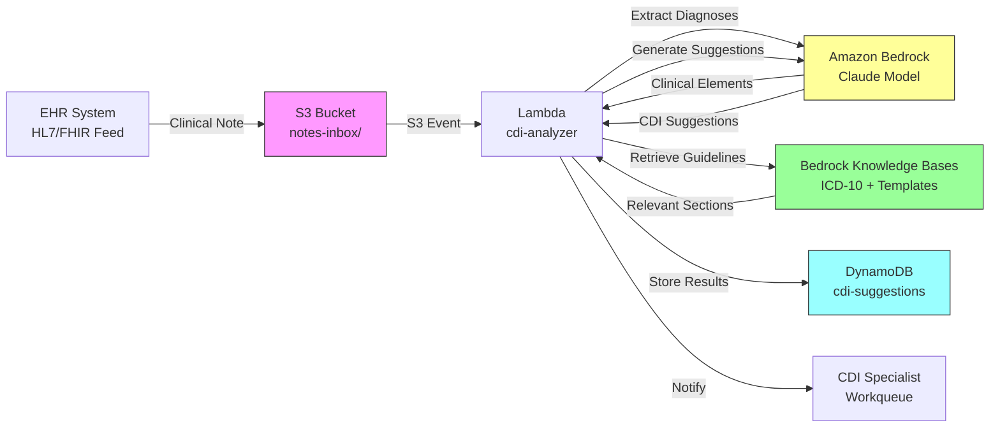

<!--
Editorial pass (TechEditor, 2026-05-11):
- Tightened Prerequisites: scoped IAM permissions to resource ARNs, promoted DynamoDB encryption to customer-managed KMS key, split the Bedrock VPC endpoint into its two real endpoints (bedrock-runtime and bedrock-agent-runtime), and added a Lambda Runtime row with an explicit timeout floor (expert review H2-HIGH Lambda timeout, M2 IAM scoping, M3 DynamoDB CMK, M9 bedrock-agent-runtime endpoint).
- Softened one hyperbolic word in the "Why LLMs Work Here" discussion (dramatically -> substantially) to match the engineer-explaining voice used elsewhere in the recipe (voice review L11).
- Preserved the TechWriter TODO on Recipe 7.3 cross-reference. Note: a pass through categories/07-predictive-analytics.md finds no "DRG Prediction" recipe in the current plan (7.3 is currently "Patient Churn / Disenrollment Prediction"); the closest clinically related neighbors are 7.5 (30-Day Readmission) and 7.7 (Length of Stay). Flagging for the book-wide cross-reference sweep.
- Flagged remaining structural items as TODOs for TechWriter (see inline comments): PHI minimization guidance in Why This Isn't Production-Ready (H1), DLQ / reliable ingestion note (H3), idempotency on repeat events (M4), knowledge base retrieval caching and batching (M1), suggestion retention / secure deletion policy (L1), and EHR network connectivity sentence (L2). Per persona rules, structural additions that introduce new architectural content are left for the TechWriter rather than rewritten here.
- Verified: zero em dashes (U+2014 full-file scan), header hierarchy (H1 title, H2 major, H3 subsection, H4 Walkthrough) matches chapter01 and chapter02.01/02.02, RECIPE-GUIDE section order intact, vendor balance holds at ~70/30 (AWS names first appear at "The AWS Implementation"), all external URLs well-formed, no documentation-voice or LinkedIn-influencer anti-patterns present.

Editorial pass 2 (TechEditor, 2026-05-11):
- Corrected pass-1 changelog to say "Why LLMs Work Here" (the actual location of the `dramatically -> substantially` swap) rather than "Variations," and expanded the Recipe 7.3 note with the current title from categories/07-predictive-analytics.md so the downstream cross-reference sweep has the context it needs.
- Re-verified: zero em dashes (U+2014), zero triple-blank-line gaps in prose, header hierarchy unchanged from pass 1, pseudocode fences all tagged, Mermaid block intact, all sample ICD-10-CM codes (J18.9, J15.1, J15.6, J13, I50.9, I50.23) valid in the current code set, Related Recipes numbers match the current chapter 2 plan (2.1, 2.4, 2.6).
- Confirmed the five TODOs flagged in pass 1 are still the right handoff to TechWriter: each introduces new architectural prose (PHI redaction via Comprehend Medical, SQS/DLQ in the ingestion path, idempotency composite key, knowledge-base caching, retention policy, EHR connectivity) rather than in-place edits, which is the boundary persona rules draw between editor and writer. No rewrites performed.
-->

# Recipe 2.3: Clinical Documentation Improvement (CDI) Suggestions

**Complexity:** Simple-Medium · **Phase:** MVP · **Estimated Cost:** ~$0.02-0.08 per note

---

## The Problem

A hospitalist admits a patient with pneumonia. They write in the progress note: "Patient has pneumonia, started on antibiotics." Clinically, this is fine. The patient gets treated. But from a coding and reimbursement perspective, this note is a disaster.

Was it community-acquired or hospital-acquired pneumonia? Bacterial, viral, or aspiration? Which organism, if known? Is it the principal diagnosis or a complication of something else? Each of these distinctions maps to a different ICD-10 code, and each code maps to a different DRG, and each DRG maps to a different reimbursement amount. The difference between "pneumonia, unspecified" (J18.9) and "pneumonia due to Streptococcus pneumoniae" (J13) can mean thousands of dollars in reimbursement difference for the same clinical care.

This is not about upcoding. This is about accuracy. The documentation should reflect what the physician actually knows and did. When a physician writes "pneumonia" but their lab results show Streptococcus and their antibiotic choice confirms they're treating a bacterial infection, the documentation is incomplete, not wrong. The clinical picture is clear in the physician's head. It just didn't make it onto the page.

Clinical Documentation Improvement (CDI) is the discipline of catching these gaps. Traditionally, CDI specialists (usually nurses or coders with clinical backgrounds) manually review charts, identify documentation that lacks specificity, and send queries to physicians asking them to clarify. "Dr. Smith, your note says pneumonia. Can you specify the type and causative organism?" The physician updates the note, the coder assigns a more specific code, and the claim reflects the actual complexity of care delivered.

The problem is scale. A typical hospital generates hundreds of inpatient notes per day. CDI specialists can review maybe 20-30 charts per day thoroughly. That means most notes never get a CDI review. The ones that do get reviewed are selected by simple heuristics (high-value DRGs, specific service lines) rather than by actual documentation quality. Notes with significant gaps slip through because nobody had time to look at them.

The financial impact is real. The American Health Information Management Association (AHIMA) estimates that hospitals lose 1-5% of potential revenue due to documentation specificity gaps. For a mid-size hospital doing $500M in annual revenue, that's $5-25M left on the table. Not because the care wasn't delivered, but because the documentation didn't capture it precisely enough.

What if you could scan every note as it's written, identify specificity gaps in real time, and suggest clarifications before the chart is even closed? That's what this recipe builds.

---

## The Technology: LLM-Based Documentation Analysis

### What CDI Actually Requires

CDI is not a simple text classification problem. It requires understanding three things simultaneously:

1. **Clinical context.** What does the note actually say happened? What diagnoses are mentioned, what treatments were given, what labs were ordered?
2. **Coding rules.** What level of specificity does ICD-10-CM require for each condition? What qualifiers (laterality, acuity, causative organism, stage) are needed for a complete code?
3. **Gap detection.** Where does the clinical context imply information that the documentation doesn't explicitly state? If the labs show E. coli and the antibiotics target gram-negative bacteria, but the note just says "UTI," there's a specificity gap.

Traditional CDI software uses rule-based engines: if the note mentions "heart failure" but doesn't specify systolic vs. diastolic, fire a query. These rules work for common, well-defined gaps. They miss nuanced cases, they generate false positives on notes that actually do contain the specificity elsewhere in the text, and they require constant manual maintenance as coding guidelines change.

LLMs change this equation because they can read and reason about clinical text the way a human CDI specialist does. They understand that "started on Zosyn" implies the physician suspects a gram-negative or anaerobic infection. They understand that "EF 25%" in an echo report means systolic heart failure even if the note doesn't use those words. They can identify what's implied but not stated, which is exactly what CDI is about.

### Why LLMs Work Here

**They understand medical language natively.** Modern LLMs trained on clinical literature understand the relationships between symptoms, diagnoses, treatments, and lab values. They don't need explicit rules mapping "Zosyn" to "gram-negative coverage." They learned these associations from millions of clinical documents.

**They can reason about specificity.** You can instruct an LLM: "Given this note, identify any diagnoses that could be documented more specifically per ICD-10-CM guidelines." The model understands what "more specifically" means in a coding context because it has seen thousands of examples of specific vs. unspecific documentation.

**They handle context across the full note.** A rule-based system might flag "heart failure" as lacking specificity in the assessment section, missing that the physician documented "systolic dysfunction, EF 30%" in the cardiac exam three paragraphs earlier. An LLM reads the entire note and understands that the specificity exists, just in a different section. This cuts false-positive queries substantially.

**They generate natural-language suggestions.** Instead of firing a cryptic alert ("HF: specify type"), an LLM can generate a physician-friendly query: "Your note mentions heart failure. The echocardiogram documents EF 30%, which suggests systolic heart failure (HFrEF). Would you like to specify this in your assessment?" This is closer to how a human CDI specialist would phrase the question.

### The Failure Modes (and They're Important)

**Hallucinated clinical findings.** The most dangerous failure. The model suggests a specificity improvement based on clinical information that isn't actually in the chart. "Your labs suggest E. coli" when no culture results exist yet. This is why CDI suggestions must always be framed as questions, never as assertions, and why physicians must always make the final documentation decision.

**Coding rule staleness.** ICD-10-CM guidelines update annually. CMS publishes new codes, retires old ones, and changes specificity requirements every October. An LLM's training data has a cutoff. If you're relying on the model's inherent knowledge of coding rules rather than providing current guidelines via retrieval, your suggestions will drift out of date. This is a strong argument for RAG (Retrieval-Augmented Generation) architecture.

**Over-querying.** A model that flags every possible specificity gap will drown physicians in queries. Alert fatigue is already a massive problem in healthcare IT. If your CDI system generates 15 suggestions per note, physicians will ignore all of them. You need confidence thresholds and prioritization: flag the high-impact gaps, suppress the marginal ones.

**Context window limitations.** Hospital notes can be long. A multi-day admission with daily progress notes, consult notes, procedure notes, and nursing documentation can easily exceed 50,000 tokens. You need a strategy for handling notes that exceed your model's context window: summarization, chunking with overlap, or selective section analysis.

**Physician trust.** This is not a technical failure mode, but it kills more CDI programs than any bug. If physicians perceive the system as a revenue-optimization tool rather than a documentation accuracy tool, they'll resist it. The suggestions must be clinically grounded, respectfully phrased, and genuinely helpful for documentation quality. "This will increase your DRG weight" is the wrong framing. "This will ensure your documentation reflects the complexity of care you actually delivered" is the right one.

### Retrieval-Augmented Generation for CDI

Pure LLM inference (just sending the note to a model and asking "what's missing?") works surprisingly well for common conditions. But for production CDI, you want RAG architecture. Here's why:

**Current coding guidelines.** ICD-10-CM Official Guidelines for Coding and Reporting change annually. Embedding the current year's guidelines in a vector store and retrieving relevant sections based on the diagnoses mentioned in the note ensures your suggestions reflect current rules, not the model's potentially outdated training data.

**Organization-specific query templates.** Every health system has preferred query language, approved query types, and compliance-reviewed phrasing. Retrieving your organization's approved templates and using them to format suggestions ensures consistency and compliance.

**Payer-specific requirements.** Different payers have different documentation requirements for the same condition. Medicare requires different specificity than commercial payers for certain diagnoses. Retrieving payer-specific rules based on the patient's coverage adds another layer of accuracy.

The RAG pattern here is: extract diagnoses from the note, retrieve relevant coding guidelines and query templates, then ask the LLM to identify gaps and generate suggestions using the retrieved context as ground truth.

### The General Architecture Pattern

```
[Clinical Note] → [Extract Key Clinical Elements] → [Retrieve Coding Guidelines] → [Identify Specificity Gaps] → [Generate CDI Suggestions] → [Prioritize and Filter] → [Present to CDI Specialist / Physician]
```

**Extract Key Clinical Elements.** Parse the note to identify diagnoses, procedures, medications, lab values, and clinical findings. This gives you the "what's documented" baseline.

**Retrieve Coding Guidelines.** Based on the identified diagnoses, pull the relevant ICD-10-CM guidelines, specificity requirements, and your organization's query templates from a knowledge base.

**Identify Specificity Gaps.** Compare what's documented against what the guidelines require. Where is the documentation less specific than the coding rules demand? Where does clinical context (labs, meds, vitals) imply information not explicitly stated?

**Generate CDI Suggestions.** For each identified gap, generate a physician-friendly query suggesting the clarification needed. Include the clinical evidence supporting the suggestion.

**Prioritize and Filter.** Rank suggestions by clinical and financial impact. Suppress low-confidence suggestions. Limit the total number per note to avoid alert fatigue.

**Present.** Surface suggestions in the CDI specialist's workflow (for traditional review) or directly in the physician's EHR (for concurrent, real-time CDI).

---

## The AWS Implementation

### Why These Services

**Amazon Bedrock for LLM inference.** Bedrock gives you access to foundation models (Claude, Titan, and others) through a managed API with no infrastructure to maintain. For CDI, you need a model that understands clinical text, can reason about specificity, and can generate natural-language suggestions. Claude models on Bedrock handle this well. Bedrock is HIPAA-eligible and supports BAA coverage, which is non-negotiable when processing clinical notes containing PHI.

**Amazon Bedrock Knowledge Bases for RAG.** Your coding guidelines, query templates, and payer-specific rules need to live in a searchable knowledge base. Bedrock Knowledge Bases handles the vector embedding, storage, and retrieval pipeline. You upload your ICD-10-CM guidelines and organizational templates, and the service chunks, embeds, and indexes them. At query time, you retrieve relevant sections based on the diagnoses found in the note.

**Amazon S3 for document storage.** Clinical notes arrive from your EHR integration (HL7 FHIR, ADT feeds, or direct API). S3 stores the raw notes and the generated suggestions for audit purposes. Every suggestion the system generates needs to be traceable back to the source note and the guidelines that informed it.

**AWS Lambda for orchestration.** The CDI pipeline is a sequence of API calls: receive note, extract clinical elements, retrieve guidelines, call the LLM, filter results, store output. Lambda handles this orchestration without persistent infrastructure. For real-time CDI (suggestions while the physician is still documenting), you'd put API Gateway in front for synchronous invocation.

**Amazon DynamoDB for suggestion tracking.** Each suggestion needs a lifecycle: generated, presented, accepted, rejected, or expired. DynamoDB tracks this state and enables reporting on suggestion acceptance rates, common gap types, and financial impact.

**Amazon CloudWatch for monitoring.** Track suggestion volume, acceptance rates, latency, model confidence distributions, and error rates. Alert on anomalies (sudden spike in suggestions could indicate a model drift or guideline change).

### Architecture Diagram



### Prerequisites

| Requirement | Details |
|-------------|---------|
| **AWS Services** | Amazon Bedrock, Amazon S3, AWS Lambda, Amazon DynamoDB, Amazon OpenSearch Serverless (for Knowledge Bases), Amazon CloudWatch |
| **IAM Permissions** | `bedrock:InvokeModel`, `bedrock:Retrieve`, `s3:GetObject`, `s3:PutObject`, `dynamodb:PutItem`, `dynamodb:UpdateItem`, `dynamodb:Query`. Scope each action to specific resource ARNs (your notes bucket, your suggestions table, the specific model ARN such as `arn:aws:bedrock:{region}::foundation-model/anthropic.claude-3-sonnet*`, and your knowledge base ARN) rather than `*`. If you use a customer-managed KMS key for DynamoDB or S3, also grant `kms:Decrypt` and `kms:GenerateDataKey` scoped to that key ARN. |
| **BAA** | AWS BAA signed (required: clinical notes contain PHI) |
| **Bedrock Model Access** | Request access to Claude models (or your preferred model) in the Bedrock console |
| **Encryption** | S3: SSE-KMS with a customer-managed key; DynamoDB: encryption at rest with a customer-managed KMS key (the AWS-owned default key does not appear in CloudTrail and cannot be revoked, which fails most HIPAA auditability requirements); Bedrock: data encrypted in transit and at rest; CloudWatch Logs: KMS encryption configured |
| **VPC** | Production: Lambda in VPC with VPC endpoints for S3 and DynamoDB (free gateway endpoints) and interface endpoints for `com.amazonaws.{region}.bedrock-runtime` (for `InvokeModel`), `com.amazonaws.{region}.bedrock-agent-runtime` (for Knowledge Base `Retrieve`; this is a separate endpoint from `bedrock-runtime` and is easy to miss), KMS, and CloudWatch Logs. A Lambda with only the `bedrock-runtime` endpoint will invoke models successfully but fail every knowledge base retrieval. |
| **Lambda Runtime** | Timeout 60-90 seconds. End-to-end latency is 3-8 seconds under normal conditions, but two Bedrock invocations plus multiple knowledge base retrievals can spike higher under throttling. The default 3-second timeout will fail every invocation. Memory: 512 MB floor. For production, consider Step Functions orchestration to decompose the pipeline into individually retryable steps rather than a single long-running Lambda. |
| **CloudTrail** | Enabled: log all Bedrock invocations and S3 access for HIPAA audit trail |
| **Knowledge Base Content** | Current ICD-10-CM Official Guidelines (updated annually each October), organizational CDI query templates, payer-specific documentation requirements |
| **Sample Data** | Synthetic clinical notes. Never use real patient notes in development. Use de-identified note datasets or generate synthetic notes for testing. |
| **Cost Estimate** | Bedrock Claude (input + output tokens): ~$0.02-0.08 per note depending on length. Knowledge Base retrieval: ~$0.001 per query. Lambda + DynamoDB: negligible at typical volumes. |

### Ingredients

| AWS Service | Role |
|------------|------|
| **Amazon Bedrock** | LLM inference for clinical element extraction and suggestion generation |
| **Bedrock Knowledge Bases** | RAG retrieval of coding guidelines and query templates |
| **Amazon S3** | Stores incoming clinical notes and generated suggestions for audit |
| **AWS Lambda** | Orchestrates the CDI analysis pipeline |
| **Amazon DynamoDB** | Tracks suggestion lifecycle (generated, presented, accepted, rejected) |
| **Amazon OpenSearch Serverless** | Vector store backing Bedrock Knowledge Bases |
| **AWS KMS** | Encryption key management for all data stores |
| **Amazon CloudWatch** | Monitoring, metrics, and alerting |

### Code

#### Walkthrough

**Step 1: Receive and parse the clinical note.** When a clinical note arrives (via EHR integration, HL7 feed, or direct upload), the system stores it in S3 and triggers the analysis pipeline. The note needs basic parsing to identify its structure: which sections contain the assessment, which contain the plan, where are the lab results referenced. This structural awareness helps the LLM focus its analysis on the right sections.

```
FUNCTION receive_note(note_content, metadata):
    // Store the raw note for audit trail and reprocessing capability.
    // metadata includes: patient_encounter_id, provider_id, note_type, timestamp
    note_key = "notes-inbox/{encounter_id}/{timestamp}-{note_type}.txt"
    
    store note_content to S3 at note_key with:
        encryption = SSE-KMS
        metadata   = metadata    // encounter context travels with the note

    // Trigger the CDI analysis pipeline
    RETURN note_key
```

**Step 2: Extract clinical elements.** Before checking for specificity gaps, you need to understand what the note actually contains. This step uses the LLM to extract structured clinical elements: diagnoses mentioned, medications prescribed, lab values referenced, and procedures performed. This extraction gives you the "what's documented" baseline that you'll compare against coding requirements.

```
FUNCTION extract_clinical_elements(note_content):
    // Ask the LLM to identify key clinical elements in the note.
    // This is a structured extraction task: we want JSON output, not prose.
    
    prompt = """
    Analyze the following clinical note and extract:
    1. All diagnoses mentioned (with any qualifiers: acuity, laterality, type)
    2. All medications prescribed or continued (with doses if stated)
    3. All lab values referenced (with results if stated)
    4. All procedures performed or planned
    5. The clinical context that supports each diagnosis
    
    Return as structured JSON. For each diagnosis, note what specificity 
    qualifiers ARE present and what common qualifiers are MISSING.
    
    Clinical Note:
    {note_content}
    """
    
    response = call Bedrock.InvokeModel with:
        model_id = "anthropic.claude-3-sonnet"    // good balance of speed and accuracy
        prompt   = prompt
        max_tokens = 4096
        temperature = 0.1    // low temperature for factual extraction
    
    clinical_elements = parse JSON from response
    RETURN clinical_elements
```

**Step 3: Retrieve relevant coding guidelines.** Based on the diagnoses extracted in Step 2, query the knowledge base for the relevant ICD-10-CM guidelines, specificity requirements, and organizational query templates. This grounds the LLM's suggestions in authoritative, current coding rules rather than relying on potentially outdated training data.

```
FUNCTION retrieve_guidelines(diagnoses):
    // For each diagnosis found in the note, retrieve the relevant coding guidelines.
    // The knowledge base contains: ICD-10-CM guidelines, specificity requirements,
    // and organization-approved CDI query templates.
    
    all_guidelines = empty list
    
    FOR each diagnosis in diagnoses:
        // Build a retrieval query focused on this diagnosis and its coding requirements
        query = "ICD-10-CM coding guidelines specificity requirements for {diagnosis.name}"
        
        results = call Bedrock.KnowledgeBase.Retrieve with:
            knowledge_base_id = CDI_KNOWLEDGE_BASE_ID
            query             = query
            max_results       = 5    // top 5 most relevant guideline sections
        
        append results to all_guidelines
    
    // Also retrieve organization-specific query templates
    template_results = call Bedrock.KnowledgeBase.Retrieve with:
        knowledge_base_id = CDI_KNOWLEDGE_BASE_ID
        query             = "CDI query templates for {list of diagnosis categories}"
        max_results       = 10
    
    RETURN {
        coding_guidelines: all_guidelines,
        query_templates:   template_results
    }
```

**Step 4: Identify specificity gaps and generate suggestions.** This is the core CDI step. The LLM receives the clinical note, the extracted elements, and the retrieved coding guidelines. It identifies where the documentation falls short of coding specificity requirements and generates physician-friendly suggestions for each gap. The key constraint: suggestions must be phrased as questions, never as assertions. The physician decides what to document.

```
FUNCTION generate_cdi_suggestions(note_content, clinical_elements, guidelines):
    // The main CDI analysis: compare what's documented against what's required.
    // Generate suggestions only where there's a genuine specificity gap.
    
    prompt = """
    You are a Clinical Documentation Improvement specialist. Analyze this clinical 
    note for documentation specificity gaps.
    
    RULES:
    - Only suggest clarifications where the coding guidelines REQUIRE more specificity
    - Only suggest clarifications supported by clinical evidence IN the note
    - Never assert clinical findings; always phrase as questions to the physician
    - Include the clinical evidence that supports each suggestion
    - Rate each suggestion's confidence (high/medium/low) and estimated impact
    - Do NOT suggest clarifications for information already documented elsewhere in the note
    
    CLINICAL NOTE:
    {note_content}
    
    EXTRACTED CLINICAL ELEMENTS:
    {clinical_elements as JSON}
    
    RELEVANT CODING GUIDELINES:
    {guidelines.coding_guidelines}
    
    APPROVED QUERY TEMPLATES:
    {guidelines.query_templates}
    
    For each specificity gap found, return:
    - diagnosis: the condition lacking specificity
    - current_documentation: what the note currently says
    - gap_description: what specificity is missing per coding guidelines
    - clinical_evidence: what in the note supports a more specific diagnosis
    - suggested_query: physician-friendly question requesting clarification
    - confidence: high/medium/low (how confident are you this is a real gap?)
    - estimated_impact: high/medium/low (DRG/reimbursement significance)
    - icd10_current: likely current code assignment
    - icd10_potential: likely code if documentation is clarified
    """
    
    response = call Bedrock.InvokeModel with:
        model_id    = "anthropic.claude-3-sonnet"
        prompt      = prompt
        max_tokens  = 4096
        temperature = 0.2    // slightly higher for natural query phrasing
    
    suggestions = parse JSON from response
    RETURN suggestions
```

**Step 5: Prioritize and filter suggestions.** Not every gap is worth querying. This step applies business rules: suppress low-confidence suggestions, limit total suggestions per note (to avoid alert fatigue), and prioritize by estimated financial and clinical impact. The thresholds here are tunable and should be calibrated based on your organization's CDI acceptance rates.

```
MAX_SUGGESTIONS_PER_NOTE = 5        // more than this causes alert fatigue
CONFIDENCE_THRESHOLD     = "medium"  // suppress "low" confidence suggestions

FUNCTION prioritize_suggestions(suggestions):
    // Filter out low-confidence suggestions
    filtered = [s for s in suggestions where s.confidence >= CONFIDENCE_THRESHOLD]
    
    // Sort by impact: high first, then medium, then low
    // Within same impact level, sort by confidence (high first)
    sorted = sort filtered by (estimated_impact DESC, confidence DESC)
    
    // Cap at maximum suggestions per note
    final = first MAX_SUGGESTIONS_PER_NOTE items from sorted
    
    // Add suppression metadata for audit: record what was filtered and why
    suppressed = suggestions NOT in final
    
    RETURN {
        active_suggestions: final,
        suppressed:         suppressed,
        suppression_reasons: "low confidence" or "exceeded max per note"
    }
```

**Step 6: Store results and notify.** Write the suggestions to DynamoDB for lifecycle tracking and trigger notification to the CDI specialist's workqueue (or directly to the physician for concurrent CDI workflows). Every suggestion gets a unique ID and a status that will be updated as it moves through the review process.

```
FUNCTION store_and_notify(encounter_id, suggestions, suppressed):
    // Write each suggestion as a separate DynamoDB item for individual lifecycle tracking
    FOR each suggestion in suggestions.active_suggestions:
        write to DynamoDB table "cdi-suggestions":
            suggestion_id    = generate UUID
            encounter_id     = encounter_id
            status           = "GENERATED"    // lifecycle: GENERATED -> PRESENTED -> ACCEPTED/REJECTED/EXPIRED
            diagnosis        = suggestion.diagnosis
            suggested_query  = suggestion.suggested_query
            clinical_evidence = suggestion.clinical_evidence
            confidence       = suggestion.confidence
            estimated_impact = suggestion.estimated_impact
            created_at       = current UTC timestamp
            expires_at       = current timestamp + 72 hours    // suggestions expire if not acted on
    
    // Store suppressed suggestions separately for audit and tuning
    write to S3: "cdi-audit/{encounter_id}/suppressed.json" = suppressed
    
    // Notify CDI workqueue (SNS, SQS, or direct EHR integration)
    send notification to CDI_WORKQUEUE:
        encounter_id      = encounter_id
        suggestion_count  = length of suggestions.active_suggestions
        highest_impact    = max impact level among suggestions
```

> **Curious how this looks in Python?** The pseudocode above covers the concepts. If you'd like to see sample Python code that demonstrates these patterns using boto3, check out the [Python Example](chapter02.03-python-example). It walks through each step with inline comments and notes on what you'd need to change for a real deployment.

### Expected Results

**Sample output for a progress note mentioning pneumonia and heart failure:**

```json
{
  "encounter_id": "ENC-2026-03-15-00482",
  "suggestions": [
    {
      "suggestion_id": "sug-a1b2c3d4",
      "diagnosis": "Pneumonia",
      "current_documentation": "Patient has pneumonia, started on Zosyn",
      "gap_description": "Type and causative organism not specified. ICD-10-CM requires specificity for accurate code assignment.",
      "clinical_evidence": "Antibiotic choice (piperacillin/tazobactam) suggests gram-negative or anaerobic coverage. Sputum culture pending per lab section.",
      "suggested_query": "Your note documents pneumonia with Zosyn initiated. Could you clarify the type (community-acquired vs. hospital-acquired) and suspected or confirmed organism? The antibiotic choice suggests gram-negative coverage.",
      "confidence": "high",
      "estimated_impact": "high",
      "icd10_current": "J18.9 (Pneumonia, unspecified)",
      "icd10_potential": "J15.1 (Pneumonia due to Pseudomonas) or J15.6 (Pneumonia due to other Gram-negative bacteria)"
    },
    {
      "suggestion_id": "sug-e5f6g7h8",
      "diagnosis": "Heart failure",
      "current_documentation": "History of heart failure, continue home medications",
      "gap_description": "Type (systolic/diastolic) and acuity (acute/chronic) not specified.",
      "clinical_evidence": "Echocardiogram from 2026-02-28 documents EF 35%. Current BNP 890 (elevated).",
      "suggested_query": "Your note references heart failure. The recent echo shows EF 35% and BNP is elevated at 890. Would you characterize this as chronic systolic heart failure (HFrEF) with acute exacerbation?",
      "confidence": "high",
      "estimated_impact": "high",
      "icd10_current": "I50.9 (Heart failure, unspecified)",
      "icd10_potential": "I50.23 (Acute on chronic systolic heart failure)"
    }
  ],
  "suppressed_count": 1,
  "processing_time_ms": 3200
}
```

**Performance benchmarks:**

| Metric | Typical Value |
|--------|---------------|
| End-to-end latency | 3-8 seconds per note |
| Suggestion accuracy (true positives) | 70-85% (varies by note complexity) |
| False positive rate | 15-30% (suggestions where no real gap exists) |
| Average suggestions per note | 1.5-3.0 |
| Physician acceptance rate (industry benchmark) | 60-75% for well-phrased queries |
| Cost per note analyzed | $0.02-0.08 (model tokens + retrieval) |
| Throughput | ~20-50 notes/second (Lambda concurrency dependent) |

**Where it struggles:** Very short notes with minimal clinical context (not enough information to identify gaps). Notes where the specificity exists but is documented in a non-standard location. Rare conditions where coding guidelines are ambiguous. Notes that reference external documents ("see radiology report") without including the referenced content.

---

## Why This Isn't Production-Ready

The architecture above demonstrates the pattern. Deploying this in a health system requires addressing several gaps:

<!-- TODO (TechWriter): Add a paragraph on PHI minimization before LLM calls. Clinical notes contain Safe Harbor identifiers (patient name, DOB, MRN, addresses) that are not needed for specificity gap analysis. Production implementations should redact or de-identify non-clinical PHI before sending to Bedrock using Amazon Comprehend Medical's DetectPHI API or a regex/rules-based approach, even under BAA, to honor minimum-necessary standards. Expert review H1 (Security, HIGH). -->

<!-- TODO (TechWriter): Add a paragraph on reliable note ingestion. The current architecture shows S3 event -> Lambda with no dead letter queue or retry mechanism. If the Lambda fails (Bedrock throttling, timeout, malformed note), the S3 event is lost with no visibility into which notes failed analysis. Production systems should insert SQS between S3 and Lambda with a redrive policy (3 retries before DLQ) and a CloudWatch alarm on DLQ depth. Expert review H3 (Architecture, HIGH). -->

<!-- TODO (TechWriter): Add a paragraph on idempotency. Duplicate S3 events, EHR re-sends, or Lambda retries after partial failure will currently create duplicate suggestions in DynamoDB because each invocation generates new UUIDs. Production systems should deduplicate using a composite key (encounter_id + diagnosis hash) with a DynamoDB conditional expression, or use an idempotency token passed through from the EHR integration layer. Expert review M4 (Architecture, MEDIUM). -->

<!-- TODO (TechWriter): Add a paragraph on knowledge base retrieval efficiency. The pseudocode queries the KB once per diagnosis plus one template query, so a 5-diagnosis note generates 6 retrieval calls. At scale (morning rounds, shift change bursts) this hits Bedrock Knowledge Base per-account TPS limits. Mitigations: batch common diagnoses into broader queries, cache the top frequently retrieved guideline sections (heart failure, pneumonia, diabetes, sepsis, AKI) in ElastiCache or in-memory, and implement exponential backoff on retrieval calls. Expert review M1 (Architecture, MEDIUM). -->

<!-- TODO (TechWriter): Add a sentence on suggestion retention and secure deletion. DynamoDB TTL deletes expired suggestions within 48 hours of expiration, not immediately, so expired clinical content remains queryable during that window. Data retention policy should specify how long CDI suggestions are kept: archive to S3 Glacier for audit trail versus hard-delete for data minimization. Expert review L1 (Security, LOW). -->

**EHR integration is the hard part.** Getting clinical notes out of an EHR in real time is not a simple API call. Most EHR systems require HL7 FHIR subscriptions, ADT event feeds, or custom integration engines. The note extraction and delivery mechanism is often more complex than the CDI analysis itself. Budget more time for integration than for the AI pipeline.

<!-- TODO (TechWriter): Extend the paragraph above with a sentence on EHR network connectivity. Connectivity to the EHR (Direct Connect, Site-to-Site VPN, or PrivateLink) must be established with TLS encryption and restricted security groups. PHI must never traverse the public internet between the EHR and AWS, even encrypted. Expert review L2 (Networking, LOW). -->

**Feedback loop for model improvement.** When physicians accept or reject suggestions, that signal needs to flow back into the system. Accepted suggestions validate the model's reasoning. Rejected suggestions (especially with physician comments explaining why) are training data for improving future suggestions. Without this feedback loop, you can't measure or improve accuracy over time.

**Concurrent vs. retrospective CDI.** This recipe shows a retrospective pattern (note is complete, then analyzed). Concurrent CDI (suggestions while the physician is still writing) requires different architecture: streaming note content, incremental analysis, and tight EHR UI integration. Concurrent CDI has higher impact but substantially higher integration complexity.

**Compliance review of suggestions.** Every CDI query template in production should be reviewed by your compliance team. Suggestions that could be interpreted as "telling physicians what to document" (rather than asking for clarification) create regulatory risk. The line between "documentation improvement" and "documentation coaching for revenue" is one that OIG auditors care about.

---

## The Honest Take

CDI is one of those problems where the AI part is actually the easy part. Getting a model to identify specificity gaps in clinical notes is straightforward with modern LLMs. The hard parts are everything around it: EHR integration, physician workflow, compliance review, alert fatigue management, and organizational change management.

The 70-85% accuracy range for suggestions sounds mediocre until you compare it to the alternative: most notes never getting CDI review at all. A system that reviews 100% of notes at 75% accuracy catches more real gaps than a human team that reviews 15% of notes at 95% accuracy. The math works in your favor even with imperfect AI.

The thing that surprised me most: physician acceptance rates are highly sensitive to suggestion phrasing, not suggestion accuracy. A technically correct suggestion phrased poorly ("Documentation deficiency: heart failure type not specified") gets rejected. The same suggestion phrased respectfully ("The echo shows EF 35%. Would you characterize this as systolic heart failure?") gets accepted. Invest heavily in prompt engineering for the query generation step. It matters more than the gap detection step.

Alert fatigue is your biggest operational risk. Start with a high confidence threshold and low maximum suggestions per note. It's better to catch 50% of gaps with high physician trust than to catch 90% of gaps while physicians learn to ignore your system entirely. You can always lower the threshold once you've established credibility.

One more thing: the financial ROI on CDI is easy to measure (compare DRG weights before and after), which makes this one of the easier AI projects to get funded. But don't lead with revenue. Lead with documentation accuracy and patient safety (accurate documentation supports better care transitions). The revenue follows naturally from accurate documentation.

---

## Variations and Extensions

**Concurrent CDI with EHR integration.** Instead of analyzing completed notes, integrate with the EHR's note-writing interface to provide real-time suggestions as the physician documents. This requires streaming note content via FHIR subscriptions or EHR-specific APIs (Epic's CDS Hooks, Cerner's Smart on FHIR). Higher impact, higher integration complexity. Consider starting retrospective and graduating to concurrent once you've validated accuracy.

**Multi-note context analysis.** Expand the analysis window beyond a single note to include the full encounter: all progress notes, consult notes, procedure notes, and nursing documentation. Gaps identified in one note might be addressed in another. This reduces false positives and enables more sophisticated suggestions like "Dr. Smith documented the organism in yesterday's note but it's not carried forward to today's assessment."

**CDI quality scoring and dashboards.** Aggregate suggestion data across providers, departments, and time periods to identify documentation patterns. Which physicians consistently under-document heart failure specificity? Which departments have the highest gap rates? This enables targeted education rather than blanket training. Present as documentation quality metrics, not revenue metrics.

---

## Related Recipes

- **Recipe 2.1 (Patient Message Response Drafting):** Shares the Bedrock inference pattern but for a different text generation use case
- **Recipe 2.4 (Prior Authorization Letter Generation):** Uses similar clinical element extraction but generates outbound letters rather than internal queries
- **Recipe 2.6 (Clinical Note Summarization):** Complementary capability; summarization helps CDI specialists review notes faster
- **Recipe 7.3 (DRG Prediction):** TODO: verify recipe number. Predicts DRG assignment, which CDI suggestions aim to improve through better documentation

---

## Additional Resources

**AWS Documentation:**
- [Amazon Bedrock User Guide](https://docs.aws.amazon.com/bedrock/latest/userguide/what-is-bedrock.html)
- [Amazon Bedrock Knowledge Bases](https://docs.aws.amazon.com/bedrock/latest/userguide/knowledge-base.html)
- [Amazon Bedrock Guardrails](https://docs.aws.amazon.com/bedrock/latest/userguide/guardrails.html)
- [Amazon Bedrock Pricing](https://aws.amazon.com/bedrock/pricing/)
- [AWS HIPAA Eligible Services](https://aws.amazon.com/compliance/hipaa-eligible-services-reference/)
- [Architecting for HIPAA on AWS (Whitepaper)](https://docs.aws.amazon.com/whitepapers/latest/architecting-hipaa-security-and-compliance-on-aws/welcome.html)

**AWS Sample Repos:**
- [`amazon-bedrock-samples`](https://github.com/aws-samples/amazon-bedrock-samples): General Bedrock examples including RAG patterns and knowledge base integration
- [`amazon-bedrock-rag-workshop`](https://github.com/aws-samples/amazon-bedrock-rag-workshop): Workshop covering RAG architecture patterns with Bedrock Knowledge Bases

**AWS Solutions and Blogs:**
- [Generative AI on AWS for Healthcare](https://aws.amazon.com/health/generative-ai/): Overview of generative AI applications in healthcare on AWS
- [Build a Contextual Chatbot for Financial Services Using Amazon Bedrock Knowledge Bases](https://aws.amazon.com/blogs/machine-learning/build-a-contextual-chatbot-application-using-knowledge-bases-for-amazon-bedrock/): Demonstrates the RAG pattern used in this recipe (applicable across industries)

**Industry Resources:**
- [AHIMA CDI Practice Brief](https://ahima.org): Professional guidance on CDI program structure and best practices
- [ICD-10-CM Official Guidelines for Coding and Reporting (CMS)](https://www.cms.gov/medicare/coding-billing/icd-10-codes/icd-10-cm-official-guidelines-coding-reporting): The authoritative source for coding specificity requirements (updated annually)

---

## Estimated Implementation Time

| Tier | Timeline | What You Get |
|------|----------|--------------|
| **Basic (POC)** | 2-3 weeks | Single-note analysis, hardcoded guidelines, manual note upload, console output |
| **Production-ready** | 8-12 weeks | EHR integration, RAG with current guidelines, CDI workqueue, feedback tracking, monitoring |
| **With variations** | 16-20 weeks | Concurrent CDI, multi-note context, quality dashboards, provider-specific tuning |

---

## Tags

`llm` · `generative-ai` · `bedrock` · `rag` · `cdi` · `clinical-documentation` · `coding` · `icd-10` · `knowledge-bases` · `simple-medium` · `hipaa` · `lambda` · `dynamodb`

---

*← [Recipe 2.2: Medical Terminology Simplification](chapter02.02-medical-terminology-simplification) · [Chapter 2 Index](chapter02-index) · [Next: Recipe 2.4 - Prior Authorization Letter Generation →](chapter02.04-prior-authorization-letter-generation)*
