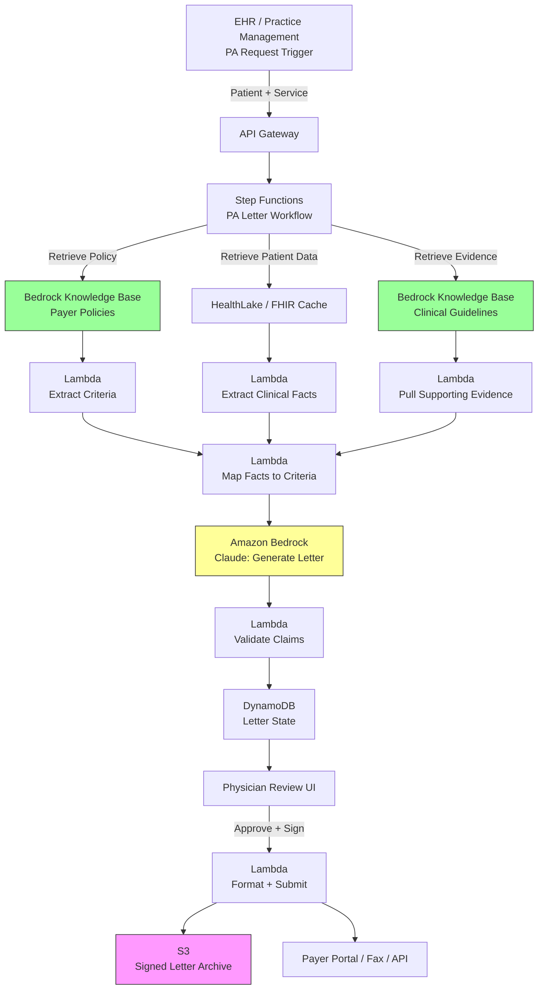

# Recipe 2.4: Prior Authorization Letter Generation

**Complexity:** Medium · **Phase:** MVP → Production · **Estimated Cost:** ~$0.10-0.30 per letter <!-- TODO: recompute cost against actual multi-call pipeline (Step 2 extraction, Step 3 per-criterion fact extraction, Step 4 per-criterion mapping, Step 6 generation). Expert review flagged the current range as ~5-10x optimistic for a typical 10-criterion PA on Claude Sonnet 4. -->

---

## The Problem

A rheumatologist needs to prescribe a biologic for a patient with rheumatoid arthritis. The patient has failed methotrexate, has documented disease activity, and meets every clinical criterion the payer has published for approval. This should be a fifteen-minute decision. Instead, it becomes a four-hour project.

Someone on the practice's staff (usually a medical assistant, a nurse, or a dedicated prior authorization coordinator) has to write a letter of medical necessity. They pull the patient's chart. They find the DAS28 scores. They locate the methotrexate trial notes. They dig up the ACR guidelines that support the switch to a biologic. They track down the payer's specific coverage policy for adalimumab, which is a 14-page PDF buried three clicks deep on the payer's provider portal. They read it, identify the six criteria the payer requires, and then they start writing.

The letter has to be persuasive but factual. It has to tie specific patient findings to specific payer criteria. It has to cite supporting evidence. It has to be signed by the physician. It has to be faxed or uploaded through the payer's portal (which has its own upload quirks, which sometimes breaks). Then everyone waits.

The American Medical Association's annual prior authorization survey reports that practices handle roughly 45 prior authorizations per physician per week, that physicians and staff spend an average of 14 hours per week on prior authorization work, and that 94% of physicians report care delays attributable to prior authorization. <!-- TODO: verify specific statistics against the latest AMA Prior Authorization Physician Survey -->

The letter itself typically takes 20 to 30 minutes to write, and that's assuming the writer is experienced and has the source documents at hand. New staff take longer. Complex cases (oncology, rare diseases, off-label requests) can take hours. A practice with 15 physicians processes roughly 600 to 700 prior authorizations per week. That's the equivalent of 2-3 full-time employees writing letters, which is exactly what many practices do: staff whose only job is composing prior auth narratives all day.

Here's the thing that makes this problem particularly interesting for AI: the writing is highly templated. Every letter for rheumatoid arthritis biologics looks roughly the same. Every letter for bariatric surgery looks roughly the same. The patient details vary, the payer criteria vary, but the structure of the argument is consistent: here is the patient, here is the condition, here is what they've tried, here is why the requested service is medically necessary, here is the supporting evidence. This is the kind of structured synthesis task that LLMs are genuinely good at.

The economic impact of getting this right is substantial. If you can reduce letter composition time from 25 minutes to 5 minutes of physician review, you recover roughly 13 hours per physician per week. For a mid-sized practice, that's the equivalent of eliminating a full staff position dedicated to prior auth writing, or redeploying that person to higher-value work. For the patient, it's the difference between starting therapy next Monday and starting therapy next month.

This recipe is about the generation side of prior auth. Recipe 1.4 covered the flip side: ingesting and processing prior auth submissions as a payer. This one is about being the provider who has to send those submissions in, and using an LLM to write the narrative letter rather than typing it by hand.

---

## The Technology: Grounded Generation for Structured Persuasion

### What a Prior Auth Letter Actually Is

Before we talk about how to generate these with an LLM, it's worth dissecting what a good prior auth letter actually contains. The structure is remarkably consistent across specialties and payers:

1. **Patient identification.** Name, date of birth, member ID, diagnosis codes. This is purely administrative.
2. **Clinical background.** The patient's diagnosis, how it was established, relevant history. This is where you establish the medical context.
3. **Treatment history.** What's been tried, what worked, what didn't, and why. This is the most important section for payer review. Step therapy requirements live here.
4. **Clinical rationale for the requested service.** Why this specific service, why now, why this patient. This is where the letter has to be persuasive without overreaching factually.
5. **Reference to payer criteria.** A direct mapping from the patient's facts to the payer's published coverage criteria. Good letters explicitly say "the patient meets criterion X because of finding Y."
6. **Supporting evidence.** Clinical guidelines, peer-reviewed studies, professional society recommendations. This anchors the request in the medical literature.
7. **Signature and credentials.** Provider name, NPI, specialty, license. This establishes the prescribing authority.

Every one of those sections draws from a different source. The patient identification and clinical background come from the EHR. The treatment history requires parsing clinical notes. The payer criteria come from the payer's medical policy (typically a PDF on their provider portal). The supporting evidence comes from published guidelines and literature. The signature is provider-specific metadata.

A human writer synthesizes all of this from memory, from the chart, and from open browser tabs. An AI system has to do it from retrieval. Which is what makes this problem an archetypal RAG application.

### Why LLMs Are Genuinely Good at This

LLMs are excellent at taking a set of facts and weaving them into structured prose that follows a specific rhetorical pattern. This is a task that pre-LLM NLP could not do well. Template-based letter generation (mail merge, essentially) produced output that read as mechanical and missed the nuance of tying specific findings to specific criteria. Rule-based systems couldn't handle the variability in how clinical information is expressed.

Modern LLMs handle this well because:

**They understand medical language natively.** A model that has been trained on clinical text understands that "DAS28 score of 5.8" indicates high disease activity in rheumatoid arthritis, that "methotrexate 25mg weekly for 16 weeks with inadequate response" satisfies a typical step therapy requirement, and that "ACR guidelines recommend biologic therapy after inadequate DMARD response" is the right citation to anchor the request.

**They can follow structured rhetorical patterns.** Given an explicit letter template and a set of facts, an LLM can produce output that fits the template while sounding natural. The failure mode of earlier systems (formulaic, obviously auto-generated prose) is largely solved.

**They can map between sources.** Given the patient's clinical facts on one side and the payer's coverage criteria on the other side, an LLM can produce text that explicitly connects them. "Criterion 3 requires documented disease activity. The patient's DAS28 score of 5.8, documented on 2026-03-15, satisfies this criterion." This explicit mapping is what makes a letter persuasive to a reviewer working through a checklist.

**They handle payer-specific voice.** Different payers favor different tones. Some want formal clinical language. Some want concise bullet-pointed structures. Some want narrative prose that reads like a consult note. An LLM can be instructed to produce any of these styles with prompt engineering alone, without retraining.

### The Failure Modes You Have to Design Around

**Hallucinated clinical facts.** The model confabulates a lab value, a date, or a trial duration that isn't actually in the patient's record. In prior auth, this isn't just embarrassing; it's potentially fraudulent. A letter that asserts the patient had a 16-week methotrexate trial when the chart shows 8 weeks is a false claim. If the payer audits and the discrepancy surfaces, your practice has a problem.

The mitigation: never let the model generate clinical facts from its prior knowledge. Extract structured facts from the patient record first, validate them, and then provide them to the model as authoritative input. Instruct the model to only use provided facts and to explicitly refuse to generate claims that aren't supported by the input.

**Payer criteria drift.** Payer medical policies change. Sometimes quarterly. Sometimes in response to new evidence. Sometimes because the payer changed their PBM contract. A letter that cites criteria from last year's policy will fail current review. This is a retrieval freshness problem. Your policy repository has to be maintained, which means someone (or some automated process) has to pull updated policies from every payer you work with.

**Over-confident tone.** LLMs, by default, produce confident prose. A prior auth letter needs to be assertive about the medical need, but it also needs to acknowledge legitimate clinical uncertainty where it exists. A letter that says "the patient will definitely respond to adalimumab" is both clinically wrong and rhetorically counterproductive. A letter that says "the clinical evidence supports adalimumab as the appropriate next-line therapy given the patient's inadequate response to first-line DMARDs" is factually grounded and persuasively framed.

**Citation fabrication.** Ask an LLM to cite supporting literature and it will happily generate plausible-looking journal citations that don't exist. The model confabulates author names, journal titles, and DOIs with high confidence. The mitigation: use retrieval for citations. Pull from a vetted literature corpus or a guideline repository. Never let the model generate citations from its training data alone.

<!-- TODO: expert review (S4) recommended adding a short paragraph here on input-side prompt-injection risk. When clinical note content originates from weakly controlled channels (patient portal messages, OCR of faxed outside records, external referrals), an adversarial string in a note field could attempt to override the grounding constraint and instruct the model to fabricate claims or cite nonexistent literature. The suggested mitigation is configuring Bedrock Guardrails with input-side prompt-attack filters in addition to output filters, and treating EHR-sourced structured data and free-text narrative content as different trust tiers. -->

**Payer-specific formatting.** Most payers accept letters in PDF format submitted through a portal. Some require specific fields in specific places. Some want structured JSON submitted via API (the HL7 DaVinci project is pushing toward this, and CMS-0057-F is accelerating it). Your generation pipeline has to produce the right output format for each payer, which means the architecture has to support multiple output modalities from a common content core.

**Physician sign-off friction.** A generated letter is only valuable if the physician signs it. If the review workflow is cumbersome (print, read, sign, scan, upload), the time savings evaporate. The integration with clinical workflows matters as much as the letter quality.

### Grounded Generation: The Architectural Answer

The pattern that makes prior auth letter generation viable is grounded generation, which is a specific flavor of Retrieval-Augmented Generation adapted for letter composition. The idea:

1. Before generating anything, retrieve the authoritative source materials: patient facts, payer criteria, clinical guidelines.
2. Extract the specific facts that will be referenced in the letter. Validate them against the source documents. Store them as structured data.
3. Generate the letter with explicit instructions to use only the provided facts and citations, and to map each claim in the letter back to a source.
4. Verify the generated letter: every factual claim should trace to a source document; every citation should match a real reference.
5. Present the letter to the physician for review with the source provenance visible, so they can audit the claims quickly.

The key architectural principle: the model is a prose composer, not a fact source. Facts come from retrieval. Claims come from extraction. Citations come from a vetted corpus. The model's job is to weave these elements into a coherent, persuasive narrative that fits the payer's expected structure. This separation is what makes the output auditable and the system safe enough to deploy.

### Where This Differs From Simpler LLM Applications

Recipe 2.1 (patient message drafting) works with a single input (the inbound message) and produces a single output (the draft reply). Recipe 2.2 (terminology simplification) works with a single input (the clinical text) and produces a transformed output. Recipe 2.3 (CDI suggestions) analyzes a single note against a set of guidelines.

Prior auth letter generation is different because it's fundamentally a synthesis task across multiple disparate sources. You need:

- Patient clinical data (from the EHR, possibly across multiple encounters)
- Payer-specific coverage criteria (from the payer's medical policy)
- Clinical guidelines (from professional societies, published literature)
- The requested service details (from the order or referral)
- Provider credentials (from practice metadata)

Each of these lives in a different system, has a different update cadence, and requires different extraction approaches. The architecture has to orchestrate retrieval across all of them before generation can begin. That orchestration is where most of the engineering work lives. The LLM call itself is the smallest engineering problem in the pipeline.

---

## The General Architecture Pattern

At the conceptual level, the pipeline looks like this:

```
[Prior Auth Request Submitted] 
    → [Identify Payer + Requested Service] 
    → [Retrieve Payer Coverage Policy] 
    → [Extract Criteria Checklist from Policy] 
    → [Retrieve Patient Clinical Data] 
    → [Extract Relevant Clinical Facts] 
    → [Map Facts to Criteria] 
    → [Retrieve Supporting Evidence] 
    → [Generate Letter Narrative] 
    → [Validate Claims Against Sources] 
    → [Present for Physician Review] 
    → [Finalize and Submit]
```

Let's walk through each stage conceptually.

**Identify payer and requested service.** The trigger for the whole pipeline. Comes from the provider's workflow: a clinician orders a procedure, a medication, or a referral that requires prior auth. The system needs to know which payer covers this patient and what service is being requested. This is typically an integration problem with the EHR or the practice management system.

**Retrieve payer coverage policy.** Every payer publishes coverage policies for services that require prior auth. These are typically PDFs on the payer's provider portal. Retrieving them programmatically is harder than it sounds: most payers don't offer APIs. You may be pulling PDFs from portals, parsing them, and caching the extracted content. This is a recurring maintenance burden.

**Extract criteria checklist from policy.** Once you have the policy, you need to extract the specific criteria the payer will check. A coverage policy for a biologic might include criteria like "documented diagnosis of rheumatoid arthritis," "inadequate response to at least one non-biologic DMARD for at least 12 weeks," "negative tuberculosis screening within 6 months." These criteria become the rubric against which the patient's clinical facts will be mapped.

**Retrieve patient clinical data.** From the EHR, pull everything relevant: diagnoses, medication history, lab values, clinical notes, prior treatments. The scope of "relevant" depends on the requested service. For a biologic, you need disease activity measures, prior DMARD trials, TB screening, and relevant labs. For bariatric surgery, you need BMI history, prior weight loss attempts, comorbidity documentation.

**Extract relevant clinical facts.** Raw clinical data is unstructured. You need to parse it into discrete facts that can be mapped to criteria. "Methotrexate 25mg weekly from 2025-07-01 to 2025-10-15" is a fact. "DAS28 score of 5.8 on 2026-03-10" is a fact. "Negative QuantiFERON-TB on 2026-02-15" is a fact. This is typically done with a combination of structured data queries (for coded data in the EHR) and LLM-based extraction (for information that lives only in free-text notes).

**Map facts to criteria.** For each criterion in the payer's checklist, identify the patient facts that satisfy it. This mapping is the substance of the prior auth argument. Done well, the mapping is explicit and traceable: criterion X is satisfied by fact Y, documented on date Z. Done poorly, the mapping is hand-wavy and the letter is weak.

**Retrieve supporting evidence.** Clinical guidelines and literature that support the request. For rheumatoid arthritis biologics, that's the ACR treatment guidelines. For bariatric surgery, the ASMBS guidelines. This evidence is retrieved from a vetted corpus (never generated by the LLM from its training data) and gets cited in the letter.

**Generate letter narrative.** Finally, the LLM call. Inputs: the letter template, the extracted patient facts, the criteria-to-fact mapping, the supporting evidence, the payer-specific tone requirements. Output: a draft letter that weaves these elements into structured, persuasive prose. The prompt enforces grounding: use only the provided facts, cite only the provided evidence, explicitly map each claim to a source.

**Validate claims against sources.** Every factual claim in the letter should trace back to a source document. A validation layer parses the generated letter, identifies factual assertions, and checks that each one appears in the input facts. Claims that can't be traced get flagged for physician review.

**Present for physician review.** The generated letter is shown to the prescribing physician along with source provenance: each claim links to the source fact, each citation links to the retrieved evidence. The physician reviews quickly, edits if needed, and signs. This is where the time savings live: reducing a 25-minute composition task to a 3-5 minute review task.

**Finalize and submit.** The signed letter is formatted for the payer's submission mechanism: PDF for portal upload, structured data for API submission (for payers supporting the DaVinci PAS or PAO FHIR profiles), or fax for legacy payers. Submission status is tracked for follow-up.

This is a lot of machinery. The LLM call is one step in a pipeline of ten or twelve, and most of the engineering complexity lives in the non-LLM steps. Retrieval, extraction, mapping, and validation are where the system lives or dies. The generation is almost easy once you've done the rest correctly.

---

## The AWS Implementation

### Why These Services

**Amazon Bedrock for LLM inference.** The core generation step needs a model that writes well-structured clinical prose and follows detailed instructions. Claude models on Bedrock handle this well: they follow complex templates, respect grounding constraints, and produce natural medical writing. Bedrock gives you model access without infrastructure, a consistent API across model versions (so you can swap Claude for Nova or a future model without code changes), and HIPAA eligibility under the AWS BAA. For letter generation, you want a capable model because the synthesis task is non-trivial; budget for Claude Sonnet or equivalent rather than the smallest models.

**Amazon Bedrock Knowledge Bases for payer policies and clinical evidence.** Two separate knowledge bases, actually. One holds the current coverage policies from your contracted payers (updated on a recurring schedule as policies change). The other holds clinical guidelines and vetted literature used for citations. Knowledge Bases handles the vector embedding, chunking, and retrieval pipeline. At generation time, you retrieve the specific policy for this payer and service, and the relevant guidelines for this condition.

**Amazon S3 for document storage.** Three buckets in practice: one for raw patient clinical data extracts, one for generated letter drafts, and one for finalized signed letters. S3 is the audit trail. Every letter the system produces should be retrievable years later, along with the inputs that produced it. HIPAA retention requirements typically run six years, sometimes longer.

**AWS Lambda for orchestration.** The pipeline is a sequence of retrieval and generation steps, each of which is an API call. Lambda orchestrates these without managing servers. For a production deployment, you'll likely split the pipeline across multiple Lambda functions (one per logical stage) coordinated by Step Functions, which gives you better observability, retry logic, and failure handling.

**AWS Step Functions for workflow orchestration.** Once you're past the proof-of-concept, a multi-step pipeline with external retrievals and human review deserves a proper state machine. Step Functions handles the choreography: run retrievals in parallel, wait for physician review, retry failed submissions, branch on payer type. The visual workflow also gives operations staff something concrete to look at when debugging a stuck case. <!-- TODO: expert review (A2) recommended specifying the human-in-the-loop pattern explicitly. The physician-review wait should use Step Functions task tokens (`waitForTaskToken`): the generation Lambda completes by emitting a task token bound to the case, and the review UI calls `SendTaskSuccess` with the signed letter (or `SendTaskFailure` if the physician rejects the draft). This avoids polling DynamoDB from within Step Functions (which adds state-transition cost at scale) and gives the workflow a clean wait-for-signal semantic. Task tokens can live up to one year, comfortably longer than any reasonable PA review SLA. -->

**Amazon Textract for payer policy extraction.** Payer medical policies arrive as PDFs. Textract pulls the text and structure out of them so that Knowledge Bases can index the content. For well-formatted payer documents, Textract's form and table detection is sufficient. For older or scanned policies, you may need additional cleanup steps.

**Amazon HealthLake for patient data access.** If you've standardized on FHIR for clinical data access, HealthLake is the natural store for the patient records you're reading from. If you're pulling directly from an EHR via FHIR APIs, HealthLake becomes a caching layer to avoid hammering the EHR for every prior auth. Alternative: if your data is already in an EHR-integrated data platform, you may not need HealthLake at all.

**Amazon DynamoDB for pipeline state tracking.** Each prior auth request moves through stages: received, retrieving, generating, awaiting review, submitted, approved, denied. DynamoDB tracks the state and supports the operational dashboards and reporting that practice management needs. Sub-millisecond lookups for "show me all PA requests from Dr. Smith this week" are important when you have staff monitoring queues.

**Amazon API Gateway for physician review UI.** The physician review interface lives somewhere (ideally integrated with the EHR, but often as a standalone web app during initial deployment). API Gateway fronts the backend services that serve the draft letter, accept edits, and record the signature.

**AWS CloudTrail and Amazon CloudWatch for audit and monitoring.** Every Bedrock call, every document retrieval, every letter generation gets logged. HIPAA audit requirements and practice malpractice liability both demand comprehensive logging. CloudWatch also tracks operational metrics: letters generated per day, average time-to-submission, physician acceptance rate, payer approval rate.

### Architecture Diagram



### Prerequisites

| Requirement | Details |
|-------------|---------|
| **AWS Services** | Amazon Bedrock, Bedrock Knowledge Bases, Amazon S3, AWS Lambda, AWS Step Functions, Amazon DynamoDB, Amazon API Gateway, Amazon Textract, Amazon HealthLake (optional), Amazon CloudWatch |
| **IAM Permissions** | `bedrock:InvokeModel`, `bedrock:Retrieve`, `bedrock:RetrieveAndGenerate`, `s3:GetObject`, `s3:PutObject`, `dynamodb:PutItem`, `dynamodb:UpdateItem`, `dynamodb:Query`, `states:StartExecution`, `healthlake:SearchWithGet`, `textract:StartDocumentAnalysis` <!-- TODO: scope each action to specific resource ARNs (KB ARNs, foundation-model ARN, bucket ARNs, table ARN, HealthLake datastore ARN) and add `kms:Decrypt` / `kms:GenerateDataKey` for the CMK. Expert review flagged recurring least-privilege gap across Chapter 2. --> |
| **BAA** | AWS BAA signed (required: letters contain PHI). Payer policy content is not PHI but clinical facts extracted from patient data are. |
| **Bedrock Model Access** | Request access to Claude Sonnet (or equivalent capable model) in the Bedrock console. Letter generation benefits from a stronger model; do not use the smallest tier. |
| **EHR Integration** | FHIR R4 access to clinical data (direct API or via HealthLake). SMART on FHIR for EHR-embedded workflows (Epic App Orchard, Cerner Code). |
| **Payer Policy Ingestion** | Recurring process (scheduled Lambda or manual) to pull updated policies from each contracted payer's provider portal. Budget 2-4 hours per payer per quarter for policy maintenance. |
| **Encryption** | S3: SSE-KMS with customer-managed keys; DynamoDB: encryption at rest with CMK; Bedrock: TLS in transit and encryption at rest; CloudWatch Logs: KMS encryption <!-- TODO: expert review (S3) flagged that if Bedrock model-invocation-logging is enabled for quality monitoring or drift analysis, the logged prompts contain PHI (extracted clinical facts, patient identifiers). The log destination bucket or log group must be KMS-encrypted with the same CMK, access-controlled equivalently, and subject to the same retention policy as the primary PHI stores. Consider sampling model-invocation logs rather than logging every call. --> |
| **VPC** | Production: all Lambda functions in VPC with VPC endpoints for S3, Bedrock, DynamoDB, Step Functions <!-- TODO: expand endpoint list to include `bedrock-agent-runtime` (KB retrieve), `kms`, `textract`, `healthlake`, `logs`, `monitoring`, `secretsmanager`, and `states`. Several of these are required for this pipeline to start in a private subnet. --> |
| **CloudTrail** | Enabled with data events: log all Bedrock invocations, S3 object access, and HealthLake queries for HIPAA audit |
| **Sample Data** | Synthetic patient cases matched to publicly available payer coverage policies. Never use real patient data in development. Synthea is a useful source of synthetic FHIR data. |
| **Cost Estimate** | Bedrock generation (Claude Sonnet): ~$0.05-0.15 per letter depending on length. Knowledge Base retrieval: ~$0.002 per request. Textract policy extraction: ~$1.50 per policy (done once per policy update, cached). Lambda + Step Functions + DynamoDB: negligible at typical volumes. End-to-end: ~$0.10-0.30 per generated letter. <!-- TODO: rebuild breakdown accounting for per-criterion extraction in Step 3 and per-criterion mapping in Step 4 (approximately 22+ Bedrock calls per case for a 10-criterion PA). Expert review estimated realistic end-to-end cost at ~$1.50-$2.50 per letter on Claude Sonnet 4. --> |

### Ingredients

| AWS Service | Role |
|------------|------|
| **Amazon Bedrock** | LLM inference for criteria extraction, fact mapping, and letter generation |
| **Bedrock Knowledge Bases (payer policies)** | Retrieval of payer-specific coverage criteria |
| **Bedrock Knowledge Bases (clinical evidence)** | Retrieval of guidelines and literature for citations |
| **Amazon HealthLake** | FHIR-native storage of patient clinical data (optional cache layer) |
| **Amazon S3** | Letter drafts, signed letters, audit archives |
| **AWS Lambda** | Per-stage pipeline logic |
| **AWS Step Functions** | Multi-stage workflow orchestration with state persistence |
| **Amazon DynamoDB** | Pipeline state and letter lifecycle tracking |
| **Amazon API Gateway** | Backend API for physician review interface |
| **Amazon Textract** | Payer policy PDF extraction for knowledge base ingestion |
| **AWS KMS** | Encryption key management |
| **Amazon CloudWatch + CloudTrail** | Monitoring, metrics, and HIPAA audit logging |

### Code

#### Walkthrough

**Step 1: Receive the prior auth request and identify context.** The trigger for the pipeline comes from the clinician's workflow: they order a service that requires prior authorization. The EHR or practice management system sends the request to your pipeline with the essentials: patient ID, payer ID, requested service code, ordering provider. The first step stores this context and initializes the workflow state. <!-- TODO: expert review (A4) flagged that duplicate PA submissions from the EHR (retry on perceived timeout, user double-click, duplicate HL7 ADT events) will create two cases with two UUIDs, two full pipeline runs, and two letters potentially submitted to the payer. Suggest adding an idempotency step: derive a deterministic request fingerprint from `(patient_id, payer_id, service_code, diagnosis_code, order_datetime)` and use a DynamoDB conditional write (`attribute_not_exists(fingerprint)`) before starting a new case. If the fingerprint already exists, return the existing case_id instead of starting a second Step Functions execution. -->

```
FUNCTION receive_pa_request(request):
    // The request payload includes everything we need to kick off the pipeline.
    // request.patient_id:        the patient this is for
    // request.payer_id:          the payer we're submitting to
    // request.service_code:      CPT, HCPCS, or drug code for the requested service
    // request.diagnosis_code:    ICD-10 code supporting the request
    // request.provider_id:       the ordering physician
    // request.urgency:           standard or expedited (affects turnaround expectations)
    
    // Create a new case record that will accumulate state through the pipeline
    case_id = generate UUID
    
    write to DynamoDB table "pa-cases":
        case_id          = case_id
        status           = "INITIATED"
        patient_id       = request.patient_id
        payer_id         = request.payer_id
        service_code     = request.service_code
        diagnosis_code   = request.diagnosis_code
        provider_id      = request.provider_id
        urgency          = request.urgency
        created_at       = current UTC timestamp
        target_deadline  = created_at + (24 hours if urgency == "expedited" else 72 hours)
    
    // Start the Step Functions workflow for this case
    start Step Functions execution:
        state_machine = "PALetterGenerationWorkflow"
        input         = { case_id: case_id }
    
    RETURN case_id
```

**Step 2: Retrieve the payer's coverage policy and extract criteria.** This is where you turn a payer's PDF medical policy into a structured checklist of criteria. Because policies change, this is a retrieval-plus-extraction step each time (though you can cache heavily). The criteria extraction uses the LLM to parse the policy prose into a structured list of conditions that the patient must meet.

```
FUNCTION retrieve_and_extract_criteria(payer_id, service_code, diagnosis_code):
    // First, retrieve the relevant policy from the payer-policies knowledge base.
    // The knowledge base contains the current medical policies for all contracted payers.
    
    query = "{payer_id} coverage policy for service {service_code} diagnosis {diagnosis_code}"
    
    policy_chunks = call Bedrock.KnowledgeBase.Retrieve with:
        knowledge_base_id = PAYER_POLICIES_KB_ID
        query             = query
        max_results       = 10    // policies can span multiple chunks
    
    // If no policy found, this service may not require PA for this payer
    // (or our knowledge base is stale and needs updating)
    IF policy_chunks is empty:
        log warning: "No policy found for {payer_id} / {service_code}"
        RETURN { criteria: [], policy_found: false }
    
    // Concatenate the retrieved policy content and extract the criteria list.
    // This is an LLM call because policies are prose, not structured data.
    
    policy_text = concatenate all text from policy_chunks
    
    extraction_prompt = """
    The following is a payer's coverage policy for a specific service. Extract the 
    specific clinical criteria that must be met for coverage approval.
    
    Return as structured JSON. Each criterion should have:
    - criterion_id:     a short identifier (e.g., "C1", "C2")
    - description:      the criterion in plain language
    - evidence_type:    what kind of clinical evidence satisfies this (e.g., "lab value", 
                        "medication history", "diagnostic finding")
    - required:         true if mandatory, false if one of several alternatives
    - source_section:   which part of the policy this criterion came from
    
    If the policy has "meet at least N of the following" structure, note that in the output.
    
    POLICY TEXT:
    {policy_text}
    """
    
    response = call Bedrock.InvokeModel with:
        model_id    = "anthropic.claude-sonnet-4"    // illustrative; the concrete Bedrock model ID is versioned (e.g., "us.anthropic.claude-sonnet-4-20250514-v1:0"). See the Python companion for a working value.
        prompt      = extraction_prompt
        max_tokens  = 4096
        temperature = 0.0    // deterministic extraction, no creativity needed
    
    criteria = parse JSON from response
    
    // Cache this for the current policy version to avoid re-extracting on every letter
    write to S3: "policy-criteria-cache/{payer_id}/{service_code}/criteria.json" = criteria
    
    RETURN { criteria: criteria, policy_found: true, policy_source: policy_chunks }
```

**Step 3: Retrieve patient clinical data and extract relevant facts.** Now you pull the patient's clinical information from the EHR (or from HealthLake if you're caching) and extract the specific facts that map to the criteria identified in Step 2. This is where you translate unstructured clinical data into discrete, verifiable facts. <!-- TODO: expert review (S2) flagged that the pseudocode below pulls two years of clinical data across six FHIR resource types plus unstructured notes, then sends that payload to the model in a loop (one call per criterion). That is the opposite of HIPAA minimum necessary. A production implementation should scope the FHIR query by specialty-relevant resource categories and a shorter default window (12 months, extendable if a specific criterion demands longer history) and consider per-call redaction of identifiers (patient name, MRN, DOB) the LLM does not need to see. Add a paragraph here framing the production scoping requirement without rewriting the pseudocode. -->

```
FUNCTION retrieve_patient_facts(patient_id, criteria, diagnosis_code):
    // Pull the patient's relevant clinical data. The scope of "relevant" is driven
    // by what criteria we need to satisfy.
    
    // Step 3a: fetch the patient's FHIR resources relevant to this request
    patient_data = call HealthLake.SearchResources with:
        resource_types = ["Patient", "Condition", "MedicationStatement", 
                         "Observation", "DiagnosticReport", "Procedure"]
        patient_id     = patient_id
        date_range     = last 2 years    // adjustable by service type
    
    // Step 3b: fetch unstructured clinical notes (from S3 if extracted, or from the EHR)
    notes = fetch clinical notes for patient_id, last 2 years
    
    // Step 3c: for each criterion, extract facts that could satisfy it.
    // We do this as one LLM call per criterion OR one call with all criteria 
    // (batch is cheaper but harder to trace; individual is easier to audit).
    
    facts = empty list
    
    FOR each criterion in criteria:
        extraction_prompt = """
        You are extracting clinical facts from a patient's record to determine whether 
        they satisfy a specific coverage criterion.
        
        CRITERION: {criterion.description}
        EVIDENCE REQUIRED: {criterion.evidence_type}
        
        STRUCTURED CLINICAL DATA:
        {patient_data as JSON}
        
        CLINICAL NOTES:
        {notes text}
        
        Identify all facts in the patient's record that are relevant to this criterion. 
        Return as JSON list of facts, where each fact includes:
        - fact:            the specific finding or observation
        - value:           the clinical value (e.g., "DAS28 score 5.8", "methotrexate 25mg weekly x 16 weeks")
        - date:            when this was documented (ISO format)
        - source:          which document or resource this came from (e.g., "progress note 2026-03-15", "lab result Observation/abc123")
        - supports:        true if this fact supports the criterion, false if it contradicts
        - verbatim_quote:  the exact text from the source (for verification)
        
        Only include facts that are actually present in the provided data. 
        Do NOT infer or extrapolate. Do NOT use your prior knowledge of similar patients.
        If no relevant facts exist, return an empty list for that criterion.
        """
        
        response = call Bedrock.InvokeModel with:
            model_id    = "anthropic.claude-sonnet-4"
            prompt      = extraction_prompt
            max_tokens  = 2048
            temperature = 0.0
        
        criterion_facts = parse JSON from response
        
        append {
            criterion_id: criterion.criterion_id,
            facts:        criterion_facts
        } to facts
    
    RETURN facts
```

**Step 4: Map facts to criteria and identify gaps.** With criteria on one side and facts on the other, determine which criteria are satisfied, which have partial evidence, and which are unmet. This mapping is the substance of the prior auth argument. Gaps identified here are either flagged for the physician to address before submission or become reasons to not submit at all.

```
FUNCTION map_facts_to_criteria(criteria, facts):
    // For each criterion, assess whether the available facts satisfy it.
    // This is mostly rule-based with LLM assistance for judgment calls.
    
    mappings = empty list
    
    FOR each criterion in criteria:
        relevant_facts = facts[criterion.criterion_id]    // facts extracted for this criterion
        supporting_facts = [f for f in relevant_facts where f.supports == true]
        contradicting_facts = [f for f in relevant_facts where f.supports == false]
        
        // Determine satisfaction status. Use an LLM call for criteria that require 
        // clinical judgment (e.g., "adequate trial of DMARD therapy").
        
        assessment_prompt = """
        Assess whether this criterion is satisfied by the available patient facts.
        
        CRITERION: {criterion.description}
        SUPPORTING FACTS: {supporting_facts as JSON}
        CONTRADICTING FACTS: {contradicting_facts as JSON}
        
        Return structured JSON:
        - status:           "SATISFIED", "PARTIAL", "UNMET", or "CONTRADICTED"
        - rationale:        brief explanation
        - key_facts:        the specific facts that drive the assessment
        - evidence_gap:     if partial or unmet, what additional evidence would satisfy it
        """
        
        response = call Bedrock.InvokeModel with:
            model_id    = "anthropic.claude-sonnet-4"
            prompt      = assessment_prompt
            max_tokens  = 1024
            temperature = 0.1
        
        assessment = parse JSON from response
        
        append {
            criterion:    criterion,
            status:       assessment.status,
            rationale:    assessment.rationale,
            key_facts:    assessment.key_facts,
            evidence_gap: assessment.evidence_gap
        } to mappings
    
    // Aggregate: if any required criterion is UNMET or CONTRADICTED, the letter
    // is not defensible. Flag these cases for physician review BEFORE generation.
    
    unmet_required = [m for m in mappings where 
                      m.criterion.required == true 
                      and m.status in ("UNMET", "CONTRADICTED")]
    
    IF unmet_required is not empty:
        RETURN {
            mappings:       mappings,
            ready_to_draft: false,
            blocking_gaps:  unmet_required
        }
    
    RETURN {
        mappings:       mappings,
        ready_to_draft: true,
        blocking_gaps:  []
    }
```

**Step 5: Retrieve supporting evidence for citations.** Based on the condition and requested service, pull relevant clinical guidelines and literature from the evidence knowledge base. These will be cited in the letter to anchor the request in established medical practice. The key architectural rule: every citation in the letter comes from this retrieval, never from the model's prior knowledge.

```
FUNCTION retrieve_supporting_evidence(diagnosis_code, service_code, key_facts):
    // Retrieve guidelines and literature that support the use of this service 
    // for this diagnosis in patients like this one.
    
    // Build a retrieval query combining diagnosis, service, and salient clinical features
    query_terms = [
        diagnosis_code_to_name(diagnosis_code),
        service_code_to_name(service_code),
        "treatment guidelines",
        "clinical evidence"
    ]
    
    // Include distinctive clinical features from the key facts 
    // (e.g., if the patient has failed two DMARDs, search for guidelines on that specific scenario)
    FOR each fact in key_facts:
        IF fact is distinctive:
            append fact.value to query_terms
    
    query = join query_terms with " "
    
    evidence = call Bedrock.KnowledgeBase.Retrieve with:
        knowledge_base_id = CLINICAL_EVIDENCE_KB_ID
        query             = query
        max_results       = 8
    
    // Each piece of retrieved evidence has a citation reference. 
    // These are pre-populated in the knowledge base with verified bibliographic info.
    
    citations = empty list
    FOR each chunk in evidence:
        IF chunk has citation metadata:
            append {
                citation_text: chunk.metadata.citation,
                source_url:    chunk.metadata.url,
                content:       chunk.text,
                relevance:     chunk.score
            } to citations
    
    RETURN citations
```

**Step 6: Generate the letter narrative.** Finally, the actual letter generation. All inputs are now structured: the criteria with status, the supporting facts with provenance, the citations with verified references, and the payer's expected letter format. The LLM weaves these into prose that fits the payer's template and reads as persuasive clinical writing.

```
FUNCTION generate_letter(case, mappings, citations, patient_info, provider_info, payer_info):
    // Build the generation prompt. This is where prompt engineering lives.
    // The prompt enforces: use only provided facts, cite only provided evidence,
    // map each claim to a source, follow the specified structure.
    
    letter_prompt = """
    You are drafting a letter of medical necessity for a prior authorization submission. 
    
    STRICT RULES:
    - Use ONLY the facts and citations provided below. Do NOT introduce outside information.
    - Every factual claim must reference a specific provided fact by its source date.
    - Every citation must be one from the provided citations list. Do NOT fabricate references.
    - Write in professional clinical prose appropriate for payer medical review.
    - Follow the structure specified below exactly.
    - If a required criterion cannot be substantiated with the provided facts, state that it requires additional documentation rather than making unsupported claims.
    
    LETTER STRUCTURE:
    1. Patient identification (use provided patient_info)
    2. Clinical background (diagnosis and how established)
    3. Treatment history to date (based on provided facts)
    4. Clinical rationale for requested service
    5. Explicit mapping to payer coverage criteria (one paragraph per criterion)
    6. Supporting evidence with citations
    7. Closing with provider attestation
    
    PATIENT INFO:
    {patient_info}
    
    REQUESTING PROVIDER:
    {provider_info}
    
    PAYER AND SERVICE CONTEXT:
    Payer: {payer_info.name}
    Requested service: {case.service_code} ({case.service_description})
    Diagnosis: {case.diagnosis_code}
    
    PAYER COVERAGE CRITERIA AND FACT MAPPING:
    {mappings as JSON}
    
    AVAILABLE CITATIONS:
    {citations as JSON}
    
    Produce the letter as a single document. After the letter, include a JSON block 
    listing every factual claim with its source fact ID and every citation used, 
    so the claims can be verified against sources.
    """
    
    response = call Bedrock.InvokeModel with:
        model_id    = "anthropic.claude-sonnet-4"
        prompt      = letter_prompt
        max_tokens  = 6000
        temperature = 0.2    // low but non-zero for natural prose variation
    
    letter_draft = parse letter content from response
    provenance   = parse provenance JSON from response
    
    // Store the draft with full provenance for validation in the next step
    write to S3: "letter-drafts/{case.case_id}/draft.json" = {
        letter:     letter_draft,
        provenance: provenance,
        inputs: {
            mappings:  mappings,
            citations: citations
        }
    }
    
    RETURN { letter: letter_draft, provenance: provenance }
```

**Step 7: Validate claims and prepare for physician review.** Before the letter goes to the physician, a validation step checks that every factual claim in the letter traces back to a source fact and that every citation matches a retrieved reference. This catches hallucinations the model may have introduced despite the prompt constraints. <!-- TODO: expert review (A3) flagged that `REQUIRES_REGENERATION` does not define retry semantics. A naive implementation will loop indefinitely at the same temperature and prompt, burning cost without changing outputs. Suggest adding guidance: cap retries at 2-3 attempts, vary the strategy on each retry (temperature=0 for the first retry, then an explicit negative-constraint prompt on the second retry naming the previously-fabricated claims, then escalate to human composition after exhaustion), track retry counts per case in DynamoDB, and emit a metric when a case exhausts retries. -->

```
FUNCTION validate_letter(letter, provenance, inputs):
    // Check that every claimed fact exists in the inputs
    unverified_claims = empty list
    FOR each claim in provenance.factual_claims:
        matching_fact = find fact in inputs.mappings where fact.id == claim.source_fact_id
        IF matching_fact is None:
            append claim to unverified_claims
        ELSE IF claim.asserted_value != matching_fact.value:
            // Model distorted a real fact (paraphrase vs. invention; both are issues)
            append claim to unverified_claims
    
    // Check that every citation matches a retrieved reference
    unverified_citations = empty list
    FOR each cite in provenance.citations_used:
        matching_citation = find citation in inputs.citations where citation.id == cite.citation_id
        IF matching_citation is None:
            append cite to unverified_citations
    
    // Compute a validation score
    total_claims = count of provenance.factual_claims
    valid_claims = total_claims - length of unverified_claims
    validation_rate = valid_claims / total_claims
    
    status = "APPROVED_FOR_REVIEW" if validation_rate == 1.0 else "REQUIRES_REGENERATION"
    
    write to DynamoDB table "pa-cases": update case_id with
        status               = status
        validation_rate      = validation_rate
        unverified_claims    = unverified_claims
        unverified_citations = unverified_citations
        letter_ready_at      = current UTC timestamp if status == "APPROVED_FOR_REVIEW"
    
    IF status == "APPROVED_FOR_REVIEW":
        // Notify the physician's review queue
        send notification to provider_review_queue:
            case_id    = case.case_id
            urgency    = case.urgency
            deadline   = case.target_deadline
    
    RETURN { status: status, validation_rate: validation_rate }
```

> **Curious how this looks in Python?** The pseudocode above covers the concepts. If you'd like to see sample Python code that demonstrates these patterns using boto3, check out the [Python Example](chapter02.04-python-example). It walks through each step with inline comments and notes on what you'd need to change for a real deployment.

### Expected Results

**Sample output for a rheumatoid arthritis biologic prior auth** (all identifiers below are synthetic; never use real patient data in development or test fixtures):

```json
{
  "case_id": "PA-2026-05-07-00341",
  "status": "APPROVED_FOR_REVIEW",
  "validation_rate": 1.0,
  "generated_letter": {
    "to": "Blue Cross Blue Shield of Example State, Medical Review Department",
    "from": "Dr. Jane Rheumatologist, MD, NPI 1234567890",
    "re": "Prior Authorization Request for Adalimumab (Humira) 40mg SQ every other week",
    "patient": "John Doe, DOB 1972-04-15, Member ID ABC123456789",
    "diagnosis": "Seropositive rheumatoid arthritis (ICD-10: M05.79)",
    "body": "Dear Medical Reviewer,\n\nI am writing to request prior authorization for adalimumab (Humira) for my patient, Mr. John Doe, a 54-year-old gentleman with seropositive rheumatoid arthritis documented by rheumatoid factor positivity (142 IU/mL, reference <14) on 2024-11-03 and anti-CCP antibodies (>250 units, reference <20) on 2024-11-03...\n\n[letter continues through all criteria with explicit mappings]",
    "criteria_mapping": [
      {
        "criterion": "C1: Documented diagnosis of rheumatoid arthritis",
        "status": "SATISFIED",
        "evidence": "Seropositive RA established 2024-11-03 with RF and anti-CCP positivity; confirmed by rheumatology evaluation 2024-12-10"
      },
      {
        "criterion": "C2: Inadequate response to at least one non-biologic DMARD for minimum 12 weeks",
        "status": "SATISFIED",
        "evidence": "Methotrexate 25mg weekly from 2025-01-15 through 2025-05-20 (18 weeks); DAS28 remained 5.8 on 2025-05-10 indicating high disease activity despite therapy"
      },
      {
        "criterion": "C3: Negative tuberculosis screening within 6 months",
        "status": "SATISFIED",
        "evidence": "QuantiFERON-TB Gold negative on 2026-02-15"
      }
    ],
    "citations_used": [
      "American College of Rheumatology 2021 Guideline for the Treatment of Rheumatoid Arthritis (Fraenkel et al., Arthritis Rheumatol 2021)"
    ]
  },
  "processing_time_ms": 42000,
  "estimated_physician_review_time_minutes": 4
}
```

**Performance benchmarks:**

| Metric | Typical Value |
|--------|---------------|
| End-to-end latency (retrieval + generation) | 30-60 seconds |
| Validation pass rate (first generation) | 85-95% |
| Letters requiring regeneration | 5-15% (due to hallucinated facts or citations) |
| Physician review time per letter | 3-5 minutes (vs. 20-30 for hand-composed) |
| Physician acceptance rate without edits | 40-60% |
| Physician acceptance rate with minor edits | 85-95% |
| Payer approval rate, generated letters | Comparable to hand-composed (practice-dependent; budget time for measurement) <!-- TODO: no verified benchmark exists; outcomes vary by payer and specialty --> |
| Cost per letter | $0.10-0.30 (tokens + retrieval) <!-- TODO: see cost TODO in Prerequisites; recompute against full multi-call pipeline --> |

**Where it struggles:** 
- **Novel clinical scenarios.** If the payer's policy doesn't explicitly address the patient's situation (e.g., off-label use, rare disease variants), the criteria extraction produces ambiguous results and the letter has weak arguments.
- **Recently updated policies.** If the knowledge base hasn't been refreshed since a payer's policy change, the letter cites outdated criteria. The payer denies. You find out a week later.
- **Complex medication histories.** Patients with 10+ prior medication trials stress the fact extraction step. The LLM sometimes collapses trials, misattributes dates, or omits relevant failures.
- **Appeal letters (second submissions).** A denied PA requires a different rhetorical approach than the initial submission. The system can handle appeals but needs a different prompt and additional context (the denial reason, the specific points to address).
- **Non-English medical documentation.** If parts of the chart are in a non-English language, fact extraction quality drops substantially. Consider adding a translation step for non-English source documents.

---

## Why This Isn't Production-Ready

The architecture above demonstrates the pattern. Deploying it at a practice or health system requires addressing several hard problems that the pseudocode glosses over.

**Payer policy ingestion is an ongoing operational burden.** There is no standard API for payer medical policies. Each payer publishes them on their provider portal in their own format. Some payers push updates via email. Some bury them in searchable PDF libraries. Some require login credentials that have to be maintained per user. You need a process (often a combination of scheduled scraping, manual updates, and exception handling) to keep your policy knowledge base current. Budget a dedicated staff member for this work if you operate with more than a dozen payer contracts.

**EHR integration is where most projects die.** Getting structured clinical data out of the EHR in real time is not a solved problem for most practices. Epic, Cerner (Oracle Health), Meditech, Allscripts, and athenahealth each have their own integration quirks. FHIR R4 helps, but coverage varies: lab results might be well-supported, medication history might require a separate feed, and clinical notes might only be available through scraping the EHR UI. Plan for integration work to take longer than the AI pipeline itself. <!-- TODO: expert review (N2) recommended adding a short paragraph on network connectivity. Cloud EHRs (Epic on Azure, athenaOne on athenahealth's cloud) require TLS-encrypted egress from your VPC to the EHR vendor's public FHIR endpoint, with per-vendor credentials in Secrets Manager and strict egress security groups. On-premises EHRs require Direct Connect or Site-to-Site VPN with the FHIR gateway reachable via private IP only. In both cases PHI must never traverse the public internet unencrypted, and egress logs should be captured for audit. -->

**The physician review UI is make-or-break.** A generated letter that requires the physician to open a standalone web app, log in, review the letter, sign it, and then upload it to the payer portal will not save time. The review has to happen in the physician's normal workflow: ideally embedded in the EHR via SMART on FHIR or a similar framework. This UI work is substantial and often underestimated in project planning.

**Audit trail rigor matters.** Prior auth letters are legal documents. If the payer audits, you need to prove what you submitted, what sources supported each claim, when the physician reviewed and signed, and what (if anything) was edited. Your audit trail has to be comprehensive, tamper-evident, and retrievable for years. CloudTrail and versioned S3 buckets get you most of the way there, but you need to design the audit schema deliberately.

**Denial handling and appeals.** The happy path is approval. The common path is denial followed by appeal. An appeals workflow needs the initial letter, the denial rationale from the payer, the additional evidence available, and a rhetorical pivot to address the specific denial reasons. This is effectively a second, more complex generation workflow. Factor it into the roadmap from day one.

**Attestation and physician accountability.** Every letter goes out under a physician's name and license. They are legally and ethically responsible for its contents. The review step cannot be a rubber stamp; physicians need to actually verify the claims. If your UI makes review too easy (one-click sign), you're setting physicians up for liability exposure. If you make it too hard (read every word), you lose the time savings. The right balance involves surfacing the key facts prominently, flagging anything the validator was uncertain about, and letting the physician drill into any claim.

**Peer-to-peer review preparedness.** Some payers require peer-to-peer phone calls between the ordering physician and the payer's medical director for contested cases. The physician walks into that call armed with the letter they "wrote." If they can't speak fluently to the clinical argument because they barely read the letter, the peer-to-peer fails and the case is denied. This is an organizational concern as much as a technical one: physicians need to understand the AI-assisted letters well enough to defend them.

**HIPAA minimum necessary.** The pipeline pulls a lot of patient data to extract the facts needed for the letter. The HIPAA "minimum necessary" principle applies: you should only be processing data relevant to this specific PA request. Designing retrieval queries that scope appropriately, and documenting why each piece of data was needed, is a compliance discipline that doesn't show up in the code but matters for audits.

---

## The Honest Take

Prior auth letter generation is one of those use cases where the ROI math is almost embarrassingly good. Practices spend millions of dollars per year on staff time composing these letters. A system that reduces composition time by 80% pays for itself almost immediately. The payback period can be measured in weeks, not years. This is rare in healthcare AI.

That said, I've watched this use case fail more than once, and the failure modes are consistent. The AI part works. The integration part is where things break.

The single biggest lesson: do not underestimate the policy ingestion problem. Teams start this project thinking the hard part is the LLM. They build a great pipeline, they demo it on a hand-selected case, and then they discover that keeping policies current across 40 payer contracts is a grind that nobody wants to own. The system starts producing letters that cite outdated criteria. The denial rate climbs. The physicians lose trust. The project quietly dies.

Solve the policy ingestion problem first. Before building the LLM pipeline, demonstrate that you can reliably keep current policies from your top 10 payers in your knowledge base. If you can't do that operationally, the rest of the architecture is moot.

The second lesson: invest heavily in the physician review UI. This is where I've seen more time savings evaporate than anywhere else. A technically perfect letter that takes 10 minutes to review because the UI is clunky is worse than a slightly weaker letter that takes 3 minutes to review in-workflow. The UI is not a "polish later" concern; it's central to whether the system saves time.

Third: measure approval rates, not just letter quality. Internal metrics like "physician acceptance without edits" feel good but don't tell you if the letters actually work. Track payer approval rates for letters generated by the system vs. hand-composed letters. If generated letters get approved at a lower rate, you have a problem, regardless of how good the prose looks. The payer is the customer; their decisions are the ground truth.

Fourth, and this is something that surprised me: generated letters sometimes get approved at higher rates than hand-composed letters. Not always, but sometimes. The reason is that the generation process forces explicit mapping from facts to criteria, which is exactly what the payer's reviewer is looking for. Hand-composed letters often bury the criteria mapping in narrative prose. The structured approach the LLM takes (with explicit "this fact satisfies this criterion" framing) can actually outperform human writers who are working from memory under time pressure. This is a nice surprise when it happens.

Finally: don't try to automate the whole thing. The physician signature is load-bearing for legal and clinical reasons. The review is not a nuisance to be minimized; it's an essential safety and quality step. Frame the system as "AI-assisted letter composition with physician sign-off" rather than "automated letter generation." The framing matters for how physicians engage with it, how compliance teams evaluate it, and how malpractice insurers view it. Your lawyers will be happier and your physicians will be more willing to use it.

---

## Variations and Extensions

**Payer-specific letter styles.** Different payers prefer different tones and structures. Medicare Advantage plans often want detailed narrative prose. Commercial plans sometimes prefer bullet-pointed criteria mappings. Medicaid plans vary by state. Extend the generation prompt with payer-specific style guides (stored in the payer knowledge base as metadata). The same facts and criteria produce letters optimized for each payer's review preferences, which can measurably improve approval rates.

**Appeal letter generation.** When an initial PA is denied, an appeal requires a different rhetorical approach: address the specific denial reasons, present additional evidence, and often cite precedent decisions. Build an appeals workflow that ingests the denial rationale, retrieves additional supporting evidence, and generates a focused response letter. Appeals are often higher-impact than initial requests (more revenue at stake, more complex cases) and justify additional engineering investment.

**FHIR-native submission via DaVinci PAS.** The HL7 DaVinci Prior Authorization Support (PAS) IG defines a FHIR-based workflow for automated prior auth. CMS-0057-F mandates FHIR PA support by January 2027 for certain payer types. For payers that support it, your pipeline can submit the structured request data plus the generated letter as a FHIR Bundle, skipping the PDF-via-portal step entirely. Build the PDF path first (all payers support it today), then add FHIR submission as payers adopt the standard.

**Proactive PA triage at order entry.** Integrate with the EHR's order entry workflow to predict at the time of the order whether a PA will be required, and if so, whether it is likely to be approved based on the available documentation. Order a test, and the system tells the physician: "This requires PA. Based on your current documentation, 4 of 5 criteria are satisfied; criterion 3 requires an additional lab value." This shifts PA work earlier in the clinical workflow and reduces the time spent on PAs that will ultimately be denied for documentation reasons.

---

## Related Recipes

- **Recipe 1.4 (Prior Auth Document Processing):** The flip side of this recipe. That one processes inbound PA submissions from the payer's perspective; this one generates outbound submissions from the provider's perspective. They use complementary architectural patterns.
- **Recipe 2.3 (Clinical Documentation Improvement):** CDI suggestions improve the clinical documentation that this recipe depends on. Better notes produce better fact extraction and stronger PA letters.
- **Recipe 2.7 (Literature Search and Evidence Synthesis):** The evidence retrieval in this recipe is a simplified form of the RAG pattern in 2.7. For complex PA cases where standard citations don't apply, the literature search pattern becomes relevant.
- **Recipe 2.9 (Clinical Decision Support Synthesis):** Similar synthesis architecture but higher-stakes output. The grounding patterns used here are essential there.
- **Recipe 5.x (Entity Resolution):** TODO: verify recipe number. Linking patient records across EHR, practice management, and payer systems is a prerequisite for reliable PA automation.

---

## Additional Resources

**AWS Documentation:**
- [Amazon Bedrock User Guide](https://docs.aws.amazon.com/bedrock/latest/userguide/what-is-bedrock.html)
- [Amazon Bedrock Knowledge Bases](https://docs.aws.amazon.com/bedrock/latest/userguide/knowledge-base.html)
- [AWS Step Functions Developer Guide](https://docs.aws.amazon.com/step-functions/latest/dg/welcome.html)
- [Amazon HealthLake Developer Guide](https://docs.aws.amazon.com/healthlake/latest/devguide/what-is-amazon-health-lake.html)
- [Amazon Textract Developer Guide](https://docs.aws.amazon.com/textract/latest/dg/what-is.html)
- [AWS HIPAA Eligible Services Reference](https://aws.amazon.com/compliance/hipaa-eligible-services-reference/)
- [Architecting for HIPAA Security and Compliance (Whitepaper)](https://docs.aws.amazon.com/whitepapers/latest/architecting-hipaa-security-and-compliance-on-aws/welcome.html)

**AWS Sample Repos:**
- [`amazon-bedrock-samples`](https://github.com/aws-samples/amazon-bedrock-samples): General Bedrock patterns including RAG and knowledge base integration
- [`amazon-bedrock-rag-workshop`](https://github.com/aws-samples/amazon-bedrock-rag-workshop): Workshop covering RAG architecture with Bedrock Knowledge Bases
- [`aws-healthcare-lifescience-ai-ml-sample-notebooks`](https://github.com/aws-samples/aws-healthcare-lifescience-ai-ml-sample-notebooks): Healthcare-specific ML patterns including clinical text processing

**AWS Solutions and Blogs:**
- [Generative AI on AWS for Healthcare](https://aws.amazon.com/health/generative-ai/): Overview of healthcare LLM applications on AWS
- [Build a Contextual Chatbot Using Amazon Bedrock Knowledge Bases](https://aws.amazon.com/blogs/machine-learning/build-a-contextual-chatbot-application-using-knowledge-bases-for-amazon-bedrock/): Demonstrates the RAG pattern used in this recipe

**Industry Resources:**
- [CMS Interoperability and Prior Authorization Final Rule (CMS-0057-F)](https://www.cms.gov/newsroom/fact-sheets/cms-interoperability-and-prior-authorization-final-rule-cms-0057-f): The regulatory driver for automated PA workflows
- [HL7 DaVinci Prior Authorization Support (PAS) IG](https://hl7.org/fhir/us/davinci-pas/): FHIR implementation guide for structured PA submission
- [AMA Prior Authorization Resources](https://www.ama-assn.org/practice-management/prior-authorization): Industry data on PA burden and reform efforts
- [ACR Treatment Guidelines](https://rheumatology.org/clinical-practice-guidelines): Example of clinical guidelines that would populate the evidence knowledge base

---

## Estimated Implementation Time

| Tier | Timeline | What You Get |
|------|----------|--------------|
| **Basic (POC)** | 4-6 weeks | Single-payer, single-service demonstration. Manual policy ingestion. Standalone review UI. End-to-end generation working on synthetic cases. |
| **Production-ready** | 16-24 weeks | 5-10 payers with automated policy refresh. EHR-integrated review UI. Audit trail. Denial tracking. Payer approval rate measurement. |
| **With variations** | 32-40 weeks | Multi-payer coverage. Appeals workflow. FHIR PAS submission for supporting payers. Proactive triage at order entry. Practice-wide rollout with change management. |

---

## Tags

`llm` · `generative-ai` · `bedrock` · `rag` · `prior-authorization` · `medical-necessity` · `grounded-generation` · `knowledge-bases` · `healthlake` · `step-functions` · `medium-complexity` · `hipaa` · `fhir` · `davinci-pas`

---

*← [Recipe 2.3: Clinical Documentation Improvement](chapter02.03-clinical-documentation-improvement) · [Chapter 2 Index](chapter02-index) · [Next: Recipe 2.5 - After-Visit Summary Generation →](chapter02.05-after-visit-summary-generation)*
