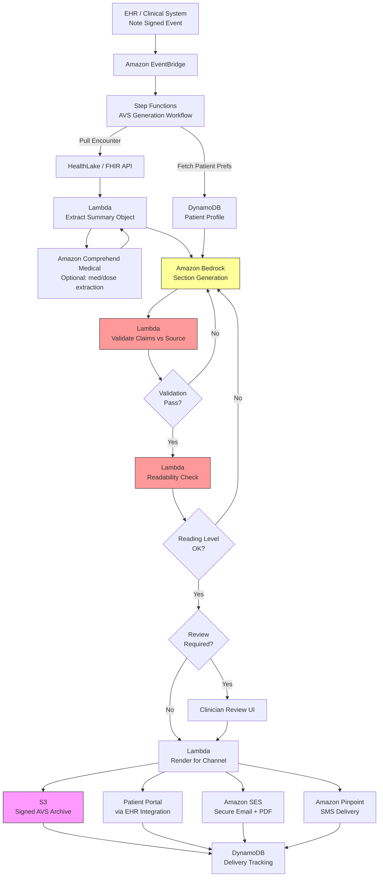

# Recipe 2.5 Architecture and Implementation: After-Visit Summary Generation

*Companion to [Recipe 2.5: After-Visit Summary Generation](chapter02.05-after-visit-summary-generation). This page covers the AWS architecture, services, prerequisites, and pseudocode. For the problem framing and the conceptual approach, start with the main recipe.*

---

## The AWS Implementation

### Why These Services

**Amazon Bedrock for LLM inference.** The core generation task. Two model tiers come into play here. For the extraction step (pulling structured facts from the note), a smaller, cheaper model like Claude Haiku or Nova Lite is often sufficient because the task is well-bounded. For the generation step (writing the patient-facing prose), a stronger model like Claude Sonnet produces noticeably better output: better tone, better reading-level control, better multilingual quality. Bedrock lets you mix model tiers in the same pipeline without code gymnastics.

**Amazon Bedrock Guardrails for safety constraints.** Guardrails give you a policy layer that runs on top of model invocations. For patient-facing output, you can configure denied topics (e.g., block generation of content that contradicts the source note), PII detection (catch accidental disclosure of other patients' information), and content filters. Guardrails aren't a substitute for the validation step, but they're a useful safety net.

<!-- TODO (EXPERT REVIEW - MEDIUM, Finding A4): The parenthetical example above is
     incorrect. "Denied topics" in Bedrock Guardrails are defined by natural-language
     topic descriptions and blocklist phrases; they cannot detect content that
     contradicts a source note. The feature to reference is Bedrock Guardrails'
     "contextual grounding check," which compares model output against a reference
     context provided at invocation time and rejects ungrounded or off-topic outputs
     below configurable thresholds. Please rewrite the paragraph to distinguish
     contextual grounding checks (the grounding tool), denied topics (blocking
     off-policy content), PII detection, and content filters. See review Finding A4. -->

**Amazon HealthLake (optional) for FHIR-based encounter retrieval.** If your clinical data lives in HealthLake or is replicated there, pulling encounter data is a straight FHIR query. For encounters that just ended, HealthLake gives you the Encounter resource, the related MedicationRequest, ServiceRequest, and Appointment resources, and the DocumentReference for the signed note. If you're pulling directly from an EHR via SMART on FHIR, the pattern is similar but the source is different.

**Amazon Comprehend Medical for entity extraction (optional).** For the structured extraction step, Comprehend Medical can pull out medications, dosages, conditions, and procedures from free-text notes with high accuracy. You can use it as a pre-processing step before the LLM, or use the LLM alone. The hybrid approach (Comprehend Medical for drug/dose extraction, LLM for the remaining unstructured content) often produces the most reliable results for medication-related content, which is the highest-risk category.

**Amazon Translate for non-English delivery (optional).** If your patient population's preferred languages aren't well-served by the LLM directly, Amazon Translate can post-process generated English content. But direct generation in the target language is usually higher quality than translation for the languages the LLM handles well. Spanish, French, Mandarin, and Japanese typically don't need the translation step. Less common languages may.

**Amazon S3 for summary storage and audit archive.** Every generated summary, every version, every input context snapshot gets stored. One bucket for drafts, one for final versions, with SSE-KMS encryption and versioning enabled. HIPAA retention of 6+ years applies. The S3 audit archive is your answer when a patient calls in three months asking what the physician told them to do.

**AWS Lambda for pipeline steps.** Each logical step (extract, generate, validate, render, deliver) is a Lambda function. This keeps each piece independently testable and independently scalable. For a busy practice or health system, summaries should be generated within seconds of note signature so the patient has the document before they leave the parking lot.

**AWS Step Functions for orchestration.** The pipeline has branching logic (clinician review or not, regeneration loop for readability failures, different delivery channels per patient preference). Step Functions makes the state machine explicit and observable. For operational teams, being able to see which step a given summary is stuck in is invaluable.

<!-- TODO (EXPERT REVIEW - MEDIUM, Finding A2): For the clinician-review branch,
     specify the Step Functions waitForTaskToken callback pattern. The Lambda that
     completes generation hands off a task token when it routes to review; the review
     UI calls SendTaskSuccess with the signed summary (or SendTaskFailure if rejected).
     This avoids polling and supports extended review SLAs. See Finding A2. -->

**Amazon EventBridge for note-signed events.** Triggering generation from the EHR's note-signed event (via an integration layer) is more reliable than polling. EventBridge routes the event to the pipeline's Step Functions workflow.

<!-- TODO (EXPERT REVIEW - MEDIUM, Finding A3 / LOW A6): EventBridge delivery is
     at-least-once. Add idempotency guidance at Step 1 using a deterministic fingerprint
     of (encounter_id, note_version_or_signed_at) and a DynamoDB conditional write
     (attribute_not_exists) to prevent duplicate executions, duplicate summaries, and
     duplicate patient deliveries. See Findings A3 and A6. -->

**Amazon DynamoDB for summary state tracking.** One item per generated summary, tracking status through the pipeline: generating, awaiting review, ready for delivery, delivered, delivery confirmed. Also useful for patient preferences (language, literacy target, delivery channel) if you're not pulling those from the EHR at generation time.

**Amazon Pinpoint or Amazon SES for delivery.** For SMS delivery, Pinpoint (or End User Messaging SMS). For secure email with PDF attachments, SES. Both require HIPAA-appropriate configuration (BAA, encryption, access controls). Delivery through the patient portal is typically an EHR integration rather than a direct AWS service.

<!-- TODO (EXPERT REVIEW - CRITICAL, Finding S1): SMS of clinical content (medication
     names, doses, warning signs, follow-up instructions) constitutes PHI transmission
     over an unencrypted channel. HIPAA requires documented patient consent after
     disclosure of security risks. Recommend pivoting the default SMS pattern to
     "notification-plus-portal-link" (no clinical content in the SMS body). If
     direct-to-SMS clinical content is retained as an option, add a consent gate and
     a dedicated "SMS and PHI" subsection in "Why This Isn't Production-Ready" that
     names the consent requirement, content-minimization practice, and jurisdiction-
     specific overlays (California, Texas, Washington MHMDA). See Finding S1. -->

<!-- TODO (EXPERT REVIEW - LOW, Finding N3): SES direct-to-personal-mailbox delivery of
     PDF-attachment AVS is secure only if both mail servers enforce TLS (not guaranteed).
     Production deployments typically use a HIPAA-grade secure email gateway or a
     notification-plus-portal-link pattern. Add a one-line note here or in the SES
     row of the Ingredients table. -->

**AWS CloudTrail and Amazon CloudWatch for audit and monitoring.** Every Bedrock invocation, every S3 write, every delivery event is logged. Standard HIPAA audit posture. CloudWatch tracks operational metrics: summaries generated per hour, average time to delivery, regeneration rate, clinician override rate.

### Architecture Diagram



### Prerequisites

| Requirement | Details |
|-------------|---------|
| **AWS Services** | Amazon Bedrock, Amazon Bedrock Guardrails, Amazon S3, AWS Lambda, AWS Step Functions, Amazon EventBridge, Amazon DynamoDB, Amazon HealthLake (optional), Amazon Comprehend Medical (optional), Amazon Translate (optional), Amazon SES, Amazon Pinpoint, Amazon CloudWatch |
| **IAM Permissions** | `bedrock:InvokeModel`, `bedrock:ApplyGuardrail`, `s3:GetObject`, `s3:PutObject`, `dynamodb:PutItem`, `dynamodb:GetItem`, `dynamodb:UpdateItem`, `states:StartExecution`, `healthlake:SearchWithGet`, `comprehendmedical:DetectEntitiesV2`, `ses:SendRawEmail`, `mobiletargeting:SendMessages`, `events:PutEvents` <!-- TODO (EXPERT REVIEW - HIGH, Finding S3): Scope every action to specific resource ARNs (S3 bucket ARNs, DynamoDB table ARNs, specific foundation-model ARNs, Guardrail ARN, HealthLake datastore ARN, SES verified-identity ARNs). Add kms:Decrypt and kms:GenerateDataKey scoped to the PHI CMKs. Recurring Chapter 2 pattern (2.2, 2.3, 2.4, 2.5) - consider chapter-level appendix. See Finding S3. --> |
| **BAA** | AWS BAA signed. Summaries contain PHI; every service in the pipeline must be HIPAA-eligible and covered. |
| **Bedrock Model Access** | Request access to at least one capable generation model (Claude Sonnet or equivalent) and one smaller extraction model (Claude Haiku or Nova Lite). For non-English output, verify the model's quality in the target languages against a sample set before deploying. |
| **EHR Integration** | Note-signed event publication (webhook, HL7 v2 message, or FHIR subscription). FHIR R4 read access to Encounter, MedicationRequest, ServiceRequest, DocumentReference, Appointment, Condition. Portal integration for delivery. |
| **Patient Preferences** | Language, literacy-level target, delivery channel preference. Usually sourced from the EHR's patient registration fields; may need additions if your EHR doesn't capture reading-level or preferred-language with enough granularity. |
| **Encryption** | S3: SSE-KMS with customer-managed keys. DynamoDB: encryption at rest with CMK. Bedrock: TLS in transit, encryption at rest. CloudWatch Logs: KMS encryption. <!-- TODO (EXPERT REVIEW - HIGH, Finding S4): If Bedrock model-invocation-logging is enabled for quality monitoring or drift detection, the logged prompts and responses contain PHI (structured clinical facts, patient identifiers, medication details). The log-destination S3 bucket or CloudWatch log group must be KMS-encrypted with the same CMK posture as other PHI stores, access-controlled equivalently, and retention-matched. Consider sampling rather than logging every invocation. See Finding S4. --> |
| **VPC** | Production: Lambda functions in VPC with VPC endpoints for S3, Bedrock, DynamoDB, HealthLake, Comprehend Medical. <!-- TODO (EXPERT REVIEW - HIGH, Finding N1): Endpoint list is incomplete for the services this recipe uses. Add interface endpoints for kms, logs, states, events, monitoring, translate (if used), email-smtp (if SES used), and sms-voice (if SMS used). Keep S3 and DynamoDB as gateway endpoints. Without kms and logs endpoints, Lambda in a private subnet cannot decrypt or log. Without states endpoint, waitForTaskToken callbacks fail from within the VPC. Interface endpoints are ~$7-10/month per AZ; reflect this in the cost estimate. See Finding N1. --> |
| **CloudTrail** | Enabled with data events: log all Bedrock invocations, S3 object access, DynamoDB reads and writes. |
| **Sample Data** | Synthea synthetic FHIR data for testing. Synthetic patient scenarios with varied complexity (routine visit, new diagnosis, discharge summary) to cover the major generation patterns. |
| **Cost Estimate** | Bedrock extraction (Haiku/Nova Lite): ~$0.005-0.02 per visit. Bedrock generation (Sonnet): ~$0.02-0.06 per visit. Comprehend Medical: ~$0.001-0.01 per visit if used. Storage, Lambda, Step Functions, DynamoDB: negligible at typical volumes. End-to-end: ~$0.03-0.10 per summary. At 1,000 visits per day, roughly $900-$3,000 per month. |

### Ingredients

| AWS Service | Role |
|------------|------|
| **Amazon Bedrock** | LLM inference for extraction and patient-facing generation |
| **Amazon Bedrock Guardrails** | Policy-layer safety filters on model output |
| **Amazon HealthLake** | FHIR-native access to encounter data (optional but common) |
| **Amazon Comprehend Medical** | Structured entity extraction for medications and dosages (optional) |
| **Amazon Translate** | Fallback translation for languages not directly supported by the LLM |
| **Amazon S3** | Generated summary drafts and finalized audit archive |
| **AWS Lambda** | Per-stage pipeline logic |
| **AWS Step Functions** | Multi-stage workflow orchestration with review branching |
| **Amazon EventBridge** | Note-signed event ingestion from the EHR |
| **Amazon DynamoDB** | Patient preferences, summary state, delivery tracking |
| **Amazon SES** | Secure email delivery with PDF attachment |
| **Amazon Pinpoint** | SMS delivery for text-only patients |
| **AWS KMS** | Encryption key management for all stored PHI |
| **Amazon CloudWatch + CloudTrail** | Monitoring, operational metrics, and HIPAA audit logs |

### Code

#### Walkthrough

**Step 1: Receive the note-signed event and initialize the case.** When a clinician signs a visit note, the EHR publishes an event. Your pipeline listens for this event and kicks off the workflow. The event payload typically includes the encounter ID, the patient ID, the provider ID, and a timestamp. Everything else gets pulled from the EHR in subsequent steps.

<!-- TODO (EXPERT REVIEW - MEDIUM, Finding A3): EventBridge delivers at-least-once.
     Add an idempotency check before starting the Step Functions execution: derive a
     fingerprint from (encounter_id, note_version_or_signed_at), attempt a DynamoDB
     conditional write with attribute_not_exists(fingerprint), and if the fingerprint
     already exists return the existing summary_id and skip. Otherwise duplicate
     note-signed events produce duplicate summaries, duplicate LLM charges, and
     duplicate patient deliveries. See Finding A3. -->

```
FUNCTION receive_note_signed_event(event):
    // The event payload from EventBridge. Fields vary by EHR integration.
    // event.encounter_id:     FHIR Encounter ID
    // event.patient_id:       FHIR Patient ID
    // event.provider_id:      signing provider
    // event.signed_at:        timestamp of note signature
    // event.visit_type:       outpatient, discharge, telehealth, etc.
    
    // Generate a summary_id that will track this specific summary through the pipeline.
    summary_id = generate UUID
    
    write to DynamoDB table "avs-summaries":
        summary_id       = summary_id
        status           = "INITIATED"
        encounter_id     = event.encounter_id
        patient_id       = event.patient_id
        provider_id      = event.provider_id
        visit_type       = event.visit_type
        created_at       = current UTC timestamp
    
    // Kick off the Step Functions workflow
    start Step Functions execution:
        state_machine = "AVSGenerationWorkflow"
        input         = { summary_id: summary_id }
    
    RETURN summary_id
```

**Step 2: Pull encounter data from the EHR.** Retrieve everything from the visit that a patient would need to know about. The scope is intentionally narrow: today's encounter, not the patient's full chart. Narrow scope keeps cost down, keeps latency low, and keeps the "minimum necessary" HIPAA principle satisfied.

```
FUNCTION pull_encounter_data(patient_id, encounter_id):
    // Fetch the FHIR resources related to this specific encounter.
    // HealthLake supports the _revinclude parameter to pull everything that references an encounter.
    
    encounter_bundle = call HealthLake.SearchResources with:
        resource_type = "Encounter"
        filters       = { _id: encounter_id, _revinclude: "*" }
    
    // Pull the signed clinical note text. In FHIR, signed notes are 
    // DocumentReference resources with the encounter context.
    notes = call HealthLake.SearchResources with:
        resource_type = "DocumentReference"
        filters       = { encounter: encounter_id, status: "current" }
    
    // Fetch the patient's preferences. Language, reading level target, 
    // delivery channel. Usually sourced from a patient-preferences table 
    // populated from the EHR at registration.
    patient_prefs = read from DynamoDB table "patient-preferences": patient_id
    
    // Default preferences if none are on file
    IF patient_prefs is None:
        patient_prefs = {
            language:          "en",
            reading_level:     8,         // target grade level
            delivery_channel:  "portal",
            accommodations:    []
        }
    
    RETURN {
        encounter:     encounter_bundle.Encounter,
        medications:   encounter_bundle.MedicationRequest + encounter_bundle.MedicationStatement,
        orders:        encounter_bundle.ServiceRequest,
        referrals:     encounter_bundle.ServiceRequest where category == "referral",
        appointments:  encounter_bundle.Appointment,
        conditions:    encounter_bundle.Condition,
        notes:         notes,
        patient_prefs: patient_prefs
    }
```

**Step 3: Extract the structured summary object.** Turn the encounter data into a fielded object that drives generation. This is the step that converts unstructured clinical content into discrete facts that can be validated later. For medications specifically, Comprehend Medical adds value because it produces normalized drug and dose entities.

<!-- TODO (EXPERT REVIEW - MEDIUM, Finding S5): Apply the minimum-necessary principle
     to prompts. The generation step needs diagnoses, medications, orders, and
     follow-up details. It does not need the patient's MRN, DOB, address, phone
     number, or insurance identifiers. Consider redacting non-clinical PHI from the
     extracted object before the generation call (field allow-list, or Comprehend
     Medical DetectPHI as a pre-flight). Keep the preferred name for salutation. -->

<!-- TODO (CODE REVIEW - WARNING, Finding 4): Comprehend Medical's size limit is
     enforced in bytes, not characters. If the pseudocode shows a character-based
     slice like note_text[:20000], a multilingual note can exceed the byte limit.
     Consider noting the byte-safe pattern (encode to utf-8, slice bytes, decode
     errors=ignore) for multilingual use cases. See Finding 4 in the code review. -->

```
FUNCTION extract_summary_object(encounter_data):
    // Start with what's already structured in the EHR.
    // Medication changes from MedicationRequest resources:
    medications = empty list
    FOR each med_req in encounter_data.medications where intent == "order" and authoredOn == today:
        append {
            name:       med_req.medication.display,
            dose:       med_req.dosageInstruction[0].text,
            change:     "new",   // or "dose_changed", "discontinued", based on comparison with prior meds
            reason:     med_req.reasonCode[0].display if present
        } to medications
    
    // For notes text, use LLM extraction with a structured schema.
    // This is where Comprehend Medical can also be run in parallel 
    // as a cross-check on medication and dosage extraction.
    note_text = concatenate all encounter_data.notes[*].content
    
    extraction_prompt = """
    Extract the following structured fields from this clinical note. Use ONLY what is 
    explicitly documented; do NOT infer. If a field is not documented, return null or empty.
    
    Return JSON with these fields:
    - diagnoses_discussed:    list of {name, icd10, is_new_today}
    - warning_signs_given:    list of specific warning signs patient should watch for 
                              (from any "return precautions," "red flag symptoms," or "call if..." language)
    - education_topics:       list of topics covered during counseling
    - follow_up_plan:         {when, with_whom, reason} or null if none
    - tests_explained:        list of tests that were discussed (may or may not have been ordered)
    - lifestyle_instructions: list of specific lifestyle recommendations given
    - return_instructions:    text explaining when to come back or call
    
    CLINICAL NOTE:
    {note_text}
    """
    
    // Note on model IDs: Bedrock model IDs are versioned and, in most regions,
    // now require a regional inference-profile prefix (for example,
    // "us.anthropic.claude-3-5-haiku-20241022-v1:0"). The family-style IDs used
    // in this pseudocode are illustrative; the Python companion shows a current
    // working example.
    response = call Bedrock.InvokeModel with:
        model_id    = "anthropic.claude-haiku-4"    // smaller model suffices for extraction
        prompt      = extraction_prompt
        max_tokens  = 2048
        temperature = 0.0
    
    extracted = parse JSON from response
    
    // Cross-check medications against Comprehend Medical (optional but recommended)
    cm_entities = call ComprehendMedical.DetectEntitiesV2 with:
        text = note_text
    
    med_entities_from_cm = filter cm_entities for Category == "MEDICATION"
    // Use these to validate or supplement the structured med list
    
    // Assemble the summary object
    summary_object = {
        encounter_date:        encounter_data.encounter.period.start,
        visit_type:            encounter_data.encounter.type[0].display,
        diagnoses:             extracted.diagnoses_discussed,
        medications:           medications,
        orders:                [ {name, instructions, when_expected} for each order in encounter_data.orders ],
        referrals:             [ {specialty, reason, how_to_schedule} for each ref in encounter_data.referrals ],
        follow_up_appointment: first appointment in encounter_data.appointments scheduled after today,
        follow_up_plan:        extracted.follow_up_plan,
        warning_signs:         extracted.warning_signs_given,
        education_topics:      extracted.education_topics,
        lifestyle_instructions: extracted.lifestyle_instructions,
        return_instructions:   extracted.return_instructions,
        source_note_reference: encounter_data.notes[0].id    // for traceability
    }
    
    // Persist for auditability
    write to S3: "summary-extractions/{summary_id}/extracted.json" = summary_object
    
    RETURN summary_object
```

**Step 4: Generate the patient-facing summary.** Now the writing step. Given the structured summary object and the patient's preferences, produce prose at the target reading level in the target language. Per-section generation is often cleaner than single-prompt; it lets you enforce the required structure and handle section-level failures independently.

```
FUNCTION generate_summary(summary_object, patient_prefs):
    // Build a prompt that enforces:
    // - Reading level target
    // - Language
    // - Structure (required sections in order)
    // - Grounding (use only provided facts; no inference)
    // - Tone (calm, direct, respectful; never condescending or alarmist)
    
    generation_prompt = """
    You are drafting a patient-facing after-visit summary. Your reader is a patient 
    who just finished an appointment. They may be tired, anxious, or distracted.
    
    REQUIREMENTS:
    - Write in {patient_prefs.language}.
    - Target {patient_prefs.reading_level}th-grade reading level.
    - Use short sentences (average under 15 words).
    - Use common words. When a medical term is unavoidable, follow it with a plain-language 
      explanation in parentheses on first use.
    - Use active voice and direct instructions ("Take one pill each morning") rather than 
      passive ("One pill should be taken each morning").
    - Be calm and respectful. Never alarmist. Never condescending.
    - Use ONLY the information in the structured summary below. Do NOT add diagnoses, 
      medications, instructions, warning signs, or follow-up dates that are not in the input.
    - If the input lacks a piece of information the reader needs, say "Talk to your 
      doctor's office if you have questions" rather than inventing content.
    - Every specific claim (medication dose, follow-up date, test name, warning sign) 
      must trace to a field in the input.
    
    STRUCTURE (use these section headers, in this order, omitting sections that have no content):
    1. "What we talked about today"      → diagnoses and key discussion points
    2. "Changes to your medications"     → new meds, stopped meds, dose changes
    3. "Tests you need"                  → orders placed with instructions
    4. "People to see"                   → referrals
    5. "Your next visit"                 → follow-up appointment details
    6. "Watch for these"                 → warning signs; when to call or go to ER
    7. "Things to do at home"            → lifestyle instructions
    8. "Questions?"                      → how to contact the practice
    
    STRUCTURED SUMMARY OBJECT:
    {summary_object as JSON}
    
    PATIENT CONTEXT:
    - Preferred name: {patient_prefs.preferred_name}
    - Any accommodations: {patient_prefs.accommodations}
    
    Produce the summary as plain markdown with the section headers above. After the summary, 
    output a JSON block listing every factual claim (specific dose, date, name, or number) 
    with its source field path, so claims can be verified.
    """
    
    response = call Bedrock.InvokeModel with:
        model_id     = "anthropic.claude-sonnet-4"    // stronger model for the user-facing prose
        prompt       = generation_prompt
        max_tokens   = 4000
        temperature  = 0.3    // some natural variation; not deterministic
        guardrail_id = PATIENT_FACING_GUARDRAIL_ID    // Bedrock Guardrails configured for patient content
    
    summary_text = parse summary content from response
    provenance   = parse provenance JSON from response
    
    RETURN { summary_text: summary_text, provenance: provenance }
```

**Step 5: Validate claims against the source.** Every specific claim in the summary must map to a field in the summary object. Medication doses, follow-up dates, warning signs, referral reasons: each of these has to trace back. Claims that don't map either trigger regeneration or route to clinician review depending on severity.

<!-- TODO (EXPERT REVIEW - MEDIUM, Finding A1): Cap regeneration at 2-3 attempts.
     Vary the strategy on each retry (first retry adds a stronger grounding
     instruction naming the previously-unverified claims; second retry at
     temperature=0 for determinism; third retry falls through to clinician review).
     Track retry count in DynamoDB and emit a CloudWatch metric on exhaustion.
     Never auto-deliver an exhausted-retry summary without clinician sign-off.
     This pairs with CODE REVIEW Finding 3, where the Python orchestrator currently
     auto-delivers when attempts are exhausted on non-high-risk visits. -->

```
FUNCTION validate_summary(summary_text, provenance, summary_object):
    unverified = empty list
    
    FOR each claim in provenance.factual_claims:
        // claim has: text (what was said in the summary), source_field (where in the object it came from)
        
        source_value = look up summary_object at path claim.source_field
        
        IF source_value is None:
            // Claim references a field that doesn't exist in the input
            append {claim: claim, reason: "field_not_in_input", severity: "HIGH"} to unverified
            CONTINUE
        
        // Is the claim consistent with the source value?
        // For numbers (doses, counts), exact match required after normalization.
        // For text (warning signs, diagnoses), use semantic similarity check.
        
        IF claim is a numeric assertion (dose, quantity, date):
            IF normalize(claim.asserted_value) != normalize(source_value):
                append {claim: claim, reason: "value_mismatch", severity: "HIGH"} to unverified
        ELSE:
            similarity = semantic_similarity(claim.text, str(source_value))
            IF similarity < 0.7:
                append {claim: claim, reason: "semantic_mismatch", severity: "MEDIUM"} to unverified
    
    // Categorize
    high_severity_count = count of claims where severity == "HIGH"
    
    IF high_severity_count > 0:
        status = "VALIDATION_FAILED"
    ELSE IF length of unverified > 0:
        status = "NEEDS_CLINICIAN_REVIEW"
    ELSE:
        status = "VALIDATED"
    
    write to DynamoDB table "avs-summaries": update summary_id with
        validation_status   = status
        unverified_claims   = unverified
    
    RETURN { status: status, unverified: unverified }
```

**Step 6: Apply a readability check.** Even with a reading-level instruction in the prompt, outputs drift. A readability check closes the loop: compute a Flesch-Kincaid Grade Level on the generated text, and if it exceeds the patient's target, regenerate with a stronger simplification instruction. This is cheap (the formula is just arithmetic) and it catches reading-level failures that the model itself wouldn't notice.

```
FUNCTION check_readability(summary_text, target_grade_level):
    // Flesch-Kincaid Grade Level formula:
    // 0.39 * (words / sentences) + 11.8 * (syllables / words) - 15.59
    
    words     = count words in summary_text
    sentences = count sentences in summary_text (end-of-sentence punctuation)
    syllables = count syllables in summary_text (approximation based on vowel groupings)
    
    IF sentences == 0 or words == 0:
        RETURN { pass: false, reason: "empty_or_unparseable" }
    
    fk_grade = 0.39 * (words / sentences) + 11.8 * (syllables / words) - 15.59
    
    // Allow a small buffer; don't reject a 7.2 if target is 7
    IF fk_grade <= target_grade_level + 0.5:
        RETURN { pass: true, fk_grade: fk_grade }
    ELSE:
        RETURN { pass: false, fk_grade: fk_grade, reason: "reading_level_too_high" }
```

If the readability check fails, the pipeline loops back to Step 4 with an extra instruction like "The previous draft read at grade 10. Rewrite at grade 6 with shorter sentences and simpler words." Typically one additional regeneration brings the text within target.

<!-- TODO (EXPERT REVIEW - MEDIUM, Finding A1): Also cap the readability regeneration
     loop (same 2-3 attempts rule as the validation loop in Step 5). Pathological
     inputs can otherwise loop indefinitely at $0.03-$0.10 per attempt. -->

**Step 7: Render and deliver.** Same content, different rendering. The generation step produces plain markdown. A rendering step converts it to HTML for the portal, PDF for print, or structured SMS messages for text delivery.

<!-- TODO (EXPERT REVIEW - CRITICAL, Finding S1): The SMS branch below ships clinical
     PHI (medication names, doses, warning signs, follow-up dates) over an
     unencrypted channel with no consent gate. Recommended fix: change the SMS
     pattern to notification-plus-portal-link, for example
     rendered["sms_messages"] = [localize("Your after-visit summary is ready. Open it
     in the patient portal: {portal_link}", patient_prefs.language)] -- no clinical
     content in the SMS body. If direct-to-SMS clinical content is retained as an
     option for practices that use it, add a consent check before dispatch:
     IF "sms" in patient_prefs.delivery_channels AND
        patient_prefs.sms_phi_consent != "granted":
        fall back to notification-plus-link pattern.
     Also add a section in "Why This Isn't Production-Ready" titled "SMS and PHI"
     covering HIPAA consent, content-minimization best practice, lack of SMS
     end-to-end encryption, and jurisdiction-specific overlays. See Finding S1. -->

```
FUNCTION render_and_deliver(summary_id, summary_text, patient_prefs):
    // Render all applicable formats based on patient preferences
    rendered = empty dict
    
    IF "portal" in patient_prefs.delivery_channels:
        rendered["portal_html"] = markdown_to_html(summary_text, accessible=true)
    
    IF "pdf" in patient_prefs.delivery_channels or patient_prefs.wants_printed_copy:
        rendered["pdf"] = markdown_to_pdf(summary_text,
            font_size = 14 if "large_print" in patient_prefs.accommodations else 11,
            layout    = "accessible"
        )
    
    IF "sms" in patient_prefs.delivery_channels:
        // SMS has length constraints; chunk into essential messages
        rendered["sms_messages"] = chunk_for_sms(summary_text, max_chars=320)
    
    // Archive every rendered version in S3
    FOR each format, content in rendered:
        write to S3: "final-summaries/{summary_id}/{format}.{ext}" = content
    
    // Dispatch deliveries
    IF "portal_html" in rendered:
        call EHR_Portal_API.publish_document(patient_id, summary_id, rendered["portal_html"])
    
    IF "pdf" in rendered and patient_prefs.wants_email:
        call SES.SendRawEmail with:
            to          = patient_prefs.email
            subject     = localize("Your After-Visit Summary", patient_prefs.language)
            attachment  = rendered["pdf"]
            encryption  = TLS enforced; content encrypted at rest
    
    IF "sms_messages" in rendered:
        FOR each msg in rendered["sms_messages"]:
            call Pinpoint.SendMessages with:
                phone    = patient_prefs.phone
                message  = msg
                channel  = "SMS"
    
    // Update delivery tracking
    write to DynamoDB table "avs-summaries": update summary_id with
        status       = "DELIVERED"
        delivered_at = current UTC timestamp
        channels     = list of keys in rendered
    
    RETURN { status: "DELIVERED", channels: list of keys in rendered }
```

> **Curious how this looks in Python?** The pseudocode above covers the concepts. If you'd like to see sample Python code that demonstrates these patterns using boto3, check out the [Python Example](chapter02.05-python-example). It walks through each step with inline comments and notes on what you'd need to change for a real deployment.

### Expected Results

**Sample output for a routine cardiology follow-up with a new anticoagulation start:**

<!-- TODO (EXPERT REVIEW - CRITICAL, Finding S2): This sample shows apixaban 5 mg
     and a CBC/kidney-check lab, which is clinically correct for a DOAC. The Problem
     section narrative describes warfarin counseling (greens interact, INR draw).
     Either this sample or the Problem narrative must change so they are consistent.
     Reviewer recommends changing this sample to a warfarin picture (e.g., warfarin
     5 mg nightly, INR in 3 days, keep leafy-green intake steady, same bleeding
     warning list) so the Problem section's concrete details map to the AVS. -->

<!-- TODO (EXPERT REVIEW - MEDIUM, Finding A5): The factual_claims array below lists
     only 5 claims, but the summary text contains 15-25 specific claims (warning
     signs, lifestyle instructions, practice phone, hours, etc.). For a recipe
     whose central teaching is "every specific claim must trace to source," the
     sample should either enumerate the full set of claims with source paths, or
     include a note that the array is abbreviated for readability and a production
     validator tracks 15-30 per AVS. See Finding A5. -->

<!-- TODO (EXPERT REVIEW - LOW, Finding S6): Label the sample as synthetic, e.g.,
     add a one-line comment above the JSON: "All identifiers, dates, and provider
     names below are synthetic. Never use real patient data in development or test
     fixtures." -->

```json
{
  "summary_id": "AVS-2026-05-07-01284",
  "status": "DELIVERED",
  "fk_grade_level": 6.8,
  "language": "en",
  "validation_status": "VALIDATED",
  "generated_summary": "# Your Visit Summary, May 7, 2026\n\n## What we talked about today\n\nYou have atrial fibrillation (an uneven heartbeat). We talked about how this raises your risk of stroke, and how medicine can lower that risk.\n\n## Changes to your medications\n\n**New: apixaban (Eliquis) 5 mg**\n- Take one pill in the morning and one pill at night.\n- Start tonight.\n- Do not stop this medicine without calling us first.\n\n## Tests you need\n\n**Blood test (CBC and kidney check) in 3 days**\n- Go to any lab that takes your insurance.\n- Results come back to our office. We will call you if anything needs attention.\n\n## Your next visit\n\nCome back to see Dr. Nguyen in 2 weeks. The front desk scheduled you for May 21 at 10:00 AM.\n\n## Watch for these\n\nCall 911 right away if you have:\n- Sudden bad headache\n- Weakness on one side of your body\n- Trouble talking or seeing\n- Chest pain\n- Bleeding that will not stop\n\nCall our office during the day if you notice:\n- Easy bruising\n- Nose bleeds or bleeding gums\n- Blood in your urine or stool\n- Dizziness or fast heartbeat\n\n## Things to do at home\n\n- Take your medicine at the same time each day.\n- Tell any doctor or dentist that you take apixaban before any procedure.\n- Avoid contact sports that could cause a fall or hit.\n\n## Questions?\n\nCall our office at (555) 123-4567, Monday through Friday, 8 AM to 5 PM. After hours, press 1 for the on-call doctor.",
  "factual_claims": [
    {"claim": "apixaban 5 mg", "source": "medications[0]"},
    {"claim": "one pill in the morning and one pill at night", "source": "medications[0].dose"},
    {"claim": "Blood test in 3 days", "source": "orders[0]"},
    {"claim": "May 21 at 10:00 AM", "source": "follow_up_appointment"},
    {"claim": "Dr. Nguyen", "source": "follow_up_appointment.practitioner"}
  ],
  "delivery_channels": ["portal", "pdf_email"],
  "processing_time_ms": 12000
}
```

**Performance benchmarks:**

| Metric | Typical Value |
|--------|---------------|
| End-to-end latency (note signed → delivered) | 10-30 seconds for routine visits; 30-90 seconds for discharge summaries |
| Validation pass rate (first generation) | 88-96% for routine; 80-90% for discharges |
| Readability target achievement (first generation) | 80-90%; remaining 10-20% pass after one regeneration |
| Clinician override rate (when review enabled) | 5-15% minor edits; <2% substantive edits |
| Reading level (Flesch-Kincaid Grade) | 6-8 when targeted; model naturally drifts to 10-12 without constraints |
| Cost per summary | $0.03-0.10 |
| Patient portal open rate | Practice-dependent; a well-written AVS materially increases portal engagement <!-- TODO: verify with published data or customer case studies --> |

**Where it struggles:**
- **Very long encounters.** Multi-hour ED visits or extended discharge encounters produce long notes. Extraction quality drops; the generated summary becomes either overwhelming or under-inclusive.
- **Poorly structured notes.** Notes written as a single unstructured paragraph are harder to extract from than notes with clear section headers. This is a documentation hygiene issue that predates the AI pipeline.
- **Ambiguous follow-up language.** "Follow up in a few weeks" is impossible to render as an actionable date. The system has to either leave it vague or prompt for clarification. Leaving it vague loses value; prompting adds friction.
- **Languages with small LLM footprints.** Direct generation quality varies across languages. For languages the model is weak in, the translation fallback is noticeably worse than direct generation. Validate quality per language before deploying broadly.
- **Pediatrics.** Instructions for minors need caregiver-appropriate voice ("Give your child..." not "Take...") and age-appropriate detail. Requires prompt and validation adjustments.
- **Discharge summaries specifically.** Discharge content is longer, higher-stakes, and often involves multiple providers. Single-prompt generation tends to drop important items. Sectional generation with explicit required-inclusion checks works better.
- **Cognitive or language limitations.** Patients with dementia or significant cognitive impairment may not be the primary reader of the summary. Caregivers are. The tone, structure, and reading level decisions shift when the primary audience is a caregiver, not the patient. This needs to be a patient-profile attribute, not an assumption.

---

## Why This Isn't Production-Ready

The architecture above gives you a working pipeline. Deploying it at a health system requires addressing several hard problems that the pseudocode doesn't solve.

**Note quality varies enormously.** The pipeline is only as good as the note it's reading. A well-structured SOAP note with headers and explicit follow-up orders produces a clean summary. A note that's a single paragraph of free-text dictation produces a messy extraction and a brittle summary. You will find yourself either writing very defensive extraction logic or working with clinical leadership to improve note-writing practices. Both efforts are slow. Plan accordingly.

**The "what's new today" question is harder than it sounds.** Identifying which medications are new versus continued requires comparing today's medication list against yesterday's medication list. That comparison logic is brittle across EHRs because each EHR represents medication lists differently. Some show only "active medications." Some show medication changes as deltas. Some show both. Your extraction code has to handle the EHR you're integrated with, which means it's not fully portable to the next EHR.

**Reading level for non-English languages is poorly defined.** Flesch-Kincaid is an English-language formula. Spanish has its own formulas (INFLESZ, Fernández Huerta). Mandarin doesn't use grade levels the same way. If you're generating in multiple languages, you need multiple readability validators, each calibrated to that language. Many teams skip this and just trust the model, which mostly works but can hide occasional failures.

**Clinician review workflows need thought.** For routine visits, direct-to-patient delivery is the goal because clinician review adds friction that eats the time savings. For high-risk visits (new cancer diagnosis, hospital discharges, complex med regimens), review is essential. Defining the risk tier at trigger time (based on visit type, specific medication changes, or diagnosis codes) is a policy decision that takes coordinating across clinical, legal, and operational stakeholders. It's not a code problem; it's a governance problem.

**Portal integration is make-or-break for delivery.** Publishing the AVS to the patient portal requires integration with the EHR's portal APIs. Epic's MyChart, Cerner's HealtheLife, athenahealth's patient portal: each has its own integration pattern and document publishing API. You'll spend real engineering time here. Expect two to four weeks per portal integration, and more if the EHR requires certification for third-party content.

<!-- TODO (EXPERT REVIEW - MEDIUM, Finding N2): Add a short paragraph here on
     EHR-to-pipeline connectivity. For cloud EHRs, the note-signed event and FHIR
     pull typically cross TLS-encrypted connections to vendor public endpoints with
     egress controls and Secrets Manager-sourced credentials. For on-premises EHRs,
     plan for Direct Connect or site-to-site VPN with the FHIR gateway reachable
     over private IPs only. PHI in transit must never traverse the public internet
     unencrypted; inbound traffic to your VPC should be scoped by source IP or
     PrivateLink. See Finding N2. -->

**Multi-language requires ongoing translation QA.** It's easy to ship Spanish generation and assume it works. Three months in, you notice the system is using formal Latin American Spanish conventions for a Cuban-American population that finds the register off-putting. Or regional dialect choices that miss. You need a sustainable translation QA process: bilingual community health workers or certified medical translators reviewing samples quarterly, feedback loops from patient-facing staff, and willingness to iterate on prompts per language population.

**Legal review of auto-generated patient content.** Every health system's legal and compliance teams will have opinions on auto-generated content going to patients. Topics include: whether the document needs explicit clinician attribution, what disclaimers are required, what the audit requirements look like if a patient follows incorrect information, whether the summary can be considered part of the legal medical record. These conversations take months. Start them early.

**Handling patient corrections and feedback.** Patients will call saying "my summary says X but I remember the doctor saying Y." Sometimes the summary is wrong (the extraction missed something). Sometimes the patient's memory is wrong. You need a feedback channel, a review process, and a correction/reissuance workflow. Most teams under-invest here because it's operations, not code. That's a mistake.

**Delivery confirmation varies by channel.** For portal delivery, you can detect "opened" events. For email, you can detect open but not read. For SMS, you get "delivered" but not "opened." For paper handed at checkout, you get nothing. If you care about "did the patient actually see this?" metrics (and you should), you need to wire up delivery tracking per channel, which is more plumbing than you'd guess.

**Minor patients and caregiver access.** If the patient is a minor, the AVS goes to a caregiver. If the patient is an adult but has a designated healthcare proxy with portal access, the AVS may need to be shared with them. If two parents have joint custody, both may need access. These consent and delivery-routing decisions are non-trivial and need to be respected by the pipeline.

---

## Variations and Extensions

**Discharge summaries with structured handoff to home care.** Hospital discharge is a sharper version of the same problem. The content is richer (multiple new diagnoses, long medication lists, home equipment instructions, multiple follow-up appointments with different specialists). The risk of miscommunication is higher. And the downstream recipients are varied: the patient, the caregiver, the home health agency, the primary care provider. Extend the pipeline to produce multiple outputs from the same extracted structure: a patient-facing AVS, a caregiver-oriented version with more caregiver-specific content, a structured handoff document for the receiving clinician. Each output uses the same source but different prompts and rendering.

**Video or audio summary for low-literacy patients.** For patients who struggle with written content, generate an audio version of the AVS. Amazon Polly converts the generated text to speech with natural-sounding voices in dozens of languages. The patient gets a portal link that opens either the written summary or a play-in-place audio version. For populations with very low literacy, audio may be the primary channel and the written version the reference.

<!-- TODO (EXPERT REVIEW - LOW, Finding V4): Polly is HIPAA-eligible, but the
     generated audio is PHI and must be stored with the same KMS encryption, access
     controls, and retention as the text AVS archive. Add a one-line note to that
     effect. -->

**Proactive medication reconciliation reminders.** The AVS tells the patient about medication changes at visit time. Extend the pipeline to send reminders after the visit: three days later, "Are you taking your new medication?" One week later, "Any side effects or questions about [medication]?" Two weeks later, "Reminder: blood test needed before your next visit." These follow-ups piggyback on the structured extraction you already did. They're cheap and high-value.

**Teach-back verification.** Teach-back is a health literacy technique: after explaining something to a patient, ask them to repeat it back in their own words to verify understanding. Extend the AVS to include a teach-back prompt via SMS or portal the day after the visit: "Yesterday you saw Dr. Nguyen. In your own words, what are you supposed to do now?" The response is reviewed (by AI or staff) for understanding gaps. Gaps trigger a follow-up call. This is a straightforward extension that directly addresses the "patients forget" problem and has meaningful adherence impact.

**Integration with chronic disease management protocols.** For patients with chronic conditions (diabetes, heart failure, COPD), the AVS can include condition-specific self-monitoring reminders: "Check your blood sugar before meals. Write down the numbers. Bring your log to your next visit." These additions come from a protocol-matching step that looks at the patient's diagnoses and layers in the appropriate monitoring content. The trick is keeping these additions grounded; don't let the model invent clinical protocols, pull from a vetted library.

---

## Additional Resources

**AWS Documentation:**
- [Amazon Bedrock User Guide](https://docs.aws.amazon.com/bedrock/latest/userguide/what-is-bedrock.html)
- [Amazon Bedrock Guardrails](https://docs.aws.amazon.com/bedrock/latest/userguide/guardrails.html)
- [Amazon HealthLake Developer Guide](https://docs.aws.amazon.com/healthlake/latest/devguide/what-is-amazon-health-lake.html)
- [Amazon Comprehend Medical Developer Guide](https://docs.aws.amazon.com/comprehend-medical/latest/dev/comprehendmedical-welcome.html)
- [Amazon Translate Developer Guide](https://docs.aws.amazon.com/translate/latest/dg/what-is.html)
- [AWS Step Functions Developer Guide](https://docs.aws.amazon.com/step-functions/latest/dg/welcome.html)
- [Amazon Pinpoint User Guide](https://docs.aws.amazon.com/pinpoint/latest/userguide/welcome.html)
- [AWS HIPAA Eligible Services Reference](https://aws.amazon.com/compliance/hipaa-eligible-services-reference/)

**AWS Sample Repos:**
- [`amazon-bedrock-samples`](https://github.com/aws-samples/amazon-bedrock-samples): Bedrock patterns including prompting, guardrails, and RAG
- [`aws-healthcare-lifescience-ai-ml-sample-notebooks`](https://github.com/aws-samples/aws-healthcare-lifescience-ai-ml-sample-notebooks): Healthcare-specific ML patterns including clinical text processing and FHIR integration
- [`amazon-comprehend-medical-examples`](https://github.com/aws-samples/amazon-comprehend-medical-examples): Comprehend Medical usage patterns for clinical text extraction

**AWS Solutions and Blogs:**
- [Generative AI on AWS for Healthcare](https://aws.amazon.com/health/generative-ai/): Overview of healthcare LLM applications on AWS
- [Build a Contextual Chatbot Using Amazon Bedrock Knowledge Bases](https://aws.amazon.com/blogs/machine-learning/build-a-contextual-chatbot-application-using-knowledge-bases-for-amazon-bedrock/): RAG patterns applicable to encounter-scoped retrieval
- [AWS for Healthcare Reference Architectures](https://aws.amazon.com/architecture/reference-architecture-diagrams/?solutions-all.sort-by=item.additionalFields.sortDate&solutions-all.sort-order=desc&awsf.content-type=*all&awsf.methodology=*all&awsf.tech-category=tech-category%23ai-ml&awsf.industries=industries%23healthcare): Filter by AI/ML and Healthcare

**Industry Resources:**
- [AHRQ Health Literacy Universal Precautions Toolkit](https://www.ahrq.gov/health-literacy/improve/precautions/index.html): The standard reference for writing patient-facing health content
- [Plain Writing Act of 2010 (HHS Implementation)](https://www.hhs.gov/open/plain-writing/index.html): Federal guidance on plain-language health communications
- [CDC Clear Communication Index](https://www.cdc.gov/healthcommunication/ResearchEvaluate.html): A validated scoring tool for health communication materials
- [Joint Commission Health Literacy and Patient Safety](https://www.jointcommission.org/resources/for-consumers/speak-up-campaigns/): Hospital accreditation perspective on patient communication
- [HL7 FHIR Encounter Resource](https://www.hl7.org/fhir/encounter.html): The data model that drives encounter-scoped retrieval
- [SMART on FHIR](https://docs.smarthealthit.org/): Framework for EHR-integrated applications, relevant for portal delivery integration

---

## Estimated Implementation Time

| Tier | Timeline | What You Get |
|------|----------|--------------|
| **Basic (POC)** | 4-6 weeks | Single language (English), single visit type (outpatient), standalone portal delivery. Validation and readability checks working. Demonstrated on synthetic Synthea data. |
| **Production-ready** | 16-24 weeks | Multi-visit-type (outpatient, discharge, telehealth). Two to three languages. EHR-integrated portal delivery plus email and print. Clinician review workflow for high-risk tiers. Full audit trail. Delivery tracking. Operational dashboards. |
| **With variations** | 28-40 weeks | Five or more languages with per-language QA process. Caregiver routing. Teach-back follow-up workflow. Audio summary delivery. Chronic disease protocol integration. Health system-wide rollout with change management. |

---


---

*← [Main Recipe 2.5](chapter02.05-after-visit-summary-generation) · [Python Example](chapter02.05-python-example) · [Chapter Preface](chapter02-preface)*
