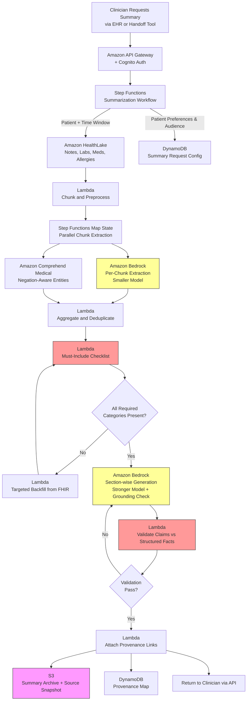

# Recipe 2.6 Architecture and Implementation: Clinical Note Summarization

*Companion to [Recipe 2.6: Clinical Note Summarization](chapter02.06-clinical-note-summarization). This page covers the AWS architecture, services, prerequisites, and pseudocode. For the problem framing and the conceptual approach, start with the main recipe.*

---

## The AWS Implementation

### Why These Services

**Amazon Bedrock for LLM inference.** The core summarization work. As with the AVS pipeline (Recipe 2.5), two model tiers earn their place. For per-chunk extraction, a cheaper model (Claude Haiku, Nova Lite, or equivalent) does good work at a fraction of the cost. For the final prose generation where voice and structure matter, a stronger model (Claude Sonnet) produces noticeably better output. Mixing tiers is normal, not exotic.

**Amazon Bedrock Guardrails for safety constraints.** Guardrails give you a policy layer for patient-identifier leakage, off-topic generation, and a contextual grounding check that compares generated content against a reference context. For clinician-facing summaries, the contextual grounding check is the feature that matters most: it scores how well the output stays faithful to the reference context you provide, and it can reject responses that score below a configured threshold.

**Amazon HealthLake for FHIR-based retrieval.** For systems where clinical data is replicated to HealthLake, retrieval is a set of FHIR queries scoped to the patient and time window of interest. DocumentReference for notes, Observation for labs and vitals, Condition for problem lists, MedicationRequest and MedicationStatement for medications, AllergyIntolerance for allergies. The FHIR resource types map cleanly to the summary's must-include categories.

**Amazon Comprehend Medical for negation-aware entity extraction.** This is where Comprehend Medical earns its keep. The service's clinical NLP handles negation ("no evidence of X"), certainty ("possible X"), and temporal relations ("history of X") with reasonable accuracy. For the critical-safety categories (medications, allergies, conditions), running Comprehend Medical alongside or before the LLM extraction provides a cross-check. When the LLM says "no allergies" and Comprehend Medical also says "no allergies," confidence is high. When they disagree, flag for review.

**Amazon OpenSearch (optional) for searchable note indexing.** For very large charts or when summaries are requested across multi-year histories, indexing all notes into OpenSearch lets you retrieve relevant notes by semantic or keyword search rather than pulling everything and chunking. This is a RAG flavor of summarization: retrieve the most relevant chunks first, then summarize the retrieved set. It trades completeness for scalability and can be appropriate for outpatient longitudinal summaries where "relevant to the current question" is a meaningful filter. If OpenSearch is used, deploy the domain inside the same VPC with VPC-only access (no public endpoint), fine-grained access control enabled, and encryption at rest with a CMK. Reads from Lambda require security-group rules that permit the domain's VPC endpoint.

**AWS Lambda for pipeline steps.** Each stage (retrieve, chunk, extract, aggregate, generate, validate, render) is a Lambda function. Parallelism at the extract stage is often useful: with many chunks, fan out extractions in parallel to keep total latency low.

**AWS Step Functions for orchestration.** The pipeline has branching logic (specialty-specific paths, must-include failure loops, review routing). Step Functions makes the state machine visible and debuggable. For long summaries with many chunks, the parallel Map state is particularly useful for the per-chunk extraction step.

**Amazon S3 for source snapshots and summary archive.** The input note set at the time of summarization, the structured extraction output, the final prose, and any intermediate versions all land in S3 with SSE-KMS encryption. This is the audit trail. A clinician who acted on a summary may need to reference exactly what the summary said two weeks later.

**Amazon DynamoDB for summary metadata and provenance mapping.** One item per generated summary, tracking request parameters, status, and provenance map (which source note contributed which fact). The provenance map is what powers the "where did this come from?" UI feature.

**Amazon EventBridge for trigger patterns.** Summaries may be generated on demand (clinician clicks "summarize") or proactively (every admission gets an on-admission summary; every shift change triggers handoff summaries). EventBridge routes both patterns to the same pipeline. Because EventBridge delivery is at-least-once, proactive triggers require an idempotency guard. Before starting a Step Functions execution, compute a fingerprint from the trigger's natural key (encounter_id plus admission_event_timestamp for on-admission; service_id plus shift_change_timestamp for shift-change) and attempt a conditional DynamoDB PutItem with a 24-hour TTL. If the write succeeds, proceed. If it fails with ConditionalCheckFailedException, return the existing summary_id without starting a duplicate execution. On-demand requests use a different fingerprint key to allow re-requests after chart edits.

**Amazon API Gateway + Cognito for clinician-facing APIs.** The EHR-side integration calls into API Gateway to request summaries. Cognito (or SAML federation with the EHR's identity provider) handles clinician authentication so that access can be audited at the user level.

**AWS CloudTrail and Amazon CloudWatch for audit and monitoring.** Every Bedrock invocation logged, every S3 access logged, every summary request tied to a clinician identity. CloudWatch tracks latency distributions (summarization of long charts should not block at the terminal), error rates, and per-specialty usage.

### Architecture Diagram


### Prerequisites

| Requirement | Details |
|-------------|---------|
| **AWS Services** | Amazon Bedrock, Amazon Bedrock Guardrails, Amazon HealthLake, Amazon Comprehend Medical, Amazon S3, AWS Lambda, AWS Step Functions, Amazon DynamoDB, Amazon EventBridge, Amazon API Gateway, Amazon Cognito (or SAML federation), Amazon CloudWatch, AWS CloudTrail, AWS KMS. Amazon OpenSearch is optional for longitudinal summarization at scale. |
| **IAM Permissions** | `bedrock:InvokeModel`, `bedrock:ApplyGuardrail`, `healthlake:SearchWithGet`, `healthlake:ReadResource`, `comprehendmedical:DetectEntitiesV2`, `comprehendmedical:InferICD10CM`, `s3:GetObject`, `s3:PutObject`, `dynamodb:GetItem`, `dynamodb:PutItem`, `dynamodb:UpdateItem`, `dynamodb:Query`, `states:StartExecution`, `states:SendTaskSuccess`, `states:SendTaskFailure`, `events:PutEvents`, `kms:Decrypt`, `kms:GenerateDataKey`. Every action should be scoped to specific resource ARNs (bucket ARNs, table ARNs, HealthLake datastore ARN, foundation-model ARNs, Guardrail ARN, CMK ARNs). |
| **BAA** | AWS BAA signed. Notes contain PHI. Every service in the pipeline must be HIPAA-eligible and covered. |
| **Bedrock Model Access** | Request access to a capable generation model (Claude Sonnet or equivalent) and a smaller extraction model (Claude Haiku or Nova Lite). Verify model behavior on clinical text with negation and uncertainty language before shipping. |
| **EHR Integration** | Authenticated API from the EHR (context-aware launch, SMART on FHIR is typical). Patient and encounter context passed from the EHR. For handoff or shift-change use cases, event triggers on admission and on shift-change times. Inbound access from the EHR terminates at API Gateway; use Direct Connect or site-to-site VPN for on-premises EHRs, PrivateLink or IP-allowlisted public API Gateway for cloud-hosted EHRs. |
| **Encryption** | S3: SSE-KMS with customer-managed keys. DynamoDB: encryption at rest with CMK. Bedrock and Comprehend Medical: TLS in transit, encryption at rest. CloudWatch Logs: KMS encryption. If Bedrock model-invocation-logging is enabled for quality monitoring, the logged prompts and responses contain PHI; the log destination must be KMS-encrypted and access-controlled to the same standard as the summary archive. Consider sampling rather than logging every invocation. |
| **VPC** | Production: Lambda in private subnets with interface endpoints for Bedrock, Comprehend Medical, HealthLake, KMS, CloudWatch Logs, CloudWatch Monitoring (metrics plane, distinct from Logs), Step Functions, and EventBridge. Gateway endpoints for S3 and DynamoDB. If the clinician-facing API is a private API (EHR callers inside the same VPC), add `execute-api`. If credentials are managed through Secrets Manager, add `secretsmanager`. Interface endpoints are roughly $7-10/month per AZ per endpoint; reflect this in the cost estimate. |
| **CloudTrail** | Enabled with data events for Bedrock invocations, S3 object access, DynamoDB access, and HealthLake reads. Correlate summary requests to the requesting clinician identity. |
| **Sample Data** | Synthea synthetic FHIR data is fine for shape testing. For realistic long-chart testing, MIMIC-IV (PhysioNet credentialed access, governed by a data-use agreement; de-identified rather than PHI, but restricted in how it can be redistributed) provides a substantial volume of ICU notes. Credentialed access typically takes one to two weeks. Never use real PHI in development or testing. |
| **Cost Estimate** | Per-chunk extraction (Haiku/Nova Lite): roughly $0.002-$0.01 per chunk. A typical inpatient stay has 30-80 chunks. Generation (Sonnet): roughly $0.02-$0.08 per summary. Comprehend Medical: roughly $0.001-$0.01 per chunk. End-to-end: $0.05-$0.25 per patient summary for a typical inpatient chart; longitudinal summaries over multi-year histories can run higher ($0.30-$1.00). At 500 summaries per day, roughly $1,500-$7,500 per month. Bedrock pricing changes periodically; verify current per-1K-token rates on the [Bedrock pricing page](https://aws.amazon.com/bedrock/pricing/) before budgeting. |

### Ingredients

| AWS Service | Role |
|------------|------|
| **Amazon Bedrock** | LLM inference for per-chunk extraction and prose generation |
| **Amazon Bedrock Guardrails** | Contextual grounding check, PII/PHI filters, and content policies for generated text |
| **Amazon HealthLake** | FHIR-native retrieval of notes, labs, medications, allergies, and problem list |
| **Amazon Comprehend Medical** | Negation-aware entity extraction; cross-check for medications, conditions, allergies |
| **Amazon OpenSearch (optional)** | Semantic indexing of notes for retrieval-based longitudinal summarization |
| **Amazon S3** | Source note snapshots, intermediate extractions, final summaries, audit archive |
| **AWS Lambda** | Per-stage pipeline logic, chunking, aggregation, validation, rendering |
| **AWS Step Functions** | Workflow orchestration with parallel Map state for per-chunk extraction |
| **Amazon DynamoDB** | Request parameters, summary state, provenance map (fact-to-source linkage) |
| **Amazon EventBridge** | Triggers for on-admission and shift-change summaries; event fan-out |
| **Amazon API Gateway + Cognito** | Authenticated clinician access from the EHR or handoff tool |
| **AWS KMS** | Encryption key management for PHI stores |
| **Amazon CloudWatch + CloudTrail** | Latency metrics, error rates, per-specialty usage analytics, HIPAA audit logs |

### Code

#### Walkthrough

**Step 1: Receive the summary request and resolve context.** A clinician triggers a summary request from inside the EHR or a handoff tool. The request carries the patient identifier, encounter identifier (or time window), the requesting clinician's identity and specialty, the use case (handoff, consult review, pre-visit prep, discharge summary draft), and any format preferences. This step validates the request, logs the access, and initializes state.

```pseudocode
FUNCTION receive_summary_request(request):
    // request.patient_id: FHIR Patient ID
    // request.scope: "current_encounter" | "last_6_months" | "all_time" | custom window
    // request.encounter_id: present if scope is current_encounter
    // request.requesting_user: user identity from the calling application
    // request.specialty: "hospitalist" | "cardiology" | "nephrology" | ... | "general"
    // request.use_case: "handoff" | "consult" | "pre_visit" | "discharge_summary"
    // request.format: "narrative" | "problem_oriented" | "sbar" | "ap_only"

    // Generate an ID that tracks this specific summary through the pipeline
    summary_id = generate UUID

    // Authorization check: does this user have access to this patient?
    // Pull from the EHR's authorization context or from an internal ACL.
    IF NOT user_has_access(request.requesting_user, request.patient_id):
        RETURN { status: "FORBIDDEN" }

    // Record the access. This is audit-relevant.
    write to DynamoDB table "summary-requests":
        summary_id          = summary_id
        status              = "INITIATED"
        patient_id          = request.patient_id
        scope               = request.scope
        encounter_id        = request.encounter_id if present
        requesting_user     = request.requesting_user
        requesting_specialty = request.specialty
        use_case            = request.use_case
        format              = request.format
        requested_at        = current UTC timestamp

    // Kick off the Step Functions workflow
    start Step Functions execution:
        state_machine = "ClinicalNoteSummarizationWorkflow"
        input         = { summary_id: summary_id }

    RETURN { summary_id: summary_id, status: "STARTED" }
```
**Step 2: Retrieve source documents.** Pull the notes and structured data that fall inside the request's scope. Scope matters: a handoff summary should look at the current encounter; a pre-visit summary for a new specialty consult may want to look at the entire relevant history. Structured data (allergies, active problems, current medications) is pulled even when scope is narrow, because those categories belong in every summary regardless of the time window. Critically, retrieval must filter out notes from restricted data categories (42 CFR Part 2 substance-use-treatment records, HIV-related content, adolescent confidential notes, genetic test results) unless the requesting user has a specific disclosure consent on file. Access control is enforced at the retrieval layer, not bolted on downstream.

```pseudocode
FUNCTION retrieve_source_documents(patient_id, scope, encounter_id, requesting_user):
    // Pull notes based on scope
    IF scope == "current_encounter":
        note_filter = { subject: patient_id, encounter: encounter_id }
    ELSE IF scope == "last_6_months":
        cutoff = current date minus 6 months
        note_filter = { subject: patient_id, date: ">= " + cutoff }
    ELSE:
        note_filter = { subject: patient_id }

    notes = call HealthLake.SearchResources with:
        resource_type = "DocumentReference"
        filters       = note_filter + { status: "current" }
        sort          = "date:desc"

    // Pull always-needed structured data, regardless of scope
    // These categories belong in every summary
    allergies = call HealthLake.SearchResources with:
        resource_type = "AllergyIntolerance"
        filters       = { patient: patient_id, clinical-status: "active" }

    active_problems = call HealthLake.SearchResources with:
        resource_type = "Condition"
        filters       = { patient: patient_id, clinical-status: "active" }

    current_meds = call HealthLake.SearchResources with:
        resource_type = "MedicationRequest"
        filters       = { patient: patient_id, status: "active" }

    // For inpatient handoff or discharge: pull active orders, lines, code status
    code_status = call HealthLake.SearchResources with:
        resource_type = "Observation"
        filters       = { patient: patient_id, code: "code-status-finding" }

    // Snapshot everything so we can reconstruct what the summary was based on
    write to S3: "source-snapshots/{summary_id}/notes.json" = notes
    write to S3: "source-snapshots/{summary_id}/structured.json" = {
        allergies, active_problems, current_meds, code_status
    }

    // Filter out notes from restricted data categories unless the requesting user
    // has a specific disclosure consent on file. Categories to evaluate:
    //   - 42 CFR Part 2 substance use treatment notes
    //   - HIV/AIDS-related notes where state law adds restrictions
    //   - Adolescent confidential notes (minor's right to confidential care varies by state)
    //   - Genetic test results (GINA and state-specific additions)
    //   - Behavioral health notes if organizational policy restricts them
    //
    // Restricted-category filtering uses either FHIR DocumentReference.securityLabel
    // (preferred, standardized vocabulary) or a local policy engine keyed on
    // note.type + note.practitioner.specialty.
    patient_consents = call HealthLake.SearchResources with:
        resource_type = "Consent"
        filters       = { patient: patient_id, status: "active" }

    notes = filter_by_disclosure_consent(
        notes             = notes,
        requesting_user   = requesting_user,
        patient_consents  = patient_consents
    )
    // Note: the consent engine above is a placeholder for a real policy service.
    // See "Why This Isn't Production-Ready" for the governance concerns.

    RETURN {
        notes: notes,
        allergies: allergies,
        active_problems: active_problems,
        current_meds: current_meds,
        code_status: code_status
    }
```
**Step 3: Chunk and preprocess notes.** Turn the flat list of notes into processable chunks. A single note is often a reasonable chunk; very long notes (an H&P or a multi-page consult) may need sub-chunking. Preprocessing removes boilerplate (EHR-generated headers and footers, standard signatures, macro text) and normalizes dates. This step also tags notes with their service, author, and encounter_id so the extraction can attribute content correctly and enforce encounter boundaries (preventing the "fact blending across visits" failure mode described earlier).

```pseudocode
FUNCTION chunk_and_preprocess(notes):
    chunks = empty list

    FOR each note in notes:
        text = extract_text_from_document_reference(note)

        // Strip boilerplate and macros
        text = remove_boilerplate(text)

        // Tag with metadata that will travel with the chunk.
        // encounter_id is critical: it prevents fact blending across admissions.
        chunk_metadata = {
            note_id: note.id,
            note_date: note.date,
            note_type: note.type.display,         // e.g., "Progress Note", "H&P", "Discharge Summary"
            author: note.author[0].display,
            service: extract_service_from_note(note),   // e.g., "Hospitalist", "Cardiology", "Nephrology"
            encounter_id: note.context.encounter.reference   // ties this chunk to a specific encounter
        }

        // If the note is very long, sub-chunk it.
        // Target around 2000-4000 tokens per chunk to stay efficient per-call.
        // Do not merge sub-chunks across encounter boundaries.
        IF token_count(text) > 4000:
            sub_chunks = split_by_headers_then_length(text, target_tokens=3000)
            FOR each sub_chunk in sub_chunks:
                append { text: sub_chunk, metadata: chunk_metadata } to chunks
        ELSE:
            append { text: text, metadata: chunk_metadata } to chunks

    RETURN chunks
```
**Step 4: Extract structured facts per chunk (parallel).** Each chunk goes through an extraction step that produces a structured object: what this chunk contains in categorized, attributed form. Parallel execution (via Step Functions Map state) keeps total latency manageable for long charts. Comprehend Medical runs alongside the LLM extraction for the categories where negation-aware NLP adds the most value: medications, conditions, allergies.

```pseudocode
FUNCTION extract_chunk_facts(chunk):
    // Prompt the LLM to extract into a fielded schema.
    // The prompt is specialty-neutral; filtering for specialty happens later.

    extraction_prompt = """
    You are extracting clinical facts from a single clinical note. Produce a structured JSON object
    with the fields below. Use ONLY what is explicitly documented in the note. If a field is not
    documented in THIS note, return an empty list or null. Do not infer across visits or dates.

    This chunk is associated with encounter_id {chunk.metadata.encounter_id}. Extract only facts
    documented in this chunk as pertaining to that encounter. If the chunk references prior
    encounters (for example, "admitted 3 months ago for AKI"), include those in a dedicated
    "historical_context" field, not mixed into the current-encounter fields.

    Preserve negation language exactly. "No evidence of X" must not become "X." "Rule out X" must
    not become "has X." Preserve uncertainty language ("possible," "probable," "rule out").

    Return JSON with these fields:
    - active_problems: list of {name, icd10_if_known, certainty, is_new_in_this_note}
    - medications_mentioned: list of {name, dose_if_stated, route_if_stated, action: "continued" | "started" | "stopped" | "dose_changed" | "discussed"}
    - allergies_mentioned: list of {substance, reaction_if_stated, severity_if_stated}
    - key_findings: list of clinically significant findings from this note, with exact wording preserved
    - negative_findings: list of explicit negatives (ruled out, no evidence of, denied)
    - procedures_performed: list of {name, date_if_stated}
    - labs_imaging_mentioned: list of {test, result_summary, date_if_stated, is_critical}
    - consults_or_recs: list of {specialty, recommendation, date_if_stated}
    - follow_up_plan: text as written, or null
    - code_status_mentioned: exact text if present, or null
    - devices_or_lines: list of active lines, tubes, drains, implants mentioned
    - critical_events: list of any adverse events, rapid responses, code blue, etc.
    - historical_context: list of references to prior encounters mentioned in this note

    CLINICAL NOTE:
    Encounter ID: {chunk.metadata.encounter_id}
    Note date: {chunk.metadata.note_date}
    Note type: {chunk.metadata.note_type}
    Service: {chunk.metadata.service}
    Author: {chunk.metadata.author}

    {chunk.text}
    """

    // Note on model IDs: Bedrock model IDs are versioned and, in most regions,
    // now require a regional inference-profile prefix (e.g., "us.anthropic...").
    // The family-style IDs used in this pseudocode are illustrative.
    llm_response = call Bedrock.InvokeModel with:
        model_id    = "anthropic.claude-haiku-4"
        prompt      = extraction_prompt
        max_tokens  = 2048
        temperature = 0.0

    extracted = parse JSON from llm_response

    // Cross-check clinical entity extraction with Comprehend Medical.
    // Comprehend Medical is particularly strong at negation and temporal modifiers.
    // Note: the Comprehend Medical text size limit is enforced in bytes, not characters.
    // For multilingual content, encode to utf-8 and slice bytes before calling.
    cm_response = call ComprehendMedical.DetectEntitiesV2 with:
        text = chunk.text

    cm_entities = parse entities from cm_response

    // Add CM findings as a parallel entity list; aggregation step resolves conflicts.
    structured_chunk = {
        chunk_id: generate UUID,
        note_id: chunk.metadata.note_id,
        note_date: chunk.metadata.note_date,
        note_type: chunk.metadata.note_type,
        service: chunk.metadata.service,
        author: chunk.metadata.author,
        llm_extracted: extracted,
        cm_entities: cm_entities
    }

    write to S3: "extractions/{summary_id}/{chunk_id}.json" = structured_chunk

    RETURN structured_chunk
```
**Step 5: Aggregate and deduplicate.** Combine the per-chunk structured objects into a single patient-level structured object. Deduplicate facts that appear across multiple notes, but keep the mention count and the date range over which the fact appeared (a fact mentioned in 12 of 15 progress notes is more likely to still be true than a fact mentioned once). Reconcile conflicts where possible, flag them where not.

```pseudocode
FUNCTION aggregate_facts(structured_chunks, retrieved_structured_data):
    aggregated = {
        active_problems: empty dict,     // keyed by normalized problem name
        medications: empty dict,     // keyed by normalized drug name
        allergies: empty list,
        key_findings_timeline: empty list,
        negative_findings: empty list,
        procedures: empty list,
        labs_imaging: empty list,
        consult_recs: empty list,
        code_status: null,
        devices_lines: empty dict,
        critical_events: empty list,
        conflicts: empty list
    }

    // Start with always-present structured data (allergies, active problems, current meds)
    // These are ground truth from the EHR's structured tables; LLM extractions supplement.
    FOR each allergy in retrieved_structured_data.allergies:
        append { substance: allergy.code.display, reaction: allergy.reaction,
                 source: "fhir_allergyintolerance" } to aggregated.allergies

    FOR each problem in retrieved_structured_data.active_problems:
        problem_key = normalize(problem.code.display)
        aggregated.active_problems[problem_key] = {
            name: problem.code.display,
            icd10: problem.code.coding[0].code if icd10,
            first_recorded: problem.recordedDate,
            source: "fhir_condition",
            mentions: 0   // will increment as we find mentions in notes
        }

    FOR each med in retrieved_structured_data.current_meds:
        med_key = normalize(med.medication.display)
        aggregated.medications[med_key] = {
            name: med.medication.display,
            dose: med.dosageInstruction[0].text,
            source: "fhir_medicationrequest",
            most_recent_action: "active_per_fhir",
            mention_dates: empty list
        }

    // Now merge in the per-chunk LLM extractions
    FOR each chunk in structured_chunks sorted by note_date ascending:
        extracted = chunk.llm_extracted

        // Active problems from notes
        FOR each problem in extracted.active_problems:
            problem_key = normalize(problem.name)
            IF problem_key exists in aggregated.active_problems:
                aggregated.active_problems[problem_key].mentions += 1
                append chunk.note_date to aggregated.active_problems[problem_key].mention_dates
            ELSE:
                aggregated.active_problems[problem_key] = {
                    name: problem.name,
                    first_mention: chunk.note_date,
                    last_mention: chunk.note_date,
                    mention_count: 1,
                    certainty: problem.certainty,
                    source: "note:" + chunk.note_id
                }

        // Medications: track actions over time (started, stopped, dose-changed)
        FOR each med_mention in extracted.medications_mentioned:
            med_key = normalize(med_mention.name)
            IF med_key not in aggregated.medications:
                aggregated.medications[med_key] = {
                    name: med_mention.name,
                    mention_dates: empty list,
                    actions: empty list
                }
            append {date: chunk.note_date, action: med_mention.action,
                    dose: med_mention.dose_if_stated} to aggregated.medications[med_key].actions
            append chunk.note_date to aggregated.medications[med_key].mention_dates

        // Key findings become a timeline
        FOR each finding in extracted.key_findings:
            append {date: chunk.note_date, text: finding,
                    source_note_id: chunk.note_id, service: chunk.service} to aggregated.key_findings_timeline

        // Negative findings preserved verbatim
        FOR each neg in extracted.negative_findings:
            append {date: chunk.note_date, text: neg,
                    source_note_id: chunk.note_id} to aggregated.negative_findings

        // Code status: use the most recent mention
        IF extracted.code_status_mentioned is not null:
            IF aggregated.code_status is null OR chunk.note_date > aggregated.code_status.date:
                aggregated.code_status = { text: extracted.code_status_mentioned,
                                           date: chunk.note_date,
                                           source_note_id: chunk.note_id }

        // Devices and lines: track if added or removed
        FOR each device in extracted.devices_or_lines:
            device_key = normalize(device)
            aggregated.devices_lines[device_key] = {
                device: device,
                last_mentioned: chunk.note_date,
                source_note_id: chunk.note_id
            }

        // Critical events preserved individually
        FOR each event in extracted.critical_events:
            append {date: chunk.note_date, text: event,
                    source_note_id: chunk.note_id} to aggregated.critical_events

    // Conflict detection: e.g., Cardiology recommends X on day 3, Hospitalist still has Y on day 5
    aggregated.conflicts = detect_conflicts(aggregated)
    // The conflicts list is consumed by Step 7's generation prompt, which renders
    // each conflict attributed by service without reconciling to a single recommendation.

    write to S3: "aggregations/{summary_id}/aggregated.json" = aggregated

    RETURN aggregated
```
**Step 6: Apply the must-include checklist.** Before generation, verify that the aggregated object covers every required category for this summary type. If allergies are empty but the retrieved structured data had allergies, something went wrong in aggregation. If active problems is empty but the patient has an active chart, something went wrong in aggregation. Missing categories either get backfilled from structured data or get flagged as gaps that the generated prose must acknowledge.

```pseudocode
FUNCTION apply_must_include_checklist(aggregated, use_case, retrieved_structured_data):
    checklist = required_categories_for_use_case(use_case)
    // For "handoff": [allergies, active_problems, current_medications, code_status,
    //                 recent_critical_events, active_devices_lines, consult_recs]
    // For "consult": [allergies, active_problems, current_medications,
    //                 relevant_history_for_consult_reason]
    // For "pre_visit": [allergies, active_problems, current_medications, recent_labs]
    // For "discharge_summary": [admission_reason, hospital_course, discharge_meds,
    //                           discharge_instructions, follow_up]

    gaps = empty list

    FOR each required_category in checklist:
        IF category_is_empty(aggregated, required_category):
            // Try to backfill from retrieved_structured_data
            backfill_result = attempt_backfill(aggregated, required_category, retrieved_structured_data)
            IF NOT backfill_result.success:
                append required_category to gaps

    // If the source truly has no data for a category, that's a valid state; record it
    // explicitly so the generator includes an "Allergies: none recorded" statement
    // rather than silently omitting the section.
    FOR each category in checklist:
        IF category_is_empty_after_backfill(aggregated, category):
            aggregated.explicit_empties = aggregated.explicit_empties + [category]

    IF length of gaps > 0:
        // Gap means: the category is required AND the source has data AND the aggregation missed it.
        // This is a pipeline failure, not a content absence. Re-run aggregation or escalate.
        RETURN { status: "AGGREGATION_GAP", gaps: gaps }

    RETURN { status: "READY_FOR_GENERATION", aggregated: aggregated }
```
**Step 7: Generate the summary prose.** Now the writing step. The aggregated structured object is the input; the prompt takes the specialty, use case, and format parameters; the output is a section-wise prose summary with explicit section headers. The generation uses Bedrock Guardrails' contextual grounding check with the aggregated object as the reference context, which rejects responses that score below a configured grounding threshold.

```pseudocode
FUNCTION generate_summary_prose(aggregated, request_params):
    // Build a prompt that enforces:
    // - Section structure appropriate for the use case
    // - Specialty-specific emphasis (nephrology-forward, cardiology-forward, general hospitalist, etc.)
    // - Grounded generation: only use facts in the aggregated object
    // - Preservation of negations, uncertainty, and temporal qualifiers
    // - Explicit handling of empty categories ("Allergies: none documented")

    sections = sections_for_use_case(request_params.use_case, request_params.format)
    // Example for "handoff":
    // ["one_liner", "active_issues", "medications", "allergies", "code_status",
    //  "recent_significant_events", "pending_workup", "consults_and_recs",
    //  "active_disagreements_between_services", "devices_and_lines", "disposition_plan"]

    // Minimum-necessary: redact non-clinical PHI from the aggregated object before
    // the generation call. The generation step does not need MRN, DOB, phone, address,
    // or insurance identifiers. The preferred name is an exception if the summary
    // references the patient by name; strip everything else. This also limits PHI
    // exposure in Bedrock model-invocation logs if logging is enabled.
    aggregated_for_prompt = redact_non_clinical_phi(aggregated)

    generation_prompt = """
    You are drafting a clinician-facing summary for a {request_params.specialty} {request_params.use_case} review.
    The reader is a busy clinician who needs to make decisions in minutes.

    HARD REQUIREMENTS:
    - Use ONLY the facts in the structured summary object provided below. Do not add diagnoses,
      medications, findings, or dates that are not in the input.
    - Preserve negation language exactly. If the input says "no evidence of PE," the summary must
      also say "no evidence of PE" or equivalent preserved negation. Never drop negations.
    - Preserve uncertainty language. "Possible sepsis" is not "sepsis." "Rule out PE" is not "PE."
    - Preserve temporal qualifiers. "History of" stays "history of." "This admission" stays "this admission."
    - When a required section has no content, say so explicitly ("Allergies: none documented")
      rather than omitting the section.
    - Attribute consultant recommendations to the consulting service.
    - Keep to {request_params.format} format. Use the section headers listed below.

    CONFLICT HANDLING:
    If the structured summary object contains entries in the "conflicts" array, render them in a
    dedicated section with this exact header: "Active Disagreements Between Services." For each
    conflict, name the services involved and summarize each service's position attributed by
    service (for example, "Cardiology recommends aggressive diuresis per note on 5/8. Nephrology
    notes worsening creatinine and recommends cautious diuresis per note on 5/9"). Do not
    collapse into a single recommendation. Do not pick a side.

    SPECIALTY EMPHASIS FOR {request_params.specialty}:
    {specialty_emphasis_instructions(request_params.specialty)}
    // For nephrology: foreground baseline and current creatinine, fluid status, nephrotoxic meds,
    //                 renal dosing notes, dialysis status. Background: other specialty content.
    // For cardiology: foreground cardiac history, current rhythm, troponins, BNP trend, ejection
    //                 fraction if recent, anticoagulation status.
    // For hospitalist (general): balance all active issues; no particular specialty dominance.

    STRUCTURE:
    Use the following section headers, in this order:
    {sections as ordered list}

    STRUCTURED SUMMARY OBJECT (your only source of facts):
    {aggregated_for_prompt as JSON}

    OUTPUT:
    Produce the summary as plain markdown with the section headers above. After the summary,
    output a JSON block listing every specific claim (date, dose, specific finding, specific
    recommendation) with the source_note_id it came from, so claims can be verified.
    """

    response = call Bedrock.InvokeModel with:
        model_id          = "anthropic.claude-sonnet-4"
        prompt            = generation_prompt
        max_tokens        = 6000
        temperature       = 0.2
        guardrail_id      = CLINICAL_SUMMARIZATION_GUARDRAIL_ID
        // The guardrail is configured with:
        // - Contextual grounding check: reference context = aggregated (JSON),
        //   threshold tuned for clinical fidelity (typically 0.85+)
        // - PII detection disabled or configured to permit PHI (this is clinician-facing)
        // - Content filters on harmful content
        //
        // The contextual grounding check requires the aggregated object to be
        // explicitly tagged as grounding source. Using the Converse API, wrap
        // the aggregated JSON in a guardContent block. Using InvokeModel, supply
        // the grounding source via the Guardrails policy configuration. Without
        // this tagging, the contextual grounding check returns SAFE regardless
        // of actual fidelity.
        //
        // Guardrail intervention is signaled in the response body via
        // "amazon-bedrock-guardrailAction": "INTERVENED". Branch on that field,
        // not on the model's stop_reason.

    summary_text = parse summary content from response
    provenance   = parse provenance JSON from response

    // Check for Guardrail intervention via the documented response field
    IF response["amazon-bedrock-guardrailAction"] == "INTERVENED":
        RETURN { status: "GROUNDING_REJECTED", response: response }

    RETURN { status: "GENERATED", summary_text: summary_text, provenance: provenance }
```
**Retry strategy on validation or grounding failure:**

The pipeline retries generation up to three times with escalating strategies:

1. **Attempt 1:** Original prompt at temperature 0.2.
2. **Attempt 2:** Stronger grounding instruction that names the specific unverified claims and asks the model to drop or correct them. Temperature 0.2.
3. **Attempt 3:** Deterministic generation at temperature 0.0.

After attempt 3 fails validation, the pipeline does NOT auto-deliver. It routes to one of:
- A clinician_review_queue (preferred for clinician-facing tools), where a human reviews the summary before it reaches the EHR.
- Partial delivery with a banner noting which sections failed validation.
- An operations alert with summary_id, failure category, and a hold on delivery.

The exhausted-retry state is tracked in DynamoDB as `status = "VALIDATION_EXHAUSTED_ROUTED_TO_REVIEW"` and emits a CloudWatch metric `ValidationExhausted` with specialty and use_case dimensions so operational dashboards catch drift. A summary never auto-ships to the EHR without passing validation.

**Step 8: Validate claims and attach provenance.** Belt-and-suspenders alongside the Guardrails grounding check. Parse the generated prose, identify specific claims (dates, doses, named findings, named recommendations), and verify each one against the structured object. Attach source-note links so the clinician can click into any claim to see the note it came from. This is the feature that turns "a summary I have to trust" into "a summary I can verify."

```pseudocode
FUNCTION validate_and_attach_provenance(summary_text, provenance, aggregated):
    unverified = empty list
    provenance_map = empty dict    // maps (section, claim_text) -> source_note_id

    FOR each claim in provenance.factual_claims:
        // claim has: text, source_note_id (as reported by the model)

        // Verify the source_note_id actually exists in the aggregated input
        IF claim.source_note_id NOT in note_ids_in(aggregated):
            append {claim: claim, reason: "source_not_in_input"} to unverified
            CONTINUE

        // For specific types of claims, do a stronger check:
        IF claim is a dose or quantity:
            actual_source_value = lookup_in_aggregated(aggregated, claim.source_note_id, claim.category)
            IF normalize(claim.asserted_value) != normalize(actual_source_value):
                append {claim: claim, reason: "value_mismatch",
                        asserted: claim.asserted_value, actual: actual_source_value} to unverified

        // For semantic claims (findings, recommendations), check semantic similarity
        ELSE:
            source_text = get_source_text_for_claim(aggregated, claim.source_note_id, claim.category)
            IF semantic_similarity(claim.text, source_text) < 0.7:
                append {claim: claim, reason: "semantic_drift"} to unverified

        // Record provenance for the UI
        provenance_map[claim.text] = claim.source_note_id

    IF length of unverified > 0:
        RETURN { status: "VALIDATION_FAILED", unverified: unverified }

    // Persist provenance map so the UI can render links
    write to DynamoDB table "summary-provenance":
        summary_id     = summary_id
        provenance_map = provenance_map
        verified_at    = current UTC timestamp

    RETURN { status: "VALIDATED", provenance_map: provenance_map }
```
**Step 9: Render and deliver.** The content is clinician-facing markdown. Rendering differs by destination. An EHR sidebar wants compact markdown. A handoff tool may want structured sections with collapsible detail. A PDF for printed handoff wants a different layout. The archive in S3 always keeps both the raw markdown and the structured provenance so the summary can be re-rendered later in any format.

```pseudocode
FUNCTION render_and_deliver(summary_id, summary_text, provenance_map, request_params):
    // Archive raw content and provenance
    write to S3: "final-summaries/{summary_id}/summary.md" = summary_text
    write to S3: "final-summaries/{summary_id}/provenance.json" = provenance_map

    // Render for destination
    IF request_params.destination == "ehr_sidebar":
        rendered = render_compact_markdown_with_clickable_provenance(summary_text, provenance_map)
    ELSE IF request_params.destination == "handoff_tool":
        rendered = render_structured_handoff_view(summary_text, provenance_map)
    ELSE IF request_params.destination == "pdf":
        rendered = render_pdf_with_provenance_footnotes(summary_text, provenance_map)

    write to DynamoDB table "summary-requests": update summary_id with
        status       = "DELIVERED"
        delivered_at = current UTC timestamp
        render_type  = request_params.destination

    // Emit a CloudWatch metric: latency, chunk count, specialty, use case
    emit CloudWatch metric:
        namespace    = "ClinicalSummarization"
        metric_name  = "SummariesDelivered"
        dimensions   = { specialty, use_case, render_type }

    RETURN { status: "DELIVERED", rendered: rendered }
```
> **Curious how this looks in Python?** The pseudocode above covers the concepts. If you'd like to see sample Python code that demonstrates these patterns using boto3, check out the [Python Example](chapter02.06-python-example). It walks through each step with inline comments and notes on what you'd need to change for a real deployment.

### Expected Results

**Sample output for a hospitalist handoff summary on a 6-day inpatient admission:**

> **Reading the sample:** Clinician-facing summaries use clinical shorthand by design. Key abbreviations below: NSTEMI (non-ST-elevation myocardial infarction), PCI (percutaneous coronary intervention), DES (drug-eluting stent), LAD (left anterior descending artery), DAPT (dual antiplatelet therapy), IJ (internal jugular), UF (ultrafiltration), BNP (B-type natriuretic peptide), HD (hemodialysis), s/p (status post), "cards" (cardiology service). The summary reads naturally to its intended audience; non-clinician readers can use this key.

```json
{
  "summary_id": "CNS-2026-05-10-04129",
  "status": "DELIVERED",
  "specialty": "hospitalist",
  "use_case": "handoff",
  "format": "problem_oriented",
  "scope": "current_encounter",
  "source_note_count": 47,
  "generated_summary": "# Handoff Summary\n\n## One-Liner\n72M with CHF (EF 30%) and ESRD on HD, admitted 5/4 with volume overload and NSTEMI, now hospital day 6, post-cath with DES to LAD on 5/7, currently on heparin drip, cards following.\n\n**1. NSTEMI, post-PCI (active).** Troponin peaked 4.2 on 5/5, trended down to 0.18 on 5/9. Cardiac cath 5/7: 90% LAD stenosis, DES placed. No complications. On DAPT (aspirin 81 mg, clopidogrel 75 mg) and heparin drip per cards.\n\n**2. Acute on chronic CHF exacerbation (improving).** Admission BNP 3200 (baseline ~800). IV furosemide 80 mg BID x 3 days, transitioned to oral 40 mg daily 5/8. Net -6L since admission. Weights stable x 48 hours. EF 30% (unchanged from prior TTE).\n\n**3. ESRD on hemodialysis (stable).** Dialyzes MWF at outpatient center. Continued in-hospital schedule. Last HD 5/9 with UF 2.5L. Line is right IJ tunneled catheter (dialysis access).\n\n**4. Anemia of CKD (stable).** Hgb 9.4 on admission, nadir 8.6 post-cath (no bleeding identified), currently 9.1. Continuing home darbepoetin.\n\n## Medications\n\n- Aspirin 81 mg daily (started this admission)\n- Clopidogrel 75 mg daily (started this admission)\n- Heparin drip (cards managing, anticipate transition to fondaparinux or discontinuation per cards 5/10 or 5/11)\n- Metoprolol succinate 50 mg daily (home med, continued)\n- Atorvastatin 80 mg nightly (home 40 mg, increased this admission per cards)\n- Furosemide 40 mg PO daily (transitioned from IV 5/8)\n- Darbepoetin per HD protocol\n- Lisinopril HELD (hyperkalemia risk)\n\n## Allergies\n- Sulfa (rash, documented)\n\n## Code Status\nFull code, confirmed with patient and daughter on 5/5.\n\n## Recent Significant Events\n- 5/5 07:12 Troponin peak 4.2, cards consulted\n- 5/7 Cardiac cath with DES to LAD\n- 5/7 Post-cath small groin hematoma, stable, resolved\n- 5/8 Transitioned IV to PO diuretic, weights holding\n\n## Pending\n- Cards to decide on heparin-to-fondaparinux transition vs. discontinuation (expected 5/10-5/11)\n- Nephrology weighing in on contrast exposure impact, no worsening of baseline renal function noted\n- Outpatient cards follow-up to be scheduled for 1 week post-discharge\n\n## Consults and Recommendations\n- **Cardiology (Dr. Patel):** Managing post-PCI anticoagulation. DAPT for 12 months minimum.\n- **Nephrology (Dr. Martinez):** No dose adjustments needed for current regimen; continue HD schedule.\n\n## Lines, Tubes, Drains\n- Right IJ tunneled HD catheter (dialysis access, established prior to admission)\n- Peripheral IV x 1\n\n## Disposition Plan\nAnticipate discharge 5/11 or 5/12 pending cards clearance. Home with outpatient HD continuation. Cards follow-up within 7 days, PCP follow-up within 14 days.",
  "factual_claims": [
    {"claim": "EF 30%", "source_note_id": "note-2026-05-04-echo-impression"},
    {"claim": "Troponin peaked 4.2 on 5/5", "source_note_id": "note-2026-05-05-hospitalist-progress"},
    {"claim": "Cardiac cath 5/7: 90% LAD stenosis, DES placed", "source_note_id": "note-2026-05-07-cath-report"},
    {"claim": "BNP 3200", "source_note_id": "note-2026-05-04-admission-hp"},
    {"claim": "Net -6L since admission", "source_note_id": "note-2026-05-09-hospitalist-progress"},
    {"claim": "Full code, confirmed with patient and daughter on 5/5", "source_note_id": "note-2026-05-05-hospitalist-progress"},
    {"claim": "Sulfa allergy (rash)", "source_note_id": "fhir_allergyintolerance"}
  ],
  "// NOTE": "factual_claims array abbreviated for readability. A production validator enumerates every specific claim in the summary (typically 20-40 per inpatient handoff).",
  "validation_status": "VALIDATED",
  "must_include_categories_covered": [
    "allergies", "active_problems", "current_medications", "code_status",
    "recent_critical_events", "active_devices_lines", "consult_recs"
  ],
  "chunks_processed": 47,
  "processing_time_ms": 28000
}
```
**Performance benchmarks:**

| Metric | Typical Value |
|--------|---------------|
| End-to-end latency, 30-50 chunk chart | 15-40 seconds |
| End-to-end latency, 150+ chunk chart (multi-year longitudinal) | 45-120 seconds |
| Validation pass rate (first generation) | 85-95% for current-encounter summaries; 75-88% for longitudinal |
| Must-include checklist pass rate (after backfill) | 95%+ for inpatient handoff; 90%+ for discharge summaries |
| Clinician override/edit rate when review is enabled | 10-25% minor edits; 3-8% substantive edits |
| Cost per summary | $0.05-$0.25 inpatient; $0.30-$1.00 longitudinal |
| Grounding-check rejection rate (Guardrails) | 2-8% initial; drops to under 2% after prompt iteration |
| Provenance link accuracy | 95%+ when validator is strict; unverified claims are held |

**Where it struggles:**

- **Very long longitudinal charts.** Summarizing ten years of outpatient records produces summaries that are either too long to be useful or too compressed to capture nuance. Retrieval-based (RAG) summarization with scoped queries ("summarize this patient's diabetes history") works better than "summarize everything."
- **Sparse notes.** A chart with six notes, each a single paragraph, doesn't have enough content to fill a structured summary. The output reads thin or repeats the source nearly verbatim.
- **Ambulatory vs inpatient style mismatch.** Ambulatory notes often use problem-oriented structures that map poorly to inpatient handoff formats and vice versa. The format parameter helps but doesn't fully bridge the gap.
- **Outside records.** Faxed records OCR'd into the chart vary dramatically in text quality. A note that came in as a scanned PDF with marginal OCR produces extraction errors that cascade into the summary.
- **Contradictions across services.** When two services disagree (cardiology wants aggressive diuresis, nephrology worries about the kidneys), the summary needs to surface the disagreement rather than picking a side. This takes specific prompt engineering; without it, the model tends to smooth disagreements into single recommendations.
- **Pediatrics and obstetrics.** Specialty-specific prompt templates should exist for these populations; a generic hospitalist template produces summaries that miss population-specific priorities (growth parameters, immunization status, gestational age).
- **Behavioral health integration.** Mental health notes often have restricted access and different disclosure rules (42 CFR Part 2 for substance use treatment records). Summarization pipelines need to respect these boundaries; a summary that pulls content from a Part 2 note without the right consent is a compliance problem, not just a quality problem.
- **Code status history.** Code status changes over the course of a long admission (full code on admission, DNR after day 5 family meeting, then reversed after recovery). A summary that reports only the current status misses the arc; a summary that reports every change clutters. The right balance depends on use case.

---

## Why This Isn't Production-Ready

The pipeline above produces summaries that are structurally sound and clinically usable. Deploying it in a health system requires addressing a longer list.

**Provenance UX is where trust lives or dies.** Clinicians will use a summarization tool if they can verify any claim in one click. They won't use it if they have to hunt through forty notes to check a fact. Provenance isn't a backend concern; it's a UX concern that the rendering layer has to get right. Expect significant iteration on how provenance links are displayed, what happens when a clinician clicks through, and how conflicting provenance (a claim drawn from multiple notes) is represented.

**Specialty template maintenance.** Every specialty has its own idea of what a good summary looks like. Nephrology wants fluid status and creatinine trends foregrounded. Oncology wants treatment history, staging, and response data. Pediatrics wants growth and immunizations. ICU wants ventilator settings and pressor trends. Each specialty template is a living artifact that clinical leadership from that specialty should own and iterate. The engineering team provides the pipeline; the clinical team provides the content priorities.

**Consults as first-class data.** Consult notes are not just more notes; they're attributed opinions that clinicians weight differently. A good summary renders "Cardiology recommends X" as "Cardiology recommends X," not as "X is recommended." This attribution discipline has to be enforced at extraction, preserved through aggregation, and respected in generation. It's easy to get right by accident and easy to get wrong by accident.

**Handling confidential notes and restricted content.** Behavioral health notes, substance use treatment (42 CFR Part 2), HIV-related content, genetic test results, and adolescent confidential information all have specific disclosure rules. A summarization pipeline that pulls from every note in the chart risks disclosing protected content inappropriately. Access control has to be enforced at the retrieval layer, not bolted on downstream.

**Real-time chart changes.** A summary generated at 7:00 AM is stale by 10:00 AM when the cardiology consult note is signed. For inpatient handoff, this is fine (handoff is a point-in-time event). For ongoing rounds use, you need a refresh pattern that either regenerates on significant events (note signed, result available, med change) or shows the clinician when the summary is stale.

**Provider attribution and liability.** A summary that influences clinical decision-making becomes part of the decision record. Legal teams will ask: who authored this? What's the provider attribution? Is it part of the legal medical record or not? These aren't questions the engineering team answers; they're questions the governance structure has to answer before deployment. Start these conversations months in advance.

**FDA and regulatory posture.** Clinical summarization that influences care decisions may fall within FDA's interest in clinical decision support. The agency's September 2022 Clinical Decision Support Software guidance (non-binding) exempts decision support that "allows independent review of the basis" of recommendations. Provenance linking arguably satisfies that criterion. But the boundary is not crisp, and summarization tools that trend toward decision-making (not just summarization) have higher regulatory exposure. Legal and regulatory review is warranted before broad deployment.

**Clinician training and adoption.** A summary tool dropped into an EHR without training produces one of two failure patterns. Either clinicians don't use it (because they don't know it exists or don't trust it) or they over-trust it (because it's fast and looks polished). Both are bad. Structured training that shows clinicians how to verify provenance, how to read for omissions, and how to report errors is essential. This is change management, not engineering.

**Evaluation methodology.** How do you know the summaries are good? Automated metrics (ROUGE, BLEU) are weakly correlated with clinical usefulness. The real evaluation involves blinded clinician review of summary quality, omission detection, and clinical accuracy. Build this evaluation pipeline before you scale the summarization pipeline, not after. Without it, you're shipping without knowing what you're shipping.

**Feedback loops.** When a clinician finds an error in a summary, how does that error get back to the team? If the answer is "an email to the ML team," the feedback loop will be slow and fragile. Build a one-click "this summary is wrong" feedback mechanism that captures context, the clinician's correction, and routes to a review queue. Use the feedback to iterate on prompts, chunking strategies, and must-include checklists. This is the difference between a tool that gets better over time and one that plateaus.

**Cost at scale.** A hospital generating handoff summaries for every patient twice a day (morning and evening handoff) for a 500-bed facility can rack up meaningful Bedrock spend. Budget modeling should assume steady-state usage patterns including summary regeneration on note events, not just one-per-admission. Cost optimization options: cache the structured extractions (they change only when notes change) and regenerate only the final prose when context shifts; use smaller models for extraction; apply input token reduction through aggressive preprocessing.

**Audit logging and retention.** The clinical summary is PHI. The source snapshot is PHI. The structured extraction is PHI. All three require HIPAA-appropriate retention (6+ years typical), access logging, and encryption at rest and in transit. The provenance map is PHI-adjacent (it references notes that are PHI). Configure retention policies explicitly; don't leave S3 objects lingering without lifecycle rules.

**Network egress for external EHR connectivity.** For health systems with cloud EHRs, summary requests often come in over TLS to vendor public endpoints; manage credentials via Secrets Manager and enforce egress controls. For on-premises EHRs, plan for Direct Connect or site-to-site VPN with FHIR gateways reachable over private IPs. PHI in transit must never traverse the public internet unencrypted.

---

## Variations and Extensions

**Handoff-specific summaries with SBAR format.** The classical Situation-Background-Assessment-Recommendation format is widely used in nursing and interdisciplinary handoffs. An SBAR-formatted summary is a small variation on the pipeline: same extraction, same aggregation, different final generation prompt with SBAR-specific section headers. The content overlaps substantially with the problem-oriented format but the ordering and emphasis differ.

**Specialty-consultation "pre-read" summaries.** When a consulting specialist receives a consult request, they typically need to review the chart before seeing the patient. Extend the pipeline to produce a consult-specific summary that foregrounds the reason for consult, relevant history for the consult question, and recent findings that inform the consult. This is essentially the specialty-aware summarization case applied to a specific workflow. Bonus: the consult note the specialist writes afterward can be auto-compared to the pre-read summary to track whether the summary captured the issues the specialist actually considered.

**Longitudinal disease-specific summaries.** For chronic conditions (diabetes, heart failure, IBD, multiple sclerosis), a disease-specific longitudinal summary pulls across all notes, labs, imaging, and procedures relevant to that condition. "Summarize this patient's diabetes care since 2019." This is a RAG variation: retrieve the subset of notes relevant to the condition, then summarize. Clinicians find these invaluable for specialty-referral preparation and for patients who have seen multiple providers.

**Interval summaries ("what changed since last time I saw this patient").** For providers with long-standing patient relationships, the useful summary is often not "the patient's whole history" but "what changed since I saw them three months ago." This is an interval summary: scope is the time window between visits, structure foregrounds changes (new meds, new diagnoses, interim hospitalizations, significant lab changes). Low-overhead extension of the main pipeline; scope just becomes "since last encounter with this provider."

**Audio-rendered handoff.** For providers who prefer audio (during a commute, while washing hands between rooms), render the summary through Amazon Polly as a short audio briefing. Polly handles medical pronunciation adequately for many terms; edge cases may need a custom lexicon. The audio is PHI and must be stored with the same encryption, access controls, and retention posture as the text summary.

**Multi-patient rounding summaries.** For a hospitalist rounding on 15 patients, a meta-summary that gives one-liners for each patient on the service, with ability to expand to the full summary per patient, is more useful than 15 separate summaries. The pipeline generates per-patient summaries as before, then a meta-generator produces the rounding list from the set.

**Quality-measure extraction alongside summarization.** Because the structured extraction already identifies medications, conditions, procedures, and findings, it can feed into quality-measure logic with minor additions. Did the patient with CHF get prescribed an ACE/ARB or guideline-directed alternative at discharge? The extracted structure knows. Wiring that logic alongside the summarization pipeline adds measurable value without duplicate extraction work.

---

## Additional Resources

**AWS Documentation:**
- [Amazon Bedrock User Guide](https://docs.aws.amazon.com/bedrock/latest/userguide/what-is-bedrock.html)
- [Amazon Bedrock Guardrails](https://docs.aws.amazon.com/bedrock/latest/userguide/guardrails.html)
- [Bedrock Guardrails Contextual Grounding Check](https://docs.aws.amazon.com/bedrock/latest/userguide/guardrails-contextual-grounding-check.html)
- [Amazon HealthLake Developer Guide](https://docs.aws.amazon.com/healthlake/latest/devguide/what-is-amazon-health-lake.html)
- [Amazon Comprehend Medical Developer Guide](https://docs.aws.amazon.com/comprehend-medical/latest/dev/comprehendmedical-welcome.html)
- [AWS Step Functions Map State](https://docs.aws.amazon.com/step-functions/latest/dg/amazon-states-language-map-state.html)
- [Amazon API Gateway Developer Guide](https://docs.aws.amazon.com/apigateway/latest/developerguide/welcome.html)
- [AWS HIPAA Eligible Services Reference](https://aws.amazon.com/compliance/hipaa-eligible-services-reference/)

**AWS Sample Repos:**
- [`amazon-bedrock-samples`](https://github.com/aws-samples/amazon-bedrock-samples): Bedrock usage patterns including grounded generation and Guardrails
- [`aws-healthcare-lifescience-ai-ml-sample-notebooks`](https://github.com/aws-samples/aws-healthcare-lifescience-ai-ml-sample-notebooks): Healthcare-specific ML patterns including clinical text summarization examples
- [`amazon-comprehend-medical-examples`](https://github.com/aws-samples/amazon-comprehend-medical-examples): Comprehend Medical patterns for clinical entity and relationship extraction

**AWS Solutions and Blogs:**
- [Generative AI on AWS for Healthcare](https://aws.amazon.com/health/generative-ai/): Overview of healthcare LLM applications on AWS
- [AWS for Healthcare Reference Architectures](https://aws.amazon.com/architecture/reference-architecture-diagrams/?solutions-all.sort-by=item.additionalFields.sortDate&solutions-all.sort-order=desc&awsf.content-type=*all&awsf.methodology=*all&awsf.tech-category=tech-category%23ai-ml&awsf.industries=industries%23healthcare): Filter by AI/ML and Healthcare
- [AWS Machine Learning Blog](https://aws.amazon.com/blogs/machine-learning/): Search for "clinical summarization," "healthcare summarization," and related terms for current customer case studies

**Industry and Research Resources:**
- [HL7 FHIR DocumentReference Resource](https://www.hl7.org/fhir/documentreference.html): The FHIR model for clinical notes, which drives retrieval patterns
- [I-PASS Handoff Framework](https://www.ipassinstitute.com/): The evidence-based handoff framework that informs handoff-summary structure
- [Joint Commission National Patient Safety Goals](https://www.jointcommission.org/standards/national-patient-safety-goals/): Includes communication-related goals relevant to summarization use cases
- [42 CFR Part 2 (Substance Use Treatment Records)](https://www.ecfr.gov/current/title-42/chapter-I/subchapter-A/part-2): Federal privacy rules for substance use treatment records; affects what can be included in summaries
- [FDA Clinical Decision Support Software Guidance](https://www.fda.gov/regulatory-information/search-fda-guidance-documents/clinical-decision-support-software): Current FDA position on CDS, relevant for where summarization crosses into decision support
- [MIMIC-IV Database (PhysioNet)](https://physionet.org/content/mimiciv/): Credentialed-access de-identified ICU data useful for development and evaluation of summarization systems

---

## Estimated Implementation Time

| Tier | Timeline | What You Get |
|------|----------|--------------|
| **Basic (POC)** | 6-8 weeks | Single specialty (general hospitalist), single use case (handoff), narrative format. Per-chunk extraction and aggregation working. Must-include checklist enforced for core categories. Basic provenance links. Demonstrated on synthetic or MIMIC-IV data. |
| **Production-ready** | 20-28 weeks | Multiple specialties (hospitalist, cardiology, nephrology, at minimum). Multiple use cases (handoff, consult pre-read, discharge summary draft). Multiple output formats. EHR-integrated delivery with clickable provenance. Clinician feedback loop. Formal evaluation methodology with blinded review. Full audit trail. Operational dashboards. |
| **With variations** | 36-52 weeks | Six or more specialty templates. Longitudinal disease-specific summarization. Interval summaries. Audio rendering. Multi-patient rounding summaries. Quality-measure extraction alongside summarization. Production-grade feedback loop with automated retraining or prompt iteration. Health system-wide rollout with change management and clinician training. |

---

---

*← [Main Recipe 2.6](chapter02.06-clinical-note-summarization) · [Python Example](chapter02.06-python-example) · [Chapter Preface](chapter02-preface)*
