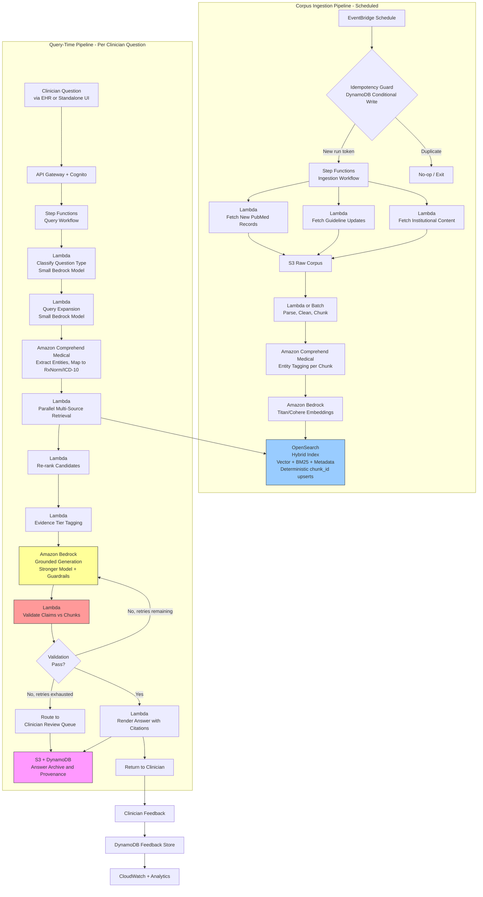

# Recipe 2.7 Architecture and Implementation: Literature Search and Evidence Synthesis

*Companion to [Recipe 2.7: Literature Search and Evidence Synthesis](chapter02.07-literature-search-evidence-synthesis). This page covers the AWS architecture, services, prerequisites, and pseudocode. For the problem framing and the conceptual approach, start with the main recipe.*

---

## The AWS Implementation

### Why These Services

**Amazon Bedrock for LLM inference and embeddings.** Two model roles, like the previous recipes. A smaller, faster model (Claude Haiku, Nova Lite, or equivalent) handles the cheap high-volume work: query classification, query expansion, chunk-level relevance scoring. A stronger model (Claude Sonnet) handles the final answer generation where faithfulness and writing quality both matter. For embeddings, Bedrock hosts Amazon Titan Text Embeddings and Cohere Embed (English and Multilingual), both of which are reasonable starting points for medical RAG. Domain-specific biomedical embedding models (self-hosted on SageMaker) can meaningfully outperform general-purpose embeddings on medical retrieval; the trade-off is operational complexity.

**Amazon Bedrock Knowledge Bases for the managed RAG pipeline (option A).** Knowledge Bases handles the boring parts of RAG: ingesting source documents from S3, chunking with configurable strategies, embedding with your chosen model, storing vectors in your chosen vector store (OpenSearch Serverless, Aurora PostgreSQL with pgvector, or others), and serving retrieval requests via a managed API. For teams that want to ship a working RAG system quickly and don't need fine-grained control over every layer, Knowledge Bases is the path of least resistance. For clinical RAG specifically, Knowledge Bases supports features like metadata filtering, chunk-level re-ranking, and citation formatting out of the box.

**Amazon OpenSearch Service (or OpenSearch Serverless) for a hand-rolled retrieval layer (option B).** When you need control that Knowledge Bases doesn't offer, OpenSearch gives you the building blocks: dense-vector indexes, sparse BM25 indexes, hybrid query support, metadata filtering, re-ranking pipelines, and custom scoring. The operational cost is higher (you're managing the index yourself), but you gain control over chunking, embedding model selection, hybrid retrieval behavior, and re-ranker integration. For production-grade clinical RAG, most teams end up here.

**Amazon Aurora PostgreSQL with pgvector (option C).** If your organization is more comfortable with relational databases and your retrieval patterns are moderate in scale, Aurora PostgreSQL with the pgvector extension is a viable vector store. It integrates cleanly with metadata queries (JOINs across the chunks and a papers metadata table), supports hybrid search with some work, and is a good fit when the corpus is a few million chunks or fewer.

**Amazon Comprehend Medical for medical entity and relationship extraction.** In the retrieval preprocessing pipeline, Comprehend Medical extracts entities from the clinician's question (drugs, conditions, procedures) and can map them to ontologies (RxNorm for drugs, ICD-10 for conditions, SNOMED for general clinical concepts). These entities drive metadata filters and query expansion. In corpus preprocessing, Comprehend Medical can tag each chunk with the entities it contains, which enables entity-aware retrieval ("show me chunks that mention both methotrexate and anastrozole").

**Amazon Titan Text Embeddings or Cohere Embed (via Bedrock) for embeddings.** The embedding model choice is more consequential than the generation model choice for RAG quality. General-purpose embedders work acceptably for medical content; specialized biomedical embedders (BioBERT-style models, self-hosted on SageMaker inference endpoints) can improve retrieval precision materially. Start with a general-purpose embedder via Bedrock; upgrade to a specialized embedder if retrieval evaluation shows a gap.

**Amazon S3 for the corpus, chunked documents, and answer archive.** The raw papers (PMC XML, PDF, cleaned text), the chunked and preprocessed content, the embeddings index source files (for rebuilds), and every generated answer with its retrieval trace. SSE-KMS encryption throughout. S3 Intelligent-Tiering for the corpus, since older papers are accessed less frequently.

**AWS Lambda for pipeline steps.** Each stage (question classification, query expansion, retrieval orchestration, re-ranking, validation, rendering) is a Lambda function. For the corpus ingestion pipeline, Lambda handles per-paper parsing and chunking; heavy lifting (embedding millions of chunks for initial corpus build) can go to SageMaker Processing or AWS Batch.

**AWS Step Functions for orchestration.** The query-time workflow has branches (clarification vs direct retrieval, multi-source retrieval with parallel fan-out, validation-retry loops). Step Functions makes the flow visible, debuggable, and resumable. The corpus-ingestion pipeline is a separate Step Functions workflow that runs on a schedule to pull new papers and update the index.

**Amazon DynamoDB for query metadata, session state, and provenance.** Each question answered gets a DynamoDB record: the question, the retrieved chunk IDs, the generation prompt, the final answer, the validation result, the citations and their source paper IDs. This is the audit trail and the basis for feedback-loop analytics.

**Amazon EventBridge for corpus update triggers.** New PubMed releases, new guideline publications, and new institutional content trigger corpus ingestion. EventBridge routes these events to the ingestion pipeline. Scheduled rules drive periodic full or incremental rebuilds.

EventBridge delivery is at-least-once, and scheduled rules can fire twice across time zones, after failover, or during operator re-runs. Without an idempotency guard, duplicate deliveries run duplicate Step Functions executions, re-embed the same chunks (the most expensive ingestion step at $200-$2,000 per full rebuild), and write duplicate chunks to OpenSearch, which then appear as duplicate citations in answers. Idempotency has three layers:

- **Per-document:** Deterministic `chunk_id` from `(paper_id, section, paragraph_index, chunk_hash)`. OpenSearch index operations use the `chunk_id` as the document ID, so duplicate ingests become upserts rather than new documents.
- **Per-run:** Before starting an ingestion Step Functions execution, attempt a conditional DynamoDB `PutItem` keyed on `(source, window_start, window_end, run_token)`. If the item exists, the run is a duplicate and should no-op.
- **Embedding cost control:** Track embedded `chunk_id` values in DynamoDB with their current content hash. Re-embedding is triggered only when `chunk_hash` changes (content changed), not when the same content is re-ingested.

**Amazon API Gateway + Cognito for clinician-facing APIs.** The EHR-integrated tool or standalone literature search UI calls into API Gateway to submit questions and retrieve answers. Cognito handles authentication so queries and answers can be attributed to a user for audit.

**AWS CloudTrail and Amazon CloudWatch for audit, monitoring, and analytics.** Every Bedrock invocation, every retrieval call, every answer delivered, every user feedback event. CloudWatch dashboards track question volume, answer latency percentiles, validation pass rate, citation accuracy, and user satisfaction signals.

**AWS Secrets Manager for third-party API keys.** Pulling PubMed data, integrating with UpToDate (if licensed), and calling any other external literature APIs require credentials. Secrets Manager manages those credentials with automatic rotation where supported.

### Architecture Diagram



### Prerequisites

| Requirement | Details |
|-------------|---------|
| **AWS Services** | Amazon Bedrock, Amazon Bedrock Knowledge Bases (optional), Amazon Bedrock Guardrails, Amazon OpenSearch Service or OpenSearch Serverless (for hybrid retrieval; Aurora PostgreSQL with pgvector is an alternative), Amazon Comprehend Medical, Amazon S3, AWS Lambda, AWS Step Functions, Amazon DynamoDB, Amazon EventBridge, Amazon API Gateway, Amazon Cognito, AWS Secrets Manager, Amazon CloudWatch, AWS CloudTrail, AWS KMS. SageMaker is optional if you self-host specialized biomedical embedding models. |
| **IAM Permissions** | `bedrock:InvokeModel`, `bedrock:ApplyGuardrail`, `bedrock:Retrieve` and `bedrock:RetrieveAndGenerate` if using Knowledge Bases, `es:ESHttpPost`/`es:ESHttpGet` for OpenSearch or equivalent for Aurora, `comprehendmedical:DetectEntitiesV2`, `comprehendmedical:InferRxNorm`, `comprehendmedical:InferICD10CM`, `s3:GetObject`, `s3:PutObject`, `dynamodb:GetItem`, `dynamodb:PutItem`, `dynamodb:UpdateItem`, `dynamodb:Query`, `states:StartExecution`, `events:PutEvents`, `secretsmanager:GetSecretValue`, `kms:Decrypt`, `kms:GenerateDataKey`. Scope every action to specific resource ARNs. |
| **BAA** | AWS BAA signed. The clinician question may contain patient context (age, conditions, medications), which is PHI. Every service touching the question must be HIPAA-eligible and covered under the BAA. The literature corpus is generally not PHI, but the query and the rendered answer usually are. |
| **Bedrock Model Access** | Request access to a capable generation model (Claude Sonnet or equivalent), a cheaper assistant model (Claude Haiku or Nova Lite), and an embedding model (Amazon Titan Text Embeddings v2 or Cohere Embed English v3). Evaluate retrieval quality with your chosen embedder before production. |
| **Corpus Licensing** | PMC Open Access Subset and PubMed abstracts are freely usable. UpToDate, DynaMed, and Cochrane full text have licensing constraints; institutional subscriptions may allow internal RAG use but verify with the vendor. Guidelines vary (USPSTF and CDC are generally redistributable; specialty societies vary). Document the license for every corpus source and configure the pipeline to respect redistribution terms. |
| **Encryption** | S3 corpus and answer archive: SSE-KMS with customer-managed keys. DynamoDB: encryption at rest with CMK. OpenSearch: encryption at rest and in transit with a CMK, fine-grained access control, no public endpoint. Bedrock and Comprehend Medical: TLS in transit, encryption at rest. Bedrock model-invocation logging (if enabled) contains the question and the retrieved chunks; the chunks may reference patient context from the question. Log destination must be KMS-encrypted to the same standard as the answer archive. |
| **VPC** | Production: Lambda in private subnets with interface endpoints for Bedrock, Bedrock Runtime, Bedrock Agent Runtime (if using Knowledge Bases), Comprehend Medical, KMS, Secrets Manager, Step Functions, CloudWatch Logs, CloudWatch Monitoring, and EventBridge. Gateway endpoints for S3 and DynamoDB. OpenSearch domain in VPC-only mode with security-group rules for Lambda access. Interface endpoints cost roughly $7-10/month per AZ per endpoint; reflect this in the cost estimate. Conditionals: if the clinician-facing API is a private API (EHR callers inside the same VPC), add `execute-api`. If OpenSearch Serverless is used instead of the provisioned domain, substitute `aoss` for the OpenSearch VPC posture. External egress: the ingestion workload calls NCBI E-utilities, ClinicalTrials.gov, and potentially licensed-content endpoints. For private-subnet deployments, route egress through a NAT Gateway (higher cost at full-rebuild volumes) or through a forward proxy in a DMZ subnet with destination allow-listing; log egress in VPC Flow Logs and publish the destination allow-list as code. |
| **CloudTrail** | Enabled with data events for Bedrock invocations, S3 object access, DynamoDB access, and Secrets Manager retrievals. Correlate queries to the requesting clinician identity. |
| **Sample Data** | For development: use synthetic clinician questions with a corpus built from PMC Open Access and PubMed abstracts (both freely available via NCBI E-utilities and the PMC bulk download). For evaluation: curated question-answer pairs from published benchmark datasets (MedQA, BioASQ, or similar) provide a more objective quality signal than ad-hoc testing. Never use real clinician questions with real patient context in development environments. |
| **Cost Estimate** | Corpus ingestion (one-time per full rebuild, a few million chunks): embeddings run $200-$2,000 depending on corpus size and model choice; re-usable as an amortized upfront cost. Per-query cost: query expansion and classification $0.001-$0.005, retrieval (OpenSearch or Bedrock Knowledge Bases) $0.005-$0.02 including re-ranking, generation $0.03-$0.15 depending on model and retrieved context size, validation $0.005-$0.02. End-to-end: $0.08-$0.60 per question. OpenSearch cluster (if self-hosted) is the largest fixed cost, typically $300-$2,000/month depending on size and redundancy. At 1,000 queries per day, query-side variable cost runs $80-$600/day. |

### Ingredients

| AWS Service | Role |
|------------|------|
| **Amazon Bedrock (generation)** | Answer generation with a capable model; query expansion and classification with a cheaper model |
| **Amazon Bedrock (embeddings)** | Titan or Cohere embeddings for corpus indexing and query embedding |
| **Amazon Bedrock Knowledge Bases (optional)** | Managed RAG pipeline for teams that want ingestion, chunking, and retrieval as a service |
| **Amazon Bedrock Guardrails** | Contextual grounding check, PII policies, content filters on the generated answer |
| **Amazon OpenSearch Service** | Hybrid retrieval index: vectors + BM25 + metadata filters + re-ranking pipelines |
| **Amazon Comprehend Medical** | Entity and relationship extraction for queries and for corpus chunks; ontology mapping to RxNorm and ICD-10 |
| **Amazon S3** | Raw corpus, chunked documents, answer archive, retrieval traces |
| **AWS Lambda** | Per-stage pipeline logic for query workflow and corpus ingestion |
| **AWS Step Functions** | Query-time workflow orchestration and scheduled ingestion workflow |
| **Amazon DynamoDB** | Query metadata, session state, citations, provenance, feedback |
| **Amazon EventBridge** | Scheduled triggers for corpus updates; event-driven re-indexing |
| **Amazon API Gateway + Cognito** | Authenticated clinician-facing API |
| **AWS Secrets Manager** | Credentials for external literature APIs (NCBI, licensed content providers) |
| **AWS KMS** | Encryption key management for corpus, queries, answers, and logs |
| **Amazon CloudWatch + CloudTrail** | Latency, error rates, validation pass rate, citation accuracy, HIPAA audit logs |

### Code

#### Walkthrough

**Step 1: Receive and classify the question.** A clinician submits a question through the API. The first task is to figure out what kind of question it is and whether it has enough specificity to drive retrieval. Vague questions get a clarification round; crisp questions proceed directly to expansion. Classification uses a small, cheap model because the cost of calling it on every question adds up.

```text
FUNCTION receive_question(request):
    // request.question: free-text clinical question
    // request.requesting_user: user identity from Cognito
    // request.patient_context: optional structured patient info (age, conditions, meds)
    //                          If present, this is PHI. Treat accordingly.
    // request.specialty: requesting specialty, informs evidence source priorities

    query_id = generate UUID

    // Log the request. The question may contain PHI via patient_context.
    write to DynamoDB table "literature-queries":
        query_id          = query_id
        status            = "INITIATED"
        question          = request.question
        patient_context   = request.patient_context if present
        requesting_user   = request.requesting_user
        requesting_specialty = request.specialty
        received_at       = current UTC timestamp

    // Classify question type with a cheap model. Model IDs are placeholders
    // because Bedrock's versioned model IDs change periodically and cross-region
    // inference profiles (prefixed with `us.` or `eu.`) are the recommended
    // path in many regions. The Python companion pins the current versioned
    // IDs (e.g., "anthropic.claude-3-5-haiku-20241022-v1:0"); verify against
    // the Bedrock console for your region before deploying.
    classification_prompt = """
    Classify the following clinical question into one of these categories:
    - therapeutic: asks about treatment effects or interventions
    - diagnostic: asks about diagnostic tests, sensitivity, specificity, workup
    - prognostic: asks about outcomes, natural history, risk factors for outcomes
    - etiology: asks about causes or mechanisms
    - screening: asks about preventive screening
    - safety_interaction: asks about drug interactions, contraindications, adverse effects
    - guideline: asks what the current guidelines say on a topic
    - mixed: multiple categories

    Also rate specificity: high, medium, low.
    Low means the question needs clarification before useful retrieval.

    Return JSON: { category, specificity, needs_clarification (bool),
                   suggested_clarification_question (if needs_clarification) }

    QUESTION: {request.question}
    PATIENT CONTEXT (if any): {request.patient_context}
    """

    classification = call Bedrock.InvokeModel with:
        model_id    = SMALL_MODEL_ID   // e.g., Claude Haiku or Nova Lite; see companion for current versioned ID
        prompt      = classification_prompt
        max_tokens  = 500
        temperature = 0.0

    parsed = parse JSON from classification

    IF parsed.needs_clarification:
        // Return a clarification request to the user rather than hitting retrieval
        update DynamoDB: status = "AWAITING_CLARIFICATION"
        RETURN { query_id: query_id, status: "CLARIFICATION_NEEDED",
                 question: parsed.suggested_clarification_question }

    RETURN { query_id: query_id, status: "CLASSIFIED",
             category: parsed.category, specificity: parsed.specificity }
```

**Step 2: Expand the query and extract entities.** Good retrieval starts with good queries. Rewrite the question into multiple variants that span likely terminology. In parallel, pull medical entities out of the question and map them to standard ontologies; those entities become metadata filters for retrieval.

```text
FUNCTION expand_query_and_extract_entities(question, patient_context):

    // Before sending patient_context to downstream services, strip fields
    // that aren't needed for literature retrieval or synthesis. Minimum-
    // necessary applies: Bedrock and Comprehend Medical are HIPAA-eligible,
    // but the model doesn't need MRN, DOB, name, address, phone, or payer
    // identifiers to produce a literature synthesis.
    //
    // Keep: age band, sex if clinically relevant, active conditions, current
    //       medications, pertinent labs (renal/hepatic function, pregnancy
    //       status, immune status), weight if drug-dosing is relevant.
    // Drop: MRN, DOB (age band is enough), name, address, phone, email,
    //       payer/member IDs, provider NPIs, provider addresses.
    //
    // Carry the scrubbed payload through the pipeline; do not re-hydrate
    // the full record downstream.
    patient_context_minimal = minimize_phi_for_literature(patient_context)

    // Query expansion: generate 3-5 query variants that cover terminology shifts
    expansion_prompt = """
    Rewrite the following clinical question into 3-5 search queries that a medical librarian
    would use to search PubMed. Each query should:
    - Use medical terminology including synonyms and both generic and brand drug names
    - Include MeSH-style terms where appropriate
    - Be phrased as search queries, not full sentences
    - Cover different angles (intervention-focused, outcome-focused, population-focused)

    Also produce one "canonical" version of the question that is the most precise
    formulation for the retrieval step to match semantically.

    QUESTION: {question}
    PATIENT CONTEXT: {patient_context_minimal}

    Return JSON: { queries: [...], canonical: "..." }
    """

    expansion = call Bedrock.InvokeModel with:
        model_id   = SMALL_MODEL_ID   // same small model used for classification
        prompt     = expansion_prompt
        max_tokens = 600
        temperature = 0.3

    expanded = parse JSON from expansion

    // Entity extraction using Comprehend Medical
    // Run on the original question plus the minimized patient context
    text_for_entities = question
    IF patient_context_minimal:
        text_for_entities = text_for_entities + " " + serialize(patient_context_minimal)

    cm_response = call ComprehendMedical.DetectEntitiesV2 with:
        text = text_for_entities

    // Map drug mentions to RxNorm
    rxnorm_response = call ComprehendMedical.InferRxNorm with:
        text = text_for_entities

    // Map condition mentions to ICD-10
    icd_response = call ComprehendMedical.InferICD10CM with:
        text = text_for_entities

    entities = {
        medications: extract_drugs(cm_response, rxnorm_response),
        conditions: extract_conditions(cm_response, icd_response),
        procedures: extract_procedures(cm_response),
        anatomy: extract_anatomy(cm_response),
        population: infer_population(patient_context_minimal)  // adult, pediatric, geriatric, pregnancy, etc.
    }

    RETURN {
        expanded_queries: expanded.queries,
        canonical_query: expanded.canonical,
        entities: entities,
        patient_context_minimal: patient_context_minimal  // carried forward to generation
    }
```

**Step 3: Multi-source retrieval with hybrid search.** Query the corpus across multiple modalities in parallel: dense-vector similarity for each expanded query, keyword search for entity-driven terms, hard metadata filters for date range and population match, and a source-tier ranking boost. Merge and deduplicate results.

```text
FUNCTION multi_source_retrieval(expanded_queries, canonical_query, entities, question_category):

    // Embed the canonical query and each expanded query with the same model used at indexing time
    canonical_embedding = call Bedrock.InvokeModel with:
        model_id = EMBEDDING_MODEL_ID   // e.g., Amazon Titan Text Embeddings v2 or Cohere Embed; see companion for current versioned ID
        input    = canonical_query

    expanded_embeddings = empty list
    FOR each q in expanded_queries:
        emb = call Bedrock.InvokeModel with:
            model_id = EMBEDDING_MODEL_ID
            input    = q
        append emb to expanded_embeddings

    // Build metadata filters and boosts based on question category and patient population.
    // Tier is a ranking BOOST, not a hard filter. For a question where only
    // observational evidence exists, the pipeline should still surface that
    // evidence and let the generation step's evidence-strength rating reflect
    // the tier mix honestly. Hard-filtering by tier can silently exclude all
    // relevant evidence for questions about newly-approved drugs, orphan
    // indications, or topics where no systematic review exists yet.
    metadata_filters = {
        publication_date: within_useful_window_for(question_category),
        population_tags: entities.population     // hard filter; pediatric-only
                                                  // studies are rarely valid
                                                  // for adult questions
    }

    metadata_boosts = {
        source_tier: tier_weights_for(question_category)
        // e.g., therapeutic: { SR/MA: 1.5, RCT: 1.3, Cohort: 1.0,
        //                      Case-control: 0.8, Case series: 0.5, Guideline: 1.2 }
    }

    // Dense-vector retrieval with each query embedding
    // Retrieve broad (200 candidates per query), then merge and re-rank narrow
    dense_candidates = empty list

    // Run canonical and expanded queries in parallel against OpenSearch vector index
    FOR each embedding in [canonical_embedding] + expanded_embeddings:
        results = call OpenSearch.search with:
            index        = "medical-corpus"
            query_vector = embedding
            filters      = metadata_filters
            boosts       = metadata_boosts   // applied as function_score or rescorer
            size         = 200
            knn          = true
        append results to dense_candidates

    // Keyword (BM25) retrieval driven by extracted entities
    // Focus on entity co-occurrence; this catches exact drug-condition matches
    entity_terms = flatten_to_terms(entities.medications, entities.conditions,
                                    entities.procedures)
    bm25_results = call OpenSearch.search with:
        index    = "medical-corpus"
        query    = build_bm25_query(entity_terms, canonical_query)
        filters  = metadata_filters
        boosts   = metadata_boosts
        size     = 200

    // Merge with reciprocal rank fusion
    // RRF: each result's score = sum over ranked lists of (1 / (k + rank_in_list))
    merged = reciprocal_rank_fusion(dense_candidates, bm25_results, k=60)

    // Deduplicate by chunk_id (same chunk retrieved via multiple queries)
    deduped = dedupe_by_chunk_id(merged)

    // Take top 100 for the re-ranking step
    candidates = first 100 of deduped

    RETURN candidates
```

**Step 4: Re-rank with a cross-encoder.** The initial retrieval is optimized for recall (cast a wide net); re-ranking is optimized for precision (select the best from that net). Re-rankers are slower and more expensive per pair, but they're dramatically more accurate at the top of the ranking, which is what matters for generation.

```text
FUNCTION rerank_candidates(canonical_query, candidates, top_k=20):

    // Option A: Use a managed re-ranker in OpenSearch or Bedrock if available.
    // Option B: Call a cross-encoder re-ranker hosted on SageMaker.
    // Option C: Use a small LLM as a re-ranker (cheaper but lower quality).

    // Pseudocode assumes a cross-encoder re-ranker endpoint. Note: the
    // endpoint named below (e.g., "medical-reranker-v1") is a SageMaker
    // endpoint the team deploys separately, not a managed AWS service.
    // Building a medical re-ranker is its own project: pick a base model
    // (MS-MARCO cross-encoder or a biomedical cross-encoder), optionally
    // fine-tune on labeled medical relevance pairs, package, deploy,
    // manage inference scaling. See "Why This Isn't Production-Ready"
    // for the lifecycle. The Python companion uses Option C (small-LLM
    // stand-in) for teaching; upgrade to Option B for production.
    rerank_pairs = empty list
    FOR each candidate in candidates:
        append {
            query: canonical_query,
            passage: candidate.chunk_text
        } to rerank_pairs

    rerank_scores = call SageMakerEndpoint.invoke with:
        endpoint_name = "medical-reranker-v1"
        inputs        = rerank_pairs

    // Attach scores and sort
    FOR i = 0 to length(candidates):
        candidates[i].rerank_score = rerank_scores[i]

    sorted = candidates sorted by rerank_score descending
    top    = first top_k of sorted

    RETURN top
```

**Step 5: Tag evidence tiers.** For each selected chunk, annotate the source's evidence tier using publication-type metadata. This will flow into the generation prompt and the final rendering.

```text
FUNCTION tag_evidence_tiers(top_chunks):

    FOR each chunk in top_chunks:
        source_paper = lookup_paper_metadata(chunk.paper_id)

        // Publication-type hierarchy (simplified; real systems use more granular schemes)
        IF source_paper.publication_types includes "Meta-Analysis" OR "Systematic Review":
            chunk.evidence_tier = "Level 1: Systematic Review / Meta-Analysis"
        ELSE IF source_paper.publication_types includes "Randomized Controlled Trial":
            chunk.evidence_tier = "Level 2: Randomized Controlled Trial"
        ELSE IF source_paper.publication_types includes "Clinical Trial":
            chunk.evidence_tier = "Level 2: Clinical Trial (non-randomized)"
        ELSE IF source_paper.publication_types includes "Cohort Study" OR "Observational Study":
            chunk.evidence_tier = "Level 3: Cohort Study"
        ELSE IF source_paper.publication_types includes "Case-Control Study":
            chunk.evidence_tier = "Level 4: Case-Control Study"
        ELSE IF source_paper.publication_types includes "Case Reports" OR "Case Series":
            chunk.evidence_tier = "Level 5: Case Series / Case Reports"
        ELSE IF source_paper.publication_types includes "Adverse Event Report"
                OR source_paper.source_type == "pharmacovigilance":
            chunk.evidence_tier = "Level 4: Pharmacovigilance"
        ELSE IF source_paper.source_type == "guideline":
            chunk.evidence_tier = "Guideline: " + source_paper.issuing_body
        ELSE IF source_paper.source_type == "narrative_review":
            chunk.evidence_tier = "Narrative Review (non-systematic)"
        ELSE:
            chunk.evidence_tier = "Unclassified"

        chunk.is_recent = (source_paper.publication_year >= current_year - 5)

    RETURN top_chunks
```

**Step 6: Fetch full-text context for the top chunks.** Individual chunks can lose critical surrounding context. Before generation, pull the paragraphs adjacent to each top chunk so the model sees caveats, population details, and qualifiers that live near the core finding.

```text
FUNCTION fetch_full_context(top_chunks):

    FOR each chunk in top_chunks:
        // If the chunk is from an open-access full-text source, fetch surrounding context
        IF chunk.source_type == "pmc_open_access":
            // Fetch the section this chunk belongs to (e.g., whole Results section),
            // or at minimum the paragraph before and after.
            context = fetch_surrounding_paragraphs(chunk.paper_id,
                                                   chunk.section,
                                                   chunk.paragraph_index,
                                                   window=1)
            chunk.full_context = context
        ELSE:
            // For abstract-only sources, the chunk IS the full available context
            chunk.full_context = chunk.chunk_text

    RETURN top_chunks
```

**Step 7: Grounded generation with citation discipline.** Now the synthesis step. Construct a prompt that includes the question, the retrieved chunks with identifiers, evidence tiers, and full context. The prompt instructs the model to cite every claim by chunk identifier, to describe rather than recommend, to surface uncertainty, and to explicitly state when the retrieved evidence does not answer the question.

```text
FUNCTION generate_synthesis(question, patient_context_minimal, top_chunks, question_category):

    // Format chunks for the prompt with identifiers the model will cite
    chunks_block = ""
    FOR i = 0 to length(top_chunks):
        chunks_block += f"[chunk_{i+1}] (Evidence tier: {top_chunks[i].evidence_tier}, "
                      + f"Year: {top_chunks[i].publication_year}, "
                      + f"Source: {top_chunks[i].journal_or_body})\n"
                      + f"Title: {top_chunks[i].paper_title}\n"
                      + f"Section: {top_chunks[i].section}\n"
                      + f"Content: {top_chunks[i].full_context}\n\n"

    generation_prompt = """
    You are answering a clinical question for a practicing clinician. Your answer will appear
    alongside citations to the source literature. Your only knowledge sources are the retrieved
    chunks provided below. Do not use knowledge from your training data.

    HARD REQUIREMENTS:
    - Every specific claim must cite at least one chunk by its identifier (e.g., [chunk_3]).
    - Do not cite chunks that are not in the retrieved set. Do not invent citations.
    - Do not paraphrase numerical findings; quote them verbatim from the chunk, with the chunk
      citation immediately following.
    - Preserve exact wording of negations and uncertainty language ("no evidence of," "possible,"
      "rule out," etc.).
    - Name the study population for each cited finding (adult/pediatric, specific condition,
      comorbidities if relevant).
    - Rate the overall strength of the evidence: Strong, Moderate, Weak, or Insufficient.
      Base the rating on the evidence tier mix of the retrieved chunks and the directness of
      their relevance to the question.
    - If the retrieved chunks do not directly address the question, say so explicitly: "The
      retrieved literature does not directly address this question. The closest relevant
      evidence is..." Do not confabulate an answer.
    - Do not recommend an action. Describe what the evidence shows. Recommendations are the
      clinician's prerogative, not yours.
    - Surface equipoise. If the evidence is mixed, present the mix, not a false consensus.

    STRUCTURE:
    1. Brief summary of what the literature shows (2-4 sentences)
    2. Key findings by evidence tier (systematic reviews first, RCTs next, then observational,
       then case-level, then guidelines/consensus statements)
    3. Notable limitations or gaps in the evidence
    4. Overall strength rating with justification

    AT THE END, produce a JSON block listing every specific claim in your answer with:
    - The claim text (verbatim from your answer)
    - The chunk citations supporting it
    - The study population the claim applies to
    - Whether the claim preserves original numerical values (yes/no)

    QUESTION:
    {question}

    PATIENT CONTEXT (minimized; if any):
    {patient_context_minimal}

    QUESTION CATEGORY: {question_category}

    RETRIEVED EVIDENCE:
    {chunks_block}
    """

    response = call Bedrock.InvokeModel with:
        model_id       = GENERATION_MODEL_ID   // e.g., Claude Sonnet or equivalent; see companion for current versioned ID
        prompt         = generation_prompt
        max_tokens     = 4000
        temperature    = 0.2
        guardrail_id   = LITERATURE_RAG_GUARDRAIL_ID
        // Guardrails configured with:
        // - Contextual grounding: reference context = the chunks_block, tagged appropriately
        //   per the Guardrails API (via guardContent block in Converse or grounding source
        //   in the Guardrails policy). The grounding check does NOT auto-detect what in
        //   the prompt is the grounding source; it must be explicitly tagged.
        // - Input-side prompt-attack filters. Retrieved chunks are attacker-reachable
        //   content (PMC text, institutional notes, OCR'd imports with prompt-shaped
        //   footers). Treat chunks as untrusted input, not verified instructions;
        //   configure the prompt-attack filter on the input side in addition to the
        //   output-side grounding check.
        // - Content filters on harmful content
        // - PII detection configured to permit medical content but block unintended identifiers

    // Check for Guardrail intervention on the response (via amazon-bedrock-guardrailAction field,
    // not stop_reason)
    IF response.guardrail_action == "INTERVENED":
        RETURN { status: "GROUNDING_REJECTED", response: response }

    answer_text = parse answer content from response
    claims_json = parse claims JSON from response

    RETURN { status: "GENERATED",
             answer_text: answer_text,
             claims: claims_json,
             chunks_used: top_chunks }
```

**Step 8: Validate citations and claims.** Belt-and-suspenders on top of Guardrails. For every citation, verify the chunk is in the retrieved set. For every claim, verify it matches the cited chunk's content (semantic similarity above a threshold; exact match for numerical values). Flag unverified claims. Retry with stricter prompts up to a configured cap, then route to review if validation keeps failing.

```text
FUNCTION validate_answer(answer_text, claims, chunks_used, retry_count):

    unverified = empty list
    chunk_id_to_chunk = dict { chunk.chunk_id: chunk for chunk in chunks_used }

    FOR each claim in claims:
        // Verify every cited chunk exists in the retrieved set
        valid_citations = empty list
        FOR each cited_id in claim.chunk_citations:
            IF cited_id in chunk_id_to_chunk:
                append cited_id to valid_citations
            ELSE:
                append { claim: claim, reason: "citation_not_in_retrieved_set",
                         cited_id: cited_id } to unverified

        IF length of valid_citations == 0:
            append { claim: claim, reason: "no_valid_citation" } to unverified
            CONTINUE

        // For claims with numerical values, do an exact verbatim check
        IF claim.preserves_numerics == true:
            numerics_in_claim = extract_numbers(claim.text)
            supporting_text = concatenate(chunk.full_context
                                          for chunk in valid_citations)
            FOR each num in numerics_in_claim:
                IF num not verbatim in supporting_text:
                    append { claim: claim, reason: "numeric_not_in_source",
                             number: num } to unverified

        // For claims that assert a direction (reduction, increase, improvement,
        // decline, superiority, noninferiority, benefit, harm), verify the
        // direction token matches the cited chunk in the same sentence.
        // "20% increase in mortality" and "20% reduction in mortality" both
        // pass the verbatim-numeric check and typically pass semantic
        // similarity; neither catches a sign flip. Direction validation is
        // the hardest of the three checks. Implementation options in
        // increasing sophistication:
        //   (a) token co-occurrence check scoped to a sentence window
        //   (b) NLI classifier (entailment vs contradiction) between the
        //       claim and the cited sentence
        //   (c) domain-specific relation extractor producing
        //       (intervention, outcome, direction, magnitude) tuples with
        //       exact-match verification
        // Option (c) is the right production target. The pseudocode shows
        // option (a) as a starter; do not ship clinical RAG without at
        // least this check, since wrong-direction errors are catastrophic.
        IF claim_asserts_direction(claim.text):
            direction_in_claim    = extract_direction_token(claim.text)
            supporting_sentences  = sentence_split(concatenate(
                                       chunk.full_context
                                       for chunk in valid_citations))
            matched_sentence      = find_sentence_with_shared_terms(
                                       claim.text, supporting_sentences)
            direction_in_source   = extract_direction_token(matched_sentence)
            IF direction_in_claim != direction_in_source:
                append { claim: claim, reason: "direction_mismatch",
                         claim_direction: direction_in_claim,
                         source_direction: direction_in_source } to unverified

        // For semantic claims, check similarity
        supporting_text = concatenate(chunk.full_context for chunk in valid_citations)
        similarity = semantic_similarity(claim.text, supporting_text)
        IF similarity < 0.65:
            append { claim: claim, reason: "semantic_drift",
                     similarity: similarity } to unverified

        // For population-specific claims, check the cited chunks' population matches
        IF claim.population != null:
            supporting_populations = [chunk.population_tags for chunk in valid_citations]
            IF claim.population not compatible_with any of supporting_populations:
                append { claim: claim, reason: "population_mismatch" } to unverified

    IF length of unverified == 0:
        RETURN { status: "VALIDATED" }

    // Validation failed. Decide whether to retry or route to review.
    IF retry_count < 2:
        RETURN { status: "RETRY_NEEDED",
                 unverified_claims: unverified,
                 suggested_prompt_augmentation: build_strict_prompt_addition(unverified) }

    // Retries exhausted. Do not ship the answer. Route to review queue.
    RETURN { status: "VALIDATION_EXHAUSTED_ROUTED_TO_REVIEW",
             unverified_claims: unverified }
```

**Step 9: Render with citations and evidence grades.** Replace chunk identifiers in the answer with formatted citations. Build the bibliography from the chunks actually cited. Attach source links so the clinician can click through to the original paper. Render the evidence grade prominently so it frames how the reader weights the answer.

```text
FUNCTION render_answer(answer_text, claims, chunks_used, evidence_strength):

    // Build a map: chunk_id -> formatted citation
    citation_map = dict

    // Only include chunks that are actually cited in the answer
    cited_chunk_ids = set(citation_id
                          for claim in claims
                          for citation_id in claim.chunk_citations)

    bibliography = empty list
    FOR each chunk_id in cited_chunk_ids:
        chunk = chunks_used[chunk_id]
        formatted = format_citation(chunk.authors, chunk.paper_title,
                                    chunk.journal_or_body, chunk.publication_year,
                                    chunk.doi_or_pmid)
        // e.g., "Smith J, et al. Methotrexate and aromatase inhibitor coadministration
        //        in inflammatory arthritis: a retrospective cohort. Rheumatology. 2022;61(8):3121-3130."
        citation_map[chunk_id] = formatted
        append { id: chunk_id,
                 formatted: formatted,
                 evidence_tier: chunk.evidence_tier,
                 year: chunk.publication_year,
                 link: chunk.source_link } to bibliography

    // Replace [chunk_N] inline citations with numbered citations [1], [2], ...
    bibliography_sorted = bibliography sorted by first_appearance_in_answer
    FOR i = 0 to length(bibliography_sorted):
        bibliography_sorted[i].display_number = i + 1
        chunk_id = bibliography_sorted[i].id
        original_marker = f"[chunk_{chunk_id}]"
        new_marker      = f"[{i + 1}]"
        answer_text     = replace_all(answer_text, original_marker, new_marker)

    rendered = {
        question: original_question,
        evidence_strength: evidence_strength,
        answer_markdown: answer_text,
        bibliography: bibliography_sorted,
        corpus_date_coverage: get_corpus_date_range(),
        disclaimer: "This synthesis is based on retrieved literature and is not a "
                         + "substitute for clinical judgment. Verify specific claims against "
                         + "the cited sources before making clinical decisions."
    }

    RETURN rendered
```

**Step 10: Archive, log, and emit feedback hooks.** Persist the full trace so the answer can be re-rendered, audited, and linked to clinician feedback. Emit metrics for monitoring. Register the answer in a feedback-capture mechanism so the clinician can signal whether the answer was helpful.

```text
FUNCTION archive_and_log(query_id, rendered, chunks_used, generation_trace):

    // Archive the full trace to S3
    write to S3: "answers/{query_id}/rendered.json" = rendered
    write to S3: "answers/{query_id}/trace.json" = {
        question: generation_trace.question,
        expanded_queries: generation_trace.expanded_queries,
        entities: generation_trace.entities,
        retrieved_chunks: [c.chunk_id for c in chunks_used],
        top_chunks_full: chunks_used,
        generation_prompt: generation_trace.prompt_hash,
        generation_model: generation_trace.model_id,
        validation_result: generation_trace.validation_result,
        generated_at: generation_trace.generated_at
    }

    // Update DynamoDB with final status and pointers
    update DynamoDB table "literature-queries": query_id with
        status              = "DELIVERED"
        evidence_strength   = rendered.evidence_strength
        cited_chunk_ids     = [b.id for b in rendered.bibliography]
        answer_s3_key       = "answers/{query_id}/rendered.json"
        trace_s3_key        = "answers/{query_id}/trace.json"
        delivered_at        = current UTC timestamp

    // CloudWatch metrics
    emit CloudWatch metric:
        namespace    = "LiteratureRAG"
        metric_name  = "AnswersDelivered"
        dimensions   = { question_category, evidence_strength, specialty }

    emit CloudWatch metric:
        namespace    = "LiteratureRAG"
        metric_name  = "RetrievalChunkCount"
        value        = length(chunks_used)
        dimensions   = { question_category }

    // Prepare feedback endpoint context for the clinician UI
    RETURN {
        rendered: rendered,
        feedback_token: issue_feedback_token(query_id)
    }
```

> **Curious how this looks in Python?** The pseudocode above covers the concepts. If you'd like to see sample Python code that demonstrates these patterns using boto3, check out the [Python Example](chapter02.07-python-example). It walks through each step with inline comments and notes on what you'd need to change for a real deployment.

### Expected Results

**Sample output for the methotrexate-and-anastrozole question from the opening vignette:**

```json
{
  "query_id": "LIT-2026-05-10-78421",
  "status": "DELIVERED",
  "question": "Is it safe to continue methotrexate in a patient with rheumatoid arthritis who is starting anastrozole for early-stage breast cancer?",
  "question_category": "safety_interaction",
  "specialty": "internal_medicine",
  "evidence_strength": "Moderate",
  "evidence_strength_justification": "Based on one systematic review [1], two retrospective cohort studies [2][3], one FDA FAERS pharmacovigilance analysis [4], and one society consensus statement [5]. No randomized trials directly address this question.",
  "answer_markdown": "## Summary\n\nThe available evidence suggests that concurrent methotrexate and aromatase inhibitor therapy is generally tolerated in patients with inflammatory arthritis and early-stage breast cancer, with a moderate hepatotoxicity signal that warrants enhanced monitoring. No randomized controlled trials directly address this combination. [1][2][3]\n\n## Key Findings by Evidence Tier\n\n**Systematic Review (Level 1)**\n\nA 2024 systematic review of 14 observational studies (N=2,847 adult women with inflammatory arthritis on concurrent DMARDs and aromatase inhibitor therapy) found no significant increase in arthritis disease activity but a small increase in transaminase elevations (pooled OR 1.4, 95% CI 1.1-1.8) compared to DMARD therapy alone. [1] The review noted heterogeneity in monitoring protocols and recommended standardized liver function testing every 8-12 weeks during combined therapy.\n\n**Observational Studies (Level 3)**\n\n- A 2022 retrospective cohort from a single tertiary center (N=187) found grade 2+ transaminitis in 11% of patients on methotrexate plus aromatase inhibitor vs 6% on methotrexate alone (p=0.03); no cases progressed to liver failure. [2]\n- A 2023 multi-center observational study (N=412) found no significant difference in arthritis flare rates between patients who continued methotrexate during aromatase inhibitor therapy and those who discontinued. [3]\n- A 2022 pharmacovigilance analysis of the FDA FAERS database identified a disproportionality signal for hepatotoxicity with the combination but could not adjust for confounding. [4] (Note: FAERS data are subject to reporting bias and cannot establish causation.)\n\n**Consensus Statements**\n\nA 2023 joint statement from the American College of Rheumatology and the American Society of Clinical Oncology recommends individualized decision-making, with explicit discussion of flare risk if methotrexate is held and hepatotoxicity risk if it is continued. The statement recommends liver function testing every 8-12 weeks and multidisciplinary decision-making between rheumatology and oncology. [5] (Consensus statement, not a formal guideline with evidence grading.)\n\n## Limitations and Gaps\n\n- No randomized controlled trials address this combination directly. All evidence is observational.\n- Most studies focus on methotrexate plus aromatase inhibitors as a class; subgroup data for anastrozole specifically versus letrozole or exemestane are limited.\n- Long-term (>5 year) outcomes are not well characterized in the retrieved literature.\n- Studies are predominantly in postmenopausal women; generalizability to premenopausal women on ovarian suppression is less clear.\n\n## Overall Evidence Strength: Moderate\n\nOne systematic review and multiple observational studies converge on a consistent picture (combined therapy is tolerated, with a hepatotoxicity signal warranting monitoring), but the absence of randomized trials and the heterogeneity of observational protocols limit confidence.",
  "factual_claims": [
    {
      "claim": "pooled OR 1.4, 95% CI 1.1-1.8 for transaminase elevations",
      "chunk_citations": ["chunk_3"],
      "population": "adult women with inflammatory arthritis",
      "preserves_numerics": true
    },
    {
      "claim": "grade 2+ transaminitis in 11% of patients on methotrexate plus aromatase inhibitor vs 6% on methotrexate alone (p=0.03)",
      "chunk_citations": ["chunk_7"],
      "population": "adult women with inflammatory arthritis, single tertiary center",
      "preserves_numerics": true
    },
    {
      "claim": "no significant difference in arthritis flare rates between patients who continued methotrexate during aromatase inhibitor therapy and those who discontinued",
      "chunk_citations": ["chunk_12"],
      "population": "multi-center observational study, N=412 adults with RA",
      "preserves_numerics": false
    },
    {
      "claim": "ACR/ASCO 2023 joint statement recommends individualized decision-making with LFTs every 8-12 weeks",
      "chunk_citations": ["chunk_18"],
      "population": "adult patients on both DMARD and endocrine therapy",
      "preserves_numerics": true
    }
  ],
  "bibliography": [
    {"display_number": 1, "formatted": "Author A, et al. Systematic review of DMARD continuation during aromatase inhibitor therapy. Arthritis Care Res. 2024;76(4):521-534.", "evidence_tier": "Level 1: Systematic Review", "year": 2024, "link": "https://pubmed.ncbi.nlm.nih.gov/illustrative"},
    {"display_number": 2, "formatted": "Author B, et al. Hepatotoxicity with concurrent methotrexate and aromatase inhibitor therapy. Rheumatology. 2022;61(8):3121-3130.", "evidence_tier": "Level 3: Cohort Study", "year": 2022, "link": "https://pubmed.ncbi.nlm.nih.gov/illustrative"},
    {"display_number": 3, "formatted": "Author C, et al. Arthritis flare rates with methotrexate continuation vs discontinuation during adjuvant endocrine therapy. J Rheumatol. 2023;50(2):201-209.", "evidence_tier": "Level 3: Cohort Study", "year": 2023, "link": "https://pubmed.ncbi.nlm.nih.gov/illustrative"},
    {"display_number": 4, "formatted": "Author D, et al. FAERS disproportionality analysis of DMARD-aromatase inhibitor coadministration. Pharmacoepidemiol Drug Saf. 2022;31(11):1189-1197.", "evidence_tier": "Level 4: Pharmacovigilance", "year": 2022, "link": "https://pubmed.ncbi.nlm.nih.gov/illustrative"},
    {"display_number": 5, "formatted": "ACR/ASCO Joint Statement on DMARD management during endocrine therapy for breast cancer. Arthritis Rheumatol. 2023;75(12):2021-2035.", "evidence_tier": "Guideline: Consensus Statement", "year": 2023, "link": "https://pubmed.ncbi.nlm.nih.gov/illustrative"}
  ],
  "corpus_date_coverage": "Papers indexed 1990-2026-04-30. Last ingestion run: 2026-05-09.",
  "validation_status": "VALIDATED",
  "retrieval_stats": {
    "candidates_retrieved": 184,
    "chunks_after_rerank": 20,
    "chunks_cited": 5
  },
  "processing_time_ms": 14200
}
```

**Performance benchmarks:**

| Metric | Typical Value |
|--------|---------------|
| End-to-end latency, question to answer | 8-30 seconds for questions with retrievable evidence; 5-10 seconds to return "insufficient evidence" when applicable |
| Retrieval recall at 100 (on benchmark questions) | 70-85% depending on embedder and corpus coverage |
| Precision at 10 after re-ranking | 60-80% on benchmark questions |
| Citation verification pass rate (first generation) | 80-92% for well-specified questions; 65-80% for broad questions |
| Citation verification pass rate (after one retry) | 92-97% |
| Clinician-reported usefulness (thumbs-up rate in pilot deployments) | 55-75% depending on specialty and question complexity |
| Fraction of answers where validation routes to human review | 3-12% |
| Cost per question | $0.08-$0.60 depending on corpus size, re-ranking, and generation model |

**Where it struggles:**

- **Very recent literature.** If the corpus was last ingested four weeks ago and a major trial read out three weeks ago, the system will produce an answer that doesn't reflect the new evidence. Date coverage has to be surfaced to the user, and for fast-moving fields (oncology, infectious disease, cardiology), ingestion needs to be more frequent than for stable fields.
- **Questions that span multiple specialties with tension.** The methotrexate-anastrozole example above sits at the intersection of rheumatology and oncology; both specialties have perspectives that can pull in different directions. Questions that sit across multiple specialty boundaries are often the hardest to answer well, because the retrieved evidence may not include the cross-specialty synthesis that the question implicitly asks for.
- **Pediatric, pregnancy, and geriatric populations.** Evidence bases for these populations are typically smaller. A system optimized on adult literature produces thinner answers for these populations, and the answers sometimes generalize inappropriately from adult studies. Population-specific retrieval filters help but don't fix the underlying evidence scarcity.
- **Questions where the answer is "it depends."** Many clinical questions have no single right answer; the evidence is mixed, and the clinical decision depends on patient-specific factors. The system should surface this honestly; the failure mode is the system picking a side and presenting it as consensus.
- **Rare diseases and rare combinations.** For questions that touch conditions with few published cases, the retrieved evidence may be one case report plus expert opinion. The answer has to reflect that limitation rather than overstate.
- **Non-English literature.** If the corpus is English-only (most are), questions whose best evidence is in non-English literature will get suboptimal answers. Multilingual corpora and embedders help but add complexity.
- **Questions that require reasoning about trial design.** "Should we trust this trial given its choice of primary endpoint?" is a legitimate question that requires critical appraisal skills that LLMs do not reliably have. The system should stick to describing evidence, not critiquing trial methodology beyond surface-level characteristics.
- **Institutional-specific questions.** A question about local protocols ("what is our antibiotic stewardship policy for community-acquired pneumonia?") requires the institutional corpus, not the medical literature. If institutional content isn't in the corpus, the system will answer with generic literature and miss the local reality.

---

## Why This Isn't Production-Ready

Shipping clinical RAG is a year-long effort done right. Here is the list of concerns that the above architecture does not fully address and that real deployments have to confront.

**Corpus licensing compliance.** The fastest way to build a corpus is to dump whatever you can scrape. The fastest way to get sued is to redistribute licensed content. Maintain a license registry for every source in the corpus, enforce redistribution terms programmatically (if a source is "view-only within the institution," the pipeline must not return that chunk's content to external endpoints), and audit quarterly. UpToDate, DynaMed, Cochrane full text, and many specialty society journals have specific internal-use clauses that affect API design.

**Retrieval quality evaluation is genuinely hard.** You need a gold-standard evaluation set: questions paired with the "right" papers that should be retrieved and the "right" answers that should be generated. Building this set is PhD-level clinical work. Public benchmarks (BioASQ, MedQA, PubMedQA) are useful for algorithm development but don't match the questions your actual clinicians ask. Budget for an ongoing evaluation program with clinical-domain reviewers, not a one-time eval at launch.

**Prompt iteration at scale.** The generation prompt in Step 7 looks clean on paper. In production, it goes through dozens of revisions as failure modes surface. Build prompt versioning into the pipeline from day one. Every answer records the prompt version that produced it. When you fix a prompt regression, you want to be able to replay failed questions through the new prompt to verify the fix and to estimate the impact on the back-catalog.

**Embedder lifecycle management.** Your corpus is embedded with a specific embedder. If you change embedders, you have to re-embed the whole corpus. For a multi-million-chunk corpus, that's a meaningful cost event and a potential outage risk. Design for embedder upgrades: maintain parallel indexes with old and new embedders during migration; validate that retrieval quality doesn't regress before cutting over; have a rollback plan.

**Re-ranker quality.** Off-the-shelf re-rankers are general-purpose. For medical retrieval, a fine-tuned medical re-ranker can materially improve precision. Fine-tuning requires labeled relevance data, which is again PhD-level work. The good news: even a small labeled set (a few thousand query-passage pairs with relevance labels) can meaningfully improve re-ranker performance on medical content.

**Citation accuracy beyond existence.** The validation step verifies that a citation exists in the retrieved set and that the claim's semantic similarity to the cited chunk is above threshold. That's a start, not a finish. A claim can be semantically similar to a cited chunk while misrepresenting it. True citation accuracy requires deeper verification (numerical claim verification, direction verification, population match verification). Build progressively stricter validation layers rather than treating validation as a single step.

**Answer freshness and corpus currency.** A corpus last indexed Tuesday is stale by Wednesday if a major paper published Tuesday night. For high-velocity fields, nightly ingestion is the baseline; hourly is better for oncology and infectious disease. Ingestion costs scale with frequency, but the cost of a confidently-wrong answer in a fast-moving field is higher.

**Explainability for clinicians.** Clinicians don't just want the answer; they want to understand why the system gave that answer. Surface the retrieval trace (here are the chunks we retrieved), the ranking (here is why these chunks surfaced), and the generation inputs (here is the prompt the model saw). Clinicians who can audit the pipeline trust the pipeline; clinicians who can't don't.

**Feedback loops that actually close.** Capturing "thumbs down" on an answer is easy. Using that feedback to improve the system is hard. Build a feedback triage workflow: thumbs-down answers get reviewed by a clinical reviewer (ideally a domain expert), root-caused to a pipeline stage (retrieval miss, validation failure, prompt issue), and fed into an improvement backlog. Without this, feedback collects dust and the system plateaus.

**Legal and liability posture.** A synthesis the clinician acts on becomes part of a clinical decision. Legal teams will ask: is this a medical device? Is this clinical decision support? What's the liability exposure if the synthesis is wrong? These questions may not have answers yet in your jurisdiction, but they have to be raised before broad deployment. For systems intended to inform clinical decisions, consider whether FDA's CDS guidance applies and document your rationale.

**De-identification of questions with PHI.** If the clinician includes patient-specific context in the question (age, comorbidities, medications), that context is PHI. Handle it accordingly throughout the pipeline. The corpus is generally not PHI, but the question and the answer usually are. Audit logs and retention policies need to treat the question-answer pair with PHI rigor.

**Bias in retrieval and generation.** Medical literature has known gaps and biases: underrepresentation of women in cardiology trials, underrepresentation of racial and ethnic minorities in many clinical trials, gender and race disparities in how symptoms are described in the literature. A RAG system trained on biased literature will surface biased evidence. This isn't a bug in the pipeline; it's a reality of the corpus. Document it, surface it to users where relevant ("most cited studies enrolled predominantly white male patients; generalizability may be limited"), and don't pretend the system is neutral.

**Off-label reasoning and decision boundaries.** The prompt in Step 7 tells the model to describe evidence, not recommend. In practice, clinicians often ask questions that have an implicit "what should I do" behind them, and the model can drift toward prescriptive language. Continuous prompt iteration and post-generation validation for prescriptive language are part of keeping the system on the right side of the evidence-synthesis vs decision-support line.

**Internationalization.** Even within English-language medicine, terminology varies by country (paracetamol vs acetaminophen, adrenaline vs epinephrine). Drug brand names vary more still. If the system is deployed across regions, retrieval and normalization have to handle these variations, and the corpus may need to include region-specific guidance.

**Operational resilience.** A clinician in the middle of a clinic visit asking a question expects an answer in seconds. If the pipeline is down, they fall back to whatever they were doing before (which is fine) but they also lose trust in the tool. Build for availability, plan for degraded modes (if re-ranking fails, fall back to top-k from initial retrieval; if generation fails, return the top retrieved chunks as a raw search result with clear labeling).

**Cost control at scale.** A system that answers 5,000 questions a day with a premium generation model and large retrieval sets can easily run $500-$3,000 a day in Bedrock costs alone. Build cost guardrails: per-user rate limits, question complexity scoring to gate expensive generations, aggressive caching of identical or near-identical questions, and tiered models where simpler questions route to cheaper generation. Monitor cost per question category and specialty; the outliers will surprise you.

---

## Variations and Extensions

**Patient-specific question-answering.** Extend the pipeline to accept a structured patient context (age, comorbidities, medications, labs) alongside the question, and use that context to filter retrieval and focus generation. "What does the evidence say about starting a DPP-4 inhibitor?" becomes much more tractable when the context specifies "68-year-old male, type 2 diabetes, eGFR 35, history of heart failure with preserved EF, currently on metformin and empagliflozin." The population-specific filter in the retrieval layer now has concrete inputs. The generation layer produces an answer scoped to the patient's clinical situation. This sits at the border of literature search and clinical decision support; the regulatory posture shifts accordingly.

**Systematic-review drafting assistant.** For research teams doing systematic reviews, extend the pipeline to support structured review workflows: PICO question formulation, search-strategy generation, abstract screening, full-text screening, data extraction, risk-of-bias assessment. Each step leverages different retrieval and generation patterns. This is a substantially bigger product than a clinical Q&A tool, but it serves a different high-value audience (clinical researchers, evidence synthesis teams, guideline developers).

**Prior authorization evidence generation.** A closely-related use case from the payer perspective: given a prior auth request for an off-label use, retrieve the evidence cited by the requester and additional evidence not cited, produce an evidence summary, and surface any contradictory literature the requester may have omitted. This is the mirror image of Recipe 2.4 (prior auth letter generation); together they represent both sides of the prior auth workflow.

**Guideline update monitoring.** Many guidelines update quarterly or annually. An extension of the corpus-ingestion pipeline detects new guideline releases, compares to the prior version, and produces a summary of changes. Clinicians subscribe by specialty or topic and receive notifications when guidelines they care about change. This is lower-stakes than the query-answering use case and earns trust by being consistently useful without risking bad advice.

**Journal club support.** For a specific paper, the system can retrieve related literature, identify methodological similarities and differences, and produce a structured critique template. Less a real-time tool than a preparation aid for departmental journal clubs and grand rounds.

**Multi-agent research assistant.** For complex questions, decompose the question into sub-questions, retrieve and synthesize each sub-question independently, then aggregate the sub-answers into a full answer. This is a more ambitious architecture (the decomposition is its own hard problem) but can substantially improve answer quality for multi-part questions. Expect to invest significantly in evaluation; compound errors across sub-answers can be hard to catch.

**Audio delivery for rounding.** The answer is rendered as a short audio briefing through Amazon Polly for providers who prefer audio consumption during rounds or commutes. Pair with concise answer formats (SBAR-like structure rather than full prose). Audio answers have to carry the evidence grade and corpus currency signals that text answers do; those translate to the audio format directly.

**Integration with order entry.** At the point where a clinician is ordering a medication, the system can proactively surface relevant evidence (interactions, recent safety signals, cost-effectiveness data) based on the patient context. This is a contextual-assistance pattern that pulls the literature search into the workflow rather than requiring the clinician to initiate the query.

---

## Additional Resources

**AWS Documentation:**
- [Amazon Bedrock User Guide](https://docs.aws.amazon.com/bedrock/latest/userguide/what-is-bedrock.html)
- [Amazon Bedrock Knowledge Bases](https://docs.aws.amazon.com/bedrock/latest/userguide/knowledge-base.html)
- [Amazon Bedrock Guardrails](https://docs.aws.amazon.com/bedrock/latest/userguide/guardrails.html)
- [Bedrock Guardrails Contextual Grounding Check](https://docs.aws.amazon.com/bedrock/latest/userguide/guardrails-contextual-grounding-check.html)
- [Amazon Titan Text Embeddings](https://docs.aws.amazon.com/bedrock/latest/userguide/titan-embedding-models.html)
- [Amazon OpenSearch Service k-NN](https://docs.aws.amazon.com/opensearch-service/latest/developerguide/knn.html)
- [Amazon OpenSearch Service Hybrid Search](https://docs.aws.amazon.com/opensearch-service/latest/developerguide/neural-search.html)
- [Amazon Comprehend Medical Developer Guide](https://docs.aws.amazon.com/comprehend-medical/latest/dev/comprehendmedical-welcome.html)
- [Amazon Comprehend Medical InferRxNorm](https://docs.aws.amazon.com/comprehend-medical/latest/dev/ontology-linking-rxnorm.html)
- [Amazon Comprehend Medical InferICD10CM](https://docs.aws.amazon.com/comprehend-medical/latest/dev/ontology-linking-icd10.html)
- [AWS Step Functions Parallel and Map States](https://docs.aws.amazon.com/step-functions/latest/dg/amazon-states-language-parallel-state.html)
- [AWS HIPAA Eligible Services Reference](https://aws.amazon.com/compliance/hipaa-eligible-services-reference/)

**AWS Sample Repos:**
- [`amazon-bedrock-samples`](https://github.com/aws-samples/amazon-bedrock-samples): Patterns for Knowledge Bases, RAG, Guardrails, and grounded generation with Bedrock
- [`aws-healthcare-lifescience-ai-ml-sample-notebooks`](https://github.com/aws-samples/aws-healthcare-lifescience-ai-ml-sample-notebooks): Healthcare-specific ML patterns; includes examples relevant to clinical text retrieval and generation
- [`amazon-opensearch-service-samples`](https://github.com/aws-samples/amazon-opensearch-service-samples): Hybrid search, k-NN, and retrieval patterns for OpenSearch
- [`generative-ai-cdk-constructs`](https://github.com/awslabs/generative-ai-cdk-constructs): CDK constructs for RAG, including Knowledge Bases, for infrastructure-as-code deployments

**AWS Solutions and Blogs:**
- [Generative AI on AWS for Healthcare](https://aws.amazon.com/health/generative-ai/): Overview of healthcare LLM applications on AWS
- [AWS for Healthcare Reference Architectures](https://aws.amazon.com/architecture/reference-architecture-diagrams/?solutions-all.sort-by=item.additionalFields.sortDate&solutions-all.sort-order=desc&awsf.content-type=*all&awsf.methodology=*all&awsf.tech-category=tech-category%23ai-ml&awsf.industries=industries%23healthcare): Filter by AI/ML and Healthcare
- [AWS Machine Learning Blog](https://aws.amazon.com/blogs/machine-learning/): Search for "retrieval augmented generation," "Knowledge Bases," and "medical literature" for current customer case studies and implementation deep dives

**Medical Literature and Evidence Resources:**
- [PubMed Central Open Access Subset](https://www.ncbi.nlm.nih.gov/pmc/tools/openftlist/): Free, redistributable full-text biomedical literature; the default corpus foundation
- [NCBI E-utilities API](https://www.ncbi.nlm.nih.gov/books/NBK25501/): Programmatic access to PubMed, PMC, and related NCBI databases
- [ClinicalTrials.gov API](https://clinicaltrials.gov/data-api/api): Programmatic access to trial registration and results
- [Cochrane Library](https://www.cochranelibrary.com/): Systematic reviews (abstracts free; full text typically subscription-based)
- [USPSTF Recommendation Statements](https://www.uspreventiveservicestaskforce.org/uspstf/topic_search_results?topic_status=P): Freely-available preventive care recommendations with evidence grades
- [CDC MMWR](https://www.cdc.gov/mmwr/index.html): Weekly morbidity and mortality reports; infectious disease and public health
- [GRADE Working Group](https://www.gradeworkinggroup.org/): Reference for the GRADE evidence-grading methodology
- [Oxford Centre for Evidence-Based Medicine Levels of Evidence](https://www.cebm.ox.ac.uk/resources/levels-of-evidence/oxford-centre-for-evidence-based-medicine-levels-of-evidence-march-2009): Classical levels-of-evidence framework

**Benchmarks and Evaluation Datasets:**
- [MedQA](https://github.com/jind11/MedQA): Question-answer pairs from medical licensing exams; useful for evaluating clinical reasoning
- [PubMedQA](https://pubmedqa.github.io/): Biomedical question-answering dataset built from PubMed abstracts
- [BioASQ](http://bioasq.org/): Ongoing biomedical semantic indexing and question-answering challenge with structured evaluation sets

**Regulatory and Policy Resources:**
- [FDA Clinical Decision Support Software Guidance](https://www.fda.gov/regulatory-information/search-fda-guidance-documents/clinical-decision-support-software): Current FDA position on CDS, relevant for where literature synthesis crosses into decision support

---

## Estimated Implementation Time

| Tier | Timeline | What You Get |
|------|----------|--------------|
| **Basic (POC)** | 6-10 weeks | Corpus of PubMed abstracts and PMC Open Access (a few million chunks). OpenSearch hybrid index with one embedder. Basic query expansion and generation with citations. Manual evaluation on a curated question set. Demonstrated end-to-end for one specialty. |
| **Production-ready** | 24-36 weeks | Multi-source corpus (PubMed, PMC, guidelines, institutional content). Hybrid retrieval with re-ranking. Evidence-tier tagging. Post-generation validation with numeric and semantic checks. Clinician-facing UI with click-through provenance and evidence-grade rendering. Feedback loop with clinical reviewer triage. Scheduled corpus ingestion. Multi-specialty coverage. Full audit trail and operational dashboards. Initial evaluation methodology with clinical reviewers. |
| **With variations** | 44-60 weeks | Patient-specific question answering. Systematic-review drafting support. Guideline-change monitoring. Multi-agent decomposition for complex questions. Fine-tuned medical embedder and re-ranker. Integration into order entry and EHR workflows. Institution-wide rollout with change management and clinician training. Ongoing evaluation program with versioned benchmarks. |

---

---

*← [Main Recipe 2.7](chapter02.07-literature-search-evidence-synthesis) · [Python Example](chapter02.07-python-example) · [Chapter Preface](chapter02-preface)*
