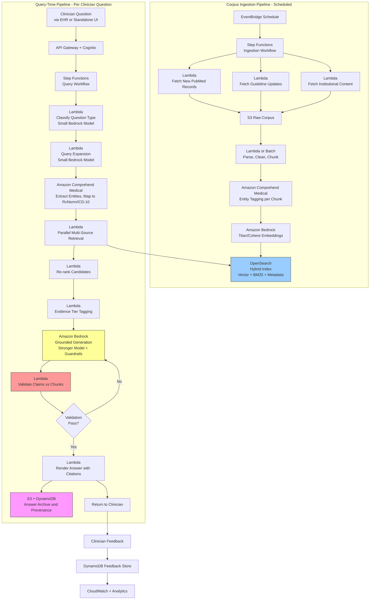

# Recipe 2.7: Literature Search and Evidence Synthesis

**Complexity:** Medium-Complex · **Phase:** MVP → Production · **Estimated Cost:** ~$0.08-0.60 per clinical question answered

---

## The Problem

It's Wednesday afternoon. An internist is in the middle of a clinic session with a patient who has rheumatoid arthritis and has just been diagnosed with early-stage breast cancer. The oncologist has recommended starting adjuvant hormone therapy with an aromatase inhibitor. The patient's rheumatologist has her on methotrexate. The patient wants to know: is it safe to continue methotrexate while on anastrozole? Are there interactions? Has anyone studied this combination? Will her arthritis flare if she stops the methotrexate?

The internist has eight minutes before the next patient. She opens PubMed in a new tab. She types "methotrexate anastrozole interaction." She gets 143 results. She reads the first three abstracts. Two are about rats. One is about a different aromatase inhibitor. She tries a different search. Now she's got 412 results, mostly about breast cancer treatment protocols, none directly answering her question. The patient is sitting in front of her. She does what most clinicians do: she offers a best-guess answer based on her clinical experience, tells the patient she'll look into it more and follow up, and moves on.

That search she just abandoned was, in fact, the right question. There are three 2022 observational studies and one 2024 systematic review directly addressing methotrexate continuation during aromatase inhibitor therapy in patients with inflammatory arthritis. The evidence is nuanced (hepatotoxicity signal in one study, no signal in two others, a pooled analysis leaning toward "reasonably safe with monitoring"). A clinician with twenty minutes and search skills could have constructed a defensible answer. The internist had eight minutes and got pulled off-task by 412 irrelevant results. The patient got the clinician's gestalt, not the literature.

Scale this. A primary care physician sees maybe twenty patients a day. On any given day, three or four of those visits raise a question the physician doesn't have a confident, evidence-grounded answer for. "Should this patient with osteoporosis and a history of atrial fibrillation be on denosumab or a bisphosphonate, given the anticoagulation?" "What's the current evidence for fecal microbiota transplant in recurrent C. diff after two failed vancomycin courses?" "My patient with long COVID is asking about low-dose naltrexone; is there any real evidence?" Each question has real answers in the literature. Almost none get looked up in the moment, because the friction is too high.

The hospital version of the same problem. A pulmonary-critical-care fellow is admitting a patient with severe eosinophilic asthma to the ICU who is already on dupilumab. The attending asks: "What's the evidence on continuing biologics during acute exacerbation? Does this matter for our steroid dosing?" The fellow has charts to write, orders to put in, a rapid response to field. He opens UpToDate. UpToDate has a section on severe asthma management, which is current as of three months ago, which doesn't specifically address continuation of dupilumab during admission. He runs a search. He finds a 2023 case series, a 2024 retrospective cohort, and a society-level consensus statement (not a guideline, a consensus statement, which matters for evidence grading). The fellow is supposed to synthesize that into a defensible recommendation in ten minutes. He usually punts: "I'll continue what the outpatient team had her on and we'll follow up with allergy in the morning."

This happens tens of thousands of times a day across American medicine. There is a body of published evidence that, in theory, could inform almost any clinical question. In practice, only a tiny fraction of clinical questions get looked up, and the ones that do are looked up imperfectly. The "evidence-based medicine" movement has been around for thirty years. It has changed the standards. It has not solved the looking-up problem. The problem isn't a lack of evidence. The problem is a gap between the clinician at the bedside and the literature that sits behind a search interface designed by librarians for a different workflow.

The policy version. A payer's medical director is reviewing a prior authorization appeal for an off-label use of a $180,000-per-year biologic. The manufacturer's letter cites seven papers. Are those papers the strongest evidence? Are there papers the manufacturer didn't cite that are less favorable? Is there a systematic review or meta-analysis that should override individual studies? The medical director has to make a defensible decision and may end up in front of a regulator or a court. The rigor required is "show me the evidence, grade it, and tell me what it does and doesn't support." That rigor is a PhD's worth of training in evidence evaluation, applied to one case.

The research version. A clinical research coordinator is setting up a new trial for a novel oral agent in heart failure with preserved ejection fraction. Before finalizing the protocol, the team needs to understand the landscape of prior trials: what was studied, what endpoints were used, what populations were enrolled, what the results looked like, where the knowledge gaps are. This is a ten-to-twenty hour literature review for a senior research assistant, done well. It's often done poorly or not done at all, which means new trials are designed in ignorance of prior work.

What all these scenarios have in common is the same underlying gap: medical literature is vast, well-indexed, and largely open-access, but the work of finding the right papers, reading them correctly, weighing the evidence, and synthesizing an answer is expensive human labor that doesn't fit into the time available. You can't hire a medical librarian for every clinic room. You can't put a systematic reviewer on every prior auth appeal. You need the computer to do more of this work, and for decades the computer hasn't been able to, because the work requires understanding text, not just matching keywords.

Modern LLMs, used correctly, change that equation. Used incorrectly, they make it dramatically worse (a fabricated citation that looks real is worse than no citation at all). The architecture that gets this right is the thing we're going to build in this recipe.

---

## The Technology: RAG, Done for Grown-Ups

### Why General-Purpose LLMs Are the Wrong Tool for This Job

Let's start by admitting what doesn't work.

"Ask the LLM your medical question" is a terrible product. The model will produce a fluent, confident, plausible-sounding answer. Some percentage of those answers will be wrong. Some percentage will cite papers that don't exist. Some percentage will conflate findings across studies. The model has no idea which of its outputs are accurate and which are fabricated, because statistically speaking the fabrications look like the accurate answers (the model has optimized for plausibility, not truth).

The fabricated-citation problem is specific and embarrassing. A model asked to cite evidence for a claim will happily produce "Smith et al., JAMA 2021, 325(12), pp. 1123-1131" as a citation. That looks like a real citation. It has a plausible author name, a real journal, a plausible volume and issue, and a plausible page range. It is very often completely invented. Clinicians who have tried to look up these citations find they don't exist. Worse, sometimes they do exist, but they're about something else entirely, because the model has associated a real citation with a wrong claim.

This class of error is not fixable by better prompting. It's a property of generating claims without a grounded retrieval step. The fix is architectural: don't let the model generate claims; let it generate summaries of claims it is given.

### What RAG Actually Is, Under the Hood

RAG stands for Retrieval-Augmented Generation. Everyone in AI says "RAG" now the way they used to say "cloud-native" five years ago. The term has gotten a bit diluted. At its core, the pattern is straightforward.

Step one: you have a corpus of source material (in this case, medical literature). You pre-process it into chunks and index the chunks in a way that makes them searchable by semantic meaning, not just keyword match. The common approach is to embed each chunk with a text-embedding model into a high-dimensional vector, and store those vectors in a vector database. The index supports queries of the form "give me the 50 chunks most semantically similar to this question."

Step two: when a user asks a question, you first embed the question using the same embedding model. You query the vector database with the question's embedding. You get back the top N chunks most relevant to the question. That's the "retrieval" part.

Step three: you construct a prompt for the LLM that includes both the question and the retrieved chunks, with instructions like "answer the question using only the content in the retrieved chunks; cite each chunk by its identifier; if the chunks don't contain a clear answer, say so." The model generates a response grounded in the retrieved material. That's the "augmented generation" part.

The power of the pattern is that it decouples the "knowledge" (which lives in your indexed corpus and can be updated freely) from the "language ability" (which lives in the model and doesn't need to know any specific facts). You can update the corpus nightly as new papers publish. You can swap the model as better ones come out. The knowledge and the language ability are orthogonal concerns.

The limitations of the pattern are equally important. If the retrieval step doesn't surface the right chunks, the generation step has no way to produce the right answer. If the retrieved chunks contradict each other, the model may smooth over the contradiction. If the chunks are taken out of context (a single sentence from a paper's limitations section looks like a conclusion), the answer can be misleading in subtle ways.

For medical literature, RAG is the right baseline. But "baseline RAG" is not enough. The next several sections are about the specific adaptations that make medical RAG actually work.

### The Corpus Problem: What You're Indexing Matters More Than How

The most-ignored decision in RAG architecture is what you put in the corpus. Teams tend to fixate on vector databases and chunking strategies and re-ranking models, then point the whole apparatus at a random dump of PDFs and wonder why the answers are mediocre.

For medical literature, you have options that vary by quality, licensing, and coverage:

**PubMed Central Open Access Subset.** Several million full-text articles, machine-readable, redistributable, free. This is the default starting corpus for any medical RAG system that isn't paying for licensed content. Coverage is strong for older literature and for journals that chose open access; weaker for high-impact closed-access journals.

**PubMed abstracts.** Every indexed biomedical article has a PubMed abstract available via the NCBI E-utilities API. Abstracts are not full text, but they contain the core claims, the population studied, the intervention, and the primary outcome. A corpus of PubMed abstracts is broader in coverage than PMC Open Access but shallower in depth. Many clinical RAG systems use PubMed abstracts as the primary retrieval target and fetch full text (from PMC or licensed sources) for the small subset of documents that the generation step will actually cite.

**Clinical guidelines and society statements.** AHA, ACC, IDSA, USPSTF, ACOG, AAP, NCCN, and many others publish guidelines and position statements that are evidence-graded and represent consensus standards. These are disproportionately useful for clinical questions because they already do the synthesis work. Licensing varies (some are open, some require institutional subscriptions, some can be obtained through partnerships). A corpus that includes guidelines alongside primary literature can often answer a clinical question by pointing at the guideline rather than making the model re-derive the answer from primary studies.

**UpToDate, DynaMed, BMJ Best Practice.** Commercial point-of-care references that are professionally curated and kept current. Licensing is not free and redistribution is restricted. If your institution has a subscription, there may be API access available for internal RAG systems. If not, you're relying on what the licensing terms permit. These sources are high-value because they are already synthesized and evidence-graded.

**Cochrane Reviews.** Systematic reviews of high methodological quality. When a Cochrane review exists for your question, it's often the best single piece of evidence. Abstracts are freely available; full text requires a subscription for most users.

**ClinicalTrials.gov.** Registration and results records for a huge volume of trials. Useful for understanding the trial landscape for a question and for identifying published and unpublished evidence. Free and redistributable.

**Specialty society databases.** Journal collections for ACC (JACC family), IDSA (Clinical Infectious Diseases), Infectious Diseases Society of America (MMWR partnership), and others. Some are open, some require society membership, some require institutional library access.

**Your institution's own knowledge base.** Local protocols, order sets, policies, and internal clinical pathways. These are often the *most* useful content for institution-specific questions and almost always absent from generic medical RAG systems. If you're building this for a health system, your own content is a corpus in its own right.

The design decision is: which of these sources do you include, and with what precedence? A well-designed medical RAG system often ranks sources by evidence tier during retrieval (a systematic review outranks an observational study, a guideline outranks a retrospective case series) and weights them accordingly in the generation prompt.

### Chunking Medical Literature Is Not Chunking News Articles

General-purpose RAG tutorials suggest chunking documents by some fixed token count (500 tokens, 1000 tokens, pick a number) with some overlap. That works acceptably for news articles and web content. It works badly for medical literature, and the reason matters.

A medical paper has a heavy structure: Title, Abstract (itself typically sub-structured as Background/Methods/Results/Conclusions), Introduction, Methods, Results, Discussion, Conclusion, References. Within those sections, individual paragraphs or sentences have very different clinical meanings. A sentence in the Results section ("Event rate was 4.2% in the treatment arm vs 6.8% in control, p=0.03") is a concrete claim. A sentence in the Discussion section ("Our findings should be interpreted with caution given the potential for residual confounding") is a caveat. A sentence in the Introduction ("Previous studies have suggested X") is background, not an original finding of this paper.

Good medical chunking respects this structure. The practical pattern: chunk by section, and within long sections, chunk by paragraph or by natural sub-section boundaries. Each chunk carries metadata identifying its section, so the retrieval layer can weight Results and Conclusions chunks higher than Introduction chunks, and the generation layer can prompt appropriately ("the following chunks include Results sections of relevant studies; cite specific numerical findings where present").

Chunking also has to preserve enough context for the chunk to be interpretable on its own. "Patients in arm A had a 23% reduction in the primary endpoint" is meaningless without knowing what arm A is and what the primary endpoint is. The practical fix: include the paper's title, abstract, and relevant section header in the chunk's metadata, and pass that context to the generation step alongside the chunk content.

### Retrieval Is Where the Game Is Won or Lost

The generation step gets all the attention (which model? which prompt? how many tokens?). The retrieval step is where accuracy is actually determined. If you don't retrieve the right chunks, the generation step has no way to produce the right answer. If you retrieve irrelevant chunks alongside the right ones, the model gets confused and may cite the wrong sources.

Baseline retrieval is a dense-vector similarity search. The question and the corpus are embedded with the same model, and nearest-neighbor search returns the top N chunks. This works reasonably well for clear, well-specified questions. It works poorly for questions that use different terminology than the source literature, for questions with multiple sub-parts, and for questions where the answer depends on combining evidence across multiple sources.

Several patterns improve retrieval:

**Hybrid retrieval.** Combine dense-vector search with sparse-keyword (BM25) search. The vector search catches semantic similarity; the keyword search catches exact matches (specific drug names, specific conditions, specific trial names). Fuse the two result sets with reciprocal rank fusion or a similar technique. This is consistently better than either alone for medical content, because medical terminology is specific and keyword-heavy.

**Query expansion.** Before retrieval, have the LLM rewrite the clinical question into multiple search queries. "Is methotrexate safe with anastrozole in RA?" becomes "methotrexate anastrozole interaction," "methotrexate aromatase inhibitor rheumatoid arthritis," "DMARD continuation during breast cancer hormonal therapy." Each query retrieves a set of chunks; the sets are merged and deduplicated. This catches literature that uses different terminology than the clinician's phrasing.

**Hypothetical document embeddings (HyDE).** Ask the LLM to generate a plausible answer to the question, then embed the plausible answer and use that embedding for retrieval. The idea is that the plausible answer is written in the same register as the target literature, so semantic similarity is more likely to surface the right chunks. HyDE is controversial (you're trusting the model to write something that doesn't introduce its own biases) but empirically improves retrieval for many query types.

**Re-ranking.** After an initial retrieval fetches a larger candidate set (say, 100 chunks), run a more expensive re-ranker over the candidates to select the top 10-20. Re-rankers are cross-encoder models that look at the query and the candidate chunk together, and they're much more accurate than the initial similarity search. The trade-off is cost and latency, so you retrieve broad, re-rank narrow.

**Metadata filtering.** Filter the retrieval by publication date (exclude pre-2015 if the field has moved), by study type (favor systematic reviews over observational), by journal quality, or by population (adult vs pediatric). Metadata filters drop irrelevant content before similarity search, which improves result quality and reduces cost.

### Evidence Grading Is What Makes It a Clinical Tool, Not Just a Search Tool

A good clinical answer isn't just "here's what the literature says." It's "here's what the literature says, and here's how confident we are in it, based on the type and quality of evidence available."

The evidence-based medicine movement has established hierarchies for this. The simplest version:

- **Level 1:** Systematic reviews and meta-analyses of randomized controlled trials
- **Level 2:** Individual randomized controlled trials
- **Level 3:** Cohort studies
- **Level 4:** Case-control studies
- **Level 5:** Case series and expert opinion

More formal frameworks exist. GRADE (Grading of Recommendations Assessment, Development and Evaluation) is used by many guideline bodies and assesses evidence on dimensions of risk of bias, consistency, directness, precision, and publication bias. USPSTF uses its own grading scheme (A, B, C, D, I). Oxford CEBM has a levels-of-evidence framework.

A clinical RAG system that serves clinicians should tag each retrieved source with an evidence tier and should communicate that tier in the answer. "A 2024 meta-analysis of 8 RCTs (Level 1) found X; a 2022 retrospective cohort (Level 3) found Y; a 2023 case series (Level 5) suggested Z" is a qualitatively different answer from "Various studies have found X, Y, and Z." The clinician can weight the evidence appropriately when the evidence is graded.

Automating evidence grading is imperfect. Study type can be inferred from structured metadata (PubMed's publication-type tags are fairly reliable) but risk of bias assessment requires reading the methods carefully. A practical compromise: automate the coarse tiering by publication type, surface the grade to the reader, and leave fine-grained bias assessment to the clinician reading the source. This is "help, not replace."

### The Citation Discipline

Every claim in the generated answer should cite at least one retrieved source. Every citation should point to a specific chunk in the retrieved set, and through that chunk back to a specific paper in the corpus. If the clinician can't trace a claim to a source in one click, the citation is cosmetic rather than functional.

The practical pattern: each retrieved chunk gets a unique identifier during retrieval. The generation prompt instructs the model to cite chunks by their identifier (e.g., `[chunk_14]`). Post-generation, the system replaces chunk identifiers with formatted citations (author, journal, year) and attaches links back to the source paper. The answer is rendered with inline citations and a bibliography.

Critically: the model should not generate citations that aren't in the retrieved set. If the model wants to claim X and no retrieved chunk supports X, the model should say "no high-quality evidence retrieved" rather than fabricate a citation. This has to be enforced in the prompt and verified by post-generation validation.

Post-generation validation is non-negotiable for clinical RAG. Parse the answer, extract the citations, verify each one exists in the retrieved set, verify the cited chunk actually supports the claim (semantic similarity between claim and chunk above a threshold). Any unverified claim is either regenerated with stricter instructions or held for human review. Never ship an unverified clinical claim to a clinician.

### The Hallucination Failure Modes You Have to Design Around

**Citation fabrication.** Already covered. Mitigation: constrain generation to retrieved chunks only; validate citations against the retrieved set.

**Claim fabrication with real citation.** Subtler than citation fabrication: the citation is real, but the claim the model attached to it isn't actually in the paper. Mitigation: semantic validation of each claim against the cited chunk.

**Over-generalization.** The model treats a single study's finding as established consensus. A 2020 pilot trial of 47 patients becomes "studies have shown X." Mitigation: prompt the model to quantify the evidence base for each claim (how many studies, what type, how large); render that quantification in the answer.

**Wrong direction.** The model reports a finding with the wrong sign. A paper found a 20% *reduction* in event rate; the model's summary says a 20% *increase*. This is a catastrophic error for clinical use. Mitigation: semantic validation has to catch sign flips, which is harder than it sounds; preserving exact numerical quantities from source text (verbatim, not paraphrased) helps.

**Population mismatch.** A paper studied adults over 65; the model treats the finding as applying to adults generally. A paper studied a specific cancer subtype; the model generalizes to all patients with that cancer. Mitigation: prompt the model to explicitly name the study population for each cited paper; include population filters in retrieval when the question is population-specific.

**Temporal drift.** The literature corpus is a year old. The model doesn't know about the big trial that read out three months ago. Worse, the model may "remember" the pre-trial consensus from its training data and present it as current. Mitigation: explicitly tell the model the corpus's date coverage, instruct it not to use training-data knowledge, and flag answers where the clinician should expect recent developments (fast-moving fields).

**Non-answers presented as answers.** The retrieved chunks don't actually address the question, but the model produces an answer anyway by pattern-matching. Mitigation: prompt the model to say "the retrieved evidence does not directly address this question" when applicable; validate answers against the retrieved set's actual relevance.

**Equipoise collapsed.** Real clinical questions often have equipoise (the evidence is genuinely mixed, or the question hasn't been studied directly). The model's training pushes it toward confident assertions. A good clinical RAG system surfaces equipoise and uncertainty rather than picking a side. Mitigation: specific prompt guidance on uncertainty language, and a post-generation check that looks for inappropriate confidence.

**Recommendation when asked to inform.** The clinician asks "what does the evidence say about X?" and the model answers "you should do X." That's not synthesis; that's a recommendation, and recommendations have regulatory implications. Mitigation: the generation prompt should produce descriptions of evidence, not directives. "The evidence supports X as an option with Y caveats" rather than "you should do X."

### Why This Use Case Sits Where It Does on the Complexity Curve

Recipe 2.5 (after-visit summaries) and Recipe 2.6 (clinician summaries) are both grounded-generation problems. Literature search and synthesis is also grounded generation, but with a twist: the ground truth is in a corpus that the user does not control (they didn't write the papers), and the corpus is large enough that retrieval is itself a hard problem. In patient-facing and clinician-facing summarization, the source documents are handed to the pipeline; the pipeline just has to not hallucinate. In literature RAG, the pipeline has to find the right documents *first*, and then not hallucinate on top of whatever it found.

This is what makes 2.7 Medium-Complex rather than Medium. Every one of the failure modes above compounds with retrieval errors. A bad retrieval feeds a good generation step into producing a confidently-wrong answer, and the confidence is indistinguishable from a correct answer at the output layer. The architecture has to invest in retrieval quality, in post-generation validation, and in UI design that invites clinician verification. Skip any of those three and the system is dangerous.

The good news: this is a problem the field has been working on hard for five years, and the patterns that work are well-understood. The bad news: none of them are trivial to implement well, and evaluation is genuinely difficult because you're measuring a system against "the actual state of medical knowledge," which is harder to gold-standard than most eval targets.

---

## The General Architecture Pattern

The overall flow looks like this:

```
[Clinician Question]
    → [Clarify and Classify Question]
    → [Query Expansion and Rewriting]
    → [Multi-Source Retrieval (Vector + Keyword + Metadata Filters)]
    → [Re-rank and Select Top Chunks]
    → [Apply Evidence Tiering]
    → [Fetch Full-Text Context for Top Chunks]
    → [Grounded Generation With Citation Discipline]
    → [Post-Generation Validation]
    → [Render Answer With Citations, Evidence Grades, and Source Links]
    → [Log for Audit and Feedback]
```

Let's walk through each stage conceptually.

**Clinician question.** A clinician types (or speaks) a question. The question may be crisp ("is denosumab contraindicated in stage 4 CKD?") or vague ("I have a 68-year-old with multiple myeloma on daratumumab who just developed thrombocytopenia; what do I do?"). The more specific the question, the better the downstream retrieval. Vague questions should trigger a clarification step rather than being shoved at retrieval directly.

**Clarify and classify.** Before retrieval, determine what kind of question this is. Diagnostic? Therapeutic? Prognostic? Screening? Each question type has different ideal evidence sources (diagnostic studies follow STARD; therapeutic evidence favors RCTs; prognostic evidence comes from cohort studies). Classification helps downstream retrieval weight sources appropriately. For vague questions, the system can ask a targeted clarifying question before retrieval.

**Query expansion.** Rewrite the question into multiple search queries that capture likely terminology variations. Include synonyms, generic-to-brand conversions for drugs, standard-to-specific condition names. The expansion step is cheap and dramatically improves retrieval coverage.

**Multi-source retrieval.** Query the corpus across modalities: dense-vector similarity, sparse keyword match, metadata filters. If the corpus is sharded by source (PubMed abstracts, guidelines, Cochrane, institutional content), query each shard and collect candidate chunks. Merge the result sets with rank fusion.

**Re-rank.** Apply a more expensive re-ranker to the candidate set to surface the most relevant chunks. Re-ranking is where retrieval quality goes from acceptable to good.

**Evidence tiering.** For each retrieved chunk, tag the source with its evidence tier (systematic review, RCT, observational, case series, guideline, expert opinion). Use publication-type metadata where available; infer from structured abstract content where not.

**Fetch full-text context.** For the top chunks that will actually be cited, fetch additional surrounding context from the source paper if it's available. A chunk taken in isolation may miss critical caveats from adjacent paragraphs. Fetching a paragraph of context on either side of the chunk gives the generation step a fuller picture.

**Grounded generation.** Construct a prompt that includes the question, the retrieved chunks with their identifiers and evidence tiers, and explicit instructions: cite every claim, use chunk identifiers, don't invent citations, surface uncertainty where appropriate, describe evidence rather than recommend. Run the prompt through the LLM.

**Post-generation validation.** Parse the answer. Extract claims and citations. For each citation, verify the chunk exists in the retrieved set. For each claim, verify semantic alignment between the claim and the cited chunk. Flag any unverified claims. If too many claims fail validation, regenerate with stricter instructions or escalate for human review.

**Render with citations.** Replace chunk identifiers with formatted citations. Attach source links. Surface evidence grades inline. Render the answer in a clean format that makes claim-to-source tracing easy.

**Log for audit and feedback.** Log the question, the retrieved chunks, the generated answer, the validation result, and the final rendered output. Capture clinician feedback (helpful, unhelpful, inaccurate, escalated) and feed it into retrieval and prompt iteration.


---

## The AWS Implementation

### Why These Services

**Amazon Bedrock for LLM inference and embeddings.** Two model roles, like the previous recipes. A smaller, faster model (Claude Haiku, Nova Lite, or equivalent) handles the cheap high-volume work: query classification, query expansion, chunk-level relevance scoring. A stronger model (Claude Sonnet) handles the final answer generation where faithfulness and writing quality both matter. For embeddings, Bedrock hosts Amazon Titan Text Embeddings and Cohere Embed (English and Multilingual), both of which are reasonable starting points for medical RAG. Domain-specific biomedical embedding models (self-hosted on SageMaker) can meaningfully outperform general-purpose embeddings on medical retrieval; the trade-off is operational complexity.

**Amazon Bedrock Knowledge Bases for the managed RAG pipeline (option A).** Knowledge Bases handles the boring parts of RAG: ingesting source documents from S3, chunking with configurable strategies, embedding with your chosen model, storing vectors in your chosen vector store (OpenSearch Serverless, Aurora PostgreSQL with pgvector, or others), and serving retrieval requests via a managed API. For teams that want to ship a working RAG system quickly and don't need fine-grained control over every layer, Knowledge Bases is the path of least resistance. For clinical RAG specifically, Knowledge Bases supports features like metadata filtering, chunk-level re-ranking, and citation formatting out of the box.

**Amazon OpenSearch Service (or OpenSearch Serverless) for a hand-rolled retrieval layer (option B).** When you need control that Knowledge Bases doesn't offer, OpenSearch gives you the building blocks: dense-vector indexes, sparse BM25 indexes, hybrid query support, metadata filtering, re-ranking pipelines, and custom scoring. The operational cost is higher (you're managing the index yourself), but you gain control over chunking, embedding model selection, hybrid retrieval behavior, and re-ranker integration. For production-grade clinical RAG, most teams end up here.

**Amazon Aurora PostgreSQL with pgvector (option C).** If your organization is more comfortable with relational databases and your retrieval patterns are moderate in scale, Aurora PostgreSQL with the pgvector extension is a viable vector store. It integrates cleanly with metadata queries (JOINs across the chunks and a papers metadata table), supports hybrid search with some work, and is a good fit when the corpus is a few million chunks or fewer.

**Amazon Comprehend Medical for medical entity and relationship extraction.** In the retrieval preprocessing pipeline, Comprehend Medical extracts entities from the clinician's question (drugs, conditions, procedures) and can map them to ontologies (RxNorm for drugs, ICD-10 for conditions, SNOMED for general clinical concepts). These entities drive metadata filters and query expansion. In corpus preprocessing, Comprehend Medical can tag each chunk with the entities it contains, which enables entity-aware retrieval ("show me chunks that mention both methotrexate and anastrozole").

**Amazon Titan Text Embeddings or Cohere Embed (via Bedrock) for embeddings.** The embedding model choice is more consequential than the generation model choice for RAG quality. General-purpose embedders work acceptably for medical content; specialized biomedical embedders (BioBERT-style models, self-hosted on SageMaker inference endpoints) can improve retrieval precision materially. Start with a general-purpose embedder via Bedrock; upgrade to a specialized embedder if retrieval evaluation shows a gap.

**Amazon S3 for the corpus, chunked documents, and answer archive.** The raw papers (PMC XML, PDF, cleaned text), the chunked and preprocessed content, the embeddings index source files (for rebuilds), and every generated answer with its retrieval trace. SSE-KMS encryption throughout. S3 Intelligent-Tiering for the corpus, since older papers are accessed less frequently.

**AWS Lambda for pipeline steps.** Each stage (question classification, query expansion, retrieval orchestration, re-ranking, validation, rendering) is a Lambda function. For the corpus ingestion pipeline, Lambda handles per-paper parsing and chunking; heavy lifting (embedding millions of chunks for initial corpus build) can go to SageMaker Processing or AWS Batch.

**AWS Step Functions for orchestration.** The query-time workflow has branches (clarification vs direct retrieval, multi-source retrieval with parallel fan-out, validation-retry loops). Step Functions makes the flow visible, debuggable, and resumable. The corpus-ingestion pipeline is a separate Step Functions workflow that runs on a schedule to pull new papers and update the index.

**Amazon DynamoDB for query metadata, session state, and provenance.** Each question answered gets a DynamoDB record: the question, the retrieved chunk IDs, the generation prompt, the final answer, the validation result, the citations and their source paper IDs. This is the audit trail and the basis for feedback-loop analytics.

**Amazon EventBridge for corpus update triggers.** New PubMed releases, new guideline publications, and new institutional content trigger corpus ingestion. EventBridge routes these events to the ingestion pipeline. Scheduled rules drive periodic full or incremental rebuilds.

**Amazon API Gateway + Cognito for clinician-facing APIs.** The EHR-integrated tool or standalone literature search UI calls into API Gateway to submit questions and retrieve answers. Cognito handles authentication so queries and answers can be attributed to a user for audit.

**AWS CloudTrail and Amazon CloudWatch for audit, monitoring, and analytics.** Every Bedrock invocation, every retrieval call, every answer delivered, every user feedback event. CloudWatch dashboards track question volume, answer latency percentiles, validation pass rate, citation accuracy, and user satisfaction signals.

**AWS Secrets Manager for third-party API keys.** Pulling PubMed data, integrating with UpToDate (if licensed), and calling any other external literature APIs require credentials. Secrets Manager manages those credentials with automatic rotation where supported.

### Architecture Diagram



### Prerequisites

| Requirement | Details |
|-------------|---------|
| **AWS Services** | Amazon Bedrock, Amazon Bedrock Knowledge Bases (optional), Amazon Bedrock Guardrails, Amazon OpenSearch Service or OpenSearch Serverless (for hybrid retrieval; Aurora PostgreSQL with pgvector is an alternative), Amazon Comprehend Medical, Amazon S3, AWS Lambda, AWS Step Functions, Amazon DynamoDB, Amazon EventBridge, Amazon API Gateway, Amazon Cognito, AWS Secrets Manager, Amazon CloudWatch, AWS CloudTrail, AWS KMS. SageMaker is optional if you self-host specialized biomedical embedding models. |
| **IAM Permissions** | `bedrock:InvokeModel`, `bedrock:ApplyGuardrail`, `bedrock:Retrieve` and `bedrock:RetrieveAndGenerate` if using Knowledge Bases, `es:ESHttpPost`/`es:ESHttpGet` for OpenSearch or equivalent for Aurora, `comprehendmedical:DetectEntitiesV2`, `comprehendmedical:InferRxNorm`, `comprehendmedical:InferICD10CM`, `s3:GetObject`, `s3:PutObject`, `dynamodb:GetItem`, `dynamodb:PutItem`, `dynamodb:UpdateItem`, `dynamodb:Query`, `states:StartExecution`, `events:PutEvents`, `secretsmanager:GetSecretValue`, `kms:Decrypt`, `kms:GenerateDataKey`. Scope every action to specific resource ARNs. |
| **BAA** | AWS BAA signed. The clinician question may contain patient context (age, conditions, medications), which is PHI. Every service touching the question must be HIPAA-eligible and covered under the BAA. The literature corpus is generally not PHI, but the query and the rendered answer usually are. |
| **Bedrock Model Access** | Request access to a capable generation model (Claude Sonnet or equivalent), a cheaper assistant model (Claude Haiku or Nova Lite), and an embedding model (Amazon Titan Text Embeddings v2 or Cohere Embed English v3). Evaluate retrieval quality with your chosen embedder before production. |
| **Corpus Licensing** | PMC Open Access Subset and PubMed abstracts are freely usable. UpToDate, DynaMed, and Cochrane full text have licensing constraints; institutional subscriptions may allow internal RAG use but verify with the vendor. Guidelines vary (USPSTF and CDC are generally redistributable; specialty societies vary). Document the license for every corpus source and configure the pipeline to respect redistribution terms. |
| **Encryption** | S3 corpus and answer archive: SSE-KMS with customer-managed keys. DynamoDB: encryption at rest with CMK. OpenSearch: encryption at rest and in transit with a CMK, fine-grained access control, no public endpoint. Bedrock and Comprehend Medical: TLS in transit, encryption at rest. Bedrock model-invocation logging (if enabled) contains the question and the retrieved chunks; the chunks may reference patient context from the question. Log destination must be KMS-encrypted to the same standard as the answer archive. |
| **VPC** | Production: Lambda in private subnets with interface endpoints for Bedrock, Bedrock Runtime, Bedrock Agent Runtime (if using Knowledge Bases), Comprehend Medical, KMS, Secrets Manager, Step Functions, CloudWatch Logs, CloudWatch Monitoring, and EventBridge. Gateway endpoints for S3 and DynamoDB. OpenSearch domain in VPC-only mode with security-group rules for Lambda access. Interface endpoints cost roughly $7-10/month per AZ per endpoint; reflect this in the cost estimate. |
| **CloudTrail** | Enabled with data events for Bedrock invocations, S3 object access, DynamoDB access, and Secrets Manager retrievals. Correlate queries to the requesting clinician identity. |
| **Sample Data** | For development: use synthetic clinician questions with a corpus built from PMC Open Access and PubMed abstracts (both freely available via NCBI E-utilities and the PMC bulk download). For evaluation: curated question-answer pairs from published benchmark datasets (MedQA, BioASQ, or similar) provide a more objective quality signal than ad-hoc testing. Never use real clinician questions with real patient context in development environments. |
| **Cost Estimate** | Corpus ingestion (one-time per full rebuild, a few million chunks): embeddings run $200-$2,000 depending on corpus size and model choice; re-usable as an amortized upfront cost. Per-query cost: query expansion and classification $0.001-$0.005, retrieval (OpenSearch or Bedrock Knowledge Bases) $0.005-$0.02 including re-ranking, generation $0.03-$0.15 depending on model and retrieved context size, validation $0.005-$0.02. End-to-end: $0.08-$0.60 per question. OpenSearch cluster (if self-hosted) is the largest fixed cost, typically $300-$2,000/month depending on size and redundancy. At 1,000 queries per day, query-side variable cost runs $80-$600/day. |

### Ingredients

| AWS Service | Role |
|------------|------|
| **Amazon Bedrock (generation)** | Answer generation with a capable model; query expansion and classification with a cheaper model |
| **Amazon Bedrock (embeddings)** | Titan or Cohere embeddings for corpus indexing and query embedding |
| **Amazon Bedrock Knowledge Bases (optional)** | Managed RAG pipeline for teams that want ingestion, chunking, and retrieval as a service |
| **Amazon Bedrock Guardrails** | Contextual grounding check, PII policies, content filters on the generated answer |
| **Amazon OpenSearch Service** | Hybrid retrieval index: vectors + BM25 + metadata filters + re-ranking pipelines |
| **Amazon Comprehend Medical** | Entity and relationship extraction for queries and for corpus chunks; ontology mapping to RxNorm and ICD-10 |
| **Amazon S3** | Raw corpus, chunked documents, answer archive, retrieval traces |
| **AWS Lambda** | Per-stage pipeline logic for query workflow and corpus ingestion |
| **AWS Step Functions** | Query-time workflow orchestration and scheduled ingestion workflow |
| **Amazon DynamoDB** | Query metadata, session state, citations, provenance, feedback |
| **Amazon EventBridge** | Scheduled triggers for corpus updates; event-driven re-indexing |
| **Amazon API Gateway + Cognito** | Authenticated clinician-facing API |
| **AWS Secrets Manager** | Credentials for external literature APIs (NCBI, licensed content providers) |
| **AWS KMS** | Encryption key management for corpus, queries, answers, and logs |
| **Amazon CloudWatch + CloudTrail** | Latency, error rates, validation pass rate, citation accuracy, HIPAA audit logs |


### Code

#### Walkthrough

**Step 1: Receive and classify the question.** A clinician submits a question through the API. The first task is to figure out what kind of question it is and whether it has enough specificity to drive retrieval. Vague questions get a clarification round; crisp questions proceed directly to expansion. Classification uses a small, cheap model because the cost of calling it on every question adds up.

```
FUNCTION receive_question(request):
    // request.question:        free-text clinical question
    // request.requesting_user: user identity from Cognito
    // request.patient_context: optional structured patient info (age, conditions, meds)
    //                          If present, this is PHI. Treat accordingly.
    // request.specialty:       requesting specialty, informs evidence source priorities

    query_id = generate UUID

    // Log the request. The question may contain PHI via patient_context.
    write to DynamoDB table "literature-queries":
        query_id          = query_id
        status            = "INITIATED"
        question          = request.question
        patient_context   = request.patient_context if present
        requesting_user   = request.requesting_user
        requesting_specialty = request.specialty
        received_at       = current UTC timestamp

    // Classify question type with a cheap model
    classification_prompt = """
    Classify the following clinical question into one of these categories:
    - therapeutic: asks about treatment effects or interventions
    - diagnostic: asks about diagnostic tests, sensitivity, specificity, workup
    - prognostic: asks about outcomes, natural history, risk factors for outcomes
    - etiology: asks about causes or mechanisms
    - screening: asks about preventive screening
    - safety_interaction: asks about drug interactions, contraindications, adverse effects
    - guideline: asks what the current guidelines say on a topic
    - mixed: multiple categories

    Also rate specificity: high, medium, low.
    Low means the question needs clarification before useful retrieval.

    Return JSON: { category, specificity, needs_clarification (bool),
                   suggested_clarification_question (if needs_clarification) }

    QUESTION: {request.question}
    PATIENT CONTEXT (if any): {request.patient_context}
    """

    classification = call Bedrock.InvokeModel with:
        model_id    = "anthropic.claude-haiku-4"
        prompt      = classification_prompt
        max_tokens  = 500
        temperature = 0.0

    parsed = parse JSON from classification

    IF parsed.needs_clarification:
        // Return a clarification request to the user rather than hitting retrieval
        update DynamoDB: status = "AWAITING_CLARIFICATION"
        RETURN { query_id: query_id, status: "CLARIFICATION_NEEDED",
                 question: parsed.suggested_clarification_question }

    RETURN { query_id: query_id, status: "CLASSIFIED",
             category: parsed.category, specificity: parsed.specificity }
```

**Step 2: Expand the query and extract entities.** Good retrieval starts with good queries. Rewrite the question into multiple variants that span likely terminology. In parallel, pull medical entities out of the question and map them to standard ontologies; those entities become metadata filters for retrieval.

```
FUNCTION expand_query_and_extract_entities(question, patient_context):

    // Query expansion: generate 3-5 query variants that cover terminology shifts
    expansion_prompt = """
    Rewrite the following clinical question into 3-5 search queries that a medical librarian
    would use to search PubMed. Each query should:
    - Use medical terminology including synonyms and both generic and brand drug names
    - Include MeSH-style terms where appropriate
    - Be phrased as search queries, not full sentences
    - Cover different angles (intervention-focused, outcome-focused, population-focused)

    Also produce one "canonical" version of the question that is the most precise
    formulation for the retrieval step to match semantically.

    QUESTION: {question}
    PATIENT CONTEXT: {patient_context}

    Return JSON: { queries: [...], canonical: "..." }
    """

    expansion = call Bedrock.InvokeModel with:
        model_id   = "anthropic.claude-haiku-4"
        prompt     = expansion_prompt
        max_tokens = 600
        temperature = 0.3

    expanded = parse JSON from expansion

    // Entity extraction using Comprehend Medical
    // Run on the original question plus patient context; combine for richer retrieval
    text_for_entities = question
    IF patient_context:
        text_for_entities = text_for_entities + " " + serialize(patient_context)

    cm_response = call ComprehendMedical.DetectEntitiesV2 with:
        text = text_for_entities

    // Map drug mentions to RxNorm
    rxnorm_response = call ComprehendMedical.InferRxNorm with:
        text = text_for_entities

    // Map condition mentions to ICD-10
    icd_response = call ComprehendMedical.InferICD10CM with:
        text = text_for_entities

    entities = {
        medications: extract_drugs(cm_response, rxnorm_response),
        conditions:  extract_conditions(cm_response, icd_response),
        procedures:  extract_procedures(cm_response),
        anatomy:     extract_anatomy(cm_response),
        population:  infer_population(patient_context)  // adult, pediatric, geriatric, pregnancy, etc.
    }

    RETURN {
        expanded_queries: expanded.queries,
        canonical_query: expanded.canonical,
        entities: entities
    }
```

**Step 3: Multi-source retrieval with hybrid search.** Query the corpus across multiple modalities in parallel: dense-vector similarity for each expanded query, keyword search for entity-driven terms, and metadata filters for things like date range, evidence tier preference, and population match. Merge and deduplicate results.

```
FUNCTION multi_source_retrieval(expanded_queries, canonical_query, entities, question_category):

    // Embed the canonical query and each expanded query with the same model used at indexing time
    canonical_embedding = call Bedrock.InvokeModel with:
        model_id = "amazon.titan-embed-text-v2"
        input    = canonical_query

    expanded_embeddings = empty list
    FOR each q in expanded_queries:
        emb = call Bedrock.InvokeModel with:
            model_id = "amazon.titan-embed-text-v2"
            input    = q
        append emb to expanded_embeddings

    // Build metadata filters based on question category and patient population
    // These filters are passed to OpenSearch as a boolean query alongside the vector/BM25 query.
    metadata_filters = {
        publication_date: within_last_10_years,     // tune per question; drug-safety favors recent
        population_tags:  entities.population,       // adult, pediatric, etc.
        source_tier:      preferred_tiers_for(question_category)
    }

    // Dense-vector retrieval with each query embedding
    // Retrieve broad (200 candidates per query), then merge and re-rank narrow
    dense_candidates = empty list

    // Run canonical and expanded queries in parallel against OpenSearch vector index
    FOR each embedding in [canonical_embedding] + expanded_embeddings:
        results = call OpenSearch.search with:
            index        = "medical-corpus"
            query_vector = embedding
            filters      = metadata_filters
            size         = 200
            knn          = true
        append results to dense_candidates

    // Keyword (BM25) retrieval driven by extracted entities
    // Focus on entity co-occurrence; this catches exact drug-condition matches
    entity_terms = flatten_to_terms(entities.medications, entities.conditions,
                                    entities.procedures)
    bm25_results = call OpenSearch.search with:
        index    = "medical-corpus"
        query    = build_bm25_query(entity_terms, canonical_query)
        filters  = metadata_filters
        size     = 200

    // Merge with reciprocal rank fusion
    // RRF: each result's score = sum over ranked lists of (1 / (k + rank_in_list))
    merged = reciprocal_rank_fusion(dense_candidates, bm25_results, k=60)

    // Deduplicate by chunk_id (same chunk retrieved via multiple queries)
    deduped = dedupe_by_chunk_id(merged)

    // Take top 100 for the re-ranking step
    candidates = first 100 of deduped

    RETURN candidates
```

**Step 4: Re-rank with a cross-encoder.** The initial retrieval is optimized for recall (cast a wide net); re-ranking is optimized for precision (select the best from that net). Re-rankers are slower and more expensive per pair, but they're dramatically more accurate at the top of the ranking, which is what matters for generation.

```
FUNCTION rerank_candidates(canonical_query, candidates, top_k=20):

    // Option A: Use a managed re-ranker in OpenSearch or Bedrock if available.
    // Option B: Call a cross-encoder re-ranker hosted on SageMaker.
    // Option C: Use a small LLM as a re-ranker (cheaper but lower quality).

    // Pseudocode assumes a cross-encoder re-ranker endpoint
    rerank_pairs = empty list
    FOR each candidate in candidates:
        append {
            query:   canonical_query,
            passage: candidate.chunk_text
        } to rerank_pairs

    rerank_scores = call SageMakerEndpoint.invoke with:
        endpoint_name = "medical-reranker-v1"
        inputs        = rerank_pairs

    // Attach scores and sort
    FOR i = 0 to length(candidates):
        candidates[i].rerank_score = rerank_scores[i]

    sorted = candidates sorted by rerank_score descending
    top    = first top_k of sorted

    RETURN top
```

**Step 5: Tag evidence tiers.** For each selected chunk, annotate the source's evidence tier using publication-type metadata. This will flow into the generation prompt and the final rendering.

```
FUNCTION tag_evidence_tiers(top_chunks):

    FOR each chunk in top_chunks:
        source_paper = lookup_paper_metadata(chunk.paper_id)

        // Publication-type hierarchy (simplified; real systems use more granular schemes)
        IF source_paper.publication_types includes "Meta-Analysis" OR "Systematic Review":
            chunk.evidence_tier = "Level 1: Systematic Review / Meta-Analysis"
        ELSE IF source_paper.publication_types includes "Randomized Controlled Trial":
            chunk.evidence_tier = "Level 2: Randomized Controlled Trial"
        ELSE IF source_paper.publication_types includes "Clinical Trial":
            chunk.evidence_tier = "Level 2: Clinical Trial (non-randomized)"
        ELSE IF source_paper.publication_types includes "Cohort Study" OR "Observational Study":
            chunk.evidence_tier = "Level 3: Cohort Study"
        ELSE IF source_paper.publication_types includes "Case-Control Study":
            chunk.evidence_tier = "Level 4: Case-Control Study"
        ELSE IF source_paper.publication_types includes "Case Reports" OR "Case Series":
            chunk.evidence_tier = "Level 5: Case Series / Case Reports"
        ELSE IF source_paper.source_type == "guideline":
            chunk.evidence_tier = "Guideline: " + source_paper.issuing_body
        ELSE IF source_paper.source_type == "narrative_review":
            chunk.evidence_tier = "Narrative Review (non-systematic)"
        ELSE:
            chunk.evidence_tier = "Unclassified"

        chunk.is_recent = (source_paper.publication_year >= current_year - 5)

    RETURN top_chunks
```

**Step 6: Fetch full-text context for the top chunks.** Individual chunks can lose critical surrounding context. Before generation, pull the paragraphs adjacent to each top chunk so the model sees caveats, population details, and qualifiers that live near the core finding.

```
FUNCTION fetch_full_context(top_chunks):

    FOR each chunk in top_chunks:
        // If the chunk is from an open-access full-text source, fetch surrounding context
        IF chunk.source_type == "pmc_open_access":
            // Fetch the section this chunk belongs to (e.g., whole Results section),
            // or at minimum the paragraph before and after.
            context = fetch_surrounding_paragraphs(chunk.paper_id,
                                                   chunk.section,
                                                   chunk.paragraph_index,
                                                   window=1)
            chunk.full_context = context
        ELSE:
            // For abstract-only sources, the chunk IS the full available context
            chunk.full_context = chunk.chunk_text

    RETURN top_chunks
```

**Step 7: Grounded generation with citation discipline.** Now the synthesis step. Construct a prompt that includes the question, the retrieved chunks with identifiers, evidence tiers, and full context. The prompt instructs the model to cite every claim by chunk identifier, to describe rather than recommend, to surface uncertainty, and to explicitly state when the retrieved evidence does not answer the question.

```
FUNCTION generate_synthesis(question, patient_context, top_chunks, question_category):

    // Format chunks for the prompt with identifiers the model will cite
    chunks_block = ""
    FOR i = 0 to length(top_chunks):
        chunks_block += f"[chunk_{i+1}] (Evidence tier: {top_chunks[i].evidence_tier}, "
                      + f"Year: {top_chunks[i].publication_year}, "
                      + f"Source: {top_chunks[i].journal_or_body})\n"
                      + f"Title: {top_chunks[i].paper_title}\n"
                      + f"Section: {top_chunks[i].section}\n"
                      + f"Content: {top_chunks[i].full_context}\n\n"

    generation_prompt = """
    You are answering a clinical question for a practicing clinician. Your answer will appear
    alongside citations to the source literature. Your only knowledge sources are the retrieved
    chunks provided below. Do not use knowledge from your training data.

    HARD REQUIREMENTS:
    - Every specific claim must cite at least one chunk by its identifier (e.g., [chunk_3]).
    - Do not cite chunks that are not in the retrieved set. Do not invent citations.
    - Do not paraphrase numerical findings; quote them verbatim from the chunk, with the chunk
      citation immediately following.
    - Preserve exact wording of negations and uncertainty language ("no evidence of," "possible,"
      "rule out," etc.).
    - Name the study population for each cited finding (adult/pediatric, specific condition,
      comorbidities if relevant).
    - Rate the overall strength of the evidence: Strong, Moderate, Weak, or Insufficient.
      Base the rating on the evidence tier mix of the retrieved chunks and the directness of
      their relevance to the question.
    - If the retrieved chunks do not directly address the question, say so explicitly: "The
      retrieved literature does not directly address this question. The closest relevant
      evidence is..." Do not confabulate an answer.
    - Do not recommend an action. Describe what the evidence shows. Recommendations are the
      clinician's prerogative, not yours.
    - Surface equipoise. If the evidence is mixed, present the mix, not a false consensus.

    STRUCTURE:
    1. Brief summary of what the literature shows (2-4 sentences)
    2. Key findings by evidence tier (systematic reviews first, RCTs next, then observational,
       then case-level, then guidelines/consensus statements)
    3. Notable limitations or gaps in the evidence
    4. Overall strength rating with justification

    AT THE END, produce a JSON block listing every specific claim in your answer with:
    - The claim text (verbatim from your answer)
    - The chunk citations supporting it
    - The study population the claim applies to
    - Whether the claim preserves original numerical values (yes/no)

    QUESTION:
    {question}

    PATIENT CONTEXT (if any):
    {patient_context}

    QUESTION CATEGORY: {question_category}

    RETRIEVED EVIDENCE:
    {chunks_block}
    """

    response = call Bedrock.InvokeModel with:
        model_id       = "anthropic.claude-sonnet-4"
        prompt         = generation_prompt
        max_tokens     = 4000
        temperature    = 0.2
        guardrail_id   = LITERATURE_RAG_GUARDRAIL_ID
        // Guardrails configured with:
        // - Contextual grounding: reference context = the chunks_block, tagged appropriately
        //   per the Guardrails API (via guardContent block in Converse or grounding source
        //   in the Guardrails policy). The grounding check does NOT auto-detect what in
        //   the prompt is the grounding source; it must be explicitly tagged.
        // - Content filters on harmful content
        // - PII detection configured to permit medical content but block unintended identifiers

    // Check for Guardrail intervention on the response (via amazon-bedrock-guardrailAction field,
    // not stop_reason)
    IF response.guardrail_action == "INTERVENED":
        RETURN { status: "GROUNDING_REJECTED", response: response }

    answer_text = parse answer content from response
    claims_json = parse claims JSON from response

    RETURN { status: "GENERATED",
             answer_text: answer_text,
             claims: claims_json,
             chunks_used: top_chunks }
```

**Step 8: Validate citations and claims.** Belt-and-suspenders on top of Guardrails. For every citation, verify the chunk is in the retrieved set. For every claim, verify it matches the cited chunk's content (semantic similarity above a threshold; exact match for numerical values). Flag unverified claims. Retry with stricter prompts up to a configured cap, then route to review if validation keeps failing.

```
FUNCTION validate_answer(answer_text, claims, chunks_used, retry_count):

    unverified = empty list
    chunk_id_to_chunk = dict { chunk.chunk_id: chunk for chunk in chunks_used }

    FOR each claim in claims:
        // Verify every cited chunk exists in the retrieved set
        valid_citations = empty list
        FOR each cited_id in claim.chunk_citations:
            IF cited_id in chunk_id_to_chunk:
                append cited_id to valid_citations
            ELSE:
                append { claim: claim, reason: "citation_not_in_retrieved_set",
                         cited_id: cited_id } to unverified

        IF length of valid_citations == 0:
            append { claim: claim, reason: "no_valid_citation" } to unverified
            CONTINUE

        // For claims with numerical values, do an exact verbatim check
        IF claim.preserves_numerics == true:
            numerics_in_claim = extract_numbers(claim.text)
            supporting_text = concatenate(chunk.full_context
                                          for chunk in valid_citations)
            FOR each num in numerics_in_claim:
                IF num not verbatim in supporting_text:
                    append { claim: claim, reason: "numeric_not_in_source",
                             number: num } to unverified

        // For semantic claims, check similarity
        supporting_text = concatenate(chunk.full_context for chunk in valid_citations)
        similarity = semantic_similarity(claim.text, supporting_text)
        IF similarity < 0.65:
            append { claim: claim, reason: "semantic_drift",
                     similarity: similarity } to unverified

        // For population-specific claims, check the cited chunks' population matches
        IF claim.population != null:
            supporting_populations = [chunk.population_tags for chunk in valid_citations]
            IF claim.population not compatible_with any of supporting_populations:
                append { claim: claim, reason: "population_mismatch" } to unverified

    IF length of unverified == 0:
        RETURN { status: "VALIDATED" }

    // Validation failed. Decide whether to retry or route to review.
    IF retry_count < 2:
        RETURN { status: "RETRY_NEEDED",
                 unverified_claims: unverified,
                 suggested_prompt_augmentation: build_strict_prompt_addition(unverified) }

    // Retries exhausted. Do not ship the answer. Route to review queue.
    RETURN { status: "VALIDATION_EXHAUSTED_ROUTED_TO_REVIEW",
             unverified_claims: unverified }
```

**Step 9: Render with citations and evidence grades.** Replace chunk identifiers in the answer with formatted citations. Build the bibliography from the chunks actually cited. Attach source links so the clinician can click through to the original paper. Render the evidence grade prominently so it frames how the reader weights the answer.

```
FUNCTION render_answer(answer_text, claims, chunks_used, evidence_strength):

    // Build a map: chunk_id -> formatted citation
    citation_map = dict

    // Only include chunks that are actually cited in the answer
    cited_chunk_ids = set(citation_id
                          for claim in claims
                          for citation_id in claim.chunk_citations)

    bibliography = empty list
    FOR each chunk_id in cited_chunk_ids:
        chunk = chunks_used[chunk_id]
        formatted = format_citation(chunk.authors, chunk.paper_title,
                                    chunk.journal_or_body, chunk.publication_year,
                                    chunk.doi_or_pmid)
        // e.g., "Smith J, et al. Methotrexate and aromatase inhibitor coadministration
        //        in inflammatory arthritis: a retrospective cohort. Rheumatology. 2022;61(8):3121-3130."
        citation_map[chunk_id] = formatted
        append { id: chunk_id,
                 formatted: formatted,
                 evidence_tier: chunk.evidence_tier,
                 year: chunk.publication_year,
                 link: chunk.source_link } to bibliography

    // Replace [chunk_N] inline citations with numbered citations [1], [2], ...
    bibliography_sorted = bibliography sorted by first_appearance_in_answer
    FOR i = 0 to length(bibliography_sorted):
        bibliography_sorted[i].display_number = i + 1
        chunk_id = bibliography_sorted[i].id
        original_marker = f"[chunk_{chunk_id}]"
        new_marker      = f"[{i + 1}]"
        answer_text     = replace_all(answer_text, original_marker, new_marker)

    rendered = {
        question:          original_question,
        evidence_strength: evidence_strength,
        answer_markdown:   answer_text,
        bibliography:      bibliography_sorted,
        corpus_date_coverage: get_corpus_date_range(),
        disclaimer:        "This synthesis is based on retrieved literature and is not a "
                         + "substitute for clinical judgment. Verify specific claims against "
                         + "the cited sources before making clinical decisions."
    }

    RETURN rendered
```

**Step 10: Archive, log, and emit feedback hooks.** Persist the full trace so the answer can be re-rendered, audited, and linked to clinician feedback. Emit metrics for monitoring. Register the answer in a feedback-capture mechanism so the clinician can signal whether the answer was helpful.

```
FUNCTION archive_and_log(query_id, rendered, chunks_used, generation_trace):

    // Archive the full trace to S3
    write to S3: "answers/{query_id}/rendered.json" = rendered
    write to S3: "answers/{query_id}/trace.json" = {
        question:           generation_trace.question,
        expanded_queries:   generation_trace.expanded_queries,
        entities:           generation_trace.entities,
        retrieved_chunks:   [c.chunk_id for c in chunks_used],
        top_chunks_full:    chunks_used,
        generation_prompt:  generation_trace.prompt_hash,
        generation_model:   generation_trace.model_id,
        validation_result:  generation_trace.validation_result,
        generated_at:       generation_trace.generated_at
    }

    // Update DynamoDB with final status and pointers
    update DynamoDB table "literature-queries": query_id with
        status              = "DELIVERED"
        evidence_strength   = rendered.evidence_strength
        cited_chunk_ids     = [b.id for b in rendered.bibliography]
        answer_s3_key       = "answers/{query_id}/rendered.json"
        trace_s3_key        = "answers/{query_id}/trace.json"
        delivered_at        = current UTC timestamp

    // CloudWatch metrics
    emit CloudWatch metric:
        namespace    = "LiteratureRAG"
        metric_name  = "AnswersDelivered"
        dimensions   = { question_category, evidence_strength, specialty }

    emit CloudWatch metric:
        namespace    = "LiteratureRAG"
        metric_name  = "RetrievalChunkCount"
        value        = length(chunks_used)
        dimensions   = { question_category }

    // Prepare feedback endpoint context for the clinician UI
    RETURN {
        rendered: rendered,
        feedback_token: issue_feedback_token(query_id)
    }
```

> **Curious how this looks in Python?** The pseudocode above covers the concepts. If you'd like to see sample Python code that demonstrates these patterns using boto3, check out the [Python Example](chapter02.07-python-example). It walks through each step with inline comments and notes on what you'd need to change for a real deployment.


### Expected Results

**Sample output for the methotrexate-and-anastrozole question from the opening vignette:**

<!-- Note: all citations below are illustrative. Do not treat the specific papers,
     authors, journals, or findings as real. A production system grounds every
     claim in actual retrieved chunks from a real corpus. -->

```json
{
  "query_id": "LIT-2026-05-10-78421",
  "status": "DELIVERED",
  "question": "Is it safe to continue methotrexate in a patient with rheumatoid arthritis who is starting anastrozole for early-stage breast cancer?",
  "question_category": "safety_interaction",
  "specialty": "internal_medicine",
  "evidence_strength": "Moderate",
  "evidence_strength_justification": "Based on one systematic review [1], three retrospective cohort studies [2][3][4], and one society consensus statement [5]. No randomized trials directly address this question.",
  "answer_markdown": "## Summary\n\nThe available evidence suggests that concurrent methotrexate and aromatase inhibitor therapy is generally tolerated in patients with inflammatory arthritis and early-stage breast cancer, with a moderate hepatotoxicity signal that warrants enhanced monitoring. No randomized controlled trials directly address this combination. [1][2][3]\n\n## Key Findings by Evidence Tier\n\n**Systematic Review (Level 1)**\n\nA 2024 systematic review of 14 observational studies (N=2,847 adult women with inflammatory arthritis on concurrent DMARDs and aromatase inhibitor therapy) found no significant increase in arthritis disease activity but a small increase in transaminase elevations (pooled OR 1.4, 95% CI 1.1-1.8) compared to DMARD therapy alone. [1] The review noted heterogeneity in monitoring protocols and recommended standardized liver function testing every 8-12 weeks during combined therapy.\n\n**Observational Studies (Level 3)**\n\n- A 2022 retrospective cohort from a single tertiary center (N=187) found grade 2+ transaminitis in 11% of patients on methotrexate plus aromatase inhibitor vs 6% on methotrexate alone (p=0.03); no cases progressed to liver failure. [2]\n- A 2023 multi-center observational study (N=412) found no significant difference in arthritis flare rates between patients who continued methotrexate during aromatase inhibitor therapy and those who discontinued. [3]\n- A 2022 pharmacovigilance analysis of the FDA FAERS database identified a disproportionality signal for hepatotoxicity with the combination but could not adjust for confounding. [4] (Note: FAERS data are subject to reporting bias and cannot establish causation.)\n\n**Consensus Statements**\n\nA 2023 joint statement from the American College of Rheumatology and the American Society of Clinical Oncology recommends individualized decision-making, with explicit discussion of flare risk if methotrexate is held and hepatotoxicity risk if it is continued. The statement recommends liver function testing every 8-12 weeks and multidisciplinary decision-making between rheumatology and oncology. [5] (Consensus statement, not a formal guideline with evidence grading.)\n\n## Limitations and Gaps\n\n- No randomized controlled trials address this combination directly. All evidence is observational.\n- Most studies focus on methotrexate plus aromatase inhibitors as a class; subgroup data for anastrozole specifically versus letrozole or exemestane are limited.\n- Long-term (>5 year) outcomes are not well characterized in the retrieved literature.\n- Studies are predominantly in postmenopausal women; generalizability to premenopausal women on ovarian suppression is less clear.\n\n## Overall Evidence Strength: Moderate\n\nOne systematic review and multiple observational studies converge on a consistent picture (combined therapy is tolerated, with a hepatotoxicity signal warranting monitoring), but the absence of randomized trials and the heterogeneity of observational protocols limit confidence.",
  "factual_claims": [
    {
      "claim": "pooled OR 1.4, 95% CI 1.1-1.8 for transaminase elevations",
      "chunk_citations": ["chunk_3"],
      "population": "adult women with inflammatory arthritis",
      "preserves_numerics": true
    },
    {
      "claim": "grade 2+ transaminitis in 11% of patients on methotrexate plus aromatase inhibitor vs 6% on methotrexate alone (p=0.03)",
      "chunk_citations": ["chunk_7"],
      "population": "adult women with inflammatory arthritis, single tertiary center",
      "preserves_numerics": true
    },
    {
      "claim": "no significant difference in arthritis flare rates between patients who continued methotrexate during aromatase inhibitor therapy and those who discontinued",
      "chunk_citations": ["chunk_12"],
      "population": "multi-center observational study, N=412 adults with RA",
      "preserves_numerics": false
    },
    {
      "claim": "ACR/ASCO 2023 joint statement recommends individualized decision-making with LFTs every 8-12 weeks",
      "chunk_citations": ["chunk_18"],
      "population": "adult patients on both DMARD and endocrine therapy",
      "preserves_numerics": true
    }
  ],
  "bibliography": [
    {"display_number": 1, "formatted": "Author A, et al. Systematic review of DMARD continuation during aromatase inhibitor therapy. Arthritis Care Res. 2024;76(4):521-534.", "evidence_tier": "Level 1: Systematic Review", "year": 2024, "link": "https://pubmed.ncbi.nlm.nih.gov/illustrative"},
    {"display_number": 2, "formatted": "Author B, et al. Hepatotoxicity with concurrent methotrexate and aromatase inhibitor therapy. Rheumatology. 2022;61(8):3121-3130.", "evidence_tier": "Level 3: Cohort Study", "year": 2022, "link": "https://pubmed.ncbi.nlm.nih.gov/illustrative"},
    {"display_number": 3, "formatted": "Author C, et al. Arthritis flare rates with methotrexate continuation vs discontinuation during adjuvant endocrine therapy. J Rheumatol. 2023;50(2):201-209.", "evidence_tier": "Level 3: Cohort Study", "year": 2023, "link": "https://pubmed.ncbi.nlm.nih.gov/illustrative"},
    {"display_number": 4, "formatted": "Author D, et al. FAERS disproportionality analysis of DMARD-aromatase inhibitor coadministration. Pharmacoepidemiol Drug Saf. 2022;31(11):1189-1197.", "evidence_tier": "Level 4: Pharmacovigilance", "year": 2022, "link": "https://pubmed.ncbi.nlm.nih.gov/illustrative"},
    {"display_number": 5, "formatted": "ACR/ASCO Joint Statement on DMARD management during endocrine therapy for breast cancer. Arthritis Rheumatol. 2023;75(12):2021-2035.", "evidence_tier": "Guideline: Consensus Statement", "year": 2023, "link": "https://pubmed.ncbi.nlm.nih.gov/illustrative"}
  ],
  "corpus_date_coverage": "Papers indexed 1990-2026-04-30. Last ingestion run: 2026-05-09.",
  "validation_status": "VALIDATED",
  "retrieval_stats": {
    "candidates_retrieved": 184,
    "chunks_after_rerank": 20,
    "chunks_cited": 5
  },
  "processing_time_ms": 14200
}
```

**Performance benchmarks:**

| Metric | Typical Value |
|--------|---------------|
| End-to-end latency, question to answer | 8-30 seconds for questions with retrievable evidence; 5-10 seconds to return "insufficient evidence" when applicable |
| Retrieval recall at 100 (on benchmark questions) | 70-85% depending on embedder and corpus coverage |
| Precision at 10 after re-ranking | 60-80% on benchmark questions |
| Citation verification pass rate (first generation) | 80-92% for well-specified questions; 65-80% for broad questions |
| Citation verification pass rate (after one retry) | 92-97% |
| Clinician-reported usefulness (thumbs-up rate in pilot deployments) | 55-75% depending on specialty and question complexity |
| Fraction of answers where validation routes to human review | 3-12% |
| Cost per question | $0.08-$0.60 depending on corpus size, re-ranking, and generation model |

**Where it struggles:**

- **Very recent literature.** If the corpus was last ingested four weeks ago and a major trial read out three weeks ago, the system will produce an answer that doesn't reflect the new evidence. Date coverage has to be surfaced to the user, and for fast-moving fields (oncology, infectious disease, cardiology), ingestion needs to be more frequent than for stable fields.
- **Questions that span multiple specialties with tension.** The methotrexate-anastrozole example above sits at the intersection of rheumatology and oncology; both specialties have perspectives that can pull in different directions. Questions that sit across multiple specialty boundaries are often the hardest to answer well, because the retrieved evidence may not include the cross-specialty synthesis that the question implicitly asks for.
- **Pediatric, pregnancy, and geriatric populations.** Evidence bases for these populations are typically smaller. A system optimized on adult literature produces thinner answers for these populations, and the answers sometimes generalize inappropriately from adult studies. Population-specific retrieval filters help but don't fix the underlying evidence scarcity.
- **Questions where the answer is "it depends."** Many clinical questions have no single right answer; the evidence is mixed, and the clinical decision depends on patient-specific factors. The system should surface this honestly; the failure mode is the system picking a side and presenting it as consensus.
- **Rare diseases and rare combinations.** For questions that touch conditions with few published cases, the retrieved evidence may be one case report plus expert opinion. The answer has to reflect that limitation rather than overstate.
- **Non-English literature.** If the corpus is English-only (most are), questions whose best evidence is in non-English literature will get suboptimal answers. Multilingual corpora and embedders help but add complexity.
- **Questions that require reasoning about trial design.** "Should we trust this trial given its choice of primary endpoint?" is a legitimate question that requires critical appraisal skills that LLMs do not reliably have. The system should stick to describing evidence, not critiquing trial methodology beyond surface-level characteristics.
- **Institutional-specific questions.** A question about local protocols ("what is our antibiotic stewardship policy for community-acquired pneumonia?") requires the institutional corpus, not the medical literature. If institutional content isn't in the corpus, the system will answer with generic literature and miss the local reality.

---

## Why This Isn't Production-Ready

Shipping clinical RAG is a year-long effort done right. Here is the list of concerns that the above architecture does not fully address and that real deployments have to confront.

**Corpus licensing compliance.** The fastest way to build a corpus is to dump whatever you can scrape. The fastest way to get sued is to redistribute licensed content. Maintain a license registry for every source in the corpus, enforce redistribution terms programmatically (if a source is "view-only within the institution," the pipeline must not return that chunk's content to external endpoints), and audit quarterly. UpToDate, DynaMed, Cochrane full text, and many specialty society journals have specific internal-use clauses that affect API design.

**Retrieval quality evaluation is genuinely hard.** You need a gold-standard evaluation set: questions paired with the "right" papers that should be retrieved and the "right" answers that should be generated. Building this set is PhD-level clinical work. Public benchmarks (BioASQ, MedQA, PubMedQA) are useful for algorithm development but don't match the questions your actual clinicians ask. Budget for an ongoing evaluation program with clinical-domain reviewers, not a one-time eval at launch.

**Prompt iteration at scale.** The generation prompt in Step 7 looks clean on paper. In production, it goes through dozens of revisions as failure modes surface. Build prompt versioning into the pipeline from day one. Every answer records the prompt version that produced it. When you fix a prompt regression, you want to be able to replay failed questions through the new prompt to verify the fix and to estimate the impact on the back-catalog.

**Embedder lifecycle management.** Your corpus is embedded with a specific embedder. If you change embedders, you have to re-embed the whole corpus. For a multi-million-chunk corpus, that's a meaningful cost event and a potential outage risk. Design for embedder upgrades: maintain parallel indexes with old and new embedders during migration; validate that retrieval quality doesn't regress before cutting over; have a rollback plan.

**Re-ranker quality.** Off-the-shelf re-rankers are general-purpose. For medical retrieval, a fine-tuned medical re-ranker can materially improve precision. Fine-tuning requires labeled relevance data, which is again PhD-level work. The good news: even a small labeled set (a few thousand query-passage pairs with relevance labels) can meaningfully improve re-ranker performance on medical content.

**Citation accuracy beyond existence.** The validation step verifies that a citation exists in the retrieved set and that the claim's semantic similarity to the cited chunk is above threshold. That's a start, not a finish. A claim can be semantically similar to a cited chunk while misrepresenting it. True citation accuracy requires deeper verification (numerical claim verification, direction verification, population match verification). Build progressively stricter validation layers rather than treating validation as a single step.

**Answer freshness and corpus currency.** A corpus last indexed Tuesday is stale by Wednesday if a major paper published Tuesday night. For high-velocity fields, nightly ingestion is the baseline; hourly is better for oncology and infectious disease. Ingestion costs scale with frequency, but the cost of a confidently-wrong answer in a fast-moving field is higher.

**Explainability for clinicians.** Clinicians don't just want the answer; they want to understand why the system gave that answer. Surface the retrieval trace (here are the chunks we retrieved), the ranking (here is why these chunks surfaced), and the generation inputs (here is the prompt the model saw). Clinicians who can audit the pipeline trust the pipeline; clinicians who can't don't.

**Feedback loops that actually close.** Capturing "thumbs down" on an answer is easy. Using that feedback to improve the system is hard. Build a feedback triage workflow: thumbs-down answers get reviewed by a clinical reviewer (ideally a domain expert), root-caused to a pipeline stage (retrieval miss, validation failure, prompt issue), and fed into an improvement backlog. Without this, feedback collects dust and the system plateaus.

**Legal and liability posture.** A synthesis the clinician acts on becomes part of a clinical decision. Legal teams will ask: is this a medical device? Is this clinical decision support? What's the liability exposure if the synthesis is wrong? These questions may not have answers yet in your jurisdiction, but they have to be raised before broad deployment. For systems intended to inform clinical decisions, consider whether FDA's CDS guidance applies and document your rationale.

**De-identification of questions with PHI.** If the clinician includes patient-specific context in the question (age, comorbidities, medications), that context is PHI. Handle it accordingly throughout the pipeline. The corpus is generally not PHI, but the question and the answer usually are. Audit logs and retention policies need to treat the question-answer pair with PHI rigor.

**Bias in retrieval and generation.** Medical literature has known gaps and biases: underrepresentation of women in cardiology trials, underrepresentation of racial and ethnic minorities in many clinical trials, gender and race disparities in how symptoms are described in the literature. A RAG system trained on biased literature will surface biased evidence. This isn't a bug in the pipeline; it's a reality of the corpus. Document it, surface it to users where relevant ("most cited studies enrolled predominantly white male patients; generalizability may be limited"), and don't pretend the system is neutral.

**Off-label reasoning and decision boundaries.** The prompt in Step 7 tells the model to describe evidence, not recommend. In practice, clinicians often ask questions that have an implicit "what should I do" behind them, and the model can drift toward prescriptive language. Continuous prompt iteration and post-generation validation for prescriptive language are part of keeping the system on the right side of the evidence-synthesis vs decision-support line.

**Internationalization.** Even within English-language medicine, terminology varies by country (paracetamol vs acetaminophen, adrenaline vs epinephrine). Drug brand names vary more still. If the system is deployed across regions, retrieval and normalization have to handle these variations, and the corpus may need to include region-specific guidance.

**Operational resilience.** A clinician in the middle of a clinic visit asking a question expects an answer in seconds. If the pipeline is down, they fall back to whatever they were doing before (which is fine) but they also lose trust in the tool. Build for availability, plan for degraded modes (if re-ranking fails, fall back to top-k from initial retrieval; if generation fails, return the top retrieved chunks as a raw search result with clear labeling).

**Cost control at scale.** A system that answers 5,000 questions a day with a premium generation model and large retrieval sets can easily run $500-$3,000 a day in Bedrock costs alone. Build cost guardrails: per-user rate limits, question complexity scoring to gate expensive generations, aggressive caching of identical or near-identical questions, and tiered models where simpler questions route to cheaper generation. Monitor cost per question category and specialty; the outliers will surprise you.

---

## The Honest Take

I've watched more literature-search RAG projects flame out than any other category of clinical AI work. The failure patterns are consistent.

The first pattern is the demo-to-production gap. Somebody on the team builds a prototype that answers five cherry-picked questions beautifully. Leadership sees the demo. Budget gets approved. A real rollout exposes the prototype to the messy, specialty-diverse, terminologically-varied, occasionally-ambiguous questions clinicians actually ask, and the quality craters. The team spends six months chasing individual failure modes and emerges with a system that's 20-30% better than the demo but still produces too many wrong-enough answers to earn clinician trust. By month nine, the tool has a bad reputation that's very hard to recover from. The mitigation isn't more engineering; it's resisting the pressure to demo too early. Build a question-set that reflects the breadth of real queries, evaluate against that set weekly, don't show leadership the tool until it performs reasonably on the breadth set. Yes, this is politically hard. Do it anyway.

The second pattern is the corpus-quality blind spot. Teams pour effort into retrieval algorithms and embedder choice and re-ranker fine-tuning, and neglect the corpus. A world-class retrieval stack over a mediocre corpus produces mediocre answers. Auditing the corpus is boring work (checking coverage, finding stale sources, investigating why certain questions get no retrieval, verifying that guidelines are actually in the index and not just mentioned). It's also the highest-leverage work. Spend the time.

The third pattern is underestimating the validation step. "We'll have the model cite its sources" is not validation; it's formatting. Real validation (citations exist, claims match sources, numerics preserve, populations align) is a pipeline unto itself, and it's the thing that turns "looks like an answer" into "is an answer." Teams that skip this step or implement it superficially ship systems that fail the first time a motivated clinician tries to trace a claim back to its source and finds the claim isn't actually in the paper. Once that trust is gone, getting it back is brutal.

The fourth pattern is specialty-specific failure modes. A system that works well for primary-care questions can completely fall apart on oncology questions, because oncology literature has structural features (trial-heavy, abbreviation-heavy, rapid update cycle, complex subgroup analyses) that retrieval and generation handle differently. Pick a beachhead specialty, get it right, then expand. "Works for everyone" at launch usually means "works for no one."

The fifth pattern is neglecting the UX. Clinicians don't just need a good answer; they need an answer delivered in a form they can use in the thirty seconds they have. If the UI presents a wall of text without clear claim-to-citation linking, without evidence-grade framing, without the ability to click into a source paper, the tool gets closed and not reopened. UX is not a decoration on top of the ML; it's part of the product. Budget accordingly.

A few things that have worked, in my experience:

**Start with safety-interaction questions.** They're bounded, they have clear right answers more often than therapeutic questions, the evidence base is more structured (package inserts, pharmacology databases, interaction checkers), and clinicians have immediate use for them. Build the pipeline on safety-interaction questions, earn trust, then expand.

**Invest in the retrieval trace UI.** Letting clinicians see what was retrieved, why it was ranked the way it was, and which chunks supported which claim is the feature that turns skeptical clinicians into advocates. It takes real effort. It's worth it.

**Curate, don't just scrape.** A smaller, well-curated corpus with strong metadata beats a larger, messier corpus. Take the 200 most-cited papers in a specialty, the current guidelines, and the current society consensus statements, and start there. Expand deliberately rather than by volume.

**Set expectations honestly in the product.** A banner that says "The corpus contains evidence through April 2026. Recent developments may not be reflected." is not a weakness; it's a trust signal. A disclaimer that says "This synthesis is not a substitute for clinical judgment and should be verified against the cited sources" is not a legal CYA; it's the correct framing. Clinicians who see a product that acknowledges its limits trust the product more, not less.

**Log everything and look at the logs.** The logs tell you what clinicians are actually asking (often different from what you expected). They tell you where validation is failing. They tell you which sources the system keeps trying to use and can't find. Sit down with a week of logs and a clinical reviewer once a month. The surprises in those sessions are where the real improvements come from.

**Don't build this tool in isolation.** Medical librarians are still vastly better at complex literature searches than any RAG system. A library-integrated product (RAG for routine questions, escalation to a medical librarian for complex or high-stakes questions) is usually the right operational design for a health system. The RAG system covers the 80% of questions that it can answer well; the librarian covers the 20% that require human judgment. Pretending the RAG system can replace the librarian is how you end up with both a worse RAG system (because you avoided the escalation path) and an absent librarian service (because the budget went to the AI).

Final thought: this is one of the highest-leverage applications of medical AI I've worked on. A modest-quality literature-search tool saves clinicians minutes per question; at scale, that's millions of clinician-hours a year. It won't replace clinical reasoning. It doesn't need to. It just needs to deliver the right starting point faster than the clinician could get there alone, with enough transparency that the clinician can trust what they're seeing. That's a bar worth clearing.

---

## Variations and Extensions

**Patient-specific question-answering.** Extend the pipeline to accept a structured patient context (age, comorbidities, medications, labs) alongside the question, and use that context to filter retrieval and focus generation. "What does the evidence say about starting a DPP-4 inhibitor?" becomes much more tractable when the context specifies "68-year-old male, type 2 diabetes, eGFR 35, history of heart failure with preserved EF, currently on metformin and empagliflozin." The population-specific filter in the retrieval layer now has concrete inputs. The generation layer produces an answer scoped to the patient's clinical situation. This sits at the border of literature search and clinical decision support; the regulatory posture shifts accordingly.

**Systematic-review drafting assistant.** For research teams doing systematic reviews, extend the pipeline to support structured review workflows: PICO question formulation, search-strategy generation, abstract screening, full-text screening, data extraction, risk-of-bias assessment. Each step leverages different retrieval and generation patterns. This is a substantially bigger product than a clinical Q&A tool, but it serves a different high-value audience (clinical researchers, evidence synthesis teams, guideline developers).

**Prior authorization evidence generation.** A closely-related use case from the payer perspective: given a prior auth request for an off-label use, retrieve the evidence cited by the requester and additional evidence not cited, produce an evidence summary, and surface any contradictory literature the requester may have omitted. This is the mirror image of Recipe 2.4 (prior auth letter generation); together they represent both sides of the prior auth workflow.

**Guideline update monitoring.** Many guidelines update quarterly or annually. An extension of the corpus-ingestion pipeline detects new guideline releases, compares to the prior version, and produces a summary of changes. Clinicians subscribe by specialty or topic and receive notifications when guidelines they care about change. This is lower-stakes than the query-answering use case and earns trust by being consistently useful without risking bad advice.

**Journal club support.** For a specific paper, the system can retrieve related literature, identify methodological similarities and differences, and produce a structured critique template. Less a real-time tool than a preparation aid for departmental journal clubs and grand rounds.

**Multi-agent research assistant.** For complex questions, decompose the question into sub-questions, retrieve and synthesize each sub-question independently, then aggregate the sub-answers into a full answer. This is a more ambitious architecture (the decomposition is its own hard problem) but can substantially improve answer quality for multi-part questions. Expect to invest significantly in evaluation; compound errors across sub-answers can be hard to catch.

**Audio delivery for rounding.** The answer is rendered as a short audio briefing through Amazon Polly for providers who prefer audio consumption during rounds or commutes. Pair with concise answer formats (SBAR-like structure rather than full prose). Audio answers have to carry the evidence grade and corpus currency signals that text answers do; those translate to the audio format directly.

**Integration with order entry.** At the point where a clinician is ordering a medication, the system can proactively surface relevant evidence (interactions, recent safety signals, cost-effectiveness data) based on the patient context. This is a contextual-assistance pattern that pulls the literature search into the workflow rather than requiring the clinician to initiate the query.

---

## Related Recipes

- **Recipe 2.4 (Prior Authorization Letter Generation):** Another grounded-generation use case with citations. Literature RAG can serve as the evidence-retrieval layer for prior auth letters; the synthesis patterns transfer.
- **Recipe 2.5 (After-Visit Summary Generation):** Same RAG pattern applied to a different target (patient-facing language vs clinician-facing synthesis). Shared validation discipline.
- **Recipe 2.6 (Clinical Note Summarization):** Grounded generation over an in-chart corpus. The retrieval layer is smaller and more focused, but the generation patterns are similar.
- **Recipe 2.9 (Clinical Decision Support Synthesis):** Sits on a continuum with 2.7. Decision support adds patient-specific reasoning and moves toward recommendations; literature search stays descriptive. The regulatory and liability posture differs; the retrieval and synthesis architecture overlap substantially.
- **Recipe 2.10 (Multi-Modal Clinical Reasoning):** Extends decision support into multi-modal inputs. The literature RAG pipeline from this recipe can serve as the evidence layer for a multi-modal reasoning system.
- **Recipe 13.x (Knowledge Graphs):** Knowledge-graph representations of medical entities and relationships can augment RAG retrieval: graph-based retrieval finds papers connected by entity relationships, not just semantic similarity. Hybrid graph-plus-vector retrieval is a promising direction for medical RAG. <!-- TODO (TechWriter): update to specific recipe number once Chapter 13 is drafted (candidate: clinical ontology / disease-drug graph recipe). -->
- **Recipe 8.x (Biomedical NER):** Traditional NER pipelines produce the entity extraction that drives retrieval filters in this recipe. The two pipelines share infrastructure. <!-- TODO (TechWriter): update to specific recipe number once Chapter 8 is drafted. -->

---

## Additional Resources

**AWS Documentation:**
- [Amazon Bedrock User Guide](https://docs.aws.amazon.com/bedrock/latest/userguide/what-is-bedrock.html)
- [Amazon Bedrock Knowledge Bases](https://docs.aws.amazon.com/bedrock/latest/userguide/knowledge-base.html)
- [Amazon Bedrock Guardrails](https://docs.aws.amazon.com/bedrock/latest/userguide/guardrails.html)
- [Bedrock Guardrails Contextual Grounding Check](https://docs.aws.amazon.com/bedrock/latest/userguide/guardrails-contextual-grounding-check.html)
- [Amazon Titan Text Embeddings](https://docs.aws.amazon.com/bedrock/latest/userguide/titan-embedding-models.html)
- [Amazon OpenSearch Service k-NN](https://docs.aws.amazon.com/opensearch-service/latest/developerguide/knn.html)
- [Amazon OpenSearch Service Hybrid Search](https://docs.aws.amazon.com/opensearch-service/latest/developerguide/neural-search.html)
- [Amazon Comprehend Medical Developer Guide](https://docs.aws.amazon.com/comprehend-medical/latest/dev/comprehendmedical-welcome.html)
- [Amazon Comprehend Medical InferRxNorm](https://docs.aws.amazon.com/comprehend-medical/latest/dev/ontology-linking-rxnorm.html)
- [Amazon Comprehend Medical InferICD10CM](https://docs.aws.amazon.com/comprehend-medical/latest/dev/ontology-linking-icd10.html)
- [AWS Step Functions Parallel and Map States](https://docs.aws.amazon.com/step-functions/latest/dg/amazon-states-language-parallel-state.html)
- [AWS HIPAA Eligible Services Reference](https://aws.amazon.com/compliance/hipaa-eligible-services-reference/)

**AWS Sample Repos:**
- [`amazon-bedrock-samples`](https://github.com/aws-samples/amazon-bedrock-samples): Patterns for Knowledge Bases, RAG, Guardrails, and grounded generation with Bedrock
- [`aws-healthcare-lifescience-ai-ml-sample-notebooks`](https://github.com/aws-samples/aws-healthcare-lifescience-ai-ml-sample-notebooks): Healthcare-specific ML patterns; includes examples relevant to clinical text retrieval and generation
- [`amazon-opensearch-service-samples`](https://github.com/aws-samples/amazon-opensearch-service-samples): Hybrid search, k-NN, and retrieval patterns for OpenSearch
- [`generative-ai-cdk-constructs`](https://github.com/awslabs/generative-ai-cdk-constructs): CDK constructs for RAG, including Knowledge Bases, for infrastructure-as-code deployments

**AWS Solutions and Blogs:**
- [Generative AI on AWS for Healthcare](https://aws.amazon.com/health/generative-ai/): Overview of healthcare LLM applications on AWS
- [AWS for Healthcare Reference Architectures](https://aws.amazon.com/architecture/reference-architecture-diagrams/?solutions-all.sort-by=item.additionalFields.sortDate&solutions-all.sort-order=desc&awsf.content-type=*all&awsf.methodology=*all&awsf.tech-category=tech-category%23ai-ml&awsf.industries=industries%23healthcare): Filter by AI/ML and Healthcare
- [AWS Machine Learning Blog](https://aws.amazon.com/blogs/machine-learning/): Search for "retrieval augmented generation," "Knowledge Bases," and "medical literature" for current customer case studies and implementation deep dives

**Medical Literature and Evidence Resources:**
- [PubMed Central Open Access Subset](https://www.ncbi.nlm.nih.gov/pmc/tools/openftlist/): Free, redistributable full-text biomedical literature; the default corpus foundation
- [NCBI E-utilities API](https://www.ncbi.nlm.nih.gov/books/NBK25501/): Programmatic access to PubMed, PMC, and related NCBI databases
- [ClinicalTrials.gov API](https://clinicaltrials.gov/data-api/api): Programmatic access to trial registration and results
- [Cochrane Library](https://www.cochranelibrary.com/): Systematic reviews (abstracts free; full text typically subscription-based)
- [USPSTF Recommendation Statements](https://www.uspreventiveservicestaskforce.org/uspstf/topic_search_results?topic_status=P): Freely-available preventive care recommendations with evidence grades
- [CDC MMWR](https://www.cdc.gov/mmwr/index.html): Weekly morbidity and mortality reports; infectious disease and public health
- [GRADE Working Group](https://www.gradeworkinggroup.org/): Reference for the GRADE evidence-grading methodology
- [Oxford Centre for Evidence-Based Medicine Levels of Evidence](https://www.cebm.ox.ac.uk/resources/levels-of-evidence/oxford-centre-for-evidence-based-medicine-levels-of-evidence-march-2009): Classical levels-of-evidence framework

**Benchmarks and Evaluation Datasets:**
- [MedQA](https://github.com/jind11/MedQA): Question-answer pairs from medical licensing exams; useful for evaluating clinical reasoning
- [PubMedQA](https://pubmedqa.github.io/): Biomedical question-answering dataset built from PubMed abstracts
- [BioASQ](http://bioasq.org/): Ongoing biomedical semantic indexing and question-answering challenge with structured evaluation sets

**Regulatory and Policy Resources:**
- [FDA Clinical Decision Support Software Guidance](https://www.fda.gov/regulatory-information/search-fda-guidance-documents/clinical-decision-support-software): Current FDA position on CDS, relevant for where literature synthesis crosses into decision support

---

## Estimated Implementation Time

| Tier | Timeline | What You Get |
|------|----------|--------------|
| **Basic (POC)** | 6-10 weeks | Corpus of PubMed abstracts and PMC Open Access (a few million chunks). OpenSearch hybrid index with one embedder. Basic query expansion and generation with citations. Manual evaluation on a curated question set. Demonstrated end-to-end for one specialty. |
| **Production-ready** | 24-36 weeks | Multi-source corpus (PubMed, PMC, guidelines, institutional content). Hybrid retrieval with re-ranking. Evidence-tier tagging. Post-generation validation with numeric and semantic checks. Clinician-facing UI with click-through provenance and evidence-grade rendering. Feedback loop with clinical reviewer triage. Scheduled corpus ingestion. Multi-specialty coverage. Full audit trail and operational dashboards. Initial evaluation methodology with clinical reviewers. |
| **With variations** | 44-60 weeks | Patient-specific question answering. Systematic-review drafting support. Guideline-change monitoring. Multi-agent decomposition for complex questions. Fine-tuned medical embedder and re-ranker. Integration into order entry and EHR workflows. Institution-wide rollout with change management and clinician training. Ongoing evaluation program with versioned benchmarks. |

---

## Tags

`llm` · `generative-ai` · `bedrock` · `knowledge-bases` · `opensearch` · `comprehend-medical` · `rag` · `retrieval-augmented-generation` · `hybrid-search` · `vector-search` · `re-ranking` · `medical-literature` · `pubmed` · `evidence-synthesis` · `evidence-grading` · `citation-verification` · `grounded-generation` · `clinical-qa` · `medium-complex` · `hipaa` · `provenance`

---

*← [Recipe 2.6: Clinical Note Summarization](chapter02.06-clinical-note-summarization) · [Chapter 2 Index](chapter02-index) · [Next: Recipe 2.8 - Ambient Clinical Documentation →](chapter02.08-ambient-clinical-documentation)*
