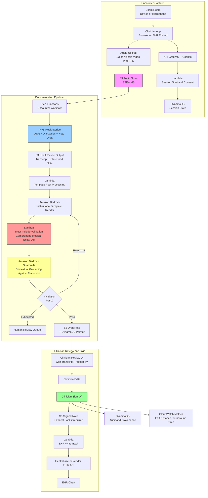

# Recipe 2.8 Architecture and Implementation: Ambient Clinical Documentation

*Companion to [Recipe 2.8: Ambient Clinical Documentation](chapter02.08-ambient-clinical-documentation). This page covers the AWS architecture, services, prerequisites, and pseudocode. For the problem framing and the conceptual approach, start with the main recipe.*

---

## The AWS Implementation

### Why These Services

**Amazon Web Services HealthScribe for the end-to-end ambient documentation pipeline.** HealthScribe is a HIPAA-eligible managed service that performs speech recognition, speaker diarization with clinician-patient role assignment, clinical entity extraction, and structured clinical note generation from conversational audio. It is designed explicitly for this use case. For most teams, HealthScribe is the right primary service because it collapses most of the hard pipeline steps into one API surface, and because its outputs include the transcript-to-note traceability that clinician review requires. HealthScribe supports both synchronous (batch) and streaming modes. <!-- TODO (TechWriter): Expert review V1 (HIGH). Verify streaming availability and regional coverage; HealthScribe has historically been batch-first with streaming added later, and regional availability has expanded over time. -->

**Amazon Transcribe Medical as an alternative or complement to HealthScribe.** Transcribe Medical is AWS's medical-specific ASR service. It supports both batch and streaming transcription with medical vocabulary tuning and specialty-specific models (primary care, cardiology, oncology, radiology, neurology, urology). Teams that want more control over the pipeline (e.g., custom diarization, custom note-generation prompts, integration with a non-HealthScribe generation step) use Transcribe Medical as the ASR building block and assemble the downstream pipeline themselves. Teams that want the managed end-to-end path use HealthScribe and accept its opinions about diarization and note structure.

**Amazon Bedrock for custom note generation and validation.** When the institutional note template doesn't match HealthScribe's default outputs, or when the team wants to enforce specific institutional language, Bedrock provides the LLM layer for post-processing HealthScribe's structured output into an institution-specific note format. Bedrock is also the right layer for post-generation validation passes: running the draft note through a second model with a prompt that asks "verify every claim in this note against this transcript; flag unsupported claims" adds a belt-and-suspenders check beyond HealthScribe's internal grounding.

**Amazon Bedrock Guardrails for content filtering and contextual grounding.** Guardrails can apply contextual grounding checks to the Bedrock-generated note against the transcript as the grounding source. This is an explicit tagging of the grounding source (not auto-detected) and uses the `amazon-bedrock-guardrailAction` field on the response (not `stop_reason`) to determine whether the Guardrail intervened. Guardrails also apply input-side prompt-attack filters, which matters because the transcript is free-text user-adjacent content that could, in pathological cases, contain prompt-shaped artifacts.

**Amazon Comprehend Medical for entity extraction and ontology mapping.** After the transcript is produced, Comprehend Medical extracts clinical entities (medications, conditions, anatomy, procedures) and can map them to ontologies (RxNorm, ICD-10, SNOMED where supported). This supports must-include validation (are the drugs in the transcript also in the note?) and structured medication reconciliation with the EHR.

**Amazon S3 for audio, transcript, and note archive.** Raw audio (retained per policy, typically encrypted, typically short-lived), transcripts, HealthScribe structured outputs, draft notes, signed notes, and full traces. SSE-KMS encryption with customer-managed keys. Lifecycle policies enforce retention. S3 Object Lock is used for signed-note immutability if the compliance posture requires it.

**AWS Lambda for pipeline orchestration and validation.** Each stage (session management, HealthScribe job management, post-generation validation, EHR write-back) is a Lambda function. Lambdas run in private subnets with interface endpoints to the AWS services they call.

**AWS Step Functions for workflow orchestration.** The session lifecycle is stateful: consent capture, audio upload, HealthScribe processing, validation, clinician review, signing, EHR write. Step Functions makes the stateful flow visible, resumable, and debuggable. Long-running steps (HealthScribe processing time, human review time) are modeled explicitly as waits or as external-trigger resumptions.

**Amazon DynamoDB for session state, provenance, and audit.** Each encounter gets a DynamoDB record tracking consent, session start and end, HealthScribe job status, draft note pointers, clinician edits, sign-off, and EHR write-back status. This is the audit trail and the basis for analytics.

**Amazon Kinesis Video Streams with WebRTC for real-time audio capture (optional).** For real-time or near-real-time pipelines, Kinesis Video Streams supports WebRTC-based audio ingest from a browser or application on the clinician's device. The stream is consumed by the processing pipeline. For asynchronous pipelines, direct S3 upload of the recorded file is simpler and usually sufficient.

**Amazon API Gateway + Amazon Cognito for clinician-facing APIs.** The ambient documentation front-end (browser app, mobile app, or EHR embed) calls into API Gateway for session management, note retrieval, and edit-and-sign actions. Cognito provides authentication. MFA is enforced for clinical-documentation access.

**AWS HealthLake or direct FHIR API integration for EHR write-back.** HealthLake stores FHIR resources and supports writing completed notes as FHIR DocumentReference resources. For EHR integrations that use Epic, Oracle Health, or other vendor APIs, a vendor-specific integration layer (built on Lambda or using a HealthLake-sourced feed) handles the write-back. HL7 v2 integrations (for older EHRs) go through a translation layer (AWS HealthLake for FHIR, or a partner-provided HL7 bridge).

**AWS Secrets Manager for EHR credentials.** The EHR integration requires credentials. Secrets Manager manages them with rotation where supported by the EHR vendor.

**AWS CloudTrail and Amazon CloudWatch for audit, monitoring, and analytics.** Every consent capture, every HealthScribe invocation, every note drafted, every clinician edit, every sign-off, every EHR write. Dashboards track documentation turnaround time, clinician-reported quality, edit-distance between draft and signed note (a proxy for quality), and operational metrics.

**AWS Key Management Service (KMS) for encryption keys.** Customer-managed CMKs for all PHI at rest. Separate keys for transcripts, audio, and notes can support finer-grained retention and deletion.

### Architecture Diagram


### Prerequisites

| Requirement | Details |
|-------------|---------|
| **AWS Services** | AWS HealthScribe (primary), Amazon Transcribe Medical (alternative or complement), Amazon Bedrock, Amazon Bedrock Guardrails, Amazon Comprehend Medical, Amazon S3, AWS Lambda, AWS Step Functions, Amazon DynamoDB, Amazon Kinesis Video Streams with WebRTC (optional, for real-time), Amazon API Gateway, Amazon Cognito, AWS HealthLake (optional, for FHIR-based EHR integration), AWS Secrets Manager, Amazon CloudWatch, AWS CloudTrail, AWS KMS. <!-- TODO (TechWriter): Expert review V1 (HIGH). Verify current HealthScribe regional availability. --> |
| **IAM Permissions** | `transcribe:StartMedicalScribeJob`, `transcribe:GetMedicalScribeJob`, `transcribe:ListMedicalScribeJobs` for HealthScribe; `transcribe:StartMedicalTranscriptionJob` for Transcribe Medical; `bedrock:InvokeModel`, `bedrock:ApplyGuardrail`; `comprehendmedical:DetectEntitiesV2`, `comprehendmedical:InferRxNorm`, `comprehendmedical:InferICD10CM`; `s3:GetObject`, `s3:PutObject`, `s3:GetObjectRetention`, `s3:PutObjectRetention`; `dynamodb:GetItem`, `dynamodb:PutItem`, `dynamodb:UpdateItem`, `dynamodb:Query`; `states:StartExecution`, `states:SendTaskSuccess` (for human-review wait states); `kinesisvideo:*` (scoped) if using Kinesis Video Streams; `healthlake:CreateResource`, `healthlake:UpdateResource` if using HealthLake; `secretsmanager:GetSecretValue`; `kms:Decrypt`, `kms:GenerateDataKey`. Scope every action to specific resource ARNs. |
| **BAA** | AWS BAA signed. Every service in the pipeline touching audio, transcripts, or notes must be HIPAA-eligible and covered under the BAA. Audio is always PHI (voice is biometric). Transcripts are PHI (contain patient identifiers and clinical content). Draft notes are PHI. Consent capture is the contractual anchor that makes the recording lawful; patients must consent affirmatively and be able to opt out without penalty. |
| **HealthScribe Access** | HealthScribe is a distinct service from Transcribe Medical; ensure your account has access in the intended region. Verify regional availability and quota before building. |
| **Bedrock Model Access** | Request access to a capable generation model (Claude Sonnet or equivalent) and a cheaper model (Claude Haiku or Nova Lite) for validation passes. Run note-quality evaluation with your chosen model before production. |
| **EHR Integration** | Access to the institution's EHR write API (Epic Orders, Oracle Health, other). For FHIR-based integrations, either direct FHIR endpoints or HealthLake as an intermediary. Credential rotation, TLS, and audit requirements are set by the EHR vendor. |
| **Encryption** | S3 audio, transcripts, draft notes, signed notes: SSE-KMS with customer-managed keys. Consider separate CMKs per data class (audio vs text) for finer retention control. DynamoDB: encryption at rest with CMK. Bedrock and HealthScribe: TLS in transit, encryption at rest. Bedrock model-invocation logging (if enabled) will contain the transcript and the draft note; log destination must be KMS-encrypted to the same standard as the note archive. CloudTrail logs to a KMS-encrypted S3 bucket with Object Lock for audit immutability where required. |
| **VPC** | Production: Lambda in private subnets with interface endpoints for Transcribe (used by HealthScribe; verify endpoint availability for the HealthScribe-specific APIs in your region), Bedrock, Bedrock Runtime, Comprehend Medical, KMS, Secrets Manager, Step Functions, CloudWatch Logs, CloudWatch Monitoring, HealthLake (if used). Gateway endpoints for S3 and DynamoDB. If using Kinesis Video Streams with WebRTC for streaming audio, add `kinesisvideo` and `kinesisvideo-signaling` interface endpoints for the control plane; note that WebRTC media flows use ICE-negotiated peer connectivity that typically traverses the public internet through STUN/TURN servers. If API Gateway is configured as a private REST API, add `execute-api` interface endpoint. API Gateway can use a private REST API if the clinician app reaches it through VPN/Direct Connect; otherwise, API Gateway is internet-facing with WAF, Cognito authorizers, and strict rate limits. Interface endpoints cost roughly $7-10/month per AZ per endpoint; include this in the cost estimate. <!-- TODO (TechWriter): Expert review V1 (HIGH). Verify which Transcribe/HealthScribe endpoints support VPC interface endpoints in your target region. --> |
| **CloudTrail** | Enabled with data events for S3 (audio and note buckets), DynamoDB (session table), and Secrets Manager. Correlate every artifact to the encounter session ID and the requesting clinician identity. CloudTrail logs must be immutable (separate AWS account with Object Lock, or equivalent). |
| **Consent Management** | A consent-capture workflow is a hard prerequisite. Depending on jurisdiction, consent may be required to be explicit, documented, and revocable. Two-party consent states (California, Florida, and others in the US) have stricter requirements than one-party consent states. Even in one-party consent states, clinical ethics standards require patient consent. The consent record is a compliance artifact; design accordingly. |
| **Sample Data** | For development and evaluation: synthetic clinical conversations generated from templates, publicly-available medical conversation corpora (if redistributable, see MTS-Dialog and similar research datasets), and recorded mock encounters with actors under research consent. Never use real clinical audio in development or test environments. For end-to-end production evaluation, use a consented pilot with a small clinician cohort and formal quality review. |
| **Cost Estimate** | HealthScribe pricing is per minute of audio processed, typically dominating the per-encounter cost. A 15-minute encounter runs on the order of $0.30-$1.00 in HealthScribe costs alone (verify current pricing on the AWS HealthScribe pricing page, as rates have changed since launch). Bedrock generation for template post-processing adds $0.02-$0.15 depending on model and note length. Validation passes add another $0.01-$0.10. Storage, DynamoDB, Lambda, Step Functions are rounding error at any reasonable volume. End-to-end per encounter: $0.40-$2.50 typical for ambulatory visits; longer inpatient encounters cost proportionally more. At 10,000 encounters per day, variable cost runs $4,000-$25,000/day; fixed infrastructure (VPC endpoints, HealthLake if used, operational overhead) adds $500-$2,000/month. Human scribe services typically cost $12-$25 per hour per clinician, or roughly $3-$6 per encounter depending on encounter length; ambient documentation is materially cheaper per encounter at scale. |

### Ingredients

| AWS Service | Role |
|------------|------|
| **AWS HealthScribe** | Managed ASR, diarization, role assignment, and initial clinical note drafting from conversational audio |
| **Amazon Transcribe Medical** | Alternative or complementary medical ASR; used when custom pipeline control is needed |
| **Amazon Bedrock (generation)** | Post-processing HealthScribe output into the institutional note template; validation-pass generation |
| **Amazon Bedrock Guardrails** | Contextual grounding check against the transcript; input-side prompt-attack filters |
| **Amazon Comprehend Medical** | Entity extraction from transcript and note for must-include validation; RxNorm/ICD-10 mapping for medication and problem reconciliation |
| **Amazon S3** | Audio archive, transcript and note storage, HealthScribe job outputs, full provenance trace |
| **AWS Lambda** | Session management, pipeline orchestration steps, validation, EHR write-back |
| **AWS Step Functions** | Stateful encounter workflow with human-in-the-loop review and wait-for-signoff patterns |
| **Amazon DynamoDB** | Session state, consent records, note pointers, clinician edits, audit trail |
| **Amazon Kinesis Video Streams (WebRTC)** | Real-time audio ingest from clinician device, if using streaming mode |
| **Amazon API Gateway + Amazon Cognito** | Authenticated clinician-facing APIs with MFA |
| **AWS HealthLake** | FHIR store for EHR integration via DocumentReference and related resources |
| **AWS Secrets Manager** | EHR integration credentials with rotation |
| **AWS KMS** | Customer-managed keys for audio, transcripts, draft notes, signed notes, and audit logs |
| **Amazon CloudWatch + AWS CloudTrail** | Documentation latency, edit distance, validation pass rate, consent audit, HIPAA audit logs |

---

### Code

#### Walkthrough

**Step 1: Start the encounter session and capture consent.** Before any audio is captured, the clinician's app calls the session-start endpoint with the patient identifier, encounter type, and consent attestation. The session record is the spine that every downstream artifact will reference.

```pseudocode
FUNCTION start_encounter_session(request):
    // request.patient_id: EHR identifier for the patient
    // request.clinician_id: Cognito identity of the clinician
    // request.encounter_type: ambulatory, inpatient, specialty (drives template)
    // request.specialty: primary_care, cardiology, oncology, etc.
    // request.consent_given: boolean attestation from clinician UI
    // request.consent_method: verbal, written, electronic
    // request.consent_form_version: versioned identifier of the consent form
    // request.two_party_jurisdiction: bool; if true, patient consent must be explicit

    IF NOT request.consent_given:
        RETURN { status: "REJECTED",
                 reason: "Consent required before audio capture." }

    IF request.two_party_jurisdiction AND request.consent_method not in ("written", "electronic"):
        // Some jurisdictions require documented consent, not just verbal
        RETURN { status: "REJECTED",
                 reason: "Documented consent required in this jurisdiction." }

    session_id = generate UUID

    // Write session to DynamoDB. This is the first audit record.
    write to DynamoDB table "documentation-sessions":
        session_id              = session_id
        patient_id              = request.patient_id
        clinician_id            = request.clinician_id
        encounter_type          = request.encounter_type
        specialty               = request.specialty
        status                  = "CONSENT_CAPTURED"
        consent_given_at        = current UTC timestamp
        consent_method          = request.consent_method
        consent_form_version    = request.consent_form_version
        audio_s3_key            = empty (populated on upload)
        healthscribe_job_name   = empty (populated on job start)
        draft_note_s3_key       = empty
        signed_note_s3_key      = empty

    // Issue an audio-upload pre-signed URL or a Kinesis Video stream endpoint
    IF request.streaming_mode == "kinesis_video":
        upload_target = create_kinesis_video_webrtc_endpoint(session_id)
    ELSE:
        upload_target = create_s3_multipart_presigned_url(
            bucket = AUDIO_BUCKET,
            key    = f"sessions/{session_id}/audio.{format}",
            kms_key_id = AUDIO_CMK_ID
        )

    RETURN { session_id: session_id,
             upload_target: upload_target,
             status: "READY_FOR_AUDIO" }
```
**Step 2: Finalize the audio upload and trigger the HealthScribe job.** Once the clinician ends the session, the audio is uploaded (or the stream is closed) and a HealthScribe job is started. HealthScribe does the heavy lifting: ASR with medical vocabulary, diarization with clinician-patient roles, clinical entity extraction, and a structured note draft organized by section.

```pseudocode
FUNCTION finalize_audio_and_start_healthscribe(session_id, audio_s3_key):

    // Verify session is in expected state
    session = get DynamoDB "documentation-sessions" for session_id
    IF session.status != "CONSENT_CAPTURED":
        RETURN { status: "ERROR", reason: "Unexpected session state." }

    // Kick off the HealthScribe job
    // HealthScribe takes the audio, an output location, an IAM role for data access,
    // and settings like the number of expected speakers and whether to enable
    // specific features (clinical note generation vs transcript-only).
    job_name = f"scribe-{session_id}"

    // HealthScribe job names are unique per account per region and the start call
    // is not idempotent on conflict. Before starting, check for an existing job
    // with this name (handles Step Functions retries after transient failures).
    existing = try call Transcribe.GetMedicalScribeJob with
                 MedicalScribeJobName = job_name
    IF existing is found AND existing.status == "IN_PROGRESS":
        update DynamoDB: status = "HEALTHSCRIBE_RUNNING"
        RETURN { status: "HEALTHSCRIBE_ALREADY_STARTED",
                 healthscribe_job_name: job_name }
    IF existing is found AND existing.status == "COMPLETED":
        update DynamoDB: status = "HEALTHSCRIBE_COMPLETE"
        RETURN { status: "HEALTHSCRIBE_ALREADY_COMPLETE",
                 healthscribe_job_name: job_name }
    IF existing is found AND existing.status == "FAILED":
        job_name = f"scribe-{session_id}-retry-{generate_short_id()}"

    start_response = call Transcribe.StartMedicalScribeJob with:
        MedicalScribeJobName = job_name
        Media = {
            MediaFileUri: f"s3://{AUDIO_BUCKET}/{audio_s3_key}"
        }
        OutputBucketName = HEALTHSCRIBE_OUTPUT_BUCKET
        OutputEncryptionKMSKeyId = OUTPUT_CMK_ID
        DataAccessRoleArn = HEALTHSCRIBE_DATA_ACCESS_ROLE_ARN
        Settings = {
            ShowSpeakerLabels: true,
            // HealthScribe expects roles rather than generic speaker labels;
            // typical roles are CLINICIAN and PATIENT.
            MaxSpeakerLabels: 2,
            ChannelIdentification: false,
            // Whether to include the clinical note generation in the output
            // (as opposed to transcript only)
            ClinicalNoteGenerationSettings: {
                NoteTemplate: select_template(session.encounter_type,
                                              session.specialty)
            }
        }

    // Update session
    update DynamoDB table "documentation-sessions": session_id with:
        status                = "HEALTHSCRIBE_RUNNING"
        audio_s3_key          = audio_s3_key
        healthscribe_job_name = job_name
        healthscribe_started_at = current UTC timestamp

    RETURN { status: "HEALTHSCRIBE_STARTED",
             healthscribe_job_name: job_name }
```
**Step 3: Poll or subscribe for HealthScribe completion and fetch outputs.** HealthScribe runs asynchronously. The job completes in roughly real-time to a small multiple of the audio duration (a 15-minute encounter completes in a few minutes). The Step Functions workflow either polls with a wait state or subscribes to an EventBridge event when the job completes.

```pseudocode
FUNCTION fetch_healthscribe_output(session_id, job_name):

    job_status = call Transcribe.GetMedicalScribeJob with:
        MedicalScribeJobName = job_name

    IF job_status.MedicalScribeJobStatus == "IN_PROGRESS":
        RETURN { status: "STILL_RUNNING" }

    IF job_status.MedicalScribeJobStatus == "FAILED":
        update DynamoDB: status = "HEALTHSCRIBE_FAILED",
                        failure_reason = job_status.FailureReason
        RETURN { status: "FAILED",
                 reason: job_status.FailureReason }

    // COMPLETED: outputs include the transcript with speaker roles and
    // the structured clinical note draft. Both land in S3 at the output location.
    output_location = job_status.MedicalScribeOutput

    transcript_json = read from S3 at output_location.TranscriptFileUri
    clinical_note_json = read from S3 at output_location.ClinicalDocumentUri

    // The transcript includes timestamped segments with role labels (CLINICIAN, PATIENT)
    // and confidence scores per segment.
    //
    // The clinical note is structured into sections (Subjective, Objective,
    // Assessment, Plan by default, but the exact sections depend on the selected template).
    // Each section's content references back to transcript segments via segment IDs,
    // which is what enables transcript traceability in the clinician UI.

    update DynamoDB: status                       = "HEALTHSCRIBE_COMPLETE",
                    transcript_s3_key             = output_location.TranscriptFileUri,
                    healthscribe_note_s3_key      = output_location.ClinicalDocumentUri,
                    healthscribe_completed_at     = current UTC timestamp

    RETURN { status: "COMPLETE",
             transcript: transcript_json,
             healthscribe_note: clinical_note_json }
```
**Step 4: Extract entities from the transcript for must-include validation.** Before generating the final institutional-template note, extract clinical entities from the transcript using Comprehend Medical. These entities become the "must-include" checklist for the note: if the patient mentioned a medication or symptom, the note needs to cover it.

```pseudocode
FUNCTION extract_transcript_entities(transcript_json):

    // Concatenate the patient-attributed transcript segments into text
    patient_text = ""
    clinician_text = ""
    FOR each segment in transcript_json.TranscriptSegments:
        IF segment.ParticipantRole == "PATIENT":
            patient_text += segment.Content + " "
        ELSE IF segment.ParticipantRole == "CLINICIAN":
            clinician_text += segment.Content + " "

    // Extract entities from combined text. Patient statements tend to contain
    // symptoms and medications; clinician statements contain assessments and plan.
    combined_text = patient_text + " " + clinician_text

    // Comprehend Medical has a per-request character limit (~20,000 UTF-8 bytes).
    // A 15-minute encounter typically fits; longer encounters (40+ minutes,
    // inpatient rounding) will exceed it. Chunk at sentence boundaries to avoid
    // splitting mid-entity, then merge entity offsets back to original coordinates.
    chunks = split_into_chunks(combined_text, max_bytes = 18000,
                               boundary_policy = "sentence")

    all_entities = empty list
    all_rxnorm = empty list
    all_icd = empty list

    FOR each chunk in chunks:
        entities_response = call ComprehendMedical.DetectEntitiesV2 with:
            text = chunk.text
        all_entities.extend(map_offsets_back(entities_response, chunk.start_offset))

        rxnorm_response = call ComprehendMedical.InferRxNorm with:
            text = chunk.text
        all_rxnorm.extend(map_offsets_back(rxnorm_response, chunk.start_offset))

        icd_response = call ComprehendMedical.InferICD10CM with:
            text = chunk.text
        all_icd.extend(map_offsets_back(icd_response, chunk.start_offset))

    must_include = {
        medications: extract_medications(all_rxnorm),
        conditions: extract_conditions(all_icd),
        symptoms: extract_symptoms(all_entities),
        procedures: extract_procedures(all_entities),
        numerics: extract_doses_and_vitals(all_entities, transcript_json)
        // extract_doses_and_vitals pairs Comprehend Medical's DOSAGE and
        // NUMERIC_VALUE entity types with their governing medication or
        // measurement via the TraitName attribute.
    }

    RETURN must_include
```
**Step 5: Render the note in the institutional template using Bedrock.** HealthScribe's default note structure may not match your institution's template. The Bedrock step takes the HealthScribe structured output and the transcript and produces the institutional-format note. The prompt is strict: produce the note only from transcript content and HealthScribe-identified entities; do not add content that isn't supported by the transcript.

```pseudocode
FUNCTION render_institutional_note(session, healthscribe_note, transcript_json,
                                   must_include, ehr_context):

    template = load_template(session.encounter_type, session.specialty)

    // Format the transcript for the prompt with segment IDs
    transcript_block = ""
    FOR each segment in transcript_json.TranscriptSegments:
        transcript_block += f"[seg_{segment.Id}] ({segment.ParticipantRole}, "
                          + f"conf={segment.Confidence}): {segment.Content}\n"

    ehr_block = format_ehr_context(ehr_context)
    // ehr_context includes current med list, problem list, allergies, recent labs.
    // These are structured, not free-text, and explicitly labeled as "from EHR."
    //
    // PHI minimization: before passing ehr_context into the generation prompt,
    // strip identifiers not needed for note generation.
    // Keep: active problem list (names and codes), current medications (drug,
    //       dose, frequency), allergies (substance and reaction), recent labs
    //       and vitals referenced in the encounter, relevant imaging impressions.
    // Drop: MRN, DOB (use age band if age context is needed), patient name,
    //       address, phone, payer/member IDs, provider NPIs.
    // The note written back to the EHR carries the patient identifier through
    // the FHIR subject reference; identifiers do not need to appear in the
    // generation prompt.

    generation_prompt = f"""
    You are drafting a clinical note from a recorded patient encounter. Your only
    sources are the transcript segments and the labeled EHR context below.

    HARD REQUIREMENTS:
    - Every factual claim must trace to a transcript segment (cite as [seg_N]) or
      to an EHR source (cite as [ehr:medications], [ehr:problems], etc.).
    - Do not include content that is not supported by a transcript segment or an EHR source.
    - Preserve verbatim numerical values from the transcript (doses, durations, vital signs).
    - Preserve negations and uncertainty language as stated in the transcript.
    - Do not infer physical exam findings unless the clinician stated them aloud in the
      transcript. If the physical exam section has no transcript support, leave a placeholder:
      "Physical exam not documented in recording. Please complete."
    - Do not include small talk or non-clinical content in the note.
    - Attribute assessment language to the clinician's statements; do not generate
      a clinical impression the clinician did not express.

    MUST-INCLUDE CHECKLIST (these appear in the transcript and must be reflected in
    the appropriate note section):
    - Medications mentioned: {must_include.medications}
    - Conditions mentioned: {must_include.conditions}
    - Symptoms mentioned: {must_include.symptoms}
    - Procedures discussed: {must_include.procedures}
    - Numerical values: {must_include.numerics}

    TEMPLATE STRUCTURE:
    {template.sections}

    TRANSCRIPT:
    {transcript_block}

    EHR CONTEXT:
    {ehr_block}

    HEALTHSCRIBE STRUCTURED OUTPUT (for reference; do not copy directly, use as a guide):
    {healthscribe_note}

    OUTPUT FORMAT: JSON with one key per template section. Each section value is
    a string of note content with inline citations. Also produce a top-level
    "claims" array: for each factual claim, include the claim text, the cited
    segment IDs or EHR references, and whether the claim preserves original numerics.
    """

    response = call Bedrock.InvokeModel with:
        model_id     = GENERATION_MODEL_ID  // e.g. anthropic.claude-3-5-sonnet-20241022-v2:0
                                            // Bedrock model IDs include a date and version
                                            // suffix. Verify the current ID in your region.
                                            // Cross-region inference profiles
                                            // (us.anthropic.claude-...) are recommended
                                            // for multi-region deployments.
        prompt       = generation_prompt
        max_tokens   = 6000
        temperature  = 0.1
        guardrail_id = AMBIENT_DOC_GUARDRAIL_ID
        // Guardrails configuration:
        // PREREQUISITE: the Guardrail referenced by AMBIENT_DOC_GUARDRAIL_ID must
        // be configured at the policy level with:
        //   1. Input-side prompt-attack filters ENABLED (configured on the Guardrail
        //      itself, not on the invocation call).
        //   2. Contextual grounding policy configured with the transcript explicitly
        //      tagged as the grounding source (via guardContent block in Converse API,
        //      or grounding source in the Guardrail policy).
        //   3. PII filters tuned for clinical context (clinical terms are not PII).
        //   4. Content filters set per institutional policy.
        //
        // The transcript is user-adjacent content that could, in edge cases, contain
        // text that looks like an instruction. Treat it as untrusted input.
        // Intervention is signaled via `amazon-bedrock-guardrailAction` on the
        // response, not via `stop_reason`.

    // Check for Guardrail intervention. The correct field is
    // `amazon-bedrock-guardrailAction`, not `stop_reason`.
    IF response.guardrail_action == "INTERVENED":
        RETURN { status: "GROUNDING_REJECTED",
                 guardrail_trace: response.guardrail_trace }

    note_json = parse JSON from response

    RETURN { status: "NOTE_RENDERED",
             note_sections: note_json.sections,
             claims: note_json.claims }
```
**Step 6: Validate the note against the transcript and must-include entities.** After generation, run a validation pass. For each claim in the generated note, verify it traces to a transcript segment or EHR source. For each item in the must-include checklist, verify it appears in the appropriate note section. Numerical values are verified verbatim.

```pseudocode
FUNCTION validate_note(note_sections, claims, transcript_json, must_include, retry_count):

    transcript_segment_map = dict { seg.Id: seg for seg in transcript_json.TranscriptSegments }
    note_text_combined = join(note_sections.values(), separator="\n")

    unverified = empty list

    // 1. Every claim must cite a segment or EHR source that exists
    FOR each claim in claims:
        valid_sources = 0
        FOR each citation in claim.citations:
            IF citation starts with "seg_":
                seg_id = strip "seg_" prefix
                IF seg_id in transcript_segment_map:
                    valid_sources += 1
                ELSE:
                    append { claim, reason: "citation_seg_not_found",
                             citation } to unverified
            ELSE IF citation starts with "ehr:":
                // Assume EHR citations are well-formed; deeper validation could check
                // specific field presence in ehr_context
                valid_sources += 1
            ELSE:
                append { claim, reason: "unrecognized_citation_format",
                         citation } to unverified

        IF valid_sources == 0:
            append { claim, reason: "no_valid_source" } to unverified
            CONTINUE

        // 2. For claims preserving numerics, the numbers must appear verbatim
        //    in the cited segments
        IF claim.preserves_numerics:
            numbers_in_claim = extract_numbers(claim.text)
            supporting_text = ""
            FOR each cit in claim.citations:
                IF cit starts with "seg_":
                    supporting_text += transcript_segment_map[strip_seg_prefix(cit)].Content

            FOR each num in numbers_in_claim:
                IF num not verbatim in supporting_text:
                    append { claim, reason: "numeric_not_in_source",
                             number: num } to unverified

    // 3. Must-include checklist: every transcript medication, condition, and
    //    significant symptom should appear somewhere in the note
    missing_must_include = empty list

    FOR each med in must_include.medications:
        IF med.name not mentioned_in note_text_combined
                AND not mentioned_in_ehr_context(med.name):
            append { type: "medication", item: med.name } to missing_must_include

    FOR each cond in must_include.conditions:
        IF cond.name not mentioned_in note_text_combined:
            append { type: "condition", item: cond.name } to missing_must_include

    FOR each sym in must_include.symptoms:
        IF sym.name not mentioned_in note_text_combined
                AND sym.confidence_in_transcript > 0.7:
            append { type: "symptom", item: sym.name } to missing_must_include

    // 4. Section-specific must-not-be-empty checks for non-optional sections
    required_sections_empty = empty list
    FOR each section_name in ["chief_complaint", "assessment", "plan"]:
        IF section_name in note_sections
                AND (note_sections[section_name] is empty or length < 10 chars):
            append section_name to required_sections_empty

    IF length(unverified) == 0 AND length(missing_must_include) == 0
            AND length(required_sections_empty) == 0:
        RETURN { status: "VALIDATED" }

    // If validation fails, decide retry vs route to review
    IF retry_count < 2:
        RETURN { status: "RETRY_NEEDED",
                 unverified_claims: unverified,
                 missing_must_include: missing_must_include,
                 required_sections_empty: required_sections_empty,
                 suggested_prompt_augmentation:
                     build_strict_prompt_addition(unverified,
                                                  missing_must_include,
                                                  required_sections_empty) }

    // Retries exhausted. Route to human review.
    RETURN { status: "VALIDATION_EXHAUSTED_ROUTED_TO_REVIEW",
             unverified_claims: unverified,
             missing_must_include: missing_must_include }
```
**Step 7: Present the draft to the clinician for review and signing.** The draft note is stored, and the clinician's UI is notified that a note is ready. The UI renders the note with per-sentence traceability: each sentence links back to the transcript segment(s) that generated it. Low-confidence ASR segments and items that failed validation are flagged. The clinician edits, then signs.

```pseudocode
FUNCTION present_for_review(session_id, note_sections, claims, validation_result):

    // Persist the draft
    draft_key = f"sessions/{session_id}/draft_note.json"
    write to S3: draft_key = {
        sections: note_sections,
        claims: claims,
        validation: validation_result,
        rendered_at: current UTC timestamp
    }

    update DynamoDB: status             = "AWAITING_CLINICIAN_REVIEW",
                    draft_note_s3_key   = draft_key,
                    draft_rendered_at   = current UTC timestamp

    // Notify the clinician's app (push notification, WebSocket message, or polling)
    notify_clinician_app(session.clinician_id, session_id, "draft_ready")

    // The Step Functions workflow waits here for the clinician's sign-off event.
    // Using SendTaskSuccess / SendTaskFailure from the clinician UI callback,
    // the workflow resumes when the clinician signs.
    RETURN { status: "AWAITING_SIGNOFF" }


FUNCTION capture_clinician_signoff(session_id, edited_note, clinician_attestation):

    session = get DynamoDB "documentation-sessions" for session_id

    IF session.status != "AWAITING_CLINICIAN_REVIEW":
        RETURN { status: "ERROR", reason: "Unexpected session state." }

    // Compute edit distance between draft and signed version as a quality metric
    // Recommended: token-level Levenshtein on whitespace-normalized text,
    // divided by the length of the longer of draft or signed. This normalization
    // makes the metric comparable across encounter lengths and clinicians.
    draft = read from S3 at session.draft_note_s3_key
    edit_distance = compute_normalized_edit_distance(draft.sections, edited_note.sections)

    // Persist the signed note
    signed_key = f"sessions/{session_id}/signed_note.json"
    write to S3: signed_key = {
        sections: edited_note.sections,
        signed_by: session.clinician_id,
        attestation: clinician_attestation,
        signed_at: current UTC timestamp,
        draft_note_key: session.draft_note_s3_key
    }
    // If compliance requires, apply S3 Object Lock to make the signed note immutable.
    // Prerequisite: the S3 bucket must have Object Lock enabled at bucket creation
    // and a default retention mode configured before objects can have retention applied.
    apply_object_lock_if_required(signed_key)

    update DynamoDB: status                  = "SIGNED",
                    signed_note_s3_key      = signed_key,
                    signed_at               = current UTC timestamp,
                    edit_distance_metric    = edit_distance

    // Emit CloudWatch metric for the edit distance; regression in this metric
    // often indicates a quality problem in the generation pipeline
    emit CloudWatch metric:
        namespace    = "AmbientDocumentation"
        metric_name  = "EditDistance"
        value        = edit_distance
        dimensions   = { specialty, encounter_type, clinician_id }

    // Resume the Step Functions workflow so EHR write-back happens
    call StepFunctions.SendTaskSuccess with:
        TaskToken = session.signoff_task_token
        Output    = { signed_note_key: signed_key }

    RETURN { status: "SIGNED", signed_note_key: signed_key }
```
**Step 8: Write the signed note back to the EHR.** The signed note is written to the EHR. If the institution uses a FHIR-based integration, the note becomes a DocumentReference resource. If it uses a vendor-specific API (Epic, Oracle Health), the integration uses the vendor's documentation submission endpoint. Errors in this step trigger operational alerts and retry; a signed note that never reaches the EHR is a critical failure.

```pseudocode
FUNCTION write_to_ehr(session_id, signed_note):

    session = get DynamoDB "documentation-sessions" for session_id

    integration_type = get_ehr_integration_type(session.patient_id)

    IF integration_type == "fhir":
        // Build a FHIR DocumentReference
        doc_ref = {
            resourceType: "DocumentReference",
            status: "current",
            type: {
                coding: [{
                    system: "http://loinc.org",
                    code: loinc_code_for_note_type(session.encounter_type),
                    // Common LOINC mappings:
                    //   34117-2  History and Physical
                    //   11488-4  Consultation Note
                    //   34746-8  Progress Note
                    //   28570-0  Procedure Note
                    //   18842-5  Discharge Summary
                    // Extend for your institution's encounter types.
                    display: loinc_display_for_note_type(session.encounter_type)
                }]
            },
            subject: { reference: f"Patient/{session.patient_id}" },
            date: session.signed_at,
            author: [{ reference: f"Practitioner/{session.clinician_id}" }],
            content: [{
                attachment: {
                    contentType: "application/json",
                    data: base64_encode(serialize(signed_note.sections)),
                    title: build_note_title(session)
                }
            }],
            context: {
                encounter: [{ reference: f"Encounter/{session.encounter_id}" }]
            }
        }

        response = call HealthLake.CreateResource with:
            // Note: HealthLake FHIR resource creation uses a SigV4-signed HTTPS
            // POST to the datastore's FHIR endpoint, not a direct SDK method.
            // See the Python companion for implementation details.
            DatastoreId = HEALTHLAKE_DATASTORE_ID
            ResourceType = "DocumentReference"
            ResourceContent = doc_ref

    ELSE IF integration_type == "epic_orders_api":
        // Vendor-specific endpoint; credential fetched from Secrets Manager
        credentials = call SecretsManager.GetSecretValue with:
            SecretId = EPIC_INTEGRATION_SECRET_ID

        response = call EpicAPI.submitClinicalNote with:
            credentials: credentials,
            patient_id: session.patient_id,
            encounter_id: session.encounter_id,
            note_text: serialize(signed_note.sections),
            clinician_id: session.clinician_id

    ELSE:
        // Other integrations: HL7 v2 bridge, etc.
        response = call integration_specific_submit(...)

    IF response.success:
        update DynamoDB: status              = "WRITTEN_TO_EHR",
                        ehr_write_response  = response.identifier,
                        written_to_ehr_at   = current UTC timestamp
        RETURN { status: "WRITTEN" }
    ELSE:
        // Operational alert; retryable errors go back to the queue
        emit CloudWatch alarm: "EHRWriteFailed"
        update DynamoDB: status              = "EHR_WRITE_FAILED",
                        ehr_write_error     = response.error_message
        RETURN { status: "FAILED", reason: response.error_message }
```
**Step 9: Apply retention policies to audio, transcripts, and traces.** Audio and transcripts contain PHI. Retention policies are institution-specific, but a common pattern: audio retained for 7-30 days for operational debugging then deleted; transcripts retained for longer (per legal-hold requirements, often matching medical record retention for the signed note); signed notes retained per medical record retention rules (typically 7-30 years depending on jurisdiction and patient age).

```pseudocode
FUNCTION apply_retention(session_id):

    session = get DynamoDB "documentation-sessions" for session_id

    policy = get_retention_policy(session.encounter_type, session.jurisdiction)

    // Audio lifecycle: typically short
    IF policy.audio_retention_days > 0:
        tag_s3_object_for_deletion(session.audio_s3_key,
                                   delete_after_days = policy.audio_retention_days)
    ELSE:
        // Immediate deletion
        call S3.DeleteObject on session.audio_s3_key

    // Transcript retention: often matches signed note retention
    tag_s3_object_for_lifecycle(session.transcript_s3_key,
                                retention_years = policy.transcript_retention_years)

    // Draft note: typically short-lived after signing
    tag_s3_object_for_deletion(session.draft_note_s3_key,
                               delete_after_days = policy.draft_retention_days)

    // Signed note: retained per medical record rules; Object Lock already applied
    //              if required by compliance posture. Do not delete until retention expires.

    update DynamoDB: retention_applied_at = current UTC timestamp
```
**Step 10: Emit metrics and feed the quality loop.** Metrics drive the quality program. Edit distance between draft and signed tells you where the pipeline is getting better or worse. Time-to-sign tells you whether clinicians are finding the drafts usable. Validation pass rate tells you whether the generation step is behaving. Clinician-reported issues close the loop back to retrieval and prompt iteration.

```pseudocode
FUNCTION emit_quality_metrics(session):

    emit CloudWatch metric:
        namespace   = "AmbientDocumentation"
        metric_name = "DocumentationTurnaroundSeconds"
        value       = session.signed_at - session.consent_given_at
        dimensions  = { specialty, encounter_type }

    emit CloudWatch metric:
        namespace   = "AmbientDocumentation"
        metric_name = "EditDistance"
        value       = session.edit_distance_metric
        dimensions  = { specialty, clinician_id }

    emit CloudWatch metric:
        namespace   = "AmbientDocumentation"
        metric_name = "ValidationPassRateFirstAttempt"
        value       = session.validation_passed_first_attempt ? 1 : 0
        dimensions  = { specialty, encounter_type }

    // Clinician-reported feedback arrives separately via the review UI
    // (thumbs up/down, category-specific tags like "missed content," "hallucination,"
    //  "template wrong"). Those flow to a DynamoDB feedback table and a
    // weekly review pipeline.
    RETURN
```
> **Curious how this looks in Python?** The pseudocode above covers the concepts. If you'd like to see sample Python code that demonstrates these patterns using boto3, check out the [Python Example](chapter02.08-python-example). It walks through each step with inline comments and notes on what you'd need to change for a real deployment.

---

### Expected Results

**Sample output for an ambulatory family medicine encounter (illustrative; not a real patient):**

<!-- Note: the encounter, patient, and clinical content below are synthetic. The
     sample transcript and generated note are illustrative of pipeline outputs,
     not records from a real encounter. -->

```json
{
  "session_id": "AMB-2026-05-10-04621",
  "status": "SIGNED",
  "encounter_type": "ambulatory",
  "specialty": "family_medicine",
  "consent": {
    "given_at": "2026-05-10T14:02:11Z",
    "method": "verbal_confirmed_by_clinician",
    "form_version": "v2.3"
  },
  "audio_duration_seconds": 687,
  "healthscribe_processing_seconds": 94,
  "bedrock_render_seconds": 11,
  "validation_passed_first_attempt": true,
  "edit_distance_metric": 0.18,
  "time_to_signoff_seconds": 312,
  "draft_note_sections": {
    "chief_complaint": "Fatigue and intermittent chest discomfort for the past two weeks. [seg_3][seg_7]",
    "hpi": "Ms. Illustrative is a 58-year-old woman presenting for routine follow-up. She reports fatigue over the past two weeks [seg_7] and a sensation she describes as 'chest tightness, like someone is sitting on my chest' [seg_14][seg_16] that she has noticed primarily when climbing the stairs to her second-floor apartment [seg_17]. The tightness lasts approximately two to three minutes and resolves with rest [seg_19]. She denies associated shortness of breath at rest, lightheadedness, or diaphoresis [seg_21][seg_22]. She notes she has been under more stress at work recently [seg_24]. No prior similar episodes until about two weeks ago [seg_11].",
    "review_of_systems": "Positive for fatigue [seg_7] and exertional chest discomfort [seg_14]. Denies palpitations, syncope, presyncope, leg swelling, orthopnea, paroxysmal nocturnal dyspnea [seg_32][seg_33]. No fevers, weight changes, or appetite changes [seg_35].",
    "medications": "From EHR: metformin 1000 mg twice daily, lisinopril 20 mg daily, atorvastatin 40 mg nightly. [ehr:medications] Patient confirms current medications as listed; no changes since last visit [seg_41].",
    "allergies": "No known drug allergies. [ehr:allergies]",
    "physical_exam": "Blood pressure 148/88, heart rate 82 regular, oxygen saturation 97% on room air. [seg_47] General appearance well; no acute distress. [seg_49] Cardiovascular: regular rate and rhythm, no murmur appreciated. [seg_53] Lungs clear to auscultation bilaterally. [seg_54] Physical exam elements not explicitly narrated in recording have been left blank. Please complete.",
    "assessment": "1. New-onset exertional chest discomfort in a patient with known type 2 diabetes and hypertension. The pattern (substernal tightness, reproducible with exertion, relieved with rest) raises concern for stable angina and warrants prompt evaluation for coronary artery disease. [seg_58][seg_59]\n2. Fatigue, chronicity two weeks, possibly related to above cardiac symptoms versus separate etiology requiring workup. [seg_61]\n3. Elevated blood pressure today, recheck needed. [seg_47]",
    "plan": "1. Obtain ECG today in clinic. [seg_64]\n2. Order outpatient stress test, to be scheduled within one week. [seg_66]\n3. Basic labs: CMP, CBC, lipid panel, TSH, troponin. [seg_68]\n4. Start aspirin 81 mg daily pending further evaluation. [seg_71]\n5. Patient counseled to call 911 for worsening symptoms, chest pain at rest, or associated shortness of breath. [seg_74]\n6. Follow-up appointment in one week to review results and stress test. [seg_76]\n7. Consider cardiology referral depending on stress test results. [seg_78]"
  },
  "claims_verified": [
    {"claim": "fatigue over the past two weeks", "citations": ["seg_7"], "preserves_numerics": true},
    {"claim": "sensation she describes as 'chest tightness, like someone is sitting on my chest'", "citations": ["seg_14", "seg_16"], "preserves_numerics": false, "note": "verbatim quote from patient"},
    {"claim": "tightness lasts approximately two to three minutes", "citations": ["seg_19"], "preserves_numerics": true},
    {"claim": "blood pressure 148/88", "citations": ["seg_47"], "preserves_numerics": true},
    {"claim": "metformin 1000 mg twice daily", "citations": ["ehr:medications"], "preserves_numerics": true},
    {"claim": "start aspirin 81 mg daily", "citations": ["seg_71"], "preserves_numerics": true}
  ],
  "validation_flags": [],
  "clinician_edits_summary": {
    "sections_edited": ["physical_exam", "assessment"],
    "physical_exam": "Clinician added lower extremity findings (no edema) and abdominal exam that weren't narrated during the recording.",
    "assessment": "Clinician refined language on the differential for fatigue and added a note about renal function recheck given the planned troponin draw."
  },
  "disclaimer": "This draft was generated by an ambient documentation system. The clinician has reviewed, edited as needed, and signed the note. The signed note is the clinician's documentation of record."
}
```
**Performance benchmarks:**

| Metric | Typical Value |
|--------|---------------|
| HealthScribe processing time | 10-30% of audio duration for typical ambulatory encounters |
| Total draft-ready time after encounter end | 60-180 seconds typical; longer for long encounters |
| Time to clinician sign-off after draft ready | 2-8 minutes median; highly specialty-dependent |
| Clinician documentation time saved vs typing from scratch | 50-75% reduction reported in published deployments (figures vary by specialty and encounter mix; verify against current vendor case studies for your context) |
| Word error rate on clinical ASR in clinic audio | 5-12% with medical-tuned ASR and reasonable microphone placement |
| Diarization accuracy (clinician vs patient turn attribution) | 88-96% on clean two-speaker audio; drops with three or more speakers |
| Edit distance between draft and signed note (normalized) | 0.10-0.30 for well-performing pipelines; regression above 0.35 signals quality issues |
| Validation pass rate (first generation) | 85-95% |
| Validation pass rate (after retry) | 95-99% |
| Fraction of sessions routed to human-review queue | 1-5% depending on specialty and audio conditions |
| Clinician thumbs-up rate in pilot deployments | 65-85% (reported range across published ambient documentation pilots; specific figures depend on specialty, template quality, and rollout maturity) |
| Cost per encounter | $0.40-$2.50 depending on audio length and validation retries |

**Where it struggles:**

- **Three or more speakers.** Family members in the room, interpreters, medical students, trainees all complicate diarization. Role assignment gets confused when multiple people speak in clinician-like registers (a visiting student asking the clinician a question sounds like a second clinician voice).
- **Heavy accent or non-native English.** ASR accuracy degrades measurably for non-native English speakers. This applies to both clinicians and patients. In a pilot, track performance by clinician accent and patient language; the equity issue is real and measurable.
- **Long or highly technical encounters.** Complex specialist encounters (surgical consultations, oncology treatment planning) have high terminology density and long monologues that strain both ASR and note generation.
- **Interrupted encounters.** A clinician leaves the room to take a rapid response, comes back fifteen minutes later. The "encounter" isn't a clean single segment. Downstream processing handles discontinuities poorly unless explicitly designed for them.
- **Implicit or silent physical exams.** Exam findings not stated aloud don't make it into the note. The system can't infer an exam from silence. A clinician who rarely narrates their exam will get frequent "please complete" placeholders, which reduces the workflow benefit.
- **Specialty vocabularies outside the model's tuning.** Ophthalmology, dentistry, and certain surgical subspecialties have vocabulary that general medical ASR handles less well. Verify performance in your specialty before deploying widely.
- **Rapid note-worthy events.** A patient becomes suddenly unstable mid-encounter. The clinician focuses on stabilization, not on narrating. The note for that encounter needs substantial clinician editing.
- **Patient distress.** Grieving patients, patients in pain, patients disclosing sensitive histories produce audio and conversational patterns that differ from routine encounters. Pipeline performance can degrade, and there's a legitimate question about whether ambient recording is appropriate for all encounter types.
- **Sensitive content.** Mental health encounters, substance use disclosures, intimate partner violence disclosures, reproductive health discussions, and other sensitive topics raise heightened consent and retention concerns. Many institutions explicitly exclude these encounter types from ambient documentation during rollout.

---

## Why This Isn't Production-Ready

Deploying ambient documentation at a health system is a twelve-to-twenty-four month effort done right. Here is the list of concerns the above architecture does not fully address.

**Consent management at the patient level.** The architecture captures consent at the session level but does not address patient-level preferences. Some patients will want to opt out of recording permanently across all visits. Some will consent for one encounter but not for specialist visits. Some will withdraw consent mid-encounter. Build a patient-preference record that travels with the chart and is checked before every session; handle mid-encounter withdrawal as a supported flow that stops capture, discards partial audio per policy, and logs the withdrawal.

**Two-party consent jurisdictions.** California, Florida, Pennsylvania, and several other US states (plus most non-US jurisdictions) require all parties to a recorded conversation to consent. Verbal consent captured in the recording itself may not be sufficient depending on how the state's statute is interpreted. Consult counsel; default to documented, pre-encounter consent; allow jurisdictional configuration of the consent workflow.

**Sensitive encounter exclusions.** As noted above, certain encounter types warrant careful policy. Build explicit encounter-type exclusions that disable ambient recording for configured categories (behavioral health, reproductive health, patient-requested sensitive-encounter flags). Document the policy clearly to both patients and clinicians.

**Minor patients and guardianship.** Pediatric encounters raise additional consent questions. Guardian consent flows, adolescent privacy (varying by state for reproductive and mental health), and emancipated minor status each require specific handling. This is a jurisdictional and operational workflow problem, not a technical one.

**Audio retention policy as a compliance artifact.** The retention policy for audio is often the most scrutinized aspect of an ambient documentation rollout. Short retention (delete after sign-off) maximizes privacy but loses auditability if a note quality issue surfaces later. Long retention (keep audio for years) enables auditing but concentrates PHI risk. Most institutions land at 7-30 days post-signing. Document the rationale, enforce it programmatically, and audit it quarterly.

**Template engineering is ongoing.** Institutional note templates change. Specialty templates multiply. Template drift (the template generates slightly different content over time as prompts iterate) can confuse coding and billing systems that expect a specific structure. Version control every template, monitor for drift, and coordinate template changes with revenue cycle and compliance teams.

**Billing implications.** A note drafted by AI is still billed by the clinician. CMS and private payer guidance on AI-generated documentation is evolving; as of this writing, no specific modifier or attestation requirement exists for AI-assisted notes, but the regulatory landscape is active and your institution's compliance office should monitor CMS rulemaking. Ensure the clinician attestation captures that they authored and are responsible for the signed note, regardless of how it was drafted.

**FDA posture.** Ambient documentation that generates only a note for clinician review is generally not regulated as a medical device. The moment generation crosses into clinical recommendations (suggesting diagnoses, suggesting orders, inferring acuity), the regulatory posture changes. Keep the system on the "documentation assistant" side of the line, or engage regulatory counsel if you want to cross it.

**Training data and model improvement.** If the vendor uses customer audio or transcripts to improve models, that must be explicitly disclosed and consented to. Many enterprise-grade offerings (including AWS HealthScribe under the AWS BAA) commit to not using customer data for model training. Verify the contract. For self-built pipelines, never use production audio in a training set without a formal de-identification and re-consent process.

**De-identification of audio.** Voice is biometric. De-identifying a transcript by removing names and dates does not de-identify the audio. If audio needs to be shared (for research, for vendor debugging, for training data), either use de-identified synthetic audio or obtain explicit consent for the specific use.

**Clinician training and change management.** The technology is only half of a successful rollout. Clinicians need to learn how to talk during encounters with ambient documentation active (narrate the exam, speak clearly, be aware that small talk won't be in the note but will be recorded). They need to learn how to review efficiently. They need confidence that the system won't betray them. Budget for significant change-management effort; it consistently surprises teams.

**Workflow integration depth.** A note that lives in a separate app is a non-starter. Clinicians work in the EHR. The ambient documentation experience must integrate into the EHR's encounter workflow: launch from the encounter, sign back into the encounter, appear in the chart immediately on sign. Shallow integrations fail on adoption; deep integrations require vendor cooperation. Plan for this as a first-class work item.

**EHR write-back latency and failure handling.** Writing a signed note to the EHR can fail: network issues, EHR API throttling, credential rotation problems, duplicate detection logic rejecting what it sees as a repeat submission. A signed note that doesn't reach the chart is a critical incident. Build queued retry, operational alerting, and a clear path for the clinician to see that the write succeeded.

**Audio quality control in real rooms.** In-room microphones, background noise, HVAC, and the physical layout of the exam room all affect audio quality. Budget for audio-engineering work during rollout: microphone placement, noise reduction, and room-level acoustic adjustments. A pilot that works in a quiet model room may fail in the actual clinic environment.

**Specialty-specific tuning.** The pipeline that works for family medicine may need different templates, different ASR settings, and different validation rules for dermatology, for psychiatry, for pediatrics, for surgery. Plan for phased rollout by specialty with tuning at each stage.

**Clinical note quality evaluation.** What does "a good note" mean? It's not just about completeness or readability. It's about clinical accuracy, appropriate detail for the encounter type, correct coding-supportive content, and workflow efficiency. Build an evaluation methodology with clinical domain reviewers. Sample signed notes regularly. Track metrics over time. Feed findings into prompt iteration and template changes.

**Edge cases that break diarization.** A patient who whispers. A clinician with a cold. An interpreter speaking over the patient. A child patient with a parent who answers most questions. A phone consultation embedded in the encounter. Each of these stresses the pipeline differently. Enumerate them for your actual patient population and test deliberately.

**Legal discoverability of transcripts.** Transcripts, more than audio, tend to be discoverable in litigation. A pilot program may not trigger scrutiny; a system-wide rollout almost certainly will. Engage counsel early about what transcripts say, how they're retained, what the institution's posture is on producing them in legal proceedings, and what the chain-of-custody looks like for challenged notes.

**Downtime fallback.** Clinicians need a fallback when the system is down. "Type the note manually" is the fallback but is a major degradation. Plan for downtime procedures, monitor service health visibly, and communicate proactively with clinicians during incidents. Teams who treat the ambient system as "critical infrastructure" invest in this; teams who treat it as "nice to have" skip it and pay later in trust.

**Cost control.** At 10,000 encounters per day, variable cost is meaningful. Budget guardrails: per-clinician usage limits, cost dashboards by specialty and department, alerts on unusual spikes. The HealthScribe per-minute cost dominates; audio length management (ending the session promptly, not leaving it recording during chart time) has real financial implications.

**Metrics that matter vs metrics that are easy to collect.** Turnaround time and edit distance are easy to measure. What matters is clinical accuracy, time saved per clinician, burnout reduction, and patient experience. The measurable proxies don't always align with what matters. Invest in qualitative evaluation (clinician surveys, patient feedback, case reviews) alongside the quantitative metrics.

---

## Variations and Extensions

**Inpatient progress notes from rounding audio.** Extend the pipeline to capture inpatient rounding: the attending-resident-team discussion at the bedside or in the workroom. The note produced is a progress note rather than an ambulatory encounter note. Diarization complexity increases (more speakers, often overlapping), and note templates change (SOAP or narrative progress structure). The workflow benefit is substantial: inpatient rounding generates multiple notes per day per clinician, and the cognitive load of documenting while rounding is well-documented.

**Multi-language support.** Extend ASR and note generation to handle encounters conducted in Spanish, Mandarin, or other common languages. The transcript remains in the encounter language; the note is generated in English for the EHR (or in the encounter language, depending on institutional preference). Interpreter turns in three-person encounters are handled as a separate diarization class and are excluded from the note content (the note reflects what the clinician and patient communicated, not the interpreter's words).

**Dictation-assist mode.** For encounters where ambient recording isn't appropriate (patient declined, sensitive content), offer a dictation-assist mode where the clinician dictates after the encounter and the system produces a formatted note from the dictation. Lower privacy concerns, similar downstream pipeline.

**Procedure note generation.** For procedural encounters (outpatient procedures, bedside procedures, minor surgeries), the ambient audio includes procedure narration. A procedure-note template with explicit fields (indication, consent, anesthesia, technique, findings, estimated blood loss, complications) drives generation. The quality bar is higher because procedure notes carry direct billing and legal weight.

**Telemedicine integration.** For video visits, ambient documentation is architecturally simpler in some ways (audio is already captured and transmitted, microphone quality is better) and harder in others (patient often on a phone with worse audio, background environment uncontrolled). Integrate with the telemedicine platform to capture audio at the clinician side with the patient's consent.

**Post-visit patient summary generation.** Combine with Recipe 2.5 to produce both the clinician note and a patient-facing after-visit summary from the same encounter. The clinician note goes through the ambient documentation pipeline described here; the after-visit summary is a separate grounded generation off the same transcript, targeted at the patient.

**Orders extraction and routing.** Extend the pipeline to identify orders discussed during the encounter (labs, imaging, prescriptions, referrals) and surface them as pending orders for the clinician to confirm. The clinician still reviews and signs each order (orders remain under clinician responsibility), but the data entry is materially reduced. Ties into existing EHR order entry workflows.

**Coding and billing support.** Extract ICD-10 and CPT codes from the encounter content, with documentation quality assessment and CDI (clinical documentation improvement) suggestions. This sits at the intersection with Recipe 2.3 (CDI) and the coding applications in Chapter 8's NLP category. Treat as a separate assistive workflow; coding decisions remain the coder's responsibility.

**Multi-agent triage.** For complex encounters, decompose the transcript into sub-tasks handled by specialized agents: one for symptom extraction, one for medication reconciliation, one for plan structuring. Aggregate the sub-agent outputs into the final note. More elaborate architecture than a single generation pass; can improve quality for long, complex encounters but adds substantial engineering.

**Longitudinal patient context.** Incorporate the patient's prior visits (previous ambient-generated notes, prior chart content) into the generation prompt as context. The model can reference prior documented symptoms, prior treatment trials, and prior plans. Raises significant prompt-sizing and relevance-filtering questions; similar to the retrieval patterns in Recipe 2.6.

---

## Additional Resources

**AWS Documentation:**
- [AWS HealthScribe Developer Guide](https://docs.aws.amazon.com/transcribe/latest/dg/health-scribe.html)
- [Amazon Transcribe Medical Developer Guide](https://docs.aws.amazon.com/transcribe/latest/dg/transcribe-medical.html)
- [Amazon Transcribe StartMedicalScribeJob API](https://docs.aws.amazon.com/transcribe/latest/APIReference/API_StartMedicalScribeJob.html)
- [Amazon Bedrock User Guide](https://docs.aws.amazon.com/bedrock/latest/userguide/what-is-bedrock.html)
- [Amazon Bedrock Guardrails](https://docs.aws.amazon.com/bedrock/latest/userguide/guardrails.html)
- [Bedrock Guardrails Contextual Grounding Check](https://docs.aws.amazon.com/bedrock/latest/userguide/guardrails-contextual-grounding-check.html)
- [Amazon Comprehend Medical Developer Guide](https://docs.aws.amazon.com/comprehend-medical/latest/dev/comprehendmedical-welcome.html)
- [AWS HealthLake Developer Guide](https://docs.aws.amazon.com/healthlake/latest/devguide/what-is-amazon-health-lake.html)
- [Amazon Kinesis Video Streams with WebRTC](https://docs.aws.amazon.com/kinesisvideostreams-webrtc-dg/latest/devguide/kvswebrtc-what-is.html)
- [AWS Step Functions Wait and Callback Patterns](https://docs.aws.amazon.com/step-functions/latest/dg/connect-to-resource.html)
- [AWS HIPAA Eligible Services Reference](https://aws.amazon.com/compliance/hipaa-eligible-services-reference/)

**AWS Sample Repos:**
- [`amazon-healthscribe-samples`](https://github.com/aws-samples/amazon-healthscribe-samples): Sample applications demonstrating HealthScribe end-to-end patterns
- [`amazon-bedrock-samples`](https://github.com/aws-samples/amazon-bedrock-samples): Bedrock patterns including grounded generation, Guardrails, and RAG components that apply to the template rendering step
- [`aws-healthcare-lifescience-ai-ml-sample-notebooks`](https://github.com/aws-samples/aws-healthcare-lifescience-ai-ml-sample-notebooks): Healthcare-specific ML patterns, including clinical text processing
- [`aws-health-ai-samples`](https://github.com/aws-samples/aws-health-ai-samples): Broader healthcare AI patterns on AWS <!-- TODO (TechWriter): Code review C1. Verify this repo name and URL exist; replace with a confirmed aws-samples repo if it does not. -->

**AWS Solutions and Blogs:**
- [AWS HealthScribe Product Page](https://aws.amazon.com/healthscribe/): Overview, use cases, and pricing for HealthScribe
- [Generative AI on AWS for Healthcare](https://aws.amazon.com/health/generative-ai/): Overview of healthcare LLM applications on AWS
- [AWS for Healthcare Reference Architectures](https://aws.amazon.com/architecture/reference-architecture-diagrams/?solutions-all.sort-by=item.additionalFields.sortDate&solutions-all.sort-order=desc&awsf.content-type=*all&awsf.methodology=*all&awsf.tech-category=tech-category%23ai-ml&awsf.industries=industries%23healthcare): Filter by AI/ML and Healthcare
- [AWS Machine Learning Blog](https://aws.amazon.com/blogs/machine-learning/): Search for "HealthScribe," "clinical documentation," and "ambient" for current case studies and implementation deep dives

**Clinical and Regulatory Resources:**
- [AMA Augmented Intelligence in Health Care](https://www.ama-assn.org/practice-management/digital/augmented-intelligence-ai): AMA perspective and guidance on AI in clinical settings, including documentation
- [HHS Office for Civil Rights HIPAA Guidance](https://www.hhs.gov/hipaa/index.html): HIPAA Privacy and Security Rule guidance applicable to recording and storing clinical conversations
- [ONC on Health IT and AI](https://www.healthit.gov/topic/scientific-initiatives/artificial-intelligence-health-it): Office of the National Coordinator resources on AI in health IT
- [Federation of State Medical Boards AI Guidance](https://www.fsmb.org/): State medical board resources on the use of AI in clinical practice <!-- TODO (TechWriter): verify the most current FSMB AI guidance document and link directly. -->

**Research and Benchmarks:**
- [MTS-Dialog](https://github.com/abachaa/MTS-Dialog): A dataset of doctor-patient conversations paired with clinical notes, useful for ambient documentation research and evaluation
- [Primock57](https://github.com/babylonhealth/primock57): Dataset of simulated primary-care consultations with associated notes <!-- TODO (TechWriter): verify both research dataset URLs and access terms before using for production evaluation. -->

---

## Estimated Implementation Time

| Tier | Timeline | What You Get |
|------|----------|--------------|
| **Basic (POC)** | 8-12 weeks | HealthScribe integrated with a simple clinician-facing web app. Consent capture, audio upload, HealthScribe-generated draft note, clinician review and sign-off. Single specialty, one encounter template, five to ten pilot clinicians. Manual EHR transcription after sign-off (no automated write-back). Basic metrics. |
| **Production-ready** | 30-48 weeks | HealthScribe plus Bedrock template rendering with institutional templates for three to five specialties. Full validation pipeline with must-include checklists and transcript traceability. EHR write-back via FHIR or vendor API integration. Consent management with patient preferences and jurisdiction rules. Retention policies applied programmatically. Operational dashboards for edit distance, turnaround time, and validation pass rate. Clinician training program and change management. Formal audio quality assessment per clinic room. Multi-specialty rollout to 100-500 clinicians. |
| **With variations** | 60-96 weeks | Multi-language support. Inpatient progress notes. Procedure note generation. Telemedicine integration. Orders extraction with clinician confirmation workflow. Longitudinal patient context. Institution-wide rollout with specialty-specific tuning. Ongoing evaluation program with monthly clinical case review. Cost optimization at scale. Integration with revenue cycle and coding workflows. |

---


---

*← [Main Recipe 2.8](chapter02.08-ambient-clinical-documentation) · [Python Example](chapter02.08-python-example) · [Chapter Preface](chapter02-preface)*
