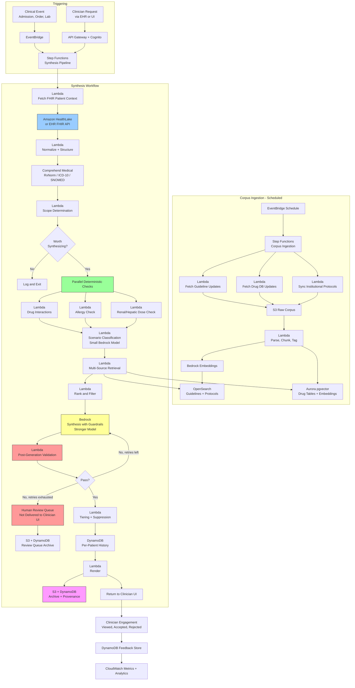

# Recipe 2.9 Architecture and Implementation: Clinical Decision Support Synthesis

*Companion to [Recipe 2.9: Clinical Decision Support Synthesis](chapter02.09-clinical-decision-support-synthesis). This page covers the AWS architecture, services, prerequisites, and pseudocode. For the problem framing and the conceptual approach, start with the main recipe.*

---

## The AWS Implementation

### Why These Services

**Amazon Bedrock for LLM inference and embeddings.** Two model tiers again. A cheaper fast model (Claude Haiku, Nova Lite, or equivalent) handles scenario classification, retrieval query planning, structured-fact extraction, and candidate re-ranking. A stronger model (Claude Sonnet or equivalent) produces the final synthesis with reasoning and citations. For embeddings, Amazon Titan Text Embeddings or Cohere Embed are the usual starting points; a specialized biomedical embedder (self-hosted on SageMaker) may improve retrieval precision on guideline content. The generation model runs with Bedrock Guardrails configured for contextual grounding, content filtering, and PII policies.

**Amazon Bedrock Guardrails for grounding and safety enforcement.** Guardrails' contextual grounding check verifies that the generated output is grounded in the provided context (the retrieved sources). For CDS, grounding enforcement is non-negotiable. Set the contextual grounding threshold at or above 0.85 as a conservative starting point, and tune upward for scenarios where fabrication tolerance is lowest (oncology dosing, anticoagulation management, critical-care empiric antibiotic selection). Re-evaluate the threshold per scenario during clinical validation. Guardrails also applies content filters and can block outputs that include prohibited categories (for example, explicit dosing instructions outside the intended CDS scope). The Guardrail policy itself should also have input-side prompt-attack filters enabled, since retrieved guideline chunks, institutional protocols, drug-database records, and patient-derived note content are untrusted inputs, not verified instructions.

**Amazon Bedrock Knowledge Bases for guideline and protocol retrieval (option A).** For teams who want a managed RAG pipeline over guideline content, Knowledge Bases handles ingestion, chunking, embedding, and retrieval. Good fit when the corpus is guideline PDFs and prose protocols and the retrieval patterns are standard. Supports metadata filtering which is essential for population-specific filtering.

**Amazon OpenSearch Service for hybrid retrieval (option B).** When you need hybrid search (dense-vector plus BM25), custom re-ranking, or fine-grained metadata filtering beyond what Knowledge Bases supports, OpenSearch is the right tool. Most production CDS systems end up here.

**Amazon Aurora PostgreSQL with pgvector for structured-plus-unstructured retrieval (option C).** Aurora is a good fit when a significant portion of the corpus is tabular (drug interactions, dose tables, contraindication lists) and you want JOINs between structured records and vector-embedded prose. The pgvector extension supports vector similarity; combined with SQL's native relational capabilities, you get structured retrieval for drug databases and vector retrieval for guidelines in one store.

**Amazon HealthLake for the FHIR-native patient context.** HealthLake ingests FHIR resources, stores them in a HIPAA-eligible data store, and exposes a FHIR API for queries. For CDS synthesis, HealthLake is a natural home for the patient context layer: pull the relevant resources (Patient, Condition, MedicationRequest, AllergyIntolerance, Observation, Procedure) via the FHIR API, and the structure is already in place for downstream normalization. If your EHR exports FHIR natively (many do) or via a FHIR server (Epic App Orchard, Cerner CareAware Ignite), HealthLake can be the intermediary or you can query the source FHIR API directly.

**Amazon Comprehend Medical for entity extraction and ontology mapping.** Extract entities from the patient context and the clinician's query, then map them to RxNorm (drugs), ICD-10 (conditions), and SNOMED (clinical concepts). These mappings drive structured retrieval against drug databases and filter guideline retrieval by clinical domain.

**Amazon S3 for the corpus, the per-synthesis archive, and structured-database source files.** Raw guideline documents, processed and chunked content, the per-synthesis trace with patient context snapshot and retrieval trace, the structured drug-database source files. SSE-KMS with customer-managed keys. Lifecycle policies to manage cost on the archive (the per-synthesis archive is the regulatory evidence; retain per your institution's policy).

**AWS Lambda for per-stage pipeline logic.** Scenario classification, retrieval orchestration, deterministic safety checks, generation, validation, rendering, archival. Each stage is a Lambda, orchestrated by Step Functions.

**AWS Step Functions for orchestration.** The synthesis workflow has parallelism (multi-source retrieval, parallel safety checks), branching (retry on validation failure, route to review), and dependencies. Step Functions makes the flow visible and debuggable and enables resumable state.

**Amazon DynamoDB for per-synthesis metadata, session state, and clinician engagement tracking.** The synthesis record with references to the S3 archive, the clinician's engagement history with this synthesis (viewed, expanded, accepted, modified, rejected-with-reason), the per-patient synthesis history for alert-fatigue suppression.

**Amazon EventBridge for triggering synthesis on clinical events.** A new admission event, a new medication order event, a new lab result event, each can route to the synthesis pipeline through EventBridge. EventBridge also runs the scheduled ingestion for corpus updates (new guideline releases, drug database updates).

**Amazon API Gateway and Amazon Cognito for the clinician-facing API.** The EHR integration or standalone CDS UI calls into API Gateway with Cognito-authenticated sessions. SMART on FHIR is the emerging standard for EHR-launched apps; if your EHR supports it, the session context (patient, encounter, user) is passed in via OAuth2, and Cognito can federate to the EHR's identity provider.

**AWS Secrets Manager for external API credentials.** Commercial drug database APIs (Lexicomp, First Databank, Surescripts), licensed guideline APIs, and FHIR endpoints all require credentials. Secrets Manager handles storage and rotation.

**AWS CloudTrail, Amazon CloudWatch, and Amazon CloudWatch Logs for audit and monitoring.** Every Bedrock invocation, every retrieval, every recommendation delivered, every clinician interaction. Metrics include latency percentiles, validation pass rates, clinician engagement rates, acceptance rates, and override rates. CloudTrail is the HIPAA audit trail.

**AWS KMS for encryption.** Customer-managed keys for all storage (S3, DynamoDB, OpenSearch, Aurora). Distinct key policies for the corpus (may be less sensitive) and the per-synthesis archive (contains PHI: patient context + synthesized recommendation).

### Architecture Diagram



### Prerequisites

| Requirement | Details |
|-------------|---------|
| **AWS Services** | Amazon Bedrock, Amazon Bedrock Guardrails, Amazon Bedrock Knowledge Bases (optional), Amazon OpenSearch Service or OpenSearch Serverless (for hybrid retrieval of prose sources), Amazon Aurora PostgreSQL with pgvector (for structured drug-database retrieval), Amazon HealthLake (for FHIR-native patient context; optional if querying EHR FHIR directly), Amazon Comprehend Medical, Amazon S3, AWS Lambda, AWS Step Functions, Amazon DynamoDB, Amazon EventBridge, Amazon API Gateway, Amazon Cognito, AWS Secrets Manager, Amazon CloudWatch, AWS CloudTrail, AWS KMS. SageMaker is optional for self-hosted specialized embedding models or medical re-rankers. |
| **IAM Permissions** | `bedrock:InvokeModel`, `bedrock:ApplyGuardrail`, `bedrock:Retrieve` / `bedrock:RetrieveAndGenerate` if using Knowledge Bases, `es:ESHttpPost` / `es:ESHttpGet` for OpenSearch, `rds-data:ExecuteStatement` for Aurora Data API (or database credentials via Secrets Manager), `healthlake:ReadResource`, `healthlake:SearchWithGet`, `comprehendmedical:DetectEntitiesV2`, `comprehendmedical:InferRxNorm`, `comprehendmedical:InferICD10CM`, `comprehendmedical:InferSNOMEDCT`, `s3:GetObject`, `s3:PutObject`, `dynamodb:GetItem`, `dynamodb:PutItem`, `dynamodb:UpdateItem`, `dynamodb:Query`, `states:StartExecution`, `events:PutEvents`, `secretsmanager:GetSecretValue`, `kms:Decrypt`, `kms:GenerateDataKey`. Scope every action to specific resource ARNs. |
| **BAA** | AWS BAA signed. Patient context is PHI throughout. Every service in the pipeline must be HIPAA-eligible and covered under the BAA. The synthesized recommendation contains PHI (it references the patient's conditions, medications, labs). |
| **Bedrock Model Access** | Request access to a capable generation model (Claude Sonnet or equivalent), a cheaper model for classification and planning (Claude Haiku or Nova Lite), and an embedding model (Amazon Titan Text Embeddings v2 or Cohere Embed English v3). Validate retrieval quality with your chosen embedder against a curated guideline corpus before production. |
| **Source Licensing** | Drug interaction databases: Lexicomp, Micromedex, First Databank, and Clinical Pharmacology require licenses with specific redistribution and API-use terms. DDInter and DrugBank are open (DrugBank has research vs commercial distinctions). Clinical guidelines vary: USPSTF and CDC MMWR are freely redistributable; many specialty society guidelines require member or institutional subscriptions. FDA SPLs (package inserts) are public. Document the license for every source and enforce redistribution constraints in the retrieval layer. |
| **Regulatory Review** | Before production, a documented determination of whether the system meets the four-part FDA CDS exemption. Include: scope of use (what clinical decisions the system supports and does not support), UI design decisions that enable independent review, source transparency, clinician acceptance workflow, training and deployment plan. If the determination is "exempt," retain the documentation. If "not exempt," plan for FDA medical device submission pathway, which is substantially more work. |
| **EHR Integration** | For real-time CDS at the point of care, EHR integration matters. SMART on FHIR is the standard for clinician-launched apps; Epic, Cerner, and other major EHRs support it. Alternative integrations include CDS Hooks (a HL7 standard for EHR-triggered CDS calls), HL7 v2 messaging for non-FHIR EHRs, and custom integrations. Evaluate the EHR's FHIR capabilities early; not all EHRs expose the resources a CDS system needs (particularly around real-time labs and active medications). |
| **Encryption** | S3 (corpus, per-synthesis archive): SSE-KMS with customer-managed keys, separate keys for corpus vs PHI archive. DynamoDB: encryption at rest with CMK. OpenSearch: encryption at rest and in transit, fine-grained access control, no public endpoint. Aurora: encryption at rest, SSL/TLS in transit. HealthLake: encryption at rest with CMK. Bedrock and Comprehend Medical: TLS in transit, encryption at rest. Bedrock model-invocation logging (if enabled) contains PHI in the prompt (patient context); log destination must be encrypted to the same standard as the archive. |
| **VPC** | Production: Lambda in private subnets with interface endpoints for Bedrock (Runtime, Agent Runtime if using Knowledge Bases), Bedrock Guardrails, Comprehend Medical, HealthLake, KMS, Secrets Manager, Step Functions, CloudWatch Logs, CloudWatch (monitoring, for `PutMetricData`), and EventBridge. Gateway endpoints for S3 and DynamoDB. Aurora and OpenSearch in VPC with security groups restricting access to the Lambda execution role. Conditionals: if API Gateway is configured as a private REST API (recommended for EHR-internal clinician-facing endpoints), add `execute-api`. If the Aurora Data API path is used (`rds-data:ExecuteStatement`), add `rds-data`; if direct PostgreSQL connection via Secrets Manager is used instead, the in-VPC security-group-restricted Aurora cluster does not require an additional endpoint. Interface endpoints run roughly $7-10/month per AZ per endpoint; reflect this in the cost estimate. |
| **CloudTrail** | Enabled with data events for Bedrock invocations, S3 object access, DynamoDB access, HealthLake reads, and Secrets Manager retrievals. Correlate synthesis events to the requesting clinician identity and the patient identifier via Cognito session claims. |
| **Sample Data** | For development: synthetic patient records (Synthea is the standard synthetic-FHIR generator) combined with a corpus of open guidelines (USPSTF, CDC, HHS) and open drug data (DDInter, DrugBank research). Never use real PHI in dev environments. For evaluation: curated patient-scenario pairs with known correct recommendations, ideally reviewed by clinical domain experts. |
| **Cost Estimate** | Corpus ingestion (one-time per rebuild, typically a few hundred thousand chunks across guidelines and protocols): embeddings cost $50-$400; re-usable as amortized upfront. Per-synthesis cost: patient context fetch and normalization $0.005-$0.02, deterministic safety checks $0.002-$0.01 (mostly compute), scenario classification $0.001-$0.005, multi-source retrieval $0.01-$0.04, synthesis with stronger model $0.08-$0.80 (depends heavily on context size and model choice), validation $0.01-$0.05. End-to-end: $0.15-$1.20 per synthesized recommendation set for typical scenarios. Complex multi-scenario syntheses with broad retrieval and validator retry can approach $2.00 per synthesis; budget at scale assuming an average around $0.50 with a long tail to $2.00. At 500 syntheses per day, variable cost runs $75-$600/day. Fixed infrastructure (OpenSearch cluster, Aurora, HealthLake baseline) adds $500-$3,500/month depending on scale. |

### Ingredients

| AWS Service | Role |
|------------|------|
| **Amazon Bedrock (generation)** | Synthesis with a capable model; scenario classification and retrieval planning with a cheaper model |
| **Amazon Bedrock (embeddings)** | Titan or Cohere embeddings for guideline and protocol indexing |
| **Amazon Bedrock Guardrails** | Contextual grounding check, PII policy, content filters on the synthesized recommendation |
| **Amazon Bedrock Knowledge Bases (optional)** | Managed RAG pipeline for guideline content when fine control isn't needed |
| **Amazon OpenSearch Service** | Hybrid retrieval of guidelines and protocols: vectors + BM25 + metadata filters |
| **Amazon Aurora PostgreSQL + pgvector** | Structured drug database (interactions, dosing tables, contraindications) with vector search for associated prose |
| **Amazon HealthLake** | FHIR-native store for patient context; clean API for downstream pipeline stages |
| **Amazon Comprehend Medical** | Entity extraction and ontology mapping (RxNorm, ICD-10, SNOMED) for patient context and clinical queries |
| **Amazon S3** | Corpus storage, per-synthesis archive, retrieval traces, audit artifacts |
| **AWS Lambda** | Per-stage pipeline logic for synthesis and ingestion |
| **AWS Step Functions** | Synthesis workflow orchestration and ingestion workflow |
| **Amazon DynamoDB** | Per-synthesis metadata, per-patient synthesis history, clinician engagement tracking |
| **Amazon EventBridge** | Clinical-event triggers, scheduled corpus ingestion |
| **Amazon API Gateway + Cognito** | Authenticated clinician-facing API (SMART on FHIR if EHR-launched) |
| **AWS Secrets Manager** | Credentials for commercial drug databases, FHIR APIs, licensed content |
| **AWS KMS** | Encryption key management with distinct keys for PHI-containing stores |
| **Amazon CloudWatch + CloudTrail** | Operational metrics, HIPAA audit logs, regulatory evidence trail |

### Code

#### Walkthrough

**Step 1: Trigger and fetch patient context.** A clinical event arrives through EventBridge, or a clinician submits a request through the UI. The first job is to pull the patient's current state as a FHIR bundle. The bundle is the basis for everything downstream.

```text
FUNCTION trigger_synthesis(trigger):
    // trigger.type: "admission", "medication_order", "lab_result", "clinician_request", etc.
    // trigger.patient_id: FHIR Patient ID
    // trigger.encounter_id: FHIR Encounter ID (when applicable)
    // trigger.clinician_id: Cognito user ID for audit trail
    // trigger.context: trigger-specific payload (order being placed, lab value, etc.)

    // Derive the synthesis_id deterministically from an event key so that
    // EventBridge at-least-once redelivery does not produce duplicate
    // synthesis runs. The DynamoDB conditional write below is the idempotency
    // gate; a duplicate trigger fails the condition and short-circuits.
    event_key = build_event_key(trigger)
        // For admission: f"{patient_id}:{encounter_id}:admission_synthesis"
        // For medication_order: f"{patient_id}:{order_id}:med_order_review"
        // For lab_result: f"{patient_id}:{lab_observation_id}:lab_triggered"
        // For clinician_request: include a request UUID provided by the UI
    synthesis_id = deterministic_hash(event_key)

    // Create the synthesis record early for traceability. The conditional
    // expression rejects a duplicate delivery before any downstream work runs.
    TRY:
        write to DynamoDB table "cds-syntheses":
            synthesis_id    = synthesis_id
            trigger_type    = trigger.type
            patient_id      = trigger.patient_id
            encounter_id    = trigger.encounter_id
            clinician_id    = trigger.clinician_id
            status          = "FETCHING_CONTEXT"
            initiated_at    = current UTC timestamp
            condition_expression = "attribute_not_exists(synthesis_id)"
    CATCH ConditionalCheckFailedException:
        // Duplicate trigger; the original synthesis is in flight or complete.
        RETURN { status: "DUPLICATE_SUPPRESSED", synthesis_id: synthesis_id }

    // Step Functions execution name = synthesis_id; a second invocation
    // with the same name fails with ExecutionAlreadyExists, which is a
    // second layer of idempotency at the orchestration boundary.

    // Pull relevant FHIR resources. The resource set depends on the trigger and scope.
    // For a broad synthesis (new admission, general decision support), pull broadly.
    // For a scoped synthesis (drug interaction check on a specific order), pull narrowly.
    resource_types = determine_resource_types_for_trigger(trigger)
    // Common set: Patient, Encounter, Condition (active), MedicationRequest (active),
    //             AllergyIntolerance, Observation (recent labs + vitals), Procedure (recent),
    //             DocumentReference (recent notes if needed), ImmunizationStatus if relevant

    patient_bundle = call HealthLake.SearchResources with:
        resource_types = resource_types
        patient_id     = trigger.patient_id
        filters        = { recency_windows_by_type }

    // If EHR FHIR is queried directly instead of HealthLake:
    // patient_bundle = call EHR_FHIR_API.search with OAuth2 token (SMART on FHIR)

    update DynamoDB: synthesis_id with
        status = "CONTEXT_FETCHED"
        context_bundle_size = length(patient_bundle.entry)

    RETURN {
        synthesis_id: synthesis_id,
        patient_bundle: patient_bundle,
        trigger: trigger
    }
```

**Step 2: Normalize and structure patient facts.** Turn the FHIR bundle into a compact structured object with standardized terminology bindings. Compute derived values (eGFR, Child-Pugh, BMI) that many guidelines key on. Normalization is deterministic; do it in Lambda with a clear schema.

```text
FUNCTION normalize_patient_context(patient_bundle):

    patient_resource = find_resource(patient_bundle, type="Patient")

    demographics = {
        age: calculate_age(patient_resource.birthDate),
        sex_assigned: patient_resource.gender,
        weight_kg: most_recent_observation(patient_bundle, loinc="29463-7"),
        height_cm: most_recent_observation(patient_bundle, loinc="8302-2"),
        pregnancy_status: pregnancy_status_if_applicable(patient_bundle)
    }

    // Active problems, coded to SNOMED and/or ICD-10
    active_conditions = empty list
    FOR each cond in find_resources(patient_bundle, type="Condition"):
        IF cond.clinicalStatus includes "active":
            append {
                snomed_code: extract_snomed(cond.code),
                icd10_code: extract_icd10(cond.code),
                display: cond.code.text,
                onset: cond.onsetDateTime,
                severity: cond.severity
            } to active_conditions

    // Current medications, coded to RxNorm
    current_medications = empty list
    FOR each med_req in find_resources(patient_bundle, type="MedicationRequest"):
        IF med_req.status == "active":
            append {
                rxnorm_code: extract_rxnorm(med_req.medication),
                display: med_req.medication.text,
                dose_text: med_req.dosageInstruction[0].text,
                dose_quantity: med_req.dosageInstruction[0].doseAndRate[0].doseQuantity,
                frequency: parse_frequency(med_req.dosageInstruction[0].timing),
                route: med_req.dosageInstruction[0].route,
                prescribed_on: med_req.authoredOn
            } to current_medications

    // Allergies
    allergies = empty list
    FOR each allergy in find_resources(patient_bundle, type="AllergyIntolerance"):
        append {
            substance_rxnorm: extract_rxnorm(allergy.code),
            display: allergy.code.text,
            reaction_severity: allergy.reaction[0].severity if present,
            reaction_type: allergy.reaction[0].manifestation if present
        } to allergies

    // Recent labs: creatinine, liver function, sodium, potassium, hemoglobin,
    // platelets, INR, etc.
    relevant_loincs = {
        creatinine: "2160-0",
        ast: "1920-8",
        alt: "1742-6",
        total_bilirubin: "1975-2",
        sodium: "2951-2",
        potassium: "2823-3",
        hemoglobin: "718-7",
        platelets: "777-3",
        inr: "6301-6",
        troponin_high_sens:"67151-1"
    }
    recent_labs = dict
    FOR each name, loinc in relevant_loincs:
        recent_labs[name] = most_recent_observation(patient_bundle, loinc=loinc,
                                                    within_days=14)

    // Derived values
    derived = {
        egfr_ckd_epi: calculate_egfr_ckd_epi_2021(demographics, recent_labs.creatinine),
        bmi: calculate_bmi(demographics.weight_kg, demographics.height_cm),
        child_pugh: calculate_child_pugh(recent_labs) if hepatic_labs_complete,
        corrected_qt: calculate_qtc(recent_observations_for_ecg)
                           if recent_ecg_present else null,
        pack_years: calculate_pack_years(social_history) if smoking_history_present
    }

    structured_context = {
        demographics: demographics,
        active_conditions: active_conditions,
        current_medications: current_medications,
        allergies: allergies,
        recent_labs: recent_labs,
        derived: derived
    }

    RETURN structured_context
```

> **PHI minimization before the synthesis prompt.** The `structured_context` returned above carries fields a downstream prompt does not need to reason effectively. Before serialization into the Step 8 generation prompt, strip identifiers that are not load-bearing for clinical reasoning. Keep age band (instead of DOB), sex when clinically relevant, active problems with SNOMED/ICD-10 codes, current medications (drug, dose, frequency, route), allergies, derived values (eGFR, BMI, Child-Pugh, QTc), and recent lab values with LOINC codes. Drop MRN, DOB, name, address, phone, email, payer or member IDs, prescriber NPIs, and encounter-linked identifiers. Bedrock is HIPAA-eligible under the BAA, but minimum-necessary applies inside the BAA boundary, and unnecessary identifiers expand the model-invocation-logging PHI surface that the Encryption row already calls out as a sensitive store. The rendered output reattaches the synthesis to the patient via the `synthesis_id`/`patient_id` pointer; identifiers do not need to round-trip through the prompt.

**Step 3: Scope determination.** Not every trigger should produce a synthesis. A refill of chronic metformin probably doesn't. A new admission with sepsis does. The scope gate is cheap; skipping unnecessary syntheses is the biggest lever against alert fatigue.

```text
FUNCTION determine_scope(trigger, structured_context, recent_synthesis_history):

    // Cheap rule-based gating first; LLM-based gating for edge cases
    scope_decision = {
        synthesize: false,
        reason: "",
        scenarios: empty list   // specific clinical scenarios to address
    }

    // Check for recent identical synthesis on this patient in this encounter
    for recent in recent_synthesis_history:
        IF recent.trigger_signature == trigger.signature
           AND recent.age_minutes < SUPPRESSION_WINDOW_MINUTES:
            scope_decision.reason = "recently_synthesized_identical"
            RETURN scope_decision   // don't re-synthesize

    // Trigger-type-specific scope rules
    IF trigger.type == "admission":
        IF structured_context.active_conditions is non-trivial
           OR length(structured_context.current_medications) >= 5:
            scope_decision.synthesize = true
            scope_decision.scenarios = derive_admission_scenarios(structured_context)
            scope_decision.reason = "new_admission_with_clinical_complexity"

    ELSE IF trigger.type == "medication_order":
        proposed_med = trigger.context.proposed_medication
        IF is_high_alert_medication(proposed_med)
           OR patient_has_relevant_comorbidities(structured_context, proposed_med):
            scope_decision.synthesize = true
            scope_decision.scenarios = ["new_medication_review"]
            scope_decision.reason = "medication_order_requiring_review"

    ELSE IF trigger.type == "lab_result":
        lab = trigger.context.lab
        IF is_critical_lab(lab)
           OR lab_change_crosses_clinical_threshold(lab, structured_context):
            scope_decision.synthesize = true
            scope_decision.scenarios = derive_lab_triggered_scenarios(lab, structured_context)
            scope_decision.reason = "significant_lab_change"

    ELSE IF trigger.type == "clinician_request":
        scope_decision.synthesize = true
        scope_decision.scenarios = ["clinician_requested"]
        scope_decision.reason = "explicit_clinician_request"

    RETURN scope_decision
```

**Step 4: Deterministic safety checks.** Before the LLM runs, perform the checks that don't need an LLM: drug interactions, allergy screens, renal and hepatic dosing flags, contraindications. These are structured-data operations against drug databases, and their outputs become hard inputs to the generation step.

```text
FUNCTION run_deterministic_safety_checks(structured_context, proposed_medications):
    // proposed_medications: drugs being proposed in this clinical scenario
    //                       (may be empty for a general synthesis; populated for
    //                       medication-order triggers)

    safety_findings = {
        interactions: empty list,
        allergy_conflicts: empty list,
        renal_dose_flags: empty list,
        hepatic_dose_flags: empty list,
        contraindications: empty list,
        duplicate_therapy: empty list
    }

    // Drug-drug interactions: check every pair in (current_meds + proposed_meds)
    all_meds = structured_context.current_medications + proposed_medications
    for i = 0 to length(all_meds):
        for j = i+1 to length(all_meds):
            interaction = query_drug_interaction_db(
                drug_a = all_meds[i].rxnorm_code,
                drug_b = all_meds[j].rxnorm_code
            )
            IF interaction is not null:
                append {
                    drug_a: all_meds[i],
                    drug_b: all_meds[j],
                    severity: interaction.severity,
                    mechanism: interaction.mechanism,
                    clinical_effect: interaction.clinical_effect,
                    management: interaction.management,
                    source: interaction.source_citation
                } to safety_findings.interactions

    // Allergy conflicts: check every proposed med against allergy list
    FOR each proposed in proposed_medications:
        FOR each allergy in structured_context.allergies:
            IF drug_allergy_match(proposed.rxnorm_code, allergy.substance_rxnorm):
                append {
                    drug: proposed,
                    allergy: allergy,
                    match_type: classify_match(proposed, allergy),  // exact, class, cross
                    severity: allergy.reaction_severity
                } to safety_findings.allergy_conflicts

    // Renal dosing: check every proposed med against current eGFR
    current_egfr = structured_context.derived.egfr_ckd_epi
    IF current_egfr is not null:
        FOR each proposed in proposed_medications:
            dose_rec = query_renal_dosing_db(proposed.rxnorm_code, current_egfr)
            IF dose_rec.requires_adjustment
               OR dose_rec.contraindicated_at_this_egfr:
                append {
                    drug: proposed,
                    current_egfr: current_egfr,
                    proposed_dose: proposed.dose_quantity,
                    recommended_dose: dose_rec.recommended_dose,
                    contraindicated: dose_rec.contraindicated_at_this_egfr,
                    source: dose_rec.source_citation
                } to safety_findings.renal_dose_flags

    // Contraindications: check every proposed med against active conditions
    FOR each proposed in proposed_medications:
        FOR each cond in structured_context.active_conditions:
            contraind = query_contraindication_db(
                drug = proposed.rxnorm_code,
                condition_snomed = cond.snomed_code
            )
            IF contraind is not null:
                append {
                    drug: proposed,
                    condition: cond,
                    contraindication_type: contraind.type,  // absolute, relative
                    rationale: contraind.rationale,
                    source: contraind.source_citation
                } to safety_findings.contraindications

    // Duplicate therapy: check for multiple drugs in the same therapeutic class
    FOR each class in pharmacological_classes_of(all_meds):
        meds_in_class = meds in all_meds matching class
        IF length(meds_in_class) > 1:
            append {
                class: class,
                drugs: meds_in_class
            } to safety_findings.duplicate_therapy

    RETURN safety_findings
```

**Step 5: Scenario classification and retrieval planning.** Classify the scenario so retrieval can be focused. For each scenario, build a retrieval plan: which sources to query, which entities to use as keys, which filters to apply.

```text
FUNCTION classify_and_plan(structured_context, scope_decision, safety_findings):

    // Use a small LLM for flexible classification, constrained to an enum
    classification_prompt = """
    You are classifying a clinical scenario to plan information retrieval.
    The patient context and the trigger scenarios are provided. Return a JSON
    array of detailed scenarios, each with:
    - scenario_type: one of [empiric_antibiotic, chronic_disease_management,
                             oncology_therapy_selection, anticoagulation_management,
                             medication_review, dose_adjustment, diagnostic_workup,
                             preventive_care, perioperative_management, end_of_life_care,
                             transition_of_care, other]
    - clinical_domain: one of [infectious_disease, cardiology, oncology, nephrology,
                                endocrinology, primary_care, hospital_medicine, emergency,
                                surgery, pediatrics, obstetrics, psychiatry, other]
    - key_entities: list of drugs, conditions, or findings that are central to the scenario
    - retrieval_queries: list of natural-language queries for retrieval

    PATIENT CONTEXT: {structured_context}
    TRIGGER SCENARIOS: {scope_decision.scenarios}
    SAFETY FINDINGS: {safety_findings}
    """

    classification = call Bedrock.InvokeModel with:
        model_id    = SMALL_MODEL_ID         // e.g., Claude Haiku, Nova Lite
        prompt      = classification_prompt
        max_tokens  = 1500
        temperature = 0.0

    scenarios = parse JSON from classification

    // For each scenario, build a structured retrieval plan
    retrieval_plans = empty list
    FOR each scenario in scenarios:
        plan = {
            scenario: scenario,
            guideline_queries: expand_for_retrieval(scenario.retrieval_queries),
            drug_db_lookups: derive_drug_db_lookups(scenario.key_entities, structured_context),
            protocol_searches: derive_institutional_protocol_searches(scenario),
            metadata_filters: {
                clinical_domain: scenario.clinical_domain,
                population_tags: derive_population_tags(structured_context),
                recency_window: recency_for_domain(scenario.clinical_domain),
                source_tiers: preferred_source_tiers(scenario.scenario_type)
            }
        }
        append plan to retrieval_plans

    RETURN retrieval_plans
```

**Step 6: Multi-source retrieval.** Parallel retrieval against the different source stores. Structured queries against drug databases, hybrid retrieval against guidelines and protocols, formulary lookup if available.

```text
FUNCTION multi_source_retrieval(retrieval_plans):

    results_per_scenario = dict

    FOR each plan in retrieval_plans:
        scenario_id = plan.scenario.id
        results_per_scenario[scenario_id] = {
            guideline_chunks: empty list,
            protocol_chunks: empty list,
            drug_db_records: empty list,
            formulary: empty list
        }

        // Guideline retrieval: hybrid search against OpenSearch
        FOR each query in plan.guideline_queries:
            query_embedding = call Bedrock.InvokeModel with:
                model_id = EMBEDDING_MODEL_ID    // e.g., Titan Text Embeddings v2
                input    = query

            guideline_results = call OpenSearch.search with:
                index         = "guidelines"
                query_vector  = query_embedding
                keyword_query = build_bm25_query_from_entities(plan.scenario.key_entities),
                filters       = plan.metadata_filters
                size          = 30

            append guideline_results to results_per_scenario[scenario_id].guideline_chunks

        // Protocol retrieval: hybrid search against the institutional protocols index
        FOR each query in plan.protocol_searches:
            protocol_results = call OpenSearch.search with:
                index        = "institutional-protocols"
                query        = query
                size         = 10

            append protocol_results to results_per_scenario[scenario_id].protocol_chunks

        // Drug database: structured SQL queries against Aurora
        FOR each lookup in plan.drug_db_lookups:
            IF lookup.type == "interaction":
                rows = call Aurora.execute_sql:
                    "SELECT * FROM drug_interactions
                     WHERE (drug_a = %s AND drug_b = %s)
                        OR (drug_a = %s AND drug_b = %s)"
                    params = (lookup.drug_a, lookup.drug_b, lookup.drug_b, lookup.drug_a)
                append rows to results_per_scenario[scenario_id].drug_db_records

            ELSE IF lookup.type == "renal_dosing":
                rows = call Aurora.execute_sql:
                    "SELECT * FROM renal_dosing
                     WHERE rxnorm_code = %s AND egfr_lower <= %s AND egfr_upper > %s"
                    params = (lookup.drug, lookup.egfr, lookup.egfr)
                append rows to results_per_scenario[scenario_id].drug_db_records

            ELSE IF lookup.type == "contraindication":
                rows = call Aurora.execute_sql:
                    "SELECT * FROM contraindications
                     WHERE rxnorm_code = %s AND snomed_code = %s"
                    params = (lookup.drug, lookup.condition)
                append rows to results_per_scenario[scenario_id].drug_db_records

        // Formulary lookup (if configured)
        IF formulary_integration_enabled:
            formulary = call formulary_service.check(
                patient_insurance = structured_context.demographics.insurance,
                drugs = plan.scenario.key_entities.drugs
            )
            results_per_scenario[scenario_id].formulary = formulary

    RETURN results_per_scenario
```

**Step 7: Rank and filter retrieved items.** Rank retrieved guideline and protocol chunks by a combination of source authority, recency, and patient-specificity. Structured drug-DB records don't need ranking (they are deterministic lookups); they flow directly into the generation context.

```text
FUNCTION rank_and_filter(results_per_scenario, structured_context):

    FOR each scenario_id, results in results_per_scenario:
        // Rank guideline chunks
        FOR each chunk in results.guideline_chunks:
            chunk.authority_score = score_authority(chunk.source_type, chunk.issuing_body)
            // Institutional protocol > Society guideline > Narrative review > Package insert
            chunk.recency_score = score_recency(chunk.publication_year)
            // Recent (last 3 years) gets higher score; older gets lower
            chunk.specificity_score = score_patient_specificity(chunk, structured_context)
            // Matching population, comorbidity profile, severity
            chunk.combined_score = weight_sum(chunk.authority_score,
                                              chunk.recency_score,
                                              chunk.specificity_score,
                                              chunk.vector_score)

        results.guideline_chunks = sort_desc(results.guideline_chunks, by="combined_score")
        results.guideline_chunks = take_top(results.guideline_chunks, n=15)

        // Same ranking pattern for protocol chunks
        FOR each chunk in results.protocol_chunks:
            chunk.combined_score = weight_sum(chunk.authority_score,
                                              chunk.specificity_score,
                                              chunk.vector_score)
        results.protocol_chunks = sort_desc(results.protocol_chunks, by="combined_score")
        results.protocol_chunks = take_top(results.protocol_chunks, n=10)

        // Drug DB records flow through unranked (they are authoritative structured lookups)

    RETURN results_per_scenario
```

**Step 8: Grounded synthesis.** Build the generation prompt with patient context, retrieved sources, and the deterministic safety findings. The prompt enforces citation discipline, reasoning visibility, and framing as options rather than directives.

```text
FUNCTION generate_synthesis(structured_context, retrieval_results, safety_findings,
                             scope_decision):

    // Format retrieval items with identifiers the model will cite
    sources_block = ""
    source_id = 1
    id_to_source = dict

    FOR each scenario_id, results in retrieval_results:
        FOR each chunk in results.guideline_chunks:
            source_tag = f"[src_{source_id}]"
            sources_block += f"{source_tag} (Type: Guideline, Issuer: {chunk.issuing_body}, "
                           + f"Year: {chunk.publication_year}, "
                           + f"Section: {chunk.section}, Tier: {chunk.evidence_tier})\n"
                           + f"Content: {chunk.text}\n\n"
            id_to_source[source_id] = chunk
            source_id += 1

        FOR each chunk in results.protocol_chunks:
            source_tag = f"[src_{source_id}]"
            sources_block += f"{source_tag} (Type: Institutional Protocol, "
                           + f"Name: {chunk.protocol_name}, Version: {chunk.version})\n"
                           + f"Content: {chunk.text}\n\n"
            id_to_source[source_id] = chunk
            source_id += 1

        FOR each record in results.drug_db_records:
            source_tag = f"[src_{source_id}]"
            sources_block += f"{source_tag} (Type: {record.type}, Source: {record.db_source})\n"
                           + f"Record: {serialize_structured_record(record)}\n\n"
            id_to_source[source_id] = record
            source_id += 1

    // Format deterministic safety findings distinctly; these MUST appear in the synthesis
    safety_block = format_safety_findings_for_prompt(safety_findings)

    synthesis_prompt = """
    You are producing a clinical decision support synthesis for a practicing clinician.
    The synthesis will be displayed alongside the sources you cite. The clinician is
    the decision-maker; your output describes options, evidence, and considerations.
    You do not prescribe or direct.

    HARD REQUIREMENTS:
    - Every recommendation or factual claim must cite at least one source by identifier
      (e.g., [src_5]). Do not invent citations. Do not use sources not listed below.
    - Preserve exact wording for drug names, doses, frequencies, and numerical thresholds.
      Do not paraphrase dosing. Quote it verbatim from the cited source.
    - Include every item from the SAFETY FINDINGS block below in the output. None may be
      omitted. If a safety finding applies to a recommendation you make, surface it
      next to that recommendation.
    - Frame recommendations as options with clear trade-offs, not as directives.
      Use language like "Option A involves...", "Consider...", "The guideline supports..."
      Do not use language like "You should...", "Administer...", "Give..." for your own voice.
      (Verbatim guideline quotes may include directive language; preserve them as quotes.)
    - When sources disagree, surface the disagreement. List each source's position separately.
      Do not collapse competing recommendations into a false consensus.
    - When the retrieved sources do not directly address a scenario, say so explicitly.
      "The retrieved sources do not directly address [scenario]. The closest related
      guidance is..." Do not extrapolate beyond what the sources support.
    - Include an uncertainty assessment for each recommendation: how directly the retrieved
      evidence addresses this specific patient, and where judgment is required.
    - Do not recommend actions outside the intended CDS scope: {scope_decision.intended_scope}.
    - Indicate population alignment: does the cited evidence reflect a population similar
      to this patient?

    STRUCTURE: Return a JSON object with:
    {
      "overall_assessment": "2-4 sentence summary of the clinical situation",
      "recommendations": [
        {
          "title": "Recommendation title",
          "recommendation_text": "Description of the option",
          "reasoning": "Why this option is supported by the sources",
          "source_citations": ["src_N", ...],
          "evidence_directness": "direct" | "extrapolated" | "insufficient",
          "population_alignment": "matches" | "partial" | "mismatch" | "unknown",
          "tier": "critical" | "important" | "informational",
          "caveats": "specific caveats, trade-offs, or prerequisites"
        }
      ],
      "safety_findings_included": [
        { "finding": "description", "source_citations": [...], "where_in_output": "which recommendation or standalone" }
      ],
      "competing_recommendations": [
        { "description": "disagreement between sources",
          "position_a": { "text": "...", "sources": [...] },
          "position_b": { "text": "...", "sources": [...] } }
      ],
      "what_to_ask_or_check": [ "questions the clinician should consider" ],
      "insufficient_evidence_items": [ "things the retrieved sources do not address" ],
      "overall_uncertainty": "low" | "moderate" | "high",
      "uncertainty_rationale": "brief explanation of uncertainty level"
    }

    PATIENT CONTEXT:
    {structured_context}

    SCENARIOS IN SCOPE:
    {scope_decision.scenarios}

    SAFETY FINDINGS (must all be included in output):
    {safety_block}

    RETRIEVED SOURCES:
    {sources_block}
    """

    response = call Bedrock.InvokeModel with:
        model_id      = SYNTHESIS_MODEL_ID    // e.g., Claude Sonnet
        prompt        = synthesis_prompt
        max_tokens    = 4500
        temperature   = 0.2
        guardrail_id  = CDS_GUARDRAIL_ID
        // Guardrails configured with:
        // - Contextual grounding check at threshold >= 0.85 (tune upward
        //   for scenarios where fabrication tolerance is lowest). Source
        //   context = sources_block + safety_block, tagged with the
        //   Guardrails API so grounding check runs against the
        //   authoritative content only (not the prompt instructions).
        // - Input-side prompt-attack filters enabled on the Guardrail
        //   policy itself. Retrieved guideline chunks, institutional
        //   protocols, drug-database records, and patient-derived note
        //   content are untrusted-input surfaces, not verified
        //   instructions; the policy filters defend against retrieved-text
        //   injection at the input boundary.
        // - Content filters enabled.
        // - PII policy that allows medical content but flags unexpected
        //   identifier patterns.
        // - Custom denied-topics list including prescriptive directive
        //   language outside of verbatim quoted guidelines.

    // Check Guardrail intervention (amazon-bedrock-guardrailAction field in response)
    IF response.guardrail_action == "INTERVENED":
        RETURN { status: "GROUNDING_REJECTED",
                 guardrail_trace: response.guardrail_trace }

    synthesis_json = parse JSON from response

    RETURN { status: "GENERATED",
             synthesis: synthesis_json,
             id_to_source: id_to_source,
             sources_count: source_id - 1 }
```

**Step 9: Post-generation validation.** Belt-and-suspenders on Guardrails. For every recommendation, verify citations point to retrieved sources. For every dose, verify the value appears verbatim in a retrieved structured record. Verify that every safety finding appears in the synthesis. Verify that no recommendation contradicts a contraindication from the retrieval.

```text
FUNCTION validate_synthesis(synthesis, id_to_source, safety_findings,
                             structured_context, retry_count):

    unverified = empty list

    // 1. Every citation must point to a valid source ID
    FOR each rec in synthesis.recommendations:
        FOR each cit in rec.source_citations:
            cit_id = parse_source_id(cit)   // strip "src_" prefix, parse int
            IF cit_id not in id_to_source:
                append { rec: rec.title, reason: "citation_not_in_retrieved_set",
                         citation: cit } to unverified

        IF length of rec.source_citations == 0:
            append { rec: rec.title,
                     reason: "recommendation_without_citations" } to unverified

    // 2. Dose verbatim check: any dose in the synthesis must appear verbatim in
    //    a cited structured drug-DB record
    dose_pattern = regex for drug doses (e.g., "\d+\s*(mg|g|mcg|units)" with frequency)
    FOR each rec in synthesis.recommendations:
        doses_mentioned = extract_doses(rec.recommendation_text)
        FOR each dose in doses_mentioned:
            found_in_cited = false
            FOR each cit_id in rec.source_citations:
                source = id_to_source[cit_id]
                IF source is a drug_db_record:
                    IF dose verbatim in source.content:
                        found_in_cited = true
                        BREAK
            IF NOT found_in_cited:
                append { rec: rec.title, reason: "dose_not_in_structured_source",
                         dose: dose } to unverified

    // 3. Every deterministic safety finding must be represented in the synthesis
    all_safety_items = safety_findings.interactions
                       + safety_findings.allergy_conflicts
                       + safety_findings.renal_dose_flags
                       + safety_findings.hepatic_dose_flags
                       + safety_findings.contraindications
                       + safety_findings.duplicate_therapy

    FOR each item in all_safety_items:
        representation = find_representation_in_synthesis(item, synthesis)
        IF representation is null:
            append { reason: "safety_finding_not_represented", item: item } to unverified

    // 4. No recommendation may propose a drug that the safety findings list
    //    as contraindicated or allergic
    FOR each rec in synthesis.recommendations:
        drugs_in_rec = extract_drug_mentions(rec.recommendation_text)
        FOR each drug in drugs_in_rec:
            IF drug in drugs_with_contraindication(safety_findings):
                IF NOT rec has explicit_contraindication_acknowledgment:
                    append { rec: rec.title, reason: "contradicts_contraindication",
                             drug: drug } to unverified
            IF drug in drugs_with_allergy_conflict(safety_findings):
                IF NOT rec has explicit_allergy_acknowledgment:
                    append { rec: rec.title, reason: "contradicts_allergy",
                             drug: drug } to unverified

    // 5. Check for prescriptive directive language in the model's own voice
    //    (verbatim quotes from guidelines may be directive; the model's own voice must not be)
    directive_phrases = ["you should", "administer", "give", "prescribe", "start", "stop",
                         "change to", "switch to"]  // context-aware: these may be fine
                                                    // in quoted guideline text, NOT in
                                                    // the model's own narration
    FOR each rec in synthesis.recommendations:
        model_voice_text = extract_unquoted_text(rec.recommendation_text)
        FOR each phrase in directive_phrases:
            IF phrase in model_voice_text AND phrase not in_quoted_guideline:
                append { rec: rec.title, reason: "directive_language_in_model_voice",
                         phrase: phrase } to unverified

    // 6. Scope compliance: the recommendations must stay within the intended CDS scope
    FOR each rec in synthesis.recommendations:
        IF recommendation_out_of_scope(rec, intended_scope):
            append { rec: rec.title, reason: "out_of_scope" } to unverified

    IF length(unverified) == 0:
        RETURN { status: "VALIDATED" }

    IF retry_count < 2:
        RETURN { status: "RETRY_NEEDED",
                 unverified: unverified,
                 suggested_prompt_augmentation: build_strict_augmentation(unverified) }

    // Retries exhausted; route to human review
    RETURN { status: "VALIDATION_EXHAUSTED_ROUTED_TO_REVIEW",
             unverified: unverified }
```

**Step 9.5: Orchestration gate between validation and delivery.** This is not a separate Lambda; it is the branch the orchestrator (Step Functions) takes after Step 9 returns. The distinction is non-negotiable: only `VALIDATED` (and `NO_EVIDENCE`, where the system explicitly declined to synthesize) proceed to tier/suppress/render and `status = DELIVERED`. `VALIDATION_EXHAUSTED_ROUTED_TO_REVIEW` is a terminal state that writes the trace for audit and routes to a human-review queue without surfacing anything to the clinician UI.

```text
// Orchestrator branch on validation result
IF validation_result.status == "VALIDATED":
    proceed to Step 10 (tier_suppress_render) and Step 11 (archive_and_log
                       with status = "DELIVERED")

ELSE IF validation_result.status == "NO_EVIDENCE":
    // System explicitly declined to synthesize because retrieval found
    // nothing relevant; render a "no synthesis available" payload and
    // archive with status = "NO_EVIDENCE_DELIVERED" (not the same as
    // "DELIVERED" with a synthesis).
    proceed to a constrained no-evidence render path

ELSE IF validation_result.status == "VALIDATION_EXHAUSTED_ROUTED_TO_REVIEW":
    // Terminal state. The synthesis failed validation after MAX_RETRIES
    // for one or more of: citation_not_in_retrieved_set,
    // dose_not_in_structured_source, safety_finding_not_represented,
    // contradicts_contraindication, contradicts_allergy,
    // directive_language_in_model_voice, out_of_scope.
    //
    // Persist the trace for audit (KMS-encrypted, distinct S3 prefix from
    // delivered syntheses), update DynamoDB with status =
    // "ROUTED_TO_REVIEW", and enqueue to a clinical reviewer queue
    // (SQS or DynamoDB stream). Do NOT call tier_suppress_render and do
    // NOT call archive_and_log with status = "DELIVERED".
    write_review_queue_artifact(synthesis_id, validation_result, raw_model_output,
                                trace, kms_key=REVIEW_QUEUE_CMK_ARN)
    update DynamoDB: synthesis_id with status = "ROUTED_TO_REVIEW"
    enqueue to clinical reviewer queue
    RETURN { status: "ROUTED_TO_REVIEW", synthesis_id: synthesis_id }
```

**Step 10: Tier, suppress, and render.** Score the synthesis against the patient's prior engagement history for alert-fatigue suppression. If nothing material is new, suppress or downgrade. Otherwise, render with reasoning foregrounded, sources one click away, uncertainty explicit.

```text
FUNCTION tier_suppress_render(synthesis, structured_context, patient_id, encounter_id,
                               id_to_source):

    // Look up prior syntheses for this patient in this encounter
    prior = query_dynamo(table="cds-syntheses",
                         filter={ patient_id, encounter_id,
                                  status in ["DELIVERED", "SUPPRESSED_MINOR_UPDATE"] })

    // For each recommendation, determine if it is new/changed relative to prior
    FOR each rec in synthesis.recommendations:
        rec.delivery_tier = determine_delivery_tier(rec, prior)
        // Possible tiers:
        // - "new_critical": critical and not previously surfaced
        // - "new_important": important and not previously surfaced
        // - "changed": previously surfaced but material change
        // - "acknowledged": previously acknowledged; suppress unless changed
        // - "rejected": previously rejected; suppress with logging

    // If all recommendations are in suppressed tiers, flag the synthesis as minor-update-only
    active_recommendations = [r for r in synthesis.recommendations
                              if r.delivery_tier not in ["acknowledged", "rejected"]]
    IF length(active_recommendations) == 0:
        // Nothing new to surface; log and don't disrupt clinician
        update DynamoDB: synthesis_id with status = "SUPPRESSED_MINOR_UPDATE"
        RETURN { status: "SUPPRESSED", reason: "no_new_material" }

    // Render: replace source_id citations with numbered references
    rendered_recommendations = empty list
    bibliography = empty list
    numbered = dict
    next_num = 1

    FOR each rec in active_recommendations:
        rendered_rec = copy rec
        FOR each cit in rec.source_citations:
            cit_id = parse_source_id(cit)
            IF cit_id not in numbered:
                numbered[cit_id] = next_num
                source = id_to_source[cit_id]
                append {
                    number: next_num,
                    formatted: format_source(source),
                    link: source_link(source),
                    source_type: source.source_type,
                    source_authority_tier: source.tier
                } to bibliography
                next_num += 1
            rendered_rec.recommendation_text = replace(rendered_rec.recommendation_text,
                                                        cit, f"[{numbered[cit_id]}]")
            rendered_rec.reasoning = replace(rendered_rec.reasoning,
                                              cit, f"[{numbered[cit_id]}]")
        append rendered_rec to rendered_recommendations

    rendered = {
        synthesis_id: synthesis.synthesis_id,
        patient_id: patient_id,
        encounter_id: encounter_id,
        overall_assessment: synthesis.overall_assessment,
        recommendations: rendered_recommendations,
        safety_findings: synthesis.safety_findings_included,
        competing: synthesis.competing_recommendations,
        to_ask_or_check: synthesis.what_to_ask_or_check,
        insufficient_evidence: synthesis.insufficient_evidence_items,
        overall_uncertainty: synthesis.overall_uncertainty,
        uncertainty_rationale: synthesis.uncertainty_rationale,
        bibliography: bibliography,
        disclaimer: "This is a decision support synthesis. Review the sources "
                             + "before acting. The clinician is the decision-maker."
    }

    RETURN { status: "RENDERED", rendered: rendered }
```

**Step 11: Archive and emit engagement hooks.** Persist the full provenance for audit, regulatory evidence, and feedback. Emit metrics. Register engagement-capture endpoints for the clinician UI.

```text
FUNCTION archive_and_log(synthesis_id, rendered, trace, clinician_id, patient_id):

    // Persist the full trace to S3 with KMS encryption
    write to S3: f"syntheses/{synthesis_id}/rendered.json" = rendered
    write to S3: f"syntheses/{synthesis_id}/trace.json" = {
        trigger: trace.trigger,
        patient_context_hash: hash(trace.structured_context),
        // Do not store the raw patient context in a long-retention bucket if policy
        // requires; store a secure reference with TTL instead
        retrieval_plans: trace.retrieval_plans,
        retrieved_source_ids: trace.retrieved_source_ids,
        safety_findings: trace.safety_findings,
        prompt_version: trace.prompt_version,
        model_id: trace.model_id,
        raw_model_output: trace.raw_model_output,
        validation_result: trace.validation_result,
        tiering_decision: trace.tiering_decision,
        generated_at: trace.generated_at,
        clinician_id: clinician_id,
        patient_id: patient_id
    }

    // Update the DynamoDB record
    update DynamoDB table "cds-syntheses": synthesis_id with
        status           = "DELIVERED"
        rendered_s3_key  = f"syntheses/{synthesis_id}/rendered.json"
        trace_s3_key     = f"syntheses/{synthesis_id}/trace.json"
        delivered_at     = current UTC timestamp
        uncertainty_tier = rendered.overall_uncertainty
        num_recommendations = length(rendered.recommendations)

    // CloudWatch metrics
    emit CloudWatch metric:
        namespace   = "ClinicalDecisionSupport"
        metric_name = "SynthesisDelivered"
        dimensions  = { scenario_type, clinical_domain, uncertainty_tier }

    emit CloudWatch metric:
        namespace   = "ClinicalDecisionSupport"
        metric_name = "SafetyFindingsSurfaced"
        value       = count_safety_findings(rendered)
        dimensions  = { finding_type }

    // Register feedback/engagement endpoints for the clinician UI
    feedback_token = issue_feedback_token(synthesis_id, clinician_id, expires_in_hours=72)

    RETURN { rendered: rendered, feedback_token: feedback_token }
```

> **Curious how this looks in Python?** The pseudocode above covers the concepts. If you'd like to see sample Python code that demonstrates these patterns using boto3, check out the [Python Example](chapter02.09-python-example). It walks through each step with inline comments and notes on what you'd need to change for a real deployment.

### Expected Results

**Sample output for the 2 AM sepsis case from the opening vignette:**

```json
{
  "synthesis_id": "CDS-2026-05-10-55810",
  "patient_id": "pt_abc123",
  "encounter_id": "enc_xyz789",
  "status": "DELIVERED",
  "overall_assessment": "74-year-old man with presumed urinary source sepsis, notable for eGFR 28 (CKD stage 4), atrial fibrillation on apixaban, HFrEF, sulfa allergy (rash), and history of C. difficile colitis. Empiric antibiotic selection needs to address broad urinary pathogens while respecting renal dosing, considering interaction risk with current medications, and weighing C. diff recurrence risk.",
  "recommendations": [
    {
      "title": "Option A: Piperacillin-tazobactam with renal-adjusted dosing",
      "recommendation_text": "Piperacillin-tazobactam 2.25 g IV every 6 hours (extended infusion over 4 hours) is consistent with [1] dosing recommendations at eGFR 20-40 for serious infections. [2] Option provides broad-spectrum coverage including Pseudomonas, appropriate for nosocomial urinary sepsis per local antibiogram [3].",
      "reasoning": "The institutional sepsis protocol [3] recommends piperacillin-tazobactam as empiric coverage for urinary sepsis with healthcare exposure. Renal dosing at eGFR 20-40 per [1] is 2.25 g IV q6h with extended infusion to optimize time-above-MIC while reducing peak-related nephrotoxicity [2]. No clinically significant interaction with apixaban is listed in the interactions database [4].",
      "source_citations": ["src_1", "src_2", "src_3", "src_4"],
      "evidence_directness": "direct",
      "population_alignment": "matches",
      "tier": "critical",
      "caveats": "C. difficile recurrence risk is increased with any broad-spectrum antibiotic in a patient with prior C. diff history. Consider monitoring and fidaxomicin availability for prophylaxis if clinical concern arises. Not a dose to use for meningitis or non-urinary serious infection."
    },
    {
      "title": "Option B: Cefepime monotherapy with renal dosing",
      "recommendation_text": "Cefepime 1 g IV every 12 hours is consistent with [5] for eGFR 11-29, providing broad-spectrum gram-negative coverage including Pseudomonas. Suitable per [3] as an alternative to piperacillin-tazobactam for urinary sepsis.",
      "reasoning": "Cefepime offers an alternative broad-spectrum beta-lactam with documented efficacy in urinary sepsis [3]. Renal dosing at eGFR 11-29 per [5] is 1 g q12h. Less C. diff risk than piperacillin-tazobactam in some comparative data but the differential is modest [6]. No significant interaction with apixaban listed [4].",
      "source_citations": ["src_3", "src_4", "src_5", "src_6"],
      "evidence_directness": "direct",
      "population_alignment": "matches",
      "tier": "critical",
      "caveats": "Cefepime neurotoxicity risk (encephalopathy, nonconvulsive status) is elevated in CKD even with appropriate renal dosing [5]. Baseline mental status should be documented. Beta-lactam cross-reactivity risk with reported sulfa allergy is minimal (sulfa allergies are not cross-reactive with beta-lactams) but the clinician should confirm the prior sulfa reaction was not a broader drug-reaction pattern."
    }
  ],
  "safety_findings_included": [
    {
      "finding": "Deterministic interaction check: no clinically significant interactions between apixaban and piperacillin-tazobactam or cefepime per drug interaction database.",
      "source_citations": ["src_4"],
      "where_in_output": "Reasoning blocks of Options A and B"
    },
    {
      "finding": "Deterministic contraindication check: sulfa allergy (rash, not anaphylaxis). No cross-reactivity with beta-lactams per drug reference. Option A and Option B are acceptable.",
      "source_citations": ["src_7"],
      "where_in_output": "Caveats of Option B and standalone below"
    },
    {
      "finding": "Renal dose flag: patient eGFR 28. Piperacillin-tazobactam and cefepime both require renal dose adjustment; dosing above reflects the adjustment per drug database.",
      "source_citations": ["src_1", "src_5"],
      "where_in_output": "Recommendation text of Options A and B"
    },
    {
      "finding": "Elevated C. diff recurrence risk given prior C. diff history two years ago.",
      "source_citations": ["src_6"],
      "where_in_output": "Caveats of Option A; see to_ask_or_check"
    }
  ],
  "competing_recommendations": [
    {
      "description": "Guidelines differ on whether extended-infusion piperacillin-tazobactam should be standard in severe infection with renal dysfunction vs reserved for documented resistant pathogens.",
      "position_a": {
        "text": "Extended infusion preferred for serious gram-negative infections at borderline MICs; may be particularly beneficial with renal dysfunction.",
        "sources": ["src_2"]
      },
      "position_b": {
        "text": "Standard intermittent infusion is acceptable for most serious infections; extended infusion reserved for documented resistant pathogens or institutional protocol.",
        "sources": ["src_8"]
      }
    }
  ],
  "what_to_ask_or_check": [
    "Confirm the nature of the prior sulfa reaction (rash severity, timing, rechallenge history) before proceeding with any sulfonamide-containing therapy (not needed for Options A or B, relevant for trimethoprim-sulfamethoxazole as an oral step-down).",
    "Check most recent urinalysis and urine culture status; adjust antibiotic once culture data returns.",
    "Review prior urine culture results in the chart if available; history of resistant organisms would favor Option A or escalation.",
    "Document baseline mental status if selecting cefepime in CKD (neurotoxicity monitoring).",
    "Consider ID consult given complexity (multiple comorbidities, renal dysfunction, history of C. diff).",
    "Confirm apixaban is appropriate to continue during acute sepsis management or if bridging/holding is clinically indicated; source interactions database does not flag a pharmacologic interaction but sepsis-related changes in hemodynamics or procedures may warrant holding anticoagulation."
  ],
  "insufficient_evidence_items": [
    "Optimal choice between Options A and B for this specific combination of comorbidities (CKD 4 + HFrEF + prior C. diff + sulfa allergy) is not addressed by a single guideline; decision is based on synthesis across sources and clinician judgment."
  ],
  "overall_uncertainty": "moderate",
  "uncertainty_rationale": "Retrieved sources directly address each component (renal dosing, interaction absence, institutional protocol support, C. diff risk), but no single source addresses the full patient profile. Clinical judgment on the Option A vs Option B choice is required, informed by the institutional antibiogram and any prior culture data the clinician can access that was not in the retrieval.",
  "bibliography": [
    { "number": 1, "formatted": "Piperacillin-tazobactam renal dosing table. [Drug Database Reference]. Accessed 2026-05-10.", "source_type": "drug_database", "source_authority_tier": "high", "link": "internal://drugdb/piptazo-renal" },
    { "number": 2, "formatted": "Extended-infusion beta-lactam therapy: institutional pharmacy guidance, 2024. [Institutional Protocol].", "source_type": "protocol", "source_authority_tier": "high", "link": "internal://protocols/ext-infusion-betalactam" },
    { "number": 3, "formatted": "Institutional urinary sepsis empiric antibiotic protocol, rev. 2025. [Institutional Protocol].", "source_type": "protocol", "source_authority_tier": "highest", "link": "internal://protocols/urinary-sepsis" },
    { "number": 4, "formatted": "Drug interactions query: apixaban + piperacillin-tazobactam; apixaban + cefepime. [Drug Interactions Database]. No clinically significant interaction. Accessed 2026-05-10.", "source_type": "drug_database", "source_authority_tier": "high", "link": "internal://drugdb/interactions" },
    { "number": 5, "formatted": "Cefepime renal dosing table. [Drug Database Reference]. Accessed 2026-05-10.", "source_type": "drug_database", "source_authority_tier": "high", "link": "internal://drugdb/cefepime-renal" },
    { "number": 6, "formatted": "IDSA guidelines for diagnosis and treatment of Clostridioides difficile infection, 2021 update. [Society Guideline].", "source_type": "guideline", "source_authority_tier": "high", "link": "https://www.idsociety.org/illustrative" },
    { "number": 7, "formatted": "Drug allergy cross-reactivity reference: sulfa allergy and beta-lactams. [Clinical Allergy Reference]. Accessed 2026-05-10.", "source_type": "reference", "source_authority_tier": "medium", "link": "internal://references/sulfa-betalactam-cross" },
    { "number": 8, "formatted": "Surviving Sepsis Campaign: International Guidelines for Management of Sepsis and Septic Shock (illustrative reference). [Society Guideline].", "source_type": "guideline", "source_authority_tier": "highest", "link": "https://www.sccm.org/illustrative" }
  ],
  "disclaimer": "This is a decision support synthesis. Review the sources before acting. The clinician is the decision-maker.",
  "validation_status": "VALIDATED",
  "retrieval_stats": {
    "guideline_chunks_retrieved": 47,
    "protocol_chunks_retrieved": 12,
    "drug_db_records_retrieved": 14,
    "total_sources_cited": 8
  },
  "processing_time_ms": 11800
}
```

**Performance benchmarks:**

| Metric | Typical Value |
|--------|---------------|
| End-to-end latency, trigger to delivered recommendation | 6-20 seconds for typical scenarios; 30+ seconds for complex multi-scenario syntheses with many retrieved sources |
| Deterministic safety check coverage (fraction of relevant interactions surfaced) | 95-99% when drug database is complete; failures are almost entirely missing drug database entries |
| Grounding pass rate (synthesis passes Guardrails contextual grounding) | 90-97% first attempt; 95-99% after one retry |
| Post-generation validation pass rate | 85-95% first attempt; 92-98% after one retry |
| Alert suppression rate (syntheses suppressed as minor updates) | 20-40% depending on scenario and prior synthesis density |
| Clinician acceptance rate of primary recommendation (among surfaced syntheses) | 40-65% depending on scenario complexity and source authority |
| Clinician override with documented reason rate | 15-30% |
| Clinician reported usefulness (positive engagement signal) in pilot deployments | 55-70% |
| Cost per delivered synthesis | $0.15-$1.20 depending on scenario complexity, model choice, and retrieval breadth |

**Where it struggles:**

- **Cross-specialty scenarios.** The oncology-cardiology intersection (cardio-oncology), the rheumatology-pulmonology intersection (connective tissue disease with lung involvement), the psychiatry-internal-medicine intersection (polypharmacy with psychiatric medications). These scenarios span guideline bodies with different emphases. The synthesis may favor one specialty's framing if that specialty's guidelines dominate the retrieval; the system has to be designed to surface the cross-specialty tension rather than collapse it.
- **Emergent and critical decisions.** A patient coding is not the moment for a 15-second synthesis round trip. CDS synthesis is better suited to the decisions that happen in minutes, not seconds. For the 30-second decisions, protocols and order sets and rule-based alerts are still the right answer.
- **Patients at the edges of evidence.** Very elderly patients, pregnant patients, patients with rare comorbidities, patients from populations underrepresented in the literature. The corpus may not contain evidence that addresses them directly. The synthesis has to flag this limitation rather than extrapolate.
- **High-stakes oncology decisions at first diagnosis.** The first treatment decision for a newly-diagnosed malignancy often benefits from a multidisciplinary tumor board, not a synthesized recommendation. CDS can inform the preparation; the decision stays human.
- **Questions where the right answer is "call the specialist."** For complex or rare scenarios, the right clinical move is often to consult rather than to self-synthesize. A CDS system that says "consider specialty consultation given complexity" is doing its job; a CDS system that pretends it can substitute for specialty input is not.
- **Scenarios where patient preferences dominate.** Goals of care discussions, contraception preference, cosmetic vs functional surgical choices. The evidence is only part of the decision; the patient's preferences and values are the larger part. CDS can inform these, not resolve them.
- **Formulary and coverage specifics.** Formulary data is often not in real-time sync with insurance-level changes. A recommendation may land on a drug that is correctly formulary-preferred but requires a prior auth the system didn't know about. Formulary integration quality matters a lot here and is often the messiest part of the system.
- **Institutional variations.** A recommendation that works for a large academic medical center may not fit a rural critical access hospital with different resources. Institutional protocols in the corpus help bridge this, but maintaining protocols is ongoing work.

---

## Why This Isn't Production-Ready

Shipping clinical decision support that synthesizes recommendations is a multi-year journey done right. Here is the list of concerns the above architecture touches on but does not fully resolve.

**Regulatory determination and documentation.** The four-part FDA CDS exemption needs a documented determination for your specific product. Your regulatory affairs team needs to sign off. The documentation should cover scope, source transparency, clinician review flow, and the case for why the exemption applies. Updates that change the scope or the review flow need to re-trigger the regulatory review. If the determination is "we are a medical device," the development timeline changes materially: FDA submission, validation studies, post-market surveillance. Plan accordingly.

**Source licensing and redistribution constraints.** Commercial drug databases (Lexicomp, First Databank) and commercial guideline content (UpToDate, DynaMed) have specific redistribution terms. Internal-use-only clauses are common; API-access terms vary. A CDS system that renders content from these sources to a clinician inside the institution is typically permissible; rendering to a patient-facing tool or syndicating through a third-party product usually is not. Maintain a license registry for every source; build redistribution enforcement into the rendering layer; audit quarterly.

**Clinical validation against real patient scenarios.** Before broad deployment, a CDS system needs clinical validation by domain experts. Take a curated set of patient scenarios with known correct answers (or with expert-reviewed right-answer ranges). Run the system against the set. Have clinicians review outputs. Quantify agreement. Iterate on the prompts and retrieval until agreement is acceptable. This is slow, expensive, and non-negotiable for anything touching medication decisions. Budget 4-8 weeks of domain expert time per major scenario category, and rerun the validation after material changes.

**Post-market surveillance.** FDA-exempt or not, every CDS system benefits from ongoing outcomes monitoring. Are clinicians accepting recommendations? When they override, are the outcomes better or worse? Are there patterns of adverse events that correlate with specific recommendation types? These questions require instrumentation (recommendation IDs correlated to clinical events downstream), analytics (cohort comparisons of accepted vs overridden recommendations), and a clinical reviewer loop. Most deployments under-invest here; it's the single best source of improvement signal once you have scale.

**Prompt and model versioning with rigor.** Each version of the generation prompt is a change to clinical recommendations. Each version of the model is too. You need versioning that ties every delivered synthesis to the exact prompt and model version that produced it, the ability to replay prior syntheses through a new prompt or model to estimate impact, and a governance process for prompt changes that includes clinical review.

**Guideline freshness and ingestion latency.** When a guideline updates (new ADA standards of care, new NCCN recommendation, new IDSA update), the corpus needs to ingest the update promptly. Stale guidelines produce stale recommendations, and the real world may be multiple versions ahead. Build an ingestion pipeline that tracks source publication dates, alerts on updates, and prioritizes high-impact updates (black-box warnings, major recommendation changes). Document the ingestion SLA in the product description.

**Drug database integrity.** The deterministic safety checks are only as good as the drug database. Missing entries for newer drugs, outdated interaction data, inaccurate renal dosing thresholds: any of these break the safety-check guarantee. Treat the drug database as infrastructure that needs its own quality assurance, update cadence, and completeness metrics.

**FHIR integration quirks.** Every EHR has its FHIR idiosyncrasies. Medication status codes may be used inconsistently. Active conditions may be represented as problem list items or as encounter diagnoses depending on the EHR. Lab result timing may be in UTC or local time, with inconsistencies. Build FHIR-adapter layers per EHR, validate them against real patient records, expect edge cases.

**Alert fatigue requires continuous calibration.** The suppression logic isn't set-and-forget. As clinicians engage with the system, the patterns of which recommendations help and which annoy evolve. Monitor engagement metrics per recommendation type, adjust suppression thresholds, A/B test changes to triggering logic. The day you stop watching alert fatigue is the day it starts growing.

**Bias in sources and bias in outputs.** Guidelines are written by committees, and committees have composition biases. Clinical trials cited by guidelines have enrollment biases. Drug databases reflect population averages that may not match every patient. A CDS system trained on this material will inherit these biases. Surface them where relevant ("the primary evidence is from a predominantly white, male, adult population; generalizability to this patient is uncertain"). Don't pretend neutrality.

**Cost control at scale.** A CDS system that runs on every admission at a 500-bed hospital with 50 admissions a day can generate 50 syntheses a day per-admission, plus more for trigger-based invocations. At $0.15-$1.20 per synthesis, that's $7.50-$60.00 daily per facility from admissions alone. Multiply by triggered syntheses (new orders, lab results), and the cost can run several hundred dollars a day per facility before any volume cap. Build cost guardrails: per-patient daily caps, scenario-specific generation-model tiering (use the smaller model for simpler scenarios), aggressive caching of identical or near-identical syntheses, and monitoring of cost per patient-day.

**Fallback and degradation modes.** What does the system do when Bedrock is slow or down? When the drug database API is down? When HealthLake is slow to return patient context? Each failure mode needs a fallback: partial syntheses with clear labeling that certain sources were unavailable, return of raw retrieval with a warning that synthesis failed, graceful degradation rather than complete outage. Plan for it before production.

**Security and access control nuances.** The synthesis output contains PHI (it references this patient's conditions, medications, labs). The output must be delivered only to authorized clinicians who have a legitimate relationship with the patient. That is not a Cognito check; that's an EHR-level authorization question. Integrate with the EHR's authorization model; do not build a parallel access control that can drift.

**Integration with clinician workflow.** A CDS synthesis that lives in a separate window is used less than one that lives inside the EHR next to the order-entry flow. SMART on FHIR launches from inside the EHR; CDS Hooks deliver recommendations at specific points in the EHR workflow (at order, at prescribing, at chart review). Integration design is as important as the ML. A brilliant synthesis that requires the clinician to open a second tab is a synthesis that doesn't get read.

**Localization and specialty adaptation.** A CDS system that works for hospitalists may need meaningful prompt and retrieval adjustments to work for outpatient primary care, subspecialty clinics, or pediatrics. Each adaptation is its own validation effort. Plan a specialty-at-a-time rollout rather than a big-bang launch.

**Trigger idempotency on at-least-once event delivery.** EventBridge, SNS, and most event sources guarantee at-least-once, not exactly-once delivery. Without an idempotency gate, a redelivered admission event or medication-order event produces two parallel synthesis runs with different IDs, both of which proceed through retrieval, generation, validation, and delivery. The clinician sees duplicate panels for the same trigger, and the cost is doubled. Step 1's pseudocode shows the deterministic-event-key pattern (hash of patient + encounter + trigger payload) plus DynamoDB conditional write plus Step Functions deterministic execution name. In production, every trigger source needs a corresponding event-key construction; document the construction per trigger type and audit the conditional-write rejection rate as an idempotency-health metric.

**PHI minimization in prompts.** Bedrock under the BAA is HIPAA-compliant infrastructure, but minimum-necessary applies inside the BAA boundary. The patient context and the synthesized output passing through Bedrock prompts (and through Bedrock model-invocation logging if enabled) should not carry identifiers the synthesis does not need to reason. Step 2's pseudocode preserves the structured patient context; the minimization step before Step 8 strips MRN, DOB, name, address, phone, payer/NPI identifiers while keeping age band, sex when clinically relevant, problems, medications, allergies, and derived clinical values. Implement minimization, document the kept-vs-dropped field map in your data flow diagram, and test that no removed identifier surfaces in the rendered output.

**Audit logs and regulatory evidence.** Every synthesis is a clinical decision support event. For regulatory posture, patient safety review, and institutional QA, you need: the trigger, the patient context snapshot, the retrieval trace, the prompt version, the model output, the validation result, the clinician engagement (viewed, accepted, modified, rejected with reason), and downstream outcome data where capturable. Store this long enough to satisfy retention policy, which for clinical records is typically years. Plan retention and storage cost accordingly.

**Liability insurance and legal posture.** Ask your legal and risk management teams what the liability posture is for a CDS system that synthesizes recommendations. Some institutions require additional coverage. Some require clinician acknowledgment of CDS review in the chart. Some have specific consent language for patients whose care is informed by AI-based tools. These are not engineering problems but they constrain the engineering.

---

## Variations and Extensions

**Scenario-specific CDS modules.** Rather than a general-purpose synthesis engine, build per-scenario modules that are tightly scoped: empiric antibiotic selection, VTE prophylaxis, diabetes medication intensification, heart failure optimization, anticoagulation during procedures. Each module has its own curated sources, its own deterministic checks, its own prompt, and its own validation criteria. Deployment is scenario-by-scenario rather than all-at-once. Trust builds per-module.

**Guideline change monitoring and impact analysis.** Extend the corpus ingestion pipeline to detect guideline changes, identify patients whose care would be materially affected, and surface the change to clinicians with relevant patient panels. A new ADA recommendation that shifts insulin initiation thresholds produces a summary of the change plus a list of patients who meet the new-vs-old criteria. This is CDS at the population-health layer.

**Prior-auth-aware recommendations.** Integrate formulary and prior-auth information so recommendations reflect what is actually available to the patient. "Semaglutide is preferred but requires PA at this plan; liraglutide is covered without PA" rather than a simple drug recommendation. This is a meaningful UX improvement for outpatient prescribing.

**CDS Hooks integration.** Deliver recommendations at specific EHR workflow points through the HL7 CDS Hooks standard. At order entry for a new medication, CDS Hooks can trigger a synthesis focused on that medication in the patient's context. At chart review, a broader synthesis. At prescribing, formulary-and-interaction-aware recommendations. The integration pattern is standardized and works across EHRs that support CDS Hooks.

**Order set optimization.** Use the synthesis pipeline to propose institutional order set updates. Run the pipeline over many historical patient scenarios, identify patterns where the current order set is suboptimal relative to current guidelines, and surface suggested updates for the order set committee to review. This is CDS operating at the protocol-improvement layer rather than the per-patient layer.

**Second-opinion synthesis for complex cases.** For high-stakes decisions (cancer treatment selection, complex anticoagulation management), the synthesis can be invoked deliberately by the clinician as a "please review my reasoning" tool. The clinician submits their proposed plan along with the patient context; the synthesis reviews for missed considerations, alternative evidence, and potential concerns. The tone shifts from "recommender" to "critic," which is often more useful for experienced clinicians.

**Multi-agent deliberation for ambiguous scenarios.** For scenarios where the evidence is genuinely mixed, run parallel syntheses with different model instances assigned different "viewpoints" (e.g., one favors aggressive intervention, one favors conservative management, one focuses on patient preferences). Aggregate into a final output that presents the competing perspectives explicitly. More complex to engineer; potentially more faithful to the actual state of uncertainty for hard cases.

**Patient-facing explanations.** Once a clinical decision is made, use the same synthesis infrastructure to generate a patient-facing explanation of the decision in plain language, with citations to the guidelines that informed it. This is a natural extension that closes the loop from clinician-facing decision support to patient-facing shared decision-making support. (See Recipe 2.2 and Recipe 2.5 for patient-facing language patterns.)

**Audio-delivered CDS for rounding.** On rounds, a clinician could voice-query the system with a scenario and receive an audio-rendered synthesis. Requires the speech pipelines from Recipe 2.8 combined with the synthesis pipeline here, plus careful UX for audio output (shorter, structured, with clear signaling of uncertainty). Niche but valuable in specific settings.

**Integration with population health triggering.** Run the synthesis pipeline periodically across patient panels to identify patients who should be flagged for outreach or intervention. "Patients with HbA1c > 9 not on a GLP-1 or SGLT2 inhibitor who meet ADA criteria for intensification" becomes a population-level trigger for a batch of syntheses. Surfaces gaps in care at scale.

---

## Additional Resources

**AWS Documentation:**
- [Amazon Bedrock User Guide](https://docs.aws.amazon.com/bedrock/latest/userguide/what-is-bedrock.html)
- [Amazon Bedrock Knowledge Bases](https://docs.aws.amazon.com/bedrock/latest/userguide/knowledge-base.html)
- [Amazon Bedrock Guardrails](https://docs.aws.amazon.com/bedrock/latest/userguide/guardrails.html)
- [Bedrock Guardrails Contextual Grounding Check](https://docs.aws.amazon.com/bedrock/latest/userguide/guardrails-contextual-grounding-check.html)
- [Amazon Titan Text Embeddings](https://docs.aws.amazon.com/bedrock/latest/userguide/titan-embedding-models.html)
- [Amazon OpenSearch Service k-NN](https://docs.aws.amazon.com/opensearch-service/latest/developerguide/knn.html)
- [Amazon OpenSearch Service Hybrid Search](https://docs.aws.amazon.com/opensearch-service/latest/developerguide/neural-search.html)
- [Amazon Aurora PostgreSQL pgvector](https://docs.aws.amazon.com/AmazonRDS/latest/AuroraUserGuide/AuroraPostgreSQL.VectorDB.html)
- [Amazon HealthLake Developer Guide](https://docs.aws.amazon.com/healthlake/latest/devguide/what-is-amazon-health-lake.html)
- [Amazon Comprehend Medical Developer Guide](https://docs.aws.amazon.com/comprehend-medical/latest/dev/comprehendmedical-welcome.html)
- [Amazon Comprehend Medical InferRxNorm](https://docs.aws.amazon.com/comprehend-medical/latest/dev/ontology-linking-rxnorm.html)
- [Amazon Comprehend Medical InferICD10CM](https://docs.aws.amazon.com/comprehend-medical/latest/dev/ontology-linking-icd10.html)
- [Amazon Comprehend Medical InferSNOMEDCT](https://docs.aws.amazon.com/comprehend-medical/latest/dev/ontology-linking-snomedct.html)
- [AWS Step Functions Parallel and Map States](https://docs.aws.amazon.com/step-functions/latest/dg/amazon-states-language-parallel-state.html)
- [AWS HIPAA Eligible Services Reference](https://aws.amazon.com/compliance/hipaa-eligible-services-reference/)

**AWS Sample Repos:**
- [`amazon-bedrock-samples`](https://github.com/aws-samples/amazon-bedrock-samples): Patterns for Knowledge Bases, RAG, Guardrails, and grounded generation
- [`aws-healthcare-lifescience-ai-ml-sample-notebooks`](https://github.com/aws-samples/aws-healthcare-lifescience-ai-ml-sample-notebooks): Healthcare-specific ML patterns on AWS
- [`amazon-healthlake-samples`](https://github.com/aws-samples/amazon-healthlake-samples): HealthLake FHIR integration samples
- [`amazon-opensearch-service-samples`](https://github.com/aws-samples/amazon-opensearch-service-samples): Hybrid search, k-NN, and retrieval patterns
- [`generative-ai-cdk-constructs`](https://github.com/awslabs/generative-ai-cdk-constructs): CDK constructs for RAG and generative AI infrastructure

**AWS Solutions and Blogs:**
- [Generative AI on AWS for Healthcare](https://aws.amazon.com/health/generative-ai/): Overview of healthcare LLM applications
- [AWS for Healthcare Reference Architectures](https://aws.amazon.com/architecture/reference-architecture-diagrams/?solutions-all.sort-by=item.additionalFields.sortDate&solutions-all.sort-order=desc&awsf.content-type=*all&awsf.methodology=*all&awsf.tech-category=tech-category%23ai-ml&awsf.industries=industries%23healthcare): Filter for AI/ML and Healthcare
- [AWS Machine Learning Blog](https://aws.amazon.com/blogs/machine-learning/): Search for "retrieval augmented generation," "clinical decision support," and "HealthLake"

**Regulatory Guidance:**
- [FDA Clinical Decision Support Software Guidance (September 2022)](https://www.fda.gov/regulatory-information/search-fda-guidance-documents/clinical-decision-support-software): FDA's current position on CDS software exemption criteria
- [21st Century Cures Act Section 3060](https://www.congress.gov/bill/114th-congress/house-bill/34): Legislative basis for the CDS exemption
- [FDA Digital Health Software Precertification (Pre-Cert) Program](https://www.fda.gov/medical-devices/digital-health-center-excellence/digital-health-software-precertification-pre-cert-program): Pilot program for digital health software oversight

**Clinical Source References (primary inputs to a CDS corpus):**
- [USPSTF Recommendation Statements](https://www.uspreventiveservicestaskforce.org/uspstf/topic_search_results?topic_status=P): Freely-available evidence-graded preventive care recommendations
- [CDC Guidelines Library](https://www.cdc.gov/library/index.html): Public health and infectious disease guidance
- [IDSA Practice Guidelines](https://www.idsociety.org/practice-guideline/alphabetical-guidelines/): Infectious disease society guidelines
- [AHA/ACC Statements and Guidelines](https://professional.heart.org/en/guidelines-and-statements): Cardiovascular society guidance (access varies by document)
- [NCCN Guidelines](https://www.nccn.org/guidelines/category_1): Oncology society guidelines (free registration required)
- [ADA Standards of Care](https://diabetesjournals.org/care/issue/48/Supplement_1): Diabetes society guidelines (freely available online)
- [KDIGO Guidelines](https://kdigo.org/guidelines/): Nephrology society guidelines
- [FDA Structured Product Labels (DailyMed)](https://dailymed.nlm.nih.gov/dailymed/): Public repository of FDA-approved drug labels
- [RxNorm](https://www.nlm.nih.gov/research/umls/rxnorm/index.html): Standardized drug terminology, freely available
- [DDInter](http://ddinter.scbdd.com/): Open-access drug-drug interaction database

**Interoperability Standards:**
- [HL7 FHIR](https://www.hl7.org/fhir/): The clinical data model used for patient context integration
- [SMART on FHIR](https://smarthealthit.org/): Standard for EHR-launched applications
- [CDS Hooks](https://cds-hooks.org/): HL7 standard for EHR-triggered CDS invocations
- [SNOMED CT](https://www.snomed.org/snomed-ct): Standardized clinical terminology
- [LOINC](https://loinc.org/): Standardized lab and observation terminology
- [ICD-10](https://www.who.int/standards/classifications/classification-of-diseases): International classification of diseases

**Research and Benchmarks:**
- [MedQA](https://github.com/jind11/MedQA): Question-answer pairs from medical licensing exams
- [MedCalc-Bench](https://github.com/ncbi-nlp/MedCalc-Bench): Benchmark for medical calculation accuracy
- [HealthBench](https://openai.com/index/healthbench/): OpenAI benchmark for healthcare-relevant LLM evaluations 

---

## Estimated Implementation Time

| Tier | Timeline | What You Get |
|------|----------|--------------|
| **Basic (POC)** | 10-14 weeks | A curated corpus of 5-10 key guidelines plus an open drug interaction dataset (e.g., DDInter). HealthLake or EHR FHIR integration for patient context. Deterministic safety checks for drug interactions, allergies, and renal dosing. Synthesis pipeline with Bedrock generation and Guardrails. One or two scenario templates (empiric antibiotic selection, heart failure medication review). Manual clinician-reviewed evaluation on a curated patient set. Basic UI for clinician review. |
| **Production-ready** | 36-52 weeks | Full corpus including specialty society guidelines, institutional protocols, FDA labels, and licensed drug database. Robust FHIR integration with multiple EHRs. Scenario coverage for primary care, hospital medicine, and one or two subspecialties. Post-generation validation with citation, dose, and interaction checks. SMART on FHIR or CDS Hooks EHR integration. Alert-fatigue-aware tiering. Clinician feedback pipeline with clinical reviewer triage. Clinical validation studies with domain experts. Regulatory determination and documentation. Operational dashboards and audit trail. |
| **With variations** | 60-90 weeks | Multiple scenario modules across specialties. Guideline-change monitoring and population-health triggering. Prior-auth and formulary integration. Second-opinion and multi-agent deliberation. Patient-facing explanations. Integration with order sets and protocol improvement. Full post-market surveillance instrumentation. Specialty-specific prompt and retrieval tuning. Ongoing clinical evaluation program with versioned benchmarks. |

---

---

*← [Main Recipe 2.9](chapter02.09-clinical-decision-support-synthesis) · [Python Example](chapter02.09-python-example) · [Chapter Preface](chapter02-preface)*
