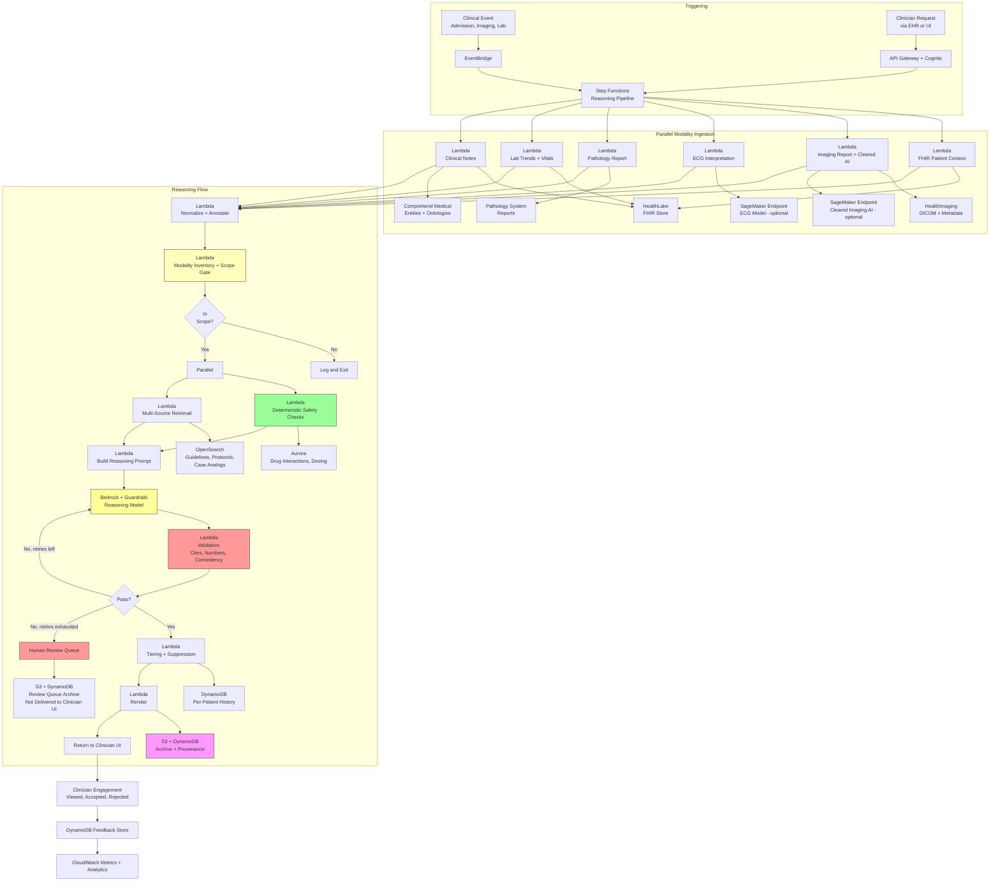

# Recipe 2.10 Architecture and Implementation: Multi-Modal Clinical Reasoning

*Companion to [Recipe 2.10: Multi-Modal Clinical Reasoning](chapter02.10-multi-modal-clinical-reasoning). This page covers the AWS architecture, services, prerequisites, and pseudocode. For the problem framing and the conceptual approach, start with the main recipe.*

---

## The AWS Implementation

### Why These Services

**Amazon Bedrock for the reasoning layer.** A capable generation model (Claude Sonnet or equivalent) handles the multi-hypothesis reasoning and synthesis. A cheaper fast model (Claude Haiku, Nova Lite, or equivalent) handles scenario classification, modality inventory summarization, and retrieval planning. Bedrock is the right fit because the workload needs grounded generation with structured output and because it is HIPAA-eligible under AWS BAA.

**Amazon Bedrock Guardrails for contextual grounding enforcement.** Every reasoning output runs through a contextual grounding check against the assembled input context (modality interpretations, retrieved sources, patient data). Grounding failures trigger retry or reject. For multi-modal reasoning the grounding enforcement is non-negotiable because the stakes of fabrication are higher than in unimodal cases. For this recipe, a contextual grounding threshold at or above 0.85 is the conservative starting point; tune upward for scenarios where fabrication tolerance is lowest (oncology treatment selection, critical-care decisions) and re-evaluate per scenario during clinical validation. The same Guardrail policy must also have input-side prompt-attack filters enabled, because retrieved modality content (reports, notes, guidelines, protocols, vendor AI outputs) is an untrusted-input surface, not verified instructions.

**Amazon HealthLake for the FHIR-native patient context.** HealthLake is the natural store for the structured clinical data layer. The reasoning pipeline queries HealthLake for the FHIR bundle at the start of each run.

**Amazon HealthImaging for DICOM management.** HealthImaging is a HIPAA-eligible, purpose-built store for medical imaging. For a pipeline that needs to reference prior imaging, retrieve current imaging metadata, and link from the reasoning output back to the source study, HealthImaging is the right imaging-native layer. The reasoning pipeline itself typically does not perform direct pixel interpretation; it uses HealthImaging metadata and the radiology report for text-based reasoning, and deep-links back to the study in the PACS viewer for clinician review.

**Amazon Transcribe Medical or Amazon HealthScribe when audio-derived content is in scope.** For pipelines that include the conversational-context modality (the clinician's current encounter), Transcribe Medical or HealthScribe produces the transcript. This is less common in a point-of-care reasoning pipeline but applies in ambient-documentation-plus-reasoning architectures.

**Amazon Comprehend Medical for entity extraction and ontology mapping.** Notes, radiology reports, pathology reports, ECG reports all benefit from entity extraction with mapping to RxNorm, ICD-10, SNOMED, and RadLex where applicable. The resulting structured records are easier to reason over and easier to cite.

**Amazon SageMaker for specialized modality models when needed.** Cleared or institutional-custom models for imaging AI (if not using a cleared vendor's hosted service), ECG foundation models (if institutionally deployed rather than vendor-hosted), and pathology foundation models run on SageMaker Endpoints. These are optional; many deployments use vendor-hosted modality AI.

**Amazon OpenSearch Service for guideline retrieval and the case-analog corpus.** Hybrid search (vector plus BM25 plus metadata filters) works well for guideline retrieval, prior imaging reports, and institutional protocol content. For the case-analog corpus, where retrieval queries can include structured facets (similar lab patterns, similar demographic profile, similar imaging findings), OpenSearch's combination of dense retrieval and filter expressions is a good fit.

**Amazon Aurora PostgreSQL with pgvector for structured drug data and derived features.** Interactions, contraindications, renal dosing, drug-disease interactions: these stay in Aurora exactly as in Recipe 2.9.

**Amazon S3 for modality artifacts, per-run archives, and corpus.** Imaging report text, ECG report text, pathology report text, retrieval traces, the per-reasoning-run archive. Each modality's artifacts with source metadata. SSE-KMS with customer-managed keys. Lifecycle rules per institutional retention policy.

**AWS Step Functions for orchestration.** The reasoning pipeline has parallel modality ingestion, sequential reasoning-and-validation, branching for retry and human-review routing. Step Functions makes the flow visible, resumable, and debuggable.

**AWS Lambda for per-stage logic.** Each ingestion stage, the normalization layer, the modality inventory, the scope gate, the reasoning-layer call, the validation layer, the rendering layer, the archival stage. Lambda is the default compute; SageMaker Endpoints for long-running modality inference when applicable.

**Amazon DynamoDB for per-run metadata and the clinician engagement log.** Reasoning run identifier, patient identifier, encounter identifier, clinician identifier, status, links to S3 artifacts, links to the rendered output, clinician interaction log.

**Amazon EventBridge for clinical triggers and scheduled retraining.** New ED presentation, new admission, new imaging study finalized, new lab result crossing a clinical threshold, clinician-requested reasoning: all can route through EventBridge.

**Amazon API Gateway with Amazon Cognito for the clinician-facing API.** SMART on FHIR where the EHR supports it. CDS Hooks for specific workflow points. Standard REST for direct calls.

**AWS Secrets Manager for external API credentials.** Drug databases, FHIR endpoints, cleared imaging AI vendor APIs, ECG foundation model APIs, formulary services.

**AWS CloudTrail, Amazon CloudWatch, and Amazon CloudWatch Logs for audit and monitoring.** Every service call, every Bedrock invocation, every storage access, every validation outcome. Metrics on latency, validation pass rates, clinician engagement, cross-modality consistency failures, scope-gate denials, and the counts that matter for regulatory evidence.

**AWS KMS for encryption.** Customer-managed keys with per-modality policies where retention and access differ.

### Architecture Diagram


### Prerequisites

| Requirement | Details |
|-------------|---------|
| **AWS Services** | Amazon Bedrock, Amazon Bedrock Guardrails, Amazon HealthLake, Amazon HealthImaging, Amazon Comprehend Medical, Amazon OpenSearch Service (or Serverless), Amazon Aurora PostgreSQL with pgvector, Amazon S3, AWS Lambda, AWS Step Functions, Amazon DynamoDB, Amazon EventBridge, Amazon API Gateway, Amazon Cognito, AWS Secrets Manager, Amazon CloudWatch, AWS CloudTrail, AWS KMS. Amazon SageMaker for self-hosted modality models (imaging, ECG, pathology foundation models) where vendor-hosted options do not apply. Amazon Transcribe Medical or Amazon HealthScribe when conversational context is an input modality. |
| **IAM Permissions** | `bedrock:InvokeModel`, `bedrock:ApplyGuardrail`, `healthlake:ReadResource`, `healthlake:SearchWithGet`, `medical-imaging:GetImageSetMetadata`, `medical-imaging:SearchImageSets`, `medical-imaging:GetDICOMImportJob`, `comprehendmedical:DetectEntitiesV2`, `comprehendmedical:InferRxNorm`, `comprehendmedical:InferICD10CM`, `comprehendmedical:InferSNOMEDCT`, `es:ESHttpPost` and `es:ESHttpGet` for OpenSearch, `rds-data:ExecuteStatement` for Aurora Data API (or credentials via Secrets Manager), `sagemaker:InvokeEndpoint` for hosted modality models, `s3:GetObject`, `s3:PutObject`, `dynamodb:GetItem`, `dynamodb:PutItem`, `dynamodb:UpdateItem`, `dynamodb:Query`, `states:StartExecution`, `events:PutEvents`, `secretsmanager:GetSecretValue`, `kms:Decrypt`, `kms:GenerateDataKey`. Scope each action to specific resource ARNs. |
| **BAA** | AWS BAA signed. Every service in the pipeline must be HIPAA-eligible under the BAA. Patient context, imaging metadata, ECG interpretations, and the reasoning output itself all contain PHI. |
| **Regulatory Determination** | Required before pilot deployment. Document the intended scope of use, the FDA CDS exemption analysis (the four criteria), the design decisions that support clinician independent review, the source transparency posture, the clinician review workflow, the validation plan. If the determination concludes the product is a medical device, the development path changes materially (FDA submission, validation studies, labeling, post-market surveillance under the quality system regulation). Retain documentation for either outcome. Involve regulatory affairs and legal at design time. |
| **Source Licensing** | Guidelines, drug databases, and institutional protocol content each have their own licensing posture (per Recipe 2.9). Imaging-AI vendor outputs are typically covered under the vendor contract and have specific redistribution and retention terms. Cleared models must stay within the cleared use scope. Maintain a license registry and enforce constraints in the rendering and retention layers. |
| **Bedrock Model Access** | Request access to a strong generation model (Claude Sonnet or equivalent) for the reasoning layer and a cheaper model (Claude Haiku or Nova Lite) for auxiliary tasks. Evaluate the chosen generation model against representative reasoning scenarios with clinician-reviewed gold answers before pilot deployment. |
| **Modality AI Vendor Decisions** | Cleared imaging AI vendors produce structured outputs for specific imaging modalities and findings (Aidoc, Viz.ai, RapidAI, others for specific indications). Contracts usually include workflow integration, API access, and retention terms. Evaluate each before commitment; verify FDA clearance for the intended use; verify performance data in your patient population; confirm integration complexity. Non-cleared models (including many vision-language models) have a different regulatory posture and should not be used for diagnostic impression generation without explicit regulatory review. |
| **Encryption** | S3 (modality artifacts, per-run archives, corpus): SSE-KMS with customer-managed keys, distinct keys per modality if retention policies differ. DynamoDB: encryption at rest with CMK. OpenSearch: encryption at rest and in transit, fine-grained access control, no public endpoint. Aurora: encryption at rest, TLS in transit. HealthLake and HealthImaging: encryption at rest with CMK. Bedrock and Comprehend Medical: TLS in transit. Bedrock model-invocation logging (if enabled) contains PHI; log destinations must be encrypted to the same standard as the archive. |
| **VPC** | Production: Lambda in private subnets with interface endpoints for Bedrock (Runtime and Guardrails), Comprehend Medical, HealthLake, HealthImaging, KMS, Secrets Manager, Step Functions, CloudWatch Logs, CloudWatch (monitoring), and EventBridge. Gateway endpoints for S3 and DynamoDB. If API Gateway is configured as a private REST API (recommended for EHR-internal clinician-facing endpoints), add the `execute-api` interface endpoint. Aurora and OpenSearch in VPC with security groups restricted to the Lambda execution role. SageMaker Endpoints in VPC if used. Factor interface endpoint costs into the cost estimate. |
| **CloudTrail** | Enabled with data events for Bedrock invocations, S3 object access, DynamoDB access, HealthLake reads, HealthImaging reads, SageMaker endpoint invocations, and Secrets Manager retrievals. Correlate each reasoning run to the requesting clinician and the patient identifier via Cognito session claims. |
| **Sample Data** | Development: synthetic FHIR bundles (Synthea), open guideline content (USPSTF, CDC, HHS, open society guidelines), open imaging report corpora (MIMIC-CXR reports are a common starting point), open ECG data (PhysioNet datasets). Never use real PHI in dev. Evaluation: curated case-scenario-to-reasoning-output pairs reviewed by clinical domain experts; these are expensive to assemble and essential for meaningful validation. |
| **Cost Estimate** | Per-run cost varies substantially with scenario complexity and modalities in scope. Typical ranges: patient context fetch plus normalization $0.01-$0.03; modality ingestion $0.02-$0.15 (cleared imaging AI calls and foundation model calls dominate when enabled); deterministic safety checks $0.005-$0.02; retrieval $0.02-$0.08; reasoning layer $0.15-$2.50 (depends heavily on context size and model choice; multi-modal reasoning contexts can be large); validation $0.02-$0.10. End-to-end: $0.40-$4.00 per run for typical focused scenarios. Broad scenarios with multi-year longitudinal context plus validator retries can exceed the top of that range; budget $5-$8 per run for worst-case comprehensive reasoning. At 300 runs per day in a focused deployment, variable cost runs $120-$1,200/day. Fixed infrastructure (OpenSearch cluster, Aurora, HealthLake baseline, HealthImaging baseline, optional SageMaker Endpoints) adds $1,000-$5,000/month depending on scale and optional modality models. |

### Ingredients

| AWS Service | Role |
|------------|------|
| **Amazon Bedrock (reasoning)** | Multi-hypothesis reasoning with a capable generation model; auxiliary tasks with a cheaper model |
| **Amazon Bedrock (embeddings)** | Titan or Cohere embeddings for guideline and case-analog indexing |
| **Amazon Bedrock Guardrails** | Contextual grounding enforcement on the reasoning output; content filters; PII policies |
| **Amazon HealthLake** | FHIR-native store for structured patient context |
| **Amazon HealthImaging** | HIPAA-eligible DICOM store with imaging metadata access for reasoning pipelines |
| **Amazon Comprehend Medical** | Entity extraction and ontology mapping (RxNorm, ICD-10, SNOMED) for notes, radiology reports, pathology reports, ECG reports |
| **Amazon OpenSearch Service** | Hybrid retrieval of guidelines, institutional protocols, and case analogs |
| **Amazon Aurora PostgreSQL + pgvector** | Structured drug data (interactions, dosing, contraindications) with vector search for associated prose |
| **Amazon SageMaker Endpoints (optional)** | Self-hosted modality models (imaging, ECG, pathology foundation models) when vendor-hosted options do not apply |
| **Amazon S3** | Modality artifacts, per-run archives, retrieval traces, corpus storage |
| **AWS Lambda** | Per-stage pipeline logic for ingestion, reasoning, validation, rendering, archival |
| **AWS Step Functions** | Reasoning pipeline orchestration with parallel modality ingestion and sequential reasoning and validation |
| **Amazon DynamoDB** | Per-run metadata, per-patient reasoning history, clinician engagement tracking |
| **Amazon EventBridge** | Clinical-event triggers and scheduled operations |
| **Amazon API Gateway + Cognito** | Authenticated clinician-facing API (SMART on FHIR if EHR-launched; CDS Hooks for workflow integration) |
| **AWS Secrets Manager** | Credentials for FHIR endpoints, drug databases, cleared imaging AI vendors, ECG model APIs, formulary services |
| **AWS KMS** | Encryption key management with distinct keys per modality and per data class |
| **Amazon CloudWatch + CloudTrail** | Operational metrics, HIPAA audit logs, regulatory evidence trail |

### Code

#### Walkthrough

**Step 1: Trigger and orchestrate.** The pipeline starts from a clinical event or a clinician request. The first step creates the reasoning run record and prepares to kick off parallel modality ingestion.

```pseudocode
FUNCTION start_reasoning_run(trigger):
    // trigger.type: "ed_presentation", "admission", "oncology_treatment_planning",
    //               "clinician_request", etc.
    // trigger.patient_id: FHIR Patient ID
    // trigger.encounter_id: FHIR Encounter ID (when applicable)
    // trigger.scenario: scoped scenario name for the reasoning
    // trigger.clinician_id: Cognito user ID for audit trail

    // Derive a deterministic run_id from the event key so that duplicate
    // EventBridge deliveries (at-least-once) resolve to the same execution
    // rather than spawning a redundant pipeline run.
    event_key = f"{trigger.patient_id}:{trigger.encounter_id}:{trigger.scenario}"
    run_id = deterministic_uuid_v5(namespace=MM_REASONING_NAMESPACE, name=event_key)

    // Conditional write: only create the run record if this run_id does not
    // already exist. If the condition fails, this is a duplicate delivery;
    // return the existing run_id without re-triggering.
    try:
        write to DynamoDB table "mm-reasoning-runs" with condition attribute_not_exists(run_id):
            run_id         = run_id
            trigger_type   = trigger.type
            scenario       = trigger.scenario
            patient_id     = trigger.patient_id
            encounter_id   = trigger.encounter_id
            clinician_id   = trigger.clinician_id
            status         = "INITIATED"
            initiated_at   = current UTC timestamp
    catch ConditionalCheckFailed:
        // Duplicate delivery; the run already exists. Return idempotently.
        RETURN { run_id: run_id, status: "ALREADY_EXISTS" }

    // Kick off Step Functions execution with the deterministic run_id as
    // the execution name. Step Functions rejects duplicate execution names
    // within the retention window, providing a second idempotency layer.
    start Step Functions execution:
        state_machine_arn = MM_REASONING_STATE_MACHINE_ARN
        name              = run_id
        input             = {
            run_id: run_id,
            trigger: trigger,
            scenario: trigger.scenario
        }

    RETURN { run_id: run_id }
```
**Step 2: Parallel modality ingestion.** Each modality's ingestion runs as an independent Lambda invocation. The inventory of what was successfully ingested and what failed flows into the next stage.

```pseudocode
FUNCTION ingest_imaging(run_id, patient_id, scenario):

    // Determine which imaging studies are relevant for this scenario and patient
    imaging_studies = list_relevant_imaging(patient_id, scenario)
    // For ED presentation: current encounter's imaging plus most recent prior
    // For oncology planning: staging studies plus most recent restaging

    imaging_records = empty list

    FOR each study in imaging_studies:
        // Pull the imaging metadata from HealthImaging
        metadata = call HealthImaging.GetImageSetMetadata:
            datastore_id = HEALTHIMAGING_DATASTORE_ID
            image_set_id = study.image_set_id

        // Pull the radiology report from HealthLake or the report system
        // Reports are typically DocumentReference resources in FHIR
        report = call HealthLake.SearchResources:
            resource_type = "DocumentReference"
            filter        = { subject: patient_id,
                              study_instance_uid: metadata.study_instance_uid,
                              category: "radiology-report" }

        // Extract structured content from the report
        report_entities = call ComprehendMedical.DetectEntitiesV2(report.content)
        radlex_mapped   = map_radlex(report_entities) if applicable

        // If a cleared imaging AI vendor has output for this study, retrieve it
        cleared_ai_outputs = empty list
        IF scenario_requires_cleared_ai(scenario, metadata.modality):
            vendor_output = call imaging_ai_vendor.get_result:
                study_uid = metadata.study_instance_uid
            // vendor_output is a structured result: e.g., PE probability + localization
            IF vendor_output is present:
                append {
                    finding_type: vendor_output.finding_type,
                    probability: vendor_output.probability,
                    localization: vendor_output.localization,
                    vendor_name: vendor_output.vendor_name,
                    clearance_info: vendor_output.clearance,
                    study_uid: metadata.study_instance_uid,
                    timestamp: vendor_output.produced_at
                } to cleared_ai_outputs

        append {
            modality_type: "imaging",
            study_modality: metadata.modality,        // CT, MR, CR, etc.
            study_description: metadata.study_description,
            study_date: metadata.study_date,
            study_uid: metadata.study_instance_uid,
            report_text: report.content,
            report_entities: report_entities,
            radlex_mapped: radlex_mapped,
            cleared_ai_outputs: cleared_ai_outputs,
            pacs_deep_link: build_pacs_deep_link(metadata),
            source_id: f"imaging:{metadata.study_instance_uid}"
        } to imaging_records

    // Return a status-annotated result so the inventory step can distinguish
    // "no imaging exists" from "imaging retrieval failed" from "imaging present."
    IF error occurred during HealthImaging or vendor calls:
        RETURN { status: "failed", modality: "imaging", records: [],
                 error: error_details }
    ELSE IF length(imaging_records) == 0:
        RETURN { status: "empty", modality: "imaging", records: [] }
    ELSE:
        RETURN { status: "retrieved", modality: "imaging", records: imaging_records }
```

```pseudocode
FUNCTION ingest_ecg(run_id, patient_id, scenario, encounter_id):

    // ECGs are typically referenced as Observation or DocumentReference in FHIR
    ecg_records_fhir = call HealthLake.SearchResources:
        resource_type = "Observation"
        filter        = { subject: patient_id,
                          code: LOINC_ECG_STUDY_REPORT,
                          date: recent_window_for_scenario(scenario) }

    ecg_records = empty list
    FOR each ecg in ecg_records_fhir:
        // Extract the machine interpretation
        machine_interp = extract_ecg_machine_interpretation(ecg)

        // Extract the human over-read if available
        overread = extract_ecg_overread(ecg)

        // Extract key numeric parameters
        hr   = extract_component(ecg, "heart-rate")
        qtc  = extract_component(ecg, "qtc-interval")
        qrs  = extract_component(ecg, "qrs-duration")
        axis = extract_component(ecg, "qrs-axis")

        // Optional: call ECG foundation model for additional interpretation
        foundation_model_output = empty dict
        IF scenario_requires_ecg_foundation_model(scenario):
            // Assumes the waveform is accessible via some reference;
            // real deployment pulls the waveform from an ECG management system
            // and calls a cleared or research-grade endpoint
            foundation_model_output = call SageMaker.InvokeEndpoint:
                endpoint_name = ECG_FOUNDATION_MODEL_ENDPOINT
                body          = { waveform_reference: ecg.derived_from_reference }

        append {
            modality_type: "ecg",
            ecg_date: ecg.effective_date_time,
            machine_interpretation: machine_interp,
            clinician_overread: overread,
            hr: hr,
            qtc: qtc,
            qrs: qrs,
            axis: axis,
            foundation_model_output: foundation_model_output,
            source_id: f"ecg:{ecg.id}",
            deep_link: build_ecg_deep_link(ecg)
        } to ecg_records

    IF error occurred during HealthLake or SageMaker calls:
        RETURN { status: "failed", modality: "ecg", records: [],
                 error: error_details }
    ELSE IF length(ecg_records) == 0:
        RETURN { status: "empty", modality: "ecg", records: [] }
    ELSE:
        RETURN { status: "retrieved", modality: "ecg", records: ecg_records }
```

```pseudocode
FUNCTION ingest_labs_and_vitals(run_id, patient_id, scenario):

    // The scenario determines which labs matter; pull a generous set to start
    scenario_loincs = lab_loincs_for_scenario(scenario)

    labs_by_loinc = dict
    FOR each loinc in scenario_loincs:
        observations = call HealthLake.SearchResources:
            resource_type = "Observation"
            filter        = { subject: patient_id,
                              code: loinc,
                              date: "ge" + months_ago(24) }
        // Sort by effective datetime ascending
        sorted_obs = sort_asc(observations, by="effective_date_time")
        labs_by_loinc[loinc] = sorted_obs

    // Compute derived trend features per scenario-relevant lab
    lab_trends = dict
    FOR each loinc, obs_list in labs_by_loinc:
        IF length(obs_list) >= 2:
            lab_trends[loinc] = {
                current_value: obs_list[-1].value,
                current_date: obs_list[-1].effective_date_time,
                prior_value: obs_list[-2].value,
                prior_date: obs_list[-2].effective_date_time,
                delta_value: obs_list[-1].value - obs_list[-2].value,
                delta_percent: percent_change(obs_list[-2].value, obs_list[-1].value),
                trend_slope: compute_slope(obs_list),   // over last 90 days
                classification: classify_trend(obs_list),  // stable, rising, falling, volatile
                baseline_if_known: derive_baseline(obs_list)
            }
        ELSE IF length(obs_list) == 1:
            lab_trends[loinc] = {
                current_value: obs_list[0].value,
                current_date: obs_list[0].effective_date_time,
                prior_value: null,
                classification: "single_value"
            }

    // Vitals summary
    vitals_loincs = {
        hr: "8867-4",
        sbp: "8480-6",
        dbp: "8462-4",
        rr: "9279-1",
        temp: "8310-5",
        spo2: "59408-5"
    }
    vitals_summary = dict
    FOR each name, loinc in vitals_loincs:
        recent_vitals = call HealthLake.SearchResources:
            resource_type = "Observation"
            filter        = { subject: patient_id, code: loinc,
                              date: "ge" + hours_ago(24) }
        vitals_summary[name] = {
            most_recent: most_recent(recent_vitals),
            min: minimum(recent_vitals),
            max: maximum(recent_vitals),
            flagged_events: abnormal_events(recent_vitals)
        }

    RETURN { status: "retrieved", modality: "labs_vitals",
             lab_trends: lab_trends, vitals_summary: vitals_summary,
             source_id: f"labs_vitals:{patient_id}" }
```

```pseudocode
FUNCTION ingest_notes(run_id, patient_id, scenario):

    // Pull recent notes relevant to the scenario
    notes_fhir = call HealthLake.SearchResources:
        resource_type = "DocumentReference"
        filter        = { subject: patient_id,
                          category: note_categories_for_scenario(scenario),
                          date: "ge" + note_recency_for_scenario(scenario) }

    notes = empty list
    FOR each note in notes_fhir:
        // Extract entities and map to ontologies
        entities = call ComprehendMedical.DetectEntitiesV2(note.content)
        rxnorm   = call ComprehendMedical.InferRxNorm(note.content) if note has meds
        icd10    = call ComprehendMedical.InferICD10CM(note.content)
        snomed   = call ComprehendMedical.InferSNOMEDCT(note.content)

        // Identify key passages the reasoning may cite
        key_passages = extract_key_passages(note, entities)
        // e.g., assessment and plan sections, reason-for-visit, notable findings

        append {
            modality_type: "note",
            note_type: note.category,           // progress, consult, discharge, etc.
            specialty: note.author_specialty if available,
            note_date: note.date,
            content: note.content,
            entities: entities,
            ontology_mapped: { rxnorm: rxnorm, icd10: icd10, snomed: snomed },
            key_passages: key_passages,
            source_id: f"note:{note.id}"
        } to notes

    IF error occurred during HealthLake or ComprehendMedical calls:
        RETURN { status: "failed", modality: "notes", records: [],
                 error: error_details }
    ELSE IF length(notes) == 0:
        RETURN { status: "empty", modality: "notes", records: [] }
    ELSE:
        RETURN { status: "retrieved", modality: "notes", records: notes }
```

```pseudocode
FUNCTION ingest_structured_context(run_id, patient_id):

    // Reuse the pattern from Recipe 2.9 for normalized patient facts
    bundle = call HealthLake.SearchResources:
        resource_types = ["Patient", "Condition", "MedicationRequest",
                          "AllergyIntolerance", "Procedure"]
        patient_id     = patient_id

    structured = normalize_patient_context(bundle)
    // demographics, active_conditions, current_medications, allergies,
    // derived (eGFR, BMI, Child-Pugh as applicable)

    IF error occurred during HealthLake calls:
        RETURN { status: "failed", modality: "structured_context",
                 records: {}, error: error_details }
    ELSE:
        RETURN { status: "retrieved", modality: "structured_context",
                 records: structured }
```
**Step 3: Normalize, annotate, and build the modality inventory.** Each modality's ingestion produces its own representation. This step assembles them into a unified patient state with consistent timestamps, source identifiers, and a modality inventory that the reasoning layer will consult.

```pseudocode
FUNCTION normalize_and_inventory(imaging, ecg, labs_vitals, notes, structured):

    // Each ingestion result is status-annotated: { status, modality, records, error? }
    // Statuses: "retrieved" (data present), "empty" (genuinely absent for this patient),
    //           "failed" (retrieval error: timeout, throttle, vendor 500),
    //           "scoped_out" (not relevant for this scenario).
    // The inventory is built from status, not from record count alone.

    // Unpack records (use empty defaults for failed or empty modalities)
    imaging_records = imaging.records if imaging.status == "retrieved" else []
    ecg_records = ecg.records if ecg.status == "retrieved" else []
    lab_trends = labs_vitals.lab_trends if labs_vitals.status == "retrieved" else {}
    vitals_summary = labs_vitals.vitals_summary if labs_vitals.status == "retrieved" else {}
    notes_records = notes.records if notes.status == "retrieved" else []
    structured_data = structured.records if structured.status == "retrieved" else {}

    // Build the unified patient state from successfully retrieved modalities
    patient_state = {
        structured_context: structured_data,
        imaging_records: imaging_records,
        ecg_records: ecg_records,
        lab_trends: lab_trends,
        vitals_summary: vitals_summary,
        notes: notes_records
    }

    // Build the modality inventory from status, not cardinality.
    // "failed" modalities are distinct from "empty" modalities: the scope gate
    // routes "failed" to retry rather than treating the absence as permanent.
    modality_inventory = {
        structured_context: {
            status: structured.status,
            present: structured.status == "retrieved",
            recency: "current" if structured.status == "retrieved" else null,
            confidence: "high" if structured.status == "retrieved" else "unavailable"
        },
        imaging: {
            status: imaging.status,
            present: imaging.status == "retrieved" AND length(imaging_records) > 0,
            count: length(imaging_records),
            most_recent: most_recent_date(imaging_records),
            modalities: unique(imaging_records map to .study_modality),
            cleared_ai_present: any(imaging_records, has cleared_ai_outputs)
        },
        ecg: {
            status: ecg.status,
            present: ecg.status == "retrieved" AND length(ecg_records) > 0,
            count: length(ecg_records),
            most_recent: most_recent_date(ecg_records)
        },
        labs: {
            status: labs_vitals.status,
            present: labs_vitals.status == "retrieved" AND length(lab_trends) > 0,
            current_and_trended: count_where(lab_trends,
                                                 classification in ["rising","falling","stable"]),
            single_values_only: count_where(lab_trends,
                                                 classification == "single_value")
        },
        vitals: {
            status: labs_vitals.status,
            present: labs_vitals.status == "retrieved" AND length(vitals_summary) > 0,
            recency: "current_encounter" if length(vitals_summary) > 0 else null
        },
        notes: {
            status: notes.status,
            present: notes.status == "retrieved" AND length(notes_records) > 0,
            count: length(notes_records),
            types: unique(notes_records map to .note_type),
            most_recent: most_recent_date(notes_records)
        }
    }

    // Annotate each item with a source_id for citation
    // Source IDs are stable within a run and used in the reasoning output

    RETURN { patient_state: patient_state, modality_inventory: modality_inventory }
```
**Step 4: Scope gate.** Given the scenario and the modality inventory, decide whether the reasoning run should proceed. If a recent run covered the same scenario without material changes, suppress. If critical modalities are missing for the scenario, either scope down or defer with an explanatory output.

```pseudocode
FUNCTION scope_gate(scenario, modality_inventory, patient_id, recent_runs):

    // recent_runs is a DynamoDB query on the mm-reasoning-runs table by
    // (patient_id, initiated_at) over the SUPPRESSION_WINDOW_HOURS (typically
    // 24 hours). A GSI on patient_id is required; a composite partition key
    // of (patient_id + date) is a reasonable optimization at high-volume
    // facilities.
    //
    // no_material_change_since compares the current modality inventory's
    // content hash to the prior run's stored inventory hash. Material
    // changes include: new imaging study, new ECG, lab value crossing a
    // clinical threshold, new note of a relevant type, medication change.
    decision = {
        proceed: false,
        reason: "",
        scoped_to: null,
        defer_reason: null
    }

    // Suppression: recent run on the same scenario without material changes
    FOR each recent in recent_runs:
        IF recent.scenario == scenario
           AND recent.age_minutes < SUPPRESSION_WINDOW_FOR(scenario)
           AND no_material_change_since(recent, modality_inventory):
            decision.reason = "recently_reasoned_same_scenario"
            RETURN decision

    // Route "failed" modalities to retry before evaluating availability.
    // A modality with status "failed" is not the same as genuinely absent;
    // it means a transient error (HealthImaging timeout, Comprehend throttle,
    // vendor AI 500). Retry up to a cap before proceeding without it.
    failed_modalities = [m for m in modality_inventory
                         where modality_inventory[m].status == "failed"]
    IF length(failed_modalities) > 0:
        decision.proceed = false
        decision.defer_reason = "modality_retrieval_failed_pending_retry"
        decision.missing = failed_modalities
        RETURN decision

    // Required modalities per scenario
    required = required_modalities_for_scenario(scenario)
    // e.g., for "ed_dyspnea_workup":
    //   required = ["structured_context", "labs", "vitals", "imaging:chest"]
    //   recommended = ["ecg", "notes:recent"]
    recommended = recommended_modalities_for_scenario(scenario)

    missing_required = empty list
    FOR each req in required:
        IF not modality_available(modality_inventory, req):
            append req to missing_required

    IF length(missing_required) > 0:
        decision.proceed = false
        decision.defer_reason = "missing_required_modalities"
        decision.missing = missing_required
        RETURN decision

    // Handle missing recommended modalities for ALL scenarios (not only
    // comprehensive_reasoning). Each scenario defines one of three handlers
    // per recommended modality:
    //   (a) narrow the scope to a sub-scenario that does not need it
    //   (b) proceed with a completeness_cap of "low" (the reasoning layer
    //       annotates its output accordingly)
    //   (c) defer when the recommended modality is effectively required
    //       for that sub-scenario (e.g., ECG for ACS-inclusive reasoning)
    missing_recommended = [r for r in recommended
                           where not modality_available(modality_inventory, r)]

    IF length(missing_recommended) > 0:
        handler = recommended_missing_handler_for_scenario(scenario, missing_recommended)
        // handler.action is one of: "scope_down", "proceed_capped", "defer"

        IF handler.action == "scope_down":
            decision.scoped_to = handler.narrower_scenario
            decision.proceed = true
            decision.reason = "scoped_down_due_to_missing_recommended_modalities"
            decision.missing = missing_recommended
            RETURN decision

        ELSE IF handler.action == "proceed_capped":
            decision.scoped_to = scenario
            decision.proceed = true
            decision.completeness_cap = "low"
            decision.reason = "proceeding_with_reduced_completeness"
            decision.missing = missing_recommended
            RETURN decision

        ELSE IF handler.action == "defer":
            decision.proceed = false
            decision.defer_reason = "recommended_modality_effectively_required"
            decision.missing = missing_recommended
            decision.reason = handler.defer_rationale
            RETURN decision

    decision.proceed = true
    decision.scoped_to = scenario
    decision.reason = "all_required_modalities_present"
    RETURN decision
```
**Step 5: Deterministic safety checks.** Same pattern as Recipe 2.9. Drug interactions, allergies, contraindications, renal and hepatic dose flags. The outputs are hard inputs to the reasoning prompt.

```pseudocode
FUNCTION run_safety_checks(structured_context, proposed_medications_if_any):

    // See Recipe 2.9 Step 4 for the full expansion; the same function applies here
    safety_findings = run_deterministic_safety_checks(structured_context,
                                                        proposed_medications_if_any)

    RETURN safety_findings
```
**Step 6: Retrieval.** Pull the relevant guidelines, institutional protocols, and (optionally) case analogs. Retrieval is scoped by the scenario, the patient's characteristics, and the modality inventory.

```pseudocode
FUNCTION retrieve_supporting_content(scenario, patient_state, modality_inventory):

    queries = derive_retrieval_queries(scenario, patient_state, modality_inventory)

    guideline_results = empty list
    FOR each q in queries.guideline_queries:
        q_embedding = call Bedrock.InvokeModel:
            model_id = EMBEDDING_MODEL_ID
            input    = q.text

        results = call OpenSearch.search:
            index        = "guidelines"
            query_vector = q_embedding
            keyword_query = build_bm25_from_entities(q.key_entities)
            filters      = q.metadata_filters    // specialty, population, recency
            size         = 20

        append results to guideline_results

    protocol_results = empty list
    FOR each q in queries.protocol_queries:
        results = call OpenSearch.search:
            index = "institutional-protocols"
            query = q.text
            size  = 10
        append results to protocol_results

    case_analog_results = empty list
    IF case_analog_corpus_enabled_for_scenario(scenario):
        // Case analogs are optional; use only when a well-curated corpus exists
        FOR each q in queries.case_analog_queries:
            results = call OpenSearch.search:
                index        = "case-analogs"
                query_vector = embed_patient_profile(patient_state, scenario)
                filters      = q.metadata_filters
                size         = 5
            append results to case_analog_results

    RETURN {
        guidelines: guideline_results,
        protocols: protocol_results,
        case_analogs: case_analog_results
    }
```
**Step 6b: PHI minimization before prompt construction.** Bedrock under BAA is compliant for PHI, but the HIPAA minimum-necessary principle applies inside the BAA boundary as well. Before the reasoning prompt is assembled, strip direct identifiers (MRN, DOB, patient name, address, phone, email, payer identifiers, NPI) from the serialized patient state. The reasoning output re-associates conclusions to the patient via run_id plus patient_id in the rendering step; those identifiers do not need to round-trip through the model prompt.

```pseudocode
FUNCTION minimize_phi_for_prompt(patient_state):

    // Fields to strip from all nested objects before prompt serialization
    DIRECT_IDENTIFIERS = ["mrn", "medical_record_number", "date_of_birth",
                          "dob", "patient_name", "name", "address", "street",
                          "city", "state", "zip", "postal_code", "phone",
                          "telephone", "email", "email_address",
                          "payer_id", "member_id", "subscriber_id",
                          "npi", "provider_npi", "ssn",
                          "social_security_number"]

    minimized = deep_copy(patient_state)

    // Strip identifiers from structured context
    FOR each field in DIRECT_IDENTIFIERS:
        remove field from minimized.structured_context if present

    // Strip identifiers from note content (replace with "[REDACTED]")
    FOR each note in minimized.notes:
        note.content = redact_identifiers(note.content, DIRECT_IDENTIFIERS)
        FOR each passage in note.key_passages:
            passage.text = redact_identifiers(passage.text, DIRECT_IDENTIFIERS)

    // Imaging reports and ECG reports: redact patient-identifying headers
    FOR each img in minimized.imaging_records:
        img.report_text = redact_identifiers(img.report_text, DIRECT_IDENTIFIERS)
    FOR each ecg in minimized.ecg_records:
        ecg.machine_interpretation = redact_identifiers(
            ecg.machine_interpretation, DIRECT_IDENTIFIERS)

    RETURN minimized
```
**Step 7: The reasoning layer.** Build the prompt with the modality inventory, patient state, retrieved content, and safety findings. The prompt enforces multi-hypothesis reasoning, evidence-for-and-against per hypothesis, explicit handling of missing modalities, verbatim preservation, cross-modality consistency, and citation discipline.

```pseudocode
FUNCTION invoke_reasoning_layer(scenario, patient_state, modality_inventory,
                                  retrieved, safety_findings, scope_decision):

    // Format each source for inclusion in the prompt with a stable source_id
    sources_block = ""
    id_to_source = dict

    // Imaging sources
    FOR each img in patient_state.imaging_records:
        sources_block += f"[{img.source_id}] Imaging: {img.study_description}, "
                       + f"modality {img.study_modality}, date {img.study_date}\n"
                       + f"Report text: {img.report_text}\n"
        FOR each ai_output in img.cleared_ai_outputs:
            sources_block += f"  Cleared AI output: {ai_output.finding_type} "
                           + f"(probability {ai_output.probability}, "
                           + f"vendor {ai_output.vendor_name}, "
                           + f"clearance {ai_output.clearance_info})\n"
        sources_block += "\n"
        id_to_source[img.source_id] = img

    // ECG sources
    FOR each ecg in patient_state.ecg_records:
        sources_block += f"[{ecg.source_id}] ECG: date {ecg.ecg_date}, "
                       + f"HR {ecg.hr}, QTc {ecg.qtc}, QRS {ecg.qrs}\n"
                       + f"Machine interpretation: {ecg.machine_interpretation}\n"
        IF ecg.clinician_overread is present:
            sources_block += f"Overread: {ecg.clinician_overread}\n"
        IF ecg.foundation_model_output is present:
            sources_block += f"Foundation model output: {ecg.foundation_model_output}\n"
        sources_block += "\n"
        id_to_source[ecg.source_id] = ecg

    // Labs (as trended summaries)
    FOR each loinc, trend in patient_state.lab_trends:
        source_id = f"lab:{loinc}"
        sources_block += f"[{source_id}] Lab {loinc} ({trend.display_name}): "
                       + f"current {trend.current_value} {trend.unit} on {trend.current_date}; "
                       + f"prior {trend.prior_value} on {trend.prior_date}; "
                       + f"trend {trend.classification}; "
                       + f"delta {trend.delta_percent}%; "
                       + f"baseline {trend.baseline_if_known}\n\n"
        id_to_source[source_id] = trend

    // Vitals summary
    sources_block += f"[vitals] Vitals in the current encounter: {patient_state.vitals_summary}\n\n"
    id_to_source["vitals"] = patient_state.vitals_summary

    // Notes (include key passages, not full text, for context efficiency)
    FOR each note in patient_state.notes:
        sources_block += f"[{note.source_id}] Note: {note.note_type}, "
                       + f"specialty {note.specialty}, date {note.note_date}\n"
                       + f"Key passages: {format_key_passages(note.key_passages)}\n\n"
        id_to_source[note.source_id] = note

    // Retrieved guidelines, protocols, case analogs
    FOR each guideline in retrieved.guidelines:
        src_id = f"guideline:{guideline.id}"
        sources_block += f"[{src_id}] Guideline: {guideline.title}, "
                       + f"section {guideline.section}, "
                       + f"issuer {guideline.issuing_body}, year {guideline.year}\n"
                       + f"Content: {guideline.text}\n\n"
        id_to_source[src_id] = guideline

    FOR each protocol in retrieved.protocols:
        src_id = f"protocol:{protocol.id}"
        sources_block += f"[{src_id}] Institutional Protocol: {protocol.name}, "
                       + f"version {protocol.version}\n"
                       + f"Content: {protocol.text}\n\n"
        id_to_source[src_id] = protocol

    // Deterministic safety findings (must be represented in output)
    safety_block = format_safety_findings(safety_findings)

    // Modality inventory block (the reasoning layer must consult this)
    inventory_block = format_modality_inventory(modality_inventory, scope_decision)

    reasoning_prompt = """
    You are a clinical reasoning assistant. The output will be reviewed by the clinician
    caring for this patient. The clinician is the decision-maker; your role is to
    synthesize the available multi-modal evidence and present options with transparent
    reasoning. You do not diagnose. You do not prescribe. You describe options and the
    evidence for each.

    SCOPE: {scope_decision.scoped_to}. Do not reason outside this scope.

    HARD REQUIREMENTS:
    - Every factual claim must cite at least one source by its source_id in square
      brackets (e.g., [imaging:1.2.3.4] or [lab:2160-0] or [guideline:abc123]).
    - Preserve exact wording for quantitative values, graded terms (mild, moderate,
      severe), and drug names and doses. If a source says "mild LV dysfunction," do not
      upgrade to "moderate" or downgrade to "minimal." Quote verbatim.
    - For each differential or recommendation, enumerate evidence FOR and evidence
      AGAINST, each with source citations.
    - Include every item from the SAFETY FINDINGS block in the output. None may be
      omitted; surface each item where it is relevant.
    - Acknowledge missing modalities. If the MODALITY INVENTORY indicates that a
      modality relevant to the scenario is absent, name the absence explicitly in the
      output. Do not reason as if that modality were present.
    - Evaluate cross-modality consistency. If two modalities disagree, surface the
      disagreement; do not collapse into a false consensus.
    - Evaluate recency. If a modality source is substantially older than the current
      encounter (e.g., an echo from three years ago), note the staleness and how it
      affects confidence.
    - Frame recommendations as options, not directives. Use phrasing like "Consider...",
      "Option A is...", "The guideline supports...". Do not use "Administer...",
      "Give...", "Prescribe..." in your own voice. Verbatim quoted guideline language
      may contain directive wording; preserve it as a quote.
    - Confidence statements must distinguish between "confidence given the available
      data" and "completeness of the available data." Do not conflate them.
    - If the available evidence does not support a confident assessment, say so. Do
      not manufacture a conclusion to satisfy the request.

    STRUCTURE: Return a JSON object with:
    {
      "scenario": "{scope_decision.scoped_to}",
      "overall_assessment": "2-4 sentence summary of the clinical situation",
      "modalities_used": [ list of source_ids used in reasoning ],
      "modalities_absent_and_relevant": [ list of modalities that are absent but
                                          relevant to the scenario, with notes on
                                          how the absence affects confidence ],
      "differential_or_recommendations": [
        {
          "title": "Hypothesis or recommendation title",
          "description": "Description",
          "evidence_for": [
            { "text": "description of evidence", "source_citations": [...] }
          ],
          "evidence_against": [
            { "text": "description of evidence", "source_citations": [...] }
          ],
          "cross_modality_notes": "observations about consistency or disagreement across modalities",
          "recency_notes": "notes on staleness of supporting sources",
          "confidence_given_data": "low" | "moderate" | "high",
          "completeness_of_data": "low" | "moderate" | "high",
          "suggested_next_steps": [ "specific actionable next steps" ],
          "tier": "critical" | "important" | "informational"
        }
      ],
      "cross_modality_contradictions": [
        { "description": "contradiction between two modalities",
          "source_a": "source_id", "source_b": "source_id",
          "implication": "what this means for reasoning" }
      ],
      "safety_findings_included": [
        { "finding": "...", "source_citations": [...], "where_in_output": "..." }
      ],
      "what_is_insufficient_to_answer": [ "specific questions the available data cannot address" ],
      "overall_uncertainty": "low" | "moderate" | "high",
      "uncertainty_rationale": "brief explanation"
    }

    PATIENT STRUCTURED CONTEXT:
    {patient_state.structured_context}

    MODALITY INVENTORY AND SCOPE:
    {inventory_block}

    SAFETY FINDINGS (must all be included in the output):
    {safety_block}

    AVAILABLE SOURCES (cite by source_id in square brackets):
    {sources_block}
    """

    response = call Bedrock.InvokeModel:
        model_id       = REASONING_MODEL_ID       // e.g., Claude Sonnet
        prompt         = reasoning_prompt
        max_tokens     = 6000
        temperature    = 0.15
        guardrail_id   = MM_REASONING_GUARDRAIL_ID
        // Guardrails configured with:
        //   - Contextual grounding: source context = inventory_block + safety_block
        //     + sources_block, tagged via the Guardrails API so grounding runs against
        //     the authoritative content, not the prompt instructions. Threshold 0.85+.
        //   - Content filters enabled.
        //   - PII policy appropriate for clinical content.
        //   - Denied-topics list including directive prescriptive phrasing outside
        //     of verbatim quoted guideline text.
        //   - Input-side prompt-attack filters enabled on the Guardrail policy
        //     itself (not the invocation). Modality inputs (reports, notes,
        //     retrieved guidelines, protocols, vendor AI outputs) are untrusted
        //     input surfaces that can carry instruction-shaped content.

    IF response.guardrail_action == "INTERVENED":
        RETURN { status: "GROUNDING_REJECTED",
                 guardrail_trace: response.guardrail_trace }

    reasoning_json = parse JSON from response
    RETURN { status: "GENERATED",
             reasoning: reasoning_json,
             id_to_source: id_to_source }
```
**Step 8: Post-generation validation.** Belt-and-suspenders on Guardrails. Every citation resolves; every number appears verbatim in a source; every graded term appears verbatim; every safety finding is represented; no claim contradicts another modality; no recommendation falls outside scope.

```pseudocode
FUNCTION validate_reasoning(reasoning, id_to_source, safety_findings,
                              modality_inventory, scope_decision, retry_count):

    unverified = empty list

    // 1. Citation resolution: every cited source_id must be in id_to_source
    FOR each item in reasoning.differential_or_recommendations:
        citations_used = collect_all_citations(item)
        FOR each cit in citations_used:
            IF cit not in id_to_source:
                append { item: item.title, reason: "citation_not_found", cit: cit } to unverified
        IF length(citations_used) == 0:
            append { item: item.title, reason: "no_citations" } to unverified

    // 2. Verbatim quantity check: numeric values and units must appear verbatim
    //    in at least one cited source
    FOR each item in reasoning.differential_or_recommendations:
        quantities = extract_quantities(item.description + item.evidence_for_text
                                          + item.evidence_against_text)
        FOR each q in quantities:
            cited_sources = [id_to_source[c] for c in collect_all_citations(item)]
            IF NOT quantity_appears_verbatim_in(q, cited_sources):
                append { item: item.title, reason: "quantity_not_verbatim",
                         quantity: q } to unverified

    // 3. Verbatim graded-term check (mild, moderate, severe, minimal, marked, etc.)
    graded_terms = ["mild", "moderate", "severe", "minimal", "marked", "trace",
                    "mildly", "moderately", "severely", "markedly"]
    FOR each item in reasoning.differential_or_recommendations:
        for term in graded_terms:
            IF term appears in item.description:
                cited_sources = [id_to_source[c] for c in collect_all_citations(item)]
                IF NOT graded_term_appears_verbatim_in(term_with_context, cited_sources):
                    append { item: item.title,
                             reason: "graded_term_not_verbatim_in_source",
                             term: term } to unverified

    // 4. Safety findings represented
    all_safety_items = aggregate_safety_items(safety_findings)
    FOR each s in all_safety_items:
        IF not safety_finding_in_reasoning(s, reasoning):
            append { reason: "safety_finding_missing",
                     item: s } to unverified

    // 5. Missing-modality acknowledgment
    relevant_missing = modalities_that_are_missing_and_relevant(modality_inventory,
                                                                  scope_decision.scoped_to)
    FOR each m in relevant_missing:
        IF not acknowledged_in_reasoning(m, reasoning):
            append { reason: "missing_modality_not_acknowledged",
                     modality: m } to unverified

    // 6. Cross-modality consistency scan: if reasoning claims X, do other modalities
    //    in the input contradict X without acknowledgment?
    claims = extract_claims_with_sources(reasoning)
    FOR each claim in claims:
        contradictions = find_contradicting_sources(claim, id_to_source,
                                                      excluded_sources=claim.sources)
        IF length(contradictions) > 0
           AND not already_acknowledged_as_cross_modality_contradiction(claim,
                                                                         reasoning):
            append { reason: "unacknowledged_cross_modality_contradiction",
                     claim: claim, contradictions: contradictions } to unverified

    // 7. Scope compliance
    FOR each item in reasoning.differential_or_recommendations:
        IF item_is_out_of_scope(item, scope_decision.scoped_to):
            append { reason: "out_of_scope", item: item.title } to unverified

    // 8. Directive-language check (model's voice must be non-prescriptive)
    directive_phrases = ["you should", "administer", "give", "prescribe", "start",
                         "stop", "switch to"]
    FOR each item in reasoning.differential_or_recommendations:
        model_voice = extract_unquoted_text(item.description
                                              + item.suggested_next_steps_text)
        FOR each phrase in directive_phrases:
            IF phrase in model_voice AND phrase not in_quoted_guideline:
                append { item: item.title,
                         reason: "directive_language_in_model_voice",
                         phrase: phrase } to unverified

    IF length(unverified) == 0:
        RETURN { status: "VALIDATED" }

    IF retry_count < 2:
        augmentation = build_prompt_augmentation_from(unverified)
        RETURN { status: "RETRY_NEEDED",
                 unverified: unverified,
                 augmentation: augmentation }

    RETURN { status: "ROUTED_TO_HUMAN_REVIEW", unverified: unverified }
```
**Orchestration gate between Step 8 and Step 9.** Validation status is the last safety gate before the clinician UI. The orchestrator must distinguish `VALIDATED` from `ROUTED_TO_HUMAN_REVIEW`. Only `VALIDATED` proceeds to Step 9 and becomes a delivered reasoning output. `ROUTED_TO_HUMAN_REVIEW` is a terminal state: the trace is archived for audit, the run is recorded as pending clinical review, and the reasoning does not render to the clinician.

```pseudocode
FUNCTION orchestrate_post_validation(validation_result, run_id, trace):
    IF validation_result.status == "VALIDATED":
        // Fall through to Step 9: tier, render, archive, deliver.
        RETURN { next_step: "tier_render_archive" }

    IF validation_result.status == "ROUTED_TO_HUMAN_REVIEW":
        // Write the trace to S3 (KMS-encrypted) for audit.
        write to S3: f"mm-reasoning-runs/{run_id}/review-queue-trace.json" = trace

        // Record the run state distinct from DELIVERED.
        update DynamoDB: run_id with
            status             = "ROUTED_TO_REVIEW"
            validation_issues  = validation_result.unverified

        // Enqueue for a clinical reviewer (SQS, DynamoDB stream, or
        // equivalent). Reviewer triage is out of scope for this pseudocode.
        enqueue_to_review_queue(run_id, validation_result.unverified)

        emit CloudWatch metric: ReasoningRoutedToReview

        // Do NOT call tier_render_archive. Do NOT return rendered reasoning
        // to the clinician UI.
        RETURN { next_step: "terminal_review_queue" }
```
**Step 9: Tier, render, and archive.** Score against prior runs for suppression. Render with deep links to every modality source. Archive the full provenance.

```pseudocode
FUNCTION tier_render_archive(reasoning, id_to_source, patient_id, encounter_id,
                               run_id, scope_decision):

    // Tier based on recency of prior runs and change materiality
    prior_runs = query_dynamo(table="mm-reasoning-runs",
                               filter={ patient_id, encounter_id })
    tiered = tier_recommendations(reasoning, prior_runs)

    IF all_recommendations_suppressed(tiered):
        update DynamoDB: run_id with status = "SUPPRESSED_MINOR_UPDATE"
        RETURN { status: "SUPPRESSED" }

    // Build the rendered output with source links
    bibliography = empty list
    numbered = dict
    next_num = 1

    FOR each item in tiered.differential_or_recommendations:
        FOR each cit in collect_all_citations(item):
            IF cit not in numbered:
                numbered[cit] = next_num
                source = id_to_source[cit]
                entry = {
                    number: next_num,
                    source_id: cit,
                    modality: source.modality_type,
                    formatted: format_source_for_display(source),
                    deep_link: deep_link_for_source(source),
                    recency: recency_label(source),
                    source_type: source.source_type_if_literature
                }
                append entry to bibliography
                next_num += 1

    // Substitute source_ids with [N] numeric citations in rendered text
    rendered_recs = substitute_citations(tiered, numbered)

    rendered = {
        run_id: run_id,
        patient_id: patient_id,
        encounter_id: encounter_id,
        scenario: scope_decision.scoped_to,
        overall_assessment: reasoning.overall_assessment,
        recommendations: rendered_recs,
        cross_modality_contradictions: reasoning.cross_modality_contradictions,
        safety_findings_included: reasoning.safety_findings_included,
        insufficient_to_answer: reasoning.what_is_insufficient_to_answer,
        modalities_used: reasoning.modalities_used,
        modalities_absent_and_relevant: reasoning.modalities_absent_and_relevant,
        overall_uncertainty: reasoning.overall_uncertainty,
        uncertainty_rationale: reasoning.uncertainty_rationale,
        bibliography: bibliography,
        disclaimer: "This output is decision support synthesizing "
                                         + "available multi-modal evidence. Review each "
                                         + "cited source before acting. The clinician is "
                                         + "the decision-maker."
    }

    // Archive the full provenance
    write to S3: f"mm-reasoning-runs/{run_id}/rendered.json" = rendered
    write to S3: f"mm-reasoning-runs/{run_id}/trace.json" = {
        trigger: trace.trigger,
        scope_decision: scope_decision,
        modality_inventory: trace.modality_inventory,
        retrieval_trace: trace.retrieval_trace,
        safety_findings: trace.safety_findings,
        prompt_version: trace.prompt_version,
        model_id: trace.model_id,
        raw_model_output: trace.raw_model_output,
        validation_result: trace.validation_result,
        generated_at: current UTC timestamp
    }

    update DynamoDB: run_id with status = "DELIVERED"

    emit CloudWatch metrics:
        - ReasoningRunsDelivered
        - ModalitiesUsedPerRun
        - CrossModalityContradictionsSurfaced
        - OverallUncertaintyDistribution

    RETURN { status: "DELIVERED", rendered: rendered }
```
> **Curious how this looks in Python?** The pseudocode above covers the concepts. If you'd like to see sample Python code that demonstrates these patterns using boto3, check out the [Python Example](chapter02.10-python-example). It walks through each step with inline comments and notes on what you'd need to change for a real deployment.

### Expected Results

**Sample output for the ED dyspnea case from the opening vignette:**

```json
{
  "run_id": "MMR-2026-05-12-00342",
  "patient_id": "pt_abc123",
  "encounter_id": "enc_xyz789",
  "scenario": "ed_dyspnea_workup_with_cardiac_history",
  "overall_assessment": "62-year-old woman with history of anthracycline-treated breast cancer (2020), CKD (eGFR 44), type 2 diabetes, and rheumatoid arthritis on methotrexate, presenting with progressive dyspnea over 3 days. Vital signs show tachycardia, tachypnea, mild hypoxemia. Laboratory abnormalities include mildly elevated troponin, elevated BNP, elevated D-dimer, and acute rise in creatinine from baseline. Chest radiograph shows bibasilar opacities with broad differential. Multiple plausible etiologies; imaging and cardiac workup may help distinguish.",
  "modalities_used": [
    "structured_context", "imaging:cxr_current", "lab:10834-0", "lab:42637-9",
    "lab:2160-0", "lab:33762-6", "vitals", "note:pcp_2026_04", "note:oncology_2020",
    "imaging:echo_2024"
  ],
  "modalities_absent_and_relevant": [
    {
      "modality": "ecg",
      "relevance": "Critical for acute coronary syndrome evaluation given mildly elevated troponin. Absence limits confidence on ACS workup.",
      "recommendation": "Obtain 12-lead ECG before further reasoning on cardiac etiologies."
    },
    {
      "modality": "imaging:ct_chest",
      "relevance": "CT pulmonary angiography would clarify PE vs parenchymal etiology for the bibasilar opacities. Prior chest CT is from 2023 and does not reflect current state."
    }
  ],
  "differential_or_recommendations": [
    {
      "title": "Acute heart failure exacerbation with possible underlying anthracycline cardiotoxicity",
      "description": "The elevated BNP [lab:42637-9], prior echocardiogram showing borderline LV function [imaging:echo_2024], and remote anthracycline exposure [note:oncology_2020] together support a heart failure hypothesis. The bibasilar opacities on CXR [imaging:cxr_current] are compatible with pulmonary edema.",
      "evidence_for": [
        { "text": "BNP is elevated at the current value reported in labs", "source_citations": ["lab:42637-9"] },
        { "text": "Prior echocardiogram from 2024 showed borderline LV function", "source_citations": ["imaging:echo_2024"] },
        { "text": "History of anthracycline chemotherapy for breast cancer in 2020", "source_citations": ["note:oncology_2020"] },
        { "text": "Chest radiograph shows bibasilar opacities compatible with pulmonary edema", "source_citations": ["imaging:cxr_current"] },
        { "text": "ACC/AHA heart failure guideline supports anthracycline exposure as a contributing factor to later HFrEF", "source_citations": ["guideline:aha_hf_2022"] }
      ],
      "evidence_against": [
        { "text": "Troponin elevation is more consistent with ACS; heart failure alone does not typically raise troponin to this degree in ambulatory presentations", "source_citations": ["lab:10834-0", "guideline:aha_hf_2022"] },
        { "text": "ECG has not been obtained; cannot exclude ischemic contribution", "source_citations": ["modality_inventory"] }
      ],
      "cross_modality_notes": "BNP [lab:42637-9] and prior imaging [imaging:echo_2024] are consistent with the hypothesis; the prior echo is 2 years old and LV function may have changed.",
      "recency_notes": "The echocardiogram is from 2024, approximately 2 years old. Interval cardiotoxicity progression cannot be excluded.",
      "confidence_given_data": "moderate",
      "completeness_of_data": "low",
      "suggested_next_steps": [
        "Obtain 12-lead ECG",
        "Consider repeat echocardiogram to assess current LV function",
        "If confirmed, treatment per institutional heart failure protocol with attention to renal dosing"
      ],
      "tier": "critical"
    },
    {
      "title": "Pulmonary embolism",
      "description": "Elevated D-dimer [lab:33762-6], tachycardia [vitals], and hypoxemia [vitals] raise concern for PE. Rheumatoid arthritis [structured_context] is a mild pro-thrombotic state. However, D-dimer can be elevated in multiple settings and is not specific.",
      "evidence_for": [
        { "text": "D-dimer is elevated at the current value", "source_citations": ["lab:33762-6"] },
        { "text": "Heart rate 108 and respiratory rate 22 on vitals", "source_citations": ["vitals"] },
        { "text": "Active rheumatoid arthritis noted as a pro-thrombotic state in some literature", "source_citations": ["structured_context", "guideline:chest_vte_2021"] }
      ],
      "evidence_against": [
        { "text": "D-dimer elevation is nonspecific; can be raised by inflammation, malignancy, recent surgery", "source_citations": ["guideline:chest_vte_2021"] },
        { "text": "Chest radiograph findings [imaging:cxr_current] are more prominent bibasilar opacities than is typical for PE alone" }
      ],
      "cross_modality_notes": "D-dimer elevation, tachycardia, hypoxemia form a suggestive cluster but lack confirmatory imaging. CT pulmonary angiography is the standard next step per [guideline:chest_vte_2021] when Wells score supports imaging.",
      "recency_notes": "All relevant data is current.",
      "confidence_given_data": "low",
      "completeness_of_data": "low",
      "suggested_next_steps": [
        "Calculate Wells score; if moderate-to-high probability or unable to exclude, obtain CT pulmonary angiography",
        "Note contrast dose and creatinine trend [lab:2160-0] before CT"
      ],
      "tier": "critical"
    },
    {
      "title": "Atypical pneumonia, including opportunistic etiology given immunosuppression",
      "description": "Methotrexate [structured_context] is immunosuppressive. Bibasilar opacities [imaging:cxr_current] are compatible with several infectious etiologies including atypical bacterial and opportunistic organisms. Mild leukocytosis [lab:6690-2] fits.",
      "evidence_for": [
        { "text": "Methotrexate listed as current medication", "source_citations": ["structured_context"] },
        { "text": "Chest radiograph: bibasilar opacities, cannot exclude atypical infection", "source_citations": ["imaging:cxr_current"] },
        { "text": "Mild leukocytosis noted", "source_citations": ["lab:6690-2"] }
      ],
      "evidence_against": [
        { "text": "No fever documented on vitals", "source_citations": ["vitals"] },
        { "text": "BNP elevation [lab:42637-9] fits heart failure better than primary infection" }
      ],
      "cross_modality_notes": "Infection cannot be excluded; a CT chest would clarify parenchymal pattern and help distinguish infectious vs cardiogenic opacities.",
      "recency_notes": "All relevant data is current.",
      "confidence_given_data": "low",
      "completeness_of_data": "moderate",
      "suggested_next_steps": [
        "Obtain blood cultures, respiratory viral panel as appropriate",
        "Consider CT chest for pattern characterization",
        "Empiric antibiotics decision should be staged against PE and heart failure workup results; avoid reflexive broad-spectrum therapy until clearer picture emerges"
      ],
      "tier": "important"
    },
    {
      "title": "Acute coronary syndrome",
      "description": "Troponin [lab:10834-0] is mildly elevated above the reference. Diabetes is a risk factor. However, ECG is not available; without it, acute coronary syndrome evaluation cannot proceed fully.",
      "evidence_for": [
        { "text": "Troponin value mildly above reference", "source_citations": ["lab:10834-0"] },
        { "text": "Diabetes mellitus listed as active condition", "source_citations": ["structured_context"] }
      ],
      "evidence_against": [
        { "text": "Low-grade troponin elevation can occur in many settings including heart failure, renal dysfunction, and PE", "source_citations": ["guideline:acc_nstemi_2021"] },
        { "text": "Creatinine rise [lab:2160-0] reduces specificity of troponin elevation in this setting" }
      ],
      "cross_modality_notes": "ECG absence [modality_inventory] is the primary limitation; any specific ACS assessment depends on ECG.",
      "recency_notes": "Current.",
      "confidence_given_data": "low",
      "completeness_of_data": "low",
      "suggested_next_steps": [
        "Obtain 12-lead ECG",
        "Serial troponins per institutional protocol",
        "Consider cardiology consultation if ECG abnormal or troponin trends upward"
      ],
      "tier": "critical"
    }
  ],
  "cross_modality_contradictions": [
    {
      "description": "D-dimer elevation [lab:33762-6] points toward PE; BNP elevation [lab:42637-9] and CXR pattern [imaging:cxr_current] lean toward heart failure with pulmonary edema. Both conditions can coexist and are not exclusive.",
      "source_a": "lab:33762-6",
      "source_b": "lab:42637-9",
      "implication": "Rather than selecting one hypothesis, consider that both may apply; the workup should pursue both until one is clearly excluded."
    }
  ],
  "safety_findings_included": [
    {
      "finding": "Renal function: current creatinine up from baseline [lab:2160-0]; eGFR estimated at 36 is a decrease from prior baseline of 44 (CKD-EPI 2021). Iodinated contrast for CT pulmonary angiography should consider this decrement per institutional contrast protocol.",
      "source_citations": ["lab:2160-0", "protocol:contrast_nephropathy"],
      "where_in_output": "Suggested next steps of Hypothesis 2 (PE)"
    },
    {
      "finding": "Methotrexate plus contrast: no significant drug-contrast interaction; however, decreased renal clearance of methotrexate in the setting of worsening renal function is a general consideration. No new medication is being proposed, so no current action is required beyond monitoring.",
      "source_citations": ["drug_db:methotrexate"],
      "where_in_output": "Standalone note at end of recommendations"
    }
  ],
  "what_is_insufficient_to_answer": [
    "Whether acute coronary syndrome is present (requires ECG)",
    "Whether acute pulmonary embolism is present (requires CT pulmonary angiography or equivalent imaging)",
    "Current left ventricular function (requires repeat echocardiogram)"
  ],
  "overall_uncertainty": "high",
  "uncertainty_rationale": "Multiple plausible etiologies; available modalities do not yet permit confident ranking. ECG and CT pulmonary angiography are the next-step imaging modalities most likely to discriminate between hypotheses. The data completeness is low relative to the scenario requirements.",
  "bibliography": [
    { "number": 1, "modality": "imaging", "formatted": "Chest radiograph, PA and lateral, 2026-05-12. Report impression preserved verbatim.", "deep_link": "pacs://studies/1.2.3.4.5", "recency": "current" },
    { "number": 2, "modality": "imaging", "formatted": "Transthoracic echocardiogram, 2024-04-11. Borderline LV function noted per report.", "deep_link": "pacs://studies/1.2.3.4.5.6", "recency": "2 years old" },
    { "number": 3, "modality": "lab", "formatted": "Troponin I, 0.08 ng/mL (reference <0.04), 2026-05-12.", "deep_link": "internal://labs/10834-0", "recency": "current" },
    { "number": 4, "modality": "lab", "formatted": "BNP, 840 pg/mL, 2026-05-12.", "deep_link": "internal://labs/42637-9", "recency": "current" },
    { "number": 5, "modality": "lab", "formatted": "Creatinine, 1.6 mg/dL (baseline 1.3), 2026-05-12.", "deep_link": "internal://labs/2160-0", "recency": "current" },
    { "number": 6, "modality": "lab", "formatted": "D-dimer, 1200 ng/mL FEU, 2026-05-12.", "deep_link": "internal://labs/33762-6", "recency": "current" },
    { "number": 7, "modality": "note", "formatted": "Oncology consultation note, 2020. Anthracycline exposure documented.", "deep_link": "internal://notes/oncology_2020", "recency": "historical" },
    { "number": 8, "modality": "guideline", "formatted": "AHA/ACC Heart Failure Guideline, 2022 update. [Society Guideline]", "deep_link": "https://illustrative/aha-hf-2022", "recency": "current guideline" },
    { "number": 9, "modality": "guideline", "formatted": "CHEST Venous Thromboembolism Guideline, 2021. [Society Guideline]", "deep_link": "https://illustrative/chest-vte-2021", "recency": "current guideline" }
  ],
  "disclaimer": "This output is decision support synthesizing available multi-modal evidence. Review each cited source before acting. The clinician is the decision-maker.",
  "validation_status": "VALIDATED",
  "processing_time_ms": 18200
}
```
**Performance benchmarks:**

| Metric | Typical Value |
|--------|---------------|
| End-to-end latency, trigger to delivered reasoning | 10-30 seconds for focused scenarios with moderate modality count; 30-90 seconds for broader reasoning with many modalities |
| Modality ingestion success rate | 92-99% per modality in healthy environments; significantly lower on systems with flaky EHR FHIR or imaging report retrieval |
| Grounding pass rate (contextual grounding check) | 88-96% first attempt; 95-99% after one retry |
| Post-generation validation pass rate | 80-93% first attempt; 92-98% after one retry |
| Cross-modality contradiction detection (rate of contradictions surfaced that expert reviewers also identify) | 70-85% in focused scenarios; lower for scenarios with many modalities and subtle contradictions |
| Clinician-rated usefulness in pilot deployments | 50-70% of reasoning outputs rated as "useful" or "very useful" in curated scenarios; broader deployments tend to score lower until scope is narrowed |
| Hallucination rate (claims not supported by input evidence, per expert audit) | 0.5-3% with strict prompting, validation, and guardrails; rises substantially without them |
| Cost per reasoning run | $0.40-$4.00 depending on scenario complexity, modalities included, and retrieval breadth |

**Where it struggles:**

- **Broad undefined reasoning.** "Reason about this patient" with no scenario scope produces outputs that are unfocused and uneven. The pattern works when anchored to a scenario; it falters when applied as general-purpose thinking.
- **Novel presentations.** Patients whose presentations do not match patterns in the corpus or in the reasoning model's training may receive reasoning outputs that paper over the novelty. The fix is not within the reasoning pipeline; it is clinician judgment plus specialist consultation.
- **Rare diseases.** Disease entities with low prevalence are underrepresented in guidelines, corpora, and training data. The reasoning may plausibly miss or downweight rare diagnoses that an experienced specialist would pursue.
- **Contested or evolving guidance.** When guidelines are actively updating (new oncology biomarkers, new treatment regimens), the corpus lags and the reasoning may present outdated information as current. Freshness monitoring of the corpus mitigates but does not eliminate this.
- **Modality availability gaps.** A scenario that requires CT and echocardiogram but has only one of the two will produce reasoning of limited value. The scope gate can defer, but that does not help the patient waiting for the missing study.
- **Cross-specialty tension.** Oncology-cardiology scenarios (cardiotoxicity, cardioprotection during chemotherapy), rheumatology-pulmonology scenarios (connective tissue disease lung involvement), neurology-psychiatry scenarios: the reasoning layer does not always surface the tensions between specialty viewpoints unless explicitly prompted to.
- **Workflow integration failures.** A reasoning output that appears in a place the clinician does not look, or at a time they cannot engage with it, may as well not exist. UX design and workflow integration matter at least as much as the reasoning quality.
- **Patients at the edges of evidence.** Very old patients, pregnant patients, patients with rare comorbidity combinations, and patients underrepresented in training data all receive reasoning that should flag its limitations; the pipeline tries but does not always succeed.

---

## Why This Isn't Production-Ready

A multi-modal clinical reasoning pipeline is, in practical terms, a long-horizon research-to-product effort. The architecture here provides a realistic scaffold; the concerns below are the ones that decide whether a deployment succeeds or becomes a cautionary tale.

**Regulatory determination and documented scope.** Before any pilot, establish a written determination of the product's regulatory status for its specific scope. Narrow, well-scoped reasoning modules are more defensible than generic reasoners. The determination should include how the design supports the four-part CDS exemption: source transparency, independent review, framing as options, and absence of primary reliance on the software. Review the determination whenever the scope expands or the UX materially changes.

**Clinical validation per scope.** For every reasoning scenario, assemble a curated validation set: patient cases with gold-standard reasoning outputs reviewed by clinical domain experts. Run the pipeline against the set. Measure agreement. Quantify error types. Iterate. Do not deploy a scenario that has not been validated. This is slow (weeks per scenario) and expensive (expert time) and the single most important prerequisite for patient safety.

**Post-market outcomes monitoring.** Instrument every reasoning run to trace to downstream clinical events. Did the recommendation get accepted? Did the patient outcome match the reasoning's implicit prediction? Over time, are there patterns of error that correlate with specific scenario types or patient subgroups? Without this feedback loop, the reasoning pipeline plateaus at its launch quality.

**Modality pipeline quality assurance.** Each modality ingestion is its own pipeline with its own failure modes: radiology reports not yet finalized, ECG interpretations missing, lab results with wrong units, notes with problematic formatting. Build QA checks at each ingestion stage; monitor ingestion success rates per modality; alert on anomalies.

**Cleared imaging AI integration correctness.** If the pipeline uses cleared imaging AI outputs, the integration needs to be correct: the right study going to the right model, the output attached to the right patient and encounter, the clearance scope respected in how the output is used. Integration testing should verify these at a level that would satisfy the vendor's labeling expectations.

**Source freshness and ingestion.** Guidelines update. Drug databases update. Institutional protocols update. A reasoning pipeline that reasons off stale corpus is worse than one that admits the gap. Build an ingestion pipeline that tracks source publication dates, alerts on updates, and prioritizes high-impact changes.

**Bias, equity, and subgroup performance.** Multi-modal reasoning inherits the biases of every input modality and every retrieval source. Imaging AI has documented subgroup performance gaps. Guidelines reflect trial populations. Reasoning outputs should not be assumed to perform equivalently across demographic subgroups without evidence. Instrument subgroup performance; monitor; report; mitigate.

**Prompt and model versioning.** Each prompt iteration is a clinical change. Tie every delivered reasoning output to the exact prompt version and model version that produced it. Replay capability for assessing the impact of a change. Governance process for prompt or model changes that includes clinical review.

**Fallback and degradation.** What does the pipeline do when a modality is unavailable? When a retrieval store is slow? When Bedrock is rate-limited? Design for graceful degradation: partial reasoning with explicit labeling of missing inputs is more valuable than a failed run.

**Audit logs and retention.** For regulatory, patient-safety review, and institutional QA: trigger, modality inventory, retrieval trace, safety findings, prompt version, model version, raw output, validation result, rendered output, clinician engagement, downstream outcomes where capturable. Retain per policy.

**Liability and licensing posture.** Many academic and commercial imaging AI products have specific liability and licensing terms. Multi-modal products that compose cleared and non-cleared components sit in a novel liability space; insurance carriers have evolving views. Engage risk management and malpractice teams early.

**Integration with clinician workflow.** A reasoning output that lives in a separate window, in a separate tab, in a separate system from where the clinician works is underused. SMART on FHIR launches embedded in the EHR, CDS Hooks at specific workflow points, and EHR-integrated review surfaces are the integration patterns that earn engagement.

**Patient consent and communication.** Some institutions require explicit consent for AI-augmented care; some require patient-facing disclosures; some require logging of AI contribution to care decisions. These decisions shape product design; they are not afterthoughts.

**Cost control at scale.** At $0.40-$4.00 per reasoning run, a pipeline invoked many times per day per facility can run significant cost. Build scenario-aware generation-model tiering (smaller model for simpler scenarios, full model for complex ones). Aggressive caching where safe. Per-patient daily caps. Continuous monitoring of cost-per-clinician, cost-per-scenario, cost-per-facility.

**Specialty and institutional adaptation.** A pipeline that works for hospital medicine may need meaningful adjustment to work for emergency medicine, primary care, or subspecialty clinics. Each adaptation is its own validation. Plan incremental rollout rather than big-bang deployment.

**Security and access control.** Reasoning outputs contain PHI, including inferred PHI (a combination of lab values and imaging findings may reveal more than any single item). Authorization must ensure that the reasoning output is delivered only to authorized clinicians with a legitimate care relationship. Integrate with the EHR authorization model; do not maintain a parallel system.

**PHI minimization in prompts.** Bedrock is HIPAA-eligible and appropriate for PHI under BAA, but minimum-necessary applies inside the BAA boundary as well. The reasoning layer does not need MRN, date of birth, name, address, phone, or payer identifiers to produce a differential; it needs age band, sex where clinically relevant, active problems, current medications, derived values (eGFR, weight), lab trends, and the clinical content of the notes. Strip identifiers before serializing patient state into the reasoning prompt, and re-associate the rendered output to the patient via the run record rather than round-tripping identifiers through the model.

**Trigger idempotency.** EventBridge is at-least-once delivery. Duplicate clinical triggers (the same new-admission event delivered twice, the same lab-threshold-crossed event fired by two rules) will produce duplicate reasoning runs if the orchestration layer does not enforce idempotency. Derive the run identifier from a deterministic event-key hash, use a DynamoDB conditional write to reject duplicates, and set the Step Functions execution name to the same deterministic value so a second start fails cleanly.

---

## Variations and Extensions

**Scenario-specific reasoning modules.** The narrowest, safest pattern. Build one scenario at a time: dyspnea workup in the ED, heart failure management for cardiology clinic, oncology treatment decision for a specific cancer and stage, antibiotic selection for hospitalized patients with renal dysfunction. Each module has its own modality requirements, its own curated sources, its own prompts, its own validation. Rollout is per-module. Trust earns per-module.

**Specialty tumor board preparation.** Multi-modal reasoning produces a case summary and a set of questions for multidisciplinary review. Input: the patient's imaging, pathology, labs, clinical notes. Output: a structured summary plus the issues the tumor board should consider. This is high-value because tumor board preparation is labor-intensive and currently ad hoc; the reasoning system can compose the summary consistently.

**Comparative imaging with prior studies.** A reasoning module focused on change detection: comparing the current imaging study to prior studies of the same anatomy, surfacing whether findings are new, resolved, stable, or progressed. Lower-stakes than full diagnostic reasoning and directly useful for longitudinal care.

**Risk-score integration and explanation.** Take a risk score (sepsis early-warning, readmission risk, deterioration score) and build a reasoning module that explains why the score is where it is for this patient, what the key drivers are, and what the clinician can act on. This converts opaque scores into actionable synthesis.

**Lab trend and medication adjustment synthesis.** For chronic disease management: integrate lab trends, medication changes, weight, and vitals into a synthesis that suggests whether current therapy is achieving goals and what adjustments the evidence supports. Narrower than general reasoning, workflow-integrated, well-scoped for ambulatory primary care.

**Second-opinion synthesis.** The clinician submits their proposed plan plus patient context; the reasoning module reviews for missed considerations, contradictory evidence, or alternative interpretations. The posture shifts from recommender to critic, which is often more useful for experienced clinicians than a from-scratch recommendation.

**Genomic-informed reasoning for oncology.** Integrate tumor molecular data with imaging and clinical context for oncology treatment selection. High clinical value; high regulatory complexity; requires tight integration with molecular pathology workflows and precision medicine boards.

**Continuous-monitoring integration.** In the ICU or step-down unit, integrate continuous physiologic data (monitors, ventilator, infusions) with labs, notes, and imaging for ongoing reasoning on patient trajectory. Requires streaming architectures and higher-frequency triggers; restricts scope to appropriate critical-care scenarios.

**Patient-facing reasoning summaries.** After the clinician has used the reasoning output to make a decision, generate a patient-facing explanation of the decision with the evidence that informed it. Closes the loop between clinician-facing and patient-facing synthesis. Shared decision-making support rather than diagnosis.

**Retrospective case review for quality improvement.** Use the same pipeline to analyze historical cases where outcomes were unexpected. The reasoning output becomes a structured review artifact for quality improvement committees and for institutional learning. Lower regulatory exposure than prospective use; institutional value.

---

## Additional Resources

**AWS Documentation:**
- [Amazon Bedrock User Guide](https://docs.aws.amazon.com/bedrock/latest/userguide/what-is-bedrock.html)
- [Amazon Bedrock Guardrails](https://docs.aws.amazon.com/bedrock/latest/userguide/guardrails.html)
- [Bedrock Guardrails Contextual Grounding Check](https://docs.aws.amazon.com/bedrock/latest/userguide/guardrails-contextual-grounding-check.html)
- [Amazon HealthLake Developer Guide](https://docs.aws.amazon.com/healthlake/latest/devguide/what-is-amazon-health-lake.html)
- [Amazon HealthImaging Developer Guide](https://docs.aws.amazon.com/healthimaging/latest/devguide/what-is.html)
- [Amazon Comprehend Medical Developer Guide](https://docs.aws.amazon.com/comprehend-medical/latest/dev/comprehendmedical-welcome.html)
- [Amazon OpenSearch Service k-NN](https://docs.aws.amazon.com/opensearch-service/latest/developerguide/knn.html)
- [Amazon OpenSearch Service Hybrid Search](https://docs.aws.amazon.com/opensearch-service/latest/developerguide/neural-search.html)
- [Amazon Aurora PostgreSQL pgvector](https://docs.aws.amazon.com/AmazonRDS/latest/AuroraUserGuide/AuroraPostgreSQL.VectorDB.html)
- [Amazon SageMaker Real-Time Inference](https://docs.aws.amazon.com/sagemaker/latest/dg/realtime-endpoints.html)
- [AWS Step Functions Parallel and Map States](https://docs.aws.amazon.com/step-functions/latest/dg/amazon-states-language-parallel-state.html)
- [AWS HIPAA Eligible Services Reference](https://aws.amazon.com/compliance/hipaa-eligible-services-reference/)

**AWS Sample Repos:**
- [`amazon-bedrock-samples`](https://github.com/aws-samples/amazon-bedrock-samples): Grounded generation, Knowledge Bases, Guardrails patterns
- [`aws-healthcare-lifescience-ai-ml-sample-notebooks`](https://github.com/aws-samples/aws-healthcare-lifescience-ai-ml-sample-notebooks): Healthcare ML patterns on AWS
- [`amazon-healthlake-samples`](https://github.com/aws-samples/amazon-healthlake-samples): HealthLake FHIR integration examples
- [`amazon-healthimaging-samples`](https://github.com/aws-samples/amazon-healthimaging-samples): HealthImaging DICOM workflow samples
- [`amazon-opensearch-service-samples`](https://github.com/aws-samples/amazon-opensearch-service-samples): Hybrid search and retrieval patterns
- [`generative-ai-cdk-constructs`](https://github.com/awslabs/generative-ai-cdk-constructs): CDK constructs for RAG and generative AI infrastructure

**AWS Solutions and Blogs:**
- [Generative AI on AWS for Healthcare](https://aws.amazon.com/health/generative-ai/): Overview of healthcare LLM applications on AWS
- [AWS for Healthcare Reference Architectures](https://aws.amazon.com/architecture/reference-architecture-diagrams/?solutions-all.sort-by=item.additionalFields.sortDate&solutions-all.sort-order=desc&awsf.content-type=*all&awsf.methodology=*all&awsf.tech-category=tech-category%23ai-ml&awsf.industries=industries%23healthcare): AI/ML and Healthcare reference architectures
- [AWS Machine Learning Blog](https://aws.amazon.com/blogs/machine-learning/): Search for "multi-modal," "retrieval augmented generation," "HealthLake," and "HealthImaging"

**Regulatory Guidance:**
- [FDA Clinical Decision Support Software Guidance (September 2022)](https://www.fda.gov/regulatory-information/search-fda-guidance-documents/clinical-decision-support-software): CDS software exemption criteria
- [FDA Artificial Intelligence and Machine Learning in Software as a Medical Device](https://www.fda.gov/medical-devices/software-medical-device-samd/artificial-intelligence-and-machine-learning-software-medical-device): AI/ML-SaMD policy and action plan
- [FDA Software as a Medical Device Guidance](https://www.fda.gov/medical-devices/digital-health-center-excellence/software-medical-device-samd): Software-as-a-medical-device framework
- [ACR Data Science Institute AI Central](https://aicentral.acrdsi.org/): Catalog of FDA-cleared imaging AI; useful for evaluating cleared imaging AI options
- [21st Century Cures Act Section 3060](https://www.congress.gov/bill/114th-congress/house-bill/34): Legislative basis for the CDS exemption

**Clinical Source References (primary inputs to a multi-modal reasoning corpus):**
- [USPSTF Recommendation Statements](https://www.uspreventiveservicestaskforce.org/uspstf/topic_search_results?topic_status=P): Freely available preventive care recommendations
- [CDC Guidelines Library](https://www.cdc.gov/library/index.html): Public health and infectious disease guidance
- [AHA/ACC Statements and Guidelines](https://professional.heart.org/en/guidelines-and-statements): Cardiovascular society guidance (access varies)
- [NCCN Guidelines](https://www.nccn.org/guidelines/category_1): Oncology society guidelines (free registration required)
- [ADA Standards of Care](https://diabetesjournals.org/care/issue/48/Supplement_1): Diabetes society guidelines
- [KDIGO Guidelines](https://kdigo.org/guidelines/): Nephrology society guidelines
- [IDSA Practice Guidelines](https://www.idsociety.org/practice-guideline/alphabetical-guidelines/): Infectious disease guidelines
- [FDA Structured Product Labels (DailyMed)](https://dailymed.nlm.nih.gov/dailymed/): FDA-approved drug labeling
- [RxNorm](https://www.nlm.nih.gov/research/umls/rxnorm/index.html): Standardized drug terminology
- [SNOMED CT](https://www.snomed.org/snomed-ct): Standardized clinical terminology
- [LOINC](https://loinc.org/): Standardized lab and observation terminology
- [RadLex](https://www.rsna.org/practice-tools/data-tools-and-standards/radlex-radiology-lexicon): Radiology lexicon

**Interoperability Standards:**
- [HL7 FHIR](https://www.hl7.org/fhir/): Clinical data model for patient context integration
- [SMART on FHIR](https://smarthealthit.org/): Standard for EHR-launched applications
- [CDS Hooks](https://cds-hooks.org/): HL7 standard for EHR-triggered CDS invocations
- [DICOM](https://www.dicomstandard.org/): Medical imaging standard
- [DICOMweb](https://www.dicomstandard.org/using/dicomweb): Web services for DICOM

**Imaging AI and Medical Foundation Models (background):**
- [ACR Data Science Institute AI Use Cases](https://www.acrdsi.org/DSI-Services/Define-AI): Structured descriptions of imaging AI use cases
- [CheXpert and MIMIC-CXR Datasets](https://stanfordmlgroup.github.io/competitions/chexpert/): Public chest radiograph datasets for research and benchmark
- [PhysioNet](https://physionet.org/): Open physiologic data including ECG datasets
- [TCGA (The Cancer Genome Atlas)](https://www.cancer.gov/about-nci/organization/ccg/research/structural-genomics/tcga): Multi-modal cancer dataset including pathology images

**Research and Benchmarks:**
- [MedQA](https://github.com/jind11/MedQA): Medical licensing exam QA pairs
- [HealthBench](https://openai.com/index/healthbench/): OpenAI benchmark for healthcare-relevant LLM evaluations 
- [MedHELM](https://crfm-helm.readthedocs.io/en/latest/medhelm/): Stanford HELM benchmark for medical LLMs 

---

## Estimated Implementation Time

| Tier | Timeline | What You Get |
|------|----------|--------------|
| **Basic (POC for one scenario)** | 16-24 weeks | A single narrowly-scoped reasoning scenario (e.g., ED dyspnea workup) with structured patient context, radiology report ingestion, lab trend computation, note ingestion, and reasoning layer with grounded generation and validation. HealthLake plus HealthImaging integration. Deterministic safety checks. Basic UI for clinician review. Curated evaluation set with clinician-reviewed gold answers. Documented regulatory determination. |
| **Production-ready (one scenario)** | 52-78 weeks | Full modality ingestion with cleared imaging AI integration where applicable. ECG interpretation with optional foundation model output. Robust FHIR integration with the target EHR. Comprehensive validation (citation, verbatim quantity, graded term, cross-modality consistency, scope). SMART on FHIR or CDS Hooks integration. Alert-fatigue-aware tiering. Clinical validation studies with domain experts. Clinician feedback pipeline with clinical reviewer triage. Documented regulatory posture, FDA exemption or device path. Operational dashboards and audit trail. Subgroup performance monitoring. |
| **With variations (multiple scenarios and extensions)** | 104-156 weeks | Multiple scenario modules across specialties. Tumor board preparation and comparative imaging variants. Risk-score integration and explanation modules. Second-opinion synthesis. Genomic-informed reasoning for oncology. Continuous monitoring integration for critical care. Patient-facing reasoning summaries. Post-market surveillance instrumentation across scenarios. Ongoing clinical evaluation program with versioned benchmarks per scenario. |

---

---

*← [Main Recipe 2.10](chapter02.10-multi-modal-clinical-reasoning) · [Python Example](chapter02.10-python-example) · [Chapter Preface](chapter02-preface)*
