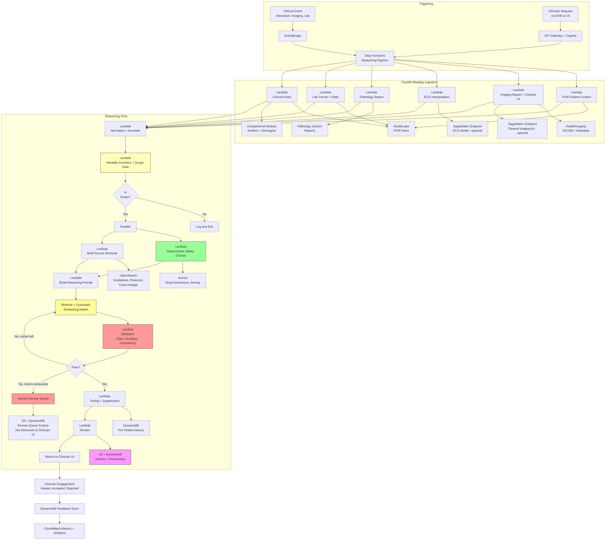

# Recipe 2.10: Multi-Modal Clinical Reasoning

**Complexity:** Complex · **Phase:** Research → Controlled Pilot · **Estimated Cost:** ~$0.40-$4.00 per reasoning run

---

## The Problem

A 62-year-old woman shows up in the emergency department at 11:30 PM with shortness of breath that's been getting worse over three days. She has a history of breast cancer treated five years ago with anthracycline chemotherapy, chronic kidney disease (eGFR 44), type 2 diabetes, and rheumatoid arthritis on methotrexate. Her vital signs are borderline: heart rate 108, blood pressure 112/68, respiratory rate 22, oxygen saturation 93% on room air. The triage nurse orders the usual workup. The labs come back over the next hour: troponin mildly elevated at 0.08 (reference <0.04), BNP of 840, D-dimer 1,200, creatinine up from her baseline at 1.6, a mild leukocytosis, and a chest radiograph that the overnight radiologist reads as "bibasilar opacities, cannot exclude pulmonary edema vs atypical infection vs pulmonary embolism; clinical correlation recommended."

The clinician staffing the ED at 11:30 PM has four other patients to think about. This patient's story could reasonably be one of five things: a heart failure exacerbation (the anthracycline history matters; so does the BNP; her prior echo showed borderline LV function), a pulmonary embolism (elevated D-dimer, tachycardia, recent travel or immobility unknown, rheumatoid arthritis is a mild pro-thrombotic state), atypical pneumonia (the imaging is compatible, the methotrexate makes immunosuppression relevant), an acute coronary syndrome (the troponin is low-grade positive, she has diabetes), or cardiotoxicity recurrence from the remote chemotherapy (anthracycline cardiomyopathy can present years later, and the BNP fits). The clinician has to decide, in the next twenty or thirty minutes, what to image next (CT pulmonary angiography? echocardiogram? both?), what to start empirically (heparin? antibiotics? diuretics?), and where to send the patient (discharge, observation, admission to medicine, admission to a step-down, admission to the ICU).

The information to answer this question is all present somewhere. The patient's chart has the prior echocardiogram report from two years ago. The chemotherapy history is in the oncology notes. The troponin and BNP trends are in the lab system. The radiograph is in PACS, and there's a CT chest from three years ago in there too. The problem list has the relevant diagnoses. The medication list has the methotrexate and the doses. The rheumatology notes describe her joint disease activity. The endocrinology notes describe her diabetes control. The primary care notes from a month ago mention a new exertional complaint she didn't escalate. All of this exists, in different systems, in different formats (structured labs, prose notes, radiology reports, imaging pixels, vital sign time series), spanning six or seven years of care.

The clinician cannot assimilate all of it in twenty minutes. Nobody can. So she triages. She reads the triage note, scans the labs, eyeballs the radiograph herself, reviews the problem list, asks the patient a quick history, performs a focused exam, and forms a differential. She does it well, most nights. She misses things, too. The anthracycline history may not make it into her differential because it's buried in a 2019 oncology note she doesn't open. The prior echocardiogram findings may not surface because the echo report is in a different tab. The slight increase in creatinine from her baseline, which matters for contrast dye decisions and for drug clearance, may get noticed or may not. She is, in effect, running a multi-modal reasoning task on a compressed time budget with a human-sized working memory, and the outcome for this patient depends on whether the right pieces of her long longitudinal record make it into the clinician's consciousness in the next twenty minutes.

The chronic version of this problem is the primary care visit with multiple interacting conditions. A patient with diabetes, heart failure, chronic kidney disease, and a recent medication change visits her primary care doctor. The diabetes has been drifting (A1c up from 7.2 to 8.5 over six months). The heart failure is stable but she had a small weight gain logged at a nurse call last week. The kidney function has declined modestly (eGFR from 52 to 46). The last echocardiogram shows slightly worse LV function than two years ago. There are four interacting modalities here: lab trends over time, weight as a single physiologic time series, imaging-derived ejection fraction, and a pile of clinic notes. A thoughtful primary care physician synthesizes these into a coherent story: "her diabetes isn't controlled, which is worsening both her kidney function and her volume status; she needs a medication change that addresses all three." A rushed primary care physician addresses the diabetes in isolation because that's what the A1c says, and misses the interconnectedness.

The specialty version. A hepatologist is evaluating a patient for a transplant listing. The patient's labs, imaging, endoscopy findings, biopsy pathology, psychosocial evaluation, and nutritional assessment all feed into the decision. The Model for End-Stage Liver Disease (MELD) score is one number distilled from a subset of the labs, but the actual decision is multi-modal. It takes the patient a year to accumulate the data, and the decision involves a multidisciplinary committee because no single human holds all the data in their head coherently.

The bleeding-edge version. A pulmonary nodule detected on a screening chest CT has to be risk-stratified. The nodule's size, shape, and density from the CT are image features. The patient's age, smoking history, and family history are structured data. The prior imaging studies, if any, provide a time trajectory (has it grown?). The clinical context (is the patient immunocompromised? any recent infections?) is prose. Existing risk models (Mayo Clinic model, Brock model, the PanCan model) integrate some but not all of this. A reasoning system that combines all of the inputs to produce a calibrated probability and a recommended next step (observation, shorter-interval repeat imaging, PET, biopsy) is what clinicians actually need, and what current practice cobbles together manually.

What clinicians have been asking for, across all of these scenarios, is something that can reason across modalities the way a skilled consultant does: notice that the elevated BNP fits better with the heart failure hypothesis than the PE hypothesis given the prior echo, that the elevated D-dimer is less impressive given the active inflammation from rheumatoid arthritis, that the creatinine bump argues against certain contrast-requiring imaging choices. The system should surface the reasoning, not just the conclusion. It should preserve the pieces of evidence that drove the reasoning. It should flag when evidence contradicts itself. It should say "I don't know" when the picture is genuinely ambiguous.

Two years ago, this was science fiction. Today, it is barely feasible for narrow scenarios with heavy engineering investment and a willingness to keep the deployment posture conservative. The FDA has views. Your malpractice carrier has views. The radiology society has views about AI-in-imaging that apply here too. The pattern that is emerging, and the one this recipe is about, is not "let the model reason end-to-end." It is "use specialized models for each modality, combine their outputs through a reasoning layer, ground everything in the source evidence, and keep the clinician firmly in control." Multi-modal clinical reasoning is the capstone of this chapter because it is the hardest, riskiest, most regulated, and most valuable thing in the category. Done right, it helps skilled clinicians think faster and more completely. Done wrong, it is the fastest way to end up in front of the FDA explaining yourself.

---

## The Technology: Modality-Specific Encoders, a Reasoning Layer, and Visible Evidence

### What "Multi-Modal" Actually Means Here

The word "multi-modal" is used loosely in the AI literature. In this recipe, it means a specific thing: the system integrates clinical information that lives in structurally different representations. Structured lab values and vitals are numeric time series. Clinical notes are prose. Imaging reports are prose produced from pixels. Imaging studies themselves are pixel data (DICOM). ECGs are a different flavor of time series (high-frequency multi-lead waveforms). Pathology slides are also pixels but at gigapixel scale. Genomic data is a large structured record. Device data from continuous glucose monitors or wearables is streaming time series.

A single patient can have representations from several of these at once. The reasoning task is not "concatenate all of these into a single prompt." That doesn't work for two reasons. First, most modalities cannot be usefully serialized into tokens at their full fidelity. A chest CT has thousands of slices; putting them all in an LLM context is neither feasible nor productive. Second, each modality has its own domain of interpretation. A cardiologist reads an echocardiogram; a pathologist reads a biopsy; an internist synthesizes the interpretations into a plan. The reasoning system should mirror this: specialized interpretation of each modality, followed by a reasoning step that operates on the interpretations.

The practical architecture that has emerged has three layers:

1. **Modality-specific encoders** that produce either a structured interpretation (a radiology report, an ECG interpretation) or a dense embedding that can be retrieved or queried. These are often the right places to use domain-specific models: vision-language models trained on medical imaging, ECG foundation models, pathology foundation models, genomic models.
2. **A reasoning layer** that consumes the outputs of the modality encoders along with structured clinical data and prose notes. The reasoning layer is typically an LLM, prompted to produce a differential, a care recommendation, or an interpretation that ties the modality outputs together. This is where the patient-specific synthesis happens.
3. **A grounding and provenance layer** that ensures every claim in the reasoning step traces back to a specific source: this note, this lab value, this image, this ECG interpretation, this guideline. The provenance layer is what makes the output auditable and what makes the regulatory posture defensible.

The whole pipeline is expensive, slow (relative to unimodal alternatives), and risky. It is also the only approach that actually works for the kind of reasoning clinicians need help with.

### Why Not Just Put Everything in One Big Multi-Modal Model?

Research labs have released impressive multi-modal foundation models that take image and text input and produce diagnostic reasoning output. The demos are striking. The published benchmarks on curated test sets are strong. And for production deployment in healthcare, the models in their current form have several limitations that matter more than the benchmarks suggest:

- **Fidelity mismatch with clinical imaging.** A chest CT has thousands of slices at specific reconstructions. An MRI brain study has multiple sequences, each tuned for a specific purpose (T1, T2, FLAIR, DWI). Mammography has 3D tomosynthesis with specific viewing conventions. A model that accepts "an image" and produces "a finding" is usually operating on a small number of 2D images and missing most of the diagnostic signal a radiologist would use. The research publications tend to feature well-chosen 2D images that match this architecture; production clinical imaging does not.
- **Calibration and confidence.** End-to-end multi-modal models tend to be overconfident, especially on out-of-distribution inputs. A patient whose presentation doesn't match the training distribution will get a confident wrong answer rather than an uncertainty flag. This is exactly the failure mode that matters in clinical decision-making.
- **Provenance opacity.** "Why did the model say this?" is a hard question to answer for an end-to-end model. The clinician gets an output but cannot easily trace which image finding, which note passage, which lab value drove the conclusion. This is the single biggest problem for regulatory posture and clinician trust.
- **Specialty and institutional fit.** Guideline interpretations vary by specialty. Institutional protocols vary across hospitals. A generic model doesn't know your antibiogram, your formulary, your protocols. The reasoning has to happen with those in scope.
- **Regulatory status.** A model that produces a diagnostic impression from image and text is likely a medical device. A pipeline that composes already-cleared modality interpretations with an LLM reasoning layer has a more defensible path to the FDA CDS exemption, as long as the structure and transparency of the pipeline supports "independent review" by the clinician.

So the state-of-the-art research models exist and are impressive, but the production architecture that works is the compositional one: existing cleared imaging AI (or cleared vendor interpretations) producing structured outputs, existing lab and vitals data, existing note text, fed to a reasoning layer with enforced grounding and visible provenance.

### Modality Encoders

Each modality has its own set of encoders to choose from. A few notes on the landscape as it stands today.

**Medical imaging (radiology).** The field has moved in two directions. One direction is specialized narrow models cleared by the FDA: pulmonary embolism detection on CT pulmonary angiography, intracranial hemorrhage detection on CT head, pneumothorax flagging on chest radiograph, breast density estimation on mammography. These models are workflow tools, not synthesizers; they produce a specific finding with a probability. They integrate with PACS and ideally flag studies for priority reads. For a reasoning system, their outputs are structured inputs (a probability of PE, a bounding-box annotation). The other direction is vision-language models for radiology: models that take an image (or image region) and produce a textual description. MedSAM, RadFM, and various commercial offerings sit here. These are useful for producing structured descriptions that feed downstream reasoning. Very few vision-language radiology models are FDA-cleared as diagnostic devices; most are marketed as workflow or documentation assistants, which has regulatory implications.

For the reasoning pipeline here, the practical inputs from imaging are: (a) the existing radiology report, which is already a structured interpretation, and (b) optionally, FDA-cleared narrow-model outputs (the PE probability from the CT PA, the hemorrhage flag from the CT head). Direct pixel-level interpretation by a general multi-modal model, as of today, is more of a research posture than a production one.

**Electrocardiograms (ECGs).** ECG interpretation has a long history of automated algorithms shipped on the ECG machine itself (the "computer-read" at the top of every ECG report). Recent foundation models trained on large ECG datasets (at institutions like Mayo, Cedars-Sinai, and various academic centers) have shown the ability to detect subtle patterns beyond human interpretation, including LV dysfunction from a 12-lead ECG, future atrial fibrillation risk, and even age and sex estimation. Production deployment uses vendor interpretations plus, optionally, cleared foundation-model outputs where available. For a reasoning pipeline, ECG interpretation arrives as structured text plus a few derived scalars (heart rate, QTc, QRS duration).

**Pathology.** Digital pathology is moving fast. Foundation models trained on whole-slide image datasets (virtual slide archives, often by collaborations of academic medical centers) have produced models that can classify tumor tissue, predict molecular subtypes from morphology, and grade specific cancers. These are not yet broadly deployed in production pathology workflows; adoption has been strongest in high-volume tumor sites (prostate, breast) where specific cleared products exist. For a reasoning pipeline, pathology typically contributes its structured report and any cleared-model outputs.

**Laboratory data.** This is already structured. The reasoning system consumes lab values, usually with trend information (last 12 months of creatinine; last 90 days of HbA1c; last 24 hours of troponin). Trends matter more than point values for many clinical questions; a rising troponin is very different from a stable mildly-elevated troponin. Pulling and representing the trends is often the harder problem than interpreting them.

**Vital signs and continuous physiologic data.** Vital signs in outpatient care are sparse point values. In inpatient care they're continuous streams from monitors. Wearable-derived data (continuous glucose monitors, heart rate and rhythm from a wearable device, sleep metrics) is increasingly available. Interpretation ranges from simple threshold-based flags ("heart rate has been above 110 for 2 hours") to sophisticated models (early-warning scores, arrhythmia detection). For a reasoning pipeline, the practical input is summary statistics plus flagged events, not the raw waveform.

**Clinical notes.** Prose. The note-processing pipeline from Recipes 2.6 and 2.9 applies: extract entities, map to ontologies, pull out key clinical facts, preserve the raw text for grounded citation.

**Structured clinical data.** Problem lists, medication lists, allergies, procedures, and genomic data where available. Most of this comes from the EHR via FHIR. Genomic data often lives in a separate system with its own data model (VCF files, annotated variants, interpreted reports).

Each encoder produces something the reasoning layer can consume. The reasoning layer does not reinterpret the imaging pixels or the ECG waveform; it consumes the interpretations.

### The Reasoning Layer

The reasoning layer is an LLM, but with more scaffolding than the reasoning layer of a simpler RAG system. The job of the reasoning layer is to take the interpretations and structured data, consider them as a whole, and produce a coherent clinical synthesis.

Several properties matter:

- **Explicit consideration of multiple hypotheses.** A differential diagnosis is a list of hypotheses with estimated likelihoods given the evidence. The reasoning layer should enumerate these and assess each against the available data, not settle on one hypothesis prematurely.
- **Evidence-for-and-against analysis per hypothesis.** For each hypothesis, what does the data support and what does it weaken? A clinician's internal reasoning does this implicitly; the reasoning layer should do it explicitly and show it in the output.
- **Uncertainty quantification.** Some hypotheses will be well-supported by the data; others will be weakly supported; others will require more information to evaluate. The reasoning layer should distinguish among these, rather than ranking them all with similar-looking confidence scores.
- **Actionable next steps.** The reasoning output is useful when it suggests the next thing to do: image this, obtain this lab, start this empirical therapy, consult this specialty, rule out this thing before acting. Abstract differential lists are less valuable than pathway-integrated recommendations.
- **Visible provenance.** Every claim in the reasoning output should cite its source: this lab value, this note passage, this imaging finding. The output renders with claims linked to source items, so the clinician can audit the reasoning efficiently.
- **Explicit scope boundaries.** The reasoning layer should not fabricate a finding that isn't in the input. If the ECG was not available, the output should say so rather than invent an interpretation. If a guideline wasn't in the retrieval set, the output should not cite a guideline.

The practical output format is structured JSON with a narrative assessment, a ranked differential or recommendation list, per-item evidence in-favor and against citations, flagged contradictions, uncertainty tiering, and suggested next actions. This structure enables downstream validation, clean UI rendering, and audit logging.

### The Time Dimension

A lot of multi-modal reasoning in clinical practice is about change over time, not point-in-time assessment. The patient's creatinine is up from her baseline. The heart failure is worsening. The nodule has grown since the last CT. The glycemic control has drifted. The reasoning system needs to handle time explicitly: not just "what is the current value," but "how does it compare to the prior value, and what is the trend."

The common implementations:

- **Lab trends as derived features.** Compute slopes, deltas, and categorical change features (stable, rising, falling) over clinically relevant windows. Feed these as structured inputs to the reasoning layer alongside the current values.
- **Prior imaging reports as separate retrieved items.** When the current reasoning includes a new imaging study, pull the prior studies of the same anatomy and make them retrievable. Radiology reports often describe their own comparison to prior; this comparison is a high-value input.
- **Temporal event timelines.** Admissions, procedures, medication changes, specialty consults, significant labs: aggregated into a timeline that the reasoning layer can consult. A patient's story often makes sense only in the context of its sequencing.

This is where the reasoning pipeline can outperform a clinician operating under time pressure. A person working under pressure tends to anchor on recent events; a system that faithfully integrates the longitudinal record and surfaces temporally relevant context supplements the clinician's perspective exactly where they are most likely to miss things.

### Grounding and Hallucination: The Problem Scales With Modalities

Every grounding problem from earlier recipes (2.5, 2.6, 2.7, 2.9) applies here, with the additional twist that grounding targets now include imaging findings and modality outputs that aren't easily verifiable by the clinician without opening the source study. A hallucinated line like "moderate LV hypertrophy" in a reasoning output is much more damaging when the clinician doesn't re-open the echo to confirm. The trust pattern has to go further than "the model says this is in the source"; the pattern should be "the model says this, and the source link takes the clinician one click from here to exactly the sentence in the source report that supports the claim."

The additional challenges:

- **Cross-modality consistency.** The lab trend suggests volume overload; the echo shows preserved ejection fraction; the BNP is elevated. These are consistent (diastolic heart failure is compatible), but a reasoning layer that doesn't explicitly check for cross-modality consistency can write assessments that contradict the data. Validation must check every claim not just against the single source it cites, but against the broader data set.
- **Modality absence.** If one of the expected modalities is missing (no recent echo, no ECG this admission), the reasoning layer must acknowledge the absence rather than reason as if it were present. The prompt has to enforce this; the validation layer has to verify it.
- **Modality staleness.** A five-year-old echocardiogram is not the same as a current one. A three-year-old CT showing a stable nodule is different from a three-month-old CT. The reasoning layer has to consider freshness and communicate when relevant data is old.
- **Quantitative fabrication.** Numbers are particularly prone to hallucination. A model may confidently report "ejection fraction 45%" when the actual source says "ejection fraction was 55% on the 2023 echo and has not been repeated since." Numbers in the output should appear verbatim in the input; validation enforces this.
- **Grading fabrication.** Radiology reports use graded language ("mild", "moderate", "severe"). A reasoning output that upgrades or downgrades a grade is a specific and common hallucination pattern. Enforce verbatim grade preservation.

### Regulatory Posture, for Real This Time

Recipe 2.9 covered the four-part FDA CDS exemption in detail. Multi-modal reasoning sits closer to the edge of that exemption than CDS over structured data alone. The additional considerations:

- **Imaging interpretation is typically regulated.** A system that produces a diagnostic impression from pixels is a device. The CDS exemption generally does not save you. If your pipeline's output quotes or restates an imaging impression that the pipeline itself generated, you have likely created a device. If your pipeline consumes an impression generated by a cleared system or a human radiologist and uses it as input, the pipeline's output is a reasoning layer over pre-existing data.
- **Diagnostic recommendations are higher risk than management recommendations.** A reasoning output that produces a differential diagnosis is closer to diagnostic software than a reasoning output that refines a management plan given a known diagnosis. Both exist on the regulatory spectrum; their positions differ.
- **High-stakes decisions are more regulated.** Oncology treatment selection, critical care decisions, emergency triage: higher stakes and more scrutiny. The design of these systems should include additional safeguards: more clinician-in-the-loop points, more conservative uncertainty handling, more explicit "this is decision support, not diagnosis" framing.
- **Subspecialty consultation replacement is not the product.** A system framed as "replaces specialist consultation" is much more regulated than a system framed as "helps the primary clinician ask better questions before the specialist consult." The framing and the product design should match the regulatory posture you can defend.
- **Validation requirements scale with scope.** A narrow, well-scoped reasoning application (heart failure management for cardiology clinic) has a feasible validation path. A broad, general-purpose clinical reasoner has a validation surface area that is near-infinite. Most teams that succeed here start very narrow and expand deliberately, with each expansion triggering its own validation study.
- **Post-market surveillance is higher stakes.** Any deployed reasoning system should be instrumented for outcomes tracking. The regulatory framework increasingly expects evidence of real-world performance, not just pre-deployment validation on curated sets.

The conservative production posture, which is the right one for this recipe: start with a narrow, well-scoped application; build in explicit CDS-exemption-compatible design (source transparency, clinician independent review, framing as options not directives); validate rigorously; deploy in a controlled pilot; expand only after both the clinical data and the regulatory posture support it.

### The Failure Modes, Specific to Multi-Modal

All of the failure modes from earlier recipes apply. The multi-modal specific ones:

- **Cross-modality contradiction swallowed.** The echo says one thing, the lab says another, the reasoning output papers over the contradiction. Mitigation: explicit contradiction-surfacing in the prompt; post-generation validation that checks for consistency across modalities.
- **Missing modality ignored.** The ECG is not present for this patient; the reasoning proceeds as if it were. Mitigation: explicit modality-inventory step before reasoning; prompt must include an inventory of which modalities are present and which are absent.
- **Stale modality treated as current.** A three-year-old echo used to support a current assessment. Mitigation: timestamps on every modality input; the prompt must include recency and the reasoning layer must explicitly consider recency.
- **Over-reliance on one modality.** The reasoning layer anchors on the single most salient input (usually the imaging report) and underweights others. Mitigation: prompts that require evidence-for-and-against for each hypothesis, with explicit sourcing from multiple modalities.
- **Fabrication on the gap between modalities.** The reasoning layer generates a claim that sits in the gap between modality outputs ("there is likely an underlying inflammatory process") that isn't directly supported by any source. Mitigation: strict citation discipline; post-generation validation that flags uncited claims.
- **Specialty register mismatch.** A reasoning output written for a generalist audience may miss the specialist-specific nuances. Mitigation: audience-aware prompting; optional specialty-specific templates.
- **Quantitative drift.** The original report says "LVEF 50-55%," the reasoning says "LVEF 50%," downstream decisions are made on the lower number. Mitigation: verbatim-quote enforcement for all quantitative values; validation that flags any number in the output not appearing verbatim in a source.
- **Confidence miscommunication.** The reasoning layer reports high confidence because the data is internally consistent, without acknowledging that the data is incomplete. Mitigation: explicit separation of "confidence given the available data" and "completeness of the available data" in the output.
- **Scope creep.** The system trained for heart failure is used on a patient with a different primary problem; the reasoning is less applicable. Mitigation: scope-gating; explicit decline to reason when the patient's primary issue is out of scope.
- **Cumulative bias.** Each modality carries biases from its training data and its production acquisition patterns; the reasoning layer inherits and sometimes amplifies them. Mitigation: ongoing evaluation across demographic subgroups; explicit fairness monitoring in post-market surveillance.

### Why This Sits Where It Does on the Complexity Curve

Recipe 2.10 is the most complex recipe in this chapter, and arguably the most complex in the book. Three reasons compound:

1. **Data breadth.** The reasoning layer consumes inputs from several pipelines (imaging AI, ECG interpretation, lab systems, clinical notes, structured EHR data). Each is its own integration problem. Each has its own failure modes that propagate into the reasoning.
2. **Reasoning depth.** Unlike earlier recipes that describe a single kind of synthesis, this recipe requires genuine clinical reasoning across competing hypotheses with uncertainty quantification. This is closer to what expert clinicians do than what any single model alone can approximate reliably.
3. **Regulatory and liability exposure.** Every recipe in this chapter has some regulatory exposure; this one has the most. Imaging-adjacent reasoning, multi-modal diagnostic synthesis, potential direct impact on clinical decisions: the FDA, state medical boards, malpractice carriers, and institutional risk management are all stakeholders.

The payoff, when it works, is real. The cases where multi-modal reasoning helps are the cases where the clinician is under time pressure with incomplete access to the patient's longitudinal record, which is most clinical cases most of the time. The reasoning layer becomes the thing that surfaces the anthracycline history from 2019 when the patient presents with new heart failure symptoms in 2026. That is valuable. Building it safely is the point.

---

## The General Architecture Pattern

The overall flow looks like this:

```
[Trigger: Clinical Scenario or Clinician Query]
    → [Fetch Patient Context (FHIR + Modality Inventory)]
    → [Modality-Specific Ingestion]
        → [Imaging Reports + Cleared AI Outputs]
        → [ECG Interpretations]
        → [Lab Trends and Vitals Summary]
        → [Clinical Notes]
        → [Structured EHR: Problems, Meds, Allergies]
    → [Normalize and Annotate with Timestamps and Provenance]
    → [Modality Inventory and Scope Gate]
    → [Deterministic Safety Checks (Interactions, Contraindications, Allergies)]
    → [Retrieval: Guidelines, Protocols, Prior Cases]
    → [Reasoning Layer: Multi-Hypothesis Synthesis with Grounding]
    → [Post-Generation Validation (Cite Check, Cross-Modal Consistency, Verbatim Quantities)]
    → [Tiering and Uncertainty Rendering]
    → [Render with Evidence Links to Each Modality Source]
    → [Log Full Provenance for Audit and Regulatory Evidence]
```

**Trigger.** An ED presentation, a new admission, a clinician-requested reasoning run, a planned oncology treatment-selection conversation, a multidisciplinary tumor board preparation. Scoped triggers work better than any-time-anywhere triggers for multi-modal reasoning. Start narrow.

**Fetch patient context.** Pull the FHIR bundle (as in Recipe 2.9) and also pull pointers to the imaging studies, ECG recordings, pathology reports, and other modality-specific items in their native systems. At this stage the system knows what exists; it hasn't interpreted any of it yet.

**Modality-specific ingestion.** For each modality, acquire the interpretation. For imaging, this means the radiology report (or a cleared AI output, or both). For ECG, the machine interpretation plus any cleared foundation-model output. For pathology, the reported findings. For labs, the time series with reference ranges. For vitals, summary statistics plus flagged events. For notes, the text with basic structure. For structured EHR, the problem list, medication list, allergy list. This is typically a parallel step; each modality's ingestion runs independently.

**Normalize and annotate.** Each modality's output gets timestamped, source-identified, and coded where applicable. Imaging reports get mapped to RadLex or SNOMED where useful. ECG findings get mapped to standard terminology. Labs use LOINC. Medications use RxNorm. The result is a unified patient state record with modality provenance intact.

**Modality inventory and scope gate.** Before reasoning runs, the system enumerates what is present and what is absent. The scope gate checks that the reasoning scenario is appropriate given the available modalities (you can't do a comprehensive cardiology reasoning without any cardiac imaging; either defer or scope down). The gate also suppresses reasoning when a recent reasoning run covered the same scenario without material changes.

**Deterministic safety checks.** As in Recipe 2.9: interactions, contraindications, allergies, dosing against renal and hepatic function. These run as structured queries, and their outputs become hard inputs to the reasoning layer.

**Retrieval.** Guidelines and institutional protocols relevant to the scenario. Recent case analogs from a clinical case corpus if available (a highly-curated corpus of similar cases with outcomes, useful for specific scenarios). The retrieval is similar to Recipe 2.9 but may include modality-specific retrieval (imaging findings of the same type, ECG patterns matching the current one, pathology reports with similar morphology).

**Reasoning layer.** The LLM call, with a prompt that includes the patient context, the modality inventory and interpretations, the retrieved sources, and the deterministic safety findings. The prompt enforces multi-hypothesis evaluation with evidence-for-and-against per hypothesis, verbatim preservation of quantitative values and graded terms, explicit handling of missing modalities, cross-modality consistency, citation discipline, and framing as options. The output is structured JSON.

**Post-generation validation.** Citation check (every claim traces to a source), verbatim check (numbers and graded terms match sources), cross-modality consistency check (no claim contradicts another modality's input), modality coverage check (all present modalities considered; missing modalities acknowledged), scope check (recommendations within scope). Failures retry with augmented prompting up to a cap. Retry-exhausted failures route to a distinct human-review queue with a separate DynamoDB record and S3 archive; they do NOT proceed to tier/render/archive, and do NOT flow to the clinician UI as delivered reasoning. Only a `VALIDATED` reasoning output is delivered.

**Tiering and rendering.** Recommendations tiered by clinical importance. Rendering foregrounds reasoning and evidence. Every modality source is one click away (open the imaging study in PACS, open the ECG waveform, open the original note). Uncertainty is explicit in both overall and per-recommendation form.

**Provenance logging.** The trigger, the modality inventory, each modality's interpretation, the retrieval trace, the deterministic safety findings, the prompt version, the model version, the generation output, the validation result, the rendered output, the clinician engagement. This is the regulatory evidence trail.

---

## The AWS Implementation

### Why These Services

**Amazon Bedrock for the reasoning layer.** A capable generation model (Claude Sonnet or equivalent) handles the multi-hypothesis reasoning and synthesis. A cheaper fast model (Claude Haiku, Nova Lite, or equivalent) handles scenario classification, modality inventory summarization, and retrieval planning. Bedrock is the right fit because the workload needs grounded generation with structured output and because it is HIPAA-eligible under AWS BAA.

**Amazon Bedrock Guardrails for contextual grounding enforcement.** Every reasoning output runs through a contextual grounding check against the assembled input context (modality interpretations, retrieved sources, patient data). Grounding failures trigger retry or reject. For multi-modal reasoning the grounding enforcement is non-negotiable because the stakes of fabrication are higher than in unimodal cases. For this recipe, a contextual grounding threshold at or above 0.85 is the conservative starting point; tune upward for scenarios where fabrication tolerance is lowest (oncology treatment selection, critical-care decisions) and re-evaluate per scenario during clinical validation. The same Guardrail policy must also have input-side prompt-attack filters enabled, because retrieved modality content (reports, notes, guidelines, protocols, vendor AI outputs) is an untrusted-input surface, not verified instructions.

**Amazon HealthLake for the FHIR-native patient context.** HealthLake is the natural store for the structured clinical data layer. The reasoning pipeline queries HealthLake for the FHIR bundle at the start of each run.

**Amazon HealthImaging for DICOM management.** HealthImaging is a HIPAA-eligible, purpose-built store for medical imaging. For a pipeline that needs to reference prior imaging, retrieve current imaging metadata, and link from the reasoning output back to the source study, HealthImaging is the right imaging-native layer. The reasoning pipeline itself typically does not perform direct pixel interpretation; it uses HealthImaging metadata and the radiology report for text-based reasoning, and deep-links back to the study in the PACS viewer for clinician review.

**Amazon Transcribe Medical or Amazon HealthScribe when audio-derived content is in scope.** For pipelines that include the conversational-context modality (the clinician's current encounter), Transcribe Medical or HealthScribe produces the transcript. This is less common in a point-of-care reasoning pipeline but applies in ambient-documentation-plus-reasoning architectures.

**Amazon Comprehend Medical for entity extraction and ontology mapping.** Notes, radiology reports, pathology reports, ECG reports all benefit from entity extraction with mapping to RxNorm, ICD-10, SNOMED, and RadLex where applicable. The resulting structured records are easier to reason over and easier to cite.

**Amazon SageMaker for specialized modality models when needed.** Cleared or institutional-custom models for imaging AI (if not using a cleared vendor's hosted service), ECG foundation models (if institutionally deployed rather than vendor-hosted), and pathology foundation models run on SageMaker Endpoints. These are optional; many deployments use vendor-hosted modality AI.

**Amazon OpenSearch Service for guideline retrieval and the case-analog corpus.** Hybrid search (vector plus BM25 plus metadata filters) works well for guideline retrieval, prior imaging reports, and institutional protocol content. For the case-analog corpus, where retrieval queries can include structured facets (similar lab patterns, similar demographic profile, similar imaging findings), OpenSearch's combination of dense retrieval and filter expressions is a good fit.

**Amazon Aurora PostgreSQL with pgvector for structured drug data and derived features.** Interactions, contraindications, renal dosing, drug-disease interactions: these stay in Aurora exactly as in Recipe 2.9.

**Amazon S3 for modality artifacts, per-run archives, and corpus.** Imaging report text, ECG report text, pathology report text, retrieval traces, the per-reasoning-run archive. Each modality's artifacts with source metadata. SSE-KMS with customer-managed keys. Lifecycle rules per institutional retention policy.

**AWS Step Functions for orchestration.** The reasoning pipeline has parallel modality ingestion, sequential reasoning-and-validation, branching for retry and human-review routing. Step Functions makes the flow visible, resumable, and debuggable.

**AWS Lambda for per-stage logic.** Each ingestion stage, the normalization layer, the modality inventory, the scope gate, the reasoning-layer call, the validation layer, the rendering layer, the archival stage. Lambda is the default compute; SageMaker Endpoints for long-running modality inference when applicable.

**Amazon DynamoDB for per-run metadata and the clinician engagement log.** Reasoning run identifier, patient identifier, encounter identifier, clinician identifier, status, links to S3 artifacts, links to the rendered output, clinician interaction log.

**Amazon EventBridge for clinical triggers and scheduled retraining.** New ED presentation, new admission, new imaging study finalized, new lab result crossing a clinical threshold, clinician-requested reasoning: all can route through EventBridge.

**Amazon API Gateway with Amazon Cognito for the clinician-facing API.** SMART on FHIR where the EHR supports it. CDS Hooks for specific workflow points. Standard REST for direct calls.

**AWS Secrets Manager for external API credentials.** Drug databases, FHIR endpoints, cleared imaging AI vendor APIs, ECG foundation model APIs, formulary services.

**AWS CloudTrail, Amazon CloudWatch, and Amazon CloudWatch Logs for audit and monitoring.** Every service call, every Bedrock invocation, every storage access, every validation outcome. Metrics on latency, validation pass rates, clinician engagement, cross-modality consistency failures, scope-gate denials, and the counts that matter for regulatory evidence.

**AWS KMS for encryption.** Customer-managed keys with per-modality policies where retention and access differ.

### Architecture Diagram




### Prerequisites

| Requirement | Details |
|-------------|---------|
| **AWS Services** | Amazon Bedrock, Amazon Bedrock Guardrails, Amazon HealthLake, Amazon HealthImaging, Amazon Comprehend Medical, Amazon OpenSearch Service (or Serverless), Amazon Aurora PostgreSQL with pgvector, Amazon S3, AWS Lambda, AWS Step Functions, Amazon DynamoDB, Amazon EventBridge, Amazon API Gateway, Amazon Cognito, AWS Secrets Manager, Amazon CloudWatch, AWS CloudTrail, AWS KMS. Amazon SageMaker for self-hosted modality models (imaging, ECG, pathology foundation models) where vendor-hosted options do not apply. Amazon Transcribe Medical or Amazon HealthScribe when conversational context is an input modality. |
| **IAM Permissions** | `bedrock:InvokeModel`, `bedrock:ApplyGuardrail`, `healthlake:ReadResource`, `healthlake:SearchWithGet`, `medical-imaging:GetImageSetMetadata`, `medical-imaging:SearchImageSets`, `medical-imaging:GetDICOMImportJob`, `comprehendmedical:DetectEntitiesV2`, `comprehendmedical:InferRxNorm`, `comprehendmedical:InferICD10CM`, `comprehendmedical:InferSNOMEDCT`, `es:ESHttpPost` and `es:ESHttpGet` for OpenSearch, `rds-data:ExecuteStatement` for Aurora Data API (or credentials via Secrets Manager), `sagemaker:InvokeEndpoint` for hosted modality models, `s3:GetObject`, `s3:PutObject`, `dynamodb:GetItem`, `dynamodb:PutItem`, `dynamodb:UpdateItem`, `dynamodb:Query`, `states:StartExecution`, `events:PutEvents`, `secretsmanager:GetSecretValue`, `kms:Decrypt`, `kms:GenerateDataKey`. Scope each action to specific resource ARNs. |
| **BAA** | AWS BAA signed. Every service in the pipeline must be HIPAA-eligible under the BAA. Patient context, imaging metadata, ECG interpretations, and the reasoning output itself all contain PHI. |
| **Regulatory Determination** | Required before pilot deployment. Document the intended scope of use, the FDA CDS exemption analysis (the four criteria), the design decisions that support clinician independent review, the source transparency posture, the clinician review workflow, the validation plan. If the determination concludes the product is a medical device, the development path changes materially (FDA submission, validation studies, labeling, post-market surveillance under the quality system regulation). Retain documentation for either outcome. Involve regulatory affairs and legal at design time. |
| **Source Licensing** | Guidelines, drug databases, and institutional protocol content each have their own licensing posture (per Recipe 2.9). Imaging-AI vendor outputs are typically covered under the vendor contract and have specific redistribution and retention terms. Cleared models must stay within the cleared use scope. Maintain a license registry and enforce constraints in the rendering and retention layers. |
| **Bedrock Model Access** | Request access to a strong generation model (Claude Sonnet or equivalent) for the reasoning layer and a cheaper model (Claude Haiku or Nova Lite) for auxiliary tasks. Evaluate the chosen generation model against representative reasoning scenarios with clinician-reviewed gold answers before pilot deployment. |
| **Modality AI Vendor Decisions** | Cleared imaging AI vendors produce structured outputs for specific imaging modalities and findings (Aidoc, Viz.ai, RapidAI, others for specific indications). Contracts usually include workflow integration, API access, and retention terms. Evaluate each before commitment; verify FDA clearance for the intended use; verify performance data in your patient population; confirm integration complexity. Non-cleared models (including many vision-language models) have a different regulatory posture and should not be used for diagnostic impression generation without explicit regulatory review. |
| **Encryption** | S3 (modality artifacts, per-run archives, corpus): SSE-KMS with customer-managed keys, distinct keys per modality if retention policies differ. DynamoDB: encryption at rest with CMK. OpenSearch: encryption at rest and in transit, fine-grained access control, no public endpoint. Aurora: encryption at rest, TLS in transit. HealthLake and HealthImaging: encryption at rest with CMK. Bedrock and Comprehend Medical: TLS in transit. Bedrock model-invocation logging (if enabled) contains PHI; log destinations must be encrypted to the same standard as the archive. |
| **VPC** | Production: Lambda in private subnets with interface endpoints for Bedrock (Runtime and Guardrails), Comprehend Medical, HealthLake, HealthImaging, KMS, Secrets Manager, Step Functions, CloudWatch Logs, CloudWatch (monitoring), and EventBridge. Gateway endpoints for S3 and DynamoDB. If API Gateway is configured as a private REST API (recommended for EHR-internal clinician-facing endpoints), add the `execute-api` interface endpoint. Aurora and OpenSearch in VPC with security groups restricted to the Lambda execution role. SageMaker Endpoints in VPC if used. Factor interface endpoint costs into the cost estimate. |
| **CloudTrail** | Enabled with data events for Bedrock invocations, S3 object access, DynamoDB access, HealthLake reads, HealthImaging reads, SageMaker endpoint invocations, and Secrets Manager retrievals. Correlate each reasoning run to the requesting clinician and the patient identifier via Cognito session claims. |
| **Sample Data** | Development: synthetic FHIR bundles (Synthea), open guideline content (USPSTF, CDC, HHS, open society guidelines), open imaging report corpora (MIMIC-CXR reports are a common starting point), open ECG data (PhysioNet datasets). Never use real PHI in dev. Evaluation: curated case-scenario-to-reasoning-output pairs reviewed by clinical domain experts; these are expensive to assemble and essential for meaningful validation. |
| **Cost Estimate** | Per-run cost varies substantially with scenario complexity and modalities in scope. Typical ranges: patient context fetch plus normalization $0.01-$0.03; modality ingestion $0.02-$0.15 (cleared imaging AI calls and foundation model calls dominate when enabled); deterministic safety checks $0.005-$0.02; retrieval $0.02-$0.08; reasoning layer $0.15-$2.50 (depends heavily on context size and model choice; multi-modal reasoning contexts can be large); validation $0.02-$0.10. End-to-end: $0.40-$4.00 per run for typical focused scenarios. Broad scenarios with multi-year longitudinal context plus validator retries can exceed the top of that range; budget $5-$8 per run for worst-case comprehensive reasoning. At 300 runs per day in a focused deployment, variable cost runs $120-$1,200/day. Fixed infrastructure (OpenSearch cluster, Aurora, HealthLake baseline, HealthImaging baseline, optional SageMaker Endpoints) adds $1,000-$5,000/month depending on scale and optional modality models. |

### Ingredients

| AWS Service | Role |
|------------|------|
| **Amazon Bedrock (reasoning)** | Multi-hypothesis reasoning with a capable generation model; auxiliary tasks with a cheaper model |
| **Amazon Bedrock (embeddings)** | Titan or Cohere embeddings for guideline and case-analog indexing |
| **Amazon Bedrock Guardrails** | Contextual grounding enforcement on the reasoning output; content filters; PII policies |
| **Amazon HealthLake** | FHIR-native store for structured patient context |
| **Amazon HealthImaging** | HIPAA-eligible DICOM store with imaging metadata access for reasoning pipelines |
| **Amazon Comprehend Medical** | Entity extraction and ontology mapping (RxNorm, ICD-10, SNOMED) for notes, radiology reports, pathology reports, ECG reports |
| **Amazon OpenSearch Service** | Hybrid retrieval of guidelines, institutional protocols, and case analogs |
| **Amazon Aurora PostgreSQL + pgvector** | Structured drug data (interactions, dosing, contraindications) with vector search for associated prose |
| **Amazon SageMaker Endpoints (optional)** | Self-hosted modality models (imaging, ECG, pathology foundation models) when vendor-hosted options do not apply |
| **Amazon S3** | Modality artifacts, per-run archives, retrieval traces, corpus storage |
| **AWS Lambda** | Per-stage pipeline logic for ingestion, reasoning, validation, rendering, archival |
| **AWS Step Functions** | Reasoning pipeline orchestration with parallel modality ingestion and sequential reasoning and validation |
| **Amazon DynamoDB** | Per-run metadata, per-patient reasoning history, clinician engagement tracking |
| **Amazon EventBridge** | Clinical-event triggers and scheduled operations |
| **Amazon API Gateway + Cognito** | Authenticated clinician-facing API (SMART on FHIR if EHR-launched; CDS Hooks for workflow integration) |
| **AWS Secrets Manager** | Credentials for FHIR endpoints, drug databases, cleared imaging AI vendors, ECG model APIs, formulary services |
| **AWS KMS** | Encryption key management with distinct keys per modality and per data class |
| **Amazon CloudWatch + CloudTrail** | Operational metrics, HIPAA audit logs, regulatory evidence trail |

### Code

#### Walkthrough

**Step 1: Trigger and orchestrate.** The pipeline starts from a clinical event or a clinician request. The first step creates the reasoning run record and prepares to kick off parallel modality ingestion.

<!-- TODO (TechWriter, from expert review A3): EventBridge is at-least-once
     delivery. The UUID approach here produces a new run on every duplicate
     delivery. Consider deriving run_id from a deterministic event-key hash
     (for example `f"{patient_id}:{encounter_id}:{scenario}"`) and using a
     DynamoDB conditional write (`attribute_not_exists(run_id)`) plus a
     Step Functions deterministic execution name so duplicates are rejected
     at the orchestration layer rather than running the full pipeline twice.
     This pattern has recurred across multiple Chapter 2 recipes and is a
     candidate for a chapter-wide appendix. -->

```
FUNCTION start_reasoning_run(trigger):
    // trigger.type: "ed_presentation", "admission", "oncology_treatment_planning",
    //               "clinician_request", etc.
    // trigger.patient_id: FHIR Patient ID
    // trigger.encounter_id: FHIR Encounter ID (when applicable)
    // trigger.scenario: scoped scenario name for the reasoning
    // trigger.clinician_id: Cognito user ID for audit trail

    run_id = generate UUID

    // Write the run record early for traceability
    write to DynamoDB table "mm-reasoning-runs":
        run_id         = run_id
        trigger_type   = trigger.type
        scenario       = trigger.scenario
        patient_id     = trigger.patient_id
        encounter_id   = trigger.encounter_id
        clinician_id   = trigger.clinician_id
        status         = "INITIATED"
        initiated_at   = current UTC timestamp

    // Kick off Step Functions execution; the state machine handles parallel ingestion
    start Step Functions execution:
        state_machine_arn = MM_REASONING_STATE_MACHINE_ARN
        name              = run_id
        input             = {
            run_id:       run_id,
            trigger:      trigger,
            scenario:     trigger.scenario
        }

    RETURN { run_id: run_id }
```

**Step 2: Parallel modality ingestion.** Each modality's ingestion runs as an independent Lambda invocation. The inventory of what was successfully ingested and what failed flows into the next stage.

```
FUNCTION ingest_imaging(run_id, patient_id, scenario):

    // Determine which imaging studies are relevant for this scenario and patient
    imaging_studies = list_relevant_imaging(patient_id, scenario)
    // For ED presentation: current encounter's imaging plus most recent prior
    // For oncology planning: staging studies plus most recent restaging

    imaging_records = empty list

    FOR each study in imaging_studies:
        // Pull the imaging metadata from HealthImaging
        metadata = call HealthImaging.GetImageSetMetadata:
            datastore_id = HEALTHIMAGING_DATASTORE_ID
            image_set_id = study.image_set_id

        // Pull the radiology report from HealthLake or the report system
        // Reports are typically DocumentReference resources in FHIR
        report = call HealthLake.SearchResources:
            resource_type = "DocumentReference"
            filter        = { subject: patient_id,
                              study_instance_uid: metadata.study_instance_uid,
                              category: "radiology-report" }

        // Extract structured content from the report
        report_entities = call ComprehendMedical.DetectEntitiesV2(report.content)
        radlex_mapped   = map_radlex(report_entities) if applicable

        // If a cleared imaging AI vendor has output for this study, retrieve it
        cleared_ai_outputs = empty list
        IF scenario_requires_cleared_ai(scenario, metadata.modality):
            vendor_output = call imaging_ai_vendor.get_result:
                study_uid = metadata.study_instance_uid
            // vendor_output is a structured result: e.g., PE probability + localization
            IF vendor_output is present:
                append {
                    finding_type:    vendor_output.finding_type,
                    probability:     vendor_output.probability,
                    localization:    vendor_output.localization,
                    vendor_name:     vendor_output.vendor_name,
                    clearance_info:  vendor_output.clearance,
                    study_uid:       metadata.study_instance_uid,
                    timestamp:       vendor_output.produced_at
                } to cleared_ai_outputs

        append {
            modality_type:      "imaging",
            study_modality:     metadata.modality,        // CT, MR, CR, etc.
            study_description:  metadata.study_description,
            study_date:         metadata.study_date,
            study_uid:          metadata.study_instance_uid,
            report_text:        report.content,
            report_entities:    report_entities,
            radlex_mapped:      radlex_mapped,
            cleared_ai_outputs: cleared_ai_outputs,
            pacs_deep_link:     build_pacs_deep_link(metadata),
            source_id:          f"imaging:{metadata.study_instance_uid}"
        } to imaging_records

    RETURN imaging_records
```

```
FUNCTION ingest_ecg(run_id, patient_id, scenario, encounter_id):

    // ECGs are typically referenced as Observation or DocumentReference in FHIR
    ecg_records_fhir = call HealthLake.SearchResources:
        resource_type = "Observation"
        filter        = { subject: patient_id,
                          code: LOINC_ECG_STUDY_REPORT,
                          date: recent_window_for_scenario(scenario) }

    ecg_records = empty list
    FOR each ecg in ecg_records_fhir:
        // Extract the machine interpretation
        machine_interp = extract_ecg_machine_interpretation(ecg)

        // Extract the human over-read if available
        overread = extract_ecg_overread(ecg)

        // Extract key numeric parameters
        hr   = extract_component(ecg, "heart-rate")
        qtc  = extract_component(ecg, "qtc-interval")
        qrs  = extract_component(ecg, "qrs-duration")
        axis = extract_component(ecg, "qrs-axis")

        // Optional: call ECG foundation model for additional interpretation
        foundation_model_output = empty dict
        IF scenario_requires_ecg_foundation_model(scenario):
            // Assumes the waveform is accessible via some reference;
            // real deployment pulls the waveform from an ECG management system
            // and calls a cleared or research-grade endpoint
            foundation_model_output = call SageMaker.InvokeEndpoint:
                endpoint_name = ECG_FOUNDATION_MODEL_ENDPOINT
                body          = { waveform_reference: ecg.derived_from_reference }

        append {
            modality_type:             "ecg",
            ecg_date:                  ecg.effective_date_time,
            machine_interpretation:    machine_interp,
            clinician_overread:        overread,
            hr:                        hr,
            qtc:                       qtc,
            qrs:                       qrs,
            axis:                      axis,
            foundation_model_output:   foundation_model_output,
            source_id:                 f"ecg:{ecg.id}",
            deep_link:                 build_ecg_deep_link(ecg)
        } to ecg_records

    RETURN ecg_records
```

```
FUNCTION ingest_labs_and_vitals(run_id, patient_id, scenario):

    // The scenario determines which labs matter; pull a generous set to start
    scenario_loincs = lab_loincs_for_scenario(scenario)

    labs_by_loinc = dict
    FOR each loinc in scenario_loincs:
        observations = call HealthLake.SearchResources:
            resource_type = "Observation"
            filter        = { subject: patient_id,
                              code: loinc,
                              date: "ge" + months_ago(24) }
        // Sort by effective datetime ascending
        sorted_obs = sort_asc(observations, by="effective_date_time")
        labs_by_loinc[loinc] = sorted_obs

    // Compute derived trend features per scenario-relevant lab
    lab_trends = dict
    FOR each loinc, obs_list in labs_by_loinc:
        IF length(obs_list) >= 2:
            lab_trends[loinc] = {
                current_value:     obs_list[-1].value,
                current_date:      obs_list[-1].effective_date_time,
                prior_value:       obs_list[-2].value,
                prior_date:        obs_list[-2].effective_date_time,
                delta_value:       obs_list[-1].value - obs_list[-2].value,
                delta_percent:     percent_change(obs_list[-2].value, obs_list[-1].value),
                trend_slope:       compute_slope(obs_list),   // over last 90 days
                classification:    classify_trend(obs_list),  // stable, rising, falling, volatile
                baseline_if_known: derive_baseline(obs_list)
            }
        ELSE IF length(obs_list) == 1:
            lab_trends[loinc] = {
                current_value:     obs_list[0].value,
                current_date:      obs_list[0].effective_date_time,
                prior_value:       null,
                classification:    "single_value"
            }

    // Vitals summary
    vitals_loincs = {
        hr:    "8867-4",
        sbp:   "8480-6",
        dbp:   "8462-4",
        rr:    "9279-1",
        temp:  "8310-5",
        spo2:  "59408-5"
    }
    vitals_summary = dict
    FOR each name, loinc in vitals_loincs:
        recent_vitals = call HealthLake.SearchResources:
            resource_type = "Observation"
            filter        = { subject: patient_id, code: loinc,
                              date: "ge" + hours_ago(24) }
        vitals_summary[name] = {
            most_recent: most_recent(recent_vitals),
            min:         minimum(recent_vitals),
            max:         maximum(recent_vitals),
            flagged_events: abnormal_events(recent_vitals)
        }

    RETURN { lab_trends: lab_trends, vitals_summary: vitals_summary,
             source_id: f"labs_vitals:{patient_id}" }
```

```
FUNCTION ingest_notes(run_id, patient_id, scenario):

    // Pull recent notes relevant to the scenario
    notes_fhir = call HealthLake.SearchResources:
        resource_type = "DocumentReference"
        filter        = { subject: patient_id,
                          category: note_categories_for_scenario(scenario),
                          date: "ge" + note_recency_for_scenario(scenario) }

    notes = empty list
    FOR each note in notes_fhir:
        // Extract entities and map to ontologies
        entities = call ComprehendMedical.DetectEntitiesV2(note.content)
        rxnorm   = call ComprehendMedical.InferRxNorm(note.content) if note has meds
        icd10    = call ComprehendMedical.InferICD10CM(note.content)
        snomed   = call ComprehendMedical.InferSNOMEDCT(note.content)

        // Identify key passages the reasoning may cite
        key_passages = extract_key_passages(note, entities)
        // e.g., assessment and plan sections, reason-for-visit, notable findings

        append {
            modality_type:    "note",
            note_type:        note.category,           // progress, consult, discharge, etc.
            specialty:        note.author_specialty if available,
            note_date:        note.date,
            content:          note.content,
            entities:         entities,
            ontology_mapped:  { rxnorm: rxnorm, icd10: icd10, snomed: snomed },
            key_passages:     key_passages,
            source_id:        f"note:{note.id}"
        } to notes

    RETURN notes
```

```
FUNCTION ingest_structured_context(run_id, patient_id):

    // Reuse the pattern from Recipe 2.9 for normalized patient facts
    bundle = call HealthLake.SearchResources:
        resource_types = ["Patient", "Condition", "MedicationRequest",
                          "AllergyIntolerance", "Procedure"]
        patient_id     = patient_id

    structured = normalize_patient_context(bundle)
    // demographics, active_conditions, current_medications, allergies,
    // derived (eGFR, BMI, Child-Pugh as applicable)

    RETURN structured
```


**Step 3: Normalize, annotate, and build the modality inventory.** Each modality's ingestion produces its own representation. This step assembles them into a unified patient state with consistent timestamps, source identifiers, and a modality inventory that the reasoning layer will consult.

<!-- TODO (TechWriter, from expert review A2): each ingestion function currently
     returns a bare list. Expert review A2 recommends distinguishing "failed to
     retrieve" (HealthImaging timeout, Comprehend throttle, vendor AI 500) from
     "genuinely absent" (the patient does not have this modality). Consider
     returning a status-annotated record per modality (`status: "retrieved" |
     "empty" | "failed" | "scoped_out"`) and building the inventory from status
     rather than cardinality. The scope gate's defer path should then route
     `failed` to retry rather than defer. -->
<!-- TODO (TechWriter, from expert review S1): add a PHI-minimization step
     between Step 3 and Step 7 that strips MRN, DOB, name, address, phone,
     email, and payer or NPI identifiers from the serialized state before the
     reasoning prompt is constructed. Bedrock under BAA is compliant for PHI,
     but minimum-necessary applies inside the BAA boundary as well. The
     rendered output re-associates reasoning to the patient via run_id plus
     patient_id; identifiers do not need to round-trip through the prompt. -->

```
FUNCTION normalize_and_inventory(imaging, ecg, labs_vitals, notes, structured):

    // Build the unified patient state
    patient_state = {
        structured_context: structured,
        imaging_records:    imaging,
        ecg_records:        ecg,
        lab_trends:         labs_vitals.lab_trends,
        vitals_summary:     labs_vitals.vitals_summary,
        notes:              notes
    }

    // Build the modality inventory describing what is present and its recency
    modality_inventory = {
        structured_context: {
            present:     true,
            recency:     "current",
            confidence:  "high"
        },
        imaging: {
            present:      length(imaging) > 0,
            count:        length(imaging),
            most_recent:  most_recent_date(imaging),
            modalities:   unique(imaging map to .study_modality),
            cleared_ai_present: any(imaging, has cleared_ai_outputs)
        },
        ecg: {
            present:      length(ecg) > 0,
            count:        length(ecg),
            most_recent:  most_recent_date(ecg)
        },
        labs: {
            present:                length(labs_vitals.lab_trends) > 0,
            current_and_trended:    count_where(labs_vitals.lab_trends,
                                                 classification in ["rising","falling","stable"]),
            single_values_only:     count_where(labs_vitals.lab_trends,
                                                 classification == "single_value")
        },
        vitals: {
            present:         length(labs_vitals.vitals_summary) > 0,
            recency:         "current_encounter"
        },
        notes: {
            present:  length(notes) > 0,
            count:    length(notes),
            types:    unique(notes map to .note_type),
            most_recent: most_recent_date(notes)
        }
    }

    // Annotate each item with a source_id for citation
    // Source IDs are stable within a run and used in the reasoning output

    RETURN { patient_state: patient_state, modality_inventory: modality_inventory }
```

**Step 4: Scope gate.** Given the scenario and the modality inventory, decide whether the reasoning run should proceed. If a recent run covered the same scenario without material changes, suppress. If critical modalities are missing for the scenario, either scope down or defer with an explanatory output.

<!-- TODO (TechWriter, from expert review A4): the "scoped_to" rewrite for
     missing recommended modalities fires only when scenario ==
     "comprehensive_reasoning". For any other scenario (including
     "ed_dyspnea_workup"), a recommended-but-missing modality currently has
     no architectural handler; the recipe depends on the reasoning layer
     obeying the prompt's hard requirements rather than a scope-gate
     guarantee. Consider expanding this branch so every scenario has one of
     three handlers for a missing recommended modality: (a) narrow the scope
     to a sub-scenario, (b) proceed with a completeness_cap of "low", or (c)
     defer when the recommended modality is effectively required for that
     sub-scenario (for example ECG for ACS-inclusive reasoning). -->

```
FUNCTION scope_gate(scenario, modality_inventory, patient_id, recent_runs):

    // recent_runs is a DynamoDB query on the mm-reasoning-runs table by
    // (patient_id, initiated_at) over the SUPPRESSION_WINDOW_HOURS (typically
    // 24 hours). A GSI on patient_id is required; a composite partition key
    // of (patient_id + date) is a reasonable optimization at high-volume
    // facilities.
    //
    // no_material_change_since compares the current modality inventory's
    // content hash to the prior run's stored inventory hash. Material
    // changes include: new imaging study, new ECG, lab value crossing a
    // clinical threshold, new note of a relevant type, medication change.
    decision = {
        proceed:      false,
        reason:       "",
        scoped_to:    null,
        defer_reason: null
    }

    // Suppression: recent run on the same scenario without material changes
    FOR each recent in recent_runs:
        IF recent.scenario == scenario
           AND recent.age_minutes < SUPPRESSION_WINDOW_FOR(scenario)
           AND no_material_change_since(recent, modality_inventory):
            decision.reason = "recently_reasoned_same_scenario"
            RETURN decision

    // Required modalities per scenario
    required = required_modalities_for_scenario(scenario)
    // e.g., for "ed_dyspnea_workup":
    //   required = ["structured_context", "labs", "vitals", "imaging:chest"]
    //   recommended = ["ecg", "notes:recent"]

    missing_required = empty list
    FOR each req in required:
        IF not modality_available(modality_inventory, req):
            append req to missing_required

    IF length(missing_required) > 0:
        decision.proceed = false
        decision.defer_reason = "missing_required_modalities"
        decision.missing = missing_required
        RETURN decision

    // If the scope is "full reasoning" but critical data is missing,
    // the pipeline may scope down to a narrower scenario
    IF scenario == "comprehensive_reasoning" AND any_recommended_missing:
        decision.scoped_to = derive_narrower_scope(scenario, modality_inventory)
        decision.proceed = true
        decision.reason = "scoped_down_due_to_missing_recommended_modalities"
        RETURN decision

    decision.proceed = true
    decision.scoped_to = scenario
    decision.reason = "all_required_modalities_present"
    RETURN decision
```

**Step 5: Deterministic safety checks.** Same pattern as Recipe 2.9. Drug interactions, allergies, contraindications, renal and hepatic dose flags. The outputs are hard inputs to the reasoning prompt.

```
FUNCTION run_safety_checks(structured_context, proposed_medications_if_any):

    // See Recipe 2.9 Step 4 for the full expansion; the same function applies here
    safety_findings = run_deterministic_safety_checks(structured_context,
                                                        proposed_medications_if_any)

    RETURN safety_findings
```

**Step 6: Retrieval.** Pull the relevant guidelines, institutional protocols, and (optionally) case analogs. Retrieval is scoped by the scenario, the patient's characteristics, and the modality inventory.

```
FUNCTION retrieve_supporting_content(scenario, patient_state, modality_inventory):

    queries = derive_retrieval_queries(scenario, patient_state, modality_inventory)

    guideline_results = empty list
    FOR each q in queries.guideline_queries:
        q_embedding = call Bedrock.InvokeModel:
            model_id = EMBEDDING_MODEL_ID
            input    = q.text

        results = call OpenSearch.search:
            index        = "guidelines"
            query_vector = q_embedding
            keyword_query = build_bm25_from_entities(q.key_entities)
            filters      = q.metadata_filters    // specialty, population, recency
            size         = 20

        append results to guideline_results

    protocol_results = empty list
    FOR each q in queries.protocol_queries:
        results = call OpenSearch.search:
            index = "institutional-protocols"
            query = q.text
            size  = 10
        append results to protocol_results

    case_analog_results = empty list
    IF case_analog_corpus_enabled_for_scenario(scenario):
        // Case analogs are optional; use only when a well-curated corpus exists
        FOR each q in queries.case_analog_queries:
            results = call OpenSearch.search:
                index        = "case-analogs"
                query_vector = embed_patient_profile(patient_state, scenario)
                filters      = q.metadata_filters
                size         = 5
            append results to case_analog_results

    RETURN {
        guidelines:    guideline_results,
        protocols:     protocol_results,
        case_analogs:  case_analog_results
    }
```

**Step 7: The reasoning layer.** Build the prompt with the modality inventory, patient state, retrieved content, and safety findings. The prompt enforces multi-hypothesis reasoning, evidence-for-and-against per hypothesis, explicit handling of missing modalities, verbatim preservation, cross-modality consistency, and citation discipline.

```
FUNCTION invoke_reasoning_layer(scenario, patient_state, modality_inventory,
                                  retrieved, safety_findings, scope_decision):

    // Format each source for inclusion in the prompt with a stable source_id
    sources_block = ""
    id_to_source = dict

    // Imaging sources
    FOR each img in patient_state.imaging_records:
        sources_block += f"[{img.source_id}] Imaging: {img.study_description}, "
                       + f"modality {img.study_modality}, date {img.study_date}\n"
                       + f"Report text: {img.report_text}\n"
        FOR each ai_output in img.cleared_ai_outputs:
            sources_block += f"  Cleared AI output: {ai_output.finding_type} "
                           + f"(probability {ai_output.probability}, "
                           + f"vendor {ai_output.vendor_name}, "
                           + f"clearance {ai_output.clearance_info})\n"
        sources_block += "\n"
        id_to_source[img.source_id] = img

    // ECG sources
    FOR each ecg in patient_state.ecg_records:
        sources_block += f"[{ecg.source_id}] ECG: date {ecg.ecg_date}, "
                       + f"HR {ecg.hr}, QTc {ecg.qtc}, QRS {ecg.qrs}\n"
                       + f"Machine interpretation: {ecg.machine_interpretation}\n"
        IF ecg.clinician_overread is present:
            sources_block += f"Overread: {ecg.clinician_overread}\n"
        IF ecg.foundation_model_output is present:
            sources_block += f"Foundation model output: {ecg.foundation_model_output}\n"
        sources_block += "\n"
        id_to_source[ecg.source_id] = ecg

    // Labs (as trended summaries)
    FOR each loinc, trend in patient_state.lab_trends:
        source_id = f"lab:{loinc}"
        sources_block += f"[{source_id}] Lab {loinc} ({trend.display_name}): "
                       + f"current {trend.current_value} {trend.unit} on {trend.current_date}; "
                       + f"prior {trend.prior_value} on {trend.prior_date}; "
                       + f"trend {trend.classification}; "
                       + f"delta {trend.delta_percent}%; "
                       + f"baseline {trend.baseline_if_known}\n\n"
        id_to_source[source_id] = trend

    // Vitals summary
    sources_block += f"[vitals] Vitals in the current encounter: {patient_state.vitals_summary}\n\n"
    id_to_source["vitals"] = patient_state.vitals_summary

    // Notes (include key passages, not full text, for context efficiency)
    FOR each note in patient_state.notes:
        sources_block += f"[{note.source_id}] Note: {note.note_type}, "
                       + f"specialty {note.specialty}, date {note.note_date}\n"
                       + f"Key passages: {format_key_passages(note.key_passages)}\n\n"
        id_to_source[note.source_id] = note

    // Retrieved guidelines, protocols, case analogs
    FOR each guideline in retrieved.guidelines:
        src_id = f"guideline:{guideline.id}"
        sources_block += f"[{src_id}] Guideline: {guideline.title}, "
                       + f"section {guideline.section}, "
                       + f"issuer {guideline.issuing_body}, year {guideline.year}\n"
                       + f"Content: {guideline.text}\n\n"
        id_to_source[src_id] = guideline

    FOR each protocol in retrieved.protocols:
        src_id = f"protocol:{protocol.id}"
        sources_block += f"[{src_id}] Institutional Protocol: {protocol.name}, "
                       + f"version {protocol.version}\n"
                       + f"Content: {protocol.text}\n\n"
        id_to_source[src_id] = protocol

    // Deterministic safety findings (must be represented in output)
    safety_block = format_safety_findings(safety_findings)

    // Modality inventory block (the reasoning layer must consult this)
    inventory_block = format_modality_inventory(modality_inventory, scope_decision)

    reasoning_prompt = """
    You are a clinical reasoning assistant. The output will be reviewed by the clinician
    caring for this patient. The clinician is the decision-maker; your role is to
    synthesize the available multi-modal evidence and present options with transparent
    reasoning. You do not diagnose. You do not prescribe. You describe options and the
    evidence for each.

    SCOPE: {scope_decision.scoped_to}. Do not reason outside this scope.

    HARD REQUIREMENTS:
    - Every factual claim must cite at least one source by its source_id in square
      brackets (e.g., [imaging:1.2.3.4] or [lab:2160-0] or [guideline:abc123]).
    - Preserve exact wording for quantitative values, graded terms (mild, moderate,
      severe), and drug names and doses. If a source says "mild LV dysfunction," do not
      upgrade to "moderate" or downgrade to "minimal." Quote verbatim.
    - For each differential or recommendation, enumerate evidence FOR and evidence
      AGAINST, each with source citations.
    - Include every item from the SAFETY FINDINGS block in the output. None may be
      omitted; surface each item where it is relevant.
    - Acknowledge missing modalities. If the MODALITY INVENTORY indicates that a
      modality relevant to the scenario is absent, name the absence explicitly in the
      output. Do not reason as if that modality were present.
    - Evaluate cross-modality consistency. If two modalities disagree, surface the
      disagreement; do not collapse into a false consensus.
    - Evaluate recency. If a modality source is substantially older than the current
      encounter (e.g., an echo from three years ago), note the staleness and how it
      affects confidence.
    - Frame recommendations as options, not directives. Use phrasing like "Consider...",
      "Option A is...", "The guideline supports...". Do not use "Administer...",
      "Give...", "Prescribe..." in your own voice. Verbatim quoted guideline language
      may contain directive wording; preserve it as a quote.
    - Confidence statements must distinguish between "confidence given the available
      data" and "completeness of the available data." Do not conflate them.
    - If the available evidence does not support a confident assessment, say so. Do
      not manufacture a conclusion to satisfy the request.

    STRUCTURE: Return a JSON object with:
    {
      "scenario": "{scope_decision.scoped_to}",
      "overall_assessment": "2-4 sentence summary of the clinical situation",
      "modalities_used": [ list of source_ids used in reasoning ],
      "modalities_absent_and_relevant": [ list of modalities that are absent but
                                          relevant to the scenario, with notes on
                                          how the absence affects confidence ],
      "differential_or_recommendations": [
        {
          "title": "Hypothesis or recommendation title",
          "description": "Description",
          "evidence_for": [
            { "text": "description of evidence", "source_citations": [...] }
          ],
          "evidence_against": [
            { "text": "description of evidence", "source_citations": [...] }
          ],
          "cross_modality_notes": "observations about consistency or disagreement across modalities",
          "recency_notes": "notes on staleness of supporting sources",
          "confidence_given_data": "low" | "moderate" | "high",
          "completeness_of_data": "low" | "moderate" | "high",
          "suggested_next_steps": [ "specific actionable next steps" ],
          "tier": "critical" | "important" | "informational"
        }
      ],
      "cross_modality_contradictions": [
        { "description": "contradiction between two modalities",
          "source_a": "source_id", "source_b": "source_id",
          "implication": "what this means for reasoning" }
      ],
      "safety_findings_included": [
        { "finding": "...", "source_citations": [...], "where_in_output": "..." }
      ],
      "what_is_insufficient_to_answer": [ "specific questions the available data cannot address" ],
      "overall_uncertainty": "low" | "moderate" | "high",
      "uncertainty_rationale": "brief explanation"
    }

    PATIENT STRUCTURED CONTEXT:
    {patient_state.structured_context}

    MODALITY INVENTORY AND SCOPE:
    {inventory_block}

    SAFETY FINDINGS (must all be included in the output):
    {safety_block}

    AVAILABLE SOURCES (cite by source_id in square brackets):
    {sources_block}
    """

    response = call Bedrock.InvokeModel:
        model_id       = REASONING_MODEL_ID       // e.g., Claude Sonnet
        prompt         = reasoning_prompt
        max_tokens     = 6000
        temperature    = 0.15
        guardrail_id   = MM_REASONING_GUARDRAIL_ID
        // Guardrails configured with:
        //   - Contextual grounding: source context = inventory_block + safety_block
        //     + sources_block, tagged via the Guardrails API so grounding runs against
        //     the authoritative content, not the prompt instructions. Threshold 0.85+.
        //   - Content filters enabled.
        //   - PII policy appropriate for clinical content.
        //   - Denied-topics list including directive prescriptive phrasing outside
        //     of verbatim quoted guideline text.
        //   - Input-side prompt-attack filters enabled on the Guardrail policy
        //     itself (not the invocation). Modality inputs (reports, notes,
        //     retrieved guidelines, protocols, vendor AI outputs) are untrusted
        //     input surfaces that can carry instruction-shaped content.

    IF response.guardrail_action == "INTERVENED":
        RETURN { status: "GROUNDING_REJECTED",
                 guardrail_trace: response.guardrail_trace }

    reasoning_json = parse JSON from response
    RETURN { status: "GENERATED",
             reasoning: reasoning_json,
             id_to_source: id_to_source }
```

**Step 8: Post-generation validation.** Belt-and-suspenders on Guardrails. Every citation resolves; every number appears verbatim in a source; every graded term appears verbatim; every safety finding is represented; no claim contradicts another modality; no recommendation falls outside scope.

```
FUNCTION validate_reasoning(reasoning, id_to_source, safety_findings,
                              modality_inventory, scope_decision, retry_count):

    unverified = empty list

    // 1. Citation resolution: every cited source_id must be in id_to_source
    FOR each item in reasoning.differential_or_recommendations:
        citations_used = collect_all_citations(item)
        FOR each cit in citations_used:
            IF cit not in id_to_source:
                append { item: item.title, reason: "citation_not_found", cit: cit } to unverified
        IF length(citations_used) == 0:
            append { item: item.title, reason: "no_citations" } to unverified

    // 2. Verbatim quantity check: numeric values and units must appear verbatim
    //    in at least one cited source
    FOR each item in reasoning.differential_or_recommendations:
        quantities = extract_quantities(item.description + item.evidence_for_text
                                          + item.evidence_against_text)
        FOR each q in quantities:
            cited_sources = [id_to_source[c] for c in collect_all_citations(item)]
            IF NOT quantity_appears_verbatim_in(q, cited_sources):
                append { item: item.title, reason: "quantity_not_verbatim",
                         quantity: q } to unverified

    // 3. Verbatim graded-term check (mild, moderate, severe, minimal, marked, etc.)
    graded_terms = ["mild", "moderate", "severe", "minimal", "marked", "trace",
                    "mildly", "moderately", "severely", "markedly"]
    FOR each item in reasoning.differential_or_recommendations:
        for term in graded_terms:
            IF term appears in item.description:
                cited_sources = [id_to_source[c] for c in collect_all_citations(item)]
                IF NOT graded_term_appears_verbatim_in(term_with_context, cited_sources):
                    append { item: item.title,
                             reason: "graded_term_not_verbatim_in_source",
                             term: term } to unverified

    // 4. Safety findings represented
    all_safety_items = aggregate_safety_items(safety_findings)
    FOR each s in all_safety_items:
        IF not safety_finding_in_reasoning(s, reasoning):
            append { reason: "safety_finding_missing",
                     item: s } to unverified

    // 5. Missing-modality acknowledgment
    relevant_missing = modalities_that_are_missing_and_relevant(modality_inventory,
                                                                  scope_decision.scoped_to)
    FOR each m in relevant_missing:
        IF not acknowledged_in_reasoning(m, reasoning):
            append { reason: "missing_modality_not_acknowledged",
                     modality: m } to unverified

    // 6. Cross-modality consistency scan: if reasoning claims X, do other modalities
    //    in the input contradict X without acknowledgment?
    claims = extract_claims_with_sources(reasoning)
    FOR each claim in claims:
        contradictions = find_contradicting_sources(claim, id_to_source,
                                                      excluded_sources=claim.sources)
        IF length(contradictions) > 0
           AND not already_acknowledged_as_cross_modality_contradiction(claim,
                                                                         reasoning):
            append { reason: "unacknowledged_cross_modality_contradiction",
                     claim: claim, contradictions: contradictions } to unverified

    // 7. Scope compliance
    FOR each item in reasoning.differential_or_recommendations:
        IF item_is_out_of_scope(item, scope_decision.scoped_to):
            append { reason: "out_of_scope", item: item.title } to unverified

    // 8. Directive-language check (model's voice must be non-prescriptive)
    directive_phrases = ["you should", "administer", "give", "prescribe", "start",
                         "stop", "switch to"]
    FOR each item in reasoning.differential_or_recommendations:
        model_voice = extract_unquoted_text(item.description
                                              + item.suggested_next_steps_text)
        FOR each phrase in directive_phrases:
            IF phrase in model_voice AND phrase not in_quoted_guideline:
                append { item: item.title,
                         reason: "directive_language_in_model_voice",
                         phrase: phrase } to unverified

    IF length(unverified) == 0:
        RETURN { status: "VALIDATED" }

    IF retry_count < 2:
        augmentation = build_prompt_augmentation_from(unverified)
        RETURN { status: "RETRY_NEEDED",
                 unverified: unverified,
                 augmentation: augmentation }

    RETURN { status: "ROUTED_TO_HUMAN_REVIEW", unverified: unverified }
```

**Orchestration gate between Step 8 and Step 9.** Validation status is the last safety gate before the clinician UI. The orchestrator must distinguish `VALIDATED` from `ROUTED_TO_HUMAN_REVIEW`. Only `VALIDATED` proceeds to Step 9 and becomes a delivered reasoning output. `ROUTED_TO_HUMAN_REVIEW` is a terminal state: the trace is archived for audit, the run is recorded as pending clinical review, and the reasoning does not render to the clinician.

```
FUNCTION orchestrate_post_validation(validation_result, run_id, trace):
    IF validation_result.status == "VALIDATED":
        // Fall through to Step 9: tier, render, archive, deliver.
        RETURN { next_step: "tier_render_archive" }

    IF validation_result.status == "ROUTED_TO_HUMAN_REVIEW":
        // Write the trace to S3 (KMS-encrypted) for audit.
        write to S3: f"mm-reasoning-runs/{run_id}/review-queue-trace.json" = trace

        // Record the run state distinct from DELIVERED.
        update DynamoDB: run_id with
            status             = "ROUTED_TO_REVIEW"
            validation_issues  = validation_result.unverified

        // Enqueue for a clinical reviewer (SQS, DynamoDB stream, or
        // equivalent). Reviewer triage is out of scope for this pseudocode.
        enqueue_to_review_queue(run_id, validation_result.unverified)

        emit CloudWatch metric: ReasoningRoutedToReview

        // Do NOT call tier_render_archive. Do NOT return rendered reasoning
        // to the clinician UI.
        RETURN { next_step: "terminal_review_queue" }
```

**Step 9: Tier, render, and archive.** Score against prior runs for suppression. Render with deep links to every modality source. Archive the full provenance.

```
FUNCTION tier_render_archive(reasoning, id_to_source, patient_id, encounter_id,
                               run_id, scope_decision):

    // Tier based on recency of prior runs and change materiality
    prior_runs = query_dynamo(table="mm-reasoning-runs",
                               filter={ patient_id, encounter_id })
    tiered = tier_recommendations(reasoning, prior_runs)

    IF all_recommendations_suppressed(tiered):
        update DynamoDB: run_id with status = "SUPPRESSED_MINOR_UPDATE"
        RETURN { status: "SUPPRESSED" }

    // Build the rendered output with source links
    bibliography = empty list
    numbered = dict
    next_num = 1

    FOR each item in tiered.differential_or_recommendations:
        FOR each cit in collect_all_citations(item):
            IF cit not in numbered:
                numbered[cit] = next_num
                source = id_to_source[cit]
                entry = {
                    number:       next_num,
                    source_id:    cit,
                    modality:     source.modality_type,
                    formatted:    format_source_for_display(source),
                    deep_link:    deep_link_for_source(source),
                    recency:      recency_label(source),
                    source_type:  source.source_type_if_literature
                }
                append entry to bibliography
                next_num += 1

    // Substitute source_ids with [N] numeric citations in rendered text
    rendered_recs = substitute_citations(tiered, numbered)

    rendered = {
        run_id:                            run_id,
        patient_id:                        patient_id,
        encounter_id:                      encounter_id,
        scenario:                          scope_decision.scoped_to,
        overall_assessment:                reasoning.overall_assessment,
        recommendations:                   rendered_recs,
        cross_modality_contradictions:    reasoning.cross_modality_contradictions,
        safety_findings_included:          reasoning.safety_findings_included,
        insufficient_to_answer:            reasoning.what_is_insufficient_to_answer,
        modalities_used:                   reasoning.modalities_used,
        modalities_absent_and_relevant:   reasoning.modalities_absent_and_relevant,
        overall_uncertainty:               reasoning.overall_uncertainty,
        uncertainty_rationale:             reasoning.uncertainty_rationale,
        bibliography:                      bibliography,
        disclaimer:                        "This output is decision support synthesizing "
                                         + "available multi-modal evidence. Review each "
                                         + "cited source before acting. The clinician is "
                                         + "the decision-maker."
    }

    // Archive the full provenance
    write to S3: f"mm-reasoning-runs/{run_id}/rendered.json" = rendered
    write to S3: f"mm-reasoning-runs/{run_id}/trace.json" = {
        trigger:               trace.trigger,
        scope_decision:        scope_decision,
        modality_inventory:    trace.modality_inventory,
        retrieval_trace:       trace.retrieval_trace,
        safety_findings:       trace.safety_findings,
        prompt_version:        trace.prompt_version,
        model_id:              trace.model_id,
        raw_model_output:      trace.raw_model_output,
        validation_result:     trace.validation_result,
        generated_at:          current UTC timestamp
    }

    update DynamoDB: run_id with status = "DELIVERED"

    emit CloudWatch metrics:
        - ReasoningRunsDelivered
        - ModalitiesUsedPerRun
        - CrossModalityContradictionsSurfaced
        - OverallUncertaintyDistribution

    RETURN { status: "DELIVERED", rendered: rendered }
```

> **Curious how this looks in Python?** The pseudocode above covers the concepts. If you'd like to see sample Python code that demonstrates these patterns using boto3, check out the [Python Example](chapter02.10-python-example). It walks through each step with inline comments and notes on what you'd need to change for a real deployment.


### Expected Results

**Sample output for the ED dyspnea case from the opening vignette:**

<!-- Note: the specific findings, quantitative values, and guideline attributions below
     are illustrative. In a real deployment, every claim grounds in actual content
     retrieved from a real, current authoritative corpus plus the patient's actual
     modality records. Do not treat the sample as clinical guidance. -->

```json
{
  "run_id": "MMR-2026-05-12-00342",
  "patient_id": "pt_abc123",
  "encounter_id": "enc_xyz789",
  "scenario": "ed_dyspnea_workup_with_cardiac_history",
  "overall_assessment": "62-year-old woman with history of anthracycline-treated breast cancer (2020), CKD (eGFR 44), type 2 diabetes, and rheumatoid arthritis on methotrexate, presenting with progressive dyspnea over 3 days. Vital signs show tachycardia, tachypnea, mild hypoxemia. Laboratory abnormalities include mildly elevated troponin, elevated BNP, elevated D-dimer, and acute rise in creatinine from baseline. Chest radiograph shows bibasilar opacities with broad differential. Multiple plausible etiologies; imaging and cardiac workup may help distinguish.",
  "modalities_used": [
    "structured_context", "imaging:cxr_current", "lab:10834-0", "lab:42637-9",
    "lab:2160-0", "lab:33762-6", "vitals", "note:pcp_2026_04", "note:oncology_2020",
    "imaging:echo_2024"
  ],
  "modalities_absent_and_relevant": [
    {
      "modality": "ecg",
      "relevance": "Critical for acute coronary syndrome evaluation given mildly elevated troponin. Absence limits confidence on ACS workup.",
      "recommendation": "Obtain 12-lead ECG before further reasoning on cardiac etiologies."
    },
    {
      "modality": "imaging:ct_chest",
      "relevance": "CT pulmonary angiography would clarify PE vs parenchymal etiology for the bibasilar opacities. Prior chest CT is from 2023 and does not reflect current state."
    }
  ],
  "differential_or_recommendations": [
    {
      "title": "Acute heart failure exacerbation with possible underlying anthracycline cardiotoxicity",
      "description": "The elevated BNP [lab:42637-9], prior echocardiogram showing borderline LV function [imaging:echo_2024], and remote anthracycline exposure [note:oncology_2020] together support a heart failure hypothesis. The bibasilar opacities on CXR [imaging:cxr_current] are compatible with pulmonary edema.",
      "evidence_for": [
        { "text": "BNP is elevated at the current value reported in labs", "source_citations": ["lab:42637-9"] },
        { "text": "Prior echocardiogram from 2024 showed borderline LV function", "source_citations": ["imaging:echo_2024"] },
        { "text": "History of anthracycline chemotherapy for breast cancer in 2020", "source_citations": ["note:oncology_2020"] },
        { "text": "Chest radiograph shows bibasilar opacities compatible with pulmonary edema", "source_citations": ["imaging:cxr_current"] },
        { "text": "ACC/AHA heart failure guideline supports anthracycline exposure as a contributing factor to later HFrEF", "source_citations": ["guideline:aha_hf_2022"] }
      ],
      "evidence_against": [
        { "text": "Troponin elevation is more consistent with ACS; heart failure alone does not typically raise troponin to this degree in ambulatory presentations", "source_citations": ["lab:10834-0", "guideline:aha_hf_2022"] },
        { "text": "ECG has not been obtained; cannot exclude ischemic contribution", "source_citations": ["modality_inventory"] }
      ],
      "cross_modality_notes": "BNP [lab:42637-9] and prior imaging [imaging:echo_2024] are consistent with the hypothesis; the prior echo is 2 years old and LV function may have changed.",
      "recency_notes": "The echocardiogram is from 2024, approximately 2 years old. Interval cardiotoxicity progression cannot be excluded.",
      "confidence_given_data": "moderate",
      "completeness_of_data": "low",
      "suggested_next_steps": [
        "Obtain 12-lead ECG",
        "Consider repeat echocardiogram to assess current LV function",
        "If confirmed, treatment per institutional heart failure protocol with attention to renal dosing"
      ],
      "tier": "critical"
    },
    {
      "title": "Pulmonary embolism",
      "description": "Elevated D-dimer [lab:33762-6], tachycardia [vitals], and hypoxemia [vitals] raise concern for PE. Rheumatoid arthritis [structured_context] is a mild pro-thrombotic state. However, D-dimer can be elevated in multiple settings and is not specific.",
      "evidence_for": [
        { "text": "D-dimer is elevated at the current value", "source_citations": ["lab:33762-6"] },
        { "text": "Heart rate 108 and respiratory rate 22 on vitals", "source_citations": ["vitals"] },
        { "text": "Active rheumatoid arthritis noted as a pro-thrombotic state in some literature", "source_citations": ["structured_context", "guideline:chest_vte_2021"] }
      ],
      "evidence_against": [
        { "text": "D-dimer elevation is nonspecific; can be raised by inflammation, malignancy, recent surgery", "source_citations": ["guideline:chest_vte_2021"] },
        { "text": "Chest radiograph findings [imaging:cxr_current] are more prominent bibasilar opacities than is typical for PE alone" }
      ],
      "cross_modality_notes": "D-dimer elevation, tachycardia, hypoxemia form a suggestive cluster but lack confirmatory imaging. CT pulmonary angiography is the standard next step per [guideline:chest_vte_2021] when Wells score supports imaging.",
      "recency_notes": "All relevant data is current.",
      "confidence_given_data": "low",
      "completeness_of_data": "low",
      "suggested_next_steps": [
        "Calculate Wells score; if moderate-to-high probability or unable to exclude, obtain CT pulmonary angiography",
        "Note contrast dose and creatinine trend [lab:2160-0] before CT"
      ],
      "tier": "critical"
    },
    {
      "title": "Atypical pneumonia, including opportunistic etiology given immunosuppression",
      "description": "Methotrexate [structured_context] is immunosuppressive. Bibasilar opacities [imaging:cxr_current] are compatible with several infectious etiologies including atypical bacterial and opportunistic organisms. Mild leukocytosis [lab:6690-2] fits.",
      "evidence_for": [
        { "text": "Methotrexate listed as current medication", "source_citations": ["structured_context"] },
        { "text": "Chest radiograph: bibasilar opacities, cannot exclude atypical infection", "source_citations": ["imaging:cxr_current"] },
        { "text": "Mild leukocytosis noted", "source_citations": ["lab:6690-2"] }
      ],
      "evidence_against": [
        { "text": "No fever documented on vitals", "source_citations": ["vitals"] },
        { "text": "BNP elevation [lab:42637-9] fits heart failure better than primary infection" }
      ],
      "cross_modality_notes": "Infection cannot be excluded; a CT chest would clarify parenchymal pattern and help distinguish infectious vs cardiogenic opacities.",
      "recency_notes": "All relevant data is current.",
      "confidence_given_data": "low",
      "completeness_of_data": "moderate",
      "suggested_next_steps": [
        "Obtain blood cultures, respiratory viral panel as appropriate",
        "Consider CT chest for pattern characterization",
        "Empiric antibiotics decision should be staged against PE and heart failure workup results; avoid reflexive broad-spectrum therapy until clearer picture emerges"
      ],
      "tier": "important"
    },
    {
      "title": "Acute coronary syndrome",
      "description": "Troponin [lab:10834-0] is mildly elevated above the reference. Diabetes is a risk factor. However, ECG is not available; without it, acute coronary syndrome evaluation cannot proceed fully.",
      "evidence_for": [
        { "text": "Troponin value mildly above reference", "source_citations": ["lab:10834-0"] },
        { "text": "Diabetes mellitus listed as active condition", "source_citations": ["structured_context"] }
      ],
      "evidence_against": [
        { "text": "Low-grade troponin elevation can occur in many settings including heart failure, renal dysfunction, and PE", "source_citations": ["guideline:acc_nstemi_2021"] },
        { "text": "Creatinine rise [lab:2160-0] reduces specificity of troponin elevation in this setting" }
      ],
      "cross_modality_notes": "ECG absence [modality_inventory] is the primary limitation; any specific ACS assessment depends on ECG.",
      "recency_notes": "Current.",
      "confidence_given_data": "low",
      "completeness_of_data": "low",
      "suggested_next_steps": [
        "Obtain 12-lead ECG",
        "Serial troponins per institutional protocol",
        "Consider cardiology consultation if ECG abnormal or troponin trends upward"
      ],
      "tier": "critical"
    }
  ],
  "cross_modality_contradictions": [
    {
      "description": "D-dimer elevation [lab:33762-6] points toward PE; BNP elevation [lab:42637-9] and CXR pattern [imaging:cxr_current] lean toward heart failure with pulmonary edema. Both conditions can coexist and are not exclusive.",
      "source_a": "lab:33762-6",
      "source_b": "lab:42637-9",
      "implication": "Rather than selecting one hypothesis, consider that both may apply; the workup should pursue both until one is clearly excluded."
    }
  ],
  "safety_findings_included": [
    {
      "finding": "Renal function: current creatinine up from baseline [lab:2160-0]; eGFR estimated at 36 is a decrease from prior baseline of 44 (CKD-EPI 2021). Iodinated contrast for CT pulmonary angiography should consider this decrement per institutional contrast protocol.",
      "source_citations": ["lab:2160-0", "protocol:contrast_nephropathy"],
      "where_in_output": "Suggested next steps of Hypothesis 2 (PE)"
    },
    {
      "finding": "Methotrexate plus contrast: no significant drug-contrast interaction; however, decreased renal clearance of methotrexate in the setting of worsening renal function is a general consideration. No new medication is being proposed, so no current action is required beyond monitoring.",
      "source_citations": ["drug_db:methotrexate"],
      "where_in_output": "Standalone note at end of recommendations"
    }
  ],
  "what_is_insufficient_to_answer": [
    "Whether acute coronary syndrome is present (requires ECG)",
    "Whether acute pulmonary embolism is present (requires CT pulmonary angiography or equivalent imaging)",
    "Current left ventricular function (requires repeat echocardiogram)"
  ],
  "overall_uncertainty": "high",
  "uncertainty_rationale": "Multiple plausible etiologies; available modalities do not yet permit confident ranking. ECG and CT pulmonary angiography are the next-step imaging modalities most likely to discriminate between hypotheses. The data completeness is low relative to the scenario requirements.",
  "bibliography": [
    { "number": 1, "modality": "imaging", "formatted": "Chest radiograph, PA and lateral, 2026-05-12. Report impression preserved verbatim.", "deep_link": "pacs://studies/1.2.3.4.5", "recency": "current" },
    { "number": 2, "modality": "imaging", "formatted": "Transthoracic echocardiogram, 2024-04-11. Borderline LV function noted per report.", "deep_link": "pacs://studies/1.2.3.4.5.6", "recency": "2 years old" },
    { "number": 3, "modality": "lab", "formatted": "Troponin I, 0.08 ng/mL (reference <0.04), 2026-05-12.", "deep_link": "internal://labs/10834-0", "recency": "current" },
    { "number": 4, "modality": "lab", "formatted": "BNP, 840 pg/mL, 2026-05-12.", "deep_link": "internal://labs/42637-9", "recency": "current" },
    { "number": 5, "modality": "lab", "formatted": "Creatinine, 1.6 mg/dL (baseline 1.3), 2026-05-12.", "deep_link": "internal://labs/2160-0", "recency": "current" },
    { "number": 6, "modality": "lab", "formatted": "D-dimer, 1200 ng/mL FEU, 2026-05-12.", "deep_link": "internal://labs/33762-6", "recency": "current" },
    { "number": 7, "modality": "note", "formatted": "Oncology consultation note, 2020. Anthracycline exposure documented.", "deep_link": "internal://notes/oncology_2020", "recency": "historical" },
    { "number": 8, "modality": "guideline", "formatted": "AHA/ACC Heart Failure Guideline, 2022 update. [Society Guideline]", "deep_link": "https://illustrative/aha-hf-2022", "recency": "current guideline" },
    { "number": 9, "modality": "guideline", "formatted": "CHEST Venous Thromboembolism Guideline, 2021. [Society Guideline]", "deep_link": "https://illustrative/chest-vte-2021", "recency": "current guideline" }
  ],
  "disclaimer": "This output is decision support synthesizing available multi-modal evidence. Review each cited source before acting. The clinician is the decision-maker.",
  "validation_status": "VALIDATED",
  "processing_time_ms": 18200
}
```

**Performance benchmarks:**

| Metric | Typical Value |
|--------|---------------|
| End-to-end latency, trigger to delivered reasoning | 10-30 seconds for focused scenarios with moderate modality count; 30-90 seconds for broader reasoning with many modalities |
| Modality ingestion success rate | 92-99% per modality in healthy environments; significantly lower on systems with flaky EHR FHIR or imaging report retrieval |
| Grounding pass rate (contextual grounding check) | 88-96% first attempt; 95-99% after one retry |
| Post-generation validation pass rate | 80-93% first attempt; 92-98% after one retry |
| Cross-modality contradiction detection (rate of contradictions surfaced that expert reviewers also identify) | 70-85% in focused scenarios; lower for scenarios with many modalities and subtle contradictions |
| Clinician-rated usefulness in pilot deployments | 50-70% of reasoning outputs rated as "useful" or "very useful" in curated scenarios; broader deployments tend to score lower until scope is narrowed |
| Hallucination rate (claims not supported by input evidence, per expert audit) | 0.5-3% with strict prompting, validation, and guardrails; rises substantially without them |
| Cost per reasoning run | $0.40-$4.00 depending on scenario complexity, modalities included, and retrieval breadth |

**Where it struggles:**

- **Broad undefined reasoning.** "Reason about this patient" with no scenario scope produces outputs that are unfocused and uneven. The pattern works when anchored to a scenario; it falters when applied as general-purpose thinking.
- **Novel presentations.** Patients whose presentations do not match patterns in the corpus or in the reasoning model's training may receive reasoning outputs that paper over the novelty. The fix is not within the reasoning pipeline; it is clinician judgment plus specialist consultation.
- **Rare diseases.** Disease entities with low prevalence are underrepresented in guidelines, corpora, and training data. The reasoning may plausibly miss or downweight rare diagnoses that an experienced specialist would pursue.
- **Contested or evolving guidance.** When guidelines are actively updating (new oncology biomarkers, new treatment regimens), the corpus lags and the reasoning may present outdated information as current. Freshness monitoring of the corpus mitigates but does not eliminate this.
- **Modality availability gaps.** A scenario that requires CT and echocardiogram but has only one of the two will produce reasoning of limited value. The scope gate can defer, but that does not help the patient waiting for the missing study.
- **Cross-specialty tension.** Oncology-cardiology scenarios (cardiotoxicity, cardioprotection during chemotherapy), rheumatology-pulmonology scenarios (connective tissue disease lung involvement), neurology-psychiatry scenarios: the reasoning layer does not always surface the tensions between specialty viewpoints unless explicitly prompted to.
- **Workflow integration failures.** A reasoning output that appears in a place the clinician does not look, or at a time they cannot engage with it, may as well not exist. UX design and workflow integration matter at least as much as the reasoning quality.
- **Patients at the edges of evidence.** Very old patients, pregnant patients, patients with rare comorbidity combinations, and patients underrepresented in training data all receive reasoning that should flag its limitations; the pipeline tries but does not always succeed.

---

## Why This Isn't Production-Ready

A multi-modal clinical reasoning pipeline is, in practical terms, a long-horizon research-to-product effort. The architecture here provides a realistic scaffold; the concerns below are the ones that decide whether a deployment succeeds or becomes a cautionary tale.

**Regulatory determination and documented scope.** Before any pilot, establish a written determination of the product's regulatory status for its specific scope. Narrow, well-scoped reasoning modules are more defensible than generic reasoners. The determination should include how the design supports the four-part CDS exemption: source transparency, independent review, framing as options, and absence of primary reliance on the software. Review the determination whenever the scope expands or the UX materially changes.

**Clinical validation per scope.** For every reasoning scenario, assemble a curated validation set: patient cases with gold-standard reasoning outputs reviewed by clinical domain experts. Run the pipeline against the set. Measure agreement. Quantify error types. Iterate. Do not deploy a scenario that has not been validated. This is slow (weeks per scenario) and expensive (expert time) and the single most important prerequisite for patient safety.

**Post-market outcomes monitoring.** Instrument every reasoning run to trace to downstream clinical events. Did the recommendation get accepted? Did the patient outcome match the reasoning's implicit prediction? Over time, are there patterns of error that correlate with specific scenario types or patient subgroups? Without this feedback loop, the reasoning pipeline plateaus at its launch quality.

**Modality pipeline quality assurance.** Each modality ingestion is its own pipeline with its own failure modes: radiology reports not yet finalized, ECG interpretations missing, lab results with wrong units, notes with problematic formatting. Build QA checks at each ingestion stage; monitor ingestion success rates per modality; alert on anomalies.

**Cleared imaging AI integration correctness.** If the pipeline uses cleared imaging AI outputs, the integration needs to be correct: the right study going to the right model, the output attached to the right patient and encounter, the clearance scope respected in how the output is used. Integration testing should verify these at a level that would satisfy the vendor's labeling expectations.

**Source freshness and ingestion.** Guidelines update. Drug databases update. Institutional protocols update. A reasoning pipeline that reasons off stale corpus is worse than one that admits the gap. Build an ingestion pipeline that tracks source publication dates, alerts on updates, and prioritizes high-impact changes.

**Bias, equity, and subgroup performance.** Multi-modal reasoning inherits the biases of every input modality and every retrieval source. Imaging AI has documented subgroup performance gaps. Guidelines reflect trial populations. Reasoning outputs should not be assumed to perform equivalently across demographic subgroups without evidence. Instrument subgroup performance; monitor; report; mitigate.

**Prompt and model versioning.** Each prompt iteration is a clinical change. Tie every delivered reasoning output to the exact prompt version and model version that produced it. Replay capability for assessing the impact of a change. Governance process for prompt or model changes that includes clinical review.

**Fallback and degradation.** What does the pipeline do when a modality is unavailable? When a retrieval store is slow? When Bedrock is rate-limited? Design for graceful degradation: partial reasoning with explicit labeling of missing inputs is more valuable than a failed run.

**Audit logs and retention.** For regulatory, patient-safety review, and institutional QA: trigger, modality inventory, retrieval trace, safety findings, prompt version, model version, raw output, validation result, rendered output, clinician engagement, downstream outcomes where capturable. Retain per policy.

**Liability and licensing posture.** Many academic and commercial imaging AI products have specific liability and licensing terms. Multi-modal products that compose cleared and non-cleared components sit in a novel liability space; insurance carriers have evolving views. Engage risk management and malpractice teams early.

**Integration with clinician workflow.** A reasoning output that lives in a separate window, in a separate tab, in a separate system from where the clinician works is underused. SMART on FHIR launches embedded in the EHR, CDS Hooks at specific workflow points, and EHR-integrated review surfaces are the integration patterns that earn engagement.

**Patient consent and communication.** Some institutions require explicit consent for AI-augmented care; some require patient-facing disclosures; some require logging of AI contribution to care decisions. These decisions shape product design; they are not afterthoughts.

**Cost control at scale.** At $0.40-$4.00 per reasoning run, a pipeline invoked many times per day per facility can run significant cost. Build scenario-aware generation-model tiering (smaller model for simpler scenarios, full model for complex ones). Aggressive caching where safe. Per-patient daily caps. Continuous monitoring of cost-per-clinician, cost-per-scenario, cost-per-facility.

**Specialty and institutional adaptation.** A pipeline that works for hospital medicine may need meaningful adjustment to work for emergency medicine, primary care, or subspecialty clinics. Each adaptation is its own validation. Plan incremental rollout rather than big-bang deployment.

**Security and access control.** Reasoning outputs contain PHI, including inferred PHI (a combination of lab values and imaging findings may reveal more than any single item). Authorization must ensure that the reasoning output is delivered only to authorized clinicians with a legitimate care relationship. Integrate with the EHR authorization model; do not maintain a parallel system.

**PHI minimization in prompts.** Bedrock is HIPAA-eligible and appropriate for PHI under BAA, but minimum-necessary applies inside the BAA boundary as well. The reasoning layer does not need MRN, date of birth, name, address, phone, or payer identifiers to produce a differential; it needs age band, sex where clinically relevant, active problems, current medications, derived values (eGFR, weight), lab trends, and the clinical content of the notes. Strip identifiers before serializing patient state into the reasoning prompt, and re-associate the rendered output to the patient via the run record rather than round-tripping identifiers through the model.

**Trigger idempotency.** EventBridge is at-least-once delivery. Duplicate clinical triggers (the same new-admission event delivered twice, the same lab-threshold-crossed event fired by two rules) will produce duplicate reasoning runs if the orchestration layer does not enforce idempotency. Derive the run identifier from a deterministic event-key hash, use a DynamoDB conditional write to reject duplicates, and set the Step Functions execution name to the same deterministic value so a second start fails cleanly.

---

## The Honest Take

Multi-modal clinical reasoning is the use case where the gap between capability demos and deployed reality is widest. The demos are compelling. The benchmarks on curated sets are often strong. The production reality is harder than it looks, and the failure modes hurt patients in specific and occasionally subtle ways. Anyone building this should start from the assumption that they are building a medical device by another name, and that the care with which they build it matters.

A few things that are true, said plainly.

**Start with the narrowest possible scope.** The temptation to build a general reasoner is strong and wrong. The teams that have succeeded in pilot deployments have scoped to very specific clinical situations: dyspnea in the ED, oncology treatment selection for a specific cancer, heart failure readmission risk review. Narrow scope makes validation feasible, makes the UX designable, makes the regulatory posture defensible, and makes clinician engagement earnable. Breadth is a future problem.

**Build on cleared components where possible.** If your pipeline depends on imaging AI outputs, use FDA-cleared products within their cleared scope. If it depends on ECG interpretations, use the machine interpretations plus cleared models where available. The reasoning layer over cleared inputs is more defensible than a reasoning layer that also produces diagnostic impressions from pixels.

**Enforce grounding ferociously.** Every quantitative value, every graded term, every drug name, every dose in the output must appear verbatim in a cited source. Every recommendation must carry explicit citations. Every claim must be verifiable. Validation is the belt to Guardrails' suspenders. Omit either and the hallucination rate climbs to levels that will cause patient-facing harm.

**Make reasoning visible in the UI.** The clinician needs to see the evidence for and against each hypothesis with sources one click away. If the UI foregrounds conclusions with reasoning tucked behind, clinicians under time pressure will skip the reasoning and act on the conclusions. That path loses the CDS exemption and trust at the same time.

**Acknowledge missing and stale modalities explicitly.** The reasoning output should say what is absent that is relevant and what is old that may have changed. A reasoning output that presents a confident conclusion without acknowledging its data limitations is misleading in a way that looks helpful, which is the worst kind of misleading.

**Budget time for clinical validation you cannot skip.** Expert clinical review of curated scenarios is the main rate-limiter for expanding scope. Domain experts are scarce, their time is expensive, and the review is cognitively demanding. A realistic schedule reserves four to eight weeks per scenario per reviewer. Parallelize reviewers when possible; do not short-circuit the process.

**Commit to post-market surveillance.** The day you deploy is not the day you finish. Outcomes data, engagement data, override patterns, demographic subgroup performance, cross-modality consistency metrics, specific error categorizations: these are the inputs to the next iteration. Most deployments under-invest here; the ones that succeed treat it as half the work.

**Do not conflate fluency with correctness.** A well-written reasoning output looks authoritative. A well-written and wrong reasoning output is still wrong. Do not trust the model's eloquence. Trust the validation layer and the clinician's review.

**Keep the clinician the decision-maker.** The value of multi-modal reasoning is faster access to the relevant parts of a patient's record and a second pass through possible explanations, not autonomous decision-making. The product design, the framing in every piece of output, the UX at every engagement point, and the regulatory posture all have to consistently treat the clinician as the agent who decides. The moment any of these drifts toward "the system decides," the product has crossed a line that it should not cross.

One more thing, a personal note. The patients who benefit from this the most are the complicated ones: long histories across several specialties, multiple modalities of data, subtle temporal trajectories, time-pressured clinicians who cannot hold the whole picture in their head. These are exactly the patients who experience the most documentation-driven failures in the current system. Getting this right is not a technical curiosity; it is a meaningful improvement in how care is delivered. Getting it wrong, correspondingly, hurts the patients who need it most. Build like it matters.

---

## Variations and Extensions

**Scenario-specific reasoning modules.** The narrowest, safest pattern. Build one scenario at a time: dyspnea workup in the ED, heart failure management for cardiology clinic, oncology treatment decision for a specific cancer and stage, antibiotic selection for hospitalized patients with renal dysfunction. Each module has its own modality requirements, its own curated sources, its own prompts, its own validation. Rollout is per-module. Trust earns per-module.

**Specialty tumor board preparation.** Multi-modal reasoning produces a case summary and a set of questions for multidisciplinary review. Input: the patient's imaging, pathology, labs, clinical notes. Output: a structured summary plus the issues the tumor board should consider. This is high-value because tumor board preparation is labor-intensive and currently ad hoc; the reasoning system can compose the summary consistently.

**Comparative imaging with prior studies.** A reasoning module focused on change detection: comparing the current imaging study to prior studies of the same anatomy, surfacing whether findings are new, resolved, stable, or progressed. Lower-stakes than full diagnostic reasoning and directly useful for longitudinal care.

**Risk-score integration and explanation.** Take a risk score (sepsis early-warning, readmission risk, deterioration score) and build a reasoning module that explains why the score is where it is for this patient, what the key drivers are, and what the clinician can act on. This converts opaque scores into actionable synthesis.

**Lab trend and medication adjustment synthesis.** For chronic disease management: integrate lab trends, medication changes, weight, and vitals into a synthesis that suggests whether current therapy is achieving goals and what adjustments the evidence supports. Narrower than general reasoning, workflow-integrated, well-scoped for ambulatory primary care.

**Second-opinion synthesis.** The clinician submits their proposed plan plus patient context; the reasoning module reviews for missed considerations, contradictory evidence, or alternative interpretations. The posture shifts from recommender to critic, which is often more useful for experienced clinicians than a from-scratch recommendation.

**Genomic-informed reasoning for oncology.** Integrate tumor molecular data with imaging and clinical context for oncology treatment selection. High clinical value; high regulatory complexity; requires tight integration with molecular pathology workflows and precision medicine boards.

**Continuous-monitoring integration.** In the ICU or step-down unit, integrate continuous physiologic data (monitors, ventilator, infusions) with labs, notes, and imaging for ongoing reasoning on patient trajectory. Requires streaming architectures and higher-frequency triggers; restricts scope to appropriate critical-care scenarios.

**Patient-facing reasoning summaries.** After the clinician has used the reasoning output to make a decision, generate a patient-facing explanation of the decision with the evidence that informed it. Closes the loop between clinician-facing and patient-facing synthesis. Shared decision-making support rather than diagnosis.

**Retrospective case review for quality improvement.** Use the same pipeline to analyze historical cases where outcomes were unexpected. The reasoning output becomes a structured review artifact for quality improvement committees and for institutional learning. Lower regulatory exposure than prospective use; institutional value.

---

## Related Recipes

- **Recipe 2.5 (After-Visit Summary Generation):** Patient-facing synthesis that can build on the same reasoning output for shared decision-making support.
- **Recipe 2.6 (Clinical Note Summarization):** Note-level synthesis that feeds the clinical-notes modality of the reasoning pipeline.
- **Recipe 2.7 (Literature Search and Evidence Synthesis):** Retrieval and citation patterns that inform the guideline and case-analog layer of the reasoning pipeline.
- **Recipe 2.8 (Ambient Clinical Documentation):** Produces the conversational-context modality that, in some variants, becomes an input to reasoning.
- **Recipe 2.9 (Clinical Decision Support Synthesis):** The structured-data counterpart of multi-modal reasoning. Most of the architectural patterns (safety checks, retrieval, validation, provenance) are shared.
- **Recipe 9.x (Computer Vision / Medical Imaging):** Cleared imaging AI components and vision-language model patterns that produce the imaging modality inputs. <!-- TODO (TechWriter): update to specific recipe number once Chapter 9 is drafted. -->
- **Recipe 12.x (Time Series Analysis / Forecasting):** Trend and trajectory modeling for lab and vital-sign modalities. <!-- TODO (TechWriter): update to specific recipe number once Chapter 12 is drafted. -->
- **Recipe 13.x (Knowledge Graphs / Ontology):** Relationship modeling across drugs, diseases, guidelines, and anatomical structures that can augment the retrieval layer. <!-- TODO (TechWriter): update to specific recipe number once Chapter 13 is drafted. -->
- **Recipe 7.x (Predictive Analytics / Risk Scoring):** Risk scores as inputs to the reasoning layer and as triggers for reasoning runs. <!-- TODO (TechWriter): update to specific recipe number once Chapter 7 is drafted. -->

---

## Additional Resources

**AWS Documentation:**
- [Amazon Bedrock User Guide](https://docs.aws.amazon.com/bedrock/latest/userguide/what-is-bedrock.html)
- [Amazon Bedrock Guardrails](https://docs.aws.amazon.com/bedrock/latest/userguide/guardrails.html)
- [Bedrock Guardrails Contextual Grounding Check](https://docs.aws.amazon.com/bedrock/latest/userguide/guardrails-contextual-grounding-check.html)
- [Amazon HealthLake Developer Guide](https://docs.aws.amazon.com/healthlake/latest/devguide/what-is-amazon-health-lake.html)
- [Amazon HealthImaging Developer Guide](https://docs.aws.amazon.com/healthimaging/latest/devguide/what-is.html)
- [Amazon Comprehend Medical Developer Guide](https://docs.aws.amazon.com/comprehend-medical/latest/dev/comprehendmedical-welcome.html)
- [Amazon OpenSearch Service k-NN](https://docs.aws.amazon.com/opensearch-service/latest/developerguide/knn.html)
- [Amazon OpenSearch Service Hybrid Search](https://docs.aws.amazon.com/opensearch-service/latest/developerguide/neural-search.html)
- [Amazon Aurora PostgreSQL pgvector](https://docs.aws.amazon.com/AmazonRDS/latest/AuroraUserGuide/AuroraPostgreSQL.VectorDB.html)
- [Amazon SageMaker Real-Time Inference](https://docs.aws.amazon.com/sagemaker/latest/dg/realtime-endpoints.html)
- [AWS Step Functions Parallel and Map States](https://docs.aws.amazon.com/step-functions/latest/dg/amazon-states-language-parallel-state.html)
- [AWS HIPAA Eligible Services Reference](https://aws.amazon.com/compliance/hipaa-eligible-services-reference/)

**AWS Sample Repos:**
- [`amazon-bedrock-samples`](https://github.com/aws-samples/amazon-bedrock-samples): Grounded generation, Knowledge Bases, Guardrails patterns
- [`aws-healthcare-lifescience-ai-ml-sample-notebooks`](https://github.com/aws-samples/aws-healthcare-lifescience-ai-ml-sample-notebooks): Healthcare ML patterns on AWS
- [`amazon-healthlake-samples`](https://github.com/aws-samples/amazon-healthlake-samples): HealthLake FHIR integration examples
- [`amazon-healthimaging-samples`](https://github.com/aws-samples/amazon-healthimaging-samples): HealthImaging DICOM workflow samples
- [`amazon-opensearch-service-samples`](https://github.com/aws-samples/amazon-opensearch-service-samples): Hybrid search and retrieval patterns
- [`generative-ai-cdk-constructs`](https://github.com/awslabs/generative-ai-cdk-constructs): CDK constructs for RAG and generative AI infrastructure

**AWS Solutions and Blogs:**
- [Generative AI on AWS for Healthcare](https://aws.amazon.com/health/generative-ai/): Overview of healthcare LLM applications on AWS
- [AWS for Healthcare Reference Architectures](https://aws.amazon.com/architecture/reference-architecture-diagrams/?solutions-all.sort-by=item.additionalFields.sortDate&solutions-all.sort-order=desc&awsf.content-type=*all&awsf.methodology=*all&awsf.tech-category=tech-category%23ai-ml&awsf.industries=industries%23healthcare): AI/ML and Healthcare reference architectures
- [AWS Machine Learning Blog](https://aws.amazon.com/blogs/machine-learning/): Search for "multi-modal," "retrieval augmented generation," "HealthLake," and "HealthImaging"

**Regulatory Guidance:**
- [FDA Clinical Decision Support Software Guidance (September 2022)](https://www.fda.gov/regulatory-information/search-fda-guidance-documents/clinical-decision-support-software): CDS software exemption criteria
- [FDA Artificial Intelligence and Machine Learning in Software as a Medical Device](https://www.fda.gov/medical-devices/software-medical-device-samd/artificial-intelligence-and-machine-learning-software-medical-device): AI/ML-SaMD policy and action plan
- [FDA Software as a Medical Device Guidance](https://www.fda.gov/medical-devices/digital-health-center-excellence/software-medical-device-samd): Software-as-a-medical-device framework
- [ACR Data Science Institute AI Central](https://aicentral.acrdsi.org/): Catalog of FDA-cleared imaging AI; useful for evaluating cleared imaging AI options
- [21st Century Cures Act Section 3060](https://www.congress.gov/bill/114th-congress/house-bill/34): Legislative basis for the CDS exemption

**Clinical Source References (primary inputs to a multi-modal reasoning corpus):**
- [USPSTF Recommendation Statements](https://www.uspreventiveservicestaskforce.org/uspstf/topic_search_results?topic_status=P): Freely available preventive care recommendations
- [CDC Guidelines Library](https://www.cdc.gov/library/index.html): Public health and infectious disease guidance
- [AHA/ACC Statements and Guidelines](https://professional.heart.org/en/guidelines-and-statements): Cardiovascular society guidance (access varies)
- [NCCN Guidelines](https://www.nccn.org/guidelines/category_1): Oncology society guidelines (free registration required)
- [ADA Standards of Care](https://diabetesjournals.org/care/issue/48/Supplement_1): Diabetes society guidelines
- [KDIGO Guidelines](https://kdigo.org/guidelines/): Nephrology society guidelines
- [IDSA Practice Guidelines](https://www.idsociety.org/practice-guideline/alphabetical-guidelines/): Infectious disease guidelines
- [FDA Structured Product Labels (DailyMed)](https://dailymed.nlm.nih.gov/dailymed/): FDA-approved drug labeling
- [RxNorm](https://www.nlm.nih.gov/research/umls/rxnorm/index.html): Standardized drug terminology
- [SNOMED CT](https://www.snomed.org/snomed-ct): Standardized clinical terminology
- [LOINC](https://loinc.org/): Standardized lab and observation terminology
- [RadLex](https://www.rsna.org/practice-tools/data-tools-and-standards/radlex-radiology-lexicon): Radiology lexicon

**Interoperability Standards:**
- [HL7 FHIR](https://www.hl7.org/fhir/): Clinical data model for patient context integration
- [SMART on FHIR](https://smarthealthit.org/): Standard for EHR-launched applications
- [CDS Hooks](https://cds-hooks.org/): HL7 standard for EHR-triggered CDS invocations
- [DICOM](https://www.dicomstandard.org/): Medical imaging standard
- [DICOMweb](https://www.dicomstandard.org/using/dicomweb): Web services for DICOM

**Imaging AI and Medical Foundation Models (background):**
- [ACR Data Science Institute AI Use Cases](https://www.acrdsi.org/DSI-Services/Define-AI): Structured descriptions of imaging AI use cases
- [CheXpert and MIMIC-CXR Datasets](https://stanfordmlgroup.github.io/competitions/chexpert/): Public chest radiograph datasets for research and benchmark
- [PhysioNet](https://physionet.org/): Open physiologic data including ECG datasets
- [TCGA (The Cancer Genome Atlas)](https://www.cancer.gov/about-nci/organization/ccg/research/structural-genomics/tcga): Multi-modal cancer dataset including pathology images

**Research and Benchmarks:**
- [MedQA](https://github.com/jind11/MedQA): Medical licensing exam QA pairs
- [HealthBench](https://openai.com/index/healthbench/): OpenAI benchmark for healthcare-relevant LLM evaluations <!-- TODO (TechWriter): verify current status and URL of HealthBench. -->
- [MedHELM](https://crfm.stanford.edu/helm/medical/latest/): Stanford HELM benchmark for medical LLMs <!-- TODO (TechWriter): verify current URL and status. -->

---

## Estimated Implementation Time

| Tier | Timeline | What You Get |
|------|----------|--------------|
| **Basic (POC for one scenario)** | 16-24 weeks | A single narrowly-scoped reasoning scenario (e.g., ED dyspnea workup) with structured patient context, radiology report ingestion, lab trend computation, note ingestion, and reasoning layer with grounded generation and validation. HealthLake plus HealthImaging integration. Deterministic safety checks. Basic UI for clinician review. Curated evaluation set with clinician-reviewed gold answers. Documented regulatory determination. |
| **Production-ready (one scenario)** | 52-78 weeks | Full modality ingestion with cleared imaging AI integration where applicable. ECG interpretation with optional foundation model output. Robust FHIR integration with the target EHR. Comprehensive validation (citation, verbatim quantity, graded term, cross-modality consistency, scope). SMART on FHIR or CDS Hooks integration. Alert-fatigue-aware tiering. Clinical validation studies with domain experts. Clinician feedback pipeline with clinical reviewer triage. Documented regulatory posture, FDA exemption or device path. Operational dashboards and audit trail. Subgroup performance monitoring. |
| **With variations (multiple scenarios and extensions)** | 104-156 weeks | Multiple scenario modules across specialties. Tumor board preparation and comparative imaging variants. Risk-score integration and explanation modules. Second-opinion synthesis. Genomic-informed reasoning for oncology. Continuous monitoring integration for critical care. Patient-facing reasoning summaries. Post-market surveillance instrumentation across scenarios. Ongoing clinical evaluation program with versioned benchmarks per scenario. |

---

## Tags

`llm` · `generative-ai` · `multi-modal` · `clinical-reasoning` · `bedrock` · `guardrails` · `healthlake` · `healthimaging` · `comprehend-medical` · `opensearch` · `aurora-pgvector` · `sagemaker` · `fhir` · `smart-on-fhir` · `cds-hooks` · `imaging-ai` · `ecg` · `pathology` · `differential-diagnosis` · `grounded-generation` · `citation-verification` · `fda-cds` · `fda-samd` · `evidence-synthesis` · `complex` · `hipaa` · `regulatory` · `provenance`

---

*← [Recipe 2.9: Clinical Decision Support Synthesis](chapter02.09-clinical-decision-support-synthesis) · [Chapter 2 Index](chapter02-index)*
