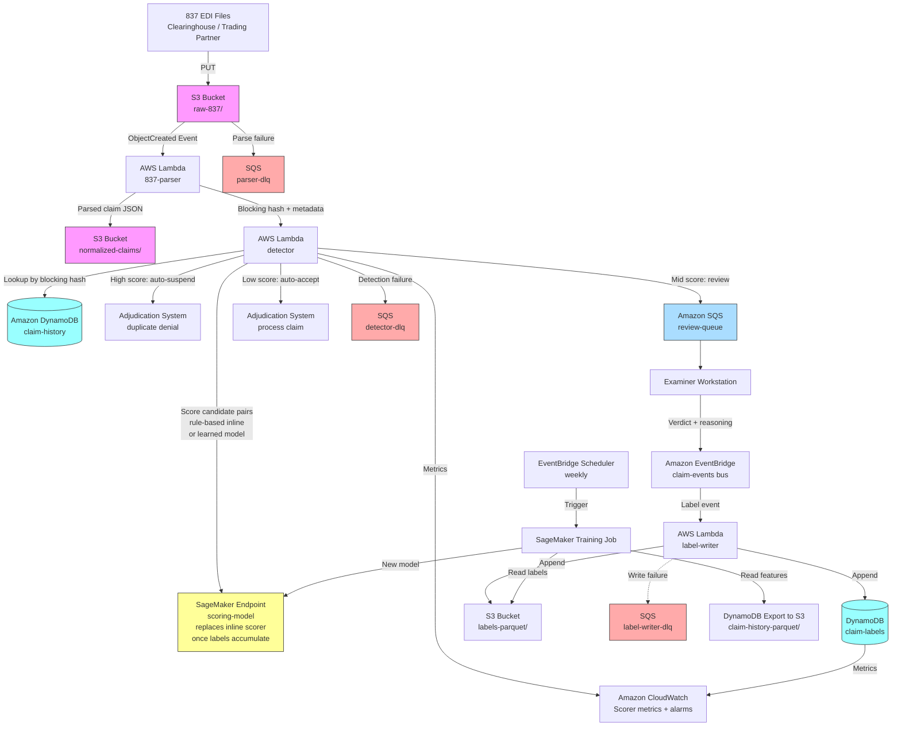

# Recipe 3.1 Architecture and Implementation: Duplicate Claim Detection

*Companion to [Recipe 3.1: Duplicate Claim Detection](chapter03.01-duplicate-claim-detection). This page covers the AWS architecture, services, prerequisites, and pseudocode. For the problem framing and the conceptual approach, start with the main recipe.*

---

## The AWS Implementation

### Why These Services

**Amazon S3 for raw 837 landing and historical claim archive.** The 837 files arrive from clearinghouses, trading partners, or internal submission systems. S3 is the right first stop: durable, cheap, versioned, easily encrypted with KMS. The raw 837 stays as the system of record; everything downstream operates on parsed representations. S3 is HIPAA-eligible under the AWS BAA. Lifecycle policies move older claim files to S3 Intelligent-Tiering or Glacier Instant Retrieval as they age out of the active detection window.

**Amazon DynamoDB as the detection-path claim store.** For the blocking and similarity scoring path, you need fast point lookups keyed by a blocking hash (patient + month, in this recipe; richer blocking keys are possible once a provider-hierarchy lookup is in place). DynamoDB is a natural fit: single-digit-millisecond latency, predictable cost, no capacity planning headache at the scale most payers operate at. Design the partition key as the blocking hash so candidates for a given incoming claim come back in a single query. A secondary index on patient ID gives you the retrospective-recovery access pattern. DynamoDB is HIPAA-eligible.

**Amazon S3 + AWS Glue + Amazon Athena for the retraining-path claim store.** The retraining job wants bulk scans over labeled historical data, not point lookups. DynamoDB is poor at scans; S3 + Parquet + Athena is purpose-built for them. Run a periodic export from DynamoDB to S3 (DynamoDB's export-to-S3 feature handles this directly without impacting table performance), register the export as a Glue table, and let the retraining job query it via Athena. Both paths share the same ground truth without fighting over the same storage medium.

**AWS Lambda for normalization, blocking lookup, and scoring orchestration.** The detection pipeline is a sequence of short, stateless steps: parse the 837, compute blocking keys, query DynamoDB, score candidates, write outputs. Each of these is a natural Lambda. For batch mode, Lambda is triggered by S3 ObjectCreated events on the raw 837 bucket. For real-time mode, the same Lambdas are triggered by events on an EventBridge bus or a Kinesis stream that sits between the submission endpoint and the detector.

**Amazon SageMaker for the learned scoring model.** The rule-based scorer runs inline in Lambda. Once you graduate to a logistic regression or gradient-boosted model, SageMaker is where it lives: SageMaker Training for retraining jobs on the labeled dataset, SageMaker real-time inference endpoints for the detection path. SageMaker Feature Store is useful for consistent feature computation across training and inference (same feature engineering code at training time and at inference time, which is otherwise a subtle source of bugs). If your scale stays small enough that a SageMaker endpoint is overkill, you can package the model as a Lambda layer and run inference in-process.

**Amazon OpenSearch Service (or OpenSearch Serverless) for fuzzy field matching (situational).** Edit-distance and phonetic matching on patient names, claim numbers, and provider names benefit from a search engine that's built for them. OpenSearch supports edit-distance queries, phonetic tokenizers, and k-nearest-neighbor vector search in a single index. The walkthrough below does Levenshtein and Jaccard inline in Lambda because the rule-based starting point doesn't need a search engine; OpenSearch becomes valuable when you add patient-name or provider-name fields that require phonetic matching at volume, or when the inline implementations stop scaling past a few hundred candidates per block. See Variations and Extensions for the promotion path.

**Amazon SQS for the human review queue.** Claims that land in the middle threshold band become SQS messages carrying the claim ID, the top-N candidate matches, the similarity scores, and a link to each candidate's details in DynamoDB. The examiner workstation (whatever it happens to be: a custom web app, an integration into the existing claims adjudication UI) reads from SQS. SQS's visibility timeout gives a natural "claim-in-progress" semantic: an examiner pulls a claim, it becomes invisible for 30 minutes, if they don't resolve it in time it becomes visible again to someone else.

**Amazon EventBridge for the feedback loop.** When an examiner resolves a review item, the workstation publishes an event to EventBridge with the pair IDs, the verdict, and the reasoning. A Lambda consumer writes the label to DynamoDB and to S3 (for training). A scheduled EventBridge rule kicks off the retraining job on a weekly cadence.

**AWS KMS, CloudTrail, CloudWatch.** Standard PHI infrastructure. Customer-managed KMS keys on every data store. CloudTrail with data events on the claim store tables. CloudWatch metrics and alarms for queue depth, scorer latency, and drift indicators.

### Architecture Diagram



### Prerequisites

| Requirement | Details |
|-------------|---------|
| **AWS Services** | Amazon S3, Amazon DynamoDB, AWS Lambda, Amazon SageMaker (Training + real-time endpoint + optional Feature Store), Amazon SQS, Amazon EventBridge + EventBridge Scheduler, AWS Glue, Amazon Athena, AWS KMS, Amazon CloudWatch, AWS CloudTrail. Amazon OpenSearch Service is situational (see Variations and Extensions). |
| **IAM Permissions** | Least-privilege per Lambda. Parser: `s3:GetObject` on raw bucket, `s3:PutObject` on normalized bucket. Detector: `dynamodb:Query` on `claim-history` GSI, `dynamodb:PutItem` on `claim-decisions`, `sagemaker:InvokeEndpoint` on the scoring endpoint ARN, `sqs:SendMessage` on review queue ARN. Label writer: `dynamodb:PutItem` on `claim-labels`, `s3:PutObject` on labels bucket. Training job role: `s3:GetObject` on features + labels buckets, `sagemaker:CreateModel/UpdateEndpoint`. Never `*`. |
| **BAA** | AWS BAA signed. All services named above are HIPAA-eligible under the BAA. Clearinghouse / trading partner connections are out of scope for the AWS BAA; each external partner needs its own agreement. |
| **Encryption** | S3: SSE-KMS with customer-managed keys on the raw-837, normalized-claims, and labels buckets. DynamoDB: encryption at rest with customer-managed KMS keys. SageMaker: KMS encryption on training volumes, endpoint volumes, and model artifacts. SQS: SSE with KMS (review-queue and all DLQs). CloudWatch log groups encrypted with KMS (the 837 parser logs structural metadata that can still be PHI-adjacent). TLS in transit everywhere. |
| **VPC** | Production: all Lambdas in a VPC with VPC endpoints for S3 (gateway), DynamoDB (gateway), SageMaker Runtime (`runtime.sagemaker`), SQS (`sqs`), EventBridge (`events` for verdict-event publication and `scheduler` for the retraining cadence; both are interface endpoints), CloudWatch Logs (`logs`), CloudWatch monitoring (`monitoring`, used by `PutMetricData`), and KMS (`kms`). SageMaker endpoints deployed in a VPC. VPC Flow Logs enabled. |
| **CloudTrail** | Enabled in the account with data events captured for the claim-history, claim-labels, and review-queue tables/buckets. A CloudTrail query on "who read this claim and when" is what your HIPAA audit needs. |
| **837 Format Compliance** | The 837 parser handles at minimum the 837P (professional) and 837I (institutional) transaction sets. 837D (dental) follows a similar pattern but with different line-item structures. X12 version 5010 is the current standard; earlier versions may still appear from legacy trading partners. Use a maintained EDI parsing library; do not hand-roll 837 parsing. <!-- TODO: verify current 837 version baseline for CMS and major commercial payers; note if/when 7030 becomes common. --> |
| **Sample Data** | [Synthea](https://github.com/synthetichealth/synthea) can generate synthetic 837 transactions. CMS publishes [sample 837 transactions](https://www.cms.gov/medicare/coding-billing/electronic-billing-edi/transaction-code-sets) for reference. Never use real PHI in development. |
| **Retention** | CMS claims processing: 10 years minimum for Medicare claims records. Some state regulators require longer. Configure S3 Object Lock in COMPLIANCE mode on the raw-837 bucket in production (GOVERNANCE mode in dev so you can clean up). |
| **Cost Estimate** | Per 100,000 claims screened: Lambda (parser + detector + DLQ consumer invocations): ~$3. DynamoDB (blocking queries + writes + claim-decisions idempotency table, on-demand capacity): ~$25. SageMaker real-time inference endpoint (small instance, always-on): ~$50-150/month fixed. S3 storage for claim archive: ~$0.02 per GB-month, small in absolute terms. SQS (review-queue + three DLQs): negligible at this scale. Blended cost across a 1M-claims-per-month payer: in the low hundreds to low thousands of dollars per month depending on the learned-model complexity. If the OpenSearch variation is adopted (see Variations and Extensions), add ~$75-200/month for a small domain. Compared to the recovered value from catching duplicates (1-3% of claim spend is a common range quoted for payer duplicate recovery), the ROI is strongly positive. <!-- TODO: verify recent published range for payer duplicate-claim recovery rates; typical citations in the 1-3% range but worth confirming against a current industry report. --> |

### Ingredients

| AWS Service | Role |
|------------|------|
| **Amazon S3 (raw-837)** | Landing zone for incoming EDI transactions; system of record; Object Lock for retention compliance |
| **Amazon S3 (normalized-claims)** | Parsed, canonicalized claim records in Parquet for Glue/Athena access |
| **Amazon S3 (labels-parquet)** | Appended examiner labels for SageMaker training |
| **Amazon DynamoDB (claim-history)** | Hot store for blocking-key lookups during detection |
| **Amazon DynamoDB (claim-decisions)** | Idempotency ledger keyed on (incoming_claim_id, matched_claim_id, model_version); prevents duplicate routing actions on redelivered Lambda invocations |
| **Amazon DynamoDB (claim-labels)** | Labeled pairs from examiner decisions; feeds feedback loop |
| **AWS Lambda (837-parser)** | Parses inbound 837 transactions; writes normalized records; computes blocking hashes |
| **AWS Lambda (detector)** | Orchestrates blocking, scoring, and routing decisions |
| **AWS Lambda (label-writer)** | Consumes examiner-verdict events; writes labels to the training store |
| **Amazon SQS (review-queue)** | Buffer between detection output and examiner workstation |
| **Amazon SQS (parser-dlq)** | Dead-letter queue for 837-parser async failures; captures malformed-EDI events that Lambda retries could not resolve |
| **Amazon SQS (detector-dlq)** | Dead-letter queue for detector Lambda failures |
| **Amazon SQS (label-writer-dlq)** | Dead-letter queue for label-writer Lambda failures |
| **Amazon SageMaker Endpoint (scoring-model)** | Hosts the learned similarity scorer; called per candidate pair during detection |
| **Amazon SageMaker Training Jobs** | Weekly retrains on the accumulated labeled dataset; produces new model versions |
| **Amazon SageMaker Feature Store** (optional) | Consistent feature computation at training and inference time |
| **Amazon EventBridge** | Bus for examiner verdict events; scheduler for retraining cadence |
| **AWS Glue / Amazon Athena** | Bulk query path over normalized claims and labels (training, reporting, monitoring) |
| **AWS KMS** | Customer-managed keys for all data stores and log groups |
| **Amazon CloudWatch** | Scorer latency, queue depth, daily duplicate detection rate, drift alarms |
| **AWS CloudTrail** | Audit logging for every access to claim-history and claim-labels |

### Code

> **Reference implementations:** These aws-samples repositories demonstrate patterns that apply here:
> - [`aws-samples`](https://github.com/aws-samples): Search for "record linkage" and "entity resolution" patterns; duplicate detection is a flavor of entity resolution where both entities are claims rather than people.
> - [`amazon-sagemaker-examples`](https://github.com/aws/amazon-sagemaker-examples): Covers gradient-boosted classifier training, including XGBoost built-in algorithm workflows that apply directly to the learned scorer.
> <!-- TODO: verify a specific, current aws-samples repo that demonstrates duplicate claim detection on 837 data; as of this writing, a direct match has not been confirmed. The closest adjacent patterns are in general record-linkage and fraud-detection repos. -->

#### Walkthrough

**Step 1: Parse the 837 and compute blocking keys.** The parser Lambda is triggered by an S3 ObjectCreated event on the raw 837 bucket. It reads the transaction, parses each claim out of it, canonicalizes the fields (date formats, ID padding, NPI validation), and computes two things: a stable content hash over the key fields (for exact-duplicate detection) and a blocking hash used for lookup. The parsed claim record lands in the normalized-claims bucket and in the claim-history DynamoDB table.

Skip this step and you get two classes of bug. First, rule failures from dirty field formats: one source sends dates as `20260315`, another as `2026-03-15`, and your downstream exact-match check treats them as distinct. Second, blocking misses: if you don't canonicalize, two claims that should fall in the same block end up in different blocks and never get compared.

```pseudocode
FUNCTION parse_and_normalize(raw_837_key):
    // Fetch the raw EDI transaction from S3.
    raw_bytes = S3.GetObject("raw-837", raw_837_key)
    transaction = EDI_parser.parse(raw_bytes)   // use a real library, not regex

    normalized_claims = empty list

    FOR each claim in transaction.claims:
        // Canonicalize identifiers and dates to remove formatting variation.
        normalized = {
            claim_id: upper(trim(claim.claim_id)),
            patient_id: left_pad_zeroes(claim.patient_id, 10),
            subscriber_id: left_pad_zeroes(claim.subscriber_id, 10),
            billing_npi: strip_nondigits(claim.billing_npi),
            rendering_npi: strip_nondigits(claim.rendering_npi),
            date_of_service: to_iso8601(claim.date_of_service),
            place_of_service: zero_pad(claim.place_of_service, 2),
            cpt_code: upper(trim(claim.cpt_code)),
            modifiers: sorted list of claim.modifiers (for hash stability;
                                  treated as a set for duplicate-detection scoring.
                                  Adjudication preserves the original sequence
                                  because some modifier orderings carry payment
                                  meaning, e.g., pricing-before-informational and
                                  certain anesthesia or bilateral combinations),
            diagnosis_codes: sorted list of claim.diagnosis_codes,
            billed_amount: decimal(claim.billed_amount),
            submission_source: claim.submission_source
        }

        // Exact-duplicate hash: the fields that define "same claim" for the strict sense.
        // Sort modifier/diagnosis lists before hashing so the hash is stable.
        content_hash = sha256(
            normalized.patient_id + "|" +
            normalized.billing_npi + "|" +
            normalized.date_of_service + "|" +
            normalized.cpt_code + "|" +
            join(normalized.modifiers, ",") + "|" +
            str(normalized.billed_amount)
        )

        // Blocking hash: coarser than content_hash, used to find candidates
        // for fuzzy comparison. Date is rounded to the month to keep nearby-date
        // claims in the same block; date proximity is scored later. We block on
        // patient + month and rely on per-field NPI similarity in the scorer
        // (Step 3) to handle within-block NPI variation. NPIs themselves are
        // issued sequentially by NPPES and have no hierarchical structure by
        // organization, so an NPI prefix is not a usable org-level block.
        // For multi-NPI organizations (a hospital system that bills under
        // several NPIs for the same tax ID), the right pattern is a separate
        // provider-hierarchy lookup that maps each NPI to a tax_id-level
        // organization ID; that ID then joins the blocking key. See
        // Recipe 5.1 (Provider Identity Resolution) for the lookup itself.
        blocking_hash = sha256(
            normalized.patient_id + "|" +
            first_7_chars(normalized.date_of_service)   // YYYY-MM = same month
        )

        normalized.content_hash  = content_hash
        normalized.blocking_hash = blocking_hash

        normalized_claims.append(normalized)

    // Write normalized claims to the hot store and to the archive.
    // Idempotency guard: S3 ObjectCreated events are at-least-once delivery.
    // A redelivered event would re-run this parser and re-insert claims.
    // Use a conditional write so re-processing the same 837 is a no-op.
    FOR each claim in normalized_claims:
        DynamoDB.PutItem("claim-history", claim,
            ConditionExpression = "attribute_not_exists(claim_id)")
        // If the condition fails, the claim already exists from a prior
        // invocation. Swallow the ConditionalCheckFailedException and continue.
    S3.PutObject(
        bucket = "normalized-claims",
        key    = date_partitioned_key(transaction.received_at) + "/" + transaction.id + ".parquet",
        body   = parquet_encode(normalized_claims)
    )

    RETURN normalized_claims
```

**Step 2: Blocking lookup and exact-duplicate check.** The detector Lambda runs after the parser writes the normalized claim. First, it does the free check: is there an existing claim with the same `content_hash`? If yes, we have an exact duplicate and we can skip the rest of the pipeline. If no, we use the `blocking_hash` to pull the candidate set from DynamoDB.

```pseudocode
FUNCTION find_candidates(incoming_claim):
    // Exact duplicate check: a DynamoDB GSI on content_hash returns zero or more matches.
    exact_matches = DynamoDB.Query(
        table  = "claim-history",
        index  = "content_hash_index",
        key    = { content_hash: incoming_claim.content_hash }
    )

    // Filter out the incoming claim itself if it's already written (idempotency safety).
    exact_matches = [m for m in exact_matches where m.claim_id != incoming_claim.claim_id]

    IF exact_matches is not empty:
        RETURN {
            match_type: "exact",
            candidates: exact_matches
        }

    // Blocking lookup: pull the candidate set for fuzzy comparison.
    // Expect zero to a few dozen candidates in most cases.
    candidates = DynamoDB.Query(
        table = "claim-history",
        key   = { blocking_hash: incoming_claim.blocking_hash }
    )

    // Filter out the incoming claim itself.
    candidates = [c for c in candidates where c.claim_id != incoming_claim.claim_id]

    // Optional additional filter: drop candidates more than N days from the incoming DOS.
    // Tunable per claim type. Lab claims: narrow window. Inpatient: wider.
    candidates = [c for c in candidates
                  where abs(days_between(c.date_of_service, incoming_claim.date_of_service))
                        <= MAX_DOS_WINDOW_DAYS]

    RETURN {
        match_type: "fuzzy",
        candidates: candidates
    }
```

**Step 3: Per-field fuzzy similarity and total score.** For each (incoming, candidate) pair, compute the per-field similarities and combine them into a total score. The rule-based scorer here is the starting point. When you have enough labels, you'll swap it for a learned model; the calling interface stays the same.

```pseudocode
// Weights used by the rule-based scorer. Total should sum to 1.0.
// These are reasonable starting values; tune them against your own label distribution.
FIELD_WEIGHTS = {
    patient_id: 0.15,
    billing_npi: 0.10,
    rendering_npi: 0.10,
    date_of_service: 0.15,
    cpt_code: 0.20,
    modifiers: 0.10,
    billed_amount: 0.10,
    diagnosis_codes: 0.05,
    place_of_service: 0.05
}

FUNCTION field_similarity(field_name, a, b):
    SWITCH field_name:
        CASE "patient_id", "billing_npi", "rendering_npi":
            // System-generated IDs: tight edit-distance with a high threshold.
            dist = levenshtein(a, b)
            IF dist == 0: RETURN 1.0
            IF dist == 1 AND len(a) >= 8: RETURN 0.85   // one-character typo: suggestive
            RETURN 0.0

        CASE "date_of_service":
            // Same day = 1.0. Linear decay to 0 over the DOS window.
            days = abs(days_between(a, b))
            IF days == 0: RETURN 1.0
            IF days <= 1: RETURN 0.9
            IF days <= 7: RETURN 0.6
            RETURN 0.0

        CASE "cpt_code":
            IF a == b: RETURN 1.0
            IF in_same_code_family(a, b): RETURN 0.7   // e.g., 99213 vs 99214
            IF cpt_crosswalk(a) == cpt_crosswalk(b): RETURN 0.6   // deprecated predecessor
            RETURN 0.0

        CASE "modifiers":
            // Set comparison: Jaccard similarity on the two sorted lists.
            RETURN jaccard(set(a), set(b))

        CASE "billed_amount":
            // Relative difference with a tolerance band.
            rel_diff = abs(a - b) / max(a, b, 1)
            IF rel_diff < 0.01: RETURN 1.0
            IF rel_diff < 0.05: RETURN 0.8
            IF rel_diff < 0.20: RETURN 0.4
            RETURN 0.0

        CASE "diagnosis_codes":
            RETURN jaccard(set(a), set(b))

        CASE "place_of_service":
            RETURN 1.0 if a == b else 0.0


FUNCTION score_pair(incoming, candidate):
    // The rule-based scorer below is the starting point. Once you have enough
    // labels (Step 5 closes that loop), swap this function's body for a call
    // to a SageMaker real-time endpoint hosting a logistic-regression or
    // gradient-boosted model. The calling interface (input pair → score in
    // [0, 1] plus per-field components) stays the same:
    //
    //     response = sagemaker_runtime.invoke_endpoint(
    //         EndpointName = SCORING_ENDPOINT_NAME,
    //         Body         = serialize_features(incoming, candidate)
    //     )
    //     RETURN parse_score_response(response)
    //
    // Until then, the rule-based scorer below carries the load.

    total      = 0.0
    components = empty map

    FOR each field_name, weight in FIELD_WEIGHTS:
        sim = field_similarity(field_name, incoming[field_name], candidate[field_name])
        components[field_name] = sim
        total                 += weight * sim

    RETURN {
        score: total,                    // in [0.0, 1.0]
        components: components                // for explainability in the review queue
    }
```

**Step 4: Routing decision.** Apply thresholds. Execute the routing action. The thresholds are configurable and should be tuned against your actual label distribution; the starting values below are placeholders, not recommendations. The two thresholds create three bands: auto-suspend (almost certainly duplicate), review (uncertain), and auto-accept (almost certainly not duplicate).

```pseudocode
// Placeholder thresholds. Tune against your own ROC curve and review-queue capacity.
HIGH_THRESHOLD = 0.90    // above this: treat as duplicate, auto-suspend
LOW_THRESHOLD  = 0.55    // below this: pass through to adjudication

FUNCTION route_claim(incoming, scored_pairs):
    // scored_pairs is a list of { candidate, score, components } sorted by score desc.

    IF scored_pairs is empty:
        // No candidates found. Pass through.
        emit_metric("no_candidate_claims", 1)
        RETURN { action: "auto_accept", reason: "no_candidates" }

    top_match = scored_pairs[0]

    IF top_match.score >= HIGH_THRESHOLD:
        // Auto-suspend as duplicate. Write a reason record so the denial can be explained.
        // Idempotency guard: derive a deterministic decision key from the claim pair and
        // model version. A redelivered Lambda invocation that re-scores the same pair
        // produces the same key; the conditional write is a no-op on the second attempt.
        decision_key = sha256(
            incoming.claim_id + "|" +
            top_match.candidate.claim_id + "|" +
            CURRENT_MODEL_VERSION
        )
        wrote = DynamoDB.PutItem("claim-decisions", {
            decision_key: decision_key,
            incoming_claim_id: incoming.claim_id,
            matched_claim_id: top_match.candidate.claim_id,
            score: top_match.score,
            components: top_match.components,
            decided_at: now(),
            model_version: CURRENT_MODEL_VERSION,
            action: "auto_suspend"
        }, ConditionExpression = "attribute_not_exists(decision_key)")

        // If the conditional write succeeded, this is the first time we've seen
        // this decision. Proceed with the suspension. If it failed, a prior
        // invocation already recorded the decision; skip the duplicate action.
        IF wrote:
            write_suspension_record({
                incoming_claim_id: incoming.claim_id,
                matched_claim_id: top_match.candidate.claim_id,
                score: top_match.score,
                components: top_match.components,
                decided_at: now(),
                model_version: CURRENT_MODEL_VERSION,
                action: "auto_suspend"
            })
            emit_metric("auto_suspended", 1)
        RETURN { action: "auto_suspend",
                 matched_claim_id: top_match.candidate.claim_id,
                 score: top_match.score }

    ELSE IF top_match.score >= LOW_THRESHOLD:
        // Mid band: send to human review with top-N candidates attached.
        // Same idempotency pattern: conditional write before enqueue.
        decision_key = sha256(
            incoming.claim_id + "|" +
            top_match.candidate.claim_id + "|" +
            CURRENT_MODEL_VERSION
        )
        wrote = DynamoDB.PutItem("claim-decisions", {
            decision_key: decision_key,
            incoming_claim_id: incoming.claim_id,
            matched_claim_id: top_match.candidate.claim_id,
            score: top_match.score,
            decided_at: now(),
            model_version: CURRENT_MODEL_VERSION,
            action: "review"
        }, ConditionExpression = "attribute_not_exists(decision_key)")

        IF wrote:
            top_n = first 5 of scored_pairs
            SQS.SendMessage(
                queue = "review-queue",
                body  = {
                    incoming_claim_id: incoming.claim_id,
                    candidates: top_n,
                    blocking_hash: incoming.blocking_hash,
                    model_version: CURRENT_MODEL_VERSION,
                    enqueued_at: now()
                }
            )
            emit_metric("routed_to_review", 1)
        RETURN { action: "review", top_score: top_match.score }

    ELSE:
        // Low band: pass through to standard adjudication.
        emit_metric("auto_accepted", 1)
        RETURN { action: "auto_accept", top_score: top_match.score }
```

**Step 5: Close the feedback loop.** An examiner resolves a review-queue item and the workstation publishes an event to EventBridge. A Lambda consumer writes the label to the label store. Every label carries: the pair IDs, the examiner's verdict, a structured reasoning code, the scorer version that produced the original score, and timing information. The retraining job reads from the label store on a weekly schedule.

```pseudocode
FUNCTION on_examiner_verdict(event):
    // event.verdict is one of: "duplicate", "adjustment", "unique", "unclear"
    // event.reasoning_code is a structured code from a controlled vocabulary.

    // PHI minimization: examiners working with a patient record open in
    // another tab routinely reference identifiers and clinical context in
    // free-text reasoning. Scrub before writing to the long-lived label store.
    // The controlled-vocabulary reasoning_code carries the operational signal;
    // the scrubbed text is supplementary context only.
    scrubbed_reasoning = scrub_phi(event.reasoning_text)
    // scrub_phi strips: MRN-shaped strings (\d{6,10}), NPI-shaped strings
    // (10-digit starting with 1), names following common honorifics (Dr., Mr.,
    // Ms.), DOB patterns (MM/DD/YYYY, YYYY-MM-DD), phone numbers, SSN patterns.
    // For production, route through Amazon Comprehend Medical DetectPHI and
    // redact any entity with a confidence score above 0.80.

    label = {
        incoming_claim_id: event.incoming_claim_id,
        matched_claim_id: event.matched_claim_id,
        examiner_id: event.examiner_id,
        verdict: event.verdict,
        reasoning_code: event.reasoning_code,
        reasoning_text: scrubbed_reasoning,
        scorer_version: event.scorer_version,
        score_at_decision: event.score_at_decision,
        components_at_decision: event.components_at_decision,
        enqueued_at: event.enqueued_at,
        resolved_at: now(),
        review_duration_sec: (now() - event.enqueued_at).total_seconds()
    }

    DynamoDB.PutItem("claim-labels", label)
    S3.PutObject(
        bucket = "labels-parquet",
        key    = date_partitioned_key(label.resolved_at) + "/" + uuid() + ".parquet",
        body   = parquet_encode([label])
    )

    // Operational metrics: label rate, verdict distribution, review time distribution.
    emit_metric("label_captured", 1, dimensions = { verdict: event.verdict })
    emit_metric("review_duration_sec", label.review_duration_sec)


FUNCTION retrain_weekly():
    // Triggered by an EventBridge Scheduler rule on a weekly cadence.
    // The job does the following, in order:

    // 1. Pull the training dataset: labels from the last N weeks joined to
    //    the corresponding claim pairs from the normalized-claims + claim-history archive.
    training_df = Athena.query("""
        SELECT l.verdict,
               l.score_at_decision,
               l.components_at_decision,
               incoming.*, matched.*
        FROM claim_labels l
        JOIN normalized_claims incoming ON l.incoming_claim_id = incoming.claim_id
        JOIN normalized_claims matched  ON l.matched_claim_id  = matched.claim_id
        WHERE l.resolved_at >= current_date - interval '180' day
    """)

    // 2. Compute features (same feature-engineering code as inference path).
    X, y = build_features_and_labels(training_df)

    // 3. Split train/val, fit the model (logistic regression or XGBoost), evaluate.
    X_train, X_val, y_train, y_val = split(X, y)
    model = XGBoostClassifier.train(X_train, y_train)
    metrics = evaluate(model, X_val, y_val)   // precision, recall, AUC, F1

    // 4. Only promote the model if it beats the incumbent on a held-out set.
    incumbent_metrics = fetch_incumbent_metrics()
    IF metrics.auc > incumbent_metrics.auc + MIN_IMPROVEMENT:
        save_model_artifact_to_s3(model, version = next_version())
        update_sagemaker_endpoint(model_artifact_s3_key)
        log("Promoted new model: " + version)
    ELSE:
        log("Challenger did not beat incumbent. Keeping current model.")
```

> **Curious how this looks in Python?** The pseudocode above covers the concepts. If you'd like to see sample Python code that demonstrates these patterns using boto3, check out the [Python Example](chapter03.01-python-example). It walks through each step with inline comments and notes on what you'd need to change for a real deployment.

### Expected Results

<!-- Note: sample timestamps below are illustrative and reflect the draft date; production output uses real ISO-8601 timestamps from the detector's invocation time. -->

**Sample routing decision record for a suspected duplicate:**

```json
{
  "incoming_claim_id": "CLM-2026-0487291",
  "action": "auto_suspend",
  "matched_claim_id": "CLM-2026-0487204",
  "score": 0.94,
  "components": {
    "patient_id": 1.00,
    "billing_npi": 1.00,
    "rendering_npi": 1.00,
    "date_of_service": 1.00,
    "cpt_code": 1.00,
    "modifiers": 1.00,
    "billed_amount": 0.80,
    "diagnosis_codes": 1.00,
    "place_of_service": 1.00
  },
  "decided_at": "2026-05-12T09:47:03Z",
  "model_version": "rule-v1.2",
  "reason": "All identifier and service-description fields match exactly; billed amount differs by 3.2% (likely rounding or fee-schedule change between submissions)."
}
```

**Sample review-queue item:**

```json
{
  "incoming_claim_id": "CLM-2026-0491117",
  "candidates": [
    {
      "claim_id": "CLM-2026-0488043",
      "score": 0.72,
      "components": {
        "patient_id": 1.00,
        "billing_npi": 1.00,
        "rendering_npi": 0.00,
        "date_of_service": 0.90,
        "cpt_code": 0.70,
        "modifiers": 0.50,
        "billed_amount": 0.40,
        "diagnosis_codes": 1.00,
        "place_of_service": 0.00
      }
    }
  ],
  "blocking_hash": "c91f...e30b",
  "model_version": "rule-v1.2",
  "enqueued_at": "2026-05-12T09:47:03Z"
}
```

That second example is the kind of case an examiner needs to see. Same patient, same billing organization, adjacent dates, same diagnosis, same code family but not the same code. Is it a duplicate where the provider miscoded the second submission? Or is it a legitimate follow-up visit on consecutive days? Neither the rule-based scorer nor a learned model will resolve that reliably. The examiner can, in a minute or two, with context the system doesn't have.

**Performance benchmarks (illustrative; measure against your own data):**

| Metric | Rule-based (starting point) | Learned model (after ~6 months of labels) |
|--------|-----------------------------|--------------------------------------------|
| Precision at high-threshold band | 92-96% | 96-98% |
| Recall on true duplicates | 70-80% | 85-92% |
| Auto-suspend rate (% of all claims) | 0.5-1.5% | 0.8-2.0% |
| Review-queue size (% of all claims) | 3-7% | 2-5% |
| End-to-end detection latency (per claim) | 50-200 ms | 100-400 ms (adds inference call) |

<!-- TODO: these benchmark ranges are directional and not tied to a specific published case study. Replace with measured numbers once deployed, or cite specific payer case studies if published. -->

**Where it struggles:**

- **Adjustment claims near the decision boundary.** A corrected resubmission of a paid claim legitimately shares most fields with the original. The scorer will produce a high score; the examiner has to distinguish "duplicate" from "adjustment." Some payers capture the adjustment intent in a claim frequency code (the `CLM05-3` segment in 837) and use it as a scorer feature; this helps substantially but doesn't eliminate the problem.
- **Split billing.** When an inpatient stay bills professional and facility components separately, the pair looks like a duplicate from some angles (same patient, same dates, same diagnosis). A rule that excludes cross-type (professional vs. facility) comparisons handles most of this. Edge cases remain.
- **Multi-tenant providers.** Large provider organizations that submit under multiple NPIs (billing NPI for the organization, rendering NPI for the individual clinician) can look like duplicates when the NPIs shift between submissions. A provider-hierarchy lookup (which NPIs belong to the same tax ID) cleans this up.
- **Cold start on new providers.** The learned scorer's performance on new providers is weaker than on established ones until enough of their claims accumulate labels. The rule-based layer carries the load for new providers; the learned model catches up over time.

---

## Why This Isn't Production-Ready

The pseudocode and architecture above demonstrate the pattern. A production deployment closes several gaps the recipe intentionally leaves open.

**837 parsing is a real engineering problem, not a one-liner.** The 837 standard is complex, the version landscape is fragmented, and every clearinghouse has quirks. Use a maintained EDI library. Budget time for parsing-rule tuning against your specific trading partners. Your parser will hit edge cases in the first week of production that never appeared in testing.

**Dead-letter queues prevent silent event loss.** Every asynchronous Lambda in this pipeline (parser, detector, label-writer) must have an `OnFailure` destination configured, pointing at a dedicated SQS dead-letter queue. Lambda's default async retry behavior is two retries over six hours, then drop. Without a DLQ, a malformed 837 that the parser cannot handle simply vanishes from operational state: the raw file stays in S3, but the fact that it failed to parse is captured only in CloudWatch Logs, which nobody checks until an examiner asks "where's that claim?" The architecture diagram above shows `parser-dlq`, `detector-dlq`, and `label-writer-dlq` for this reason. Set up CloudWatch alarms on DLQ depth (any non-zero count is worth investigating) and build a small operational runbook for replaying DLQ messages once the underlying issue is fixed.

**Blocking strategy needs measurement.** The blocking scheme in the walkthrough (patient + month) is a starting point. Measure three things once you're in production: candidate-set size distribution (you want p99 < 100), recall on known duplicates (what fraction of true duplicates land in the same block as their partner?), and block-skew (any single block with thousands of candidates will blow up the detector latency). Adjust the blocking function based on these measurements; consider multi-blocking (query with several different blocking keys and union the candidate sets) if single-block recall is poor. The blocking scheme in the walkthrough (patient + month) is a starting point. Measure three things once you're in production: candidate-set size distribution (you want p99 < 100), recall on known duplicates (what fraction of true duplicates land in the same block as their partner?), and block-skew (any single block with thousands of candidates will blow up the detector latency). Adjust the blocking function based on these measurements; consider multi-blocking (query with several different blocking keys and union the candidate sets) if single-block recall is poor.

**Threshold tuning is ongoing, not one-time.** The HIGH and LOW thresholds are decisions about precision-recall tradeoffs and review-queue capacity. Tune them initially against a labeled validation set to target a specific precision. Re-tune monthly: label distributions drift, claim mix changes, and examiner capacity varies. Make the thresholds config-driven, not hard-coded, so they can be updated without a code deploy.

**Model monitoring and drift detection.** Once you're running a learned scorer, monitor (at minimum): the daily distribution of scores (distribution shift is an early drift signal), the precision of auto-suspend decisions (sampled re-review is how you catch it silently getting worse), and the disagreement rate between the current model and the previous one on a held-out test set (sudden jumps are a signal that something is off). Alert on anomalies.

**Label quality matters as much as label quantity.** Examiners disagree with each other on edge cases. A "duplicate" label from one examiner might be labeled "adjustment" by another. Two mitigations: a controlled vocabulary for the `reasoning_code` field so similar cases get similar labels, and periodic inter-rater calibration (send the same set of review items to multiple examiners and measure agreement). Low inter-rater agreement is a loud signal that the labeling guidelines need clarification.

**Retrospective sweep capability.** Once your detector is tuned, you'll want to run it against historical paid claims to recover duplicates that slipped through. This is a different workflow (retrospective, not prospective) but uses the same scoring logic. Budget for it in the data plan: you need the learned model to run at batch scale against the claim archive, and you need a recovery workflow (provider notification, offset, adjustment) that's distinct from the prospective denial workflow.

**Provider communication is part of the system.** When a claim is auto-suspended, the provider gets a denial with a reason code. If the reason is "duplicate" and the claim isn't actually a duplicate, the provider resubmits with a correction or files a grievance. Your denial reason codes, remittance advice messages, and appeal handling are all part of the duplicate detection system from the provider's point of view, even if they're maintained by a different team. Coordinate.

**PHI in the review queue and labels.** SQS messages and label records contain enough PHI to require careful controls. Encrypt at rest with customer-managed KMS keys. Keep retention short on SQS (the queue is a work-in-progress store, not an archive). The label store is the long-lived one; scope read access tightly (the label-writer Lambda, the retraining job, named audit roles).

**Fairness monitoring.** Duplicate detection doesn't have the same fairness concerns as a clinical risk model, but it's not fairness-free either. If your scorer systematically flags claims from certain provider categories (small practices, rural providers, non-English-documentation claims) at higher rates than the underlying duplicate base rate in that subgroup, you have a problem. Add subgroup monitoring on the auto-suspend rate by provider size, geography, and specialty. Disparities that can't be explained by the underlying duplicate rate are a signal to investigate.

<!-- TODO (TechWriter): consider adding a note about the SIU hand-off. When the detector identifies a pattern consistent with coordinated fraud (many duplicates from a single provider, unusual submission patterns), the handoff to the Special Investigations Unit is a separate workflow from prospective denial. This isn't in the core recipe scope but is a natural extension. -->

<!-- closed: A1: Blocking hash uses patient_id + month only; NPI prefix removed. Inline comment in Step 1 explains NPIs are NPPES-sequential with no org hierarchy, and forward-references Recipe 5.1 for the tax_id-based provider-hierarchy lookup. Per-field NPI similarity handled in Step 3 scorer. -->

<!-- closed: A2: Idempotency guards added to Step 1 (conditional DynamoDB write with attribute_not_exists) and Step 4 (deterministic decision_key with conditional write to claim-decisions table before SQS send or suspension write). -->

<!-- closed: A3: OpenSearch removed from architecture diagram and core Ingredients; demoted to Variations and Extensions with a dedicated paragraph explaining the promotion path when name-field matching at scale is needed. Why-These-Services retains a brief mention noting the situational value. -->

<!-- closed: A4: Already resolved by editor. Diagram node H shows "replaces inline scorer once labels accumulate"; Step 3 score_pair includes a commented-out SageMaker invoke_endpoint call showing the exact swap pattern. No remaining gap. -->

<!-- closed: A5: DLQ pattern added to architecture diagram (parser-dlq, detector-dlq, label-writer-dlq), Ingredients table, and "Why This Isn't Production-Ready" section with operational guidance. -->

<!-- closed: S1: PHI scrub added to Step 5 on_examiner_verdict before label write. Regex-based pattern stripping with Comprehend Medical recommended for production. reasoning_code carries operational signal; scrubbed text is supplementary only. -->

<!-- TODO (TechWriter): code review (Finding 5) flagged a small drift between Step 4 pseudocode and the Python companion's `route_claim`. The Python adds a `match_type` parameter and an exact-match fast-path (auto-suspend when `find_candidates` returned `match_type == "exact"`, regardless of score-threshold logic) that this pseudocode does not describe. The Python's branch is defense-in-depth (an exact `content_hash` collision lands at score 1.0 and would auto-suspend anyway) but the pseudocode-to-Python parity should be restored either by adding an explicit exact-match fast-path at the top of `route_claim` here, or by leaving a one-line note in the Python companion explaining the intentional deviation. -->

---

## Variations and Extensions

**OpenSearch for phonetic and fuzzy name matching at scale.** The walkthrough above does Levenshtein and Jaccard inline in Lambda, which works well for structured identifiers (NPIs, claim numbers, patient IDs) where candidate sets are small. When you add patient-name or provider-name fields to the scorer, inline string comparison stops scaling: names have more variation, phonetic matching (Double Metaphone, Soundex) is expensive per-pair, and candidate sets can grow. At that point, promote Amazon OpenSearch Service into the pipeline as a dedicated fuzzy-match layer between blocking (Step 2) and scoring (Step 3). Index claims on phonetic tokens and leverage OpenSearch's native edit-distance queries and k-NN vector search. OpenSearch Serverless can keep the operational burden low for mid-size payers. The core decision: OpenSearch adds a fixed cost (~$75-200/month for a small domain) but makes name-based matching dramatically more effective and faster than brute-force pairwise comparison.

**Real-time at the 837 ingestion edge.** Swap the S3-event trigger for an API endpoint or a Kinesis stream sitting between the clearinghouse connection and the adjudication queue. Detection happens in the same submission-to-adjudication window rather than after the claim lands in the queue. Benefits: faster feedback to providers (duplicate denial within minutes rather than hours). Costs: tighter integration with the upstream pipeline, and the detector's latency budget shrinks significantly.

**Embedding-based similarity on unstructured fields.** Claims often include narrative attachments (free-text notes, justification statements, clinical summaries). Embed these fields using a sentence transformer model and include the cosine similarity as an additional scorer feature. Particularly useful for catching the case where two claims describe the same service in different words. The embedding model runs as a SageMaker endpoint or, for smaller scale, in-process in Lambda with a distilled model.

**Graph-based detection of coordinated duplicates.** If multiple providers, multiple patients, and multiple claims are linked (same beneficial owner billing under several tax IDs, cross-claim patterns within a single fraud ring), a graph approach can surface patterns a pair-wise scorer misses. Build a claim graph in Amazon Neptune with edges for shared patient, shared provider, shared tax ID, shared bank account (if available), and temporal adjacency. Graph anomaly detection on that structure identifies rings that look locally normal but are globally unusual. This is a significant complexity step-up from the baseline recipe and is typically a Phase 3 investment.

**Cross-payer duplicate detection via hashing.** The same beneficiary can file the same claim with two different insurers (Medicare + Medicaid, or a primary commercial plan + a secondary). Privacy-preserving record linkage using cryptographic hashing of patient identifiers lets you detect these across payer boundaries without sharing raw PHI. Specific patterns like Bloom filter-based linkage are well-developed in the academic literature; adapting them to the 837 context is a meaningful project but the economics can be substantial for plans with heavy coordination-of-benefits traffic.

**LLM-assisted review triage.** For the review-queue band, an LLM can produce a plain-language summary of why each candidate pair is suspicious: "Both claims are for the same patient on the same date, with CPT 99213 and 99214 respectively. CPT 99214 is a higher-level code; the first claim may have been upcoded and resubmitted, or this may be a legitimate addendum." The examiner reads the summary in seconds, which is faster than reading the two raw claims. Feed the LLM the structured fields, not raw text; the goal is triage aid, not autonomous decision. Stay on tight guardrails and keep the LLM's output in an explanation field, not a verdict field.

---

## Additional Resources

**AWS Documentation:**
- [Amazon DynamoDB Best Practices](https://docs.aws.amazon.com/amazondynamodb/latest/developerguide/best-practices.html)
- [Amazon DynamoDB Export to S3](https://docs.aws.amazon.com/amazondynamodb/latest/developerguide/S3DataExport.HowItWorks.html)
- [Amazon OpenSearch Service Fuzzy Query](https://opensearch.org/docs/latest/query-dsl/term/fuzzy/)
- [Amazon OpenSearch Service Phonetic Analyzer Plugin](https://opensearch.org/docs/latest/analyzers/language-analyzers/phonetic/)
- [Amazon SageMaker Built-in XGBoost Algorithm](https://docs.aws.amazon.com/sagemaker/latest/dg/xgboost.html)
- [Amazon SageMaker Feature Store Documentation](https://docs.aws.amazon.com/sagemaker/latest/dg/feature-store.html)
- [Amazon SQS Message Visibility Timeout](https://docs.aws.amazon.com/AWSSimpleQueueService/latest/SQSDeveloperGuide/sqs-visibility-timeout.html)
- [AWS HIPAA Eligible Services](https://aws.amazon.com/compliance/hipaa-eligible-services-reference/)
- [Architecting for HIPAA on AWS (Whitepaper)](https://docs.aws.amazon.com/whitepapers/latest/architecting-hipaa-security-and-compliance-on-aws/welcome.html)

**AWS Sample Repos:**
- [`amazon-sagemaker-examples`](https://github.com/aws/amazon-sagemaker-examples): XGBoost classifier training patterns directly applicable to the learned scorer; includes examples of binary-classification workflows and model evaluation.
- [`aws-samples`](https://github.com/aws-samples): Search for "record linkage," "entity resolution," and "fraud detection" for adjacent patterns.
<!-- TODO: verify and add a specific aws-samples repo that demonstrates 837 parsing, claim deduplication, or related claims-processing patterns. As of this writing a direct match for duplicate claim detection specifically has not been confirmed. -->

**AWS Solutions and Blogs:**
- [AWS Solutions Library](https://aws.amazon.com/solutions/) (filter by AI/ML + Healthcare): browse for claims processing and payer analytics reference architectures.
- [AWS Machine Learning Blog](https://aws.amazon.com/blogs/machine-learning/): search for "claims," "record linkage," "fraud detection" for architecture deep-dives relevant to this pipeline.
<!-- TODO: verify and add two or three specific AWS blog posts on claims processing or record linkage architectures; confirm URLs exist before inclusion. -->

**Regulatory and Standards References:**
- [CMS Electronic Billing & EDI Transactions](https://www.cms.gov/medicare/coding-billing/electronic-billing-edi): CMS documentation on 837 transaction sets and claims processing standards.
- [X12 837 Transaction Set](https://x12.org/products/transaction-sets): The EDI standard governing claim submissions.
- [HIPAA 5010 Implementation Guide](https://www.cms.gov/regulations-and-guidance/administrative-simplification/versions5010andd0): The current 837 version baseline for healthcare claims.

**External References (Conceptual):**
- [Levenshtein distance, Wikipedia](https://en.wikipedia.org/wiki/Levenshtein_distance): foundational string similarity metric referenced in the per-field similarity section.
- [Double Metaphone, Wikipedia](https://en.wikipedia.org/wiki/Metaphone): phonetic matching algorithm useful for patient name and provider name comparisons.
- [Jaccard index, Wikipedia](https://en.wikipedia.org/wiki/Jaccard_index): set similarity measure used for modifier and diagnosis code lists.
- [Synthea](https://github.com/synthetichealth/synthea): synthetic patient data generator that produces FHIR and synthetic claims suitable for non-PHI development environments.

---

## Estimated Implementation Time

| Tier | Scope | Time |
|------|-------|------|
| Basic | Exact-duplicate hash check, deterministic blocking, rule-based scorer, SQS review queue, manual examiner workflow | 4-6 weeks |
| Production-ready | Add learned scorer on SageMaker, automated retraining pipeline, model monitoring, threshold tuning, fairness dashboard, 837 edge cases, provider hierarchy resolution | 4-6 months |
| With variations | Real-time detection at ingestion edge, embedding-based similarity on attachments, graph detection of coordinated duplicates, cross-payer privacy-preserving linkage, LLM-assisted review triage | 6-12 months beyond production-ready |

---


---

*← [Main Recipe 3.1](chapter03.01-duplicate-claim-detection) · [Python Example](chapter03.01-python-example) · [Chapter Preface](chapter03-preface)*
