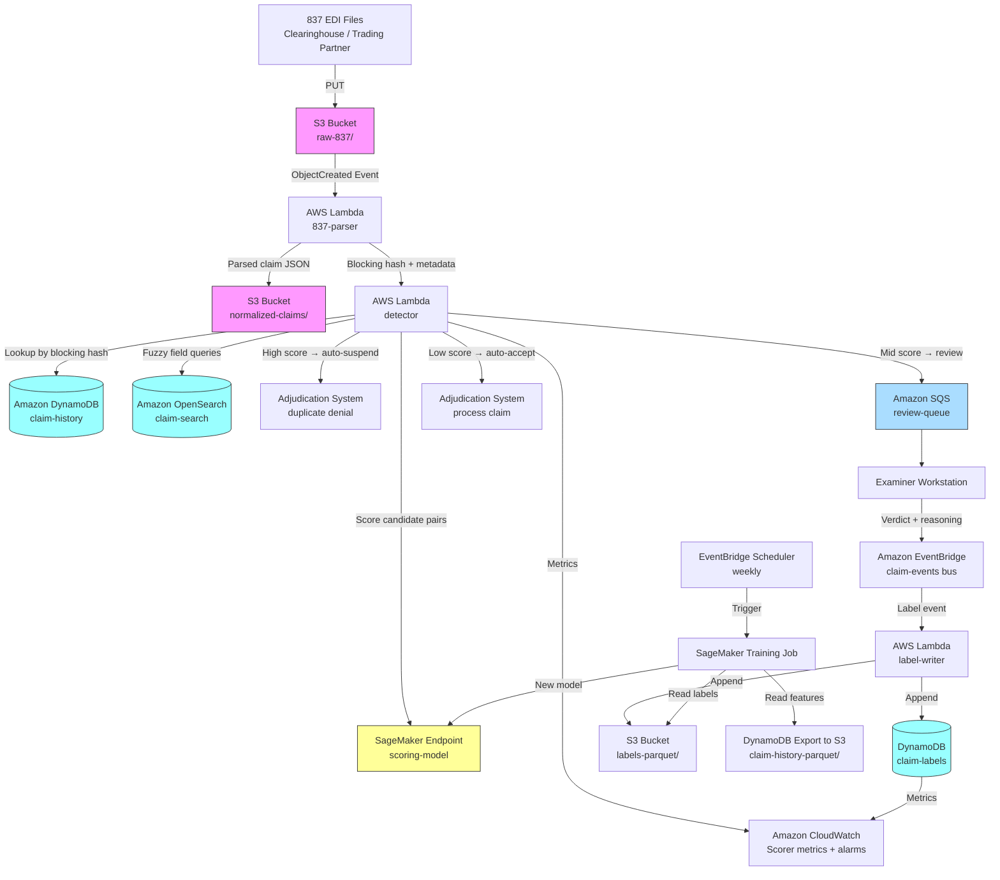

# Recipe 3.1: Duplicate Claim Detection ⭐

**Complexity:** Simple · **Phase:** MVP · **Estimated Cost:** ~$0.002–0.01 per claim screened (mostly compute; rule layer is nearly free)

---

## The Problem

Picture a claims operations supervisor at a mid-size payer on a Monday morning. Her team of twenty-two examiners processes roughly 180,000 claims per month. Her SIU (Special Investigations Unit) pulled a report last week showing that somewhere between 1.5% and 3% of paid claims in the prior quarter were duplicates. That's money that went out the door for services the payer had already paid for. Some of it was fraud (the kind of bad actor who submits the same claim to three clearinghouses and hopes one of them pays). Most of it was not. Most of it was bog-standard operational noise.

Here's what "operational noise" actually looks like on her desk:

The orthopedic group that re-submitted a batch of claims after their practice management software choked on an 837 transmission and they got no 277 acknowledgment back. They thought the first batch got lost. It didn't. They sent it twice. Both batches paid before anyone noticed.

The hospital that bills primary care and inpatient on two different tax IDs. Same physician, same patient, same date of service, same CPT for a critical care hour. Two payments. The physician doesn't even know; her billing is handled by a service.

The lab where a tech re-ran a CBC because the first draw was hemolyzed. The second run got a new accession number. The billing system swept both accessions into the next claim batch. Same patient, same CPT 85025, same date, two line items that look suspiciously like a single-run claim that was paid, plus a duplicate. Except it isn't. It's two legitimate runs, only one of which should be billed.

The skilled nursing facility that submits claims weekly and, when a resident transitions levels of care mid-week, generates two claims covering overlapping dates. Not an exact duplicate. But the date ranges overlap by three days, and the revenue codes partly overlap, and the question of whether this is a legitimate adjustment or a duplicate takes someone with SNF billing expertise about fifteen minutes to resolve.

Now the supervisor is looking at four-thousand-odd suspected duplicates in her review queue, generated by the payer's existing duplicate-detection rules. Her examiners clear about a hundred of these per day. At that rate, the queue never drains. Meanwhile, true duplicates are slipping through because the existing rules are too narrow: they catch exact matches on claim number, patient ID, date, and procedure. Anything with a minor variation (different place of service code, claim number typo, subscriber versus dependent identifier, provider NPI vs. taxonomy-paired billing NPI) sails past the check and into autoadjudication.

This is the duplicate claim detection problem, and it's the simplest interesting problem in the whole anomaly detection category. Simple because the outcome is clean: a claim either is or isn't a duplicate of a previously submitted one. Interesting because "is a duplicate" turns out to hide an enormous amount of structural variation, and the cost of getting it wrong in either direction is real. False positives irritate providers (nobody likes their clean claim sent to review for the fourth time this quarter). False negatives lose money.

The problem you actually have to solve: given a stream of incoming claims, identify which ones are candidate duplicates of claims already in your system, rank them by the likelihood that they're genuinely duplicate rather than a legitimate related claim, and hand the top of that ranked list to a human to adjudicate. That's it. It's not magic. It's just careful engineering of the "match" definition plus a feedback loop that lets the detection improve as examiners give you labels.

Let's get into how.

---

## The Technology

### What "Duplicate" Actually Means

The word "duplicate" carries more weight than it looks like it should. Three different definitions are all in common use, and they drive different technical choices:

**Exact duplicates.** The same claim submitted twice, character-for-character (or close to it). Payer trace number collision. Provider's billing system retransmitted after a comm failure. These are easy. A hash of the key fields catches them at ingestion.

**Semantic duplicates.** Two claims that describe the same actual service event, but the representation differs. One claim used CPT 99213; the other used the deprecated predecessor code. One listed the patient's subscriber ID; the other listed the dependent suffix. One had a typo in the date of service. Same clinical event, different encoding. These are the hard ones.

**Overlapping or adjustment claims.** Two claims cover the same date range and patient but represent related but legitimately distinct billing events. A correction to a previously paid claim. An inpatient stay billed in two segments because it crossed a month boundary. A split bill between professional and facility components. Not duplicates. But they'll look like duplicates to any naive matching rule, and treating them as duplicates is worse than missing them.

A duplicate detection system that doesn't cleanly separate these three categories ends up flagging adjustment claims as duplicates, which infuriates providers (their legitimate corrections get denied), or ignoring semantic duplicates because the rule was calibrated to reject the adjustments, which loses money. The design goal is to identify the semantic duplicates with high confidence while letting the adjustments through and catching the exact duplicates for free.

### The Three Layers of Detection

Almost every serious duplicate detection system ends up with a three-layer architecture, whether the team designed it that way or discovered it by accident. The layers are:

**Layer 1: Deterministic blocking.** A cheap, fast first pass that rejects the obvious non-candidates and groups the rest into blocks where potential duplicates can live. You don't compare every incoming claim against every claim in your history. You use indexed keys (patient ID, provider NPI, date of service, CPT) to narrow the search space to a handful of candidates per incoming claim. This is the same "blocking" concept that entity resolution systems use, and it's the technique that makes the whole thing tractable at scale. Without it, you're looking at O(N²) comparisons against a database of hundreds of millions of historical claims, and your compute bill will make you cry.

**Layer 2: Similarity scoring.** Within each block, you compute a similarity score between the candidate pairs. This is where the interesting engineering lives. The score is typically a weighted combination of field-level similarity measures:
- Exact match on patient ID, provider NPI, claim type
- Date of service proximity (same day? within 1 day? overlapping ranges?)
- Procedure code similarity (exact? synonym in a known code-family lookup? same HCPCS crosswalk?)
- Billed amount similarity
- Diagnosis code overlap
- Modifier code comparison
- Place of service comparison
- Rendering provider comparison (some duplicates are "same provider billing under two NPIs")

Each field gets a weight. The weights can come from a rules engine (start here), a logistic regression trained on historical labels (better), or a gradient-boosted classifier if you have enough labeled examples (best, eventually). The output is a similarity score in [0, 1] where 1 is "certainly duplicate" and 0 is "certainly not."

**Layer 3: Decision and routing.** A score isn't a decision. You need thresholds: above some score, auto-reject the claim as a duplicate. Below some other score, auto-accept. In between, route to human review. Most production systems tune the upper and lower thresholds separately based on their tolerance for false positives and false negatives. The middle range is where the human examiners live, and the size of that range is effectively a budget decision: how many claims per day can your team review?

The neat thing about this architecture is that each layer is independently tunable. You can improve blocking recall without touching scoring. You can retrain the scorer without rebuilding the routing logic. And the feedback from the review step (examiners labeling flagged claims as true or false duplicates) flows directly back into retraining the scorer.

### Fuzzy Matching, Demystified

The core of Layer 2 is "fuzzy" field matching. The word "fuzzy" is doing a lot of work here, and it's worth unpacking because it's where most teams either overcomplicate things or, more commonly, oversimplify them.

Consider just the claim number field. Two claims land with numbers `C-2026-0487291` and `C-2026-0487219`. Are those the same claim with a typo, or two different claims? You compute an edit distance (Levenshtein, for example): the two strings differ by two character transpositions, edit distance 2 out of length 13. A common heuristic is a similarity threshold like `1 - (edit_distance / max_length)`. Here that gives 0.846. High enough to warrant a look.

Now consider the patient name field. "John Smith" vs "Jon Smyth." Edit distance is 2. By the same formula you'd get about 0.8. Same score as the claim number typos. But those two names are almost certainly the same person, while "C-2026-0487291" and "C-2026-0487219" might be two genuinely distinct claims. The pure string-edit-distance metric throws away useful information about what each field represents.

Which is why real duplicate detection uses field-specific comparison functions. Some options:

- **Claim numbers, patient IDs, NPIs:** edit distance with a low tolerance (typos are rare in system-generated identifiers). Above a high threshold (say 0.95), suggest a match; below that, don't.
- **Patient names:** a phonetic algorithm (Soundex, Double Metaphone, or the newer Beider-Morse) combined with edit distance. "Jon Smyth" and "John Smith" share the same phonetic signature, which is a much stronger duplicate signal than their string distance.
- **Dates of service:** numerical distance in days. Same day is strongest; adjacent days are suspicious; more than a week apart is almost never a duplicate unless you're looking at a long inpatient stay.
- **CPT/HCPCS codes:** a lookup against known synonyms, crosswalks, and hierarchical relationships. 99213 (established patient, level 3 office visit) and 99214 (level 4) are in the same family but represent different services; a duplicate claim is more likely to use the same code than to escalate the level.
- **Billed amounts:** relative difference with a tolerance band (2% off is suspicious; 20% off is probably a correction, not a duplicate).

The weighting problem. Once you have per-field similarities, you need to combine them. A weighted sum with handcrafted weights is where most teams start. It works. It's interpretable. It's easy to explain to compliance and to adjust when the SIU calls and asks why a claim was flagged. You can graduate to a learned weighting (logistic regression on historical labels) once you have a decent labeled dataset, and to a non-linear model (gradient boosting, typically XGBoost or LightGBM) once the labeled set is large enough and the rule-based system has hit its ceiling.

### The Embedding Shortcut (and Its Limits)

Over the last few years there's been a push toward using embedding models for duplicate detection. The pitch: convert each claim into a dense vector (using a sentence transformer or a claim-specific embedding model), and duplicate detection becomes a nearest-neighbor search in vector space. One index, no handcrafted field comparisons, learns similarity automatically.

This works. Partially. Where it shines is on the unstructured parts of a claim (diagnosis narratives, service descriptions, clinician notes attached to the claim) where handcrafted string matching is fragile. Where it falls down is on the structured parts, and structured parts are most of what a claim is. The patient ID `12345678` and the patient ID `12345687` are a potential duplicate (typo). An embedding model will encode them as nearly identical strings because they look nearly identical. But if the patient IDs refer to two different patients, that's not a duplicate, it's a collision, and an embedding-only model has no way to distinguish "similar-looking identifiers for different entities" from "same entity, different encoding."

Practical guidance: use embeddings as one feature in a composite score, not as the whole score. Run embeddings on the unstructured fields (diagnosis narratives, notes). Use exact or edit-distance matching on the identifiers. Combine them with a classifier. This hybrid is uniformly better than either approach alone.

### The Label Problem

Any supervised approach to duplicate detection needs labeled data. "Was this pair of claims genuinely a duplicate, or not?" The answer comes from your claims examiners' historical decisions: the denial codes, the review notes, the recovery actions. Three gotchas:

**Selection bias.** Your existing labels are labels on claims that your existing rules already flagged. If your rules flag exact CPT+DOS+patient matches, your labeled dataset is dominated by exact matches, and a model trained on it will learn to detect exact matches. It won't learn the edge cases because it never saw them. Mitigation: periodically sample some claims below the current flag threshold, ship them to review anyway, and feed the labels back in. It's expensive. It's necessary.

**Decision drift.** Your examiners' interpretations of "duplicate" drift over time. New billing codes appear. Rule changes from CMS arrive. Payer policy updates. A claim that was labeled a duplicate in 2022 might have been labeled an adjustment in 2024 under new guidance. Don't train on all-time historical labels indiscriminately; weight recent labels more heavily or filter to a recent window.

**Adversarial dynamics.** Some of the duplicates in your data are fraud attempts. Fraudsters adapt. Patterns that were common a year ago get replaced. If your model is trained primarily on old fraud patterns, it'll miss the current ones. This is less of a concern for duplicate detection than for general fraud detection (because most duplicates are operational noise, not fraud), but it's still worth monitoring.

### Batch vs. Real-Time

Duplicate detection can run in either mode, and the right choice depends on when you want to catch the duplicate:

**Batch, pre-adjudication.** Nightly or hourly batch job that screens the day's submitted claims against the historical claim set before adjudication runs. Catches duplicates before money goes out the door. Easiest to build. Most payers run it this way.

**Real-time, at submission.** As each 837 transaction arrives, check against history in milliseconds and flag or reject before it enters the adjudication queue. Tighter integration with the submission pipeline. Higher engineering cost. Primary benefit: faster feedback to providers, which can be worth it for provider-relations reasons.

**Retrospective.** Run the detector against already-paid claims to identify duplicates that slipped through, then recover payments. Some of the biggest payback comes from this mode, but it's slow and it's a different operational workflow (recovery, not prevention).

Most payers end up running batch for prevention and retrospective for recovery, sometimes with a real-time layer for specific high-risk claim types. All three modes share the same scoring logic; what differs is the trigger and the action. For this recipe, we'll build the batch pre-adjudication pattern, because it covers the common case and it's the pattern that maps most cleanly to AWS primitives. The real-time variant is a straightforward adaptation (swap the batch trigger for an event stream; keep everything else).

---

## General Architecture Pattern

At a conceptual level, the pipeline has three stages plus a feedback loop. The key architectural insight is that none of the stages are particularly complex on their own. The design work is in making them compose cleanly and in making the feedback loop fast enough that the system gets smarter over time.

```
┌────────────────── DETECTION PIPELINE ──────────────────┐
│                                                        │
│  [Incoming Claim Stream]                               │
│           │                                            │
│           ▼                                            │
│  [Ingestion + Normalization]                           │
│   (parse 837, canonicalize IDs, hash key fields)       │
│           │                                            │
│           ▼                                            │
│  [Layer 1: Blocking]                                   │
│   (lookup: patient + provider + date-window +          │
│    claim-type. Returns candidates in historical        │
│    store.)                                             │
│           │                                            │
│           ▼                                            │
│  [Layer 2: Similarity Scoring]                         │
│   (field-level fuzzy match → weighted combination →    │
│    score in [0, 1] per candidate pair)                 │
│           │                                            │
│           ▼                                            │
│  [Layer 3: Decision + Routing]                         │
│   score ≥ high_threshold  → auto-suspend (duplicate)   │
│   score ≤ low_threshold   → auto-accept (unique)       │
│   between thresholds      → human review queue         │
│           │                                            │
└───────────┼────────────────────────────────────────────┘
            │
┌───────────┼────────────────────────────────────────────┐
│           ▼                                            │
│  [Examiner Workstation]                                │
│   (adjudicates queue items; labels: duplicate,         │
│    adjustment, unique; records reasoning)              │
│           │                                            │
│           ▼                                            │
│  [Label Store]                                         │
│           │                                            │
│           ▼                                            │
│  [Periodic Retraining]                                 │
│   (update weights / model; monitor drift; refresh      │
│    thresholds)                                         │
│                                                        │
└──────────────────── FEEDBACK LOOP ─────────────────────┘
```

**Ingestion and normalization.** 837 EDI transactions get parsed into a canonical claim record. IDs get normalized (leading-zero padding on patient IDs, NPI format validation, date format standardization). A stable hash is computed over the subset of fields that define a "claim identity" for exact-duplicate detection (patient ID + provider NPI + DOS + CPT + modifiers + billed amount). Exact hash collisions get flagged immediately; this is effectively free duplicate detection for the easy cases.

**Blocking.** The incoming claim's blocking keys are used to query the historical claim store for candidate matches. A common blocking strategy: patient ID + provider organization + date window (for example, plus-or-minus 14 days) + claim type. This narrows the candidate set from "all history" to typically 0 to a few dozen candidates. If you have a claim type for which this isn't selective enough (for example, frequent high-volume lab claims for the same patient), you add more blocking dimensions for that type.

**Similarity scoring.** For each candidate pair, compute per-field similarity, combine into a total score. The scoring function is pluggable: the same pipeline can call into a rule-based scorer, a logistic regression, or a gradient-boosted model. Start simple; replace with learned models as labeled data accumulates.

**Decision and routing.** Thresholds are applied. Auto-suspend and auto-accept actions are executed immediately. The middle-band claims go to a queue with the top-N candidates attached to each review item, so the examiner isn't starting from scratch.

**Feedback loop.** Every examiner decision is a label. The label store captures the claim pair, the examiner's verdict, their reasoning (free text or a structured code), and timing metadata. Periodic retraining re-fits the scoring model on a recent window of labels and evaluates against a held-out set before the new model is promoted. Threshold tuning is a separate concern: the thresholds can be adjusted to target a specific review-queue size regardless of what the model is doing.

**Historical claim store.** Somewhere in the middle of all this is a store of historical claims. The access pattern is point lookups on blocking keys, which you want to be fast. The data volume grows forever (you don't delete claim history). Retention policies apply (CMS typically requires 10 years for Medicare). The store needs to support both the detection path (blocking queries) and the retraining path (bulk scans for training data). These are different access patterns and the design should anticipate both.

---

## The AWS Implementation

### Why These Services

**Amazon S3 for raw 837 landing and historical claim archive.** The 837 files arrive from clearinghouses, trading partners, or internal submission systems. S3 is the right first stop: durable, cheap, versioned, easily encrypted with KMS. The raw 837 stays as the system of record; everything downstream operates on parsed representations. S3 is HIPAA-eligible under the AWS BAA. Lifecycle policies move older claim files to S3 Intelligent-Tiering or Glacier Instant Retrieval as they age out of the active detection window.

**Amazon DynamoDB as the detection-path claim store.** For the blocking and similarity scoring path, you need fast point lookups keyed by a blocking hash (patient + provider + date-window + claim-type). DynamoDB is a natural fit: single-digit-millisecond latency, predictable cost, no capacity planning headache at the scale most payers operate at. Design the partition key as the blocking hash so candidates for a given incoming claim come back in a single query. A secondary index on patient ID gives you the retrospective-recovery access pattern. DynamoDB is HIPAA-eligible.

**Amazon S3 + AWS Glue + Amazon Athena for the retraining-path claim store.** The retraining job wants bulk scans over labeled historical data, not point lookups. DynamoDB is poor at scans; S3 + Parquet + Athena is purpose-built for them. Run a periodic export from DynamoDB to S3 (DynamoDB's export-to-S3 feature handles this directly without impacting table performance), register the export as a Glue table, and let the retraining job query it via Athena. Both paths share the same ground truth without fighting over the same storage medium.

**AWS Lambda for normalization, blocking lookup, and scoring orchestration.** The detection pipeline is a sequence of short, stateless steps: parse the 837, compute blocking keys, query DynamoDB, score candidates, write outputs. Each of these is a natural Lambda. For batch mode, Lambda is triggered by S3 ObjectCreated events on the raw 837 bucket. For real-time mode, the same Lambdas are triggered by events on an EventBridge bus or a Kinesis stream that sits between the submission endpoint and the detector.

**Amazon SageMaker for the learned scoring model.** The rule-based scorer runs inline in Lambda. Once you graduate to a logistic regression or gradient-boosted model, SageMaker is where it lives: SageMaker Training for retraining jobs on the labeled dataset, SageMaker real-time inference endpoints for the detection path. SageMaker Feature Store is useful for consistent feature computation across training and inference (same feature engineering code at training time and at inference time, which is otherwise a subtle source of bugs). If your scale stays small enough that a SageMaker endpoint is overkill, you can package the model as a Lambda layer and run inference in-process.

**Amazon OpenSearch Service (or OpenSearch Serverless) for fuzzy field matching.** Edit-distance and phonetic matching on patient names, claim numbers, and provider names benefit from a search engine that's built for them. OpenSearch supports edit-distance queries, phonetic tokenizers, and k-nearest-neighbor vector search in a single index. For a mid-size payer, it's cheaper and simpler to manage than running a separate similarity microservice. For very high volumes, the economics can shift; evaluate carefully.

**Amazon SQS for the human review queue.** Claims that land in the middle threshold band become SQS messages carrying the claim ID, the top-N candidate matches, the similarity scores, and a link to each candidate's details in DynamoDB. The examiner workstation (whatever it happens to be: a custom web app, an integration into the existing claims adjudication UI) reads from SQS. SQS's visibility timeout gives a natural "claim-in-progress" semantic: an examiner pulls a claim, it becomes invisible for 30 minutes, if they don't resolve it in time it becomes visible again to someone else.

**Amazon EventBridge for the feedback loop.** When an examiner resolves a review item, the workstation publishes an event to EventBridge with the pair IDs, the verdict, and the reasoning. A Lambda consumer writes the label to DynamoDB and to S3 (for training). A scheduled EventBridge rule kicks off the retraining job on a weekly cadence.

**AWS KMS, CloudTrail, CloudWatch.** Standard PHI infrastructure. Customer-managed KMS keys on every data store. CloudTrail with data events on the claim store tables. CloudWatch metrics and alarms for queue depth, scorer latency, and drift indicators.

### Architecture Diagram



### Prerequisites

| Requirement | Details |
|-------------|---------|
| **AWS Services** | Amazon S3, Amazon DynamoDB, AWS Lambda, Amazon OpenSearch Service, Amazon SageMaker (Training + real-time endpoint + optional Feature Store), Amazon SQS, Amazon EventBridge + EventBridge Scheduler, AWS Glue, Amazon Athena, AWS KMS, Amazon CloudWatch, AWS CloudTrail. |
| **IAM Permissions** | Least-privilege per Lambda. Parser: `s3:GetObject` on raw bucket, `s3:PutObject` on normalized bucket. Detector: `dynamodb:Query` on `claim-history` GSI, `es:ESHttpGet/Post` on the search index, `sagemaker:InvokeEndpoint` on the scoring endpoint ARN, `sqs:SendMessage` on review queue ARN. Label writer: `dynamodb:PutItem` on `claim-labels`, `s3:PutObject` on labels bucket. Training job role: `s3:GetObject` on features + labels buckets, `sagemaker:CreateModel/UpdateEndpoint`. Never `*`. |
| **BAA** | AWS BAA signed. All services named above are HIPAA-eligible under the BAA. Clearinghouse / trading partner connections are out of scope for the AWS BAA; each external partner needs its own agreement. |
| **Encryption** | S3: SSE-KMS with customer-managed keys on the raw-837, normalized-claims, and labels buckets. DynamoDB: encryption at rest with customer-managed KMS keys. OpenSearch: encryption at rest, node-to-node encryption, HTTPS enforced. SageMaker: KMS encryption on training volumes, endpoint volumes, and model artifacts. SQS: SSE with KMS. CloudWatch log groups encrypted with KMS (the 837 parser logs structural metadata that can still be PHI-adjacent). TLS in transit everywhere. |
| **VPC** | Production: all Lambdas in a VPC with VPC endpoints for S3, DynamoDB, SageMaker Runtime, SQS, EventBridge, CloudWatch Logs, and KMS. OpenSearch in a VPC with access via the interface endpoints. SageMaker endpoints deployed in a VPC. VPC Flow Logs enabled. |
| **CloudTrail** | Enabled in the account with data events captured for the claim-history, claim-labels, and review-queue tables/buckets. A CloudTrail query on "who read this claim and when" is what your HIPAA audit needs. |
| **837 Format Compliance** | The 837 parser handles at minimum the 837P (professional) and 837I (institutional) transaction sets. 837D (dental) follows a similar pattern but with different line-item structures. X12 version 5010 is the current standard; earlier versions may still appear from legacy trading partners. Use a maintained EDI parsing library; do not hand-roll 837 parsing. <!-- TODO: verify current 837 version baseline for CMS and major commercial payers; note if/when 7030 becomes common. --> |
| **Sample Data** | [Synthea](https://github.com/synthetichealth/synthea) can generate synthetic 837 transactions. CMS publishes [sample 837 transactions](https://www.cms.gov/medicare/coding-billing/electronic-billing-edi/transaction-code-sets) for reference. Never use real PHI in development. |
| **Retention** | CMS claims processing: 10 years minimum for Medicare claims records. Some state regulators require longer. Configure S3 Object Lock in COMPLIANCE mode on the raw-837 bucket in production (GOVERNANCE mode in dev so you can clean up). |
| **Cost Estimate** | Per 100,000 claims screened: Lambda (parser + detector invocations): ~$3. DynamoDB (blocking queries + writes, on-demand capacity): ~$20. OpenSearch (domain running 24×7): ~$75–200/month fixed cost, amortized. SageMaker real-time inference endpoint (small instance, always-on): ~$50–150/month fixed. S3 storage for claim archive: ~$0.02 per GB-month, small in absolute terms. Blended cost across a 1M-claims-per-month payer: in the low hundreds to low thousands of dollars per month depending on the learned-model complexity. Compared to the recovered value from catching duplicates (1–3% of claim spend is a common range quoted for payer duplicate recovery), the ROI is strongly positive. <!-- TODO: verify recent published range for payer duplicate-claim recovery rates; typical citations in the 1-3% range but worth confirming against a current industry report. --> |

### Ingredients

| AWS Service | Role |
|------------|------|
| **Amazon S3 (raw-837)** | Landing zone for incoming EDI transactions; system of record; Object Lock for retention compliance |
| **Amazon S3 (normalized-claims)** | Parsed, canonicalized claim records in Parquet for Glue/Athena access |
| **Amazon S3 (labels-parquet)** | Appended examiner labels for SageMaker training |
| **Amazon DynamoDB (claim-history)** | Hot store for blocking-key lookups during detection |
| **Amazon DynamoDB (claim-labels)** | Labeled pairs from examiner decisions; feeds feedback loop |
| **Amazon OpenSearch Service** | Fuzzy field matching: edit distance, phonetic codes, vector search on claim-embedded fields |
| **AWS Lambda (837-parser)** | Parses inbound 837 transactions; writes normalized records; computes blocking hashes |
| **AWS Lambda (detector)** | Orchestrates blocking, scoring, and routing decisions |
| **AWS Lambda (label-writer)** | Consumes examiner-verdict events; writes labels to the training store |
| **Amazon SageMaker Endpoint (scoring-model)** | Hosts the learned similarity scorer; called per candidate pair during detection |
| **Amazon SageMaker Training Jobs** | Weekly retrains on the accumulated labeled dataset; produces new model versions |
| **Amazon SageMaker Feature Store** (optional) | Consistent feature computation at training and inference time |
| **Amazon SQS (review-queue)** | Buffer between detection output and examiner workstation |
| **Amazon EventBridge** | Bus for examiner verdict events; scheduler for retraining cadence |
| **AWS Glue / Amazon Athena** | Bulk query path over normalized claims and labels (training, reporting, monitoring) |
| **AWS KMS** | Customer-managed keys for all data stores and log groups |
| **Amazon CloudWatch** | Scorer latency, queue depth, daily duplicate detection rate, drift alarms |
| **AWS CloudTrail** | Audit logging for every access to claim-history and claim-labels |

### Code

> **Reference implementations:** These aws-samples repositories demonstrate patterns that apply here:
> - [`aws-ml-samples`](https://github.com/aws-samples): Search for "record linkage" and "entity resolution" patterns; duplicate detection is a flavor of entity resolution where both entities are claims rather than people.
> - [`amazon-sagemaker-examples`](https://github.com/aws/amazon-sagemaker-examples): Covers gradient-boosted classifier training, including XGBoost built-in algorithm workflows that apply directly to the learned scorer.
> <!-- TODO: verify a specific, current aws-samples repo that demonstrates duplicate claim detection on 837 data; as of this writing, a direct match has not been confirmed. The closest adjacent patterns are in general record-linkage and fraud-detection repos. -->

#### Walkthrough

**Step 1: Parse the 837 and compute blocking keys.** The parser Lambda is triggered by an S3 ObjectCreated event on the raw 837 bucket. It reads the transaction, parses each claim out of it, canonicalizes the fields (date formats, ID padding, NPI validation), and computes two things: a stable content hash over the key fields (for exact-duplicate detection) and a blocking hash used for lookup. The parsed claim record lands in the normalized-claims bucket and in the claim-history DynamoDB table.

Skip this step and you get two classes of bug. First, rule failures from dirty field formats: one source sends dates as `20260315`, another as `2026-03-15`, and your downstream exact-match check treats them as distinct. Second, blocking misses: if you don't canonicalize, two claims that should fall in the same block end up in different blocks and never get compared.

```
FUNCTION parse_and_normalize(raw_837_key):
    // Fetch the raw EDI transaction from S3.
    raw_bytes = S3.GetObject("raw-837", raw_837_key)
    transaction = EDI_parser.parse(raw_bytes)   // use a real library, not regex

    normalized_claims = empty list

    FOR each claim in transaction.claims:
        // Canonicalize identifiers and dates to remove formatting variation.
        normalized = {
            claim_id:           upper(trim(claim.claim_id)),
            patient_id:         left_pad_zeroes(claim.patient_id, 10),
            subscriber_id:      left_pad_zeroes(claim.subscriber_id, 10),
            billing_npi:        strip_nondigits(claim.billing_npi),
            rendering_npi:      strip_nondigits(claim.rendering_npi),
            date_of_service:    to_iso8601(claim.date_of_service),
            place_of_service:   zero_pad(claim.place_of_service, 2),
            cpt_code:           upper(trim(claim.cpt_code)),
            modifiers:          sorted list of claim.modifiers (for hash stability),
            diagnosis_codes:    sorted list of claim.diagnosis_codes,
            billed_amount:      decimal(claim.billed_amount),
            submission_source:  claim.submission_source
        }

        // Exact-duplicate hash: the fields that define "same claim" for the strict sense.
        // Sort modifier/diagnosis lists before hashing so the hash is stable.
        content_hash = sha256(
            normalized.patient_id + "|" +
            normalized.billing_npi + "|" +
            normalized.date_of_service + "|" +
            normalized.cpt_code + "|" +
            join(normalized.modifiers, ",") + "|" +
            str(normalized.billed_amount)
        )

        // Blocking hash: coarser than content_hash, used to find candidates
        // for fuzzy comparison. Date is rounded to the month to keep nearby-date
        // claims in the same block; date proximity is scored later.
        blocking_hash = sha256(
            normalized.patient_id + "|" +
            normalized.billing_npi[:0..4] + "|" +   // first 4 NPI digits = org-level block
            first_7_chars(normalized.date_of_service)   // YYYY-MM = same month
        )

        normalized.content_hash  = content_hash
        normalized.blocking_hash = blocking_hash

        normalized_claims.append(normalized)

    // Write normalized claims to the hot store and to the archive.
    FOR each claim in normalized_claims:
        DynamoDB.PutItem("claim-history", claim)   // partition key: blocking_hash; sort: claim_id
    S3.PutObject(
        bucket = "normalized-claims",
        key    = date_partitioned_key(transaction.received_at) + "/" + transaction.id + ".parquet",
        body   = parquet_encode(normalized_claims)
    )

    RETURN normalized_claims
```

**Step 2: Blocking lookup and exact-duplicate check.** The detector Lambda runs after the parser writes the normalized claim. First, it does the free check: is there an existing claim with the same `content_hash`? If yes, we have an exact duplicate and we can skip the rest of the pipeline. If no, we use the `blocking_hash` to pull the candidate set from DynamoDB.

```
FUNCTION find_candidates(incoming_claim):
    // Exact duplicate check: a DynamoDB GSI on content_hash returns zero or more matches.
    exact_matches = DynamoDB.Query(
        table  = "claim-history",
        index  = "content_hash_index",
        key    = { content_hash: incoming_claim.content_hash }
    )

    // Filter out the incoming claim itself if it's already written (idempotency safety).
    exact_matches = [m for m in exact_matches where m.claim_id != incoming_claim.claim_id]

    IF exact_matches is not empty:
        RETURN {
            match_type:  "exact",
            candidates:  exact_matches
        }

    // Blocking lookup: pull the candidate set for fuzzy comparison.
    // Expect zero to a few dozen candidates in most cases.
    candidates = DynamoDB.Query(
        table = "claim-history",
        key   = { blocking_hash: incoming_claim.blocking_hash }
    )

    // Filter out the incoming claim itself.
    candidates = [c for c in candidates where c.claim_id != incoming_claim.claim_id]

    // Optional additional filter: drop candidates more than N days from the incoming DOS.
    // Tunable per claim type. Lab claims: narrow window. Inpatient: wider.
    candidates = [c for c in candidates
                  where abs(days_between(c.date_of_service, incoming_claim.date_of_service))
                        <= MAX_DOS_WINDOW_DAYS]

    RETURN {
        match_type: "fuzzy",
        candidates: candidates
    }
```

**Step 3: Per-field fuzzy similarity and total score.** For each (incoming, candidate) pair, compute the per-field similarities and combine them into a total score. The rules-based scorer here is the starting point. When you have enough labels, you'll swap it for a learned model; the calling interface stays the same.

```
// Weights used by the rule-based scorer. Total should sum to 1.0.
// These are reasonable starting values; tune them against your own label distribution.
FIELD_WEIGHTS = {
    patient_id:        0.15,
    billing_npi:       0.10,
    rendering_npi:     0.10,
    date_of_service:   0.15,
    cpt_code:          0.20,
    modifiers:         0.10,
    billed_amount:     0.10,
    diagnosis_codes:   0.05,
    place_of_service:  0.05
}

FUNCTION field_similarity(field_name, a, b):
    SWITCH field_name:
        CASE "patient_id", "billing_npi", "rendering_npi":
            // System-generated IDs: tight edit-distance with a high threshold.
            dist = levenshtein(a, b)
            IF dist == 0:          RETURN 1.0
            IF dist == 1 AND len(a) >= 8: RETURN 0.85   // one-character typo: suggestive
            RETURN 0.0

        CASE "date_of_service":
            // Same day = 1.0. Linear decay to 0 over the DOS window.
            days = abs(days_between(a, b))
            IF days == 0: RETURN 1.0
            IF days <= 1: RETURN 0.9
            IF days <= 7: RETURN 0.6
            RETURN 0.0

        CASE "cpt_code":
            IF a == b: RETURN 1.0
            IF in_same_code_family(a, b): RETURN 0.7   // e.g., 99213 vs 99214
            IF cpt_crosswalk(a) == cpt_crosswalk(b): RETURN 0.6   // deprecated predecessor
            RETURN 0.0

        CASE "modifiers":
            // Set comparison: Jaccard similarity on the two sorted lists.
            RETURN jaccard(set(a), set(b))

        CASE "billed_amount":
            // Relative difference with a tolerance band.
            rel_diff = abs(a - b) / max(a, b, 1)
            IF rel_diff < 0.01: RETURN 1.0
            IF rel_diff < 0.05: RETURN 0.8
            IF rel_diff < 0.20: RETURN 0.4
            RETURN 0.0

        CASE "diagnosis_codes":
            RETURN jaccard(set(a), set(b))

        CASE "place_of_service":
            RETURN 1.0 if a == b else 0.0


FUNCTION score_pair(incoming, candidate):
    total      = 0.0
    components = empty map

    FOR each field_name, weight in FIELD_WEIGHTS:
        sim = field_similarity(field_name, incoming[field_name], candidate[field_name])
        components[field_name] = sim
        total                 += weight * sim

    RETURN {
        score:      total,                    // in [0.0, 1.0]
        components: components                // for explainability in the review queue
    }
```

**Step 4: Routing decision.** Apply thresholds. Execute the routing action. The thresholds are configurable and should be tuned against your actual label distribution; the starting values below are placeholders, not recommendations. The two thresholds create three bands: auto-suspend (almost certainly duplicate), review (uncertain), and auto-accept (almost certainly not duplicate).

```
// Placeholder thresholds. Tune against your own ROC curve and review-queue capacity.
HIGH_THRESHOLD = 0.90    // above this: treat as duplicate, auto-suspend
LOW_THRESHOLD  = 0.55    // below this: pass through to adjudication

FUNCTION route_claim(incoming, scored_pairs):
    // scored_pairs is a list of { candidate, score, components } sorted by score desc.

    IF scored_pairs is empty:
        // No candidates found. Pass through.
        emit_metric("no_candidate_claims", 1)
        RETURN { action: "auto_accept", reason: "no_candidates" }

    top_match = scored_pairs[0]

    IF top_match.score >= HIGH_THRESHOLD:
        // Auto-suspend as duplicate. Write a reason record so the denial can be explained.
        write_suspension_record({
            incoming_claim_id:   incoming.claim_id,
            matched_claim_id:    top_match.candidate.claim_id,
            score:               top_match.score,
            components:          top_match.components,
            decided_at:          now(),
            model_version:       CURRENT_MODEL_VERSION,
            action:              "auto_suspend"
        })
        emit_metric("auto_suspended", 1)
        RETURN { action: "auto_suspend",
                 matched_claim_id: top_match.candidate.claim_id,
                 score: top_match.score }

    ELSE IF top_match.score >= LOW_THRESHOLD:
        // Mid band: send to human review with top-N candidates attached.
        top_n = first 5 of scored_pairs
        SQS.SendMessage(
            queue = "review-queue",
            body  = {
                incoming_claim_id: incoming.claim_id,
                candidates:        top_n,
                blocking_hash:     incoming.blocking_hash,
                model_version:     CURRENT_MODEL_VERSION,
                enqueued_at:       now()
            }
        )
        emit_metric("routed_to_review", 1)
        RETURN { action: "review", top_score: top_match.score }

    ELSE:
        // Low band: pass through to standard adjudication.
        emit_metric("auto_accepted", 1)
        RETURN { action: "auto_accept", top_score: top_match.score }
```

**Step 5: Close the feedback loop.** An examiner resolves a review-queue item and the workstation publishes an event to EventBridge. A Lambda consumer writes the label to the label store. Every label carries: the pair IDs, the examiner's verdict, a structured reasoning code, the scorer version that produced the original score, and timing information. The retraining job reads from the label store on a weekly schedule.

```
FUNCTION on_examiner_verdict(event):
    // event.verdict is one of: "duplicate", "adjustment", "unique", "unclear"
    // event.reasoning_code is a structured code from a controlled vocabulary.

    label = {
        incoming_claim_id:   event.incoming_claim_id,
        matched_claim_id:    event.matched_claim_id,
        examiner_id:         event.examiner_id,
        verdict:             event.verdict,
        reasoning_code:      event.reasoning_code,
        reasoning_text:      event.reasoning_text,        // free text; treat as PHI-adjacent
        scorer_version:      event.scorer_version,
        score_at_decision:   event.score_at_decision,
        components_at_decision: event.components_at_decision,
        enqueued_at:         event.enqueued_at,
        resolved_at:         now(),
        review_duration_sec: (now() - event.enqueued_at).total_seconds()
    }

    DynamoDB.PutItem("claim-labels", label)
    S3.PutObject(
        bucket = "labels-parquet",
        key    = date_partitioned_key(label.resolved_at) + "/" + uuid() + ".parquet",
        body   = parquet_encode([label])
    )

    // Operational metrics: label rate, verdict distribution, review time distribution.
    emit_metric("label_captured", 1, dimensions = { verdict: event.verdict })
    emit_metric("review_duration_sec", label.review_duration_sec)


FUNCTION retrain_weekly():
    // Triggered by an EventBridge Scheduler rule on a weekly cadence.
    // The job does the following, in order:

    // 1. Pull the training dataset: labels from the last N weeks joined to
    //    the corresponding claim pairs from the normalized-claims + claim-history archive.
    training_df = Athena.query("""
        SELECT l.verdict,
               l.score_at_decision,
               l.components_at_decision,
               incoming.*, matched.*
        FROM claim_labels l
        JOIN normalized_claims incoming ON l.incoming_claim_id = incoming.claim_id
        JOIN normalized_claims matched  ON l.matched_claim_id  = matched.claim_id
        WHERE l.resolved_at >= current_date - interval '180' day
    """)

    // 2. Compute features (same feature-engineering code as inference path).
    X, y = build_features_and_labels(training_df)

    // 3. Split train/val, fit the model (logistic regression or XGBoost), evaluate.
    X_train, X_val, y_train, y_val = split(X, y)
    model = XGBoostClassifier.train(X_train, y_train)
    metrics = evaluate(model, X_val, y_val)   // precision, recall, AUC, F1

    // 4. Only promote the model if it beats the incumbent on a held-out set.
    incumbent_metrics = fetch_incumbent_metrics()
    IF metrics.auc > incumbent_metrics.auc + MIN_IMPROVEMENT:
        save_model_artifact_to_s3(model, version = next_version())
        update_sagemaker_endpoint(model_artifact_s3_key)
        log("Promoted new model: " + version)
    ELSE:
        log("Challenger did not beat incumbent. Keeping current model.")
```

> **Curious how this looks in Python?** The pseudocode above covers the concepts. If you'd like to see sample Python code that demonstrates these patterns using boto3, check out the [Python Example](chapter03.01-python-example). It walks through each step with inline comments and notes on what you'd need to change for a real deployment.

### Expected Results

**Sample routing decision record for a suspected duplicate:**

```json
{
  "incoming_claim_id": "CLM-2026-0487291",
  "action": "auto_suspend",
  "matched_claim_id": "CLM-2026-0487204",
  "score": 0.94,
  "components": {
    "patient_id":       1.00,
    "billing_npi":      1.00,
    "rendering_npi":    1.00,
    "date_of_service":  1.00,
    "cpt_code":         1.00,
    "modifiers":        1.00,
    "billed_amount":    0.80,
    "diagnosis_codes":  1.00,
    "place_of_service": 1.00
  },
  "decided_at": "2026-05-12T09:47:03Z",
  "model_version": "rule-v1.2",
  "reason": "All identifier and service-description fields match exactly; billed amount differs by 3.2% (likely rounding or fee-schedule change between submissions)."
}
```

**Sample review-queue item:**

```json
{
  "incoming_claim_id": "CLM-2026-0491117",
  "candidates": [
    {
      "claim_id": "CLM-2026-0488043",
      "score": 0.72,
      "components": {
        "patient_id":       1.00,
        "billing_npi":      1.00,
        "rendering_npi":    0.00,
        "date_of_service":  0.90,
        "cpt_code":         0.70,
        "modifiers":        0.50,
        "billed_amount":    0.40,
        "diagnosis_codes":  1.00,
        "place_of_service": 0.00
      }
    }
  ],
  "blocking_hash": "c91f...e30b",
  "model_version": "rule-v1.2",
  "enqueued_at": "2026-05-12T09:47:03Z"
}
```

That second example is the kind of case an examiner needs to see. Same patient, same billing organization, adjacent dates, same diagnosis, same code family but not the same code. Is it a duplicate where the provider miscoded the second submission? Or is it a legitimate follow-up visit on consecutive days? Neither the rule-based scorer nor a learned model will resolve that reliably. The examiner can, in a minute or two, with context the system doesn't have.

**Performance benchmarks (illustrative; measure against your own data):**

| Metric | Rule-based (starting point) | Learned model (after ~6 months of labels) |
|--------|-----------------------------|--------------------------------------------|
| Precision at high-threshold band | 92–96% | 96–98% |
| Recall on true duplicates | 70–80% | 85–92% |
| Auto-suspend rate (% of all claims) | 0.5–1.5% | 0.8–2.0% |
| Review-queue size (% of all claims) | 3–7% | 2–5% |
| End-to-end detection latency (per claim) | 50–200 ms | 100–400 ms (adds inference call) |

<!-- TODO: these benchmark ranges are directional and not tied to a specific published case study. Replace with measured numbers once deployed, or cite specific payer case studies if published. -->

**Where it struggles:**

- **Adjustment claims near the decision boundary.** A corrected resubmission of a paid claim legitimately shares most fields with the original. The scorer will produce a high score; the examiner has to distinguish "duplicate" from "adjustment." Some payers capture the adjustment intent in a claim frequency code (the `CLM05-3` segment in 837) and use it as a scorer feature; this helps substantially but doesn't eliminate the problem.
- **Split billing.** When an inpatient stay bills professional and facility components separately, the pair looks like a duplicate from some angles (same patient, same dates, same diagnosis). A rule that excludes cross-type (professional vs. facility) comparisons handles most of this. Edge cases remain.
- **Multi-tenant providers.** Large provider organizations that submit under multiple NPIs (billing NPI for the organization, rendering NPI for the individual clinician) can look like duplicates when the NPIs shift between submissions. A provider-hierarchy lookup (which NPIs belong to the same tax ID) cleans this up.
- **Cold start on new providers.** The learned scorer's performance on new providers is weaker than on established ones until enough of their claims accumulate labels. The rule-based layer carries the load for new providers; the learned model catches up over time.

---

## Why This Isn't Production-Ready

The pseudocode and architecture above demonstrate the pattern. A production deployment closes several gaps the recipe intentionally leaves open.

**837 parsing is a real engineering problem, not a one-liner.** The 837 standard is complex, the version landscape is fragmented, and every clearinghouse has quirks. Use a maintained EDI library. Budget time for parsing-rule tuning against your specific trading partners. Your parser will hit edge cases in the first week of production that never appeared in testing.

**Blocking strategy needs measurement.** The blocking scheme in the walkthrough (patient + org + month) is a starting point. Measure three things once you're in production: candidate-set size distribution (you want p99 < 100), recall on known duplicates (what fraction of true duplicates land in the same block as their partner?), and block-skew (any single block with thousands of candidates will blow up the detector latency). Adjust the blocking function based on these measurements; consider multi-blocking (query with several different blocking keys and union the candidate sets) if single-block recall is poor.

**Threshold tuning is ongoing, not one-time.** The HIGH and LOW thresholds are decisions about precision-recall tradeoffs and review-queue capacity. Tune them initially against a labeled validation set to target a specific precision. Re-tune monthly: label distributions drift, claim mix changes, and examiner capacity varies. Make the thresholds config-driven, not hard-coded, so they can be updated without a code deploy.

**Model monitoring and drift detection.** Once you're running a learned scorer, monitor (at minimum): the daily distribution of scores (distribution shift is an early drift signal), the precision of auto-suspend decisions (sampled re-review is how you catch it silently getting worse), and the disagreement rate between the current model and the previous one on a held-out test set (sudden jumps are a signal that something is off). Alert on anomalies.

**Label quality matters as much as label quantity.** Examiners disagree with each other on edge cases. A "duplicate" label from one examiner might be labeled "adjustment" by another. Two mitigations: a controlled vocabulary for the `reasoning_code` field so similar cases get similar labels, and periodic inter-rater calibration (send the same set of review items to multiple examiners and measure agreement). Low inter-rater agreement is a loud signal that the labeling guidelines need clarification.

**Retrospective sweep capability.** Once your detector is tuned, you'll want to run it against historical paid claims to recover duplicates that slipped through. This is a different workflow (retrospective, not prospective) but uses the same scoring logic. Budget for it in the data plan: you need the learned model to run at batch scale against the claim archive, and you need a recovery workflow (provider notification, offset, adjustment) that's distinct from the prospective denial workflow.

**Provider communication is part of the system.** When a claim is auto-suspended, the provider gets a denial with a reason code. If the reason is "duplicate" and the claim isn't actually a duplicate, the provider resubmits with a correction or files a grievance. Your denial reason codes, remittance advice messages, and appeal handling are all part of the duplicate detection system from the provider's point of view, even if they're maintained by a different team. Coordinate.

**PHI in the review queue and labels.** SQS messages and label records contain enough PHI to require careful controls. Encrypt at rest with customer-managed KMS keys. Keep retention short on SQS (the queue is a work-in-progress store, not an archive). The label store is the long-lived one; scope read access tightly (the label-writer Lambda, the retraining job, named audit roles).

**Fairness monitoring.** Duplicate detection doesn't have the same fairness concerns as a clinical risk model, but it's not fairness-free either. If your scorer systematically flags claims from certain provider categories (small practices, rural providers, non-English-documentation claims) at higher rates than the underlying duplicate base rate in that subgroup, you have a problem. Add subgroup monitoring on the auto-suspend rate by provider size, geography, and specialty. Disparities that can't be explained by the underlying duplicate rate are a signal to investigate.

<!-- TODO (TechWriter): consider adding a note about the SIU hand-off. When the detector identifies a pattern consistent with coordinated fraud (many duplicates from a single provider, unusual submission patterns), the handoff to the Special Investigations Unit is a separate workflow from prospective denial. This isn't in the core recipe scope but is a natural extension. -->

---

## The Honest Take

The blocking layer is the secret sauce, not the scorer. Teams new to this problem tend to obsess over the scoring model: which algorithm? XGBoost or LightGBM? Can we use embeddings? Most of the practical win comes from getting blocking right. A sloppy blocker that misses 20% of true duplicate pairs puts a 20% ceiling on your recall that no scorer can recover. A careful blocker with multi-key lookup pushes that ceiling above 95%, at which point the scorer's job is easy. Budget accordingly.

The rule-based scorer is much harder to beat than you expect. A thoughtfully weighted rule-based scorer with field-specific similarity functions typically hits 90%+ precision at a reasonable recall on the first day of production. The learned model you build six months later will outperform it on recall at the margin, but the absolute improvement is often 5-10 percentage points, not an order of magnitude. This is not a flaw; it means the rules are doing a lot of the work, and the learned model is catching the subtler cases. Don't skip the rules phase to rush to a learned model. You won't have labels yet anyway.

The feedback loop is the thing that makes the system durably good. A duplicate detector without a feedback loop decays: new billing codes appear, new provider organizations emerge, new fraud patterns develop, and the detector keeps running the rules it was given at deploy time. A detector with a working feedback loop gets smarter over time. The engineering work on the loop (label capture, label storage, retraining pipeline, monitoring) is straightforward but non-trivial and needs to be budgeted from day one, not bolted on in year two.

The thing that surprised me most on the last duplicate detection project I worked on: examiners are really good at their job, and the review queue interface is what determines whether the system helps them or fights them. Show the examiner the matched claim, the similarity components (which fields matched, which didn't), and one-click buttons for the common verdicts ("duplicate of X," "adjustment to X," "unique, not duplicate," "unclear, escalate"). Do not make them type. Do not make them re-fetch the matched claim from the claims system. The time-per-review is the rate-limit on the whole operation, and shaving 30 seconds off each review, at 100 reviews per examiner per day, at 20 examiners, is 1000 minutes per day of examiner capacity freed. That math is worth more than an accuracy improvement on the scorer.

The thing I'd do differently: start with a deterministic exact-duplicate check running in production before anything else. It's a one-week project. It catches the low-hanging fruit. It generates the first labels you'll need to train the fuzzy scorer. And it demonstrates value to the organization before you've invested in the harder pieces. Starting with the full ML pipeline before you've shipped the exact-match check is a classic overbuild, and I've seen multiple teams do it.

And the trap worth flagging: don't confuse "detected a duplicate" with "recovered the money." Prospective denial is a win. Retrospective detection is a win only if you have the workflow to actually pursue recovery. Some payers find that their detector produces a stream of retrospective findings that nobody has the capacity to act on, and the findings just pile up as documented-but-unrecovered waste. Scope the downstream workflow with the same rigor you scope the detector.

---

## Variations and Extensions

**Real-time at the 837 ingestion edge.** Swap the S3-event trigger for an API endpoint or a Kinesis stream sitting between the clearinghouse connection and the adjudication queue. Detection happens in the same submission-to-adjudication window rather than after the claim lands in the queue. Benefits: faster feedback to providers (duplicate denial within minutes rather than hours). Costs: tighter integration with the upstream pipeline, and the detector's latency budget shrinks significantly.

**Embedding-based similarity on unstructured fields.** Claims often include narrative attachments (free-text notes, justification statements, clinical summaries). Embed these fields using a sentence transformer model and include the cosine similarity as an additional scorer feature. Particularly useful for catching the case where two claims describe the same service in different words. The embedding model runs as a SageMaker endpoint or, for smaller scale, in-process in Lambda with a distilled model.

**Graph-based detection of coordinated duplicates.** If multiple providers, multiple patients, and multiple claims are linked (same beneficial owner billing under several tax IDs, cross-claim patterns within a single fraud ring), a graph approach can surface patterns a pair-wise scorer misses. Build a claim graph in Amazon Neptune with edges for shared patient, shared provider, shared tax ID, shared bank account (if available), and temporal adjacency. Graph anomaly detection on that structure identifies rings that look locally normal but are globally unusual. This is a significant complexity step-up from the baseline recipe and is typically a Phase 3 investment.

**Cross-payer duplicate detection via hashing.** The same beneficiary can file the same claim with two different insurers (Medicare + Medicaid, or a primary commercial plan + a secondary). Privacy-preserving record linkage using cryptographic hashing of patient identifiers lets you detect these across payer boundaries without sharing raw PHI. Specific patterns like Bloom filter-based linkage are well-developed in the academic literature; adapting them to the 837 context is a meaningful project but the economics can be substantial for plans with heavy coordination-of-benefits traffic.

**LLM-assisted review triage.** For the review-queue band, an LLM can produce a plain-language summary of why each candidate pair is suspicious: "Both claims are for the same patient on the same date, with CPT 99213 and 99214 respectively. CPT 99214 is a higher-level code; the first claim may have been upcoded and resubmitted, or this may be a legitimate addendum." The examiner reads the summary in seconds, which is faster than reading the two raw claims. Feed the LLM the structured fields, not raw text; the goal is triage aid, not autonomous decision. Stay on tight guardrails and keep the LLM's output in an explanation field, not a verdict field.

---

## Related Recipes

- **Recipe 3.3 (Billing Code Anomalies):** Extends the pattern here to provider-specific baselines and detects claim patterns that don't appear to be duplicates but are still unusual. Shares the review-queue and feedback-loop infrastructure.
- **Recipe 3.6 (Healthcare Fraud/Waste/Abuse Detection):** A superset of duplicate detection that adds adversarial dynamics, cross-entity graph analysis, and investigation workflows. Start with 3.1 and graduate to 3.6 as organizational maturity grows.
- **Recipe 5.1 (Provider Identity Resolution):** The "which NPIs belong to the same billing organization?" problem this recipe mentions. A dedicated entity-resolution pipeline for provider hierarchies feeds cleaner organization IDs back into the blocking function, which improves both recall and precision.
- **Recipe 5.2 (Patient Record Linkage):** The same "find near-duplicates" pattern applied to patient records rather than claims. Architecturally very similar; share as much of the fuzzy-matching and blocking infrastructure as possible.
- **Recipe 1.5 (Claims Attachment Processing):** Upstream of this recipe: once you've identified a claim as a duplicate candidate, Recipe 1.5's extracted attachment data can support or refute the duplicate determination. Cross-reference where possible.

---

## Additional Resources

**AWS Documentation:**
- [Amazon DynamoDB Best Practices](https://docs.aws.amazon.com/amazondynamodb/latest/developerguide/best-practices.html)
- [Amazon DynamoDB Export to S3](https://docs.aws.amazon.com/amazondynamodb/latest/developerguide/S3DataExport.HowItWorks.html)
- [Amazon OpenSearch Service Fuzzy Query](https://opensearch.org/docs/latest/query-dsl/term/fuzzy/)
- [Amazon OpenSearch Service Phonetic Analyzer Plugin](https://opensearch.org/docs/latest/analyzers/language-analyzers/phonetic/)
- [Amazon SageMaker Built-in XGBoost Algorithm](https://docs.aws.amazon.com/sagemaker/latest/dg/xgboost.html)
- [Amazon SageMaker Feature Store Documentation](https://docs.aws.amazon.com/sagemaker/latest/dg/feature-store.html)
- [Amazon SQS Message Visibility Timeout](https://docs.aws.amazon.com/AWSSimpleQueueService/latest/SQSDeveloperGuide/sqs-visibility-timeout.html)
- [AWS HIPAA Eligible Services](https://aws.amazon.com/compliance/hipaa-eligible-services-reference/)
- [Architecting for HIPAA on AWS (Whitepaper)](https://docs.aws.amazon.com/whitepapers/latest/architecting-hipaa-security-and-compliance-on-aws/welcome.html)

**AWS Sample Repos:**
- [`amazon-sagemaker-examples`](https://github.com/aws/amazon-sagemaker-examples): XGBoost classifier training patterns directly applicable to the learned scorer; includes examples of binary-classification workflows and model evaluation.
- [`aws-samples`](https://github.com/aws-samples): Search for "record linkage," "entity resolution," and "fraud detection" for adjacent patterns.
<!-- TODO: verify and add a specific aws-samples repo that demonstrates 837 parsing, claim deduplication, or related claims-processing patterns. As of this writing a direct match for duplicate claim detection specifically has not been confirmed. -->

**AWS Solutions and Blogs:**
- [AWS Solutions Library](https://aws.amazon.com/solutions/) (filter by AI/ML + Healthcare): browse for claims processing and payer analytics reference architectures.
- [AWS Machine Learning Blog](https://aws.amazon.com/blogs/machine-learning/): search for "claims," "record linkage," "fraud detection" for architecture deep-dives relevant to this pipeline.
<!-- TODO: verify and add two or three specific AWS blog posts on claims processing or record linkage architectures; confirm URLs exist before inclusion. -->

**Regulatory and Standards References:**
- [CMS Electronic Billing & EDI Transactions](https://www.cms.gov/medicare/coding-billing/electronic-billing-edi): CMS documentation on 837 transaction sets and claims processing standards.
- [X12 837 Transaction Set](https://x12.org/products/transaction-sets): The EDI standard governing claim submissions.
- [HIPAA 5010 Implementation Guide](https://www.cms.gov/regulations-and-guidance/administrative-simplification/versions5010andd0): The current 837 version baseline for healthcare claims.

**External References (Conceptual):**
- [Levenshtein distance, Wikipedia](https://en.wikipedia.org/wiki/Levenshtein_distance): foundational string similarity metric referenced in the per-field similarity section.
- [Double Metaphone, Wikipedia](https://en.wikipedia.org/wiki/Metaphone): phonetic matching algorithm useful for patient name and provider name comparisons.
- [Jaccard index, Wikipedia](https://en.wikipedia.org/wiki/Jaccard_index): set similarity measure used for modifier and diagnosis code lists.
- [Synthea](https://github.com/synthetichealth/synthea): synthetic patient data generator that produces FHIR and synthetic claims suitable for non-PHI development environments.

---

## Estimated Implementation Time

| Tier | Scope | Time |
|------|-------|------|
| Basic | Exact-duplicate hash check, deterministic blocking, rule-based scorer, SQS review queue, manual examiner workflow | 4–6 weeks |
| Production-ready | Add learned scorer on SageMaker, automated retraining pipeline, model monitoring, threshold tuning, fairness dashboard, 837 edge cases, provider hierarchy resolution | 4–6 months |
| With variations | Real-time detection at ingestion edge, embedding-based similarity on attachments, graph detection of coordinated duplicates, cross-payer privacy-preserving linkage, LLM-assisted review triage | 6–12 months beyond production-ready |

---

## Tags

`anomaly-detection` · `duplicate-detection` · `record-linkage` · `fuzzy-matching` · `claims-processing` · `edi-837` · `blocking` · `similarity-scoring` · `dynamodb` · `opensearch` · `sagemaker` · `lambda` · `sqs` · `eventbridge` · `simple` · `mvp` · `hipaa` · `payer`

---

*← [Chapter 3 Preface](chapter03-preface) · [Next: Recipe 3.2 - Patient No-Show Pattern Detection →](chapter03.02-patient-no-show-pattern-detection)*
