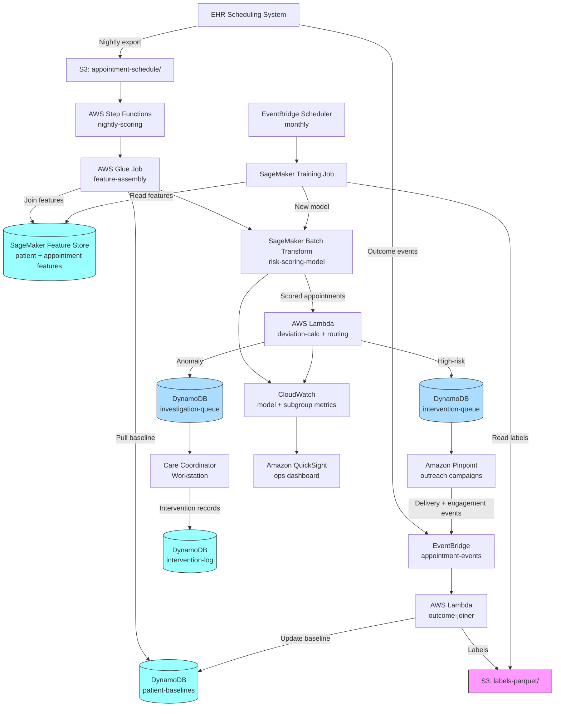

# Recipe 3.2 Architecture and Implementation: Patient No-Show Pattern Detection

*Companion to [Recipe 3.2: Patient No-Show Pattern Detection](chapter03.02-patient-no-show-pattern-detection). This page covers the AWS architecture, services, prerequisites, and pseudocode. For the problem framing and the conceptual approach, start with the main recipe.*

---

## The AWS Implementation

### Why These Services

**Amazon Redshift or Amazon Athena for the historical appointment store.** The feature engineering needs joins across millions of historical appointment records with patient-level aggregations. Redshift is the natural fit if your organization already has an enterprise data warehouse; Athena over S3 Parquet is the serverless alternative that works well when the query volume is bursty (which is typical for a nightly job). Either way, the data lives in one place and the feature pipeline queries it. HIPAA-eligible under the AWS BAA.

**AWS Glue for the feature pipeline orchestration.** Glue jobs run the ETL: pull tomorrow's schedule, join to historical features, produce the feature vector. Glue catalog gives you the schema management for the training and serving tables. For very large organizations, Glue ETL can be replaced with Amazon EMR or Managed Workflows for Apache Airflow (MWAA); for most mid-size organizations Glue is enough.

**Amazon SageMaker Feature Store for consistent features at training and serving time.** This is the piece people skip when starting and then desperately wish they had six months later. Store each feature with a timestamp; the training code uses `get_historical_features()` for point-in-time-correct joins, and the serving code uses `get_online_features()` for the current snapshot. Same feature code, no drift between training and inference. HIPAA-eligible.

**Amazon SageMaker Training for model training.** The weekly or monthly retrain runs as a SageMaker training job. SageMaker has built-in algorithms for logistic regression and XGBoost that cover the baseline recipe without writing model code; custom scripts work too. Training job outputs a model artifact in S3.

**Amazon SageMaker Batch Transform or real-time endpoint for scoring.** For nightly scoring over a bounded batch of appointments, Batch Transform is the right choice: spin up the inference infrastructure, score the batch, shut down. No always-on endpoint cost. For organizations that need real-time scoring (score each appointment as it's booked in the scheduling system), a SageMaker real-time endpoint is the fit. Start with batch, upgrade to real-time only if operational requirements demand it.

**Amazon DynamoDB for patient baselines and recent intervention records.** The baseline values (rolling no-show rate, recent engagement metrics) need to be queryable at serving time with single-digit-millisecond latency. DynamoDB with patient ID as the partition key serves this well. Intervention records get the same pattern. HIPAA-eligible.

**AWS Step Functions for the nightly orchestration.** The nightly pipeline is a sequence with conditional branches (feature assembly, scoring, deviation calculation, routing, metrics). Step Functions gives you visibility into each stage, retries on transient failures, and a workflow history that helps debugging when a night's run produces unexpected output. The alternative (cron + Lambda + hope) works until it doesn't.

**Amazon SNS or Amazon Pinpoint for the intervention execution.** The outreach itself (reminder calls, SMS, email, portal message) is executed through a messaging platform. Pinpoint is purpose-built for campaign orchestration and handles channel selection, delivery receipts, and opt-out compliance. SNS is fine if you're just pushing messages and the downstream systems handle the engagement layer. Both are HIPAA-eligible under the BAA with appropriate configuration.

**Amazon EventBridge for outcome capture and feedback events.** When the appointment outcome is recorded in the EHR (completed, no-show, cancelled, rescheduled), an event flows to EventBridge. A Lambda consumer joins the outcome to the original prediction record and writes the label to the feature store and the label archive. EventBridge Scheduler triggers the retraining job on the configured cadence.

**Amazon S3 with AWS KMS.** All training data, model artifacts, feature snapshots, and label archives live in S3 with customer-managed KMS keys. Parquet is the right format for both training scans and Athena queries.

**Amazon CloudWatch and AWS CloudTrail.** Standard. CloudWatch dashboards for model metrics (prediction distribution, feature freshness, inference latency, subgroup performance). CloudTrail data events on the patient baseline table and the feature store for audit.

**Amazon QuickSight for subgroup performance dashboards.** The operations team needs visibility into how the model performs by subgroup (age bands, insurance type, preferred language, race/ethnicity where captured). A QuickSight dashboard backed by Athena over the label archive is the simplest way to produce this view and keep it current.

### Architecture Diagram



### Prerequisites

| Requirement | Details |
|-------------|---------|
| **AWS Services** | Amazon S3, Amazon Redshift or Amazon Athena, AWS Glue, Amazon SageMaker (Training + Batch Transform or real-time endpoint + Feature Store), Amazon DynamoDB, AWS Step Functions, AWS Lambda, Amazon EventBridge + EventBridge Scheduler, Amazon Pinpoint or Amazon SNS, Amazon QuickSight, AWS KMS, Amazon CloudWatch, AWS CloudTrail. |
| **IAM Permissions** | Least-privilege per role. Glue job role: `s3:GetObject` on schedule + features buckets, `sagemaker:PutFeatureStoreRecord`, `dynamodb:GetItem` on baseline table. Batch Transform role: `s3:GetObject` on model + feature buckets, `s3:PutObject` on prediction output. Routing Lambda: `dynamodb:PutItem` on queue tables. Outcome Lambda: `s3:PutObject` on labels bucket, `dynamodb:UpdateItem` on baseline table. Training job role: `s3:GetObject/PutObject` on labels + features + model buckets. No `*` permissions in production. |
| **BAA** | AWS BAA signed. Every service listed is HIPAA-eligible under the BAA when configured correctly. Pinpoint requires specific configuration (SMS carrier routing, voice channel setup) to remain HIPAA-compliant; review the [AWS HIPAA Eligible Services reference](https://aws.amazon.com/compliance/hipaa-eligible-services-reference/) before production. |
| **Encryption** | S3: SSE-KMS with customer-managed keys. DynamoDB: encryption at rest with customer-managed KMS. SageMaker: KMS on training volumes, endpoint volumes, model artifacts, and Feature Store offline/online stores. Redshift: KMS cluster encryption. TLS in transit everywhere. |
| **VPC** | Production: Glue jobs and SageMaker jobs in a VPC with VPC endpoints for S3, DynamoDB, SageMaker Runtime, Athena/Redshift, CloudWatch Logs, and KMS. Pinpoint does not run in a VPC (it's a managed edge service); ensure that data flowing to Pinpoint is minimized to what's strictly needed for the message (appointment time, location, provider name). |
| **CloudTrail** | Enabled with data events on the patient-baselines, intervention-queue, investigation-queue, intervention-log tables, and the labels S3 bucket. Audit logs must capture every model prediction, every intervention decision, and every outcome event. |
| **Sample Data** | [Synthea](https://github.com/synthetichealth/synthea) generates synthetic appointment and patient data suitable for development. CMS publishes appointment-adjacent datasets but nothing that directly substitutes for your own scheduling data. Never use real PHI in development. |
| **Retention** | HIPAA baseline is 6 years for records containing PHI. Appointment and outcome records generally fall under that retention. Configure S3 lifecycle policies and DynamoDB point-in-time recovery accordingly. |
| **Fairness Monitoring Data** | The subgroup dashboard requires access to protected-characteristic data (race, ethnicity, preferred language, insurance type). Coordinate with the health equity team on what data is captured, how it's joined to the model outputs for monitoring, and who has access to the dashboard. Architectural requirements: (1) demographic attributes live in a dedicated S3 prefix or Glue table separate from the prediction archive; (2) read access to the demographic store is restricted to the SageMaker training job role and the QuickSight dashboard role only (no broad analyst access to row-level demographics); (3) CloudTrail data events are enabled on the demographic store so every subgroup query is auditable; (4) QuickSight queries run against an aggregated `subgroup-metrics` table (pre-joined at the cohort level during retraining) rather than the raw demographic-joined prediction archive, so dashboard users never see individual patient demographic attributes; (5) the training job role gets `s3:GetObject` and `glue:GetTable` scoped to the demographic-joined view, not to the underlying patient-level demographic store. Race/ethnicity data has different governance from PHI in some regulatory regimes; treat it as a separately governed data asset with its own access-control boundary. |
| **Cost Estimate** | Per 100,000 appointments scored: SageMaker Batch Transform (spin up, score, shut down): ~$5-15 depending on model size and instance type. DynamoDB reads + writes (baselines, queues, intervention log): ~$2-5. Glue feature assembly: ~$3-10. Feature Store online reads: ~$5. Pinpoint outreach (varies wildly by channel mix): $0.01-0.04 per outreach. For a 500,000-appointment-per-month organization with interventions on the top 10%: all-in model infrastructure ~$100-300/month fixed plus $500-2000/month variable on outreach, offset against the recovered revenue from reduced no-shows. No-show reduction of 2-5 percentage points on a 20% baseline is a realistic target and easily pays for the infrastructure.  |

### Ingredients

| AWS Service | Role |
|------------|------|
| **Amazon S3 (appointment-schedule)** | Nightly exports of tomorrow's schedule; input to the scoring pipeline |
| **Amazon S3 (features-parquet)** | Historical feature snapshots for training |
| **Amazon S3 (labels-parquet)** | Joined outcome labels for retraining |
| **Amazon S3 (model-artifacts)** | Versioned model artifacts from SageMaker Training |
| **Amazon Redshift / Athena** | SQL access to the historical appointment store for feature engineering |
| **AWS Glue** | Feature assembly ETL; catalog management for training tables |
| **Amazon SageMaker Feature Store** | Consistent feature computation at training and inference time |
| **Amazon SageMaker Training** | Monthly model retrain jobs |
| **Amazon SageMaker Batch Transform** | Nightly inference over the upcoming schedule |
| **Amazon DynamoDB (patient-baselines)** | Rolling per-patient no-show rate and recent engagement metrics |
| **Amazon DynamoDB (intervention-queue)** | High-risk appointments flagged for outreach |
| **Amazon DynamoDB (investigation-queue)** | Anomaly-flagged appointments for care coordinator review |
| **Amazon DynamoDB (intervention-log)** | Record of what intervention was applied, when, and by whom |
| **Amazon DynamoDB (processed-outcomes)** | Idempotency table for outcome-event deduplication; prevents duplicate label writes and baseline updates on redelivered events |
| **Amazon SQS (outcome-joiner-dlq)** | Dead letter queue for the outcome-joiner Lambda; captures events that exhaust retries |
| **Amazon SQS (routing-lambda-dlq)** | Dead letter queue for the routing Lambda |
| **Amazon SQS (deviation-calc-dlq)** | Dead letter queue for the deviation-calc Lambda |
| **AWS Step Functions** | Orchestrates the nightly scoring pipeline |
| **AWS Lambda (deviation-calc)** | Computes baseline deviation; applies routing thresholds |
| **AWS Lambda (outcome-joiner)** | Consumes outcome events; joins to predictions; updates labels and baselines |
| **Amazon EventBridge** | Bus for appointment outcome events; scheduler for nightly and retraining jobs |
| **Amazon Pinpoint (or SNS)** | Multi-channel outreach execution with delivery receipts |
| **Amazon QuickSight** | Operational dashboards; subgroup performance monitoring |
| **AWS KMS** | Customer-managed keys for all data stores and logs |
| **Amazon CloudWatch** | Model metrics, pipeline health, intervention outcomes |
| **AWS CloudTrail** | Audit logging on all PHI-bearing stores |

### Code

> **Reference implementations:** These aws-samples repositories demonstrate patterns that apply here:
> - [`amazon-sagemaker-examples`](https://github.com/aws/amazon-sagemaker-examples): Binary classification patterns with SageMaker built-in XGBoost, including Feature Store integration and Batch Transform inference workflows.
> - [`aws-samples`](https://github.com/aws-samples): Search for "appointment," "no-show," and "healthcare personalization" for adjacent patterns.
> 

#### Walkthrough

**Step 1: Pull tomorrow's schedule and assemble features.** A Step Functions workflow kicks off each night. The first task is a Glue job that reads the upcoming appointments (let's say the next three days) and assembles the feature vector for each one. The key correctness property here is point-in-time-correctness: every feature must reflect what was known *at the moment the appointment was scored*, not what becomes known later. For a serving-time scoring job this is automatic (features come from the current state of the Feature Store), but for training data it's a common source of leakage bugs.

Skip this step, or get it wrong, and you'll have two classes of problem. First, stale features: a patient's engagement rate was computed last week and doesn't reflect a failed reminder that happened yesterday. The risk score is then predictably wrong. Second, feature drift between training and serving: the training data was produced with a slightly different feature computation than the serving pipeline uses. The model performs worse in production than it did in evaluation, and you won't know why until you trace through the features by hand.

```text
FUNCTION assemble_features(appointment):
    // appointment has: patient_id, appointment_id, scheduled_time,
    // provider_id, clinic_id, visit_type, scheduled_at (when it was booked).

    patient_features = SageMakerFeatureStore.GetOnlineRecord(
        feature_group = "patient-features",
        record_id     = appointment.patient_id
    )
    // patient_features includes: age, insurance_type, preferred_language,
    // distance_to_clinic_km, portal_active_flag, prior_visits_90d,
    // prior_no_shows_12m, prior_completions_12m, rolling_no_show_rate,
    // last_engagement_days_ago, phone_bounce_count, email_bounce_count, etc.

    appointment_features = {
        lead_time_days: (appointment.scheduled_time - appointment.scheduled_at).days,
        hour_of_day: appointment.scheduled_time.hour,
        day_of_week: appointment.scheduled_time.weekday(),
        is_morning: appointment.scheduled_time.hour < 12,
        is_followup: appointment.visit_type in FOLLOWUP_TYPES,
        visit_type: appointment.visit_type,
        provider_id: appointment.provider_id,
        clinic_id: appointment.clinic_id,
        was_rescheduled: appointment.reschedule_count > 0,
        reschedule_count: appointment.reschedule_count
    }

    // Provider-specific rate for this patient (same patient, same provider in the past).
    provider_pair_history = Redshift.Query("""
        SELECT COUNT(*) FILTER (WHERE status = 'no-show') AS no_shows,
               COUNT(*) FILTER (WHERE status = 'completed') AS completed
        FROM appointment_history
        WHERE patient_id = :pid AND provider_id = :prov
          AND scheduled_time < :now
    """, pid = appointment.patient_id, prov = appointment.provider_id, now = NOW())

    appointment_features.patient_provider_no_show_rate = (
        provider_pair_history.no_shows /
        max(provider_pair_history.no_shows + provider_pair_history.completed, 1)
    )

    // Merge patient and appointment features. This is the inference feature vector.
    features = merge(patient_features, appointment_features)
    features.appointment_id   = appointment.appointment_id
    features.scored_at        = NOW()
    features.scorer_version   = MODEL_VERSION

    RETURN features
```

**Step 2: Run inference.** The assembled features for all upcoming appointments land in an S3 prefix. A SageMaker Batch Transform job reads them, runs the model, and writes predictions back to S3 keyed by appointment_id. Nothing exotic. The model produces a probability in `[0, 1]`; that's the risk score.

```text
// Inputs: S3 URI for the feature batch, model package from the registry.
// Outputs: S3 URI with predictions in JSONL, one record per appointment.

TRANSFORM_JOB_INPUT:
    data_source    = s3://features-bucket/nightly/YYYY-MM-DD/features.jsonl
    content_type   = "application/jsonlines"
    split_type     = "Line"

TRANSFORM_JOB_MODEL:
    model_name     = "no-show-scorer-vCURRENT"
    instance_type  = "ml.m5.large"
    instance_count = 1

TRANSFORM_JOB_OUTPUT:
    data_destination = s3://predictions-bucket/nightly/YYYY-MM-DD/predictions.jsonl

// Example output record per appointment:
// {
//   "appointment_id": "APT-2026-0050123",
//   "patient_id": "PAT-00441297",
//   "risk_score": 0.38,
//   "scorer_version": "logreg-v3",
//   "scored_at": "2026-05-12T02:15:17Z"
// }
```

**Step 3: Compute baseline deviation and route.** A Lambda reads the predictions file, pulls each patient's current baseline from DynamoDB, computes the deviation, and applies the routing thresholds. Two thresholds are in play: an absolute risk threshold for the outreach queue, and a deviation threshold for the investigation queue.

```pseudocode
// Placeholder thresholds. Tune against your own ROC curve and intervention capacity.
HIGH_RISK_THRESHOLD           = 0.35    // absolute risk above which we want to intervene
DEVIATION_FLAG_THRESHOLD      = 0.25    // appointment-specific risk this far above the
                                        // patient's rolling baseline is a contextual anomaly
INTERVENTION_CAPACITY_PER_DAY = 120     // tune to your team's actual outreach capacity
MIN_BASELINE_OBSERVATIONS     = 8       // below this count, the baseline is still dominated
                                        // by the prior and deviation calculations are unreliable.
                                        // 8 is a reasonable default for mixed-specialty orgs:
                                        // high-frequency specialties (dialysis, oncology) hit
                                        // it in a few months; routine primary care takes 1-2
                                        // years. Adjust based on your dominant visit cadence.

// Population-derived Beta prior for new patients. Compute POPULATION_NO_SHOW_RATE
// from your historical appointment data (typically 0.15-0.25 depending on org).
// PRIOR_EFFECTIVE_SAMPLE_SIZE controls how quickly patient-specific observations
// overwhelm the prior; ~10 means roughly 10 real observations to reach 50/50 weight.
POPULATION_NO_SHOW_RATE       = 0.18    // your org's historical no-show rate
PRIOR_EFFECTIVE_SAMPLE_SIZE   = 10
PRIOR_ALPHA                   = POPULATION_NO_SHOW_RATE * PRIOR_EFFECTIVE_SAMPLE_SIZE       // ~1.8
PRIOR_BETA                    = (1 - POPULATION_NO_SHOW_RATE) * PRIOR_EFFECTIVE_SAMPLE_SIZE // ~8.2

FUNCTION route_scored_appointments(predictions_uri):
    predictions = S3.ReadJSONL(predictions_uri)

    // Hydrate with patient baselines in bulk.
    patient_ids = unique(p.patient_id for p in predictions)
    baselines   = DynamoDB.BatchGet(table = "patient-baselines", keys = patient_ids)
    baseline_map = { b.patient_id: b for b in baselines }

    decisions = []

    FOR each pred in predictions:
        baseline = baseline_map.get(pred.patient_id)

        IF baseline is not null AND baseline.observation_count >= MIN_BASELINE_OBSERVATIONS:
            deviation = pred.risk_score - baseline.rolling_no_show_rate
        ELSE:
            // Cold start: no reliable baseline yet. Treat deviation as zero so we
            // route on absolute risk only.
            deviation = 0.0

        IF pred.risk_score >= HIGH_RISK_THRESHOLD:
            action = "outreach"
        ELSE IF deviation >= DEVIATION_FLAG_THRESHOLD:
            action = "investigate"
        ELSE:
            action = "standard"

        decisions.append({
            appointment_id: pred.appointment_id,
            patient_id: pred.patient_id,
            risk_score: pred.risk_score,
            baseline_rate: baseline.rolling_no_show_rate if baseline else null,
            deviation: deviation,
            action: action,
            scorer_version: pred.scorer_version,
            scored_at: pred.scored_at
        })

    // Sort outreach-action appointments by risk desc, cap at daily capacity.
    outreach = [d for d in decisions where d.action == "outreach"]
    outreach = sort_by(outreach, key = "risk_score", order = "desc")
    IF length(outreach) > INTERVENTION_CAPACITY_PER_DAY:
        bumped = outreach[INTERVENTION_CAPACITY_PER_DAY:]
        outreach = outreach[:INTERVENTION_CAPACITY_PER_DAY]
        // Bumped appointments drop to the investigation queue so someone sees them.
        FOR each d in bumped:
            d.action = "investigate"
            d.bumped_reason = "capacity"

    FOR each d in decisions:
        IF d.action == "outreach":
            DynamoDB.PutItem("intervention-queue", d)
            emit_metric("intervention_queued", 1, dimensions = { risk_band: "high" })
        ELSE IF d.action == "investigate":
            DynamoDB.PutItem("investigation-queue", d)
            emit_metric("investigation_flagged", 1)
        ELSE:
            emit_metric("standard_reminder", 1)

    RETURN decisions
```

**Step 4: Execute interventions and record what was done.** Outreach assignments get picked up by Pinpoint (or a human care coordinator workflow, depending on the intervention type). Every intervention is logged with its type, timing, and who executed it. This log is how later analyses separate "this appointment showed because the patient was always going to show" from "this appointment showed because we called them."

```text
FUNCTION execute_outreach(intervention):
    // intervention is a record from the intervention-queue with the appointment
    // details, the risk score, and a recommended channel mix.

    // Simple channel policy for the baseline recipe: pick based on patient
    // preferences and a fallback ladder. Recipe 4.1 covers channel optimization
    // in far more depth; this is the minimum you need for no-show interventions.
    channels = pick_channels(
        preferred = intervention.patient_preferences,
        fallback  = ["sms", "voice", "email"]
    )

    intervention_id = uuid()

    FOR each channel in channels:
        IF channel == "sms":
            Pinpoint.SendMessage(
                application_id   = PINPOINT_APP_ID,
                addresses        = { intervention.patient_phone: { ChannelType: "SMS" } },
                message_config   = build_sms_reminder(intervention),
                context          = { intervention_id: intervention_id }
            )
        ELSE IF channel == "voice":
            Pinpoint.SendVoiceMessage(
                origination_number = PINPOINT_VOICE_NUMBER,
                destination_number = intervention.patient_phone,
                content            = { SSMLMessage: build_voice_script(intervention) },
                context            = { intervention_id: intervention_id }
            )
        ELSE IF channel == "email":
            Pinpoint.SendEmail(... similar pattern ...)

    DynamoDB.PutItem("intervention-log", {
        intervention_id: intervention_id,
        appointment_id: intervention.appointment_id,
        patient_id: intervention.patient_id,
        channels_attempted: channels,
        intervention_type: "outbound_reminder",
        executed_at: NOW(),
        executed_by: "pinpoint_automation",
        scorer_version: intervention.scorer_version,
        risk_score_at_decision: intervention.risk_score
    })
```

**Step 5: Capture outcomes and close the loop.** When the appointment date arrives, the EHR records the outcome. An event flows to EventBridge. A Lambda consumes the event, joins the outcome to the prediction and intervention records, writes a labeled training row, and updates the patient baseline. Because EventBridge to Lambda async invocation is at-least-once delivery, a redelivered event could write a duplicate label row, update the baseline twice, and double-emit metrics. The first thing the handler does is an idempotency check: derive a deterministic event key from the appointment ID and outcome, attempt a conditional write to a `processed-outcomes` table, and return early if the key already exists.

```pseudocode
FUNCTION on_appointment_outcome(event):
    // event contains: appointment_id, outcome, outcome_recorded_at,
    // actual_arrival_time, check_in_status.

    // --- Idempotency guard (at-least-once delivery protection) ---
    // Derive a deterministic key so redelivered events are detected.
    event_key = hash(event.appointment_id + "|" + event.outcome + "|" + event.outcome_recorded_at)
    try:
        DynamoDB.PutItem(
            table = "processed-outcomes",
            item  = { event_key: event_key, processed_at: NOW(), appointment_id: event.appointment_id },
            condition_expression = "attribute_not_exists(event_key)"
        )
    catch ConditionalCheckFailed:
        // Already processed this exact event. Return early.
        RETURN

    // Pull the original prediction for this appointment.
    prediction = DynamoDB.GetItem(
        table = "predictions-archive",
        key   = { appointment_id: event.appointment_id }
    )

    // Pull any intervention records for this appointment.
    interventions = DynamoDB.Query(
        table = "intervention-log",
        index = "appointment_id_index",
        key   = { appointment_id: event.appointment_id }
    )

    // Derive the training label. See "The Label Problem" in the technology section
    // for why this looks simple and is actually contentious.
    label = derive_label(
        outcome                   = event.outcome,
        actual_arrival_time       = event.actual_arrival_time,
        scheduled_time            = prediction.scheduled_time,
        interventions             = interventions
    )
    // label is one of: "showed", "no_show", "late_arrival_accepted",
    // "late_cancellation", "rescheduled_with_lead_time"

    // Write the training row.
    training_row = {
        appointment_id: event.appointment_id,
        patient_id: prediction.patient_id,
        scored_at: prediction.scored_at,
        outcome_recorded_at: event.outcome_recorded_at,
        features_at_scoring: prediction.features_snapshot,
        risk_score_at_scoring: prediction.risk_score,
        scorer_version: prediction.scorer_version,
        interventions_applied: [i.intervention_type for i in interventions],
        intervention_count: length(interventions),
        label: label,
        label_derivation_version: LABEL_DERIVATION_VERSION
    }
    S3.PutObject(
        bucket = "labels-parquet",
        key    = date_partitioned_key(event.outcome_recorded_at) + "/" + uuid() + ".parquet",
        body   = parquet_encode([training_row])
    )

    // Update the patient baseline. Only update when no intervention was applied
    // (the same counterfactual-aware exclusion used in the retrain query). This
    // prevents baselines from collapsing toward intervention-adjusted rates over
    // time, which would degrade the deviation calculation.
    baseline = DynamoDB.GetItem("patient-baselines", { patient_id: prediction.patient_id })
               OR create_baseline_with_prior(prediction.patient_id)

    is_no_show_or_late = label in ["no_show", "late_cancellation"]
    was_intervened = length(interventions) > 0

    IF was_intervened:
        // Track that we observed this patient under intervention, but do NOT
        // update the rolling baseline. The baseline should reflect what the
        // patient does without outreach.
        baseline.intervened_observation_count += 1
        baseline.last_updated_at = NOW()
    ELSE:
        // No intervention applied: this is a clean observation of the patient's
        // natural behavior. Update the Bayesian posterior.
        IF is_no_show_or_late:
            baseline.alpha += 1
        ELSE:
            baseline.beta += 1
        baseline.observation_count += 1
        baseline.rolling_no_show_rate = baseline.alpha / (baseline.alpha + baseline.beta)
        baseline.last_updated_at = NOW()

    DynamoDB.PutItem("patient-baselines", baseline)

    // Emit metrics for the operational dashboard.
    emit_metric("outcome_recorded", 1, dimensions = { label: label })
    emit_metric("intervention_outcome", 1, dimensions = {
        label: label,
        intervened: "yes" if length(interventions) > 0 else "no"
    })

FUNCTION create_baseline_with_prior(patient_id):
    // Initialize a new patient baseline using the population-derived Beta prior.
    // This gives every patient a reasonable starting estimate (the population
    // no-show rate) that converges toward their personal rate as observations
    // accumulate. The prior's effective sample size (~10) means roughly 10
    // real observations to reach equal weighting between prior and data.
    RETURN {
        patient_id: patient_id,
        alpha: PRIOR_ALPHA,    // ~1.8 (population rate * effective N)
        beta: PRIOR_BETA,     // ~8.2 ((1 - population rate) * effective N)
        rolling_no_show_rate: PRIOR_ALPHA / (PRIOR_ALPHA + PRIOR_BETA),  // population rate
        observation_count: 0,
        intervened_observation_count: 0,
        last_updated_at: NOW()
    }

FUNCTION retrain_monthly():
    // Triggered by an EventBridge Scheduler rule.

    // 1. Pull a recent window of labeled training data.
    training_df = Athena.query("""
        SELECT features_at_scoring, label, risk_score_at_scoring, scorer_version,
               intervention_count, patient_id, scored_at
        FROM labels_parquet
        WHERE scored_at >= current_date - interval '365' day
          AND intervention_count = 0       -- exclude intervened appointments from primary training
    """)

    // 2. Split train/val with temporal discipline first, then patient-stratified
    //    within each side. Time-based split prevents seasonal overfitting that a
    //    pure random patient-stratified split would miss. Validation = most recent
    //    30 days; training = prior ~11 months. Patient-stratified within each side
    //    so the same patient does not appear on both sides of the temporal boundary.
    temporal_cutoff = max(training_df.scored_at) - interval '30' day
    train_pool = training_df[training_df.scored_at < temporal_cutoff]
    val_pool   = training_df[training_df.scored_at >= temporal_cutoff]

    // Enforce patient-level separation: any patient appearing in val_pool is
    // removed from train_pool to prevent same-patient leakage across the split.
    val_patients = unique(val_pool.patient_id)
    train_pool   = train_pool[train_pool.patient_id NOT IN val_patients]

    X_train, y_train = build_features_and_labels(train_pool)
    X_val, y_val     = build_features_and_labels(val_pool)

    // 3. Fit. Logistic regression for the baseline recipe; swap in XGBoost once
    //    the system is stable.
    model = LogisticRegression.train(X_train, y_train, regularization = "l2", C = 1.0)
    val_metrics = evaluate(model, X_val, y_val)

    // 4. Subgroup evaluation before promotion. This is not optional.
    subgroup_metrics = {}
    FOR each subgroup in ["age_band", "insurance_type", "preferred_language", "race_ethnicity"]:
        subgroup_metrics[subgroup] = evaluate_by_subgroup(model, X_val, y_val, subgroup)

    // 5. Only promote if the challenger beats the incumbent on overall metrics
    //    AND does not materially regress on any subgroup.
    incumbent_metrics = fetch_incumbent_metrics()
    IF val_metrics.auc > incumbent_metrics.auc + MIN_IMPROVEMENT \
       AND no_subgroup_regression(subgroup_metrics, incumbent_metrics):
        register_model(model, version = next_version(), metrics = val_metrics,
                       subgroup_metrics = subgroup_metrics)
        log("Promoted new model.")
    ELSE:
        log("Challenger did not beat incumbent (or regressed on a subgroup). Keeping current.")
```

> **Curious how this looks in Python?** The pseudocode above covers the concepts. If you'd like to see sample Python code that demonstrates these patterns using boto3, check out the [Python Example](chapter03.02-python-example). It walks through each step with inline comments and notes on what you'd need to change for a real deployment.

### Expected Results

**Sample intervention-queue record for a high-risk appointment:**

```json
{
  "appointment_id": "APT-2026-0050123",
  "patient_id": "PAT-00441297",
  "scheduled_time": "2026-05-14T09:00:00",
  "provider_id": "PRV-0172",
  "clinic_id": "CLN-03",
  "visit_type": "primary-care-followup",
  "risk_score": 0.52,
  "baseline_rate": 0.18,
  "deviation": 0.34,
  "action": "outreach",
  "feature_importance": {
    "_note": "Normalized relative importance of each feature in driving this score. Values sum to 1.0. These represent how much each feature contributed to the model's decision relative to the other features, not additive components of the probability itself.",
    "lead_time_days": 0.17,
    "prior_no_shows_12m": 0.21,
    "hour_of_day": 0.12,
    "rolling_no_show_rate": 0.15,
    "last_engagement_days_ago": 0.14,
    "patient_provider_no_show_rate": 0.10,
    "was_rescheduled": 0.06,
    "distance_to_clinic_km": 0.05
  },
  "scorer_version": "logreg-v3",
  "scored_at": "2026-05-12T02:16:04Z",
  "recommended_channels": ["voice", "sms"],
  "recommended_timing_hours_before": 24
}
```

**Sample investigation-queue record for a contextual anomaly:**

```json
{
  "appointment_id": "APT-2026-0050998",
  "patient_id": "PAT-00301105",
  "scheduled_time": "2026-05-14T16:30:00",
  "visit_type": "cardiology-new",
  "risk_score": 0.29,
  "baseline_rate": 0.04,
  "deviation": 0.25,
  "action": "investigate",
  "anomaly_note": "This patient shows reliably (4% lifetime rate). This appointment scores elevated risk primarily due to: late afternoon time slot, 6-week lead time, rescheduled from earlier appointment 2 weeks ago. Worth a courtesy call to confirm they can still make it.",
  "scorer_version": "logreg-v3",
  "scored_at": "2026-05-12T02:16:04Z"
}
```

That second example is the one that's hard to surface without the anomaly framing. The patient's absolute risk isn't the highest on the list. They'd be ignored by a pure "sort by risk and call the top 30" operational policy. But they're well above their personal baseline, and the combination of signals (rescheduled, afternoon slot, long lead time) tells a story worth a three-minute phone call. That call is the entire point of doing the anomaly calculation.

**Performance benchmarks (illustrative; measure against your own data):**

| Metric | Rule-based (starting point) | Logistic regression | Gradient boosting (mature) |
|--------|-----------------------------|---------------------|----------------------------|
| AUC (population level) | 0.65-0.70 | 0.75-0.80 | 0.80-0.85 |
| Precision at top 10% of appointments | 40-55% | 55-70% | 65-80% |
| Recall at top 10% | 25-35% | 35-50% | 45-60% |
| No-show rate reduction in intervened cohort | 15-20% relative | 25-35% relative | 30-40% relative |
| Subgroup AUC spread (p95 subgroup minus p5) | 0.05-0.10 | 0.08-0.15 | 0.08-0.15 |
| Scoring latency per appointment (batch mode) | < 10 ms | 20-50 ms | 50-100 ms |

**Where it struggles:**

- **First-time patients.** No engagement history, no provider-pair history, no rolling baseline. Cold-start predictions rely almost entirely on demographic and appointment features, which are weaker signals. Mitigation: cohort-level priors (for patients you have no history on, use the rate for similar-cohort patients) until two or three appointments of personal history exist.
- **Seasonality shifts.** Flu season, holiday weeks, back-to-school. If the training window doesn't include the current seasonal pattern, the model underperforms. Monthly retraining with a trailing 12-month window mostly handles this, but specific week types (holiday week, major sporting event local to the clinic) can stay anomalous.
- **Changes in operational workflow.** If the clinic rolls out a new reminder system or changes its copay policy, the no-show rate can shift overnight in a way the model didn't anticipate. Detection: watch the prediction-distribution drift monitor. If the model's distribution of scores shifts noticeably while the schedule mix looks the same, something operational has changed.
- **Patients whose life circumstances just changed.** The rolling baseline takes weeks to update. A patient who was perfectly reliable and just lost their car won't show up as elevated risk until their first couple of no-shows accumulate. This is partially addressable with fast-updating signals (portal login recency, phone-number validity), but some events genuinely can't be predicted from historical data and need to be caught in the investigation queue rather than the outreach queue.

---

## Why This Isn't Production-Ready

The pseudocode above covers the pattern. A production deployment closes several gaps that the recipe intentionally leaves light.

**Scheduling system integration is the long pole.** Your scheduling system (Epic Cadence, Cerner Scheduling, NextGen, athena, and so on) has its own extract conventions, update cadences, and identifier schemes. Plumbing the nightly export to land in S3 in a clean, timezone-correct format is typically a multi-week integration project. Include the full lifecycle: initial export, incremental updates throughout the day (new appointments get booked, existing ones get rescheduled), and eventual outcome events back from the EHR. Time zones specifically are a classic bug farm; always store UTC in the warehouse and render local time only at display.

**Feature engineering is where the time goes.** The feature list in the walkthrough is representative, not exhaustive. Real deployments include dozens more features, many of which require careful joins across the data warehouse (insurance eligibility on the appointment date, care management enrollment status, active orders, problem list summaries). Budget more time here than you expect. It's not hard work, it's just a lot of work.

**Patient preference storage is a first-class concern.** The outreach step needs to know the patient's preferred channels, opt-outs, language, and accessibility needs. This is usually scattered across the EHR, a CRM, and the scheduling system's own reminder preferences. Consolidating it into a canonical patient-preference store is a project of its own. Recipe 4.1 treats this in more depth; reference it rather than rebuilding the same infrastructure separately.

**Threshold tuning is ongoing.** The `HIGH_RISK_THRESHOLD` and `DEVIATION_FLAG_THRESHOLD` are not set once and left alone. They target a specific intervention capacity, and intervention capacity varies week to week based on staffing, seasonal demand, and the ratio of interventions that actually convert. Make them configurable, and review them with the operations team monthly.

**Subgroup monitoring is not optional.** The model will perform differently across subgroups. That is a matter of fact, not hypothesis. The dashboard that surfaces subgroup AUC, subgroup intervention rates, and subgroup outcome improvement is part of the minimum viable deployment, not a post-launch enhancement. If your organization captures race/ethnicity and preferred language, include them in the dashboard. If not, include age bands, insurance type, and clinic location as proxy subgroups; these don't fully cover the concern but they're better than nothing.

**Intervention effect measurement is a separate analysis problem.** The model answers "who's likely to no-show?" It does not answer "did our outreach change the outcome?" Measuring intervention effect requires either a randomized hold-out (some high-risk appointments randomly not intervened on) or a matched-pair quasi-experimental design. Budget for this analysis explicitly; it's how you justify the program to finance and leadership, and it's also how you detect when the interventions stop working as patient behavior adapts.

**Data retention policies for labels.** Outcome labels are small, long-lived records and they're essential for retraining. Don't let them age out of your primary data store quietly. Parquet archives in S3 with lifecycle policies to Glacier for older partitions is the standard pattern; make sure the retraining job knows how to hydrate from Glacier when the training window extends past the current hot partition.

**Model monitoring and drift detection.** Watch the distribution of risk scores over time; sudden shifts are a signal that something upstream changed. Watch feature freshness; a feature value that should update daily but has stayed the same for a week is almost certainly a broken pipeline. Watch inference latency; the Batch Transform job time should be predictable and alarms on anomalies.

**Governance review.** A no-show prediction model intersects with non-discrimination policy, patient communication policy, and access-to-care equity goals. Get review from the health equity team, the patient experience team, and compliance before the model starts driving operational decisions. "We deployed the model and nobody at leadership level knew" is a classic cause of program cancellation after something goes wrong.

**PHI handling in the outreach messages.** A reminder message is clinical PHI: it names a provider, a clinic, a visit type, a date. The messaging infrastructure (SMS carrier, voice telephony provider, email sender) all need to be under a BAA with appropriate protections. Pinpoint has specific configuration requirements for HIPAA; don't skip the service-level reference documentation.

**High-stigma specialty disclosure in reminders.** For behavioral health, addiction medicine, OB/GYN, infectious disease, and oncology clinics, the clinic name itself is a diagnostic disclosure. An SMS reading "Reminder: 9:00 AM at Mountain View Behavioral Health" exposes the patient's specialty to anyone who sees the lock screen, anyone with access to a shared family-plan device, and potentially to carrier billing logs. The minimum-necessary message for these specialties is typically the appointment time plus a generic identifier ("your healthcare appointment"), with the specialty name included only when the patient has explicitly opted into specialty-disclosing reminders. Implement this as a per-clinic `reminder_content_sensitivity` flag in the patient preference store. When the flag is set to `high_sensitivity`, the message template selection function picks a generic template regardless of the outreach channel. When the patient has explicitly opted in to full-detail reminders for that clinic, use the standard template. This flag should default to `high_sensitivity` for any clinic whose name or specialty implies a stigma-carrying diagnosis; err toward generic rather than specific.

**Appeal and override workflow.** Sometimes the operations team will want to override the model's decision ("this patient shouldn't be in the investigation queue, we already talked to them yesterday"). Provide an override mechanism that records who overrode, when, and why. The overrides are also training data; if overrides pile up in a specific pattern, it's a signal the model or thresholds need adjustment.

**Dead letter queues and poison-message handling.** Configure an `OnFailure` SQS dead letter queue for each async Lambda in the pipeline: `outcome-joiner-dlq`, `routing-lambda-dlq`, and `deviation-calc-dlq`. Lambda's default async retry behavior is two retries then drop, which silently loses events. A lost outcome event is a lost label, and the retraining pipeline will run a month later on a training set missing some of the highest-signal outcome data (the appointments that produced processing errors are often the edge cases that matter most for model calibration). Set a CloudWatch alarm on each DLQ's `ApproximateNumberOfMessagesVisible` metric, alerting when depth exceeds zero. Build an explicit replay procedure: pull messages from the DLQ, inspect the failure reason, fix the underlying issue, and resubmit. This ties directly to the label-retention discipline described above: your labels are only as complete as your event-processing pipeline is reliable.

---

## Variations and Extensions

**Real-time scoring at booking time.** Instead of nightly batch scoring, score appointments as they're booked. The operational benefit is that front-desk staff can see the risk at the moment of scheduling and potentially steer the patient toward a time slot that's better for their profile. The engineering is straightforward: swap Batch Transform for a SageMaker real-time endpoint and wire it behind an API that the scheduling system calls synchronously. Watch the latency budget; the scheduling workflow can tolerate 200-300 ms comfortably but not much more.

**Patient-self-reschedule prompting.** Pair the high-risk flag with an automated self-serve reschedule option in the patient portal or the reminder message itself. "Can't make it? Tap here to see available slots in the next two weeks." Converts some would-be no-shows into kept (rescheduled) appointments without requiring staff outreach. The analytics question becomes "what fraction of high-risk appointments the patient reschedules themselves when offered," which is a separately trackable outcome alongside the showed-or-no-show label.

**Transportation-specific intervention routing.** If care management has transportation-assistance capacity, route a sub-stream of the intervention queue specifically to them rather than to generic outreach. Feature engineering to flag "transportation is the likely barrier" (long distance to clinic, no prior provider relationship, first-time patient, low-income ZIP code, late no-show history) improves the targeting. Several health systems have reported that transportation interventions produce disproportionately large reductions in the specific subset of no-shows they address, though the numbers vary widely by market. 

**Group-scheduling optimization.** Instead of (or in addition to) predicting individual no-shows, predict the expected number of shows per slot grid and adjust scheduling to that expectation. If the model says tomorrow's 2 p.m. slots have a 78% expected show rate across all providers, the scheduling team can double-book one of them without double-booking them all. This is a different architectural pattern (optimization rather than anomaly detection) and belongs more properly in Chapter 14, but it consumes the same predictions this recipe produces.

**Cross-clinic learning.** If your organization has multiple clinics, the model can learn from all of them while serving each. Be careful about the pooling strategy: some behaviors are clinic-specific (a particular clinic's parking situation, local traffic patterns) and should be captured as clinic-level features. Others generalize across clinics and benefit from the larger training set. A common design is a shared base model with clinic-specific fine-tuning or with clinic ID as a feature.

**Bandit-based intervention selection.** Once you have multiple intervention types (phone call, transportation assistance, reschedule offer, SMS reminder), the question of "which intervention for this patient" becomes a contextual bandit problem. This is a direct complement to Recipe 4.1's channel optimization, applied specifically to the no-show risk use case. Combine them: the risk model tells you who to intervene on, the bandit tells you how. The architecture can share infrastructure between the two recipes.

---

## Additional Resources

**AWS Documentation:**
- [Amazon SageMaker Feature Store Developer Guide](https://docs.aws.amazon.com/sagemaker/latest/dg/feature-store.html)
- [Amazon SageMaker Batch Transform](https://docs.aws.amazon.com/sagemaker/latest/dg/batch-transform.html)
- [Amazon SageMaker Built-in XGBoost Algorithm](https://docs.aws.amazon.com/sagemaker/latest/dg/xgboost.html)
- [Amazon SageMaker Clarify for Bias Detection](https://docs.aws.amazon.com/sagemaker/latest/dg/clarify-fairness-and-explainability.html)
- [Amazon SageMaker Model Monitor](https://docs.aws.amazon.com/sagemaker/latest/dg/model-monitor.html)
- [Amazon Pinpoint HIPAA Eligibility](https://docs.aws.amazon.com/pinpoint/latest/developerguide/compliance-validation.html)
- [Amazon DynamoDB Best Practices](https://docs.aws.amazon.com/amazondynamodb/latest/developerguide/best-practices.html)
- [AWS Step Functions Developer Guide](https://docs.aws.amazon.com/step-functions/latest/dg/welcome.html)
- [AWS HIPAA Eligible Services Reference](https://aws.amazon.com/compliance/hipaa-eligible-services-reference/)
- [Architecting for HIPAA on AWS (Whitepaper)](https://docs.aws.amazon.com/whitepapers/latest/architecting-hipaa-security-and-compliance-on-aws/welcome.html)

**AWS Sample Repos:**
- [`amazon-sagemaker-examples`](https://github.com/aws/amazon-sagemaker-examples): Binary classification patterns with SageMaker, including Feature Store integration, Batch Transform, and Model Monitor workflows directly applicable to this recipe.
- [`aws-samples`](https://github.com/aws-samples): Search for "patient engagement," "appointment," and "healthcare personalization" for adjacent patterns.
- [`amazon-sagemaker-clarify`](https://github.com/aws/amazon-sagemaker-examples/tree/main/sagemaker_processing/fairness_and_explainability): SageMaker Clarify examples that demonstrate subgroup bias evaluation and SHAP-based explainability, both of which apply to the fairness monitoring required for this recipe.

**AWS Solutions and Blogs:**
- [AWS Solutions Library](https://aws.amazon.com/solutions/) (filter by AI/ML + Healthcare): browse for patient engagement and care management reference architectures.
- [AWS Machine Learning Blog](https://aws.amazon.com/blogs/machine-learning/): search for "no-show," "patient engagement," and "SageMaker Feature Store" for deep-dives relevant to this pipeline.

**Industry and Academic References:**
- [Agency for Healthcare Research and Quality (AHRQ) No-Show Reduction Resources](https://www.ahrq.gov/): AHRQ publishes reviews and toolkits on no-show reduction programs; useful operational context alongside the technical pipeline.
- [PCORI Patient Engagement Research](https://www.pcori.org/): Patient-Centered Outcomes Research Institute has funded several studies on patient engagement and adherence that inform feature selection and intervention design.

**External References (Conceptual):**
- [Contextual bandit algorithms, Wikipedia](https://en.wikipedia.org/wiki/Multi-armed_bandit#Contextual_bandit): relevant conceptual background for the intervention-selection extension discussed under Variations.
- [SHAP (SHapley Additive exPlanations)](https://github.com/shap/shap): tree-model explanation library used widely for per-prediction feature attribution; pairs naturally with the XGBoost upgrade path.
- [Synthea](https://github.com/synthetichealth/synthea): synthetic appointment and patient data generator for non-PHI development environments.

---

## Estimated Implementation Time

| Tier | Scope | Time |
|------|-------|------|
| Basic | Nightly scoring pipeline, logistic regression with core features, DynamoDB baselines, intervention queue, simple outreach integration, manual outcome capture | 4-6 weeks |
| Production-ready | SageMaker Feature Store, XGBoost with full feature set, automated retraining, Model Monitor, subgroup fairness dashboard, Pinpoint integration, Step Functions orchestration, audit logging | 3-5 months |
| With variations | Real-time scoring at booking, self-serve reschedule prompting, transportation-specific routing, cross-clinic learning, bandit-based intervention selection | 4-8 months beyond production-ready |

---

---

*← [Main Recipe 3.2](chapter03.02-patient-no-show-pattern-detection) · [Python Example](chapter03.02-python-example) · [Chapter Preface](chapter03-preface)*
