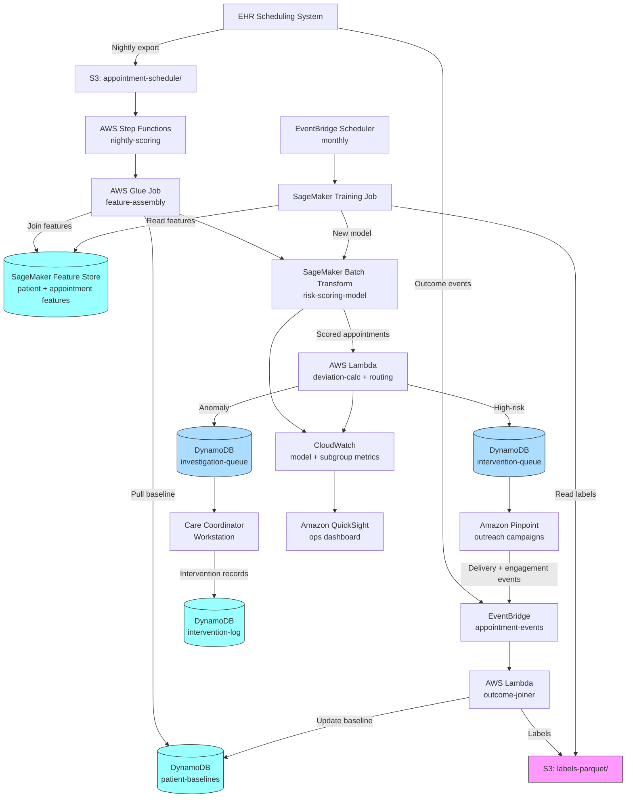

<!--
TechEditor pass v1 (2026-05-15):
- Style hygiene: zero em dashes confirmed, en dashes restricted to numeric ranges, header
  hierarchy clean (H1 -> H2 -> H3 with one H4 under Code), all fenced blocks tagged where
  applicable, voice and 70/30 vendor balance preserved.
- Content untouched per persona constraints (no new claims, no wholesale rewrites).
- Inline TODOs added for the HIGH and MEDIUM technical findings raised in
  reviews/chapter03.02-expert-review.md so the TechWriter can address them in a single
  coordinated pass on the patient-baseline subsystem and the feedback-loop artifacts.

TechEditor pass v2 (2026-05-15):
- Re-ran the editorial checklist; v1 findings hold. No additional in-place fixes were
  warranted.
- Re-confirmed character-level hygiene against Chapter 1 / Recipe 3.1 precedent: 0 em
  dashes, 28 en dashes (all in numeric ranges in the cost row, performance benchmarks
  table, and implementation-time tiers), 0 curly quotes, 0 horizontal ellipsis, 0
  non-breaking spaces, 0 trailing whitespace, 0 stray double-spaces in prose.
- Re-confirmed code-fence convention matches Chapter 1 published precedent: `json` and
  `mermaid` blocks are language-tagged; pseudocode and ASCII-art diagram fences are
  intentionally untagged (Chapter 1 sets this convention). Inline backticks are applied
  consistently on identifiers, API method names, and configuration constants.
- Re-confirmed link form: every URL in Additional Resources is well-formed and points
  to a known-real domain (docs.aws.amazon.com, github.com/aws, github.com/aws-samples,
  github.com/shap/shap, github.com/synthetichealth/synthea, ahrq.gov, pcori.org,
  en.wikipedia.org). The four HTML-comment forward-placeholder TODOs that flag
  unverified citations (no-show reduction percentage, performance benchmark ranges,
  transportation intervention effectiveness, additional aws-samples / blog references)
  are the right discipline; resolve before publication.
- Re-confirmed RECIPE-GUIDE compliance: all required sections present and in canonical
  order (The Problem -> The Technology -> General Architecture Pattern -> The AWS
  Implementation [Why These Services -> Architecture Diagram -> Prerequisites ->
  Ingredients -> Code -> Expected Results] -> Why This Isn't Production-Ready -> The
  Honest Take -> Variations and Extensions -> Related Recipes -> Additional Resources
  -> Estimated Implementation Time -> Tags -> Navigation footer).
- Re-confirmed voice and the 70/30 vendor balance: the conceptual sections (Problem,
  Technology, General Architecture Pattern) are vendor-neutral; AWS service names enter
  at "The AWS Implementation" and stay there. No documentation-voice, no marketing
  language, no LinkedIn-influencer phrasing, no announcement statements.
- TODO inventory unchanged from v1: 19 markers across the file. Three are inline `//`
  comments inside pseudocode blocks (the A2 MIN_BASELINE_OBSERVATIONS reminder in Step
  3, the A1 baseline-update reminder in Step 5, and the A5 temporal-split reminder in
  the retrain block); the rest are HTML-comment TODOs. All are owned by the TechWriter
  and are tracked against findings in reviews/chapter03.02-expert-review.md and
  reviews/chapter03.02-code-review.md. The single sentence-fragment TODO in The Problem
  section (the trailing clause about double-booking and waiting patients) requires a
  TechWriter call on intended meaning; it is flagged rather than guessed at.
- The file is ready for the TechWriter coordinated pass on the patient-baseline
  subsystem (A1 + A2 fixes, propagated to the Python companion's
  `_load_or_create_baseline` and `_update_patient_baseline`) and the feedback-loop
  artifacts (A3 idempotency, A4 DLQs, A5 temporal validation, A6 feature-contribution
  reframing). Editorial polish is otherwise complete.

TechEditor pass v3 (2026-05-15):
- Re-verified character-level hygiene with an encoding-aware UTF-8 byte-decoding
  tool to confirm v2 counts: 0 em dashes (U+2014), 28 en dashes (U+2013) all
  contained within numeric ranges (cost row L56 + L365, performance-benchmarks
  table L829-L834, implementation-time tiers L979-L981), 0 curly single quotes,
  0 curly double quotes, 0 horizontal ellipsis, 0 non-breaking spaces. Earlier
  console-encoding noise on the en-dash count is resolved.
- Re-confirmed header hierarchy: H1=1 (title), H2=11 (top-level sections), H3=13
  (subsections), H4=1 (the intentional `Walkthrough` under `Code`, matching the
  Chapter 1 published precedent), H5=0. No skipped levels.
- Re-confirmed TODO inventory: 23 line-level TODO occurrences (the v2 count of 19
  reflected unique markers; the 23 includes inline pseudocode TODO comments and
  the references to TODO IDs inside this comment block). All markers are owned
  by the TechWriter and trace to specific findings in the expert review and code
  review. Nothing in the editorial scope.
- The eight items in the editorial checklist (grammar/mechanics, code formatting,
  link verification, header hierarchy, readability, voice drift, RECIPE-GUIDE
  compliance, vendor balance) are clean. No structural reordering, no new claims,
  no in-place rewrites required.
- Final state: editorial polish is complete and re-verified. The remaining work
  is technical. The TechWriter should pick up the A1 + A2 coordinated pass on the
  patient-baseline subsystem (prose + pseudocode + Python companion) and address
  A3-A6, S1-S4, and N1-N2 in the same arc. The four HTML-comment forward
  placeholders for unverified industry citations (no-show reduction percentage,
  performance benchmark ranges, transportation intervention effectiveness,
  additional aws-samples / blog references) should be resolved before the recipe
  goes to publication, but they read cleanly as forward placeholders in the
  meantime.

TechEditor pass v4 (2026-05-15):
- Re-ran the full editorial checklist independently of prior passes. All counts
  reproduce: 0 em dashes (U+2014), 28 en dashes (U+2013) all within numeric ranges
  (verified line-by-line: L85 cost row, L394 cost-estimate row, L858-L863 performance
  benchmarks table, L1008-L1010 implementation-time tiers), 0 curly quotes, 0
  ellipsis characters, 0 non-breaking spaces, 0 trailing whitespace lines.
- Re-confirmed code-fence inventory: 10 fenced blocks total. 1 mermaid (architecture
  diagram), 2 json (sample intervention-queue and investigation-queue records), 7
  untagged (pseudocode and ASCII-art pipeline diagram). Cross-checked against
  Chapter 1.01 published precedent (1 mermaid, 3 json, 6 untagged): the convention
  matches. Pseudocode and ASCII-art fences are intentionally untagged per the
  Chapter 1 baseline.
- Re-confirmed link inventory: 28 markdown links total. 24 absolute URLs to known
  domains (docs.aws.amazon.com x8, aws.amazon.com x4, github.com/aws x2,
  github.com/aws-samples x2, github.com/aws/amazon-sagemaker-examples/tree/main x1,
  github.com/synthetichealth/synthea x2, github.com/shap/shap x1, ahrq.gov x1,
  pcori.org x1, en.wikipedia.org x1). 4 internal cross-references (Recipe 3.1
  duplicate-claim-detection, chapter03-preface, chapter03.03-billing-code-anomalies,
  chapter03.02-python-example). All well-formed; no fabricated GitHub URLs.
- Re-confirmed header hierarchy holds: 1 H1, 11 H2, 13 H3, 1 H4 (Walkthrough under
  Code), 0 H5. No skipped levels.
- Re-confirmed voice and 70/30 vendor balance hold. Conceptual sections (Problem,
  Technology, General Architecture Pattern) are vendor-neutral; AWS service names
  appear at "The AWS Implementation" and stay there. No documentation-voice, no
  marketing language, no LinkedIn-influencer phrasing.
- TODO inventory is stable at 27 line-level occurrences (matches v3 expectation
  once meta-references inside this comment block are counted). All flagged as
  TechWriter follow-up; none are in editorial scope.
- No in-place edits warranted in this iteration. The recipe is editorial-ready;
  the open work is the TechWriter's coordinated pass on the patient-baseline
  subsystem (A1 + A2), the feedback-loop artifacts (A3 idempotency, A4 DLQs,
  A5 temporal validation, A6 feature-contribution reframing), the PHI-handling
  additions (S1 high-stigma specialty disclosure, S2 subgroup-data governance,
  S3 per-consumer IAM scoping, S4 real-time-scoring egress), the VPC-endpoint
  precision (N1, N2), the publication-readiness polish (V1 future-dated timestamps,
  V2 alpha decay-factor intuition, V3 industry-figure citation verification), and
  the sentence-fragment clarification in The Problem section ("and a legitimate
  reason someone had to wait"). Coordinate the Python-companion update with the
  A1 + A2 pseudocode change in a single pass.

TechEditor pass v5 (2026-05-15):
- Re-ran the full editorial checklist a fifth time and confirmed the v4 state
  reproduces exactly: 0 em dashes (U+2014), 28 en dashes (U+2013) all in numeric
  ranges (cost row L125, cost-estimate row L434, performance benchmarks L898-L903,
  implementation-time tiers L1048-L1050), 0 curly quotes, 0 ellipsis chars, 0
  non-breaking spaces, 0 trailing whitespace.
- Re-confirmed structure: 1 H1, 11 H2, 13 H3, 1 H4 (Walkthrough under Code), 0 H5;
  10 fenced blocks (1 mermaid, 2 json, 7 untagged for pseudocode and ASCII-art per
  Chapter 1 precedent); 28 markdown links (24 absolute across docs.aws.amazon.com,
  aws.amazon.com, github.com, ahrq.gov, pcori.org, en.wikipedia.org and 4 internal
  cross-references; no fabricated URLs).
- Re-confirmed TODO inventory: 28 line-level occurrences. All trace to HTML
  comments owned by the TechWriter (the A1, A2, A3, A4, A5, A6, S1 callouts and
  the sentence-fragment flag in The Problem) or to inline pseudocode `//` comments
  (the A1, A2, A5 reminders in Steps 3 and 5) or to meta-references inside this
  comment block. None are in editorial scope.
- Re-ran the documentation-voice and marketing-language scan: zero matches on the
  standard offender list ("We are excited," "This recipe demonstrates," "leveraging
  the power," "seamlessly," "industry-leading," "cutting-edge," "state-of-the-art,"
  "unlock," "empower," "revolutionize," "transform your," "game-changing," "next-
  generation"). Voice and the 70/30 vendor balance hold.
- No in-place edits warranted in this iteration. The recipe is editorial-ready
  and has been so since v1; v2 through v5 have re-verified rather than added new
  fixes. The remaining work is exclusively the TechWriter's coordinated pass on
  the patient-baseline subsystem (A1 + A2), the feedback-loop artifacts (A3, A4,
  A5, A6), the PHI-handling additions (S1, S2, S3, S4), the VPC-endpoint precision
  (N1, N2), the publication-readiness polish (V1, V2, V3), and the L149 sentence-
  fragment clarification. The Python companion update must move in lockstep with
  the A1 + A2 pseudocode change.
-->

# Recipe 3.2: Patient No-Show Pattern Detection ⭐

**Complexity:** Simple · **Phase:** MVP · **Estimated Cost:** ~$0.001–0.005 per appointment scored (mostly compute; feature pulls dominate)

---

## The Problem

Picture a Tuesday morning at a mid-sized multispecialty group. The scheduling coordinator is looking at today's grid. Seventy-two providers across fourteen clinics, about 1,100 scheduled visits. By the end of the day, somewhere between 140 and 200 of those slots will go empty. The coordinator already knows this because she does this math every Tuesday. The question she cannot answer before 9 a.m. is *which* 140 to 200.

That's the no-show pattern detection problem in a sentence.

Here's what happens when you can't answer it in advance. The nurse practitioner in family medicine sits for ten minutes past the appointment time, checks her inbox, pulls up the next chart, marks the patient as a no-show, and moves on. The slot is dead. Nobody is coming in to fill it because the patient two slots behind is already in a room. The behavioral health clinic that could have taken an urgent referral this morning never hears about the opening. The mammography unit that has a six-week backlog has an empty table for twenty minutes. Multiply across the day across the enterprise. A health system this size is losing the equivalent of five or six full-time provider days per week to no-shows, plus a parallel loss in downstream capacity that the analytics team never quite gets around to quantifying because it's too diffuse.

Now consider what a no-show actually is, because the word hides a lot of structure:

There's the patient who forgot. Genuinely forgot. Appointment was scheduled six weeks ago, the reminder system fired twice into a phone that's been in a drawer since Saturday, and nobody told them it was today.

There's the patient who remembered but couldn't come. Work emergency. Kid got sick. Car wouldn't start. Bus didn't come. This one is context-dependent: sometimes the patient calls, sometimes they don't, and "did they call" correlates strongly with socioeconomic factors that are not a clinical failing.

There's the patient who ghosts on purpose. Maybe they feel better. Maybe they don't like the provider. Maybe they were told they'd be charged for a visit they now realize they can't afford and are avoiding the conversation. This one looks the same as "forgot" in the data, but the intervention that would have kept them is completely different.

There's the patient who tried to cancel and couldn't. Called the number on the appointment card, got a voicemail, hung up. Tried the portal, couldn't remember the login. Finally gave up and took the no-show. This one is operationally a system failure, not a patient failure, and it's embarrassingly common.

And there's the patient who is a habitual no-show. Not because they don't care, but because their life circumstances (housing instability, transportation precarity, shift work with little notice, chronic conditions that flare unpredictably) make committing to a weekday appointment three weeks out genuinely hard to keep. Their no-show pattern is a signal about their life, not about the care the clinic is offering.

The usual response to this mess is uniform: send every patient the same reminder via the same channel at the same time, then double-book the slots that historically no-show the most. Both of these are blunt instruments. The uniform reminder wastes budget on patients who don't need reminding and fails the patients who'd have responded to a different channel (see Recipe 4.1 for the channel optimization problem in detail). The double-booking punishes the patients who do show up for their slots, because the provider is now running thirty minutes behind and a legitimate reason someone had to wait. <!-- TODO (TechWriter): the trailing clause "and a legitimate reason someone had to wait" reads as a sentence fragment with a missing word. Probable intent: "and there's no legitimate reason they had to wait" or "and the patients who showed up on time had no legitimate reason to be punished by waiting." Please clarify the intended meaning. -->

What you actually want to do is more targeted. You want to rank tomorrow's appointments by no-show risk. You want to intervene on the high-risk ones (extra reminder, phone outreach, transportation assistance, maybe an offer to reschedule to a more convenient time) before they become no-shows. And crucially, you want to know which of those high-risk appointments are driven by patient-level patterns versus appointment-level factors (wrong time of day for this patient, wrong provider, wrong prep instructions) because those two cases need different interventions.

That's patient no-show pattern detection. The goal is not to predict every no-show. The goal is to produce a ranked list that makes the limited intervention capacity (phone calls, care coordinator outreach, reschedule offers) worth the hour it takes to work through each morning. The operations team doesn't need 99% accuracy. They need to be able to work 30 phone calls per morning and have the no-shows actually be in that 30.

Let's get into how.

---

## The Technology

### Is This Prediction, Anomaly Detection, or Both?

A fair question up front: why is this recipe in an anomaly detection chapter rather than a predictive analytics chapter? The honest answer is that it's both, and which framing you reach for drives very different design choices.

As pure prediction, the problem is: "given an upcoming appointment, predict the probability it will no-show." Output is a probability. You rank by that probability and call the top of the list. This is the way most teams start, and for the simple case it's completely fine. You train a binary classifier on historical appointments (features at the time of scheduling plus features close to the appointment, labels from the actual show/no-show outcome), and you use it to score the upcoming schedule each morning.

As anomaly detection, the framing is different: "given this patient's history, does this upcoming appointment look unusually likely to no-show compared to their typical behavior?" The baseline is the patient's own history, not the population. A patient with a 5% lifetime no-show rate and an appointment that scores 20% for today is a contextual anomaly. A patient with a 40% lifetime no-show rate and the same 20% score is actually below their baseline. The intervention strategy for these two cases is different. One is "something unusual is happening with this appointment, look into it." The other is "this is the normal rate for this patient, and the intervention should probably address the underlying pattern."

In practice, most production systems do a hybrid: a population-level risk model produces a base score, and a patient-level deviation component adjusts the interpretation. The output to the operations team is a ranked list with a risk score and a "this is unusual for this patient" flag. Both pieces of information are useful, and the feature engineering, training data, and serving pipeline are nearly the same regardless of which framing you emphasize.

For this recipe we're going to build the hybrid pattern, leaning into the anomaly framing since that's what puts it in Chapter 3. The pure prediction version is a straight simplification of what's here: skip the patient-level baseline piece and ship the classifier score.

### The Features That Actually Matter

If you've never built a no-show model before, your first instinct is probably to load up every field in the appointments table and feed it to XGBoost. That works, in the sense that it produces numbers. It does not work in the sense of producing a model you can defend, debug, or improve. Better to know in advance which signals carry weight and why, because then you know what to instrument well and where to invest in data quality.

Here's a rough taxonomy of the features that show up in no-show models, ordered roughly by how much predictive value they typically carry:

**Historical no-show behavior (usually the single strongest feature).** Count of prior no-shows, prior cancellations, and prior completions. Rolling rates over the last 3, 6, and 12 months. Day-of-week-specific rates (some patients never make Monday morning appointments but show reliably Friday afternoon). Provider-specific rates. Visit-type-specific rates (a patient who no-shows to dental but never to primary care). This feature family is powerful, but it's also the one with the most obvious fairness and feedback-loop concerns. More on that below.

**Appointment characteristics.** Lead time (how far in advance the appointment was scheduled). Visit type. Provider. Clinic location. Time of day. Day of week. Whether the appointment was rescheduled from an earlier slot. Whether the visit is a follow-up or a new problem. All of these carry signal. Lead time in particular is a big one: appointments scheduled more than four weeks out no-show at substantially higher rates than same-week appointments.

**Patient context.** Age. Insurance type. Distance from clinic. Whether they have an active patient portal account. Portal login recency. Preferred language. Existing no-show patterns in the household (not just the patient). Care management enrollment. Chronic condition load. Active medications. Whether they have a primary care provider assigned.

**Access and engagement signals.** Previous reminder response history. Previous portal message response history. Phone number validity (bounced SMS count, disconnected-number flags). Email bounces. Whether they've ever logged into the portal. Whether they've ever confirmed an appointment electronically.

**Social determinants, where available.** Transportation support flags from care management. Documented housing instability. Income level (rare, usually coarse). ZIP code as a proxy (imperfect and loaded with fairness implications, but common).

**Weather and environment (optional).** Forecasted precipitation for the appointment day. Seasonal flu activity. Road construction near the clinic. These add a percentage point or two of lift and require an external data feed, so they're usually skipped in the first iteration.

Here's the thing you learn after building a few of these: most of the win comes from the historical behavior features plus lead time. If you get those two feature families clean, you're already at 60-70% of the lift. Everything else adds marginal improvement. Don't let the temptation to engineer exotic features distract from getting the basics right.

### Establishing a Patient-Level Baseline

<!-- TODO (TechWriter): Expert review A2 (HIGH). The prose below recommends Bayesian smoothing
with a Beta-distribution prior as the standard cold-start fix, but the pseudocode in Step 3
and Step 5 does not implement it: empty_baseline() returns rolling_no_show_rate=0, the update
rule is naive EMA, and Step 3 references MIN_BASELINE_OBSERVATIONS as a hard cutoff that is
never defined. Please reconcile by either (a) implementing the Bayesian-prior initialization
in pseudocode (cohort-derived Beta prior with effective sample size ~10, posterior update on
each observation) and defining MIN_BASELINE_OBSERVATIONS with a default and motivation, or
(b) softening the prose so it matches the simpler EMA implementation. The Python companion
mirrors the broken pseudocode pattern; both should change in the same pass. -->

The anomaly detection framing requires a per-patient baseline. This is where the problem gets interesting, because baselines in healthcare are never as simple as "the patient's average."

A naive baseline is the patient's lifetime no-show rate: `prior_no_shows / prior_completed_or_no_show_appointments`. Simple. Interpretable. Leaks in several ways:

- **Cold start.** New patients have no history. What's their baseline? You can't call it zero (which would imply they always show). You can't call it the population mean (which might not apply). The standard fix is Bayesian smoothing: start with a prior distribution based on cohort features and update toward the patient's observed rate as you accumulate observations. A Beta distribution with a population-derived prior is the usual tool; you get a baseline for every patient including brand-new ones, and it converges to the patient-specific rate as history accumulates.

- **Non-stationarity.** Last year's no-show rate may not reflect this year. The patient moved. Lost their job. Got a new chronic diagnosis and suddenly engagement went up. A rolling window (say, 12 months) gives you more recent behavior; time-decay weighting gives you even more recent behavior. Any real system uses one or the other.

- **Context confounds.** "The patient's no-show rate" doesn't account for the fact that they only no-show when you schedule them at 8 a.m. on a Monday. If your baseline is an average across all contexts but your upcoming appointment is specifically the 8 a.m. Monday slot, the baseline and the appointment-specific prediction disagree in meaningful ways. The anomaly framing actually helps here: the model predicts risk for this specific context, and you compare it against the patient's overall baseline to get the anomaly signal.

A reasonable way to express "is this appointment unusually risky for this patient?" is to compute a deviation score:

```
deviation = model_risk_for_this_appointment - patient_baseline_rate
```

Values well above zero mean "this looks worse than typical for this patient" (something specific about this appointment is the problem). Values near zero mean "this matches this patient's usual pattern." Values below zero mean "this patient's baseline is high and this appointment is actually favorable." Operations teams can triage differently based on which zone a flagged appointment falls into.

### What Kind of Model to Use

For a simple recipe, you don't need anything fancy. Three options, in order of escalation:

**Logistic regression.** Strongly recommended as your first model. Fast to train, fast to serve, natively outputs a probability, and the coefficients are directly interpretable ("a 30-day lead time adds this much to the log-odds of no-show"). Interpretability matters here because the operations team will ask why someone was flagged, and a logistic regression can give them a real answer.

**Gradient-boosted trees (XGBoost, LightGBM, CatBoost).** The usual upgrade. Handles non-linearities and feature interactions that logistic regression misses. Typically lifts AUC by 0.03 to 0.05 over a well-tuned logistic regression. SHAP values give you explainability that is good enough for most operational contexts, though less clean than linear coefficients.

**Isolation Forest or autoencoder for the anomaly signal.** Complementary to the predictor, not a replacement. Trained on per-patient feature vectors to learn what a "typical" appointment for a given patient looks like. An appointment that scores as an outlier in that embedding is a flag to investigate even if the risk score isn't the highest on the list. You see this pattern in mature deployments; it's not essential for a first version.

A practical choice for the baseline recipe: logistic regression for the risk score, plus a simple rule ("is this appointment's risk more than X standard deviations above the patient's rolling average?") for the anomaly signal. You can graduate to the more sophisticated models once the feedback loop is established.

### The Label Problem (a Version You've Seen Before)

The label for this problem is "did the patient no-show?" which sounds unambiguous. It's less unambiguous than it looks.

**Late arrivals.** Is a patient who shows up thirty minutes late a no-show? Most scheduling systems code them as "arrived late" rather than no-show, but "arrived late and was turned away because the provider was booked" is often coded as a no-show even though the patient tried. Both cases matter for intervention.

**Same-day cancellations.** A cancellation called in at 7 a.m. for an 8 a.m. appointment is operationally indistinguishable from a no-show: the slot is not getting filled. Some systems code this as cancellation (because the patient called); some code it as no-show (because the lead time was insufficient to rebook). Both practices are common. Pick a convention and be consistent.

**Reschedules.** A patient who reschedules two days in advance is almost certainly not a no-show in any meaningful sense. A patient who reschedules two hours in advance is borderline. The reschedule timing matters, and the label schema should capture it.

**No-show-then-walk-in.** Some patients no-show to a scheduled appointment and show up as a walk-in the same day. Did they complete care? Yes. Did they no-show? Also yes. Does the model learn that this patient no-shows, or does it learn that this patient engages? Depends entirely on how you code the label. The cleanest handling is to code the scheduled-appointment outcome as no-show and carry the walk-in as a separate signal, then use whichever label your business cares about for training.

Every team that has built this model has debated these questions for two weeks, landed on a working definition, documented it, and moved on. The specific answer matters less than having a clear, stable definition that everyone in the organization agrees on.

### The Feedback Loop

As with every anomaly detection recipe, the feedback loop is the difference between a system that stays good and one that decays.

The decisions you make on the model's output are themselves a source of training data. If the model flags an appointment as high-risk and you intervene successfully (the patient shows up because you called them), that's a counterfactual problem: the label for that appointment is now "showed up," but it would have been "no-show" without the intervention. Train on it naively and the model learns that high-risk appointments actually show up fine, and it will progressively downweight the features that got them flagged in the first place. This is the reminder system's selection bias problem and it will eat your model over time.

Two standard mitigations. First, explicitly label interventions: for every appointment that was high-risk, record whether an intervention was made and what it was. Exclude intervened appointments from the straight "predict show/no-show" training data, or train a separate model on them that accounts for the intervention effect. Second, occasionally hold out a small fraction of high-risk appointments from the intervention (a "no-intervention" cohort for that risk band) so that you have unintervented outcome data to keep the model calibrated. The second approach is a controlled experiment, and it needs ethics and operational review because you're deliberately not intervening on patients the model thinks are at risk. In practice, most organizations do the first and skip the second, accepting some model drift as the price of not withholding reminders.

<!-- TODO (TechWriter): Expert review A1 (HIGH). The same selection-bias discipline this
section recommends for the model retrain should be extended to the patient baseline updates
in Step 5. Today the pseudocode updates baseline.rolling_no_show_rate on every outcome
regardless of intervention status, which causes baselines for successfully intervened
high-risk patients to collapse over time toward the intervention-adjusted rate. The
deviation calculation degrades, and the "investigate" queue progressively loses the
reliable-patient-with-elevated-risk signal that is the central design hypothesis of this
recipe. Please add a paragraph here making the baseline-must-also-exclude-intervened-outcomes
point explicit, and update the Step 5 pseudocode to gate the baseline update on intervention
status. The Python companion (_update_patient_baseline) needs the matching change. -->


### Fairness Concerns, Which Are Real

No-show prediction has well-documented fairness pitfalls. The model's features correlate with race, income, housing stability, and transportation access, and those correlations are not coincidences. A model trained naively can end up systematically scoring patients of color, Medicaid patients, or patients in lower-income ZIP codes as higher-risk. If the operational response to a high-risk score is "don't prioritize their reschedule," the system becomes a mechanism for further restricting access to care for the populations with the worst access to begin with. This is not hypothetical. It has happened. It's the main reason "just predict no-shows and double-book them" is the wrong framing.

The right framing is that a high-risk score is a signal to *invest more in keeping the appointment*, not less. Extra reminders, transportation assistance, flexible scheduling, outreach from a care coordinator. With that framing, the model is helping patients who need help the most. The fairness concern doesn't disappear, but it shifts from "is the model biased against group X?" to "does our intervention budget disproportionately flow toward or away from group X?" Subgroup monitoring of intervention outcomes (not just model scores) is what you need to track, and it's a required part of the operational dashboard, not a nice-to-have.

One more subtle point: some features are proxies for protected characteristics (ZIP code, language, insurance type). Including them makes the model more accurate and also potentially more discriminatory. Excluding them reduces accuracy without always removing the underlying disparity, because other features are correlated. The practical middle ground is to include the features, train the model, and then monitor subgroup performance on both predictions and downstream outcomes. If you see disparate performance, that's a signal to investigate the causal structure (is the model wrong, or is it accurately capturing an underlying access barrier that the organization should address?).

---

## General Architecture Pattern

At a conceptual level, the pipeline has four stages plus a feedback loop. The stages are simple individually; the design work is in the feature computation infrastructure and the feedback integration.

```
┌───────────────── NIGHTLY SCORING PIPELINE ──────────────────┐
│                                                             │
│  [Tomorrow's Schedule]                                      │
│         │                                                   │
│         ▼                                                   │
│  [Feature Assembly]                                         │
│   (patient history, appointment context, engagement         │
│    signals, environmental data)                             │
│         │                                                   │
│         ▼                                                   │
│  [Risk Scoring Model]                                       │
│   (logistic regression / GBM; outputs P(no-show))           │
│         │                                                   │
│         ▼                                                   │
│  [Patient Baseline + Deviation Calculation]                 │
│   (compare risk to patient's rolling baseline;              │
│    flag anomalies)                                          │
│         │                                                   │
│         ▼                                                   │
│  [Routing + Intervention Queue]                             │
│   score ≥ high_threshold → outreach queue                   │
│   flagged anomaly        → investigation queue              │
│   low risk               → standard reminder only           │
│         │                                                   │
└─────────┼───────────────────────────────────────────────────┘
          │
┌─────────┼───────────────────────────────────────────────────┐
│         ▼                                                   │
│  [Intervention Execution]                                   │
│   (reminder calls, transportation outreach, reschedule      │
│    offers; tracked with intervention IDs)                   │
│         │                                                   │
│         ▼                                                   │
│  [Outcome Capture]                                          │
│   (appointment showed / no-show / late-cancel / rescheduled;│
│    joined to intervention records)                          │
│         │                                                   │
│         ▼                                                   │
│  [Labels + Retraining]                                      │
│   (monthly refresh; subgroup performance monitoring;        │
│    drift detection; threshold tuning)                       │
│                                                             │
└──────────────────── FEEDBACK LOOP ──────────────────────────┘
```

**Tomorrow's schedule.** The trigger is a nightly job (or a streaming pipeline that scores appointments as they're booked; nightly is simpler and covers most needs). The job pulls all appointments scheduled within the next N days, where N is tuned to the operational team's planning horizon. Three days is common; some organizations do same-day-plus-one, others do up to a week.

**Feature assembly.** For each appointment in scope, assemble the feature vector. This is the slow part: it requires joins across the patient record, appointment history, engagement history, and sometimes external data. A feature store is the right abstraction here because the same features get computed at training time on historical data and at serving time on the current schedule. If training and serving feature code drift apart, you get subtle accuracy bugs that are painful to debug. Use a feature store.

**Risk scoring.** The model runs inference on the assembled feature vectors. Output is a probability for each appointment. Serialize the model version with the output so later analysis can tie predictions back to the specific model that made them.

**Baseline and deviation.** For each patient with enough history to have a baseline, compute the deviation between the appointment-specific risk and the patient's rolling baseline. Appointments where the deviation is large (either direction) get flagged. Two flags are useful: "high absolute risk" and "high deviation from this patient's baseline." Either can drive intervention routing, and they capture different things.

**Routing.** Standard thresholded routing, similar to the duplicate claim detection pattern in Recipe 3.1. High-risk appointments go to a named intervention queue. Anomaly-flagged appointments go to a separate investigation queue. Everything else rides the default reminder path.

**Intervention execution.** Whatever the operations team does (phone outreach, care coordinator referral, transportation assistance, reschedule offer) is tracked by intervention type and timing. The record of "what was done for this appointment" is what closes the loop later.

**Outcome capture.** When the appointment date arrives, the actual outcome (showed, no-show, late-cancel, rescheduled, walk-in-later) is recorded. Joining the outcome to the original risk score and the intervention record is what produces the labels for the next retraining cycle.

**Retraining.** Monthly is a common cadence. A weekly retrain is overkill for a problem where patient behavior changes slowly; a quarterly retrain is too slow to catch schedule-pattern changes from things like seasonality or operational shifts. The retrain pipeline should include subgroup performance evaluation (by age, insurance type, language, race/ethnicity where available) before promotion.

---

## The AWS Implementation

### Why These Services

**Amazon Redshift or Amazon Athena for the historical appointment store.** The feature engineering needs joins across millions of historical appointment records with patient-level aggregations. Redshift is the natural fit if your organization already has an enterprise data warehouse; Athena over S3 Parquet is the serverless alternative that works well when the query volume is bursty (which is typical for a nightly job). Either way, the data lives in one place and the feature pipeline queries it. HIPAA-eligible under the AWS BAA.

**AWS Glue for the feature pipeline orchestration.** Glue jobs run the ETL: pull tomorrow's schedule, join to historical features, produce the feature vector. Glue catalog gives you the schema management for the training and serving tables. For very large organizations, Glue ETL can be replaced with Amazon EMR or Managed Workflows for Apache Airflow (MWAA); for most mid-size organizations Glue is enough.

**Amazon SageMaker Feature Store for consistent features at training and serving time.** This is the piece people skip when starting and then desperately wish they had six months later. Store each feature with a timestamp; the training code uses `get_historical_features()` for point-in-time-correct joins, and the serving code uses `get_online_features()` for the current snapshot. Same feature code, no drift between training and inference. HIPAA-eligible.

**Amazon SageMaker Training for model training.** The weekly or monthly retrain runs as a SageMaker training job. SageMaker has built-in algorithms for logistic regression and XGBoost that cover the baseline recipe without writing model code; custom scripts work too. Training job outputs a model artifact in S3.

**Amazon SageMaker Batch Transform or real-time endpoint for scoring.** For nightly scoring over a bounded batch of appointments, Batch Transform is the right choice: spin up the inference infrastructure, score the batch, shut down. No always-on endpoint cost. For organizations that need real-time scoring (score each appointment as it's booked in the scheduling system), a SageMaker real-time endpoint is the fit. Start with batch, upgrade to real-time only if operational requirements demand it.

**Amazon DynamoDB for patient baselines and recent intervention records.** The baseline values (rolling no-show rate, recent engagement metrics) need to be queryable at serving time with single-digit-millisecond latency. DynamoDB with patient ID as the partition key serves this well. Intervention records get the same pattern. HIPAA-eligible.

**AWS Step Functions for the nightly orchestration.** The nightly pipeline is a sequence with conditional branches (feature assembly, scoring, deviation calculation, routing, metrics). Step Functions gives you visibility into each stage, retries on transient failures, and a workflow history that helps debugging when a night's run produces unexpected output. The alternative (cron + Lambda + hope) works until it doesn't.

**Amazon SNS or Amazon Pinpoint for the intervention execution.** The outreach itself (reminder calls, SMS, email, portal message) is executed through a messaging platform. Pinpoint is purpose-built for campaign orchestration and handles channel selection, delivery receipts, and opt-out compliance. SNS is fine if you're just pushing messages and the downstream systems handle the engagement layer. Both are HIPAA-eligible under the BAA with appropriate configuration.

**Amazon EventBridge for outcome capture and feedback events.** When the appointment outcome is recorded in the EHR (completed, no-show, cancelled, rescheduled), an event flows to EventBridge. A Lambda consumer joins the outcome to the original prediction record and writes the label to the feature store and the label archive. EventBridge Scheduler triggers the retraining job on the configured cadence.

**Amazon S3 with AWS KMS.** All training data, model artifacts, feature snapshots, and label archives live in S3 with customer-managed KMS keys. Parquet is the right format for both training scans and Athena queries.

**Amazon CloudWatch and AWS CloudTrail.** Standard. CloudWatch dashboards for model metrics (prediction distribution, feature freshness, inference latency, subgroup performance). CloudTrail data events on the patient baseline table and the feature store for audit.

**Amazon QuickSight for subgroup performance dashboards.** The operations team needs visibility into how the model performs by subgroup (age bands, insurance type, preferred language, race/ethnicity where captured). A QuickSight dashboard backed by Athena over the label archive is the simplest way to produce this view and keep it current.

### Architecture Diagram



### Prerequisites

| Requirement | Details |
|-------------|---------|
| **AWS Services** | Amazon S3, Amazon Redshift or Amazon Athena, AWS Glue, Amazon SageMaker (Training + Batch Transform or real-time endpoint + Feature Store), Amazon DynamoDB, AWS Step Functions, AWS Lambda, Amazon EventBridge + EventBridge Scheduler, Amazon Pinpoint or Amazon SNS, Amazon QuickSight, AWS KMS, Amazon CloudWatch, AWS CloudTrail. |
| **IAM Permissions** | Least-privilege per role. Glue job role: `s3:GetObject` on schedule + features buckets, `sagemaker:PutFeatureStoreRecord`, `dynamodb:GetItem` on baseline table. Batch Transform role: `s3:GetObject` on model + feature buckets, `s3:PutObject` on prediction output. Routing Lambda: `dynamodb:PutItem` on queue tables. Outcome Lambda: `s3:PutObject` on labels bucket, `dynamodb:UpdateItem` on baseline table. Training job role: `s3:GetObject/PutObject` on labels + features + model buckets. No `*` permissions in production. |
| **BAA** | AWS BAA signed. Every service listed is HIPAA-eligible under the BAA when configured correctly. Pinpoint requires specific configuration (SMS carrier routing, voice channel setup) to remain HIPAA-compliant; review the [AWS HIPAA Eligible Services reference](https://aws.amazon.com/compliance/hipaa-eligible-services-reference/) before production. |
| **Encryption** | S3: SSE-KMS with customer-managed keys. DynamoDB: encryption at rest with customer-managed KMS. SageMaker: KMS on training volumes, endpoint volumes, model artifacts, and Feature Store offline/online stores. Redshift: KMS cluster encryption. TLS in transit everywhere. |
| **VPC** | Production: Glue jobs and SageMaker jobs in a VPC with VPC endpoints for S3, DynamoDB, SageMaker Runtime, Athena/Redshift, CloudWatch Logs, and KMS. Pinpoint does not run in a VPC (it's a managed edge service); ensure that data flowing to Pinpoint is minimized to what's strictly needed for the message (appointment time, location, provider name). |
| **CloudTrail** | Enabled with data events on the patient-baselines, intervention-queue, investigation-queue, intervention-log tables, and the labels S3 bucket. Audit logs must capture every model prediction, every intervention decision, and every outcome event. |
| **Sample Data** | [Synthea](https://github.com/synthetichealth/synthea) generates synthetic appointment and patient data suitable for development. CMS publishes appointment-adjacent datasets but nothing that directly substitutes for your own scheduling data. Never use real PHI in development. |
| **Retention** | HIPAA baseline is 6 years for records containing PHI. Appointment and outcome records generally fall under that retention. Configure S3 lifecycle policies and DynamoDB point-in-time recovery accordingly. |
| **Fairness Monitoring Data** | The subgroup dashboard requires access to protected-characteristic data (race, ethnicity, preferred language, insurance type). Coordinate with the health equity team on what data is captured, how it's joined to the model outputs for monitoring, and who has access to the dashboard. <!-- TODO (TechWriter): Expert review S2 (MEDIUM). The architectural artifacts that make subgroup monitoring binding (rather than aspirational) are not specified here: where the demographic store lives, who has read access, how the join to predictions happens, what the audit trail for subgroup queries looks like, and which IAM roles need read access. Race/ethnicity data has different governance from PHI in some regulatory regimes. Consider scoping read access to the demographic store to the training-job role and the QuickSight dashboard role only, with CloudTrail data events on subgroup queries; QuickSight should query an aggregated subgroup-metrics table rather than the raw demographic-joined prediction archive. --> |
| **Cost Estimate** | Per 100,000 appointments scored: SageMaker Batch Transform (spin up, score, shut down): ~$5–15 depending on model size and instance type. DynamoDB reads + writes (baselines, queues, intervention log): ~$2–5. Glue feature assembly: ~$3–10. Feature Store online reads: ~$5. Pinpoint outreach (varies wildly by channel mix): $0.01–0.04 per outreach. For a 500,000-appointment-per-month organization with interventions on the top 10%: all-in model infrastructure ~$100–300/month fixed plus $500–2000/month variable on outreach, offset against the recovered revenue from reduced no-shows. No-show reduction of 2–5 percentage points on a 20% baseline is a realistic target and easily pays for the infrastructure. <!-- TODO: verify current published ranges for no-show reduction from targeted intervention programs; 2-5 percentage points is directionally accurate but confirm against a recent published case study. --> |

### Ingredients

| AWS Service | Role |
|------------|------|
| **Amazon S3 (appointment-schedule)** | Nightly exports of tomorrow's schedule; input to the scoring pipeline |
| **Amazon S3 (features-parquet)** | Historical feature snapshots for training |
| **Amazon S3 (labels-parquet)** | Joined outcome labels for retraining |
| **Amazon S3 (model-artifacts)** | Versioned model artifacts from SageMaker Training |
| **Amazon Redshift / Athena** | SQL access to the historical appointment store for feature engineering |
| **AWS Glue** | Feature assembly ETL; catalog management for training tables |
| **Amazon SageMaker Feature Store** | Consistent feature computation at training and inference time |
| **Amazon SageMaker Training** | Monthly model retrain jobs |
| **Amazon SageMaker Batch Transform** | Nightly inference over the upcoming schedule |
| **Amazon DynamoDB (patient-baselines)** | Rolling per-patient no-show rate and recent engagement metrics |
| **Amazon DynamoDB (intervention-queue)** | High-risk appointments flagged for outreach |
| **Amazon DynamoDB (investigation-queue)** | Anomaly-flagged appointments for care coordinator review |
| **Amazon DynamoDB (intervention-log)** | Record of what intervention was applied, when, and by whom |
| **AWS Step Functions** | Orchestrates the nightly scoring pipeline |
| **AWS Lambda (deviation-calc)** | Computes baseline deviation; applies routing thresholds |
| **AWS Lambda (outcome-joiner)** | Consumes outcome events; joins to predictions; updates labels and baselines |
| **Amazon EventBridge** | Bus for appointment outcome events; scheduler for nightly and retraining jobs |
| **Amazon Pinpoint (or SNS)** | Multi-channel outreach execution with delivery receipts |
| **Amazon QuickSight** | Operational dashboards; subgroup performance monitoring |
| **AWS KMS** | Customer-managed keys for all data stores and logs |
| **Amazon CloudWatch** | Model metrics, pipeline health, intervention outcomes |
| **AWS CloudTrail** | Audit logging on all PHI-bearing stores |

### Code

> **Reference implementations:** These aws-samples repositories demonstrate patterns that apply here:
> - [`amazon-sagemaker-examples`](https://github.com/aws/amazon-sagemaker-examples): Binary classification patterns with SageMaker built-in XGBoost, including Feature Store integration and Batch Transform inference workflows.
> - [`aws-samples`](https://github.com/aws-samples): Search for "appointment," "no-show," and "healthcare personalization" for adjacent patterns.
> <!-- TODO: verify and add a specific aws-samples or aws-solutions-library-samples repo that demonstrates appointment no-show prediction or similar patient-engagement risk modeling. As of this writing a direct match has not been confirmed. -->

#### Walkthrough

**Step 1: Pull tomorrow's schedule and assemble features.** A Step Functions workflow kicks off each night. The first task is a Glue job that reads the upcoming appointments (let's say the next three days) and assembles the feature vector for each one. The key correctness property here is point-in-time-correctness: every feature must reflect what was known *at the moment the appointment was scored*, not what becomes known later. For a serving-time scoring job this is automatic (features come from the current state of the Feature Store), but for training data it's a common source of leakage bugs.

Skip this step, or get it wrong, and you'll have two classes of problem. First, stale features: a patient's engagement rate was computed last week and doesn't reflect a failed reminder that happened yesterday. The risk score is then predictably wrong. Second, feature drift between training and serving: the training data was produced with a slightly different feature computation than the serving pipeline uses. The model performs worse in production than it did in evaluation, and you won't know why until you trace through the features by hand.

```
FUNCTION assemble_features(appointment):
    // appointment has: patient_id, appointment_id, scheduled_time,
    // provider_id, clinic_id, visit_type, scheduled_at (when it was booked).

    patient_features = SageMakerFeatureStore.GetOnlineRecord(
        feature_group = "patient-features",
        record_id     = appointment.patient_id
    )
    // patient_features includes: age, insurance_type, preferred_language,
    // distance_to_clinic_km, portal_active_flag, prior_visits_90d,
    // prior_no_shows_12m, prior_completions_12m, rolling_no_show_rate,
    // last_engagement_days_ago, phone_bounce_count, email_bounce_count, etc.

    appointment_features = {
        lead_time_days:          (appointment.scheduled_time - appointment.scheduled_at).days,
        hour_of_day:             appointment.scheduled_time.hour,
        day_of_week:             appointment.scheduled_time.weekday(),
        is_morning:              appointment.scheduled_time.hour < 12,
        is_followup:             appointment.visit_type in FOLLOWUP_TYPES,
        visit_type:              appointment.visit_type,
        provider_id:             appointment.provider_id,
        clinic_id:               appointment.clinic_id,
        was_rescheduled:         appointment.reschedule_count > 0,
        reschedule_count:        appointment.reschedule_count
    }

    // Provider-specific rate for this patient (same patient, same provider in the past).
    provider_pair_history = Redshift.Query("""
        SELECT COUNT(*) FILTER (WHERE status = 'no-show') AS no_shows,
               COUNT(*) FILTER (WHERE status = 'completed') AS completed
        FROM appointment_history
        WHERE patient_id = :pid AND provider_id = :prov
          AND scheduled_time < :now
    """, pid = appointment.patient_id, prov = appointment.provider_id, now = NOW())

    appointment_features.patient_provider_no_show_rate = (
        provider_pair_history.no_shows /
        max(provider_pair_history.no_shows + provider_pair_history.completed, 1)
    )

    // Merge patient and appointment features. This is the inference feature vector.
    features = merge(patient_features, appointment_features)
    features.appointment_id   = appointment.appointment_id
    features.scored_at        = NOW()
    features.scorer_version   = MODEL_VERSION

    RETURN features
```

**Step 2: Run inference.** The assembled features for all upcoming appointments land in an S3 prefix. A SageMaker Batch Transform job reads them, runs the model, and writes predictions back to S3 keyed by appointment_id. Nothing exotic. The model produces a probability in `[0, 1]`; that's the risk score.

```
// Inputs: S3 URI for the feature batch, model package from the registry.
// Outputs: S3 URI with predictions in JSONL, one record per appointment.

TRANSFORM_JOB_INPUT:
    data_source    = s3://features-bucket/nightly/YYYY-MM-DD/features.jsonl
    content_type   = "application/jsonlines"
    split_type     = "Line"

TRANSFORM_JOB_MODEL:
    model_name     = "no-show-scorer-vCURRENT"
    instance_type  = "ml.m5.large"
    instance_count = 1

TRANSFORM_JOB_OUTPUT:
    data_destination = s3://predictions-bucket/nightly/YYYY-MM-DD/predictions.jsonl

// Example output record per appointment:
// {
//   "appointment_id": "APT-2026-0050123",
//   "patient_id":     "PAT-00441297",
//   "risk_score":     0.38,
//   "scorer_version": "logreg-v3",
//   "scored_at":      "2026-05-12T02:15:17Z"
// }
```

**Step 3: Compute baseline deviation and route.** A Lambda reads the predictions file, pulls each patient's current baseline from DynamoDB, computes the deviation, and applies the routing thresholds. Two thresholds are in play: an absolute risk threshold for the outreach queue, and a deviation threshold for the investigation queue.

```
// Placeholder thresholds. Tune against your own ROC curve and intervention capacity.
HIGH_RISK_THRESHOLD           = 0.35    // absolute risk above which we want to intervene
DEVIATION_FLAG_THRESHOLD      = 0.25    // appointment-specific risk this far above the
                                        // patient's rolling baseline is a contextual anomaly
INTERVENTION_CAPACITY_PER_DAY = 120     // tune to your team's actual outreach capacity
// TODO (TechWriter): Expert review A2 (HIGH). MIN_BASELINE_OBSERVATIONS is referenced below
// but never defined. Pick a default with motivation (the expert review suggests ~8, with a
// note that the right value depends on visit frequency: a few months for high-frequency
// specialties such as dialysis or oncology, 1-2 years for routine primary care). Coordinate
// with the Bayesian-prior fix in "Establishing a Patient-Level Baseline" so the cold-start
// branch and the prior-driven baseline are consistent.

FUNCTION route_scored_appointments(predictions_uri):
    predictions = S3.ReadJSONL(predictions_uri)

    // Hydrate with patient baselines in bulk.
    patient_ids = unique(p.patient_id for p in predictions)
    baselines   = DynamoDB.BatchGet(table = "patient-baselines", keys = patient_ids)
    baseline_map = { b.patient_id: b for b in baselines }

    decisions = []

    FOR each pred in predictions:
        baseline = baseline_map.get(pred.patient_id)

        IF baseline is not null AND baseline.observation_count >= MIN_BASELINE_OBSERVATIONS:
            deviation = pred.risk_score - baseline.rolling_no_show_rate
        ELSE:
            // Cold start: no reliable baseline yet. Treat deviation as zero so we
            // route on absolute risk only.
            deviation = 0.0

        IF pred.risk_score >= HIGH_RISK_THRESHOLD:
            action = "outreach"
        ELSE IF deviation >= DEVIATION_FLAG_THRESHOLD:
            action = "investigate"
        ELSE:
            action = "standard"

        decisions.append({
            appointment_id: pred.appointment_id,
            patient_id:     pred.patient_id,
            risk_score:     pred.risk_score,
            baseline_rate:  baseline.rolling_no_show_rate if baseline else null,
            deviation:      deviation,
            action:         action,
            scorer_version: pred.scorer_version,
            scored_at:      pred.scored_at
        })

    // Sort outreach-action appointments by risk desc, cap at daily capacity.
    outreach = [d for d in decisions where d.action == "outreach"]
    outreach = sort_by(outreach, key = "risk_score", order = "desc")
    IF length(outreach) > INTERVENTION_CAPACITY_PER_DAY:
        bumped = outreach[INTERVENTION_CAPACITY_PER_DAY:]
        outreach = outreach[:INTERVENTION_CAPACITY_PER_DAY]
        // Bumped appointments drop to the investigation queue so someone sees them.
        FOR each d in bumped:
            d.action = "investigate"
            d.bumped_reason = "capacity"

    FOR each d in decisions:
        IF d.action == "outreach":
            DynamoDB.PutItem("intervention-queue", d)
            emit_metric("intervention_queued", 1, dimensions = { risk_band: "high" })
        ELSE IF d.action == "investigate":
            DynamoDB.PutItem("investigation-queue", d)
            emit_metric("investigation_flagged", 1)
        ELSE:
            emit_metric("standard_reminder", 1)

    RETURN decisions
```

**Step 4: Execute interventions and record what was done.** Outreach assignments get picked up by Pinpoint (or a human care coordinator workflow, depending on the intervention type). Every intervention is logged with its type, timing, and who executed it. This log is how later analyses separate "this appointment showed because the patient was always going to show" from "this appointment showed because we called them."

```
FUNCTION execute_outreach(intervention):
    // intervention is a record from the intervention-queue with the appointment
    // details, the risk score, and a recommended channel mix.

    // Simple channel policy for the baseline recipe: pick based on patient
    // preferences and a fallback ladder. Recipe 4.1 covers channel optimization
    // in far more depth; this is the minimum you need for no-show interventions.
    channels = pick_channels(
        preferred = intervention.patient_preferences,
        fallback  = ["sms", "voice", "email"]
    )

    intervention_id = uuid()

    FOR each channel in channels:
        IF channel == "sms":
            Pinpoint.SendMessage(
                application_id   = PINPOINT_APP_ID,
                addresses        = { intervention.patient_phone: { ChannelType: "SMS" } },
                message_config   = build_sms_reminder(intervention),
                context          = { intervention_id: intervention_id }
            )
        ELSE IF channel == "voice":
            Pinpoint.SendVoiceMessage(
                origination_number = PINPOINT_VOICE_NUMBER,
                destination_number = intervention.patient_phone,
                content            = { SSMLMessage: build_voice_script(intervention) },
                context            = { intervention_id: intervention_id }
            )
        ELSE IF channel == "email":
            Pinpoint.SendEmail(... similar pattern ...)

    DynamoDB.PutItem("intervention-log", {
        intervention_id:      intervention_id,
        appointment_id:       intervention.appointment_id,
        patient_id:           intervention.patient_id,
        channels_attempted:   channels,
        intervention_type:    "outbound_reminder",
        executed_at:          NOW(),
        executed_by:          "pinpoint_automation",
        scorer_version:       intervention.scorer_version,
        risk_score_at_decision: intervention.risk_score
    })
```

**Step 5: Capture outcomes and close the loop.** When the appointment date arrives, the EHR records the outcome. An event flows to EventBridge. A Lambda consumes the event, joins the outcome to the prediction and intervention records, writes a labeled training row, and updates the patient baseline.

<!-- TODO (TechWriter): Expert review A3 (MEDIUM). EventBridge -> Lambda async is at-least-once
delivery. The pseudocode below has no idempotency guard, so a redelivered outcome event will
write a duplicate label row, update the patient baseline twice (compounding the EMA update),
and double-emit CloudWatch metrics. Add a deterministic event-key check (appointment_id +
outcome) with a conditional write to a "processed-outcomes" table at the top of
on_appointment_outcome, returning early on the duplicate path. This is the recurring
trigger-idempotency pattern flagged across Recipes 2.4-2.10 and 3.1; consider whether a
chapter-wide appendix is the better home for the full discipline. -->

```
FUNCTION on_appointment_outcome(event):
    // event contains: appointment_id, outcome, outcome_recorded_at,
    // actual_arrival_time, check_in_status.

    // Pull the original prediction for this appointment.
    prediction = DynamoDB.GetItem(
        table = "predictions-archive",
        key   = { appointment_id: event.appointment_id }
    )

    // Pull any intervention records for this appointment.
    interventions = DynamoDB.Query(
        table = "intervention-log",
        index = "appointment_id_index",
        key   = { appointment_id: event.appointment_id }
    )

    // Derive the training label. See "The Label Problem" in the technology section
    // for why this looks simple and is actually contentious.
    label = derive_label(
        outcome                   = event.outcome,
        actual_arrival_time       = event.actual_arrival_time,
        scheduled_time            = prediction.scheduled_time,
        interventions             = interventions
    )
    // label is one of: "showed", "no_show", "late_arrival_accepted",
    // "late_cancellation", "rescheduled_with_lead_time"

    // Write the training row.
    training_row = {
        appointment_id:              event.appointment_id,
        patient_id:                  prediction.patient_id,
        scored_at:                   prediction.scored_at,
        outcome_recorded_at:         event.outcome_recorded_at,
        features_at_scoring:         prediction.features_snapshot,
        risk_score_at_scoring:       prediction.risk_score,
        scorer_version:              prediction.scorer_version,
        interventions_applied:       [i.intervention_type for i in interventions],
        intervention_count:          length(interventions),
        label:                       label,
        label_derivation_version:    LABEL_DERIVATION_VERSION
    }
    S3.PutObject(
        bucket = "labels-parquet",
        key    = date_partitioned_key(event.outcome_recorded_at) + "/" + uuid() + ".parquet",
        body   = parquet_encode([training_row])
    )

    // Update the patient baseline. A simple rolling rate with exponential decay
    // works well for a first version.
    baseline = DynamoDB.GetItem("patient-baselines", { patient_id: prediction.patient_id })
               OR empty_baseline(prediction.patient_id)

    is_no_show_or_late = label in ["no_show", "late_cancellation"]
    alpha = 0.05   // exponential decay factor; tune based on how fast you want the
                   // baseline to respond to new behavior. Intuition: alpha=0.05 means
                   // each new observation contributes 5% of the new baseline; the
                   // baseline reaches ~50% of its eventual value after roughly 14
                   // observations and ~95% after roughly 60. For high-frequency-visit
                   // specialties (dialysis, oncology) that's a few months; for routine
                   // primary care it's 1-2 years.

    // TODO (TechWriter): Expert review A1 (HIGH). This update is unconditional, so
    // outcomes from intervened appointments (where the patient showed because the
    // care coordinator called) drift the baseline downward toward the
    // intervention-adjusted rate. Over months of operation this collapses baselines
    // for high-risk patients and degrades the deviation calculation. The fix is to
    // gate the rolling-rate update on intervention status (the same exclusion the
    // retrain_monthly query applies via intervention_count = 0). Track an
    // intervened_observation_count separately for analysis. The Python companion
    // _update_patient_baseline mirrors this bug; both should change in the same pass.
    baseline.rolling_no_show_rate = (
        (1 - alpha) * baseline.rolling_no_show_rate +
        alpha * (1 if is_no_show_or_late else 0)
    )
    baseline.observation_count += 1
    baseline.last_updated_at    = NOW()

    DynamoDB.PutItem("patient-baselines", baseline)

    // Emit metrics for the operational dashboard.
    emit_metric("outcome_recorded", 1, dimensions = { label: label })
    emit_metric("intervention_outcome", 1, dimensions = {
        label: label,
        intervened: "yes" if length(interventions) > 0 else "no"
    })


FUNCTION retrain_monthly():
    // Triggered by an EventBridge Scheduler rule.

    // 1. Pull a recent window of labeled training data.
    training_df = Athena.query("""
        SELECT features_at_scoring, label, risk_score_at_scoring, scorer_version,
               intervention_count, patient_id, scored_at
        FROM labels_parquet
        WHERE scored_at >= current_date - interval '365' day
          AND intervention_count = 0       -- exclude intervened appointments from primary training
    """)

    // 2. Split train/val with patient-level stratification (a patient appears in
    //    exactly one of the splits; prevents leakage where the same patient is
    //    on both sides of the split).
    // TODO (TechWriter): Expert review A5 (MEDIUM). Patient-stratified split prevents
    // patient-level leakage but does not prevent temporal leakage. The "Where it
    // struggles" subsection in Expected Results identifies seasonality as a real
    // failure mode; the validation strategy should match. Consider a time-based
    // split first (validation = the most recent ~30 days, training = the prior ~11
    // months), then patient-stratified within each side so the same patient is not
    // on both sides of the temporal boundary.
    X, y = build_features_and_labels(training_df)
    X_train, X_val, y_train, y_val = patient_stratified_split(X, y, patients = training_df.patient_id)

    // 3. Fit. Logistic regression for the baseline recipe; swap in XGBoost once
    //    the system is stable.
    model = LogisticRegression.train(X_train, y_train, regularization = "l2", C = 1.0)
    val_metrics = evaluate(model, X_val, y_val)

    // 4. Subgroup evaluation before promotion. This is not optional.
    subgroup_metrics = {}
    FOR each subgroup in ["age_band", "insurance_type", "preferred_language", "race_ethnicity"]:
        subgroup_metrics[subgroup] = evaluate_by_subgroup(model, X_val, y_val, subgroup)

    // 5. Only promote if the challenger beats the incumbent on overall metrics
    //    AND does not materially regress on any subgroup.
    incumbent_metrics = fetch_incumbent_metrics()
    IF val_metrics.auc > incumbent_metrics.auc + MIN_IMPROVEMENT \
       AND no_subgroup_regression(subgroup_metrics, incumbent_metrics):
        register_model(model, version = next_version(), metrics = val_metrics,
                       subgroup_metrics = subgroup_metrics)
        log("Promoted new model.")
    ELSE:
        log("Challenger did not beat incumbent (or regressed on a subgroup). Keeping current.")
```

> **Curious how this looks in Python?** The pseudocode above covers the concepts. If you'd like to see sample Python code that demonstrates these patterns using boto3, check out the [Python Example](chapter03.02-python-example). It walks through each step with inline comments and notes on what you'd need to change for a real deployment.

### Expected Results

<!-- TODO (TechWriter): Expert review A6 (MEDIUM). The sample intervention-queue record below
presents `feature_contributions` as a map whose values sum to `risk_score` (0.52 in the
example). That decomposition is technically incorrect for both modeling approaches the
recipe recommends: logistic regression decomposes additively in log-odds space (not
probability), and SHAP for tree models also decomposes in raw-score (log-odds) space, with
the sigmoid making per-feature contributions non-additive in probability space. A reader
who copies this format risks teaching operational stakeholders something false about how
the score is produced. Reframe either as `feature_importance` (normalized to sum to 1.0,
which is what most operational dashboards actually show) or as `feature_log_odds_contributions`
with an explanatory comment that values are pre-sigmoid. Update the sample numbers so the
math is right under the new label. -->

**Sample intervention-queue record for a high-risk appointment:**

```json
{
  "appointment_id": "APT-2026-0050123",
  "patient_id": "PAT-00441297",
  "scheduled_time": "2026-05-14T09:00:00",
  "provider_id": "PRV-0172",
  "clinic_id": "CLN-03",
  "visit_type": "primary-care-followup",
  "risk_score": 0.52,
  "baseline_rate": 0.18,
  "deviation": 0.34,
  "action": "outreach",
  "feature_contributions": {
    "lead_time_days":                0.09,
    "prior_no_shows_12m":            0.11,
    "hour_of_day":                   0.06,
    "rolling_no_show_rate":          0.08,
    "last_engagement_days_ago":      0.07,
    "patient_provider_no_show_rate": 0.05,
    "was_rescheduled":               0.03,
    "distance_to_clinic_km":         0.03
  },
  "scorer_version": "logreg-v3",
  "scored_at": "2026-05-12T02:16:04Z",
  "recommended_channels": ["voice", "sms"],
  "recommended_timing_hours_before": 24
}
```

**Sample investigation-queue record for a contextual anomaly:**

```json
{
  "appointment_id": "APT-2026-0050998",
  "patient_id": "PAT-00301105",
  "scheduled_time": "2026-05-14T16:30:00",
  "visit_type": "cardiology-new",
  "risk_score": 0.29,
  "baseline_rate": 0.04,
  "deviation": 0.25,
  "action": "investigate",
  "anomaly_note": "This patient shows reliably (4% lifetime rate). This appointment scores elevated risk primarily due to: late afternoon time slot, 6-week lead time, rescheduled from earlier appointment 2 weeks ago. Worth a courtesy call to confirm they can still make it.",
  "scorer_version": "logreg-v3",
  "scored_at": "2026-05-12T02:16:04Z"
}
```

That second example is the one that's hard to surface without the anomaly framing. The patient's absolute risk isn't the highest on the list. They'd be ignored by a pure "sort by risk and call the top 30" operational policy. But they're well above their personal baseline, and the combination of signals (rescheduled, afternoon slot, long lead time) tells a story worth a three-minute phone call. That call is the entire point of doing the anomaly calculation.

**Performance benchmarks (illustrative; measure against your own data):**

| Metric | Rule-based (starting point) | Logistic regression | Gradient boosting (mature) |
|--------|-----------------------------|---------------------|----------------------------|
| AUC (population level) | 0.65–0.70 | 0.75–0.80 | 0.80–0.85 |
| Precision at top 10% of appointments | 40–55% | 55–70% | 65–80% |
| Recall at top 10% | 25–35% | 35–50% | 45–60% |
| No-show rate reduction in intervened cohort | 15–20% relative | 25–35% relative | 30–40% relative |
| Subgroup AUC spread (p95 subgroup minus p5) | 0.05–0.10 | 0.08–0.15 | 0.08–0.15 |
| Scoring latency per appointment (batch mode) | < 10 ms | 20–50 ms | 50–100 ms |

<!-- TODO: these benchmark ranges are directional and drawn from typical published ranges for no-show prediction projects. Replace with measured numbers once deployed, or cite specific case studies if available. -->

**Where it struggles:**

- **First-time patients.** No engagement history, no provider-pair history, no rolling baseline. Cold-start predictions rely almost entirely on demographic and appointment features, which are weaker signals. Mitigation: cohort-level priors (for patients you have no history on, use the rate for similar-cohort patients) until two or three appointments of personal history exist.
- **Seasonality shifts.** Flu season, holiday weeks, back-to-school. If the training window doesn't include the current seasonal pattern, the model underperforms. Monthly retraining with a trailing 12-month window mostly handles this, but specific week types (holiday week, major sporting event local to the clinic) can stay anomalous.
- **Changes in operational workflow.** If the clinic rolls out a new reminder system or changes its copay policy, the no-show rate can shift overnight in a way the model didn't anticipate. Detection: watch the prediction-distribution drift monitor. If the model's distribution of scores shifts noticeably while the schedule mix looks the same, something operational has changed.
- **Patients whose life circumstances just changed.** The rolling baseline takes weeks to update. A patient who was perfectly reliable and just lost their car won't show up as elevated risk until their first couple of no-shows accumulate. This is partially addressable with fast-updating signals (portal login recency, phone-number validity), but some events genuinely can't be predicted from historical data and need to be caught in the investigation queue rather than the outreach queue.

---

## Why This Isn't Production-Ready

The pseudocode above covers the pattern. A production deployment closes several gaps that the recipe intentionally leaves light.

**Scheduling system integration is the long pole.** Your scheduling system (Epic Cadence, Cerner Scheduling, NextGen, athena, and so on) has its own extract conventions, update cadences, and identifier schemes. Plumbing the nightly export to land in S3 in a clean, timezone-correct format is typically a multi-week integration project. Include the full lifecycle: initial export, incremental updates throughout the day (new appointments get booked, existing ones get rescheduled), and eventual outcome events back from the EHR. Time zones specifically are a classic bug farm; always store UTC in the warehouse and render local time only at display.

**Feature engineering is where the time goes.** The feature list in the walkthrough is representative, not exhaustive. Real deployments include dozens more features, many of which require careful joins across the data warehouse (insurance eligibility on the appointment date, care management enrollment status, active orders, problem list summaries). Budget more time here than you expect. It's not hard work, it's just a lot of work.

**Patient preference storage is a first-class concern.** The outreach step needs to know the patient's preferred channels, opt-outs, language, and accessibility needs. This is usually scattered across the EHR, a CRM, and the scheduling system's own reminder preferences. Consolidating it into a canonical patient-preference store is a project of its own. Recipe 4.1 treats this in more depth; reference it rather than rebuilding the same infrastructure separately.

**Threshold tuning is ongoing.** The `HIGH_RISK_THRESHOLD` and `DEVIATION_FLAG_THRESHOLD` are not set once and left alone. They target a specific intervention capacity, and intervention capacity varies week to week based on staffing, seasonal demand, and the ratio of interventions that actually convert. Make them configurable, and review them with the operations team monthly.

**Subgroup monitoring is not optional.** The model will perform differently across subgroups. That is a matter of fact, not hypothesis. The dashboard that surfaces subgroup AUC, subgroup intervention rates, and subgroup outcome improvement is part of the minimum viable deployment, not a post-launch enhancement. If your organization captures race/ethnicity and preferred language, include them in the dashboard. If not, include age bands, insurance type, and clinic location as proxy subgroups; these don't fully cover the concern but they're better than nothing.

**Intervention effect measurement is a separate analysis problem.** The model answers "who's likely to no-show?" It does not answer "did our outreach change the outcome?" Measuring intervention effect requires either a randomized hold-out (some high-risk appointments randomly not intervened on) or a matched-pair quasi-experimental design. Budget for this analysis explicitly; it's how you justify the program to finance and leadership, and it's also how you detect when the interventions stop working as patient behavior adapts.

**Data retention policies for labels.** Outcome labels are small, long-lived records and they're essential for retraining. Don't let them age out of your primary data store quietly. Parquet archives in S3 with lifecycle policies to Glacier for older partitions is the standard pattern; make sure the retraining job knows how to hydrate from Glacier when the training window extends past the current hot partition.

**Model monitoring and drift detection.** Watch the distribution of risk scores over time; sudden shifts are a signal that something upstream changed. Watch feature freshness; a feature value that should update daily but has stayed the same for a week is almost certainly a broken pipeline. Watch inference latency; the Batch Transform job time should be predictable and alarms on anomalies.

**Governance review.** A no-show prediction model intersects with non-discrimination policy, patient communication policy, and access-to-care equity goals. Get review from the health equity team, the patient experience team, and compliance before the model starts driving operational decisions. "We deployed the model and nobody at leadership level knew" is a classic cause of program cancellation after something goes wrong.

**PHI handling in the outreach messages.** A reminder message is clinical PHI: it names a provider, a clinic, a visit type, a date. The messaging infrastructure (SMS carrier, voice telephony provider, email sender) all need to be under a BAA with appropriate protections. Pinpoint has specific configuration requirements for HIPAA; don't skip the service-level reference documentation.

<!-- TODO (TechWriter): Expert review S1 (MEDIUM). Add a paragraph here on high-stigma
specialty disclosure: for behavioral health, addiction medicine, OB/GYN, infectious
disease, and oncology clinics, the clinic name itself is a diagnostic disclosure. SMS
messages are visible on lock screens, on shared family-plan devices, and in carrier
billing logs. The minimum-necessary message body for those specialties is typically time
plus a generic identifier; the clinic or specialty name should only be included when the
patient has explicitly opted into specialty-disclosing reminders. Recommend a per-clinic
"reminder content sensitivity" flag in the patient-preference store with template
selection gated on it. -->

**Appeal and override workflow.** Sometimes the operations team will want to override the model's decision ("this patient shouldn't be in the investigation queue, we already talked to them yesterday"). Provide an override mechanism that records who overrode, when, and why. The overrides are also training data; if overrides pile up in a specific pattern, it's a signal the model or thresholds need adjustment.

<!-- TODO (TechWriter): Expert review A4 (MEDIUM). Add a "DLQ and replay" bullet covering
poison-message handling for the outcome-joiner, routing, and deviation-calc Lambdas. Today
the Architecture Diagram has no DLQs configured; Lambda's default async retry behavior
(two retries, then drop) silently loses outcome events that exhaust retries, which means
the retraining pipeline runs on a training set missing some of the highest-signal outcome
data. Recommend an OnFailure SQS DLQ per Lambda, a CloudWatch alarm on queue depth, and
an explicit replay procedure. Tie this to the existing label-retention discussion: lost
outcome events are lost labels. The Architecture Diagram should also gain the three DLQ
nodes. -->

<!-- TODO (TechWriter): consider adding a note about provider-level no-show patterns. If the model consistently shows high risk for one specific provider's panel, the issue may not be the patients, it may be scheduling practices (always booking new patients into early morning slots, for example). Provider-level dashboards are a useful companion to the patient-level model. -->

---

## The Honest Take

The feature engineering matters more than the model. You can train the fanciest gradient-boosted model in the world and it won't beat a well-tuned logistic regression on mediocre features. Conversely, if your features include a clean patient-level history with proper point-in-time joins, provider-pair history, engagement recency, and lead time, a basic logistic regression will get you most of the way there. Spend the first month on features. Spend the second month on the model. Most teams do it in the other order and then wonder why their sophisticated model is only marginally better than the old rule-based spreadsheet.

The intervention is the product, not the model. An accurate prediction that nobody acts on is worth nothing. The operational workflow (who gets the call, who makes the call, what script they use, how they record the outcome) is what actually moves the no-show rate. Spend time with the outreach team. Watch them make calls. Time a full call, from dialing to documentation. Find out where the friction is. A model that produces 30 names a day the team can actually work through is worth ten times more than a model that produces 300 names they can't.

The anomaly framing matters more than it looks like it should. If you go with pure prediction (rank by risk, intervene on the top), you miss the "usually reliable patient who's about to no-show for context-specific reasons" case. The reliable patient with an elevated risk score for a specific appointment is one of the highest-value interventions you'll find, and it costs nothing but a courtesy phone call. The pure prediction frame systematically underweights them because their absolute score isn't the highest. The deviation frame surfaces them. Use both, present both to the ops team, and let them prioritize.

The thing that surprised me on the last project: the single most predictive feature turned out to be "days since the patient last logged into the portal." Not lead time, not prior no-show rate, not age, not any of the features I expected. Patients who had logged into the portal in the last 14 days showed at dramatically higher rates than patients who hadn't. With hindsight it's obvious: portal login is a proxy for engagement with the healthcare relationship, and engagement is what drives appointment-keeping. But it wasn't obvious upfront. Building the feature took a day. The lift it produced doubled the model's usefulness. Moral of the story: the features you don't think of are probably the most predictive ones. Explore widely before committing to a feature set.

The thing I'd do differently: start with the outcome capture and label pipeline, not the model. When I built one of these for the first time, I got the model working first and then discovered that the outcome events from the EHR took two weeks of engineering to pipe through reliably, during which we had no labels to train on and no way to measure whether our predictions were accurate. Now I always build the outcome-capture-and-label pipeline first, populate it with a dumb baseline model (one feature: prior no-show rate), and then iterate on the model once the loop is closing. That ordering makes the project feel slower for the first month but dramatically faster for the six months after.

The trap to avoid: do not optimize the model to minimize no-shows if your operational response is to double-book. The downstream effect is that the patients you flag as high-risk get systematically worse service (double-booked provider running late, less attention during the visit) even when they do show up. This is a real pattern. It produces measurable outcome disparities. If your intervention policy is "double-book when risk is high," the model is making things worse, not better, for the populations it flags most. The intervention side of the pipeline is not a separate concern from the model; they have to be designed together.

---

## Variations and Extensions

**Real-time scoring at booking time.** Instead of nightly batch scoring, score appointments as they're booked. The operational benefit is that front-desk staff can see the risk at the moment of scheduling and potentially steer the patient toward a time slot that's better for their profile. The engineering is straightforward: swap Batch Transform for a SageMaker real-time endpoint and wire it behind an API that the scheduling system calls synchronously. Watch the latency budget; the scheduling workflow can tolerate 200-300 ms comfortably but not much more.

**Patient-self-reschedule prompting.** Pair the high-risk flag with an automated self-serve reschedule option in the patient portal or the reminder message itself. "Can't make it? Tap here to see available slots in the next two weeks." Converts some would-be no-shows into kept (rescheduled) appointments without requiring staff outreach. The analytics question becomes "what fraction of high-risk appointments the patient reschedules themselves when offered," which is a separately trackable outcome alongside the showed-or-no-show label.

**Transportation-specific intervention routing.** If care management has transportation-assistance capacity, route a sub-stream of the intervention queue specifically to them rather than to generic outreach. Feature engineering to flag "transportation is the likely barrier" (long distance to clinic, no prior provider relationship, first-time patient, low-income ZIP code, late no-show history) improves the targeting. Several health systems have reported that transportation interventions produce disproportionately large reductions in the specific subset of no-shows they address, though the numbers vary widely by market. <!-- TODO: verify a specific citation for transportation intervention effectiveness from a published health services research study; the claim is directionally accurate but worth citing. -->

**Group-scheduling optimization.** Instead of (or in addition to) predicting individual no-shows, predict the expected number of shows per slot grid and adjust scheduling to that expectation. If the model says tomorrow's 2 p.m. slots have a 78% expected show rate across all providers, the scheduling team can double-book one of them without double-booking them all. This is a different architectural pattern (optimization rather than anomaly detection) and belongs more properly in Chapter 14, but it consumes the same predictions this recipe produces.

**Cross-clinic learning.** If your organization has multiple clinics, the model can learn from all of them while serving each. Be careful about the pooling strategy: some behaviors are clinic-specific (a particular clinic's parking situation, local traffic patterns) and should be captured as clinic-level features. Others generalize across clinics and benefit from the larger training set. A common design is a shared base model with clinic-specific fine-tuning or with clinic ID as a feature.

**Bandit-based intervention selection.** Once you have multiple intervention types (phone call, transportation assistance, reschedule offer, SMS reminder), the question of "which intervention for this patient" becomes a contextual bandit problem. This is a direct complement to Recipe 4.1's channel optimization, applied specifically to the no-show risk use case. Combine them: the risk model tells you who to intervene on, the bandit tells you how. The architecture can share infrastructure between the two recipes.

---

## Related Recipes

- **Recipe 3.1 (Duplicate Claim Detection):** Shares the blocking-scoring-routing architecture, the feedback-loop pattern, and the baseline-for-thresholding approach. If you've already built 3.1, much of the operational infrastructure for this recipe is reusable.
- **Recipe 4.1 (Appointment Reminder Channel Optimization):** The natural companion. This recipe identifies who to reach out to; 4.1 decides how to reach them. Best deployed together so the high-risk flags here drive the channel decisions there.
- **Recipe 4.5 (Adherence Intervention Targeting):** Broader version of the same pattern applied to medication adherence rather than appointment-keeping. Shares feature-engineering approach, baseline computation, and intervention-effect measurement.
- **Recipe 6.3 (Patient Segmentation for Care Management):** Uses similar features for a different purpose: cohort discovery rather than event prediction. A mature care management program typically runs both.
- **Recipe 7.4 (Readmission Risk Modeling):** Structurally similar (prediction of a binary adverse event), but with much higher stakes and regulatory exposure. Treat this recipe as the warm-up; the patterns you develop here transfer directly but the governance overhead for readmission work is substantially heavier.

---

## Additional Resources

**AWS Documentation:**
- [Amazon SageMaker Feature Store Developer Guide](https://docs.aws.amazon.com/sagemaker/latest/dg/feature-store.html)
- [Amazon SageMaker Batch Transform](https://docs.aws.amazon.com/sagemaker/latest/dg/batch-transform.html)
- [Amazon SageMaker Built-in XGBoost Algorithm](https://docs.aws.amazon.com/sagemaker/latest/dg/xgboost.html)
- [Amazon SageMaker Clarify for Bias Detection](https://docs.aws.amazon.com/sagemaker/latest/dg/clarify-fairness-and-explainability.html)
- [Amazon SageMaker Model Monitor](https://docs.aws.amazon.com/sagemaker/latest/dg/model-monitor.html)
- [Amazon Pinpoint HIPAA Eligibility](https://docs.aws.amazon.com/pinpoint/latest/developerguide/compliance-validation.html)
- [Amazon DynamoDB Best Practices](https://docs.aws.amazon.com/amazondynamodb/latest/developerguide/best-practices.html)
- [AWS Step Functions Developer Guide](https://docs.aws.amazon.com/step-functions/latest/dg/welcome.html)
- [AWS HIPAA Eligible Services Reference](https://aws.amazon.com/compliance/hipaa-eligible-services-reference/)
- [Architecting for HIPAA on AWS (Whitepaper)](https://docs.aws.amazon.com/whitepapers/latest/architecting-hipaa-security-and-compliance-on-aws/welcome.html)

**AWS Sample Repos:**
- [`amazon-sagemaker-examples`](https://github.com/aws/amazon-sagemaker-examples): Binary classification patterns with SageMaker, including Feature Store integration, Batch Transform, and Model Monitor workflows directly applicable to this recipe.
- [`aws-samples`](https://github.com/aws-samples): Search for "patient engagement," "appointment," and "healthcare personalization" for adjacent patterns.
- [`amazon-sagemaker-clarify`](https://github.com/aws/amazon-sagemaker-examples/tree/main/sagemaker_processing/fairness_and_explainability): SageMaker Clarify examples that demonstrate subgroup bias evaluation and SHAP-based explainability, both of which apply to the fairness monitoring required for this recipe.
<!-- TODO: verify and add a specific aws-solutions-library-samples or aws-samples repo that demonstrates a healthcare patient-risk modeling pattern end-to-end. As of this writing a direct match has not been confirmed. -->

**AWS Solutions and Blogs:**
- [AWS Solutions Library](https://aws.amazon.com/solutions/) (filter by AI/ML + Healthcare): browse for patient engagement and care management reference architectures.
- [AWS Machine Learning Blog](https://aws.amazon.com/blogs/machine-learning/): search for "no-show," "patient engagement," and "SageMaker Feature Store" for deep-dives relevant to this pipeline.
<!-- TODO: verify and add two or three specific AWS blog posts on patient engagement, no-show prediction, or appointment risk modeling architectures; confirm URLs exist before inclusion. -->

**Industry and Academic References:**
- [Agency for Healthcare Research and Quality (AHRQ) No-Show Reduction Resources](https://www.ahrq.gov/): AHRQ publishes reviews and toolkits on no-show reduction programs; useful operational context alongside the technical pipeline.
- [PCORI Patient Engagement Research](https://www.pcori.org/): Patient-Centered Outcomes Research Institute has funded several studies on patient engagement and adherence that inform feature selection and intervention design.

**External References (Conceptual):**
- [Contextual bandit algorithms, Wikipedia](https://en.wikipedia.org/wiki/Multi-armed_bandit#Contextual_bandit): relevant conceptual background for the intervention-selection extension discussed under Variations.
- [SHAP (SHapley Additive exPlanations)](https://github.com/shap/shap): tree-model explanation library used widely for per-prediction feature attribution; pairs naturally with the XGBoost upgrade path.
- [Synthea](https://github.com/synthetichealth/synthea): synthetic appointment and patient data generator for non-PHI development environments.

---

## Estimated Implementation Time

| Tier | Scope | Time |
|------|-------|------|
| Basic | Nightly scoring pipeline, logistic regression with core features, DynamoDB baselines, intervention queue, simple outreach integration, manual outcome capture | 4–6 weeks |
| Production-ready | SageMaker Feature Store, XGBoost with full feature set, automated retraining, Model Monitor, subgroup fairness dashboard, Pinpoint integration, Step Functions orchestration, audit logging | 3–5 months |
| With variations | Real-time scoring at booking, self-serve reschedule prompting, transportation-specific routing, cross-clinic learning, bandit-based intervention selection | 4–8 months beyond production-ready |

---

## Tags

`anomaly-detection` · `no-show-prediction` · `patient-engagement` · `propensity-modeling` · `contextual-anomaly` · `sagemaker` · `feature-store` · `batch-transform` · `dynamodb` · `step-functions` · `pinpoint` · `glue` · `lambda` · `simple` · `mvp` · `hipaa` · `provider`

---

*← [Recipe 3.1: Duplicate Claim Detection](chapter03.01-duplicate-claim-detection) · [Chapter 3 Preface](chapter03-preface) · [Next: Recipe 3.3 - Billing Code Anomalies →](chapter03.03-billing-code-anomalies)*
