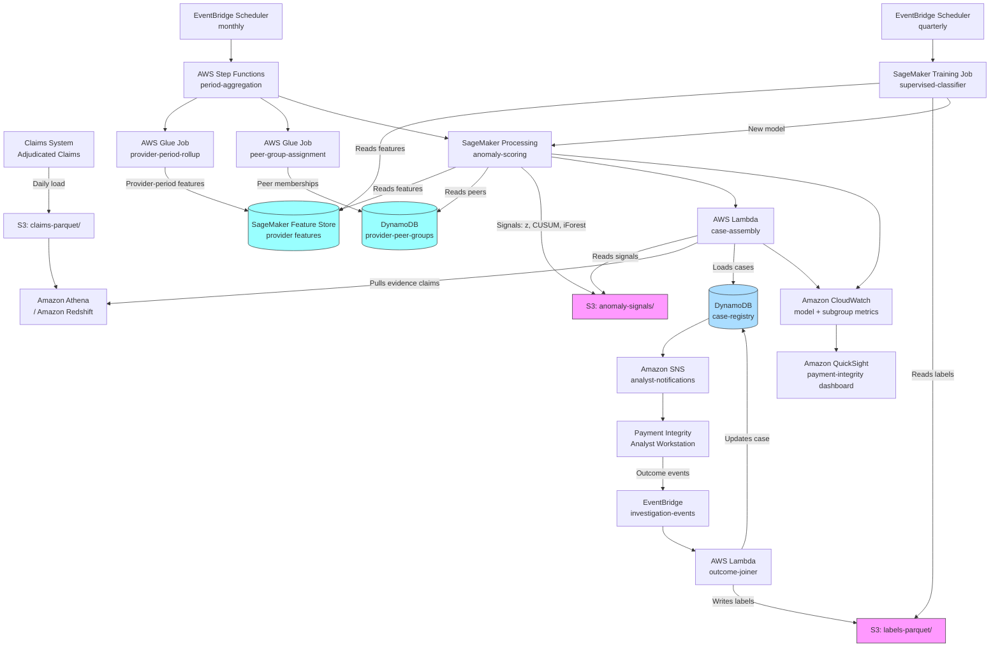

# Recipe 3.3 Architecture and Implementation: Billing Code Anomalies

*Companion to [Recipe 3.3: Billing Code Anomalies](chapter03.03-billing-code-anomalies). This page covers the AWS architecture, services, prerequisites, and pseudocode. For the problem framing and the conceptual approach, start with the main recipe.*

---

## The AWS Implementation

### Why These Services

**Amazon Redshift or Amazon Athena for the adjudicated claims store.** Billing anomaly detection is a heavy read problem against a large warehouse. Monthly claim volumes for a mid-size payer run into millions of records, and the peer group computations scan 6-12 months of history across tens of thousands of providers. Redshift is the natural fit when the analytics team already runs on it. Athena over S3 Parquet is the serverless option that pairs well with bursty monthly workloads (the heavy query load lives only during the aggregation job). Both are HIPAA-eligible under the BAA.

**AWS Glue for period aggregation and feature construction.** The provider-period rollup is an ETL job: scan claims, group by provider and period, compute code-mix histograms, E&M distributions, modifier rates. Glue handles the Spark-flavored grouping and aggregation workloads cleanly. Output lands as Parquet in S3, partitioned by period for efficient downstream queries. For very large payers, Amazon EMR gives you more control over Spark configuration; for most mid-size organizations, Glue is enough.

**Amazon SageMaker for anomaly scoring.** Two patterns fit here. For the statistical signals (z-scores, CUSUM, control charts), a SageMaker Processing job runs a scikit-learn or pandas script that loads the provider-period table, computes the signals, and writes them to S3. For the unsupervised multivariate detector (Isolation Forest), SageMaker built-in Random Cut Forest is the nearest native equivalent, or a custom scikit-learn container running IsolationForest from sklearn.ensemble. For the supervised classifier (if labels are available), SageMaker built-in XGBoost with Feature Store integration follows the same pattern as Recipe 3.2.

**Amazon SageMaker Feature Store for provider-period features.** This is the piece that pays off as the system matures. Store provider-period features with timestamps. Training code uses `get_historical_features()` for point-in-time-correct training; scoring code reads the latest period via the online store. Especially useful for the supervised retraining workflow, because point-in-time correctness prevents label leakage (training on features that include information from after the label period). HIPAA-eligible.

**Amazon DynamoDB for the case registry and analyst workflow state.** Each active case lives in a case-registry table keyed by case ID. Analyst assignments, status changes, and notes update the case record. Low-latency reads because the analyst UI queries by case ID and by analyst ID. HIPAA-eligible.

**Amazon S3 with AWS KMS.** Historical feature snapshots, anomaly signal outputs, evidence packages (representative claims per case), investigation documents. Parquet for the structured data; encrypted and versioned. Customer-managed KMS keys.

**AWS Step Functions for monthly orchestration.** The monthly pipeline is a sequence: ingest adjudicated claims for the period, aggregate to provider-period, assign peer groups, run scoring, assemble cases, load the case registry, notify analysts. Step Functions makes the sequence auditable and rerunnable. The workflow also triggers the retraining branch on a separate cadence.

**AWS Lambda for event-driven pieces.** Lambda handles the incremental updates: when a new investigation outcome is recorded, a Lambda consumer joins the outcome to the case record and updates the label store. When an analyst changes a case status, a Lambda updates downstream metrics. Short-lived, event-driven work.

**Amazon EventBridge for scheduling and outcome events.** EventBridge Scheduler triggers the monthly pipeline and the retraining job. A dedicated event bus carries investigation-outcome events from the analyst tooling to the Lambda outcome-joiner.

**Amazon SNS for analyst notifications.** When a new high-severity case lands in the queue, the payment integrity team gets notified. Low volume, mostly email or Slack routing. The notification payload carries the case id and routing tier only; the analyst UI fetches the full record (provider_id, signals, evidence claims, exposure) by id, so SNS infrastructure and downstream subscribers (mobile push, email previews, Slack webhooks) never carry PHI or PHI-adjacent identifiers.

**Amazon QuickSight for operational and subgroup dashboards.** The payment integrity team needs views into: queue depth and aging, case outcomes by severity band, dollar exposure resolved per period, subgroup monitoring (who is being flagged, who is being investigated, who is being found anomalous). QuickSight against Athena over the case registry archive supports all of this. The subgroup monitoring view is part of the minimum deployment, not optional.

**Amazon Managed Workflows for Apache Airflow (MWAA) as an alternative orchestrator.** Some payment integrity teams already run Airflow for their data engineering work. Stepping into Step Functions adds an operational surface; MWAA fits into an existing tool. Functionally equivalent for this pipeline; pick whichever matches your team's existing operational posture.

**Amazon CloudWatch and AWS CloudTrail.** Standard. CloudWatch dashboards for pipeline health, scoring distribution drift, feature freshness. CloudTrail data events on the case registry and the labels S3 bucket for audit.

### Architecture Diagram



### Prerequisites

| Requirement | Details |
|-------------|---------|
| **AWS Services** | Amazon S3, Amazon Redshift or Amazon Athena, AWS Glue, Amazon SageMaker (Processing, optional Training, Feature Store), Amazon DynamoDB, AWS Step Functions, AWS Lambda, Amazon EventBridge + EventBridge Scheduler, Amazon SNS, Amazon QuickSight, AWS KMS, Amazon CloudWatch, AWS CloudTrail. |
| **IAM Permissions** | Least-privilege per role. Glue aggregation role: `s3:GetObject` on claims-parquet, `s3:PutObject` on features-parquet, `sagemaker:PutFeatureStoreRecord`. Scoring role: `s3:GetObject` on features-parquet, `s3:PutObject` on anomaly-signals, `dynamodb:GetItem` on provider-peer-groups. Case-assembly Lambda role: `s3:GetObject` on anomaly-signals, `athena:StartQueryExecution` plus `athena:GetQueryExecution`/`GetQueryResults` for evidence pulls, `dynamodb:PutItem` on case-registry. Analyst workstation role: `dynamodb:GetItem` and `dynamodb:UpdateItem` on case-registry only, scoped via condition keys to the analyst's assigned cases where feasible. Outcome-joiner Lambda role: `dynamodb:UpdateItem` on case-registry, `s3:PutObject` on labels-parquet, `dynamodb:PutItem` on processed-outcomes (idempotency table). QuickSight dashboard role: `athena:StartQueryExecution` only on the aggregated case-archive view; no direct `dynamodb:Scan` on case-registry. Training job role (subgroup metrics): `glue:GetTable` and `s3:GetObject` only on the demographic-joined view. No `*` actions in production. |
| **BAA** | AWS BAA signed. Every service listed is HIPAA-eligible under the BAA when configured correctly. See the [AWS HIPAA Eligible Services reference](https://aws.amazon.com/compliance/hipaa-eligible-services-reference/). |
| **Encryption** | S3: SSE-KMS with customer-managed keys. DynamoDB: encryption at rest with customer-managed KMS. SageMaker: KMS on processing volumes, model artifacts, and Feature Store offline/online stores. Redshift: KMS cluster encryption. TLS in transit everywhere. Investigation outcome records on the `labels-parquet` bucket are subject to provider grievance, regulatory inquiry, and SIU/law-enforcement subpoena; configure S3 Object Lock in COMPLIANCE mode in production (GOVERNANCE mode in dev so test data can be cleaned up). Optionally write a parallel decision-record log to Amazon QLDB if cryptographic verification of decision history is required by your organization's compliance posture. |
| **VPC** | Production: Glue jobs, SageMaker jobs, and Lambda functions in a VPC with the following VPC endpoints. Gateway: `s3`, `dynamodb`. Interface: `sagemaker.api` (control-plane), `sagemaker.featurestore-runtime` (online features), `sagemaker.runtime` (only if the real-time scoring extension is used), `glue`, `states` (Step Functions), `events` (EventBridge bus), `scheduler` (EventBridge Scheduler), `logs` (CloudWatch Logs), `monitoring` (CloudWatch `PutMetricData`), `kms`, `athena`, `sns`, plus Redshift Data API or direct cluster connectivity as applicable. VPC Flow Logs enabled on the VPC carrying Glue, SageMaker, and Lambda traffic; logs delivered to a dedicated S3 bucket with KMS encryption and 6+ year retention to align with HIPAA audit requirements. |
| **CloudTrail** | Enabled with data events on the case-registry and provider-peer-groups tables, and on the labels-parquet and claims-parquet S3 buckets. Audit trail for every signal computation, every case creation, and every investigation outcome. |
| **DLQs and Replay** | Each Lambda's `OnFailure` destination configured to a dedicated SQS dead-letter queue: `case-assembly-dlq`, `outcome-joiner-dlq`. Step Functions failure handlers route scoring-job failures to `scoring-job-dlq`. CloudWatch alarms on DLQ depth alert the on-call team. Replay tooling lets operators re-process events after the root cause is fixed. Without this, failed events disappear after Lambda's default two-retry-then-drop behavior; signal payloads orphan in S3, outcome data drops out of the supervised retraining pipeline, and the failure is invisible until someone notices a gap. |
| **Data Access Controls** | Case records and claims evidence contain provider PII and patient PHI. Access restricted to the payment integrity team; all reads and writes logged; no broad read grants on the case registry table. |
| **Retention** | HIPAA baseline is 6 years for records containing PHI. Investigation outcomes have additional retention requirements under some state laws and anti-fraud regulations (often 7-10 years). Coordinate with legal and compliance on the specific retention schedule for your jurisdictions. |
| **Sample Data** | [Synthea](https://github.com/synthetichealth/synthea) generates synthetic claims and encounter data. CMS publishes aggregate provider utilization files that are useful for building peer-group statistics in development environments but cannot substitute for provider-level transactional data. Never use real PHI in development. |
| **Provider Reference Data** | The peer grouping depends on provider taxonomy (specialty, subspecialty), practice setting, and geography. Sources include the NPPES (National Plan and Provider Enumeration System) dataset for NPI-to-taxonomy mapping, plus internal provider master data for practice setting and network tier. Budget integration time for this reference data; it's usually in a different system than the claims data. |
| **Fairness Monitoring Data** | Subgroup dashboards require provider-level attributes that may not be in the claims warehouse: practice size, patient-population demographics, geographic characteristics. Coordinate with provider-network operations on what attributes are available and how they can be joined to the case registry. |
| **Subgroup Data Access** | Provider-level attributes used for fairness monitoring (practice setting, geographic region, patient-population demographics where captured, network tier) may be governed differently from claims PHI in some regulatory regimes. Restrict read access to the demographic-and-attribute store to the supervised training job role and the QuickSight dashboard role, with CloudTrail data events on subgroup queries. The QuickSight dashboard backed by Athena should query an aggregated subgroup-metrics table, not the raw demographic-joined case-registry archive, so dashboard-user access does not require row-level read on the subgroup attributes. |
| **Cost Estimate** | Per monthly cycle for a mid-size payer (say, 3-5 million claims per month, 15,000-25,000 active providers): Athena scans for aggregation: ~$5-20. Glue provider-period rollup: ~$10-30. SageMaker Processing for scoring: ~$5-15. Feature Store storage (10GB of provider features): ~$5/month. DynamoDB (case registry with PITR): ~$10-30/month depending on case volume. Total infrastructure: typically $200-800/month. Compare to recovery: if the program prevents even 0.25% of fraudulent or erroneous payments on a $500M annual spend, that's $1.25M recovered against a $10K/year infrastructure cost.  |

### Ingredients

| AWS Service | Role |
|------------|------|
| **Amazon S3 (claims-parquet)** | Adjudicated claims partitioned by adjudication date |
| **Amazon S3 (features-parquet)** | Provider-period feature snapshots |
| **Amazon S3 (anomaly-signals)** | Per-provider per-period anomaly signal outputs |
| **Amazon S3 (labels-parquet)** | Investigation outcomes joined to cases for supervised training |
| **Amazon Redshift / Athena** | SQL access to the claims warehouse for aggregation and evidence retrieval |
| **AWS Glue (provider-period-rollup)** | Period aggregation ETL: claims to provider-period feature vectors |
| **AWS Glue (peer-group-assignment)** | Peer group membership computation from provider taxonomy and practice setting |
| **Amazon SageMaker Feature Store** | Consistent features across scoring and training with point-in-time correctness |
| **Amazon SageMaker Processing** | Statistical anomaly scoring (z-scores, CUSUM, Isolation Forest) |
| **Amazon SageMaker Training** | Supervised classifier retraining when labels exist (optional for baseline) |
| **Amazon DynamoDB (provider-peer-groups)** | Current peer group memberships and peer distribution statistics |
| **Amazon DynamoDB (case-registry)** | Active and historical cases, analyst assignments, status, outcomes |
| **AWS Step Functions** | Orchestrates the monthly period-aggregation and scoring pipeline |
| **AWS Lambda (case-assembly)** | Consolidates signals into cases; attaches evidence claims |
| **AWS Lambda (outcome-joiner)** | Joins investigation outcomes to cases; maintains labels store |
| **Amazon EventBridge** | Scheduler for monthly/quarterly jobs; bus for investigation-outcome events |
| **Amazon SNS** | Analyst notifications for new high-severity cases |
| **Amazon QuickSight** | Operational dashboards including subgroup and fairness monitoring |
| **AWS KMS** | Customer-managed keys for every data store and log |
| **Amazon CloudWatch** | Pipeline health, scoring drift, case queue depth, subgroup metrics |
| **AWS CloudTrail** | Audit logging on all PHI-bearing stores and case actions |

---

### Code

> **Reference implementations:** These aws-samples repositories demonstrate patterns that apply here:
> - [`amazon-sagemaker-examples`](https://github.com/aws/amazon-sagemaker-examples): Processing job patterns, Random Cut Forest unsupervised anomaly detection, and Feature Store integration with XGBoost for the supervised classifier path.
> - [`aws-samples`](https://github.com/aws-samples): Search for "healthcare fraud," "payment integrity," and "claims analytics" for adjacent patterns.
> 

#### Walkthrough

**Step 1: Roll up claims to provider-period features.** A monthly Glue job reads the adjudicated claims for the period and aggregates them by provider. The output is a wide feature table with one row per provider-period, including histograms over code distributions, E&M level distributions, modifier rates, and volume metrics. The correctness property that matters most here is stable provider identifier resolution: a provider who bills under multiple NPIs or tax IDs needs to be resolved to a single entity, otherwise their behavior shows up split across multiple rows and the anomaly signal is diluted. Recipe 5.2 (Provider Entity Resolution) covers this in depth; for the baseline pipeline, use a precomputed provider-master reference table.

Skip this step, or get it wrong, and you get two classes of problem. First, noise from small providers: a practice with 20 claims per month has high variance in every aggregate statistic, and naive z-scores will flag them constantly. Second, provider fragmentation: a multi-NPI provider whose anomalous behavior is split across their NPIs won't get flagged because no single NPI shows enough volume to be clearly off-norm.

```text
FUNCTION rollup_provider_period(period_start, period_end):
    // Pull all adjudicated claims for the period.
    claims = Athena.Query("""
        SELECT provider_npi, claim_id, patient_id, service_date,
               procedure_code, modifiers, billed_amount, allowed_amount,
               units, place_of_service, diagnosis_codes
        FROM claims_parquet
        WHERE adjudication_date BETWEEN :start AND :end
    """, start = period_start, end = period_end)

    // Resolve provider identity. Some providers bill under multiple NPIs;
    // roll those up to the canonical provider ID.
    claims = LEFT_JOIN(claims, provider_master, on = "provider_npi")
    claims.provider_id = COALESCE(provider_master.canonical_id, claims.provider_npi)

    // Group by provider and compute features.
    FOR each provider_id in UNIQUE(claims.provider_id):
        provider_claims = claims WHERE provider_id == provider_id

        // Skip providers with too few claims for stable statistics.
        IF length(provider_claims) < MIN_CLAIMS_FOR_STATS: // e.g., 30
            continue

        features = {
            provider_id: provider_id,
            period_start: period_start,
            period_end: period_end,
            claim_count: length(provider_claims),
            unique_patient_count: length(unique(provider_claims.patient_id)),
            total_billed: sum(provider_claims.billed_amount),
            avg_billed_per_claim: mean(provider_claims.billed_amount),
            codes_per_claim_mean: mean(count_of_procedure_codes(provider_claims)),
            codes_per_claim_stddev: stddev(count_of_procedure_codes(provider_claims))
        }

        // Top-N code distribution with frequencies.
        top_codes = top_n(provider_claims.procedure_code, n = 20)
        features.top_code_distribution = {
            code: count / length(provider_claims)
            for (code, count) in top_codes
        }

        // Shannon entropy of the full code distribution.
        all_codes = count(provider_claims.procedure_code)
        features.code_entropy = shannon_entropy(all_codes.values())

        // E&M level distribution. Note that CPT 99201 was deleted effective
        // 2021-01-01; current new-patient codes are 99202-99205 (levels 2-5).
        // Track new-patient and established-patient distributions separately,
        // since the documentation rules that govern them differ and structural
        // breaks (e.g., the 2021 E/M overhaul) affect them differently.
        em_claims = provider_claims WHERE procedure_code in EM_CODES
        em_new_patient_claims    = em_claims WHERE procedure_code in NEW_PATIENT_EM_CODES   // 99202-99205
        em_established_claims    = em_claims WHERE procedure_code in ESTABLISHED_EM_CODES   // 99211-99215
        IF length(em_claims) >= MIN_EM_CLAIMS:
            features.em_new_patient_distribution = level_distribution(
                em_new_patient_claims, levels = [2, 3, 4, 5]
            )
            features.em_established_distribution = level_distribution(
                em_established_claims, levels = [1, 2, 3, 4, 5]
            )
            features.em_avg_level = mean(em_claims.level)
        ELSE:
            features.em_new_patient_distribution = null
            features.em_established_distribution = null
            features.em_avg_level                = null

        // Modifier rates (per-claim basis).
        features.modifier_25_rate = count_where(provider_claims, has_modifier(25)) / length(provider_claims)
        features.modifier_59_rate = count_where(provider_claims, has_modifier(59)) / length(provider_claims)
        features.modifier_22_rate = count_where(provider_claims, has_modifier(22)) / length(provider_claims)

        // Unit features for time-based codes.
        time_based_claims = provider_claims WHERE procedure_code in TIME_BASED_CODES
        IF length(time_based_claims) > 0:
            features.avg_units_per_time_claim = mean(time_based_claims.units)
            features.unit_mode_fraction = mode_frequency(time_based_claims.units)  // sharpness at a single unit value

        // Write to Feature Store (online and offline).
        SageMakerFeatureStore.PutRecord(
            feature_group = "provider-period-features",
            record        = features,
            event_time    = period_end
        )
```

**Step 2: Assign peer groups and compute peer distributions.** Peer grouping runs quarterly, not monthly, because providers' specialty and practice setting rarely change between months. For each active provider, look up their specialty (from NPPES), practice setting (from the provider master), and geographic region. Assemble peer groups with enough members to produce stable statistics; fall back to broader groups when the narrow group is too small.

```text
FUNCTION assign_peer_groups():
    providers = DynamoDB.Scan("provider-master")   // ~20K providers for mid-size payer

    FOR each provider in providers:
        // Try increasingly broad peer groups until one has enough members.
        // Each key is a tuple of attributes.
        candidate_keys = [
            (provider.specialty, provider.subspecialty, provider.region, provider.setting),
            (provider.specialty, provider.subspecialty, provider.region),
            (provider.specialty, provider.region),
            (provider.specialty, provider.setting),
            (provider.specialty,)
        ]

        FOR each key in candidate_keys:
            members = providers WHERE attributes_match(provider, key)
            IF length(members) >= PEER_GROUP_MIN_SIZE: // e.g., 30
                provider.peer_group_key    = key
                provider.peer_group_size   = length(members)
                provider.peer_group_members = [m.provider_id for m in members]
                break

        DynamoDB.PutItem("provider-peer-groups", provider)

    // For each peer group and each feature, compute the distribution statistics.
    // These are the reference statistics the scoring layer will compare against.
    FOR each peer_group_key in UNIQUE(providers.peer_group_key):
        group_members = providers WHERE peer_group_key == peer_group_key
        recent_features = FeatureStore.GetHistoricalFeatures(
            feature_group = "provider-period-features",
            record_ids    = [m.provider_id for m in group_members],
            point_in_time = NOW(),
            lookback      = 6 months
        )

        FOR each feature in QUANTITATIVE_FEATURES:
            stats = {
                mean: mean(recent_features[feature]),
                stddev: stddev(recent_features[feature]),
                p50: percentile(recent_features[feature], 50),
                p90: percentile(recent_features[feature], 90),
                p95: percentile(recent_features[feature], 95),
                p99: percentile(recent_features[feature], 99)
            }
            DynamoDB.PutItem("peer-group-statistics", {
                peer_group_key: peer_group_key,
                feature: feature,
                stats: stats,
                sample_size: length(group_members),
                computed_at: NOW()
            })
```

**Step 3: Score anomalies across the three axes.** A SageMaker Processing job reads the provider-period features, pulls the peer group statistics, and computes the anomaly signals. Three families of signals get computed and stored separately: z-scores against peer groups, CUSUM signals against the provider's own history, and multivariate Isolation Forest scores. Keeping them separate makes the case assembly step able to explain which signals fired and why.

```text
FUNCTION score_anomalies(period_start, period_end):
    current_features = FeatureStore.GetRecords(
        feature_group = "provider-period-features",
        filter        = { period_start: period_start }
    )

    FOR each record in current_features:
        provider_id = record.provider_id
        peer_key    = DynamoDB.GetItem("provider-peer-groups", provider_id).peer_group_key
        signals = []

        // --- Signal family 1: Peer z-scores ---
        FOR each feature_name in QUANTITATIVE_FEATURES:
            peer_stats = DynamoDB.GetItem(
                "peer-group-statistics",
                { peer_group_key: peer_key, feature: feature_name }
            )
            IF peer_stats.stddev > 0:
                z = (record[feature_name] - peer_stats.mean) / peer_stats.stddev
                IF abs(z) >= Z_SIGNAL_THRESHOLD: // e.g., 2.5
                    signals.append({
                        type: "peer_zscore",
                        feature: feature_name,
                        value: record[feature_name],
                        peer_mean: peer_stats.mean,
                        peer_stddev: peer_stats.stddev,
                        zscore: z,
                        severity: zscore_to_severity(z)
                    })

        // --- Signal family 2: Self-history CUSUM ---
        history = FeatureStore.GetHistoricalFeatures(
            feature_group = "provider-period-features",
            record_ids    = [provider_id],
            lookback      = 12 months
        )
        FOR each feature_name in CUSUM_TRACKED_FEATURES:
            series = extract_time_series(history, feature_name)
            cusum_result = cusum_detect(series, target = series.mean_pre_change(), k = 0.5, h = 4)
            IF cusum_result.signal_fired AND cusum_result.change_point within current period:
                signals.append({
                    type: "self_cusum",
                    feature: feature_name,
                    change_point: cusum_result.change_point,
                    pre_change_mean: cusum_result.pre_mean,
                    post_change_mean: cusum_result.post_mean,
                    shift_magnitude: cusum_result.post_mean - cusum_result.pre_mean,
                    severity: shift_to_severity(cusum_result)
                })

        // --- Signal family 3: Multivariate Isolation Forest ---
        // The Isolation Forest model is trained on a population sample once per
        // quarter; here we just score the current provider-period vector.
        if_score = isolation_forest.score(feature_vector(record))
        IF if_score <= ISOLATION_FOREST_THRESHOLD: // more negative = more anomalous
            // Top contributors. SHAP's TreeExplainer doesn't directly apply to
            // Isolation Forest (the model's prediction is path-length-based,
            // not leaf-level), and KernelSHAP is too slow at this volume. Use
            // feature-deviation proxies: for each feature, compute the z-score
            // against the IF training set's per-feature mean and stddev (captured
            // at training time and stored alongside the model artifact); surface
            // the top-k by absolute z-score.
            top_contributors = explain_iforest_by_deviation(
                record         = record,
                feature_stats  = isolation_forest.training_feature_stats,
                top_k          = 5
            )
            signals.append({
                type: "isolation_forest",
                anomaly_score: if_score,
                top_contributors: top_contributors,
                severity: if_score_to_severity(if_score)
            })

        IF length(signals) > 0:
            S3.PutObject(
                bucket = "anomaly-signals",
                key    = f"{period_start}/{provider_id}.json",
                body   = json_encode({
                    provider_id: provider_id,
                    period_start: period_start,
                    period_end: period_end,
                    peer_group: peer_key,
                    signals: signals
                })
            )
```

**Step 4: Assemble cases and attach evidence.** A Lambda reads the anomaly signals files and consolidates them into case records. Multiple signals from the same provider in the same period become a single case. Representative claims are pulled from the warehouse to serve as evidence (the analyst needs to see specific examples, not just aggregate statistics). Prioritization combines signal severity, persistence (how many consecutive periods this provider has been flagged), and financial exposure (total billed amount on potentially anomalous claims).

> **Simplification:** The pseudocode below creates a new case every period for any flagged provider, which produces operational noise in production. Production systems maintain a case-lineage view: if a provider is already in an open case and new signals fire, the signals append to the existing case rather than creating a new one. The case closes when the analyst closes it. See "Why This Isn't Production-Ready" for the full discipline.

```text
FUNCTION assemble_cases(period_start):
    signals_by_provider = S3.ListAndRead(
        bucket = "anomaly-signals",
        prefix = f"{period_start}/"
    )

    FOR each provider_signals in signals_by_provider:
        provider_id = provider_signals.provider_id
        signals     = provider_signals.signals

        // Check persistence: is this provider flagged in prior consecutive periods?
        prior_cases = DynamoDB.Query(
            "case-registry",
            index = "provider_id_index",
            key   = { provider_id: provider_id },
            filter = "period_start >= :cutoff",
            values = { ":cutoff": period_start - 3 months }
        )
        persistence = count_consecutive_periods(prior_cases, ending_at = period_start)

        // Pull representative claims. For each signal, find a few claims that
        // illustrate the pattern.
        evidence_claims = []
        FOR each signal in signals:
            evidence = pull_evidence_claims(
                provider_id = provider_id,
                period      = (period_start, period_end),
                signal_type = signal.type,
                feature     = signal.feature if "feature" in signal else null,
                limit       = 5
            )
            evidence_claims.extend(evidence)

        // Compute financial exposure: sum of billed amounts on claims plausibly
        // associated with the anomaly.
        exposure = compute_exposure(provider_id, period_start, period_end, signals)

        // Severity: a combination of signal strength, persistence, and exposure.
        overall_severity = score_overall_severity(signals, persistence, exposure)

        // Assign the routing bucket based on severity and signal type.
        routing = determine_routing(overall_severity, signals)

        case = {
            case_id: generate_case_id(),
            provider_id: provider_id,
            period_start: period_start,
            period_end: period_end,
            peer_group: provider_signals.peer_group,
            signals: signals,
            signal_count: length(signals),
            persistence: persistence,
            exposure_dollars: exposure,
            overall_severity: overall_severity,
            routing: routing,        // "payment_integrity" | "clinical_review" | "watch_list"
            status: "new",
            assigned_analyst: null,
            evidence_claims: evidence_claims,
            created_at: NOW()
        }

        DynamoDB.PutItem("case-registry", case)

        IF routing in ["payment_integrity", "clinical_review"]:
            // The notification carries the case id and routing tier only; the
            // analyst UI fetches the full case record (including provider_id,
            // signals, evidence claims, exposure) by id so the notification
            // channel never carries PHI or PHI-adjacent identifiers.
            SNS.Publish(
                topic = ANALYST_NOTIFICATION_TOPIC,
                message = {
                    case_id: case.case_id,
                    routing_tier: routing,
                    severity_band: overall_severity
                }
            )
```

**Step 5: Capture investigation outcomes and close the loop.** When an analyst resolves a case, the outcome flows through EventBridge to a Lambda that joins the outcome to the case record, writes a training label, and updates internal metrics.

```text
FUNCTION on_investigation_outcome(event):
    // event contains: case_id, disposition, notes, resolved_at, resolved_by,
    // dollars_recovered, referred_to_siu (boolean), provider_educated (boolean).

    // EventBridge guarantees at-least-once delivery; without an idempotency
    // guard a redelivered outcome event updates the case record twice, writes
    // duplicate label rows that bias supervised retraining, and double-counts
    // dollars-recovered metrics. Derive a deterministic event key and write
    // it to a processed-outcomes table with a conditional check before any
    // downstream side effect.
    event_key = event.case_id + "|" + event.disposition
    TRY:
        DynamoDB.PutItem(
            table     = "processed-outcomes",
            item      = { event_key: event_key, processed_at: NOW() },
            condition = "attribute_not_exists(event_key)"
        )
    CATCH ConditionalCheckFailedException:
        emit_metric("outcome_event_duplicate_dropped", 1)
        RETURN

    case = DynamoDB.GetItem("case-registry", { case_id: event.case_id })

    // Update the case record with the outcome.
    case.status            = "closed"
    case.disposition       = event.disposition
    case.resolution_notes  = event.notes
    case.resolved_at       = event.resolved_at
    case.resolved_by       = event.resolved_by
    case.dollars_recovered = event.dollars_recovered
    DynamoDB.PutItem("case-registry", case)

    // Derive a supervised label. The mapping is organization-specific; revisit
    // quarterly with the payment integrity team.
    label = null
    IF event.disposition in ["fraud_confirmed", "siu_referral", "significant_adjustment"]:
        label = "anomaly_confirmed"
    ELSE IF event.disposition in ["no_finding", "legitimate_practice_variation"]:
        label = "anomaly_rejected"
    ELSE IF event.disposition in ["education_only", "minor_adjustment"]:
        label = "ambiguous"    // useful for monitoring but not for supervised training

    IF label in ["anomaly_confirmed", "anomaly_rejected"]:
        training_row = {
            case_id: case.case_id,
            provider_id: case.provider_id,
            period_start: case.period_start,
            features_at_scoring: case.features_snapshot,
            signals_at_scoring: case.signals,
            label: label,
            outcome_lag_days: (event.resolved_at - case.created_at).days,
            labeled_at: event.resolved_at
        }
        S3.PutObject(
            bucket = "labels-parquet",
            key    = date_partitioned_key(event.resolved_at) + "/" + uuid() + ".parquet",
            body   = parquet_encode([training_row])
        )

    // Metrics.
    emit_metric("case_closed", 1, dimensions = { disposition: event.disposition })
    emit_metric("dollars_recovered", event.dollars_recovered or 0)
    emit_metric("outcome_by_severity", 1, dimensions = {
        severity: case.overall_severity,
        disposition: event.disposition
    })

FUNCTION retrain_supervised_quarterly():
    // Only runs if enough labeled data has accumulated.
    training_df = Athena.query("""
        SELECT features_at_scoring, signals_at_scoring, label
        FROM labels_parquet
        WHERE labeled_at >= current_date - interval '24' month
    """)

    IF length(training_df) < MIN_LABELS_FOR_TRAINING: // e.g., 500
        log("Insufficient labeled data for supervised retraining; skipping.")
        return

    X, y = build_features_and_labels(training_df)
    // Stratify split by provider (not by case) to prevent a provider's cases
    // appearing in both train and test.
    X_train, X_val, y_train, y_val = provider_stratified_split(X, y, training_df.provider_id)

    model = XGBoost.train(X_train, y_train, n_estimators = 300, max_depth = 6)
    val_metrics = evaluate(model, X_val, y_val)

    // Subgroup evaluation: per-specialty and per-peer-group AUC.
    subgroup_metrics = {
        "specialty": evaluate_by_subgroup(model, X_val, y_val, "specialty"),
        "peer_group": evaluate_by_subgroup(model, X_val, y_val, "peer_group_key"),
        "region": evaluate_by_subgroup(model, X_val, y_val, "region")
    }

    IF val_metrics.auc > incumbent.auc + MIN_IMPROVEMENT \
       AND no_subgroup_regression(subgroup_metrics, incumbent.subgroup_metrics):
        register_model(model, metrics = val_metrics, subgroup_metrics = subgroup_metrics)
        log("Promoted new supervised classifier.")
    ELSE:
        log("Challenger did not pass promotion criteria; keeping incumbent.")
```

> **Curious how this looks in Python?** The pseudocode above covers the concepts. If you'd like to see sample Python code that demonstrates these patterns using boto3, check out the [Python Example](chapter03.03-python-example). It walks through each step with inline comments and notes on what you'd need to change for a real deployment.

---

### Expected Results

**Sample case record for a sustained E&M upcoding pattern:**

```json
{
  "case_id": "CASE-2026-05-000487",
  "provider_id": "PRV-CANONICAL-0044721",
  "provider_display_name": "Internal Medicine Group, Dr. Example",
  "period_start": "2026-05-01",
  "period_end": "2026-05-31",
  "peer_group": ["internal-medicine", "metro-region-5", "group-practice"],
  "peer_group_size": 187,
  "signals": [
    {
      "type": "peer_zscore",
      "feature": "em_avg_level",
      "value": 4.12,
      "peer_mean": 3.28,
      "peer_stddev": 0.24,
      "zscore": 3.5,
      "severity": "high"
    },
    {
      "type": "peer_zscore",
      "feature": "modifier_25_rate",
      "value": 0.47,
      "peer_mean": 0.09,
      "peer_stddev": 0.07,
      "zscore": 5.4,
      "severity": "high"
    },
    {
      "type": "self_cusum",
      "feature": "em_avg_level",
      "change_point": "2026-03-15",
      "pre_change_mean": 3.21,
      "post_change_mean": 4.08,
      "shift_magnitude": 0.87,
      "severity": "high"
    }
  ],
  "signal_count": 3,
  "persistence": 3,
  "exposure_dollars": 187420.00,
  "overall_severity": "high",
  "routing": "payment_integrity",
  "evidence_claims": [
    "CLM-2026-05-881104",
    "CLM-2026-05-881322",
    "CLM-2026-05-881897",
    "CLM-2026-05-882014",
    "CLM-2026-05-882551"
  ],
  "narrative_summary": "Provider's E&M level distribution shifted sharply in mid-March 2026 from centered on level 3 to centered on level 4. The shift persisted through May. Modifier 25 usage rate during the same period is 5.4 sigma above the peer group mean. Combined pattern is consistent with E&M upcoding; other explanations (change in patient mix, documentation improvement program, practice consolidation) should be investigated before any adjustment.",
  "status": "new",
  "assigned_analyst": null,
  "created_at": "2026-06-01T03:22:14Z"
}
```

**Sample case record for a contextual anomaly (specialty-atypical code):**

```json
{
  "case_id": "CASE-2026-05-000591",
  "provider_id": "PRV-CANONICAL-0062104",
  "provider_display_name": "Dermatology Solo Practice, Dr. Example",
  "period_start": "2026-05-01",
  "period_end": "2026-05-31",
  "peer_group": ["dermatology", "state-wide", "solo-practice"],
  "peer_group_size": 62,
  "signals": [
    {
      "type": "isolation_forest",
      "anomaly_score": -0.71,
      "top_contributors": [
        {"feature": "share_cpt_97110",       "value": 0.23, "peer_median": 0.00},
        {"feature": "share_cpt_97112",       "value": 0.14, "peer_median": 0.00},
        {"feature": "share_cpt_97140",       "value": 0.09, "peer_median": 0.00},
        {"feature": "total_billed_per_claim", "value": 412,  "peer_median": 287},
        {"feature": "modifier_59_rate",       "value": 0.31, "peer_median": 0.04}
      ],
      "severity": "medium"
    }
  ],
  "signal_count": 1,
  "persistence": 1,
  "exposure_dollars": 34800.00,
  "overall_severity": "medium",
  "routing": "clinical_review",
  "evidence_claims": [
    "CLM-2026-05-844221",
    "CLM-2026-05-844338",
    "CLM-2026-05-844455"
  ],
  "narrative_summary": "Dermatology provider billing meaningful volumes of physical-therapy CPT codes (97110, 97112, 97140). Codes are not typically billed by dermatology practices. Could indicate aesthetic/laser services being miscoded, a legitimate ancillary service line, or billing error. Recommend clinical review before payment integrity escalation.",
  "status": "new",
  "assigned_analyst": null,
  "created_at": "2026-06-01T03:22:31Z"
}
```

The second case is exactly the kind of case that wouldn't be caught by a pure "E&M level drift" detector. No single E&M signal fires; it's the multivariate pattern (specialty-atypical codes combined with unusual modifier rate and elevated billed amount) that surfaces it. This is where the Isolation Forest pays off: it catches unusual combinations that aren't unusual on any single dimension.

**Performance benchmarks (illustrative; measure against your own data):**

| Metric | Rule-based starting point | Z-score + CUSUM | Full multi-signal pipeline |
|--------|---------------------------|-----------------|----------------------------|
| Cases generated per month (for 20K providers) | 2,000-5,000 | 300-800 | 100-300 |
| Precision at investigation (of cases investigated, fraction that close with action) | 15-25% | 35-50% | 50-70% |
| Recall of ground-truth anomalies | unknown (no measurement) | 40-55% (measured against label backlog) | 55-75% |
| Dollar-weighted capture (fraction of recoverable dollars surfaced) | 20-40% | 45-65% | 65-80% |
| False positive burden (provider-months flagged unnecessarily per 1,000 providers) | 150-300 | 20-50 | 5-20 |
| Time from anomaly onset to flag (months) | 3-6 | 1-3 | 0-2 |

**Where it struggles:**

- **New providers.** First few months of billing produce no self-comparison signal (no history to drift from). Peer comparison is the only axis available, and new providers often have unstable statistics while they ramp up. Mitigation: add a minimum claim count or minimum months-in-network before peer z-score flags fire.
- **Small specialties.** Specialties with fewer than 30-50 providers in your network are hard to peer-group meaningfully. National or multi-payer benchmarks help but may not match your specific network mix.
- **Legitimate practice evolution.** A provider who hires a care manager, implements a new documentation system, or changes practice models will show sustained shifts that look exactly like upcoding on the data. The proper handling is a first-contact conversation, not a payment denial.
- **Coordinated patterns across providers.** If multiple providers are acting together (a practice group with common billing practices), the per-provider comparison to peers can catch them, but a network-level analysis (provider-patient-claim graph) catches more. That's Recipe 3.6 territory; this recipe lays the groundwork.
- **Payer-specific policy changes.** When the payer changes a policy (say, a new coverage rule for a specific code family), provider billing adjusts. The adjustments will look like anomalies until the baselines catch up. Pause or dampen the signals during known policy rollouts.
- **Industry-wide coding rule changes.** CMS and the AMA periodically restructure coding rules across whole code families. The 2021 E/M documentation overhaul (99201 deleted, 99202-99215 documentation rules changed, level shifts industry-wide) and the 2023 inpatient/observation E/M reorganization (99217-99220 deleted, 99221-99239 restructured) are the most recent examples. During and after these transitions, every provider's billing pattern shifts in the same direction simultaneously. Self-history CUSUM signals will fire at industry scale; peer comparisons stay roughly stable. Pause or recalibrate self-history signals during known industry-wide transitions, and treat any 12-18 month window straddling a transition as low-confidence for self-comparison purposes.
- **Seasonal patterns.** Emergency medicine bills differently in flu season. Allergy practices see volume spikes in spring and fall. The pipeline should account for seasonality in the baseline, either through longer rolling windows or explicit seasonal adjustment.

---

## Why This Isn't Production-Ready

The pseudocode above covers the shape of the pipeline. A production payment integrity system closes several gaps that the recipe intentionally leaves light.

**Provider entity resolution is the single biggest gap.** The walkthrough assumes a `provider_master` table with canonical provider IDs. Building that table is a project of its own (this is exactly what Chapter 5 covers). Providers change NPIs, bill under tax IDs that roll up to different canonical entities, operate under multiple taxonomy codes, and show up in claims with inconsistent formatting. A production pipeline either uses an existing enterprise provider MDM system or dedicates serious engineering effort to entity resolution. Skipping this step produces a pile of low-signal cases because the same real provider's behavior is fragmented across their multiple identifiers.

**Peer group tuning is iterative.** The first pass of peer group definitions will produce groups that are sometimes too small (unstable statistics) or too broad (masking real differences). Expect to iterate peer group definitions for several months based on what the payment integrity analysts tell you. Some specialties benefit from custom grouping rules (pediatric subspecialties, for example, often benefit from national rather than regional grouping because regional populations are too small).

**Case deduplication across periods.** The same provider's behavior can fire signals in consecutive periods. Naively, you produce a new case every period, and the analyst is reviewing the same provider multiple times. Production systems maintain a "case lineage" view: if a provider is already in an open case and new signals fire, the signals append to the existing case rather than creating a new one. The case closes when the analyst closes it.

**Analyst tooling and workflow is a separate product.** The case registry in DynamoDB is the backend for a payment integrity analyst UI. That UI (case list, case detail, evidence viewer, notes, outcome form, provider contact log) is a separate build, often a web application. Some organizations use existing case management tools (ServiceNow, Salesforce) and integrate them via event bus; others build internal tooling. Plan for this explicitly.

**Legal and regulatory review.** Anomaly flags that lead to payment adjustments or SIU referrals have legal implications. The state insurance regulator may have specific rules about provider notifications, appeal rights, and timing. Coordinate with legal and compliance on the investigation workflow before the system goes live. "Move fast and break things" is specifically wrong here.

**Provider communication protocols.** How is a flagged provider notified? Via a letter? A phone call? A portal message? Who talks to them first (payment integrity, provider relations, clinical leadership)? The answer affects both the operational workflow and the model's label distribution (providers who get notified early may change behavior before the case resolves, which muddies the label). The communication protocol is a business decision that the technical system has to respect.

**Explainability for the analyst.** The signals produced by z-scores and CUSUM are interpretable. Isolation Forest is harder. A supervised classifier is hardest. The analyst needs to understand why the system thinks the provider is anomalous, not just that it does. SHAP values, feature contributions, and narrative summaries are all part of the case payload. Treat explainability as a first-class requirement, not an afterthought.

**Subgroup fairness monitoring is required.** Who is being flagged, by specialty, by region, by patient population served? If the model disproportionately flags providers who serve Medicaid populations, rural populations, or particular demographic groups, that's a signal of systematic bias, not provider-level fraud. The subgroup dashboard must be in the initial deployment, with thresholds for escalation to the health equity team.

**Data retention is complicated.** Some of this data (claim records, provider identifiers) is governed by HIPAA retention requirements. Some of it (investigation notes, anti-fraud records) is governed by state insurance law retention requirements, which are often longer. Some of it (audit logs) has its own retention rules. Coordinate with the records management team on a per-data-type retention schedule rather than using a single global policy.

**Incident response when a flag is wrong.** When the system flags a provider and the investigation concludes the provider was fine, that's a false positive with real operational and reputational cost. The system needs a clean mechanism to (a) close the case as no-action, (b) record that the provider was flagged and cleared, (c) suppress duplicate flags on the same signal for some recovery period, and (d) feed the false positive back into model tuning. Organizations that skip the fourth step see the same provider flagged every month until the analyst burns out.

**Trigger idempotency for the outcome-joiner.** EventBridge guarantees at-least-once delivery, and Lambda's async retry behavior re-invokes the handler on transient failures. Without a deterministic event-key guard, a redelivered outcome event updates the case-registry twice (with timestamp inconsistency), writes a duplicate label row to S3 that biases the next supervised retrain, and double-emits the `dollars_recovered` and `case_closed` CloudWatch metrics that the program is reported on. The pseudocode shows a `processed-outcomes` table with a conditional write; production should also configure a dead-letter queue for events that fail repeatedly so a malformed event from the analyst tooling doesn't disappear silently.

**Model drift and data drift monitoring.** The pipeline is scoring against statistical baselines computed from recent data. When the underlying data distribution shifts (because of a policy change, a new EHR rollout, a pandemic-scale external event), the baselines are wrong for a while. Build monitoring that alerts on sudden distribution shifts in the input features, and manual review of the baselines during known policy transitions.

**Cost of investigation per case.** An experienced payment integrity analyst costs real money per hour, and a complex case can consume dozens of hours. The system should track not just how many cases are generated but the marginal analyst cost per case and the marginal dollars recovered per case. The break-even threshold (cases that cost more to investigate than they recover) is where the lower routing threshold should be set, and that threshold drifts over time as labor costs and fraud patterns shift.

---

## Variations and Extensions

**Real-time claim-level screening for high-risk codes.** For specific codes or modifier combinations that are known high-risk (some durable medical equipment codes, certain cosmetic procedures, specific substance abuse treatment codes), run a real-time check at claim submission rather than waiting for the monthly aggregation. A SageMaker real-time endpoint behind an API call can score a single claim against the provider's baseline in tens of milliseconds and flag for prepayment review. Good pattern to layer on top of the monthly aggregation, not a replacement.

**Patient-level anomaly overlays.** The per-provider analysis can be complemented with per-patient anomaly signals: a patient whose billed services on a given date exceed clinical plausibility (12 codes from one visit), or a patient who appears on claims from an implausible combination of providers. These patient-level signals often correlate with but don't always match the provider-level signals, and combining them improves overall recall.

**Network analysis for coordinated patterns.** The per-provider analysis misses patterns where multiple providers are acting in concert. A graph model of providers connected by shared patients, shared practice tax IDs, or shared claim-date proximity can surface rings of coordinated activity. This is an extension into Recipe 3.6 territory (general fraud/waste/abuse) and requires a graph analytics capability (Neptune, a graph library on top of SageMaker, or dedicated fraud-graph tooling). Most payers who build this in-house start here only after the per-provider system is stable.

**Predictive model for provider risk trajectories.** Instead of reactive detection (flag after the pattern appears), build a predictive model that forecasts which providers are likely to develop anomalous billing patterns in the next 3-6 months based on leading indicators. Harder to build, harder to evaluate, but potentially more valuable because it enables preventive provider education instead of post-hoc recovery. Consider this only after the reactive pipeline is stable.

**Case-mix-adjusted expected billing.** The current pipeline compares to peer-group statistics. A more sophisticated version models the expected billing given the provider's specific patient mix. This requires a patient-risk-adjustment model (similar to CMS HCC modeling) that estimates expected resource use per patient, summed to per-provider expected billing. Providers whose actual billing exceeds expected given their patient mix are the genuinely anomalous ones. This reduces the false positive rate for providers serving sicker populations, which is both operationally valuable and ethically important.

**Cross-payer benchmark integration.** Some third-party data vendors publish aggregated provider billing benchmarks (the FAIR Health dataset is a common reference). Integrating external benchmarks as additional peer comparisons gives you cross-payer reference statistics, which is particularly valuable for small specialties or regional-outlier providers. Requires data licensing and careful handling to avoid making decisions on aggregate data that doesn't apply to your specific network.

**Integration with provider education programs.** When a flag resolves as "education only" (the provider was billing in good faith but incorrectly), the case can trigger an automated enrollment in a provider education module about the specific coding area. Closes the loop between detection and remediation without requiring the payment integrity team to manually route every case.

---

## Additional Resources

**AWS Documentation:**
- [Amazon SageMaker Feature Store Developer Guide](https://docs.aws.amazon.com/sagemaker/latest/dg/feature-store.html)
- [Amazon SageMaker Processing](https://docs.aws.amazon.com/sagemaker/latest/dg/processing-job.html)
- [Amazon SageMaker Random Cut Forest Algorithm](https://docs.aws.amazon.com/sagemaker/latest/dg/randomcutforest.html)
- [Amazon SageMaker Built-in XGBoost Algorithm](https://docs.aws.amazon.com/sagemaker/latest/dg/xgboost.html)
- [Amazon SageMaker Clarify for Bias Detection](https://docs.aws.amazon.com/sagemaker/latest/dg/clarify-fairness-and-explainability.html)
- [Amazon SageMaker Model Monitor](https://docs.aws.amazon.com/sagemaker/latest/dg/model-monitor.html)
- [AWS Glue Developer Guide](https://docs.aws.amazon.com/glue/latest/dg/)
- [Amazon Athena User Guide](https://docs.aws.amazon.com/athena/latest/ug/)
- [Amazon DynamoDB Best Practices](https://docs.aws.amazon.com/amazondynamodb/latest/developerguide/best-practices.html)
- [AWS Step Functions Developer Guide](https://docs.aws.amazon.com/step-functions/latest/dg/welcome.html)
- [AWS HIPAA Eligible Services Reference](https://aws.amazon.com/compliance/hipaa-eligible-services-reference/)
- [Architecting for HIPAA on AWS (Whitepaper)](https://docs.aws.amazon.com/whitepapers/latest/architecting-hipaa-security-and-compliance-on-aws/welcome.html)

**AWS Sample Repos:**
- [`amazon-sagemaker-examples`](https://github.com/aws/amazon-sagemaker-examples): Random Cut Forest and Isolation Forest patterns for unsupervised anomaly detection, plus Feature Store and XGBoost patterns applicable to the supervised classifier path.
- [`aws-samples`](https://github.com/aws-samples): Search for "claims analytics," "healthcare fraud," and "payment integrity" for adjacent patterns.
- [`amazon-sagemaker-clarify`](https://github.com/aws/amazon-sagemaker-examples/tree/main/sagemaker_processing/fairness_and_explainability): SageMaker Clarify examples for bias detection and SHAP-based explanation, both applicable to the subgroup monitoring and case explainability requirements.

**AWS Solutions and Blogs:**
- [AWS Solutions Library](https://aws.amazon.com/solutions/) (filter by AI/ML + Healthcare): browse for claims analytics and payment integrity reference architectures.
- [AWS Machine Learning Blog](https://aws.amazon.com/blogs/machine-learning/): search for "anomaly detection," "payment integrity," "Random Cut Forest," and "healthcare claims" for architecture deep-dives.

**Industry and Regulatory References:**
- [CMS National Correct Coding Initiative (NCCI)](https://www.cms.gov/medicare/coding-billing/ncci-medicare): the code-combination edits that underpin rule-based screening. Useful context even for ML-based detection because the NCCI edit file is the reference for which code pairs should not appear together.
- [CMS Evaluation and Management (E/M) Services Guide](https://www.cms.gov/outreach-and-education/medicare-learning-network-mln/mlnproducts/downloads/eval-mgmt-serv-guide-icn006764.pdf): the official coding guide for E/M level determination. Essential reference for interpreting E&M distribution anomalies.
- [American Medical Association CPT Professional Edition](https://www.ama-assn.org/practice-management/cpt): the CPT code set reference. Not free, but essential for serious work in this area.
- [National Health Care Anti-Fraud Association (NHCAA)](https://www.nhcaa.org/): publishes research and case studies on healthcare fraud detection that provide operational context for the technical pipeline.
- [HHS Office of Inspector General (OIG) Health Care Fraud Reports](https://oig.hhs.gov/): annual reports on healthcare fraud patterns and enforcement actions; useful for calibrating what kinds of patterns the industry is actually seeing.

**External References (Conceptual):**
- [Isolation Forest (Liu, Ting, Zhou, 2008)](https://cs.nju.edu.cn/zhouzh/zhouzh.files/publication/icdm08b.pdf): the original paper on Isolation Forest for unsupervised anomaly detection. Worth reading if you're going to use the algorithm seriously.
- [Statistical Process Control (Wikipedia)](https://en.wikipedia.org/wiki/Statistical_process_control): conceptual background on CUSUM and Shewhart control charts. The specific application to healthcare billing is a straightforward adaptation of classical SPC techniques.
- [SHAP (SHapley Additive exPlanations)](https://github.com/shap/shap): per-prediction explanation library. Essential for producing analyst-facing explanations of why a specific case was flagged.
- [Synthea](https://github.com/synthetichealth/synthea): synthetic patient and claim data generator for non-PHI development environments.

---

## Estimated Implementation Time

| Tier | Scope | Time |
|------|-------|------|
| Basic | Monthly provider-period aggregation, static peer groups, z-score and CUSUM signals, DynamoDB case registry, analyst notifications, manual outcome capture | 6-10 weeks |
| Production-ready | SageMaker Feature Store, Isolation Forest multivariate detection, automated peer group assignment, subgroup fairness dashboard, full investigation workflow, Step Functions orchestration, audit logging, case lineage across periods | 4-7 months |
| With variations | Supervised classifier once labels accumulate, real-time claim-level screening, network/graph analysis, case-mix-adjusted expected billing, cross-payer benchmark integration, automated provider education routing | 6-12 months beyond production-ready |

---

---

*← [Main Recipe 3.3](chapter03.03-billing-code-anomalies) · [Python Example](chapter03.03-python-example) · [Chapter Preface](chapter03-preface)*
