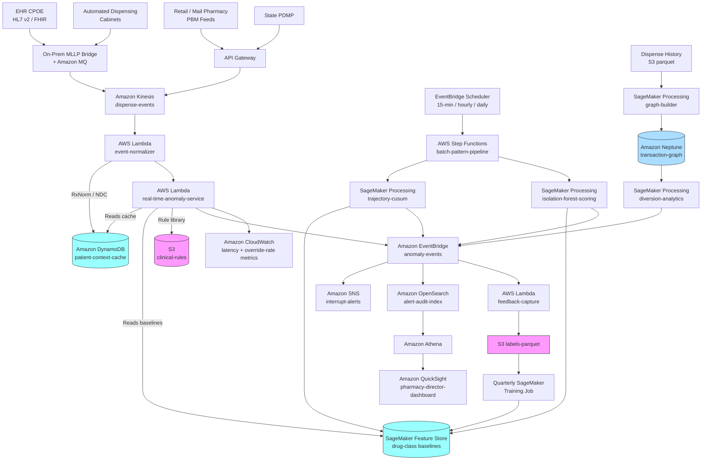

# Recipe 3.4 Architecture and Implementation: Medication Dispensing Anomalies

*Companion to [Recipe 3.4: Medication Dispensing Anomalies](chapter03.04-medication-dispensing-anomalies). This page covers the AWS architecture, services, prerequisites, and pseudocode. For the problem framing and the conceptual approach, start with the main recipe.*

---

## The AWS Implementation

### Why These Services

**Amazon Kinesis Data Streams for the dispense event feed.** The ingest pipeline has to accept events from multiple upstream systems (CPOE order verifications, automated dispensing cabinet pulls, retail pharmacy fills) with different throughput profiles. Kinesis gives you durable, ordered event streams with multi-consumer fanout, which matters because the same event gets read by the real-time anomaly service, the batch aggregation pipeline, and the audit archive. HIPAA-eligible under the BAA.

**AWS Lambda for the real-time anomaly service.** The hot path (rule screening, cache lookup, z-score computation) targets p95 of 100-200ms; the end-to-end target from order-entry UI to pharmacist-side flag is under 500ms (cabinet-pull experiences are tighter, typically sub-second). A Lambda function triggered by Kinesis records fits this profile: fast cold-start with SnapStart or provisioned concurrency, autoscales with event volume, and the per-invocation cost at typical pharmacy volumes is negligible. Keep the business logic small; offload anything heavy to async downstream steps. For cabinet-pull paths, provisioned concurrency on the hot-path Lambda is usually required to hit the sub-second budget consistently.

**Amazon DynamoDB for the patient-context cache.** Low-latency key-value reads are exactly what DynamoDB is for. The cache is keyed by patient ID and contains the recent demographic, lab, medication, and problem-list snapshots the anomaly service needs. Refreshed by a separate Lambda that consumes FHIR and HL7 events from the EHR feed. HIPAA-eligible and supports customer-managed KMS for encryption at rest.

**Amazon SageMaker Feature Store for historical baseline statistics.** For each drug-patient-profile combination, the population-level statistics (mean, stddev, percentiles) live in the feature store with timestamps. The real-time Lambda queries the online store for sub-second lookups; the training and recomputation code uses the offline store for point-in-time-correct retrieval. HIPAA-eligible.

**Amazon SageMaker Processing for the batch pattern path.** CUSUM, EWMA, and Isolation Forest computations run in SageMaker Processing jobs on a schedule. Feature extraction from the dispense history, model scoring, and output to S3 all happen in containerized scikit-learn scripts. For the supervised classifier (where labels exist), SageMaker built-in XGBoost matches the pattern used in Recipes 3.2 and 3.3.

**Amazon Neptune for the controlled-substance transaction graph.** The diversion detection pipeline is fundamentally a graph problem, and Neptune's property-graph model fits the user-station-drug-patient-transaction schema naturally. Gremlin queries handle the community detection and unusual-subgraph analysis. Neptune is HIPAA-eligible under the BAA.

**Amazon OpenSearch Service for the alert and audit index.** Every flag produced by the pipeline gets indexed for search and aggregation. The pharmacy director's dashboard queries OpenSearch for trend views; the audit team queries it for specific-patient lookups and regulatory reporting. OpenSearch supports fine-grained access control which matters when pharmacy, compliance, and IT security all need different slices of the same data.

**Amazon MSK or Amazon MQ for HL7 integration.** Most hospital EHR integrations speak HL7 v2 over MLLP (Minimal Lower Layer Protocol), and getting those messages into AWS typically uses an on-premises MLLP receiver that republishes to Amazon MQ (ActiveMQ flavor) or an MSK (Managed Kafka) topic. From there the event normalizer Lambda picks up and transforms into the canonical format. FHIR-native EHRs can push directly to API Gateway instead; both paths land in Kinesis for downstream consumption. The on-premises MLLP receiver is the PHI ingress surface into AWS, so the production posture matters: wrap MLLP in TLS (often called MLLPS) with mutual TLS authentication, deploy the receiver in a DMZ or integration tier rather than on the clinical network, connect to AWS via Direct Connect for production volumes (Site-to-Site VPN is acceptable for lower-volume and pilot deployments), and authenticate the AWS-side MQ or Kafka broker via mutual TLS or short-lived IAM-derived tokens rather than long-lived shared secrets. Raw MLLP without TLS is acceptable only in development environments with synthetic data.

**Amazon S3 with AWS KMS for durable storage.** Raw dispense events, patient-context snapshots, model artifacts, and feedback data all land in S3 with server-side encryption using customer-managed KMS keys. Parquet for the structured data, JSON for raw events. Lifecycle rules move cold data to S3 Glacier for long-term retention (pharmacy records often have 10-year or longer retention requirements depending on jurisdiction).

**AWS Step Functions for orchestration.** The daily and hourly batch pipelines (feature recomputation, trajectory scoring, graph rebuild, retraining) are multi-step workflows that benefit from Step Functions' visibility and retry semantics. Each major pipeline is a separate state machine.

**Amazon EventBridge for routing flags.** When a flag is produced, an EventBridge event goes out. Subscribers include the real-time alert delivery service, the audit logger, the metrics aggregator, and the feedback capture service. Using EventBridge rather than hard-coded integrations lets the pipeline evolve without touching the detection logic.

**Amazon SNS and Amazon Pinpoint for alert delivery.** Interrupt-severity alerts go to the pharmacist's workstation or phone through whatever integration the hospital uses (often a custom app that subscribes to SNS or an MDM-pushed notification channel). Lower-severity alerts go to email or to the EHR's secure messaging. Pinpoint handles patient-level outreach when the detected anomaly requires contacting the patient (outpatient early-refill patterns, for example). The notification payload follows the chapter-3-settled minimum-PHI convention: the SNS message carries event ID, severity, and routing tier only, and the pharmacist UI fetches the full record (drug, dose, patient context) by ID over a separate authenticated channel. PHI does not transit through SNS, downstream notification channels, or any subscriber logs.

**Amazon QuickSight for pharmacy leadership dashboards.** Override rates by alert type, adverse event correlations, diversion investigation queue depth, dispensing trend monitoring. QuickSight on top of Athena against the OpenSearch archive and the S3 analytics buckets. HIPAA-eligible.

**Amazon Comprehend Medical for unstructured clinical context.** Some of the most useful context for anomaly detection lives in free-text clinical notes (the reason for the medication, the clinical goals of care, the specific symptoms being treated). Comprehend Medical extracts medical entities and relationships from notes and makes them available to the anomaly detector as structured features. Use it sparingly: the cost per page of text adds up, so extract-once-and-cache is the right pattern.

**Amazon Bedrock for LLM-assisted triage (optional, advanced).** For the clinical-reasoning class of anomaly (does this dispense match the clinical intent in the note?), a HIPAA-eligible LLM through Bedrock can compare the dispense event against the patient's recent clinical notes and flag reasoning mismatches. Use only models with BAA coverage on the inference path; Amazon's foundation models on Bedrock are HIPAA-eligible, but third-party models on Bedrock have differing BAA postures, and the model's terms of service have to be reviewed before PHI-bearing prompts are sent. Construct prompts with minimum-necessary context (the relevant note excerpts, the dispense event, the active medication list, not the full chart), filter outputs for clinical-recommendation hallucinations, and log every prompt and response to the audit trail tied to the triage decision. Expensive and requires rigorous validation. Layer on top of the statistical detection, not a replacement for it. See Chapter 2's generative AI recipes (2.4 through 2.10) for the established BAA discipline for PHI-bearing LLM workloads. 

**Amazon CloudWatch and AWS CloudTrail.** Standard operational and audit logging. CloudWatch dashboards for pipeline health, alert latency, override rates, and drift metrics. CloudTrail data events on every PHI-bearing store so access is auditable end-to-end.

### Architecture Diagram



### Prerequisites

| Requirement | Details |
|-------------|---------|
| **AWS Services** | Amazon Kinesis Data Streams, AWS Lambda, Amazon DynamoDB, Amazon SageMaker (Processing, Training, Feature Store), Amazon Neptune, Amazon OpenSearch Service, Amazon S3, Amazon MQ or MSK, API Gateway, AWS Step Functions, Amazon EventBridge, Amazon SNS, Amazon Pinpoint, Amazon Comprehend Medical, Amazon Bedrock (optional), Amazon QuickSight, AWS KMS, Amazon CloudWatch, AWS CloudTrail. |
| **IAM Permissions** | Least-privilege per role. Real-time anomaly Lambda role: `dynamodb:GetItem` on patient-context-cache only (no write), `sagemaker-featurestore-runtime:GetRecord` on baseline feature groups, `s3:GetObject` on clinical-rules bucket, `events:PutEvents` to the anomaly-events bus, `kinesis:GetRecords`. Cache-refresher Lambda role: `dynamodb:PutItem` and `dynamodb:UpdateItem` on patient-context-cache only, `kinesis:GetRecords` on the EHR event stream. Event normalizer Lambda role: `kinesis:GetRecords`, `dynamodb:PutItem`. Alert-delivery Lambda role: consumes events from the bus (no `events:PutEvents`), `sns:Publish` on the interrupt-alert topic only. Feedback-capture Lambda role: `dynamodb:PutItem` on processed-feedback-events table (conditional write for idempotency), `events:PutEvents` on a dedicated feedback-events bus only, `dynamodb:PutItem` on a label-write-only table, `s3:PutObject` on the labels-parquet bucket only. Batch pipelines: scoped to their specific input and output prefixes in S3. Diversion-pipeline roles are scoped separately and stricter (separate KMS keys, separate Neptune cluster access, separate IAM boundary). No `*` actions in production. Per-resource ARNs everywhere; no wildcard resource scopes. |
| **BAA** | AWS BAA signed. Every service listed is HIPAA-eligible under the BAA when configured properly. See the [AWS HIPAA Eligible Services Reference](https://aws.amazon.com/compliance/hipaa-eligible-services-reference/). |
| **Encryption** | S3: SSE-KMS with customer-managed keys. DynamoDB: encryption at rest with CMK. Kinesis: server-side encryption with CMK. Neptune: encryption at rest with CMK. OpenSearch: encryption at rest and in-transit. SageMaker: KMS on volumes, model artifacts, and Feature Store. TLS 1.2 or higher in transit everywhere. |
| **VPC** | Production: Lambdas, SageMaker jobs, and Neptune in a VPC with the following endpoints. Gateway: `s3`, `dynamodb`. Interface: `kinesis`, `sagemaker.api` (control-plane Processing and Training), `sagemaker.featurestore-runtime` (online baseline retrieval), `sagemaker.runtime` (if a real-time endpoint variant is used), `states` (Step Functions), `events` (EventBridge bus), `scheduler` (EventBridge Scheduler), `logs` (CloudWatch Logs), `monitoring` (CloudWatch `PutMetricData`), `kms`, `sns`, `bedrock-runtime`, `comprehendmedical`, plus OpenSearch via VPC. Neptune only accessible via VPC; no public endpoints. Pinpoint API is reached through its regional endpoint; if the calling Lambda is in a private subnet, route Pinpoint traffic via a NAT gateway or a Pinpoint VPC endpoint where available. VPC Flow Logs enabled on the VPC carrying Lambda, SageMaker, and Neptune traffic; logs delivered to a dedicated S3 bucket with KMS encryption and retention aligned to the deepest applicable requirement (HIPAA 6-year baseline; DEA 2-year minimum for controlled-substance-related records; state pharmacy boards 5-10 years where applicable). For the diversion-investigation Neptune cluster specifically, Flow Logs become evidentiary records and follow the organization's evidence-handling retention policy (typically 7+ years). |
| **CloudTrail** | Enabled with data events on patient-context-cache, clinical-rules bucket, labels-parquet bucket, Neptune cluster operations, and OpenSearch domain operations. Every real-time anomaly decision is logged to an immutable audit trail. |
| **Data Access Controls** | Controlled-substance transaction data and diversion investigation records require stricter access controls than general medication data. Separate IAM roles, separate KMS keys, separate Neptune cluster or a dedicated logical partition. Access reviewed quarterly. |
| **Subgroup data access** | Subgroup performance and override-pattern monitoring requires read access to patient demographic attributes (age band, sex, race, ethnicity, preferred language, insurance type) and provider demographic attributes (specialty, training program, demographics where available under HR rules). These attributes may be governed differently from claims and clinical PHI in some regulatory regimes. Restrict read access to the demographic-and-attribute store to the retraining job role and the QuickSight dashboard role; audit subgroup queries via CloudTrail data events. The QuickSight dashboard backed by Athena should query an aggregated subgroup-metrics table (override rates by drug class by patient demographic, missed-ADE rates by drug class by demographic), not the raw demographic-joined anomaly archive, so dashboard-user access does not require row-level read on the subgroup attributes. Provider-demographic data has its own HR-confidentiality governance and may not be addressable by the same architectural pattern as patient-demographic data; coordinate with HR and legal on the provider side. |
| **Clinical Governance** | Pharmacy leadership signs off on rule thresholds, severity tier definitions, and alert delivery workflows before production deployment. Changes to interrupt-severity rules require re-approval. This is clinical decision support; treat the governance accordingly. |
| **Sample Data** | [Synthea](https://github.com/synthetichealth/synthea) generates synthetic medication orders and administrations suitable for development. [MIMIC-IV](https://mimic.mit.edu/) has detailed ICU medication administration data, but access requires a data use agreement and credentialed access through PhysioNet. For drug reference data development, [RxNorm from the NLM](https://www.nlm.nih.gov/research/umls/rxnorm/index.html) is free and sufficient to prototype the normalization pipeline. Never use real PHI in development. |
| **Drug Reference Content** | A licensed drug knowledge base (First Databank, Wolters Kluwer, Micromedex, Lexicomp, or Medi-Span) or a carefully-maintained open-source equivalent built on RxNorm + DailyMed. Budget vendor license fees. Plan for monthly update cycles. |
| **EHR Integration** | HL7 v2 or FHIR R4 feed from the EHR with at minimum: ADT for demographics and location, ORM/ORC/RXO/RXE (or FHIR MedicationRequest) for medication orders, ORU for lab results, and administrative feeds for problem list and allergies. An integration engine (Rhapsody, Mirth Connect, Cloverleaf, or Corepoint) on-premises is the usual bridge into the AWS ingest layer. |
| **Controlled-Substance Integration** | For diversion detection, read access to the automated dispensing cabinet transaction logs (Pyxis, Omnicell, BD) in near-real-time. Usually a vendor-specific integration. Also access to the state PDMP for outpatient controlled-substance dispensing data (availability and API varies by state). |
| **Retention** | HIPAA baseline is 6 years. Controlled-substance records have DEA retention requirements (typically 2 years for dispensing records, longer in some states). State pharmacy boards often impose additional requirements (5-10 years is common). Coordinate with legal and compliance for the specific schedule. |
| **Cost Estimate** | For a mid-size hospital (say, 400 beds, 8,000 medication events per day, 2-3 million events per year): Kinesis and Lambda real-time path: ~$100-300/month. DynamoDB patient-context cache: ~$50-150/month depending on read pattern. SageMaker Feature Store: ~$20-60/month for this data volume. SageMaker Processing for batch scoring: ~$200-500/month. Neptune for diversion (smaller cluster): ~$400-800/month. OpenSearch alert-audit index: ~$300-600/month. Comprehend Medical and optional Bedrock: usage-dependent, typically $100-500/month. Total infrastructure: typically $1,500-4,000/month for a mid-size hospital. Compare to cost avoidance: the average preventable ADE costs roughly $5,000-$10,000 per event in additional care, and sentinel-event-level harms cost far more.  |

### Ingredients

| AWS Service | Role |
|------------|------|
| **Amazon Kinesis Data Streams** | Durable, multi-consumer event stream for dispense events |
| **Amazon MQ / MSK** | HL7 v2 ingress from on-premises EHR integration engine |
| **Amazon API Gateway** | FHIR and retail-pharmacy webhook ingress |
| **AWS Lambda (event-normalizer)** | Vocabulary mapping (RxNorm, NDC, internal formulary), unit conversion, patient ID resolution |
| **AWS Lambda (real-time-anomaly-service)** | Rule screening, z-score lookup, severity tiering, event routing |
| **AWS Lambda (feedback-capture)** | Override reasons, confirmed-event linkage, labels persistence |
| **Amazon DynamoDB (patient-context-cache)** | Low-latency patient attribute reads at dispense time |
| **Amazon DynamoDB (processed-feedback-events)** | Idempotency guard for at-least-once event delivery on feedback capture |
| **Amazon SageMaker Feature Store** | Drug-class baseline statistics with point-in-time correctness |
| **Amazon SageMaker Processing** | Trajectory CUSUM, Isolation Forest, graph analytics |
| **Amazon SageMaker Training** | Supervised classifier retraining when labels accumulate |
| **Amazon Neptune** | Controlled-substance transaction graph and diversion analytics |
| **Amazon OpenSearch Service** | Alert and audit index for pharmacy and compliance search |
| **Amazon S3 (clinical-rules)** | Versioned rule library with drug-knowledge-base references |
| **Amazon S3 (dispense-history)** | Long-term event archive; source for batch scoring |
| **Amazon S3 (labels-parquet)** | Confirmed events and override data for supervised retraining |
| **AWS Step Functions** | Orchestrates batch pattern pipeline and retraining workflows |
| **Amazon EventBridge** | Decouples anomaly detection from alert delivery, audit, and feedback |
| **Amazon SNS** | Interrupt-severity alert delivery to pharmacist workstations |
| **Amazon Pinpoint** | Patient-level outreach for outpatient anomaly patterns |
| **Amazon Comprehend Medical** | Entity extraction from free-text clinical notes for context features |
| **Amazon Bedrock (optional)** | LLM-assisted clinical-reasoning triage for advanced deployments |
| **Amazon QuickSight** | Pharmacy leadership dashboards; override rate and trend monitoring |
| **AWS KMS** | Customer-managed keys for every PHI-bearing store |
| **Amazon CloudWatch** | Real-time latency, alert volume, override rate, drift metrics |
| **AWS CloudTrail** | Audit logging on every PHI-bearing store and every rule change |

---

### Code

> **Reference implementations:** These aws-samples repositories demonstrate patterns that apply here:
> - [`amazon-sagemaker-examples`](https://github.com/aws/amazon-sagemaker-examples): Random Cut Forest and Isolation Forest patterns for unsupervised detection; Feature Store integration examples; processing-job patterns.
> - [`aws-samples`](https://github.com/aws-samples): Search for "healthcare," "clinical decision support," and "medication safety" for adjacent patterns.
> 

#### Walkthrough

**Step 1: Normalize the dispense event.** The incoming event has a lot of variation in how drugs and doses are identified. The first job is to produce a canonical representation that the rest of the pipeline can reason about. Skip or rush this step, and the detectors see "Tylenol 500mg" and "acetaminophen 500 mg PO" as different drugs, and your patient-level trajectory features are nonsense.

```text
FUNCTION normalize_dispense_event(raw_event):
    // Source systems provide drug identifiers in multiple vocabularies.
    // Map everything to RxNorm concept IDs; keep original identifier for audit.
    drug_id = null
    IF raw_event.has("ndc"):
        drug_id = RxNorm.get_concept_by_ndc(raw_event.ndc)
    ELSE IF raw_event.has("formulary_id"):
        drug_id = formulary_to_rxnorm_crosswalk.lookup(raw_event.formulary_id)
    ELSE IF raw_event.has("drug_name"):
        // Fallback: fuzzy match by name. Log low-confidence matches for review.
        drug_id = RxNorm.fuzzy_match(raw_event.drug_name, min_confidence = 0.9)

    IF drug_id == null:
        emit_metric("unmapped_drug", 1, dimensions = { source: raw_event.source })
        route_to_dead_letter_queue(raw_event, reason = "drug_id_unresolved")
        return null

    // Dose normalization: parse number + unit, convert to canonical form.
    // The knowledge base defines the canonical unit per drug (e.g., mg for
    // most oral drugs, units for insulin, mEq for electrolytes).
    canonical_unit = drug_reference.get_canonical_unit(drug_id)
    dose_canonical = convert_units(raw_event.dose_value, raw_event.dose_unit, canonical_unit)

    // Frequency normalization: turn "Q6H PRN" or "every 6 hours as needed"
    // into structured (min_interval_hours, max_interval_hours, prn_flag).
    frequency = parse_frequency(raw_event.sig_text or raw_event.frequency_field)

    // Resolve patient identifier to the enterprise ID.
    patient_id = patient_master.resolve(
        mrn           = raw_event.patient_mrn,
        source_system = raw_event.source
    )

    canonical_event = {
        event_id: generate_event_id(),
        source_event_id: raw_event.source_event_id,
        source: raw_event.source,     // "cpoe" | "adc" | "retail" | "pdmp"
        event_type: raw_event.event_type, // "order" | "verify" | "dispense" | "administer"
        event_timestamp: raw_event.timestamp,
        patient_id: patient_id,
        drug_rxnorm: drug_id,
        drug_display_name: drug_reference.get_display_name(drug_id),
        dose_value: dose_canonical.value,
        dose_unit: dose_canonical.unit,
        dose_per_kg: null,   // computed after weight lookup
        route: normalize_route(raw_event.route),
        frequency: frequency,
        ordered_by: raw_event.ordering_provider,
        dispensed_by: raw_event.dispensing_user,
        station_id: raw_event.dispensing_station,
        raw_identifier: {        // keep original for audit
            ndc: raw_event.get("ndc"),
            formulary_id: raw_event.get("formulary_id"),
            name: raw_event.get("drug_name")
        }
    }
    return canonical_event
```

**Step 2: Join patient context and compute derived features.** Before scoring, the event needs patient-specific context (weight, labs, active meds, diagnoses). The patient-context cache is the source; staleness matters and is tracked per field.

```text
FUNCTION enrich_with_patient_context(canonical_event):
    context = DynamoDB.GetItem("patient-context-cache", { patient_id: canonical_event.patient_id })

    // Attach context fields with staleness tracking. A weight from three
    // weeks ago is useless for an ICU patient whose fluid balance has
    // shifted dramatically; we flag staleness so the scorer can decide.
    enriched = canonical_event.copy()
    enriched.patient_age_years   = context.age_years
    enriched.patient_weight_kg   = context.weight_kg
    enriched.weight_observed_at  = context.weight_observed_at
    enriched.weight_is_stale     = staleness_check(context.weight_observed_at,
                                                   max_days = max_weight_age_for_acuity(context.acuity))
    enriched.patient_height_cm   = context.height_cm
    enriched.patient_acuity      = context.acuity       // "icu" | "ward" | "outpatient" | "ed"
    enriched.patient_location    = context.unit

    // Renal function: use most recent eGFR or compute Cockcroft-Gault from SCr.
    enriched.egfr                = context.egfr
    enriched.egfr_observed_at    = context.egfr_observed_at
    enriched.egfr_is_stale       = staleness_check(context.egfr_observed_at,
                                                   max_days = 2 if context.acuity in ["icu", "ward"] else 30)

    // Hepatic indicators, electrolytes, anticoagulation status: same pattern.
    enriched.ast  = context.ast
    enriched.alt  = context.alt
    enriched.inr  = context.inr
    enriched.potassium = context.potassium

    // Active medication list for interaction checks.
    enriched.active_medications = context.active_medications   // list of RxNorm IDs

    // Problem list and allergies for disease and allergy checks.
    enriched.active_problems = context.active_problems         // list of ICD-10 codes
    enriched.allergies       = context.allergies               // normalized allergen list

    // Clinical-context flags that gate the anomaly checks. The oncology-protocol
    // flag is the highest-value feature in the recipe (see "The Honest Take");
    // without it, the general detector flags chemotherapy doses constantly. These
    // come from the EHR's care-plan or oncology-specific EHR feed (Aria, Mosaiq,
    // Beacon), not from diagnosis-code inference.
    enriched.active_protocols       = context.active_protocols       // list of regimen identifiers
    enriched.palliative_care_active = context.palliative_care_active // boolean

    // Derived features the scorer will use.
    IF enriched.patient_weight_kg and enriched.dose_unit in ["mg", "mcg", "g", "units"]:
        enriched.dose_per_kg = canonical_event.dose_value / enriched.patient_weight_kg

    enriched.is_pediatric  = enriched.patient_age_years < 18
    enriched.is_geriatric  = enriched.patient_age_years >= 65
    enriched.is_neonate    = enriched.patient_age_years < 0.0833  // under one month

    enriched.ckd_stage = egfr_to_ckd_stage(enriched.egfr)

    return enriched
```

**Step 3: Apply the rule-based screen.** For each enriched event, run the clinical rules. These are the hard-stop checks: weight-based dose limits, renal dose adjustments, severe drug-drug interactions, direct allergy contraindications. Every rule fire produces a structured flag with the rule ID, the trigger values, and the severity.

```text
FUNCTION rule_screen(enriched_event):
    flags = []
    rule_set = clinical_rules.get_active_rules_for_drug(enriched_event.drug_rxnorm)

    // Protocol-aware suppression. If the patient is on an active oncology protocol
    // and this drug is part of the protocol's regimen, suppress general dose-range
    // anomalies (the doses are wildly anomalous against the population baseline by
    // clinical design). Weight-based and renal-adjustment checks still fire, because
    // those are protocol-independent safety floors. Every suppression decision emits
    // an audit metric so a missed dose error from a wrongly-set protocol flag is
    // detectable retrospectively.
    suppressed_rule_types = set()
    FOR each protocol_id in enriched_event.active_protocols:
        protocol = oncology_protocols.lookup(protocol_id)
        IF enriched_event.drug_rxnorm in protocol.regimen_drugs:
            suppressed_rule_types = suppressed_rule_types UNION protocol.suppressed_rule_types
            emit_metric("rule_suppressed_by_protocol", 1, dimensions = {
                protocol_id: protocol_id,
                drug: enriched_event.drug_rxnorm
            })

    FOR each rule in rule_set:
        IF rule.type in suppressed_rule_types:
            CONTINUE   // protocol membership suppresses this rule type for this drug

        CASE rule.type:

            "max_dose_per_kg":
                IF enriched_event.dose_per_kg is not null \
                   AND enriched_event.dose_per_kg > rule.threshold \
                   AND enriched_event.patient_age_years in rule.age_applicable:
                    flags.append({
                        rule_id: rule.id,
                        rule_type: "max_dose_per_kg",
                        severity: rule.severity,    // "interrupt" | "synchronous" | "background"
                        actual: enriched_event.dose_per_kg,
                        threshold: rule.threshold,
                        message: f"Dose {enriched_event.dose_per_kg:.2f} mg/kg exceeds maximum {rule.threshold} mg/kg for patient age {enriched_event.patient_age_years}",
                        reference: rule.reference_source
                    })

            "renal_dose_adjustment_required":
                IF enriched_event.ckd_stage >= rule.ckd_stage_trigger \
                   AND enriched_event.dose_value > rule.max_dose_at_stage[enriched_event.ckd_stage]:
                    flags.append({
                        rule_id: rule.id,
                        rule_type: "renal_dose_adjustment",
                        severity: rule.severity,
                        actual: enriched_event.dose_value,
                        threshold: rule.max_dose_at_stage[enriched_event.ckd_stage],
                        message: f"Dose requires renal adjustment; patient eGFR {enriched_event.egfr} puts them in CKD stage {enriched_event.ckd_stage}",
                        reference: rule.reference_source
                    })

            "drug_drug_interaction":
                IF rule.interacting_drug_rxnorm in enriched_event.active_medications:
                    flags.append({
                        rule_id: rule.id,
                        rule_type: "drug_drug_interaction",
                        severity: rule.severity,
                        paired_drug: rule.interacting_drug_rxnorm,
                        message: rule.message,
                        reference: rule.reference_source
                    })

            "allergy_contraindication":
                FOR each allergen in enriched_event.allergies:
                    IF allergen.normalized_id == rule.direct_allergen:
                        // Direct allergen match (e.g., penicillin-allergic patient
                        // receiving penicillin). Interrupt severity is appropriate.
                        flags.append({
                            rule_id: rule.id,
                            rule_type: "allergy_contraindication_direct",
                            severity: "interrupt",
                            allergen: allergen.normalized_id,
                            reaction: allergen.reaction,
                            message: f"Patient has documented allergy to {allergen.display_name}; {enriched_event.drug_display_name} is the same agent",
                            reference: rule.reference_source
                        })
                    ELSE IF allergen.normalized_id in rule.cross_reactive_allergens:
                        // Cross-reactivity (e.g., penicillin-allergic patient
                        // receiving a cephalosporin). Severity depends on (1) the
                        // specific drug pair (penicillin / first-gen cephalosporin
                        // cross-reactivity is roughly 1-2%; penicillin / third-gen
                        // is essentially nil; penicillin / carbapenem is under 1%)
                        // and (2) the reaction history (anaphylaxis vs. rash vs.
                        // unspecified). Defer to the rule's per-pair severity
                        // rather than a global "interrupt." See ASHP and Joint
                        // Commission guidance on penicillin-allergy de-labeling
                        // and beta-lactam stewardship.
                        flags.append({
                            rule_id: rule.id,
                            rule_type: "allergy_cross_reactive",
                            severity: rule.cross_reactive_severity[allergen.reaction_type] OR "synchronous",
                            allergen: allergen.normalized_id,
                            reaction: allergen.reaction,
                            message: f"Patient has documented allergy to {allergen.display_name}; {enriched_event.drug_display_name} is potentially cross-reactive (per-pair severity calibration applies)",
                            reference: rule.reference_source
                        })

            // Additional rule types: min_dose, max_daily_dose, duplicate_therapy,
            // max_frequency, max_duration, qt_prolongation_with_hypokalemia, etc.

    return flags
```

**Step 4: Compute population-level z-scores.** For drugs with enough dispensing volume to build a stable distribution, compare the current event against the baseline for patients with similar characteristics. The baselines live in the Feature Store, refreshed periodically by the batch pipeline.

```text
FUNCTION population_zscore_check(enriched_event):
    // Identify the patient profile bucket for baseline lookup.
    profile_bucket = build_profile_bucket(
        age_band: age_to_band(enriched_event.patient_age_years),   // "neonate" | "infant" | "child" | "adult" | "elderly"
        acuity: enriched_event.patient_acuity,
        ckd_stage: enriched_event.ckd_stage,
        indication: enriched_event.indication if available else "unspecified"
    )

    flags = []

    // Look up the baseline distribution for this drug + profile.
    baseline = FeatureStore.GetRecord(
        feature_group = "drug-class-baselines",
        record_id     = f"{enriched_event.drug_rxnorm}:{profile_bucket}"
    )

    IF baseline is null or baseline.sample_size < MIN_BASELINE_SAMPLES:
        // Not enough data for a stable baseline; skip this check.
        return flags

    // Dose z-score.
    IF baseline.dose_median is not null AND baseline.dose_mad > 0:
        robust_z = (enriched_event.dose_value - baseline.dose_median) / (1.4826 * baseline.dose_mad)
        IF abs(robust_z) >= POP_DOSE_Z_THRESHOLD: // e.g., 3.0
            flags.append({
                type: "population_dose_zscore",
                feature: "dose_value",
                actual: enriched_event.dose_value,
                baseline_median: baseline.dose_median,
                robust_z: robust_z,
                profile: profile_bucket,
                severity: zscore_to_severity(robust_z)
            })

    // Dose-per-kg z-score (for weight-based drugs).
    IF enriched_event.dose_per_kg is not null \
       AND baseline.dose_per_kg_median is not null \
       AND baseline.dose_per_kg_mad > 0:
        robust_z_kg = (enriched_event.dose_per_kg - baseline.dose_per_kg_median) / (1.4826 * baseline.dose_per_kg_mad)
        IF abs(robust_z_kg) >= POP_DOSE_PER_KG_Z_THRESHOLD:
            flags.append({
                type: "population_dose_per_kg_zscore",
                feature: "dose_per_kg",
                actual: enriched_event.dose_per_kg,
                baseline_median: baseline.dose_per_kg_median,
                robust_z: robust_z_kg,
                profile: profile_bucket,
                severity: zscore_to_severity(robust_z_kg)
            })

    return flags
```

**Step 5: Route the flags based on severity.** The rule and z-score outputs are combined into a single event and routed. Interrupt-severity flags fan out synchronously to the pharmacist's workstation. Lower-severity flags go to review queues and trend analytics.

```text
FUNCTION route_flags(enriched_event, rule_flags, zscore_flags):
    all_flags = rule_flags + zscore_flags

    IF length(all_flags) == 0:
        // No flags; record the event in the audit log and move on.
        OpenSearch.Index("dispense-audit", enriched_event)
        return

    // The overall severity is the highest severity of any individual flag.
    overall_severity = max(flag.severity for flag in all_flags)

    anomaly_event = {
        event_id: enriched_event.event_id,
        patient_id: enriched_event.patient_id,
        drug_rxnorm: enriched_event.drug_rxnorm,
        drug_display_name: enriched_event.drug_display_name,
        event_timestamp: enriched_event.event_timestamp,
        source: enriched_event.source,
        flags: all_flags,
        flag_count: length(all_flags),
        severity: overall_severity,
        context_snapshot: summary_of(enriched_event),    // weight, labs, active meds
        detected_at: NOW()
    }

    EventBridge.PutEvent(
        bus     = "medication-anomaly-events",
        detail  = anomaly_event,
        source  = "medication-anomaly-service",
        detail_type = f"MedicationAnomaly.{overall_severity}"
    )

    // Index for audit and search.
    OpenSearch.Index("medication-anomalies", anomaly_event)

    // Interrupt severity triggers synchronous notification.
    // The SNS message carries the event ID, severity, and a coarse routing tier
    // only; the pharmacist UI fetches the full record (drug, dose, patient,
    // context) by ID. PHI does not transit through SNS, downstream notification
    // channels (SMS, pager, mobile push, Slack/Teams webhooks), or any logs they
    // generate. For high-stigma drug classes (HIV antiretrovirals, opioid-use-
    // disorder treatments, gender-affirming hormones, certain psychiatric
    // medications), even the drug display name is a diagnostic disclosure on a
    // lock screen and should not appear in the notification subject line.
    IF overall_severity == "interrupt":
        SNS.Publish(
            topic   = INTERRUPT_ALERT_TOPIC,
            message = {
                event_id: anomaly_event.event_id,
                severity: "interrupt",
                routing_tier: anomaly_event.severity,
                fetch_by_id: True
            },
            attributes = {
                "patient_location": enriched_event.patient_location,
                "severity": "interrupt"
            }
        )
```

**Step 6: Run the batch pattern pipeline.** On a schedule (hourly for ICU-level trajectory detection, daily for broader pattern work), a Step Functions workflow runs the SageMaker Processing jobs for CUSUM trajectory detection and Isolation Forest multivariate scoring. Per-patient-day feature vectors get built from recent dispenses and scored against the Isolation Forest trained on historical data.

```text
FUNCTION batch_trajectory_scoring(as_of_timestamp):
    // For continuous and frequent-dose drugs (insulin, vasopressors, PRN pain meds),
    // build per-patient trajectories over the rolling window.
    window_start = as_of_timestamp - 72 hours
    active_patients = get_active_patients(as_of = as_of_timestamp)

    FOR each patient in active_patients:
        FOR each drug in CONTINUOUS_MONITORING_DRUGS: // e.g., insulin, morphine, heparin
            dispense_series = get_dispense_series(
                patient_id   = patient.id,
                drug_rxnorm  = drug,
                window_start = window_start,
                window_end   = as_of_timestamp
            )

            IF length(dispense_series) < MIN_SERIES_LENGTH:
                continue

            // CUSUM on the dose trajectory to detect sustained shifts.
            cusum = cusum_detect(
                series = dispense_series.doses_per_hour,
                target = dispense_series.baseline_rate_pre_window,
                k      = 0.5 * dispense_series.stddev_pre_window,
                h      = 4 * dispense_series.stddev_pre_window
            )

            IF cusum.signal_fired AND cusum.change_point_within(window_start, as_of_timestamp):
                flag = {
                    type: "trajectory_cusum",
                    patient_id: patient.id,
                    drug_rxnorm: drug,
                    change_point: cusum.change_point,
                    pre_change_mean: cusum.pre_mean,
                    post_change_mean: cusum.post_mean,
                    shift_magnitude: cusum.post_mean - cusum.pre_mean,
                    severity: trajectory_severity(drug, cusum),
                    message: build_trajectory_message(drug, cusum)
                }
                EventBridge.PutEvent(
                    bus     = "medication-anomaly-events",
                    detail  = flag,
                    source  = "medication-anomaly-service",
                    detail_type = f"MedicationAnomaly.{flag.severity}"
                )

        // Per-patient-day feature vector for Isolation Forest scoring.
        patient_day_vector = build_patient_day_features(patient, as_of_timestamp)
        if_score = isolation_forest.score(patient_day_vector)

        IF if_score <= ISOLATION_FOREST_THRESHOLD:
            flag = {
                type: "patient_day_isolation_forest",
                patient_id: patient.id,
                as_of: as_of_timestamp,
                anomaly_score: if_score,
                top_contributors: shap_explain(isolation_forest, patient_day_vector, top_k = 5),
                severity: "synchronous"   // typically not interrupt-severity from batch path
            }
            EventBridge.PutEvent(
                bus     = "medication-anomaly-events",
                detail  = flag,
                source  = "medication-anomaly-service",
                detail_type = f"MedicationAnomaly.{flag.severity}"
            )
```

**Step 7: Capture feedback and close the loop.** Every alert generates a response (the pharmacist acknowledges, overrides, acts on, or escalates it). Every confirmed adverse drug event from incident reporting links back to the dispense records. This feedback is the training signal for rule tuning and retraining.

```text
FUNCTION on_pharmacist_response(response_event):
    // response_event: { anomaly_event_id, response, response_reason, responded_at,
    //                   responding_user, action_taken }

    // Idempotency guard: EventBridge delivers at-least-once, and Lambda async
    // retries on failure. A redelivered event that runs the OpenSearch update,
    // label write, and metric emission twice would double-count override metrics
    // (which drive rule-retirement decisions) and bias the training distribution.
    // Derive a deterministic event key and conditional-write it to a dedup table
    // before any side effects run.
    idempotency_key = hash(response_event.anomaly_event_id + ":" + response_event.response)
    already_processed = DynamoDB.PutItem(
        table          = "processed-feedback-events",
        item           = { pk: idempotency_key, processed_at: NOW(), ttl: NOW() + 7 days },
        condition      = "attribute_not_exists(pk)"   // fails if key already exists
    )
    IF already_processed == CONDITION_CHECK_FAILED:
        // Duplicate delivery; safe to drop.
        return

    anomaly = OpenSearch.Get("medication-anomalies", response_event.anomaly_event_id)

    // Update the anomaly record with the response.
    anomaly.response         = response_event.response       // "acknowledged" | "override" | "modified_order" | "cancelled_order"
    anomaly.response_reason  = response_event.response_reason
    anomaly.responded_at     = response_event.responded_at
    anomaly.responding_user  = response_event.responding_user
    anomaly.action_taken     = response_event.action_taken

    OpenSearch.Update("medication-anomalies", response_event.anomaly_event_id, anomaly)

    // Feed into override-rate metrics for rule tuning.
    FOR each flag in anomaly.flags:
        emit_metric("flag_response", 1, dimensions = {
            rule_id: flag.rule_id or flag.type,
            response: response_event.response,
            severity: flag.severity
        })

    // If a modification or cancellation happened, this is a "true positive" signal.
    IF response_event.response in ["modified_order", "cancelled_order"]:
        label_row = {
            anomaly_event_id: anomaly.event_id,
            flags: anomaly.flags,
            context_snapshot: anomaly.context_snapshot,
            label: "action_taken",
            label_source: "pharmacist_response",
            labeled_at: response_event.responded_at
        }
        S3.PutObject(
            bucket = "medication-anomaly-labels",
            key    = date_partitioned_key(response_event.responded_at) + "/" + uuid() + ".parquet",
            body   = parquet_encode([label_row])
        )

FUNCTION on_adverse_event_report(ade_event):
    // A confirmed adverse drug event from incident reporting.
    // Idempotency guard: same pattern as on_pharmacist_response. A redelivered
    // ADE event would corrupt the missed-adverse-event signal (the most important
    // feedback signal in the pipeline) and bias the supervised classifier's
    // training distribution.
    idempotency_key = hash(ade_event.id + ":ade_linkage")
    already_processed = DynamoDB.PutItem(
        table          = "processed-feedback-events",
        item           = { pk: idempotency_key, processed_at: NOW(), ttl: NOW() + 7 days },
        condition      = "attribute_not_exists(pk)"
    )
    IF already_processed == CONDITION_CHECK_FAILED:
        return   // Duplicate delivery; safe to drop.

    // Find dispense records for this patient within the event window.
    related_dispenses = search_dispense_events(
        patient_id = ade_event.patient_id,
        window     = (ade_event.event_date - 48 hours, ade_event.event_date)
    )

    FOR each dispense in related_dispenses:
        label_row = {
            dispense_event_id: dispense.event_id,
            drug_rxnorm: dispense.drug_rxnorm,
            context_snapshot: dispense.context_snapshot,
            ade_category: ade_event.category,
            ade_severity: ade_event.severity,
            had_alert: dispense.had_anomaly_flag,
            label: "adverse_event_confirmed",
            label_source: "incident_report",
            labeled_at: ade_event.reported_at
        }
        S3.PutObject(
            bucket = "medication-anomaly-labels",
            key    = date_partitioned_key(ade_event.reported_at) + "/" + uuid() + ".parquet",
            body   = parquet_encode([label_row])
        )

        // Critical: if an adverse event happened and the system did NOT flag it,
        // that's a false negative. Emit a metric and escalate for review.
        IF not dispense.had_anomaly_flag:
            emit_metric("missed_adverse_event", 1, dimensions = {
                drug: dispense.drug_rxnorm,
                ade_category: ade_event.category
            })
            EventBridge.PutEvent(
                bus     = "medication-anomaly-events",
                detail  = { dispense_event_id: dispense.event_id, ade_event_id: ade_event.id },
                source  = "medication-anomaly-service",
                detail_type = "MedicationAnomaly.MissedEvent"
            )
```

> **Curious how this looks in Python?** The pseudocode above covers the concepts. If you'd like to see sample Python code that demonstrates these patterns using boto3, check out the [Python Example](chapter03.04-python-example). It walks through each step with inline comments and notes on what you'd need to change for a real deployment.

---

### Expected Results

**Sample interrupt-severity alert for a pediatric dose anomaly:**

```json
{
  "event_id": "DISP-2026-05-12T19:42:18Z-884412",
  "patient_id": "PT-0044221",
  "drug_rxnorm": "723",
  "drug_display_name": "amoxicillin 500 mg oral tablet",
  "event_timestamp": "2026-05-12T19:42:18Z",
  "source": "cpoe",
  "flags": [
    {
      "rule_id": "MAX_DOSE_PER_KG_AMOXICILLIN_PEDIATRIC_AOM_HIGH_DOSE",
      "rule_type": "max_dose_per_kg",
      "severity": "interrupt",
      "actual": 71.4,
      "threshold": 50.0,
      "message": "Dose 71.4 mg/kg per dose exceeds the per-dose ceiling of 50.0 mg/kg for patient age 4.3 years (weight 14 kg). Standard pediatric amoxicillin for AOM under current AAP high-dose guidance is 80-90 mg/kg/day divided BID, which works out to approximately 40-45 mg/kg per dose.",
      "reference": "drug_kb_v2026.05_amoxicillin_pediatric_dosing"
    },
    {
      "type": "population_dose_per_kg_zscore",
      "feature": "dose_per_kg",
      "actual": 71.4,
      "baseline_median": 41.5,
      "robust_z": 5.6,
      "profile": "pediatric:child:outpatient:ckd_none:indication_otitis_media",
      "severity": "interrupt"
    }
  ],
  "flag_count": 2,
  "severity": "interrupt",
  "context_snapshot": {
    "patient_age_years": 4.3,
    "patient_weight_kg": 14,
    "weight_observed_at": "2026-05-12T10:15:00Z",
    "weight_is_stale": false,
    "patient_acuity": "outpatient",
    "egfr": null,
    "active_medications": [],
    "active_protocols": [],
    "allergies": []
  },
  "detected_at": "2026-05-12T19:42:18.215Z",
  "narrative_summary": "Prescribed amoxicillin dose of 1000 mg is 71.4 mg/kg per dose based on patient weight of 14 kg, substantially above the AAP high-dose AOM target of 40-45 mg/kg per dose (80-90 mg/kg/day divided BID). Recommend verifying intended dose; a likely intent is 600 mg per dose twice daily for high-dose AOM."
}
```

**Sample synchronous-review alert from the batch trajectory pipeline:**

```json
{
  "type": "trajectory_cusum",
  "patient_id": "PT-0122118",
  "drug_rxnorm": "5856",
  "drug_display_name": "insulin regular 100 unit/mL injectable",
  "change_point": "2026-05-12T13:00:00Z",
  "pre_change_mean": 2.4,
  "post_change_mean": 11.8,
  "shift_magnitude": 9.4,
  "severity": "synchronous",
  "unit": "units_per_hour",
  "message": "Insulin infusion rate has trended from 2.4 U/hr to 11.8 U/hr over the past 14 hours, a 4.9x increase. Combined with rising temperature (baseline 37.2C, current 38.9C) and rising white blood cell count (baseline 8.1, current 14.3), pattern is consistent with emerging infection/sepsis. Recommend clinical review.",
  "supporting_context": {
    "dispense_count_in_window": 22,
    "temperature_trend": "+1.7C over 14h",
    "wbc_trend": "+6.2 over 18h",
    "urine_output_trend": "-15 mL/hr over 12h"
  },
  "detected_at": "2026-05-13T03:02:17Z"
}
```

**Sample diversion-pattern alert from the graph analytics pipeline:**

```json
{
  "type": "controlled_substance_pattern",
  "subject_user_id": "USR-RN-088221",
  "subject_role": "registered_nurse",
  "pattern_category": "pull_administration_discrepancy",
  "window_start": "2026-04-15",
  "window_end": "2026-05-12",
  "signals": [
    {
      "signal": "pull_without_administration_rate",
      "actual": 0.14,
      "peer_median": 0.02,
      "peer_p95": 0.05,
      "robust_z": 5.1
    },
    {
      "signal": "waste_witness_rate",
      "actual": 0.82,
      "peer_median": 0.15,
      "peer_p95": 0.35,
      "robust_z": 4.6
    },
    {
      "signal": "off_unit_administrations",
      "actual": 8,
      "peer_median": 0,
      "peer_p95": 1
    }
  ],
  "severity": "investigation",
  "routing": "diversion_investigation_team",
  "message": "User shows elevated rates of controlled-substance pulls without matching administrations and unusually high waste-witness-required rate (self-witness patterns). Requires investigation before any disciplinary or clinical inference.",
  "note": "Pattern matches diversion indicators consistent with ASHP guidance and common production detection patterns; does not constitute proof of diversion. Investigation to be conducted under existing pharmacy-compliance protocol with HR and legal involvement as appropriate.",
  "detected_at": "2026-05-13T06:00:00Z"
}
```

**Performance benchmarks (illustrative; measure against your own data):**

| Metric | Rules only | Rules + pop z-score | Full pipeline (rules + z + trajectory + IF) |
|--------|-----------|---------------------|---------------------------------------------|
| Alerts per 1,000 dispense events | 120-250 | 40-120 | 25-80 |
| Pharmacist override rate | 85-95% | 60-80% | 40-65% |
| Recall on dose errors (vs. chart review) | 60-75% | 75-85% | 82-92% |
| Recall on drug interaction ADEs | 50-70% | 55-75% | 70-85% |
| Recall on trajectory-related ADEs (sepsis, pain crisis) | 5-15% | 10-20% | 45-70% |
| Diversion pattern detection (vs. investigator-confirmed) | 10-25% (only extreme cases) | 15-30% | 55-75% |
| Real-time latency p95 (order entry to flag) | 50-150ms | 100-300ms | 100-400ms |
| Batch trajectory cadence | n/a | n/a | 15-60 min |

**Where it struggles:**

- **Pediatric weight-based dosing with stale weights.** If the weight in the cache is days old and the patient is fluid-resuscitated (common in pediatric ICU), the dose-per-kg math is wrong. The system flags this with a staleness indicator, but correct handling requires workflow integration to ensure fresh weights on critical patients.
- **Oncology protocols.** Doses that look wildly anomalous relative to general population baselines are correct for chemotherapy. A chemotherapy-aware detection path is required; the general detector should suppress or re-contextualize alerts for patients on active oncology protocols.
- **Compound and investigational drugs.** Drugs without stable RxNorm mappings or without reference data in the knowledge base can't be scored. Route to a separate review path and flag for reference-data curation.
- **Order-verification vs. dispense vs. administration mismatch.** A large class of medication errors happen at the administration step, not the dispense step. The pipeline sees the dispense; it doesn't always see whether the dose was actually given, given as prescribed, or given to the right patient. Integration with the barcode medication administration (BCMA) system closes this gap but is often a separate project.
- **PRN patterns.** "As needed" orders make frequency checks harder because the intended frequency is an upper bound, not a schedule. Detecting overuse requires combining the order with the administration record, which complicates the real-time check.
- **Legitimate rare events.** Low-frequency drugs with few historical dispenses can't build stable baselines. Rules catch some of the obvious cases; unusual-but-correct prescriptions for rare conditions may still generate false alerts.
- **Allergies stored as free text.** Many EHRs have allergy fields that are partially or entirely free-text. The pipeline treats only normalized allergy entries as authoritative; unnormalized entries can be pipelined through Comprehend Medical but this adds latency and cost. Some allergy documentation simply won't be actionable by the detector.
- **Cross-encounter medication reconciliation gaps.** If the home medication list was not reconciled on admission, drug-drug interactions between home meds and new inpatient orders may not fire. This is a data quality issue upstream, not a detection issue downstream, but its downstream effect is real.

---

## Why This Isn't Production-Ready

The pseudocode above gives you the shape. A production medication dispensing anomaly system closes several gaps that the recipe leaves intentionally light.

**Clinical rule authoring is a program, not a project.** The clinical rule library is the foundation of the pipeline, and it has to be authored, versioned, tested, and governed carefully. Most production systems have a dedicated clinical pharmacist or clinical informatics team that owns the rules. Each rule has a clinical justification, a reference source (specific knowledge-base entry or guideline citation), a severity rationale, and ongoing monitoring for override rates. Changes require approval. Large rule sets get peer-reviewed like code, with a merge-request workflow. Treat this as an ongoing operational program, not a one-time build.

**Drug reference content licensing and integration.** The recipe assumes you have access to drug reference data. In practice, this usually means a multi-year contract with First Databank, Wolters Kluwer, or Medi-Span, plus engineering time to integrate their daily update files, plus a process for reconciling discrepancies between the reference data and your internal formulary. Budget this explicitly. Open-source paths (RxNorm + DailyMed + Orange Book + custom rule derivation) exist but require significant clinical-informatics effort to build and maintain.

**HL7 and FHIR integration is a team sport.** Getting medication orders, administrations, and dispense events from the EHR and the automated dispensing cabinets reliably into the pipeline is an integration project that typically involves the hospital's integration engine team, the EHR vendor's implementation specialists, and the automated dispensing cabinet vendor. Timelines are routinely 6-12 months for the first integration, shorter for subsequent facilities in a multi-site rollout. Do not underestimate.

**Real-time latency budget is tighter than it looks.** The pharmacist experience requires that a flag be available by the time the verification screen opens. For the Pyxis/Omnicell pull experience, it has to happen before the drawer opens. These are sub-second experiences, and the cumulative latency of message transit, normalization, cache lookup, rule evaluation, and flag routing adds up. A well-designed system targets p95 under 500ms end-to-end and treats slower responses as a degraded mode (background notification rather than synchronous interrupt).

**Graceful degradation when dependencies fail.** If the patient-context cache is unavailable, the pipeline has to fall back to something, because failing to dispense medications is a worse safety outcome than missing an anomaly check. The fallback behavior (allow dispense with a logged gap, pass to a human verification step, block only for the highest-severity rules) is a clinical and operational decision that has to be made explicitly. Document the fallback paths and test them; they will be exercised sooner than you expect.

**Feedback capture has to be designed for busy clinicians.** An override reason form that takes 30 seconds to complete will be filled with "other" or whatever the first option is. A well-designed feedback capture asks the minimum necessary: was this alert clinically useful? If you overrode, which reason best fits? Optional one-line note. Every additional field is attrition. Design the UX in partnership with the pharmacists who'll use it, not as an afterthought.

**Severity tiering governance.** The definition of "interrupt" vs. "synchronous" vs. "background" severity is a clinical and operational decision, not a technical one. It should be governed by the pharmacy and therapeutics committee (or equivalent) and reviewed regularly based on override rates, adverse event correlations, and staff feedback. Tech-only severity decisions produce alert fatigue and loss of clinical trust. Let the clinicians drive this.

**Diversion investigation has legal complexity.** A flag that suggests a clinician may be diverting controlled substances is not an accusation. It's a pattern worth investigating. The investigation protocol has serious implications: chain of custody, human resources involvement, potentially law enforcement or DEA notification, legal privilege considerations, employee protections under labor law. Pharmacy compliance and legal need to own this workflow, not the engineering team that builds the detector.

**Bias and equity monitoring.** Medication dispensing anomaly systems can encode bias in several ways. A system trained on majority-population dosing patterns may flag as anomalous the legitimate dosing patterns for populations underrepresented in the training data. Pain management alerts can align with known racial disparities in opioid prescribing. Override patterns may differ by prescribing-physician demographics in ways that encode bias in the feedback loop. Subgroup monitoring dashboards (by patient demographics, by care setting, by prescribing physician demographics) are part of the minimum deployment, not optional.

**Regulatory and accreditation alignment.** Medication dispensing is regulated by the FDA for certain software functions, by state boards of pharmacy for operational practice, and by accrediting bodies (Joint Commission, DNV, CMS conditions of participation) for hospital compliance. Depending on how the anomaly detector interacts with clinical decisions, it may be considered Clinical Decision Support Software under FDA guidance. Coordinate with regulatory affairs and legal before production deployment. This isn't optional.

**Data retention and audit trail integrity.** Every alert, every override, every confirmed event has retention requirements that may extend well beyond the general HIPAA 6-year baseline. DEA records for controlled substances have specific retention mandates. State pharmacy board retention can be 5-10 years or longer. Sentinel event records may be retained permanently. The audit trail has to be immutable (typically S3 Object Lock or equivalent) because it will be subject to subpoena and regulatory review.

**Disaster recovery and business continuity.** The pipeline is in the medication-dispensing path. If the pipeline is down, pharmacy workflow has to continue, which means the downtime mode has to be documented, drilled, and tested. The rules layer should be deployable as a standalone fallback even if the ML components are unavailable. The pharmacy doesn't stop dispensing when AWS has an issue; plan accordingly.

**Trigger idempotency on the feedback loop.** EventBridge guarantees at-least-once delivery, and Lambda async invocation retries on failure. Without an idempotency guard at the feedback-capture Lambda, a redelivered pharmacist-response event or ADE event can run the OpenSearch update, the label write, and the metric emissions twice. Doubled override counts directly distort which rules look high-override and get retired by the rule-tuning loop, and a rule retired because of artificially-doubled counts is a missed-future-flag, which can be a missed-future-ADE. Derive a deterministic event key (the anomaly event ID plus the response type for pharmacist responses; the ADE event ID plus the dispense event ID for ADE reports) and use it as a write-once guard in DynamoDB before the OpenSearch update, the label write, and the metric emissions run. This is a recurring pattern across the cookbook's event-driven pipelines and is a strong candidate for a shared idempotency appendix.

**DLQ and replay for the streaming Lambdas.** A dropped event in the real-time-anomaly-service path is a dispense without an anomaly check, which is precisely the failure mode the entire pipeline is designed to prevent. Lambda's default async retry is two retries over six hours and then drop, with the only evidence in CloudWatch Logs. Configure each streaming Lambda's `OnFailure` destination to a dedicated SQS DLQ (`event-normalizer-dlq`, `real-time-anomaly-service-dlq`, `feedback-capture-dlq`); CloudWatch alarms on DLQ depth alert the on-call clinical-informatics and pharmacy-operations teams. For the real-time-anomaly-service DLQ specifically, alarm threshold is 1, because a single dropped dispense event is a patient-safety event. Replay events from the DLQ after fixing the root cause; for events older than the dispense window (typically one hour), escalate to clinical-informatics review rather than auto-replay because the dispense decision has already been made downstream.

---

## Variations and Extensions

**BCMA integration for administration-time anomaly detection.** The recipe focuses on dispense-time detection. Extending it to the barcode medication administration (BCMA) scan at the bedside catches a different class of error: wrong patient, wrong time, wrong route, wrong dose-at-administration (for doses that are split after dispense). Integration with the BCMA feed requires the same normalization layer and a similar real-time Lambda, but the context has to include "what was the patient supposed to be getting right now" rather than "is this dispense request reasonable." Closes the gap between the pharmacy and the bedside.

**Outpatient and specialty pharmacy patterns.** The inpatient-heavy architecture here maps cleanly to outpatient pharmacy with a few changes: the patient-context cache gets populated from claims rather than EHR events, the frequency of dispense events is lower (refills vs. rounds), and refill-pattern analytics (early refills, missed refills, doctor shopping visible across pharmacies via PDMP) become more important than single-event dose checks. A dedicated outpatient path sharing the rules library but with different feature engineering is usually the right pattern for organizations running both inpatient and outpatient pharmacy operations.

**Medication reconciliation assist.** The patient-context cache and the active medication list are also the foundation for medication reconciliation at admission, transfer, and discharge. A dedicated reconciliation path that uses the same data and adds home-medication-list ingestion from PBM feeds and patient interview can identify reconciliation gaps (drugs on the home list missing from the inpatient list, inpatient drugs missing from the discharge list) that often precede adverse events. Strong tie-in to the anomaly detection backbone.

**PDMP integration for opioid stewardship.** State PDMP data provides cross-pharmacy, cross-prescriber visibility into controlled-substance dispensing. Integrating PDMP queries into both the real-time detection (at order entry for a new opioid prescription) and the diversion path (comparing internal dispenses to external patterns) extends the reach of the system. PDMP integration is state-specific: each state has its own API, authentication, usage rules, and data-sharing constraints. Budget integration time per state.

**Patient-level education and engagement.** Some outpatient anomalies (early refills, missed refills, suspected non-adherence) are best addressed by patient outreach rather than provider review. A Pinpoint-based outreach workflow that sends context-aware messages ("we noticed you refilled early; is everything okay with the dose?" or "it's been 14 days since your scheduled refill; need help getting to the pharmacy?") connects detection to intervention directly. Overlaps with Chapter 4 (Personalization) and Chapter 11 (Conversational AI) on the intervention side.

**LLM-assisted clinical-reasoning triage.** For synchronous-severity alerts, a HIPAA-eligible LLM (through Amazon Bedrock) can read the patient's recent clinical note, the medication order, and the detected anomaly, then generate a triage recommendation. "The note mentions worsening sepsis; the dose increase is consistent with the clinical picture; suggest lower-severity disposition." This is not a replacement for human clinical judgment, and the LLM output has to be validated against clinical experience before being deployed. It's an accelerator for pharmacist triage, not a decision-maker. Adds cost and latency; suitable for the synchronous queue, not the interrupt path. 

**Closed-loop TPN and compounding sterile preparations.** For IV admixtures and total parenteral nutrition orders, the anomaly space includes compounding errors (wrong base solution, wrong additive concentration, wrong ratio), which are a major source of historical harm events. A dedicated compounding anomaly path that integrates with the automated compounding device and the check-weight station adds a layer of verification that's specifically tuned for these high-risk preparations. A more specialized extension, but one that addresses a known class of severe patient-safety events.

**Time-of-day and shift-pattern detection for controlled substances.** The diversion graph analytics can be extended with temporal patterns: pulls at unusual times for the user's shift pattern, pulls from stations the user doesn't normally work, bursts of activity at shift change or during quiet overnight periods. These temporal features significantly increase the graph-based detector's precision for diversion patterns.

---

## Additional Resources

**AWS Documentation:**
- [Amazon Kinesis Data Streams Developer Guide](https://docs.aws.amazon.com/streams/latest/dev/introduction.html)
- [AWS Lambda Developer Guide](https://docs.aws.amazon.com/lambda/latest/dg/welcome.html)
- [Amazon DynamoDB Developer Guide](https://docs.aws.amazon.com/amazondynamodb/latest/developerguide/Introduction.html)
- [Amazon SageMaker Feature Store Developer Guide](https://docs.aws.amazon.com/sagemaker/latest/dg/feature-store.html)
- [Amazon SageMaker Processing](https://docs.aws.amazon.com/sagemaker/latest/dg/processing-job.html)
- [Amazon SageMaker Random Cut Forest Algorithm](https://docs.aws.amazon.com/sagemaker/latest/dg/randomcutforest.html)
- [Amazon Neptune User Guide](https://docs.aws.amazon.com/neptune/latest/userguide/intro.html)
- [Amazon OpenSearch Service Developer Guide](https://docs.aws.amazon.com/opensearch-service/latest/developerguide/what-is.html)
- [Amazon Comprehend Medical Developer Guide](https://docs.aws.amazon.com/comprehend-medical/latest/dev/comprehendmedical-welcome.html)
- [Amazon Bedrock User Guide](https://docs.aws.amazon.com/bedrock/latest/userguide/what-is-bedrock.html)
- [AWS Step Functions Developer Guide](https://docs.aws.amazon.com/step-functions/latest/dg/welcome.html)
- [AWS HIPAA Eligible Services Reference](https://aws.amazon.com/compliance/hipaa-eligible-services-reference/)
- [Architecting for HIPAA on AWS (Whitepaper)](https://docs.aws.amazon.com/whitepapers/latest/architecting-hipaa-security-and-compliance-on-aws/welcome.html)

**AWS Sample Repos:**
- [`amazon-sagemaker-examples`](https://github.com/aws/amazon-sagemaker-examples): Random Cut Forest and Isolation Forest patterns applicable to the multivariate anomaly detection layer; Feature Store examples that match the drug-class baseline architecture.
- [`aws-samples`](https://github.com/aws-samples): Search for "healthcare," "clinical decision support," "hl7," and "fhir" for adjacent integration patterns.
- [`aws-healthcare-lifesciences`](https://github.com/aws-samples?q=healthcare): browse the aws-samples healthcare repos for adjacent patterns.

**AWS Solutions and Blogs:**
- [AWS Solutions Library](https://aws.amazon.com/solutions/) (filter by AI/ML + Healthcare): browse for clinical decision support and pharmacy analytics reference architectures.
- [AWS Machine Learning Blog](https://aws.amazon.com/blogs/machine-learning/): search for "anomaly detection," "clinical decision support," and "medication" for architectural deep-dives.
- [AWS HealthLake](https://aws.amazon.com/healthlake/): managed FHIR repository that can serve as the patient-context data source for the pipeline in deployments that standardize on FHIR.

**Industry, Clinical, and Regulatory References:**
- [Institute for Safe Medication Practices (ISMP)](https://www.ismp.org/): publishes medication error reports, safety guidelines, and the ISMP list of high-alert medications, which is essential reference material for prioritizing the rules layer.
- [ASHP (American Society of Health-System Pharmacists) Guidelines on Preventing Diversion of Controlled Substances](https://www.ashp.org/): the authoritative reference for diversion detection program design.
- [FDA Guidance on Clinical Decision Support Software](https://www.fda.gov/medical-devices/software-medical-device-samd/clinical-decision-support-software): FDA's framework for when clinical decision support software is regulated as a medical device. Relevant for severity-tiered alerting that directly drives clinical action.
- [DEA Controlled Substance Registrant Resources](https://www.deadiversion.usdoj.gov/): DEA registration, recordkeeping, and reporting requirements for controlled substance dispensing.
- [National Library of Medicine RxNorm](https://www.nlm.nih.gov/research/umls/rxnorm/index.html): free drug concept vocabulary; foundational for vocabulary normalization.
- [NLM DailyMed](https://dailymed.nlm.nih.gov/dailymed/): free structured product labels; useful for drug reference data in development environments.
- [The Joint Commission Sentinel Event Alerts on Medication Safety](https://www.jointcommission.org/resources/sentinel-event/sentinel-event-alert-newsletters/): periodic publications on specific medication-safety failure patterns that often inform rule library priorities.
- [HL7 International](https://www.hl7.org/) and [HL7 FHIR](https://www.hl7.org/fhir/): the standards bodies for healthcare data interchange. HL7 v2 for legacy integrations, FHIR R4 for modern ones.

**External References (Conceptual):**
- [Isolation Forest (Liu, Ting, Zhou, 2008)](https://cs.nju.edu.cn/zhouzh/zhouzh.files/publication/icdm08b.pdf): the original Isolation Forest paper for multivariate unsupervised anomaly detection.
- [Statistical Process Control (Wikipedia)](https://en.wikipedia.org/wiki/Statistical_process_control): conceptual background on CUSUM and EWMA control charts applicable to medication trajectory monitoring.
- [SHAP (SHapley Additive exPlanations)](https://github.com/shap/shap): per-prediction explanation library, essential for producing analyst-facing explanations of multivariate anomaly flags.
- [Synthea](https://github.com/synthetichealth/synthea): synthetic patient and medication data generator for non-PHI development environments.
- [MIMIC-IV](https://mimic.mit.edu/): deidentified ICU data including detailed medication administration records, available through PhysioNet with a data use agreement. Useful for pilot and research development; not a substitute for production clinical data.

---

## Estimated Implementation Time

| Tier | Scope | Time |
|------|-------|------|
| Basic | Real-time rule-based screening for a subset of drugs (opioids, anticoagulants, pediatric antibiotics), HL7 ingest from one EHR, patient-context cache from ADT and ORM feeds, severity-tiered alert routing, override tracking | 4-6 months |
| Production-ready | Full rules layer across drug formulary, population-level z-scores, trajectory CUSUM for continuous-dose drugs, Isolation Forest multivariate detection, drug reference content integration, subgroup fairness dashboards, full audit and governance, disaster recovery mode | 9-15 months |
| With variations | Diversion detection module with graph analytics, BCMA integration, outpatient and PDMP integration, LLM-assisted clinical triage, compounding anomaly path, multi-facility rollout | 12-24 months beyond production-ready |

---

---

*← [Main Recipe 3.4](chapter03.04-medication-dispensing-anomalies) · [Python Example](chapter03.04-python-example) · [Chapter Preface](chapter03-preface)*
