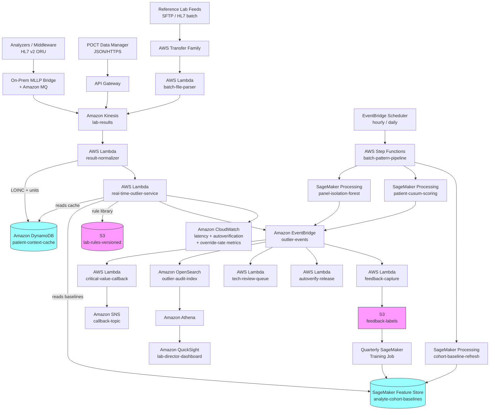

# Recipe 3.5 Architecture and Implementation: Lab Result Outlier Detection

*Companion to [Recipe 3.5: Lab Result Outlier Detection](chapter03.05-lab-result-outlier-detection). This page covers the AWS architecture, services, prerequisites, and pseudocode. For the problem framing and the conceptual approach, start with the main recipe.*

---

## The AWS Implementation

### Why These Services

**Amazon Kinesis Data Streams for the result feed.** The result ingest pipeline accepts HL7 ORU messages (from the LIS), JSON payloads (from POCT data managers), and batch file feeds (from reference labs) with different throughput profiles. Kinesis provides durable, ordered event streams with multi-consumer fan-out, which matters because the same result gets read by the real-time outlier service, the batch cohort pipelines, and the audit archive. HIPAA-eligible under the BAA.

**Amazon MQ for HL7 v2 ingress.** LIS-to-AWS integration usually uses MLLP (Minimal Lower Layer Protocol) over TCP. An on-premises MLLP listener (Mirth Connect, Rhapsody, Corepoint, or a simple listener built on the HL7 libraries) republishes to Amazon MQ (ActiveMQ) or to a Kinesis-backed ingress Lambda. ActiveMQ is the common bridge because most integration engines have pre-built ActiveMQ connectors.
<!-- TODO (TechEditor → TechWriter): Expert review S4 requested explicit MLLP-over-TLS posture: wrap MLLP in TLS with mutual TLS authentication, deploy the listener in a DMZ rather than on the clinical network, prefer Direct Connect over Site-to-Site VPN for production volumes, and authenticate the MQ broker via mutual TLS or short-lived IAM-derived tokens rather than long-lived shared secrets. Add a one-paragraph note to this section. -->

**AWS Lambda for the real-time outlier service.** The hot path (rule evaluation, patient-context cache lookup, delta-check computation, specimen-quality fusion, severity tiering) needs to complete in tens to low hundreds of milliseconds because autoverification and callback timing depend on it. A Kinesis-triggered Lambda fits this profile. Keep it thin; offload heavy statistical work to async downstream steps.

**Amazon DynamoDB for the patient-context cache and patient-history store.** Low-latency key-value reads. The cache is keyed by patient ID and stores demographics, pregnancy status, active problems, active meds, and (via a separate item) the recent-results map per analyte. The recent-results data supports delta checks and rolling-mean computations without hitting the LIS for every incoming result. HIPAA-eligible under the BAA with customer-managed KMS.

**Amazon SageMaker Feature Store for analyte-cohort baselines.** Population reference statistics (robust median, MAD, percentiles) per analyte per cohort live here with point-in-time correctness. The real-time Lambda queries the online store; the retraining jobs use the offline store for historical cohort reconstruction. HIPAA-eligible.

**Amazon SageMaker Processing for batch pattern work.** Isolation Forest scoring on panels, CUSUM computation on patient time series, cohort baseline recomputation all run in containerized scikit-learn scripts on SageMaker Processing, scheduled by Step Functions. For the supervised artifact classifier, SageMaker built-in XGBoost is the default.

**Amazon S3 with AWS KMS.** Raw result archive (HL7 ORU as parsed JSON, POCT payloads as-is), panel-level Parquet for batch analysis, model artifacts, labels parquet from feedback capture. Customer-managed KMS on everything. Lifecycle to Glacier for long-term retention (state regulations and CLIA retention vary; 2 years minimum under CLIA for most records, 10+ years for some specialty lab records).

**Amazon OpenSearch Service for the outlier index and audit.** Every flag produced gets indexed. The lab director dashboards, pathologist review interfaces, and the audit team queries all read from OpenSearch. Fine-grained access control matters because pathology, laboratory QA, and IT compliance need different slices.

**Amazon EventBridge for routing flags.** Flags fan out via EventBridge rather than hard-coded integrations. Subscribers include the critical-value callback service, the tech-review queue service, the autoverification release service, the audit logger, the metrics aggregator, and the feedback-capture service.

**Amazon SNS and Amazon Pinpoint for alert delivery.** Critical-value callbacks usually route through an existing callback platform (Vocera, TigerConnect, a custom service) over an SNS topic. Less-urgent flags go to email or the lab tech review application. Pinpoint handles patient-facing outreach when a patient-reported outpatient test result (home A1C, home INR) looks anomalous.

**Amazon Step Functions for orchestration.** The batch pipelines (hourly panel Isolation Forest scoring, daily cohort baseline recomputation, weekly retraining, daily reference-range validation) are multi-step workflows. State machines provide the retry, timeout, and visibility semantics that multi-step pipelines need.

**Amazon Comprehend Medical for clinical context extraction.** When the patient's chart has recent free-text clinical notes, Comprehend Medical extracts diagnoses, medications, and symptoms to attach to the patient-context cache. Used sparingly (extract-once-and-cache) because per-page cost adds up at lab-data volumes.

**Amazon Bedrock for LLM-assisted interpretation (optional, advanced).** For results that have been flagged by the statistical layers, a HIPAA-eligible LLM can read the patient's clinical context and the flagged result together and produce a triage recommendation (likely artifact given specimen quality; likely real given clinical picture; insufficient evidence). Not a primary detector; a triage accelerator for the review queue. <!-- TODO (TechWriter): as specific validated patterns for LLM-assisted clinical result interpretation become published, expand with concrete references. Production adoption is early as of this writing. -->
<!-- TODO (TechEditor → TechWriter): Expert review S5 requested a BAA-discipline forward reference matching the chapter-2 generative AI recipes. Specifically: name that Amazon foundation models on Bedrock are HIPAA-eligible under the BAA but third-party models on Bedrock have differing BAA postures and require separate review; require minimum-necessary prompt construction (relevant note excerpts, flagged result, active medication and problem lists only; not the full chart); require output filtering for clinical-recommendation hallucinations; require full prompt-and-response audit trail tied to the triage decision. Cross-link to chapter-2 recipes that established this pattern. -->

**Amazon QuickSight for lab operations dashboards.** Autoverification rate by analyte, critical-value callback volume and compliance, delta-check override rates, specimen-rejection trends, analyzer-specific drift metrics. QuickSight on top of Athena over S3 plus OpenSearch queries. HIPAA-eligible.

**AWS CloudTrail and Amazon CloudWatch.** CloudTrail data events on PHI-bearing stores. CloudWatch dashboards for pipeline health, alert latency (especially the critical-value callback timing), autoverification rate, and rule-level override rates. Drift on the core metrics (a sudden drop in autoverification rate, a climb in specimen-rejection rate) triggers on-call attention.

### Architecture Diagram



<!-- TODO (TechEditor → TechWriter): Expert review A2 (MEDIUM) flagged the absence of DLQ / poison-message handling. For an autoverification-gating system, a dropped real-time event = a result released to chart without an outlier check, which is the failure mode the entire pipeline is designed to prevent. Add three SQS DLQs to the diagram (`result-normalizer-dlq`, `real-time-outlier-service-dlq`, `feedback-capture-dlq`) configured as Lambda OnFailure destinations. Add a Prerequisites note: CloudWatch alarms on DLQ depth (alarm threshold 1 for the real-time path because a single dropped result is a CLIA-audit-trail event); replay events from DLQ after fixing the root cause; for events older than the autoverification window or critical-callback window, escalate to laboratory-director review rather than auto-replay because the release decision and callback timing have already been made. Add a "DLQ and replay" bullet to "Why This Isn't Production-Ready" tying the discipline to the existing disaster-recovery paragraph. -->

### Prerequisites

| Requirement | Details |
|-------------|---------|
| **AWS Services** | Amazon Kinesis Data Streams, Amazon MQ, API Gateway, AWS Transfer Family, AWS Lambda, Amazon DynamoDB, Amazon SageMaker (Processing, Training, Feature Store), Amazon OpenSearch Service, Amazon S3, AWS Step Functions, Amazon EventBridge, Amazon SNS, Amazon Pinpoint, Amazon Comprehend Medical, Amazon Bedrock (optional), Amazon QuickSight, AWS KMS, Amazon CloudWatch, AWS CloudTrail. |
| **IAM Permissions** | Least-privilege per role. Real-time outlier Lambda: `dynamodb:GetItem` on patient-context-cache, `sagemaker-featurestore-runtime:GetRecord` on analyte-cohort-baselines, `s3:GetObject` on lab-rules bucket, `events:PutEvents` to the outlier-events bus, `kinesis:GetRecords`. Result normalizer Lambda: `kinesis:GetRecords`, `dynamodb:PutItem`. Callback Lambda: `sns:Publish` only on the callback topic. Batch pipelines scoped to specific S3 prefixes. No `*` actions in production. |
| **BAA** | AWS BAA signed. Every service above is HIPAA-eligible under the BAA when configured properly. See the [AWS HIPAA Eligible Services Reference](https://aws.amazon.com/compliance/hipaa-eligible-services-reference/). |
| **Encryption** | S3: SSE-KMS with customer-managed keys. DynamoDB: encryption at rest with CMK. Kinesis: SSE with CMK. OpenSearch: at rest and in transit. SageMaker: KMS on volumes, model artifacts, Feature Store. TLS 1.2 or higher in transit everywhere. |
| **VPC** | Production: Lambdas, SageMaker jobs, and OpenSearch in a VPC with VPC endpoints for S3, DynamoDB, Kinesis, SageMaker runtime, Comprehend Medical, Bedrock, and KMS. No public endpoints on OpenSearch. |
| **CloudTrail** | Enabled with data events on patient-context-cache, lab-rules bucket, feedback-labels bucket, OpenSearch domain operations, and the critical-value callback topic. Every flag decision and every callback is audit-logged. |
<!-- TODO (TechEditor → TechWriter): Expert review N2 requested explicit VPC Flow Logs requirement on the VPC carrying Lambda, SageMaker, and OpenSearch traffic, with logs delivered to a dedicated S3 bucket with KMS encryption and retention aligned to the deepest applicable retention requirement (CLIA 2-year minimum, 5-year for blood bank, longer in many states for pathology and sentinel-event-related records). Add to either VPC row or CloudTrail row. -->
<!-- TODO (TechEditor → TechWriter): Expert review N1 requested VPC endpoint precision in the VPC row above. Replace the current generic list with explicit per-endpoint identifiers: Gateway endpoints `s3`, `dynamodb`; Interface endpoints `kinesis`, `sagemaker.api`, `sagemaker.featurestore-runtime`, `sagemaker.runtime`, `states`, `events`, `scheduler`, `logs`, `monitoring`, `kms`, `sns`, `bedrock-runtime`, `comprehendmedical`. Note OpenSearch and any graph extensions (Neptune) accessible only via VPC; Pinpoint reached via its regional endpoint through the Lambda's egress path. -->
<!-- TODO (TechEditor → TechWriter): Expert review S3 requested per-consumer IAM scoping in the IAM row above for shared resources (patient-context cache, outlier-events bus). Add explicit per-role examples covering the cache-refresher Lambda (write-only on cache, kinesis:GetRecords on the EHR event stream), the autoverify-release Lambda (consume from bus + write to LIS-EHR bridge, no broader EHR access), and the feedback-capture Lambda (write to labels store and feedback bus only; no events:PutEvents because it consumes events rather than producing them). -->
<!-- TODO (TechEditor → TechWriter): Expert review S2 requested an explicit "Subgroup data access" row covering read access to demographic attributes (age band, sex, race, ethnicity, preferred language, insurance type), the discipline that race and ethnicity data may be governed differently from clinical PHI in some regulatory regimes, restricted read access to the demographic store for retraining and dashboard roles, CloudTrail data events on subgroup queries, and QuickSight queries against an aggregated subgroup-metrics table rather than the raw demographic-joined outlier archive. -->
<!-- TODO (TechEditor → TechWriter): Expert review S6 requested explicit Transfer Family SFTP posture for the reference-lab inbound feed: VPC endpoint (not public) in production, source-IP allowlist for the reference lab's known egress ranges, SSH key authentication with out-of-band public key exchange, customer-managed KMS encryption at rest, CloudTrail data events on every PutObject and GetObject on the reference-lab inbound prefix. Either add to Lab Integration row or add a standalone Transfer Family note in Why-These-Services. -->
| **CLIA and Lab Regulatory** | The pipeline participates in a regulated laboratory workflow. Critical-value callbacks have documented-timing requirements under CLIA and state licensure. Autoverification rules require documented validation per CLSI AUTO10. Changes to rules require laboratory director sign-off. Validation records retained per regulatory retention schedule (minimum 2 years under CLIA; longer in many states). |
| **Clinical Governance** | Lab director signs off on all rule thresholds, severity tier definitions, and callback protocols. Pathology and clinical leadership jointly own the governance of outlier suppression rules (the rules that quiet alerts on patients whose history makes the result unsurprising). Changes logged and periodically reviewed. |
| **Sample Data** | [Synthea](https://github.com/synthetichealth/synthea) generates synthetic lab data with realistic distributions. [MIMIC-IV](https://mimic.mit.edu/) has dense ICU lab data suitable for developing patient-baseline algorithms; access requires PhysioNet credentialing and a data use agreement. [LOINC](https://loinc.org/) is free and essential for normalization prototyping. Never use real PHI in development. |
| **Reference Data** | LOINC (free from Regenstrief Institute) for test identification. Reference ranges from the lab's validated sources (instrument inserts, validation studies, published consensus). An analyte metadata table (canonical unit, expected stability, delta-check thresholds, specimen-quality sensitivity) maintained jointly by the lab and the analytics team. |
| **Lab Integration** | LIS system (Cerner Millennium, Epic Beaker, Sunquest, SoftLab, Orchard, others) producing HL7 v2 ORU messages or FHIR DiagnosticReport/Observation resources. Middleware (Data Innovations, Beckman, Sysmex Caresphere) that captures and forwards specimen-quality indices. POCT data manager integration if POCT is in scope. |
| **Retention** | CLIA baseline is 2 years for most records, 5 years for blood bank. State regulations often extend this (5-10 years common). Pathology reports often 20 years or longer. Confirm retention schedule with legal and compliance before production. |
| **Cost Estimate** | For a mid-size hospital lab (say, 3 million results per year, including chemistry, hematology, immunology, microbiology culture results): Kinesis and Lambda real-time path: ~$150-400/month. DynamoDB patient-context cache: ~$80-250/month. SageMaker Feature Store: ~$30-90/month. SageMaker Processing: ~$200-500/month for batch scoring. OpenSearch outlier index: ~$300-700/month. Comprehend Medical and optional Bedrock: usage-dependent, typically $100-600/month. Total infrastructure: typically $1,200-3,500/month. Compare to cost avoidance: pre-analytical error recollections cost $10-50 per event in supplies and labor plus the unmeasurable clinical-workflow cost, and sentinel-event-level errors from a missed critical value have costs that dwarf the infrastructure. <!-- TODO (TechWriter): confirm current published estimates of lab pre-analytical error costs. CAP and the Institute for Quality in Laboratory Medicine have published some estimates; verify before citing specifics. --> |

### Ingredients

| AWS Service | Role |
|------------|------|
| **Amazon Kinesis Data Streams** | Durable, multi-consumer event stream for incoming lab results |
| **Amazon MQ** | HL7 v2 MLLP ingress bridge from on-prem LIS integration engines |
| **Amazon API Gateway** | POCT data manager webhook ingress |
| **AWS Transfer Family** | SFTP endpoint for reference lab batch file feeds |
| **AWS Lambda (result-normalizer)** | LOINC mapping, unit harmonization, reference-range attachment, specimen-quality index capture |
| **AWS Lambda (real-time-outlier-service)** | Rule screening, delta checks, robust z-score lookup, specimen-quality fusion, severity tiering |
| **AWS Lambda (critical-value-callback)** | CLIA-compliant callback workflow with timing and read-back tracking |
| **AWS Lambda (tech-review-queue)** | Hold-for-review routing with priority queue semantics |
| **AWS Lambda (autoverify-release)** | Autoverified result release to the LIS-to-EHR bridge |
| **AWS Lambda (feedback-capture)** | Tech override reasons, recollect outcomes, confirmed artifact linkage |
| **Amazon DynamoDB (patient-context-cache)** | Low-latency patient attribute reads including recent-results map |
| **Amazon SageMaker Feature Store** | Analyte-cohort baseline statistics with point-in-time correctness |
| **Amazon SageMaker Processing** | Panel Isolation Forest, patient CUSUM, cohort baseline refresh |
| **Amazon SageMaker Training** | Supervised artifact classifier retraining when feedback labels accumulate |
| **Amazon OpenSearch Service** | Outlier flag index for lab director and pathologist dashboards |
| **Amazon S3 (lab-rules)** | Versioned rule library with reference-range source tracking |
| **Amazon S3 (result-archive)** | Long-term raw and normalized result archive |
| **Amazon S3 (feedback-labels)** | Tech overrides, recollect outcomes, confirmed artifact events for retraining |
| **AWS Step Functions** | Orchestrates batch pattern pipelines and retraining workflows |
| **Amazon EventBridge** | Decouples outlier detection from callback, review, autoverify, audit, and feedback |
| **Amazon SNS** | Critical-value callback delivery to paging and messaging platforms |
| **Amazon Pinpoint** | Patient-facing outreach for outpatient self-test outliers (home A1C, home INR) |
| **Amazon Comprehend Medical** | Clinical entity extraction from notes for patient context |
| **Amazon Bedrock (optional)** | LLM-assisted clinical interpretation for flagged results in the review queue |
| **Amazon QuickSight** | Lab operations dashboards (autoverification rate, override rates, drift) |
| **AWS KMS** | Customer-managed keys for every PHI-bearing store |
| **Amazon CloudWatch** | Real-time latency, alert volume, autoverification rate, drift metrics |
| **AWS CloudTrail** | Audit logging on every PHI-bearing store, rule changes, and callback actions |

---

### Code

> **Reference implementations:** These aws-samples repositories demonstrate patterns that apply here:
> - [`amazon-sagemaker-examples`](https://github.com/aws/amazon-sagemaker-examples): Isolation Forest and Random Cut Forest patterns applicable to panel-level multivariate anomaly detection; Feature Store integration examples that match the analyte-cohort baseline architecture.
> - [`aws-samples`](https://github.com/aws-samples): search for "healthcare," "hl7," and "fhir" for adjacent LIS integration patterns.
> <!-- TODO (TechWriter): verify and add a specific aws-samples or aws-solutions-library-samples repository demonstrating laboratory analytics or clinical decision support for lab results. A direct match has not been confirmed at the time of writing. -->

#### Walkthrough

**Step 1: Normalize the incoming result.** Whether the result came from the LIS as an HL7 ORU, from a POCT data manager as JSON, or from a reference lab as a batch file row, the first job is to produce a canonical representation keyed on LOINC with harmonized units and attached specimen-quality indices. Skipping this step means downstream detectors treat "glucose 110 mg/dL" and "glucose 6.1 mmol/L" as different analytes.

```
FUNCTION normalize_result(raw_result):
    // Map the test identifier to LOINC. The mapping crosswalk is maintained
    // in a versioned reference file; unknown identifiers go to a dead-letter
    // queue for curation rather than being silently dropped.
    loinc_code = null
    IF raw_result.has("loinc"):
        loinc_code = raw_result.loinc
    ELSE IF raw_result.has("lis_test_code"):
        loinc_code = lis_to_loinc_crosswalk.lookup(raw_result.lis_test_code, analyzer = raw_result.analyzer)

    IF loinc_code == null:
        emit_metric("unmapped_test", 1, dimensions = { analyzer: raw_result.analyzer })
        route_to_dead_letter_queue(raw_result, reason = "loinc_unresolved")
        return null

    // Canonical unit harmonization. The analyte metadata table defines the
    // canonical unit per LOINC (e.g., mg/dL for glucose in the US; SI units
    // for markets where that's the convention). Convert reported value to
    // canonical form; preserve the original for audit.
    analyte_meta = analyte_metadata.get(loinc_code)
    canonical_value = convert_units(raw_result.value, raw_result.unit, analyte_meta.canonical_unit)

    // Capture specimen quality indices from the analyzer payload. These are
    // the indicators that make many apparent outliers explainable.
    specimen_quality = {
        hemolysis_index:  raw_result.get("hemolysis_index"),
        icterus_index:    raw_result.get("icterus_index"),
        lipemia_index:    raw_result.get("lipemia_index"),
        clot_detected:    raw_result.get("clot_detected"),
        qns_flag:         raw_result.get("qns_flag"),
        short_sample:     raw_result.get("short_sample"),
        collection_site:  raw_result.get("collection_site"),   // "peripheral" | "central_line" | "arterial"
        transport_delay_minutes: compute_transport_delay(raw_result)
    }

    // Resolve to enterprise patient ID. This is the same master-patient-index
    // join that appears everywhere else; getting it wrong produces the worst
    // possible outcome (result attached to the wrong patient).
    patient_id = patient_master.resolve(
        mrn           = raw_result.patient_mrn,
        source_system = raw_result.source
    )

    // Reference range attachment is patient-aware: age, sex, and pregnancy
    // status drive the selection. Method and analyzer also matter because
    // different methods have different ranges.
    reference_range = reference_range_library.get(
        loinc_code = loinc_code,
        method     = raw_result.method,
        analyzer   = raw_result.analyzer,
        patient_attributes = patient_context_attributes_for_range_selection(patient_id)
    )

    canonical_result = {
        event_id:         generate_event_id(),
        source_event_id:  raw_result.source_event_id,
        source:           raw_result.source,       // "lis" | "poct" | "reference_lab"
        analyzer:         raw_result.analyzer,
        method:           raw_result.method,
        patient_id:       patient_id,
        loinc_code:       loinc_code,
        loinc_display:    analyte_meta.display_name,
        value:            canonical_value.value,
        unit:             canonical_value.unit,
        reference_range:  reference_range,
        reference_range_version: reference_range.version,
        specimen_quality: specimen_quality,
        collected_at:     raw_result.collected_at,
        resulted_at:      raw_result.resulted_at,
        accession:        raw_result.accession,
        raw:              {
            reported_value: raw_result.value,
            reported_unit:  raw_result.unit,
            test_code:      raw_result.get("lis_test_code")
        }
    }
    return canonical_result
```

**Step 2: Join patient context and pull recent-history data.** Delta checks and patient-baseline z-scores need the patient's recent results for this analyte. Pull from the patient-context cache; fall back to a cache miss refresh from DynamoDB or the LIS only when necessary.

```
FUNCTION enrich_with_patient_context(canonical_result):
    context = DynamoDB.GetItem("patient-context-cache", { patient_id: canonical_result.patient_id })

    // Look up the patient's recent results for this analyte. The cache stores
    // a rolling window (last 30 days for acute-care analytes, longer for
    // chronic markers like A1C). Fall through to LIS query only on cache miss,
    // because the latency impact of an LIS query is substantial.
    recent_results = context.recent_results.get(canonical_result.loinc_code, [])

    // Compute patient-baseline statistics on the fly if not pre-computed.
    baseline_stats = null
    IF length(recent_results) >= MIN_HISTORY_FOR_BASELINE:
        values = [r.value for r in recent_results]
        baseline_stats = {
            median: median(values),
            mad:    median_absolute_deviation(values),
            min:    min(values),
            max:    max(values),
            trend_slope: compute_trend_slope(recent_results),
            sample_size: length(values),
            earliest_observed_at: min(r.resulted_at for r in recent_results),
            latest_observed_at:   max(r.resulted_at for r in recent_results)
        }

    // Most recent prior result is the input for the delta check.
    previous_result = null
    IF length(recent_results) > 0:
        previous_result = max_by(recent_results, r.resulted_at)

    enriched = canonical_result.copy()
    enriched.patient_attributes = {
        age_years:         context.age_years,
        sex:               context.sex,
        pregnancy_status:  context.pregnancy_status,
        active_problems:   context.active_problems,         // list of ICD-10 codes
        active_medications: context.active_medications,     // list of RxNorm IDs
        on_dialysis:       context.is_on_dialysis,
        acuity:            context.acuity,
        location:          context.unit
    }
    enriched.recent_results     = recent_results
    enriched.previous_result    = previous_result
    enriched.baseline_stats     = baseline_stats

    return enriched
```

**Step 3: Apply the rule engine (critical values, reference range, specimen quality).** Every enriched result goes through the rule engine first. Critical value rules are the regulatory floor; they always fire when threshold is crossed. Reference range checks produce the low-/high-abnormal flag that's a standard part of the lab report. Specimen quality rules identify results where the specimen itself invalidates or calls into question the value.

```
FUNCTION rule_screen(enriched_result):
    flags = []
    rules = lab_rules.get_active_rules_for_loinc(enriched_result.loinc_code)

    FOR each rule in rules:
        CASE rule.type:

            "critical_value":
                // Critical value rules are regulatory-required. They always fire.
                IF rule.applies_to_patient(enriched_result.patient_attributes):
                    IF rule.direction == "high" AND enriched_result.value >= rule.threshold:
                        flags.append({
                            rule_id:    rule.id,
                            rule_type:  "critical_value_high",
                            severity:   "critical_callback",   // CLIA-regulated callback required
                            value:      enriched_result.value,
                            threshold:  rule.threshold,
                            message:    rule.message,
                            reference:  rule.reference_source
                        })
                    ELSE IF rule.direction == "low" AND enriched_result.value <= rule.threshold:
                        flags.append({
                            rule_id:    rule.id,
                            rule_type:  "critical_value_low",
                            severity:   "critical_callback",
                            value:      enriched_result.value,
                            threshold:  rule.threshold,
                            message:    rule.message,
                            reference:  rule.reference_source
                        })

            "reference_range":
                IF enriched_result.value < enriched_result.reference_range.low:
                    flags.append({
                        rule_id:    rule.id,
                        rule_type:  "below_reference_range",
                        severity:   "informational",
                        value:      enriched_result.value,
                        range:      enriched_result.reference_range,
                        message:    f"Result below reference range ({enriched_result.reference_range.low}-{enriched_result.reference_range.high})"
                    })
                ELSE IF enriched_result.value > enriched_result.reference_range.high:
                    flags.append({
                        rule_id:    rule.id,
                        rule_type:  "above_reference_range",
                        severity:   "informational",
                        value:      enriched_result.value,
                        range:      enriched_result.reference_range,
                        message:    f"Result above reference range ({enriched_result.reference_range.low}-{enriched_result.reference_range.high})"
                    })

            "specimen_quality_gate":
                // Specimen quality rules identify results that are likely artifactual.
                // Example: potassium with hemolysis index above the analyte-specific threshold.
                IF rule.quality_index_name == "hemolysis_index" \
                   AND enriched_result.specimen_quality.hemolysis_index >= rule.threshold:
                    flags.append({
                        rule_id:    rule.id,
                        rule_type:  "specimen_quality_invalidating",
                        severity:   "tech_review_hold",
                        quality_index: "hemolysis_index",
                        quality_value: enriched_result.specimen_quality.hemolysis_index,
                        threshold:    rule.threshold,
                        message:      f"Hemolysis index {enriched_result.specimen_quality.hemolysis_index} above {rule.threshold}; {enriched_result.loinc_display} likely artifactual",
                        recommended_action: rule.recommended_action     // "recollect" | "note_and_hold" | "suppress"
                    })

                // Similar rules for icterus, lipemia, clot detection, QNS, short sample.

            "collection_site_gate":
                // Some analytes should not be drawn from certain sites.
                // Example: potassium drawn above an IV with dextrose running.
                IF rule.prohibited_site == enriched_result.specimen_quality.collection_site:
                    flags.append({
                        rule_id:    rule.id,
                        rule_type:  "prohibited_collection_site",
                        severity:   "tech_review_hold",
                        collection_site: enriched_result.specimen_quality.collection_site,
                        message:         rule.message
                    })

    return flags
```

**Step 4: Delta check and patient-baseline z-score.** The patient-specific checks run next. These are the detectors that catch real clinical changes and suspicious non-clinical changes.

<!-- TODO (TechEditor → TechWriter): Expert review A3 (MEDIUM) flagged a prose-vs-pseudocode asymmetry: the Technology section's Method-specific ranges paragraph and the Why-This-Isn't-Production-Ready Method/reagent-change paragraph both name method/reagent change suppression as a first-class concern, but Step 4's patient_baseline_checks below performs the delta check without comparing the `method` field between current and previous results. A reader implementing the pseudocode produces false delta-check flags every time a patient's labs cross analyzer methods (a routine occurrence: dual-platform central labs, satellite labs, analyzer-downtime re-routing). Add a method-comparison branch before the absolute-delta computation: if methods differ and analyte_metadata has no documented method_harmonization coefficient, emit a `delta_suppressed_method_change` metric and skip the absolute-delta check (the patient-history z-score remains valid because it uses the patient's full distribution); if a harmonization coefficient exists, apply it to the previous value before computing the delta. Also add a paragraph to General Architecture Pattern's Patient-baseline path subsection naming method-harmonization as a first-class concern. -->

```
FUNCTION patient_baseline_checks(enriched_result):
    flags = []

    // Delta check: compare to the most recent prior result within the window.
    IF enriched_result.previous_result is not null:
        time_delta_hours = hours_between(enriched_result.previous_result.resulted_at, enriched_result.resulted_at)
        analyte_meta = analyte_metadata.get(enriched_result.loinc_code)

        IF time_delta_hours <= analyte_meta.delta_check_window_hours:
            absolute_delta = enriched_result.value - enriched_result.previous_result.value
            percent_delta  = (absolute_delta / enriched_result.previous_result.value) * 100 if enriched_result.previous_result.value != 0 else null

            // Delta thresholds are analyte-specific and patient-aware.
            // A 2 g/dL hemoglobin drop is significant in anyone; the same drop
            // in a patient with sickle cell disease on chronic transfusion may
            // be within expected range. Analyte metadata includes the context
            // rules that modulate the default thresholds.
            effective_thresholds = analyte_meta.delta_thresholds.for_patient(enriched_result.patient_attributes)

            IF abs(absolute_delta) >= effective_thresholds.absolute \
               OR (percent_delta is not null AND abs(percent_delta) >= effective_thresholds.percent):
                flags.append({
                    rule_type:  "delta_check_failure",
                    severity:   delta_severity(enriched_result, absolute_delta, percent_delta),
                    absolute_delta: absolute_delta,
                    percent_delta:  percent_delta,
                    previous_value: enriched_result.previous_result.value,
                    previous_resulted_at: enriched_result.previous_result.resulted_at,
                    hours_between_results: time_delta_hours,
                    message: build_delta_message(enriched_result, absolute_delta, percent_delta)
                })

    // Patient-history robust z-score. Requires enough prior data to be stable.
    IF enriched_result.baseline_stats is not null AND enriched_result.baseline_stats.mad > 0:
        robust_z = (enriched_result.value - enriched_result.baseline_stats.median) / (1.4826 * enriched_result.baseline_stats.mad)

        IF abs(robust_z) >= PATIENT_ZSCORE_THRESHOLD:       // e.g., 3.0
            flags.append({
                rule_type:  "patient_history_zscore",
                severity:   zscore_severity(robust_z),
                robust_z:   robust_z,
                patient_median: enriched_result.baseline_stats.median,
                patient_mad:    enriched_result.baseline_stats.mad,
                history_size:   enriched_result.baseline_stats.sample_size,
                message: build_baseline_message(enriched_result, robust_z)
            })

    return flags
```

**Step 5: Cohort (population) z-score.** When the patient baseline is unavailable or too thin, compare against the population cohort baseline from the Feature Store.

```
FUNCTION cohort_zscore_check(enriched_result):
    flags = []

    // Cohort selection: age band, sex, pregnancy, core clinical attributes.
    cohort_key = build_cohort_key(
        loinc_code:        enriched_result.loinc_code,
        age_band:          age_to_band(enriched_result.patient_attributes.age_years),
        sex:               enriched_result.patient_attributes.sex,
        pregnancy_status:  enriched_result.patient_attributes.pregnancy_status,
        on_dialysis:       enriched_result.patient_attributes.on_dialysis
    )

    baseline = FeatureStore.GetRecord(
        feature_group = "analyte-cohort-baselines",
        record_id     = cohort_key
    )

    IF baseline is null or baseline.sample_size < MIN_COHORT_SIZE:
        return flags

    IF baseline.mad > 0:
        robust_z = (enriched_result.value - baseline.median) / (1.4826 * baseline.mad)
        IF abs(robust_z) >= COHORT_ZSCORE_THRESHOLD:
            flags.append({
                rule_type:  "cohort_zscore",
                severity:   zscore_severity(robust_z),
                robust_z:   robust_z,
                cohort_key: cohort_key,
                cohort_median: baseline.median,
                cohort_mad:    baseline.mad,
                cohort_sample_size: baseline.sample_size,
                message:    f"Value {enriched_result.value} at cohort robust z {robust_z:.2f}"
            })

    return flags
```

**Step 6: Aggregate flags, determine severity, and route.** Combine flags from all paths. Determine overall routing based on the highest-severity flag and the combination of flag types (a critical value combined with an invalidating specimen quality index routes differently from a critical value with clean specimen quality).

<!-- TODO (TechEditor → TechWriter): Expert review A6 (MEDIUM) flagged a CLIA audit-trail discipline gap: Step 1 correctly captures `reference_range_version` on the canonical_result, but Step 6 below drops it from the outlier_event construction. The OpenSearch index that drives lab director and pathologist dashboards therefore does not store the range version that was in force at flag-firing time. Add `reference_range_version`, `rule_library_version`, `analyte_metadata_version`, and `method` fields to the outlier_event dict below. The Honest Take's framing ("audit trails that don't record which range was in force for a given alert are not audit trails; they're wishes") is the right teaching; the pseudocode just needs to reflect it. -->

<!-- TODO (TechEditor → TechWriter): Expert review A7 (LOW) flagged that the `determine_routing(all_flags)` call below is opaque. Three different severity vocabularies appear in the pseudocode without an explicit mapping (flag-level "critical_callback"/"informational"/"tech_review_hold"/"synchronous"; routing-level "autoverify_with_flag"/"critical_callback"/"tech_review_hold"/"recollect_requested"). Either provide an explicit `determine_routing` body, or add a precedence-rules paragraph to General Architecture Pattern's "Flag aggregator and severity tiering" subsection naming the rules: critical-callback always fires; specimen-quality-invalidating + critical = callback-with-recollect-context; specimen-quality-invalidating alone = tech-review-hold; delta or z-score with no specimen-quality concerns and no critical = autoverify-with-flag. -->

<!-- TODO (TechEditor → TechWriter): Expert review A5 (MEDIUM) and S1 (MEDIUM) both target the "critical_callback" branch below. A5: the prose says CLIA critical-callbacks are "40% of the engineering effort in the critical-path part of the pipeline" with timing, read-back, escalation, and documented manual fallback, but the pseudocode is a single SNS.Publish. Expand the branch to demonstrate the workflow primitives (callback_id, DynamoDB callback-records store with state ∈ {initiated, acknowledged, read-back-captured, closed}, EventBridge Scheduler escalation timer firing at the window boundary, fallback-to-manual-phone-call documentation), or add an explicit pointer to a state diagram in the General Architecture Pattern's Routing subsection. S1: the SNS message construction is unspecified; for the chapter-3-settled minimum-PHI convention (events carry event_id only and the callback service fetches by ID), the pseudocode should publish only event_id, severity, and fetch_by_id with a minimal location attribute. For high-stigma test classes (HIV viral load LOINC 20447-9, hepatitis C viral load LOINC 20416-4, syphilis serology, drug-of-abuse panels, lithium and other psychiatric medication levels, gender-affirming hormone monitoring), exclude the LOINC display name from the notification subject so it does not render on a recipient's lock screen. Add a Why-These-Services SNS note naming the convention. -->

```
FUNCTION route_result(enriched_result, all_flags):
    IF length(all_flags) == 0:
        // No flags, no delta, specimen quality clean, in reference range.
        // Autoverify and release.
        autoverify_release(enriched_result)
        OpenSearch.Index("result-audit", enriched_result)
        return

    // Determine overall routing.
    routing = determine_routing(all_flags)
    // routing: "autoverify_with_flag" | "critical_callback" |
    //          "tech_review_hold" | "recollect_requested"

    outlier_event = {
        event_id:            enriched_result.event_id,
        patient_id:          enriched_result.patient_id,
        loinc_code:          enriched_result.loinc_code,
        loinc_display:       enriched_result.loinc_display,
        value:               enriched_result.value,
        unit:                enriched_result.unit,
        resulted_at:         enriched_result.resulted_at,
        accession:           enriched_result.accession,
        flags:               all_flags,
        specimen_quality:    enriched_result.specimen_quality,
        patient_context_summary: summary_of(enriched_result.patient_attributes),
        previous_result:     enriched_result.previous_result,
        routing:             routing,
        detected_at:         NOW()
    }

    EventBridge.PutEvent(
        bus     = "lab-outlier-events",
        detail  = outlier_event,
        source  = "lab-outlier-service",
        detail_type = f"LabOutlier.{routing}"
    )

    OpenSearch.Index("lab-outliers", outlier_event)

    CASE routing:
        "critical_callback":
            // CLIA-regulated callback. The callback service owns timing,
            // read-back, and documentation. Critical values are still
            // released to the chart; the callback is the separate
            // notification workflow.
            SNS.Publish(
                topic   = CRITICAL_CALLBACK_TOPIC,
                message = build_callback_payload(outlier_event)
            )
            autoverify_release(enriched_result, with_flag = "critical_value")

        "tech_review_hold":
            // Hold the result from release to the chart until a tech reviews.
            hold_for_tech_review(enriched_result, outlier_event)

        "recollect_requested":
            // Hold and request a new specimen.
            hold_for_tech_review(enriched_result, outlier_event, request_recollect = True)

        "autoverify_with_flag":
            // Release to chart with an attached informational flag.
            autoverify_release(enriched_result, with_flag = routing_to_chart_flag(all_flags))
```

**Step 7: Run the panel-level multivariate check and patient trajectory analytics.** Panel-level Isolation Forest runs when all components of a multi-analyte panel are available. Patient-trajectory CUSUM and change-point detection run on a scheduled cadence for patients with dense chronic-monitoring data.

<!-- TODO (TechEditor → TechWriter): Expert review A4 (MEDIUM) flagged that The Honest Take elevates cross-test coherence rules to "one of the most reliable layers in the pipeline" but Step 7 below shows only the panel-level Isolation Forest. A reader following the pseudocode walkthrough does not see how to encode anion-gap plausibility (Na - Cl - HCO3, expected 8-16 mEq/L), hemoglobin/hematocrit 3:1 ratio, TSH/free-T4 consistency, or bilirubin-fraction summing as concrete rules. Add a `panel_coherence_check(panel)` function that runs before the panel multivariate check; both contribute flags to panel-level routing. Both demonstrate the "rules + statistical + multivariate" layered detection pattern named in the Statistical Methods subsection. -->

```
FUNCTION panel_multivariate_check(panel):
    // A panel is a set of related results from the same specimen
    // (e.g., basic metabolic panel: Na, K, Cl, CO2, BUN, creatinine, glucose, Ca).
    // When all components are present, build the multivariate feature vector.
    panel_vector = build_panel_vector(panel)

    // Patient context becomes features too.
    context_features = patient_context_to_features(panel.patient_attributes)
    feature_vector = concatenate(panel_vector, context_features)

    // Score against the Isolation Forest trained on the patient's cohort.
    if_score = isolation_forest_by_panel.get(panel.panel_id).score(feature_vector)

    IF if_score <= PANEL_ISOLATION_FOREST_THRESHOLD:
        flag = {
            rule_type:       "panel_multivariate_outlier",
            severity:        "tech_review_hold",
            anomaly_score:   if_score,
            top_contributors: shap_explain(isolation_forest_by_panel.get(panel.panel_id), feature_vector, top_k = 5),
            panel:           panel.panel_id,
            message:         f"Panel combination is a multivariate outlier; unusual combination of {top_k_feature_names}"
        }
        EventBridge.PutEvent(
            bus         = "lab-outlier-events",
            source      = "lab-outlier-service",
            detail_type = f"LabOutlier.{flag.severity}",
            detail      = { panel_id: panel.panel_id, flag: flag }
        )

FUNCTION patient_trajectory_scoring(as_of_timestamp):
    // Runs on schedule (hourly for acute care, daily for ambulatory).
    active_patients = get_patients_with_recent_activity(as_of = as_of_timestamp)

    FOR each patient in active_patients:
        FOR each analyte in TREND_MONITORED_ANALYTES:     // creatinine, hemoglobin, TSH, A1C, others
            series = get_analyte_series(patient_id = patient.id, loinc = analyte, window = ANALYTE_TREND_WINDOW[analyte])

            IF length(series) < MIN_SERIES_LENGTH:
                continue

            // CUSUM for sustained shifts.
            cusum = cusum_detect(series, analyte_cusum_params(analyte))

            IF cusum.signal_fired:
                flag = {
                    rule_type:         "patient_trajectory_cusum",
                    severity:          "synchronous",
                    patient_id:        patient.id,
                    loinc_code:        analyte,
                    change_point:      cusum.change_point,
                    pre_change_mean:   cusum.pre_mean,
                    post_change_mean:  cusum.post_mean,
                    shift_magnitude:   cusum.post_mean - cusum.pre_mean,
                    message:           build_trajectory_message(analyte, cusum)
                }
                EventBridge.PutEvent(
                    bus         = "lab-outlier-events",
                    source      = "lab-outlier-service",
                    detail_type = f"LabOutlier.{flag.severity}",
                    detail      = flag
                )
```

**Step 8: Capture feedback and close the loop.** Tech review decisions, recollect outcomes, and critical-value callback responses all get logged and linked back to the original flag. Confirmed artifact events (the recollected specimen showed a clinically different value) become high-value labels for retraining.

<!-- TODO (TechEditor → TechWriter): Expert review A1 (MEDIUM) flagged the recurring trigger-idempotency pattern (now eleven consecutive recipes: 2.4-2.10, 3.1-3.5). EventBridge → Lambda async is at-least-once; the Step 8 handlers below have no idempotency guard. Redelivered events double-count `flag_tech_decision` metrics (which directly drive rule-retirement decisions and can produce missed-future-flags), bias the supervised classifier's training distribution, and corrupt the confirmed-artifact-vs-confirmed-real signal. Add a deterministic event-key derivation (`outlier_event_id + decision` for tech review; `original_outlier_event_id + recollect_accession` for recollects) and a conditional DynamoDB write to a `processed-feedback-events` table with TTL ~90 days, used as a write-once guard before the OpenSearch update, label write, and metric emission. Add a "Trigger idempotency" bullet to "Why This Isn't Production-Ready." Strongly recommend a cookbook-wide trigger-idempotency appendix; with eleven consecutive findings, the per-recipe pattern is producing diminishing returns. -->

```
FUNCTION on_tech_review_decision(decision_event):
    // decision_event: { outlier_event_id, decision, decision_reason, deciding_tech,
    //                   recollect_requested, recollect_accession }
    outlier = OpenSearch.Get("lab-outliers", decision_event.outlier_event_id)
    outlier.tech_review = {
        decision:               decision_event.decision,   // "released_as_is" | "recollected" | "suppressed"
        decision_reason:        decision_event.decision_reason,
        deciding_tech:          decision_event.deciding_tech,
        decided_at:             decision_event.decided_at,
        recollect_requested:    decision_event.recollect_requested,
        recollect_accession:    decision_event.recollect_accession
    }
    OpenSearch.Update("lab-outliers", decision_event.outlier_event_id, outlier)

    FOR each flag in outlier.flags:
        emit_metric("flag_tech_decision", 1, dimensions = {
            rule_type: flag.rule_type,
            decision:  decision_event.decision,
            severity:  flag.severity
        })

FUNCTION on_recollect_result(original_outlier_event_id, recollect_result):
    // When a recollect comes back, compare to the original.
    original = OpenSearch.Get("lab-outliers", original_outlier_event_id)

    value_difference = abs(original.value - recollect_result.value)
    clinically_significant = is_clinically_significant_difference(
        loinc_code = original.loinc_code,
        original_value = original.value,
        recollect_value = recollect_result.value
    )

    IF clinically_significant:
        // The original was likely artifactual; the recollect shows a different
        // reality. Label this as a confirmed artifact event.
        label_row = {
            original_event_id:   original.event_id,
            loinc_code:          original.loinc_code,
            original_value:      original.value,
            recollect_value:     recollect_result.value,
            specimen_quality:    original.specimen_quality,
            patient_context:     original.patient_context_summary,
            flags_that_fired:    original.flags,
            label:               "confirmed_artifact",
            labeled_at:          recollect_result.resulted_at
        }
        S3.PutObject(
            bucket = "lab-outlier-labels",
            key    = date_partitioned_key(recollect_result.resulted_at) + "/" + uuid() + ".parquet",
            body   = parquet_encode([label_row])
        )

    ELSE:
        // Recollect confirmed the original value; the original was real.
        label_row = {
            original_event_id:   original.event_id,
            loinc_code:          original.loinc_code,
            original_value:      original.value,
            recollect_value:     recollect_result.value,
            label:               "confirmed_real",
            labeled_at:          recollect_result.resulted_at
        }
        S3.PutObject(
            bucket = "lab-outlier-labels",
            key    = date_partitioned_key(recollect_result.resulted_at) + "/" + uuid() + ".parquet",
            body   = parquet_encode([label_row])
        )
```

> **Curious how this looks in Python?** The pseudocode above covers the concepts. If you'd like to see sample Python code that demonstrates these patterns using boto3, check out the [Python Example](chapter03.05-python-example). It walks through each step with inline comments and notes on what you'd need to change for a real deployment.

---

### Expected Results

<!-- TODO (TechEditor → TechWriter): Expert review V2 noted the sample timestamps and event IDs use future dates (2026-05-12). They will read as suspiciously specific by publication. Either replace with placeholder patterns ("<draft-time>") or keep as-is. Leaving as illustrative for now; resolve before publication. -->

> Sample timestamps and event IDs in the examples below are illustrative and reflect the draft date. Production output uses real ISO-8601 timestamps from the event handler's invocation time.

**Sample critical-value-with-artifact-context flag:**

```json
{
  "event_id": "LAB-2026-05-12T06:42:11Z-771244",
  "patient_id": "PT-0044221",
  "loinc_code": "2823-3",
  "loinc_display": "Potassium [Moles/volume] in Serum or Plasma",
  "value": 7.8,
  "unit": "mEq/L",
  "resulted_at": "2026-05-12T06:42:11Z",
  "accession": "CHEM-2026-128821",
  "routing": "critical_callback",
  "flags": [
    {
      "rule_id": "CRITICAL_K_HIGH",
      "rule_type": "critical_value_high",
      "severity": "critical_callback",
      "value": 7.8,
      "threshold": 6.5,
      "message": "Potassium 7.8 mEq/L exceeds critical high threshold 6.5 mEq/L"
    },
    {
      "rule_id": "HEMOLYSIS_GATE_K",
      "rule_type": "specimen_quality_invalidating",
      "severity": "tech_review_hold",
      "quality_index": "hemolysis_index",
      "quality_value": 4,
      "threshold": 3,
      "message": "Hemolysis index 4+ above threshold 3 for potassium; result likely artifactual from pseudohyperkalemia",
      "recommended_action": "recollect"
    },
    {
      "rule_type": "delta_check_failure",
      "severity": "synchronous",
      "absolute_delta": 3.6,
      "percent_delta": 85.7,
      "previous_value": 4.2,
      "previous_resulted_at": "2026-05-11T06:15:00Z",
      "hours_between_results": 24.5,
      "message": "Potassium shifted from 4.2 to 7.8 in 24.5 hours, an 85.7% change"
    }
  ],
  "specimen_quality": {
    "hemolysis_index": 4,
    "icterus_index": 1,
    "lipemia_index": 1,
    "clot_detected": false,
    "qns_flag": false,
    "short_sample": false,
    "collection_site": "peripheral",
    "transport_delay_minutes": 92
  },
  "patient_context_summary": {
    "age_years": 74,
    "sex": "M",
    "acuity": "ward",
    "active_problems": ["J18.9 Pneumonia, unspecified", "I10 Essential hypertension"],
    "active_medications_flagged": [],
    "on_dialysis": false
  },
  "previous_result": {
    "value": 4.2,
    "unit": "mEq/L",
    "resulted_at": "2026-05-11T06:15:00Z"
  },
  "interpretation_hint": "Critical value fires; hemolysis index 4+ and transport delay 92 minutes suggest pseudohyperkalemia. Recommend a properly drawn peripheral recollect with immediate transport before treating. Callback must still occur within the CLIA-mandated window; the callback payload includes this artifact context for faster clinical disposition.",
  "detected_at": "2026-05-12T06:42:11.180Z"
}
```

**Sample delta-check flag for clinically meaningful change:**

```json
{
  "event_id": "LAB-2026-05-12T14:30:22Z-812918",
  "patient_id": "PT-0077331",
  "loinc_code": "718-7",
  "loinc_display": "Hemoglobin [Mass/volume] in Blood",
  "value": 8.4,
  "unit": "g/dL",
  "resulted_at": "2026-05-12T14:30:22Z",
  "routing": "autoverify_with_flag",
  "flags": [
    {
      "rule_type": "below_reference_range",
      "severity": "informational",
      "value": 8.4,
      "range": { "low": 11.5, "high": 14.5 },
      "message": "Hemoglobin 8.4 g/dL below reference range 11.5-14.5"
    },
    {
      "rule_type": "delta_check_failure",
      "severity": "synchronous",
      "absolute_delta": -2.8,
      "percent_delta": -25.0,
      "previous_value": 11.2,
      "previous_resulted_at": "2026-05-12T10:00:00Z",
      "hours_between_results": 4.5,
      "message": "Hemoglobin dropped 2.8 g/dL (25%) in 4.5 hours"
    },
    {
      "rule_type": "patient_history_zscore",
      "severity": "synchronous",
      "robust_z": -4.2,
      "patient_median": 11.4,
      "patient_mad": 0.6,
      "history_size": 14,
      "message": "Value 3.7 standard deviations below this patient's historical median of 11.4"
    }
  ],
  "specimen_quality": {
    "hemolysis_index": 0,
    "clot_detected": false,
    "qns_flag": false,
    "collection_site": "peripheral",
    "transport_delay_minutes": 18
  },
  "interpretation_hint": "No specimen quality concerns; delta and patient-baseline z-score consistent with acute blood loss. Patient has an open surgical wound per active problem list. Recommend clinical correlation for potential post-op bleeding.",
  "detected_at": "2026-05-12T14:30:22.450Z"
}
```

**Sample tech-review-hold flag driven by specimen quality:**

```json
{
  "event_id": "LAB-2026-05-12T18:05:41Z-918772",
  "patient_id": "PT-0099402",
  "loinc_code": "2345-7",
  "loinc_display": "Glucose [Mass/volume] in Serum or Plasma",
  "value": 412,
  "unit": "mg/dL",
  "resulted_at": "2026-05-12T18:05:41Z",
  "routing": "tech_review_hold",
  "flags": [
    {
      "rule_type": "above_reference_range",
      "severity": "informational",
      "value": 412,
      "range": { "low": 70, "high": 99 },
      "message": "Glucose 412 mg/dL above reference range 70-99"
    },
    {
      "rule_type": "delta_check_failure",
      "severity": "critical_callback",
      "absolute_delta": 310,
      "percent_delta": 305,
      "previous_value": 102,
      "previous_resulted_at": "2026-05-12T10:30:00Z",
      "hours_between_results": 7.6,
      "message": "Glucose jumped from 102 to 412 in 7.6 hours"
    },
    {
      "rule_type": "prohibited_collection_site",
      "severity": "tech_review_hold",
      "collection_site": "peripheral",
      "message": "Specimen annotation indicates draw from arm with active D5W infusion; glucose likely contaminated by IV fluid"
    }
  ],
  "interpretation_hint": "Large glucose delta combined with collection-site concern strongly suggests IV fluid contamination. Recommend recollect from opposite arm before clinical action.",
  "detected_at": "2026-05-12T18:05:41.102Z"
}
```

**Performance benchmarks (illustrative; measure against your own data):**

> These ranges are directional from typical lab analytics project experience, not measured numbers. Two specifically warrant additional caveat. The "real critical-value miss rate" requires multi-month chart-review measurement to establish ground truth, which most labs do not have. The "pre-analytical artifact catch rate" requires a recollect-confirmed-artifact denominator that production systems typically approximate rather than measure directly. Replace with measured numbers for your environment and methodology before relying on them as targets.

| Metric | Rules only | Rules + delta | Full pipeline |
|--------|-----------|--------------|---------------|
| Flags per 1,000 results | 50-120 | 80-180 | 60-140 |
| Tech review volume (% of results) | 3-8% | 6-12% | 4-9% |
| Autoverification rate | 85-92% | 80-88% | 88-95% |
| Pre-analytical artifact catch rate | 25-50% | 35-65% | 65-85% |
| Real critical-value miss rate | <2% | <1% | <1% |
| Delta-check override rate | n/a | 40-70% | 25-50% |
| Critical-callback timeliness (%< 60 min) | 88-95% | 88-95% | 90-97% |
| Real-time latency p95 | 30-100ms | 50-150ms | 80-250ms |
| Batch panel IF cadence | n/a | n/a | per-panel (sub-second) |

<!-- TODO (TechWriter): these benchmark ranges are directional from typical lab analytics project experience. Replace with measured numbers once the pipeline runs for a few cycles. The CAP Q-Probe and Q-Tracks studies publish peer comparative numbers on autoverification rates, delta check override rates, and critical value callback timeliness that can inform realistic targets; verify current published figures before citing specifics. -->

**Where it struggles:**

- **New patients with no history.** Delta checks and patient-baseline z-scores require prior results. First-time patient encounters fall back to population-level checks, which are less specific. The first result for a new patient typically gets flagged more often than necessary, settling down as history accumulates.
- **Patients with chronic conditions that produce stable-but-abnormal baselines.** A dialysis patient's creatinine of 8 is their baseline; flagging it on every result is noise. Patient-baseline z-score helps here, but only after enough history. Explicit patient-attribute gating (on_dialysis flag suppresses certain reference-range flags) is usually needed.
- **Analytes with high intra-individual variability.** Some analytes (random glucose in non-diabetics, WBC in stress states, troponin near the 99th percentile) are naturally noisy. Patient-baseline approaches produce nonsense if applied without analyte-specific calibration of thresholds.
- **Reference lab send-outs with delayed resulting.** A send-out result may arrive days or weeks after the specimen was collected. Delta checks on stale data are usually not useful; the detector has to know when to suppress delta checks based on the time-between-results.
- **Unusual-but-real clinical events.** DKA with glucose of 650. Acute MI with troponin 15x upper limit. Acute hemolysis with LDH 3000. The system will flag these (correctly), and the clinical team will act (correctly). The expected-results noise is that the flag fires alongside the real event; the challenge is making sure the flag doesn't slow down the clinical response.
- **Mislabeled specimens.** If the wrong patient's label is on the tube, every result looks like it came from the labeled patient. Delta checks and patient-baseline z-scores may catch this (all results will be highly discordant from that patient's history). But if the mislabeled patient's baselines happen to align, the error is invisible to result-pattern detection. Two-person verification at draw time and positive-patient-identification workflows are the actual fix; the detector is a backstop.
- **Method changes without range updates.** When the lab changes an analyzer, switches to a different reagent supplier, or revalidates a method, reference ranges may shift. Results processed against the old range produce systematic bias. Pipeline needs method-change awareness and a validation workflow to update ranges.
- **Pregnancy status not captured.** Many reference ranges shift significantly in pregnancy. If the EHR doesn't have a reliable pregnancy flag, the detector will flag normal-for-pregnancy values as outliers. Gender and age alone are insufficient; pregnancy status has to be first-class patient context.
- **Pediatric data sparsity.** Pediatric reference ranges are age-banded at narrow intervals, and the population data for each age band is thinner. Cohort baselines for pediatric populations are often less stable than adult ones, and more population-level false positives occur. Specialty pediatric ranges from published consensus documents are often more reliable than locally-derived cohort stats for these patients.

---

## Why This Isn't Production-Ready

The pseudocode shows the shape. A production lab outlier detection system closes several gaps the recipe leaves intentionally light.

**Clinical rule authoring is a continuous laboratory program.** Lab rule libraries are owned by laboratory directors, pathologists, and clinical chemists, with input from clinical specialty leaders (endocrinology for TSH rules, cardiology for troponin rules, hepatology for LFT rules). Each rule has a clinical justification, a validation study (what sample was it tested on, what were the performance metrics), and a governance process for updates. Rules that fire high callback volumes get peer-reviewed before production. The analytics team does not write clinical rules unilaterally; they build the infrastructure that lets the clinical teams define, version, validate, and deploy them.

**CLIA validation is not optional.** Autoverification and intelligent alerting live inside a CLIA-regulated workflow. CLSI AUTO10 defines the expected validation approach for autoverification algorithms. Any algorithm that affects whether a result is released or held must have documented validation before production deployment, and substantive algorithm changes trigger revalidation. Laboratory accreditation bodies (CAP, COLA, Joint Commission) inspect these validations during surveys. Skipping the validation discipline can result in loss of accreditation, which shuts down the lab.

**Critical-value callback workflow has specific compliance requirements.** CLIA requires documented critical-value callbacks with timing, recipient, read-back, and closure tracking. Callback timing is measured and reported; many states and accreditation bodies set 30 or 60 minute expectations for the callback to reach the ordering provider. The callback service in the pipeline must be designed around this workflow, not as an afterthought. It also must have a documented fallback when automated callback fails (page the lab supervisor, require manual phone calls, document the fallback invocation).

**LIS integration latency and ordering constraints.** HL7 v2 ORU messages often arrive in a specific order (preliminary, final, corrected) and the pipeline has to handle corrections cleanly. A preliminary result that fires a critical callback followed by a corrected result that shows the initial was wrong requires an explicit "retract callback" workflow. The LIS vendor's message semantics have to be honored; skipping this produces missed corrections and incorrect audit trails.

**Method and reagent change management.** Analyzer method changes, reagent lot changes, and calibration updates all shift analyte distributions. A production pipeline has to be aware of method changes and suppress comparison-based flags across method boundaries. The metadata to do this lives in the QC program, not in the clinical rule library, and integrating the two is a nontrivial data engineering problem.

**Reference range lifecycle.** Reference ranges are reviewed periodically (every few years) and may be updated after population validation studies, method changes, or regulatory guidance updates. Every range has a version and an effective date. Historical results have to be interpretable against the range that was in force at the time. Pipeline must not retroactively re-apply current ranges to historical flags; the audit trail requires range preservation.

**POCT integration differs from central lab.** Point-of-care tests (bedside glucose, iSTAT blood gases, rapid strep, ACT) have different data flows, different quality control schemes, and different error modes than central lab results. POCT results are often logged by the floor nurse or respiratory therapist, not a trained lab tech, and have different validation requirements. A pipeline that treats POCT data the same as central lab data will miss POCT-specific artifact patterns (a glucose meter drawn from a hand with D50W on it, an iSTAT cartridge that was out of temp spec). POCT devices also usually have less rich specimen quality metadata than central lab analyzers.

**Reference lab send-out data.** Results from reference labs (Quest, LabCorp, specialty molecular labs, send-outs for unusual tests) arrive as HL7 or as a file feed, often lack specimen quality metadata from the performing lab, and may not be delta-checkable because they're rare tests. The pipeline has to handle these gracefully (suppress delta checks, suppress cohort z-scores when the cohort is too small, accept that some send-out results are just going to be released with minimal automated review).

**Patient-level alerting suppression governance.** A patient with known end-stage renal disease doesn't need a "creatinine above reference range" alert on every result. Patient-level suppression rules (expressed as "suppress high creatinine reference-range flag if on_dialysis == true") are clinically useful but introduce governance complexity: who authorizes which suppressions, how are they versioned, what happens when the suppression decision is wrong? This is a longer-term program, not a sprint 1 feature.

**Bias and equity monitoring.** Reference ranges derived from historical populations may encode bias. The creatinine-GFR race coefficient discussion from the last several years is the example everyone points to. Cohort-level z-scores can flag legitimately-different values for populations underrepresented in the training data. Subgroup monitoring dashboards (flag rate by patient race, ethnicity, language, insurance status) are part of the minimum deployment. Reference range validation should include representative population sampling. These are ongoing concerns, not check-the-box items.

**FDA regulatory considerations.** Laboratory-developed tests and some autoverification software fall under FDA oversight in evolving ways. The FDA's final rule on laboratory-developed tests (issued 2024, implementation phased through the late 2020s) subjects many previously-exempt LDTs to FDA premarket review. Autoverification algorithms that alter clinical reporting may cross into regulated software territory. Coordinate with regulatory affairs, laboratory leadership, and legal before production deployment; do not assume the pre-2024 landscape applies. <!-- TODO (TechWriter): verify current FDA LDT rule status and applicability to autoverification software as of the current year. The 2024 rule has phased implementation dates; pipeline deployments in 2026+ may be affected. -->

**Disaster recovery for the lab.** The outlier pipeline is in the result-release path. If the pipeline is down, results cannot be held indefinitely; clinical care needs results. The documented downtime behavior has to specify which alerts continue to fire (critical values, at minimum) versus which are degraded (cohort z-score, for example, can pause). The rules layer should be deployable as a standalone fallback. The lab doesn't stop running because AWS has a regional issue; plan accordingly.

**Autoverification rate targets are business decisions.** The goal is not to maximize autoverification rate; the goal is to maximize the rate at which safe-to-autoverify results are released without human review, while catching the unsafe-to-autoverify cases for review. Those are different targets. A pipeline that aggressively autoverifies will produce a high rate but at the cost of missed artifacts. A pipeline that conservatively holds will have a low rate and frustrated techs. The operating point is a governance decision driven by lab leadership, not a technical optimization.

---

## Variations and Extensions

**Point-of-care test (POCT) specific path.** POCT results (bedside glucose, arterial blood gases from an iSTAT, coagulation from a CoaguChek, rapid strep, urine dipstick) flow through a POCT data manager rather than the central lab LIS. The analytical characteristics differ: lower dynamic range on many tests, different quality control architecture, the operator is often a floor nurse rather than a trained tech. A POCT-aware path uses POCT-specific reference ranges and POCT-specific rules (hold bedside glucose results outside physiological range for lab confirmation, for example). Often layered on top of the core pipeline rather than built as a parallel system.

**Blood bank critical value and compatibility pipeline.** Blood bank testing (type and screen, crossmatch, antibody identification) has its own critical-value workflow with particularly strict compliance requirements. An antibody detected against a common antigen that was missed would be a sentinel event. Pipeline extension to blood bank requires specialized reference data (blood group antigens, antibody cross-reactivities, compatibility rules), different vendor data feeds, and particularly rigorous audit. Usually structured as a parallel dedicated pipeline sharing the ingest and storage layers.

**Microbiology result interpretation assist.** Microbiology results are semi-structured (organism identification, antibiotic susceptibility in a grid of MIC values, Gram stain findings in free text). Outlier detection for microbiology looks for unusual organism-antibiotic susceptibility patterns (emerging resistance), organism-source mismatches (a gut organism growing in a blood culture might be contamination or might be translocation), and culture growth in unexpected contexts. LLM-assisted interpretation of culture results alongside the patient's clinical context is an active development area.

**Coagulation panel specialty detection.** Coagulation results (PT/INR, aPTT, fibrinogen, D-dimer, thromboelastography) have complex interactions with medications, clinical state, and specimen quality (poorly filled blue-top tubes produce spuriously prolonged PT). A coagulation-specific detection path uses coagulation-aware rules (PT/INR delta checks adjusted for warfarin initiation, aPTT in the context of heparin infusion). Often paired with anticoagulation management workflows.

**Oncology biomarker trend detection.** Tumor markers (CA-125, CEA, PSA, CA 19-9) are evaluated primarily as trends rather than single values. Patient trajectory detection with change-point analysis is the right architecture; population-level thresholds are nearly useless. Extension requires analyte-specific trend logic (what constitutes a significant doubling time, what constitutes response vs. progression) that's typically maintained by oncology clinical leadership.

**Therapeutic drug monitoring integration.** Drug levels (vancomycin trough, tacrolimus level, digoxin, anticonvulsants) are evaluated against therapeutic ranges that depend on the patient's indication, timing of the dose relative to the sample, and concurrent medications. A drug-monitoring-specific extension of the pipeline cross-references the sample timing with the dose timing from the medication administration record, the target range from the indication, and the concurrent drug list. Particularly useful for drugs with narrow therapeutic windows.

**Cross-facility result harmonization.** When results come from multiple labs (own central lab, outreach labs, reference lab send-outs, POCT, prior-system results from legacy EHR migration), methods and reference ranges differ. A cross-facility harmonization layer computes method-agnostic canonical values for comparison (useful for patients who receive care at multiple facilities in an integrated delivery network). Requires method crosswalks and harmonization coefficients maintained by the clinical chemistry team.

**Patient-facing result interpretation (with caution).** Patient portals increasingly deliver lab results directly to patients, often before the clinician has reviewed them. An outlier-aware portal layer can provide context-appropriate wording ("this result is in your normal range," "this result is slightly outside the typical range; your clinician will discuss," "this result is unusual and may need follow-up") rather than raw numbers. Requires careful clinical and communications review to avoid causing unnecessary patient alarm or false reassurance.

**LLM-assisted pathology review queue prioritization.** For the tech and pathologist review queue, an LLM can read the patient's recent notes alongside the flagged result and produce a triage priority recommendation. Not a decision-maker; a prioritization aid. Helps the most clinically urgent holds surface first when queue depth is high. Adds cost and latency; appropriate for the review queue, not the real-time path. <!-- TODO (TechWriter): as specific validated patterns for LLM-assisted lab result interpretation become published with safety data, expand this section with concrete references. Production adoption is early. -->

**Sepsis early warning integration.** Lab trends (lactate climbing, creatinine climbing, WBC deviating, platelets dropping, bicarbonate dropping) are heavily correlated with sepsis onset. The trajectory detection layer of this pipeline feeds directly into sepsis early warning (Recipe 3.7). In mature deployments, the two pipelines share infrastructure, and the lab trajectory signals become features in the sepsis risk model.

---

## Additional Resources

**AWS Documentation:**
- [Amazon Kinesis Data Streams Developer Guide](https://docs.aws.amazon.com/streams/latest/dev/introduction.html)
- [AWS Lambda Developer Guide](https://docs.aws.amazon.com/lambda/latest/dg/welcome.html)
- [Amazon DynamoDB Developer Guide](https://docs.aws.amazon.com/amazondynamodb/latest/developerguide/Introduction.html)
- [Amazon SageMaker Feature Store Developer Guide](https://docs.aws.amazon.com/sagemaker/latest/dg/feature-store.html)
- [Amazon SageMaker Processing](https://docs.aws.amazon.com/sagemaker/latest/dg/processing-job.html)
- [Amazon SageMaker Random Cut Forest Algorithm](https://docs.aws.amazon.com/sagemaker/latest/dg/randomcutforest.html)
- [Amazon OpenSearch Service Developer Guide](https://docs.aws.amazon.com/opensearch-service/latest/developerguide/what-is.html)
- [Amazon Comprehend Medical Developer Guide](https://docs.aws.amazon.com/comprehend-medical/latest/dev/comprehendmedical-welcome.html)
- [Amazon Bedrock User Guide](https://docs.aws.amazon.com/bedrock/latest/userguide/what-is-bedrock.html)
- [AWS Step Functions Developer Guide](https://docs.aws.amazon.com/step-functions/latest/dg/welcome.html)
- [Amazon MQ Developer Guide](https://docs.aws.amazon.com/amazon-mq/latest/developer-guide/welcome.html)
- [AWS HIPAA Eligible Services Reference](https://aws.amazon.com/compliance/hipaa-eligible-services-reference/)
- [Architecting for HIPAA on AWS (Whitepaper)](https://docs.aws.amazon.com/whitepapers/latest/architecting-hipaa-security-and-compliance-on-aws/welcome.html)

**AWS Sample Repos:**
- [`amazon-sagemaker-examples`](https://github.com/aws/amazon-sagemaker-examples): Random Cut Forest and Isolation Forest patterns applicable to the multivariate panel-level layer; Feature Store examples matching the analyte-cohort baseline architecture.
- [`aws-samples`](https://github.com/aws-samples): search for "healthcare," "hl7," "fhir," and "clinical decision support" for adjacent LIS integration patterns.
<!-- TODO (TechWriter): verify and add a specific aws-samples or aws-solutions-library-samples repository demonstrating laboratory analytics, autoverification, or lab result outlier detection on AWS. A direct match has not been confirmed at the time of writing. -->

**AWS Solutions and Blogs:**
- [AWS Solutions Library](https://aws.amazon.com/solutions/) (filter by AI/ML + Healthcare): browse for clinical decision support and laboratory analytics reference architectures.
- [AWS Machine Learning Blog](https://aws.amazon.com/blogs/machine-learning/): search for "anomaly detection," "clinical decision support," and "laboratory" for architectural deep-dives.
- [AWS HealthLake](https://aws.amazon.com/healthlake/): managed FHIR repository that can serve as the patient-context data source for FHIR-native deployments.
<!-- TODO (TechWriter): verify and add two or three specific AWS blog posts on clinical decision support, laboratory analytics, or result outlier detection on AWS; confirm URLs exist before inclusion. -->

**Industry, Clinical, and Regulatory References:**
- [LOINC (Logical Observation Identifiers Names and Codes)](https://loinc.org/): the standard for identifying lab tests; maintained by Regenstrief Institute; free.
- [CLSI AUTO10 (Autoverification of Clinical Laboratory Test Results)](https://clsi.org/): CLSI guideline defining the expected approach to autoverification validation.
- [CAP (College of American Pathologists) Accreditation Resources](https://www.cap.org/laboratory-improvement/accreditation): CAP accreditation standards for laboratory operations, including critical-value callback expectations and autoverification validation.
- [CMS CLIA Regulations](https://www.cms.gov/regulations-and-guidance/legislation/clia): federal regulations governing clinical laboratory operations including result reporting and critical-value callback requirements.
- [FDA Laboratory Developed Tests (LDTs)](https://www.fda.gov/medical-devices/in-vitro-diagnostics/laboratory-developed-tests): FDA guidance and rulemaking on LDTs, with evolving applicability to autoverification software.
- [HL7 International](https://www.hl7.org/) and [HL7 FHIR](https://www.hl7.org/fhir/): standards bodies for healthcare data interchange. HL7 v2 ORU for legacy result reporting, FHIR R4 Observation/DiagnosticReport for modern integrations.
- [Institute for Quality in Laboratory Medicine](https://www.cdc.gov/labquality/): CDC resources on laboratory quality improvement.
- [The Joint Commission Patient Safety Advisories on Lab-Related Events](https://www.jointcommission.org/resources/sentinel-event/): periodic advisories on laboratory-related sentinel events, useful for prioritizing detection rules.

**External References (Conceptual):**
- [Isolation Forest (Liu, Ting, Zhou, 2008)](https://cs.nju.edu.cn/zhouzh/zhouzh.files/publication/icdm08b.pdf): original Isolation Forest paper for multivariate unsupervised anomaly detection.
- [Statistical Process Control (Wikipedia)](https://en.wikipedia.org/wiki/Statistical_process_control): conceptual background on CUSUM and EWMA control charts applicable to lab trajectory monitoring.
- [SHAP (SHapley Additive exPlanations)](https://github.com/shap/shap): per-prediction explanation library, essential for analyst-facing explanations of multivariate flags.
- [Synthea](https://github.com/synthetichealth/synthea): synthetic patient and lab data generator for non-PHI development environments.
- [MIMIC-IV](https://mimic.mit.edu/): deidentified ICU data including dense lab results, available through PhysioNet with a data use agreement.

---

## Estimated Implementation Time

| Tier | Scope | Time |
|------|-------|------|
| Basic | Real-time rule-based critical values, delta checks on top 20 analytes, specimen quality fusion for chemistry panels, single-analyzer and single-LIS integration, CLIA-compliant critical-value callback workflow | 4-7 months |
| Production-ready | Full rules library across the lab's formulary, patient-history robust z-scores, cohort baselines per analyte, panel-level Isolation Forest, autoverification integration with the LIS, full reference-range versioning, subgroup fairness dashboards, full audit and governance, disaster recovery mode | 9-15 months |
| With variations | POCT integration, blood bank extension, microbiology interpretation assist, oncology biomarker trend detection, therapeutic drug monitoring integration, cross-facility harmonization, LLM-assisted triage, patient-portal context layer | 12-24 months beyond production-ready |

---


---

*← [Main Recipe 3.5](chapter03.05-lab-result-outlier-detection) · [Python Example](chapter03.05-python-example) · [Chapter Preface](chapter03-preface)*
