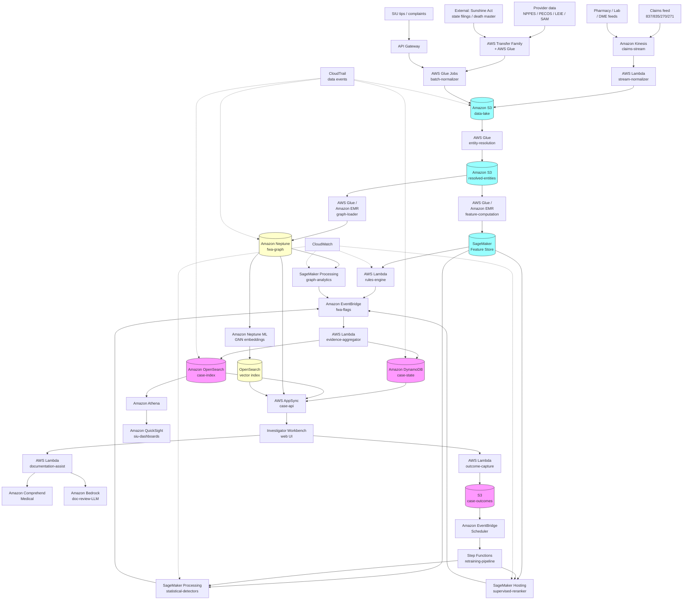

<!--
Editor pass (TechEditor, 2026-05-15): style/voice check (zero em-dashes
verified; 70/30 vendor balance preserved); replaced real-sounding sample
provider name "Pine Ridge Medical Associates" with explicitly synthetic
name (privacy/reputation hygiene); added Luhn-validity disclaimer on
sample NPIs; added a draft-date disclaimer on sample timestamps; added
TODO markers for substantive technical concerns surfaced by the expert
review (graph-construction missing claim vertices; outcome-event
idempotency at the evidence-aggregator; DLQ posture for the four
critical Lambdas; provider appeals workflow architectural backstop;
reference-data versioning propagation; legal-privilege infrastructure
primitives) that require TechWriter follow-up rather than in-place
rewriting. Preserved all existing TODOs from earlier personas. Section
order and structural claims unchanged.

Final pass (TechEditor, 2026-05-15): re-verified zero em-dashes (any
en-dash matches are confined to the ASCII-art architecture-pattern
block-diagram inside a fenced code block, not in prose); confirmed
header hierarchy (one H1, structured H2/H3/H4 progression with no
skipped levels); confirmed all sample provider/organization names in
Expected Results carry an explicit "(sample)" suffix or are obviously
synthetic placeholders ("Corp Shell A LLC"); confirmed sample NPIs
remain `<synthetic-NPI>` placeholders behind the Luhn-validity
disclaimer; confirmed legal citations (42 USC 1320a-7b, 42 USC 1395nn,
31 USC 3729-3733, 42 CFR 411.354, 42 CFR 422.504(h), 42 CFR 438.608,
45 CFR 164.512(f)) are correctly formatted; confirmed all 17 TODO
markers are well-formed and addressed to TechWriter for follow-up.
No further in-place rewrites; recipe is ready for publication pending
TechWriter resolution of flagged TODOs.
-->

# Recipe 3.6: Healthcare Fraud, Waste, and Abuse Detection ⭐

**Complexity:** Medium-Complex · **Phase:** Production · **Estimated Cost:** ~$0.002 to $0.02 per claim scored (mostly compute and graph traversal; full provider-level scoring runs weekly and dominates cost)

---

## The Problem

It's a Monday morning at a mid-size commercial payer. The Special Investigations Unit (SIU) has a conference room with a whiteboard, and on the whiteboard is a network diagram. Three clinics in the same strip mall, four providers who all trained at the same institution fifteen years ago, two durable medical equipment (DME) suppliers with overlapping ownership, and one toxicology lab that received roughly eighty percent of the referrals from those clinics over the last eighteen months. Total paid: $11.7 million. Total patients involved: roughly four hundred. Average paid per patient: $29,000. Average paid per patient at comparable clinics in the region: $3,200.

Nobody on the team built that picture from a single alert. It emerged from six months of investigation: a tip from a former employee, a pattern in the urine toxicology claims (every patient billed for a 22-panel confirmatory test every two weeks, regardless of clinical indication), an FBI request for records on one of the providers, and an analyst who got curious about why one lab kept showing up in the referral data. The whiteboard is the synthesis. The $11.7 million is the damage. And the quiet thing everyone in the room is thinking is: how many other whiteboards should we be drawing right now that we haven't even started?

That's healthcare fraud, waste, and abuse detection in a nutshell. Not "is this claim wrong?" (that's Recipe 3.1, duplicate detection). Not "is this provider's billing drift unusual?" (that's Recipe 3.3, billing code anomalies). FWA is the bigger problem: is there a pattern across claims, providers, patients, suppliers, and payments that describes an intentional scheme, a negligent process, or an abusive-but-legal practice that's costing money and harming patients?

The terminology is worth getting right because the legal and operational handling differ:

**Fraud** is intentional deception for financial gain. Phantom billing (charging for services never rendered), identity theft (billing under a patient's identity without their knowledge), kickbacks (paying providers to refer patients to specific services), and collusive networks (providers, labs, and DME suppliers coordinating to extract payment). Fraud is a criminal matter. When it's identified, it goes to law enforcement, the Office of Inspector General (OIG), state Medicaid Fraud Control Units, or the Department of Justice.

**Waste** is overutilization without necessarily intentional deception. Ordering tests that aren't clinically indicated. Performing procedures that duplicate recent ones. Using expensive options when cheaper equivalents would work. Waste is usually addressed through provider education, medical necessity review, and utilization management, not through investigation and prosecution.

**Abuse** is the ambiguous middle ground: billing practices that are technically legal but inconsistent with accepted standards, or that exploit gray areas in coverage rules. Unbundling services that should be billed together. Upcoding evaluation-and-management levels. Billing at the highest-intensity code when the documentation supports a lower one. Abuse cases often result in adjustments, overpayment recovery, and corrective action plans rather than referrals to law enforcement.

Most real cases are mixtures. A provider who started with waste (overordering labs because it's easier than not ordering them) can drift into abuse (the overordering becomes systematic, and coding shifts to maximize payment) and eventually into fraud (the documentation for those labs starts being fabricated, or the referral relationship with the lab becomes a kickback arrangement). The detection system has to see the full spectrum because the same underlying patterns show up across all three.

The pain here is different from every other recipe in this chapter, and the difference is worth naming:

**The stakes are enormous.** FWA is estimated to cost the US healthcare system somewhere between three and ten percent of total spending, which at current volumes puts the annual loss in the hundreds of billions of dollars. The National Health Care Anti-Fraud Association estimates conservatively at three percent, roughly $100 billion per year. Government estimates run higher. <!-- TODO (TechWriter): confirm current NHCAA and CMS published estimates for FWA losses. Figures shift each year; verify recent publications before citing specific numbers. -->

**The adversary is adaptive and organized.** Most of the money in FWA is in organized schemes, not individual bad actors. The people running these schemes study detection logic. They know what triggers flags, and they structure billing to stay below thresholds. They use multiple provider numbers, multiple corporate entities, multiple geographies. A static detection rule has a useful lifetime measured in months before the schemes adapt.

**The false-positive cost is high.** Accusing a legitimate provider of fraud, even tentatively, has legal and relationship consequences. Providers have sued payers over wrongful termination from networks. Provider relations teams get burned when investigations chase legitimate practice variation. The standard of evidence required before taking action (audit, recoupment, termination, referral) is genuinely high, and the detection pipeline must produce cases that meet that standard.

**The true-positive "discovery" is rare.** Unlike sepsis or lab artifacts, where ground truth gets confirmed within hours or days, fraud is confirmed on a multi-month timeline. Investigations take six to eighteen months. Prosecutions take years. Learning whether a flag was correct often happens long after the flag fired, and many true positives are never confirmed because the investigation was never completed.

**The workflow is multi-party and partially legal.** Fraud cases involve claim data from the payer, patient interviews, provider interviews, medical record review by clinical reviewers, legal coordination, sometimes law enforcement. The detection pipeline produces the first-pass candidates. Everything after that is workflow software for a team of investigators, legal counsel, and clinical reviewers working through a case. A recipe that stops at "here's a list of scored providers" is producing maybe 20% of the value.

**The rules encode law and contract.** Coverage rules, Correct Coding Initiative (CCI) edits, medical necessity policies, anti-kickback statutes, Stark Law relationships, False Claims Act liability. These aren't detector heuristics; they're legal constraints. A detection system that flags a pattern as fraudulent has to be grounded in the specific legal or contractual rule the pattern violates. "This looks weird" is not an actionable case. "This violates 42 CFR 411.354 regarding physician self-referral because the referring provider has an ownership interest in the entity receiving the referral" is an actionable case.

What you actually want to build is a layered system that runs continuously over claims, remittance, and relationship data, produces provider-level and scheme-level (network-level) candidates, enriches those candidates with legal and clinical context, and feeds a case management workflow where investigators can accept, develop, or dismiss candidates. Underneath sits a graph of relationships (providers to patients to payments to ownership entities) because most of the high-dollar fraud is relational and not visible in any single provider's statistics. On top sits a review queue designed for investigators, not for clinicians or claim auditors, because the work product of an FWA investigator is a case file that may end up in front of a judge.

Let's get into how.

---

## The Technology

### The Scheme Taxonomy, and Why It Matters

Before picking algorithms, a first-time builder should internalize the scheme taxonomy, because different schemes require structurally different detection approaches. These are the patterns that show up over and over across payers, regulators, and public OIG enforcement actions.

**Phantom billing.** The provider bills for services that were never rendered. The patient may not exist (identity theft), or the patient exists but didn't receive the service on the date billed. Phantom billing is sometimes obvious (a deceased patient billed for office visits; a patient traveling abroad billed for in-person visits) and sometimes subtle (a high-volume practice where a few percent of visits are fabricated to pad revenue). Detection clues: patient eligibility inconsistencies, impossible service volumes (a provider billing for 90 patient visits in a single day), service date patterns that don't match facility open hours.

**Upcoding.** The provider bills for a higher-intensity service than what was actually performed. An office visit documented at a level 3 intensity billed as a level 5. An EKG read and interpreted (higher pay) billed when only a technical read (lower pay) was performed. A 30-minute psychotherapy session billed as a 60-minute session. Upcoding is the single most pervasive FWA pattern by claim volume. Detection clues: E&M level distributions shifted relative to peers and specialty benchmarks, documentation that doesn't support the billed code, service-time codes whose durations sum to impossible daily totals.

**Unbundling.** Services that have a single bundled code are billed as separate codes to increase total payment. A lab panel that has a single panel code billed as its individual component tests. A surgical procedure that bundles the pre-op, intra-op, and post-op work billed separately. Modifier 59 (distinct procedural service) is the workhorse of unbundling schemes. Detection clues: modifier 59 usage above specialty norms, specific code combinations that violate CCI edits, dollar-per-encounter totals higher than bundled equivalents.

**Medically unnecessary services.** Services that were rendered but weren't clinically indicated. Urine drug screens of elaborate complexity every two weeks on patients who could be monitored with simpler screens or less frequently. Physical therapy continuing long past the point of clinical benefit. Imaging studies ordered reflexively without matching clinical findings. Hyperbaric oxygen therapy for conditions outside the covered indications. This category overlaps with waste and abuse legally but shows the same technical patterns. Detection clues: service frequency out of line with clinical guidelines, service types that don't match the patient's diagnosis profile, dose-response patterns (providers whose ordering intensity scales with the payment rate rather than the acuity).

**Kickbacks and self-referral.** Federal Anti-Kickback Statute (42 USC 1320a-7b) prohibits remuneration in exchange for referrals for items or services reimbursed by federal programs. Stark Law (42 USC 1395nn) prohibits physician self-referral to entities with which the physician has a financial relationship, in specific scenarios. These are relationship offenses: they're invisible in any single claim but visible in the referral graph. Detection clues: high referral concentration (one provider sending most of a specific service to one supplier), ownership overlap between the referring and the referred-to entities, gifts and payments logged in Sunshine Act data that correlate with referral patterns.

**Identity theft and credential abuse.** A provider's identifier (NPI) is used to bill services the provider didn't render, either because the credentials were stolen or because the provider knowingly loaned them. This pattern shows up especially in situations where a provider has retired, died, moved, or had license action taken, but claims continue to flow under their NPI. Detection clues: claims submitted after provider death, retirement, or license suspension, claims from geographies the provider doesn't practice in, claim velocity that's implausible for the provider's practice size.

**Collusive networks.** Multiple entities (providers, labs, DME suppliers, pharmacies, corporate owners) coordinating to extract payment. Classic patterns: a pain clinic that refers every patient to the same toxicology lab for elaborate testing regardless of clinical need; a DME supplier whose referring providers all share a corporate owner; a home-health agency whose referring physicians are all paid consultants for the agency. Collusive networks produce the largest-dollar cases and are essentially impossible to detect at the claim or single-provider level. They're graph problems.

**Patient-side abuse.** Patients shopping multiple providers for controlled substances (drug seeking), patients visiting multiple facilities to receive duplicative services (doctor shopping for disability documentation), patients who loan insurance cards to uninsured family members. These show up in patient-level utilization patterns rather than provider-level patterns and usually require cross-referencing pharmacy data with prescription monitoring programs.

**Billing-mill patterns.** Low-skill, high-volume operations that use templated documentation to churn out claims. Physical therapy mills, urine toxicology mills, DME mills, pain management mills, genetic testing mills. The documentation is real enough to pass an initial audit (templates are filled in, signatures are applied), but the clinical decision-making underneath is missing. Detection clues: service intensity uniform across patients regardless of presentation, documentation templates with identical phrasing across patients, single-provider practice volumes that imply impossible patient-contact time.

A detection pipeline that handles these schemes uses very different techniques for each. Phantom billing benefits most from rule-based and eligibility-integrity checks. Upcoding and unbundling live in statistical drift detection (Recipe 3.3's territory, one tier deeper). Kickbacks and collusive networks require graph analytics. Identity theft needs real-time eligibility and cross-data checks. Patient-side abuse requires patient-level aggregations across providers. A single model does not cover all of this. What does is a layered architecture with multiple detectors, each tuned to a specific scheme class, feeding a unified case management layer.

### Rules Versus Models, and Why You Need Both

There's a persistent debate in payment integrity about whether rule-based engines or machine learning models are better for FWA detection. This debate is mostly an energy drain because the right answer is "both, and in specific places."

Rules are appropriate when the pattern is defined by law, policy, or contract. CCI edits. Medical necessity criteria encoded in coverage policies. Anti-Kickback Statute elements. Stark Law relationships. These have known definitions, and a violation is a violation. A rule engine that encodes them precisely is the right tool. Attempting to learn them with a model is a waste of effort and introduces risk (the model learning a fuzzy approximation of a bright-line rule).

Models are appropriate when the pattern is defined by behavior that deviates from norms, and the norms are learned from data. Upcoding detected through E&M distribution shifts. Collusive networks detected through unusual referral concentration. Phantom billing detected through velocity models. These are too varied and too adaptive to encode as a static rule; they need the model to pick up on the current shape of the data.

The productive integration is that rules produce the high-confidence, legally-grounded flags that go directly to investigation. Models produce the lower-confidence, exploratory flags that go to an analyst for enrichment before investigation. The two streams join at the case management layer, where a case can have rule-based and model-based evidence attached.

### Statistical and ML Methods That Fit

FWA detection pulls from a wider range of methods than any other recipe in this chapter. Here's the family:

**Rules engines.** Decision Model and Notation (DMN), Drools, or equivalent. Encodes CCI edits, medical necessity policies, eligibility rules, coverage determinations. Must be versioned because rules change (new CPT codes, new policy determinations). Must be explainable: every flag includes the rule ID and the specific inputs that triggered it. This is the workhorse for the legally-grounded piece of the pipeline.

**Statistical baselining (z-scores, CUSUM, control charts).** For provider-level and patient-level behavioral features. Flag distributions that drift versus peer norms or self-history. Same techniques as Recipe 3.3 (Billing Code Anomalies); FWA uses them as one component among many.

**Isolation Forest and other unsupervised detectors.** Handles high-dimensional feature vectors on providers, patients, and claim clusters. Surfaces multivariate outliers that no single univariate check catches. Pairs well with SHAP-based explanations so investigators can see which features contributed to the flag.

**Supervised classification.** Gradient boosted trees (XGBoost, LightGBM) on labeled historical cases. Predicts probability that a provider or claim cluster will result in a confirmed investigation outcome. Requires the hard work of label collection described earlier (ambiguous outcomes, long latency, self-confirming bias). Typically a re-ranker on top of unsupervised candidates rather than a primary detector.

**Graph analytics.** Probably the single most-differentiated technique in FWA detection. Construct a graph of providers, patients, facilities, claims, payments, and ownership entities. Compute graph features: community detection (who clusters with whom), betweenness and centrality (who's a hub), shortest paths (how closely connected are two entities), Jaccard similarity on referral patterns (whose referral graph overlaps suspiciously with whose). Communities with unusually tight referral concentration, billing-through-common-entities patterns, or shared-ownership fan-out are the classic collusive-network signatures. Most commercial SIU toolkits and most state Medicaid Fraud Control Units use graph analytics as a core capability, and it consistently finds cases that no per-claim or per-provider method catches.

**Graph neural networks (GNNs).** The evolution of graph analytics toward learned representations. A GNN can learn node embeddings that incorporate the structural role of each node (provider, patient, facility) in the graph plus its features (specialty, location, billing patterns). Anomaly detection on GNN embeddings catches patterns that hand-crafted graph features miss. Still emerging in production FWA use, but the research literature is accelerating. <!-- TODO (TechWriter): as specific validated patterns for GNN-based FWA detection become published with operational results, expand with concrete references. -->

**Peer-group and cohort modeling.** Define peer groups carefully (specialty, region, practice size, patient mix), compute per-peer-group baselines, then measure the target provider's deviation from the cohort baseline. Same as Recipe 3.3. In FWA specifically, peer-group definition gets more sophisticated because the schemes often operate within a specialty (all pain management, all toxicology labs, all DME suppliers); intra-specialty comparison is where the differentiation happens.

**NLP on documentation.** Clinical documentation review is a large part of case development. LLMs and extractive NLP can summarize documentation, extract the medical necessity justification, identify template copy-paste patterns ("documentation cloning"), and flag documentation that doesn't support the billed code. An LLM given a billed CPT and its documentation can assess whether the documentation supports the code, and explain its reasoning. Not a decision-maker, but a substantial accelerator for the clinical reviewer.

**Time-series and change-point detection.** Provider billing patterns that shift suddenly or that show coordinated shifts across multiple providers are strong signals. Change-point detection on per-provider time series (billing volume, code mix, dollar-per-encounter) finds onset dates for drift. When multiple providers in a peer group share change-point dates, that's a red flag for coordinated activity.

**Sequence and pattern mining on patient journeys.** Some schemes express themselves as unusual service sequences across a patient's care (every patient who visits clinic A is referred to lab B within 72 hours, which runs toxicology panel C, which bills at amount D). Sequence mining or association rule mining on patient journeys can surface these.

**Embedding-based similarity search.** For a known-fraud case, find other providers whose feature embeddings are closest. "Providers who look most similar to this recently-indicted provider" is a high-value investigator query. Implemented as a vector store on provider embeddings.

A realistic progression: start with rules (for the legally-grounded patterns) plus statistical baselining (for upcoding and drift patterns) plus a first pass at graph features (provider-patient-referral concentration). Add Isolation Forest on provider features once enough data exists. Add supervised re-ranking once labels accumulate. Add GNN embeddings and advanced graph analytics as the program matures. Don't try to build all layers at once; you'll end up with a system you can't explain.

### The Graph Is the Secret Sauce

If there's one piece of the FWA detection toolkit that differentiates mature programs from immature ones, it's the relationship graph. Everything else can be done with flat tabular analytics and you'll catch a fraction of the money. The graph is where the big schemes live.

A useful FWA graph has node types that include:

- Individual providers (NPI level)
- Provider organizations (tax ID, facility NPI, corporate entity)
- Patients
- Services (CPT/HCPCS grouped into meaningful clusters)
- Claims
- Payments
- Ownership entities (who owns what)
- Geographic locations
- Corporate officers and directors (from state business filings and Sunshine Act)

And edge types that include:

- Rendered-service (provider performed service for patient)
- Billed (organization submitted claim for service)
- Paid (payer paid organization for claim)
- Referred (provider referred patient to organization or other provider)
- Prescribed (prescriber ordered medication dispensed by pharmacy)
- Ordered (provider ordered test performed by lab)
- Owns (entity owns all or part of another entity)
- Controls (entity has signatory or director authority over another)
- Co-located (entities share a physical address)
- Co-appears (entities appear together in ownership or officer records)

Graph construction is non-trivial: entity resolution is a first-class problem (multiple NPIs for the same physical provider, provider name variations, address normalization, corporate entities with opaque ownership structures). External data sources matter here: state business filings for corporate ownership, CMS's Open Payments (Sunshine Act) data for industry payments to providers, OIG's List of Excluded Individuals and Entities (LEIE), SAM.gov for federal exclusions, NPPES for provider demographics.

Once the graph is built, the high-value queries are surprisingly few:

- **Community detection.** Apply a community detection algorithm (Louvain, Leiden) to find tight clusters. Investigate clusters whose internal referral or billing concentration is high.
- **Referral concentration.** For each provider, compute what fraction of their referrals go to the top-1 and top-3 entities. Providers with >80% of referrals to a single DME supplier or lab are worth looking at.
- **Ownership cascades.** For each claim-receiving entity, trace the ownership up through layers of LLCs. Shared ownership across supposedly-independent entities is a major signal.
- **Co-location clusters.** Multiple "independent" providers, labs, and DME suppliers operating from the same strip mall or PO box. Often with overlapping officers.
- **Patient-sharing between providers.** Providers who share an unusually high fraction of patients, especially when the sharing is asymmetric (provider A always refers to provider B, but not vice versa).
- **Provider-patient density patterns.** A lab with a handful of referring providers that collectively account for 90% of volume. A DME supplier whose referring provider list is suspiciously short.
- **Temporal coordination.** Multiple providers or entities whose billing, revenue, or referral patterns all shift on the same dates (coordinated activity).

The graph analytics layer is where graph databases earn their keep. Traversing "find all entities within three hops of provider X, weighted by payment volume" is tolerable in SQL; in practice, it's cheaper and clearer in a native graph engine.

### Data Requirements and the Unglamorous Work

A lot of the difficulty in FWA detection is not the modeling. It's the data work underneath. The pipeline needs:

- **Clean claims data with all the fields.** Claims, remittance (835 data), eligibility, authorization records, denials. Include secondary-payer data, adjustments, and reversals. A claim that appears in the initial data feed and then is adjusted a week later needs to be tracked as a state change, not as two separate claims.
- **Provider demographics and lifecycle data.** NPPES (National Plan and Provider Enumeration System) for NPI basics. State licensure data for active/inactive status. LEIE for OIG exclusions. SAM.gov for federal contracting exclusions. Medicare enrollment data (PECOS). State business filings for corporate ownership.
- **Patient demographics and vital status.** Including date of death, because billing after patient death is an investigation-ready pattern by itself.
- **Clinical documentation.** Not always available upfront, but required for case development. Documentation review may happen via EMR integration (for patients seen in the payer's provider network), via document request (for fraud cases), or via chart audit. The pipeline needs to track which cases have documentation attached and which don't.
- **External data.** CMS Open Payments (Sunshine Act), state prescription monitoring programs, public court records, property records (for co-location checks), corporate registry data.
- **Historical investigation outcomes.** Your SIU's case files become the supervised-learning labels. They need structured fields (case type, outcome, confirmed loss amount, referral destination) and not just free-text notes.

Most organizations underestimate this data work. A reasonable FWA detection project spends 60% of the first year on data foundation and 40% on detection logic, and the teams that invert that ratio produce more alerts but not more cases.

### Alert Fatigue Has a Different Flavor Here

Alert fatigue shows up in every chapter in this book, and FWA has its own variety. In clinical contexts (Recipes 3.4, 3.5, 3.7), the consequence of alert fatigue is that clinicians ignore alerts and miss real clinical events. In FWA, the consequence is that investigators ignore the detector and build cases from other sources (tips, referrals from other agencies, internal leads). A detector that produces 500 candidates per week against an investigation capacity of 20 per month is not producing leads; it's producing noise that an investigator learns to tune out.

The design implications:

- **Prioritization is not optional.** The top-of-queue case has to be worth a full investigation. The hundredth case can be interesting but lower-priority. Ranking matters more than total flag count.
- **Estimated dollar impact should drive priority.** Investigators spend time, and time is expensive. A $50,000 case and a $5,000,000 case both take months of investigation. Prioritize by estimated loss exposure.
- **Evidence bundling is the unit of work.** An investigator doesn't want a score; they want a packet: representative claims, peer-comparison context, graph context, documentation samples, prior flags on this entity, prior case outcomes. The packet is the MVP.
- **Feedback loops must be structurally honest.** Investigators close cases with outcomes; those outcomes feed back to model tuning. But outcome granularity matters: "referred to OIG" is different from "educated and closed" is different from "adjusted claims and closed" is different from "referred to state Medicaid Fraud Control Unit." Don't collapse these; the nuance is the signal.
- **Suppression rules are politically sensitive.** An investigator who decides that provider X is legitimate should be able to suppress future alerts on that provider (with documentation of why and for what period), but those suppressions must be auditable. Suppression rules that are set and forgotten become blind spots; expire them by default.

### Regulatory and Legal Context Shapes the Architecture

Unlike most recipes in this book, the FWA pipeline is shaped heavily by law, regulation, and contract. The practical consequences:

**Legal privilege.** In some organizational structures, the investigation unit operates under legal privilege (the chief legal officer or general counsel oversees the SIU, and investigation work product is attorney work product). This has implications for data architecture: some of the analysis may need to be isolated from general analytics environments because discovery and privilege considerations apply. Coordinate with legal before designing the architecture.

**Referral obligations.** When a plan suspects Medicare or Medicaid fraud, it has specific referral obligations. 42 CFR 422.504(h) requires Medicare Advantage organizations to report suspected fraud to CMS. Medicaid managed care organizations have similar obligations under 42 CFR 438.608. These obligations create a compliance requirement for the detection pipeline (the pipeline must surface these cases) and a workflow requirement (once surfaced, the referral must be made within the required timelines).

**False Claims Act exposure.** Payers that fail to identify and recover overpayments can face False Claims Act liability (31 USC 3729-3733) if they knowingly retain overpayments. The detection pipeline's effectiveness is partly a compliance posture. Documentation that detection ran and produced results (or documentation that investigation was considered and did or did not happen) is itself important.

**HIPAA and Privacy Act.** PHI is involved end-to-end. Standard HIPAA controls apply (BAA, encryption, audit logging, least-privilege access). Additionally, when investigations share data with law enforcement, specific disclosure rules apply. 45 CFR 164.512(f) permits limited disclosure of PHI to law enforcement under specified conditions, and the infrastructure should support these workflows as first-class data handling, not as ad-hoc exports.

**State-specific anti-kickback and false claims laws.** Most states have their own false claims and anti-kickback statutes that track or extend federal law. Some (California, New York) have aggressive state-level enforcement. The detection rules need to be configurable per state, because what's reportable in one state may not be in another.

**Retention.** FWA investigation records are kept for years, often decades. CLIA, HIPAA, state laws, and statute-of-limitations considerations for FCA cases (up to ten years in some scenarios) all apply. Design storage retention accordingly. Don't delete investigation records lightly.

---

## General Architecture Pattern

At a conceptual level, the FWA detection pipeline has to ingest heterogeneous data continuously, maintain a relationship graph that reflects the current state of providers, entities, and claims, run multiple detectors (rule-based, statistical, graph-based, model-based) at different cadences, and feed a case management workflow where investigators do the real work. Underneath sits audit logging that would satisfy a federal subpoena, because the outputs of this system sometimes end up as evidence.

```
┌──────────────── FWA DETECTION PIPELINE ───────────────────────────┐
│                                                                   │
│   [Claims feed]         [Eligibility feed]      [Remittance]      │
│   [Authorizations]      [Denials]               [Provider data]   │
│   [Pharmacy claims]     [Lab orders]            [DME orders]      │
│   [State filings]       [Sunshine Act]          [OIG LEIE/SAM]    │
│   [Death master]        [Licensure data]        [NPPES/PECOS]     │
│           │                                                       │
│           ▼                                                       │
│   [Ingestion and Normalization]                                   │
│   (entity resolution, code harmonization, event deduplication)    │
│           │                                                       │
│           ▼                                                       │
│   [Unified Data Lake + Feature Store]                             │
│      │                                                            │
│      ├──► [Graph Construction]                                    │
│      │     (provider-patient-entity-payment-ownership graph)      │
│      │                                                            │
│      └──► [Per-entity Feature Tables]                             │
│            (provider, patient, facility, payment features)        │
│                                                                   │
│           │                                                       │
│    ┌──────┴────────────────────────────────────┬─────────────┐    │
│    ▼                                           ▼             ▼    │
│   RULES LAYER        STATISTICAL LAYER     GRAPH LAYER      ML    │
│                                                             LAYER │
│   [CCI edits]        [Z-scores peer]       [Community            │
│   [MUE]              [CUSUM drift]          detection]            │
│   [Medical           [Panel multivariate]  [Referral             │
│    necessity]        [Claim-level          concentration]        │
│   [Eligibility       Isolation Forest]     [Ownership            │
│    integrity]        [Patient journey      cascades]              │
│   [Anti-kickback     sequence mining]      [GNN embeddings]      │
│    structure]                                                     │
│                                                                   │
│           │                   │                │            │     │
│           └───────────────────┼────────────────┼────────────┘     │
│                               ▼                ▼                  │
│               [Evidence Aggregator]                               │
│               (per-entity case bundle: flags, ranked            │
│                evidence, estimated loss exposure,                 │
│                prior cases, graph context)                        │
│                               │                                   │
│                               ▼                                   │
│               [Prioritization and Ranking]                        │
│                               │                                   │
│                               ▼                                   │
│               [Case Management Workflow]                          │
│                 │                                                 │
│                 ├─► Analyst triage (enrich, dismiss, develop)     │
│                 ├─► Medical records review (NLP-assisted)         │
│                 ├─► Investigation workbench                       │
│                 ├─► Legal and compliance review                   │
│                 └─► Outcomes (adjust, recoup, refer, prosecute)   │
│                                                                   │
│               [Feedback Capture]                                  │
│                 (case outcomes, dispositions, recoveries,         │
│                  confirmed-loss attribution)                      │
│                               │                                   │
│                               ▼                                   │
│               [Retraining / Rule Tuning / Threshold Review]       │
│                                                                   │
└───────────────────────────────────────────────────────────────────┘
```

**Ingest.** FWA is unusual for the diversity of inputs. Claims (837), remittance (835), eligibility (270/271), authorization, denials. Provider enumeration (NPPES), enrollment (PECOS), licensure (state data), exclusions (LEIE, SAM). External context: Open Payments (Sunshine Act), state business filings, property records, death master files. Internal operations: denials, member complaints, SIU tips, case outcomes. Different sources have different refresh cadences (claims daily, LEIE monthly, state filings annually), different latencies, and different reliability. The ingest layer has to normalize all of this and track source-of-truth for each data element.

**Entity resolution.** Before anything else, the same real-world entity (provider, organization, patient, owner) must be identified across sources. A provider may appear in claims as one NPI, in Medicare enrollment under another, in state business filings as a corporate owner with a different name, in Sunshine Act data under yet another identifier. Standard identifiers (NPI, EIN, SSN) help but don't fully resolve the problem; names, addresses, license numbers, and directorships all contribute. This is the same work Recipe 5.x (Entity Resolution) covers in depth; the FWA pipeline is one of the most demanding consumers of entity resolution.

**Unified data lake and feature store.** The normalized and entity-resolved data lands in a data lake. Analytical feature tables (per-provider, per-patient, per-facility, per-entity) are computed from the lake and kept in a feature store with point-in-time semantics so that historical flags can be reproduced.

**Graph construction.** Nodes for every entity, edges for every relationship (rendered, billed, paid, referred, ordered, owns, controls, co-located). The graph refreshes on a schedule (typically daily or weekly) because relationships evolve. External data sources (Sunshine Act, state filings) refresh less frequently but are essential; they're where ownership and relationship data come from.

**Rules layer.** DMN-based or equivalent rules engine evaluating every claim or every provider-day against hundreds of encoded rules. CCI edits, medically unlikely edits (MUEs), medical necessity policies, eligibility integrity checks, provider-exclusion checks, and anti-kickback structural checks all run here. Output is rule-based flags with explicit rule IDs and input-value documentation.

**Statistical layer.** Per-provider, per-patient, per-specialty z-scores and CUSUM monitoring on the feature tables. Panel-level (claim-cluster) Isolation Forest for multivariate outliers. Peer-group definition drives the z-score baselines. Output is statistical flags with quantitative measures (how many sigma from peer mean; which dimension drove the flag).

**Graph layer.** Community detection on the full graph. Per-entity graph features (degree centrality, betweenness, clustering coefficient, eigenvector centrality). Referral-concentration metrics. Ownership-cascade analytics. GNN embeddings for similarity search. Output is graph-based flags with subgraph visualizations attached (the subgraph is what the investigator will look at).

**ML layer.** Supervised classifiers trained on prior case outcomes, used as re-rankers on top of the rule, statistical, and graph flags. Feature inputs include all flag outputs, raw features, graph features, and patient-mix adjustments. Output is a case-level probability-of-significant-outcome score.

**Evidence aggregator.** Combines flags from all four layers into a per-entity (per-provider, per-patient, per-facility) case bundle. Ranks the evidence by estimated dollar impact, severity, and legal or contractual basis. Attaches graph context (the subgraph within three hops, weighted by payment flow), peer-comparison context (how this provider compares to their peer group on the flagged dimensions), prior-case context (has this entity been flagged before, what were the outcomes), and representative claims (the specific claims that triggered each flag).

**Prioritization and ranking.** Cases sorted by estimated loss exposure, then by confidence, then by strategic priority (certain scheme types get priority because of program focus or regulatory exposure). The ranking is tunable because program priorities change (this quarter, focus on toxicology mills; next quarter, focus on DME).

**Case management workflow.** This is a workflow application, not a data pipeline. Analysts receive triage cases (enrich with a quick review, dismiss or promote). Investigators work developed cases (request records, interview providers, coordinate with legal, issue determinations). Clinical reviewers assess medical necessity and documentation. Legal reviews for litigation or referral. Each step has status tracking, time-to-resolution metrics, and evidence accumulation. The NLP-assisted documentation review (LLMs summarizing records, flagging documentation cloning, assessing medical-necessity justification) lives here as a productivity tool.

**Feedback capture.** Every case resolves with an outcome: closed no-action, closed with provider education, closed with claim adjustment, referred to payment integrity collection, referred to state Medicaid fraud control unit, referred to OIG, referred to DOJ, criminal referral, civil settlement, administrative penalty. The outcome, the confirmed loss amount, the time-to-resolution, and the evidence that was decisive all get captured structurally, not just in free text.

**Retraining and rule tuning.** On a quarterly (sometimes monthly) cadence. Review false-positive and true-positive rates by rule, by detector, by scheme type. Retire or re-threshold detectors with high noise. Retrain supervised classifiers on accumulated labels. Update rule libraries when coverage policies, CCI edits, or regulatory rules change. Review suppression rules for staleness.

---

## The AWS Implementation

### Why These Services

**Amazon S3 as the data lake foundation.** Claims, remittance, eligibility, provider data, external reference data, and case outcomes all land in S3. Partitioned Parquet for analytical access, JSON for raw records, Iceberg or Hudi table formats for the mutable claim data (claims get adjusted, and the lake has to reflect state changes without losing history). Customer-managed KMS encryption on every bucket. HIPAA-eligible under the BAA.

**AWS Glue for the data catalog and ETL.** Schema registry for the diverse inputs, crawler-driven discovery for semi-structured sources, PySpark jobs for the transformations. Entity resolution runs as Glue jobs using fuzzy-matching libraries and external identifier APIs. Glue gives observability, job lineage, and cost governance that ad-hoc Spark would not.

**Amazon EMR or AWS Glue for heavy batch processing.** Feature computation across the entire claim history (billions of rows over multi-year windows) is too heavy for serverless Lambda. EMR Spark clusters (transient, spun up for the batch jobs and torn down) are cost-efficient for the monthly cohort baseline rebuilds and the graph construction jobs.

**Amazon Neptune for the relationship graph.** Neptune is a managed graph database supporting property graph (Gremlin) and RDF (SPARQL) queries. The FWA graph (providers, patients, organizations, claims, payments, ownerships) fits the property graph model well. Queries like "find all entities within three hops of provider X, weighted by payment flow" are native Gremlin. Neptune scales to billions of nodes and edges, encrypts at rest with KMS, and is HIPAA-eligible under the BAA.

**Amazon Neptune ML for GNN embeddings.** Neptune's built-in integration with SageMaker allows GNN training on the graph (using GraphSAGE or similar architectures) and produces node embeddings that capture structural patterns. Embeddings go into a vector store for similarity search (find providers most similar to this indicted provider).

**Amazon OpenSearch Service (with k-NN vector search) for the case management backend.** Every flag, every case, every piece of evidence gets indexed. Investigators query OpenSearch for cases, the provider management team queries for prior-flags, the audit team queries for compliance evidence. OpenSearch's k-NN vector search supports embedding-based similarity on provider vectors. Fine-grained access control is critical because SIU data has tighter access restrictions than general payment integrity data.

**Amazon DynamoDB for case state and workflow.** Case management state (case status, assigned investigator, current action due dates, next review date) lives in DynamoDB for low-latency reads and high-volume writes. Single-digit millisecond latency matters when investigators are navigating large caseloads in a UI.

**Amazon SageMaker for model training and hosting.** Supervised classifiers (XGBoost), unsupervised detectors (Isolation Forest via SageMaker Processing), and custom GNN training via Neptune ML all run on SageMaker. Feature Store holds the feature vectors with point-in-time correctness for reproducibility. SageMaker Clarify produces bias reports on the supervised models and explanation artifacts for individual predictions.

**Amazon Comprehend Medical plus Amazon Bedrock for documentation review.** When medical records are attached to a case, Comprehend Medical extracts structured entities (diagnoses, medications, procedures) for rule-based medical-necessity checks. Bedrock (Claude, Llama, or other HIPAA-eligible LLMs) handles the harder tasks: summarizing records, assessing whether documentation supports a billed code, detecting documentation cloning patterns, and generating plain-language narrative summaries for investigators. Always as a productivity tool, never as a decision-maker, and always with human review attached. <!-- TODO (TechWriter): confirm the set of HIPAA-eligible Bedrock foundation models as of the current year. Model availability under the AWS BAA has been expanding; verify before recommending a specific model. -->

**Amazon Step Functions for orchestration.** Batch feature computation, graph refresh, cohort baseline regeneration, model retraining, and scheduled rule evaluation are multi-step workflows. State machines give retry, error handling, and visibility.

**Amazon EventBridge for event routing.** Flags, case state transitions, and external events (new LEIE exclusion, new Sunshine Act publication, new claim batch landing) all route through EventBridge. Subscribers are the case management service, the audit logger, notification services, and downstream analytics.

**Amazon MSK or Amazon Kinesis for streaming inputs.** Real-time claim and eligibility feeds (from clearinghouses or EDI gateways) flow through streaming. For near-real-time eligibility integrity checks (is the patient deceased, is the provider excluded), the streaming path gates claims before payment.

**Amazon QuickSight for leadership dashboards.** Case volume, detection rate by detector, false-positive rate, dollar impact by scheme type, case time-to-resolution, subgroup fairness metrics. QuickSight sits on Athena over S3 plus OpenSearch queries. Separate dashboards for SIU leadership, payment integrity leadership, and executive compliance reporting.

**AWS Lambda for lightweight event processing.** Rule evaluations on individual claims, event handlers for case state transitions, notifications, and integration with external law enforcement portals (when cases are referred out).

**Amazon API Gateway and AWS AppSync for the case management front end.** Investigators interact with cases through a web application; AppSync (GraphQL) is often a good fit because investigator views are graph-shaped (follow the relationships). API Gateway for REST endpoints where needed.

**AWS Secrets Manager for external credentials.** State business filing APIs, OIG/LEIE feeds, and third-party data vendors all require credentials. Rotated and audited.

**AWS CloudTrail and Amazon CloudWatch.** CloudTrail data events on every PHI-bearing store and on case data stores. Every investigator action, every case state change, every data access is logged. CloudWatch dashboards for pipeline health and detector operating metrics. This audit trail is not optional; it's part of the regulatory posture of the program.

**AWS Clean Rooms (optional, for multi-payer collaboration).** Some schemes span payers (a provider billing Medicaid, Medicare Advantage, and commercial payers for the same patterns). Multi-payer intelligence sharing is regulated but permitted in specified scenarios. AWS Clean Rooms enables privacy-preserving joins across multiple payer datasets. Not a day-one feature, but worth knowing about.

### Architecture Diagram



### Prerequisites

| Requirement | Details |
|-------------|---------|
| **AWS Services** | Amazon S3, AWS Glue, Amazon EMR, Amazon Neptune (with Neptune ML), Amazon SageMaker (Processing, Training, Hosting, Feature Store, Clarify), Amazon OpenSearch Service (with k-NN vector search), Amazon DynamoDB, Amazon Kinesis, Amazon MSK (optional), Amazon Comprehend Medical, Amazon Bedrock, AWS Step Functions, Amazon EventBridge, AWS Lambda, Amazon API Gateway, AWS AppSync, Amazon Athena, Amazon QuickSight, AWS Secrets Manager, AWS KMS, AWS CloudTrail, Amazon CloudWatch, AWS Transfer Family, AWS Clean Rooms (optional). |
| **IAM Permissions** | Strict least-privilege per role. The rules-engine Lambda reads from the feature store and the S3 rules bucket, writes to EventBridge only. Investigator roles read case data (segmented by case ownership) and write case updates only. Graph queries have read scopes tied to investigator assignments. No `*` permissions anywhere; every action is scoped to specific resources. Separate roles for analytics engineers (write pipeline artifacts) and investigators (read case data). |
| **BAA** | Signed AWS BAA. All services configured per the BAA requirements. See the [AWS HIPAA Eligible Services Reference](https://aws.amazon.com/compliance/hipaa-eligible-services-reference/). |
| **Encryption** | Customer-managed KMS keys on every PHI-bearing store: S3, DynamoDB, Neptune, OpenSearch, SageMaker (volumes, model artifacts, Feature Store), MSK. Kinesis SSE with CMK. TLS 1.2 or higher in transit everywhere. |
| **VPC** | Production deployment in a VPC with VPC endpoints for S3, DynamoDB, KMS, SageMaker runtime, Bedrock, Comprehend Medical, and Neptune. Neptune is always in a VPC (no public endpoint). OpenSearch in VPC with fine-grained access control. Lambdas that access PHI stores run in the VPC. |
| **CloudTrail and Data Events** | Enabled with data events on every PHI-bearing store and on the case management DynamoDB and OpenSearch resources. Every investigator read and write is logged. Logs are stored in a separate account under Organizations SCPs that prevent deletion, because these logs may be subpoenaed. |
| **Legal Privilege Architecture** | If the SIU operates under legal privilege, the case management data may need to be in an account or VPC isolated from general analytics, with access controlled by legal counsel. Coordinate with the general counsel's office before designing the architecture. <!-- TODO (TechWriter): per expert review (S4), expand this row to name the specific infrastructure primitives that operationalize the privilege boundary so an architect has something concrete to bring to the GC conversation: separate AWS account in an OU administered by GC; separate VPC with no peering to general analytics; separate customer-managed KMS keys whose key policies exclude analytics-engineer roles; distinct CloudTrail trail to a GC-controlled S3 bucket; distinct OpenSearch domain and DynamoDB tables for case data with `PRIVILEGED` data-classification tags; SCP-level prevention of S3 cross-account access from the privileged environment. --> |
| **Regulatory Referral Workflows** | Documented workflows for CMS fraud reporting (42 CFR 422.504(h) for Medicare Advantage, 42 CFR 438.608 for Medicaid MCOs). OIG hotline referrals. State Medicaid Fraud Control Unit referrals. SIU-to-DOJ workflows for False Claims Act cases. Infrastructure must support documented, auditable handoffs including data packages that meet the receiving agency's specifications. |
| **Clinical Governance** | Clinical reviewers (typically RNs, MDs with coding credentials) are part of the case team for medical-necessity cases. Their work (medical records review, documentation assessment) must be integrated into the case management workflow. |
| **Sample Data** | [CMS Synthetic Public Use Files (SynPUF)](https://www.cms.gov/data-research/statistics-trends-and-reports/medicare-claims-synthetic-public-use-files) provide synthetic Medicare claims for development and testing. [Synthea](https://github.com/synthetichealth/synthea) generates synthetic patient and provider data. [CMS Open Payments](https://openpaymentsdata.cms.gov/) is public Sunshine Act data. [OIG LEIE](https://oig.hhs.gov/exclusions/) is public exclusion data. [SAM.gov](https://sam.gov/) is public federal exclusion data. Never use real PHI in development. |
| **External Data Subscriptions** | Some state business filing APIs and property record sources have commercial data providers (LexisNexis, Thomson Reuters CLEAR, others). Medical fraud analytics vendors (SAS Fraud Framework, Optum Impact Intelligence, others) sometimes provide enriched feeds. Factor these into operational cost. |
| **Retention** | Investigation records retained per the most conservative applicable schedule. FCA statute-of-limitations considerations can extend this to ten years or longer. Criminal case records may be retained indefinitely under specific programs. Consult legal before setting lifecycle policies on these buckets. |
| **Cost Estimate** | For a mid-size regional payer (say, 1 million members, 30 million claims per year): S3 data lake: ~$500-1,500/month at multi-year retention. Glue and EMR for ETL and feature computation: ~$800-3,000/month. Neptune for the graph (tens of millions of nodes, hundreds of millions of edges): ~$2,000-6,000/month. OpenSearch case index: ~$500-1,500/month. SageMaker training and hosting: ~$500-2,000/month. Bedrock and Comprehend Medical for documentation review: usage-dependent, typically $300-1,500/month. DynamoDB for case state: ~$100-400/month. Total infrastructure: typically $5,000-16,000/month. Compare to typical FWA recoveries: mature SIU programs recover multiples of program cost annually, often 5x to 15x. The infrastructure cost is a small fraction of investigator staffing cost and a smaller fraction of recoveries. <!-- TODO (TechWriter): verify current published industry benchmarks for SIU ROI. NHCAA and the Healthcare Fraud Prevention Partnership have published figures; confirm current values before citing specifics. --> |

### Ingredients

| AWS Service | Role |
|------------|------|
| **Amazon S3** | Data lake foundation for claims, eligibility, remittance, provider data, external reference data, case outcomes |
| **AWS Glue** | Data catalog, ETL jobs, entity resolution, schema evolution |
| **Amazon EMR** | Heavy-weight Spark jobs for feature computation and graph construction |
| **Amazon Neptune** | Property graph of providers, patients, entities, payments, ownerships |
| **Amazon Neptune ML** | GNN training for provider and entity embeddings |
| **Amazon SageMaker Feature Store** | Per-entity feature vectors with point-in-time correctness |
| **Amazon SageMaker Processing** | Unsupervised detectors (Isolation Forest, statistical baselines, graph analytics) |
| **Amazon SageMaker Training and Hosting** | Supervised re-ranker training and real-time scoring |
| **Amazon SageMaker Clarify** | Bias and fairness analysis on the supervised re-ranker |
| **Amazon OpenSearch Service** | Case index, flag audit, vector similarity search for embedding-based queries |
| **Amazon DynamoDB** | Case state and workflow for low-latency investigator UI |
| **Amazon Kinesis** | Real-time claim feed for near-real-time eligibility integrity checks |
| **AWS Lambda (rules-engine)** | CCI edits, medical necessity rules, eligibility integrity, exclusion checks |
| **AWS Lambda (evidence-aggregator)** | Bundles multi-source flags into case packets |
| **AWS Lambda (documentation-assist)** | Orchestrates medical records NLP via Comprehend Medical and Bedrock |
| **AWS Lambda (outcome-capture)** | Records case outcomes and writes labels for retraining |
| **Amazon Comprehend Medical** | Entity extraction from clinical documentation |
| **Amazon Bedrock** | LLM-assisted documentation review, summarization, clone detection |
| **AWS Step Functions** | Orchestrates batch pipelines (feature refresh, graph rebuild, retraining) |
| **Amazon EventBridge** | Fans flags out to evidence aggregator, audit, notification, dashboard |
| **Amazon API Gateway / AWS AppSync** | Case management API for the investigator workbench |
| **Amazon Athena** | SQL-over-S3 for ad-hoc analyst queries against the lake |
| **Amazon QuickSight** | SIU leadership, payment integrity, and compliance dashboards |
| **AWS Secrets Manager** | External API credentials (state filings, vendor data, regulatory portals) |
| **AWS Clean Rooms (optional)** | Multi-payer privacy-preserving intelligence sharing |
| **AWS KMS** | Customer-managed keys for every PHI-bearing store |
| **AWS CloudTrail** | Audit logging on every PHI store and every investigator action |
| **Amazon CloudWatch** | Operational metrics, detector health, false-positive rates, case throughput |

---

### Code

> **Reference implementations:** These aws-samples repositories demonstrate patterns that apply here:
> - [`graph-notebook`](https://github.com/aws/graph-notebook): Neptune notebooks, Gremlin traversal patterns, and examples for graph analytics including community detection.
> - [`amazon-sagemaker-examples`](https://github.com/aws/amazon-sagemaker-examples): Isolation Forest and XGBoost examples applicable to the statistical and supervised layers; Feature Store examples for the per-entity feature architecture.
> <!-- TODO (TechWriter): verify and add a specific aws-samples or aws-solutions-library-samples repository demonstrating healthcare fraud detection, graph-based anti-fraud, or payment integrity analytics on AWS. A direct match has not been confirmed at the time of writing. -->

#### Walkthrough

**Step 1: Ingest and normalize claims plus reference data.** Claims arrive from a clearinghouse in 837 format or from internal adjudication in a proprietary format. Provider data arrives from NPPES (monthly FTP), LEIE (monthly), state filings (variable). The normalization step parses each source, canonicalizes identifiers, and lands everything in the data lake with explicit source-of-truth tracking.

```
FUNCTION normalize_claim(raw_claim):
    // Parse the 837 or proprietary payload into a canonical claim structure.
    claim = parse_claim(raw_claim)

    // Canonical service line list with harmonized coding.
    normalized_lines = []
    FOR each line in claim.service_lines:
        normalized_line = {
            cpt_hcpcs:        line.procedure_code,
            modifiers:        normalize_modifiers(line.modifiers),    // list
            diagnoses:        line.diagnosis_pointers_to_icd10(claim.diagnoses),
            units:            line.units,
            billed_amount:    line.billed_amount,
            allowed_amount:   line.allowed_amount,
            paid_amount:      line.paid_amount,
            service_date:     line.service_date,
            place_of_service: line.pos_code
        }
        normalized_lines.append(normalized_line)

    canonical = {
        claim_id:             claim.payer_claim_id,
        external_claim_id:    claim.submitter_claim_id,
        billing_npi:          claim.billing_provider_npi,
        rendering_npi:        claim.rendering_provider_npi,
        facility_npi:         claim.facility_npi,
        patient_id:           resolve_patient(claim.subscriber_id, claim.member_id),
        admission_date:       claim.admission_date,
        discharge_date:       claim.discharge_date,
        primary_diagnosis:    claim.diagnoses[0] if claim.diagnoses else null,
        all_diagnoses:        claim.diagnoses,
        service_lines:        normalized_lines,
        claim_total_billed:   sum(l.billed_amount for l in normalized_lines),
        claim_total_paid:     sum(l.paid_amount for l in normalized_lines),
        submission_date:      claim.submission_date,
        adjudication_date:    claim.adjudication_date,
        authorization_id:     claim.authorization_reference,
        source:               raw_claim.source      // "clearinghouse" | "internal_adjudication"
    }

    // Write to the lake as Parquet, partitioned by service month and payer line of business.
    S3.PutObject(
        bucket = "fwa-data-lake",
        key    = f"claims/lob={canonical.lob}/year={year_of(canonical.service_lines[0].service_date)}/month={month_of(canonical.service_lines[0].service_date)}/{canonical.claim_id}.parquet",
        body   = parquet_encode([canonical]),
        sse    = "aws:kms"
    )

    return canonical
```

**Step 2: Resolve entities across sources.** Provider, organization, patient, and ownership entities may appear in multiple sources with different identifiers. Entity resolution produces canonical IDs that the rest of the pipeline uses.

```
FUNCTION resolve_providers(claims_batch, external_provider_data):
    // Standard identifiers are the starting point.
    // NPI is authoritative for individual providers when present and valid.
    // For organizations, EIN is usually but not always available.

    // Build candidate matches from the claims data.
    provider_candidates = extract_provider_tuples(claims_batch)
    // Each tuple: { npi, name, address, specialty, appearance_count, date_range }

    // Augment with external sources.
    nppes_records = load_latest_nppes()                     // canonical NPI metadata
    pecos_records = load_latest_pecos_enrollment()          // Medicare enrollment status
    leie_records  = load_latest_leie()                      // OIG exclusions
    sam_records   = load_latest_sam_exclusions()            // federal exclusions
    state_license = load_latest_state_licensure()          // state-by-state
    sunshine_act  = load_latest_open_payments()             // industry payments to providers

    resolved_providers = []
    FOR each candidate in provider_candidates:
        // Primary resolution: match on NPI when present and valid.
        match = nppes_records.get_by_npi(candidate.npi)

        IF match is null:
            // Fallback matching: fuzzy name, address, license.
            match = fuzzy_match(candidate, nppes_records, threshold = FUZZY_MATCH_THRESHOLD)

        IF match is null:
            emit_metric("unresolved_provider", 1)
            route_to_resolution_queue(candidate)
            continue

        // Augment with exclusion status.
        is_excluded = leie_records.contains(match.npi) OR sam_records.contains(match.npi)
        is_enrolled = pecos_records.is_active(match.npi)
        license_status = state_license.lookup(match.npi, match.practice_state)

        // Industry payment exposure from Sunshine Act.
        industry_payments = sunshine_act.payments_for(match.npi)

        resolved = {
            canonical_provider_id:   hash_to_canonical_id(match.npi, match.name, match.primary_address),
            npi:                     match.npi,
            name:                    match.name,
            specialty:               match.primary_specialty,
            practice_address:        match.practice_address,
            practice_state:          match.practice_state,
            is_excluded:             is_excluded,
            exclusion_sources:       [s for s in ["LEIE","SAM"] if excluded_in(s)],
            is_medicare_enrolled:    is_enrolled,
            license_status:          license_status,
            industry_payment_total:  industry_payments.total_12_months,
            industry_payment_sources: industry_payments.top_sources,
            death_date:              provider_death_master.get(match.npi),   // NTIS/SSA data where licensed
            resolved_at:             NOW(),
            source_keys:              candidate.source_keys    // for lineage
        }
        resolved_providers.append(resolved)

    // Write back as resolved-entity Parquet.
    S3.PutObject(
        bucket = "fwa-resolved-entities",
        key    = f"providers/year={year(NOW())}/month={month(NOW())}/batch-{uuid()}.parquet",
        body   = parquet_encode(resolved_providers)
    )

    return resolved_providers
```

**Step 3: Build and refresh the relationship graph.** The graph loader takes the resolved entities and the claim activity and produces the nodes and edges in Neptune. Refreshes are incremental (upsert changed relationships) to avoid full rebuilds.

<!-- TODO (TechWriter): per expert review (S1), the pseudocode below
upserts patient nodes (correctly hashed) and rendered/billed/referred
edges, but does not upsert claim vertices despite the prose's node-type
taxonomy listing claims as a node type, and the `billed` edge currently
goes "organization -> hashed-patient" while the comment promises
"organization -> claim". The high-value graph queries the recipe
describes ("find all claims for which provider X is the rendering
provider"; community detection over provider-and-organization
collusive networks rather than patient-centered subgraphs) require
claim vertices and explicit `rendered_on_claim`, `billed_for_claim`,
and `for_patient` edge types. Update Step 3 to upsert Claim vertices
and to separate the three edge types, and update Step 6 to be explicit
about which node types and edge types participate in the
community-detection projection. -->

```
FUNCTION refresh_graph(since_timestamp):
    // Incremental refresh: only process claims, enrollments, and external data
    // changed since the last refresh.
    new_claims = load_claims_since(since_timestamp)
    new_providers = load_resolved_providers_since(since_timestamp)
    new_ownerships = load_state_filings_since(since_timestamp)

    // Upsert provider nodes.
    FOR each provider in new_providers:
        Neptune.UpsertVertex(
            label = "Provider",
            id    = provider.canonical_provider_id,
            properties = {
                npi:              provider.npi,
                name:             provider.name,
                specialty:        provider.specialty,
                practice_state:   provider.practice_state,
                is_excluded:      provider.is_excluded,
                death_date:       provider.death_date
            }
        )

    // Upsert patient nodes (hashed patient ID, no PHI in graph node properties).
    patient_ids = distinct(c.patient_id for c in new_claims)
    FOR each patient_id in patient_ids:
        Neptune.UpsertVertex(
            label = "Patient",
            id    = hash_patient_id(patient_id),
            properties = {
                age_band:    age_band_for(patient_id),
                region:      region_for(patient_id),
                acuity_band: acuity_for(patient_id)
            }
        )

    // Upsert organization nodes (billing organization = tax ID).
    orgs = distinct(c.billing_organization for c in new_claims)
    FOR each org in orgs:
        Neptune.UpsertVertex(
            label = "Organization",
            id    = org.canonical_org_id,
            properties = {
                ein:             org.ein,
                org_type:        org.org_type,
                primary_address: org.primary_address
            }
        )

    // Upsert service edges.
    FOR each claim in new_claims:
        // Rendered-by edge: rendering provider -> patient
        Neptune.UpsertEdge(
            label = "rendered",
            from  = claim.rendering_provider_canonical_id,
            to    = hash_patient_id(claim.patient_id),
            properties = {
                claim_id:        claim.claim_id,
                service_date:    claim.primary_service_date,
                paid_amount:     claim.claim_total_paid
            }
        )
        // Billed-by edge: organization -> claim
        Neptune.UpsertEdge(
            label = "billed",
            from  = claim.billing_organization_canonical_id,
            to    = hash_patient_id(claim.patient_id),
            properties = {
                claim_id:        claim.claim_id,
                billed_amount:   claim.claim_total_billed,
                paid_amount:     claim.claim_total_paid
            }
        )
        // Referred-by edge: referring -> rendering (when present)
        IF claim.referring_npi is not null:
            Neptune.UpsertEdge(
                label = "referred",
                from  = claim.referring_provider_canonical_id,
                to    = claim.rendering_provider_canonical_id,
                properties = {
                    claim_id:     claim.claim_id,
                    service_date: claim.primary_service_date,
                    cpt_category: category_of(claim.primary_cpt)
                }
            )

    // Upsert ownership edges.
    FOR each ownership in new_ownerships:
        Neptune.UpsertEdge(
            label = "owns",
            from  = ownership.owner_canonical_id,
            to    = ownership.owned_canonical_id,
            properties = {
                ownership_percentage: ownership.percentage,
                filing_date:          ownership.filing_date,
                source:                ownership.source        // "state_filing" | "SEC" | "sunshine_act_inference"
            }
        )

    // Co-location edges (entities at the same address).
    address_clusters = cluster_by_address(all_entity_addresses())
    FOR each cluster in address_clusters:
        IF length(cluster.entities) > 1:
            FOR each pair in pairs(cluster.entities):
                Neptune.UpsertEdge(
                    label = "co_located",
                    from  = pair.a,
                    to    = pair.b,
                    properties = {
                        shared_address: cluster.address,
                        observed_since: cluster.earliest_observation
                    }
                )
```

**Step 4: Run the rules layer.** Every claim (and every provider-day aggregate) goes through rule evaluation. Rules are versioned and explainable; each flag carries the rule ID and the input values that triggered it.

```
FUNCTION run_rules_on_claim(canonical_claim, resolved_entities):
    flags = []
    rules = lab_rules.get_active_rules()

    FOR each rule in rules:
        CASE rule.type:
            "cci_edit":
                // Code pairs that cannot be billed together without modifier 59,
                // or cannot be billed together at all.
                pairs = find_cci_pairs(canonical_claim.service_lines, rule.cci_table_version)
                FOR each pair in pairs:
                    flags.append({
                        rule_id:       rule.id,
                        rule_type:     "cci_edit_violation",
                        severity:      rule.severity,
                        pair:          pair,
                        cci_rule:      rule.cci_rule_id,
                        dollar_impact: estimate_dollar_impact(pair, canonical_claim)
                    })

            "mue":
                // Medically Unlikely Edits: per-code per-day unit caps.
                FOR each line in canonical_claim.service_lines:
                    mue_limit = mue_table.get(line.cpt_hcpcs)
                    IF mue_limit is not null AND line.units > mue_limit:
                        flags.append({
                            rule_id:         rule.id,
                            rule_type:       "mue_exceeded",
                            severity:        rule.severity,
                            cpt:             line.cpt_hcpcs,
                            units_billed:    line.units,
                            mue_limit:       mue_limit,
                            dollar_impact:   estimate_dollar_impact_excess(line, mue_limit)
                        })

            "exclusion_check":
                // Provider or organization on LEIE/SAM excludes billing eligibility.
                billing_org = resolved_entities.get(canonical_claim.billing_organization_canonical_id)
                rendering_provider = resolved_entities.get(canonical_claim.rendering_provider_canonical_id)
                IF billing_org.is_excluded OR rendering_provider.is_excluded:
                    flags.append({
                        rule_id:         rule.id,
                        rule_type:       "billing_by_excluded_entity",
                        severity:        "critical",
                        excluded_entity_id: id_of_excluded,
                        exclusion_source: exclusion_source_of_excluded,
                        dollar_impact:   canonical_claim.claim_total_paid
                    })

            "post_mortem_billing":
                // Service date after patient or provider death.
                IF patient_death_date_is_before(canonical_claim.patient_id, canonical_claim.primary_service_date):
                    flags.append({
                        rule_id:      rule.id,
                        rule_type:    "service_after_patient_death",
                        severity:     "critical",
                        death_date:   patient_death_date(canonical_claim.patient_id),
                        service_date: canonical_claim.primary_service_date,
                        dollar_impact: canonical_claim.claim_total_paid
                    })
                IF provider_death_date_is_before(canonical_claim.rendering_provider_canonical_id, canonical_claim.primary_service_date):
                    flags.append({
                        rule_id:      rule.id,
                        rule_type:    "service_after_provider_death",
                        severity:     "critical",
                        dollar_impact: canonical_claim.claim_total_paid
                    })

            "medical_necessity":
                // Diagnosis-to-procedure necessity check.
                IF rule.applies_to(canonical_claim):
                    result = rule.evaluate(canonical_claim)
                    IF result.violation:
                        flags.append({
                            rule_id:          rule.id,
                            rule_type:        "medical_necessity_not_met",
                            severity:         rule.severity,
                            policy_reference: rule.policy_reference,
                            violation_detail: result.violation_detail,
                            dollar_impact:    estimate_dollar_impact(result, canonical_claim)
                        })

            "impossible_volume":
                // Provider-day total work time exceeds plausibility threshold.
                // Evaluated on rolling provider-day aggregates, not per-claim.
                pass   // see provider-level aggregate job

    return flags
```

**Step 5: Run the statistical layer at provider scope.** Per-provider feature computation (daily or weekly cadence) and detection of distributional drift versus peer groups and versus self-history.

```
FUNCTION score_provider_statistics(provider_id, evaluation_window):
    features = FeatureStore.GetRecord(
        feature_group = "provider-features",
        record_id     = provider_id,
        as_of         = evaluation_window.end
    )
    // features includes: code_mix_entropy, em_level_distribution,
    // modifier_59_rate, units_per_claim_distribution, billed_per_encounter,
    // patients_per_day, claims_per_day, ...

    peer_group = define_peer_group(
        specialty = features.specialty,
        region    = features.region,
        setting   = features.practice_setting,
        volume_band = features.volume_band
    )
    peer_baseline = FeatureStore.GetRecord(
        feature_group = "peer-group-baselines",
        record_id     = peer_group.id,
        as_of         = evaluation_window.end
    )

    flags = []

    // E&M level distribution z-score vs. peer.
    FOR each em_level in ["99211","99212","99213","99214","99215"]:
        provider_share = features.em_level_distribution.share_of(em_level)
        peer_mean      = peer_baseline.em_level_distribution.mean_share_of(em_level)
        peer_sd        = peer_baseline.em_level_distribution.sd_share_of(em_level)
        IF peer_sd > 0:
            z = (provider_share - peer_mean) / peer_sd
            IF abs(z) >= EM_LEVEL_PEER_ZSCORE_THRESHOLD:           // e.g., 2.5
                flags.append({
                    rule_type:       "peer_em_level_outlier",
                    em_level:        em_level,
                    provider_share:  provider_share,
                    peer_mean:       peer_mean,
                    peer_sd:         peer_sd,
                    zscore:          z,
                    dollar_impact:   estimate_em_distribution_impact(features, peer_baseline)
                })

    // Modifier 59 rate.
    provider_mod59 = features.modifier_59_rate
    peer_mean_mod59 = peer_baseline.modifier_59_rate_mean
    peer_sd_mod59   = peer_baseline.modifier_59_rate_sd
    IF peer_sd_mod59 > 0 AND (provider_mod59 - peer_mean_mod59) / peer_sd_mod59 >= MOD59_ZSCORE_THRESHOLD:
        flags.append({
            rule_type:     "high_mod59_rate",
            provider_rate: provider_mod59,
            peer_mean:     peer_mean_mod59,
            zscore:        (provider_mod59 - peer_mean_mod59) / peer_sd_mod59,
            dollar_impact: estimate_mod59_impact(features, peer_baseline)
        })

    // Self-history CUSUM for drift detection across the time series of
    // the provider's monthly feature vector.
    history_series = FeatureStore.GetHistoricalSeries(
        feature_group = "provider-features",
        record_id     = provider_id,
        window_months = 24
    )
    FOR each feature_name in CUSUM_MONITORED_FEATURES:
        series_values = [m[feature_name] for m in history_series]
        cusum_result = cusum_detect(series_values, analyte_params = {})
        IF cusum_result.signal_fired:
            flags.append({
                rule_type:         "self_history_drift",
                feature:           feature_name,
                change_point:      cusum_result.change_point_month,
                pre_change_value:  cusum_result.pre_mean,
                post_change_value: cusum_result.post_mean,
                shift_magnitude:   cusum_result.post_mean - cusum_result.pre_mean,
                dollar_impact:     estimate_drift_impact(features, cusum_result)
            })

    // Multivariate Isolation Forest on full provider feature vector.
    if_score = isolation_forest_provider_model.score(features.vector)
    IF if_score <= PROVIDER_IF_THRESHOLD:
        flags.append({
            rule_type:        "provider_multivariate_outlier",
            anomaly_score:    if_score,
            top_contributors: shap_explain(isolation_forest_provider_model, features.vector, top_k = 7),
            dollar_impact:    estimate_outlier_impact(features, peer_baseline)
        })

    return flags
```

**Step 6: Run the graph layer.** Graph features and community detection. Output is graph-based flags with subgraph descriptors that investigators can open.

```
FUNCTION run_graph_analytics():
    // Community detection on the full graph. Louvain is the standard.
    communities = Neptune.RunAlgorithm(
        algorithm = "louvain",
        graph_projection = "fwa-core-projection"
    )

    FOR each community in communities:
        // Community-level metrics.
        community_stats = compute_community_stats(community)
        //   - internal_referral_fraction: fraction of referrals that stay inside the community
        //   - shared_ownership_count: entities in the community with shared owners
        //   - mean_payments_per_patient: average paid per patient inside the community
        //   - patient_overlap_density: how much of the patient population is shared

        IF community_stats.internal_referral_fraction >= HIGH_INTERNAL_REFERRAL_THRESHOLD:
            // Tight referral concentration inside the community.
            flag = {
                rule_type:    "tight_referral_community",
                community_id: community.id,
                entities:     community.entity_ids,
                entity_count: length(community.entity_ids),
                internal_referral_fraction: community_stats.internal_referral_fraction,
                mean_paid_per_patient:      community_stats.mean_payments_per_patient,
                dollar_impact:              community_stats.total_paid_12mo
            }
            EventBridge.PutEvent(
                bus         = "fwa-flags",
                source      = "graph-analytics",
                detail_type = "FWAFlag.graph_community",
                detail      = flag
            )

    // Per-provider referral-concentration queries.
    FOR each provider in active_providers():
        referrals = Neptune.Query(f"""
            g.V('{provider.id}').outE('referred')
             .group().by(inV().label())
             .by(count())
        """)
        top_target_fraction = fraction_to_top_1(referrals)
        IF top_target_fraction >= SINGLE_TARGET_REFERRAL_THRESHOLD:       // e.g., 0.75
            target = top_target_of(referrals)
            // Check whether the target is co-located with or owned by the provider.
            co_located = Neptune.Query(f"""
                g.V('{provider.id}').bothE('co_located').bothV().has(id, '{target.id}').count()
            """).value > 0
            ownership_overlap = Neptune.Query(f"""
                g.V('{provider.id}').outE('owns').inV().as('a')
                 .V('{target.id}').outE('owns').inV().where(eq('a'))
                 .count()
            """).value > 0

            flag = {
                rule_type:               "single_target_referral_concentration",
                provider_id:              provider.id,
                target_id:                target.id,
                referral_fraction_to_target: top_target_fraction,
                co_located:              co_located,
                ownership_overlap:        ownership_overlap,
                dollar_impact:            target.paid_from_provider_12mo
            }
            // Higher severity when co-located or owned.
            severity = "elevated"
            IF co_located OR ownership_overlap:
                severity = "high"
            flag.severity = severity
            EventBridge.PutEvent(
                bus         = "fwa-flags",
                source      = "graph-analytics",
                detail_type = "FWAFlag.graph_referral_concentration",
                detail      = flag
            )

    // Similarity search: find providers whose embeddings are close to known-fraud embeddings.
    FOR each known_case in recent_confirmed_fraud_cases(window_months = 24):
        seed_embedding = get_provider_embedding(known_case.provider_id)
        similar = OpenSearch.KnnSearch(
            index       = "provider-embeddings",
            vector      = seed_embedding,
            k           = 20,
            filter      = { is_excluded: false, already_in_case: false }
        )
        FOR each match in similar[1:]:        // skip self
            flag = {
                rule_type:       "similar_to_known_fraud",
                provider_id:      match.provider_id,
                seed_case_id:     known_case.case_id,
                seed_provider_id: known_case.provider_id,
                similarity_score: match.score
            }
            EventBridge.PutEvent(
                bus         = "fwa-flags",
                source      = "graph-analytics",
                detail_type = "FWAFlag.embedding_similarity",
                detail      = flag
            )
```

**Step 7: Aggregate evidence and build the case bundle.** Flags from all layers combine into per-entity case bundles with ranked evidence, estimated dollar impact, and graph context.

<!-- TODO (TechWriter): per expert review (A1), the EventBridge -> Lambda
async path is at-least-once and the pseudocode below has no idempotency
guard. Redelivered flag events double-count flags on the case (which
double the combined dollar impact and distort the priority score) and
re-publish triage events. Add a deterministic event key
(`flag.flag_id + flag.detector_source`) and a conditional DynamoDB write
to a `processed-flag-events` table before the case-flag append, the
subgraph fetch, and the triage-event publish. Same pattern recurring
across Recipes 2.4-2.10 and 3.1-3.5; strong candidate for a cookbook-wide
trigger-idempotency appendix. -->

<!-- TODO (TechWriter): per expert review (A4), every flag should carry
a `reference_versions` envelope (rule library version, CCI table version,
MUE table version, LEIE/SAM extract date, death-master extract date,
coverage-policy versions, graph-snapshot ID, supervised-model version,
peer-baseline snapshot) preserved through evidence aggregation and
included in any regulatory-referral package. State MFCU asking "why was
this flag fired in November when the LEIE record was added in June?"
requires the LEIE-extract date in the evidence trail. -->

```
FUNCTION on_flag_event(flag):
    // Determine the target entity (provider, organization, community, or patient).
    target = resolve_target(flag)

    // Look up or create the case bundle for this target.
    case = CaseStore.GetOrCreate(
        target_entity_id = target.id,
        target_entity_type = target.type
    )

    // Append the flag with full context.
    case.flags.append({
        flag:             flag,
        detected_at:      NOW(),
        detector:         flag.detector_source
    })

    // Refresh the evidence bundle.
    case.evidence_bundle = {
        representative_claims:       select_representative_claims(target, flag),
        peer_comparison:             build_peer_comparison(target, flag),
        subgraph:                    fetch_subgraph(target, hops = 3, weighted_by = "paid_amount"),
        prior_flags_on_entity:       case.flag_history,
        prior_case_outcomes_on_entity: lookup_prior_case_outcomes(target.id),
        estimated_dollar_impact:     compute_combined_dollar_impact(case.flags),
        legal_basis_flags:           [f for f in case.flags if f.has_legal_citation],
        documentation_attached:      case.documentation_reference
    }

    // Priority score combines dollar impact, confidence, and program priority.
    case.priority_score = compute_priority_score(case.evidence_bundle, program_priorities())

    CaseStore.Upsert(case)
    OpenSearch.Index("fwa-cases", case)

    // Notify the review queue if priority crosses the review threshold.
    IF case.priority_score >= CASE_REVIEW_THRESHOLD:
        EventBridge.PutEvent(
            bus         = "fwa-workflow",
            source      = "evidence-aggregator",
            detail_type = "CaseReady.triage",
            detail      = { case_id: case.id, priority_score: case.priority_score }
        )
```

**Step 8: Documentation review assistance.** When an investigator escalates a case that requires medical records, the documentation-assist service coordinates Comprehend Medical entity extraction and LLM-based review.

```
FUNCTION assist_documentation_review(case_id, medical_records_uri):
    // Load the medical records (already in S3, behind appropriate access controls).
    documents = load_documents(medical_records_uri)

    // Extract structured entities with Comprehend Medical.
    entities_per_document = []
    FOR each document in documents:
        text = extract_text(document)
        entities = ComprehendMedical.DetectEntitiesV2(text = text)
        icd10_codes = ComprehendMedical.InferICD10CM(text = text)
        rx_entities = ComprehendMedical.InferRxNorm(text = text)
        entities_per_document.append({
            document_id: document.id,
            entities:    entities,
            icd10:       icd10_codes,
            rx:          rx_entities
        })

    // Retrieve the flagged claims for this case.
    flagged_claims = CaseStore.get_flagged_claims(case_id)

    // LLM-assisted documentation review. The LLM reads the documentation
    // context and the billed codes and produces a clinician-style assessment.
    review_findings = []
    FOR each claim in flagged_claims:
        relevant_docs = match_documents_to_claim(entities_per_document, claim)
        prompt = build_documentation_review_prompt(
            billed_cpt        = claim.primary_cpt,
            billed_diagnoses  = claim.diagnoses,
            documentation     = relevant_docs,
            coverage_policy   = load_coverage_policy(claim.primary_cpt),
            expected_documentation_elements = expected_elements_for(claim.primary_cpt)
        )
        response = Bedrock.InvokeModel(
            model_id = "anthropic.claude-XX",    // HIPAA-eligible; select per current eligibility
            body     = { "prompt": prompt, "max_tokens": 2500 }
        )
        finding = parse_bedrock_response(response)
        // finding includes: documentation_supports_code (yes/partial/no),
        //                    missing_elements, reasoning, citations_in_documentation

        // Clone detection: compare documentation against other documentation
        // for the same provider to detect templated or copy-pasted content.
        clone_analysis = clone_detection_across_provider(
            provider_id = case.target_entity_id,
            document    = relevant_docs,
            similarity_threshold = CLONE_SIMILARITY_THRESHOLD
        )
        finding.clone_matches = clone_analysis.matches

        review_findings.append({
            claim_id:  claim.claim_id,
            cpt:       claim.primary_cpt,
            finding:   finding
        })

    CaseStore.AppendAssessment(
        case_id   = case_id,
        assessment = {
            type:            "documentation_review_assisted",
            review_findings: review_findings,
            generated_at:    NOW(),
            generated_by:    "llm-assist",
            requires_human_review: True        // always; the LLM output is a draft
        }
    )
```

**Step 9: Capture outcomes and feed the retraining loop.** Case outcomes structurally feed back into label stores. Retraining runs quarterly (or more often for rule tuning).

<!-- TODO (TechWriter): per expert review (A3), the ten outcome states
below are terminal-state-only. The recipe's "Why This Isn't Production-
Ready" section correctly identifies provider appeals and due-process
workflows as a core production concern, but the pseudocode here has no
appeal-stage state, no immutable evidence-as-of-decision snapshot in
`case.evidence_history`, no appeal-outcome taxonomy (appeal_upheld /
appeal_overturned / appeal_modified / appeal_withdrawn), and no
feedback path from appeal-overturned outcomes to the supervised
classifier as confirmed false positives. Either add the appeal state
machine to Step 9, or add an explicit cross-link to the Provider
appeals and due-process workflows bullet in "Why This Isn't Production-
Ready" so a reader following the pseudocode does not miss the gap. -->

```
FUNCTION on_case_outcome(case_id, outcome_event):
    // outcome_event: { case_id, investigator_id, outcome_type, confirmed_loss,
    //                  decision_rationale, supporting_flags, decision_date }
    case = CaseStore.Get(case_id)
    case.outcome = {
        outcome_type:      outcome_event.outcome_type,     // see the taxonomy below
        investigator:      outcome_event.investigator_id,
        confirmed_loss:    outcome_event.confirmed_loss,
        decision_rationale: outcome_event.decision_rationale,
        supporting_flags:  outcome_event.supporting_flags,
        decision_date:     outcome_event.decision_date
    }
    CaseStore.Upsert(case)
    OpenSearch.Index("fwa-cases", case)

    // Structured outcome taxonomy:
    //   closed_no_action
    //   closed_with_education
    //   closed_with_adjustment             (overpayment recovered)
    //   referred_to_payment_integrity       (internal recoupment workflow)
    //   referred_to_state_mfcu
    //   referred_to_oig
    //   referred_to_doj
    //   criminal_referral
    //   civil_settlement
    //   administrative_sanction

    // Write label rows for retraining.
    label_row = {
        case_id:          case.id,
        target_entity_id:  case.target_entity_id,
        target_entity_type: case.target_entity_type,
        outcome_type:      outcome_event.outcome_type,
        outcome_is_significant: outcome_event.outcome_type in SIGNIFICANT_OUTCOMES,
        confirmed_loss:     outcome_event.confirmed_loss,
        flags_at_decision:  case.flags,
        features_at_flag_time: case.features_snapshot,
        decision_date:      outcome_event.decision_date
    }
    S3.PutObject(
        bucket = "fwa-case-outcomes",
        key    = date_partitioned_key(outcome_event.decision_date) + "/" + uuid() + ".parquet",
        body   = parquet_encode([label_row])
    )

    // Update the metrics feed. Suppression rules evaluated and expiration set
    // when investigator closes-no-action with a supportable rationale.
    IF outcome_event.outcome_type == "closed_no_action" AND outcome_event.suppression_requested:
        SuppressionStore.Upsert(
            entity_id       = case.target_entity_id,
            rule_ids        = outcome_event.suppressed_rules,
            expires_at      = NOW() + outcome_event.suppression_window,
            documented_by   = outcome_event.investigator_id,
            rationale       = outcome_event.decision_rationale
        )
```

> **Curious how this looks in Python?** The pseudocode above covers the concepts. If you'd like to see sample Python code that demonstrates these patterns using boto3, check out the [Python Example](chapter03.06-python-example). It walks through each step with inline comments and notes on what you'd need to change for a real deployment.

---

### Expected Results

<!-- Sample alerts below are illustrative. Provider names are explicitly
fictional and any resemblance to real entities is coincidental. NPIs and
EINs in the samples are placeholders and are not Luhn-validated against
the CMS NPPES specification (NPI = 10 digits with a Luhn check using the
"80840" prefix); production output carries Luhn-validated NPIs from
NPPES. Timestamps reflect the draft date and are illustrative;
production output uses real ISO-8601 timestamps from the detector
invocation. -->

**Sample rule-based flag (exclusion violation):**

```json
{
  "flag_id": "FWA-RULE-2026-05-12-0044221",
  "detector": "rules-engine",
  "rule_id": "EXCLUSION_CHECK_V3",
  "rule_type": "billing_by_excluded_entity",
  "severity": "critical",
  "target_entity": {
    "id": "PROV-CAN-00998712",
    "type": "Provider",
    "npi": "<synthetic-NPI>",
    "name": "Synthetic Family Practice LLC (sample)",
    "specialty": "Family Practice"
  },
  "detection_details": {
    "excluded_entity_id": "PROV-CAN-00998712",
    "exclusion_source": "LEIE",
    "exclusion_type": "mandatory",
    "exclusion_effective_date": "2025-09-01",
    "first_claim_after_exclusion": "2025-09-18",
    "last_claim_detected": "2026-05-10"
  },
  "representative_claims": [
    "CLM-2025-127731",
    "CLM-2025-139002",
    "CLM-2026-002771"
  ],
  "claims_count_since_exclusion": 842,
  "dollar_impact": {
    "paid_since_exclusion": 287450.00,
    "recovery_category": "overpayment_recoverable"
  },
  "legal_basis": {
    "statute": "42 USC 1320a-7 (mandatory exclusion)",
    "enforcement_mechanism": "OIG_civil_monetary_penalty_potential",
    "notes": "Payment to excluded provider is recoverable; provider continued billing after exclusion notice"
  },
  "detected_at": "2026-05-12T14:22:18Z"
}
```

**Sample statistical flag (E&M distribution outlier):**

```json
{
  "flag_id": "FWA-STAT-2026-05-12-0077221",
  "detector": "statistical-engine",
  "rule_type": "peer_em_level_outlier",
  "severity": "elevated",
  "target_entity": {
    "id": "PROV-CAN-00445533",
    "type": "Provider",
    "npi": "<synthetic-NPI>",
    "name": "Dr. X, Internal Medicine (sample)",
    "specialty": "Internal Medicine"
  },
  "peer_group": {
    "id": "IM-MSA-031-SOLO-HV",
    "definition": "Internal Medicine, MSA 031, solo practice, high-volume",
    "size": 287
  },
  "detection_details": {
    "window": "2026-02-01 to 2026-05-01",
    "em_level_99214_share": 0.68,
    "peer_mean_share_99214": 0.34,
    "peer_sd_share_99214": 0.09,
    "zscore_99214": 3.78,
    "em_level_99215_share": 0.21,
    "peer_mean_share_99215": 0.06,
    "peer_sd_share_99215": 0.03,
    "zscore_99215": 5.0,
    "cusum_change_point": "2025-11-17",
    "cusum_pre_change_99214_share": 0.31,
    "cusum_post_change_99214_share": 0.68
  },
  "estimated_dollar_impact": {
    "excess_payment_estimate_annual": 412000.00,
    "calculation_basis": "provider_actual_vs_peer_mean_reimbursement_rate"
  },
  "representative_claims": [
    "CLM-2026-022781",
    "CLM-2026-045012",
    "CLM-2026-068293"
  ],
  "suggested_next_steps": [
    "Request provider office notes for a random sample of 20 claims dated after 2025-11-17",
    "Compare documentation intensity pre- and post-change-point",
    "Check for training or compliance events around 2025-11-17 that might explain the shift"
  ],
  "detected_at": "2026-05-12T03:15:00Z"
}
```

**Sample graph-based flag (collusive referral community):**

```json
{
  "flag_id": "FWA-GRAPH-2026-05-12-0091871",
  "detector": "graph-analytics",
  "rule_type": "tight_referral_community",
  "severity": "high",
  "community_id": "COMMUNITY-2026-05-12-00044",
  "community_entities": {
    "providers": [
      { "id": "PROV-CAN-00112233", "name": "Synthetic Pain Management Clinic 1 (sample)", "specialty": "Pain Management" },
      { "id": "PROV-CAN-00112234", "name": "Synthetic Pain Management Clinic 2 (sample)", "specialty": "Pain Management" },
      { "id": "PROV-CAN-00112235", "name": "Synthetic Pain Management Clinic 3 (sample)", "specialty": "Pain Management" },
      { "id": "PROV-CAN-00112240", "name": "Dr. Y, Primary Care (sample)", "specialty": "Family Practice" }
    ],
    "labs": [
      { "id": "ORG-CAN-00077012", "name": "Synthetic Toxicology Lab Inc. (sample)", "type": "Independent Lab" }
    ],
    "dme_suppliers": [
      { "id": "ORG-CAN-00088771", "name": "Synthetic DME Supply LLC (sample)", "type": "DME Supplier" }
    ]
  },
  "detection_details": {
    "community_entity_count": 6,
    "internal_referral_fraction": 0.94,
    "peer_norm_internal_fraction": 0.22,
    "ownership_overlap_detected": true,
    "ownership_overlap_detail": "All three clinics and the lab share a common corporate owner (Corp Shell A LLC via state filings)",
    "co_location_count": 4,
    "co_location_detail": "Three clinics and the lab operate from the same physical address",
    "average_toxicology_panel_per_patient_per_year": 26,
    "peer_norm_toxicology_panel_per_patient_per_year": 3,
    "community_total_paid_12mo": 11200000.00
  },
  "scheme_hypotheses": [
    "Kickback / self-referral: clinics referring to commonly-owned lab (Stark Law 42 USC 1395nn exposure; Anti-Kickback Statute 42 USC 1320a-7b exposure)",
    "Medically unnecessary toxicology testing: 26 panels per patient per year substantially exceeds clinical norms for pain management patients",
    "Billing-mill pattern: high uniformity of billing across the clinics suggests shared template"
  ],
  "suggested_next_steps": [
    "Retrieve state business filings for corporate ownership tree of Corp Shell A LLC",
    "Pull representative patient charts for documentation review (focus on toxicology order rationale)",
    "Cross-reference provider Sunshine Act payments for kickback-style relationships",
    "Coordinate with SIU to open formal case; estimated recoverable exposure warrants full investigation"
  ],
  "dollar_impact": {
    "estimated_paid_to_community_12mo": 11200000.00,
    "estimated_recoverable_if_confirmed": 8800000.00,
    "confidence": "requires_investigation_to_confirm"
  },
  "subgraph_reference": "s3://fwa-case-artifacts/subgraphs/COMMUNITY-2026-05-12-00044.json",
  "detected_at": "2026-05-12T02:40:12Z"
}
```

**Performance benchmarks (illustrative; measure against your own data):**

| Metric | Rules only | Rules + statistical | Rules + statistical + graph | Full stack (with ML re-ranker) |
|--------|-----------|---------------------|-----------------------------|--------------------------------|
| Flags per million claims | 400-1200 | 700-2000 | 800-2500 | 500-1500 |
| Cases above investigation threshold (monthly) | 30-80 | 60-150 | 80-200 | 50-120 |
| Precision at investigation threshold | 20-40% | 25-45% | 35-60% | 45-70% |
| Estimated recoverable dollars per case | $15k-75k | $25k-150k | $75k-500k | $100k-750k |
| Catch rate on confirmed fraud (recall, retrospective) | 15-35% | 30-55% | 45-75% | 60-85% |
| Graph-unique catches (schemes not visible to flat analytics) | n/a | n/a | +20-40% over flat-only | +20-40% over flat-only |
| Average case age at decision (days) | 60-120 | 75-150 | 90-180 | 90-180 |
| Investigator throughput (cases / investigator / month) | 3-8 | 3-8 | 3-8 | 3-8 |
| Real-time claim-level latency p95 (rules layer only) | 100-400ms | 100-400ms | 100-400ms | 100-400ms |
| Provider-level batch cadence | weekly | weekly | weekly | weekly |
| Graph refresh cadence | daily | daily | daily | daily |

<!-- TODO (TechWriter): benchmark ranges are directional from typical payment integrity project experience. NHCAA and the Healthcare Fraud Prevention Partnership publish benchmark ranges for SIU operations. Industry conferences (AHIMA, HFPP, SIU/SIIA) publish operational statistics. Replace with measured numbers once the pipeline runs a few cycles with labeled outcomes. -->

**Where it struggles:**

- **New schemes with no precedent.** Supervised models learn from past cases. New scheme archetypes that haven't been seen before are invisible to the supervised layer until they produce labeled examples. Unsupervised and graph layers help here, but new schemes are precisely where the adversaries are working.
- **Sparse-data providers.** A new provider with three months of data has insufficient history for self-history CUSUM and thin peer-group comparison. The first few months are a cold-start problem; the system falls back to rules and basic eligibility checks.
- **Small peer groups.** Specialties with few providers (pediatric subspecialties, uncommon surgical specialties) produce unstable peer-group statistics. Falling back to broader peer definitions helps but reduces specificity.
- **Legitimate practice variation that looks like anomalies.** A provider who legitimately serves a complex patient population will show elevated intensity features that look like upcoding. Case-mix adjustment helps but can hide real signal if overfit. Clinical reviewers are usually the deciders in these cases.
- **Coordinated adaptation.** When a scheme is identified and publicized, other schemes evolve around the detection logic. A detector that catches "modifier 59 rate above peer mean" gets gamed by actors who use modifier 59 at peer-mean rates and unbundle via other modifiers. Continuous rule and threshold review is an operational necessity, not a nice-to-have.
- **Ownership data staleness.** Corporate ownership changes happen quickly, but state filings update on a quarterly or annual cadence and some states lag more. Graphs built on stale ownership data miss current relationships. Commercial data providers close this gap partially.
- **Cross-payer schemes.** A scheme that operates across multiple payers (commercial, Medicare, Medicaid, different plans) looks smaller from any one payer's view. AWS Clean Rooms helps here but requires partnership with other payers and governance agreements that take months to establish.
- **Unlicensed or out-of-network billing.** Schemes that operate outside the usual payment structures (cash-pay practices that use payer data in non-obvious ways, provider supervision arrangements that mask who actually performed the service) are especially hard to detect because the payer's view doesn't capture the full activity.
- **Documentation quality across sources.** Chart notes from different EMRs vary wildly in structure and quality. LLM-based documentation review works well on well-structured notes and struggles on scanned faxed records, handwritten records, and badly-templated records. Comprehend Medical has similar limits.
- **Unexpected operational consequences of flagging.** Flagging a major health system or a large provider network has downstream consequences (contract renegotiation exposure, member access issues, press attention). The system will produce high-dollar flags on legitimate variation, and the decision to pursue is often above the investigation team's pay grade.

---

## Why This Isn't Production-Ready

The pseudocode shows the shape. A production FWA detection pipeline closes several gaps the recipe leaves intentionally light.

**Investigator workflow is the product, not an afterthought.** The detection pipeline is maybe 40% of the value. The case management workflow (how investigators navigate cases, enrich them, request records, coordinate with legal, document decisions, hand off to recoveries or law enforcement) is the other 60%. A detection pipeline without a usable workbench produces flags that nobody acts on. Budget substantial engineering time for the case management UI, the integrations with records systems (EMRs, document storage), and the outcome-capture flows.

**Entity resolution is a full project, not a step.** The pseudocode shows entity resolution as a function. In practice, it's a multi-quarter project to build the entity resolution pipeline with the thresholds, disambiguation workflows, and manual override capabilities needed to produce reliable resolution. Mistakes in entity resolution cascade: misassigned claims go to the wrong provider's case, and investigations get built on wrong data. This is the single most impactful data-quality work in the program.

**Legal and privileged architecture.** Depending on the organizational structure of the SIU (under legal counsel, under compliance, under operations), the detection infrastructure may need to be partitioned from general analytics environments. Legal privilege considerations affect what's stored where, who has access, how data requests are handled. Coordinate with the general counsel before architectural decisions.

**Regulatory referral infrastructure is not trivial.** When cases go to CMS, OIG, state MFCUs, or DOJ, they go as structured data packages with specific fields, formats, and security requirements. Each receiving agency has different requirements. Building the referral packaging and transmission infrastructure (often SFTP with PGP encryption, sometimes secure web portals, sometimes physical media) is a compliance requirement, not an optimization.

**CCI edit library maintenance is ongoing.** CMS publishes CCI edit updates quarterly. Keeping the rule library current is operational work that requires a dedicated resource (usually a certified coder on the payment integrity team). The automation can help, but the content updates require human review.

**Coverage policy encoding is specialized work.** Medical necessity rules come from coverage policies (Medicare NCDs, LCDs, payer-specific medical policies). Encoding these as rules takes people with coding credentials and clinical literacy. A poorly-encoded medical necessity rule fires on legitimate claims and erodes provider trust in the program.

**Model monitoring and drift detection.** The supervised re-ranker, the Isolation Forests, and the GNN embeddings all drift. Detectors that worked last quarter degrade because the underlying distribution shifts (new providers, new coverage policies, changed patient mix). Drift monitoring must be part of the production infrastructure: distribution shift on features, prediction drift on model outputs, and labeled-outcome drift on confirmed cases.

**Adversarial robustness testing.** Fraud detection has to assume an adversary who learns the detection logic. Periodic red-teaming (internal or external) to test whether schemes could operate within the detection thresholds is part of mature operations. Red-teaming finds the blind spots that nobody else will find, and the findings directly inform rule and threshold updates.

**Data sharing with other payers and government.** The Healthcare Fraud Prevention Partnership (HFPP), public-private data sharing arrangements, and state-level all-payer claim databases provide context that a single payer's data can't provide. Participating in these arrangements takes governance effort but provides 20-40% additional signal. AWS Clean Rooms is an enabling infrastructure; the governance work around it is the harder part.

**Provider appeals and due-process workflows.** Providers have due-process rights when adverse actions are taken (audits, recoupments, network termination). The case management system has to support the appeals workflow: what evidence was used in the initial decision, how the provider can request records, how appeals are tracked, how reversals feed back to the detection system. Without this, adverse actions can be overturned and the organization faces liability.

**Fairness, bias, and equity monitoring.** Detection rates by specialty, by geography, by patient demographics, by provider race/ethnicity when identifiable, by practice setting (safety net, rural, FQHC). If the system disproportionately flags providers serving specific patient populations, the implications are significant. Fairness monitoring must be continuous, not a one-time audit. Mitigations include case-mix adjustment, subgroup performance review, and threshold-tuning review specifically for equity.

**Change management for rule releases.** New rules can silently shift the flag distribution, generate a flood of false positives, or miss a scheme that shifted the week before. Rule changes go through testing (against historical data), staged rollout (shadow mode before production), and explicit sign-off from program leadership. Treating rule updates like code deploys (pull requests, review, staged rollout) is appropriate.

**Disaster recovery and continuity.** The FWA pipeline is not in the payment-gating hot path for most architectures (payment integrity usually runs alongside or after adjudication, not inline). But the detection workload itself is essential; a quarter without FWA detection is a quarter of undetected schemes. Plan for multi-region failover or at least cross-region backup of the case management state.

<!-- TODO (TechWriter): per expert review (A2), add a DLQ / poison-message
discipline for the four critical Lambdas in the pipeline (stream-
normalizer, rules-engine, evidence-aggregator, outcome-capture). Each
Lambda's `OnFailure` destination should point to a dedicated SQS DLQ;
CloudWatch alarms on DLQ depth alert the on-call SIU-engineering team;
for the stream-normalizer-dlq specifically, alarm threshold should be
1 because a single dropped claim is a claim that escaped scoring.
Replay events from DLQ after fixing the root cause; for events older
than the regulatory-referral compliance window, escalate to compliance-
team review rather than auto-replay because the timing-of-detection is
itself part of the compliance posture under 42 CFR 422.504(h) and 42
CFR 438.608. -->

**Cross-border and international dimensions.** Some schemes involve offshore entities, international money flows, or providers practicing across jurisdictions. These add complexity (data-sharing restrictions, currency normalization, international sanctions lists) that domestic-focused architectures may not anticipate. Consult with legal and international compliance before handling these cases.

**FDA and other regulatory adjacencies.** Investigation of devices and drugs may overlap with FDA recall work, state pharmacy board investigations, and DEA-regulated substance tracking. Cross-agency workflow integration is often important. This is less of an AWS architecture issue and more of a program-design issue.

---

## The Honest Take

The graph is the thing that separates mature FWA programs from immature ones, and I watched more than one team skip it because "we'll build graph later" and then watch their SIU operate at a fraction of its potential for two years. If you're building FWA detection and you're not going to build the graph, understand that you're doing payment integrity plus some anomaly detection, which is fine, but it's not FWA. The highest-dollar cases, the organized schemes, the ones that pay for the program three times over, are almost all relational. No flat-feature-vector model will find them. If you have the budget for one ambitious piece of the architecture, make it the graph, not a fancier supervised model.

Investigators produce the work, not the model. The detection pipeline produces scored candidates. The investigators produce cases, and cases produce recoveries. Scaling investigation capacity is almost always a bigger lever than improving model precision. A 10% precision gain on a system where investigators are running at capacity produces zero additional recoveries. Hiring two more investigators on the same system produces substantially more recoveries. The right investment ratio is often 60% people and 40% technology, not the other way around. Budget accordingly.

The rules engine is underappreciated. I've seen teams who wanted to skip rules entirely ("we have ML") and who then spent six months rediscovering that CCI edits, MUEs, coverage policies, and post-mortem billing checks catch a disproportionate share of actionable cases. The ML can augment rules but can't replace them. And the rules catch cases that are easier to pursue because the legal basis is clear: a claim submitted after the provider's date of death is a bright-line rule, not a judgment call. Build the rules layer first, operate it, and let it work while the ML layers are under construction. Some organizations run for years with just a mature rules engine and get substantial value.

Peer group definition is an ongoing program, not a one-time setup. Every team I've worked with has gone through at least two major re-definitions of peer groups because the first cut had flaws. Too broad, too narrow, missing a subspecialty distinction that mattered, failing to account for practice setting, treating rural and urban as the same. Plan for peer group definition to be a living artifact that's reviewed quarterly and re-tuned based on operational experience.

Labels are worth fighting for, even though the fight is ugly. The structural problems with FWA labels (long latency, self-confirming bias, outcome ambiguity) are real. They don't go away. But organizations that invest in structured outcome capture, periodic random sampling of unflagged populations to fill label gaps, and careful label provenance tracking produce supervised models that actually work. Organizations that don't end up with models that re-learn their existing rules. The discipline is worth it.

The legal relationship matters more than I initially understood. The most productive FWA programs I've seen operate with close ongoing collaboration between the SIU, payment integrity, clinical review, legal, and compliance. The worst ones I've seen had SIU operating in isolation, handing cases to legal only at referral time, and learning too late that their evidence standards didn't match legal standards. Build the relationships early. Invite legal counsel into the program design, not just the referral reviews.

The LLM-assisted documentation review is genuinely useful, with caveats. Reading 200 pages of clinical documentation to assess whether a level-5 office visit was supported takes a clinical reviewer several hours. An LLM produces a first-pass assessment in minutes. The reviewer then validates, refines, or overturns the assessment. Net effect: two to five times more documentation reviews per reviewer-hour. But the LLM produces confident-sounding wrong answers sometimes, especially on specialty-specific documentation where the norm looks different than the LLM has seen. Treat the LLM as the junior analyst who prepares the material; the senior analyst still makes the call. Don't let the LLM output be the case summary that goes to legal.

The trap I see most often: flag rate as the primary metric. Program directors get asked "how many cases did we detect?" and the natural answer is the flag count. High flag counts drive low precision. Low precision drives investigator frustration. Investigator frustration drives program abandonment. The metrics that matter are recoveries, case-level outcomes, and recovery-to-cost ratio. Flag count and precision are internal tuning metrics, not leadership metrics. Educate leadership accordingly. If you can't defend your program on recoveries and investigator productivity, the flag count won't save you.

Adversarial evolution is faster than most teams expect. I watched a team roll out a great modifier 59 detector. Three months later, the providers who'd been using modifier 59 had shifted to modifier 25 patterns. Six months later, they'd shifted to modifier 76/77 patterns. The detector didn't degrade; the adversary adapted. Mature operations include a "scheme-watch" function: analysts whose job is to read OIG enforcement actions, DOJ prosecutions, industry publications, and adversarial intelligence sources to understand the current scheme landscape. The detectors follow the scheme-watch, not the other way around.

The thing I'd do differently: I'd build the case management and outcome capture before the third detector. I've been on projects that built five detectors before the case management system, and by the time the case management was built, we had backlogs of flags with no place to track them. Inversely: build the case management, a single good rules engine, and one statistical layer, operate them, then add sophistication. The second detector is worth less than the operational discipline built by running the first one.

The politics: compliance, legal, operations, and the technology team all have different vocabularies for this problem. Operations talks about fraud in dollar and case terms. Compliance talks about regulatory risk. Legal talks about causes of action and evidence standards. The tech team talks about precision, recall, and AUC. A functional program has a shared vocabulary that translates across these. Producing a case summary that answers "what did we detect, what does it violate, what's the dollar exposure, what do we need to decide, and what's the next action" is more valuable than any single metric.

The moral tension: FWA work involves accusing people, sometimes wrongly. A wrongly-accused provider has lost money, time, and professional reputation. Taking that seriously affects how thresholds are set, how investigations are opened, how decisions are communicated, how appeals are handled. The temptation to over-automate (let the model decide who gets audited) is real and it's wrong. The final decision to pursue an investigation should involve human judgment, and that human should have access to the full context, not just the score.

---

## Variations and Extensions

**Pharmacy-focused FWA path.** Pharmacy schemes (prescription fraud, controlled substance diversion, compound drug billing, specialty pharmacy abuse) have their own patterns. A pharmacy-specific extension uses PBM claim data, prescription monitoring program (PMP) cross-references, dispenser-prescriber graph analytics, and controlled substance utilization patterns. Heavy use of DEA data and state PMP APIs. Often operates as a parallel pipeline with its own rule library and shared graph infrastructure.

**Home health and hospice specialization.** These provider types have high fraud risk and distinctive patterns (certification and recertification cycles, face-to-face encounter requirements, therapy threshold gaming, hospice eligibility misrepresentation). A home health / hospice specialization encodes the service-specific rules (F2F documentation, OASIS data inconsistencies, homebound status verification), pulls in additional data (CMS PEPPER reports, OIG work plan items), and adds certification-cycle graph patterns.

**DME and prosthetics specialization.** DME schemes are prolific (CGM, back braces, TENS units, power wheelchairs). DME-specific extensions integrate DMEPOS Supplier Standards enforcement, Competitive Bidding Program rules, supplier-referring-provider graph patterns, and the distinctive volume-spike patterns of product-specific schemes (there's a reason CMS publishes specific DME fraud alerts). Often pairs with physician outreach detection (brokers targeting providers to generate referrals).

**Behavioral health specialization.** Behavioral health (intensive outpatient programs, partial hospitalization, psychotherapy billing, substance use treatment) has fraud patterns tied to treatment level intensity, session length misrepresentation, group vs. individual billing, and facility-based kickback arrangements. Specialization includes behavioral-health-specific rule libraries (session-length integrity, intensity-level justification, 90834/90837 distinction) and integration with state-licensed facility data.

**Real-time pre-payment integrity.** Most FWA detection runs post-payment. Pre-payment integration (rule engine runs on claims before adjudication and payment) produces higher ROI because fraudulent payments are never made, rather than recovered after the fact. Extension involves integrating with the claim adjudication system's denial workflow, managing the latency budget (pre-payment decisions happen in hundreds of milliseconds), and handling the appeals that arise from denied-for-fraud-suspicion claims. Substantially higher operational complexity but substantially higher financial impact.

**Member-facing fraud and identity protection.** Member identity theft, dark-web trafficking of insurance cards, and member-side collusion schemes. A member-facing extension monitors member-side patterns: out-of-region utilization spikes, implausible service-date patterns for a single member, multiple dependents billed simultaneously, and identity integrity checks at service time (patient photo verification, ID scanning). Integrates with member communication channels for alerts and verification.

**LLM-native investigation assistance.** Beyond documentation review, LLMs can assist across the investigation lifecycle: drafting subpoena language based on case facts, suggesting relevant prior OIG enforcement actions, producing investigator-ready narrative summaries of cases, querying the graph in natural language ("show me all entities within three hops of this provider that received payments over $50,000 in the last year"). The investigator becomes a supervisor of AI-generated drafts rather than a from-scratch author. Requires careful prompt engineering, grounding, and human review.

**Cross-payer intelligence sharing (via Clean Rooms).** Multi-payer schemes are nearly impossible to detect from a single payer's data. Clean Rooms architectures allow privacy-preserving joins across multiple payers' data to identify providers and entities that are anomalous across payers. Governance-heavy, legally complex, but extremely high-signal. Participation in the Healthcare Fraud Prevention Partnership is a common entry point.

**Explainable case generation with narrative templates.** Investigators working through a high-volume queue benefit from pre-generated case narratives: "Provider X at Clinic Y in Region Z shows the following patterns: (1) ... (2) ... (3) ...; peer group mean for comparable dimensions is ...; dollar exposure is ...; suggested next steps are ...; historical cases on this entity are ...". A narrative-generation layer that produces these summaries automatically (using template-based NLG or LLM generation) compresses investigator triage time from hours to minutes.

**Federated learning across payers (advanced).** Instead of Clean Rooms joins, federated learning where multiple payers train a shared fraud-detection model without sharing raw data. Technically challenging and governance-heavy. Emerging technology in 2025-2026 with limited production footprint. Worth watching for organizations with multi-payer data-sharing relationships. <!-- TODO (TechWriter): confirm current production adoption of federated learning in healthcare payer contexts. Evidence is limited as of writing. -->

**Provider-facing transparency and education.** Rather than pure enforcement, some mature programs feed back anomaly detection results to providers through transparent provider-facing dashboards: "your modifier 59 rate is in the 98th percentile of your peer group; here's what that means; here are resources for compliant billing practices." Provider education resolves many cases before they become investigations and reduces the operational burden on the SIU. Requires careful communications design (providers react poorly to being told they look suspicious).

---

## Related Recipes

- **Recipe 3.1 (Duplicate Claim Detection):** Duplicate detection is a component of FWA detection for phantom billing and identity theft patterns. Architectures share ingest and entity resolution.
- **Recipe 3.3 (Billing Code Anomalies):** The statistical detection layer of FWA overlaps heavily with billing code anomaly detection. Provider-level peer comparison, CUSUM drift, and Isolation Forest techniques all apply. In mature deployments, the billing code anomaly detector is one component of the FWA pipeline rather than a separate system.
- **Recipe 3.4 (Medication Dispensing Anomalies):** Pharmacy-specific fraud patterns (controlled substance diversion, prescription mills) overlap with medication dispensing anomaly detection. Shared architecture for pharmacy claim processing and prescriber-dispenser graph analysis.
- **Recipe 3.5 (Lab Result Outlier Detection):** Toxicology lab billing patterns (one of the most prolific FWA categories) benefit from both lab-side outlier detection and FWA-side billing pattern detection. The same lab showing anomalous testing intensity and anomalous billing patterns is a strong multi-layered signal.
- **Recipe 3.9 (EHR Access Pattern Anomalies):** Insider fraud (employees accessing data to facilitate fraud schemes) uses access pattern anomaly techniques. Shared architectural patterns for behavior-baseline detection.
- **Recipe 5.x (Entity Resolution):** Entity resolution is foundational to FWA detection. Provider, organization, patient, and ownership entity resolution drives the quality of the entire downstream pipeline.
- **Recipe 8.x (NLP / Clinical Text Normalization):** Documentation review for medical necessity and clone detection uses clinical NLP techniques.
- **Recipe 13.x (Knowledge Graphs):** The FWA relationship graph is a domain-specific clinical and financial knowledge graph. Chapter 13 covers graph construction and maintenance patterns that apply directly.
- **Recipe 2.x (LLM / Generative AI):** LLM-assisted documentation review, case summarization, and investigator assistance use patterns from Chapter 2.

---

## Additional Resources

**AWS Documentation:**
- [Amazon Neptune Developer Guide](https://docs.aws.amazon.com/neptune/latest/userguide/intro.html)
- [Amazon Neptune ML Developer Guide](https://docs.aws.amazon.com/neptune/latest/userguide/machine-learning.html)
- [Amazon SageMaker Developer Guide](https://docs.aws.amazon.com/sagemaker/latest/dg/whatis.html)
- [Amazon SageMaker Feature Store Developer Guide](https://docs.aws.amazon.com/sagemaker/latest/dg/feature-store.html)
- [Amazon SageMaker Clarify for Fairness and Bias](https://docs.aws.amazon.com/sagemaker/latest/dg/clarify-configure-processing-jobs.html)
- [Amazon OpenSearch Service Developer Guide](https://docs.aws.amazon.com/opensearch-service/latest/developerguide/what-is.html)
- [Amazon OpenSearch k-NN Plugin](https://docs.aws.amazon.com/opensearch-service/latest/developerguide/knn.html)
- [Amazon DynamoDB Developer Guide](https://docs.aws.amazon.com/amazondynamodb/latest/developerguide/Introduction.html)
- [Amazon Comprehend Medical Developer Guide](https://docs.aws.amazon.com/comprehend-medical/latest/dev/comprehendmedical-welcome.html)
- [Amazon Bedrock User Guide](https://docs.aws.amazon.com/bedrock/latest/userguide/what-is-bedrock.html)
- [AWS Glue Developer Guide](https://docs.aws.amazon.com/glue/latest/dg/what-is-glue.html)
- [Amazon EMR Management Guide](https://docs.aws.amazon.com/emr/latest/ManagementGuide/emr-what-is-emr.html)
- [AWS Step Functions Developer Guide](https://docs.aws.amazon.com/step-functions/latest/dg/welcome.html)
- [AWS Clean Rooms User Guide](https://docs.aws.amazon.com/clean-rooms/latest/userguide/what-is.html)
- [AWS HIPAA Eligible Services Reference](https://aws.amazon.com/compliance/hipaa-eligible-services-reference/)
- [Architecting for HIPAA on AWS (Whitepaper)](https://docs.aws.amazon.com/whitepapers/latest/architecting-hipaa-security-and-compliance-on-aws/welcome.html)

**AWS Sample Repos:**
- [`graph-notebook`](https://github.com/aws/graph-notebook): Jupyter-based graph exploration notebooks for Neptune including Gremlin and SPARQL patterns applicable to the relationship graph.
- [`amazon-sagemaker-examples`](https://github.com/aws/amazon-sagemaker-examples): XGBoost examples, Isolation Forest patterns, Feature Store examples, and SageMaker Clarify examples applicable to the statistical and supervised layers.
- [`aws-samples`](https://github.com/aws-samples): search for "graph," "fraud," "anomaly," and "healthcare" for adjacent patterns.
<!-- TODO (TechWriter): verify and add a specific aws-samples or aws-solutions-library-samples repository demonstrating healthcare fraud detection, insurance fraud detection, or graph-based anomaly detection on AWS. Candidate repos exist in adjacent domains (banking fraud, insurance fraud) but a direct healthcare match has not been confirmed at the time of writing. -->

**AWS Solutions and Blogs:**
- [AWS Solutions Library](https://aws.amazon.com/solutions/) (filter by AI/ML + Financial Services and Healthcare): fraud detection reference architectures from adjacent domains often translate to healthcare FWA.
- [AWS Machine Learning Blog](https://aws.amazon.com/blogs/machine-learning/): search for "fraud detection," "graph neural networks," and "healthcare" for architectural deep-dives.
- [AWS Fraud Detector](https://aws.amazon.com/fraud-detector/): managed fraud detection service; general-purpose but can be used for claim-level scoring as one component. Worth evaluating for teams without ML engineering capacity.
<!-- TODO (TechWriter): verify and add two or three specific AWS blog posts on graph-based fraud detection, payer fraud detection, or related topics on AWS; confirm URLs exist before inclusion. -->

**Industry, Clinical, and Regulatory References:**
- [National Health Care Anti-Fraud Association (NHCAA)](https://www.nhcaa.org/): industry association for healthcare anti-fraud professionals; publishes guidance, training, and industry loss estimates.
- [Healthcare Fraud Prevention Partnership (HFPP)](https://www.cms.gov/Medicare-Medicaid-Coordination/Fraud-Prevention/Healthcare-Fraud-Prevention-Partnership): public-private partnership for healthcare fraud data sharing and analysis.
- [HHS Office of Inspector General (OIG)](https://oig.hhs.gov/): enforcement agency; publishes Work Plans, enforcement actions, and semiannual reports with scheme pattern descriptions.
- [OIG List of Excluded Individuals and Entities (LEIE)](https://oig.hhs.gov/exclusions/): public exclusion list, essential data source for the pipeline.
- [CMS Center for Program Integrity](https://www.cms.gov/About-CMS/Components/CPI): CMS organization responsible for Medicare and Medicaid program integrity.
- [CMS PEPPER Reports](https://pepper.cbrpepper.org/): Program for Evaluating Payment Patterns Electronic Report; provider-level payment pattern comparisons used by many payers as baseline data.
- [CMS Open Payments (Sunshine Act)](https://openpaymentsdata.cms.gov/): public data on industry payments to healthcare providers; essential for kickback and relationship analysis.
- [Stark Law (42 USC 1395nn)](https://www.ssa.gov/OP_Home/ssact/title18/1877.htm): physician self-referral statute.
- [Anti-Kickback Statute (42 USC 1320a-7b)](https://www.ssa.gov/OP_Home/ssact/title11/1128B.htm): federal statute prohibiting remuneration for referrals.
- [False Claims Act (31 USC 3729-3733)](https://www.justice.gov/civil/false-claims-act): federal statute covering false claims against the government; basis for whistleblower (qui tam) actions.
- [Correct Coding Initiative (NCCI)](https://www.cms.gov/Medicare/Coding/NationalCorrectCodInitEd): CMS-published coding edits foundational to the rules layer.
- [CMS Medicare National Coverage Determinations (NCDs)](https://www.cms.gov/medicare-coverage-database/search.aspx): coverage policies foundational to medical necessity rules.
- [Association of Certified Fraud Examiners (ACFE)](https://www.acfe.com/): professional organization and certification body for fraud examiners; publishes extensive research.
- [AHIMA (American Health Information Management Association)](https://www.ahima.org/): coding and health information management resources; coding guidance relevant to upcoding and unbundling detection.

**External References (Conceptual):**
- [Isolation Forest (Liu, Ting, Zhou, 2008)](https://cs.nju.edu.cn/zhouzh/zhouzh.files/publication/icdm08b.pdf): original Isolation Forest paper for unsupervised anomaly detection.
- [Louvain Community Detection (Blondel et al., 2008)](https://arxiv.org/abs/0803.0476): community detection algorithm widely used in graph analytics pipelines.
- [GraphSAGE (Hamilton, Ying, Leskovec, 2017)](https://arxiv.org/abs/1706.02216): inductive graph neural network architecture applicable to Neptune ML embeddings.
- [Statistical Process Control (Wikipedia)](https://en.wikipedia.org/wiki/Statistical_process_control): CUSUM and control chart background.
- [CMS Synthetic Public Use Files (SynPUF)](https://www.cms.gov/data-research/statistics-trends-and-reports/medicare-claims-synthetic-public-use-files): synthetic Medicare claims data for development.
- [Synthea](https://github.com/synthetichealth/synthea): synthetic patient and encounter data generator.
- [SHAP (SHapley Additive exPlanations)](https://github.com/shap/shap): per-prediction explanation library, essential for explaining supervised re-ranker and Isolation Forest flags to investigators.

---

## Estimated Implementation Time

| Tier | Scope | Time |
|------|-------|------|
| Basic | Core rule engine (CCI, MUE, exclusion checks, post-mortem billing), provider-level peer statistical baselines, case management foundation, manual entity resolution workflow, basic QuickSight dashboards | 6-10 months |
| Production-ready | Full rule library across lines of business, automated entity resolution with exception queue, Neptune-based relationship graph with community detection and referral-concentration analytics, supervised ML re-ranker on accumulated labels, LLM-assisted documentation review, structured outcome capture and retraining loop, subgroup fairness monitoring, audit and legal privilege infrastructure, CMS and state referral workflow integration | 15-24 months |
| With variations | Pharmacy specialization, home health / hospice specialization, DME specialization, behavioral health specialization, real-time pre-payment integration, Clean Rooms cross-payer intelligence, federated learning, member-facing fraud detection, provider-facing transparency dashboards | 18-36 months beyond production-ready |

---

## Tags

`anomaly-detection` · `fraud-detection` · `payment-integrity` · `siu` · `upcoding` · `unbundling` · `phantom-billing` · `kickbacks` · `collusive-networks` · `graph-analytics` · `community-detection` · `gnn` · `neptune` · `isolation-forest` · `cusum` · `sagemaker` · `feature-store` · `clarify` · `opensearch` · `knn-vector-search` · `dynamodb` · `bedrock` · `comprehend-medical` · `clean-rooms` · `cci` · `mue` · `leie` · `stark-law` · `anti-kickback` · `false-claims-act` · `hipaa` · `medium-complex` · `production` · `payer` · `provider`

---

*← [Recipe 3.5: Lab Result Outlier Detection](chapter03.05-lab-result-outlier-detection) · [Chapter 3 Preface](chapter03-preface) · [Next: Recipe 3.7 - Patient Deterioration Early Warning →](chapter03.07-patient-deterioration-early-warning)*
